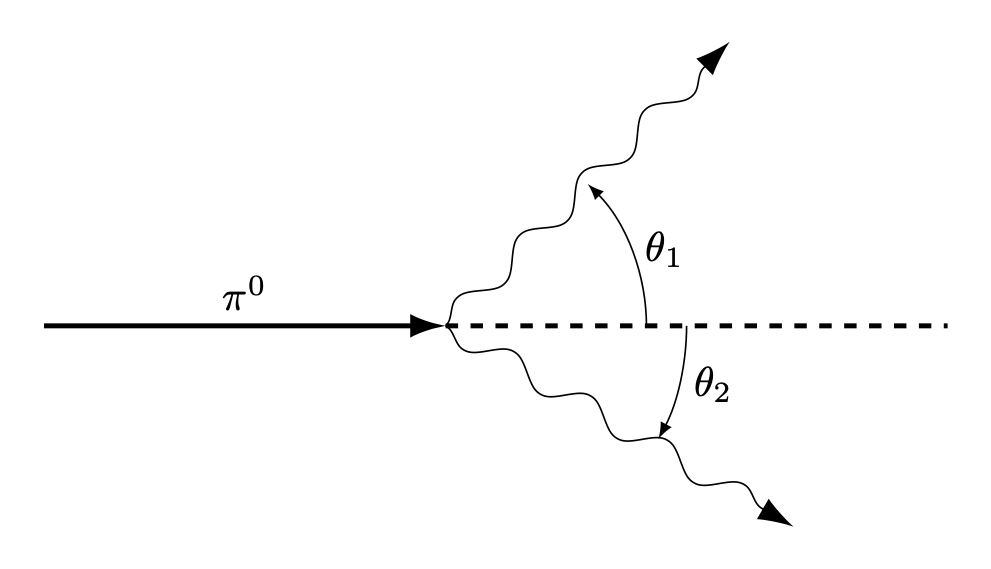

 

## 1. Atoms in Motion {#sec-FLPEXR_1_1}

*파인만 물리학 강의 1 권 1장 ~ 3장에 해당한다.*

**1.1** 열이 단지 분자의 운동이라면 뜨거운 멈춘 공과 차가운 빠른 공의 차이는 무엇인가?

::: {.solution}

공의 질량 중심은 멈춰 있지만 각 분자들은 빠르게 움직일 수 있으며, 공의 질량 중심은 빨리 움직이지만 공의 각 분자들은 천천히 움직일 수 있다.

:::

**1.2** 모든 물체의 원자들이 끊임없이 움직인다면 화석 자국과 같은 영구적인 물체는 어떻게 가능한가?

::: {.solution}

:::

**1.3** 움직이는 기계의 마찰이 왜 그리고 어떻게 열을 만들어 내는지 정성적으로 설명하라. 또한 이 과정을 정반대로 했을 때 열이 유용한 움직임을 만들어 낼 수 없는지 정성적으로 설명해보라.

::: {.solution}

:::

**1.4** 화학자들은 고무 분자들이 길고 서로 교차하는 원자들의 사슬로 이루어졌다는 것을 발견했다. 고무를 늘리면 고무줄의 온도가 올라가는 이유를 설명하라.

::: {.solution}

:::

**1.5** 무게를 지탱하고 있는 고무줄에 열을 가하면 무슨 일이 벌어질지 설명하라.

::: {.solution}

:::

**1.6** 정 오각형 모양을 가진 결정이 없는 이유를 설명하라.

::: {.solution}

:::

**1.7** 지름이 $d$ 인 쇠공을 매우 많이 가지고 있다고 하자. 그리고 부피 $V$ 인 상자를 생각하자. 상자의 모든 치수는 $d$ 보다 매우 크다. 상자가 담을수 있는 가장 많은 공의 수는 얼마인가? 

::: {.solution}

:::

**1.8** 기체의 압력 $P$ 는 기체 원자의 개수 밀도 $n$, 원자의 평균 속력 $\langle v\rangle$ 에 대해 어떻게 변하는가? ($P$ 는 $n$ 혹은 $\langle v\rangle$ 에 비례해야 하는가? 아니면 더 크게 혹은 더 작게 변해야 하는가?)

::: {.solution}
이상기체의 경우 $P= nk_B T$ 이고 $\langle v\rangle \propto T$ 임을 안다. 

:::

**1.9** 일반적인 기체의 부피는 0.001 $\text{g/cm}^{3}$ 이며 액체 공기의 부피는 1.0 $\text{g/cm}^{3}$ 이다.

($a$) 일반적인 공기의 개수 밀도 $n_G$ 와 액체 공기의 개수 밀도 $n_L$ 을 구하라.

($b$) 공기 분자의 질량 $m$ 을 구하라.

($c$) 상온($20\,^\circ \text{C}$) 상압(1 atm) 에서 공기 분자가 충돌 사이에 진행하는 거리 $l$ 을 구하라. 이를 **평균 자유 거리(mean free path)** 라고 한다.

($d$) 보통의 대기에서 평균자유거리가 1 m 가 되기 위한 압력은 얼마인가?

::: {.solution}
$\,$($a$) 
 

:::

 

## 12. Relativisitic Kinematics and Dynamics. Mass and Rest Energy Equivalence{#sec-FLPEXR_1_12}

*파인만 물리학 강의 1 권 15장, 16장에 해당한다.*

**12.1** 상대속도가 $x$ 방향의 $V$ 인 두 관성기준틀에 대해 $x,\,y,\,\,z,\,t$ 를 $x',\,y',\,z',\,t'$ 으로 기술하라.

::: {.solution}

@eq-FLP_1_15_3 에서 $u=V$ 이다. 우선 $y=y',\,z=z'$ 임을 안다. $x,\,y$ 에 대해 풀면 다음을 얻는다.

$$
x=\dfrac{x'+ Vt'}{\sqrt{1-V^2/c^2}},\quad y=y',\quad z=z',\quad  t= \dfrac{t'+Vx'/c^2}{\sqrt{1-V^2/c^2}}
$$

:::

 

**12.2** 연습문제 **12.1** 에서 얻은 변환식을 미분형태로 쓰고 $dx/dt=v_x$ 를 $v_x',\,V$ 를 이용하여 구하라. $dy/dt$ 도 같이 하라.

::: {.solution}

여기서 $\gamma = 1/\sqrt{1-V^2/c^2}$ 은 상수이다.
$$
\begin{aligned}
dx = \gamma dx' + \gamma V dt',\quad dy = dy',\quad dz = dz',\quad dt = \gamma dt' + (V\gamma/c^2) dx'
\end{aligned}
$$

이므로

$$
\begin{aligned}
\dfrac{dx}{dt} &= \dfrac{dx'+Vdt'}{dt' + (V/c^2) dx'} = \dfrac{v'_x + V}{1+ Vv'_x/c^2}, \\[0.3em]
\dfrac{dy}{dt} &= \dfrac{dy'}{\gamma(dt' +(V/c^2) dx')} = \dfrac{v'_y}{\gamma(1+Vv_x/c^2)}.
\end{aligned}
$$

:::

 

**12.3** 입자가 $S$ 기준틀에서 $x$ 축으로 $v_x$ 의 속도와 $a_x$ 의 가속도로 움직인다고 하자. $S$ 기준틀에 대해 $x$ 방향으로 $V$ 의 속도로 움직이는, 그리고 좌표축이 평행한 $S'$ 에서의 속도와 가속도를 구하라.

::: {.solution}

$\gamma = 1/\sqrt{1-V^2/c^2}$ 에 대해 

$$
dx' = \gamma (dx-Vdt),\quad dy' = dy,\quad dz'=dz,\quad dt' = \gamma (dt- Vdx/c^2)
$$

이며, **12.2** 로부터 $v'_x = (v_x-V)/(1-Vv'_x/c^2)$ 이다. 
$$
\begin{aligned}
a'_x &= \dfrac{dv'_x}{dt'} = \dfrac{d}{dt'}\left( \dfrac{v_x-V}{1 - Vv'_x/c^2}\right) \\[0.3em]
&= \dfrac{dv_x/dt'}{1- Vv'_x /c^2} + \dfrac{v_x-V}{(1 - Vv'_x/c^2)^2}\dfrac{V}{c^2} \dfrac{dv_x}{dt'} \\[0.3em]
&=\dfrac{1-V^2/c^2}{(1-Vv'_x/c^2)^2}\dfrac{dv_x}{dt'}
\end{aligned}
$$

여기서

$$
\dfrac{dv_x}{dt'}= \dfrac{dt}{dt'}\dfrac{dv_x}{dt} = \dfrac{1}{(dt'/dt)^{-1}}a_x = \dfrac{a_x}{\gamma (1-Vv_x/c^2)}
$$

이므로

$$
a'_x = \dfrac{a_x}{\gamma^3 (1-Vv_x/c^2)^3}
$$

이다. 

$$
\begin{aligned}
a'_y &= \dfrac{dv'_y}{dt'} = \dfrac{d}{dt'}\left(\dfrac{v_y}{\gamma(1-Vv'_x/c^2)}\right) = \dfrac{dv_y/dt'}{\gamma(1-Vv'_x/c^2)} + \dfrac{v_y}{\gamma(1-Vv'_x)^2} \dfrac{V}{c^2}\dfrac{dv_x}{dt'}
\end{aligned}
$$

여기서

$$
\dfrac{dv_y}{dt'}= \dfrac{dt}{dt'}\dfrac{dv_y}{dt} = \dfrac{a_y}{\gamma (1-Vv_x/c^2)}
$$

이므로

$$
a'_y = \dfrac{a_y}{\gamma^2 (1-Vv_x/c^2)^2} + \dfrac{V v_y a_x/c^2}{\gamma^2 (1-Vv_x/c^2)^3}
$$

이며, 같은 방법으로 $a'_z$ 를 아래와 같이 구할 수 있다.

$$
a'_z = \dfrac{a_z}{\gamma^2 (1-Vv_x/c^2)^2} + \dfrac{V v_z a_x/c^2}{\gamma^2 (1-Vv_x/c^2)^3}
$$

:::

 

**12.4** 길이 $L=5\,\text{m}$ 인 막대기가 관성기준틀 $S$ 에 정지해 있다. 이 막대기는 $x$ 축과 $\theta = 30^\circ$ 만큼 기울어져 있다. $S'$ 기준틀이 $x$ 방향으로 $v_x=c/2$ 의 속도로 평행하게 움직일 때 $S'$ 에서 본 막대기의 길이와 기울기를 구하라. 

::: {.solution}

$L_x = 5 \cos \theta$, $L_y = 5 \sin \theta$ 이며 $v_x=c/2$ 에 대해  $L'_x = \sqrt{3}L_x/2$, $L'_y = L_y$ 이므로 $L'=\sqrt{{L'_x}^2+{L_y}^2}=4.51\,\text{m}$ 이고 
$$
\theta' = \arctan\left(\dfrac{L'_y}{L'_x}\right) = 39.69^\circ
$$

이다.

:::

 

**12.5** 뮤온은 대기의 높은 곳에서 형성되어 속도 $v=0.990c$ 로 붕괴되 기 전까지 5.0 km 을 이동한다.

($a$) 우리 관점에서 뮤온의 생존 시간 $\Delta t$ 는 얼마인가? 뮤온의 기준틀에서의 생존 시간 $\Delta t'$ 은 얼마인가?

($b$) 뮤온의 기준틀에서 뮤온이 이동하는 대기의 두께 $L'$ 은 얼마인가?

::: {.solution}

($a$) $\Delta t = 1.68\times 10^{-5}\text{ sec}$, $\Delta t'= \sqrt{1-0.99^2}\Delta t = 2.38\times 10^{-5}\text{ sec}$

($b$) $L'=\sqrt{1-0.99^2}L=7.05\,\text{km}$.

:::

 

**12.6** 전자의 정지 에너지 $m_ec^2=0.511 \text{MeV}$ 임을 보여라.

::: {.solution}

$m_e = 9.109 \times 10^{-31}\,\text{kg}$ 이므로 $m_ec^2 = 0.511\, \text{MeV}$

:::

 

**12.7** 질량 $m$ 인 입자의 위치가 시간에 대해

$$
x=\sqrt{b^2+c^2t^2}-b
$$

이다. 이 운동을 위해 가해져야 하는 힘 $F$ 는?

::: {.solution}

$$
v= \dfrac{dx}{dt}= \dfrac{c^2t}{\sqrt{b^2+c^2t^2}},\qquad p = \dfrac{mv}{\sqrt{1-c^2}}
$$

이며

$$
p= \dfrac{mv}{\sqrt{1-v^2/c^2}}
$$

에 대해

$$
F = \dfrac{dp}{dt} = \dfrac{dv}{dt}\dfrac{m}{(1-v^2/c^2)^{3/2}}
$$

이다. 

$$
\dfrac{dv}{dt}= \dfrac{b^2c^2}{(b^2+c^2t^2)^{3/2}}
$$

이며

$$
1-\dfrac{v^2}{c^2} = 1- \dfrac{c^2t^2}{b^2+c^2t^2} = \dfrac{b^2}{b^2+c^2t^2}
$$

이므로

$$
F= mc^2/b
$$

이다.
:::

 

**12.8** 미국에서 1965년도에 생산된 총 전기 에너지는 $1.05 \times 10^{12} \, \text{kWh}$ 이다.

($a$) 이 과정에서 얼마나 많은 질량이 에너지로 변환되었나?

($b$) 이 에너지 변환이 중수소 ($\text{D}_2$) 가 핼륨으로 변환되는 과정을 통해 얻어진다면, 필요한 중수소를 공급하기 위해 얼마나 많은 부피의 중수가 초당 필요한가?

여기서 $M_{\text{H}^2} = 2.0147\,\text{u}$, $M_{\text{He}^4} = 4.0039\,\text{u}$ 이다.

::: {.solution}

($a$) $1 \text{ kWh} = 3600 \text{ J}$ 이므로 에너지 $3.78\times 10^{18}\,\text{J}$ 에 해당하며 이에 필요한 질량은 $42.058\,\text{kg}$ 이다.

($b$) 1년에 $3.78\times 10^{18}\,\text{J}$ 을 생산하면 초당 $1.20\times 10^{11}\,\text{J}$ 을 생산해야 하며 이는 $1.334 \times 10^{-6}\,\text{kg}$ 에 해당하는 질량이다.  

$1\,\text{u}=1.6605 \times 10^{-27}\,\text{kg}$ 이다. 2개의 중수소가 1개의 헬륨이 되는 변환에서의 질량 차이 $\Delta M=0.0255 \,\text{u} = 4.234 \times 10^{-29}\,\text{kg}$ 이다. 

따라서 필요한 중수소의 개수는 초당 $6.301\times 10^{22}$ 이며 이는 중수($\text{D}_2\text{O}$) 0.052 몰에 해당한다. 이는 중수 $1 \text{cm}^3$ 에 해당한다. 그런데 해답지에는 $2\text{cm}^3$ 인데 아마 반중수 (DHO) 를 생각해서였을까? 

:::

## 13. 상대론적 에너지와 운동량 {#sec-FLPEXR_1_13}

*파인만 물리학 강의 1 권 16장, 17장에 해당한다.*

 

**13.1** $1\,\text{GeV}$ 전자의 속도 $v$ 는 $c$ 와 $c-v = c/(8 \times 10^6)$ 정도임을 보여라.

::: {.solution}

$m_ec^2=0.511\,\text{MeV}$ 이므로 $v = 0.99999987c$ 이며 $(c-v)/c = 1/(7.66\times 10^6)$ 정도이다.

:::

 

**13.2** ($a$) 입자의 운동량 $p$ 를 운동에너지 $T$ 와 정지 에너지 $mc^2$ 로 표현하라.

($b$) 운동에너지와 정지에너지가 같을 때의 입자의 속도는 얼마인가?

::: {.solution}

($a$) 상대론적 운동에너지 $T= \gamma mc^2 - mc^2$ 이므로 

$$
\gamma = \dfrac{T+mc^2}{mc^2} = \dfrac{1}{\sqrt{1-v^2/c^2}} \tag{1}
$$ 

이다. 이로부터

$$
v = \dfrac{\sqrt{T^2 + 2mc^2T}}{T+mc^2} c
$$

이며

$$
p = \gamma mv = \dfrac{T+mc^2}{mc^2} \cdot m\cdot \dfrac{\sqrt{T^2 + 2mc^2T}}{T+mc^2} c = \dfrac{\sqrt{T^2 + 2mc^2T}}{c}.
$$

($b$) ($1$) 로부터 운동에너지와 정지에너지가 같으면 $\gamma = 2$ 이므로 $v=\sqrt{3}c/2$.

:::

 

**13.3** 양성자 질량 $m_p = 938 \, \text{MeV}$ 이다. 우주방사선의 양성자는 대략 $10^{10}\,\text{GeV}$ 정도의 에너지를 갖는 것으로 간접적으로 관측되었다. 이 에너지의 양성자가 105 광년 정도의 지름을 갖는 은하를 거쳤다고 할 때 양성자의 기준틀에서 $\Delta t$ 는 어느정도인가?

::: {.solution}

$\gamma = 10^{10}/0.938 \approx 1.0661\times 10^{10}$ 이며 속도는 거의 광속이므로 지구좌표계에서 5년이라고 간주할 수 있다. 

$$
10^5\text{ year}/\gamma \approx 296\,\text{sec}
$$

:::

 

**13.4** 전하 $q$, 운동량 $p$ 인 입자가 자기장 $B$ 에서 반지름 $R$ 인 원운동을 한다. 원운동 경로는 자기장에 직각 방향이다.

($a$) 전자 전하 $q_e$ 에 대해 $q=Zq_e$ 이며 $p$ 는 $\text{MeV}/c$ 단위로 측정되었고 $B$ 는 가우스 단위일 때 $p,\,B,\,R$ 의 관계는?

($b$) 운동에너지가 $60\, \text{GeV}$ 이고 자기장 $B=0.3 \, \text{gauss}$ 일 때 양성자의 곡률 반경은 얼마인가?

::: {.solution}

:::

 

**13.5** 

::: {.solution}

:::

 

**13.6** 실험실에 정지해 있던 질량 $M$ 인 물체가 각각 질량 $m_1,\,m_2$ 인 두 부분으로 붕괴되었다. 각 부분의 상대론적 에너지 $T_1,\,T_2$ 는 무엇인가?

::: {.solution}

붕괴된 후 각각의 운동량과 에너지를 $p_1,\,p_2$, $E_1,\,E_2$ 라고 하자. 운동량 보존에 의해 $p_1 = -p_2$ 이며, 에너지 보존에 의해

$$
Mc^2 = E_1 + E_2 = \sqrt{p_1^2c^2 + m_1^2c^4} + \sqrt{p_2^2c^2 + m_2^2c^4} 
$$

이다. $p=p_1 = -p_2$ 라고 놓으면

$$
(Mc^2-E_1)^2 = {E_2}^2 = p^2c^2+m_2^2 c^4 \tag{1}
$$ 

이며 

$$
(Mc^2-E_1)^2 = M^2c^4 - 2Mc^2E_1 + p^2c^2 + m_1^2c^4 \tag{2}
$$

이므로 ($1$), ($2$) 를 연립하여 풀면

$$
E_1 = \dfrac{(M^2 + m_1^2 - m_2^2)c^2}{2M} \tag{3}
$$

이다. 같은 방법으로

$$
E_2 = \dfrac{(M^2 + m_2^2 - m_1^2)c^2}{2M} \tag{4}
$$

임을 보일 수 있다. 따라서,

$$
\begin{aligned}
T_1 &= E_1 - m_1c^2 = \dfrac{((M-m_1)^2- m_2^2)c^2}{2M} \\[0.3em]
T_2 &= E_2 - m_2c^2 = \dfrac{((M-m_2)^2- m_1^2)c^2}{2M} 
\end{aligned} \tag{5}
$$

:::

 

**13.7** 정지해 있는 파이온 ($m_\pi = 273\, m_e$) 이 뮤온 ($m_\mu = 207\, m_e$) 와 중성미자 ($m_\nu = 0$) 으로 붕괴되었다. 뮤온의 운동에너지와 운동량 ($T_\mu,\, p_\mu)$ 와 중성미자의 운동에너지와 운동량 ($T_\nu,\, p_\nu$) 를 $\text{MeV}$ 단위로 구하라.

::: {.solution}

**13.6** 의 해답의 식 ($5$) 로 부터

$$
T_\mu = \dfrac{66^2m_e^2 c^2}{546 m_e} =4.08 \, \text{MeV},\quad T_\nu = 29.65 \,\text{MeV}.
$$

또한 **13.2** 의 해답에서 $p=\sqrt{T^2+2mc^2T}/c$ 임을 보였다. 이를 이용하면
$$
p_\nu = T/c = 29.65 \, \text{MeV}/c
$$

이며 운동량 보존에 의해 $p_\mu = p_\nu$ 이다.

:::

 

**13.8** 질량 $m$ 인 들뜬 원자가 주어진 좌표계에서 정지해 있다. 이 원자가 광자를 방출하고 $\Delta E$ 만큼의 에너지를 잃었다. 원자의 recoil 을 고려하여 광자의 에너지 $E_\gamma$ 를 구하라.

::: {.solution}

빛을 방출 한 후 원자의 정지질량 $M= m - \Delta E/c^2$ 이다. 방출 전 원자의 총 에너지 $E_0 = mc^2$ 이고 운동량 $p_0 = 0$ 이다. 광자의 에너지 $E_\gamma$ 에 대해 광자의 운동량 $p_\gamma = E_\gamma/c$ 이다. 운동량 보존에 의해 빛을 방출 한 뒤의 원자의 운동량 $p_1=-p_\gamma$ 이다. 밫을 방출 한 후 원자의 총 에너지 $E_1$ 은

$$
E_1 = \sqrt{p^2c^2+M^2c^4} = \sqrt{E_\gamma^2 + M^2c^4}
$$

이다. 또한 에너지 보존에 의해

$$
mc^2 = E_1+E_\gamma = E_\gamma +  \sqrt{E_\gamma^2 + M^2c^4}
$$

이로부터, 그리고 $M= m - \Delta E/c^2$ 를 대입하면

$$
\begin{aligned}
E_\gamma &= \dfrac{(m^2-M^2)c^2}{2m} = \Delta E - \dfrac{(\Delta E)^2}{2mc^2}
\end{aligned}
$$

이다. 

:::

 

**13.9** 질량 $m$ 인 입자가 $v=4c/5$ 의 속도로 움직이다가 정지한 비슷한 입자와 비탄성적으로 충돌하였다.

($a$) 합쳐진 입자의 속도 $V$ 를 구하라.

($b$) 합쳐진 입자의 질량 $M$ 을 구하라.

::: {.solution}

($a$) $v=4c/5$ 인 경우 $\gamma = 5/3$ 이다. 합쳐진 입자의 속도 $V$ 에 대해 $\gamma_V = 1/\sqrt{1-V^2/c^2}$  이라고 하자. 운동량 보존에 의해

$$
\gamma mv = \dfrac{4mc}{3}=\gamma_V MV   \tag{1}
$$

이며 에너지 보존에 의해

$$
\gamma mc^2 +mc^2 = \dfrac{8}{3}mc^2=\gamma_V Mc^2 \tag{2}
$$

이다. ($1$), ($2$) 를 나누면 $V=c/2$ 임을 안다.

($b$) $\gamma_V = 2/\sqrt{3}$ 이므로 $M=4\sqrt{3}m/3$ 이다. 

:::

 

**13.10** 버클리의 베타트론은 양성자를 높은 에너지로 가속시켜 아래 반응과 같이 양성자-반양성자 쌍을 만들기 위해 설계되었다.

$$
p + p \to p+p+(p+\overline{p}).
$$

이 반응의 문턱에너지는 위 반응식의 오른쪽 항의 네 입자가 질량 $M=4m_p$ 인 하나의 입자처럼 움직이는 경우에 해당한다. 타겟 양성자가 충돌 전에 정지해 있을 때 이 문턱 상태에 도달하려면 입사하는 양성자의 운동에너지 $T$ 는 얼마여야 하는가?

::: {.solution}

에너지 보존에 의해 

$$
2m_pc^2 + T = \gamma Mc^2 \tag{1}.
$$

운동량 보존에 의해

$$
\dfrac{\sqrt{T^2+2m_pc^2 T}}{c} = \gamma MV \tag{2}
$$

이로부터 $V$ 와 $\gamma$ 를 구하면

$$
V=\dfrac{c\sqrt{T}}{\sqrt{T+2m_pc^2}},\qquad \gamma = \dfrac{\sqrt{T+2m_pc^2}}{\sqrt{2m_pc^2}}. \tag{3}
$$

위의 $\gamma$ 를 ($1$) 에 대입하면

$$
2m_p c^2+T = \dfrac{\sqrt{T+2m_p c^2} 4m_p c^2}{\sqrt{2m_pc^2}}
$$

이며 이로부터

$$
T=6m_pc^2 = 5.63\,\text{GeV}
$$

를 얻는다.

:::

 

**13.11** 전자-전자 충돌로부터 양성자-반양성자를 생산하는 아래와 같은 반응에서의 문턱 운동 에너지 $T_e$ 를 구하라.

$$
e^-+e^- \to e^- + e^- + p^- + p^+.
$$

여기서 $m_e \approx 0.5\, \text{MeV}$, $m_p \approx 1\, \text{GeV}$ 를 사용하고 **13.10** 의 문턱에너지와 비교하라.

::: {.solution}

$M=2m_e+ 2m_p$ 라고 놓자. 에너지 보존에 의해

$$
2m_e c^2 + T_e = \gamma Mc^2. \tag{1}
$$

운동량 보존에 의해

$$
\dfrac{\sqrt{T_e^2+ 2m_ec^2 T_e}}{c} = \gamma MV. \tag{2}
$$

이로부터 $V$ 와 $\gamma$ 를 구하면

$$
V= \dfrac{c\sqrt{T_e}}{\sqrt{T_e + 2m_ec^2}},\qquad \gamma = \dfrac{\sqrt{T_e + 2m_ec^2}}{\sqrt{2m_e c^2}} \tag{3}.
$$

$\gamma$ 를 ($1$) 에 대입하면

$$
T_e = \dfrac{(M^2-4m_e^2)c^2}{2m_e} = \dfrac{(4m_p^2+ 8m_em_p)c^2}{2m_e} \approx 4004 \, \text{GeV}.
$$

:::

 

**13.12** 양성자-반양성자 쌍은 정지한 양성자가 광자를 흡수하는 아래 과정에 의해서도 생성된다.

$$
\gamma + p \to p + (p+\overline{p}).
$$

광자가 가져야 하는 최소한의 에너지 $E_\gamma$ 는 얼마인가? $E_\gamma$ 를 양성자 에너지 $m_pc^2$ 으로 나타내고 $p-p$ 충돌이나 $e-e$ 충돌에 의한 에너지와 비교하라.

::: {.solution}

에너지 보존에 의해

$$
E_\gamma + m_pc^2  = \gamma_\gamma (3m_p)c^2. \tag{1}
$$

주어진 식의 우변의 세 입자가 같은 속도 $V$ 로 움직인다고 하자. 운동량 보존에 의해

$$
p_\gamma = \gamma_\gamma (3m_p)V. \tag{2}
$$

$E_\gamma = p_\gamma c$ 이며 위 두 식을 나누면

$$
\dfrac{V}{c} = \dfrac{p_\gamma}{p_\gamma + m_p c}
$$

이므로

$$
\gamma_\gamma = \dfrac{p_\gamma + m_p c}{\sqrt{(m_pc)^2 + 2p_\gamma m_pc}}
$$

이다. 이 $\gamma_\gamma$ 를 ($1$) 에 대입하면

$$
p_\gamma = 4 m_p c
$$

이므로

$$
E_\gamma = p_\gamma c = 4m_p c^2 = 3.752 \,\text{GeV}.
$$

:::

 

**13.13** 질량 $m_p$ 인 양성자가 정지해 있는 양성자와 전면충돌을 하면 아래와 같은 과정을 통해 $\pi$-메존 을 생성한다. 

$$
p+p \to p+p+\pi.
$$

$\pi$-메존의 질량 $m_\pi$ 는 $m_p$ 에 비해 매우 작다.

($a$) 입사 양성자의 문턱 에너지 $T_p$ 를 구하라.

($b$) 문턱 상태에서 메존의 운동에너지 $T_\pi$ 는 얼마인가?

($c$) 비 상대론적으로 계산했을 때와의 오차에 대해 근사하라.

::: {.solution}

($a$) 충돌 후 우변의 세 입자의 속도를 $V$ 라고 하고 $\gamma = 1/\sqrt{1-V^2/c^2}$ 라고 하자. 에너지 보존에 의해

$$
T_p + 2m_pc^2 = \gamma (2m_p + m_\pi)c^2. \tag{1}
$$

운동량 보존에 의해

$$
\dfrac{\sqrt{T_p^2+2m_pc^2 T_p}}{c} = \gamma (2m_p + m_\pi)V. \tag{2}
$$

이다. 이로부터 

$$
V=\dfrac{c\sqrt{T_p}}{\sqrt{T_p + 2m_p c^2}},\qquad \gamma = \dfrac{\sqrt{T_p + 2m_pc^2}}{\sqrt{2m_pc^2}}
$$

이다. ($1$) 에 대입하면

$$
T_p = 2m_\pi c^2 + \dfrac{m_\pi^2c^2}{2m_p} \approx 279\,\text{MeV}
$$

($b$) $T_\pi = \gamma m_\pi c^2 - m_\pi c^2  \approx 101 \, \text{MeV}$

($c$) 
:::

 

**13.14** $\pi^0$-메존은 두 $\gamma$ 선으로 붕괴된다. 이 때 메존은 정지해 있을 수도 있고 움직이고 있을 수도 있다. $\pi^0 \to \gamma+\gamma$.

{#fig-FLPEXR_1_13_1 width=400}

($a$) 붕괴되는 $\pi^0$ 가 속도 $\bf{v}$ 와 질량 $m_\pi$ 를 가지며 방출되는 $\gamma$ 선이 원래 방향에 대해 $\theta$ 의 각으로 방출될 때, $\gamma$ 선의 에너지를 $m_\pi,\, v,\,\theta$ 로 표현하라.

($b$) $\gamma$ 선이 가질 수 있는 최대 에너지 $E_\text{max}$ 와 최소 에너지 $E_\text{min}$ 는 무엇인가? 이 에너지에 대해 방출 각은 무엇인가?

($c$) $\pi^0$ 의 속도에 독립적인 $E_\text{max}$ 와 $E_\text{min}$ 의 관계가 존재하는가? 그리고 그 물리적 의미는 무엇인가?

::: {.solution}

그림에서 $\theta=\theta_1$ 으로 놓자. $\gamma = 1/\sqrt{1-v^2/c^2}$ 이라고 하고 $\theta_1$ 으로 방출되는 광자의 운동량과 에너지를 $p_1,\,E_1$, $\theta_2$ 로 방출되는 광자의 운동량과 에너지를 $p_2,\,E_2$ 라고 하자. $E_1=p_1c,\, E_2=p_2c$ 의 관계를 갖는다. 

($a$) 에너지 보존에 의해

$$
\gamma m_\pi c^2 = p_1c + p_2 c. \tag{1}
$$

$\pi^0$ 의 운동방향과 그 직각방향에 대한 운동량 보존에 의해

$$
\begin{aligned}
\gamma m_\pi v &= p_1 \cos \theta_1 + p_2 \cos \theta_2, \\[0.3em]
0 &= p_1 \sin \theta_1 + p_2 \sin \theta_2. 
\end{aligned} \tag{2}
$$

위 식에서 $p_2$ 를 먼저 계산하면

$$
\begin{aligned}
p_2^2  &= (\gamma m_\pi v- p_1 \cos \theta_1)^2 + p_1^2 \sin \theta_1^2 \\[0.3em]
&= \gamma^2 m_\pi^2 v^2 - 2\gamma m_\pi v p_1 \cos\theta_1 + p_1^2
\end{aligned}
$$

이며 이 식을 ($1$) 에 대입하면 

$$
(\gamma m_\pi c^2 - p_1 c) = p_2 c = \sqrt{\gamma^2 m_\pi^2 v^2 - 2\gamma m_\pi v p_1 \cos\theta_1 + p_1^2}c
$$

이다. 왼쪽과 오른쪽을 제곱하여 정리하면 $p_1$ 을 얻고 $E_1=p_1c$ 이므로 

$$
E_1=p_1c = \dfrac{\gamma c^2 m_\pi }{2(1-v\cos\theta_1/c)}.
$$

($2$) $E_1$ 이 가질 수 있는 최대 에너지와 최소 에너지는 $\cos\theta_1$ 의 값에 의해 결정된다.

$$
E_\text{max} = \dfrac{\gamma c^2m_\pi}{2(1-v/c)},\qquad E_\text{min} = \dfrac{\gamma c^2 m_\pi}{2(1+v/c)}.
$$

($3$) 
:::