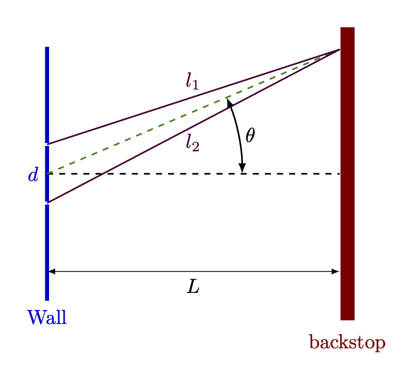
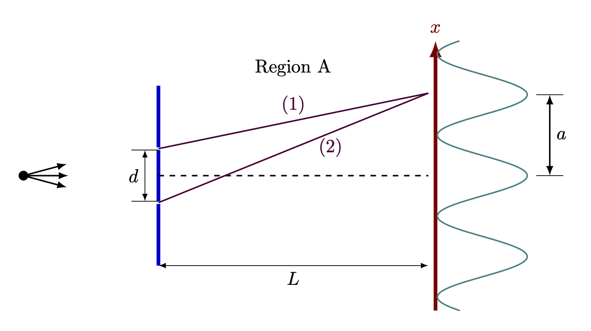
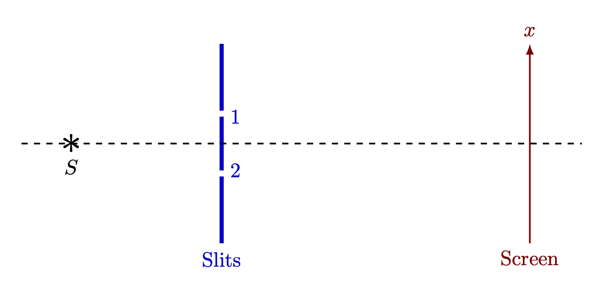
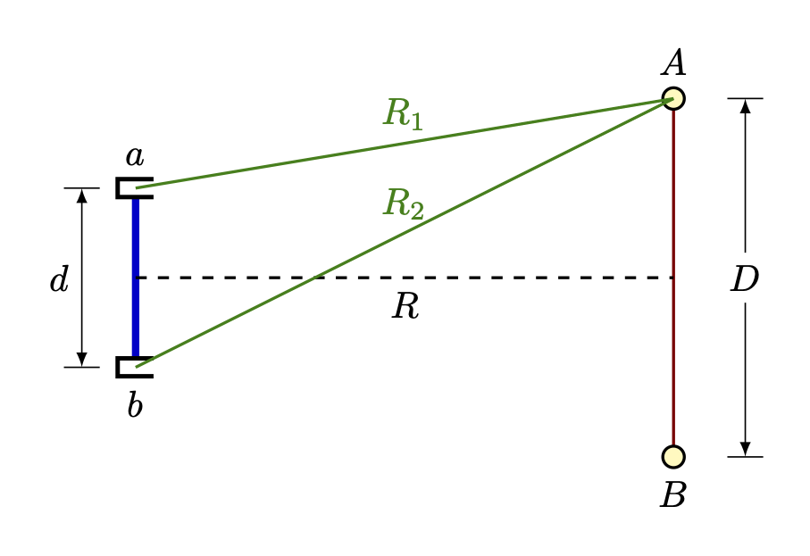

 

## 70. Probability Amplitude {#sec-FLPEXR_3_1}

*파인만 물리학 강의 3 권 3장 ~  장에 해당한다.*

**70.1** [III.3 확률 진폭](../vol3/vol3_1.qmd#sec-FLP_3_3) 에 묘사된 가상의 전자 간섭 실험을 생각하자. @fig-FLPEXR_70_1 의 간섭 패턴 $P_{12}$ 로부터 파장 $\lambda$ 를 평가 할 수 있으며 $\lambda$ 는 진폭 함수 $\phi_1$, $\phi_2$ 와 관계된다. 슬릿 중앙 사이의 거리는 $d$ 이고 벽(wall) 과 백스탑(Backstop) 사이의 거리는 $L$ 이다. $x$ 를 백스탑 중심으로 부터 첫번째 극소값 까지의 거리라고 하고 하자.

($a$) $L \gg d$ 일 때 $\lambda$ 는 무엇인가?

($b$) $P_1$ 과 $P_2$ 로 주어진 곡선을 생각할 때 $P_{12}$ 의 중심과 첫번째 극소값에서의 값은 무엇인가?

{#fig-FLPEXR_70_1 width=500}

::: {.solution}

아래 그림과 같이 변수를 잡는다.

{#fig-FLPEXR_70_1_1 width=300}

($a$) $l_2-l_1=\lambda/2$ 일 때 첫번째 극소값이다. $|t|\ll 1$ 일 때 $\sqrt{1\pm t}\approx 1 \pm t/2$ 임을 이용한다.

$$
\begin{aligned}
\lambda &= 2(l_2-l_1) = 2\sqrt{L^2 + \left(x+\dfrac{d}{2 }\right)^2 } - \sqrt{L^2 + \left(x-\dfrac{d}{2}\right) } \\[0.3em]
&\approx 2\dfrac{L}{2}\left[\dfrac{2 dx}{L^2}\right] =  \dfrac{2dx}{L}
\end{aligned}
$$

($b$) $P_1 = |\phi_1|^2$ $|P_2 = |\phi_2|^2$ 일 때 $P_{12} = |\phi_1+\phi_2|^2$ 이다. 중심, 즉 $x=0$ 에서는 $\phi_1$ 과 $\phi_2$ 의 위상이 같으므로 

$$
P_{12}(x=0)= |e^{i\delta}(|\phi_1(x=0)| + |\phi_2(x=0)|)|^2 = ||\phi_1(x=0)|+|\phi_2(x=0)||^2.
$$

이고 첫번쩨 최소값인 $x$ 값을 $x_1$ 이라고 하면 위상이 $-1$ 만큼 차이나므로

$$
P_{12}(x=x_1) = ||\phi_1(x=x_1)|- |\phi_2(x=x_1)||^2
$$

이다.

:::

 

**70.2** **70.1** 의 이중슬릿 문제를 다시 생각하고 전자총과 벽까지의 거리와 벽부터 백스탐까지의 거리가 슬릿 사이의 거리 $d$ 보다 아주 크다고 하자. 또한 슬릿의 폭은 슬릿 사이의 거리보다 아주 작다고 하자. 다음 문제에 대해 가능한 한 정량적으로 답하라.

($a$) 총이 위로 $D$ 만큼 움직인다면 $P_12$ 의 간섭 패턴에는 어떤 일이 발생할까?

($b$) 슬릿 사이의 거리가 두배가 되면 패턴은 어떻게 되나?

($c$) 하나의 슬릿의 두께가 다른 슬릿의 두배가 된다면 어떠헥 될까?

::: {.solution}

($a$) 총이 위로 $D$ 만큼 움직이면 $P_1$ 과 $P_2$ 의 중심이 모두 아래쪽으로 움직일 것이고 간섭 패턴 역시 아래쪽으로 움직일 것이다. 

($b$) **70.1** ($a$) 의 결과에 따라 첫번째 최소값을 갖는 위치가 $x=\lambda L/(2d)$ 이므로 위치가 반이 된다. 

($c$) $P_{12} = |2\phi_1 (x) + \phi_2(x)|^2$

:::

 

**70.3** 수직으로 편광된 단색광이 편광 투과축 각도(Polarization Transmitting Angle)가 $\theta$ 만큼 기울어져 있는 폴라로이드에 입사되고 있다. 고전적으로 입사 강도에 대한 투과 강도의 비율은 얼마인가? 단일 입사 광자에 대해 폴라로이드는 어떤 일을 하는가?

::: {.solution}

고전적로 $I_\text{transmitted}= I_\text{incident} \cdot \cos ^2 \theta$ 이다. 단일 광자에 대해서는 광자가 폴라로이드와 만날 때 $\cos^2\theta$ 의 확률로 투과하며 $1-\cos^2\theta$ 의 확률로 흡수된다.

:::

 

**70.4** 20,000 eV 전자빔이 다결정 금박을 통과하여 사진 건판(photographic plate) 를 때린다. 이 건판은 전자 축을 중심으로 동심원 형상으로 어두워진다. 왜인가? 금박과 건판의 거리가 10 cm 일 때 이 동심원의 지름을 구하라.

::: {.solution}

20,000 eV 전자의 파장 $\lambda = 8.67\times 10^{-12}\,\text{m}$ 이며 금은 FCC 구조로 격자상수 $a=4.07\times 10^{10}\,\text{m}$ 이다. FCC 구조이므로 첫번째 브래그 픽은 (111) 방향으로 나타나며 이 때의 면간 간격은 $d_{(111)}=2.35 \times 10^{-10}\,\text{m}$ 이다. $\lambda = 2d_{(111)}\sin\theta_{(111)}$ 로부터 $\theta_{(111)} = 0.01845 \,\text{rad}$ 이고 금박과 건판의 거리가 $10 \, \text{cm}$ 이므로 동심원의 지름은 $2\times 10\times \tan(\theta_{111})=0.370 \,\text{cm}$ 이다.

:::

 

**70.5** **70.1** 의 표준적인 이중 슬릿 실험을 생각하자. 슬릿에서의 전자의 진폭을 알면 스크린에서의 패턴을 예측할 수 있음을 보일 수 있다.

($a$) $a_1,\,a_2$ 를 각각 슬릿 1 과 2 에서의 진폭이라고 하자(복소수이다). 그렇다면 화면에서의 상대적인 강도 분포 $I(x)$ 는 무엇인가? 여기서 $x$ 는 화면 중심으로부터의 거리이다. 그리고 $x$ 와 두 슬릿 사이의 거리 $d$ 가 슬릭과 화면 사이의 거리 $L$ 보다 작다고 가정하고 근사하라.

($b$) 만약 패턴이 슬릿 $1$ 과 $2$ 에서의 진폭에만 의존한다면 어떻게 전자는 슬릿 뒤에서 패턴을 결정하기 위해 어떤 파장을 쓸 지 알게 되는가?

::: {.solution}

($a$) $P(x) = |\langle x|1\rangle \langle 1|s\rangle + \langle x|2\rangle \langle 2|x\rangle|^2= |a_1\langle x|1\rangle + a_2\langle x|2\rangle|^2$, where $a_1=\langle 1|s\rangle$, $a_2=\langle 2|s\rangle$ 

($b$) 

:::

 

**70.6** 아래 @fig-FLPEXR_70_2 과 같은 회절 실험을 생각하자. 입자발생기는 질량 $m$, 속도 $v$, 운동량 $p_0$ 인 입자를 방출한다.

{#fig-FLPEXR_70_2 width=400}

($a$) $L \gg d,\, L \gg a$ 일 때 중앙의 극대점과 인접한 극대점 사이의 거리 $a$ 를 구하라.

($b$) 어떤 영향으로 인해 경로 (1) 의 위상이 $\delta \phi_1$ 만큼 변하고 (2) 의 위상은 $\delta \phi_2$ 만큼 변했을 때 중앙의 극대점은 아래와 같이 주어지는 거리 $S$ 만큼 이동한다는 것을 보여라.

$$
S = + (\delta \phi_1-\delta \phi_2) \dfrac{L}{d}\dfrac{\hbar}{p_0}.
$$

따라서 간섭을 일으키는 모든 경로에서 $(\delta \phi_1-\delta \phi_2)$ 가 동일하다면 간섭 패턴이 $S$ 만큼 이동하며, 이로부터 우리는 입자의 경로가 위쪽으로 $S$ 만큼 회절했다고 말할 수 있다.

($c$) Region A 에서 입자는 수직 방향의 위치에만 의존하는 작은 포텐셜 을 가진다고 하자. 그렇다면 중심선에 대해 높이 $x$ 에서의 입자의 운동량 $p(x)$ 는 $p(0)$ 와 약간 달라진다. 이 때 다음을 보여라.

$$
p(x) = p(0) + \dfrac{m}{p(0)}(V(0)-V(x)).
$$

$V(x)$ 가 천천히 변하는 경우 $F=-\partial V/\partial x$ 에 대해

$$
p(x) = p(0)  + \dfrac{Fx}{v}
$$

가 됨을 보여라.

($d$) ($c$) 와 같은 상황에서 경로 (1) 과 경로 (2) 운동량은 다르며, 파장 역시 다르다. 

&emsp;($1$) 위와 아래 경로의 위상차이는 다음과 같음을 보여라.
  $$
    (\delta \phi_1 -\delta \phi_2) = \dfrac{d}{2v}\dfrac{F}{\hbar}L
  $$
&emsp;&emsp;두 경로에 대해 평균적인 수직방향 차이는 $d/2$ 이다.

&emsp;($2$) 간섭 패턴이 위로 $\frac{1}{2}(F/m)t^2$ 만큼 이동함을 보여라. 여기서 $t=L/v$ 이다.

::: {.solution}

($a$) @fig-FLPEXR_70_1_1 과 같이 정하면 $l_2-l_1=\lambda$ 일 때 두번째 극값이 정해진다. 이로부터 $\lambda = (l_2-l_1) \approx da/L$ 이므로 $a=L\lambda/d = Lh/p_0d$.

($b$) 
$$
\begin{aligned}
I(x) &= \left|e^{i\delta\phi_1}e^{ikl_1} + e^{i\delta\phi_2}e^{ikl_2}\right|^2 = \left|1+e^{i(\delta \phi_1- \delta\phi_2)} e^{ik(l_1-l_2)}\right|^2 \\[0.3em]
&= 4\cos^2 \left(\dfrac{(\delta \phi_1-\delta \phi_2) + k(l_1-l_2)}{2}\right)
\end{aligned}
$$ 

이며 중앙점의 이동은

$$
l_2 - l_1 = \dfrac{\delta \phi_1- \delta\phi_2}{k} = \dfrac{\hbar(\delta \phi_1- \delta\phi_2)}{p_0}
$$

에 의해 주어진다. 또한 $l_2-l_1 = dS/L$ 이므로(**70.1** ($a$) 의 풀이과정을 보라) 다음이 성립한다.

$$
S = (\delta \phi_1- \delta\phi_2) \dfrac{L}{d}\dfrac{\hbar}{p_0}.
$$

($c$) 에너지 보존 법칙에 의해 

$$
\dfrac{p(x)^2}{2m} + V(x) = \dfrac{p(0)^2}{2m} + V(0)
$$

이며 이로부터 $p_0=mv$ 를 이용하면

$$
\begin{aligned}
p(x) &= \sqrt{p(0)^2 + 2m(V(0)-V(x))} \approx p(0) + \dfrac{m}{p(0)}(V(0)-V(x)) \\[0.3em]
&\approx p(0) - \dfrac{m}{p(0)} \dfrac{\partial V}{\partial x} x = p(0) + \dfrac{Fx}{v}.
\end{aligned}
$$

이다.

($d-1$) $\delta \phi_1 = (\delta p)L/\hbar=(FL/\hbar v)\delta x_1$, $\delta \phi_2 = (FL/\hbar v) \delta x_2$ 이므로 

$$
\delta\phi_1 -\delta \phi-2 = \dfrac{FL}{\hbar v}(\delta x_1 - \delta x_2)\approx   \dfrac{FLd}{2\hbar v}.
$$

($d-2$) ($b$) 의 결과로부터

$$
S=(\delta \phi_1 -\delta \phi_2)\dfrac{L\hbar}{p_0 d} = \dfrac{F}{2m} \left(\dfrac{L}{v}\right)^2 = \dfrac{Ft^2}{2m} 
$$

:::

 

**70.7** 아래 @fig-FLPEXR_70_3 과 같이 전자발생기 $S$ , 슬릿 1, 2 그리고 스크린이 배치되어 있다. 전자는 스핀 $1/2$ 이며 전자가 슬릿에 도달할 때 스핀이 뒤집히지 않을 확률 진폭 $\alpha$ 와 뒤집어질 확률진폭 $\beta$ 를 가진다. 여기에 전자가 어떤 슬릿을 통과하는지 구별할 수 없다고 하자.

{#fig-FLPEXR_70_3  width=350}

($a$) 모든 전자가 업스핀으로 방출될 때 스크린의 위치 $x$ 에서의 확룰분포를 $\alpha$, $\beta$, 그리고 $\langle 1|S\rangle$, $\langle x|1 \rangle$ 과 같은 확률 진폭을 이용하여 하라.

($b$) 전자가 모두 다운스핀으로 방출되며 다른 조건은 같을 때의 분포는 위와 어떻게 다른가?

($c$) 전자가 임의의 스핀으로 방출되며 다른 조건은 같을 때 ($a$) 와의 차이는 어떤가? 

::: {.solution}

($a$) $1$ 번 슬릿을 통과하기 직전의 스핀 상태를 $|1_\uparrow\rangle$, $1_\downarrow\rangle$ 과 같이 쓰고 $1$ 번 슬릿을 통과한 직후의 스핀상태를 $|1'_\uparrow\rangle$, $|1'_\downarrow\rangle$ 과 같이 쓰자. $2$ 번 슬릿에 대해서도 똑같이 쓸 수 있다. 그렇다면 

$$
\begin{aligned}
\alpha &= \langle 1'_\uparrow|1_\uparrow\rangle = \langle 1'_\downarrow|1_\downarrow\rangle = \langle 2'_\uparrow|2_\uparrow\rangle = \langle 2'_\downarrow| 2_\downarrow\rangle, \\[0.3em]
\beta &= \langle 1'_\uparrow|1_\downarrow\rangle = \langle 1'_\downarrow|1_\uparrow\rangle = \langle 2'_\uparrow|2_\downarrow\rangle = \langle 2'_\downarrow| 2_\uparrow\rangle
\end{aligned}
$$

이다. 또한

$$
\begin{gather}
\langle x_\uparrow|1'_\uparrow \rangle = \langle x_\downarrow|1'_\downarrow\rangle,\quad \langle 1_\uparrow| S_\uparrow \rangle = \langle 1_\downarrow|S_\downarrow\rangle,\quad \langle x_\uparrow|2'_\uparrow \rangle = \langle x_\downarrow|2'_\downarrow\rangle,\quad  \langle 2_\uparrow| S_\uparrow \rangle = \langle 2_\downarrow|S_\downarrow\rangle, \\[0.3em]
0=\langle x_\uparrow|1'_\downarrow\rangle = \langle x_\downarrow|1'_\uparrow\rangle = \langle 1_\downarrow|S_\uparrow\rangle = \langle 1_\uparrow | S_\downarrow\rangle
\end{gather}
$$

임을 안다. 이로부터

$$
\begin{gather}
\langle x|1\rangle = \langle x_\uparrow|1'_\uparrow \rangle = \langle x_\downarrow|1'_\downarrow\rangle, \quad \langle 1|S\rangle = \langle 1_\uparrow| S_\uparrow \rangle = \langle 1_\downarrow|S_\downarrow\rangle \\[0.3em]
\langle x|2\rangle = \langle x_\uparrow|2'_\uparrow \rangle = \langle x_\downarrow|2'_\downarrow\rangle,\quad  \langle 2|S\rangle =\langle 2_\uparrow| S_\uparrow \rangle = \langle 2_\downarrow|S_\downarrow\rangle, \\[0.3em]
\end{gather}
$$

라고 하자. $x$ 에 업스핀으로 도착할 확률진폭 $\phi_\uparrow(x)$ 와 다운스핀으로 도착할 확률진폭 $\phi_\downarrow(x)$ 는 다음과 같다.
$$
\begin{aligned}
\phi_\uparrow (x) &= \langle x_\uparrow|1'_\uparrow \rangle \langle 1'_\uparrow|1_\uparrow\rangle\langle 1_\uparrow|S_\uparrow\rangle + \langle x_\uparrow|2'_\uparrow \rangle \langle 2'_\uparrow|2_\uparrow\rangle\langle 2_\uparrow|S_\uparrow\rangle \\[0.3em]
&= \langle x|1\rangle \alpha \langle 1|S\rangle + \langle x|2\rangle \alpha \langle 2|S\rangle, \\[0.3em]
\phi_\downarrow(x) &=\langle x_\downarrow|1'_\downarrow \rangle \langle 1'_\downarrow|1_\uparrow\rangle\langle 1_\uparrow|S_\uparrow\rangle + \langle x_\downarrow|2'_\downarrow \rangle \langle 2'_\downarrow|2_\uparrow\rangle\langle 2_\uparrow|S_\uparrow\rangle \\[0.3em]
&= \langle x|1\rangle \beta \langle 1|S\rangle + \langle x|2\rangle \beta \langle 2|S\rangle
\end{aligned}
$$

이므로

$$
P_{S\uparrow}(x) = |\phi_\uparrow(x)|^2 + |\phi_\downarrow(x)|^2 = (|\alpha|^2 + |\beta|^2)|\langle x|1\rangle \langle 1|S\rangle + \langle x|2\rangle \langle 2|S\rangle|^2
$$

($b$) 같은 방법으로 $x$ 에 업스핀으로 도착할 확률진폭 $\psi_\uparrow(x)$ 와 다운스핀으로 도착할 확률진폭 $\psi_\downarrow(x)$ 는 다음과 같다.

$$
\begin{aligned}
\psi_\uparrow (x) &= \langle x|1\rangle \beta \langle 1|S\rangle + \langle x|2\rangle \beta \langle 2|S\rangle \\[0.3em]
\psi_\downarrow(x) &=\langle x|1\rangle \alpha \langle 1|S\rangle + \langle x|2\rangle \alpha \langle 2|S\rangle, 
\end{aligned}
$$

그렇다면 확률분포는

$$
P_{S_\downarrow}(x) = |\psi_\uparrow(x)|^2+|\psi_\downarrow(x)|^2 = (|\alpha|^2 + |\beta|^2)|\langle x|1\rangle \langle 1|S\rangle + \langle x|2\rangle \langle 2|S\rangle|^2
$$

이다. 업스핀으로 도착하는 경우와 다운스핀으로 도착하는 확률은 ($a$) 와 반대지만 $x$ 에 도달할 확률은 동일하다.

($c$) $S$ 가 업스핀과 다운스핀이 $1/2$ 씩 섞여 있다면
$$
|\chi_\uparrow(x)|^2 = |\chi_\downarrow(x)|^2=\dfrac{1}{2}(|\alpha|^2 + |\beta|^2)|\langle x|1\rangle \langle 1|S\rangle + \langle x|2\rangle \langle 2|S\rangle|^2
$$

이며 당연히 $P_S(x)$ 는 ($a$), ($b$) 의 결과와 같다.

:::

 

**70.8** 놀랍게도 한쪽의 간섭 확률이 매우 낮아도 큰 간섭효과가 나타 날 수 있다. 두개의 슬릿에 대한 회절실험에서 한 슬릿을 통과할 확률이 다른 슬릿의 1/100 보다 낮다고 하자. 이 때 간섭 패턴의 최대값이 최소값보다 50% 정도 크게 됨을 보여라.

::: {.solution}

$$
P = \left|a \dfrac{e^{ikl_1}}{l_1} + \dfrac{a}{10}\dfrac{e^{ikl_2}}{l_2}\right|^2
$$

이며 $L=l_1 \approx l_2$ 일 때 

$$
P_\text{max}\approx \left| \dfrac{a}{L}+ \dfrac{a}{10L}\right|^2= \dfrac{121 |a|^2}{L^2},\, P_\text{min} \approx \left| \dfrac{a}{L}- \dfrac{a}{10L}\right|^2 = \dfrac{81|a|^2}{L^2}
$$

이므로

$$
\dfrac{P_\text{max}}{P_\text{min}} \approx \dfrac{121}{81} = 1.494
$$

:::

 

**70.9** 가장 가까운 별의 지름은 (당시에) 가장 좋은 망원경으로 관측하기에도 너무 작있다. 별의 직경은 광학 간섭계를 통해 마이켈슨에 의해 처음 측정되었다. 이 방법은 가장 가까운 별에 겨우 적용되었다. *Nature* **178**, 1046 (1956) 에서 Brown 과 Twiss 는 별의 직경을 측정하는 "intensity correlation" 이라고 불리는 방법을 제안하고 시리우스에 적용했다. 그들은 두개의 포물선 반사체 (parabolic reflectors) 거울의 각각의 초점에 photomultiplier 를 설치했고 이 출력을 동축 케이블을 통해 두 전류의 곱을 측정하는 회로에 연결했다(이 값이 소위 correlator 이다). 두 거울 사이의 거리에 따른 이 값의 변화를 이용하여 끼인각을 결정 할 수 있었다.

당시에는 이 방법이 동작하지 않을거라는 물리학자들이 다수 있었다. 그들은 광자 형태의 빛이 둘중 하나의 거울에만 도착할 것이므로 두 전류 사이에 correlation 이 없을 거라고 주장했다. 우리는 아래와 같은 사고실험을 통해 이 논리가 틀렸다는 것을 보일 수 있다. 작은 두 광원 $A$, $B$ 가 photomultiplier $a$, $b$ 로 부터 멀리 떨어져 @fig-FLPEXR_70_4 와 같이 위치한다고 하자. 계수기가 $a,\,b$ 각각에 들어오는 초당 광자수 $p_1,\,p_2$ 를 측정한다. $a$ 와 $b$ 에 설치된 계수기는 연결되어 동시에 들어오는 초당 광자수 $p_{12}$ 를 측정한다. (물론 작은 시간차 $\tau$ 는 존재한다.)

{#fig-FLPEXR_70_4 width=350}

$\langle a|A\rangle$ 을 $A$ 에서 발생한 광자가 $a$ 에 어떤 시간 분해능 내에서 측정될 확률진폭이라고 하자. 그렇다면 $\langle a|A\rangle = ce^{i\alpha_1}$ 이라고 하자. 여기서 $c$ 는 상수이며 $\alpha_1 = kR_1$ 이다. 이로부터 $\alpha_2 = kR_2$ 에 대해 $\langle b|A\rangle = ce^{i\alpha_2}$ 라고 할 수 있다.

($a$) $p_{12} \propto 2 + \cos 2k (R_2-R_1)$ 임을 보여라.

($b$) $R$ 을 알 때 이 결과를 $D$ 를 측정하는데 어떻게 사용 할 수 있을까? 

... to be considered

::: {.solution}

:::

