 

## I.2. 기본적인 물리 {#sec-FLP_1_2}

### I.2.1 소개 {#sec-FLP_1_2_1}

#### **무엇인가를 '이해' 한다는 것. 체스의 비유**

- 사물의 운동을 신들이 두는 체스에 비유 할 수 있다. 우리는 그 체스경기의 관객.
- 계속 체스 경기를 보면 말들의 움직임을 통해 경기의 규칙을 알아 낼 수 있다.
- 그러나 모든 규칙을 다 알고 있다고 해도, 특정한 말의 움직임이 왜 이루어졌는지 그 수(手)를 이해하지는 못할 수도 있다. 각각의 순간에 최선의 수를 찾는 것은 어렵다.

#### **규칙을 실재로 작동하는지를 판단할 수 있는 세가지 경우**

자연(혹은 우주)에 대해 충분히 잘 분석할지 모르더라도, 우리가 추측하는 규칙이 실제로 옳은지 판단할 수 있는 세가지 경우

  1. 자연적이건 인위적이건 정확히 무슨 일이 일어날지 정확히 예측할 수 있을 정도로 매우 적은 수의 부분으로 이루어진 상황.
  2. 이 규칙으로부터 유도된 다소 불분명한 규칙을 확인하는것. 예를 들어 체스의 비숍은 항상 대각선으로만 이동하므로 비숍이 놓이는 칸은 항상 같은 색일 수밖에 없다. 체스의 규칙에 의하면 특정한 상황에서 비숍이 다른 기물로 변할 수 있는데, 이것은 기존의 규칙에 다른 규칙을 더하는 것이 필요한 경우이다.
  3. 근사적인 방법. 모든 움직임을 다 이해하지는 못하더라도 대략적으로 이해할 수 있다.

 

### I.2.2 1920 년 이전의 물리학 {#sec-FLP_1_2_2}

#### **1920 년 이전의 우리의 세계관**
  - 우주가 펼쳐지는 무대는 3차원 공간이며 시간이라는 매개체 속에서 사물이 변화한다.
  - 이 무대의 요소들은 입자(예를 들면 원자) 이며 두가지 성질을 가진다.

#### **입자**

- 입자의 두가지 성질
  1. **관성 (inertia)** : 힘이 작용하지 않는다면 입자는 하던 운동을 계속한다. 
  2. **힘 (force)** : 2 가지 종류
    - 여러 원자들의 복잡하고 상이한 조합을 유지하는 상호작용.
    - 중력 : 원거리 상호작용. 매끄럽고 단순한, 거리의 제곱에 반비례하는 힘.

- 움직이는 입자 : 바닷가에서 봤을 때 보이는 것들
  - 압력 : 원자들과 벽 혹은 다른 것들과 의 충돌에서 기인한다.
  - 바람 : 평균적으로 한쪽 방향으로 원자들이 움직일 때의 원자들의 표류.
  - 열 : 무작위적인 내부 운동.
  - 소리 : 밀도가 불균일할 때 높은 밀도 위치의 입자들이 서로를 낮은 밀도 위치로 밀어내는 것.

#### **근거리 상호작용 - 전기력**

- 중력과 달리 인력(attractive force) 과 척력 (repulsive force) 가 존재.
  - 같은 성질의 것끼리는 척력이, 다른 성질의 것 끼리는 인력이 작용함.
  - 두가지 성질을 각각 양전하, 음전하 라고 함.
  - 원자들 사이의 상호작용의 기본은 전기력이다.

#### **원자**

- 원자의 구조
  - **핵 (nucleus)** : 중심의 양전하. 무거움
    - 양전하를 띈 **양성자 (protons)** 와 전하를 띄지 않는 **중성자 (neutrons)**
  - **전자 (electrons)** : 핵 주위의 가벼운 음전하들.

#### **전자기파**

- 전자기장은 파동-전자기파-를 전달한다. 
- 전자기파는 다양한 주파수(혹은 진동수)를 가질 수 있으며 실제로 파동마다 다른 유일한 점은 진동수이다.  
 

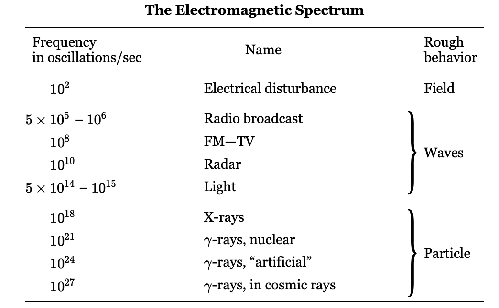{#tbl-FLP_1_2_1 width=450}

 

### I.2.3 양자 물리학 {#sec-FLP_1_2_3}

#### **양자역학 발견 직전의 상황**

- 전자기장에 의해 전달되는 파동은 매우 높은 진동수에서 입자와 비슷하게 행동한다. 1920년 직후에 발견된 양자역학이 이 이상한 현상을 설명한다. 
- 1920 년 이전의 몇 년 동안 아인슈타인에 의해 3차원 공간 $\times$ 1 차원 시간 이라는 시공간 모델이 우리가 시공간이라고 부르는 결합으로(특수상대성 이론), 그리고 이후에는 중력을 나타내는 곡선형 시공간으로 더욱 변형되었다(일반상대성 이론). 
  - “무대”가 시간x공간 에서 시공간으로 변형되었으며, 중력은 아마도 이 시공간의 변형일 것이다. 

#### **역학 법칙의 난관**
- 원자 세계에서 “관성”과 “힘”의 역학적 법칙은 잘못되었다.
- 미시적인 사물은 거시적인 사물과 전혀 다르게 행동한다는 것이 밝혀졌다. 거기에 미시적인 물질의 행동은 너무 부자연스럽다. 
  - 직접으로 경험 할 수 없으며 사물이 우리가 아는 것과는 다르게 행동한다. 해석적인 방법 외에는 설명할 수 없습니다. 어렵고 많은 상상력이 필요하다.

#### **양자역학의 다양한 결론**

- **불확정성의 원리** : 입자는 더 이상 명확한 위치와 일정한 속도를 갖지 않는다. 즉 어떤 것이 어디에 있는지와 그것이 얼마나 빠르게 움직이고 있는지를 모두 알 수 없다는 규칙이 있다. 
  $$
  \Delta x \Delta p≥\dfrac{\hbar}{2}
  $$

- **원자가 붕괘하지 않는 이유** : 원자가 플러스와 마이너스 전하로 이루어져 있다면, 왜 마이너스 전하는 완전히 상쇄될 정도로 가까워지지 않을까? 즉 원자는 왜 이렇게 큰가? 왜 핵이 중심에 위치하고 그 주위에 전자가 있는가? 
  - 처음에는 이것이 핵이 너무 커서라고 생각했지만, 그렇지 않다. 핵은 매우 작다. 원자의 지름은 약 10-10 m, 핵의 지름은 약 10−15 m. 
  - 전자가 핵에 있다면 우리는 그들의 위치를 정확히 알 수 있을 것이며, 불확실성 원리는 그들이 매우 큰(하지만 불확실한) 운동량, 즉 매우 큰 운동 에너지를 가지고 있음을 요구하며 이 에너지로 핵에서 벗어날 수 있다. 타협의 결과 이 불확실성을 위해 약간의 여유를 남겨두고, 이 규칙에 따라 일정량의 최소 움직임으로 흔들리며 움직인다. (결정을 절대 영도까지 냉각하더라도, 원자들이 움직임을 멈추지 않고 여전히 흔들린다고 말한 것을 기억하라) 
  - Why? 전자들이 움직임을 멈춘다면, 우리는 그들이 어디에 있는지와 움직임이 전혀 없다는 것을 알게 될 것이며, 이는 불확정성 원칙에 위배된다. 우리는 그들이 어디에 있는지, 얼마나 빠르게 움직이고 있는지 알 수 없으므로, 그들은 그 안에서 계속 흔들고 있어야 한다!

- **비결정론** : 어떤 상황에서도 정확히 어떤 일이 일어날지 예측할 수 없다. 
  - 예를 들어, 빛을 방출할 준비가 된 원자를 배열하는 것이 가능하며, 우리는 곧 설명할 광자 입자를 포착하여 그 원자가 빛을 방출한 시점을 측정할 수 있다. 하지만 우리는 그것이 언제 빛을 방출할지, 혹은 여러 원자를 가지고 있을 때 어느 하나가 빛을 방출할지 예측할 수 없다. 
  - 우리가 충분히 자세히 살펴보지 못한 내부 “바퀴”가 있기 때문이라고 생갈할수 있지만 틀렸다. 내부적인 바퀴는 없다. 오늘날 우리가 이해하는 자연은 특정 실험에서 정확히 어떤 일이 일어날지 정확히 예측하는 것이 근본적으로 불가능하도록 행동한다. 

- **입자-파동의 통합** : 우리가 파동이라고 여기던 것들이 입자처럼 행동하고, 입자라고 여기던 것들이 파동처럼 행동한다.
  - 정확히는 실제로 모든 것이 동일한 방식으로 행동하며 파동과 입자 사이에는 구분이 없다. 양자역학은 장과 그 파동, 그리고 입자들을 모두 하나로 통합한다. 
  - 낮은 진동수에서 현상의 파동(혹은 field)적 측면이 더 뚜렷하게 나타나거나 일상적인 경험을 대략적으로 설명하는 데 더 유용하다. 하지만 높은 진동수에서는 현상의 입자적 측면이 더욱 뚜렷해진다. 실제로, 우리는 많은 주파수를 언급했음에도 불구하고, 주파수와 직접적으로 관련된 현상은 아직 약  1012 이상에서 감지되지 않았다. 우리는 양자역학의 입자‐파동 아이디어가 타당하다고 가정하는 규칙에 따라 입자의 에너지로부터 더 높은 주파수를 추론할 뿐이다.

- **양자전기역학** : 전자와 광자의 상호작용에 대한 양자역학적 설명
  - 물리학에서 지금까지 우리의 가장 큰 성공. 
  - 매우 큰 에너지의 광자, 감마선 등의 특성을 알려줌. 
  - 반입자와 쌍소멸의 예측.

 

### I.2.4 핵과 입자 {#sec-FLP_1_2_4}

#### 핵

- 핵은 거대한 힘에 의해 결합되는 것으로 밝혀졌다. 그렇다면 양성자와 중성자를 결합하는 힘은 무엇인가? 
  - 전기적 상호작용이 입자, 즉 광자와 연결될 수 있는 것처럼, 유카와 히데키는 중성자와 양성자 사이의 힘에도 일종의 장이 있으며, 그 자이 요동할 때 입자처럼 행동한다고 제안했다. 따라서 양성자와 중성자 외에도 다른 입자들이 존재할 수 있으며, 그는 이미 알려진 핵력의 특성으로부터 이러한 입자들의 특성을 추론할 수 있었다. 그는 이 입자의 질량이 전자보다 200배에서 300배 정도 될 것이라고 예측했다. 
  - 놀랍게도 우주선에서 적절한 질량의 입자가 발견되었다! 하지만 나중에 그것이 잘못된 입자인 것으로 밝혀졌고 그것은 μ-메존, 혹은 뮤온이다.
  - 하지만 조금 뒤인 1947년 또는 1948년에 또 다른 입자인 π-메존(또는 파이온)이 발견되었으며, 이는 유카와의 기준을 만족한다. 양성자와 중성자에 핵력을 얻기 위해서는 파이온을 추가해야 한다. 이제 이 이론으로 우리는 유카와가 원했던 대로 파이온을 이용해 양자 핵역학을 만들고, 그것이 작동하는지 확인하면 모든 것이 설명될 것이라고 생각할 수 있지만 이 이론에 수반되는 계산이 너무 어려워서 아무도 그 이론의 결과가 무엇인지 파악하거나 실험과 대조해 볼 수 없었으며, 이는 거의 20년째 진행되고 있다! (파인만이 이 강의를 한 것이 1960년대 후반이므로 벌써 60년 전이다.)
  
 

## I.4 에너지 보존 {#sec-FLP_1_4}

### I.4.1 에너지란 무엇인가? {#sec-FLP_1_4_1}

> It is important to realize that in physics today, **we have no knowledge of what energy is**. We do not have a picture that energy comes in little blobs of a definite amount. It is not that way. However, there are formulas for calculating some numerical quantity, and when we add it all together it gives “28”—always the same number. It is an abstract thing in that it does not tell us the mechanism or the reasons for the various formulas.

 

### I.4.2 중력 포텐셜 에너지 {#sec-FLP_1_4_2}

#### **가상의 이상적인 가역기계**

- 반대편에 무거운 것을 달아 어떤 물건을 들어올리는 기계를 중량기(weight lifting machine) 하자. 가장 간단한 것은 아래와 같은 지레이다.

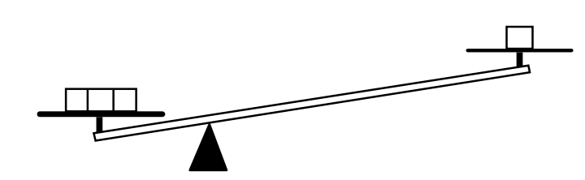{#fig-FLP_1_4_1 width=300}

- 여기서 우리는 **영구 운동은 없다** 고 가정한다. 그리고 이것을 중량기에 적용해보자.
- 우리가 무거운 물건을 내림으로서 어떤 무게 $A$ 를 들어올렸다고 하자. 그리고 이것을 원래의 상태로 되돌렸을 때 순 결과가 $A$ 를 들어올린 것이라면 이것은 영구 운동 기계이다. 왜냐하면 이 들여올려진 $A$ 를 다른 어떤것을 작동시키는데 사용할 수 있기 때문이다.
- @fig-FLP_1_4_1 의 지레를 보자. 오른쪽의 1단위 무게를 들어올리는데 왼쪽에 3단위 무게를 사용하였다. (**파인만은 명시적으로 언급하지 않았지만 이 3단위 무게와 1단위 무게는 평행상태인 것 같다.**. 즉 1 단위 무게에 비해 아주 작은 무게를 슬쩍 얹었다 뺐다 하면서 높낮이를 조절 할 수 있다.) 1단위 무게를 낮춰서 3단위의 무게를 들어올릴 수 있으며, 3단위 무게를 낮춰서 1단위 무게를 거의 동일하게 들어올릴 수 있다. 즉 **가역기계 (reversible machine)** 이다.

#### **가역기계와 비가역 기계**

- 기계에 두 가지 종류가 있다고 하자. 앞서 설명한 가역기계와 가역기계가 아닌 비가역 기계. 가역기계를 $A$ 라고 하고 비가역 기계를 $B$ 라고 하자.
- 가역 기계 $A$ 는 1단위 무게를 1 거리 만큼 내리면서 3단위 무게를 $X$ 거리만큼 들어올리다고 가정하자. $B$ 는 1단위 무게를 1 거리 만큼 내리면서 $Y$ 만큼 들어올린다고 가정한다. 우리는 이제 $Y \le X$ 임을 증명 할 수 있다. 
- $Y > X$ 라고 가정한다. 우리는 1단위 무게를 측정하고 기계 $B$ 로 1단위 무게를 1 거리만큼 높이를 낮추면, 3단위 무게를 $Y$ 만큼 상승시키킨다. 그리고 $Y$ 를 $X$ 만큼 낮추면 공짜 power 를 얻고 역방향으로 작동하는 가역 기계 $A$ 를 사용하여 3단위 무게를 $X$ 만큼 낮추면서, 1단위 무게를 1단위 높이만큼 들어올릴 수 있다. 이렇게 하면 1단위 무게가 이전과 같은 상태가 되고, 두 기계 모두 다시 사용할 수 있도록 준비된다! 따라서 $Y > X$ 라면 영구 운동 기관이며 이는 가정에 위배된다. 따라서 $Y\le X$ 이다. 

#### **가역기계**

- 가역 기계 $A$ 는 1단위 무게를 1 거리 만큼 내리면서 3단위 무게를 $X$ 거리만큼 들어올린다면 모든 가역기게가 그렇다는 것을 보일 수 있다. 이제 $B$ 역시 가역기계라고 가정하자. 위의 $B\to A$ 과정을 $A\to B$ 과정으로 바꿔 보자. $Y\le X$ 이며 $X \le Y$ 이므로 $Y=X$ 이다.
  
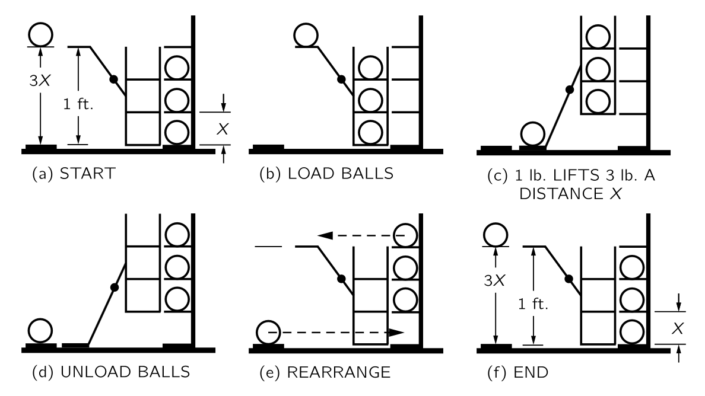{#fig-FLP_1_4_2 width=500}

- 우선 **높이를 변경하지 않는 공의 움직임은 에너지를 사용하지 않는다고 가정한다.** 

- (${}$a) 가역 기계 $A$ 와 그림과 같이 움직이지 않는 랙에 세 개의 공이 배치되있다고 하자. 한 개의 공이 바닥 위 1 피트 높이에서 무대에 올려져 있다. 기계는 세 개의 공을 들어올릴 수 있으며 각각은 $X$ 거리만큼의 높이 차이로 배치된다. 
- (${}$b) : 먼저 공을 랙에서에서 선반까지 수평으로 굴린다. 가정에 따라 에너지 변화는 없다. 그 후 가역식 기계를 작동한다.
- (${}$c) 단일 공을 바닥으로 낮추고, 랙을 $X$ 만큼 들어올린다. 이제 우리는 랙을 잘 배치하여 이 공들이 다시 플랫폼과 짝을 이어지도록 했다.
- (${}$d) 에너지를 얻거나 쓰지 않고 공을 랙으로 옮길 수 있다.
- (${}$e) 공을 옮기면 기계를 원래 상태로 복원할 수 있다. 이제 우리는 위쪽 세 개의 랙에 공이 세 개 있고, 아래쪽에 빈 랙이 하나가 있다. 그런데 우리는 그 중 두 개를 전혀 들어올리지 않았다. 이전에 2번과 3번 랙에 공이 있었다는 것을 기억하라. 그 결과, 하나의 공을 $3X$ 까지 들어올리는 효과가 있다. 
- (${}$f) 이제 $3X$ 가 1피트를 초과하면, 공을 낮춰 기계를 초기 조건으로 되돌릴 수 있으며, 장치를 다시 작동시킬 수 있다. 즉 $3X$ 가 1피트를 초과하면 영구 운동을 할 수 있으므로 $3X$ 는 1피트를 초과할 수 없다. 마찬가지로, 전체 기계가 가역기계이므로 1 foot 은 $3X$ 를 초과할 수 없다. 따라서 $3X=1 \text{ feet}$. 

#### **중력 포텐셜 에너지**

위의 가역기계의 결론을 일반화한다면 다음과 같다. 가역기계에서 한편에 1단위 무게를 1 단위거리만큼 움직일 때 다른편의 $p$-단위 무게는 $1/p$ 단위거리만큼 움직여아 한다. 즉 무게와 상하 이동거리의 곱은 동일하다. 이 값을 **중력 포텐셜 에너지(gravitational potential energy)** 라고 한다.

- 위치에 관계되는 에너지를 **포텐셜 에너지 (potential energy)** 라고 한다. 중력 포텐셜 에너지 이외에도 전하와 관련된 **전기 포텐셜 에너지 (electric potential energy)** 가 있다.

 

### I.4.3 운동에너지 {#sec-FLP_1_4_3}

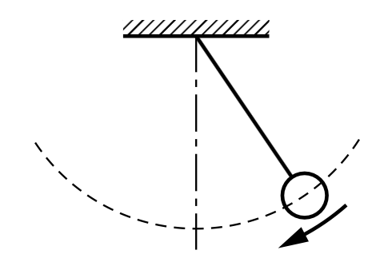{#fig-FLP_1_4_3 width=250}

- 다른 유형의 에너지를 설명하기 위해 위의 그림과 같은 진자를 생각하자. 추는 양쪽 끝에서 중앙으로 이동할 때 높이가 감소한다. 그렇다면 중력 포텐셜 에너지는 어디에? 분명히 그것은 그 운동 덕분에 다시 상승할 수 있으며, 따라서 중력 에너지가 바닥에 도달하면 다른 형태로 변환된다.

- 이제 가역 기계에 대한 우리의 논의를 생각하자. 하단의 움직임에 특정 높이까지 상승할 수 있는 에너지 양이 반드시 존재해야 하며, 이는 상승하는 방식이나 상승 경로와는 전혀 관련이 없다는 것을 쉽게 알 수 있다. 즉 운동에너지는 질량에 위로 올라간 높이를 곱한 값이 되어야 한다. 하지만 우리가 필요한 것은 물체의 움직임과 관련된 어떤 규칙으로 높이를 알려주는 공식이다. 만약 우리가 특정 속도로, 예를 들어 직선으로 시작하면, 그것은 특정 높이에 도달하게 된다. 이후 우리는 운동에너지 $T$ 가 무게 $W$, 속력 $V$, 중력가속도 $g$ 에 대해 다음과 같다는 것을 알게 된다.

$$
T = \dfrac{WV^2}{2g}.
$$

- 이것은 근사적인데 우선 높이가 높다면 중력이 약해저 무게가 변한다. 또한가지는 속도가 빠르다면 상대론적 효과를 고려해야 한다.

 

### I.4.4 다른 형태의 에너지 {#sec-FLP_1_4_4}

#### **탄성 에너지**

용수철과 용수철에 붙은 무게를 수평으로 운동하도록 배치하자. 잡아당겼다가 정지를 확인하고 놓으면 진자와 같이 속력이 변한다. 여기에서도 마찬가지로 운동에너지로 변하는 다른 형태의 에너지가 존재한다는 것을 알 수 있다. 이 에너지를 탄성에너지라고 한다. 

#### **열 에너지**

위의 용수철 운동을 생각하자. 실제 상황에서는 마찰에 의해 용수철에 달린 무게는 운동을 멈추게 된다. 멈추었을 때 에너지는 어디로 갔을 까? 이것은 또 다른 형태의 에너지이다.-열 에너지.

보통 사물이 굴러갈 때, 재료의 불규칙성 때문에 울퉁불퉁하고 흔들리며, 원자들이 내부에서 흔들리기 시작한다. 그래서 우리는 그 에너지를 잃게 되고, 움직임이 느려진 후 원자들이 내부에서 무작위적이고 혼란스러운 방식으로 흔들리는 것을 발견한다. 운동 에너지는 여전히 존재하지만, 가시적인 움직임과는 무관하다. 우리는 어떻게 이런 운동 에너지가 존재한다는 것을 알 수 있을까? 온도계를 사용하면 실제로 스프링이나 레버가 더 따뜻해지고, 운동 에너지가 일정량 증가한다는 것을 알 수 있다는 것이 밝혀졌다. 우리는 이 형태의 에너지를 열 에너지라고 부르지만, **새로운 형태의 에너지가 아니라 단지 내부의 운동 에너지일 뿐이라는 것을 알고 있다**.

#### **기타 에너지**

- 전기 에너지. 
- 복사 에너지, 즉 빛의 에너지 : 빛이 전자기장에서 흔들림으로 표현될 수 있기 때문에 전기 에너지의 한 형태이다.
- 화학 반응에서 방출되는 화학 에너지가 있습니다. 화학 에너지는 1) 원자 내부 전자의 운동 에너지 2)전자와 양성자의 상호작용에 대한 전기 에너지입니다
- 핵에너지 : 핵에너지는 핵 내부에서 입자의 배열에 관여하는 에너지이며, 그에 대한 공식은 가지고 있지만 기본 법칙은 가지고 있지 않다. 우리는 그것이 전기적이 아니고, 중력도 아니며, 순수하게 동역학적인 것이 아니라는 것을 알고 있지만, 그것이 무엇인지는 알지 못한다. 추가적인 형태의 에너지인 것 같다. 

 

#### **다른 보존 법칙**

앞서 보았듯이 모든 공식을 알지 못하더라도 에너지 보존법칙은 분석에 매우 유용하다는 것이 명백하다. 만약 모든 종류의 에너지에 대한 모든 공식이 있다면, 세부 사항을 자세히 설명하지 않고도 몇 개의 프로세스가 작동해야 하는지 분석할 수 있다. 따라서 보존 법칙은 매우 흥미롭다. 에너지 보존과 유사한 두 가지 다른 보존 법칙이 있다: **선형 운동량 보존(the conservation of linear momentum)** 과 **각운동량 보존 (the conservation of angular momentum)**. 

- 우리는 에너지를 일정 수의 작은 덩어리로 이해하지 않는다. 광자는 덩어리로 방출된다는 것과 광자의 에너지가 플랑크의 상수와 주파수의 곱이라는 것을 들어봤을것이다. 그것은 사실이지만, 빛의 주파수는 무엇이든 될 수 있기 때문에 에너지가 반드시 일정한 양이어야 한다는 법칙은 존재하지 않는다. 따라서 우리는 이 에너지를 현재 무언가를 세는 것으로 이해하지 못하고, 추상적이며 다소 특이한 상황인 수학적 양으로만 이해한다. 
- 양자역학에서는 에너지 보존이 **물리법칙은 절대시간에 의존하지 않는다(things do not depend on the absolute time)** 는 우주의 중요한 특징과 관련되어 있음이 밝혀졌다. 이것이 엄격히 사실인지 아닌지는 알 수 없지만 그것이 사실이라고 가정하고 양자역학의 원리를 더하면 우리는 에너지 보존 법칙을 유도 할 수 있다.
- 선형 운동량 보존은 양자역학에서 실험을 수행하는 위치에 차이가 없으며, 결과는 항상 동일하다는 명제와 연관되어 있다. 
- 장치를 회전시키더라도 이는 차이가 없으며, 따라서 각 방향에 대한 우주의 불변성은 각운동량 보존과 관련이 있다. 이 외에도 오늘날 우리가 알 수 있는 한 정확한 보존 법칙 세 가지가 더 있다 : **전하량 보존(conservation of charge)**, **중입자수 보존(conservation of baryons)**, **렙톤 보존(conservation of leptons)**

 

## I.5 시간과 거리 {#sec-FLP_1_5}

### I.5.1 운동 {#sec-FLP_1_5_1}

#### **관측의 과학**
- 물리학은 모든 과학과 마찬가지로 **관측(observation)** 에 의존한다. 정량적 관찰을 통해서만 정량적 관계에 도달할 수 있으며, 이는 물리학의 핵심이다.

#### **갈릴레오**
- 아마도 첫번째 물리학자.
- 갈릴레오 이전의 운동에 대한 연구는 머릿속에서 생각해낼 수 있는 논증에 기반한 철학적 연구였다. 대부분의 논증은 아리스토텔레스와 다른 그리스 철학자들에 의해 제시되었으며, “증명된” 것으로 받아들여졌다. 
- 갈릴레오는 이에 회의적이었으며, 운동에 대해 다음과 같은 실험을 수행했다 : 공이 경사로 아래로 굴러가도록 하고 공이 얼마나 멀리까지 갔는지, 그리고 얼마나 오래 걸리는지를 측정했다.
- 거리를 측정하는 방법은 갈릴레오보다 훨씬 이전에 잘 알려져 있었고, 갈릴레오는 자신의 맥박을 이용하여 짧은 시간을 측정했다. 그는 나중에 더 만족스러운 시계를 고안했다. 그리고 그는 경사를 지나가는 거리가 시간의 제곱에 비례한다는 것을 발견했다.
 
 

### I.5.2 시간 {#sec-FLP_1_5_2}

- 실제로 시간에 대해 정의하는 것은 거의 불가능하며 단지 시간을 측정 할 뿐이다. **What really matters anyway is not how we define time, but how we measure it.** 
- 하루를 정오(태양이 가장 높이 뜨는 시간) 부터 다음날의 정오로 정하고 모래시계를 통해 하루의 길이가 정해져 있음을 확인하는 방법 제시.
- 우리는 이제 1시간과 1일이 모두 규칙적인 주기성을 가지고 있다는, 다른 말로 하면 연속적인 동일한 시간 구간이라는 확신을 갖지만 어느 쪽도 정말로 주기적이라는 것은 증명하지 못했다. 누군가는 매일 밤 모래의 흐름을 늦추고 낮에는 속도를 높이는 전능한 존재가 있는지 의문을 제기할 수도 있다. 우리가 하는 실험은 이러한 질문에 대한 답을 제공하지 않는다. 우리가 말할 수 있는 것은, 한 종류의 규칙성이 다른 종류의 규칙성과 어울린다는 것을 발견한다는 것이다. 우리는 시간에 대한 정의를 겉보기에 주기적인 사건들의 반복에 기반한다고 말할 수 있다.
  
 

### I.5.3 짧은 시간 {#sec-FLP_1_5_3}

- 앞서 우리는 시간을 어느 정도 작은 부분으로 세는 방법을 찾았다. 그렇다면 더 작은 조각으로 세는 방법을 찾을 수 있을까?

- 갈릴레오는 진자는 흔들리는 각도를 작게 유지하는 한, 일정한 시간 간격으로 앞뒤로 항상 흔들린다고 결정했다. 진자가 한 시간에 3600번 진동한다면 진자의 한 주기를 **초** 라고 부르자. 우리는 하루라는 시간 단위를 약 105 개의 부분으로 나누었다. 이런 방식으로 우리는 짧은 시간에 주기적으로 진동하는 무엇인가를 찾게된다면 이를 통해 더욱 더 짧은 시간의 측정 단위를 갖게 된다.
  
- 2026년 4월 현재 측정할 수 있는 가장 짧은 시간 단위는 2.47 x 10-19 초이며 이는 광자가 수소 분자를 가로지르는데 걸린 시간이다.  
  - S. Grundmann et al. [Zeptosecond birth time delay in molecular photoionization](https://www.science.org/doi/10.1126/science.abb9318). Science. Vol. 370, October 16, 2020, p. 339. doi: 10.1126/science.abb9318.

 

### I.5.4 긴 시간 {#sec-FLP_1_5_4}

- 방사선 동위원소 연대측정법

 

### I.5.5 시간 측정 단위와 표준 {#sec-FLP_1_5_5}

- 1초의 현대적 정의 : CS-133 원자의 바닥 상태에 있는 두 개의 초미세 에너지준위 전이에서 9,192,631,770번 진동하는 시간.

 

### I.5.6 긴 거리 {#sec-FLP_1_5_6}

 

### I.5.7 짧은 거리 {#sec-FLP_1_5_7}

 

 

## I.6 확률 {#sec-FLP_1_6}

### I.6.1 확률과 가능성 {#sec-FLP_1_6_1}

 

### I.6.2 요동 {#sec-FLP_1_6_2}

사건집합이 두개의 원소로 이루어진 $\{A,\,B\}$ 이며 이중 사건 $A$ 가 일어날 확률이 $p$ 이고 일어나지 않을 확률이 $q$ 일 때 $n$ 번의 시행에서 $A$ 가 $k$ 번 일어날 확률 $P(n,\,k)$ 는 다음과 같다.

$$
P(n,\,k)= \begin{pmatrix} n \\ k \end{pmatrix}p^kq^{n-k},\qquad \text{where } \begin{pmatrix} n \\ k \end{pmatrix} = \dfrac{n!}{k!(n-k)!}.
$$ {#eq-FLP_1_6_6}

이 확률을 베르누이 확률 혹은 이항 확률(binomial probability) 라고 한다. 특별히 $p=q=1/2$ 일 때 아래와 같다.

$$
P(n,\,k) = \begin{pmatrix} n \\ k \end{pmatrix}\dfrac{1}{2^n} = \dfrac{n!}{k!(n-k)!}\dfrac{1}{2^n}
$$ {#eq-FLP_1_6_5}

 

### I.6.3 마구 걷기 {#sec-FLP_1_6_3}

#### **마구 걷기 (random walk)**
- $x$ 축 선상에서 원점에서 시작헤서 각각 0.5 의 확률로 +1 혹은 -1 로 진행한다고 하자. $N$ 번 진행했을때 원점으로부터의 거리를 알아보자. $N$ 번 진행했을 때의 위치를 $D_N$ 이라고 하자. $N$ 번의 시행 후 원점으로부터 얼마나 멀어지는지를 확인하는데 여러 값을 사용할 수 있지만 가장 편리한 값은 $D_N^2$ 의 기대값 $\langle D_N^2\rangle$ 이다.

- $N$ 번의 시행 후 $D_N$ 의 위치에 있을 때 $D_{N+1}$ 은 각각 0.5 의 확률로 $D_{N}\pm 1$ 이다. 이로부터 

  $$
  D_{N+1}^2 = \left\{\begin{array}{c} D_{N}^2+2D_N+1 \\[0.3em] \text{or} \\[0.3em] D_N^2-2D_N+1\end{array} \right.
  $$ {#eq-FLP_1_6_7}
  임을 안다.

- 위 식과 $\langle D_N \rangle = 0$ 으로부터 $\langle D^2_{N+1}\rangle = \langle D_N^2\rangle +1$ 임을 안다. 또한 $\langle D_1^2\rangle=1$ 이므로
  $$
  \langle D_N^2 \rangle = N.
  $$ {#eq-FLP_1_6_9}
  이다.

- 여기서 평균제곱근 거리 $D_\text{rms}$ 는 다음과 같다.

  $$
  D_\text{rms} = \sqrt{\langle D_N^2\rangle} = \sqrt{N}.
  $$ {#eq-FLP_1_6_10}

- $+1$ 만큼 진행한 회수를 $N_F$, $-1$ 만큼 진행한 회수를 $N_B$ 라고 하자. 그렇다면 $D_N = N_F-N_B$ 이며, $N=N_F+N_B$ 이므로 $D_N = 2N_F-N$ 이다. $N_F$ 의 기대값은 당연히 $N/2$ 이며 실제 값과 기대값의 차, 즉 오차는
  $$
  N_F - \dfrac{N}{2} = \dfrac{D}{2}
  $$ {#eq-FLP_1_6_11}

  이며 평균제곱오차는

  $$
  \left(N_F - \dfrac{N}{2}\right)_\text{rms} = \dfrac{1}{2}\sqrt{N}
  $$ {#eq-FLP_1_6_12}

  이다. 

 

### I.6.4 확률 분포 {#sec-FLP_1_6_4}

 

## I.7 중력 이론 {#sec-FLP_1_7}

### I.7.1 행성의 운동 {#sec-FLP_1_7_1}

- 두가지 법칙으로 행성의 운동을 설명 할 수 있다.
  - **보편 중력** : 각각의 질량이 $m_1,\,m_2$ 인 두 물체가 $\bf{R}$ 만큼 떨어져 있을 때 두 물체는 서로 아래와 같은 힘의 크기 $F$ 로 끌어당긴다.
    $$
    F = G\dfrac{mM}{R^2}.
    $$
  - **힘과 가속도** : 질량 $m$ 인 물체에 힘 $\bf{F}$ 가 작용할 때 $m$ 의 가속도 $\bf{a}$ 는 다음과 같이 정해진다.
    $$
    \bf{a} = \dfrac{\bf{F}}{m}.
    $$

- 코페르니쿠스, 티코 브라헤, 케플러에 대한 역사적인 이야기들.

 

### I.7.2 케플러의 법칙 {#sec-FLP_1_7_2}

::: {.callout-important icon="false"}

#### **케플플러의 행성운동 3법칙**

**제1법칙** : 타원 궤도의 법칙 (Law of Ellipses)

- 모든 행성은 태양을 하나의 초점으로 하는 타원 궤도를 그리며 공전한다.

**제2법칙** : 면적 속도 일정의 법칙 (Law of Equal Areas)

- 태양과 행성을 연결하는 선분이 같은 시간 동안 휩쓸고 지나가는 면적은 항상 일정하다.즉, 행성이 태양에 가까운 근일점에서는 속도가 빠르고, 멀리 있는 원일점에서는 속도가 느리다.

**제3법칙** : 조화의 법칙 (Law of Harmonies)

- 행성의 공전 주기의 제곱은 궤도의 긴반지름의 세제곱에 비례한다.

:::

 

### I.7.3 동역학의 발전 {#sec-FLP_1_7_3}

#### **갈릴레오 당시의 행성 운동의 이해**

- 케플러가 이러한 법칙들을 발견하는 동안, 갈릴레오는 운동의 법칙을 연구하고 있었다. 문제는 무엇이 행성들을 운동하게 하는가였다. 
- 그때 제시된 이론 중 하나는 행성들이 그 뒤에 보이지 않는 천사들이 날개를 펴고 행성을 쳐서 행성들을 앞으로 나아가게 했다는 것이다.
- 알고 보니 행성들이 계속 돌아다니게 하려면 보이지 않는 천사들이 다른 방향으로 날아야 하며(태양 쪽으로 민다), 그들은 날개가 없다.(직접 미는 것이 아니라 원격으로 끌어당긴다). 

#### **갈릴레오의 발견 : 관성의 원리**

- 관성의 원리 : 무언가 움직이고 아무것도 닿지 않으며 전혀 방해받지 않을 경우, 그것은 영원히 계속 움직이며 일정한 속도로 직선으로 이동한다. 
- 이유는? 모른다.

#### **뉴턴의 발견**

- 힘(force) 의 도입 : 운동의 변화는 힘 때문이다. 가속도는 가해지는 힘을 질량으로 나눈 값이다.
  - 행성을 타원 궤도에 유지하기 위해 접선 방향의 힘이 필요하지 않다. 행성은 관성에 의해 어쨌든 그 방향으로 움직이려 한다.  
  - 관성 원리 때문에 행성의 태양 주위를 도는 행성의 운동을 제어하는 데 필요한 힘은 태양 주변의 힘이 아니라 태양을 향하는 힘이다. 

 

### I.7.4 뉴턴의 중력 법칙 {#sec-FLP_1_7_4}

#### **뉴턴의 중력 법칙**

- 뉴턴은 태양이 행성의 운동을 지배하는 힘의 중심이 될 수 있다는 것을 알게 되었다. 뉴턴은 면적속도 일정의 법칙(케플러의 두번째 법칙)이 모든 deviation(경로의 변화?)가 정확히 반지름방향이라는 명제의 정확한 이정표이며, 모든 힘이 정확히 태양을 향해 향한다는 생각의 직접적인 결과임을 증명했다.

- 케플러의 제3법칙을 분석함으로써 행성이 멀리 있을 수록 힘이 약해진다는 것을 보여줄 수 있다. 태양으로부터 서로 다른 거리에 있는 두 행성을 비교하면, 힘이 각각의 거리의 제곱에 반비례한다는 것이 밝혀졌다. 

- 두 법칙을 결합함으로써, 뉴턴은 거리의 제곱을 역으로 하는 힘이 두 물체 사이에 직선으로 향하고 있어야 한다고 결론지었다.

- 뉴턴은 물론 이 관계가 행성을 붙잡고 있는 태양에만 적용되는 것이 아니라 더 일반적으로 적용된다고 가정했다. 목성이 위성을 붙잡고 있는 힘과 태양이 행성을 붙잡고 있는 힘은 보편적으로 동일한 힘이라고 제안했다. 

- 다음 문제는 지구가 그 사람을 당기는 힘과 달을 당기는 힘이 동일한지, 즉 거리의 제곱과 반대인지 여부였다. 지표면에 정지한  물체가 첫 1초에 16피트 떨어진다면, 같은 시간에 달은 얼마나 떨어질 까? 달이 전혀 떨어지지 않는다고 말할 수도 있다. 달에 힘이 없다면 직선으로 떨어지겠지만, 원을 그리며 이동하므로, 힘이 전혀 없었을 경우 있었을 위치와는 크게 달라지게 된다. 

- 달의 궤도 반경(약 240,000마일)과 지구를 도는 데 걸리는 시간(약 27일), 달이 궤도에서 1초 동안 이동하는 거리를 계산할 수 있으며, 그 후 1초에 떨어지는 거리를 계산할 수 있다. 이 거리는 대략 1초당 1/20인치에 해당하며 역제곱법칙과 매우 잘 일치한다. 지구의 반지름은 4000마일이며, 지구 중심으로부터 4000마일 떨어진 것이 1초 만에 16피트가 떨어진다면, 240,000마일, 즉 60배 떨어진 것은 16피트의 1/3600만큼만 떨어져야 하며, 이는 대략 1/20인치에 해당한다. 

- 유사한 계산으로 이 중력 이론을 검증하고자, 뉴턴은 계산을 매우 신중하게 수행했지만, 그 불일치가 너무 커서 이론이 사실과 모순된다고 판단하여 결과를 발표하지 않았다. 그러나 6년 후 지구 크기를 다시 측정한 결과 천문학자들이 달까지의 거리를 잘못 사용하고 있었다는 것이 밝혀졌다. 뉴턴이 이 소식을 들었을 때, 그는 수정된 수치를 사용하여 다시 계산을 수행했고, 아름답게 일치했다.

- 즉 뉴턴의 법칙은 (최소한) 태양계에서 절대적으로 옳다.

- 달의 낙하 : 달은 힘을 받지 않을 경우의 직선경로에서 멀어져 지구 중심 방향을 향한다는 의미에서 낙하한다. 

- 결론적으로 뉴턴은 케플러의 법칙 중 두 번째와 세 번째 법칙을 사용하여 그의 중력 법칙을 추론했다. 

#### **뉴턴의 중력법칙의 예측**

- 달의 움직임에 대한 그의 분석은 지구 표면에 물체가 떨어지는 것을 달의 낙하와 연결했기 때문에 예측이었습니다. 

- 타원 궤도.
  
- 조석 현상 :
  - 12시간 주기 : 뉴턴 이전에는 설명 불가.
  - 뉴턴 이전의 잘못된 이론 : 
    - 달은 물을 끌어올려 조석 현상을 만들어낸다. 그러나 24 주기여아 하므로 틀렸다. 실제로 조수는 12시간 안에 상승과 하락합니다. 또 
    - 달이 지구를 물에서 끌어당기기 때문에 만조가 지구 반대편에 있어야 한다. 
  - 뉴턴의 설명
    - 지구와 달의 무게중심은 지구 외부에 있으며 지구와 달 둘 다 이 무게중심을 중심으로 회전한다.
    - 달과 가까운 쪽의 바닷물은 강한 달의 인력 + 약한 원심력, 달과 먼쪽의 바닷물은 약한 달의 인력 + 강한 달의 원심력. 
    - 따라서 조석 현상은 12시간 주기

 

### I.7.5 우주적 중력 {#sec-FLP_1_7_5}

- 뉴턴의 중력 이론은 태양과 행성이라는 우주의 크기에 비해 비교적 짧은 거리를 넘어 확장될 수 있는가? 
- 첫 번째 테스트는 별과 별 사이의 인력도 동일한 법칙을 따르는가였다. 인류는 쌍성계에서 그렇다는 것을 확인하였다. 
- 기타 천문학적 관측 결과들

 

### I.7.6 캐번디쉬의 실험 {#sec-FLP_1_7_6}

$$
G= 6.670 \times 10^{−11} \text{ N} \cdot \text{m}^2/\text{kg}^2.
$$

 

### I.7.7 중력이란 무엇인가? {#sec-FLP_1_7_7}

- 지금까지 우리가 한 일은 지구가 태양 주위를 어떻게 공전하는지 설명하는 것뿐이며, 무엇이 그렇게 움직이게 하는지는 아직 말하지 않았다. 뉴턴은 이에 대해 어떠한 가설도 세우지 않았으며, 중력의 원인을 찾지 않고 그것이 무엇을 하는지에 대해 알게 된 것에 만족했다. 그 이후로 아무도 중력의 원인을 밝히지 않았다. 

- 물리 법칙의 특징은 그들이 이러한 추상적 특성을 가지고 있다는 점이다. 에너지 보존 법칙은 계산하고 더하는 어떤 양에 관한 정리이며, 이것이 성립하는 원인에 대한 설명은 없다. 뉴턴의 역학법칙도 마찬가지. 왜 우리는 자연을 원인을 모르는 채 수학으로만 설명할 수 있을까? 아무도 모른다. 단지 그렇게 하면 더 많은 것을 알게 되기 때문에 계속 진행해야 한다.

- 중력과 다른 힘, 중력질량과 관성질량에 대한 이야기들.

 

### I.7.8 중력과 상대성이론 {#sec-FLP_1_7_8}

 

## I.9. 뉴턴의 동역학 법칙 {#sec-FLP_1_9}

### I.9.1 운동량과 힘 {#sec-FLP_1_9_1}

#### **관성과 관성의 법칙**

::: {.callout-important icon="false" }

## **갈릴레오의 관성의 법칙** 혹은 **뉴턴의 제 1 운동법칙** {#sec-FLP_PRI_inertia}

물체 하나만 존재하고(if an object is left alone) 다른 영향을 받지 않는다면, 운동하고 있는 물제는 직선상의 등속운동을 하고 정지해 있는 물체는 정지해 있다. 이러한 성질을 **관성(inertia)** 라고 한다.

:::

#### **운동량과 뉴턴의 제 2 운동법칙**

::: {.callout-note icon="false"}

#### **운동량**

운동량 $\bf{p}$ 는 질량 $m$ 과 속도 $\bf{v}$ 의 곱으로 정의된다.

$$
\bf{p}:=m\bf{v}.
$$ {#eq-FLP_1_definition_of_momentum}
:::

::: {.callout-important icon="false"}

#### **뉴턴의 제 2 운동법칙**

힘 $\bf{F}$ 가 주어졌을 때 다음이 성립한다.
$$
\bf{F}=\dfrac{d\bf{p}}{dt} = \dfrac{d}{dt}(m\bf{v}).
$$ {#eq-FLP_newton_2nd_law}

:::

 

### I.9.4 힘은 무엇인가? {#sec-FLP_1_9_4}

- 힘에 대해 뉴턴 자신이 몇 가지 예를 제시했다. 
  - 중력에 대한 구체적인 공식을 제시했다. 
  - 다른 힘의 경우 그는 제3법칙에서 정보를 일부 제공했다. 이후에 설명한다. 

::: {.callout-note icon="false"}

#### **보편 중력**

각각의 질량이 $m,\,M$ 인 두 입자가 각각 $\bf{r}_1,\,\bf{r}_2$ 에 위치했을 때 $m$ 인 입자가 느끼는 힘 $\bf{F}_m$ 은 다음과 같다.

$$
\bf{F}_m = \dfrac{GmM \hat{\bf{r}}}{r^3} = \dfrac{GmM(\bf{r}_2-\bf{r}_1)}{\|\bf{r}_2-\bf{r}_1\|^3}.
$$

여기서 $\bf{r}=\bf{r}_2-\bf{r}_1,\,r=\|\bf{r}\|,\, \hat{\bf{r}}=\bf{r}/r$ 이다. 

:::

 

## I.10. 운동량 보존 {#sec-FLP_1_10}

### I.10-1 뉴턴의 제 3 운동법칙 {#sec-FLP_1_10_1}

- 뉴턴이 자신의 물리법칙을 발표했을 때 보편중력에 대한 정확한 식을 알고 있었으며, 보편 중력 이외의 다른 힘에 대해서는 정확한 식을 알고 있지는 않았다. 그러나 모든 힘이 따라야 할 하나의 규칙을 알고 있었으며 이것을 운동법칙으로 표현한다.

::: {.callout-important icon="false"}

#### **뉴턴의 제 3 운동법칙**

한 입자 $A$ 의 존재에 의해 다른 입자 $B$ 에 힘 $\bf{F}$ 가 가해질 때(작용) $B$ 의 존재에 의해 $A$ 에 $-\bf{F}$ 의 힘이 가해진다. 

:::

- 뉴턴은 작용과 반작용이 같은 직선상에 존재한다고 생각했지만(작용-반작용의 강한 조건), 같은 직선상에 존재하지 않는다는 것이 밝혀 졌다. 다만 $\bf{F}$ 와 $-\bf{F}$ 의 관계인 것은 유지된다(작용-반작용의 약한 조건).

 

### I.10-2 운동량 보존 {#sec-FLP_1_10_2}

#### **운동량 보존**

$N$ 개의 입자의 경우를 생각하자. $j$ 입자에 의해 $i$ 입자가 받는 힘을 $\bf{F}_{ji}$ 라고 하고 $i$ 번째 입자의 운동량을 $\bf{p}_i$ 라고 하자. 그리고 이 $N$ 개의 입자의 상호작용 이외의 힘은 작용하지 않는다고 하자. 뉴턴의 제 2 운동법칙에 의해

$$
\dfrac{d\bf{p}_i}{dt} = \sum_{j=1,\, j\ne i}^N \bf{F}_{ji}
$$ {#eq-FLP_1_10_1}

이다. 이 계의 총 운동량 $\bf{p}_\text{tot}$ 를 모든 입자의 운동량의 합으로 정의하자.

$$
\bf{p}_\text{tot} := \sum_{i=1}^N \bf{p}_i.
$$

뉴턴의 제 3 운동법칙에 의해 $\bf{F}_{ij}+\bf{F}_{ji}=0$ 임을 이용하면 아래와 같이 $d\bf{p}_\text{tot}/dt=0$ 임을 보일 수 있다.

$$
\dfrac{d\bf{p}_\text{tot}}{dt}=\dfrac{d}{dt}\sum_{i=1}^N \bf{p}_i = \sum_{i=1}^N \sum_{j=1,\,i\ne i}^N \bf{F}_{ij} = \sum_{i=1}^N \sum_{j=1}^{i-1} ({\bf{F}_{ij}+\bf{F}_{ji}}) = 0.
$$ {#eq-FLP_1_10_2}

즉 외부로부터 힘이 작용하지 않는 계의 입자들의 운동량의 합은 항상 일정하다.

$$
\bf{p}_\text{tot} = \sum_{i=1}^N m_i\bf{v}_i = \text{constant}.
$$ {#eq-FLP_1_10_3}

 

#### **갈릴레이 상대성 원리**

뉴턴의 제 2 운동법칙으로부터 **갈릴레이 상대성 원리(Galilean relativity)** 를 얻을 수 있다.

::: {.callout-important icon="false"}

#### **갈릴레이 상대성 원리**

정지한 기준틀과 이 기준틀에 대해 등속직선운동을 하는 기준틀에 대해 물리 법칙은 동일하다. 

:::

- 갈릴레이 상대성 원리와 운동량 보존은 수학적으로 동치이다. 운동량 보존으로부터 갈릴레이 상대성 원리를 유도할 수 있으며, 반대로 갈릴레이 상대성 원리로부터 운동량 보존을 유도할 수 있다. 

 

### I.10-3 운동량은 보존된다! {#sec-FLP_1_30_3}

 

### I.10-4 운동량과 에너지 {#sec-FLP_1_30_4}

- 운동량 보존
- 운동에너지가 보존되는 충돌은 탄성 충돌. 
- 운동 에너지 이외에 열과 다른 에너지가 관계됨.

 

### I.10-5 상대론적 운동량 {#sec-FLP_1_10_5}

상대성 이론에서의 운동량 $\bf{p}_\text{rel}$ 은 아래와 같이 정의된다. 

$$
\bf{p}_\text{rel} := \dfrac{m\bf{v}}{\sqrt{1-\|\bf{v}\|^2/c^2}}.
$$ {#eq-FLP_1_10_8}

- 상대성 이론에서의 중요한 가정은 상호작용이 전달되는데 시간이 걸린다는 것이다. 두 물체의 상호작용중에 한 물체의 운동량이 변했다면 이 변화가 다른 물체에게 전달되는데 시간이 지연되며, 따라서 이 지연되는 순간 사이에서는 두 물체의 운동량은 보존되지 않는다. 이 때 우리는 장(field) 의 운동량을 고려해야 한다. 즉 두 물체의 운동량과 장의 운동량의 합은 항상 보존된다. 그렇다면 중력에서는? 즉 일반상대론에서는?
- (ChatGPT 에 의하면) 일반상대성 이론에서 중력은 전자기장과는 달리 시공간 위의 장이 아니라 시공간의 기하 자체이다. 이로부터 중력에 대한 에너지 운동량 텐서는 좌독립적이며 국소적으로 깔끔하게 정의 할 수 없다는 결론이 나온다. 일단 여기까지.. 파인만이 중력에 대해 언급하지 않은것은 이 내용이 어렵기 때문
- 양자역학에서는 입자의 속도를 명확히 정의 할 수 없으며, 따라서 운동량은 더이상 입자의 질량과 속도의 곱이 아니다. 그럼에도 불구하고 양자역학에서는 입자의 운동량이 정의되며 운동량 보존도 성립한다. 

 

## I.11 벡터 {#sec-FLP_1_11}

 

## I.12 힘의 성질 {#sec-FLP_1_12}

### I.12-1 힘이란 무엇인가? {#sec-FLP_1_12_1}

- 힘의 본질에 대한 질문

- 뉴턴의 제 2 법칙 $\bf{F}=m\bf{a}= d\bf{p}/dt$ 에서 일단 우리는 질량, 속도, 가속도와 운동량에 대해 알고 있다. 그렇다면 힘 $\bf{F}$ 는?
    - 일단 $\bf{F}=m\bf{a}$ 는 힘에 대한 정의가 아니다. 
    - 힘은 운동량을 변화시키는 어떤 독립적이며 물질로부터 발생하는 성질이다.
    - 힘을 정확히 정의하는 것은 Feynmann 에 따르면 불가능하다.

- 뉴턴은 보편 중력에 대해서 제시했다. 만약 우주의 힘이 보편중력 뿐이라면 완결적인 이론이 되겠지만 중력 이외의 다른 힘도 존재한다는 것은 뉴턴도 알고 있었다(물질이 서로 달라붙는 힘, 화학반응, 표면장력 등).

 

### I.12-2 마찰력 {#sec-FLP_1_12_2}

- 다양한 형태의 마찰력 
  - 고속의 비행기에 작용하는 공기에 의한 마찰력 : $\propto v^2$,
  - 유체 속에서 저속으로 움직이는 물체에 작용하는 마찰력 : $\propto v$,
    - 예를 들어 비행기 전체에 작용하는 공기에 의한 마찰력은 각 부분에 작용하는 마찰력의 단순 결합으로 표현 할 수 없고 복잡한 관계가 얽혀 있다. 
  - 미끌어짐 마찰력 : 고체 표면에서 천천히 움직이는 고체에서 발생하는 마찰력. 많은 경우 수직 항력(normal force) $N$ 에 비례하며 이 비례 계수를 *마찰 계수(coefficient of friction)* 라고 한다. 마찰 계수 $\mu$ 에 대해 아래와 같이 표현 할 수 있다. 
    $$
    F=\mu N.
    $$ {#eq-FLP_1_12_1}
   

</b>

### I.12-3 분자들 사이의 힘 {#sec-FLP_1_12_3}

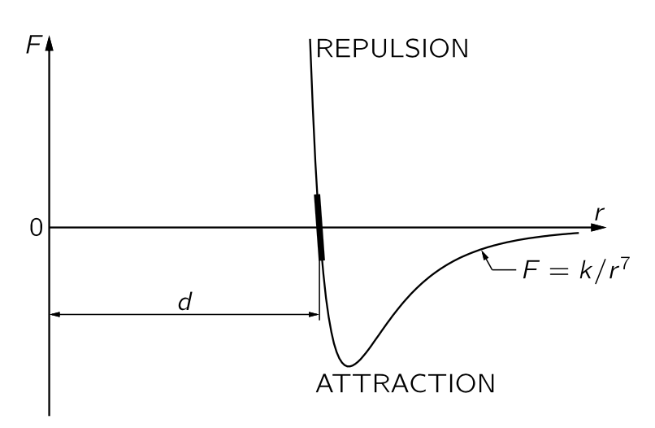{#fig-FLP_1_12_2 width=400}

- 실험적으로 두 원자 사이의 힘과 거리의 관계는 대략 @fig-FLP_1_12_2 와 같다. 

- 물 분자에서 양의 전하의 중심과 음의 전하의 중심의 위치는 다르다. 따라서 근처의 다른 분자는 상대적으로 큰 전기 쌍극자 사이의 힘이다. 산소 분자와 같이 대칭성이 큰 경우는 양의 전하와 음의 전하의 분포는 다르더라도 그 중심이 일치한다. 분자의 양전하와 음전하의 중심이 일치하지 않는 분자를 **극성 분자 (polar molecure)** 라고 하며 극성 분자에서 전하와 거리의 곱을 **쌍극자 모멘트(dipole moment)** 라고 한다.

- **비극성 분자(nonpolar molecure)** 사이에도 거리가 상당히 먼 경우 $1/r^7$ 에 비례하는 인력이 작용한다. (이것을 이해하려면 양자역학이 필요하다.) 쌍극자가 존재하는 경우 분자 사이의 인력이 훨씬 크다. 두 분자 사이의 간격이 지나치게 가깝다면 두 분자 사이에 척력이 작용한다. 

- 분자 사이의 거리가 $d$ 에 매우 가까울 때 상수 $k$ 에 대해 $F(r)=-k(r-d)$ 로 표현 할 수 있다. 이 때 $k = |F'(d)|$ 이다. 

 

### I.12-4 근본적인 힘과 장 {#sec-FLP_1_12_4}

- 쿨롱 힘 : $\bf{F}=\dfrac{1}{4\pi\epsilon_0}\dfrac{q_1q_2\hat{\bf{r}}}{r^2}$
- 전기장 $\bf{E}(\bf{r},\,t)$ : 시간 $t$, 위치 $\bf{r}$ 에 단위전하가 받는 힘.
- 따라서 $\bf{r}$ 에 위치한 전하 $q$ 가 받는 힘 $\bf{F}=q\bf{E}(\bf{r})$.
- 중력장 $\bf{C}$ 도 마찬가지로 어떤 위치 $\bf{r}$ 에 위치한 단위질량이 받는 힘으로 정의 할 수 있음. 즉 $\bf{F}=m\bf{C}$. 

- 이제 힘을 어떤 물리량과 장의 곱으로 표현할 수 있는다. 상황이 단순한 경우는 큰 의미가 없지만 상황이 복잡한 경우에는 매우 유용하다. 예를 들어 $\bf{E}$ 가 어제의 전하 $Q$ 의 위치에 의해 정해진다면 (실제로 그러하다) 우리는 어제의 전하 $Q$ 의 위치에 대해 추적할 수 있어야 하며 이것이 장의 성질이다. 힘이 복잡할수록 장은 현실적이 되며 물리량과 장을 분리하는것은 덜 인위적이 된다.
  
- 장을 이용하여 힘을 분석하려면 두가지가 필요하다.
  - 물리량의 장에 대한 반응 $\longrightarrow$ 운동방정식.
  - 장을 결정하는 법칙. 즉 장방정식(field equations).

- 장의 성질
  - **중첩 원리 (principle of superposition)** : $i$ 번째 source 에 의한 장이 $\bf{C}_i$ 라면 전체 source 에 의한 장은 $\sum_i \bf{C}_i$ 이다. 
    - 전기장에 대해서는 항상 성립한다.
    - 중력장에 대해서는 일반상대론까지 가면 중력장이 매우 큰 경우 성립하지 않는다.

  
 

### I.12-5 관성력 또는 가짜힘 {#sec-FLP_1_12_5}

- 비관성 기준틀에서 발생하는 가짜 힘.
- 의사 힘은 항상 질량에 비례한다. $\bf{a}$ 의 가속도로 움직이는 비관성좌표계에서의 운동방정식은 아래와 같으며 여기서 $-m\bf{a}$ 가 관성력이다.
  $$
  m\dfrac{d^2\bf{x}}{dt^2} = \bf{F}-\underbrace{m\bf{a}}_{\text{pseudo force}}.
  $$

- 관성력과 중력은 질량에 비례하며 아인슈타인은 관성력과 중력은 구분할 수 없다는 **등가 원리 (equivalence principle)** 을 제안하였다.
  
 

### I.12-6 핵력 {#sec-FLP_1_12_6}

- 핵력의 범위 : ~ 10-15 m.
- 양자역학에서 다루는 영역에 들어가며 따라서 힘 보다는 상호작용으로 다루게 된다.
- 매우 복잡하며 간단한 식으로 기술 될 수 없다.(적어도 현재까지는)

 

## I.13. 일과 포텐셜 에너지 (A) {#sec-FLP_1_13}

### I.13-1 자유낙하하는 물체의 에너지 {#sec-FLP_1_13_1}

::: {.callout-note icon="false"}

#### **운동에너지**

질량 $m$ 인 입자의 속도가 $\bf{v}$ 일 때 

$$
\dfrac{1}{2}m\|\bf{v}\|^2
$$ {#eq-FLP_definition_of_kinetic_energy}

를 입자의 **운동에너지 (kinetic energy)** 라고 한다.

:::

운동에너지 $T=mv^2/2$ 의 시간에 대한 변화량은 다음과 같다. 

$$
\dfrac{dT}{dt} = m\bf{v \cdot}\dfrac{d\bf{v}}{dt} = \bf{F \cdot v}
$$ {#eq-FLP_1_13_7}

::: {.callout-note icon="false"}

#### **일률**

외부에서 힘 $\bf{F}$ 가 속도 $\bf{v}$ 인 입자에 가해질 때 $\bf{F\cdot v}$ 를 **일률 (power)** 라고 한다.
:::

즉 @eq-FLOP_1_13_9 은 운동에너지의 변화율은 외부에서 가하지는 힘에 의한 일률과 같음을 의미한다. 이제 이 물체가 $[t_1,\,t_2]$ 의 시간 간격동안 $\bf{s}(t)$ 의 경로로 이동했다고 하자. $\bf{v} = d\bf{s}/dt$ 이므로

$$
\Delta T = \int_{t_1}^{t_2}\left(\dfrac{dT}{dt}\right)\,dt = \int_{t_1}^{t_2}\bf{F\cdot v}\,dt  = \int_{s_1}^{s_2}\bf{F\cdot }d\bf{s}
$$ {#eq-FLOP_1_13_9}

이다. 

::: {.callout-note icon="false"}

#### **일**

외부에서 힘 $\bf{F}$ 가 가해지며 물체가 어떤 경로 $\bf{s}$ 로 움직였을 때 

$$
\int_{\bf{s}_1}^{\bf{s}_2} \bf{F\cdot} d\bf{s}
$$ {#eq-FLP_definition_of_work}

를 외부에서 물체에 해준 **일 (work)** 이라고 한다.

:::

@eq-FLOP_1_13_9 는 물체의 운동에너지의 변화량은 외부의 힘이 해준 일과 같다는 것을 의미한다.

 

### I.13-2 중력에 의한 일 {#sec-FLP_1_13_2}

질량이 $m$ 인 물체가 질량이 $M$ 인 물체가 있다. $\bf{r}=\bf{r}_m - \bf{r}_M$ 이라고 하자. 의한 중력의 영향으로 $\bf{r}_1$ 에서 $\bf{r}_2$ 로 움직였다고 하자. $\bf{r}_1$ 과 $\bf{r}_2$ 에서의 운동에너지를 각각 $T_1,\,T_2$ 라고 하면 @eq-FLOP_1_13_9 에 의해

$$
T_2-T_1 = - \int_{\bf{r}_1}^{\bf{r}_2} \dfrac{GMm}{r^2} \hat{\bf{r}}\bf{\cdot}d\bf{r} = GMn\left(\dfrac{1}{r_2} - \dfrac{1}{r_1}\right)
$$

이다. $r_1=r_2 \implies T_2=T_1$. 즉 중력에 의해 움직이는 물체에서 거리가 같아진다면 운동에너지도 같다. 

::: {.callout-note icon="false"}

#### **보존력** 과 **포텐셜 에너지**

힘 $\bf{F}$ 가 어떤 스칼라장의 미분이라면 즉 어떤 스칼라장 $U$ 에 대해

$$
\bf{F} = - \nabla U
$$

일 때 $\bf{F}$ 를 **보존력 (conservative force)** 라고 하고 $U$ 를 힘 $\bf{F}$ 에 대한 **포텐셜 에너지 (potential energy)** 라고 한다.

:::

우리는 다음을 보일 수 있다.

::: {.callout-important icon="false"}

#### **포텐셜의 성질**

**1.** 힘이 $kr^{2}\hat{\bf{r}}$ 형태이면 포텐셜 에너지가 존재한다.

$$
\dfrac{\bf{r}}{r^{3}} = -\nabla \left(\dfrac{1}{r}\right).
$$

**2.** 포텐셜 에너지가 존재한다면 일은 경로와 무관한 위치만의 함수이다.

$$
W = \int_1^2 \bf{F\cdot}d\bf{s} = -\int_1^2 (\nabla U) \bf{\cdot}d\bf{s} = U(\bf{r}_1)- U(\bf{r}_2)
$$

**3.** 힘에 대한 포텐셜 에너지가 존재할 때 운동에너지와 포텐셜 에너지의 합은 항상 일정하다. 

$$
T_2-T_1 = W = U_1-U_2 \implies T_2+U_2 = T_1+U_1
$$

**4.** 보존력의 합은 보존력이다. 

:::

이로부터 중력 $\bf{F}=-\dfrac{GmM\hat{\bf{r}}}{r^2}$ 에 대한 포텐셜 $U(r)= - \dfrac{GMm}{r}$ 임을 안다.

 

### I.13-3 에너지의 합 {#sec-FLP_1_13_3}

$N$ 개의 입자 사이에 보존력이 작용하는 계를 생각하자. 나머지 입자 전체에 의해 $i$ 번째 입자가 받는 힘을 $\bf{F}_i$ 라고 하면 $\bf{F}_i = -\nabla U_i$ 인 스칼라장 $U_i$ 가 존재한다. 시간 $t_1,\,t_2$ 에서의 이 계의 총 운동에너지 $T_\text{tot} = \sum_i \frac{1}{2}m_iv_i^2$ 의 변화량은 다음과 같다.
$$
\begin{aligned}
\Delta T_\text{tot} &= \int_{t_1}^{t_2}\dfrac{dT_\text{tot}}{dt} = \int_{t_1}^{t_2}\left[\dfrac{d}{dt}\left(\sum_{i=1}^N \dfrac{m_iv_i^2}{2}\right) \right]\,dt  \\[0.3em]
&= \sum_{i=1}^N \int_{t_1}^{t_2} \left(m\dfrac{d\bf{v}_i}{dt}\bf{\cdot v}_i\right) dt = \sum_i^N \int_{t_1}^{t_2} \bf{F}_i\bf{\cdot v}_i dt \\[0.3em]
&= \sum_i U_i(t_2) - U_i(t_1) 
\end{aligned}
$$

$U = \sum_i U_i$ 라고 하면

$$
T_\text{tot}(t) + U(t) = \text{constant}.
$$

이다. 즉 운동에너지와 포텐셜 에너지의 합이 항상 일정하다. 

 

### I.13-4 큰 물체에 의한 중력장 {#sec-FLP_1_13_4}

반지름이 $a$ 이고 총 질량이 $M$ 인 구를 생각하자. 이 때 밀도 $\rho = \dfrac{3M}{4\pi a^3}$ 이며 구 바깥에서 구의 중심으로부터 거리 $R(>a)$ 만큼 떨어진 위치에서의 중력포텐셜을 구의 중심을 원점으로 하고 포텐설을 측정하는 위치를 $z$ 축으로 삼아 구면좌표계에서 구하면

$$
\begin{aligned}
U(R>a) &= -\int_V \dfrac{G \rho d^3\bf{r}}{\sqrt{R^2+r^2-2rR\cos \theta}}\,d^3\bf{r} \\[0.3em]
&= -G\rho \int_0^a \int_0^\pi \int_0^{2\pi} \dfrac{r^2 \sin \theta d\varphi d\theta dr}{\sqrt{R^2+r^2-2rR\cos\theta}} \\[0.3em]
&= -\dfrac{GMm}{R}
\end{aligned}
$$

이다. 즉 중력포텐셜은 구의 질량이 모두 구의 중심에 모여있다고 가정하고 계산했을 때와 같다. 이제 구의 내부에서 구의 중심으로부터의 거리가 $R<a$ 일 경우에는 

$$
U(R<a)= - \dfrac{GMm}{a}
$$

이다.

## I.14. 일과 포텐셜 에너지 (결론) {#sec-FLP_1_14}

### I.14-1 일 {#sec-FLP_1_14_1}

 

### I.14-2 구속된 운동 {#sec-FLP_1_14_2}

- fixed, frictionless constaints 의 경우 constraint force 는 운동방향에 수직방향으로 항상 작용하기 때문에 constraint force 에 의한 일은 0 이다.

 

### I.14-3 보존력 {#sec-FLP_1_14_3}

 

### I.14-4 비보존력 {#sec-FLP_1_14_4}

- 자연계의 힘들은 현재까지는 보존력으로 간주된다. 뉴턴 자신은 힘이 보존력이 마찰력과 같이 힘이 보존력이 아닐 수도 있다는 것을 알고 있었다.

 

### I.14-5 포텐셜과 장 {#sec-FLP_1_14_5}

::: {.callout-note icon="false"}

#### **포텐셜**

벡터장 $\bf{C}$ 에 대해 어떤 스칼라장 $\Psi$ 가 존재하여 $\bf{C}= -\nabla \Psi$ 일 때 $\Psi$ 를 장 $\bf{C}$ 에 대한 **포텐셜 (potential)** 이라고 한다.

:::

$m_1,\ldots,\,m_N$ 를 각각의 질량으로 갖는 $N$ 개의 입자가 각각 $\bf{r}_1,\ldots,\,\bf{r}_N$ 에 위치해 있다. 이 $N$ 개의 입자에 의한 $\bf{r}$ 에서의 중력장 $\bf{C}(\bf{r})$ 는

$$
\bf{C}(\bf{r}) = -\sum_{i=1}^N \dfrac{Gm_i(\bf{r}-\bf{r}_i)}{\|\bf{r}-\bf{r}_i\|^3}
$$

이며 이 중력장 $G$ 에 대한 중력포텐셜 $\Psi$ 는 아래와 같다.

$$
\Psi(\bf{r}) = -\sum_{i=1}^N \dfrac{Gm_i}{\|\bf{r}-\bf{r}_i\|}.
$$ {#eq-FLP_1_14_8}

포텐셜 역시 각각의 source 에 대한 기여의 합이다. 

 

## I.18. 2차원 회전 {#sec-FLP_1_18}

### I.18-1 질량 중심

이제 단순한 입자가 아닌 이러한 입자가 결합된, 좀 더 복잡한 물체에 대해 다루기로 하자. 우리는 입자의 중력장 하에서의 운동이 포물선임을 알고 있다. 이런 질문을 던져보자: 여러 입자가 결합된, 예를 들면 돌을 던질 때 정확히 포물선을 따라 가는 것은 무엇일까?

$N(\sim 10^{23})$ 개의 입자로 이루어진 물체의 $i$ 번째 입자에 가해지는 힘을 $\bf{F}_i$ 라고 하면 운동방정식은 다음과 같다.

$$
\bf{F}_i = m_i \dfrac{d^2\bf{r}_i}{dt^2}.
$$

각각의 입자에 가해지는 힘의 합을 $\bf{F}$ 라고 하면

$$
\bf{F}=\sum_i \bf{F}_i = \sum_i \dfrac{d^2 \left(m_i\bf{r}_i\right)}{dt^2}
$$ {#eq-FLP_1_18_3}

이다. 여기서 중요한 것은 물체 내에서 벌어지는 상호작용에 의한 힘은 뉴턴의 제 3 운동법칙에 의해 $\bf{F} = \sum_i \bf{F}_i$ 에서 상쇄된다는 것이다. 따라서 $\bf{F}$ 는 내부에서 주고 받는 힘이 아닌 순수한 외부에서 작용하는 힘만 남게된다. 

::: {.callout-note icon="false"}

#### **질량 중심**

**질량중심 (center of mass)** $\bf{R}_\text{CM}$ 은 아래와 같이 정의된다.

$$
\bf{R}_\text{CM} := \dfrac{\sum_i m_i\bf{r}_i}{\sum_i m_i} = \dfrac{1}{M}\sum_i m_i\bf{r_i},\qquad \text{where } M = \sum_i m_i.
$$ {#eq-FLP_1_18_4}

:::

그렇다면 @eq-FLP_1_18_3 은 다음과 같이 쓸 수 있다.

$$
\bf{F} = M\dfrac{d^2 \bf{R}_\text{CM}}{dt^2}.
$$ {#eq-FLP_1_18_5}

이제 우리는 답을 알게 되었다. 돌을 던졌을 때 포물선을 따라가는 것은 돌의 질량중심이다. 그리고 @eq-FLP_1_18_5 에 대해 다음과 같은 것을 알 수 있다.

1. 외력이 없다면 물체의 질량중심은 정지하거나 등속 직선운동을 한다.
2. 물체의 질량중심은 물체 내부의 복잡한 상호작용과 분리하여 처리 될 수 있다.

 

### I.18-2 강체의 회전

#### **강체의 회전과 각속도, 각가속도**

::: {.callout-note icon="false"}

#### **강체**

물질 내의 입자들 간의 힘이 매우 강하여 입자간의 상대적인 위치가 바뀌지 않는 가상의 물체.

:::

문제를 단순화하기 위해 강체의 회전을 생각한다. 그리고 강체 안에 고정된 직선이 있어 이 직선을 중심으로 강체가 회전한다고 하자. 이 고정된 직선이 회전축이다. 강체 안의 회전축상에 있지 않은 한 점을 특정하고, 회전 운동 후 이 점이 어디있는지 안다면 물체가 어디에 있는 지 알 수 있다. 회전각은 두 시점에서 물체가 얼마나 회전했는지에 대한 값이다. 

직선상의 운동에서 정의된 속도, 가속도와 마찬가지로 각에 대해서 각속도와 각가속도를 정의 할 수 있다. 시간에 대한 회전각을 $\theta = \theta(t)$ 라고 하면 **각속도 (angular velocity)** $\omega$ 와 **각가속도 (angular acceleration)** $\alpha$ 는 다음과 같이 정의된다.

$$
\omega := \dfrac{d\theta}{dt},\qquad \alpha = \dfrac{d^2\theta}{dt^2}.
$$ {#eq-FLP_definition_of_angular_velocity_and_angular_acceleration}

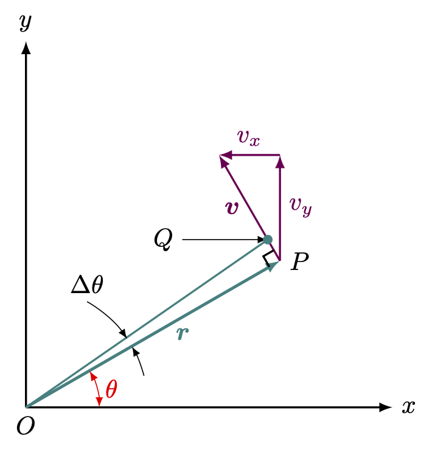{#fig-FLP_1_18_1 width=260}

위의 그림과 같은 2차원 회전을 생각하자. 점 $P$ 가 $O$ 를 중심으로 $\Delta t$ 동안 $\Delta \theta$ 만큼 회전했다고 하자. $P$ 의 좌표를 $(x,\,y)$ 라고 하자. 그렇다면

$$
\Delta x = - PQ\sin \theta = - r\Delta \theta \cdot (y/r) = -y \Delta \theta
$$ {#eq-FLP_1_18_6}

이며 같은 방법으로

$$
\Delta y = + x\Delta \theta 
$$ {#eq-FLP_1_18_7}

임을 안다. 위의 두 식을 $\Delta t$ 로 나누어주면

$$
v_x = -\omega y,\qquad v_y = +\omega x
$$ {#eq-FLP_1_18_8}

이며 따라서 아래와 같은 속도와 각속도의 관계를 얻는다.

$$
v=\sqrt{v_x^2+v_y^2} = \omega r.
$$ {#eq-FLP_1_18_9}

#### **토크**

속도-각속도, 가속도-각가속도의 관계와 같이 선형 이동과 회전 이동 사이의 유사성이 힘에도 존재한다. 힘 $\bf{F}$ 에 의해 작은 회전에 의한 위치 변화 $\Delta x,\, \Delta y$ 가 생겼다고 하자. 이 때 힘이 한 일 $\Delta W$ 는

$$
\Delta W = F_x \Delta x + F_y \Delta y
$$ {#eq-FLP_1_18_10}

이다. $\Delta x,\, \Delta y$ 에 @eq-FLP_1_18_6, @eq-FLP_1_18_7 을 대입하면

$$
\Delta W = (xF_y - yF_x)\Delta \theta
$$ {#eq-FLP_1_18_11}

이다. 

::: {.callout-note icon="false"}

#### **토크**

@eq-FLP_1_18_11 에서 $\tau = xF_y - yF_x$ 를 **토크 (torque)** 라고 한다. 

:::

- 여러 힘이 동시에 작용할 때 @eq-FLP_1_18_10 과 @eq-FLP_1_18_11 로부터 유추 할 수 있듯이 전체 토크는 각각의 힘에에 의한 토크의 합이다. 
- 토크는 회전축에 대해 정해진다. 회전축이 바뀐다면 당연히 토크도 바뀐다.

::: {.callout-note icon="false"}

#### **역학적 평형 상태**

물체가 평형상태에 있다는 것은 모든 작은 변위에 대해 일이 $0$ 이다. 즉 물체가 역학적 평형 상태에 있다는 것은 물체에 작용하는 힘과 토크가 모두 $0$ 이라는 의미이다. 

:::

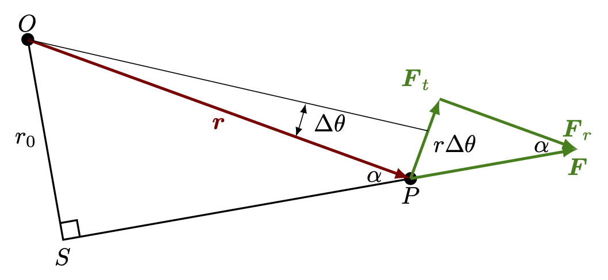{#fig-FLP_1_18_2 width=360}

위의 그림과 같이 $\bf{r}$ 에 위치한 점 $P$ 에 힘 $\bf{F}$ 가 작용하고 있다고 있으며 이 힘에 의해 $O$ 를 중심으로 $\Delta \theta$ 만큼 움직였다고 하자. $\bf{F}$ 는 회전에 대한 접선 방향의 $\bf{F}$ 와 수직방향의 $\bf{F}_r$ 로 분해 할 수 있으며 $\bf{F}_r$ 은 운동방향에 수직방향이므로 일을 하지 않는다. 즉 힘 $\bf{F}$ 에 의한 일은

$$
W = \|\bf{F}_t \| \, r \Delta \theta
$$

이다. 이로부터 노크는 가해지는 힘의 회전에 대한 접선 방향 성분에 회전 반경을 곱한 값이라는 것을 알 수 있다.

 

### I.18-3 각운동량 {#sec-FLP_1_18_3}

#### **각운동량**

지금까지 강체라는 특수한 경우만을 고려했지만 토크의 특성과 그 수학적 관계는 물체가 강체가 아니더라도 적용할 수 있다. 힘 $F$ 가 $F=dp/dt$ 인 것처럼 토크 $\tau$ 는 각운동량이라고 부르는 양 $L$ 에 대해 $\tau = dL/dt$ 임을 보이자.

$$
\begin{aligned}
\tau &= xF_y - y F_x = mx \dfrac{d^2y}{dt^2} - my \dfrac{d^2x}{dt^2} \\[0.3em]
&= mx \dfrac{d^2y}{dt^2} + m \dfrac{dx}{dt}\dfrac{dy}{dt} - m\dfrac{dx}{dt}\dfrac{dy}{dt} - my \dfrac{d^2x}{dt^2} \\[0.3em]
&= \dfrac{d}{dt}\left[m x \dfrac{dy}{dt} - m y\dfrac{dx}{dt}\right].
\end{aligned}
$$

::: {.callout-note icon="false"}

#### **각운동량**

2차원 회전에서 각운동량 $L$ 은 다음과 같이 정의된다.

$$
L := mx\dfrac{dy}{dt} - my\dfrac{dx}{dt} = xp_y - yp_x.
$$ {#eq-FLP_1_18_16}
:::

즉 토크($\tau$) 는 각운동량($L$) 의 시간에 대한 변화량이다.

$$
\tau = \dfrac{dL}{dt}.
$$

#### **행성의 운동의 각운동량**

중력에 의한 태양과 행성의 운동을 살펴보자. 중력은 항상 두 행성을 잇는 직선방향을 따라 작용한다. 즉 운동의 접선방향으로 작용하는 힘이 없기 때문에 중력에 의한 토크는 $0$ 이다.

 

### I.18-4 각운동량 보존 {#sec-FLP_1_18_4}

#### **각운동량 보존**

많은 입자로 이루어진 시스템에서 입자들은 상호작용하며 외부에서 힘이 작용할 수도 있다. 이 경우 어떤 고정축에 대한 $i$ 번째 입자에 작용하는 토크는 $i$ 번째 입자의 각운동량의 시간에 대한 미분이며, 전체 토크는 개별 입자의 토크의 합이므로 전체 각운동량은 개별 각운동량의 합이라는 것을 알 수 있다. 즉 $L=\sum_i L_i$ 라고 하면, 

$$
\tau = \sum_i \tau_i = \sum_i \dfrac{dL_i}{dt}= \dfrac{dL}{dt}
$$ {#eq-FLP_1_18_18}

이다. 이제 작용-반작용의 강한 조건, 즉 입자들 사이의 상호작용에 의한 힘은 두 입자를 잇는 직선상에서 작용한다는 조건이 부여된다고 하자. 그렇다면 두 입자 사이의 상호작용에 의한 두 입장의 토크는 상쇠된다. 따라서 힘에서와 같이 내부의 상호작용에 의한 토크의 합은 $0$ 이다. 즉 입자계에서의 토크의 합은 외부의 힘에 의한 토크이다. 이제 우리는 다음과 같은 수학적 정리를 얻게 된다. 

::: {.callout-important icon="false"}

#### **각운동량 보존**

외부에서 작용하는 힘에 의한 토크가 $0$ 이면 입자들의 총 각운동량은 보존된다.

:::

#### **관성 모멘트**

$N$ 개의 입자로 이루어진 강체가 정해진 회전축에 대해 각속도 $\omega$ 로 회전한다고 하자. $i$ 번째 입자의 질량, 회전축에서의 거리, 속도가 각각 $m_i,\,r_i,\,v_i$ 라고 하자. 이때 총 각운동량 $L$ 은 다음과 같다.

$$
L=\sum_{i} L_i = \sum_i m_i r_i v_i = \left(\sum_i m_i r_i^2\right) \omega 
$$ {#eq-FLP_1_18_20}

::: {.callout-note icon="false"}

#### **관성 모멘트**

강체가 회전할 때 아래와 같이 **관성 모멘트(moment of inertia)** $I$ 를 정의 할 수 있다.

$$
I := \sum_i m_i r_i^2.
$$ {#eq-FLP_1_18_22}

:::

위와같이 정의된 관성 모멘트 $I$ 에 대해 각운동량 $L$ 은 다음과 같다.

$$
L = I\omega.
$$ {#eq-FLP_1_18_21}

 

## I.19. 질량 중심과 관성 모멘트 {#sec-FLP_1_19}

### I.19-1 질량 중심의 성질 {#sec-FLP_1_19_1}

다양한 질량의 물체가 합쳐진 복잡한 물체에 작용하는 많은 힘에 대해, 그것이 강체인지 여부와 관계 없이, 모든 외부에서 작용하는 힘의 합과 질량중심 $\bf{R}_\text{CM}$ 에 대한 운동방정식을 얻었다(@eq-FLP_1_18_5). 이 운동방정식이 의미하는 것은 물채 전체를 대표하는 질량중심 $\bf{R}_\text{CM}$ 이 존재하여 이 물체에 작용하는 모든 외부의 힘이 마치 물체의 질량이 이 점에 집중되어 있는 것과 같이 이 점의 가속도를 결정한다는 것이다. 그리고 이 질량중심의 성질은 아래와 같이 정리 할 수 있다.

::: {.callout-tip icon="false"}

#### 질량 중심의 성질 {#sec-FLP_properties_of_center_of_mass}

**1.** 어떤 면을 중심으로 대칭이 있을 경우 질량중심은 대칭면상에 위치한다.

**2.** 물체를 여러 부분으로 나눌 경우 전체의 질량중심은 각 부분별 질량중심의 질량중심이다. 예를 들어 전체 물체를 $A$, $B$ 두 부분으로 나누며 각각의 질량의 합이 $M_A,\,M_B$ 이고 각각의 질량중심의 반경벡터가 $\bf{r}_A,\,\bf{r}_B$ 라면 전체의 질량중심 $\bf{R}_\text{CM}$ 은 다음과 같다.

$$
\bf{R}_{CM} = \dfrac{M_A\bf{r}_A+M_B\bf{r}_B}{M_A+M_B}.
$$

**3.** 중력이 균일할 경우 질량 중심은 [**중력 중심 (center of gravity)**](#sec-FLP_center_of_gravity) 과 같다. 중력이 $\bf{g}$ 로 균일하다면 물체에 작용하는 토크의 합 $\bf{\tau}$ 는 아래와 같다.

$$
\bf{\tau} = \sum_i m_i \bf{r}_i \times \bf{g} = \left(\sum_i m_i\right) \bf{R}_\text{CM}\times \bf{g}.
$$

따라서 $\bf{\tau}=0$ 이려면 $\bf{R}_{\text{CM}}=0$ 이어야 한다. 즉 균일한 중력장에서 질량 중심이 회전축상에 있을 때 토크는 $0$ 이다. 

:::

::: {.callout-note icon="false"}

#### **중력 중심** {#sec-FLP_center_of_gravity}

$N$ 개의 입자의 총 질량이 $M$ 이라고 하자. $i$ 번째 입자의 질량과 반경벡터를 각각 $m_i$, $\bf{r}_i$ 라고 하자. 위치 $\bf{r}$ 에서의 중력장을 $\bf{G}(\bf{r})$ 이라고 할 때 **중력 중심 (center of gravity)** $\bf{R}_\text{gr}$ 은 다음과 같이 정의된다.

$$
\bf{R}_\text{gr} := \dfrac{\sum_i \bf{r}_i m_i\bf{G}(\bf{r}_i)}{\sum_i  m_i\bf{G}(\bf{r}_i)}.
$$ {#eq-FLP_definition_of_center_of_gravity}

:::

#### **질량중심과 관성력**

[질량 중심의 성질](#sec-FLP_properties_of_center_of_mass) 3. 은 질량 중심을 떠받치고 있으며 중력이 균일하다면 토크가 발생하지 않는다는 것을 말해준다. 

이제 중력 대신 가속도에 의한 관셩력이 작용한다고 하자. 관셩력은 물체 전체에 균일한 힘을 가하기 때문에 질량 중심을 떠받치고 있다면 균일한 중력과 마찬가지로 토크가 발생하지 않는다. 이로부터 흥미로운 결론을 내릴 수 있다. 관성기준틀에서 토크는 항상 각운동량의 시간에 대한 변화량이다. 물체가 가속운동을 하는 경우에도 질량중심이 회전축이라면 토크가 각운동량의 시간에 대한 변화량이라는 것은 변하지 않는다. 즉 (1) 관성기준틀에서의 임의의 축에대한 회전과 (2) 비관성 기준틀에서의 질량중심을 지나는 축에 대한 회전에 대해 $\bf{\tau} = d\bf{L}/dt$ 이다.

 

### I.19-2 질량 중심의 계산 {#sec-FLP_1_19_2}

[파푸스의 무게중심 정리](https://en.wikipedia.org/wiki/Pappus's_centroid_theorem) 를 이용한 질량 중심 계산.

 

### I.19-3 관성 모먼트의 계산 {#sec-FLP_1_19_3}

::: {.callout-note icon="false"}

#### **관성모멘트** 

$z$ 축을 회전축으로 할 경우 관성모먼트 $I$ 는 질량 분포가 이산적인 경우와 연속인 경우(이 때 밀도를 $\rho(\bf{r})$ 라고 하자) 에 각각 다음과 같다.

$$
\begin{aligned}
I &= \sum_i m_i \left(x_i^2+y_i^2\right), \\[0.3em]
I &= \int (x^2+y^2)\,dm = \int (x^2+y^2)\, \rho(\bf{r})\, d^3\bf{r}.
\end{aligned}
$$ {#eq-FLP_1_19_4}
:::

이를 이용하여 기본적인 도형의 관성 모멘트를 계산하면 아래와 같다.

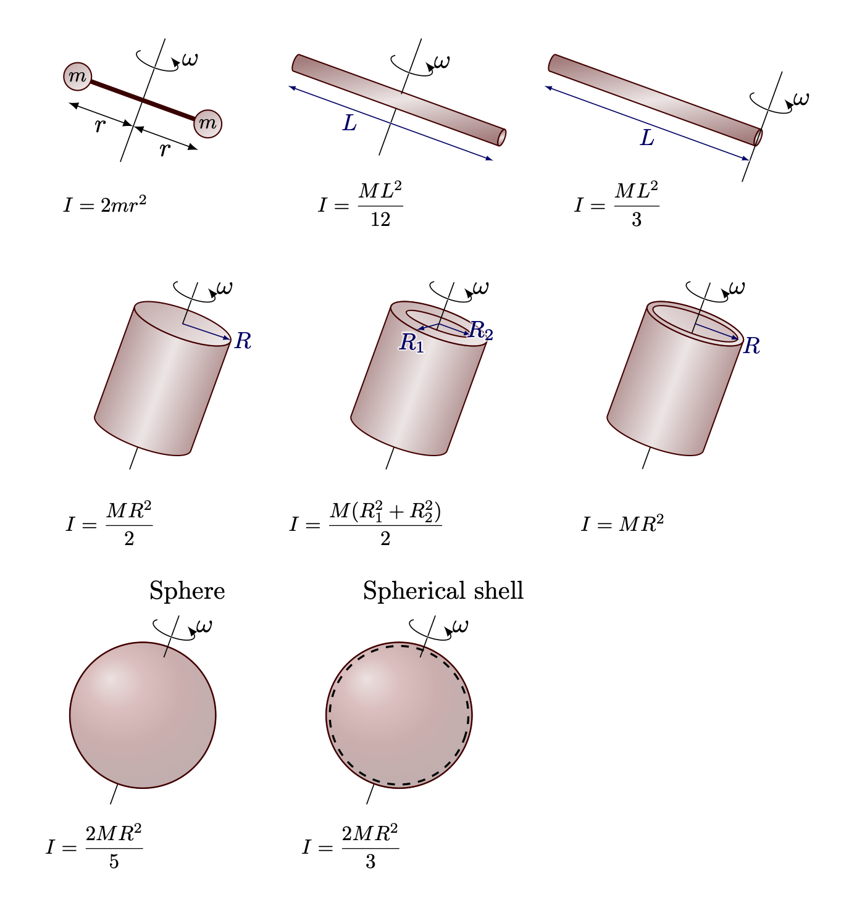{#fig-FLP_1_19_moment_of_inertia width=460}

 

::: {#thm-FLP-parallel_axis_theorem}

#### 평행축 정리 

질량이 $M$ 인 물체의 무게중심을 지나는 회전축 대한 관성모먼트가 $I_\text{CM}$ 일 때 이 축과 $h$ 만큼 떨어진 평행한 다른 축에 대한 관성모멘트 $I$ 는 다음과 같다.

$$
I = I_\text{CM} + Mh^2.
$$ {#eq-FLP_paralle_axis_theorem}

:::

::: {.proof}

일반석을 잃지 않고 회전축이 $z$ 축과 평행하다고 할 수 있다. 질량 중심의 위치를 원점으로 잠고 새로운 축의 위치를 $(a,\,b)$ 라고 하면 $h=\sqrt{a^2+b^2}$ 이며
$$
\begin{aligned}
I &= \sum_i ((x_i-a)^2+(y_i-b)^2)m_i \\[0.3em]
&= \underbrace{\sum_i \left(x_i^2+y_i^2\right)m_i}_{=I_\text{CM}} - 2a\underbrace{\sum_i x_im_i}_{=x_\text{cm}=0} -2b\underbrace{\sum_i y_i m_i}_{y_{\text{cm}}=0} +  + \sum_i \underbrace{(a^2+b^2)}_{=h^2}m_i \\[0.3em]
&= I_\text{CM} + Mh^2
\end{aligned}
$$

이다. $\square$
:::

 

### I.19-4 회전 운동 에너지 {#sec-FLP_1_19_4}

$\omega$ 의 각속도 회전하는 강체의 운동에너지를 계산해 보자. $i$ 번째 입자의 회전축으로부터의 거리를 $r_i$ 라고 하면 회전 속도 $v_i = r_i \omega_i$ 이므로 그 운동에너지 $T$ 는 다음과 같다.

$$
T=\dfrac{1}{2}\sum_i m_i v_i^2 = \dfrac{1}{2}\sum_i m_i (r_i \omega)^2 = \dfrac{1}{2}I\omega^2
$$ {#eq-FLP_1_19_8}

 

## I.20. 공간에서의 회전 {#sec-FLP_1_20}

### I.20-1 3차원 토크 {#sec-FLP-1_20_1}

*3차원 벡터 외적에 대한 설명들*

</brt>

### I.20-2 외적과 회전 방정식

::: {.callout-note icon="false"}

#### **각운동량과 토크** 

3차원에서의 각운동량 $\bf{L}$ 은 아래와 같이 정의된다.

$$
\bf{L}:= \bf{r}\times \bf{p}.
$$ {#eq-FLP_1_20_12}

3차원에서의 토크는 아래와 같이 정의된다.

$$
\bf{\tau} := \bf{r}\times \bf{F}
$$ {#eq-FLP_1_20_11}

:::

$\bf{F}=d\bf{p}/dt$ 와 같이 토크와 각운동량은 아래의 관계를 갖는다.

$$
\bf{\tau} = \dfrac{d\bf{L}}{dt}
$$ {#eq-FLP_1_20_13}

... to be done.. .. 자이로스코프에 관련된 ..

 

## I.21 조화 진동자 {#sec-FLP_1_21}

### I.21-1 선형미분방정식 {#sec-FLP_1_21_1}

아래와 같은 형태의 미분방정식을 $n$-계 선형미분방정식이라고 한다.

$$
a_n \dfrac{d^n x}{dt^n} + a_{n-1}\dfrac{d^{n-1} x}{dt^{n01}} + \cdots + a_1 \dfrac{dx}{dt} + a_0 x = f(t)
$$ {#eq-FLP_1_21_1}

 

### I.21-2 조화진동자 {#sec-FLP_1_21_2}

1차원 단순조화진동자 (Simple harmonic oscilator, 이하 SHO) 는 아래와 같은 2계 선형미분방정식의 해이다.

$$
m\dfrac{d^2x}{dt^2} = -kx.
$$ {#eq-FLP_1_21_3}

또한 우리는 이 미분방정식의 일반해 $x(t)$ 가 다음과 같다는 것을 안다.

$$
x(t) = A \cos (\omega_0 t + \phi_0),\qquad \text{where }\omega_0 = \sqrt{k/m}.
$$ {#eq-FLP_1_21_6}

여기서 $A$ 를 **진폭 (amplitude)** 이라고 하고 $\phi_0$ 를 **위상차 (phase shift)** 라고 한다. 

 

### I.21-3 조화운동과 원운동 {#sec-FLP_21_3}

 

### I.21-4 초기조건

@eq-FLP_1_21_6 에서 우리가 $t=0$ 일 때의 위치 $x_0$ 와 속도 $v_0$ 를 안다고 하자. 그렇다면 

$$
A\cos \phi_0 = x_0,\qquad -A \omega_0\sin \phi_0 = v_0
$$ 

이며 이로부터 $A,\, \phi_0$ 를 결정 할 수 있다. 이제 이 단순조화진동자의 에너지를 구해보자. 우선 운동에너지 $T$ 와 포텐셜 에너지 $U$ 는 다음과 같다.

$$
T=\dfrac{1}{2}mv^2 = \dfrac{m\omega_0^2 \sin^2(\omega_0 t+ \phi_0)}{2},\qquad U = \dfrac{1}{2}kx^2 = \dfrac{m\omega_0^2 \cos^2 (\omega_0 t+\phi_0)}{2}
$$

마찰력이 없다면 $F=-kx$ 는 보존력이므로 역학적 에너지 $E$ 가 보존되며 다음과 같다는 것을 알 수 있다.

$$
E =  T+U = \dfrac{1}{2}m\omega_0^2 A^2 .
$$

즉 에너지는 진폭의 제곱에 의존한다. 따라서 진폭을 2배 늘린다면 에너지는 4배가 증가한다. 또한 한 주기동안의 평균운동에너자와 위치에너지는 같으며 전체 역학적 에너지의 반이다.

 

### I.21-5 강제 진동 {#sec-FLP_1_21_5}

조화진동자에 외부에서 힘이 가해질 때 **강제조화진동자(forced harmonic oscillator)** 라고 한다. 외부의 힘이 $F(t)$ 라면 운동방정식은 아래와 같다.

$$
m\ddot{x} = -kx + F(t).
$$ {#eq-FLP_2_21_8}

가장 간단한 경우는 다음과 같은 경우이다.

$$
F(t) = F_0 \cos \omega t.
$$ {#eq-FLP_2_21_9}

이제 이 힘에 의한 미분방정식 @eq-FLP_2_21_8 를 풀어보자. 한 특이해는 다음과 같이 주어진다.

$$
x(t) = C\cos \omega t.
$$ {#eq-FLP_2_21_10}

이 식이 @eq-FLP_2_21_8 를 만족한다면

$$
C= \dfrac{F_0}{m (\omega_0^2 - \omega^2)}
$$ {#eq-FLP_2_21_12}

이다. 더 일반적인 해는 이후에 구해보기로 하고 @eq-FLP_2_21_12 에 의한 해만 새각해보자. $\omega \ll \omega_0$ 라면 $x(t)$ 와 $F(t)$ 가 거의 같은 방향이며 $\omega >\omega_0$ 이면 $x(t)$ 와 $F(t)$ 가 반대 방향이고 $\omega \gg \omega_0$ 라면 @eq-FLP_2_21_10 는 매우 작은 진폭을 갖게 된다. $\omega \approx \omega_0$ 이면 @eq-FLP_2_21_10 는 매우 큰 진폭을 갖게 되며 $\omega=\omega_0$ 이면 무한대의 진폭을 갖게 된다. 물론 이것은 불가능하다. 

 

## I.23 공명 {#sec-FLP_1_23}

### I.23-1. 복소수와 조화 운동 {#sec-FLP_1_23_1}

@eq-FLP_1_21_1 형태의 선형미분방정식을 생각하자. $f(t) = f_0 \cos (\omega t-\phi_0)$ 를 복소함수 

$$
f(t) = f_0e^{-i\phi_0}e^{i\omega t} = \hat{f} e^{i\omega t},\quad\text{ where } \hat{f} = f_0e^{-i\phi_0} 
$$ 

로 표현하자. 그리고 @eq-FLP_1_21_1 를 복소선형미분방정식으로 아래와 같이 쓸 수 있다.

$$
a_n \dfrac{d^n x}{dt^n} + a_{n-1}\dfrac{d^{n-1} x}{dt^{n01}} + \cdots + a_1 \dfrac{x}{dt} + a_0 x = f(t) = \hat{f} e^{i\omega t}.
$$ 

위의 미분방정식을 만족하는 복소함수 $\hat{x}(t)$ 를 구한다면 $\text{Re}(x(t))$ 는 @eq-FLP_1_21_1 의 해이다. 그리고 많은 경우 이렇게 미분방정식을 복소함수로 구한 후 실수부 혹은 허수부를 취하는 방법이 편리하다. 이제 이 방법을 강제진동 @eq-FLP_2_21_8 에 적용하자. 외부의 힘 $F(t) = F_0 \cos \omega t$ 를 $\hat{F}(t) = \hat{F} e^{i\omega t}$ 로 표현하면

$$
m \dfrac{d^2 x}{dt^2} + k x = \hat{F} e^{i\omega t}
$$ {#eq-FLP_1_23_2}

이다. 앞서와 같이 특수해 $x(t) = \hat{x} e^{i\omega t}$ 를 사용한다면 

$$
-\omega^2 \hat{x} + \omega_0^2 \hat{x} = \dfrac{\hat{F}}{m},\qquad \text{where } \omega_0 = \sqrt{\dfrac{k}{m}}
$$ {#eq-FLP_1_23_4}

이다. 즉

$$
\hat{x} = \dfrac{\hat{F}}{\omega_0^2-\omega^2}
$$ {#eq-FLP_1_23_5}

이며 이것은 @eq-FLP_2_21_12 의 결과를 포함한다. 또한 우리는 $\hat{F}=F_0e^{-i\phi_0}$ 일 때 

$$
\hat{x} = \dfrac{F_0e^{-i\phi_0}}{\omega_0^2-\omega^2}
$$

임을 안다. 즉 $\hat{F}$ 와 $\hat{x}$ 는 같은 위상차를 갖는다.

 

### I.23-2 강제 감쇄 조화진동 {#sec-FLP_1_23_2}

실제의 많은 경우 운동을 방해하는 마찰력이 작용한다. 이 마찰을 간단한 식으로 표현하는 것은 대부분 어렵지만 속도에 비례하는 마찰력이 수학적으로 비교적 다루기 쉬우며 실제에도 적용되는 경우가 많다. 이제 속도에 비례하는 마찰력을 @eq-FLP_1_23_2 에 도입하면 운동방정식은 다음과 같다.

$$
m\dfrac{d^2 x}{dt^2} + c\dfrac{dx}{dt} + k x = F(t).
$$ {#eq-FLP_1_23_6}

이제 $\gamma = c/m$, $\omega_0 = \sqrt{k/m}$ 을 도입하면 운동방정식은 다음과 같다.

$$
\dfrac{d^2x}{dt^2} + \gamma \dfrac{dx}{dt} + \omega_0^2 x = \dfrac{F(t)}{m}.
$$ {#eq-FLP_1_23_6_a}

여기서 $\beta$ 가 매우 작다고 가정하자. $\beta$ 값의 다양한 경우에 대해서는 [감쇄 조화 진동자](#sec-CM_1d_dsho) 를 참고하라. 외부의 힘 $F(t) = F\cos (\omega t -\phi_0)$ 이 작용한다고 하자. $x=\hat{x}e^{i\omega t}$, $F=\hat{F}e^{i\omega t}$ 로 놓고 풀면 아래의 식을 만족해야 함을 안다.

$$
-\omega^2 \hat{x} + i \gamma \omega \hat{x} + \omega_0^2 \hat{x} = \hat{F}/m
$$ {#eq-FLP_1_23_2}

그렇다면 

$$
\begin{aligned}
\hat{x} &= \dfrac{\hat{F}}{m\left(\omega_0^2 - \omega^2 +i\gamma \omega\right)} = \dfrac{\hat{F}e^{i\theta}}{m\sqrt{(\omega_0^2 - \omega^2)^2 + \gamma^2\omega^2}},\\[0.3em]
&\qquad \qquad \qquad \text{where } \theta = -\tan^{-1}\left(\dfrac{\gamma\omega}{\omega_0^2-\omega^2}\right)
\end{aligned}
$$ {#eq-FLP_1_23_11}

위의 식에서 $|\hat{x}|^2$ 은 아래와 같이 정의되는 $\rho^2$ 에 비례하는데 물리적으로 중요하다. 

$$
\rho^2 = \dfrac{1}{(\omega^2-\omega_0^2)^2 + \gamma^2 \omega^2}
$$

$\rho^2$ 와 $\theta$ 의 $\omega$ 의존성은 아래 그림과 같다.

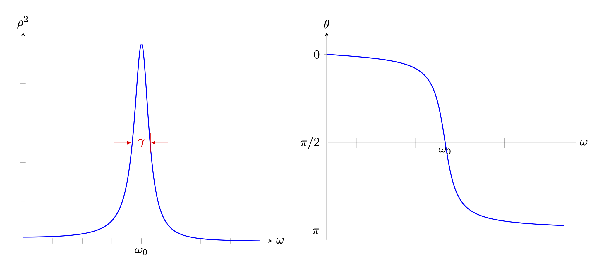{#fig-FLP_1_23_2 width=600}

$\omega \approx \omega_0$ 일 경우 @eq-FLP_2_21_12 와 같이 무한히 폭주하지 않지만 $\rho^2$ 값은 유한한 범위에서 매우 커지며 $\theta \approx \pi/2$ 이다. 그리고 $\rho^2(\omega)$ 에서의 반치전폭(Full with at half maximum, FWHM) 은 $\gamma$ 임을 보일 수 있다. 이 폭에 대한 또다른 척도는 $Q:=\omega_/\gamma$ 이다.위의 @eq-FLP_1_23_11 에서는 $Q=6.67$ 이다.

 

### I.23-3 전기적 공명 {#sec-FLP_2_23_3}

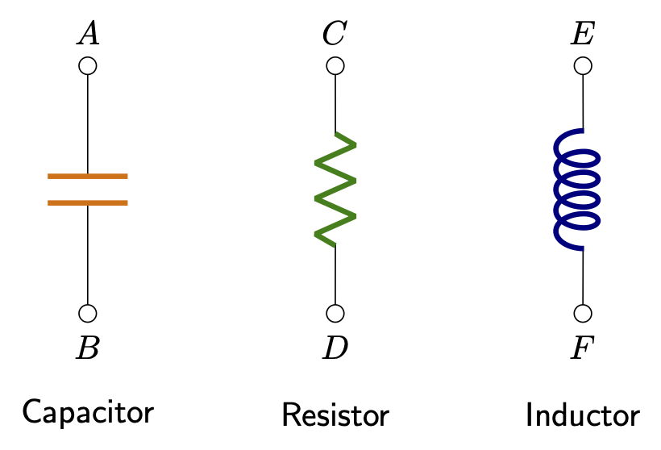{#fig-FLP_1_23_4 width=300}

전자회로의 중요한 세가지 수동소자는 축전기(capacitor), 저항(resistor), 인덕터 (inductor) 이다. 축전기는 금속 판 사이에 부도체를 채운 것으로 전하가 금속판이 각각 $+Q$, $-Q$ 의 전하가 대전되면 양쪽 터미널 $A,\,B$ 에 전위차 $V$ 가 아래와 같이 발생한다.

$$
V= \dfrac{\sigma d}{\epsilon} = \dfrac{d}{\epsilon A}Q.
$$ {#eq-FLP_1_23_14}

여기서 $d$ 는 평행판 사이의 거리, $A$ 는 평행판의 면적, $\epsilon$ 는 도체 판 사이에 삽입된 부도체의 **유전율 (permitivity)** 이다.$^1$[$^1$ 파인만 교재에는 $\epsilon_0$ 라고 되어 있는데 왜그런지 모르겠다. ]{.aside} 평형판 대신에 다른 모양일 수도 있지만 전위차가 대전된 전하량 $Q$ 에 비례하여 $V=Q/C$ 의 관계가 성립한다. 이 때 $C$ 를 **용량(capacitance)** 이라고 한다. 저항은 금속 선과 전기의 흐름으르 방해하는 물질로 이루어져 있으며 저항 양 끝단에 전위차 $V$ 를 가하면

$$
V=RI = R \dfrac{dq}{dt}
$$ {#eq-FLP_1_23_15}

의 관계가 성립한다. 여기서 $I:=dq/dt$ 를 **전류 (current)** 라고 하며 $R$ 을 **전기 저항** 혹은 **저항 (resistance)** 라고 한다. 인덕터는 전류가 흐를 때 자기장을 생성하며 자기장의 크기는 $dI/dt$ 에 비례한다. 자기장은 전류에 비례하며 유도된 전위차는 전류의 시간에 대한 변화에 비례한다. 즉

$$
V = L \dfrac{dI}{dt} = L \dfrac{dq^2}{dt}
$$ {#eq-FLP_1_23_6}

의 관계가 성립한다. 비례상수 $L$ 을 **자기 유도계수 (self inductance)** 라고 한다. 아래와 같은 화로를 구성해 보자.

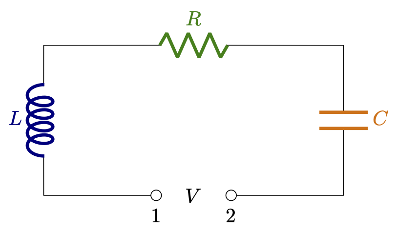{#fig-FLP_1_23_5 width=300}

위의 그림에서 1 번과 2번 터미널 사이에 전압 $V(t)$ 를 가해주면 아래와 같은 미분방정식을 만족한다.

$$
L \dfrac{d^2q}{dt} + R \dfrac{dq}{dt} + \dfrac{1}{C}q = V(t).
$$ {#eq-FLP_1_23_17}

@eq-FLP_1_23_6 와 비교해보면 $L$ 은 질량의 역할을, $1/C$ 는 용수철 상수의 역할을 $R$ 은 말 그대로 저항의 역할을 하는 것을 알 수 있다. $V(t) = \hat{V}e^{i\omega t}$ 의 전위차를 가해준다면 $\hat{x}$ 를 구했을 때와 같이 $\hat{q}$ 를 얻는다.

$$
\hat{q} = \dfrac{\hat{V}}{-L\omega^2 + 1/C + iR\omega} = \dfrac{\hat{V}}{L(\omega_0^2-\omega^2 + i\gamma \omega)}.
$$ {#eq-FLP_1_23_18}

여기서 $\omega_0^2 = 1/LC,\, \gamma = R/L$ 이다.

 

### I.23-4 자연에서의 공명 {#sec-FLP_2_23_4}

 

## I.24 진동의 감쇄 {#sec-FLP_2_24}

### I.24-1 진동자의 에너지 {#sec-FLP_1_24_1}

#### **강제 감쇄 진동자의 일률**

진동자의 운동방정식 @eq-FLP_1_23_6 은 $\omega_0 = \sqrt{k/m},\, \gamma = c/m$ 을 도임하여 아래와 같이 쓸 수 있다.

$$
m \dfrac{d^2x}{dt^2} + \gamma m \dfrac{dx}{dt} + m \omega_0^2 x = F(t).
$$ {#eq-FLP_1_24_1}

이번 절에서는 $F(t)$ 는 $\cos$ 함수라고 가정한다. 외부에서 작용하는 힘 $F(t)$ 에 의한 일률(power) $P$ 는 다음과 같다.

$$
\begin{aligned}
P = F\dfrac{dx}{dt} &= m \left[\left(\dfrac{dx}{dt}\right)\left(\dfrac{dx^2}{dt^2}\right) + \omega_0^2 x \left(\dfrac{dx}{dt}\right)\right] + \gamma m \left(\dfrac{dx}{dt}\right)^2 \\[0.3em]
&=\dfrac{d}{dt} {\huge[}\underbrace{\dfrac{1}{2}m \left(\dfrac{dx}{dt} \right)^2}_{=T} + \underbrace{\dfrac{1}{2}m\omega_0^2 x^2}_{=U}{\huge ]}+ \gamma m \left(\dfrac{dx}{dt}\right)^2 \\[0.3em]
\end{aligned}
$$

여기서 $T$ 는 질량 $m$ 의 운동에너지, $U$ 는 단진자의 포텐셜 에너지임을 안다. 이 $E=T+U$ 를 진동에 저장되는 에너지라고 볼 수 있다. 많은 주기가 지나면 이 저장되는 에너지의 시간에 대한 변화율은 $0$ 이 되며 결국은 감쇄 효과만 남는다. 한 주기에서의 물리량 $X$ 의 평균을 $\langle X\rangle$ 로 표기한다면 $\langle P\rangle$ 은 다음과 같다.

$$
\langle P \rangle = \left\langle \gamma m \left(\dfrac{dx}{dt}\right)^2\right \rangle.
$${#eq-FLP_1_24_3}

$x(t)=\hat{x}e^{i\omega t}$ 라면 $\dot{x}(t) = i\omega \hat{x}e^{i\omega t}$ 이며 실제 시스템을 기술하는 것은 $\text{Re}(x(t))$ 이므로

$$
\langle P \rangle = \dfrac{1}{2}\gamma m \omega^2 x_0^2
$$ {#eq-FLP_1_24_4}

이다.

#### **저장되는 에너지**

저장되는 에너지 $E=T+U$ 의 주기에 대한 평균 $\langle E\rangle$ 은

$$
\begin{aligned}
\langle E\rangle &= \dfrac{1}{2}m \left\langle \left(\dfrac{dx}{dt}\right)^2\right\rangle + \dfrac{1}{2}m\omega_0^2 \langle x^2\rangle = \dfrac{1}{2}m(\omega_0^2 + \omega^2) \dfrac{1}{2}x_0^2
\end{aligned}
$$ {#eq-FLP_1_24_6}

$\omega \approx \omega_0$ 이면 $x_0$ 가 매우 커지기 때문에 저장되는 에너지가 매우 커진다. 

#### **$Q$ 인자**

한 주기에서 강제 감쇄 조화진동자에 외부의 힘이 해주는 일과 저장되는 에너지 사이의 비율에 $2\pi$ 를 곱한 값을 $Q$ 값, 혹은 $Q$ 인자라고 한다. 

$$
Q := 2\pi \dfrac{\langle P\rangle}{\langle T+U\rangle} = \dfrac{\omega^2 + \omega_0^2}{2\gamma \omega}.
$$ {#eq-FLP_1_24_7}

$Q$ 값은 이 진동자가 얼마나 효율적인지에 대한 척도이다.

 

### II.24-2 감쇄 진동 {#sec-FLP_1_24_2}

*파인만의 내용전개와 다르게...*

#### **강제감쇄진동 미분방정식의 해**

강제감쇄조화진동자의 운동방정식

$$
\ddot{x}+\gamma \dot{x} + \omega_0^2 x = F(t)/m
$$ {#eq-FLP_FDHO_1}

을 생각하자. 이 때 $F(t) = 0$ 으로 놓으면 선형 제차 미분방정식이며 그 해를 **과도해 (transient solution)** 라고 한다.$^2$[$^2$ 과도(過度) 가 아니라 과도(過渡) 이다.]{.aside} 과도해를 $x_h(t)$ 라고 하고 @eq-FLP_FDHO_1 의 과도해와 독립적인 해를 $x_p(t)$ 라고 하자. 그렇다면 $x_h(t) + x_p(t)$ 역시 @eq-FLP_FDHO_1 의 해이다. 우선 과도해를 구해보자.

#### **강제감쇄진동 미분방정식의 과도해**

이 방정식의 해를 구하는 방법은 $x(t) = e^{\lambda t}$ 로 놓고 위 의 미분방정식에 대입하면, 

$$
\lambda^2 + \gamma \lambda + \omega_0^2 = 0
$$

을 얻으며, $\lambda$ 에 대한 2차방정식의 해는

$$
\lambda = \dfrac{-\gamma \pm \sqrt{\gamma^2-4\omega_0^2}}{2}
$$

이다. $\gamma^2-4\omega_0^2$ 의 부호에 따라 해를 세가지로 분류 할 수 있다.

**1. Overdamped** : $\gamma^2 > 4\omega_0^2$ 일 경우 

$$
\alpha_1 = \dfrac{-\gamma - \sqrt{\gamma^2-4\omega_0^2}}{2},\quad \alpha_2 = \dfrac{-\gamma + \sqrt{\gamma2-4\omega_0^2}}{2}
$$ 

는 실수이며 과도해는 

$$
x(t) = A_1 e^{-\alpha_1 t} + A_2 e^{-\alpha_2 t}
$$ {#eq-FLP_FDHO_2}

이다. 이 경우를 **overdamped** 라고 하며 진동 없이 시간에 따라 감소한다.

**2. Underdamped** : 반대로 $\gamma^2<4\omega^2_0$ 일 경우 $\omega_\gamma =  \sqrt{\omega_0^2-\gamma^2/4}$ 에 대해 

$$
x(t) = e^{-\gamma t/2 }\text{Re}(A_1 e^{i\omega_\gamma t} + A_2 e^{-i \omega_\gamma t}) = A e^{-\gamma t/2} \cos (\omega_\gamma t + \theta_0)
$$ {#eq-FLP_FDHO_3}

를 얻는다.[$\operatorname{Re}(a)$ 는 복소수 $a$ 에 대해 실수부만을 취하는 함수이다.]{.aside} 이런 경우를 **underdamped** 라고 하며, overdamped 와는 달리 진동이 존재한다.

**3. Critically dampled** : $\gamma ^2=4\omega_0^2$ 인 경우를 **critically damped** 라고 한다. 이 경우에는 $te^{-\gamma t/2}$ 도 해가 된다. $x(t) = te^{-\gamma t/2 }$ 에 대해

$$
\ddot{x} + \gamma \dot{x} + \omega_0^2 x =  0
$$ 

이다. 따라서 이 경우의 해는

$$
x(t) = (A_1+A_2t)e^{-\gamma t/2}
$${#eq-FLP_FDHO_4}

이다. 세가지 경우 모두 $A_1,\,A_2$ 는 초기조건 의해 정해진다. 

#### **에너지 변화**

과도해 $x_h(t)$ 에 가능한 모든 경우에서 

$$
\lim_{t\to +\infty} x_h(t) = \lim_{t \to +\infty} \dfrac{dx_h(t)}{dt} = 0
$$ 

이다. 즉 충분히 많은 시간이 지나면 과도해는 무시 할 수 있다. 

