 

## I.15. 특수 상대성 이론 {#sec-FLP_1_15}

### I.15-1 상대성 이론 {#sec-FLP_1_15_1}

- 정지 질량과 상대론적 질량 (현대적인 상대론에서는 상대론적인 질량이란 개념을 사용하지 않는다.)
- 뉴턴의 상대성 이론, 즉 갈릴레이의 상대성 이론
- 멕스웰 방정식은 갈릴레이 상대성 이론과 일치하지 않는다. 즉 멕스웰 방정식이 갈릴레이 변환에 대해 불변이 아님. 
- 멕스웰 방정식을 이용하여 절대적인 속도를 얻기 위한 노력이 있었으나 무산됨 (예:마이켈슨-몰리 실험)
  
 

### I.15-2 로렌츠 변환 {#sec-FLP_1_15_2}

- 멕스웰 방정식과 갈릴레이 상대성 이론을 조화시키려는 노력, 그리고 실패
- 로런츠 변환의 등장 
  
  ::: {.callout-important icon="false"}

  #### **갈릴레이 변환과 로런츠 변환**
  
  한 기준틀 $S' = (t',\,x',\,y',\,z')$ 이 다른 기준틀 $S=(t,\,x,\,y,\,z)$ 에 대해 $\bf{u}=u\hat{\bf{x}}$ 의 속도로 움직일 때 아래의 관계를 **갈릴레이 변환 (Galilean transformation)** 이라고 한다.

  $$
  x' = x-ut,\quad y'=y,\quad z'=z,\quad t'=t.
  $$ {#eq-FLP_1_15_2}
  
  이에 대해 아래의 관계를 **로런츠 변환 (Lorentz transformation)** 이라고 한다.

  $$
  x'=\dfrac{x-ut}{\sqrt{1-u^2/c^2}},\quad y'=y,\quad z'=z,\quad t' = \dfrac{t-ux/c^2}{\sqrt{1-u^2/c^2}}
  $${#eq-FLP_1_15_3}

  :::

- 푸앙카레의 주장
  
  ::: {.callout-important icon="false"}

  #### 푸앵카레가 ‘물리 법칙의 로렌츠 불변성(혹은 로렌츠 변환/로렌츠 군)’을 말한 1차 자료

  - Henri Poincaré (1905), Sur la dynamique de l’électron  
    - 로렌츠 변환을 **변환군(로렌츠 군)**으로 다루고, 물리 방정식의 형태가 그 변환 아래에서 유지되는 구조를 논의함. 푸앵카레가 로렌츠 변환을 단순한 “요령”이 아니라 **대칭(군)**으로 명확히 인식했다는 점에서 가장 직접적인 1차 자료임.
  - Henri Poincaré (1904), St. Louis 강연
    - (보통 The Principles of Mathematical Physics로 알려진 텍스트로 전해짐)
    - “상대성 원리(관성계에서 물리 법칙 동일)”를 일반 원리로 언급하고, 전자기학/로렌츠 이론 맥락에서 로렌츠 변환이 중요하다는 흐름으로 연결됨. (참고로, “상대성 원리”를 더 넓게 전개한 저술)
  - Henri Poincaré (1902), La Science et l’Hypothèse
    - 엄밀히 “로렌츠 불변성”을 공식처럼 딱 박는 텍스트라기보단, 절대운동의 비가시성과 상대성 원리를 강하게 밀어주는 철학적/물리적 논지로 도움이 됨.

  (from ChatGPT, need to be checked)
  :::

- 아인슈타인의 특수상대성 이론의 등장

 

### I.15-3 마이켈슨-몰리 실험 {#sec-FLP_1_15_3}

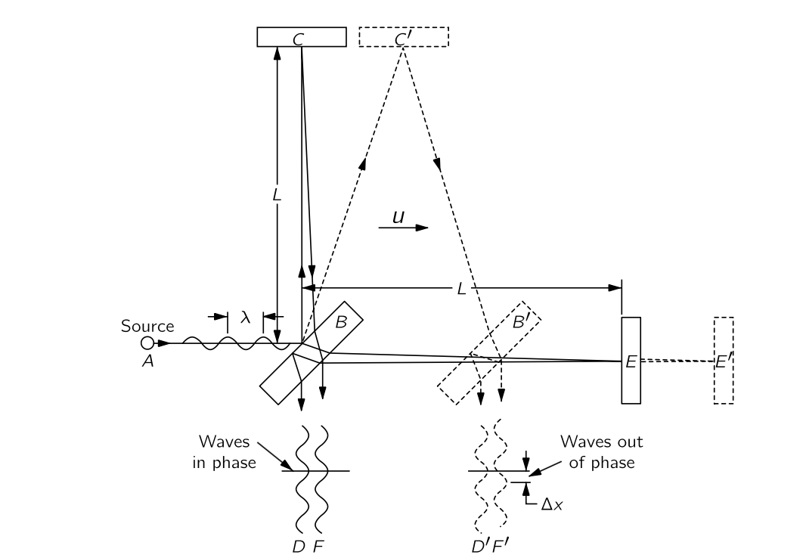{#fig-FLP_Fig_1_15_2 width=500}

실험 장비가 $u$ 의 속도로 움직이고 있다고 하자. 정지한 좌표계에서 빛이 $A-E'$ 으로 진행하는데 걸린 시간 $t_1$ 은 $ct_1 = L+ut_1$ 로부터 계산 할 수 있고 $E'$ 에서 반사되어 $E'-B'$ 경로를 진행하는데 걸린 시간 $t_2$ 는 $ct_2 =L-ut_2$ 로부터 계산 할 수 있다. 여기서 빛이 $B$ 로부터 진행하여 $B'$ 으로 돌아오는데 걸린 시간 $t_1+t_2$ 는 아래와 같다.

$$
t_1+t_2 = \dfrac{L}{c-u}+ \dfrac{L}{c+u} = \dfrac{2L/c}{1-u^2/c^2}.
$$ {#eq-FLP_1_15_4}

이제 빛이 $B$ 로 부터 $C'$ 을 거쳐 $B'$ 으로 돌아오는데 걸린 시간 $2t_3$ 는 $L^2+(ut_3)^2 = (ct_3)^3$ 으로 부터 구할 수 있다. 즉

$$
2t_3 = \dfrac{2L/c}{\sqrt{1-u^2/c^2}}
$$ {#eq-FLP_1_15_5}

이다. 마이켈슨-몰리 실험의 결과는 $t_1+t_2 = 2t_3$ 인 것이며 이는 @eq-FLP_1_15_4 과 @eq-FLP_1_15_5 가운데 오류가 있다는 것을 의미한다. 로런츠는 로런츠 변환에서 움직인는 물체의 길이는 움직이는 방향으로 수축된다고 주장하였으며 그 수축된 길이 $L_\parallel = L\sqrt{1-u^2/c^2}$ 이다. 이를 적용하면

$$
t_1+t_2 = \dfrac{L_\parallel}{c-u}+ \dfrac{L_\parallel}{c+u} = \dfrac{2L/c}{\sqrt{1-u^2/c^2}} = 2t_3.
$${#eq-FLP_1_15_7}

이다.

 

### I.15-4 시간의 변환 {#sec-FLP_1_15_4}

[15-3 마이켈슨 몰리 실험](#sec-FLP_15_3) 은 지구와 같이 움직이는 관찰자가 아닌 정지한 관찰자의 입장에서 $t_1,\,t_2,\,t_3$ 를 측정하고 계산한 실험이다. 이제 지구와 같이 움직이는 관찰자의 입장에서 보자. 구별하기 위해 $\overline{t}_1,\,\overline{t}_2,\,\overline{t}_3$ 라고 하면

$$
\overline{t}_1 = \overline{t}_2 = \overline{t}_3 = L/c
$$

이다. $\overline{t}_1+\overline{t}_2=2\overline{t}_3$ 의 관계는 만족하지만

$$
t_3 = \dfrac{L/c}{\sqrt{1-u^2/c^2}} > \dfrac{L}{c}= \overline{t}_3
$$

이다. 예를 들어 $t_3=1,\,\overline{t}_3=0.7$ 이라고 하자. 즉 정지한 좌표계에서 움직이는 좌표계의 모든 사건은 느리게 발생한다. 

움직이는 기준틀에서 시간이 느리게 가는 것을 좀 더 자세히 보자. 아래 그림과 같이 매우 간단한 광자시계를 생각하자. 광원으로부터 거리 $D$ 만큼 떨어진 곳에 거울을 놓고 거울에서 반사된 빛이 다시 되돌아 왔을 때를 단위 시간이라고 하자. (아래 그림의 (a))

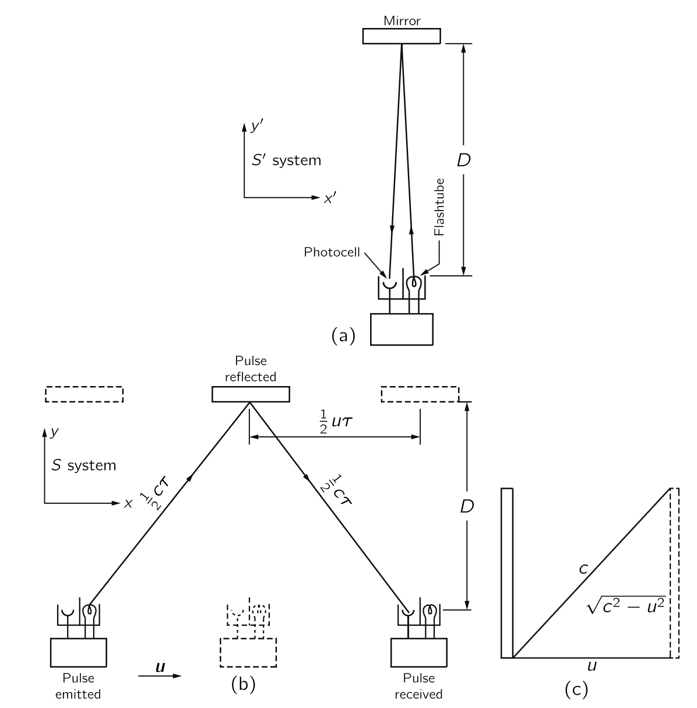{#fig-FLP_1_15_3 width=400}

시계와 같이 움직이는 기준틀에서는 (a) 와 같이 보일 것이다. 그러나 정지한 기준틀에서는 (b) 와 같이 빛이 사선 경로를 따라 반사된다. 따라서 (a) 에서 흘러간 시간보다 (b) 에서 흘러간 시간이 길다. 즉 움직이는 기준틀의 시간은 정지한 기준틀의 시간보다 느리게 간다. 위 그림의 (c) 에서와 같이 같은 속도에 대해 지나가는 경로의 비율이 $\sqrt{c^2-u^2}: c$ 이며 시간은 속도에 반비례 하므로 시계와 같이 움직이는 좌표게에서 흐른 시간 $\Delta t$ 와 외부의 정지한 좌표계에서 흐른 시간 $\Delta t_0$ 는

$$
\Delta t: \Delta t_0 = \dfrac{1}{c} :\dfrac{1}{\sqrt{c^2-u^2}}
$$

이므로

$$
\Delta t_0 = \dfrac{\Delta t}{\sqrt{1-u^2/c^2}} > \Delta t
$$ {#eq-FLP_time_dilation}

이다. 

 

### I.15-5 로런츠 수축 {#sec-FLP_1_15_5}

- 마이켈슨-몰리 실험은 두 경로 ($BCB$, $BEB$) 의 두 빛이 위상차를 전혀 갖지 않는다는 것을 보여준다. $BC$ 의 길이는 두 좌표계 $S,\,S'$ 에서 변하지 않는다는 것을 안다. 
- 이것으로부터 $BE$ 의 길이가 $L\sqrt{1-u^2/c^2}$ 만큼 줄어들었을 때 실험 결과를 잘 성명한다는 것도 알게 되었다. 그렇다면 $S$ 에서의 측정과 $S'$ 에서의 $BE$ 의 길이 측정에 무슨 차이가 존재할까?

기타..

 

### I.15-6 동시성 {#sec-FLP_1_15_6}

- 로런츠 변환 @eq-FLP_1_15_3 의 시간의 변환식을 보자. 여기서 $-ux/c^2$ 는 무슨 의미인가?
- $S$ 기준틀에서 $x_1,\,x_2 (x_1\ne x_2)$ 에서 $t_1=t_2$ 에 어떤 사건이 발생했다고 하자. $S'$ 기준틀에서 아래 식이 성립한다.
  $$
  t'_2-t'_1 = \dfrac{(t_2-ux_2/c^2)-(t_1-ux_1/c^2)}{\sqrt{1-u^2/c^2}} = \dfrac{u(x_1-x_2)/c^2}{\sqrt{1-u^2/c^2}}
  $$

  즉 $S$ 기준틀에서 동시인 사건은 $S'$ 기준틀에서 같은 위치에서 발생하지 않았다면 동시인 사건이 아니다.  

 

### I.15-7 4-벡터 {#sec-FLP_1_15_7}

3차원 좌표공간에서 회전 변환 $R$ 에 의해 거리가 보존되며 $\bf{x}'=R\bf{x}$ 에 대해 $\|\bf{x}'\|=\|\bf{x}\|$ 이다. 로런츠 변환에 대해서는 

$$
(ct')^2 - x'^2 - y'^2 - z'^2 = ct^2 - x^2 - y^2 - z^2
$$

이 성립한다. 이제 4차원 벡터 $X^\mu =(ct,\,x,\,y,\,z)$ 에 대해 $\|X^\mu \| = \sqrt{ct^2 - x^2 - y^2 - z^2}$ 라고 정의하면 로런츠 변환에 대해  $\|X'^\nu\| = \|X^\mu\|$ 이다. $X^\mu=(ct,\,x,\,y,\,z)$ 형식의 벡터를 4-벡터 라고 한다. 

4-벡터의 인덱스는 관습적으로 $\mu,\,\nu$ 와 같은 그리스 문자를 사용하며 0 부터 3 까지의 인덱스를 사용한다. 위첨자로 표현되는 벡터와 아래첨자로 표현되는 벡터는 특수상대성 이론에서 다음과 같다.$^1$[$^1$ 일반상대성 이론에서는 공변벡터와 반변벡터가 아래와 같이 단순한 관계가 성립하지 않는다는 것은 알아두자]{.aside}

$$
X^\mu = (ct,\,x,\,y,\,z),\qquad X_\mu = (ct,\,-x,\,-y,\,-z).
$$

즉 $X^0 = ct,\, X^1=x$ 이며 $X_0=ct,\, X_2=-y$ 이다. 위첨자가 붙는 백터를 **반변 벡터(covariant vector)** 라고 하고 아래첨자가 부튼 벡터를 **공변 벡터(covariant vector)** 라고 한다. 

 

### I.15-8 상대론적 동역학 {#sec-FLP_1_15_8}

뉴턴의 운동방정식은 $\bf{p}=m\bf{v}$ 에 대해 

$$
\bf{F}=\dfrac{d\bf{p}}{dt},
$$

이다. 상대성 이론에서는 운동량이 아래와 같이 정의된다. 이것은 아인슈타인에 의해 정의되었다.

$$
\bf{p}= \dfrac{m\bf{v}}{\sqrt{1-v^2/c^2}}.
$$ {#eq-FLP_1_15_10}

작용-반작용이 <u>최종적으로</u> 서로 같다면 위와 같이 정의된 운동량은 보존된다. 

::: {.callout-tip icon="false"}

#### **최종적으로...** 

상대론적 역학에서 힘과 반력(작용-반작용)이 고전역학처럼 항상 정확히 동시에 크기가 같고 반대 방향으로 작용하지 않을 수 있다는 뜻이다. 왜냐면 특수상대성 이론에서는 “동시성” 자체가 관성계에 따라 다르니까. 예를 들어, 두 입자가 서로 멀리 떨어져 있는데 전자기력으로 상호작용한다고 해보자. 한 입자가 다른 입자를 밀면, 그 힘은 빛의 속도로 전달되며, 그래서 한 기준틀에서는 A가 B를 민 직후에 B의 반작용이 나타나 보이지만, 다른 움직이는 기준틀에서는 시간 순서가 조금 뒤바뀌어 보일 수 있어. 즉, 순간 순간(in detail) 작용과 반작용이 정확히 균형을 이루지 않는 것처럼 보일 수 있다는 의미이다.

“최종적으로(in the long run)”는 결국 전체 시스템을 보면, 에너지와 운동량이 보존되는 방식으로 힘들이 균형을 이룬다는 뜻이다. 자기장과 전기장이 서로 에너지와 운동량을 주고받으면서, 입자들만 보면 순간적으로 운동량이 보존되지 않는 것처럼 보여도, 장(field)까지 포함한 전체 시스템에서는 여전히 운동량이 보존된다.

:::

일정한 힘이 계속 작용하고 있다고 하자. $\bf{F}=F_0\hat{\bf{x}}$ 라고 하자. 일반성을 잃지 않고 $\bf{v}=v\hat{\bf{x}}$ 라고 할 수 있다.

$$
\dfrac{d}{dt}\left(\dfrac{mv}{\sqrt{1-v^2/c^2}}\right) = F_0 \implies \dfrac{mv}{\sqrt{1-v^2/c^2}} = F_0 t + C
$$

이며 $t=0$ 일 때 $v=0$ 으로 놓으면 $C=0$ 이다. 이로부터

$$
v(t)= \dfrac{Ft/m}{\sqrt {1+ \left(Ft/mc\right)^2}}
$$

이다. $t\to infty$ 극한에서 $v(t) \to c$ 임을 안다. 이것은 뉴턴역학과 다른 결과인데 뉴턴역학에서는 일정한 힘을 계속 가할 수 있다면 $v>c$ 가 가능하다. 

 

### I.15-9 질량과 에너지의 동등함 {#sec-FLP_1_15_9}

아인슈타인은 에너지를 아래와 같이 정의했다.

$$
E:= \dfrac{mc^2}{\sqrt{1-v^2/c^2}}.
$$ {#eq-FLP_1_relativistic_energy}

이를 테일러 전개 하면

$$
E=mc^2 + \dfrac{mv^2}{2} + \cdots
$$

이며 $v\ll c$ 일 때 근사적으로 에너지는 정지에너지 $mc^2$ 과 뉴턴 운동에너지 $mv^2/2$ 의 합으로 나타낼 수 있다는 것을 안다. 

 

## I.16. 상대론적 에너지와 운동량 {#sec-FLP_1_16}

### I.16-1 상대론과 철학자들 {#sec-FLP_1_16_1}

- 푸앵카레는 상대성 원리를 다음과 같이 진술하였으며, 많은 소위 철학자들에게 오해를 받았다.

  >상대성 원리에 따르면, 물리 현상의 법칙들은 정지한 관측자에게서나 그에 대해 등속 병진 운동을 하고 있는 관측자에게서나 동일해야 한다. 따라서 우리는 그러한 운동에 함께 실려 가고 있는지 여부를 판별할 수 있는 어떠한 수단도 가지고 있지 않으며, 앞으로도 가질 수 없을 것이다.

- 여기서 "그러한 운동에 함께 실려 가고 있는지 여부를 판별할 수 있는 어떠한 수단도 가지고 있지 않은" 관측자들은 서로 등속병진운동을 하는 관측자들 뿐이다. 그리고 두 기준틀의 상대적 운동은 등속병진운동만 있는것은 아니다.
- 그리고 파인만이 철학자들의 과학적 무지함을 까는 이야기
  
 

### I.16-2 쌍동이 역설 {#sec-FLP_1_16_2}

 

### I.16-3 속도의 변환 {#sec-FLP_1_16_3}

두 기준틀 $S,\,S'$ 이 $\bf{u}=u\hat{\bf{x}}$ 의 상대적인 운동을 하고 있을 때 두 기준틀 사이의 로런츠 변환은 다음과 같다.

$$
\begin{array}{rl} x'&= \dfrac{x-ut}{\sqrt{1-u^2/c^2}},\\[0.3em] y'&=y, \\[0.3em]z'&=z, \\ t'&=\dfrac{t-ux/c^2}{\sqrt{1-u^2/c^2}}\dots\end{array} \quad \iff \quad \begin{array}{rl} x&= \dfrac{x'+ut'}{\sqrt{1-u^2/c^2}},\\[0.3em] y&=y', \\[0.3em] z&=z', \\ t&=\dfrac{t'+ux'/c^2}{\sqrt{1-u^2/c^2}}.\end{array}
$$ {#eq-FLP_lorent_transform_in_16_3}

여기서 $S'$ 기준틀에서 $v_{x'}$ 의 속도로 일정하게 움직이는 입자를 생각하자. $x'=v_{x'}t$ 이므로

$$
x=\dfrac{v_{x'}t' + ut'}{\sqrt{1-u^2/c^2}},\qquad t = \dfrac{t'+uv_{x'}t/c^2}{\sqrt{1-u^2/c^2}}
$$

이며, 따라서 $S$ 기준틀에서의 속도 $\bf{v} = (v_x,\,v_y,\,v_z)$ 는 아래와 같다. 

$$
v_x = \dfrac{x}{t}=\dfrac{v_{x'}+u}{1+uv_{x'}/c^2},\qquad v_y = 0,\qquad v_z = 0 .
$$ {#eq-FLP_1_16_6}

여기서 $v_{x'}=c$ 라면, 즉 기준틀 $S'$ 에서 광속으로 움직인다면

$$
v_x = \dfrac{c+u}{1+u/c}= c
$$

이다.

이제 $S'$ 의 기준틀에의 속도가 $(v_{x'},\,v_{y'})$ 으로 주어지는 경우를 생각해보자. $y'=v_{y'}t'$ 이므로 $v_y$ 는 아래와 같다.

$$
v_y = \dfrac{y}{t} = \dfrac{v_{y'}t'}{\dfrac{t'+uv_{x'}t'/c^2}{\sqrt{1-u^2/c^2}}} = \dfrac{v_{y'}}{1+uv_{x'}/c^2}\sqrt{1-u^2/c^2}
$$ {#eq-FLP_1_16_7_0}

주의할 것은 $v_y$ 는 $u,\,v_{y'}$ 뿐만 아니라 $v_{x'}$ 에도 의존한다는 것이다. 물론 $v_x'=0$ 인 경우 

$$
v_y = v_y'\sqrt{1-u^2/c^2}
$$ {#eq-FLP_1_16_7}

이다. 이 식을 상대성 이론의 기본 원리로부터 직접 구해보자. 우리는 앞서 [15-4 시간의 변환](#sec-FLP_15_4) 에서 정지한 기준트로가 움직이는 기준틀에서의 시간이 다르게 흐른다는 것을 알았다. 속도는 시간에 반비례하며 그 비율이 $\sqrt{1-u^2/c^2}$ 이므로  우리는 @eq-FLP_1_16_7 을 얻을 수 있다.

 

### I.16-4 상대론적 질량 {#sec-FLP_1_16_4}

- 앞서 말했듯이 파인만 당시에는 상대론적 효과에 의해 질량이 증가하는 것으로 접근했지만 현대에서는 정지질량만을 다루며 질량이 증가한다고 보지 않는다. 하지만 파인만의 제목은 그대로 두기로 한다.

충돌을 생각하자. 우리는 여기서 몇가지를 가정한다. 

1. 에너지와 운동량이 보존된다.
2. 운동량은 속도와 같은 방향을 갖는 벡터이며 속도의 함수이다.

우리는 충돌하는 두 입자의 자세한 상호작용에는 관심이 없으며 상대론적 가정, 즉 모든 물리법칙은 관성기준틀에서 동일하다는 가정과 위의 두 가정만을 이용한다. 우리는 운동량이 속도와 질량의 곱이라고 가정하지 않으며 따라서 $\bf{p}=\gamma(v) m\bf{v}$ 와 같이 쓸 수 있다. 

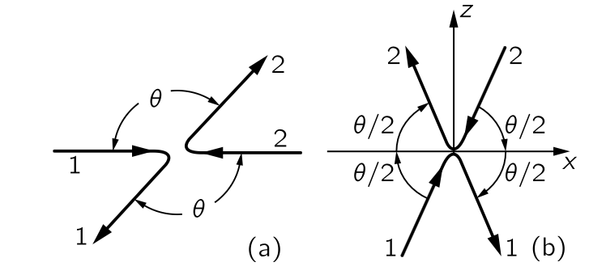{#fig-FLO_1_16_2 width=300}

위의 그림에서와 같이 질량이 같은 두 입자가 서로 반대방향의 같은 크기의 속도를 가지고 충돌한다고 하자. 총 운동량은 $0$ 이므로 충돌 이후에도 반대 방향의 같은 속력을 가져야 한다. 이제 위의 그림의 표기를 이해 할 수 있다. 이제 우리는 1번 입자의 $x$ 방향 속력 으로 움직이는 기준틀에 있다고 하자. 그리고 2번 입자의 수평방향 속력을 $u$ 라고 하고 산란각을 $\alpha$ 라고 하자. 그렇다면 상황은 아래 그림의 (a) 처럼 보일 것이다. 이제 $u$ 의 속력으로 움직이는 좌표계에서 바라본다면 그림 (b) 처럼 보일 것이다.

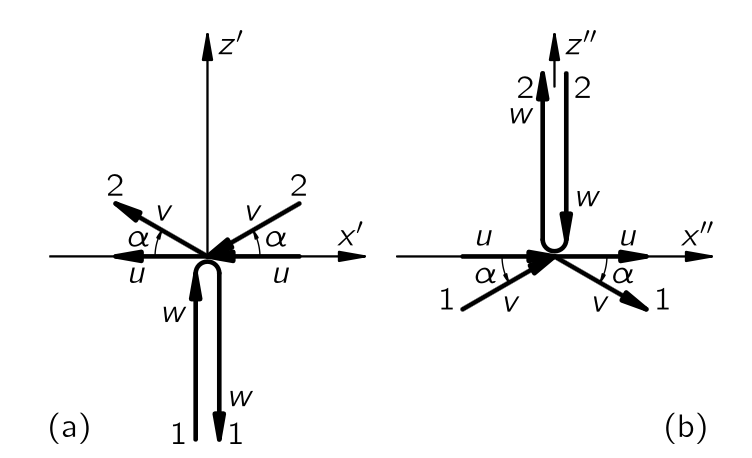{#fig-FLP_1_16_3 width=300}

그렇다면 (a) $\to$ (b) 변환에서 @eq-FLP_1_16_7 로부터 $u \tan \alpha = w\sqrt{1-u^2/c^2}$ 임을 알 수 있다. 이 때 (b) 시점에서 2 입자의 수직방향 운동량의 변화 $\Delta p_{b, 2}$ 는 $\Delta p_{b, 2} = 2\gamma(w) mw$ 이며 1번 입자의 속력은 $v$ 이고 속력의 수직방향의 변화 $\Delta p_{b, 1}$ 는 

$$
\Delta p_{b, 1} = 2 \gamma(v) u\tan \alpha = 2 \gamma(v) w \sqrt{1-u^2/c^2}
$$

이다. $\Delta p_{b, 2}= \Delta p_{b, 1}$ 이어야 하므로

$$
\dfrac{\gamma(w)}{\gamma (v)} = \sqrt{1-u^2/c^2}
$$ {#eq-FLP_1_16_9_modified}

이다. 이제 $w\to 0$ 인 극한에서 생각해보자. 이 극한에서 $v \to u$ 이며 따라서 다음과 같다.

$$
\gamma(v) = \dfrac{\gamma(0)}{\sqrt{1-v^2/c^2}} 
$$ {#eq-FLP_1_16_10_modified}

$\bf{p}=\gamma(v)m\bf{v}$ 임을 생각하자. $v\to 0$ 인 극한에서 뉴튼의 운동량과 일치시키려면 $\gamma(0)=1$ 로 놓을 수 있다. 즉

$$
\gamma(v) = \dfrac{1}{\sqrt{1-v^2/c^2}} 
$$

이다. 이제 운동량 보존을 받아들이고 난 뒤 우리가 내릴 수 있는 다른 결론을 알아보자. 소위 비탄성 충돌이라는 것으로 서로 같은 속력으로 반대방향에서 마주보며 다가오고 있는 두 입자가 합쳐졌을 때를 생각하자.

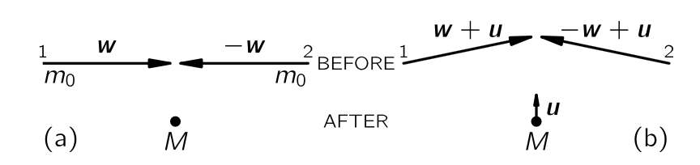{#fig-FLP_1_16_4 width=400}

이 경우에 운동량 보존을 생각하면 $0$ 이므로 우리가 $\bf{w}$ 에 비해 아주 작은 속력으로 두 입자의 방향에 수직으로 움직이는 기준틀에 있다고 하자. 즉 $\|\bf{u}\| \ll \|\bf{w}\|$ 이다. 수직방향의 운동량 보존으로부터

$$
2\gamma(v)mu = \gamma(u) Mu
$$

임을 안다. $u\to 0$ 극한에 대해

$$
M = 2\gamma (w) m
$$ {#eq-FLP_1_16_11_modified}

임을 안다. 즉 질량 $m$ 인 두 입자가 합쳐졌을 때의 질량이 두 입자의 질량의 합이 아니게 된다.

::: {.callout-tip icon="false"}

#### $\gamma$ 와 $\beta$
참고로 $\gamma(v) := 1/\sqrt{1-v^2/c^2}$ 는 상대론에서 아주 많이 사용되며, 필요하다면 속도 $v$ 를 명시적으로 표기하지 않고 단지 $\gamma$ 라고 표기하거나 아래첨자로 $\gamma_v$ 형태로 많이 사용한다. 또한 $\beta := v/c$ 혹은 $\beta_v$ 역시 많이 사용된다. 따라서 @eq-FLP_1_relativistic_energy 의 상대론적 에너지 $E=\gamma mc^2$ 이며 운동량 $\bf{p}=\gamma m\bf{v}$ 이다. 또한 $\gamma_v = 1/\sqrt{1-{\beta_v}^2}$ 의 관계가 성립한다.

:::

 

### I.16-5 상대론적 에너지 {#sec-FLP_I_16_5}

입자에 일을 해 주었을 때의 운동에너지의 변화는 다음과 같다.

$$
\Delta T = \dfrac{mc^2}{\sqrt{1-v^2/c^2}}-mc^2 = \gamma mc^2-mc^2
$$ {#eq-FLP_1_16_12}

여기서 더 나아가서 입자의 에너지가 $\gamma mc^2$ 이라고 추측할 수도 있다.

우리가 앞서 다룬 두 입자가 합쳐저서 하나의 정지한 입자를 생성하는 경우를 살펴보자. 앞서 보았듯이 생성된 입자의 질량은 두 입자의 질량의 합보다 크다. 그렇다면 그 차이는 어디로 갔는가? 양성자와 중성자가 합쳐지는 경우 각각은 $M$ 내부에서 움직이며 각각의 정지질량과 합쳐진 질량의 차이는 합쳐진 양성자와 중성자와 중성자가 내부에서 움직이는 에너지 만큼이다. 이것은 에너지가 관성(inertia) 가 있음을 의미한다.

만약 두 입자가 합쳐저서 하나의 입자가 되면서 포텐셜 에너지나 다른 형태의 애너지가 생성됬다면 그 에너지는 $E=Mc^2$ 속에 포함된다. 즉 질량 $M$ 에 포함된다. 즉 질량은 단순히 부분 질량의 합이 아니라 내부에서 이루어지는 모든 에너지적인 활동의 총합이다. 이런 의미에서 상대성 이론에서는 뉴턴 역학에서의 비탄성 충돌이 존재하지 않는다. 예를 들어 앞서의 동일한 입자가 충돌하여 합쳐지는 경우 충돌 전 후의 에너지가 같다고 놓으면 @eq-FLP_1_16_11_modified 를 그대로 얻는다.

마지막으로 속도 $\bf{v}$ 와 운동량 $\bf{p}$, 그리고 에너지 $E$ 와 질량 $m$ 사이에는 아래와 같은 간단한 관계식이 존재한다.

$$
E^2 - p^2c^2 = m^2c^4,
$$ {#eq-FLP_1_16_13}

$$
\bf{p}= \dfrac{E}{c^2}\bf{v}.
$$ {#eq-FLP_1_16_14}

 

## I.17. 시공간 {#sec-FLP_1_17}

### I.17-1 시공간의 기하학 {#sec-FLP_1_17_1}

$\bf{u}=u\hat{\bf{x}}$ 로 병진운동하는 두 기준틀에 대해 앞서 로런츠 변환 @eq-FLP_lorent_transform_in_16_3 을 $\gamma=1/\sqrt{1-u^2/c^2}$ 와 $\beta = u/c$ 를 사용하여 기술하면 아래와 같다. 

$$
x'=\gamma_u (x-\beta_u ct),\quad y'=y,\quad z'=z,\quad ct=\gamma_u(ct-\beta_u x).
$${#eq-FLP_1_17_1}

이것을 회전 변환과 비교해 보자.

$$
x'=x\cos\theta + y \sin \theta, \quad y'=-x\sin \theta + y \cos \theta,\quad z'=z.
$$ {#eq-FLP_1_17_2}

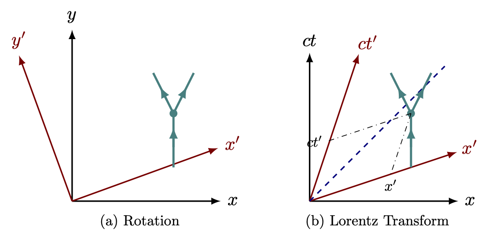{#fig-FLP_1_17_1 width=400}

회전변환은 공간에서의 선형변환이며 그중에 직교 변환(orthogonal transform) 으로 거리를 보존한다. 회전 변환은 공간상의 다른 방향에서 보는 것이라고 할 수 있다. 로런츠 변환은 4차원 시공간에서의 선형 변환으로 회전변환에 비유하자면 4차원 시공간의 다른 방향에서 보는 것이다. 그리고 이 방향은 @eq-FLP_1_17_1 의 $u$ 이다. 여기서 시공간상의 한 점 $(x,\,y,\,z,\,t)$ 를 **사건 (event)** 라고 한다.  

 

### I.17-2 시공간 간격 {#sec-FLP_1_17_2}

4-벡터로 표현된 사건 $X=(ct,\,x,\,y,\,z)$ 과 $X$ 를 로렌츠 변환 시킨 $X'=(ct',\,x',\,y',\,z')$ 를 생각하자. 이 때

$$
c^2t'^2 -x'^2 - y'^2 - z'^2 = ct^2 - x^2 - y^2 - z^2
$$ {#eq-FLP_1_17_3}

이며 이것은 앞서 [4-벡터](#sec-FLP_15_7) 에서 다룬 바에 의해 $\|X\| = \|X'\|$ 이다. 이 때 $\|X\|$ 를 원점과 사건 $X$ 의 **시공간 간격 (space-time interval)** 혹은 줄여서 **간격(interval)** 이라고 한다.

시공간과 일반적인 공간 사이에는 흥미로운 차이가 존재한다. 예를 들어 $X=(ct,\,x,\,y,\,z)$ 에서 $t=0$ 일 때 $\|X\|$ 는 허수이며 이 때 두 점-원점 $\mathcal{O}$ 와 $X$ 의 간격을 **공간적 간격 (space-like interval)** 이라고 한다. 반대로 $\|X\|$ 기 실수이면 **시간적 간격 (time-like interval)** 이라고 한다.

 

### I.17-3 과거, 현재 그리고 미래 {#sec-FLP_1_17_3}

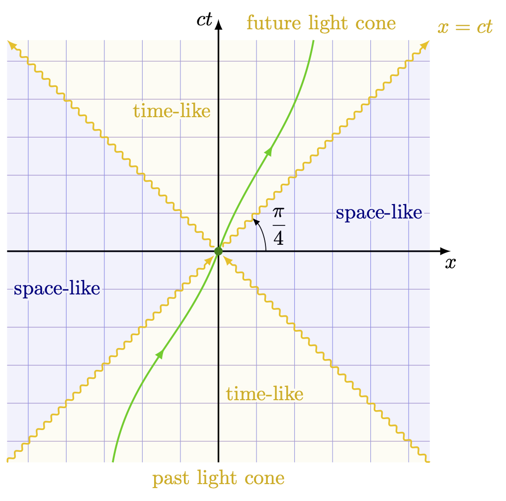{#fig-FLP_space_time_area_around_origin width=350}

### I.17-4 4-벡터에 더하여 {#sec-FLP_1_17_4}

수학적으로 4차원 시공간에서의 선형변환 $\Lambda$ 가 임의의 4-벡터 $X$ 에 대해 $\|\Lambda X\|=\|X\|$ 이며 $\det \Lambda = 1$ 일 때 $\Lambda$ 를 로렌츠 변환이라고 하며, 우리가 이미 알고 있는 로렌츠 변환과 동일하다. 여기서 4차원 시공간에서 정의된 벡터의 좌표변환이 로렌츠 변환에 의해 정의될 때 즉 $A=(A^0,\,A^1,\,A^2,\,A^3)$ 의 좌표변환이 $A'=\Lambda A$ 를 따를 때 이 $A$ 를 4-벡터 라고 한다. 이제 시공간에서의 위치 벡터 이외의 4-벡터가 존재함을 보이자.

우리는 이전에 에너지와 운동량을 $E=\gamma_v mc^2$, $\bf{p}=\gamma_v m\bf{v}$ 로 정의하였으며 $E^2-p^2c^2 = m^2c^4$ 임을 안다. 이것이 기술된 $S$ 기준틀에 대해 $\bf{u}=u\hat{\bf{x}}$ 의 속도로 움직이는 $S'$ 기준틀을 생각하자. 그렇다면 @eq-FLP_1_16_6, @eq-FLP_1_16_7 에 의해

$$
v'_x = \dfrac{v_x-u}{1-uv_x/c^2},\quad v'_y = v_y/\gamma_u,\qquad v'_z = v_z/ \gamma_u
$$

이며 

$$
E'=\gamma_{v'}mc^2
$$

이다. 여기서

$$
\begin{aligned}
1-\dfrac{{v'_x}^2}{c^2} &= \dfrac{c^2(1-uv_x/c^2)^2 - (v_x-u)^2}{c^2(1-uv_x/c^2)^2} \\[0.3em]
&=\dfrac{c^4-2c^2uv_x + u^2v_x^2-c^2v_x^2+2c^2uv_x - c^2u^2}{(c^2-uv_x)^2} \\[0.3em]
&= \dfrac{c^4-c^2v_x^2 - c^2u^2 + u^2v_x^2}{(c^2-uv_x)^2} = \dfrac{(c^2-u^2)(c^2-v^2)}{(c^2-uv_x)^2} \\[0.3em]
&= \dfrac{(1-u^2/c^2)(1-v^2/c^2)}{(1-uv_x/c^2)^2}
\end{aligned}
$$

이므로

$$
\gamma_{v'}= \dfrac{1}{\sqrt{1-{v'_x}^2/c^2}} = {\gamma_u \gamma_v}(1-uv_x/c^2)
$$

이다. 이로부터

$$
E' = \gamma_u \gamma_v mc^2 - \gamma_u \gamma_v uv_x = \gamma_u (E - u p_x)
$$

이다. 이후를 위해 약간 단위를 바꾸면

$$
\dfrac{E'}{c}= \gamma_u \left(\dfrac{E}{c} - \beta_u p_x\right) 
$$

이다. 또한

$$
\begin{aligned}
p'_x &= \gamma_{v'}mv'_x = \gamma_u \gamma_v (1-uv_x/c^2)\cdot m\dfrac{v_x-u}{1-uv_x/c^2} \\[0.3em]
&=\gamma_u (\gamma_v mv_x - \beta_u \gamma_v mc) = \gamma_u \left(p_x - \beta_u \dfrac{E}{c}\right), \\[0.3em]
p'_y &= \gamma_{v'}mv'_y = \gamma_v mv_y = p_y,\\[0.3em]
p'_z &= \gamma_{v;}mv'_z = \gamma_v mv_z = p_z.
\end{aligned}
$$

이다. 이로부터 

$$
P^\mu=\left(E/c,\,p_x,\,p_y,\,p_z\right)
$$

가 4-벡터 임을 알 수 있으며 이를 **4-운동량 (4-momentum)** 이라고 한다. $X^\mu,\,X_\mu$ 의 경우와 마찬가지로 $P_\mu = (E/c,\,-p_x,\,-p_y,\,-p_z)$ 이다. 

$$
\|P_\mu\| = \sqrt{\dfrac{E^2-(p_x^2+p_y^2+p_z^2)c^2}{c^2}}= mc
$$

임을 안다. 

### I.17-5 4-벡터 대수 {#sec-FLP_1_17_5}

4 벡터 $A^\mu$ 와 $A_\mu$ 에 대해

$$
\sum_{\mu=0}^3 A^\mu A_\mu = \sum_{\mu=0}^3 A_\mu A^\mu = (A^0)^2 - (A^1)^2 - (A^2)^2 - (A^3)^3
$$

이다. 

 

## I.26 광학 : 최소 시간 원리 {#sec-FLP_1_26}

### I.26-1 빛 {#sec-FLP_1_26_1}

{#fig-FLP_spectrum_of_flight }

위와 같이 넓은 전자기파의 파장 영역에서 특별히 흥미로운 세가지 혹은 그 이상의 근사 영역이 존재한다.

- **기하 광학 영역** : 파장이 우리가 다루고자 하는 장비애 비해 매우 작고, 광자 에너지가 장비의 에너지 민감도에 비해 매우 작은 경우.
- **고전 전자기 복사 이론으로 설명하는 영역** : 파장이 우리가 다루고자 하는 장비의 크기와 비슷하고 광자 에너지가 매우 작은 경우.
- **광자 설명 영역** : 파장이 매우 작아 파동으로서의 성격을 무시할 수 있으며 광자 에너지가 장비의 민감도에 비해 매우 큰 경우.

여기서는 기하 광학 영역에 한정하여 다루며, 파장이나 빛의 입자성에 대해서는 당분간 잊기로 하자. 적절할 때에 설명할 것이다. 빛이란 무엇인가에 대해서도 묻지 않기로 하고 단지 관심이 있는 규모보다 큰 영역에서 어떻게 행동하는지에 대해서만 알아보기로 하자. 

기하 광학은 단지 근사이지만 기술적으로 매우 중요하고 역사적으로 흥미롭다. 다른 주제와는 다르게 역사적 맥락에서 설명하기로 한다. 이것이 어떤 물리학적 이론이나 아이디어의 발전에 대해 보여줄 수 있기 때문이다.

 

### I.26-2 반사와 굴절 {#sec-FLP_1_26_2}

#### **거울 면에서의 반사**

입사각과 반사각은 같다. 즉 $\sin \theta_i = \sin \theta_r$ 이다.

#### **굴절과 스넬의 법칙**

빛이 입사하는 매질과 굴절되는 빛 사이에 $n_i\sin \theta_i = n_r \sin \theta_r$ 의 관계가 성립할 때 $n_i$ 와 $n_r$ 을 각각 그 매질의 **굴절률 (reflective index)** 라고 한다. 이 때 굴절률은 물질의 고유한 성질이며 진공일 때 $1$ 이며 공기에서는 $1.003$, 물은 $1.33$ 정도이다. 

  
 

### I.26-3 페르마의 최소시간 원리 {#sec-FLP_1_26_3}

::: {.callout-important icon="false"}

#### **페르마의 최소시간의 원리**

빛이 두 지점 사이를 거칠 때 따르는 경로는 가장 짧은 시간이 걸리는 경로이다.

:::

페르마의 최소시간 원리로부터 스넬의 법칙을 유도 할 수 있으며 굴절률 $n$ 과 매질에서의 빛의 속도 $c_n$ 그리고 진공중에서의 빛의 속도 $c$ 사이에는 다음의 관계가 성립함을 안다.

$$
nc_n = c
$$ {#eq-FLP_reflective_index_and_speed_of_light_in_the_medium}

::: {.content-hidden when-format="html"}

## hdd {#sec-FLP_fig_26_3}

:::

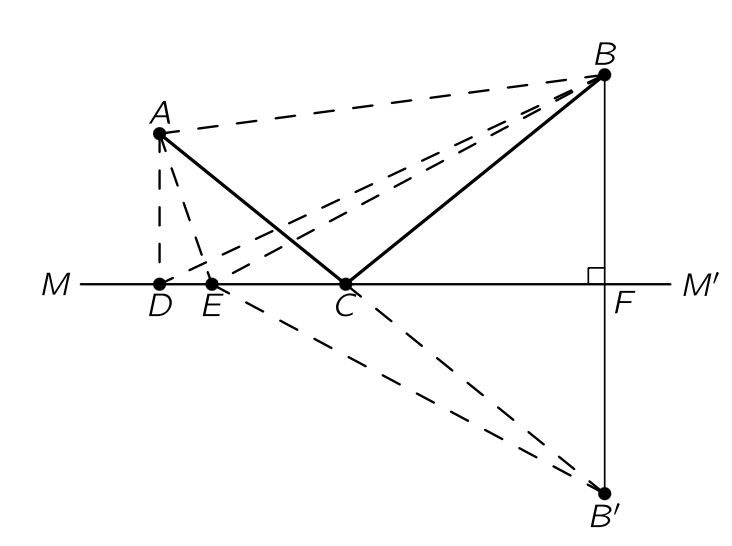{#fig-FLP_1_26_3 width=300}

 

### I.26-4 페르마의 원리의 응용 {#sec-FLP_1_26_4}

#### **가역 원리 (principle of reciprocity)** 

빛이 최소 시간 원리에 따라 $A\to B$ 의 한 경로로 진행한다면 $B$ 에서 $A$ 로 진행하는 경로는 정확히 반대 경로이다.

#### **평행한 면을 지난 유리를 통과하는 빛**

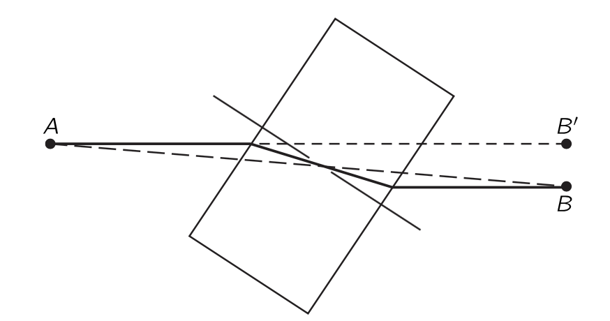{#fig-FLP_1_26_6  width=400}

위의 그림과 같이 투명한 블록이 평행한 면을 가지고 있고 및이 두 면을 통과할 때 입사 전 후의 두 빛은 평행하다.

#### **일몰 시간**

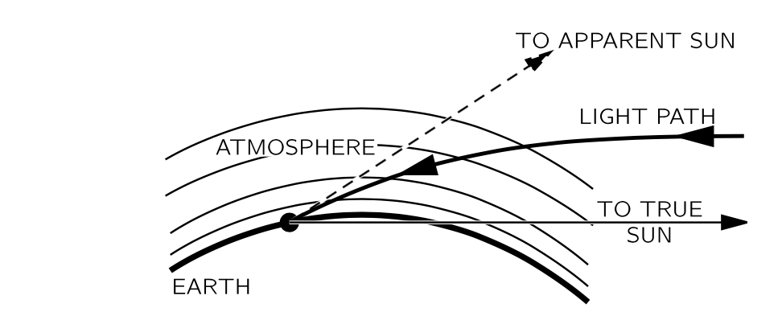{#fig-FLP_1_26_7 width=400}

우리가 본 일몰은 실제 해가 지고 난 이후이다.

#### **신기루**

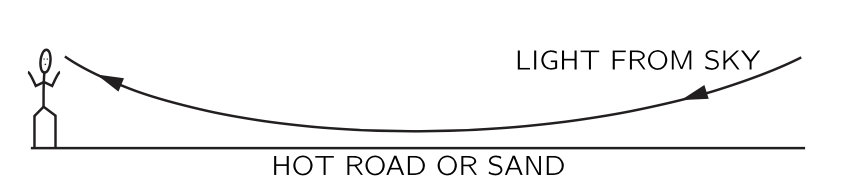{#fig-FLP_1_26_8 width=400}

#### **수렴 렌즈**
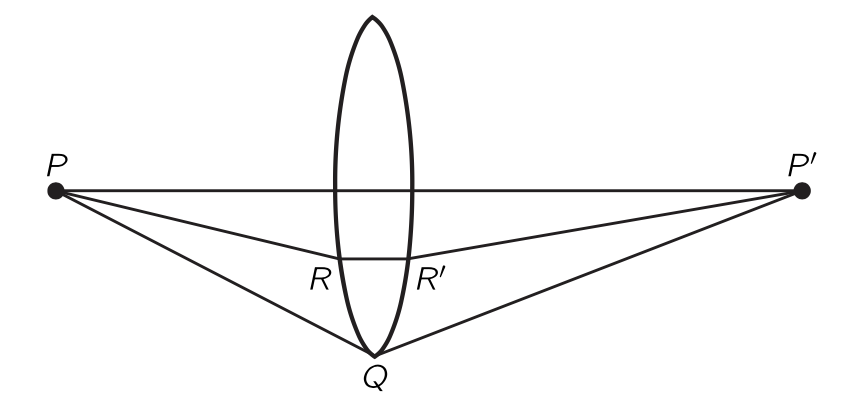{#fig-FLP_1_26_10 width=400}

$P$ 를 지나서 렌즈를 통과하는 모든 빛이 $P'$ 을 지나도록 만든 렌즈. 즉 $P$ 로부터 렌즈를 거쳐 $P'$ 으로 가는 모든 경로에서 걸리는 시간이 모두 같다. $P$ 와 $P'$ 을 **초점(focus)** 이라고 한다. 

#### **타원형 거울**

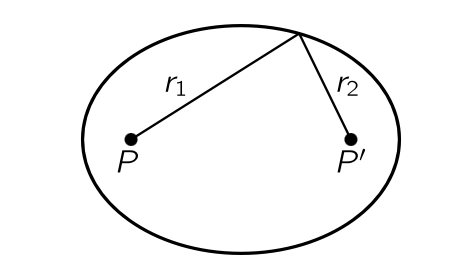{#fig-FLP_1_26_11 width=240}

$P$ 를 지나는 모든 빛은 $P'$ 을 지난다.

#### **포물선 거울**

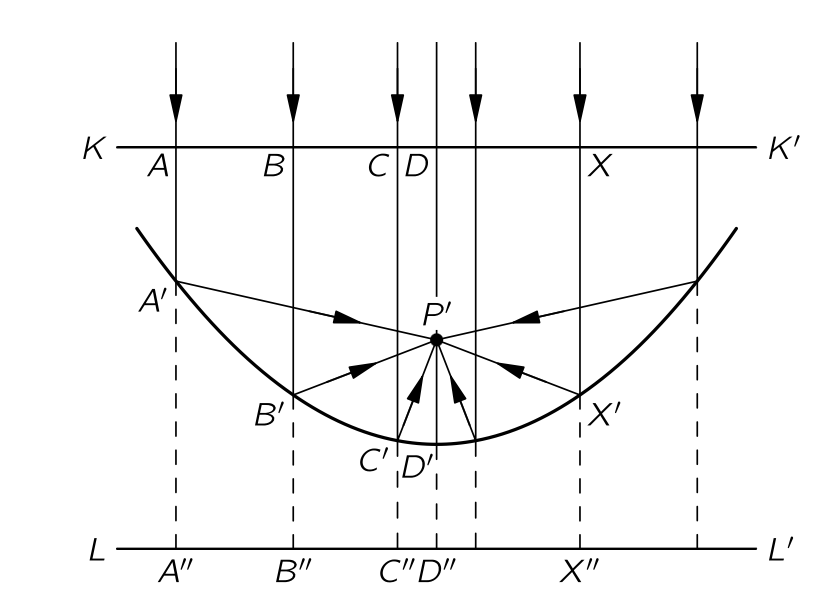{#fig-FLP_1_26_12 width=400}

포물선의 대칭선에 평행하게 들어오는 빛은 모두 $P'$ 을 지난다. 위의 그림에서의 $AA'$ 형태의 경로를 따르는 빛은 모두 $P'$ 을 지난다. 하나의 예를 들자면 $AA'+A'P'=DD'+D'P'$. 이런 포물선형 거울은 천체망원경에 사용된다. 

#### **굴절률의 규칙**

빛이 매질 $1$ 에서 매질 $2$ 로 들어갈 때 $\sin \theta_1 = n_{12}\sin \theta_2$ 의 관계가 성립한다고 하자. 또한 빛이 매질 $2$ 에서 매질 $3$ 으로 들어갈 때 $\sin \theta_2 = n_{23}\sin \theta_3$ 의 관계가 성립한다고 하자. 이 때 빛이 매질 $1$ 에서 매질 $3$ 으로 들어갈 때 $\sin \theta_1 = n_{13}\sin \theta_3$ 를 만족하는 $n_{13}$ 는 아래와 같이 구할 수 있다.

$$
n_{13}= \dfrac{n_3}{n_1}= \dfrac{n_3}{n_2}\dfrac{n_2}{n_1} = \dfrac{n_{23}}{n_{12}}.
$$ {#eq-FLP_1_26_5}

스넬의 법칙 단독으로는 위의 규칙을 얻을 수 없지만 페르마의 최소시간의 원리로는 이 규칙을 얻는다. 

#### **매질에서의 빛의 속도**

굴절률이 1.33 인 물에서의 빛의 속도는 공기에서의 빛의 속도보다 느릴 것을 예측했고 한참 이후 실험적으로 증명되었다.

 

### I.26-5 페르마의 원리의 좀 더 정확한 진술 {#sec-FLP_1_26_5}

::: {.callout-important icon="false"}

#### **페르마의 최소시간의 원리 (파인만 버젼)**

빛이 실제 진행하는 경로는 어떤 방식으로든 이 경로에서의 작은 변화에 대해 시간에 대한 1차 근사에는 변화가 없고 2차 근사에서의 변화만 있는 경로이다. 즉 빛이 거의 같은 시간이 걸리는 다른 많은 경로가 근처에 있는 경로를 따른다.
:::

우리는 스넬의 법칙을 통해 빛을 이해할 수 있다. 스넬의 법칙은 빛이 서로 다른 매질의 경계면에 어떤 이유로 그 경로가 꺾인다는 것을 말한다. 이 인과율의 연속으로 빛의 경로가 결정되는 것은 이해하기 쉽다. 그러나 최소 시간의 원리는 자연이 작동하는 방식에 대한 전혀 다른 철학이다. 원인과 결과의 연속이 아니라 상황이 정해지면 빛은 가장 시간이 적게 걸리는 경로를 찾아서 진행한다. 빛은 주변의 경로를 "냄새맡아 보고" 하나하나 비교하는가? 놀랍게도 답은 "그렇다" 에 가깝다. 이것은 기하광학에서 다루지 않았지만 "파장 (wavelength)" 이라는 개념과 관련되어 있다. 파장은 빛이 경로를 확인하기 위해 "냄새를 맡는" 범위 정도의 거리이다. 가시광선의 파장은 매우 짧기 때문에 빛으로 이것을 확인하는 것은 쉽지 않기 때문에 파장이 3 cm 인 라디오파를 생각하자. 

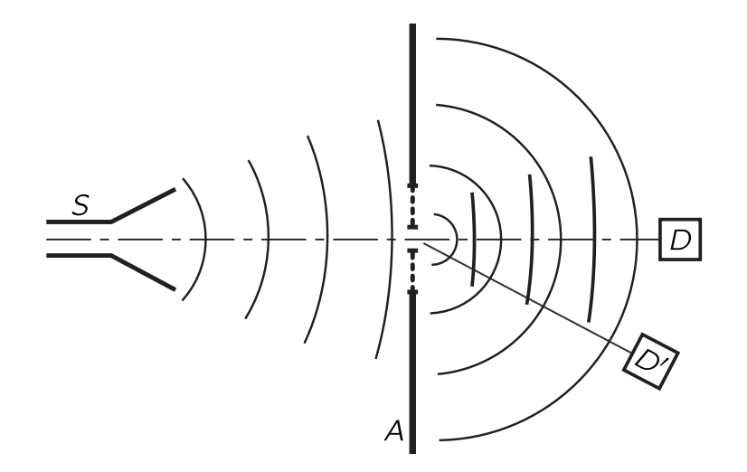{#fig-FLP_1_26_13 width=400}

**슬릿의 폭이 충분히 넓은 경우** : 빛은 직션경로를 따라 검출기 $D$ 에 도달한다. 우기라 검출기를 $D'$ 로 옮기면 빛은 주변 경로를 모두 확인한 다음에 "거기로 가면 안되. 우리들은 모두 다른 시간에 거기 도착하게되" 라고 소리치며 $D'$ 으로 향하지 않을 것이다. 

**슬릿의 폭이 매우 좁은 경우** : 슬릿의 폭이 파장에 비해 매우 작다면 (파장 범위 내에서) 빛이 주위 경로를 확인하는 것을 방해하게 되며 ... *이 부분은 좀 더 생각해 봐야 할 듯*

 

### I.26-6 어떻게 작동하는가? {#sec-FLP_1_26_6}

실제로 벌어지는 일에 대해 양자역학적인 관점에서 대략적으로 알아보자. @fig-FLP_1_26_3 에서의 빛의 경로는 전혀 파동 형태가 아니며 광자로 이루어진 것으로 보인다. 빛의 세기는 단위시간당 도달하는 광자의 개수이다.

우리가 계산하고자 하는 것은 $A$ 에서 출발한 빛이 거울을 거쳐 $B$ 에 도달할 확률이다. 경로 $\alpha$ 에 대해 확률은 복소수로 $\rho_\alpha e^{i \theta_\alpha}$ 로 표현되며 여기서 $\theta_\alpha$ 는 시간 도달 시간에 비례한다. 1초마다의 회전수가 빛의 진동수이다. 당연히 경로마다 $\theta_\alpha$ 다르다. 

이 때 빛이 $B$ 에 도달할 확률 $P_B$ 는 다음을 만족한다(는 것이 파인만 경로적분의 결론이다).

$$
P_B \propto  \left|\sum_{\alpha \in \text{all possible paths}} \rho_\alpha e^{i\theta_\alpha}\right|^2.
$$

이것과 거울에서의 (파인만 버젼의) 최소 시간의 원리의 연관을 알아보자. 

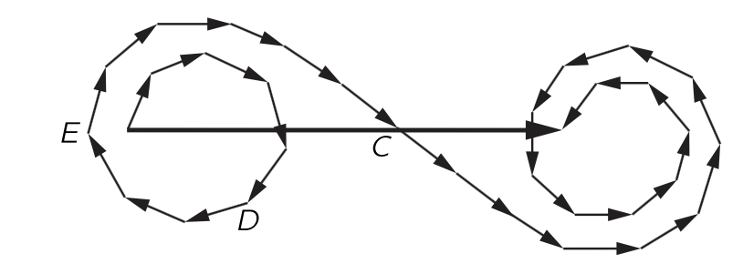{#fig-FLP_1_26_14 width=400}

$C$ 를 거치는 경로를 최소경로라고 하자. $C$ 를 거치는 경로에 가까운 경로들의 $\rho_\alpha e^{i\theta_\alpha}$ 는 $\rho_C e^{i\theta_C}$ 와 거의 차이가 나지 않는다는 것을 안다. (1차 근사항이 $0$ 이기 때문에 2차 근사항에서만 차이가 난다.) $D$ 를 거치는 경로나 $E$ 를 거치는 경로는 상대적으로 $e^{i\theta_\alpha}$ 에 큰 차이를 주기 때문에 확률에 크게 기여하지 않지만 $C$ 근처의 경로는 거의 차이가 없기 때문에 (@fig-FLP_1_26_14 를 보라) 확률에 큰 기여를 한다. 또한 $C$ 에서 멀리 떨어진 거울상의 점을 지나는 경로도 $D$ 나 $E$ 와 마찬가지 이유로 확률에 크게 기여를 하지 않는다. 확률은 위 곡선의 시작점과 끝점의 거리의 제곱에 비례하며 여기에 가장 큰 기여를 하는 경로들은 $C$ 근처의 $e^{i\theta_C}$ 와 비슷한 값을 갖는 경로들이다. 

 

## I.27 기하광학 {#sec-FLP_1_27}

### I.27-1 소개 {#sec-FLP_1_27_1}

- [빛](#sec-FLP_1_26_1) 에서 다룬 전기파의 세가지 근사역역 가운데 기하광학 영역에 대해서만 다룬다.
- 기하광학은 여기서 다루게 될 기초적인 기하광학이든 좀 더 복잡한 기하광학이든 앞으로 우리가 다룰 물리학의 분야와는 별 관련이 없다. 딱 한가지 해밀턴의 작업만 빼고. 그러나 이는 고등 역학의 내용이므로 여기서는 다루지 않는다.
- 앞으로 다루게 될 기하광학에서 많이 사용하게 될 공식이 있다. 

  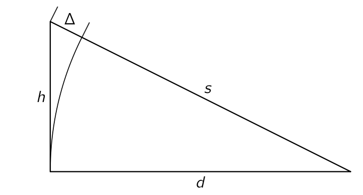{#fig-FLP_1_27_1 width=250}

  위의 그림에서 $\Delta = s-d = \sqrt{d^2-h^2}-d$ 이므로 다음이 성립한다.
  
  $$
  \Delta  \approx \dfrac{h^2}{2s}
  $$ {#eq-FLP-1_27_1}

 

### I.27-2  초점거리와 구면 {#sec-FLP_1_27_2}

#### **초점거리**

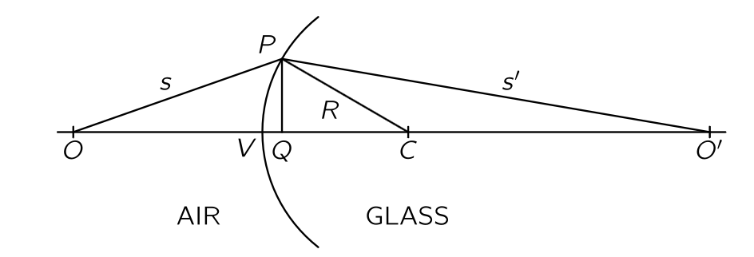{#fig-FLP_1_27_2 width=400}

위의 그림에서 공기중에서의 빛의 속도를 $1$, 유리에서의 빛의 속도를 $1/n$ 이라고 하자. 즉 유리의 굴절률은 $n$ 이다. 정해진 두 점 $O,\,O'$ 에 대해 $O$ 를 지나는 모든 빛이 $O'$ 을 지나도록 하는 유리의 면을 구한다고 하자. 그렇다면 유리의 표면의 임의의 점 $P$ 에 대해 빛이 $OP$ 에서 걸린 시간과 $PO'$ 에서 걸린 시간의 합이 같아야 한다. 즉

$$
|OP| + n\cdot |PO'|= \text{constant}
$$

이어야 한다. 이것을 직접 풀면 꽤나 복잡한 4차 함수가 되는데 $s\to \infty$ 극한에서는 훨씬 간단한 2차 함수가 된다. 게다가 실용적으는 $O$ 를 지나는 모든 빛에 대해서가 아니라 $OO'$ 선 주위에 대해서만 성립해도 많은 경우에서 받아들일 수 있다. 

한 점에서 출발한 빛이 다른 한 점에서 모이도록 하는 유리면이 매우 복잡하기 때문에 $OO'$ 축에 가까운 빛들만 촛점에 정확히 모이도록 하는 절충을 한다. $OO'$ 에서 멀어질수록 벗어나긴 하지만 구면(spherical surface) 를 사용한다. $OO'$ 축에 가까운 빛만 한 점에 모인다고 할 때 이 축에 가까운 빛을 을 근축 광선(Paraxial axis, 根軸 光線) 이라고 하며 우리가 집속 할 때 고려하는 빛은 모두 근축 광선이다. 여기서 구면의 중심은 $C$ 이다.

빛이 $OPO'$ 경로를 거치는 데 걸리는 시간과 $OO'$ 경롤르 거치는데 걸리는 시간이 같아야 하므로 
$$
|OP|+ n|PO'| = |OV|+n|VO'| = |OV|+n|VQ|+n|QO'|
$$

이다. $P$ 가 $OO'$ 축에서 매우 가깝다고 하자. 그렇다면 $|PQ|= h$ 에 대해

$$
|OP| \approx |OV|+|VQ|+\dfrac{h^2}{2s},\qquad |PO'| \approx |QO'|+\dfrac{h^2}{2s'}
$$

이며 $|VQ| = h^2/2R$ 이므로 다음의 관계가 성립한다.

$$
\dfrac{h^2}{2s} + n\dfrac{h^2}{2s'} = (n-1)\dfrac{h^2}{2R}.
$$ {#eq-FLP_1_27_2}

즉

$$
\dfrac{1}{s} + \dfrac{n}{s'} = \dfrac{n-1}{R}.
$$ {#eq-FLP_1_27_3}

즉 우리가 $O$ 와 $O'$ 의 위치를 알면 구면의 반경 $R$ 을 구할 수 있다. 또한 같은 재질 $n$, 같은 반경 $R$ 의 구면 렌즈는 @eq-FLP_1_27_3 를 만족하는 모든 $s,\,s'$ 에 대해서도 성립한다. 특히 흥미로운 것은 $s\to \infty$ 극한에서이다. 이 경우 

$$
f'=s'(s\to \infty)=\dfrac{nR}{n-1}
$$  {#eq-FLP_1_27_4}

을 **초점 거리 (focal length)** 라고 하며 $OO'$ 에 평행하게 오는 근축광선은 모두 $O'$ 에 모이게 된다. 거꾸로 유리 안쪽에서 구면에 매우 먼 빛이 들어온다면 $s'\approx \infty$ 대기중으로 나온 빛은 

$$
f=s(s'\to \infty) = \dfrac{R}{n-1}
$${#eq-FLP_1_27_5}

에 모이게 된다. 이를 이용하면 @eq-FLP_1_27_3 을 아래와 같이 쓸 수 있다.

$$
\dfrac{1}{s}+ \dfrac{n}{s'} = \dfrac{1}{f}.
$$ {#eq-FLP_1_27_6}

 

#### **실상과 허상**

@eq-FLP_1_27_6 에서 $s<f$ 인 경우 $s'<0$ 이며 $|s'|=(-s') > ns > s$ 이며 $O$ 에서 출발한 빛의 경로는 아래 그림과 같다. $O$ 에서 출발한 빛은 유리를 넘어 한 점에서 모이지 않고 아래 그림의 실선과 같이 발산한다. 하지만 발산하는 경로의 연장선은 아래 그림의 $O'$ 으로 모인다. 즉 렌즈 안의 빛의 경로는 마치 $O'$ 을 광원으로 하는 빛의 경로와 같다.

  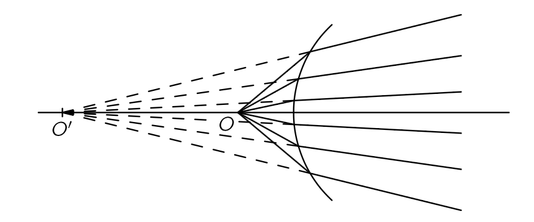{#fig-FLP_1_27_3 width=350}

@fig-FLP_1_27_2 의 $O'$ 과 다른 것은 @fig-FLP_1_27_2 의 $O'$ 은 빛이 실제 모이는 점이지만 @fig-FLP_1_27_3 의 $O'$ 은 빛이 실제 모이는 점이 아니라는 것이다. 그러나 $O'$ 은 명백한 상(image) 이며 이것을 **허상 (virtural image)** 라고 한다. 반면 @fig-FLP_1_27_2 의 $O'$ 은 실제 빛이 모이는 지점이므로 **실상 (real image)** 라고 한다. 

이제 $R\to \infty$ 인 경우를 생각해보자. $1/s + n/s'=0$ 이므로 $s'=-ns$ 이다. 우리가 굴절률이 큰 매질에서 굴절률이 작은 매질에 있는 물체를 볼 때 그 비율만큼 거리가 멀어져 보이며, 반대로 굴절률이 작은 매질에서 굴절률이 큰 매질에 있는 물체를 볼 때 그 비율만큼 거리가 가까워져 보인다.

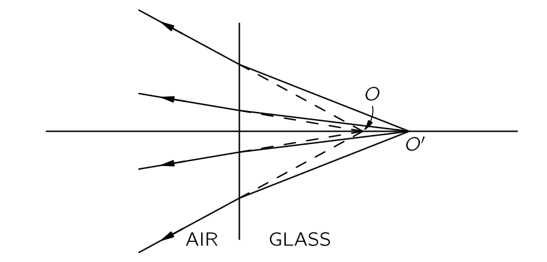{#fig-FLP_1_27_4 width=350}

이제 구면 거울에 대한 논의는 여기서 마치기로 하자. 마지막으로 구면 거울의 거리에 관련된 관례를 소개하겠다.

1. 객체 거리 $s$ 는 점 $O$ 가 표면의 왼쪽에 있을 경우 양수이다.
2. 점 $O'$ 이 표면의 오른쪽에 있을 경우 이미지 거리 $s'$ 은 양수이다.
3. 표면의 곡률 반경은 중심이 표면의 오른쪽에 있을 경우 양수이다.

 

### II.27-3 렌즈의 초점거리 {#sec-FLP_1_27_3}

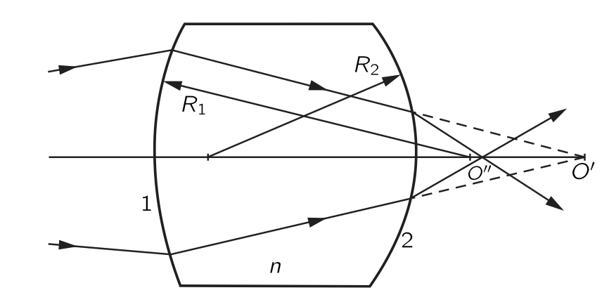{#fig-FLP_1_27_5 width=320}

대부분의 랜즈는 두개의 면을 가진다. 위의 그림과 같이 $R_1,\,R_2$ 의 두개의 곡률반경을 갖는 렌즈를 생각하자. @eq-FLP_1_27_3 을 이용하여 첫번째 면 $1$ 에 대해 $O$ 를 지나는 빛이 모이는 $O'$. 그리고 $O'$  에 대해 @fig-FLP_1_27_3 의 방법을 (역으로) 이용하여 이 양면렌즈의 상(허상)이 맺히는 $O''$ 을 잡을 수 있다.

식 @eq-FLP_1_27_3 은 굴절률 $1$ 인 매질에서 $n$ 인 매질로 입사할때의 식이다. 각각의 매질이 $n_1$, $n_2$ 의 굴절률을 갖고 있다면 다음을 만족한다는 것을 보일 수 있다.

$$
\dfrac{n_1}{s}+ \dfrac{n_2}{s'}= \dfrac{n_2-n_1}{R}
$$ {#eq-FLP_1_27_7}

아래 그림과 같이 두개의 양의 반지름을 갖는 매우 얇은 렌즈에 의한 효과를 알아보자. 매우 얇다는 것은 렌즈의 두께에 의한 효과를 무시할 수 있다는 뜻이다.

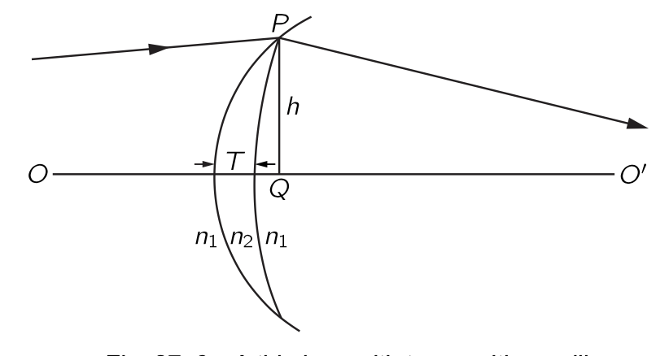{#fig-FLP_1_27_6 width=320}

위의 그림에서 $O$ 에서 나온 빛이 $O'$ 이 지나도록 어떻게 할 수 있을까? 빛이 $P$ (렌즈의 가장 얇은 부분)를 지난다면 $OPO$ 경로와 $OO'$ 경롤르 따를 때의 시간이 같기 위해서는 $OO'$ 선상의 두께 $T$ 에 대해 

$$
\dfrac{n_1 h^2}{2s} + \dfrac{n_1 h^2}{2s'} = (n_2-n_1)T
$$ {#eq-FLP_1_27_8}

의 관계를 만족해야 한다. 두 반경을 $R_1,\,R_2 (0<R_1<R_2)$ 라고 하면

$$
T = \dfrac{h^2}{2R_1} - \dfrac{h^2}{2R_2}
$${#eq-FLP_1_27_9}

이므로

$$
\dfrac{n_1}{s} + \dfrac{n_1}{s'} = (n_1-n_2)\left(\dfrac{1}{R_1} - \dfrac{1}{R_2}\right)
$$ {#eq-FLP_1_27_10}

이다. 이로부터 이 렌즈의 초점거리 $f$ 는 $f=\lim_{s\to \infty} s'$ 로부터

$$
\dfrac{1}{f} = \left(\dfrac{n_2}{n_1}-1\right)\left(\dfrac{1}{R_1} - \dfrac{1}{R_2}\right)
$$ {#eq-FLP_1_27_11}

임을 안다. 또한 $f'=\lim_{s'\to \infty}s$ 로부터

$$
f'=f
$$ 

임을 안다. 또한 초점거리 $f$ 를 이용하면

$$
\dfrac{1}{s} + \dfrac{1}{s'}= \dfrac{1}{f}
$$ {#eq-FLP_1_27_12}

임을 안다.

1. 평행한 빛은 렌즈에서 $f$ 만큼 떨어진 촛점으로 모인다.
2. $s$ 가 증가하면, 즉 $s$ 가 왼쪽으로 움직이면 $s'$ 은 감소한다. 즉 $s'$ 역시 왼쪽으로 움직인다. 즉 $s$ 와 $s'$ 은 같은 방향으로 움직인다.
3. $s=s'$ 이면 $s=s'=2f$ 이다. 

 

### I.27-4 확대 {#sec-FLP_1_27_4}

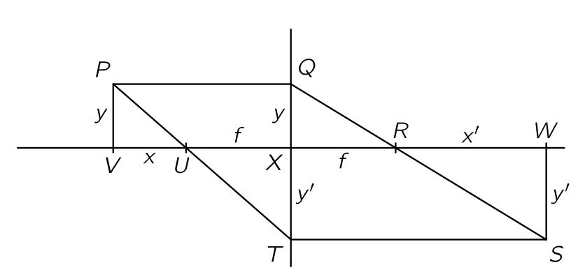{#fig-FLP_1_27_7 width=320}

앞서 언급한 얇은 렌즈가 위의 그림의 $QT$ 에 놓여 있다고 하자. 위의 그림에서 $U,\,R$ 은 초점으로 초점의 반대쪽 면에서 입사하는 평행 광선은 항상 초점을 지난다는 것을 안다. 초점에서 $x$ 만큼 떨어진 위치의 $V$ 에 높이 $y$ 의 물체가 서 있다고 하자. 즉 물체는 $PV$ 상에 위치한다. $P$ 로부터 $Q$ 를 지나는 빛은 초점 $R$ 을 통과한다. 또한 $P$ 에서 초점 $U$ 를 지나는 빛은 렌즈를 거쳐 ($T$) 평행 광선이 된다. 이 두 경로의 빛이 만나는 점이 그림에서의 $S$ 이며 이 점에 의해 상의 위치 $W$ 와(그리고 $R$ 로부터의 거리 $x'$ 과) 높이 $y'$ 이 결정된다. $\triangle PVU$ 와 $\triangle TXU$ 는 닮았고, $\triangle SWR$ 과 $\triangle QXR$ 역시 닮았으므로

$$
\dfrac{y'}{f} = \dfrac{y}{x},\qquad \dfrac{y'}{x} = \dfrac{y}{f}
$$ {#eq-FLP_1_27_13}

이며 이로부터

$$
xx' = f^2
$$ {#eq-FLP_1_27_16}

을 얻는다. 

 

### I.27-5 복합렌즈 {#sec-FLP_1_27_5}

 

### I.27-6 수차 (Aberrations) {#sec-FLP_1_27_6}

#### **수차와 수차의 종류**
지금까지는 근축광선으로 재한했다. 실제 렌즈는 일반적으로 **수차 (aberration) 현상** 을 보인다. 
 
- **구형 수차 (spherical aberration)** : 렌즈 표면을 구면으로 가공했기 때문에 나타나는 수차. 축에서 멀어질수록, 광선이 초점에서 벗어나기 시작하고 렌즈 상단 가장자리 근처에 닿는 광선은 초점을 상당히 크게 벗어나고 이로 인해 점 이미지 대신 흐리고 번진 이미지를 얻는다. 이를 구형수차라고 하며 구형 수차는 특정 물체 거리와 관계없이 렌즈 표면의 형태를 재구성하거나, 개별 렌즈의 수차가 서로 상쇄하도록 여러 렌즈를 배치함으로써 교정 할 수 있다.

-  **색수차 (chromatic aberration)** : 서로 다른 색상의 빛은 유리 내에서 속도가 다르며(굴절률이 역시), 따라서 주어진 렌즈의 초점 거리가 색상에 따라 달라진다. 이 경우 흰 반점을 촬영하면 이미지에 색상이 표시됩되며 빨간 반점을 초점 맞추면 파란색이 초점이 맞지 않게 되며 반대 역시 발생한다. 이 속성을 **색수차 (chromatic aberration)** 라고 한다.

- **코마 수차 (coma aberratiobn)** : 축과 빛의 경로가 나란하지 않을 때 생기는 수차를 코마$^{2}$ 수차라고 한다. 이미지는 보통 꽤 거칠고, 초점이 잘 맞지 않을 수도 있다.[$^2$ 혜성의 꼬리를 coma라고 한다.]{.aside}

#### **수차의 보정**  

최소 시간의 관점에서 보면 모든 광선이 가능한 한 거의 동일한 시간을 소요하도록 배치해야 한다고 생각하지만 이것이 사실이 아니다. 기하학적 광학 이론이 통하지 않는 영역에 접근해야 하기 때문이다. 아래는 파인만 강의의 원문이다.

>Remember that the principle of least time is not an accurate formulation, unlike the principle of conservation of energy or the principle of conservation of momentum. The principle of least time is only an approximation, and it is interesting to know how much error can be allowed and still not make any apparent difference. The answer is that if we have arranged that between the maximal ray—the worst ray, the ray that is farthest out—and the central ray, the difference in time is less than about the period that corresponds to one oscillation of the light, then there is no use improving it any further. Light is an oscillatory thing with a definite frequency that is related to the wavelength, and if we have arranged that the time difference for different rays is less than about a period, there is no use going any further.

 

### I.27-7 분해능 {#sec-FLP_1_27_7}

예를 들어 우리가 양 끝에 점이 있는 박테리아를 확대하는 현미경을 개발한다면 현며경을 통해 이 두 점이 구별되기를 기대할 것이다. 필요할때마다 렌즈를 추가하여 구면수차와 색수차를 상쇄시킨다면 우리가 원하는 만큼 확대시키지 못할 이유는 무엇인가? 그러나 최소시간이 정확하지 않기 때문에 확대에는 한계가 있다. 현미경에서 두 점이 구분되어 보이기 위해 실제로 두 점 사이의 거리가 얼마가 되어야 하는지를 결정하는 아름다운 규칙을 알아보자.

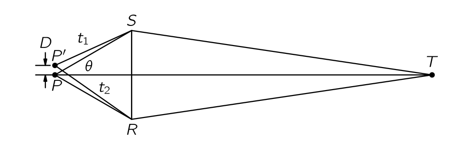{#fig-FLP_1_27_0 width=450}

일단 수차를 무시하고 점 $P$ 에서 출발한 광선은 (@fig-FLP_1_27_0) 동일한 시간을 거쳐 $T$ 에 도달한다고 하정하자. (완전한 시스템이 아니기 때문에 사실이 아니지만, 그것은 별도의 문제이다.) 이제 $P$ 근처의 $P'$ 에 대해 상이 $T$ 와 구별되는지 확인해보자. 물론, 기하광학에 따르면 두 점의 상이 있어야 하지만, 우리가 보는 것이 흐릿해서 구분하지 못할 수도 있다. $P'$ 의 상이 $T$ 와 명확히 다른 위치에 발생하기 위해서는 렌즈의 개구부 양쪽에서 한쪽 끝에서 다른쪽 끝까지 이동하는 $P'ST$ 와 $P'RT$ 의 소요시간이 $PST$ 와 $PRT$ 의 소요시간과 달라야 한다. 시간이 동일하다면 당연히 두 점 모두 같은 지점에 초점을 맞을 것이기 때문이다. 그렇다면 이 소요시간은 얼마나 차이가 나야 할까? 모든 광학 기기의 해상도에 대한 일반 규칙은 다음과 같다: 두 개의 서로 다른 점광원에 대해 한 점에서 출발하여 랜즈를 통과하여 상에 맺히는 곳까지의 최대 소요시간 $t_1$ 과 다른 점에서 출발하여 그 점까지의 최대 소요시간 $t_2$ 를 비교하면 빛의 진동수 $\nu$ 에 대해 다음을 만족해야 한다.

$$
t_2-t_1 > \dfrac{1}{\nu}.
$$ {#eq-FLP_1_27_17}

이로부터 두 점 사이의 거리가 $D$ 이고 점에서 랜즈 끝을 바라볼 때의 각을 $\theta$, 점 $P$ 에서의 굴절률을 $n$ 이라고 하면 $D>\lambda/(2n\sin\theta)$ 이어야 함을 알 수 있다. 따라서 광학 현미경을 통해 우리가 볼 수 있는 가장 작은 것들은 대략 빛의 파장 정도의 크기이다.

 

## I.28 전자기 복사 {#sec-FLP_1_28}

### I.28-1 전자기학 {#sec-FLP-1_18_1}

#### **역사적 맥락**

- 맥스웰(J. C. Maxwell) 은 이전까지의 전기와 자기에 관한 법칙을 통합하였으며 부분적으로 빛에 관한 법칙도 발견하였다.
- 전기력과 자기력은 대략 $1/r^2$ 에 비례한다는 공통적인 성질을 가지고 있다. 따라서 아주 멀리 떨어지진 전하는 서로에게 겨의 영향을 끼치지 못한다. 
- 멕스웰은 방정식을 통합하는 과정에서 기존에는 알지 못했던 새로운 항을 추가해야 한다는 사실을 발견하였으며 이에 따르면 전기장과 자기장의 일부는 $1/r$ 에 비례한다는 것을 발견하였다. 또한 한곳의 전류는 멀리 떨어진 다른 곳의 전하에 영향을 끼친다는 것을 발견하였다. 

#### **전자기 복사**

**전자기 복사 (electromagnetic radiation)** : 전자의 빠른 진동으로 인해 발생하는 전자기파.

- 19세기 말까지의 물리학적 지식
  - 뉴튼의 보편 중력 법칙
    $$
    \bf{F} = \dfrac{GmM}{r^2}\bf{e}_r.
    $$ {#eq-FLP_1_28_1}
  - 주어진 전기장 $\bf{E}$ 와 자기장 $\bf{E}$ 에서의 로런츠 힘
    $$
    \bf{F} = q(\bf{E}+ \bf{v}\times \bf{B}).
    $$ {#eq-FLP_1_28_2}

- 여기서 $\bf{E}$ 와 $\bf{B}$ 는 개별적인 전하에 의해 생성되는 전기장과 자기장의 벡터합이며 이렇게 개별적인 장의 벡터합으로 표현되는 것을 **중첩 (superposition)** 이라고 한다. 

- 하나의 개별 전하에 의한 전기장 $\bf{E}$ 는 아래와 같다. 사실, 전기와 자기의 올바른 법칙을 표기하는 가장 유용한 방법은 지금 우리가 쓰는 방식이 아니지만 우리가 아직 다루지 않았기 때문에 현재 우리가 알고 있는 표기법으로 표현하면 아래와 같다,

  $$
  \bf{E} = \dfrac{-q}{4\pi \epsilon_0} \left[\dfrac{\bf{e}_{r'}}{r'^2} + \dfrac{r'}{c} \dfrac{d}{dt}\left(\dfrac{\bf{e}_{r'}}{r'^2}\right) + \dfrac{1}{c^2} \dfrac{d^2 \bf{e}_{r'}}{dt^2}\right].
  $$ {#eq-FLP_1_28_3}

  - 첫번째 항은 쿨롱항이다 즉 $\bf{E}_C = \dfrac{-q\bf{e}_{r'}}{4\pi \epsilon_0 r'^2}$. 여기서 $r$ 은 전하 $q$ 와 전기장이 측정되는 위치 $P$ 사이의 거리이다. 이미 19세기에 모든 영향은 어떤 근본적인 상수로 정해지는 속도보다 빨리 전달 될 수 없다는 것이 발견되었다. 이 근본적인 속도가 빛의 속도 $c$ 이다.
  - 쿨롱의 법칙이 옳지 않은 것은 전하의 *현재* 위치와 전하와의 *현재* 거리를 알수 없을 뿐만 아니라 현재의 $P$ 점에서의 전기장에 영향을 주는 것은 과거, 정확히 $r'/c$ 만큼 이전의 과거이며 이 차이를 **지연 시간 (retarded time)** 이라고 한다. $r'$ 은 $q$ 를 떠난 신호가 시간 $t$ 에 $P$ 에 도달했을 때의 거리이다. 따라서 @eq-FLP_1_28_3 에 등장하는 방향은 **지연 거리(retarded distance)** $r'$ 에 대한 소위 **지연 방향 (retarded direction)** 인 $\bf{e}_{r'}$ 이 된다.
  - 두번째 항은 지연된 시간과 전기장의 시간에 대한 변화율을 곱한 값이다. 
  - 세번째 항은 지연 방향의 시간에 대한 이차 미분이다. 

- 자기장의 방정식은 다음과 같다.

$$
\bf{B} = - \dfrac{\bf{e}_{r'}\times \bf{E}}{c}.
$$ {#eq-FLP_1_28_4}

::: {.callout-warning icon="false"}

#### 파인만의 한마디 : 자기 자신이 생성하는 장의 영향

> For those purists who know more (the professors who happen to be reading this), we should add that when we say that (@eq-FLP_1_28_3) is a complete expression of the knowledge of electrodynamics, we are not being entirely accurate. There was a problem that was not quite solved at the end of the 19th century. When we try to calculate the field from all the charges including the charge itself that we want the field to act on, we get into trouble trying to find the distance, for example, of a charge from itself, and dividing something by that distance, which is zero. The problem of how to handle the part of this field which is generated by the very charge on which we want the field to act is not yet solved today. So we leave it there; we do not have a complete solution to that puzzle yet, and so we shall avoid the puzzle for as long as we can.

고전 전자기학에서 점전하에서 자기 자신이 생성하는 장의 영향은 개념적으로 완전히 깔끔하게 해결되지 않았다.

조금만 더 정리한다면 :

- 우리가 보통 쓰는 전자기학은 “점전하가 외부 장을 받는다”는 수준에서는 완벽하게 잘 작동한다.
- 그러나 “점전하가 자기 자신과 상호작용한다”까지 밀어붙이면 이론의 구조적 한계가 드러난다.
- 따라서 실전 계산에서는 자기장 효과를 직접 계산하지 않고 유효 방정식(예: 복사 반작용 항)을 따로 도입하거나 양자이론으로 넘어간다.

:::

 

### I.28-2 전자기 복사 {#sec-FLP_1_28_2}

@eq-FLP_1_28_3 에는 거리의 제곱이 아니라 거리에 반비례하는 항이 존재하며, 충분히 먼 거리에서는 이 항이 지배적이 된다. 구체적으로 찾아보는 것은 다음으로 미루기로 하고 일단 이것을 받아들이기로 하자. 정답은 세번째 항이다. 이제 우리는 당분간 다음을 법칙으로 받아들이자.

$$
\bf{E}= -\dfrac{q}{4\pi \epsilon_0 c^2} \dfrac{d^2 \bf{e}_{r'}}{dt^2}.
$$ {#eq-FLP_1_28_5}

- $\bf{e}_{r'}$ 이 시간에 대한 이차 변화를 radial 방향과 transverse 방향으로 분해 할 수 있다. 이 때 radial 방향의 변화는 $1/r'^2$ 에 비례 하여 변하며 transverse 방향은 $1/r'$ 에 비례한다. 따라서 우리는 충분히 멀다면 transverse 방향만 고려해야 한다는 것을 알 수 있다. 
- @eq-FLP_1_28_3 는 상대성 이론에 의한 효과까지 포함되어 있다.

이제 좀 더 단순한 상황을 생각해보자. 전하의 움직임은 느리고 움직이는 범위는 작다. 그렇다면 지연 시간은 거의 상수 $r/c$ 이다. 이제 전하가 $x$ 방향으로만 움직인다고 가정한다. 그렇다면 

$$
\dfrac{d^2 \bf{e}_{r'}}{dt^2} = \dfrac{d^2 \left(\bf{e}_{r'}\right)_\text{transverse}}{dt^2} \approx \dfrac{d^2}{dt^2}\left(\dfrac{x}{r'}\right)\hat{\bf{x}} \approx \dfrac{a_x(t-r/c)}{r}\hat{\bf{x}}
$$

이며 따라서 전기장은 대부븐 $E_x$ 이고 다음과 같다.
$$
E_x (t)= - \dfrac{q}{4\pi \epsilon_0 c^2 r} a_x\left(t-\dfrac{r}{c}\right)
$$ {#eq-FLP_1_28_6}

 

### I.28-3 쌍극자 복사체 {#sec-FLP_1_28_3}

우리는 @eq-FLP_1_28_6 를 (1) 우리가 보는 방향에 대해 직각 방향으로 (2) 천천히 움직이는(non-relativistic) (3) 멀리 떨어져 있는 전자기 복사에 대한 기본 법칙으로 (당분간) 간주한다. 이 식의 가속도는 $r/c$ 만큼의 시간 이전의 가속도이다. 이 장에서는 이 식의 물리적 의미에 대해 다루며 이후에는 빛과 전파(라디오파)의 전달에 대한 모든 현상-반사, 굴절, 간섭, 회절, 산란 과 같은-을 설명하는데 사용할 것이다.

::: {#exm-FLP_dipole_genertor}

#### **고주파 신호 발생기 와 쌍극자 안테나**

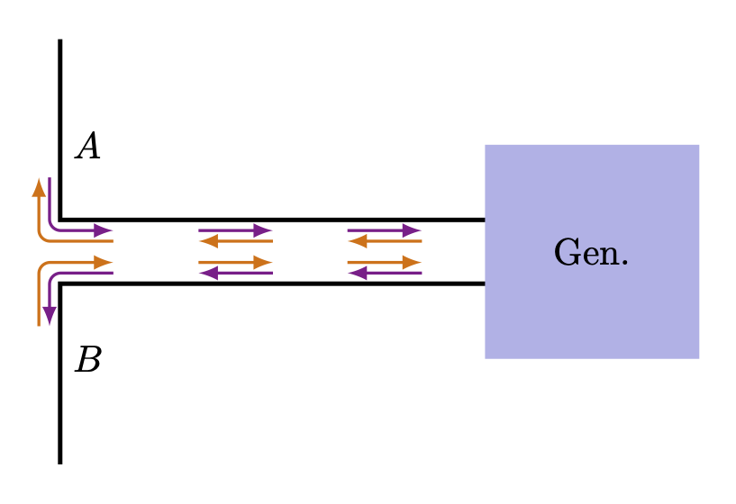{#fig-FLP_1_28_1 width=350}

위의 그림과 같이 고주파 발전기에 도선을 연결시킨것을 생각하자. 두 도선 $A,\,B$ 에 흐르는 전류의 방향은 발전기의 주파수에 맞춰 반대방향으로 바뀐다. 멀리서 보면 이것은 단지 $A,\,B$ 도선상에서 전류의 방향이 주기적으로 바뀌는 전기 쌍극 진동자 (electric dipole osciilator) 이다. 이 진동자에서 발생하는 전기장은 @fig-FLP_1_28_1 에서 발전기를 전류계로 바꾼(그리고 신호 증폭기 등을 추가한) 장비를 이용하여 측정 할 수 있다. 

앞서 설명했듯이 쌍극 진동자의 경우 transverse 방향이 지배적이기 때문에 아래 그림과 같이 $1$ 번 위치에서는 검출기의 방향과 진동자의 방향이 평행할 때 가장 큰 신호를 받는다. 만약 $3$ 의 위치에 검출기가 있다면 아무 신호를 받지 못한다. 물론 $1$ 의 위치에서 안테나의 방향이 $G$ 를 향해도 아무 신호도 받지 못한다.

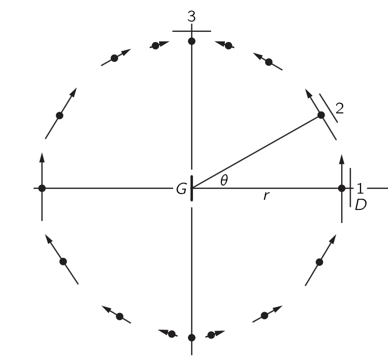{#fig-FLP_1_28_2 width=350} 
:::

 

### I.28-4 간섭 {#sec-FLP_1_28_4}

두개의 전자기파 원이 있을 때 외부에서의 전기장은 각각의 전자기파 원에서의 전자기장의 벡터합으로서 상쇄 혹은 보강이 있을 수 있다.... 는 것에 대한 내용들. 이것을 **간섭 (interference)** 라고 한다. 

 

## I.29 간섭 {#sec-FLP_1_29}

### I.29-1 전자기파 {#sec-FLP_1_29_1}

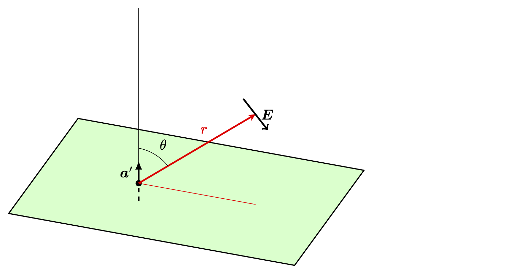{#fig-FLP_1_29_1 width=450}

위의 그림과 같은 상황에서 @eq-FLP_1_28_6 은 아래와 같다.

$$
E(t) = - \dfrac{qa(t-r/c) \sin \theta}{4\pi \epsilon_0 c^2r}.
$${#eq-FLP_1_29_1}

여기서 $a(t-r/c)$ 는 시간이 $t-r/c$ 일 때의 가속도로 **지연 가속도(retarded acceleration)** 라고 한다.

 

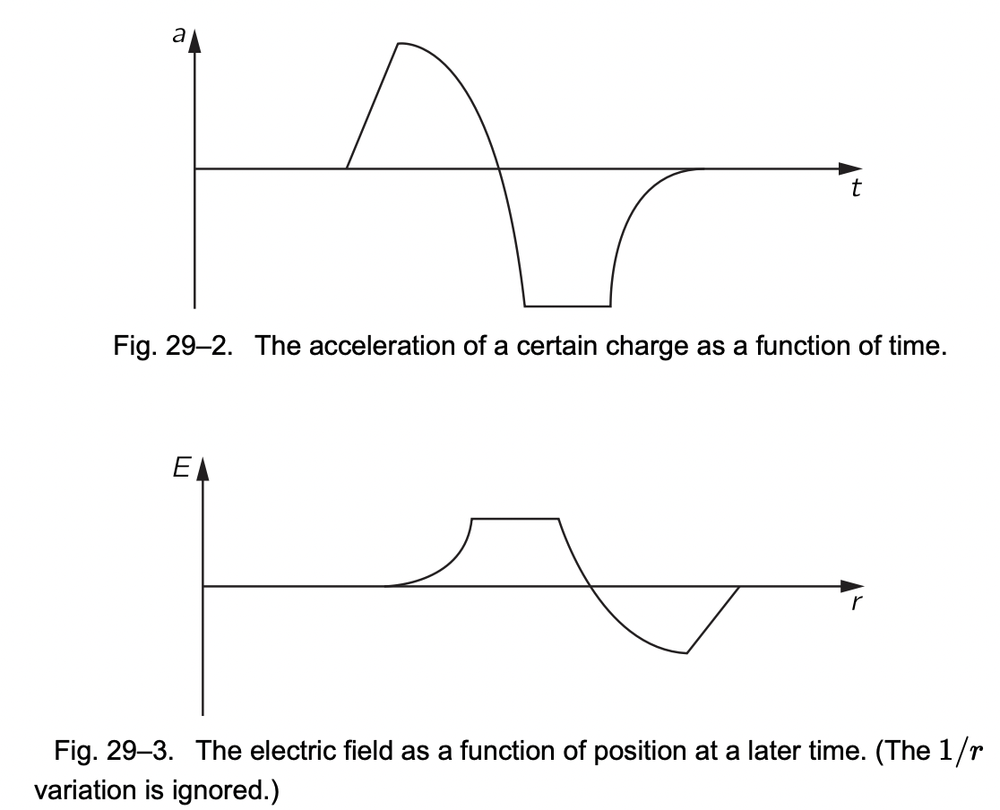{#fig-FLP_1_29_2 width=450}

- 시간이 지남에 따라 장은 source 로부터 퍼져나가는 파동처럼 움직인다. 
- 특별이 전하 $q$ 가 $x=x_0 \cos \omega t$ 와 같이 움직일 경우 가속도는

  $$
  a=-\omega^2 x_0 \cos \omega t = a_0 \cos \omega t
  $$ {#eq-FLP_1_29_2}

  와 같고 전기장은 @eq-FLP_1_29_1 에 의해 아래와 같다.

  $$
  E= - q \sin \theta \dfrac{a_0 \cos \omega (t-r/c)}{4\pi \epsilon_0 rc^2}.
  $${#eq-FLP_1-20_3}
 

### I.29-2 복사 에너지 {#sec-FLP_1_29_2}

- 진동자가 전기장에서 움직인다고 하자. 즉 전기장이 사인파이며 $F=qE = ma$ 로부터 속도, 가속도, 최대 변위 모두 전기장에 비례한다. 그리고 운동에너지는 $E^2$ 에 비례한다. 이로부터 장이 전달하는 에너지는 $E^2$ 에 비례할 것이라는 것을 안다.

- 따라서 radiation 에 의해 전기장은 $E \propto 1/r$, 에너지 $\mathcal{E} \propto E^2 \propto 1/r^2$

 

### I.29-3 사인파 {#sec-FLP_1_29_3}

- 각진동수 $\omega$ 에 대해 파수(wave number) $k$ 를 단위 거리당 변경되는 파동의 위상으로 정의하자. @eq-FLP_1-20_3 에서 위상 $\phi = \omega (t-r/c)$ 이므로 
  $$
  k = \left|\dfrac{d\phi}{dr}\right| = \dfrac{\omega}{c} 
  $$ {#eq-FLP_1_29_4}

  이다. 참고로 빛이 아닌 경우 각진동수와 파수 사이에는 위와 같은 간단한 관계가 일반적으로 성립하지 않는다. 또한 파장 $\lambda$ 는 한 주기의 파동이 공간상에서 차지하는 거리이며 $\lambda = 2\pi/k$ 이다. 

- 이제 위상을 파수와 각진동수에 대해 $\phi = \omega t - k x$ 와 같이 쓸 수 있다.

- 실제로 전기장은 $1/r$ 항 이외에 $n>1$ 에 대한 $1/r^n$ 항이 존재한다. $r$ 이 충분히 크면 $1/r^n$ 항을 무시할 수 있다. 정성적으로  $1/r^n$ 항에서 $r > n \lambda$ 보다 크면 무시 할 수 있다.

 

### I.29.4 두 쌍극자 복사자 {#sec-FLP_1_29_4}

두 진동자의 중심과 검출기가 평면상에 있으며 이 평면에 대해 진동자는 이 평면에 대해 수직으로 진동한다고 하자. 

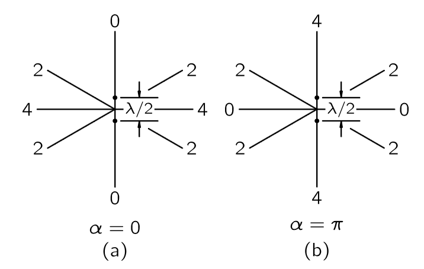{#fig-FLP_1_29_5 width=350}

위의 그림은 위에서 본 두 진동자의 전기장의 세기를 보여준다. 그림의 설명을 읽어보자. 에너지 intensity 는 단위 시간당 전달되는 에너지를 말하며 여기서는 당연히 전기장의 제곱의 시간에 대한 평균에 비례한다. 위의 그림에서 보듯이 우리는 우리가 전기장에 의한 신호를 보내고자 하는 방향뿐만 아니라 그 반대방향으로 강한 신호를 보낼 수 있다. 이것을 약간 더 조합해보자. 아래 그림과 같이 $\lambda/4$ 만큼 떨어진 두 쌍극자가 $\pi/2$ 만큼의 위상차로 진동한다고 하자.

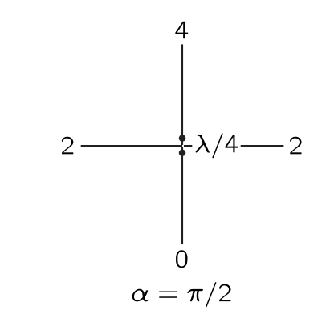{#fig-FLP_1_29_6 width=200}

그렇다면 위의 그림과 같이 북쪽 방향으로 가장 강한 신호가 전달되며 반대방향으로는 거의 신호가 전달되지 않는다. 

이제 쌍극자를 지혜롭게 배치하여 에너지가 한쪽 방향에 집중하여 전달되도록 할 수 있다는 것을 보이자. 아래 그림은 $10\lambda$ 만큼 떨어져 있는 두 쌍극 진동자에 의한 intensity 이다.

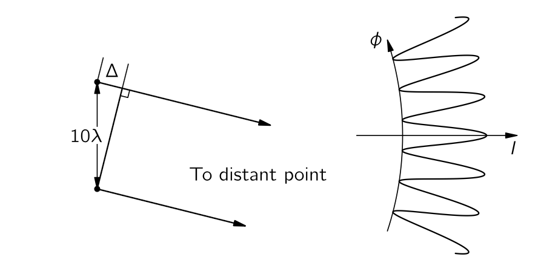{#fig-FLP_1_29_7 width=400}

아래 그림은 $2\lambda$ 만큼씩 떨여지 있는 6개의 쌍극 진동자에 의한 intensity 이다.

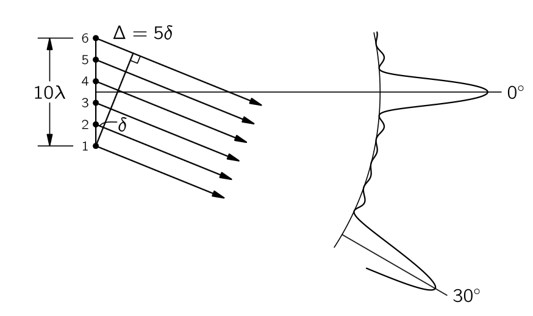{#fig-FLP_1_29_8 width=400}

이렇게 $2\lambda$ 간격으로 쌍극자를 일렬로 배치한 후 각 진동자의 상대적인 위상을 조절하면 우리가 원하는 방향으로 강한 에너지를 보낼 수 있다. 

 

### I.29.5 간섭의 수학 {#sec-FLP_1_29_5}

벡터 혹은 복소수를 이용한 두 파동의 합.

 

## I.30. 회절 {#sec-FLP_1_30}

### I.30-1 $n$ 개의 동일한 진동자에 의한 최종 진폭 {#sec-FLP_1_30_1}

- 간섭(interference)과 회절(diffreraction) 의 구분 : 명확한 구분은 없지만 source 가 적으면 간섭, source 가 많으면 회절 이라고 하자.

같은 간격으로 직선상에 위치한 동일한 $n$ 개의 진동자를 생각하자. 각각의 진동자의 진폭은 같지만 위상은 다르다. 위상 차이는 실제적인 두 진동자의 위상 차이일 수도 있고 각 진동자로부터의 거리차이로 인한 위상차 일 수 있다. $0$ 번째 진동자부터 시작하여 $j$ 번째 진동자 위상이 $j\phi$ 일 때 이 진동자에 의한 진폭을 합친 최종 진폭(resultant amplitude) $R$ 은 아래와 같다.

$$
R = A\left[\cos (\omega t) + \cos (\omega t+ \phi) + \cdots + \cos (\omega t + (n-1) \phi)\right].
$$ {#eq-FLP_1_30_1}

여기서 $\phi = \alpha + 2\pi d \sin \theta/\lambda$ 인 경우를 생각해보자. 

$$
\begin{aligned}
R &= \dfrac{1}{2} \left[\sum_{j=0}^{n-1} Ae^{i(\omega t + j\phi)} + (\text{complex conjugate}) \right] \\[0.3em]
&= \dfrac{1}{2}\left[Ae^{i\omega t}\dfrac{e^{i n \phi /2}}{e^{i\phi /2}}\dfrac{\sin(n\phi /2)}{\sin{\phi/2}}   + (\text{complex conjugate})\right] \\[0.3em]
&= A \cos \left(\omega t + \dfrac{(n-1)\phi}{2}\right) \dfrac{\sin (n\phi/2)}{\sin(\phi/2)}.
\end{aligned}
$$

따라서 최종 진폭 $A_R$ 은

$$
A_R = A \dfrac{\sin (n \phi/2)}{\sin (\phi/2)}
$$ {#eq-FLP_1_30_2}

이며 최종 intensity 는

$$
I = I_0 \dfrac{\sin^2 (n\phi/2)}{\sin^2 (\phi/2)}
$$ {#eq-FLP_1_30_3}

이다.

우리는 $\phi \sim 0$ 에서 $I=n^2I_0$ 임을 알 수 있다. 즉 $n$ 개의 동일한 진동자에 의해 발생되는 에너지는 가장 큰 방향으로는 $n^2$ 에 비례하여 발생한다. (같은 위상의, $\lambda$ 만큼씩 떨여져 있는 $n$ 개의 진동자의 경우와 같다.) 위의 식을 통해 아래의 그림을 그릴 수 있다. $n\phi = 2m\pi$ 인 정수 $m$ 이 존재할 때 $I=0$ 이다. 또한 아래 그래프에서 전체 영역 $[-\pi,\, \pi]$ 에 대한 적분은 $2\pi n I_0$ 임을 계산 할 수 있다.(see [StackExchange](https://math.stackexchange.com/questions/1304167/integral-of-frac-sin2nx-2-sin2x-2-over-pi-pi))

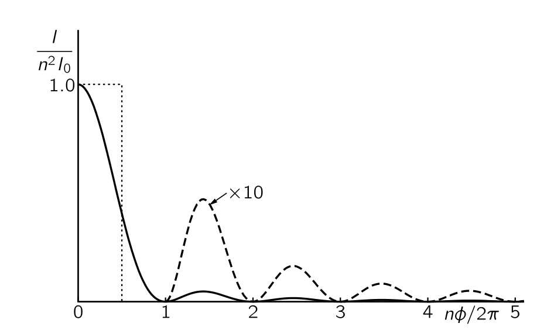{#fig-FLP_1_30_2 width=400}

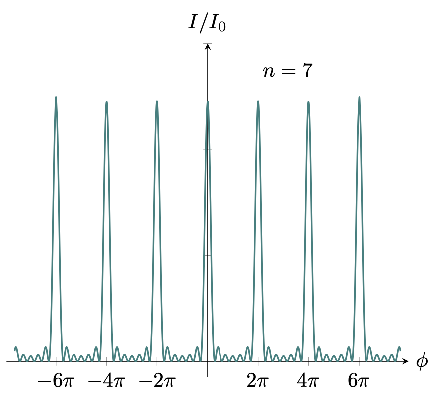{#fig-FLP_tfig2 width=400}

이제 아래 @fig-FLP_1_30_3 같은 진동자 배치를 생각하자. 직선상에, 인접한 진동자와 $d$ 만큼 떨여진 $n$ 개의 진동자가 위치한다. $j$ 번째 진동자는 $j\alpha$ 만큼의 위상(phase) 를 가진다고 하자. 이 진동자가 가 위치한 직선에 수직인 방향으로 $\theta$ 만큼의 각을 가진 위치에서 측정한다고 하자.

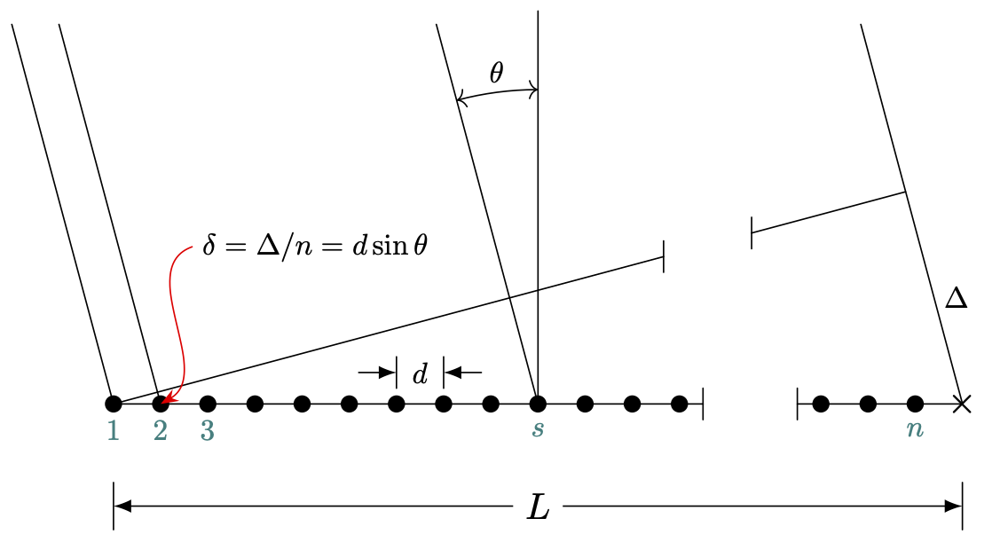{#fig-FLP_1_30_3 width=450}

측정하는 위치에서는 진동자 자체의 위상과 시간 지연에 의한 위상이 합쳐진 위상으로 느끼므로 측정하는 위치에서의 인접한 진동자의 위상차 $\phi$ 는 아래와 같다.
$$
\phi = \alpha + 2\pi d \sin \theta/\lambda = \alpha + kd\sin \theta.
$$ {#eq-FLP_1_30_4}

우선 $\alpha=0$ 인 경우는 @eq-FLP_1_30_3 의 경우와 같다. 이 때 첫번째 극소점은 $\phi = 2\pi/n$ 일 때이며 이는 
$$
\lambda = nd\sin \theta
$$ {#eq-FLP_1_30_5}

를 의미한다. @fig-FLP_1_30_3 에서 $\Delta = L\sin\theta = nd\sin\theta$ 이며 따라서 첫번째 극소점은 $\Delta =\lambda$ 일 경우이다.

@eq-FLP_1_30_3 에서 알 수 있는 하나 중요한 사실은 정수 $m$ 에 대해 $\phi = 2 m\pi$ 일 때 최대값이 등장한다는 것이다. 즉 $2\pi d \sin \theta/\lambda = 2\pi m$ 조건이며 이로부터

$$
d\sin\theta = m\lambda
$$ {#eq-FLP_1_30_6}

을 얻는다. @fig-FLP_tfig2 에서 $2\pi$ 주기로 나타나는 큰 픽을을 의미하며 @eq-FLP_1_30_5 와 비슷하지만 완전히 다른 의미임을 명심하라. 여기서 $m$ 의 빔의 **차수 (order)** 라고 하며 $m$ 값에 따라 $0$-차 빔(zero-order beam), $$1$-차 빔(first-order beam), $2$-차 빔(second-order beam) ... 이라고 한다.

@eq-FLP_1_30_6 에서 주의해야 할 것은 $d\le \lambda$ 이면 가능한 해는 $m=0$ 일 때 뿐이라는 것이다. 따라서 강한 신호를 보내려면 간격 $d$ 를 파장보다 크게 잡아야 한다.

 

### I.30-2 회절 격자 {#sec-FLP_1_3_20}

- (파장이 긴 라디오파를 다루는 경우) 안테나와 전선을 다룰 때 모든 작은 진동자, 즉 안테나의 위상을 동일하게 맞출 수 있다. 그렇다면 빛의 경우는? 광학 영역(optical frequency range)$^3$의 빛의 파장은 매우 짧기 때문에 (파인만 당시에는) 불가능하다. 그러나 다른 방법으로 같은 일을 할 수 있다. [$^3$ 적외선 부터 가시광선을 포함하여 자외선 까지를 광학 영역이라고 한다.]{.aside}

#### **산란**

- 서로 $d$ 만큼 떨어진 평행한 전선과 아주 멀리 떨어진(실용적으로 무한대만큼 떨여졌다고 볼 수 있는) 라디오파 발생장치를 생각하자. 각각의 전선에 도달할 때 같은 위상을 가진다고 간주 할 수 있다. 전달된 전자기장에 의해 도선의 전하는 진동하며 따라서 새로운 전자기파 발생장치로 볼 수 있다. 이 현상을 **산란 (scattering)** 이라고 한다. 
- 라디오 발상장치에서의 라디오파가 전선들이 이루는 평면에 수직하게 입사된다면, 그리고 전선의 간격이 파장보다 크다면 이 평면에 수직한 방향과 @eq-FLP_1_30_6 에 의해 정해지는 방향으로 강력한 전자기파가 발생한다. 

#### **회절 격자**

- 유리판에 일렬로 작은 흠을 파서 흠(notch)이 파이지 않은 다른 부분과 다소 다르게 산란되도록 한다. 흠 사이의 간격은 매우 일정하며 빛의 파장보다는 크다.  
- 여기에 빛을 비추면 일부의 빛은 유리를 통과하지만 각각의 흠이 광원의 역할을 하며 특정한 각도로 강한 빛이 나온다. 이 각도는 틈의 간격과 관련이 있다. 이를 **회절 격자 (diffraction grating)** 라고 한다.
- 여러 파장의 빛이 섞여 있을 경우 @eq-FLP_1_30_6 를 보면 알 수 있듯이 강한 빛이 나오는 각도가 빛의 진동수(파장, 에너지...) 에 따라 다르다. 따라서 백색광선을 사용한다면 프리즘과 같은 효과를 낸다. $m$ 차 빔도 당연히 발생한다.
- 이전의 논의에 의하면 각각의 $m$ 차 빔은 같은 빛의 세기를 가져야 하지만 실제로는 그렇지 않다. 심지어 같은 차수 빔의 왼쪽과 오른쪽이 다르기도 하다. 이것을 의도하고 홈의 모양을 비대칭적으로 만들기도 한다.

지금까지는 광원에서의 위상이 모두 같은 경우를 생각했다. 회절 격자를 이용해 임의의 위상차를 주는 방법을 알아보자. 아래 그림과 같이 $d$ 의 간격을 갖는 회절격자에 $\theta_\text{in}$ 의 입사각으로 빛을 쐬어준다고 하자. 그리고 $\theta_{\text{out}}$ 만큼의 산란각을 갖는다고 하자.

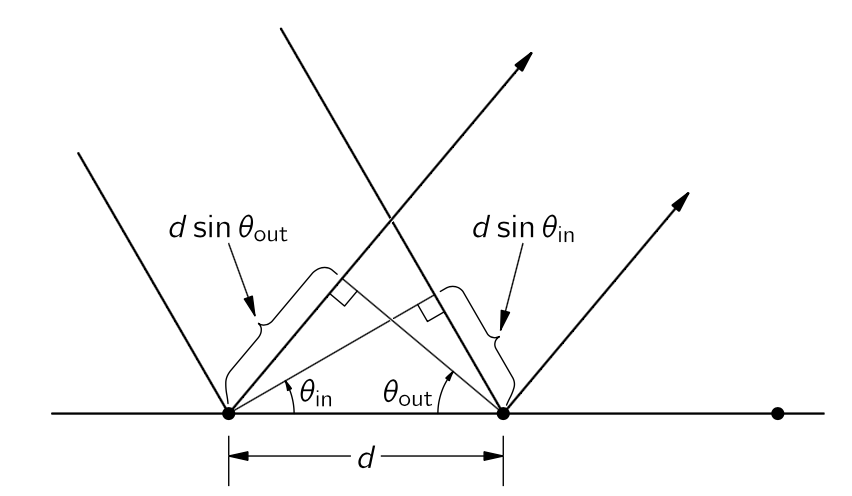{#fig-FLP_1_30_4 width=400}

그렇다면 회절격자의 인접한 두 선에서 발생하는 경로차 $\phi$ 는

$$
\begin{aligned}
\phi &= \dfrac{2\pi d \sin \theta_\text{out}}{\lambda} - \dfrac{2 \pi d \sin \theta_\text{in}}{\lambda} = \dfrac{2\pi d}{\lambda}(\sin \theta_{\text{out}}- \sin \theta_\text{in})\\[0.3em]
& = \dfrac{4\pi d}{\lambda}\cos \left(\dfrac{\theta_{\text{out}} + \theta_\text{in}}{2}\right) \sin \left(\dfrac{\theta_\text{out} - \theta_\text{in}}{2}\right)
\end{aligned}
$$ {#eq-FLP_1_30_7}

강한 intensity 를 얻으려면 $\phi$ 가 $2\pi$ 의 정수배 이어야 한다. 즉 $\phi = 2\pi m$.

**1.** $d<\lambda/2$ 인 경우 $\phi < \pi (\sin \theta_{\text{out}}- \sin \theta_\text{in}) < 2\pi$ 이다. 즉 $m=0$ 이다. 여기에 가능한 두가지 경우를 보자. 

- $\theta_\text{out} = \pi - \theta_\text{in}$ 인 경우. 여기서 빛은 방향을 바꾸지 않는다. 그러나 산란된 빛은 입사된 빛이 아니라 산란 과정에서 발생한 빛이며 단지 입사각과 산란각이 같을 뿐이다.

- $\theta_\text{out} =\theta_\text{in}=\pi$ 인 경우. 즉 **반사(reflection)**. 반사 과정에서 입사된 빛이 반사체의 원자들을 여기(excite) 시키고, 이 반사체의 원자들이 입사각과 같은 방향으로 새로운 파동을 발생시킨다.

**2.** $d$ 가 매우 작은 상황을 생각하자. @eq-FLP_1_30_7 에서 $\phi$ 역시 매우 작아진다. 안테나에서 간격 $d$ 가 매우 작은 대신에 더 많은 진동자를 넣어 총 위상차, 즉 처음과 마지막의 위상차가 동일한 경우를 생각해보자. @eq-FLP_1_30_3 에서 $\Phi = n\phi$ 라고 놓자. $\phi \approx 0$ 이며 최대 intensity $I_M = n^2I_0$ 를 생각하면 아래 식을 얻는다.
  $$
  I=I_M \dfrac{\sin^2 (\Phi/2)}{n^2 \sin^2(\phi/2)} \approx 4 I_M \dfrac{\sin ^2 (\Phi/2)}{\Phi^2}.
  $$ {#eq-FLP_1_30_8}

위의 식을 그래프로 그리면 아래 @fig-FLP_1_30_tfig1 와 같다. 그림은 $d<2/\lambda/2$ 인 경우와 유사하지만 여기서는 고차 빔에서의 최대점이 사라진다.

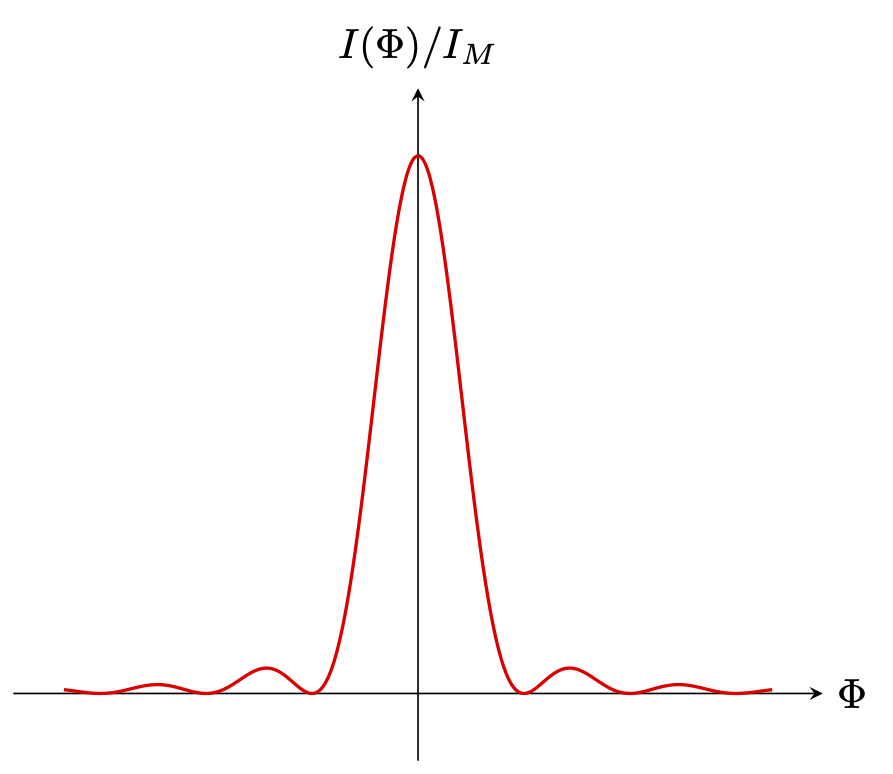{#fig-FLP_1_30_tfig1 width=300}

 

### I.30-3 회절격자의 분해능 {#sec-FLP_1_30_3}

앞서 언급했듯이 회절격자는 파장에 따라 산란각이 달라지기 때문에 파장별로 분리하는데 사용 할 수 있다. 두개의 유사한 파장을 가진 광원에서 오는 빛을 파장별로 분리 할 수 있는 능력을 **분해능 (resolving power)** 이라고 한다. 일반적으로 레일리 기준을 사용한다.

#### **레일리 기준(Rayleigh's criteria)**

파장 $\lambda'$ 인 빛에 대해 경로차 $\Delta$ (@fig-FLP_1_30_3) 가 $n\lambda'$ 과 같을 때 intensity maximum peak 이며 $m$-th order beam 에 대해서는 $\Delta = mn\lambda'$ 이어야 한다. $\lambda'$ 과 약간 차이가 나는 파장 $\lambda$ 에 대해서 역시 $\Delta = mn\lambda + \lambda = mn\lambda'$ 이 되도록 하자. $\Delta \lambda = \lambda'-\lambda$ 라고 하면

$$
\dfrac{\Delta \lambda}{\lambda} = \dfrac{1}{mn}
$$ {#eq-FLP_1_30_9}

이며 이 때 $\lambda/\Delta \lambda$ 를 **회절격자의 분해능 (resolving power of grating)** 이라고 한다. 

여기서 경로차에 의한 시간차 $T = \Delta /c$ 를 생각하자. $T=mn\lambda'/c$ 이며 진동수 $\nu' = c/\lambda',\, \nu = c/\lambda$ 를 생각하면

$$
\Delta \nu = \nu-\nu' = \dfrac{c}{\lambda}- \dfrac{c}{\lambda'} = \dfrac{\Delta \lambda}{\lambda \lambda'} = \dfrac{c}{mn\lambda'}= \dfrac{1}{T}
$$

이다.

 

### I.30-4 포물선형 안테나 {#sec-FLP_1_30_4}

 

## I.32 복사 감쇄와 광산란 {#sec-FLP_1_32}

 

### I.32_3 복사 감쇄 {#sec-FLP_1_32_3}

$$
Q = - \dfrac{\omega W}{dW/dt}.
$$ {#eq-FLP_1_32_8}

$$
Q=\dfrac{3\lambda}{4\pi r_0} \approx 5 \times 10^7.
$$ {#eq-FLP_1_32_12}

 

### I.32_5 광산란 {#sec-FLP_1_32_5}

$$
\sigma_s = \dfrac{8 \pi r_0^2}{3} \cdot \dfrac{\omega^4}{\left(\omega^2 - \omega_0^2\right)^2}
$$ {#eq-FLP_1_32_19}