 

## I.39. 기체 운동론 {#sec-FLP_1_39}

### I.39-1 물질의 성질 {#sec-FLP_1_39_1}

#### **새로운 주제 : 물질**

- 여기서는 전기적으로 상호작용하고 역학 법칙을 따르는 수많은 원자로 이루어진 물질에 대해 알아본다.

- 우리가 앞에서 배웠던 역학 또는 빛은 기본 법칙들에서 시작하여 다양한 현상을 이해하였다. 그러나 물질을 이해하기 위해서는 수많은 원자들을 다뤄야 하며 역학과 전자기 법칙만으로 직접 분석하기에는 너무 복잡하다. 보통 많은 단계를 거쳐 이해하지만 각 단계 자체도 많이 복잡하며 점점 정확성이 떨어진다.
  
- 어려운 이유
  1. 수학적 이유 : 개별 원자의 모든 움직임을 파악하기 보다는 평균적인 운동과 효과를 다루기 때문에 확률 이론이 중요하다.
  2. 물리적 이유 : 고전역학이 아닌 양자역학적으로 접근해야 한다.
   

#### **그럼에도 불구하고 지금 다루는 이유**

- 느긋하게! : 우선 다양한 상황에서 일어나야 할 일에 대해 대략적인 아이디어를 얻고, 나중에 우리가 법칙을 더 잘 알게 되면 이를 더 잘 정립하게 될 것이다. 실제 문제에서 물질의 특성을 분석하고자 하는 사람은 기본 방정식을 적어 놓은 뒤 수학적으로 풀어보고자 할 수 있다. 이렇게 하는 사람들은 이 분야에서 실패한다. 물리적인 관점에서 시작하고, 자신이 어디로 갈지 대략 파악한 뒤 올바른 근사를 제시함으로써 복잡한 상황에서 무엇이 크고 무엇이 작은지 아는 사람이 성공한다. 이러한 문제들은 매우 복잡하여, 비록 부정확하고 불완전하더라도 기본적인 이해를 가질 가치가 있으며, 따라서 물리학 과정을 진행하면서 우리는 그 과목을 점점 더 정확하게 반복해서 검토하게 될 것이다.

- 고등학교때 배운 것이 있다.  
  - 아보가드로의 법칙 : 같은 부피의 기체가 동일한 압력과 온도에서 동일한 수의 분자를 포함하고 있다 :아보가드로의 법칙  
  - 기체반응의 법칙 : 두 기체가 화학 반응에서 결합할 때 필요한 부피 사이에는 항상 단순한 정수 비율이 존재한다 

#### **열역학**

이 주제는 비원자론적 관점에서 공격될 수 있으며, 물질들의 특성들 사이에 많은 상호관계가 존재한다는 것을 알게 될 것이다. 예를 들어, 무언가를 압축하면 가열되고, 가열하면 팽창한다. 이 두 사실 사이의 관계는 배후의 과정과 독립적으로 추론될 수 있다. 이 주제를 **열역학 (thermodynamics)** 라고 한다. 열역학에 대한 가장 심오한 이해는 당연히 실제 그 아래에 있는 과정을 이해하는 데서 비롯되며 우리는 그것을 하려 한다. 우리는 시작부터 원자론적 관점으로 물질의 다양한 특성과 열역학 법칙을 이해하고자 한다.

 

### I.39-2 기체의 압력 {#sec-FLP_1_39_2}

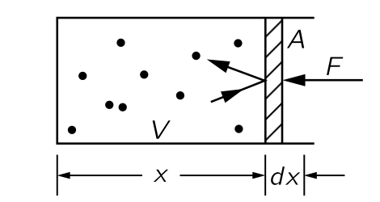{#fig-FLP_1_39_1 width=200}

위의 그림과 같이 마찰이 없이 움직일 수 있는 피스톤이 한 면을 차지하고 있는 부피 $V$ 인 상자에 기체 원자가 차 있다고 하자. 다양한 속도로 움직이는 기체 원자가 피스톤에 충돌한다. 만악 상자 외부가 진공이라면 기체 원자가 피스톤과 충돌하면서 피스톤이 운동량을 얻게 되어 점차 밖으로 이동하게 된다. 피스톤이 밖으로 움직이는 것을 막기 위해서 힘 $F$ 를 가한다고 하자. 그리고 피스톤의 단면적을 $A$ 라고 하자. 그렇다면 힘은 $A$ 에 비례할 것이며 이 때 $A$ 에 곱해지는 값을 **압력 (pressure)** 라고 정의한다. 즉, 압력 $P$ 를 다음과 같이 정의한다.

$$
P := \dfrac{F}{A}.
$$ {#eq-FLP_1_39_1}

또한 피스톤이 $-dx$ 만큼 움직였을 때 기체에 해준 일 $dW$ 를 생각하자$^2$.[$^2$ 많은 교제애서 반대로 일을 기체가 한 일로 정의하기도 한다. 여기서는 파인만의 정의를 따른다.]{.aside} 

$$
dW = F(-dx) = -PA\,dx = -PdV.
$$ {#eq-FLP_1_39_2}

힘 $F$ 를 알기 위해서는 단위 시간당 공기 분자의 충돌로 전딜되는 운동량을 계산해야 한다. $F=dp/dt$ 임을 생각하면 단위 시간당 전달되는 운동량이 피스톤에 가해지는 힘이며 따라서 피스톤의 질량과 가속도의 곱이 된다. 단위 시간당 전달되는 운동량은 두부분으로 나누어 계산한다. (1) 특정 분자 하나가 피스톤과 충돌할 때 피스톤에 전달한 운동량을 구하고, (2) 거기에 분자가 벽과 단위 시간동안 충돌하는 횟수를 구한다. 그렇다면 힘은 이 둘의 곱이다. 

- 우선 피스톤이 분자에 대한 완벽한 *반사체* 라고 가정한다. 그렇지 않다면 피스톤이 가열되기 시작하고 상황이 변하게 되지만, <u>최종적으로 평형상태가 되면 최종 결과는 사실상 완전탄성충돌이다.</u> 

- 평균적으로 충돌 전과 후의 입자의 에너지가 같다. 따라서 우리는 기체가 정적 상태(steady state)에 있다고 가정하며, 피스톤이 정지해 있기 때문에 피스톤에 에너지를 잃지 않을 것이다. 

부피 $V$ 의 상자에 $N$ 개의 기체 분자가 들어있다면 개수 밀도 (number density) $n=N/V$ 이다. 그리고 피스톤이 움직이는 방향을 $x$ 방향이라고 하자. 이 피스톤의 $x$ 방향 속도 $v_x$ 에 대한 확률밀도함수를 $f_x(v_x)$ 라고 하자. $\int_{-\infty}^\infty df_x(v_x)\,dv_x=1$ 이다. $x$ 방향 속도가 $(v_x,\, v_x+dv_x)$ 사이의 값을 갖는 입자가 $\Delta t$ 의 시간동안 피스톤에 충돌하려면 피스톤과의 거리가 $v_x \Delta t$ 안에 포함되어야 하며 이 부피는 $v_x A \Delta t$ 이다. 이 분자가 피스톤에 충돌하고 반사됬을 때 피스톤에 전달하는 운동량은 $2mv_x$ 이다. 따라서 전달되는 운동량의 총합을 $\Delta t$ 로 나누면 피스톤에 가해지는 힘 $F$ 를 구할 수 있다. 

$$
F= \int_0^\infty n f_x(v_x) \left[v_x A\right] \left[2mv_x\right] \, dv_x = n \int_0^\infty f_x(v_x) 2mv_x^2 A\, dv_x
$$ {#eq-FLP_1_39_force_on_the_wall}

이다. $f_x(v_x)$ 가 우함수임은 자명하다. 이로부터 

$$
\langle v_x^2\rangle = \int_{-\infty}^\infty f_x(v_x) v_x^2\,dv_x = 2\int_0^\infty f_x(v_x)v_x^2\,dv_x
$$ 

이므로

$$
P = nm \left\langle v_x^2 \right\rangle.
$$ {#eq-FLP_1_39_5}

라고 쓸 수 있다. 또한 우리는 모든 방향에 대해 속도가 등방적이라는 것을 가정 할 수 있다. 따라서 

$$
\left\langle v_x^2\right\rangle = \left\langle v_y^2\right\rangle =\left\langle v_z^2\right\rangle
$$ {#eq-FLP_1_39_6}

일 것이며

$$
\left\langle v_x^2\right\rangle  = \dfrac{1}{3}\left\langle v_x^2 + v_y^2+v_z^2\right\rangle = \dfrac{1}{3}\left\langle v^2 \right\rangle
$$ {#eq-FLP_1_39_7}

이다. 이를 이용하면 압력을 다음과 같이 쓸 수 있다.

$$
P = \dfrac{2}{3} n \left\langle\dfrac{1}{2}mv^2\right\rangle .
$$ {#eq-FLP_1_39_8}

위 식에서 속도의 제곱의 평균이 아니라 운동에너지의 평균을 사용한 이유는 <u>분자의 질량중심의 운동에너지 이기 때문이다</u>. 이제 $n=N/V$ 로부터

$$
PV = \dfrac{2}{3}N\left\langle\dfrac{1}{2}mv^2\right\rangle 
$$ {#eq-FLP_1_39_9}

임을 안다. 분자 내부의 들뜸이나 운동을 무시할 경우 질량중심의 운동에너지가 전체 에너지이다. 단원자 분자의 경우는 운동에너지가 전체 에너지이며 분자의 에너지의 합 $U$ 는 운동에너지의 평균에 분자의 개수를 곱한 값이므로 @eq-FLP_1_39_9 에 의해

$$
PV = \dfrac{2}{3}U
$$ {#eq-FLP_1_39_10}

이다. 분자의 에너지의 합을 **총 내부 에너지(total internal energy)** 라고 하며 열역학에서 $U$ 는 총 내부 에너지를 의미한다. 그러나 단원자 분자가 아닌 다른 분자의 경우 분자 내 진동과 같은 내부의 운동이 있으므로 위 식이 적용되지 않고 계산이 훨씬 복잡하다. 일단 이 경우는 이후에 다루기로 하자.

이제 새로운 문제를 생각해보자. 주어진 기체를 <u>천천히</u> 압축시킨다면 얼마만큼의 압력이 필요한가? 압축한다는 것은 부피를 줄인다는 것이므로 우리가 기체에 일을 해주며 따라서 $U$ 가 증가한다. $U$ 가 증가하고 $V$ 가 감소하므로 당연히 $P$ 는 증가한다. 우리는 이에 대해 미분방정식을 세워 풀 수 있다. 그런데 여기에 한가지 가정이 숨어 있다. 우리가 기체를 압축시키면서 해주는 일이 모두 내부에너지로 변환된다는 것이다. 우리가 생각해야 할 다른 요인은 **열 (heat)** 이다. 빠르게 움직이는 분자가 벽을 치면 벽을 뜨겁게 하며 에너지가 사라진다. 하지만 당분간 이것을 무시하기로 하자.

@eq-FLP_1_39_9 은 좀 더 일반적인 형태로 아래와 같이 쓸 수 있다. 곱해지는 값이 어떤 값의 $-1$ 로 표기되는 것은 역사적인 이유이다.

$$
PV = (\gamma-1)U.
$$ {#eq-FLP_1_39_11}

@eq-FLP_1_39_9 는 $\gamma = \frac{5}{3}$ 인 경우이다. 앞서 기체 분자에서 벽으로의(혹은 외부로의) 에너지 유출이 없다고 했는데 이를 **단열 압축 (adiabatic compression)** 이라고 한다. 이 경우 $dU = -PdV$ 이며, 또한 @eq-FLP_1_39_11 로 부터
$$
dU = \dfrac{1}{\gamma-1} (PdV + VdP)
$$ {#eq-FLP_1_39_12}

이므로 $\gamma$ 를 상수라고 가정하면 다음 관계를 얻는다.

$$
PV^\gamma = \text{constant}.
$$ {#eq-FLP_1_39_14}

즉 단원자 분자에서는 $PV^{5/3}$ 은 항상 상수이다. 이는 실험적으로도 잘 맞다.

 

### I.39-3 복사의 압축 {#sec-FLP_1_39_3}

다수의 광자가 내부가 고온인 상자 안이 있다고 하자. 이 상자는 실제 고온의 별이며 내부에 원자는 무시할 만큼만 있을 정도이다. 태양은 이 기준으로는 충분히 뜨겁지 않다. 광자가 $x$ 방향 운동량 $p_x$ 와 $p_x+dp_x$ 사이에서 가질 확률을 $f_x(p_x)\, dp_x$ 라고 하자. $p_x$ 의 $x$ 방향 운동량을 가진 광자가 벽에 전달하는 운동량은 $2p_x$ 이므로 @eq-FLP_1_39_force_on_the_wall 와 같은 방법으로 
$$
F=\int_0^{\infty}n f_x(p_x) [v_xA] [2p_x]\,dt
$$  

이다. 

$$
PV = N\langle p_xv_x \rangle
$$ {#eq-FLP_1_39_15}

을 얻는다. $p_xv_x$ 의 평균값은 $\bf{p\cdot v}$ 의 $1/3$ 로 간주할 수 있으므로

$$
PV = \dfrac{1}{3} N\langle \bf{p\cdot v}\rangle
$$ {#eq-FLP_1_39_16}

이다. 광자의 운동량 $p$ 와 광속 $c$ 에 대해 광자의 에너지 $E=pc$ 이다. 상자 속의 광자의 총 에너지 $U$ 를 생각하면

$$
PV = \dfrac{1}{3}U
$$ {#eq-FLP_1_39_17}

을 얻는다. 즉 광자에 대해서는 $\gamma = 4/3$ 이므로

$$
PV^\text{4/3} = \text{constant.}
$$ {#eq-FLP_1_39_18}

이다. 

 

### I.39-4 온도와 운동에너지 {#sec-FLP_1_39_4}

지금까지 우리는 온도를 의도적으로 배재했다. 기체를 압축하면 분자의 에너지가 증가한며, 우리는 가스가 더 뜨거워진다고 말한다. 이것은 온도와 무슨 관련이 있을지 알아보자. 일단 서로 다른 온도의 두 상자를 충분히 오래 나란히 두면 같은 온도에 도달한다는 것을 알고 있다. 즉 등온조건은 사물들이 서로 충분히 오래 방치되어 상호작용했을 때의 최종 조건이다.

::: {#exm-FLP_1_39_4_1}

#### 자유롭게 움직일 수 있는 피스톤으로 분리된 두종류의 기체 분자

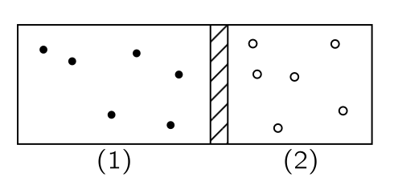{#fig-FLP_1_39_2 width=200}

위의 그림과 같이 상자 안에 자유롭게 움직일 수 있는 피스톤으로 분리된 두 단원자 기체가 차 있다고 생각하자. (1) 의 기체 분자의 질량, 속도, 개수 밀도는 각각 $m_1$, $v_1$, $n_1$ 이며 (2) 는 $m_2$, $v_2$, $n_2$ 라고 하자. 평형이 성랍하는 상황은 두 기체가 피스톤에 작용하는 힘이 동일할 조건이며 이는 압력이 동일할 조건이다. @eq-FLP_1_39_9 로부터

$$
n_1 \left\langle \dfrac{m_1v_1^2}{2} \right \rangle = n_2 \left\langle \dfrac{m_2v_2^2}{2} \right \rangle
$$

을 얻는다. 그러나 우리는 이것이 유일한 조건이 아니라는 것을 알아야 한다. 예를 들어 (1) 에는 밀도가 크고 평균 속도가 작은 기체가, (2) 에는 밀도가 작고 평균속도가 큰 기체가 있는 상태에서 위 조건을 만족 할 수 있다. 여기서 $n_1 > n_2$, $v_1 < v_2$ 의 이며 위의 식을 만족한다고 하자.

이 경우 (1) 번 기체는 피스톤 벽을 더 많이 치고 (2) 번 기체는 피스톤 벽을 적게 치는 대신 더 세게 친다. 기체의 충돌은 일정하지 않고 불연속적이다. 이 불연속적인 충돌에 의해 피스톤은 끊임없이 흔들리며, 충돌은 정지한 피스톤과 움직이는 기체 분자 사이의 충돌이 아닌 흔들리는 피스톤과 움직이는 기체 사이의 충돌이다. 이 와중에서 에너지의 전달이 일어난다. 이 시스템이 평형에 도달하는 것은 피스톤이 기체 원자로부터 에너지를 흡수하고, 원자에 에너지를 다시 공급할 수 있는 평균제곱속도로 움직일 때이다. 

:::

 

위의 예제는 중간에 멈췄다. 여기서 피스톤의 세부사항을 이해하는것은 이상적으로는 간단하지만, 분석하기는 다소 더 어렵다. 그것을 분석하기 전에, 기체 상자 안에 두 종류의 분자가 존재하는 또 다른 문제를 분석해 보자.

::: {#exm-FLP_1_39_4_2}

#### 상자 안의 두종류의 기체 분자

두 종류의 기체가 컨테이너 안에서 셖여 있다고 하자. 기체 분자의 질량은 각각 $m_1,\,m_2$ 이며 속도를 각각 $\bf{v}_1,\,\bf{v}_2$ 라고 하자. 기체 분자의 충돌은 탄성 충돌이라고 가정한다. 

이 때 질량중심죄표계에서 보면 ([질량중심 좌표계에서의 탄성 충돌](#sec-CM_elastic_collition_in_C_frame) 을 참고하라) 이 충돌은 두 입자의 속도의 크기는 일정하며 방향만 바뀌는 충돌이며 질량중심 좌표계에서 이 방향의 분포는 균일하다. 

이제 실제 상황에서 보자. 서로 다른 두 분자의 충돌의 질량 중심 속도 $\bf{v}_\text{CM}$ 와 상대속도 $\bf{v}$ 를 아래와 같이 정한다. 

$$
\bf{v}_\text{CM}=\dfrac{m_1\bf{v}_1+m_2\bf{v}_2}{m_1+m_2},\qquad \bf{u} = \bf{v}_1-\bf{v}_2
$$

충돌 후에 분자의 분포는 어떻게 될까? 일단 우리는 충돌 전후 질량중심의 속도 $\bf{v}_\text{CM}$ 이 변하지 않는다는 것을 안다. 또한 $\bf{u}$ 의 분포는 $\bf{v}_\text{CM}$ 에 대해 완전히 임의적이다. 즉 $\bf{v}_\text{CM}\bf{\cdot u}$ 의 평균값은 $0$ 이다. 또한 $\bf{v}_1\bf{\cdot v}_2$ 의 평균값도 $0$ 이라는 데 동의 할 수 있다. 여기서

$$
\begin{aligned}
\bf{v}_\text{CM}\bf{\cdot u} &= \dfrac{(\bf{v}_1-\bf{v}_2) \bf{\cdot} (m_1\bf{v}_1 + m_2 \bf{v}_2)}{m_1+m_2}  \\[0.3em]
&= \dfrac{(m_1v_1^2 - m_2v_2^2) + (m_2-m_1)(\bf{v}_1\bf{\cdot v}_2)}{m_1+m_2}
\end{aligned}
$$

이므로

$$
\left\langle \dfrac{m_1v_1^2}{2}\right\rangle = \left\langle \dfrac{m_2v_2^2}{2}\right\rangle
$$

이다. 즉 두 기체 분자의 평균 운동 에너지는 같아진다.

::: 

 

**이제 두종류의 서로 다른 기체가 각각의 상자에 분리되어 있더라도 최종적으로 평형에 도달했을 때 평균 운동 에너지가 같아진다** 고 말하고자 한다. 

{#fig-FLP_1_39_4 width=200}

**1. 고정된 구획에 한 분자만 통과할 수 있는 구멍이 있는 경우** : @fig-FLP_1_39_4 를 생각하자. 두 종류의 크기가 다른 기체가 작은 구멍이 있는 벽을 사이에 두고 있다고 하자. 작은 기체 분자는 구멍을 통과할 수 있지만 큰 기체 분자는 통과하지 못한다고 하자. 혼합된 오른쪽 부분에서는 두 기체가 동일한 평균 운동에너지를 가진다(@exm-FLP_1_39_4_2). 여기서 통과 할 수 있는 기체분자의 일부는 운동 에너지 손실 없이 구멍을 통과하여 이동하며, 따라서 왼쪽의 기체의 평균 운동에너지도 동일하게 된다. 그러나 이 설명은 두 종류의 분자에 대해 한 종류를 다른 종류와 구분하는 구멍이 없을 수도 있기 때문에 만족스럽지 않다..

**2. 피스톤 문제 (@exm-FLP_1_39_4_1)** : $m_1$ 분자들과 피스톤의 평형을 생각하자. 피스톤의 운동은 수평운동이며 따라서  $\frac{1}{2}m_2v^2_{2x}$ 와 동일해야 한다. 마찬가지로, 반대편의 평형으로부터 우리는 피스톤의 운동 에너지가 $\frac{1}{2}m_1v^2_{1x}$ 임을 증명할 수 있다. 비록 이것이 기체의 중간이 아니라 한쪽에 위치하지만 피스톤과 가스 분자의 평균 운동 에너지가 모든 충돌의 결과로 동일하다는 것을 다소 어렵게나마 보일 수 있다. <u>(How ?) </u>

**3. 서로 섞이지 않지만 열적으로 연결된 경우** : 이제 모든 면에서 타격할 수 있는 물체에 의해 평형상태에 도달하는 인위적인 예를 들 수 있다. 피스톤을 통해 각 끝에 볼이 삽입된 짧은 막대가 마찰 없는 슬라이딩 유니버설 조인트 위에 있다고 가정해 보자. 각 공은 분자 중 하나와 같이 둥글며, 모든 면에서 타격받을 수 있다. 이 물체의 총 질량을 $m$ 이라고 하고 이전과 같이 질량 $m_1$, $m_2$ 인 가스 분자가 양쪽에 있다고 하자. 충돌의 결과 한쪽에 있는 분자와의 충돌로 인한 $m$ 의 운동 에너지는 평균 $\frac{1}{2}m_1v^2_1$ 이어야 한다. 마찬가지로, 반대편에 있는 분자와의 충돌 때문에 평균은 $\frac{1}{2}m_2v^2_2$ 이어야 한다. 따라서 양측은 열평형 상태에 있을 때 동일한 운동 에너지를 가져야 한다. @exm-FLP_1_39_4_2 에서 기체 혼합물에 대해서만 증명했지만, 같은 온도에서 서로 다른 두 개의 별개의 기체가 존재하는 경우에도 쉽게 된다. 따라서 우리는 다음과 같은 결론을 내릴 수 있다.

::: {.callout-important icon="false"}

### **온도와 에너지**

두 기체가 같은 온도에 있을 때, 질량중심 운동의 평균 운동 에너지는 동일하다.

:::

평균 분자 운동 에너지는 오직 "온도" 의 속성일 뿐이며 기체의 속성이 아니기 때문에, 우리는 이를 온도의 정의로 사용할 수 있다. 즉 분자의 평균 운동 에너지는 온도의 함수이다. 온도를 평균 에너지에 비례하도록 정하고 그 비례상수로 **볼츠만 상수 (Boltzmann constant)** 

$$
k_B = 1.380 649 \times 10^{−23} \text{ J}\cdot \text{K}^{-1} 
$$ {#eq-FLP_definition_of_boltzmann_constant}

를 사용한다. 따라서 $T$ 가 절대 온도라면, 우리의 정의에 따르면 평균 분자 운동 에너지는 $\frac{3}{2}k_BT$ 이다$^3$.[$^3$ 앞으로 배우겠지만 특정 방향으로의 운동 성분과 연관된 운동 에너지가 단지 $\frac{1}{2}k_B T$ 임을 보일 수 있으며 이를 **등분배 정리(equipartition theorem)** 라고 한다. 세개의 독립적인 방향을 가지므로 $\frac{3}{2}k_BT$ 이 된다.]{.aside}

 

### I.39-5 이상기체법칙 {#sec-FLP_1_39_5}

#### **단원자 분자의 이상기체법칙**

앞서 말했듯이 분자의 평균 온동에너지가 $\frac{3}{2}k_B T$ 이므로 @eq-FLP_1_39_9 는 다음과 같다.

$$
PV=Nk_BT.
$$ {#eq-FLP_1_39_22}

실용적으로는 분자 혹은 원자의 개수를 사용하지 않고 아보가드로수 

$$
N_A=6.02214076 × 10^{23}
$$

를 단위로 $N_A$ 의 몇배인지를 센다. 즉 $N=\nu N_A$ 일 때 $\nu$ 를 분자 혹은 원자의 몰수라고 한다. 또한 기체상수 $R$ 을

$$
R=N_A k_B = 8.314\,462\,618\,153\,24 \;\text{J}\cdot \text{mol}^{−1}\cdot \text{K}^{−1}
$$ {#eq-FLP_definition_of_gas_constant}

로 정의하면

$$
PV = \nu RT
$$ {#eq-FLP1_39_23}

이다. 

지금까지 단원자 기체의 원자들의 질량중심 운동만을 다루었다. 여기에 힘이 존재하면 어떻게 될까? 우선 피스톤이 수평 스프링에 의해 지지되고 그 위에 힘이 작용하는 경우를 생각해보자. 물론, 원자와 피스톤 사이의 흔들림 운동 교환은 피스톤의 위치에 따라 달라지지 않는다. 평형 조건은 동일하다. 피스톤이 어디에 있든, 그 운동 속도는 분자에 에너지를 정확히 전달하도록 해야 하며 따라서 스프링에 대해서는 차이가 없다. 피스톤이 이동해야 하는 속도는 평균적으로 동일하며 따라서 한 방향에서 운동 에너지의 평균값이 $\frac{1}{2}k_BT$ 라는 우리 정리는 힘이 존재하든 존재하지 않든 참이다.

#### **이원자 분자의 경우**

이제 $m_A$ 와 $m_B$ 원자로 구성된 이원자 분자를 생각하자. $A$ 와 $B$ 의 질량중심 운동이 평형상태에서  
$$
\left\langle \dfrac{1}{2}m_Av^2_A\right\rangle = \left\langle \dfrac{1}{2}m_B v^2_B\right\rangle =\dfrac{3}{2}k_BT
$$

이다. 이 둘이 서로 묶여있는데 어떻게 $m_A \left\langle v_A^2 \right\rangle = m_B \left\langle v_B^2\right\rangle$ 이 가능할까? 비록 그들이 서로 묶여있더라도, 자기 위치에서 돌거나 다른 위치를 중심으로 회전하며, 무언가와 충돌하여 에너지를 교환한다면 중요한 것은 그들이 얼마나 빠르게 움직이는가이다. 그것만으로도 충돌에서 에너지를 교환하는 속도를 결정한다. 특정 상황에서는 힘은 필수적인 요인이 아니다. 따라서 같은 원리는 힘이 있을 때조차도 옳다.

::: {.callout-tip icon="false"}

#### **나의 노트**

예를 들어 이원자 분자가 두 원자를 잇는 직선상의 한 점을 중심으로 회전 할 때 $m_A$ 와 $m_B$ 의 각속도는 동일하지만 회전에 의한 속도와 회전에 의한 운동에너지는 각각 회전중심까지의 거리와 그 제곱에 비례하기 때문에 둘이 묶여 있더라도 $m_A \left\langle v_A^2 \right\rangle = m_B \left\langle v_B^2\right\rangle$ 일 수 있다.

:::

#### **기체 법칙과 내부운동**

마지막으로, 기체 법칙이 내부 운동과 무관하게 성립한다는 것을 증명해보자. 우리는 이전에 내부 움직임을 포함하지 않는 단원자 기체만을 다뤘다. 하지만 이제 우리는 전체 물체를 질량 $M$ 인 단일 물체로 간주했을 때의 질량 중심의 평균운동에너지에 대해 다음을 보일 수 있다.

 

::: {#thm-FLP_equipartition_of_center_of_mass}

전체 분자를 질량 $M$ 인 단일 물체로 간주하면 질량 중심 속도 $\bf{v}_\text{CM}$ 에 대해 다음을 만족한다.
$$
\left\langle \dfrac{1}{2}Mv_{\text{CM}}^2 \right \rangle = \dfrac{3}{2}k_BT
$$ {#eq-FLP_1_39_24}

:::

::: {.proof} 

이원자 분자의 질량 $M = m_A+m_B$, 질량 중심의 속도 $\bf{v}_\text{CM}=(m_A\bf{v}_A+m_B\bf{v}_B)/M$ 에 대해 $\left\langle \bf{v}_\text{CM}^2\right\rangle$ 을 계산해 보자.

$$
v^2_\text{CM} = \dfrac{m_A^2v_A^2 + 2m_Am_B \bf{v}_A\bf{\cdot v}_B + m_B^2v_B^2}{M^2}
$$

이므로

$$
\begin{aligned}
\left\langle \dfrac{1}{2}Mv^2_\text{CM}\right\rangle &= \dfrac{1}{M}\left(m_A \left\langle \dfrac{1}{2}m_A v_A^2\right\rangle + m_B \left\langle \dfrac{1}{2}m_B v_B^2\right\rangle + m_Am_B\langle \bf{v}_A\bf{\cdot v}_B\rangle \right) \\[0.3em]
&= \dfrac{1}{M}\left( \dfrac{3m_A k_B T}{2} + \dfrac{3 m_B k_B T}{2} + m_Am_B\langle \bf{v}_A\bf{\cdot v}_B\rangle \right) \\[0.3em]
&= \dfrac{3}{2}k_BT + \dfrac{m_Am_B\langle \bf{v}_A\bf{\cdot v}_B\rangle }{M}
\end{aligned}
$$

이다. 이제 $\left\langle \bf{v}_A\bf{\cdot v}_B\right\rangle=0$ 임을 보이자. 상대속도 $\bf{u}=\bf{v}_A-\bf{v}_B$ 에 대해 $\bf{u}$ 는 특정 방향을 선호하지 않으므로

$$
\langle \bf{u \cdot v}_\text{CM}\rangle =0
$$

이다. 여기서

$$
\begin{aligned}
\bf{u\cdot v}_\text{CM} &= \dfrac{(\bf{v}_A-\bf{v}_B)\bf{\cdot}(m_A\bf{v}_A+ m_B\bf{v}_B)}{M} \\[0.3em]
&= \dfrac{m_Av_A^2 - m_B v_B^2 + (m_A-m_B)(\bf{v}_A\bf{\cdot v}_B)}{M}
\end{aligned}
$$

이며 우리는 $\langle m_Av_A^2 \rangle = \langle m_B v_B^2\rangle$ 임을 안다. 따라서 $\bf{v}_A\bf{\cdot v}_B=0$ 임을 알 수 있다. 즉 분자 하나를 하나의 입자로 간주해도 그 평균 운동에너지는 $\frac{3}{2}k_BT$ 이다. $\square$

:::

 

다시 말해, 우리는 개별 부분들을 고려하거나 전체를 고려하건 간에 운동에너지의 평균은 $\frac{3}{2}k_BT$ 이다. 또한 이로부터 **이원자 분자의 내부 운동에 대한 평균 운동 에너지가 질량중심의 운동을 제외하고 $\frac{3}{2}k_BT$ 임을 알 수 있다**. 예를 들어, 분자의 각 부분들의 총 운동 에너지는 $\frac{1}{2}m_Av^2_A+\frac{1}{2}m_Bv^2_B$ 이며, 평균은 $\frac{3}{2}k_BT+\frac{3}{2}k_BT =3k_BT$ 이다. 질량 중심 운동의 운동 에너지는 $\frac{3}{2}k_BT$ 이므로, 분자 내부 두 원자의 회전 및 진동 운동 평균 운동 에너지 차이는 $\frac{3}{2}k_BT$ 이다.

질량 중심 운동의 평균 에너지에 관한 정리는 일반적이며, 전체로 고려될 때 힘이 있든 없든 모든 독립된 운동 방향에 대해 그 운동의 평균 운동 에너지는 $\frac{1}{2}k_B T$ 이다. 이러한 '독립적인 운동 방향' 은 때때로 시스템의 **자유도 (degree of freedom)** 라고 불린다.  $r$ 개의 원자로 구성된 분자의 자유도는 그 위치를 정의하기 위해 세 개의 좌표가 필요하기 때문 $3r$ 이다. 분자의 전체 운동 에너지는 개별 원자들의 운동 에너지의 합 혹은 CM 운동의 운동 에너지와 내부 운동의 운동 에너지의 합으로 표현될 수 있다. 후자는 때때로 분자의 회전 운동 에너지와 진동 에너지의 합으로 표현될 수 있지만, 이는 근사값이다. 우리의 정리는 $r$-원자 분자에 적용된 것으로, 분자는 평균적으로 $3rk_BT/2$ 의 운동 에너지를 갖게 되며, 그 중 $\frac{3}{2}k_B T$ 는 전체 분자의 질량 중심 운동에 대한 운동 에너지이고, 나머지 $\frac{3}{2}(r−1)k_B T$ 는 내부 진동 및 회전 운동 에너지이다.

 

## I.40. 통계역학의 원리

### I.40.1 지수적 대기 {#sec-FLP_1_40_1}

지금까지 다수의 서로 충돌하는 원자들의 일부 특성에 대해 알아보았다. 이 주제를 분자 운동론(kinetic theory) 이라고 하며, 원자 간 충돌의 관점에서 물질을 기술한다. 근본적으로, 우리는 물질의 많은 특성이 부분들의 운동으로 설명될 수 있어야 한다고 주장한다. 여기서 열평형 조건에만 한정하여 적용되는 역학 법칙은 통계역학(statistical mechanics) 이라고 하며, 이 절에서는 통계역학의 몇가지 핵심 정리를 다룬다.

우리는 이미 통계역학의 정리 중 하나인 등분배 정리를 통해 절대 온도 $T$ 에서의 모든 운동에 대한 운동 에너지의 평균값은 자유도마다 $\frac{1}{2}k_BT$ 임을 안다. 이제 우리는 두 가지 질문을 던질 수 있다. (1) 분자에 힘이 작용할 때 분자는 우주에서 어떻게 분포하는가? (2) 그 분자들의 속도 분포는 어떠한가? 두 질문은 완전히 독립적이며, 속도 분포는 항상 동일함이 밝혀졌다. 우리는 이미 분자에 작용하는 힘과 관계없이 자유도당 $\frac{1}{2}k_BT$ 의 동일한 평균 운동 에너지를 가진다는 것을 안다. 분자들의 속도 분포는 힘과 무관하며, 충돌 속도는 힘에 의존하지 않기 때문이다. 이제 한가지 예로부터 시작하자.

::: {#exm-TD_feynmann_1}

#### 높이에 따른 압력의 변화

{width=300}

우리가 아는 대기와 같은 분자 분포를 갖지만 바람 및 기타 다양한 교란이 없는 경우를 생각하자. 높이까지 뻗어 있고 열평형 상태에 있는 기체 기둥이 있다고 가정하자. 높은 위치에서 차가운 우리가 아는 대기와는 다르다. 위와 아래의 온도가 다르다면 그림에서 보이는 왼쪽 관의 메카니즘을 통해 운동에너지가 전달되며 결국은 위 와 아래의 기체의 온도는 결곡 같아진다. 

이제 온도가 모든 높이에서 일정하다면 문제는 높이가 올라갈수록 공기가 희박해지게 하는 이유를 알아보자. 온도 $T$, 압력 $P$, 부피 $V$, 볼츠만 상수 $k_B$, 공기 분자 개수 $N$ 에 대해 $PV=Nk_BT$ 이며 개수분포 $n=N/V$ 이다. 이로부터 $P=n k_BT$ 임을 알며 $T$ 가 일정하므로 $P \propto n$ 이다. 그런데 압력은 낮은 높이에서 커야 하는데 이는 낮은 위치의 기체는 높은 위치의 기체보다 더 많은 (위의 기체가 누르는) 힘을 버텨여 하기 때문이다. $h+dh$ 높이에서 아래쪽을 누르는 단위 면적당 수직으로 작용하는 힘은 은 중력이 없을 경우 동일하지만, 중력이 작용하면 아래에서의 힘이 $h$ 와 $h+dh$ 사이의 구간에서 기체 무게를 더하여 위에서 가한다. 기체 분자의 질량이 $m$ 이라면

$$
P_{h+dh}-P_h = dP = -mgn\,dh
$$

이며 $P = nk_BT$ 으로부터 $dP = k_B T (dn)$ 임을 안다. 따라서

$$
\dfrac{dn}{dh}= - \dfrac{mg}{k_B T}n
$$

이며 이 미분방정식의 해는 $h=0$ 일 때의 개수 밀도를 $n_0$ 라고 했을 때 아래와 같다.

$$
n(h) = n_0 e^{-mgh/k_BT}.
$$ {#eq-FLP_1_40_1}

::: 

  

질량의 다른 분자는 각각 다른 지수로 감소한다는 것을 알 수 있다. 무거운 분자는 가벼운 분자보다 더 빨리 감소한다. 이에 따르면 산소가 질소보다 무거우며 이로부터 점점 더 높아질수록 질소 비율이 증가하겠지만 실제 대기에서는, 적어도 합리적인 고도에서는 기체가 활발하게 섞이기 때문에 그렇지 않다. 또한 등온도 아니다. 그럼에도 불구하고 수소와 같은 가벼운 분자가 대기 중 매우 높은 고도에서 우세하게 나타나는 경향이 있다. 

 

### I.40-2 볼츠만 법칙 {#sec-FLP_1_40_2}

@eq-FLP_1_40_1 은 다음의 형태라는 사실이 흥미롭다.

$$
e^{-\text{원자 1개당 포텐셜 에너지}/k_B T}.
$$

그것은 균일한 중력장의 특정 경우에만 해당하는 우연일 수 있다. 하지만, 우리는 그것이 보다 일반적인 명제임을 보여줄 수 있다. 기체 분자에 중력이 아닌 전기장에 의한 전기력이나 분자 상호간의 인력, 혹은 주위의 벽이나 고체, 혹은 무언가에 위치에 따라 달라지는 인력이 존재할 수 있다. 이제 분자들은 모두 동일하고, 힘이 각각에 작용하므로 기체 한 조각에 작용하는 전체 힘은 단순히 분자 수에 각 분자에 작용하는 힘을 곱한 값이라고 가정하자. 
<!-- 이겻은 @exm-TD_feynmann_1 에서 제시한 특정 상황-균일한 중력장-에서만 성립하는 명제가 아니라 일반적인 상황에서 성립하는 명제임을 보일 수 있다. 동일한 기체 분자에 중력이 아닌 다른 종류의 힘이 작용한다고 가정하자. 분자들은 모두 동일하고, 힘이 각각에 작용하므로 한 부분에 작용하는 힘은 한 분자에 작용하는 힘에 부분의 분자의 개수를 곱한 값이다.  -->

기체 안의 $d\bf{r}$ 만큼 떨어진 두 평행한 평면을 생각하자. 각 원자에 가해지는 힘 $\bf{F}$, 기체 분자의 개수 밀도 $n$, 그리고 $d\bf{r}$ 을 곱한 값은 두 평면의 압력 차와 균형을 이루어야 한다. 따라서

$$
n\bf{F \cdot}d\bf{r} = dP = k_BT dn
$$

이므로

$$
\bf{F} = k_BT \left(\nabla \ln n\right)
$$ {#eq-FLP_1_40_2}

이다. $\bf{F}$ 가 보존력으로 $\bf{F}=-\nabla U(\bf{r})$ 라면 포텐셜 $U$ 와 어떤 상수 $n_0$ 에 대해

$$
n = n_0 e^{-U/k_BT} 
$$ {#eq-FLP_1_40_3}

이어야 한다. 여기서 $\bf{F}$ 가 보존력이 아니라면 @eq-FLP_1_40_3 는 더이상 해가 아니며 열역학적 평형에 도달 할 수 없다. 보존력이 아니라면에너지는 분자가 닫힌 경로를 따라 돌아왔을 때 수행된 작업이 0 이 아니며 이 경우 에너지를 잃거나 얻기 때문에 평형을 유지할 수 없다. @eq-FLP_1_40_3 을 **볼츠만 법칙 (Boltzmann's law)** 라고 한다. 

 

### I.40-3 액체의 증발 {#sec-FLP_1_40_3}

분자들의 집합을 생각하자. 이 분자들 사이에는 쌍마다 서로의 거리만 의존하는 상호작용, 즉 포텐셜 에너지가 존재한다. 이 때 두 분자 사이의 거리 $r$ 에 따른 포텐셜 $V(r)$ 은 일반적으로 아래 그림과 같은 형태이며 $r<r_0$ 일 때는 척력이 $r>r_0$ 일 때는 인력이 작용한다. 

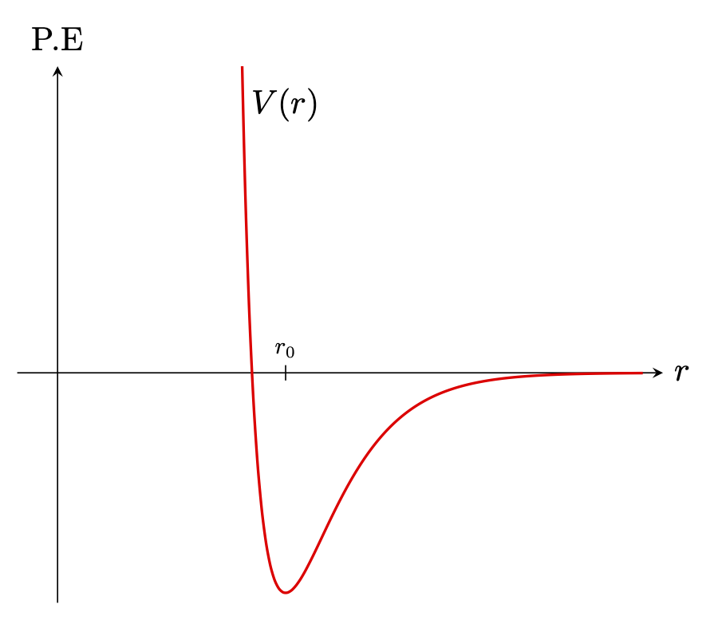{#fig-FLP_1_40_3 width=300}

이런 기체 분자로 차 있는 상자를 생각하자. 이 기체 분자들 사이의 포텐셜은 각 개별 쌍의 포텐셜의 합이라고 가정하자. (세개 이상에 대한 상호작용도 존재한다([Three-body force](https://en.wikipedia.org/wiki/Three-body_force) 를 참고하라.) 그렇다면 볼츠만의 법칙에 따라 분자 쌍이 $r_{ij}$ 만큼의 거리를 두고 존재할 확률은 다음에 비례한다.

$$
\exp \left[-\sum_{i,j} V(r_{ij})/k_BT\right].
$$ 

- $k_BT \gg |V(r_{0})|$ 일 경우 위 값은 거의 모든 곳에서 $1$ 에 가깞다. 즉 온도가 매우 높을 경우 분자를 발견할 확률은 위치에 거의 무관하게 된다. 
- $k_BT \ll |V(r_0)|$ 인 경우 $r=r_0$ 주위에서 발견할 확률이 매우 크다.

증발현상을 이해하려면 다음을 알아야 한다. 

- $V(r)$ 은 양자역학 혹은 실험을 통해 발견한다. 하지만 분자들 사이의 힘의 법칙을 고려하면 수십억 개의 분자가 무엇을 할지를 알아내는 것은 단지 함수 $\exp (- \sum V_{ij}/k_BT)$ 를 연구하는 것에 불과하다. 이는 매우 단순한 함수이자 매우 쉬운 아이디어이지만 변수의 수가 매우 많기 때문에 어렵다. 그러나 이 문제는 소위 “다체 문제” 의 한 예이며 매우 흥미로운 분야이다. 이 식에는 기체의 응고나 고체의 결정의 형태와 같은 모든 세부 사항이 포함되어야 하며, 사람들의 노력에도 불구하고 수학적으로 방대한 변수들을 다루는 것이 어렵다.

- 이후 공간에서 입자들의 분포를 알아낸다. 그것은 고전 통계역학의 목표이다. 실제로 힘을 알면 원칙적으로 공간에서의 분포를 찾을 수 있고, 속도의 분포는 각각의 경우와 무관하게 한 번에 해결될 수 있다.

 

### I.40-4 분자 속력의 분포 {#sec-FLP_1_40_4}

#### **지수적 대기의 경우**

이제 속도의 분포에 대해 알아보자. 이를 위해 앞서 대기에서 발견한 사실들을 활용한다. 일단 대기의 기체를 이상기체로 간주한다. 따라서 원자들간의 상호작용은 일단 생각하지 않으며 중력에 의한 위치에너지만 생각하며 충돌을 무시하더라도 차이가 없다(잠시 후 다룬다). 우리가 이미 보았듯이 공기의 밀도는 위로 올라갈록 지수적으로 감소한다(@eq-FLP_1_40_1). 그리고 이로부터 주어진 높이 $h_0$ 를 오를 만큼 충분한 속도를 갖지 못한 분자의 분포를 알 수 있다.

우선 $h_0>0$ 을 정하자. 그리고 $h=0$ 에서 $z$ 방향의 속도 $u=\sqrt{2gh_0}$ 를 가진 입자는 $h_0$ 에 간신히 도달한다. 그렇다면 평형상태에서 다음이 성립한다.

$$
\left[\begin{array}{c}h=0\text{ 인 평면을 } v_z>u \\ \text{ 의 속도로 통과하는 입자의 개수} \end{array}\right]= \left[ \begin{array}{c} h=h_0\text{ 인 평면을 } v_z >0 \\ \text{ 의 속도로 통과하는 입자의 개수} \end{array}\right].
$$ {#eq-FLP_1_40_4_1a}

또한 온도가 동일하므로 $h=0$ 을 $v_z>0$ 으로 통과하는 분자의 개수 밀도 $n_{v_z>u}(0)$ 와 $h=h_0$ 를 $v_z>0$ 으로 통과하는 분자의 개수 밀도 $n_{v_z>0}(h_0)$ 가 같다는 것을 안다. 보다 많다는 것을 안다. 이 표기법으로 @eq-FLP_1_40_4_1a 를 쓰면 $n_{v_z>u}(0) = n_{v_z>0}(h_0)$ 이다. 이로부터 다음이 성립한다는 것을 안다. 

$$
\dfrac{n_{v_z>u}(0)}{n_{v_z>0}(0)} = \dfrac{n_{v_z>0}(h)}{n_{v_z>0}(0)} = e^{-mgh/k_BT} = e^{-mu^2/2k_BT}
$${#eq-FLP_velocity_distribution_of_exponential_air}

위 식은 임의의 높이에서도 참이다. 따라서 평형상태에서 속도 분포는 모두 동일하며, 결과적으로 속도 분포를 제시하는 일반 명제이다. 가스 파이프 측면에 매우 작은 구멍을 뚫어 충돌 간격이 적고, 즉 구멍의 직경보다 더 멀리 떨어지게 하면, 나오는 입자들의 속도가 달라지지만, $u$ 보다 큰 속도로 나오는 입자의 비율은 $e^{−mu^2/2k_BT}$ 이다.

#### **충돌을 고려한다면?**

충돌을 무시해도 차이가 없다는 것을 보이자. 이제 유한한 높이 $h$ 가 아니라 충돌의 여지가 거의 없는 무한소 높이 $dh$ 를 사용해도 동일한 결과인데 그 이유는 에너지 보존과 충돌시 분자들 간의 에너지 교환이다. 분자들간의 에너지 교환에서 중요한 것은 동일한 분자를 추적하는 지가 아니라 분포이며 이 경우 결과에는 여전히 차이가 없다는 것이 밝혀졌다.

#### **확률분포표현**

@eq-FLP_velocity_distribution_of_exponential_air 와 속도의 분포는 순전히 온도에 의해 결정된다는 사실로부터 $u$ <u>보다 큰 속도로 정해진 높이의 평면을 통과하는 기체 분자의 밀도</u> $n_{>u}$ 가 다음을 만족한다는 것을 안다.

$$
n_{>u} \propto e^{-mu^2/2k_BT}.
$$ {#eq-FLP_1_40_4}

이것을 수학적으로 더 다루기 쉽게 표현하는 방법은 확률분포함수를 사용하는 것이다. 속도 $u$ 에 대한 확률분포함수는 

$$
\int_{-\infty}^\infty f(u)\,du = 1
$$ {#eq-FLP_1_40_5}

를 만족해야 하며 @eq-FLP_1_40_4 에 대해

$$
\int_{u}^\infty uf(u)\,du =\text{const.} \cdot e^{-mu^2/2k_BT}
$$ {#eq-FLP_1_40_6}

이어야 한다. 적분되는것이 $f(u)$ 가 아니라 $uf(u)$ 인가? 그것은 $n_{>u}$ 가 어떤 높이의 속도 분포가 아니라 어떤 높이에서 정해진 평면을 통과하는 입자의 분포와 관련이 있기 때문에다. 즉 빠른 입자는 더 많이 통과한다. 정해진 $dt$ 동안 특정한 면을 통과하는 입자의 개수는 $u\,dt$ 에 비례한다는 것을 압력을 도입할 때 이미 다루었던 내용이다. @eq-FLP_1_40_6 와 @eq-FLP_1_40_5 로부터

$$
f(u) \,du=\sqrt{\dfrac{m}{2\pi k_B T}}e^{-mu^2/2k_BT} \,du
$$ {#eq-FLP_1_40_7}

임을 알 수 있다. 

속도와 운동량이 비례하므로, 운동량의 분포도 단위 운동량 범위당 $e^{−\text{K.E.}/k_BT}$ 에 비례한다고 말할 수 있다. 상대성 이론에는 속도가 아니라 운동량에 대해서만 성립하므로 운동량 $p$ 를 이용하여 기억하는 것이 좋다.

$$
f(p) \,dp = C e^{-\text{K.E.}/k_BT} \, dp.
$$ {#eq-FLP_1_40_8}

따라서 우리는 운동에너지 및 퍼텐셜 에너지에 대한 확률이 모두 $e^{−\text{energy}/k_BT}$ 로 주어진다는 것을 알게 되었다.

#### **속도 분포**

지금까지 우리는 지수적 대기로부터 속도의 분포를 유도하였으며 이는 특정 방향에 대한 속도 분포만을 생각했다는 의미이다. 당연히 다른 방향에 대한 분포, 그리고 속도의 크기의 분포에 관심이 있다. 후자의 경우 당연히 방향과 무관한 것이어야 하며 속도의 크기의 제곱에만 의존하는 함수여야 한다. $v_z$ 에 대한 분포로부터 속도의 분포함수 $f(v_x,\,v_y,\,v_z)$ 가 다음과 같다는 것을 이해 할 수 있다.

$$
f(v_x,\,v_y,\,v_z)\,dv_x dv_y dv_z \propto e^{-(mv_x^2+mv_y^2+mv_z^2)/2k_BT} \,dv_x dv_y dv_z .
$$ {#eq-FLP_1_40_9}

 

#### **멕스웰-볼츠만 분포**

@eq-FLP_1_40_9 는 속도에 대해 등방적이다. 이를 속도 $\bf{v}$ 에 대한 함수로 바꾸고 적분 변수를 구면좌표계로 좌표변환을 하자. 속도에 대해 등방적이므로 $dv_x dv_y dv_z = 4\pi v^2\,dv$ 이다. 속도 분포함수 $f(\bf{v})$ 를 사용하면

$$
f(\bf{v}) \, d^3\bf{v} = \left(\dfrac{m}{2\pi k_B T}\right)^{3/2} \exp\left(-\dfrac{mv^2}{2k_B T}\right) \,d^3\bf{v}
$$

이다. 여기서 분포가 방향과 무관하므로 속력 $v$ 에 대한 분포 바꿀 수 있으며 이를 멕스웰 볼츠만 분포라고 한다. 멕스웰-볼츠만 분포를 $f_\text{MB}(v)$ 라고 하면

$$
\begin{aligned}
\int_{v_1}^{v_2} f_\text{MB}(v)\, dv &= \iiint_{v_1 \le \|\bf{v}\| \le v_2} f(\bf{v})\, d^3\bf{v}
\end{aligned}
$$

를 만족해야 한다. 이로부터 다음을 얻는다.

::: {.callout-important icon="false"}

#### **멕스웰-볼츠만 분포**

온도 $T$ 에서 평형상태의 입자들의 속력 분포 $f_{MB}(v)$ 를 **멕스웰-볼츠만 분포 (Maxwell-Boltzmann distribution)** 이라고 하며 다음과 같다.

$$
f_\text{MB}(\bf{v}) = 4\pi \left(\dfrac{m}{2\pi k_B T}\right)^{3/2} v^2 e^{-mv^2/2 k_B T}.
$$ {#eq-FLP_1_40_maxwell_boltzmann_distribution}

:::

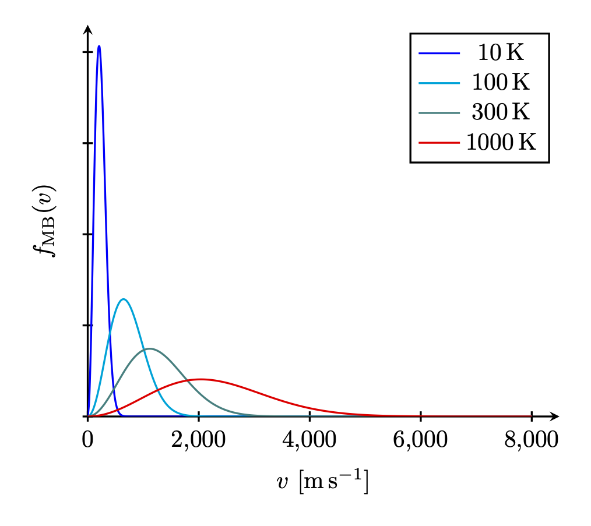{#fig-FLP_1_40_maxwell_boltzmann width=400}

 

### I.40-5 기체의 비열 {#sec-FLP_1_40_5}

이제 우리는 지금까지 알아본 이론을 검증하는 몇 가지 방법을 살펴보고, 기체에 대한 고전 이론이 얼마나 성공적인지 알아보자. 

- 단원자 기체의 경우 $PV$ 는 원자들의 질량 중심 운동의 운동 에너지의 $\frac{2}{3}$ 과 동일하다는 것과 운동 에너지는 내부 에너지와 같다는 것을 안다(@eq-FLP_1_39_9, @eq-FLP_1_39_10). 따라서 @eq-FLP_1_39_11 에서 $\gamma -1 =\frac{2}{3}$ 임을 안다. 
- 단원자 분자보다 복잡한 분자라면 회전 혹은 진동이 가능하다. 이 경우 내부 운동의 에너지도 $k_BT$ 에 비례한다고 가정해 보자. 그렇다면 주어진 온도에서 운동 에너지 $\frac{3}{2}k_BT$ 외에 내부 진동 및 회전 에너지를 가지고 있으며 따라서 단원자 분자와는 다른 $\gamma$ 값을 생각해야 한다. 

기술적으로 $\gamma$ 를 측정하는 가장 좋은 방법은 비열 측정이지만 이것은 이후에 다루기로 하고 $\gamma$ 를 단열 압축시의 @eq-FLP_1_39_14 에서 실험적으로 구한다고 가정하자.
  
몇가지 경우에 대해 $γ$ 를 계산해 보자. 우선 단원자 기체의 경우 $\gamma = \frac{5}{3}$ 임을 안다. 산소(O2), 요오드화수소(HI), 수소(H2) 와 같은 이원자 분자 기체의 경우 @fig-FLP_1_40_3 와 같은 포텐셜이 존재한다고 가정할 수 있다. 이 경우 관심 있는 온도에서는 원자 쌍의 원자들은 대부분 $r_0$ 만큼 떨어져 있다. 그렇지 않다면 원자로 존재하는 비율이 무시할수 없을 만큼 크다는 의미이다. 우리는 실제로 단일 산소 원자가 매우 적다는 것을 알고 있으며, 이는 $|V(r_0)| \gg k_BT$ 를 의미한다. 이 경우 포텐셜은 $r_0$ 를 중심으로 하는 조화진동자 포텐셜로 근사 할 수 있다.

이제 온도 $T$ 에서 이 분자의 총 에너지를 구해보자. 두 원자 각각의 운동 에너지가 $\frac{3}{2}k_BT$ 이므로 두 원자의 운동 에너지의 합은 $3k_BT$ 이다. 이를 다른 방식으로 표현하면 질량 중심의 운동 에너지 $\frac{3}{2}k_BT$, 회전의 운동 에너지 $\frac{2}{2}k_BT$, 그리고 진동의 운동 에너지 $\frac{1}{2}k_BT$ 로도 볼 수 있다. 진동의 운동 에너지는 하나의 차원에만 관여하며 따라서 $\frac{1}{2}k_BT$ 이다. 회전축이 될 수 있는 축은 두 원자사이의 변위벡터에 수직인 두 축 가운데 하나를 중심으로 회전할 수 있으므로 두 개의 독립적인 운동이 존재한다. 우리는 원자들이 일종의 점이며, 그것들을 연결하는 선을 중심으로 하는 회전은 없다고 가정한다. 어떤 불일치를 발견할 경우 이것이 문제일 수 있으므로 주의해야 한다. 여기에 진동의 포텐셜 에너지를 생각해야 한다. 조화 진동에서는 평균 운동 에너지와 평균 위치 에너지가 동일하므로, 진동의 위치 에너지도 $\frac{1}{2}k_BT$ 이다. 에너지의 총합은 $U=\frac{7}{2}k_BT$ 이며, $k_BT$는 원자당 $\frac{2}{7}U$ 이다. 즉, $\gamma$ 는 $\frac{5}{3}$ 이 아니라 $\frac{9}{7}$,  즉 $\gamma=1.286$ 이다. 

이 값을 @tbl-FLP_1_40_1 에 표시된 측정값과 비교해보자. 먼저 단원자 기체인 헬륨의 측정값은 거의 $\frac{5}{3}$ 크립톤과 아르곤은 더 가깝다.

  
::: {.center-table}

| 기체 |  온도 ($^\circ\,\text{C}$)  | $\gamma$
|:-------:|-------:|------:|
| He | -180 | 1.660 |
| Kr | 19 | 1.68 |
| Ar | 15 | 1.668 |
| H2 | 100 | 1.404 |
| O2 | 100 | 1.399 |
| HI | 100 | 1.40 |
| Br2 | 300 | 1.32 |
| I2 | 185 | 1.30 |
| NH3 | 15 | 1.310 |
| C2H6 | 15 | 1.22 |

: 여러 기체에서의 $\gamma$ 값 {#tbl-FLP_1_40_1 .striped .hover}

::: 

 

이원자 기체를 보자. 수소(H2) 는 1.404 인데 이론값 1.286과 일치하지 않는다. 산소(O2) 의 측정값 1.399 는 훨씬 비슷하지만 오차가 있다. 요오드화수소(HI)는 1.40 으로 산소와 유사하기 때무에 정답이 1.40인 것처럼 보일수도 있지만 브롬 (Br2) 은 1.32, 요오드(I2) 는를 1.30 으로 점점 1.286 에 가까워진다.

예를 들어, 에탄 C2H6 와 같이 더 많은 원자로 구성된 분자의 경우 8개의 서로 다른 원자들이 다양한 조합으로 진동하고 회전하므로 내부 에너지의 총량은 $k_B T$ 에 많은 수를 곱한 값이다. 운동 에너지만으로도 최소 $12 k_B T$ 가 되어야 하고, $\gamma-1$ 은 거의 0에 가까워야 한다. (즉 $\gamma \approx 1$). 실제로는 1.22 로 그다지 낮지 않다으며 운동 에너지만으로 계산된 $\frac{13}{12}$ 보다는 높다.

게다가 문제는 더 어렵다. 이원자 분자의 원자쌍의 결합이 아무리 강하더라도 진동하지 않게 할 수 없으며, 내부의 진동 에너지는 여전히 $k_B T$ 이다. 원자쌍 결합이 딱딱해서 진동을 하지 않는다면 $U=\frac{5}{2}k_B T$, $\gamma = 1.40$ 을 얻을 수 있으며 이 값은 H2 또는 O2 의 실험값과 매우 유사하다. 하지만 이것은 $\text{100 }^\circ \text{C}$ 에서의 값이고 H2 의 경우 $\gamma$ 는 $\text{−185 }^\circ \text{C}$ 에서 약 1.6, $\text{2000 }^\circ \text{C}$ 에서 1.3 까지 변한다. 수소의 경우 온도에 따른 변화가 산소보다 더 크긴 하지만, 그럼에도 불구하고 산소에서도 온도가 낮아짐에 따라 $\gamma$ 는 확실히 상승하는 경향이 있다.

 

### I.40-6 고전역학의 실패 {#xec-FLP_1_40_6}

위의 불일치를 해결하기 위해 조화진동이 이외의 다른 힘의 법칙을 시도할 수도 있지만, 다른 어떤 것이든 $U$ 를 더 크게 만들 뿐이며 더 많은 형태의 에너지를 포함한다면, $\gamma$ 는 $1$ 에 더 가까워 지고 이는 사실과 모순된다. 생각할 수 있는 모든 고전적 접근은 상황을 더욱 악화시킬 뿐이다. 실제로는 각 원자에 전자가 존재하고, 스펙트럼을 통해 내부 운동이 존재한다는 것을 알 수 있다. 각 전자는 최소 $\frac{1}{2}k_BT$ 의 운동 에너지를 가져야 하며, 이는 퍼텐셜 에너지에 해당하므로 이를 더하면 $\gamma$ 가 더욱 작아진다. 이것은 터무니없이 잘못되었다.

기체의 동역학 이론에 관한 최초의 위대한 논문은 맥스웰의 1859년 논문이다. 우리가 논의해 온 아이디어를 바탕으로, 그는 보일의 법칙, 확산 이론, 기체의 점도, 그리고 다음 장에서 논의할 내용 등 많은 알려진 관계들을 정확하게 설명할 수 있었다. 그는 최종 요약에 이러한 위대한 성공들을 모두 열거한 후, 마지막에 이렇게 말했다. “마침내 모든 입자들의 평행 이동과 회전 운동(그는 $\frac{1}{2}k_BT$ 정리) 사이의 필수적인 관계를 확립함으로써, 그러한 입자들의 시스템이 두 비열 사이의 알려진 관계를 만족시킬 수 없음을 증명했습니다.” 그는 $\gamma$ 를 언급하고 있으며(이는 비열을 측정하는 두 가지 방법과 관련이 있다), 그리고 정답을 얻을 수 없다는 것을 알고 있다고 말했다.

10년 후 한 강연에서 멕스웰은 “이제 나는 분자 이론이 지금까지 겪은 가장 큰 어려움이라고 생각되는 것을 여러분 앞에 제시합니다.”라고 말했다. 이는 고전 물리학의 법칙이 잘못되었다는 최초의 표현이며 엄밀하게 증명된 정리가 실험과 일치하지 않았기 때문에 근본적으로 불가능한 것이 존재한다는 최초의 징표였다. 1905년경, 제임스 홉우드 진스 경과 레일리 경(존 윌리엄 스트럿)이 다시 이 퍼즐에 대해 이야기하기도 했다. 사람들은 종종 19세기 후반의 물리학자들이 모든 중요한 물리 법칙을 알고 있었으며, 소수점 자리수를 더 계산하기만 하면 된다고 생각했다는 말을 듣는다. 누군가가 한 번 그렇게 말한것을 다른 사람들이 따라했을 수도 있다. 하지만 당시 문헌을 면밀히 읽어보면 그들은 모두 무언가에 대해 걱정하고 있었다. 진스 경은 이 퍼즐이 매우 신비로운 현상이며, 온도가 낮아질 때 특정 종류의 움직임이 “얼어붙는” 것처럼 보인다고 말했다.

예를 들어 진동 운동이 저온에서는 존재하지 않고 고온에서 존재한다고 가정한다면 진동이 존재하지 않는 낮은 온도에서는 $\gamma=1.40$ 이며 더 높은 온도에서 진동이 도입되면 $\gamma$ 가 낮아진다고 할 수 있다. 회전에 대해서도 동일하게 주장 할 수 있다. 충분히 낮은 온도에서 회전이 사라져 “얼어붙는다”고 말할 수 있다면, 낮은 온도에서 수소의 $\gamma$ 가 $1.66$ 에 가까워진다는 사실을 이해할 수 있다. 물론 이러한 운동이 “얼어붙는” 것은 고전 역학으로는 이해될 수 없으며 양자역학을 통해 이해될 수 있었다.

양자역학 이론의 통계역학 결과를 증명 없이 진술해보자. 양자역학에 따르면 포텐셜에 의해 구속된 시스템은 이산적인 에너지 준위, 즉 서로 다른 에너지 상태를 갖게 된다는 것을 기억하자. 이제 양자역학에 의해 통계역학을 어떻게 수정해야 하는가가 문제이다. 흥미롭게도, 대부분의 문제는 고전 역학보다 양자역학에서 더 어려운 반면, 통계역학의 문제는 양자 이론에서 훨씬 쉽다! 고전 역학에서 우리가 도출하는 간단한 결과인 $n = n_0 e^{−\text{에너지/}k_BT}$ 는 다음과 같은 매우 중요한 정리가 된다: 예를 들어, 분자 상태 집합의 에너지가 $E_0$, $E_1$, $E_2$, $\ldots$, $E_i$, $\ldots$ 라고 하면, 열평형 상태에서 에너지 $E_i$ 를 가진 특정 상태에 있는 분자를 찾을 확률은 $e^{-E_i/k_BT}$ 에 비례한다. 즉 상태 $E_1$ 에 있을 확률과 상태 $E_0$ 에 있을 확률에 대한 상대적인 확률은

$$
\dfrac{P_1}{P_0} = \dfrac{e^{-E_1/k_BT}}{e^{-E_0/k_BT}},
$$ {#eq-FLP_1_40_10}

이며 이는 $P_1 = n_1/N,\, P_0=n_0/N$ 이므로 다음 식과 같다.

$$
n_1=n_0e^{-(E_1-E_0)/k_BT}.
$$ {#eq-FLP_1_40_11}

이에 따르면 낮은 에너지 상태보다 높은 에너지 상태에 있을 가능성이 낮다. 

양자역학에 따르면 조화 진동자의 경우 에너지 레벨이 고르게 배치되어 있다. 가장 낮은 에너지 $E_0=\frac{1}{2}\hbar \omega$ 에 대해 $k$ 번째 들뜬 상태의 에너지 $E_k$ 는 다음과 같다.

$$
E_k = \left(\dfrac{1}{2}+k\right)\hbar \omega.
$$ {#eq-FLP_energy_level_of_quantum_mechanical_harmonic_oscillator}

이제 무슨 일이 일어나는지 보자. 우리는 이원자 분자의 진동을 조화 진동자로 근사하여 연구한다. 상태 $E_0$ 가 아닌 상태 $E_1$ 에서 분자를 찾을 수 있는 상대적인 확률은 무엇일까? 답은 상태 $E_1$ 에서 그것을 찾을 확률이 상태 $E_0$ 에서 찾을 확률에 비해 $e^{−\hbar \omega/k_BT}$ 로 감소한다는 것이다. 이제 $k_BT$ 가 $\hbar \omega$ 보다 훨씬 작면, 즉 저온이라면 $E_1$ 상태에 있을 확률은 매우 낮으며 실질적으로 모든 원자는 $E_0$ 상태에 있다. 온도를 변화시키되 여전히 매우 작게 유지한다면, 그 상태가 $E_1=\hbar \omega$ 에 있을 확률은 무한히 작게 된다. 즉 진동자의 에너지는 거의 $E_0$ 에 가깝다. 온도가 $\hbar \omega$ 보다 훨씬 낮을 경우 온도에 따라 변하지 않는다. 모든 진동자는 바닥 상태에 있으며, 그 움직임은 실질적으로 “동결” 되어 비열에 기여하지 않는다. 따라서 @tbl-FLP_1_40_1 에서 우리는 $\text{100 }^\circ \text{C}$ 에서 $k_BT$ 가 산소 또는 수소 분자의 진동 에너지보다 훨씬 낮지만, 요오드 분자에서는 그렇지 않다는 것을 판단할 수 있다. 이 차이의 이유는 요오드 원자가 수소에 비해 매우 무겁기 때문이다. 요오드와 수소에서 힘이 비슷할 수 있지만 요오드 분자는 너무 무거워서 진동의 고유 주파수가 수소의 고유 주파수에 비해 매우 낮다. 수소의 경우 실온에서 $\hbar \omega$ 가 $k_BT$ 보다 높고, 요오드의 경우 낮으며, 오직 후자인 요오드만이 고전적인 진동 에너지를 나타낸다. 기체의 온도를 매우 낮은 $T$ 값부터 상승시키면, 분자들이 거의 모두 바닥상태에 있을 다가 점차 첫 번째 들뜬상태에 있을 확률이 크게 높아지고, 온도가 더 높아지면 더 높은 에너지의 상태에 있을 확률이 높아진다. 많은 상태에 대해 확률이 크게 나타날 때, 기체의 거동은 고전 물리학이 제시한 것에 근접하게 된다. 이는 양자화된 상태가 에너지 연속체와 거의 구별되지 않게 되며, 시스템은 거의 모든 에너지를 가질 수 있기 때문이다. 따라서 온도가 상승함에 따라 우리는 다시 고전 물리학의 결과를 얻어야 한다. 원자의 회전 상태도 양자화된다는 것을 같은 방식으로 보여줄 수 있지만, 이 상태들의 에너지 차이는 일반적으로 $k_BT$ 보다 작으며 따라서 시스템 내 회전 운동 에너지가 고전적인 방식으로 참여힌다. 실온에서 이것이 완전히 사실이 아닌 한 가지 예는 수소이다.

이번이 우리가 실험과 비교하여 고전 물리학에 문제가 있음을 진정으로 추론한 첫 번째 경우이며, 우리는 실재 그랬던 것과 거의 동일한 방식으로 난관의 해결착을 양자역학에서 찾았다. 다음 난관 발견되기까지 30~40년이 걸렸으며, 역시 통계역학과 관련이 있었지만 이번에는 광자기체의 역학이었다. 그 문제는 20세기 초에 플랑크에 의해 해결되었다.

 

## I.41. 브라운 운동 {#sec-FLP_1_41}

### I.41-1 에너지의 등분배 {#sec-FLP_1_41-1}

브라운 운동은 1827년에 식물학자 로버트 브라운에 의해 발견되었다. 그는 현미경으로 액체 안에서 식물 꽃가루의 작은 입자들이 흔들리는 것을 관찰했으며, 그것이 살아있는 것이 아니라 물속에서 움직이는 작은 먼지 조각에 불과하다는 것을 인식했다. 사실 그는 물을 가둔 석영 조각을 땅에서 얻었는데 이는 생명과 무관함을 입증하는 데 도움이 되었다. 그것은 수백만 년 동안 갇혀 있었지만, 그 안에서 같은 움직임을 볼 수 있었다. 보이는 것은 매우 작은 입자들이 계속해서 흔들리고 있다는 것이었다.

이것은 나중에 분자 운동의 효과 중 하나임이 입증되었다. 경기장 안의 많은 사람들 위에서 사람들에 의해 밀리겨마 움직이는 큰 풍선을 생각해자. 멀리서 보면 사람들은 볼 수 없지만, 풍선은 볼 수 있고, 풍선이 꽤 불규칙하게 움직일 것이다. 이 풍선의 불규칙한 움직임을 통해 분자 운동의 불규칙함을 정성적으로 이해 할 수 있다. 우리는 액체나 기체에 매달린 작은 입자가 분자에 비해 매우 무겁지만 그 평균 운동 에너지가 $\frac{3}{2}k_BT$ 임을 알고 있다. 그것이 그것이 매우 무겁고, 따라서 속도가 비교적 느리더라도 아주 느리지는 않다는 것이 밝혀졌다. 직경이 1~2 $\mu\text{m}$ 인 물체의 경우 $1 \text{mm}/\text{sec}$ 정도이다. 그런데 현미경에서도 이를 확인하기 매우 어려운데 이는 입자가 지속적으로 방향을 전환하여 어디에도 도달하지 않기 때문이다. 얼마나 진행하는지는 현재 장의 끝에서 논의하겠다. 이 문제는 20세기 초에 아인슈타인에 의해 처음 해결되었다.

이 입자의 평균 운동 에너지가 $\frac{3}{2}k_BT$ 라는 것은 운동 이론, 즉 뉴턴의 법칙에서 도출되었다. 우리는 분자운동론으로부터 적은 노력으로 많은 놀라운 결론을 도출할 수 있다는 것을 확인하게 될 이다. 이렇게 많은 결과를 얻을 수 있었던 것은 우리가 중요한 것-열역학 제 0 법칙-을 가정했기 때문이다$^4$. [$^4$ 파인만은 명시적으로 열역학 제 0 법칙이라고 표현하지 않는다.]{.aside}

::: {.callout-important icon="false"}

#### **열역학 제 0 법칙**

한 계가 온도 $T$ 에서 열평형상태에 있다면 같은 온도 $T$ 인 다른 시스템과도 열평형 상태이다.

:::

한 입자(이 입자를 $q$-입자 라고 하자)가 물과 실제로 충돌할 때 어떻게 움직이는지 확인하기 위해 물과 과 상호작용하지 않고 $q$-입자와 “hard” 충돌을 할 뿐인 $p$-입자로 구성된 기체가 존재한다고 하자. $q$-입자에 뿔이 튀어나와 있다고 가정하면, $p$-입자가 하는 일은 이 뿔을 치는 것 뿐이다. 우리는 또한 $p$-입자 기체가 이상기체라고 가정한다. 따라서 온도 $T$ 에서 이 가상의 미세 $p$-입자 기체에 대해 모두 알고 있다. 이제 우리 $q$-입자는 $p$-입자 기체와 평형 상태에 있어야 하며 따라서 $q$-입자의 평균 운동은 기체 충돌에서 얻어지는 것과 같아야 한다. 왜냐하면 입자가 물에 비해 적절한 속도로 이동하지 않고, 예를 들어 $q$-입자가 더 빠르게 움직이고 있다면, 이는 $p$-입자 기체가 그로부터 에너지를 흡수하여 물보다 더 뜨거워진다는 의미이기 때문이다. 하지만 우리는 그것들을 같은 온도에서 시작했으며, 사물이 한 번 평형 상태에 있으면 평형 상태를 유지한다고 가정한다. 한 부분이 뜨거워지면서 동시에 다른 부분이 차가워지는 현상은 발생하지 않는다.

이 명제는 참이며 역학 법칙으로부터 증명될 수 있있지만 어려운 역학을 사용해야 하며 양자역학을 통해 증명하는 것이 훨씬 쉽다. 볼츠만에 의해 처음 증명되었으며 일단 사실로 받아들이자. 이에 따르면 $q$-입자가 물과 충돌하면서 $\frac{3}{2}k_BT$ 의 에너지를 가진다면 물이 아니라 $p$-입자 기체와 충돌해서도 $\frac{3}{2}k_BT$ 를 가져야 한다. 이는 다소 이상한 논증이지만 완전히 타당하다.

브라운 운동이 처음 발견된 콜로이드 입자의 운동 외에도, 실험실 및 기타 상황에서 브라운 운동을 볼 수 있는 다양한 현상이 존재한다. 가능한 가장 섬세한 장비를 만들려고 한다면, 예를 들어 @fig-FLP_1_41_1 과 같은 매우 정밀한 탄도 갈바노미터에서 얇은 석영 섬유 위에 아주 작은 거울을 설치하면, 거울은 제자리에 머무르지 않고 계속 흔들어 빛을 비춘다. 거울이 항상 흔들리기 때문에 거울이 비추는 지점은 계속 변한다. 이 거울의 회전 평균 운동 에너지는 평균적으로 $\frac{1}{2}k_BT$ 이어야 힌다.

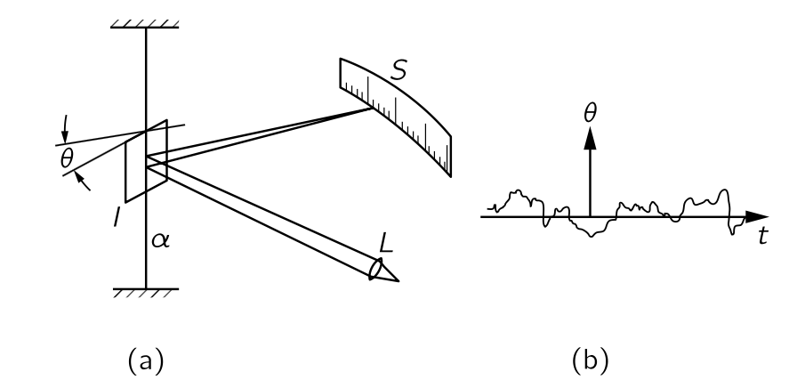{#fig-FLP_1_41_1 width=400}

거울이 흔들리는 평균 제곱각을 알아보자. 한쪽을 살짝 두드려서 거울이 잠시 회전했다가 되돌아 오는 시간을 통해 거울의 회전의 자연진동수 $\omega_0$ 를 확인할 수 있다. 관성모먼트 $I$ 에 대해 회전 운동 에너지 $T=\frac{1}{2}I\omega^2$ 이며 위치 에너지는 $V=\frac{1}{2}\alpha \theta^2$ 이다. 거울의 자연진동수를 이용하면 위치 에너지는 $V=\frac{1}{2}I\omega_0^2\theta^2$ 이다. 우리는 단순조화진동자의 주기당 평균 운동에너지와 위치에너지가 같다는 사실과 1차원 운동의 평균 운동에너지가 $\frac{1}{2}k_BT$ 임을 을 알고 있으며, 이로부터 

$$
\left\langle \theta^2 \right\rangle = k_BT/I\omega_0^2
$$ {#eq-FLP_1_41_4}

임을 안다. 이와 같이 우리는 갈바노미터 거울의 진동을 계산하고 이를 통해 기기의 한계를 알 수 있다. 더 작은 진동을 원한다면 거울을 식혀야 한다. 어디를? 이는 진동의 원인이 어디인지에 따라 다르다. 섬유를 통과한다면, 위쪽에서 냉각한다. 거울이 기체에 둘러싸여 기체 분자의 충돌로 진동하는 경우 가스를 냉각하는 것이 좋다. 실제로 진동의 감쇠가 어디에서 오는지 알면, 그것이 항상 요동의 원인이고 다시 살펴볼 지점이다.

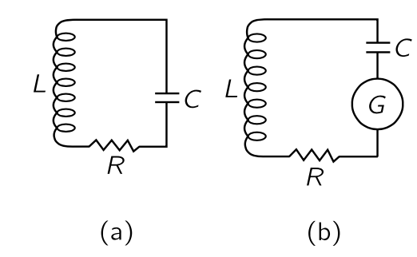{#fig-FLP_1_41_2 width=300}

동일한 현상이 전기 회로에서도 발생한다. 특정 주파수에 대해 매우 민감하고 정확한 증폭기를 제작하고, 입력에 공명 회로(@fig-FLP_1_41_2)를 설치하여 라디오 수신기와 같이 해당 주파수에 매우 민감하게 만든다고 가정하자. 우리가 가장 낮은 한계까지 내려가고자 한다고 가정하면, 전압을 빼서 인덕턴스에서 차감한 뒤 증폭기의 나머지 부분으로 전달한다. 물론, 이와 같은 회로에서는 일정량의 손실이 존재힌다. 완벽한 공진 회로는 아니지만 매우 좋은 회로이며 약간의 저항이 있다.(예를 들어 저항을 삽입해 볼 수 있게 했지만, 작아야 한다). 이제 인덕턴스에 걸친 전압은 얼마나 변동할까? 우리는 $\frac{1}{2}LI^2$ 가 “운동 에너지”, 즉 공명 회로의 코일과 연관된 에너지임을 알고 있다(제25장). 따라서 $\frac{1}{2}LI^22$ 의 평균값은 $\frac{1}{2}k_BT$ 와 같으며, 이를통해 RMS 전류와 RMS 전압을 알 수 있다. 인덕터에 걸리는 전압 $\hat{V}_L = i\omega L\hat{I}$ 이고 전압의 절대값의 제곱평균 $\left\langle V_L^2\right\rangle = L^2\omega_0^2 \left\langle I^2\right\rangle$ 이며 $\frac{1}{2}L\left\langle I^2\right\rangle = \frac{1}{2}k_BT$ 이므로

$$
\left\langle V_L^2 \right\rangle = I\omega_0^2 k_BT
$$ {#eq-FLP_1_41_2}

이다. 이제 우리는 회로를 설계하고, 열 변동과 관련된 소음인 *존슨 노이즈 (Johnson noise)* 가 언제 발생할지 판단할 수 있다! 이 변동의 원인은 어디인가? 그것은 저항기이다—저항기 내 전자들이 저항기 내 물질과 열평형을 이루고 있기 때문에 흔들리며 전자 밀도에 변동을 발생한다. 따라서 공진 회로를 구동하는 작은 전기장을 발생시킨다.

전기 엔지니어는 답을 다른 방식으로 표현한다. 물리적으로 저항은 실질적으로 잡음의 원천이다. 하지만 우리는 잡음을 발생시키는 진짜 물리적 저항을 가진 실제 회로를 소음을 나타내는 작은 발전기를 포함하는 인공 회로로 대체할 수 있다. 여기서 저항기는 이상적이며 소음을 발생시키지 않고 모든 소음은 인공 발전기에 있다. 따라서 저항기에 의해 발생하는 잡음의 특성을 알고 그에 대한 공식이 있다면, 우리는 그 잡음에 대해 회로가 어떤 반응을 할지 계산할 수 있다. 따라서, 우리는 소음 변동에 대한 공식이 필요합니다. 이제 저항기에서 발생하는 잡음은 모든 주파수에서 발생하며, 저항기 자체는 공진되지 않기 때문입니다. 물론 공진 회로는 올바른 주파수에 가까운 부분만 “듣습니다”, 하지만 저항기에는 다양한 주파수가 많이 포함되어 있습니다. 우리는 발전기의 강도를 다음과 같이 설명할 수 있습니다: 저항기가 노이즈 발생기에 직접 연결될 경우 발전기의 전압이 $E$ 일 때 흡수하는 평균 전력은 $\langle E^2\rangle/R$ 이다. 하지만 우리는 각 주파수마다 전력이 얼마나 되는지 더 자세히 알고 싶습니다. 하나의 주파수에서는 전력이 거의 없으며, 이는 분포입니다. $P(\omega)\, d\omega$ 를 동일한 저항기에 주파수 범위 $d\omega$ 에서 발전기가 전달할 전력이라고 하자. 그렇다면 우리는 power 가 저항에 무관하게 다음과 같다는 것을 증명 할 수 있다.

$$
P(\omega)\,d \omega = \dfrac{2k_BT}{\pi} \,d\omega.
$$ {#eq-FLP_1_41_3}

 

### I.41-2 복사의 열평형 {#eq-FLP_1_41_2}

빛에 대해 논의할 때와 같이 전하를 띤 진동자를 생각하자. 전자가 위아래로 진동하면 빛을 낼 수 있다는 것을 안다. 이제 이 진동기가 매우 얇은 다른 원자들의 기체 안에 있으며, 때때로 원자들이 진동자와 충돌한다고 가정하자. 평형 상태에서 오랜 시간이 지나면 이 진동자는 진동의 운동 에너지가 $\frac{1}{2}k_B T$ 가 되도록 에너지를 흡수하며, 조화 진동자이므로 전체 에너지는 $k_BT$ 일 것이다. 물론 현재까지는 잘못된 설명이다. 진동자의 포함하며, 에너지 $k_BT$ 를 가진다면 위아래로 흔들리며 빛을 방출한다. 따라서 빛을 방출하는 전하를 포함하지 않는 실제 물질만으로는 평형을 이루는 것이 불가능하며, 빛이 방출될 때 에너지는 흐르고 진동자는 시간이 흐름에 따라 $k_BT$ 를 잃게 되며, 따라서 진동자와 충돌하는 전체 기체가 점차 냉각된다. 이것이 그것은 따뜻한 난로가 빛을 우주로 방출하면서 식는 방식이며, 원자들이 전하를 흔들어 지속적으로 방출하고, 이 복사 때문에 서서히 진동 움직임이 느려진다.

반대로, 빛이 무한의 영역으로 사라지지 않도록 전체를 상자에 가두면 결국 열평형을 얻을 수 있다. 우리는 상자 벽에 빛을 되 쏘아주는 라디에이터가 있다고 할 수 도 있고 그 상자에 거울 벽이 있다고 가정할 수도 있지만 후자가 더 쉽다. 따라서 우리는 진동자에서 방출되는 모든 빛이 상자 안에서 계속 흐르고 있다고 가정한다. 그렇다면 진동자가 복사하기 시작하는 것은 사실이지만, 복사하고 있음에도 불구하고 에너지 $k_B T$ 를 유지할 수 있다. 이는 상자의 벽에서 반사된 자체 빛에 의해 비추어지고 있기 때문이라고 말할 수 있다. 즉, 진동자가 일부를 복사하고 있지만 빛이 돌아와 복사된 에너지의 일부를 반환한다.

이제 우리는 온도 $T$ 에서 얼마나 많은 빛이 상자 안에 있어야 진동자에 비춰지는 빛이 지속적인 복사를 유지할 수 있는지를 결정 할 수 있다.

기체 원자들이 서로 매우 떨어져 있고 밀도가 낮다면 복사 저항(radiation resistance)을 제외한 저항이 전혀 없는 이상적인 진동자를 갖는다. 열평형에서 진동자가 동시에 두 가지 일을 수행하고 있다볼수 있다. 먼저 평균 에너지 $k_B T$ 를 가지고 있으며 방출하는 복사의 양을 계산할 수 있다. 둘째, 이 양은 빛이 진동자에 산란되는 결과와 정확히 같아야 한다. 에너지가 갈 수 있는 다른 곳이 없으므로, 이 효과적인 복사는 실제로 그 안에 있는 빛으로부터 산란된 빛에 불과하다.

따라서 진동자가 특정 에너지를 가지고 있을 경우, 진동자가 초당 방출하는 에너지를 먼저 계산해보자. (여기서 [복사 감쇄와 광산란](#sec-FLP_1_32)의 여러 결과를 사용한다) 라디안당 방출되는 에너지를 진동자의 에너지로 나눈 것을 $1/Q$ (@eq-FLP_1_32_8) 라고 하며 $1/Q=(dW/dt)/\omega_0 W$ 이다. 감쇠 상수 $\gamma$ 를 이용하여 $1/Q=\gamma/\omega_0$ 로 표기할 수 있으며, 여기서 $\omega_0$ 는 진동자의 고유 주파수이다. $\gamma$ 가 매우 작으면 $Q$ 는 매우 크다. 그때 초당 방출되는 에너지는

$$
\dfrac{dW}{dt}=\dfrac{\omega_0 W }{Q}= \dfrac{\omega_0 W \gamma}{\omega_0}=\gamma W
$$ {#eq-FLP_1_41_4}

이다. 이제 진동자는 평균 에너지 $k_B T$ 를 가져야 하므로, $\gamma k_B T$ 는 초당 방출되는 평균 에너지 양임을 알 수 있다.

$$
\left\langle \dfrac{dW}{dt}\right \rangle =\gamma k_B T.
$$ {#eq-FLP_1_41_5}

이제 우리는 감마만 구하면 된다. @eq-FLP_1_32_12 로부터

$$
\gamma = \dfrac{\omega_0}{Q}=\dfrac{2}{3}\dfrac{r_0 \omega_0^2}{c},
$$ {#eq-FLP_1_41_6}

이며, 여기서 $r_0=e^2/mc^2$ 는 고전적인 전자 반지름이고, $\lambda =  2πc/\omega_0$ 으로 놓았다. 따라서 $\omega_0$ 주위에서 방출되는 평균적인 복사율은

$$
\left\langle \dfrac{dW}{dt} \right\rangle  = \dfrac{2}{3}\dfrac{r_0\omega_0^2 k_BT}{c}
$$ {#eq-FLP_1_41_7}

이다. 

다음으로 우리는 진동자에 얼마나 많은 빛이 비추어야 하는지 알아보자. 빛으로부터 흡수된 에너지(그리고 그에 따라 산란되는)가 정확히 이 정도일 정도로 충분해야 한다. 방출된 빛과 공동 내 진동자에 비추는 빛의 양이 같아야 한다. 이제 진동자에 비치는 특정 양의—알 수 없는—복사량이 있을 경우, 산란되는 양을 계산해야 한다. $\omega$ 주위의 $d\omega$ 범위에서 존재하는 빛의 양을 $I(\omega)\,d\omega$ 라고 하자. 여기서 $I(\omega)$ 는 우리가 알아야 할 스펙트럼 분포이며, 온도 $T$ 에서 우리가 문을 열고 구멍을 통해 보이는 용광로의 색이다. 지금 얼마나 많은 빛이 흡수되나요? 우리는 주어진 입사광선으로부터 흡수되는 방사선량을 계산하고, 이를 단면을 기준으로 계산했습니다. 마치 우리가 특정 단면에 떨어지는 모든 빛이 흡수된다고 말한 것과 같습니다. 따라서 재방사(산란)되는 총량은 입사 강도 $I(\omega)\,d\omega$ 에 단면적 $\sigma$ 를 곱한 값이다.

우리가 유도한 단면에 대한 공식 @eq-FLP_1_32_19 에는 감쇄가 포함되지 않았다. 우리가 넘어간 저항 항을 넣고 단면을 계산하면

$$
\sigma_s=\dfrac{8\pi r_0^2}{3}\left[ \dfrac{\omega^4}{(ω^2−ω^2_0)^2+\gamma^2 \omega^2} \right]
$${#eq-FLP_1_41_8}

이다. 

주파수의 함수로서, $\sigma_s$ 는 자연 주파수 $\omega_0$ 에 매우 가깝게 있는 $\omega$ 에 대해서만 유의미한 크기를 가진다. (복사 진동자의 $Q\approx 10^8$) 진동자는 $\omega$ 가 $\omega_0$ 와 같을 때 매우 강하게 산란하고, 다른 $\omega$ 값에서는 매우 약하게 산란하며 따라서 다음을 얻는다.

$$
\sigma_s= \dfrac{2\pi r^2_0 \omega^2_0}{3[(\omega − \omega_0)^2+\gamma^2/4]} 
$$ {#eq-FLP_1_41_9}

이제 전체 곡선이 $\omega = \omega_0$ 근처에 위치한다. (우리는 실제로 근사값을 만들 필요는 없지만, 방정식을 약간 단순화하면 적분을 수행하는 것이 훨씬 쉬워집니다.) 이제 우리는 주어진 주파수 범위의 강도에 산란 단면을 곱하여 $d\omega$ 범위에 산란된 에너지 양을 구합니다. 전체 산란된 에너지는 모든 $\omega$ 에 대해 이것의 적분이 됩니다. 따라서

$$
\dfrac{dW_s}{dt}=\int_0^\infty I(\omega) \sigma_s(\omega)\,d \omega=\int_0^\infty \dfrac{2\pi r_0^2  \omega_0^2 I(\omega) \,d\omega}{3[(\omega−\omega_0^2)^2+\gamma^2/4]}.
$$ {#eq-FLP_1_41_10}

이제 $dW_s/dt=3\gamma k_BT$ 라고 놓을 수 있다. 왜 $3$ 이 곱지는가? 32 장에서 단면적 분석을 할 때 우리는 편광이 빛이 진동자를 구동할 수 있을 정도라고 가정했기 때문이다. 만약 우리가 한 방향으로만 움직일 수 있는 진동자를 사용했고, 예를 들어 빛이 잘못된 방향으로 편광된다면, 산란을 발생시키지 않을 것이다. 따라서 우리는 빛의 입사 및 편광 모든 방향에 걸쳐 한 방향으로만 이동할 수 있는 진동자의 단면적을 평균해야 하며, 보다 쉽게는 장이 어느 방향을 가리키든 장을 따라가는 진동자를 상상할 수 있다. 그러한 진동자는 세 방향으로 동일하게 진동할 수 있으며, 해당 진동자의 자유도가 $3$ 이기 때문에 평균 에너지가 $3k_BT$ 이다. 따라서 $3\gamma k_BT$ 를 사용한다.

![파인만 물리학 강의 I. 그림 41-3. @eq-FLP_1_41_10 의 $I(\omega)$. 픽은 공명 곡선 $1/[(\omega-\omega_0)^2+\gamma^2/4]$ 이다. $I(\omega)$ 는 근사적으로 $I(\omega_0)$ 와 잘 일치한다.](figures/fig_1_41/fig_1_41_3.png){#fig-FLP_1_41_3 width=300}

이제 적분을 하자. 빛의 스펙트럼 분포 $I(\omega)$ 가 매끄러운 곡선이며, $\sigma_s$ 가 $\omega_0$ 근처의 좁은 영역에서 거의 변하지 않는다고 가정하자(@fig-FLP_1_41_3). 그렇다면 유의미한 기여는 $[\omega_0-\gamma/2,\, \omega_0+\gamma/]2$ 영역에서 발생하며 $I(\omega)$ 가 알 수 없고 복잡한 함수일지라도, 매끄러운 곡선을 '상수'로 대체할 수 있다. 즉 이 적분 영역에서 $I(\omega)\approx I(\omega_0)$ 로 놓고 적분한다. 이제 적분은

$$
\dfrac{2}{3}\pi r_0^2 \omega_0^2 I(\omega_0) \int_0^\infty \dfrac{d\omega}{(\omega − \omega_0)^2+\gamma2/4} = 3\gamma k_BT
$$

이다. 이제 적분은 0 에서 $\infty$ 까지 진행되어야 하지만, 0 은 $\omega_0$ 에서 너무 멀리 떨어져 있어 그 시점까지 곡선이 모두 완성되므로 우리는 대신 $-\infty$ 에서 $\infty$ 까지 적분하는 것으로 바꿀 수 있으며 이 적분값은 $2π/\gamma$ 이다. 그렇다면

$$
I(\omega_0)=\dfrac{9\gamma^2 k_BT}{4\pi^2 r_0^2 \omega_0^2}
$$ {#eq-FLP_1_41_12}

이다. @eq-FLP_1_41_6 을 대입하면, 그리고 $\omega_0$ 를 $\omega$ 로 교체하면 $I(\omega)$ 를 얻는다.

$$
I(\omega)=\dfrac{\omega^2 k_B T}{\pi^2 c^2}
$$ {#eq-FLP_1_41_13}

위 식은 뜨거운 용광로에서 나오는 빛의 분포를 우리에게 제공한다. 즉 흑체 복사이다. 검은색은 온도가 영도일 때 우리가 보는 용광로의 구멍이 검은색이기 때문이다.

@eq-FLP_1_41_13 은 온도 $T$ 의 닫힌 상자 내부에서의 복사에너지 분포이다. 여기서 진동자의 전하와 질량, 그리고 진동자의 특이한 모든 성질은 상쇄된다. 왜냐하면 한 진동자와 평형에 도달하면 다른 질량을 가진 다른 오실레이터와 평형에 있어야 하기 때문이다. 이것은 평형이 우리가 평형 상태에 있는 것에 의존하지 않고 오직 온도에만 의존한다는 명제에 대한 중요한 일종의 검증이다. 아래 @fig-FLP_1_41_4 은 $I(\omega)$ 를 보여준다.

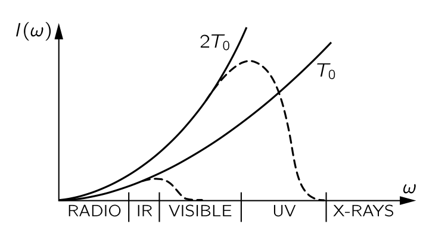{#fig-FLP_1_41_4 width=300}

$I(\omega) \propto \omega^2$ 이다. 즉 어떤 온도의 상자건 방출되는 X-선은 강해야 한다. 그러나 실제로는 그렇지 않다. 난로를 열어 보더라도 엑스레이 때문에 눈이 전혀 타지 않다는 것을 안다. 게다가 상자 안의 총 에너지, 즉 모든 진동수에 대한 이 모든 강도의 합은 이 무한 곡선의 주파수에 대한 적분이며 무한대로 발산하므로 근본적이고 절대적으로 잘못되었다. 즉 고전 이론은 흑체에서 나오는 빛의 분포를 정확히 기술할 수 없다. 물리학자들은 이에 대해 다양한 관점으로 혼란해 했다. @eq-FLP_1_41_13 은 **레일리 법칙 (Layleigh's law)** 이라고 불리는 고전 물리학의 예측으로 명백히 틀렸다.

 

### I.41-3 양자 진동자의 등분배 {#eq-FLP_1_41_3}

위의 난제는 고전 물리학에서 계속된 문제중의 하나로 기체의 비열문제로부터 흑체복사문제까지 아우르며 후엔 흑체복사문제로 불리웠다. 실제 곡선에 대한 측정도 많이 있었지만(@fig-FLP_1_41_4) X-선은 거기에 없었다. 고전 이론에 따르면 온도를 낮추면 전체 곡선이 $T$ 에 비례하여 하강하지만, 관측된 곡선은 낮은 온도에서 더 빨리 짤린다(@fig-FLP_1_41_4). 따라서 곡선의 낮은 진동수쪽의 극한은 옳지만, 높은 진동수쪽은 틀렸다. 왜일까? 제임스 진스 경은 가스의 비열에 대해 높은 진동수의 운동은 온도가 너무 낮아지면 “동결”된다고 언급했다. 즉, 온도가 너무 낮고 주파수가 너무 높으면 진동자는 평균적으로 $k_B T$ 의 에너지를 갖지 않는다. 이제 @eq-FLP_1_41_13 을 어떻게 유도했는지 상기하자. 모든 것은 열평형에서 진동자의 에너지에 달려 있다. @eq-FLP_1_41_5 의 $k_BT$ 와 @eq-FLP_1_41_13 의 동일한 $k_B T$ 는 온도 $T$ 에서 진동수가 $\omega$ 인 고주파 진동자의 평균 에너지이다. 전통적으로는 이것이 $k_B T$ 이지만, 실험적으로는 그렇지 않다—온도가 너무 낮거나 진동자 주파수가 너무 높을 때는 그렇지 않다. 따라서 곡선이 떨어지는 이유는 가스의 비열이 실패하는 이유와 동일하다. 가스의 비열은 매우 복잡하기 때문에 흑체복사 곡선을 연구하는 것이 더 쉽다. 따라서 진정한 흑체복사 곡선을 결정하는 데 집중하도록 하자. 왜냐하면 이 곡선은 모든 주파수에서 조화 진동자의 평균 에너지가 온도의 함수로 정확히 얼마인지 정확히 알려주기 때문이다.

플랑크는 이 곡선을 연구하면서 먼저 관찰된 곡선을 매우 잘 맞는 좋은 함수와 맞추어 경험적으로 답을 결정했고, 이렇게 그는 진동수의 함수인 조화 진동자의 평균 에너지에 대한 경험적 공식을 가지게 되었다. 다시 말해, 그는 $k_B T$ 대신 올바른 공식을 가지고 있었고 그 후 간단한 유도방법을 발견했는데, 이 방법은 매우 특이한 가정에 기반한다. 이 특이한 가정은 **고주파 진동자가 한 번에 받아들이는 에너지는 $\hbar \omega$** 라는 것이었다. 그들이 어떤 에너지라도 가질 수 있다는 생각은 거짓이다. 그리고 이것이 고전 역학의 종말의 시작이었다.

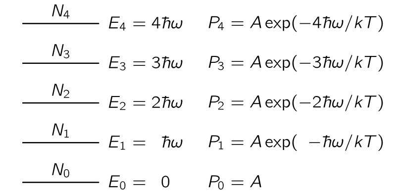{#fig-FLP_1_41_5 width=350}

이제 최초로 올바르게 결정된 양자역학 공식이 도출된다. 조화 진동자에서 허용된 에너지 준위는 조화진동자의 고유진동수 $\omega_0$ 에 대해 $\hbar \omega_0$ 만큼의 동일한 간격을 가진다(@fig-FLP_1_41_5). 당시 양자역학이 제대로 정립되기 전이었기 때문에 플랑크는 몇가지 증명을 포함하여 여기서 제시된 논증보다 다소 복잡한 논리를 펼쳤다. 하지만 우리는 에너지 준위 $E$ 를 차지할 확률 $P(E)=\alpha e^{−E/k_B T}$ 라는 사실을 받아들일 것이다. 

이제 다수의 진동자가 있으며, 그리고 각각은 $\omega_0$ 의 진동수를 갖는다고 가정하자. 이 진동자들 중 일부는 낮은 양자 상태에 있을 것이며, 나머지들은 높은 에너지의 양자상태 가운데 하나에 있을 것이다. 우리가 알고 싶은 것은 이 모든 진동자들의 평균 에너지로 모든 진동자의 총 에너지를 계산하고 진동자의 수로 나누면 된다. 그것은 열평형에서 진동자당 평균 에너지이며, 흑체 복사와 평형에 있는 에너지이기도 하여  @eq-FLP_1_41_13 의 $k_BT$ 를 대신한다. $N_i\, (i=0,\,1,\ldots)$ 를 에너지 $E_i$ 상태의 진동자의 개수라고 하자. 우리가 아직 증명하지 않은 가설에 따르면, 확률 $e^{−\text{P.E.}/k_BT}$ 또는 $e^{−\text{K.E.}/k_BT}$ 를 대체한 양자역학의 법칙은 초과 에너지 $\Delta E$ 에 대해 확률이 $e^{−\Delta E/k_B T}$ 로 감소한다는 것이다. 그렇다면 $N_n = N_0 e^{-n\hbar \omega}$ 이며 평균 에너지 $\langle E\rangle$ 은 다음과 같다.

$$
\begin{aligned}
\langle E \rangle = \dfrac{E_\text{tot}}{N_\text{tot}} = \dfrac{N_0\hbar \omega (0 + 1\cdot e^{-\hbar\omega/k_BT} + 2\cdot e^{-2\hbar\omega/k_BT} + 3e^{-3\hbar\omega/k_BT}+ \cdots )}{N_0(1 + \cdot e^{-\hbar\omega/k_BT} + \cdot e^{-2\hbar\omega/k_BT} + e^{-3\hbar\omega/k_BT}+ \cdots)} 
\end{aligned}
$$

위 식은 다음과 같다는 것을 쉽게 보일 수 있다.

$$
\langle E \rangle = \dfrac{\hbar \omega}{e^{\hbar \omega/k_BT} -1}.
$$ {#eq-FLP_1_41_15}

위 식은 지금까지 알려진, 그리고 논의된 최초의 양자역학 공식이었으며, 수십 년에 걸친 혼란 이후의 아름다운 정점이었다. 맥스웰은 뭔가 잘못됐다는 것을 알고 있었지만 무엇이 옳지는 몰랐다. 이 식에서 중요한 결과중의 하나는 $\lim_{\omega \to 0} \langle E\rangle = k_B T$ 이다.

이것은 Jeans가 찾고 있던 그것 이며, @eq-FLP_1_41_13 에서 $k_BT$ 대신 이를 사용하면 흑체에서의 빛을 분포를 얻는다.

$$
I(\omega) \, d\omega =\dfrac{\hbar \omega^3 d\omega}{\pi^2c^2 \left (e^{\hbar \omega/k_BT}−1 \right)}.
$$ {#eq-FLP_1_41_16}

](figures/fig_1_41/blackbody.png){#fig-FLP_blackbody width=450}

$\omega$ 가 큰 경우, 분자의 $\omega^3$ 에도 불구하고 분모의 $e^{\hbar \omega/kB_T}$ 가 훨씬 빠르게 커지므로 $I(\omega)$ 가 빠르게 0 으로 감소한다. 즉 자외선 및 X-선이 사라진다.

@eq-FLP_1_41_16 을 얻을 때 조화 진동자의 에너지 준위에 양자 이론을 사용했지만, 횡단면적 $\sigma_s$ 를 결정하는 데는 고전 이론을 사용했다고 불평할 수 있다. 하지만 빛이 조화 진동자와 상호작용한다는 양자 이론은 고전 이론과 정획히 동일한 결과를 제시한다. 때문에 작은 진동자와 같은 원자 모델을 사용하여 굴절률과 빛의 산란을 분석하는 데 많은 시간을 할애 하는 것이 정당화된다. 양자식은 실질적으로 동일하다.

*이제 저항기에서 Johnson 소음으로 돌아가겠습니다. 우리는 이미 이 잡음 전력 이론이 고전적인 흑체 분포 이론과 실제로 동일하다는 점을 언급했습니다. 사실, 다소 재미있게도, 우리는 이미 회로의 저항이 실제 저항이 아니라 안테나(안테나는 에너지를 방출하기 때문에 저항처럼 작동한다)와 복사 저항이라면, 전력이 얼마인지 계산하기가 쉬울 것이라고 이미 말했습니다. 그것은 주변에 있는 빛으로부터 안테나로 흐르는 전력일 뿐이며, 우리는 동일한 분포를 얻게 되지만 한두 배 정도만 변경됩니다. 우리는 저항기가 전력 스펙트럼 $P(\omega)$ 을 알 수 없는 발전기라고 가정할 수 있습니다. 스펙트럼은 이 동일한 발생기가 @fig-FLP_1_41_2 의 (b)와 같이 모든 주파수의 공진 회로에 연결되어 인덕턴스에서 식에 제시된 크기의 전압을 발생시킨다는 사실에 의해 결정됩니다(@eq-FLP_1_42_1). 따라서 @eq-FLP_1_41_10 과 동일한 적분으로 인도되며, 동일한 방법이 식을 제공합니다(@eq-FLP_1_41_3). 저온에서는 @eq-FLP_1_41_3 $k_B T$ 를 @eq-FLP_1_41_15 로 교체해야 합니다. 두 이론(흑체 복사와 존슨 노이즈)은 물리적으로도 밀접하게 관련되어 있으며, 물론 공진 회로를 안테나에 연결할 수 있기 때문에 저항 $R$ 은 순수한 방사선 저항입니다. @eq-FLP_1_41_2 는 저항의 물리적 기원에 의존하지 않으므로, 실제 저항에 대한 발생기 $G$ 와 복사 저항에 대한 발생기가 동일함을 알 수 있습니다. 저항 R이 온도 T에서 환경과 평형을 이루는 이상적인 안테나일 경우, 생성된 전력 $P(\omega)$ 의 기원은 무엇입니까? 온도 $T$ 에서 공간에 있는 복사 $I(\omega)$ 가 안테나에 영향을 가하고, “수신된 신호”로서 효과적인 발생기를 만듭니다. 따라서 $P(\omega)$ 와 $I(\omega)$ 의 직접 관계를 추론할 수 있으며, 이는 @eq-FLP_1_41_3 에서 @eq-FLP_1_41_3 으로 이어집니다.*

*우리가 이야기해 온 모든 것들—소위 존슨 노이즈와 플랑크의 분포, 그리고 우리가 곧 설명하려는 브라운 운동의 올바른 이론—은 20세기 초반 약 10년 정도의 발전입니다. 이제 그 점들과 그 역사를 염두에 두고, 우리는 브라운 운동으로 돌아갑니다.*

 

### I.41-4 마구 걷기 {#sec-FLP_1_41_4}

흔들리는 입자의 위치가 시간에 따라 어떻게 변하는지, “킥” 사이의 시간에 비해 매우 긴 시간 동안 어떻게 변해야 하는지 생각해 보자. 불규칙하게 흔들리는 물 분자들에 의해 사방에 폭격을 받아 흔들리는 작은 브라운 운동 입자를 생각하자. 

**질문: 주어진 시간이 지난 후, 그것이 시작된 곳으로부터 얼마나 떨어져 있을까?** 

이 문제는 아인슈타인과 스몰루초프스키(Smoluchowski)에 의해 해결되었다. 시간을 작은 구간, 예를 들여 1/100 초로 나눈다고 하고 1/100 초마다의 운동을 추적한다고 생각하자. 1초 동안 물 한 분자는 1014 번 정도 충돌하기 때문에 1/100 초는 매우 긴 시간이며 1/100 초가 지나면 이전에 일어난 일을 기억하지 못할 것이다. 다시 말해, 충돌은 모두 무작위이며 한 '단계'는 1/100 초 이전의 '단계'에 독립적이다. 입자가 각 단계마다 향하는 각도도 무작위적으로 선택된다. 따라서 우리는 그가 어디에 있는지 모르며 말할 수 없다. 단지 어딘가에는 있을 것이다. 그렇다면 평균적으로 어디에 있는가? 즉 평균적으로 그는 얼마나 멀리 나갔는가? 우리는 이미 여기에 대한 답을 알고 있다. [제 30장](#sec-FLP_1_30) 에서 많은 광원들의 빛의 중첩에 대해 논의했으며, 이는 다양한 각도에서 많은 화살표를 추가하는 것을 의미했기 때문이다. 거기서 우리는 일련의 마구 걷기에 대해 한쪽 끝에서 다른 쪽 끝까지의 거리의 평균 제곱은 30장에서 빛의 강도가 각각의 부분들의 들의 강도 합임을 발견했다. $\bf{R}_N$ 이 $N$ 단계 후 원점으로부터의 벡터 거리라면, 원점으로부터의 거리의 평균 제곱이 단계 수 $N$ 에 비례한다는 것을 증명할 수 있다. 즉, 각 단계의 길이 $L$ 에 대해 $\langle R^2_N\rangle=NL^2$ 이다. 현재 문제에서 단계 수가 시간에 비례하므로, 평균 제곱 거리도 시간에 비례한다:

$$
\langle R^2\rangle =\alpha t.
$$ {#eq-FLP_1_41_17}

이는 평균 거리가 시간에 비례한다는 의미가 아니다. 평균 거리가 시간에 비례한다면, 이는 마구 걷기가 균일한 속도에서 이루어짐을 의미한다. 마구 걷기에 의한 진행은 평균 제곱 거리가 시간에 비례한다. 그것은 마구 걷기의 특징입니다.

우리는 각 연속 단계에서 거리의 제곱이 평균적으로 $L^2$ 만큼 증가한다는 것을 매우 쉽게 보일 수 있다. $\bf{R}_N= \bf{R}_{N−1}+\bf{L}$ 이라고 쓰면, 

$$
\bf{R}_N\bf{\cdot R}_N = R^2_N = R^2_{N−1}+2\bf{R}_{N−1}\bf{\cdot L} + L^2
$$

이며 스텝에 대해 평균하면, $\langle \bf{R}_{N−1}\bf{\cdot L}\rangle = 0$ 이므로 $\langle R_N^2\rangle =\langle R_{N-1}^2\rangle + L^2$ 이다. 따라서 다음이 성립한다.

$$
\langle R^2_N\rangle = NL^2.
$$ {#eq-FLP_1_41_18}

이제 @eq-FLP_1_41_17 에서의 계수 $\alpha$ 를 계산해보자. 이를 위해서는 기능을 추가해야 한다. 

1. 이 입자에 힘을 가했을 때 (브라운 운동과는 전혀 관련이 없으며, 당분간 부수적인 사안으로 간주한다), 그 입자가 가지는 관성, 혹은 유효질량을 $m$ 이라고 하자. 입자를 움직이려면 입자 뿐만 아니라 입자 주위의 물도 움직여야 하므로 실제 입자의 질량과 반드시 동일할 필요는 없다. 한쪽 방향의 운동을 생각한다면 한쪽에 $m(d^2x/dt^2)$ 항이 존재할 것이다. 
   
2. 우리가 물체에 지속적인 인력을 유지한다면, 그 속도에 비례하여 유체에 인한 인력이 발생할 것이라고 가정한다. 유체의 관성 외에도, 점성와 유체의 복잡성으로 인해 흐름에 대한 저항이 존재한다. 요동이 발생하려면 되돌릴 수 없는 손실, 예를 들어 저항과 같은 것이 절대적으로 필수적이다. 손실이 발생하지 않는 한 $k_BT$ 를 생산할 방법은 없다. 요동의 원인은 이러한 손실과 매우 밀접하게 관련되어 있다. 이 항력의 메커니즘이 무엇인지 곧 이야기하겠다.—속도에 비례하는 힘과 그 출처에 대해 이야기할것이다. 하지만 지금은 일단 그런 저항이 있다고 가정한다. 
 
그렇다면 외부 힘에 의한 움직임에 대한 공식은 다음과 같다.

$$
m\dfrac{d^2 \bf{r}}{dt^2} + \mu \dfrac{d\bf{r}}{dt}=\bf{F}_\text{ext}.
$$ {#eq-FLP_1_41_19}

여기서 $\mu$ 는 실험적으로 결정되는 값이며 많은 콜로이드 물질에 대해 그 값이 알려져 있다.

이제 힘이 외부가 아니라 브라운 운동의 불규칙한 힘과 같은 경우에 동일한 공식을 사용한다. 그리고 물체가 이동하는 평균 제곱 거리를 계산한다. 우선 3차원에서 한쪽 방향만($x$) 고려하여 $x^2$ 의 평균을 구해보자. $\langle x^2\rangle=\langle y^2\rangle = \langle z^2\rangle$ 이므로 거리의 제곱평균은 $x^2$ 의 평균의 3배이다. 불규칙한 힘의 $x$-성분은 물론 다른 모든 구성 요소와 마찬가지로 불규칙하다. 

$$
\dfrac{d(x^2)}{dt}=2x\dfrac{dx}{dt}
$$ 

이므로 위치와 속도의 곱의 평균을 구하여 2를 곱하면 평균제곱거리이다. 결론부터 말하자면 이 값은 상수이며, 따라서 평균 제곱 반경이 시간에 비례하여 증가한다. 이제 @eq-FLP_1_41_19 에 $\bf{r}$ 를 내적하여 평균을 취하면

$$
m \left \langle \bf{r \cdot}\dfrac{d^2\bf{r}}{dt^2} \right\rangle + \mu \left\langle \bf{r\cdot}\dfrac{d \bf{r}}{dt}\right\rangle = \langle \bf{r \cdot F}_\text{ext}\rangle
$$ {#eq-FLP_1_randomwalk_1}

이다. 위의 세 항을 생각해보자.

**1.** $\langle \bf{r \cdot F}_\text{ext}\rangle$ : 입자의 위치와 가해지는 힘 사이에 어떠한 상관관계도 기대할 수 없으며 따라서 $0$ 이다.

**2.** $m\left \langle \bf{r \cdot} \dfrac{d^2 \bf{r}}{dt^2}\right\rangle$ : 아래의 항등식을 생각하자.

$$
m \bf{r \cdot}\dfrac{d^2\bf{r}}{dt^2} = m \dfrac{d}{dt}\left(\bf{r\cdot}\dfrac{d\bf{r}}{dt}\right) - m \left\|\dfrac{d\bf{r}}{dt}\right\|^2
$$

우변의 첫번째 항을 보자. $\bf{r \cdot}(d\bf{r}/dt)$ 에서 $\bf{r}$ 값에 무관하게 $\langle d\bf{r}/dt \rangle =\bf{0}$ 이므로 $\langle \bf{r\cdot}(d\bf{r}/dt)\rangle=0$ 이다. 여기서 평균을 보면 

$$
\begin{aligned}
\left\langle \dfrac{d}{dt}\left( \bf{r\cdot}\dfrac{d\bf{r}}{dt} \right)\right\rangle &= \int \dfrac{d}{dt}\left( \bf{r\cdot}\dfrac{d\bf{r}}{dt} \right)\, p(\bf{r})\,d^3\bf{r} \\[0.3em]
&= \dfrac{d}{dt}\int  \left(\bf{r\cdot}\dfrac{d\bf{r}}{dt}\right)\, p(\bf{r})\,d^3\bf{r} = \dfrac{d}{dt}\left\langle \bf{r\cdot}\dfrac{d\bf{r}}{dt} \right \rangle = 0
\end{aligned}
$$

이다. 여기서 $dp(\bf{r})/dt=0$ 이 사용되었는데 이는 평형상태이기 때문이다. 

**3.** $\left\langle \bf{r\cdot} \left(\dfrac{d\bf{r}}{dt} \right) \right\rangle = \dfrac{1}{2} \left\langle \dfrac{d(\|\bf{r}\|^2)}{dt} \right\rangle = \dfrac{1}{2}\dfrac{d}{dt}\left\langle \|\bf{r}\|^2\right\rangle$. 

---

위의 **1**, **2**, **3** 으로 부터 @eq-FLP_1_randomwalk_1 는 다음과 같이 변한다.

$$
-\langle m\|\bf{v}\|^2\rangle + \dfrac{\mu}{2} \dfrac{d}{dt}\langle \|\bf{r}\|^2\rangle = 0 .
$$

여기서 우리는 $\left\langle\frac{1}{2} m\|\bf{v}\|^2\right\rangle = \frac{3}{2}k_BT$ 임을 안다. 따라서

$$
\langle R^2\rangle = \langle \|\bf{r}\|^2\rangle = 6k_BT\dfrac {t}{\mu}
$$ {#eq-FLP_1_41_21}

이제 입자들이 일정한 힘에 어떻게 반응하는지, 알려진 힘 하에서 얼마나 빠르게 떠다니는지를 확인하여 $\mu$ 값을 정하면, 실제로 입자들이 얼마나 멀리 갈 수 있는지 결정할 수 있다! 이 방정식은 $k_B$ 가 결정된 최초의 방법 중 하나이며 따라서 역사적으로 매우 중요하다. 결국 우리는 $\mu$ 와 시간, 입자들이 가는 먼 길을 측정할 수 있으며, 평균을 취할 수 있다. $k_B$ 의 결정이 중요한 이유는 몰에 대한 $PV=RT$ 법칙에서, 측정이 가능한 $R$ 이 아보가드로수에 $k_B$ 를 곱한 값과 같기 때문이다. 몰은 원래 16O (현재는 탄소가 사용됨)의 매우 많은 그램으로 정의되었으며, 따라서 몰의 원자 수는 원래 알려져 있지 않았다. 이것은 물론, 매우 흥미롭고 중요한 문제이다. 원자 개수에 대한 가장 초기의 결정 중 하나는, 우리가 현미경으로 일정 시간 동안 인내심을 가지고 관찰했을 때 더러운 작은 입자가 얼마나 멀리 이동할 수 있는지를 결정하는 것이었다. 따라서 볼츠만의 상수 $k_B$ 와 아보가드로 수 $N_0$ 는 $R$ 을 측정 할 수 있기 때문에 결정되었다.

 

## I.42 분자운동론의 응용 {#sec-FLP_1_42}

### I.42-1 증발 {#sec-FLP_1_42_1}

이전 장에서는 분자운동론에서 분자나 다른 물체의 자유도에 관계없이 평균 운동 에너지가 $\frac{1}{2}k_BT$ 라는 점을 주로 사용했다. 반면에 이번장에서는 입자를 서로 다른 위치에서 찾을 확률이 부피당 $e^{−\text{포텐셜 에너지}/kT}$ 에 따른다는 것을 기억하자.

이번 장에서는 복잡한 현상들-액체가 증발하는 현상, 금속의 전자가 표면에서 나오는 현상, 혹은 많은 원자가 관여하는 화학 반응-에 대해 알아보자. 그러나 상황이 너무 복잡하기 때문에 별도로 강조된 경우를 제외하고는 상당히 정확하지 않다. 중요한 것은 우리가 분자운동론으로부터 사물이 어떻게 행동해야 하는지를 대략 이해할 수 있다는 것이다. 열역학적 논증이나 특정 임계량에 대한 경험적 측정 통해 현상을 보다 정확한 표현할 수 있다.

하지만, 어떤 것이 현재와 같이 행동하는 이유를 어느 정도만 아는 것도 매우 유용한데, 상황이 새롭거나 아직 분석을 시작하지 않은 경우에도 일어나야 할 일을 어느정도 파악 할 수 있기 때문이다. 따라서 이 장에서의 논의는 매우 부정확할지라도 본질적으로는 옳다. 즉 아이디어는 옳지만, 구체적인 세부 사항에서는 매우 단순화된 것이다.

우선 액체의 증발을 생각하자. 특정 온도에서 상자의 액체와 그 액체의 증기가 평행상태 인 경우를 생각하자. 우리는 증기의 분자들이 서로 멀리 떨어져 있다고 가정하고, 액체 내부에서는 분자들이 서로 가깝게 배열되어 있다고 가정하자. 기체 상에 존재하는 분자 수를 액체에 존재하는 수와 비교하여 찾는 것이 문제이다. 주어진 온도에서 증기의 밀도는 얼마나 높으며, 온도에 따라 어떻게 달라질까?

증기 분의 개수 밀도를 $n$, 액체의 한 분자가 차지하는 부피를 $V_a$ 라고 하자. 액체의 각 분자가 동일한 부피를 차지한다고 가정하므로 액체의 단위 부피당 원자수는 $1/V_a$ 이다. 또한 분자들 사이에 끌어당기는 힘이 존재하여 액체 내에서 서로 붙잡고 있다고 가정한다. 그렇지 않으면 액체는 응축되지 않는다. 액체 내 분자들의 결합 에너지가 증기가 될때 손실된다고 가정한다. 즉, 우리는 액체에서 단일 분자를 증기로 넣기 위해서는 일정량의 일 $W$ 이 필요하다고 가정한다. 즉, 액체에 있는 분자의 에너지와 증기에 있을 경우의 에너지의 차이가 $W$ 이다.

두 개의 서로 다른 영역에서 단위 부피당 원자 수가 $n_2/n_1=e^{−(E_2−E_1)/k_BT}$ 라는 일반 원리로부터 다음을 얻는다.

$$
n = \dfrac{1}{V_a} e^{−W/k_BT}
$$ {#eq-FLP_1_42_1}

대부분의 경우 증기 밀도가 액체 밀도보다 훨씬 낮은데, 즉 $n \ll 1/V_a$ 인데 이는 $W \gg k_B T$  이기 때문이다. 이 경우 액체와 증기의 밀도가 같아지는 임계점에 상당히 멀다. @eq-FLP_1_42_1 는 $W \gg k_BT$ 일 경우에만 흥미롭다. 우리는 이 경우 $V_a$ 가 온도의 변화에 대해 크게 변하지 않는다는 사실을 알고 있다. $T_0=300 K$ 에 대해 $W=10 k_BT_0$ 라고 가정하자. 그리고 $T_0$ 보다 10 $K$ 정도 증가된 온도에서의 비율을 보면

$$
\dfrac{e^{-W/k_BT}}{e^{-W/k_BT_0}} = \dfrac{e^{-10T_0/(T_0+10)}}{e^{-10}} \approx 1.38
$$

로 단지 10 K 의 증가로 $V_a$ 보다 훨씬 크게 변한다는 사실을 알 수 있다. 즉 온도에 따른 증기의 밀도는 $V_a$ 의 변화보다는 뒤의 지수항에 의한 변화가 훨씬 중요하다. 물론 온도에 따라 분자간의 평균 인력이 달라지므로 $W$ 도 온도에 따라 약간 변한다. 우리가 가진 공식이 온도에 따라 모든 것이 알 수 없는 방식으로 변하는 공식이라면 공식이 전혀 없다고 생각할 수도 있지만, 일반적으로 $W/k_BT$ 가 매우 크다면 증기 밀도 곡선에서 대부분의 변화는 이 지수 계수에 의해 발생한다는 것을 알 수 있다. 이 때 $W$ 를 상수로, 계수 $1/V_a$ 를 거의 상수로 잡으면 곡선상의 짧은 구간에 대한 좋은 근사값이 된다. 

자연에는 어디선가 에너지를 빌려야 하는 현상이 매우 많이 존재하고, 온도 변화의 중심 특징이 $e^{-\text{Energy}/k_BT}$ 이다. 이는 에너지가 $k_BT$ 에 비해 클 때만 유용한 사실이며, 대부분의 변동은 $k_B T$ 의 변동에 포함되고 상수나 다른 요인에 해당하지 않는다.

이제 증발에 대해 유사한 결과를 얻는 다른 방법을 알아보자. @eq-FLP_1_42_1 을 얻기 위해 단순히 평형 상태에서 유효한 규칙을 적용했지만, 사물을 더 잘 이해하기 위해서는 현재 일어나고 있는 상황의 세부 사항을 살펴보는 것이 해가 되진 않는다. 우리는 또한 다음과 같이 상황을 설명할 수 있다: 증기에 있는 분자들이 지속적으로 액체 표면을 강타하고, 액체 표면에 닿으면 튕겨 나가거나 액체에 잡힌다. 그 비율은 5:5 일수도 있고 1:9 일수도 있지만 우리는 모른다. 

**1**. 우선 그들이 항상 잡힌다고 가정해 보자. 특정 순간에 일정 수의 원자가 액체 표면에 응축하고 있다. 응축 분자의 수, 즉 단위 시간당 단위 면적에 도착하는 수는 단위 부피당 $n$ 에 속도 $v$ 를 곱한 수이다. $\frac{1}{2}m\langle v^2\rangle =\frac{3}{2}k_B T$ 임을 안다. 물론 각도에 대해 적분하여 일종의 평균을 얻어야 하지만, 이는 대략 평균제곱 속도에 비례하며, 어느 정도 비례한다. 따라서

$$
N_c=nv
$$ {#eq-FLP_1_42_2}

는 분자가 단위 면적당 도착하고 응축하는 속도이다.

**2**. 하지만 동시에 액체 안의 원자들이 움직이며 때때로 그 중 하나가 튀어나가기도 한다. 이제 그들이 얼마나 빨리 쫓겨날지 알아보자. 단 ***평형 상태에서 초당 튀어나가는 횟수와 초당 도착하는 횟수가 동일하다**.

튀어나가기 위해서는 특정 분자가 우연히 이웃 분자보다 여분의 에너지를 가져야 한다. 이는 액체 내의 분자들은 다른 분자들에 매우 강하게 끌리기 때문에 상당히 큰 여분의 에너지이다. 보통은 튀어 나가지 않지만, 충돌 과정에서 때때로 그 중 하나가 우연히 추가 에너지를 얻게 된다. 그리고 우리 경우에 필요한 추가 에너지 $W$ 를 얻을 가능성은 $W \gg k_BT$ 일 경우 매우 작다. 실제로 $e^{−W/k_B T}$ 는 원자가 이보다 더 많은 에너지를 흡수할 확률이다. 이제 일부 분자들이 이 에너지를 빌렸다고 가정해 보자. 이제 초당 몇개가 표면을 떠나는지 추정해 보자. 물론 분자가 필요한 에너지를 가지고 있다고 해서 모두 실제로 증발하는것은 아니다. 왜냐하면 분자가 액체 내에 충분히 깊이 있거나, 표면 근처에 있더라도 잘못된 방향으로 이동하고 있을 수 있기 때문이다. 초당 단위 면적을 떠나는 수는 다음과 같다: 표면 근처에 있는 단위면적당 원자 수를 탈출하는 데 걸리는 시간으로 나눈 뒤, 충분한 에너지를 가지고 탈출할 준비가 되었을 확률 $e^{−W/k_BT}$ 을 곱한 값이다.

액체 표면에 있는 분자가 차지하는 면적을 $A$ 라고 하면 표면의 단위 면적당 분자 수는 $1/A$ 이다.분자들이 일정한 평균 속도 $v$ 로 첫 번째 층의 두께인 분자의 지름 $D$ 만큼 이동해야 한다면고 하자. 분자들이 충분한 에너지를 갖고 있다면 지름 가로지르는 데 걸리는 시간이 탈출에 필요한 시간이다. 즉 $D/v$ 이다. 따라서 증발하는 수는 대략

$$
N_e=\dfrac{1}{A}\dfrac{v}{D}e^{−W/k_BT}
$$ {#eq-FLP_1_42_3}

이다. 이제 각 원자의 면적에 층의 두께를 곱한 값은 단일 원자가 차지하는 부피 $V_a$ 와 대략 동일하다. 따라서 평형에 도달하기 위해서는 $N_c=N_e$, 즉

$$
nv=\dfrac{v}{V_a}e^{−W/k_BT}
$$ {#eq-FLP_1_42_4}

이어야 한다. 여기서 $v$ 가 동일하기 때문에 소거할 수 있다. 비록 하나는 증기 내 분자의 속도이고 다른 하나는 증발하는 분자의 속도이지만, 이는 한쪽 방향으로의 평균 운동 에너지가 $\frac{1}{2}k_B T$ 로 같기 때문이다. 혹자는 증발하는 분자는 여분의 에너지를 흡수하였기 때문에 더 빠를 것이라고 생각하겠지만, 그들이 액체에서 나오기 시작하는 순간, 잠재 에너지에 비해 여분의 에너지를 잃어야 하며 이 과정에서 표면으로 올라올 때 속도는 $v$ 까지 떨어진다. 대기 중 분자 속도 분포에 대한 우리의 논리와 동일하다. 하단에서는 분자들이 에너지 분포와 정상에 도달하는 것들의 에너지 분포는 동일하다. 하단에서 느린 것들은 도착하지 못하고, 올라올 정도로 빨랐던 것들은 느려진다. 증발하고 있는 분자들은 내부에 있는 분자와 동일한 에너지 분포를 가진다는 것은 다소 놀라운 사실이다. 어쨌든, 액체에 들어가지 않고 다시 튀어 나올 확률과 같은 다른 부정확한 요인들 때문에 위 식에 대해 그렇게 면밀하 논쟁하는 것은 무의미하다. 따라서 우리는 증발 및 응축 속도에 대한 대략적인 개념을 가지고 있으며, 역시 증기 밀도 $n$ 이 이전과 동일한 방식으로 변한다는 것을 확인할 수 있지만, 이제는 임의의 공식이 아니라 어느 정도 상세히 이해하게 되었다.

이를 이해하면 몇 가지를 더 분석할 수 있다. 예를 들어, 우리가 증기를 매우 높은 속도로 배출하여 증기가 형성되는 속도만큼 빠르게 제거한다면(우리가 매우 좋은 펌프를 구동하며, 액체가 충분히 천천히 증발한다면), 액체 온도 $T$ 를 유지 할 때 증발은 얼마나 빨리 일어날까? 우리가 이미 실험적으로 평형상태의 증기 밀도를 측정했다고 가정하면, 주어진 온도에서 단위 부피당 액체와 평형 상태에 있는 분자 수를 알 수 있다. 이제 우리는 그것이 얼마나 빨리 증발할지 알아보자. 비록 우리는 증발 부분에 대해 대략적인 분석만 사용했지만, 우리가 아직 모르는 반사 계수만 제외한다면 도착하는 증기 분자 수에 대한 추정이 그리 틀리지 않을 것이다. 따라서 우리는 평형 상태에서 떠나는 수가 도착하는 수와 동일하다는 사실을 사용할 수 있다. 그렇다. 증기가 배출되고 있어 (액체로부터) 분자만 나오게 되지만, 증기를 그대로 두면 평형 밀도에 도달하여 되돌아오는 수가 증발하는 수와 동일하게 된다. 따라서 우리는 표면에서 초당 방출되는 수가 알 수 없는 반사 계수 $R$ 을 뺀 값에 증기가 여전히 존재했을 때 초당 표면으로 내려올 수 있는 수를 곱한 값과 같다는 것을 쉽게 알 수 있다. 이는 평형 상태에서 증발을 균형 있게 하는 양이기 때문입니다. 따라서

$$
N_e=nv(1−R)=\dfrac{v(1−R)}{V_a}e^{−W/k_B T}.
$${#eq-FLP_1_42_5}

물론, 증기에서 액체에 충돌하는 분자의 수는 계산하기 쉽다. 왜냐하면 액체 표면을 통해 어떻게 빠져나가는지에 대해 걱정할 때보다 힘에 대해 많이 알 필요가 없기 때문이며, 반대 방향으로 논증하는 것이 훨씬 쉽다.

 

### I.42-2 열전자 방출 {#sec-FLP_1_42_2}

액체의 증발과 본질적으로 같은 문제를 다뤄보자. 진공관에는 전자원, 즉 가열된 텅스텐 필라멘트와 전자를 끌어당기 위한 양전하를 띤 판이 있다. 텅스텐 표면에서 탈출한 모든 전자는 즉시 판으로 날아간다. 그것이 우리 이상적인 “펌프”이며, 전자를 항상 “펌핑” 한다. 이제 다음과 같은 질문을 던져보자. 텅스텐 한 조각에서 초당 몇 개의 전자를 얻을 수 있으며, 그 수는 온도에 따라 어떻게 변할까? 그 문제에 대한 답은 @eq-FLP_1_42_5 와 동일하며, 전자가 금속조각의 금속 이온이나 원자에 이끌린다. 금속 조각이 전자를 얻기 위해서는 일정량의 에너지 또는 일이 필요하며 이 일은 금속 종류에 따라 달라진다. 정확히는 특정 금속 종류의 표면 특성에 따라 달라지지만, 전체 일은 몇 전자볼트($\text{eV}$) 정도이며, 이는 우연히도 화학 반응에 관련된 에너지 크기와 비슷하다. 손전등 배터리와 같은 화학 반응에 의해 생성되는 전지의 전압이 약 1볼트 정도임을 기억하자.

초당 몇 개의 전자가 나오는지 어떻게 알 수 있을까? 외부로 나가는 전자에 대한 영향을 분석하는 것은 상당히 어려울 것이며, 상황을 반대 방향으로 분석하는 것이 더 쉽다. 따라서 우리는 전자를 끌어내지 않고 전자가 기체와 같아 금속으로 돌아올 수 있다고 상상함으로써 시작할 수 있다. 그렇다면 평형 상태에 있는 전자들의 일정한 밀도가 존재하게 되는데 이는 당연히 @eq-FLP_1_42_1 과 정확히 동일한 식으로 주어진다. 여기서 $V_a$ 는 대략 금속 내 전자당 부피를, $W$ 는 $q_e\phi$ 와 같으며, 여기서 $\phi$ 는 이른바 일함수, 즉 전자를 표면에서 끌어올리는 데 필요한 전압을 의미한다. 이는 주변 공간에 몇 개의 전자가 있어야 하며, 금속을 타격하여 나오는 전자와의 균형을 맞출 수 있는지를 알려줄 것이다. 따라서 모든 것을 제거하면 나오는 수를 계산하기가 쉽다. 왜냐하면 나오는 수는 위에 말한 밀도에서 전자 “증기” 가 들어오는 수와 정확히 동일하기 때문입니다. 다시 말해, 답은 단위 면적당 전류가 단위 면적당 1초에 도달하는 수의 전하와 동일한데, 이는 단위 부피당 개수에 속도를 곱한 값이며, 이는 우리가 여러 차례 본 바와 같다:

$$
I=q_env=\dfrac{q_ev}{V_a}e^{−q_e\phi/k_BT}.
$$ {#eq-FPL_1_42_6}

$1\, \text{eV}$ 는 11,600 K 에서의 $k_B T$ 에 해당한다. 진공관의 필라멘트는 1100 K 정도의 온도에서 작동하며, 지수 계수는 약 $e^{−10}$ 정도이고 온도를 약간 바꾸면 지수 계수가 크게 변한다. 따라서 식의 핵심 특징은 $e^{−q_e\phi/k_BT}$ 이다. 게다가 앞의 계수는 상당히 틀렸다. 실제로 고전적인 방법이 아닌 양자역학을 사용해서 계산해야 하지만 많은 사람들이 고급 양자역학 이론을 계산에 사용했음에도 불구하고 제대로 된 계산을 할 수 없었다. 큰 문제는 온도에 따라 $W$ 가 약간 변하는지이다. 그렇다면, 온도에 따라 천천히 변하는 $W$ 와 앞에 있는 다른 계수를 구별할 수 없다. 즉, $W$ 가 온도와 선형적으로 변하여 $W=W_0+\alpha k_B T$ 가 되면,

$$
e^{−W/k_B T}=e^{−(W_0+\alpha k_B T)/k_B T}=e^{−\alpha}e^{−W_0/k_B }T
$$

이며, 선형적으로 온도에 의존하는 $W$ 는 이동된 “상수”와 동등하다. 앞쪽의 계수를 정확히 얻으려는 시도는 정말 꽤 어렵고 보통 무의미하다.

 

### I.42-3 열 이온화 {#sec-FLP_1_42_3}

기체에 중성 상태에 있는 원자가 많이 있다고 가정하자. 가스가 뜨겁고 원자들이 이온화될 수 있다. 이제 밀도가 일정할 경우 특정 온도에서 단위 부피당 이온의 개수를 알아보자. 다시 전자를 가질 수 있는 단위부피당 $N$ 개의 원자가 있는 상자를 생각하자. 그리고 중성 원자의 밀도를 $n_a$, 이온의 밀도를 $n_i$, 전자의 밀도를 $n_e$ 라고 하자. 우선 원자핵의 수를 $N$ 이라고 하면 항상 $n_a+n_i = N$ 이며 또한 $n_i= n_e$ 이다. 

우리는 전자를 원자에서 꺼내는 데 일정량의 에너지가 필요하다는 것을 안다. 이를 **이온화 에너지 (ionization energy)** 라고 부르고 $W$ 표기하자. 이제 우리는 다음 관계식을 생각 할 수 있다.

$$
[\text{단위 부피당 자유전자의 수}] = [\text{단위 부피당 원자에 속박된 전자의 수}] \times e^{-W/k_BT}
$$

단위부피당 원자에 속박된 전자의 수를 계산해 보자. 전자를 놓을 수 있는 전체 위치의 수는 겉보기에 $n_a+n_i$ 이며, 전자가 결합될 때 각각 정해진 부피 $V_a$ 내에 결합된다고 가정하자. 따라서 결합될 전자에 사용할 수 있는 총 부피는 $(n_a+n_i)V_a$ 이므로 다음과 같다고 생각된다.

$$
n_e=\dfrac{n_a}{(n_a+n_i)V_a}e^{−W/k_BT}.
$$

하지만 위 식은 한가지를 간과했다. 전자가 이미 속박된 원자에는 다른 전자는 더 이상 그 부피에 올 수 없다! 증기에 있을지 응축된 위치에 있을지 결정하려는 하나의 전자에게 실제로 이용 가능한 부피는 전체 원자의 부피가 아니라 전자가 속박되지 않은 원자의 부피 뿐이다. 이런 상황의 식은 **사하 이온화 방정식 (Saha ionization equation)** 이라고 불리는 아래의 방정식이다.

$$
\dfrac{n_e n_i}{n_a}=\dfrac{1}{V_a}e^{−W/k_BT}.
$$ {#eq-FLP_1_42_7}

이제 분자운동론적 현상에 대해 논의 하면서 이 식이 왜 옳은지 정정적으로적으로 이해할 수 있다는 것을 확인해보자.

우선 전자가 이온에 도착하여 원자를 형성하는 사건과 원자가 충돌하여 이온과 전자로 분해되는 사건의 발생 비율은 동일해야 한다. (1) 전자와 이온은 서로를 얼마나 빠르게 발견하는가? 단위 부피당 전자 수가 증가하면 속도가 확실히 증가한다. 또한 단위 부피당 이온 수가 증가하면 속도도 증가한다. 즉, 재결합이 일어나는 전체 속도는 전자 개수밀도와 이온의 개수밀도의 곱 $n_e n_i$ 에 비례한다. (2) 또한 충돌에 의해 발생하는 이온화의 전체 속도는 이온화될 원자의 개수밀도 $n_a$ 에 선형적으로 의존해야 한다. 

이제 (1) 과 (2) 에 의한 두 속도가 서로 균형을 맞춰야 하므로 $n_e n_i / n_a$ 는 이제 $n_i,\,n_e,\,n_a$ 에 의존하지 않고 온도, 원자 단면적, 혹은 다른 요인들에만 의존해야 한다는 것을 알 수 있다. 즉 최소한 @eq-FLP_1_42_7 의 정성적인 형태는 이해 할 수 있다.

이제 부피 $V$ 의 상자 안에 $N$ 개의 핵이 있고, 그 중 $f$ 만큼의 비율로 이온화되어 있다고 하자. 그렇다면 $n_e= fN/V= n_i$, $n_a=(1−f)N/V$ 이며 @eq-FLP_1_42_7 은

$$
\dfrac{f^2}{1−f}\dfrac{N}{V}=\dfrac{e^{−W/k_B T}}{V_a}
$$ {#eq-FLP_1_42_8}

이다. 다시 말해, 원자의 밀도가 점점 작아지거나 용기의 부피를 점점 더 크게 만들면 전자와 이온의 비율 $f$ 가 증가한다. 그 이온화는 밀도가 낮아짐에 따라 “확장”함으로써 발생하는 것으로, 별 사이의 차가운 공간과 같이 매우 낮은 밀도에서도 이온이 존재할 수 있다고 우리가 믿는 이유이며, 사용 가능한 에너지의 관점에서는 이를 이해하지 못할 수도 있다. 그것들을 만들기 위해서는 매우 많은 $k_BT$ 의 에너지가 필요하지만, 이온은 존재한다.

왜 주변에 이렇게 넓은 공간이 있는데도 이온이 존재할 수 있고, 밀도를 높이면 이온은 사라지는 경향이 발생하는가? 원자를 생각해보라 가끔씩 빛이나 다른 원자, 혹은 이온, 혹은 열평형을 유지하는 어떤 것이든 그것을 강타한다. 극히 드물게, 엄청난 양의 초과 에너지를 소비하기 때문에 전자가 분리되어 이온화된다. 만약 공간이 충분히 크다면 전자는 아마도 수년 동안 아무것도 가까이 오지 않고 계속 떠돌아다닌다. 하지만 아주 가끔씩 이온을 만나 결합하여 중성 원자를 만든다. 따라서 원자에서 전자가 나오는 속도는 매우 느리다. 하지만 부피가 크다면 탈출한 전자는 재결합할 다른 이온을 찾는 데 너무 오래 걸려 재결합 확률이 매우, 매우 작다. 따라서 필요한 큰 초과 에너지에도 불구하고 전자 수가 합리적으로 존재할 수 있다.

 

### I.42-4 화학적 분자운동 {#sec-FLP_1_42_4}

앞서 **이온화** 라고 부른 상황은 화학 반응에서도 동일하게 발견된다. 예를 들어, $A$ 와 $B$ 가 결합하여 화합물 $AB$ 가 된다면, 앞서의 원자-$AB$, 전자-$B$, 이온-$A$ 와 동일한 상황이라는 것을 알 수 있다. 따라서 평형 방정식의 형태는 정확히 동일하다.

$$
\dfrac{n_A n_B}{n_{AB}} = c e^{−W/k_BT} .
$$ {#eq-FLP_1_42_9}

물론 이 공식은 정확하지 않다. 상수 $c$ 는 $A$ 와 $B$ 가 결합할 수 있는 부피 등에 따라 달라지지만, 열역학적 논리로부터 $W$ 의 의미를 파악할 수 있으며, 이는 반응에 필요한 에너지와 매우 가깝다는 것이 밝혀졌다.

$A$ 와 $B$ 가 가끔씩 충돌하여 화합물 $AB$ 를 형성한다고 가정한다. 그리고 화합물 $AB$ 가 복잡한 분자로서 주변을 흔들며 다른 분자에 충돌하고, 때때로 충분한 에너지를 받아 $A$ 와 $B$ 로 분해된다고 가정하자.

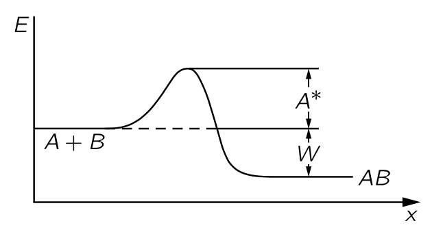{#fig-FLP_1_42_1 width=350}

화학 반응에서 원자들이 너무 작은 에너지로 결합하면, $A + B \to AB$ 반응에서 에너지가 방출될 수 있음에도 불구하고, $A$ 와 $B$ 가 서로 접촉한다는 것이 반응을 시작을 의미하지 않는다. 보통 충돌이 다소 **딱딱** 해야 반응이 일어나며, **부드러운** 충돌은 에너지를 방출할 수 있음에도 불구하고 발생하지 않을 수 있다. 따라서 $A+B \to AB$ 류의 반응은 보통 각각이 충분한 에너지를 갖고 충돌해야 한다고 가정하자. 이 에너지를 **활성화 에너지(activation energy)** 라고 한다. 활성화 에너지를 $A^\ast$ 라고 표기한다면 $A$ 와 $B$ 가 $AB$ 를 생성하는 속도 $R_f$ 는 $A$ 의 원자 수에 $B$ 의 원자 수를 곱하고, 단일 원자가 특정 단면적 $\sigma_{AB}$ 에 충돌하는 속도와 그들이 충분한 에너지를 가지고 있을 확률 $e^{−A^\ast/k_BT}$ 를 곱한 값임을 의미한다.

$$
R_f=n_An_Bv \sigma_{AB}e^{−A^\ast/k_B T}
$$ {#eq-FLP_1_42_10}

이제 우리는 반대방향 반응 $AB \to A+B$ 의 속도 $R_r$ 을 구해보자. $AB$ 가 분리되기 위해서는 그것이 갈라지기 위해 필요한 에너지 $W$ 가 필요할 뿐만 아니라, $A$ 와 $B$ 가 합쳐지기 어려웠던 것처럼, 다시 갈라지기 위해 올라야 할 일종의 언덕이 존재한다. 즉 어느 정도의 과잉도 필요하다. (@fig-FLP_1_42_1). 따라서 $R_r$ 은 $n_{AB}$ 와 $e^{−(W+A^\ast)/k_B T}$ 의 곱에 비례한다.

$$
R_r=c'n_{AB}e^{−(W+A^\ast)/k_B T}.
$$ {#eq-FLP_1_42_11}

$c'$ 는 원자의 부피와 충돌 속도를 포함하한다. 이전의 증발에서와 같이 면적·시간·두께로 이를 구할 수 있지만, 여기서는 하지 않는다. 가장 중요한 특징은 이 두 비율이 동일할 때, 그 비율이 합과 같다는 점입니다. 이는 $n_An_B/n_{AB}=ce^{−W/k_B T}$ 이며, 이전과 같이 $c$ 는 단면적, 속도 및 $n$-들과 무관한 기타 요인을 포함한다는 것을 알려준다.

흥미로운 점은 반응 속도가 $e^{−\text{const}/k_B T}$ 와 같이 변한다는 것이지만, 그 상수는 농도를 지배하는 상수와 동일하지 않으며, 활성화 에너지 $A^\ast$ 는 $W$ 와 상당히 다르다. $W$ 는 우리가 평형 상태에 있는 $A$, $B$, $AB$ 의 비율을 정하지만, $A+B$ 가 $AB$ 에 도달하는 속도는 평형의 문제가 아니며, 활성화 에너지가 지수적 요인을 통해 반응 속도를 조절한다.

게다가 $A^\ast$ 는 $W$ 와 같은 근본적인 상수가 아니다. 벽의 표면 혹은 다른 위치에 $A$ 와 $B$ 가 일시적으로 붙어 더 쉽게 결합될 수 있다고 가정해 보자. 언덕을 통해 *터널*을 찾을 수도 있고, 혹은 더 낮은 언덕을 찾을 수도 있다. 에너지 보존에 의해 $A + B \to AB$ 가 발생하며 에너지 차이 $W$ 는 반응경로에 상당히 독립적이지만, $A^\ast$ 는 경로 의존적이다. 이것이 화학 반응의 속도가 외부 조건에 매우 민감한 이유이다. 반응이 일어나게 하는 표면의 종류와 표면의 특성에 따라 속도가 달라진다. 혹은 별도의 물체를 넣으면 속도가 크게 변할 수 있습니다. 어떤 것들은 $A^\ast$ 를 약간만 바꾸는 것만으로도 속도를 크게 변화시키는데 이를 **촉매 (catalysts)** 라고 한다. 주어진 온도에서 $A^\ast$ 너무 커서 반응이 거의 일어나지 않을 수도 있지만, 촉매를 넣어 $A^\ast$ 를 감소시켜 반응속도를 증가하게 할 수 있다. 

덧붙이자면, $A$ 와 $B$ 가 결합하여 $AB$ 가 생성되는 이러한 반응에 약간의 문제가 있다. 두 물체를 결합시켜 보다 안정적인 물체를 만들려고 할 때 에너지와 운동량을 모두 보존할 수 없기 때문이다. 따라서 최소한 세 번째 객체 $C$ 가 필요하므로 실제 반응은 훨씬 더 복잡하다. $A+B\to AB$ 반응속도는 $n_A n_B n_C$ 와 관계되어 우리가 구한 식이 잘못되어 보인다. 하지만 반대방향 반응속도 역시 $n_{AB}n_C$ 와 관계되므로 평형 농도에 대한 식에서 $n_C$ 는 상쇄된다. 우리가 처음 적어 놓은 평형 법칙 @eq-FLP_1_42_9 는 반응 메커니즘이 어떻게 되든 절대적으로 사실임이 보장된다.

 

### I.42-5 아인슈타인의 복사 법칙 {#sec-FLP_1_42_5}

이제 흑체 복사 법칙과 관련된 흥미로운 상황을 알아보자. [I.41 브라운 운동](#sec-FLP_1_41) 에서는 플랑크의 방식을 따라 공동 내 방사선의 분포 법칙을 구했다. 진동자는 일정한 평균 에너지를 가지며, 진동 때문에 복사를 방출하고 복사를 공동에 계속 주입하여 흡수와 방출의 균형을 맞출 수 있을 만큼 충분한 방사선을 축적할 때까지 계속했다. 그 방법으로 우리는 진동수 $\omega$ 에서의 방사선 강도가 아래 식과 같다는 것을 알게 되었다.

$$
I(\omega)\, d\omega = \dfrac{\hbar \omega^3\, d\omega}{\pi^2 c^2(e^{\hbar \omega/k_B T}−1)}.
$$ {#eq-FLP_1_42_12}

이 식은 진동자가 일정하고 동일한 간격만큼 차이나는 에너지 준위를 가지고 있다는 가정에 기반한다. 하지만 빛의 광자가설이나, 원자가 한 준위에서 다른 준위로 전이할 때 $\hbar \omega$ 의 에너지를 가진 빛의 형태로 방출되어야 한다고 가정하지도 않았다. 플랑크의 원래 아이디어는 물질은 양자화되지만 빛은 아니라는 것이었다. 즉 물질적인 진동자는 임의의 에너지를 가질 수 없으며 특별히 정해진 에너지만 가질 수 있다는 것이다. 또 하나의 문제는 위 식의 유도과정이 부분적으로 고전적이라는 것이다. 우리는 고전 물리학에 따라 진동자의 복사율을 계산했지만, 그 후 진동자의 많은 에너지 레벨을 이야기했다. 이후 점진적으로 완전한 양자역학적 결과를 찾기 위한 느린 발전이 있었으며, 그 결과 1927년의 양자역학으로 귀결되었다. 그 와중에 아인슈타인이 플랑크의 물질의 진동자만이 양자화된다는 관점을, 빛이 실제로 광자이며, $\hbar \omega$ 만큼의 에너지를 가진 입자로 간주될 수 있다는 생각으로 바꾸려는 시도가 있었다. 게다가 보어는 모든 원자 시스템이 에너지 준위를 가지고 있지만, 플랑크의 진동자와 같이 반드시 같은 간격을 갖는 것은 아니라는 점을 지적했다. 따라서 방사선 법칙을 보다 완전한 양자역학적 관점에서 다시 유도하거나 최소한 다시 논의하는 것이 필요하게 되었다.

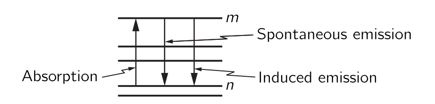{#fig-FLP_1_42_2 width=400}

아인슈타인은 플랑크의 최종 공식이 옳다고 가정했으며, 그 공식을 사용하여 이전에 알려지지 않았던 복사과 물질의 상호작용에 관한 새로운 정보를 얻었다. 그의 논의는 다음과 같이 진행되었다

**1.** 원자의 여러 에너지 준위 중 두 가지, 예를 들어 $m$ 번째와 $n$ 번째 준위를 생각하자. (@fig-FLP_1_42_2). 아인슈타인은 원자에 적절한 진동수의 빛이 비추어질 때 그 빛의 광자를 흡수하여 상태 $n$ 에서 상태 $m$ 으로 전이할 수 있다고 제안했으며, 이러한 현상이 초당 발생할 확률은 두 에너지 준위의 차에 따라 다르며, 빛이 비추는 강도에 비례한다고 보았다. 이 비례 상수를 $B_{nm}$ 이라고 하자. $nm$ 첨자는 이 값이 자연의 보편적인 상수가 아니라 특정 준위 쌍에 따라 달라진다는 점을 표현한다. 어떤 레벨은 쉽게 들떠지고, 어떤 레벨은 들떠지기 어렵다. 

**2.** 이제 $m$ 에서 $n$ 으로 상태가 전이되며 빛을 방출 확률은 어떻게 될까? 아인슈타인은 이것이 두 부분으로 구성되어야 한다고 제안했다. (1) 우선, 빛이 존재하지 않더라도 들뜬 상태에 있는 원자가 낮은 상태로 떨어져 광자를 방출할 가능성이 어느 정도 존재한다. 이를 **자발적 방출 (spontaneous emission)** 이라고 한다. 이는 일정량의 에너지를 가진 진동자가 고전 물리학에서도 그 에너지를 유지하지 못하고 복사를 통해 에너지를 잃는다는 생각과 유사하다. 따라서 고전 시스템의 자발적 복사에 대한 유사체는 원자가 들뜬 상태에 있을 경우, 밀도에 따라 $m$ 에서 $n$ 으로 감소할 확률 $A_{mn}$ 이 존재한다는 것이며, 이 확률은 빛이 원자에 비추고 있는지 여부와는 무관하다. (2) 하지만 그 후 아인슈타인은 더 나아가 고전 이론과 다른 논증을 비교하여, 방출도 빛의 존재에 의해 영향을 받는다고 결론지었다. 즉, 적절한 진동수의 빛이 원자를 비추면 빛의 강도에 비례하여 광자를 방출하는 확률이 증가한다. 그 비례 상수를 $B_{mn}$ 이라고 하자. 나중에 이 계수가 $0$ 이라는 것이 밝혀진다면 아인슈타인이 틀린것이다. 물론 우리는 그가 옳다는 것을 알게 될 것이다. 즉 아인슈타인은 세가지 과정을 가정한다 : (1) 빛의 강도에 비례하는 **흡수 (absorption)**, (2) 빛의 강도에 비례하는 **유도 방출 (induced emission)** 혹은 **자극 방출 (stimulated emission)**, (3) 그리고 빛에 독립적인 **자발적 방출**.

**3.** 이제 온도 $T$ 의 평형 상태에서, 상태 $n$ 의 원자 $N_n$ 개와, 상태 $m$ 의 원자 $N_m$ 개가 있다고 하자. 그렇다면 $n \to m$ 전이하는 원자의 총 개수는 $N_n$ 에 $n\to m$ 확률을 곱한 값이다:

$$
R_{n \to m} = N_n B_{nm}I(\omega)
$$ {#eq-FLP_1_42_13}

$m \to n$ 전이하는 원재의 개수는 $N_m$ 에 각각이 $n$ 으로 전이하는 확률을 곱한 값이다:

$$
R_{m\to n}=N_m\left[ A_{mn} + B_{mn}I(\omega)\right].
$$ {#eq-FLP_1_42_14}

**4.** 열평형 상태에서는 위로 전이하는 원자의 개수와 아래로 전이하는 원자의 개수가 같아야 한다고 가정한다. 이 방법은 각 준위의 원자 숫자가 일정하게 유지하는 방법중 하나이다$^5$[다른 방법이 있을수도 있다.]{.aside}. 우리는 또한 $N_m/N_n = e^{-(E_m-E_n)/k_BT}$ 임을 안다. 여기에 아인슈타인은 $n \to m$ 전이전이에서 유효한 빛은 $\hbar \omega = E_m-E_n$ 을 만족하는 빛 뿐이라고 가정했다. $R_{n \to m} = R_{m \to n}$ 조건으로부터
$$
N_m B_{nm} I(\omega) = N_m [A_{mn} + B_{mn} I(\omega)]
$$ {#eq-FLP_1_42_16}

이며 $N_m/N_n = e^{-(E_m-E_n)/k_BT}$ 조건 역시 만족해야 하므로 

$$
B_{nm}I(\omega) e^{\hbar \omega /k_B T} = A_{mn} + B_{mn} I(\omega) 
$$ {#eq-FLP_1_42_16}

이며, 이로부터 $I(\omega)$ 를 얻는다.

$$
I(\omega) = \dfrac{A_{mn}}{B_{nm}e^{\hbar \omega / k_BT}-B_{mn}}
$$ {#eq-FLP_1_42_17}

하지만 플랑크에 따르면 @eq-FLP_1_42_12 이어야 한다. 이로부터 $B_{nm}=B_{mn}$ 과 같아야 한다. 즉 유도 방출 확률과 흡수 확률이 동일해야 한다. 또한 

$$
\dfrac{A_{mn}}{B_{mn}} = \dfrac{\hbar \omega^3}{\pi^2 c^2}
$$ {#eq-FLP_1_42_18}

이어야 한다. 따라서 특정 에너지 준위 사이에서의 흡수율을 알면 자발적 방출 확률과 유도 방출 확률을 알 수 있다.

여기까지가 아인슈타인이나 다른 누구든지 앞서의 논증을 사용하여 갈 수 있는 한계이다. 특정 원자 전이에 대한 절대 자발적 방출율이나 다른 방출율을 실제로 계산하려면, 양자전기역학이라고 불리는 원자의 메커니즘에 대한 지식이 필요하며, 이는 11년이 지난 뒤에야 발견되었다. 아인슈타인의 이 작업은 1916년에 수행되었다.

유도 방출의 흥미로운 예를 보자. 빛은 하강 전이를 유도하는 경향이 있다. 열적인 방법이 아닌 방법을 사용하여 기체에서 상태 $m$ 의 분자수 $N_m$ 가 상태 $n$ 의 분자수 $N_n$ 보다 훨씬 많도록, 그리고 $N_n \approx =0$ 이 되도록 할 수 있다. 이 상태는 평형이 아니며 따라서, 평형을 위한 식 $e^{−\hbar \omega/k_B T}$ 에 의한 관계를 만족하지 않는다. 그렇다면 $\hbar \omega_{mn} = E_m−E_n$ 에 해당하는 진동수 $\omega_{mn}$ 을 가진 빛은, $N_n$ 이 매우 작기 때문에 강하게 흡수되지 않는다, 반면에, $\hbar \omega_{mn}$ 의 빛은 들뜬 상태에서의 방출을 유도한다! 따라서 상위 상태에 원자가 많을 경우, 일종의 연쇄 반응이 일어나며, 원자들이 방출을 시작하는 순간 더 많은 원자가 방출하게 되고, 그 전체가 함께 전이된다. 이것이 **레이저 (laser)** 라고 불리는 것이며, 원적외선의 경우에는 **메이저 (maser)** 라고 한다.

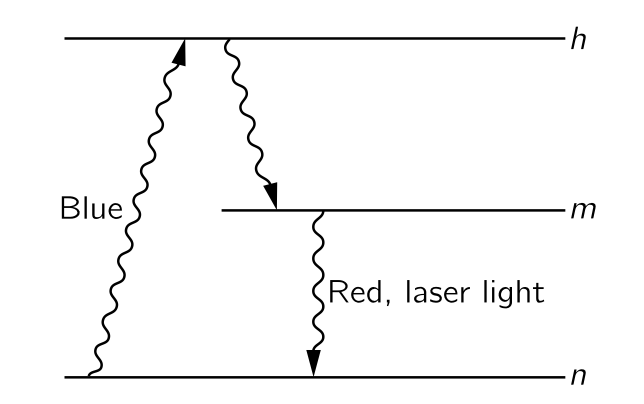{#fig-FLP_1_42_3 width=300}

다양한 트릭을 사용하여 상태 $m$ 에 있는 원자를 얻을 수 있다. 높은 진동수의 강한 빛줄기에 비추어질 경우 원자들이 도달할 수 있는 더 높은 수준이 있을 수 있다. 이러한 높은 수준에서 그들은 아래로 흘러내려 다양한 광자를 방출할 수 있으며, 결국 모두 $m$ 상태에 머무르게 된다. 그들이 방출하지 않고 상태 $m$ 에 머무르는 경향이 있다면, 그 상태를 **메타안정상태 (metastable state)** 라고 한다. 그리고 나서 유도방출에 의해 함께 하강한다. 또 하나의 기술적인 요점은, 이 시스템을 일반적인 상자에 넣는다면, 유도된 효과와 비교했을 때 자연스럽게 여러 방향으로 복사되어 여전히 곤란한 상황을 맞이한다. 하지만 우리는 상자 양쪽에 거의 완벽한 거울을 설치함으로써 유도 효과를 강화하고 효율을 높일 수 있으며, 방출되는 빛이 또 한 번, 또 한 번의 기회를 주어 더 많은 방출을 유도할 수 있다. 거울에 약간의 투과가 있으며, 약간의 빛이 빠져 나온다. 결국, 물론 에너지 보존으로 인해 모든 빛이 균일한 직선 방향으로 방출되어 오늘날 레이저로 가능한 강한 광선을 만든다.

 

## I.43. 확산 {#sec-FLP_1_43}

### I.43-1 분자들의 충돌 {#sec-FLP_1_43_1}

우리는 지금까지 열평형 상태에 있는 기체의 분자 운동만을 고려해 왔다. 이제 상황이 거의 평형에 가깝지만 정확히는 그렇지 않을 때 어떤 일이 일어나는지 알아보자. 평형과 거리가 먼 상황에서는 상황이 매우 복잡하지만, 평형에 매우 가까운 상황에서는 어떤 일이 일어나는지 쉽게 파악할 수 있다. 이를 위해 분자 운동론(kinetic theory)으로 돌아간다. 통계역학과 열역학은 평형 상황을 다루지만, 평형이 벗어나면 원자별로 일어나는 일을 분석할 수밖에 없다.

비평형 상황의 간단한 예로서, 기체 내의 이온의 확산을 생각해보자. 기체에 적은 농도의 이온이 존재한다고 하자. 기체에 전기장을 가하면, 각 이온은 기체의 중성 분자에 작용하는 힘과는 다른 힘을 갖게 된다. 다른 분자가 존재하지 않는다면, 이온은 용기의 벽에 도달할 때까지 등가속 운동을 하겠지만 다른 분자들이 존재하기 때문에 다른 운동을 한다. 이온의 속도는 분자와 충돌하여 운동량을 잃을 때까지만 증가한다. 그리고 다시 속도가 증가하지만 다시 충돌로 인해 운동량을 잃게 된다. 이온은 예상할 수 없는(erratic) 경로를 따르지만 결과적으로 전기력 방향으로 진행한다. 우리는 이온이 평균 “drift” 를 가지고 있으며, 평균 속도는 전기장에 비례한다는 것을 알게 될 것이다. 전기장이 가해져 있고 이온이 이동하고 있는 동안은 물론 열평형에 있지는 않으며, 용기의 끝에 앉아 있어야 하는 평형에 도달하려고 한다. 동역학 이론을 이용하여 우리는 드리프트 속도를 계산할 수 있다.

우리의 현재의 수학적 능력으로는 실제로 일어날 일을 정확히 계산할 수 없지만, 모든 필수적인 특징을 나타내는 근사적인 결과를 얻을 수 있다. 따라서 수학적 진행 과정에서 인수의 수치적인 정확한 값을 걱정하지 않을 것이다. 그것들은 훨씬 더 정교한 수학적 처리에 의해서만 얻을 수 있다.

비평형 상황에서 일어나는 일을 고려하기 전에, 열평형 상태에 있는 기체에서 일어나는 일을 조금 더 자세히 살펴볼 필요가 있다. 예를 들어, **분자의 연속적인 충돌 사이의 평균 시간**이 얼마인지 알아야 한다.

모든 분자는 다른 분자들과 일련의 무작위적인 충돌을 경험한다. 특정 분자가 긴 시간 $T$ 동안 $N$ 번의 충돌을 겪었다면 충돌 사이의 시간의 평균 $\tau$ 는 다음과 같다.

$$
\tau = T/N.
$$ {#eq-FLP_1_43_1}

짧은 시간 간격 $dt$ 동안 충돌을 경험할 확률은 $dt/\tau$ 이다. 이제 질문을 바꿔보자 : **분자가 시간 $t$ 동안 충돌 없이 진행할 확률은 얼마인가?** 시간 $t=0$ 에서 우리는 특정 분자 $N_0$ 개를 관찰하기 시작하자. 그리고 $N(t)$ 를 시간 $t$ 까지 충돌을 격지 않은 분자의 개수라고 하자. 당연히 $N(t) \le N_0$ 이다. $N(t)$ 를 안다면, $t+dt$ 까지 충돌 없이 도달하는 분자의 수 $N(t+dt)$ 는 $dt$ 동안 충돌이 있는 수만큼 $N(t)$ 보다 작다. $dt$ 동안 충돌하는 수는 평균 시간 $\tau$ 를 기준으로 $dN=N(t)dt/τ$ 이다: 

$$
N(t+dt)=N(t)−N(t)\dfrac{dt}{\tau}.
$$ {#eq-FLP_1_43_2}

초기조건 $N(0)=N_0$ 와 위의 방정식으로부터 $N(t)$ 를 얻을 수 있다:

$$
N(t)=N_0  e^{−t/\tau}.
$$ {#eq-FLP_1_43_7}

이로부터 $[0,\,t]$ 시간동안 충돌이 없을 확률 $P(t)$ 는 다음과 같다.

$$
P(t)=e^{−t/\tau}
$$ {#eq-FLP_1_433_8}

분자가 $τ$ 의 시간 동안 충돌을 피할 확률은 $e^{−1}≈0.37$ 이므로 충돌 사이에 평균보다 시간이 더 클 확률은 절반 이하이다. 충돌하기 전 평균 시간보다 훨씬 긴 시간 동안 충돌이 없는 분자들이 충분히 존재하므로 평균 시간은 여전히 $\tau$ 가 될 수 있다.

우리는 원래 $\tau$ 를 충돌 사이의 평균 시간으로 정의했다. 그리고 @eq-FLP_1_43_7 로부터 임의의 시작 순간부터 다음 충돌까지의 평균 시간 역시 $\tau$ 임을 보일 수 있다. 임의의 $t$ 에 대해 $[t,\, t+dt]$ 시간 구간에서 다음 충돌을 경험하는 분자의 수는 $N(t)dt/\tau$ 이며, 다음 충돌까지의 평균 시간은 

$$
\text{다음 충돌까지 평균 시간}=\dfrac{1}{N_0}\int_0^\infty t\dfrac{N(t) dt}{\tau} = \tau
$$

이다. 즉 **충돌 사이의 시간 간격과 어떤 시점에서 다음 충돌까지의 시간에 대한 기대값은 같다.**

 

### I.43-2 평균 자유 거리 {#sec-FLP_1_43_2}

::: {.callout-important icon="false"}

#### **평균 자유 거리**

분자의 충돌에서 충돌 사이의 평균 시간이 $\tau$ 이고, 분자들의 평균 속력이 $v$ 일 때 충돌 사이의 평균 거리를 **평균 자유 거리 (mean free path)** 라고 한다. 

$$
\text{평균 자유 거리 } l := \tau v.
$$ {#eq-FLP_1_43_9}

:::

분자가 짧은 시간 $dt$ 에서 충돌을 할 확률이 $dt/\tau$ 와 같듯이, 거리가 $dx$ 일 때 충돌할 확률도 $dx/l$ 이다. [분자들의 충돌](#sec-FLP_1_43_1) 에서의 논의를 $t$ 에서 $x$ 로 바꾸면 충돌 없이 $x$ 만큼의 거리를 이동할 확률이 $e^{−x/l}$ 임을 보일 수 있다. 분자가 다른 분자와 충돌하기 전에 이동하는 평균 거리, 즉 평균 자유 거리는 주변에 존재하는 분자의 수와 그 분자들의 “크기”, 즉 그들이 나타내는 표적의 크기에 따라 달라진다. 충돌에서 목표물의 실제 “크기”는 보통 **충돌단면적 (collision cross section)** 으로 설명하며, 이는 핵 물리학이나 빛 산란 문제에 사용되는 것과 동일한 개념이다.

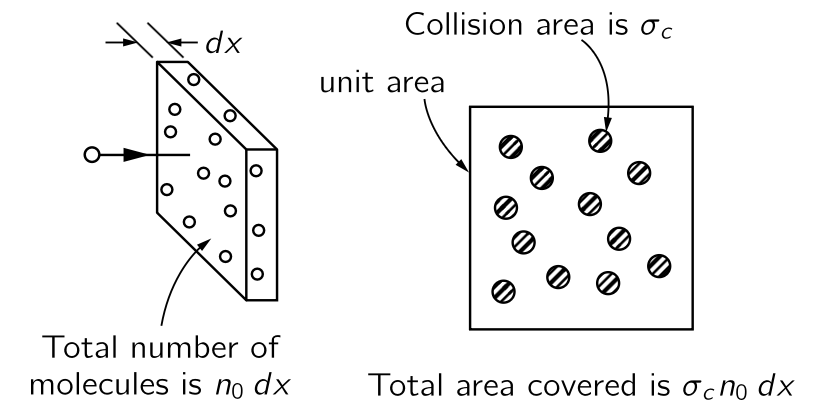{#fig-FLP_1_43_1 width=300}

단위 부피당 $n_0$ 개의 산란체(분자)를 가진 기체를 통과하여 $dx$ 만큼 움직이는 입자를 생각하자. 선택한 입자의 운동 방향수직 방향으로 $dx$ 거리에 단위면적당 $n_0 dx$ 개의 분자가 있다. 충돌단면적 $\sigma_c$ 에 대해 산란체들이 차지하는 전체 면적은 $\sigma_c n_0 dx$ 이며 이는 따라서 거리 $dx$ 를 이동할 때의 충돌 확률과 같다.

$$
dx \text{ 만큼 진행할 때의 충돌 확률}  =\sigma_c n_0 \, dx.
$$ {#eq-FLP_1_43_10}

위에서 보았듯이 $dx$ 만큼 이동하는 동안의 충돌 확률은 평균 자유 거리 $l$ 에 대해 $dx/l$ 이다. 이를 @eq-FLP_1_43_10 과 비교하면

$$
\dfrac{1}{l}=\sigma_c n_0
$$ {#eq-FLP_1_43_11}

이며, 

$$
\sigma_c n_0 l=1
$$ {#eq-FLP_1_43_12}

이다. 이 식은 거리 $l$ 을 통과할 때 평균적으로 한 번의 충돌이 있다는 의미이다. 길이가 $l$ 이며 단위면적을 가진 원통 에는 $n_0 l$ 개의 산란체가 존재한다. 산란체 하나의 면적이 $\sigma_c$ 인 경우 전체 면적은 $n_0 l \sigma_c$ 이며 이는 단위면적, 즉 원통의 단면이다. 물론 일부 분자는 다른 분자 뒤에 부분적으로 숨겨져 있기 때문에 전체 면적이 덮여져 잇지 않고, 따라서 일부 분자는 충돌 없이 $l$ 보다 더 멀리 진행 할 수 있다. 평균 자유 거리 $l$ 을 측정하여 $\sigma_c$ 를 계산하고, 그 결과를 원자 구조에 대한 상세 이론에 기반한 계산과 비교할 수 있지만 그것은 다른 주제이다! 이제 비평형 상태 문제로 돌아가자.

### I.43-3 표류 속도 {#sec-FLP_1_43_3}

#### **표류속도**

우리는 기체의 대부분 분자와는 어느 정도 차이가 있는 하나 혹은 몇몇의 분자에서 일어나는 일을 설명하고자 한다. 여기서 대다수 분자를 **배경 분자** 라고 하고, 배경 분자와 다른 분자를 **특수 분자**, 혹은 $S$-분자라고 하자. 이 분자는 배경 분자보다 무겁거나. 다른 화학 물질이거나, 전하가 있을 수 있다. 질량이나 전하가 다르기 때문에 $S$-분자에는 배경 분자에 작용하는 힘과 다른 힘이 작용할 수 있다. 이러한 $S$-분자에 대해 어떤 일이 일어나는지를 고려함으로써, 우리는 다양한 현상에서 유사한 방식으로 작용하는 기본 효과를 이해할 수 있다. 예를 들면 가스 확산, 배터리 내 전류, 침전, 원심 분리 등.

기본 과정을 살펴보는 것으로 시작한다. 배경 기체 내의 $S$-분자에는 중력 혹은 전기력과 같은 힘 $\bf{F}$ 뿐만 아니라 배경 분자와의 충돌로 인한 특정되지 않는 힘 역시 작용한다. 우리는 $S$ 분자의 일반적인 행동을 기술하고자 한다. $S$ 분자는 다른 분자와 반복적으로 충돌하면서 여기저기 어슬렁 거린다. 그러나 주의 깊게 관찰하면 힘 $\bf{F}$ 방향으로 으로 어느 정도 진행한다는 것을 알 수 있다. 이것을 무작위 운동 위에서 **표류 (drift)** 한다고 말한다. 우리가 관심있는 것은 힘 $\bf{F}$ 와 그 표류에 의한 **표류 속도 (drift velocity)** 이다.

$S$-분자는 일련의 충돌 사이 어딘가에 있다. 최종 충돌 후의 속도 뿐만 아니라 힘 $\bf{F}$ 에 의한 속도도 갖게 된다. 평균적으로는 짧은 시간(시간 $\tau$) 내에 충돌을 경험하고 새로운 경로 구간을 시작한다. 새로운 시작 속도와, $\bf{F}$ 에 의한 동일한 가속도를 갖는다. 문제를 간단하게 하기 위해 두가지를 가정한다.

**가정-1** : 각 충돌 후에 $S$-분자는 완전히 새로운 시작을 한다고 가정한다. 즉, $\bf{F}$ 에 의한 과거 가속도를 전혀 기억하지 않는다는 것이다. $S$-분자가 배경 분자보다 훨씬 가볍다면 이는 합리적인 가정일 수 있지만, 일반적으로는 확실히 타당하지 않다. 나중에 개선된 가정에 대해 논의할 것이다.

**가정-2** : $S$-분자가 각각의 충돌 후 향하는 방향은 모든 방향에 대해 동일한 확률이라고 가정한다. 모든 방향에 대해 균등한 시작속도를 가정하므로 순운동(net motion)에 기여하지 않으며 따라서 충돌 후 초기 속도에 대해 더 이상 걱정할 필요가 없다. 

무작위 움직임에 더하여, 각 $S$-분자는 언제든지 마지막 충돌 이후 받아온 힘 $\bf{F}$ 의 방향에 대한 추가 속도를 갖게 된다. 이 $\bf{F}$ 에 의한 속도의 평균값은 $S$-분자의 질량 $m$ 에 대해 $F/m$ 에 마지막 충돌 이후 평균 시간 $\tau$ 을 곱한 값이며 이를 표류 속도 $\bf{v}_\text{drift}$ 라고 한다.

$$
\bf{v}_\text{drift}=\dfrac{\bf{F}\tau}{m}.
$$ {#eq-FLP_1_43_13}

여기서 $\tau$ 를 결정하는 데 다소 어려움이 있을 수 있지만, 기본 과정은 위 식에 의해 정의된다.

표류속도는 힘에 하는데 여기서 비례상수에는 일반적인 명칭이 없고 힘 마다 다른 이름이 사용된다. 전기 문제에서 $\bf{F}=q\bf{E}$ 이므로 속도와 전기장 $\bf{E}$ 사이의 비례 상수를 보통 **이동도 (mobility)** 라고 한다. 하지면 여기서는 전기력에 대한 비례상수를 이동도 라고 하자. 따라서 이동도 $\mu$ 에 대해 다음과 같이 쓸 수 있다.

$$
\bf{v}_\text{drift} = \mu \bf{F}
$$ {#eq-FLP_1_43_14}

@eq-FLP_1_43_13 으로부터

$$
\mu=\dfrac{\tau}{m}.
$$ {#eq-FLP_1_43_15}

이다. @eq-FLP_1_43_13 은 정확하지만 정확한 약간의 주의가 필요하다. 혼동의 여지가 있음에도 불구하고 @eq-FLP_1_43_13 에 도달하는 합리적이지만 잘못된 방식을 알아보자(많은 교과서에서 찾아볼 수 있는 방식이기도 하다!).

#### **@eq-FLP_1_43_15 를 유도하는 잘못된 방식**

**일단 틀린 논리** : 충돌 사이의 평균 시간은 $\tau$. 충돌 후 입자는 무작위적인 속도로 시작하지만, 충돌 사이에 가속도에 시간을 곱한 것만큼 속도가 변한다. 다음 충돌에 도달하는 데 시간이 $\tau$ 이므로, $\tau$ 의 시간 후에는 $(F/m)\tau$ 의 속도로 충돌한다. 충돌 직후 속도가 0 이므로 두 충돌 사이에는 평균적으로 최종 속도의 절반에 해당하는 $\frac{1}{2}F\tau/m$ 가 평균속도이다. 

**틀린 이유** : 위의 논리가 틀린 이유는 주의를 요한다. 모든 충돌사이의 시간간격이 $\tau$ 인 것처럼 주장하지만 사실은 어떤 시간간격은 평균보다 짧고 다른 시간간격은 은 더 길다. 짧은 시간은 더 자주 발생하지만, 실제로 출발할 가능성이 적어 표류 속도에 대한 기여는 적다. **충돌 사이의 자유 시간 분포를 적절히 고려한다면**, 틀린 논리에서의 $\frac{1}{2}$ 가 존재해서는 안 된다는 것을 증명할 수 있다. 여기서의 오류는 단순한 논증을 통해 평균 최종 속도를 평균 속도 자체와 연결하려고 시도하면서 발생했다. 이 관계는 단순하지 않으므로, 즉 평균 속도 자체에 집중하는 것이 최선이다. 우리가 제시한 맞는 논증은 평균 속도를 직접적으로, 그리고 정확하게 결정한다! 하지만 아마 이런 문제로 일반적으로 모든 올바른 수치 계수를 얻으려고 하지 않는 것일 것이다!

이제 각 충돌이 과거 운동에 대한 모든 기억을 없애는 단순화된 가정으로 돌아가자. 즉 각 충돌 후에 새로운 시작이 이루어진다. $S$-분자가 가벼운 배경 분자들 속의 무거운 물체라고 가정하자. 그렇다면 $S$-분자는 각 충돌마다 “전방” 운동량을 잃지 않을 것이고 그 움직임이 다시 “무작위화” 되기까지 몇 차례의 충돌이 걸릴 것이다. 우리는 오히려 각 충돌마다 운동량의 일정 비율을 잃는다고 가정해야 한다. 세부적인 것을 다루지는 않겠지만 이 결과가 평균 충돌 시간인 $\tau$ 를 “잊는 시간”의 평균에 해당하는 새로운, 그리고 더 긴 $\tau$ 로 교체하는 것과 동등하다고 말할 수 있다. $\tau$ 는 평균 “망각 시간”, 즉 전진 운동량을 잊는 평균 시간을 의미한다. $\tau$ 에 대한 이러한 해석을 통해 우리는 처음 가정한 것만큼 단순하지 않은 상황에 대해 @eq-FLP_1_43_15 를 사용할 수 있다.

 

### I.43-4 이온 전도도 {#sec-FLP_1_43_4}

전하를 가진 이온(원자 혹은 분자) 도 존재하는 기체가 용기에 있다고 하자(@fig-FLP_1_43_2) 용기의 두 반대쪽 벽이 금속 판인 경우 이를 배터리 단자에 연결하여 기체에 전기장을 가할 수 있으며 이온은 판중 한쪽의 방향으로 이동한다. 전류가 유도되고, 이온이 포함된 기체는 저항기처럼 작동한다. 표류 속도를 통해 이온 흐름을 계산함으로써 저항을 계산할 수 있다. **질문 : 전류는 두 판에 적용되는 전압 차이 $V$ 에 어떻게 의존하는가?**

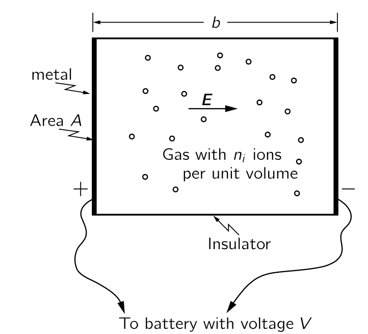{#fig-FLP_1_43_2 width=300}

위의 그림과 같이 컨테이너가 길이 $b$ 이고 단면적 $A$ 인 직사각형 상자라고 하자. 두 판 사이의 전위차가 $V$ 라면, 판 사이의 전기장의 크기 $E=V/b$ 이다. 이 전기장에 의해 전하량 $q$ 인 이온에 $q\bf{E}$ 만큼의 힘이 작용한다. 이온의 표류속도는 그 힘의 $\mu$ 배가 된다.

$$
v_\text{drift}=\mu F=\mu qE=\mu q\dfrac{V}{b}.
$$ {#eq-FLP_1_43_16}

전류 $I$ 는 단위 시간당 전하의 흐름이다. 판 가운데 하나에 흐르는 전류는 단위 시간에 판에 도달하는 이온들의 총 전하량이다. 이온이 속도 $v_\text{drift}$ 로 판을 향해 떠다니면, $v_\text{drift}\cdot T$ 거리 안에 있는 이온은 시간 $T$ 안에 판에 도착한다. 단위 부피당 $n_i$ 이온이 있을 경우, 시간 $T$ 에 판에 도달하는 수는 $n_i\cdot A \cdot v_\text{drift} \cdot T$ 이다. 각 이온의 전하량은 $q$ 이므로

$$
[\text{시간 }T\text{ 동안 한쪽 판에 도달한 총 전하}]=q n_i A v_\text{drift} T
$$ {#eq-FLP_1_43_17}

이다. $I$ 는 총 전하를 시간 $T$ 로 나는 값이므로

$$
I=qn_iAv_\text{drift}
$$ {#eq-FLP_1_43_18}

이다. 이제 $v_\text{drift}$ 를 @eq-FLP_1_43_16 으로 대체하면 

$$
I=\mu q^2 n_i \dfrac{A}{b}V.
$$ {#eq-FLP_1_43_19}

우리는 전류가 전압에 비례한다는 것, 즉 옴 법칙의 형태라는것을 발견했으며, 저항 $R$은 따라서

$$
\dfrac{1}{R}=\mu q^2n_i\dfrac{A}{b}
$$ {#eq-FLP_1_43_20}

이다. 우리는 저항과 분자 특성 $n_i$, $q$, $\mu$ 사이에 관계를 찾았다. $\mu$ 는 $m$ 과 $\tau$ 에 의존한다. 원자 측정으로부터 $n_i$ 와 $q$ 를 알 수 있다면, $R$ 의 측정값을 사용하여 $\mu$ 를 결정할 수 있으며, $\mu$ 로부터 $\tau$ 도 결정할 수 있다.

 

### I.43-5 분자 확산 {#sec-FLP_1_43_5}

이제 확산 이론에 대해 알아보자. 열평형 상태에 있는 기체 용기가 있고, 그 용기의 어느 위치에 다른 종류의 기채를 소량 주입한다고 가정하자. 원래 기체를 **배경 기체** 라고 부르고, 주입되는 기체를 **특별 기체** 라고 하자. 특별 기체는 전체 용기에 퍼지기 시작하지만, 배경 기체가 존재하기 때문에 천천히 퍼질 것이다. 이 느리게 퍼지는 과정을 **확산(diffusion)** 이라고 한다. 확산은 주로 배경 기체 분자에 의해 휘둘려지는 특별 기체 분자에 의해 제어된다. 많은 충돌이 발생한 후에는 특별 분자들은 전체 부피에 걸쳐 대체로 고르게 퍼지게 된다. 우리는 기체의 확산과 대류에 의해 발생할 수 있는 대량의 이동을 혼동하지 않도록 주의해야 한다. 대부분의 경우 두 기체의 혼합은 대류와 확산의 결합에 의해 발생하며 우리는 현재 대류가 없는 경우에만 관심이 있다. 즉 여기서 기체는 오직 분자 운동, 즉 확산에 의해서만 퍼진다. 우리는 확산이 얼마나 빠르게 진행되는지 계산하고자 한다.

이제 분자 운동으로 인한 특별 기체 분자의 순흐름을 계산하자. 분자가 어느정도 불균일하게 분포할때만 순 흐름이 존재하며, 그렇지 않다면 모든 분자 운동이 평균이 되어 순 흐름이 없게 된다. 먼저 $x$ 방향의 흐름을 생각해 보자. 흐름을 찾기 위해, 우리는 $x$ 축에 수직인 가상의 평면을 가로지르는 특수 분자의 수를 센다. 순흐름을 얻기 위해서는 양의 $x$ 방향으로 교차하는 분자를 양수로 계산하고, 그 수에서 음의 $x$ 방향으로 교차하는 수를 빼야 한다. 우리가 여러 차례 보았듯이, 시간 $\Delta T$ 에서 표면적을 가로지르는 수는 평면으로부터 거리 $v\Delta T$ 까지 연장된 부피에서 구간 $\Delta T$ 를 시작하는 개수이다. 참고로, 여기서 $v$ 는 실제 분자 속도이며, 표류 속도가 아니다.

관례를 따라 $+x$ 방향을 오른쪽으로, $-x$ 방향을 왼쪽이라고 하자. 왼쪽에서 오른쪽으로 이동하는 특수 분자의 수는 $n_{−}v\Delta T$ 이며, 여기서 $n_{−}$ 는 평면의 왼쪽에 있는 단위 부피당 특별 기체 분자의 개수 밀도이다.(2배 정도이지만 일단 무시한다.). 오른쪽에서 왼쪽으로 교차하는 수는 마찬가지로 $n_{+}v\Delta T$ 이며, 여기서 $n_{+}$ 는 평면의 오른쪽에 있는 특수 분자들의 개수 밀도이다. 이는 단위 면적당 단위 시간당 분자의 순 흐름을 $J$ 라고 하면

$$
J=\dfrac{n_{−}v\Delta T − n_{+}v \Delta T}{\Delta T},
$$ {#eq-FLP-1_43_21}

또는

$$
J=(n_{−} −n_{+})v
$$ {#eq-FLP_1_43_22}

이다. 여기서 $n_{−}$ 와 $n_{+}$ 에 대해 어떤 값을 사용해야 할까? 평면 왼쪽의 밀도라고 말할 때 평면에서 얼마나 떨어진 왼쪽을 의미하나? 우리는 분자들이 “비행”을 시작한 장소의 밀도를 선택해야 한다. 왜냐하면 그러한 여행을 시작하는 개수는 그 장소에 존재하는 개수에 의해 결정되기 때문이다. 따라서 $n_{−}$ 는 평균 자유 거리 $l$ 에 해당하는 왼쪽의 개수 밀도를 의미하고, $n_+$ 는 우리 가상의 표면에서의 오른쪽으로 거리 $l$ 에서의 개수 밀도를 의미한다.

특별 분자들의 개수 밀도 $n_a (x,\,y,\,z)$ 를 $x$, $y$, $z$ 의 연속함수라고 가정 할 수 있다. $n_a$ 를 통해 $(n_+-n_0)$ 를 다음과 같이 표현 할 수 있다.

$$
(n_+ −n_−)=\dfrac{dn_a}{dx}\Delta x = \dfrac{dn_a}{dx}\cdot 2l
$$ {#eq-FLP_1_43_23}

이 결과를 @eq-FLP_1_43_22 에 대입할 때 $2$ 를 무시하면 다음을 얻는다.

$$
J_x=−lv\dfrac{dn_a}{dx}.
$$ {#eq-FLP_1_43_24}

우리는 특별 분자들의 순 흐름이 밀도의 미분, 정확히는 그래디언트에 비례한다는 것을 발견했다.

우리가 여러 개의 대략적인 근사값을 만든 것이 분명하다. 우리가 무시한 $n_+,\,n_-$ 의 2배 요인 이외에도, $v_x$ 를 사용해야 할 곳에 $v$ 를 사용했으며, $n_+$ 와 $n_−$ 는 우리가 정한 평면으로부터 수직 거리 $l$ 에 있는 위치를 가리킨다고 가정했다. 반면 평면 요소에 수직으로 이동하지 않는 분자에 대해서는 $l$ 이 표면으로부터의 기울어진 거리와 대응해야 한다. 이런 사항들을 고려한 개선 결과는 @eq-FLP_1_43_24 에 $1/3$ 을 곱한 값이다. 즉,

$$
J_x=−\dfrac{lv}{3}\dfrac{d n_a}{dx}
$$ {#eq-FLP_1_43_25}

이다. 실제로 실험에서 얻는 $D=lv/3$ 값을 **확산 계수 (diffusion coefficient)** 라고 하며 3차원에서 아래의 미분방정식으로 표현된다.

$$
J_x = -D \dfrac{d n_a}{dx} ,\qquad D = \dfrac{1}{3}lv.
$$ {#eq-FLP_1_43_26}

지금까지 이 장에서는 두 가지 뚜렷한 과정을 고려했다. 외부 힘에 의한 분자의 이동인 이동도(mobility)와 그리고 내부 힘, 즉 무작위 충돌에 의해서만 결정되는 확산(diffusion). 그러나 두 경우 모두 기본적으로 열운동에 의존하고, 평균 자유 거리 $l$ 이 두 값의 식에 나타난다.

만약, @eq-FLP_1_43_25 에서 $l=v\tau$, $\tau = \mu m$ 을 이용해서 치환하면

$$
J_x=−\dfrac{1}{3}mv^2 \mu \dfrac{d n_a}{dx}
$$ {#eq-FLP_1_43_28}

을 얻는다. 여기에 등분배 정리

$$
\dfrac{1}{2}mv^2=\dfrac{3}{2}k_B T
$$

를 적용하면 

$$
J_x=−\mu k_B T \dfrac{d n_a}{dx}
$$ {#eq-FLP_1_43_30}

을 얻는다. 즉 확산 계수는

$$
D=\mu k_BT.
$$ {#eq-FLP_1_43_31}

그리고 @eq-FLP_1_43_31 의 계수가 정확히 맞다는 것이 밝혀졌다. 대략적인 가정들을 교정하기 위한 추가적인 요인을 생각하지 않아도 된다. 실제로 @eq-FLP_1_43_31 이 액체 안의 현탁액과 같은 복잡한 상황에서도 항상 정확해야 함을 보여줄 수 있다. 

@eq-FLP_1_43_31 이 일반적으로 정확해야 함을 보여주기 위해, 우리는 통계역학의 기본 원칙만을 사용하여 다른 방식으로 유도 할 수 있다. 특별 분자들의 그래디언트가 존재하고, @eq-FLP_1_43_26 에 따라 확산 흐름이 존재하는 상황을 상상해 보자. 우리는 이제 $x$ 방향으로 역장(force field) 을 적용하여 각 특별 분자가 힘 $F$ 를 느끼게 한다. 이동도 $\mu$ 의 정의에 따르면, 표류 속도는 다음과 같이 주어진다.

$$
v_\text{drift}= \mu F.
$$ {#eq-FLP_1_43_32}

또한 표류 전류(시간 단위에서 면적 단위를 통과하는 분자들의 순수)는

$$
J_\text{drift}=n_a v_\text{drift},
$$ {#eq-FLP_1_43_33}

혹은

$$
J_\text{drift} = n_a \mu F
$$ {#eq-FLP_1_43_34}

이다. 이제 $F$ 에 의해 발생하는 표류 전류가 확산과 균형을 이루도록 힘 $F$ 를 조정하여, 우리의 특별 분자들의 순흐름이 없도록 하자. $J_x + J_\text{drift}=0$ 으로부터 

$$
D\dfrac{d n_a}{dx} = n_a\mu F
$$ {#eq-FLP_1_43_35}

이며, 이 '균형' 조건 하에서 다음이 성립한다.

$$
\dfrac{d n_a}{dx} = \dfrac{n_a\mu F}{D}
$$ {#eq-FLP_1_43_36}

우리는 평형 조건에서 기술하고 있으며 따라서 통계역학의 평형 법칙이 적용된다. 이러한 법칙에 따르면 좌표 $\bf{x}$ 에서 분자를 찾을 확률은 포텐셜 에너지 $U$ 에 대해 $e^{−U(\bf{x})/k_B T}$ 에 비례하며, 

$$
n_a=n_0e^{−U/k_B T}
$$ {#eq-FLP_1_43_37}

이다. 그래디언트를 취하면

$$
\dfrac{d n_a}{dx} = − n_0 e^{−U/k_B T}⋅\dfrac{1}{k_B T}\dfrac{d U}{dx},
$$ {#eq-FLP_1_43_37}

혹은

$$
\dfrac{d n_a}{dx} = −\dfrac{n_a}{k_B T}\dfrac{dU}{dx}
$$ {#eq-FLP_1_43_39}

이다. $\nabla U = -\bf{F}$ 이므로

$$
\dfrac{d n_a}{dx} = \dfrac{n_a}{k_B T}F
$$ {#eq-FLP_1_43_40}

이다. 이것은 정확히 @eq-FLP_1_40_2 이다. 우리는 처음에 $e^{−U/k_B T}$ 를 추론했으므로, 우리는 원을 그리게 되었다. @eq-FLP_1_43_40 과 @eq-FLP_1_43_36 을 비교하면 정확히 @eq-FLP_1_43_31 을 얻는다. @eq-FLP_1_43_31 은 이동도를 이용하여 확산 전류를 제시하는데 매우 일반적으로 참이다. 이동도와 확산은 밀접하게 연결되어 있다. 이 관계는 아인슈타인에 의해 최초로 유도되었다.

 

### I.43-6 열전도도 {#sec-FLP_1_43_6}

앞서 사용한 분자운동론의 방법은 기체의 열전도율을 계산하는 데에도 활용될 수 있다. 용기의 상단 기체가 하단의 기체보다 더 뜨겁다면, 열이 위에서 아래로 흐른다. (우리는 위가 더 뜨겁다고 가정한다. 그렇지 않으면 대류에 의한 열전달이 발생한다) 열이 더 뜨거운 기체에서 차가운 가스로 전달되는 것은 에너지가 더 높은 “뜨거운” 분자들의 아래쪽으로 확산과, “차가운” 분자들의 위쪽 확산에 의해 발생한다. 열 에너지의 흐름을 계산하려면, 아래쪽으로 이동하는 분자들이 면적의 한 요소를 가로질러 아래로 전달되는 에너지와 위쪽으로 이동하는 분자들이 표면을 가로질러 위쪽으로 전달하는 에너지에 대해 알아봐야야 한다. 그 차이는 우리에게 아래로 내려가는 에너지의 흐름을 제공한다. 열전도율 $\kappa$ 는 단위 표면적을 가로질러 열에너지가 전달되는 속도와 온도 구배의 비율로 정의된다.

$$
\dfrac{1}{A}\dfrac{dQ}{dt}=−\kappa \dfrac{dT}{dz}
$$ {#eq-FLP_1_43_41}

$\kappa$ 는 아래와 같은데 계산이 분자 확산을 고려할 때 위에서 수행한 것과 상당히 유사하므로, 연습으로 남겨둔다.

$$
\kappa = \dfrac{k_B nlv}{\gamma−1}.
$$ {#eq-FLP_1_43_42}

여기서 $k_B T/(\gamma−1)$ 는 온도 $T$ 에서의 분자의 평균 에너지이다.

우리가 이미 알고 있는 $nl\sigma_c=1$ 로부터

$$
\kappa = \dfrac{1}{\gamma − 1}\dfrac{k_B v}{\sigma_c}
$$ {#eq-FLP_1_43_43}

이다. 우리는 다소 놀라운 결과를 얻었다. 우리는 기체 분자의 평균 속도가 온도에 의존하지만 밀도에는 의존하지 않는다는 것을 알고 있다. 우리는 $\sigma_c$ 가 분자의 크기에만 의존한다고 예상한다. 따라서 위 결과는 열전도율 $\kappa$ (따라서 특정 상황에서의 열 흐름 속도)가 가스의 밀도와 무관하다는 것을 말한다! 에너지의 “carriers” 수가 밀도 변화에 따라 변하는 것은 충돌 사이에 “carriers”가 이동할 수 있는 거리가 커짐에 의해 보상된다.

혹자는 이렇게 물어볼 수 있다: “밀도가 0 이 되는 극한에서 열 흐름이 기체 밀도와 무관한가?” 기체가 전혀 없을 때? 절대 아닙니다! @eq-FLP_1_43_43 은 이 장의 다른 모든 것들과 마찬가지로, 충돌 사이의 평균 자유 경로가 컨테이너의 모든 차원보다 훨씬 작다는 가정 하에 도출되었다. 가스 밀도가 너무 낮아 분자가 용기의 한 벽에서 다른 벽으로 충돌 없이 통과할 가능성이 충분히 높을 경우, 이 장의 계산은 전혀 적용되지 않는다. 그러한 경우에는 동역학 이론으로 돌아가 일어날 일에 대한 세부 사항을 다시 계산해야 한다.

 

## I.44 열역학 법칙 {#sec-FLP_1_44}

### I.44-1 열기관과 열역학 제 1 법칙 {#sec-FLP_1_44_1}

#### **역사적 배경**

지금까지 우리는 물질의 특성을 원자적 관점에서 논의해 왔으며, 사물이 특정 법칙을 따르는 원자로 이루어져 있다고 가정하고 어떤 일이 일어날지 이해하려고 노력해 왔다. 그러나 물질의 특성 사이에는 재료의 상세한 구조와는 무관한 여러 관계가 존재하며, 이 관계가 열역학의 주제이다. 역사적으로 열역학은 물질의 내부 구조에 대해 이해하기 전에 개발되었다.

예를 들어, 분자운동론으로부터 압력의 원인은 분자 폭격이며, 기체를 가열하면 폭격이 증가하면 압력도 상승해야 한다는 것을 안다. 반대로, 기체 용기의 피스톤이 이 폭격의 힘에 반하여 안쪽으로 이동하면, 피스톤을 폭격하는 분자들의 에너지가 증가하고 그 결과 온도가 상승한다는 것을 안다. 또한 한편으로는 주어진 부피에서 온도를 높이면 압력이 증가하며, 반면에 기체를 압축하면 온도가 상승한다는 것을 안다. 분자운동론으로부터 이 두 효과 사이의 정량적 관계를 이끌어 낼 수 있지만, 본능적으로는 충돌의 세부 사항과 무관한 방식으로 서로 연관되어 있다고 추측할 수 있다.

다른 예를 살펴보자. 고무의 흥미로운 특성은 잡아당기면 온도가 올라가고 수축하면 내려간다는 것이다. 이제 고무줄을 가열하면 밴드가 당겨진다고 생각 할 수 있다. 밴드를 당겨서 가열한다는 사실이 밴드를 가열하면 밴드가 수축하도록 만들 수 있음을 암시할 수 있다. 그리고 실제로, 무게를 잡고 있는 고무 밴드에 가스 불꽃을 가하면, 밴드가 갑자기 수축하는 것을 보게 된다. 따라서 고무 밴드를 가열하면 당겨지는 것이 사실이며, 이 사실은 그 밴드의 장력을 풀면 식는 것과 확실히 관련이 있다.

이러한 효과를 일으키는 고무의 내부 메커니즘은 상당히 복잡하다. 이 장의 주요 목적은 분자 모델과 무관하게 이러한 효과들의 관계를 이해하는 것이지만 일단 어느 정도 분자적 관점에서 이를 이해해보자. 우선 고무는 거대한 긴 분자 사슬의 얽혀 있는, 일종의 “분자 스파게티”라고 할 수 있다. 여기에 분자 사슬 사이에 교차 연결—때때로 스파게티 면들이 붙어서 교차하는 것과 유사한—도 존재한다. 이렇게 얽혀있는 것을 잡아당기면, 일부 사슬은 당기는 방향으로 정렬되는 경향이 있다. 동시에 사슬들은 열운동을 하고 있어 서로 지속적으로 충돌한다. 따라서 그러한 사슬은 늘어날 경우 자체적으로 늘어난 상태를 유지하지 못하고 다른 사슬 및 다른 분자들에 의해 측면에서 타격을 받아 다시 구부려지는 경향이 있다. 따라서 고무줄이 수축하는 진정한 이유는 다음과 같다. 고무줄을 잡아당기면 사슬이 길이 방향으로 이동하고, 사슬 측면에 있는 분자들의 열운동이 사슬을 수축시키려 하기 때문이다. 사슬을 팽팽하게 잡고 온도가 상승하면 사슬 측면에 가해지는 폭격의 강도도 증가하여 사슬이 수축되는 경향이 있으며, 가열될 때 더 강한 무게를 끌어당길 수 있다는 것을 이해할 수 있다. 고무줄을 일정 시간 늘린 후 고무줄이 이완되도록 허용하면, 각 사슬이 부드러워지고, 그 사슬에 닿는 분자들은 이완 사슬을 두드리면서 에너지를 잃게 된다. 그래서 온도가 떨어진다.

우리는 가열 시 수축과 이완 시 냉각이라는 두 과정이 운동 이론에 의해 어떻게 연관될 수 있는지 확인했지만, 이론으로부터 두 과정 사이의 정확한 관계를 규명하는 것은 엄청난 도전이 될 것이다. 우리는 매초 몇 번의 충돌이 발생했는지와 사슬이 어떻게 생겼는지를 알아야 하며, 다양한 다른 복잡한 문제들을 고려해야 한다. 상세한 메커니즘은 매우 복잡하여 분자운동론만으로는 정확히 무슨 일이 일어나는지 정확히 파악할 수 없다. 그럼에도 불구하고 내부 메커니즘에 대해 전혀 알지 못하더라도 관찰하는 두 효과 사이의 명확한 관계를 도출할 수 있다.

열역학 전체 과목은 본질적으로 다음과 같은 사고에 기반한다: 고무줄이 낮은 온도보다 높은 온도에서 “더 강하다”는 점을 고려하면, 무게를 들어 올리고 이를 이동시켜 열을 이용한 작업을 수행할 수 있어야 한다. 실제로 실험적으로 가열된 고무 밴드가 무게를 들어올릴 수 있음다는 것을 확인했다. 열을 다루는 방식에 대한 연구는 열역학 과학의 시작이다. 고무 밴드의 가열 효과를 이용해 작동시키는 엔진을 만들 수 있을까? 이와 같은 일을 하는 시시한 엔진을 만들 수 있다. 그것은 모든 살이 고무줄인 자전거 바퀴로 구성되어 있다. 바퀴의 한쪽에 있는 고무줄을 열램프 한 쌍으로 가열하면, 반대쪽 고무줄보다 “더 강해진다”. 바퀴의 무게 중심이 베어링에서 떨어진 한쪽으로 당겨져 바퀴가 회전하며, 회전할 때 차가운 고무 밴드가 램프 방향으로 이동하고, 가열된 밴드는 램프에서 멀어져 차가워지며, 열이 가해지는 한 바퀴가 천천히 회전한다. 이 엔진의 효율은 매우 낮아, 400 와트의 전력으로 램프를 구동하더라도 겨우 파리를 들어올릴 수 있을 뿐이다! 하지만 흥미로운 질문은 열을 사용하여 작업을 보다 효율적으로 수행할 수 있는지 여부이다.

실제로 열역학 과학은 위대한 엔지니어 사디 카르노(Sadi Carnot)가 가장 우수하고 효율적인 엔진을 만드는 방법에 대한 분석으로 시작되었으며, 이는 공학이 물리학 이론에 근본적으로 기여한 몇 안 되는 유명한 사례 중 하나이다. 또 다른 떠오르는 예는 클로드 샤넌이 제시한 정보 이론에 대한 보다 최근의 분석이다. 이 두 분석은 우연히도 밀접하게 관련되어 있는 것으로 보인다.

증기 기관은 일반적으로 열을 가해 끓는 물로부터 형성된 증기가 팽창하여 피스톤을 눌러 바퀴를 회전시켜 작동한다. 증기가 피스톤을 밀어내고는 작업을 종료해야 한다. 사이클을 완성하는 어리석은 방법은 증기를 공기 중으로 배출하게 하는 것인데, 이렇게 하려면 물을 계속 공급해야 한다. 증기를 차가운 물로 응축시킨 뒤 다시 보일러로 보내 지속적으로 순환하도록 하는 것이 더 저렴하고 효율적이다. 열은 이렇게 기관에 공급되어 일로 전환된다. 카르노는 "알코올을 사용하는 것이 더 나을까?", "물질이 최상의 엔진을 만들기 위해 어떤 특성을 가져야 하는가?" 와 같은 질문을 스스로에게 던졌으며, 그 부산물로 위에서 방금 설명한 관련성을 발견하였다.

열역학의 결과는 모두 열역학 법칙이라고 불리는 겉보기에 단순한 몇몇 명제에 암묵적으로 포함되어 있다. 카르노가 살아 있던 시기에는 열역학의 첫 번째 법칙인 에너지 보존 법칙은 알려져 있지 않았다. 카르노의 주장은 매우 신중하게 도출되었으므로 첫 번째 법칙이 그의 시대에 알려지지 않았음에도 불구하고 유효하다! 어느정도 시간이 흐른 뒤 클라페이론(Clapeyron)은 카르노의 매우 미묘한 추론보다 더 쉽게 이해할 수 있는 더 단순한 추론을 만들었다. 하지만 클라페이론은 일반적인 에너지 보존이 아니라 칼로릭 이론(Caloric theory)에 따라 열이 보존된다고 가정했는데 이는 나중에 틀렸음이 밝혀졌다. 이때문에 카르노의 논리가 틀렸다고 자주 말해졌지만 그의 논리는 꽤 정확했다. 모두가 읽은 클라페이론의 간소화된 버전만이 틀렸다.

소위 열역학의 제2법칙은 제1법칙보다 먼저 카르노에 의해 발견되었다! 첫 번째 법칙을 사용하지 않은 카르노의 주장을 제시하는 것이 흥미로울 것이지만, 우리는 역사가 아니라 물리학을 배우기 때문에 그렇게 하지 않는다. 우리는 그것 없이도 많은 일을 할 수 있다는 사실에도 불구하고 처음부터 첫 번째 법칙을 사용할 것이다.

#### **열역학 제 1 법칙**

::: {.callout-important icon="false"}

#### **열역학 제 1 법칙**

우리가 계에 열을 가하고 일을 한다면, 계의 에너지는 투입된 열과 수행된 작업에 의해 증가한다. 계에 가해지는 열 $Q$ 와 계에 가해지는 일 $W$ 를 더한 만큼 시스템의 에너지 $U$ 가 증가한다.

$$
[U \text{ 의 변화량}]=Q+W.
$$  {#eq-FLP_1_44_1}

이를 미분형태로 표현하면 $U$ 의 미소변화 $dU$ 는 다음과 같다.

$$
dU=dQ+dW.
$$ {#eq-FLP_1_44_2}

:::

 

### I.44-2 열역학 제 2 법칙 {#sec-FLP_1_44_2}

#### **카르노의 가정**

이제 열역학 제 2 법칙에 대해 알아보자. 우리가 마찰에 저항하여 일을 한다면 손실되는 일은 발생하는 열과 동일하다는 것을 알고 있다. 만약 우리가 온도 $T$ 에서 충분히 천천히 일을 가한다면, 실내 온도는 크게 변하지 않은 채로 주어진 온도에서 일을 열로 변환한 것이다. 그렇다면 반대의 가능성은 어떨까? 주어진 온도에서 열을 다시 일로 변환하는 것이 가능할까? 열역학 제2법칙은 불가능하다고 주장한다. 마찰과 같은 과정을 역전시키는 것만으로도 열을 일으로 전환할 수 있다면 매우 편리할 것이다. 에너지 보존만을 고려한다면, 분자의 진동 운동과 같은 열 에너지가 유용한 에너지를 충분히 공급할 수 있다고 생각할 수 있다. 하지만 카르노는 단일 온도에서 열의 에너지를 추출하는 것이 불가능하다고 가정했다. 다시 말해, 전 세계가 같은 온도에 있다면, 그 열 에너지를 일로 전환할 수 없다. 일을 열로 전환하는 과정은 주어진 온도에서 진행될 수 있지만, 다시 일로 되돌릴 수는 없다. 구체적으로, 카르노는 다음과 같이 가정했다. **열이 정해진 온도에서 흡수되어 시스템이나 주변 환경에 다른 변화 없이 일으로 전환될 수 없다**

이것은 매우 중요하다. 예를 들어, 정해진 온도에 압축 공기 한 캔이 있다고 가정하고, 그 공기가 팽창하도록 두면. 그것은 일을 할 수 있으며, 예를 들어 망치를 작동시킬 수 있다. 팽창 중에 약간 식지만, 만약 주어진 온도의 대양와 같은 큰 바다가 있다면-우리는 이를 **열 저장소 (heat reservoir)**라고 부른다- 다시 따뜻하게 될 수 있다. 결론적으로 우리는 열 저장소-여기서는 바다-로부터 열을 얻었고 압축 공기로 일을 했다. 그러나 카르노의 가정은 위배되지 않았다. 왜냐하면 우리는 모든 것을 그대로 두지는 않았기 때문이다. 팽창했던 공기를 다시 압축했다면, 우리는 여분의 일을 했다는 것을 알게 될 것이며 과정이 종료된 후에는 온도 $T$ 에서 시스템이 한 일은 없고 우리가 해준 일만 남을것이기 때문이다. 우리는 전체 과정의 최종 결과가 열을 빼앗아 일로 전환하는 상황에 대해서만 이야기해야 하는데 이는 마찰에 맞서 일을 하는 과정의 최종 결과가 일을 받아 열로 전환하는 것과 정확히 반대이다. 사이클이라면 마찰에 반하여 일을 하고 열을 발생시킨 결과가 된다. 이 과정를 거꾸로 작동시킬 수 있을까? 스위치를 켜서 모든 것이 뒤로 돌아가게 하고, 마찰이 우리에게 작용하도록 하며, 바다를 식할 수 있을까? 카르노에 따르면 불가능하며, 따라서 우리는 불가능하다고 가정한다.

이것이 가능하다면 차가운 물체에서 열을 추출하여 비용 없이 뜨거운 물체에 넣을 수 있다. 우리는 뜨거운 것이 차가운 것을 따뜻하게 할 수 있다는 것이 자연스럽다는 것을 알고 있다. 뜨거운 물체와 차가운 물체을 단순히 결합하고 다른 것을 바꾸지 않으면, 우리는 경험적으로 뜨거운 것이 더 뜨거워지고 차가운 것이 더 차가워지는 일은 일어나지 않을 것임을 확신한다. 하지만 예를 들어 바다에서 열을 추출하거나 다른 어떤 것으로부터 단일 온도에서 열을 추출하여 일을 할 수 있다면, 그 일은 다른 온도에서 마찰을 통해 다시 열로 변환될 수 있다. 예를 들어, 작동하는 기계의 다른 팔이 이미 뜨거운 것을 문지르고 있을 수 있다. 그 결과는 “차가운” 물체, 즉 바다에서 열을 받아 뜨거운 물체에 전달하는 것이 된다. 열역학 제2법칙인 카르노의 가설은 때때로 다음과 같이 제시된다: **열은 자체적으로 차가운 물체에서 뜨거운 물체로 흐를 수 없다.** 하지만 방금 본 바와 같이, 이 두 진술은 동등하며 열역학 제 2 법칙이다. 

::: {.callout-important icon="false"}

#### **열역학 제 2 법칙**

&emsp;**- 캘빈 버젼 : 단일 온도에서 유일한 결과가 열을 일로 변환시키는 과정은 없다.**
   
&emsp;**- 클라우시우스 버젼 : 차가운 곳에서 뜨거운 곳으로 열이 스스로 흐르게 할 수 없다.**

:::

 

#### **열기관**

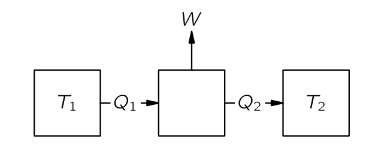{#fig-FLP_1_44_3 width=300}

예를 들어, 온도 $T_1$ 인 보일러가 있는 열 엔진을 구축한다고 가정하자. 보일러로부터 $Q_1$ 의 열을 받은 증기 기관은 일 $W$ 를 수행한 뒤, 다른 온도 $T_2$ 의 복수기(condensor) 에 열 $Q_2$ 를 전달한다. 카르노는 열역학 제 1 법칙을 알지 못했기 때문에 열의 양을 말하지 않았으며, 당시 칼로리 이론의  결론인 $Q_2=Q_1$ 를 사용하지 않았다. 열역학 제 1법칙에 따라

$$
Q_2=Q_1 − W
$$ {#eq-FLP_1_44_3}

이다. 만약 물이 응축된 후 보일러로 다시 펌프되는 일종의 순환 과정이 있다면, 우리는 일정량의 물이 순환하는 동안 각 순환 과정에서 열 $Q_1$ 이 흡수되고 $W$ 만큼의 일을 한다고 할 수 있다.

이제 우리는 또 다른 엔진을 제작하고, 온도 $T_1$ 에서 동일한 양의 열이 전달되는 동안 복수기의 온도를 $T_2$ 에 유지한 채 더 많은 일을 할 수 있는지 확인해보자. 우리는 보일러에서 $Q_1$ 과 동일한 양의 열을 사용할 것이며, 증기 기관보다 많은 일을 얻도록  노력할 것이다. 여기에 알코올과 같은 다른 액체를 사용할 수도 있다.

 

### I.44-3 가역 기관

#### **가역 기관**

이제 우리는 기관을 분석해보자. 기관이 마찰이 발생하는 장치를 포함하면 무언가를 잃게 되기 때문에 가장 좋은 기관은 마찰이 없는 기관이다. 그렇다면 에너지 보존을 연구했을 때와 동일하게 완전히 마찰이 없는 기관을 알아본다.

우리는 또한 마찰 없는 운동과 유사한 “마찰 없는” 열 전달을 고려해야 한다. 만약 뜨거운 물체와 차가운 물체를 접촉시켜 열이 전달된다면, 두 물체의 온도의 아주 작은 변화만으로는 그 열이 역방향으로 흐르게 할 수 없다. 하지만 마찰이 거의 없는 기계의 경우라면 작은 힘으로 한쪽으로 밀면 그 방향으로 가고, 작은 힘으로 반대 방향으로 밀면 반대 방향으로 간다. 우리는 마찰이 없는 역학적 운동과 유사한, **아주 작은 변화만으로 방향을 역전시킬수 있는 열 전달** 을 찾아야 한다. 온도가 다르다면 이는 불가능하지만 열이 본질적으로 동일한 온도의 두 물체 사이에 항상 흐르도록 하고, 원하는 방향으로 흐르게 하기 위해 무한히 미미한 차이만으로 흐르도록 한다면 이 흐름을 **가역적(reversible)** 이라고 한다. 왼쪽에 있는 물체를 약간 가열하면 열이 오른쪽으로 흐르고, 약간 냉각하면 열이 왼쪽으로 흐른다. 따라서 이상적인 기관은 이른바 **가역기관 (reversible engine)** 이며, 가역기관에서는 모든 과정이 무한히 작은 변화를 통해 엔진을 반대 방향으로 만들 수 있기 때문에 가역적이다. 즉, 기계의 어느 곳에도 눈에 띄는 마찰이 없어야 하며, 기계의 어느 곳에도 저장소의 열이나 보일러의 불꽃이 확실히 더 차갑거나 따뜻한 무언가와 직접 접촉해서는 안된다.

#### **카르노 순환**

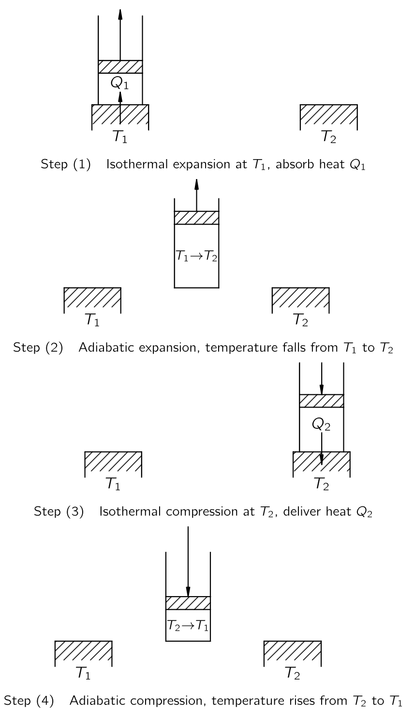{#fig-FLP_1_44_5 width=400}

이제 모든 과정이 가역적인 이상적인 기관을 생각하자. 그러한 것이 원칙적으로 가능함을 보여주기 위해, 우리는 실용적일 수도 있고 아닐 수도 있지만 최소한 카르노의 생각으로는 가역적인 기관의 사이클을 알아보자. 마찰 없는 피스톤이 장착된 실린더에 기체가 있다고 하자. 꼭 이상기체일 필요는 없다. 이 유체는 반드시 기체일 필요도 없지만, 일단 이상기체라고 하자. 또한 온도가 $T_1$ 과 $T_2$ 인 두 거대한 히트 패드가 있다고 하자. 여기서 $T_1 > T_2$ 라고 하자.

**Step (1) 등온팽창** : $T_1$ 의 히트 패드와 접촉하는 동안 기체는 가열되며 팽창한다. 열이 기체로 흐르는 동안 피스톤을 매우 천천히 빼면서, 기체의 온도가 $T_1$ 차이가 많이 나지 않도록 하자. 피스톤을 너무 빨리 빼면 기체의 온도가 $T_1$ 이하로 너무 낮아지면서 비가역적이 되지만, 충분히 천천히 빼면 가스 온도는 $T_1$ 에서 크게 벗어나지 않을 것이다. 반면에, 피스톤을 천천히 밀면 온도가 $T_1$ 보다 아주 조금(infinitesimally) 높아지며, 열이 뒤로 쏟아진다. 등온 팽창이 충분히 천천히 그리고 부드럽게 수행될 경우, 가역적인 과정임을 확인한다.

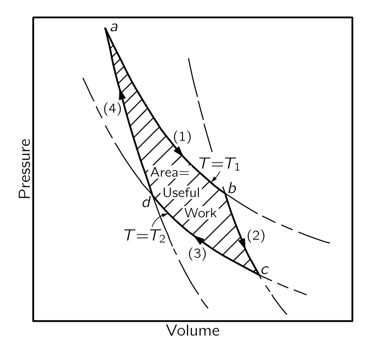{#fig-FLP_1_44_6 width=330}

현재 진행되는 것을 이해하기 위해 기체의 부피에 대한 압력 그래프(@fig-FLP_1_44_6) 를 사용한다. 기체가 팽창하면서 압력이 낮아진다. $(1)$-곡선은 온도가 $T_1$ 으로 고정될 경우 압력과 부피가 어떻게 변하는지를 보여준다. 이상기체의 경우 $PV=Nk_BT_1$ 이다. 등온팽창은 $b$ 지점까지, 즉 부피가 $V_b$ 가 될 때까지 진행된다. 동시에, 열 $Q_1$ 이 열저장소에서 기체로 흐르게 해야 하며, 기체가 열저장소와 접촉하지 않고 팽창하면 냉각된다. 

**Step (2) 단열 팽창** : $b$ 지점에서 등온 팽창을 완료하고, 실린더를 열저장소에서 떨어트리고 팽창을 계속한다. 이번에는 실린더에 어떤 열도 흐르지 못하도록 한다. 이 팽창 역시 충분히 천천히 수행하므로 가역적이라고 볼 수 있으며, 또한 마찰이 없다고 가정한다. 실린더에 열이 들어오지 않으므로 기체는 계속 팽창하고 온도가 낮아진다. $(2)$-곡선을 따라 온도가 $T_2$ 까지 내려가도록 하고, 그 지점은 $c$ 라고 하자. 열을 추가되지 않는 팽창을 **단열 팽창(adiabatic expansion)** 이라고 한다. 이상 기체의 경우, 우리는 이미 $(2)$-곡선이 $PV^\gamma = \text{const.}$ 형태이며, 여기서 $\gamma$ 는 1 보다 큰 상수임을 안다. 따라서 단열곡선은 등온곡선보다 더 음으로 가파른 기울기를 가진다. 실린더가 이제 온도 $T_2$ 에 도달했으므로, 온도 $T_2$ 의 히트 패드에 올려도 비가역적인 변화는 없다. 

**Step (3) 등온 압축** : 기체가 $T_2$ 의 열저장소과 접촉하는 동안, 표시된 $(3)$-곡선을 따라 천천히 압축한다.실린더가 열저장소와 접촉하고 있기 때문에 온도가 상승하지 않으며, 온도 $T_2$ 에서 열 $Q_2$ 가 실린더에서 열저장소로 흐른다. $(3)$-곡선을 따라 등온으로 $d$ 점까지 압축한다.

**Step (4) 단열 압축** : 온도 $T_2$ 에서 열패드와 실린더를 분리하고 열이 전혀 흐르지 않도록 추가로 압축한다. 온도가 상승하면서, 압력은 $(4)$-곡선을 따른다. 모든 단계를 제대로 수행하면, 시작한 지점인 $T_1$ 온도의 $a$ 지점으로 돌아가 사이클을 반복할 수 있다.

우리는 한 사이클 동안 온도 $T_1$ 에서 $Q_1$ 을 넣고 온도 $T_2$ 에서 $Q_2$ 를 제거했음을 확인할 수 있다. 핵심은 이 사이클이 가역적이라는 점이며, 따라서 우리는 모든 단계를 반대 방향으로 표현할 수 있다. 즉 반대방향으로 이 사이클을 수행할 수 있다. 한 방향으로 사이클을 돌면 우리가 기체에 일을 해야 하지만 반대 방향으로 돌면 기체가 우리에게 일한다.

전체 일이 얼마인지는 $W= \int P\,dV$ 로 계산 할 수 있다. 따라서 번호의 곡선의 아래의 면적은 해당 단계에서 기체에 수행되거나 기체에 의해 수행된 일이다. 수행된 순 일의 양은 그림의 음영 영역임을 쉽게 알 수 있다.

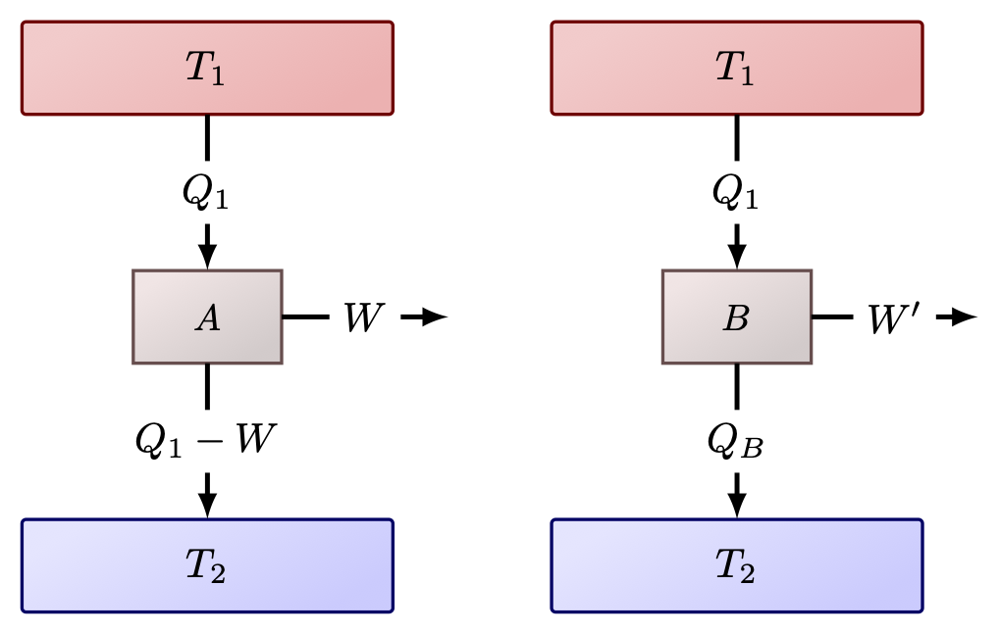{#fig-FLP_two_reversible_engines width=330}

이제 가역 기계가 가능하다는 것을 보였으므로 다른 가역 기관도 가능하다고 가정한다. 가역기관 $A$ 가 $T_1$ 에서 $Q_1$ 을 받아 $W$ 만큼의 일을 하고 $T_2$ 에서 약간의 열을 전달한다고 가정한다. 이제 가역 여부와 관계없이 $T_1$ 에서 동일한 양의 열 $Q_1$ 을 받아들이고, 낮은 온도 $T_2$ 에서 버리도록 설계된 다른 (가역기관을 가정하지 않는) $B$ 기관을 생각하자. $B$ 가 $W'$ 만큼의 일을 한다면 우리는 $W' \le W$ 임을 보일 수 있다. 즉 어떤 기관도 가역기관보다 더 많은 일을 할 수 없다. 이제 $W' > W$ 라고 가정하고  @fig-FLP_1_44_7 와 같이 두 기관을 결합하자. 그렇다면 $T_1$ 열저장소에서 열 $Q_1$ 을 얻어, $B$ 기관을  사용하면 $W'$ 만큼의 일을 수행하고 $T_2$ 의 열저장소에 열을 전달할 수 있다. 여기서 $W'$ 의 일을 저장할 수 있다. 이 중 일부인 $W$ 를 사용하고, 나머지인 $W'−W$ 를 유용한 작업을 위해 저장 할 수 있다. 엔진 $A$ 는 가역엔진이므로 $W$ 를 사용하여 $A$ 를 역방향으로 구동할 수 있다. $T_2$ 의 열저장소에서 일부 열을 흡수하고 $T_1$ 열저장소에 $Q_1$ 만큼의 열을 $T_1$ 열저장소에 전달한다. 이 이중 사이클의 최종 결과는 모든 것을 이전대로 되돌리게 되고, $W'−W$ 만큼의 일을 더 수행할 수 있는 것이다. 우리가 해야 할 일은 $T_2$ 열저장소에서 에너지를 추출하는 것 뿐이다. 우리는 $T_1$ 열저장소에 $Q_1$ 을 복원하도록 했다. 이로인해 그 열저장소는 작아서 $A+B$ 가 결합된 기계 내부에 있을 수 있으며, 그 순효과는 $T_2$ 저장소에서 순열 $W'−W$ 를 추출하여 일로 전환하는 것이다. 하지만 카르노의 공리에 따르면 단일 온도에서 다른 변화 없이 열저장소에서 유용한 일을 얻는 것은 불가능하다. 절대로 불가능하다. 따라서 고온 $T_1$ 열저장소에서 일정량의 열을 흡수하여 $T_2$ 열저장소로 전달하는 엔진은 동일한 온도 조건에서 작동하는 가역 엔진보다 더 많은 작업을 수행할 수 없다.

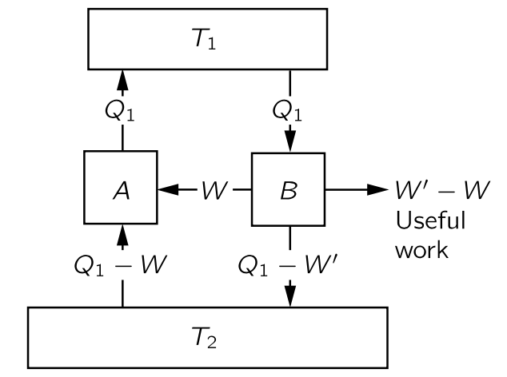{#fig-FLP_1_44_7 width=330}

이제 $B$ 기관도 가역적이라고 가정하면 당연히 $W'$ 가 $W$ 보다 크지 않을 뿐만 아니라, 뒤집어 $W$ 가 $W'$ 보다 클 수 없음을 증명할 수 있다. 따라서 두 기관이 가역적이라면 두 기관 모두 동일한 양의 작업을 수행해야 하며, 따라서 우리는 카르노의 위대한 결론에 도달한다. **온도 $T_1$ 에서 일정량의 열을 흡수하고 다른 온도 $T_2$ 에서 열을 방출하는 가역기관은 설계 방식과 무관하게 할 수 있는 일은 동일하다.** 이것은 우주의 성질이며, 특정 기관의 성질이 아니다.

만약 우리가 $T_1$ 열저장소에서 $Q_1$ 을 흡수하고 $T_2$ 열저장소에 열을 전달할 때 얻는 일을 결정하는 법칙이 무엇인지 알 수 있다면, 이 양은 물질과 무관하게 보편적이다. 물론 특정 물질의 특성을 알면, 우리는 그것을 해결한 뒤 모든 다른 물질이 가역기관에서 동일한 양의 일을 해야 한다고 말할 수 있다. 그것이 핵심 아이디어이며, 예를 들어 고무줄을 가열할 때 수축하는 정도와 수축을 허용했을 때 냉각되는 정도 사이의 관계를 찾을 수 있는 단서이다. 그 고무줄을 가역 기계에 넣고, 그것을 뒤집을 수 있는 사이클을 돌게 만든다고 상상해 보라. 그 순 결과, 즉 수행된 일의 총량은 그 보편적인 함수이며, 물체과 무관한 위대한 함수이다. 따라서 우리는 물체의 특성이 특정한 방식으로 제한되어야 함을 알 수 있다; 사람은 가역 사이클 동안에 허용되는 최대 일을 초과하여 생산할 수 있는 물체를 발명할 수 없다. 이 원리와 이 제한은 열역학에서 나오는 유일한 실제 규칙이다.

 

### I.44-4 이상적인 엔진의 효율

이제 $Q_1$, $T_1$, $T_2$ 의 함수로서 일 $W$ 를 결정하는 법칙을 찾아보자. $W$ 가 $Q_1$ 에 비례한다는 것은 명백하다. 두 개의 가역 엔진이 병렬로 작동하고, 두 엔진이 모두 이중 엔진인 경우, 그 조합도 가역 엔진다. 각각이 열 $Q_1$ 을 흡수한다면, 둘이 합쳐 $2Q_1$ 을 흡수하고 일은 $2W$ 이다. 따라서 $W$ 가 $Q_1$ 에 비례한다는 것은 이상하지 않다.

이제 다음 중요한 단계는 보편적인 법칙을 찾는 것이다. 지금까지는 우리가 알고 있는 법칙을 가진 유일한 물질은 이상 기체이므로 이상기체를 포함한 가역 기관을 통해 알아보자. 특정한 실체를 전혀 사용하지 않고 순수하게 논리적인 논증으로 규칙을 얻는 것도 가능하며 이것은 물리학에서 매우 아름다운 추론 중 하나인데 잠시 후 등장한다. 하지만 먼저 이상기쳬를 사용하여 직접 계산하는 덜 추상적이고 간단한 방법을 우선 사용하겠다.

#### **이상기체 가역엔진**

$Q_1$ 과 $Q_2$ 는 등온 팽창 또는 수축 중에 열저장소와 교환되는 열로 $W=Q_1−Q_2$ 이다. @fig-FLP_1_44_6 의 $(1)$-곡선에서 $a$ 에서 $b$ 까지 진행하는 동안 온도 $T_1$ 의 열저장소에서 흡수되는 열 $Q_1$ 은 얼마인가? 이상기체의 경우 각 분자는 온도에만 의존하는 에너지를 가지고 있으며, 등온팽창 과정이므로 온도와 분자 수가 동일하기 때문에 내부 에너지도 동일하다. $U$ 에는 변화가 없으며, 기체에 수행되는 일은 

$$
W=\int_a^b p\, dV,
$$ 

이다. 팽창 중에는 열저장소에서 $Q_1$ 만큼의 에너지를 취한다. 팽창 중에는 

$$
pV=Nk_BT_1,\qquad \text{or}\qquad p=\dfrac{Nk_BT_1}{V}
$$

이며 이로부터

$$
Q_1=\int_a^b p\, dV=\int_a^b Nk_B T_1 \dfrac{dV}{V} = Nk_BT_1 \ln\dfrac{V_b}{V_a}
$$ {#eq-FLP_1_44_4}

이다. 위 식의 $Q_1$ 이 $T_1$ 열저장소에서 얻은 열이며 마찬가지로 $T_2$ 에서의 압축에 대해 @fig-FLP_1_44_6 의 $(3)$-곡선 을 보면 $T_2$ 의 열저장소 에 전달되는 열 $Q_2$ 는

$$
Q_2=Nk_B T_2 \ln\dfrac{V_c}{V_d}
$${#eq-FLP_1_44_5}

이다. 이제 $V_c/V_d$ 와 $V_b/V_a$ 사이의 관계만 찾으면 된다. 우리는 $(2)$-곡선이 $b$ 에서 $c$ 까지의 단열 팽창이며, 이때 $pV^\gamma$ 가 상수임을 안다. $pV=Nk_BT$ 이므로, $(pV)V^{\gamma−1}$ 역시 상수이며, $T$ 와 $V$ 를 기준으로 $TV^{\gamma−1}$ 역시 상수이다. 즉

$$
T_1V^{\gamma−1}_b=T_2V^{\gamma −1}_c
$$ {#eq-FLP_1_44_6}

이다. $(4)$-곡선 역시 에서 $d$ 에서 $a$ 까지의 단열압축이며 

$$
T_1V^{\gamma−1}_a=T_2V^{\gamma −1}_d
$$ {#eq-FLP_1_44_6a}

이다. 이로부터 $V_b/V_a =V_c/V_d$ 임을 안다. 따라서 다음이 성립한다.

$$
\dfrac{Q_1}{T_1}=\dfrac{Q_2}{T_2}
$$ {#eq-FLP_1_44_7}

이것은 우리가 찾고 있던 관계이다. **이상기체 기관서 증명되었지만, 우리는 그것이 모든 가역 기관에 대해서도 동일하다는 것을 안다.**

#### **세개의 가역기관**

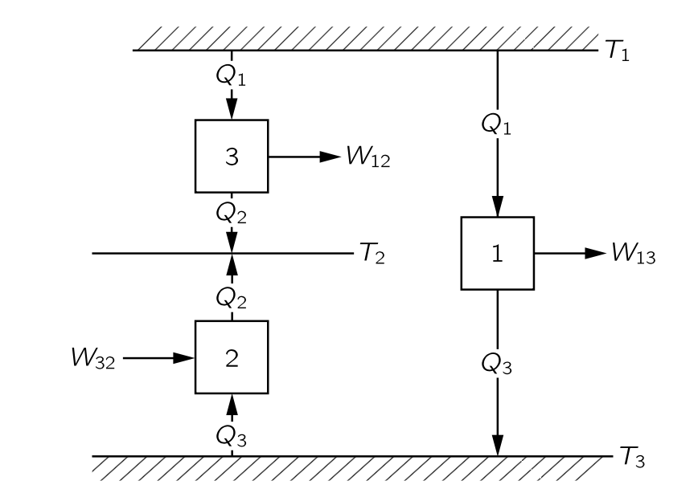{#fig-FLP_1_44_8 width=400}

이제 우리는 논리적 논증을 통해 물질의 특성과 무관한 이 보편적인 법칙을 어떻게 얻을 수 있는지 살펴보자. 세 개의 기관과 세 개의 온도 $T_1,\,T_2,\,T_3$ 가 있다고 가정해 보자. 

- 기관 1은 온도 $T_1$ 에서 열 $Q_1$ 을 흡수하고 일 $W_{13}$ 을 수행하도록 한 뒤, $T_3$ 열저장소에 열 $Q_3$ 을 전달한다고 하자. (@fig-FLP_1_44_8). 
- 기관 2는 $T_2$ 와 $T_3$ 사이에서 역방향으로 작동한다고 하자. 기관 2는 기관 1 에서 배출하는 열과 동일한 양의 $Q_3$ 를 $T_3$ 열저장소로부터 흡수하고 $T_2$ 의 열저장소에 열 $Q_2$ 를 전달한다. 기관이 역방향으로 작동하고 있기 때문에 음의 일인 $W_{32}$ 를 해야 한다. 

첫 번째 기계가 사이클을 통과할 때, 열 $Q_1$ 을 흡수하고 온도 $T_3$ 에서 $Q_3$ 를 전달한다. 그 다음 두 번째 기계는 온도 $T_3$ 에서 동일한 열 $Q_3$ 를 열저장소에서 받아 온도 $T_2$ 의 열저장소에 전달한다. 따라서 두 기계가 동시에 수행할 경우 최종 결과는 $T_1$ 에서 열 $Q_1$ 을 받아 $T_2$ 에 $Q_2$ 를 전달하는 것이다. 따라서 두 기계는 $T_1$ 에서 $Q_1$ 을 흡수하고 $W_{12}$ 의 일을 한 후 $T_2$ 에 열 $Q_2$ 를 전달하는 세 번째 기계와 동등하다. $W_{12} = W_{13}−W_{32}$ 이며, 열역학 제 1 법칙으로부터 

$$
W_{13}−W_{32}=(Q_1−Q_3)−(Q_2−Q_3)=Q_1−Q_2=W_{12}
$$ {#eq-FLP_1_44_8}

이다. 우리는 이제 엔진의 효율과 관련된 법칙을 얻을 수 있다. 왜냐하면 엔진의 효율이 온도 $T_1$ 과 $T_3$ 사이, $T_2$ 와 $T_3$ 사이, 그리고 $T_1$ 과 $T_2$ 사이에 어떤 형태의 관계가 분명히 존재하기 때문이다.

우리는 매우 명확하게 다음과 같이 주장 할 수 있다: $T_1$ 에서 흡수된 열과 $T_2$ 에 전달되는 열의 관련성을 다른 온도 $T_3$ 에서 전달된 열을 통해 찾을 수 있다. 따라서 표준 온도를 도입하고 그 표준 온도로 모든 것을 분석하면 엔진의 모든 특성을 얻을 수 있다. 다시 말해, 특정 온도 $T$ 와 특정 임의의 표준 온도 사이를 구동하는 엔진의 효율을 알면, 다른 온도 차이에 대한 효율을 알 수 있다. 여기서는 가역기관을 가정하기 때문에, 초기 온도에서 표준 온도까지 내려갔다가 다시 최종 온도로 올라갈 수 있다. 표준 온도를 임의로 1도 로 정하고, 이 표준 온도에서 전달되는 열을 $Q_S$ 라고 표기하자. 다시 말해, 가역 엔진이 온도 $T$ 에서 열 $Q$ 를 흡수하면, 단위 온도에서 열 $Q_S$ 를 전달한다. 만약 한 기관이 $T_1$ 에서 열 $Q_1$ 을 흡수하고 온도가 1도에서 열 $Q_S$ 를 전달하고, 다른 기관이 온도 $T_2$ 에서 열 $Q_2$ 을 흡수하고 $Q_S$ 를 1도에 전달한다면, 온도 $T_1$ 에서 열 $Q_1$ 을 흡수하는 기관이 $T_1$ 과 $T_2$ 사이에서 동작할 경우 경우 $T_2$ 에 열 $Q_2$ 를 전달한다는 의미이다. 이는 세 온도에서 동작하는 기관에서 이미 증명한 바와 같다. 따라서 우리가 실제로 해야 할 일은 온도 $T_1$ 에서 $Q_1$ 에 어느 정도 열을 넣어야 단위 온도에서 일정량의 열 $Q_S$ 를 전달할 수 있는가이다. 이 값만 찾으면 우리는 모든 것을 알게된다. 열 $Q$ 는 물론 온도 $T$ 의 함수이며, 온도가 상승함에 따라 열이 증가해야 함을 쉽게 알 수 있다. 기관을 역방향으로 작동시키고 더 높은 온도에서 열을 전달하려면 일이 필요함을 알고 있기 때문이다. 또한 열 $Q_1$ 이 $Q_S$ 에 비례해야 한다는 것을 쉽게 알 수 있다. 따라서 위대한 법칙은 다음과 비슷한 무엇인가이다: **온도 $T$ 도에서 작동하는 엔진으로부터 1도 에서 전달되는 열 $Q_S$ 에 대해, 흡수되는 열 $Q$ 는 온도에 대한 증가함수와 $Q_S$ 의 곱이다.**

$$
Q=Q_Sf(T).
$$ {#eq-FLP_1_44_9}

 

### I.44-5 열역학적 온도 {#sec-FLP_1_44_5}

이제 우리가 익숙한 수은 온도 척도 대신 새로운 척도로 온도를 정의한다. 이제 우리는 특정 물질과 무관하게 온도를 정의 할 수 있다. 앞서 물질과 무관한 가역 기관의 어떤 장치를 사용하느냐에 따라 달라지지 않는 함수 $f(T)$ 를 사용할 수 있다. 앞서 보았듯이 가역 엔진들의 효율은 작동 물질에 의존하지 않기 때문이다. $f(T)$ 는 온도에 대한 단조증가함수이므로 해당 함수 자체를 표준 1도 온도 단위로 측정한 온도로 정의한다.

$$
Q=ST.
$$ {#eq-FLP_1_44_10} 

여기서

$$
Q_S=S⋅1^\circ
$$ {#eq-FLP_1_44_11}

이다. 즉 물체의 온도와 단위 온도 사이에서 작동하는 가역 엔진이 흡수하는 열의 양을 알아내어 물체가 얼마나 뜨거운지 판단할 수 있음을 의미한다. 보일러에서 1도의 복수기(condensor) 에서 전달되는 열보다 7배 더 많은 열이 발생하면, 보일러의 온도는 7도라고 한다. 즉 서로 다른 온도에서 흡수되는 열의 양을 측정함으로써 우리는 온도를 결정한다. 이와 같이 정의된 온도는 **절대 열역학 온도 (absolute thermodynamic temperature)** 라고 하며, 물질과는 무관하다. 우리는 이제부터 이 정의만을 사용한다.

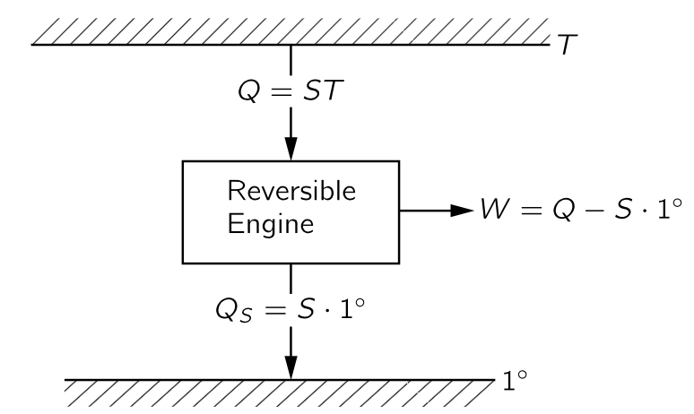{#fig-FLP_1_44_9 width=300}

이제 우리는 두 기관이 $T_1$ 과 $1^\circ$ 사이에서 작동하고, 다른 하나는 $T_2$ 와 $1^\circ$ 도 사이에서 작동하며, 단위 온도에서 동일한 열을 전달한다면, 다음의 관계를 만족해야 함을 안다.

$$
\dfrac{Q_1}{T_1}=S=\dfrac{Q_2}{T_2}
$$ {#eq-FLP_1_44_12}

하지만 이는 $T_1$ 과 $T_2$ 사이에서 하나의 기관이 작동한다면 최종 결과는 엔진이 온도 $T_1$ 에서 에너지 $Q_1$ 을 흡수하고 온도 $T_2$ 에서 열 $Q_2$ 를 전달하면 $Q_1/T_1=Q_2/T_2$ 라는 의미이다. 엔진이 가역적이라면 이 관계를 따라야 합한다. 이것이 열역학 우주의 중심이다.

이것이 열역학의 전부라면, 왜 그렇게 어려운 과목으로 여겨지는가? 특정 물질의 특정 질량을 포함하는 문제를 수행할 때, 물질의 어느 순간이든 그 상태는 그 온도와 부피를 이용하여 설명 할 수 있다. 우리가 물질의 온도와 부피를 알고, 압력이 온도와 부피의 어떤 함수임을 알면 내부 에너지를 알 수 있다. 반면에 누군가는 온도와 압력으로 내부에너지를 포함여 물질의 성질을 설명한다. 이렇게 모두가 다른 접근 방식을 사용하기 때문에 열역학을 어렵다. 우리가 일단 변수를 결정하고 그것을 고수한다면, 꽤 쉬울 것이다.

$F=ma$ 가 역학에서 우주의 중심이며 여기서부터 역학이 진행되는 것처럼, 위의 원리가 열역학서 우주의 중심이다. 이 열역학 원리로부터 어떤 결론들을 내릴 수 있을까?

이제 시작해보자. 우선 에너지 보존 법칙과 $Q_2$ 와 $Q_1$ 의 열을 연결하는 이 법칙을 결합하면, 가역 엔진의 효율을 쉽게 얻을 수 있다. 열역학 제 1 법칙에 의해 $W=Q_1−Q_2$ 이다. 우리의 새로운 원칙에 따르면,

$$
Q_2=\dfrac{T_2}{T_1}Q_1,
$$

이며 따라서 일은

$$
W=Q_1 \left(1−\dfrac{T_2}{T_1}\right)=Q_1 \dfrac{T_1−T_2}{T_1}
$${#eq-FLP_1_44_13}

이며, 위 식은 기관의 효율을 말한다. 많은 열로부터 얻을 수 있는 일의 양. 기관의 효율은 기관이 작동하는 온도 차이를 더 높은 온도로 나눈 값에 비례한다:

$$
\text{효율}=\dfrac{W}{Q_1}=\dfrac{T_1−T_2}{T_1}.
$$ {#eq-FLP_1_$4_14}

효율은 1보다 클 수 없으며 절대 온도는 0 보다 작을 수 없다. $T_2$ 가 양수여야 하므로 효율은 항상 1보다 적다. 그것이 우리의 첫 번째 결론이다.

 

### I.44-6 엔트로피 {#sec-FLP_1_44_6}

@eq-FLP_1_44_7 또는 @eq-FLP_1_44_12 은 특별한 방식으로 해석될 수 있다. 가역기관을 다룰 때, 온도 $T_1$ 에서의 열 $Q_1$ 은 $Q_1/T_1=Q_2/T_2$ 일 경우 $T_2$ 에서의 $Q_2$ 와 “동등”하며, 이는 하나가 흡수될 때 다른 하나가 전달된다는 의미이다. 가역 과정에서 $Q/T$ 는 흡수되는 만큼 방출되며, $Q/T$ 는 더해지거나 덜해지지 않는다. 이 $Q/T$ 를 **엔트로피라(엔트로피)** 라고 하며, 우리는 **가역 순환에서 엔트로피는 변하지 않는다** 고 말한다.T가 $1^\circ$ 이면 엔트로피는 $Q_S/1^\circ$ 이며, 우리가 표시한 바와 같이 $Q_S/1^\circ=S$ 이다. 실제로 $S$ 는 일반적으로 엔트로피를 표기하는 문자이며, 이는 $1^\circ$‐열저장소에 전달되는 열(우리가 $Q_S$라고 부르는)과 수치적으로 동일하다.

흥미로운 점은 온도와 부피의 함수인 압력과 내부 에너지 외에도, 역시 조건의 함수인 물질의 엔트로피라는 양을 발견했다는 것이다. 이제 엔트로피를 어떻게 계산하는지, 엔트로피가 **조건의 함수** 라고 하는 것이 무슨 의미인지 알아보자. 다른 두 조건의 시스템을 생각하자. 우리가 앞서 단열 및 등온 팽창을 수행했을 때와 같습니다. 참고로, 열 기관이 단 두 개의 열저장소만 가질 필요는 없으며 많은 열저장소를 가질 수 있다. $p$-$V$ 다이어그램 상에서 여기저기 움직일 수 있고, 한 조건에서 다른 조건으로 이동할 수 있다. 다시 말해, 우리는 기체가 특정 조건 $a$ 에서 다른 조건 $b$ 로 이동할 수 있다. 단 가역적이어야 한다. 이제 $a$ 에서 $b$ 까지의 경로 전체에 서로 다른 온도의 작은 열저장소가 존재한다고 가정하면, 각 작은 단계에서 물질에서 제거되는 열 $dQ$ 가 경로상의 각 지점에 해당하는 온도로 각 열저장소에 전달된다. 이제 가역 열기관을 사용하여 이 모든 열저장소를 단위 온도의 하나의 열저장소에 연결한다. 우리가 물질을 $a$ 에서 $b$ 로 이동시키면 모든 열저장소를 원래 상태로 되돌릴 것이다. 온도 $T$ 에서 물질로부터 흡수된 모든 열 $dQ$ 는 이제 가역 기계에 의해 변환되었으며, 다음과 같이 단위 온도에서 일정량의 엔트로피 $dS$ 가 전달된다.

$$
dS=\dfrac{dQ}{T}
$$ {#eq-FLP_1_44_15}

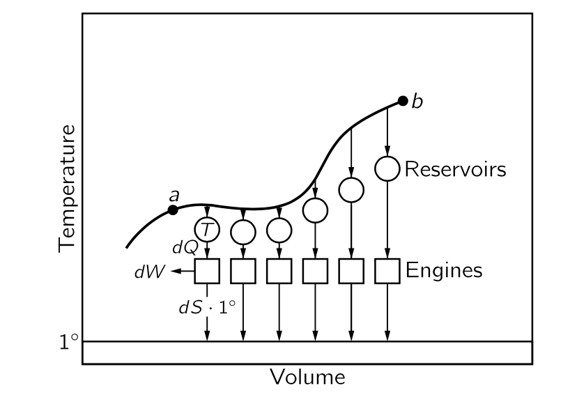{#fig-FLP_1_44_10 width=400}

그렇다면 전달된 엔트로피의 총량은

$$
S_b−S_a=\int_a^b \dfrac{dQ}{T}
$$ {#eq-FLP_1_44_16}

이다. 문제는 엔트로피 차이가 택한 경로에 따라 달라지는가 하는 것이다. $a$ 에서 $b$ 로 가는 경로는 무한하다.카르노 순환에서는 @fig-FLP_1_44_6 의 $a$ 에서 $c$ 까지 등온 팽창-단열 팽창의 경로를 밟았지만 단열 팽창-등온 팽창의 경로를 따를 수도 있다. 따라서 질문은 그림 @eq-FLP_1_44_10 에서 $a$ 에서 $b$ 로의 엔트로피 변화가 경로에 무관한지 여부이다. 답은 동일하다 이다. 한 경로로 전진하고 다른 경로로 후진한하는 순환에서 동일해야만 가역 기관, 즉 단위 온도에서 열저장소에 열이 손실되지 않을 것이기 때문이다. 완전히 가역적인 순환에서는 단위 온도에서 열저장소에서 열을 취할 필요가 없으며, 따라서 $a$ 에서 $b$ 로 이동하기 위해 필요한 엔트로피는 한 경로에서 다른 경로와 동일하다. 그것은 경로와 무관하며, 오직 시작과 종료 지점에만 의존한다. 따라서 우리는 물질의 엔트로피라고 부르는 특정 함수가 존재한다고 말할 수 있다.

물질이 가역 경로를 따라 이동함에 따라 단위 온도에서 거부된 열을 기준으로 엔트로피 변화를 계산할 경우, 엔트로피의 성질을 갖는 함수 $S(V,T)$ 를 아래와 같이 구할 수 있다.

$$
\Delta S=\int \dfrac{dQ}{T}.
$$ {#eq-FLP_1_44_17}

여기서 $dQ$ 는 온도 $T$ 에서 물질에서 제거되는 열을 의미한다. 전체 엔트로피 변화는 시작조건과 최종조건에서의 엔트로피의 변화이다.

$$
\Delta S=S(V_b,T_b)−S(V_a,T_a)=\int_a^b \dfrac{dQ}{T}.
$$ {#eq-FLP_1_44_18}

이 식은 엔트로피의 정의가 아닌 두 조건 사이의 엔트로피 차이만을 정의한다. 어떤 특정 조건에 대한 엔트로피를 계산 할 수 있다면 우리는 $S$ 를 절대적으로 정의할 수 있다.

오랫동안 절대 엔트로피는 아무 의미도 없으며 차이만 정의될 수 있다고 믿어졌지만, 결국 네른스트는 열정리-현재는   **열역학 제 3 법칙**이라고 불리는-를 제안했다. 네른스트 공리는 단순히 절대 영도에서 모든 물체의 엔트로피가 0 이라고 명시합니다. 우리는 $T$ 와 $V$ 의 한 경우, 즉 $T=0$ 이며 $S=0$ 인 경우를 알고 있으며, 따라서 우리는 다른 모든 지점에서 엔트로피를 정할 수 있다.

이상기체의 엔트로피를 계산해 보자. 등온 팽창에서는 $\int dQ/T = Q/T$ 이며 따라서 엔트로피의 변화는 @eq-FLP_1_44_4 로부터 

$$
S(V_a,T)−S(V_b,T)=Nk_B \ln(V_a/V_b),
$$

이다. 즉 $S(V,T)$ 는 $Nk_B \ln V$ 에 어떤 $T$ 의 함수를 더한 것이다. 이 함수는 어떻게 알 수 있을까? 우리는 가역 단열 팽창의 경우 열이 교환되지 않는다는 것을 알고 있으며 이 경우 $TV^{\gamma−1}$ 은 상수이다. 이로부터

$$
S(V,T)=Nk_B \left[\ln V+\dfrac{1}{\gamma−1} \ln T\right] + a
$$

을 얻는다. 여기서 $a$ 는 $V$ 와 $T$ 모두와 독립적인 상수로 화학상수 라고 한다. $a$ 는 기체에 따라 달라지며, $\int dQ/T$ 를 통해 기체를 $0\, \text{K}$ 에서 고체(또는 헬륨의 경우 액체)로 만들 때까지 냉각 및 응축되는 열을 측정하고 열역학 제 3법칙을 이용하여 실험적으로 결정할 수 있다. 또한 플랑크의 상수 및 양자역학을 이용하여 이론적으로도 결정할 수 있지만 여기서는 다루지 않겠다.

#### **가역순환과 엔트로피 보존**

$a$ 에서 $b$ 까지 가역 순환을 수행한다면물질의 엔트로피가 $S_b−S_a$ 만큼 변한다. 또한 엔트로피—1 $K$ 에서 전달되는 열—가 $dS=dQ/T$ 규칙에 따라 증가한다는 것을 안다. 여기서 $dQ$ 는 물질의 온도가 $T$ 일 때 우리가 물질에서 제거하는 열이다.

우리는 이미 가역 순환에서 총 엔트로피가 변하지 않는다는 것을 알고 있다. 이는 $T_1$ 에서 흡수되는 열 $Q_1$ 과 $T_2$ 에서 전달되는 열 $Q_2$ 에 의한 엔트로피 변화가 크기가 같고 방향이 반대임을 의미한다. 따라서 가역 순환에서는 열저장소를 포함한 모든 것의 엔트로피에 변화가 없습니다. 이 규칙은 에너지 보존법칙처럼 보일 수 있지만, 가역 순환에만 적용되며 비가역 순환을 포함하면 엔트로피 보존 법칙이 성립하지 않는다.

두 가지 예를 들어보겠다. 먼저, 마찰에 의해 온도 $T$ 에서 어떤 물체에 열 $Q$ 를 발생시킨다고 가정해보자. 엔트로피는 $Q/T$ 만큼 증가한다다. 열 $Q$ 는 일과 동일하므로, 전체 세계의 엔트로피가 $W/T$ 만큼 증가한다.

두번째 예는 다음과 같다. 높은 온도 $T_1$ 과 낮은 온도 $T_2$ 의 두 물체를 함께 배치하면, 일정량의 열이 $T_1$ $ 의 물체에서 낮은 온도 $T_2$ 의 물체로 자연스럽게 전달된다. 그렇다면 특정 열 $\Delta Q$ 가 $T_1$ 에서 $T_2$ 로 전달될 때, 뜨거운 물체의 엔트로피는 $\Delta Q/T_1$ 만큼 감소하며 차가운 물체의 엔트로피는 $\Delta Q/T_2$ 만큼 증가한다. 열은 물론 고온의 물체에서 저온의 물체로 흐르므로 $\Delta Q> 0$ 이고 따라서 엔트로피의 총합의 변화는 양수이다.

$$
\Delta S=\dfrac{\Delta Q}{T_2}−\dfrac{\Delta Q}{T_1}.
$$ {#eq-FLP_1_44_19}

따라서 다음 명제는 옳다.

::: {.callout-important icon="false"}

#### **열역학 제 2 법칙**

비가역적인 과정에서는 전 우주의 엔트로피가 증가한다. 가역 과정에서는 엔트로피가 일정하게 유지된다. 어떠한 과정도 절대적으로 가역적이지 않으므로 엔트로피틑 항상 증가한다. 가역적 과정은 엔트로피 증가를 최소화하는 이상적인 과정이다.

:::

#### **일반적인 열역학의 두 법칙의 이해**

열역학의 두 법칙은 종종 다음과 같이 기술된다:

&emsp; 제 1 법칙 : 우주의 에너지는 언제나 일정하다.

&emsp; 제 2 법칙:	우주의 엔트로피는 항상 증가한다.

위의 제2법칙에 대한 기술은 썩 좋지는 않다. 가역 순환에서 엔트로피가 동일하게 유지된다는 것을 말하지 않으며,엔트로피가 정확히 무엇인지도 명시하고 있지 않다. 단지 기억하기 좋을 뿐이다. 아래 표는 열역학의 두 법칙에 대한 파인만의 요약이다. 

#### **파인만이 정리한 열역학 법칙**

**제 1 법칙**:

$$
dQ+dW=dU.
$$

**제 2 법칙**:

(1) 열저장소에서 열을 취해 작업으로 전환하는 것뿐인 과정은 불가능하다.

(2) $T_1$ 에서 열 $Q_1$ 을 받아 $T_2$ 에서 열 $Q_2$ 를 전달하는 열 엔진은 가역 엔진에서 수행하는 일 $W$ 보다 더 많은 작업을 수행할 수 없으며 $W$ 는 다음과 같다.

$$
W=Q_1−Q_2=Q_1\left( \dfrac{T_1−T_2}{T_1}\right).
$$

**엔트로피의 정의** :

시스템의 엔트로피는 다음과 같이 정의된다.

&emsp;(a) 열 $\Delta Q$ 가 온도 $T$ 에서 시스템에 가역적으로 추가될 경우, $\Delta S=\Delta Q/T$ 이다.

&emsp;(b) **열역학 제 3 법칙** : $T=0$ 이면 $S=0$ 이다. 

가역 변화에서는 시스템의 모든 부분의 총 엔트로피가 변하지 않는다. 비가역적인 변화에서는 시스템의 전체 엔트로피가 항상 증가합니다.

 

## I.45 열역학의 양상 {#sec-FLP_1_45}

### I.45-1 내부 에너지 {#sec-FLP_1_45_1}

열역학은 같은 것을 설명하는 방법이 매우 다양하기 때문에 복잡하다. 기체의 거동을 설명할 때 압력을 온도와 부피의 함수로 놓거나, 혹은 부피를 온도와 압력의 함수로 놓을 수 있다. 또는 내부 에너지 $U$ 를 온도와 부피의 함수로 정할 수도 있고 온도와 압력, 혹은 압력과 부피의 함수로 정할 수도 있다. 지난 장에서는 온도와 부피의 또 다른 함수인 엔트로피 $S$ 에 대해 알아보았다. 물론 이러한 변수들의 다른 함수들을 원하는 만큼 구성할 수 있습니다: $U−TS$ 는 온도와 부피의 함수이다. 따라서 우리는 다양한 양의 수가 많이 있으며, 이는 다양한 변수 조합의 함수가 될 수 있습니다.

이 장에서는 주제를 간단하게 유지하기 위해, 시작 단계에서는 온도와 부피를 독립 변수로 사용하기로 하자. 화학자들은 실험실에서 제어하기 편하기 때문에 보통 온도와 압력을 변수로 사용한다. 이번 장에서는 우선 온도와 부피를 변수로 사용하고, 뒤에는 화학자의 변수 체계로 변환하는 방법을 알아보겠다.

첫째, 온도와 부피라는 독립 변수를 가진 계만을 고려한다. 둘째, 내부 에너지와 압력이라는 두 함수만 논한다. 다른 모든 함수는 이것들로부터 도출될 수 있으므로 논의할 필요가 없다. 이러한 제한으로 인해 열역학은 여전히 꽤 어려운 과목이지만, 그렇게 불가능한 것은 아니다!

이제 온도와 부피의 변화에 따른 내부 에너지 $U(T,V)$ 의 변화는 다음과 같이 표현 할 수 있다.

$$
\Delta U=\left(\dfrac{\partial U}{\partial T}\right)_V \Delta T +  \left(\dfrac{\partial U}{\partial V}\right)_T \Delta V.
$$ {#eq-FLP_1_45_2}

기체에 열 $\Delta Q$ 를 더했을 때 내부 에너지 변화 $\Delta U$ 는 다음과 같다는 것을 안다.

$$
\Delta U=\Delta Q−P\Delta V.
$$ {#eq-FLP_1_45_3}

@eq-FLP_1_45_2 와 @eq-FLP_1_45_3 을 비교하면 $P=−(\partial U/\partial V)_T$ 라고 생각할 수 있지만, 이는 옳지 않다. 올바른 관계를 얻기 위해, 먼저 부피를 일정하게 유지하면서($\Delta V=0$) 기체에 열 $\Delta Q$ 를 더한다면 @eq-FLP_1_45_3 으로부터 $\Delta U=\Delta Q$ 이며, @eq-FLP_1_45_2 로부터 $\Delta U=(\partial U/\partial T)_V \Delta T$ 이며, 따라서 $(\partial U/\partial T)_V = \Delta Q/\Delta T$ 라고 할 수 있다. $\Delta Q/\Delta T$ 는 부피를 일정하게 유지한 물질에 온도를 1도 변화시키는 데 필요한 열량으로, **정적 비열** 이라고 하며 기호 $C_V$ 로 표기한다. 즉

$$
C_V := \left(\dfrac{\partial U}{\partial T}\right)_V
$$ {#eq-FLP_1_45_4}

이다. 

이제 다시 기체에 열량 $\Delta Q$ 를 더하는데 $T$ 를 일정하게 유지하고 부피가 $\Delta V$ 만큼 변했다고 하자. 이미 아는 바와 같이, 가역 사이클에서 기체가 수행한 총 일은 $\Delta Q(\Delta T/T)$ 이며, 여기서 $\Delta Q$ 는 기체가 온도 $T$ 에서 $V$ 에서 $V+\Delta V$ 까지 등온 팽창하면서 가해지는 열에너지의 양이고, $T−\Delta T$ 는 기체가 사이클의 두 번째 구간에서 단열 팽창하면서 도달하는 최종 온도이다. 이제 우리는 이 작업이 그림에 있는 음영 영역으로도 제공된다는 것을 보여드리겠습니다. 45–1. 어떠한 상황에서도 가스가 수행하는 일은 ∫PdV이며, 가스가 팽창할 때는 양수이고 압축될 때는 음수입니다. 우리가 P를 플롯한다면 vs. V, P와 V의 변동은 특정 V의 값에 해당하는 P 값을 제공하는 곡선으로 표현됩니다. 부피가 한 값에서 다른 값으로 변함에 따라, 기체에 의해 수행되는 일(적분 ∫PdV)은 V의 초기값과 최종값을 연결하는 곡선 아래 면적입니다. 이 아이디어를 카르노 사이클에 적용하면, 사이클을 돌면서 가스가 수행한 일의 표시를 주의 깊게 보면, 가스가 수행한 순일은 그림에 표시된 음영 영역에 불과합니다. 45–1.

이제 우리는 음영 영역을 기하학적으로 평가하고자 합니다. 그림 45‐1에서 사용한 사이클은 이전 장에서 사용된 사이클과 달리, 이제 ΔT와 ΔQ가 무한히 작다고 가정합니다. 우리는 매우 가깝게 배열된 단열선과 등온선 사이를 작업하고 있으며, 그림 45‐1에 있는 무거운 선들에 의해 설명된 그림은 ΔT와 ΔQ의 증분이 0에 가까워짐에 따라 평행사변형에 근접합니다. 이 평행사변형의 면적은 단순히 ΔVΔP이며, 여기서 ΔV는 일정한 온도에서 기체에 에너지 ΔQ가 추가되는 부피의 변화이고, ΔP는 일정한 부피에서 온도가 ΔT에 의해 변하는 압력의 변화입니다. 그림 45–1의 음영 영역이 ΔVΔP로 주어짐을 쉽게 알 수 있으며, 이는 그림 45–2의 점선으로 둘러싸인 면적과 동일함을 인식함으로써, 그림 45–2의 점선으로 둘러싸인 면적과 동일하다는 점을 인식함으로써, ΔP와 ΔV로 둘러싸인 직사각형과는 동일 삼각형 영역의 덧셈 및 뺄셈에 의해서만 차이가 됩니다. 45–2.