 

## $\textrm{I}$.26 광학 : 최소 시간 원리 {#sec-FLP_1_26}

### $\textrm{I}$.26-1 빛 {#sec-FLP_1_26_1}

{#fig-FLP_spectrum_of_flight }

위와 같이 넓은 전자기파의 파장 영역에서 특별히 흥미로운 세가지 혹은 그 이상의 근사 영역이 존재한다.

- **기하 광학 영역** : 파장이 우리가 다루고자 하는 장비애 비해 매우 작고, 광자 에너지가 장비의 에너지 민감도에 비해 매우 작은 경우.
- **고전 전자기 복사 이론으로 설명하는 영역** : 파장이 우리가 다루고자 하는 장비의 크기와 비슷하고 광자 에너지가 매우 작은 경우.
- **광자 설명 영역** : 파장이 매우 작아 파동으로서의 성격을 무시할 수 있으며 광자 에너지가 장비의 민감도에 비해 매우 큰 경우.

여기서는 기하 광학 영역에 한정하여 다루며, 파장이나 빛의 입자성에 대해서는 당분간 잊기로 하자. 적절할 때에 설명할 것이다. 빛이란 무엇인가에 대해서도 묻지 않기로 하고 단지 관심이 있는 규모보다 큰 영역에서 어떻게 행동하는지에 대해서만 알아보기로 하자. 

기하 광학은 단지 근사이지만 기술적으로 매우 중요하고 역사적으로 흥미롭다. 다른 주제와는 다르게 역사적 맥락에서 설명하기로 한다. 이것이 어떤 물리학적 이론이나 아이디어의 발전에 대해 보여줄 수 있기 때문이다.

 

### $\textrm{I}$.26-2 반사와 굴절 {#sec-FLP_1_26_2}

#### **거울 면에서의 반사**

입사각과 반사각은 같다. 즉 $\sin \theta_i = \sin \theta_r$ 이다.

#### **굴절과 스넬의 법칙**

빛이 입사하는 매질과 굴절되는 빛 사이에 $n_i\sin \theta_i = n_r \sin \theta_r$ 의 관계가 성립할 때 $n_i$ 와 $n_r$ 을 각각 그 매질의 **굴절률 (reflective index)** 라고 한다. 이 때 굴절률은 물질의 고유한 성질이며 진공일 때 $1$ 이며 공기에서는 $1.003$, 물은 $1.33$ 정도이다. 

 

### $\textrm{I}$.26-3 페르마의 최소시간 원리 {#sec-FLP_1_26_3}

::: {.callout-important icon="false"}

#### **페르마의 최소시간의 원리**

빛이 두 지점 사이를 거칠 때 따르는 경로는 가장 짧은 시간이 걸리는 경로이다.

:::

페르마의 최소시간 원리로부터 스넬의 법칙을 유도 할 수 있으며 굴절률 $n$ 과 매질에서의 빛의 속도 $c_n$ 그리고 진공중에서의 빛의 속도 $c$ 사이에는 다음의 관계가 성립함을 안다.

$$
nc_n = c
$$ {#eq-FLP_reflective_index_and_speed_of_light_in_the_medium}

::: {.content-hidden when-format="html"}

## hdd {#sec-FLP_fig_26_3}

:::

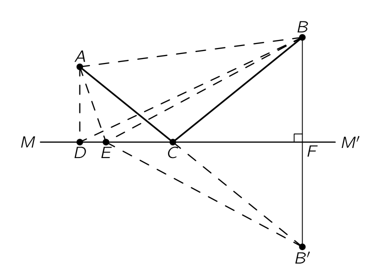{#fig-FLP_1_26_3 width=300}

 

### $\textrm{I}$.26-4 페르마의 원리의 응용 {#sec-FLP_1_26_4}

#### **가역 원리 (principle of reciprocity)** 

빛이 최소 시간 원리에 따라 $A\to B$ 의 한 경로로 진행한다면 $B$ 에서 $A$ 로 진행하는 경로는 정확히 반대 경로이다.

#### **평행한 면을 지난 유리를 통과하는 빛**

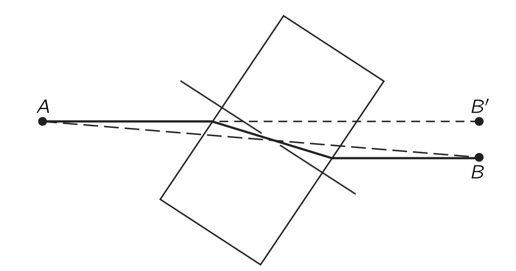{#fig-FLP_1_26_6  width=400}

위의 그림과 같이 투명한 블록이 평행한 면을 가지고 있고 및이 두 면을 통과할 때 입사 전 후의 두 빛은 평행하다.

#### **일몰 시간**

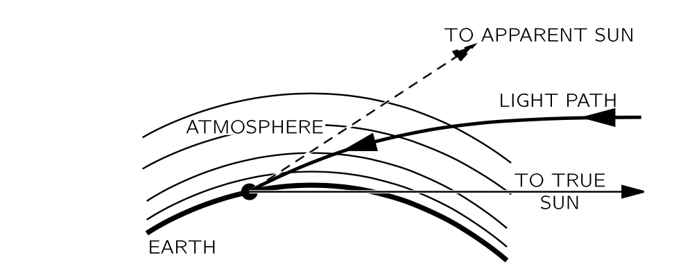{#fig-FLP_1_26_7 width=400}

우리가 본 일몰은 실제 해가 지고 난 이후이다.

#### **신기루**

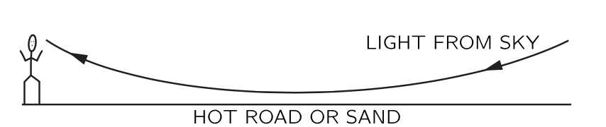{#fig-FLP_1_26_8 width=400}

#### **초점**

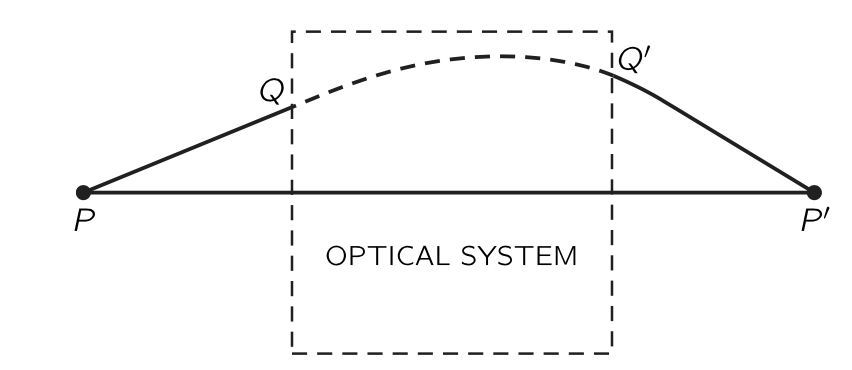{#fig-FLP_1_26_9 width=400}

위의 그림에서 $P$ 에서 나오는 모든 빛을 다른 지점인 $P'$ 에 다시 모으도록 하는 광학 시스템을 생각하자. 일단 빛이 $P$ 에서 $P'$ 까지 직선으로 갈 수 있음을 의미한다. 여기에 더해 어떻게 하면 $P$ 에서 $Q$ 를 향하는 빛도 $P'$ 에 도달하도록 할 수 있을까? 즉 $P$ 를 통하는 모든 빛을 우리가 **초점 (focus)** 이라고 부르는 $P'$ 으로 모으고자 한다.

최소 시간의 법칙에 따라 유일한 방법은 빛이 모든 경로에 대해 걸리는 시간을 정확히 동일하게 만들어야 한다. 따라서 초점 시스템을 만드는 문제는 빛이 모든 다양한 경로에 동일한 시간을 차지하도록 장치를 배치하는 것이다!

#### **수렴 렌즈**
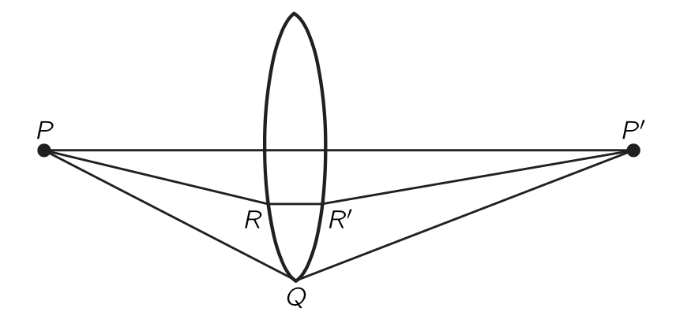{#fig-FLP_1_26_10 width=400}

$P$ 를 지나서 렌즈를 통과하는 모든 빛이 $P'$ 을 지나도록 만든 렌즈. 즉 $P$ 로부터 렌즈를 거쳐 $P'$ 으로 가는 모든 경로에서 걸리는 시간이 모두 같다. $P$ 와 $P'$ 을 **초점(focus)** 이라고 한다. 

#### **타원형 거울**

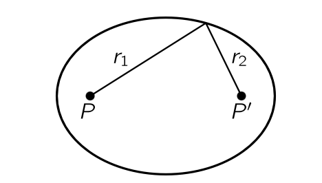{#fig-FLP_1_26_11 width=240}

$P$ 를 지나는 모든 빛은 $P'$ 을 지난다.

#### **포물선 거울**

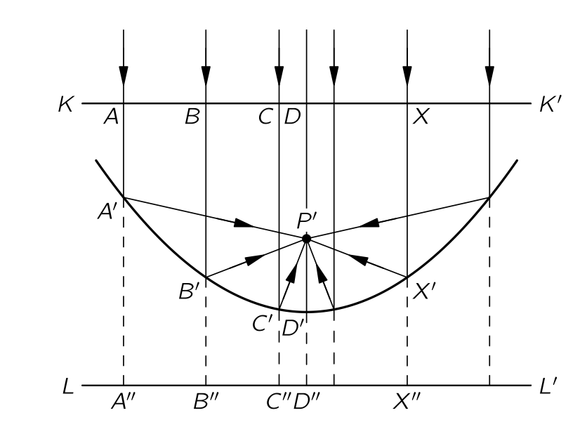{#fig-FLP_1_26_12 width=400}

포물선의 대칭선에 평행하게 들어오는 빛은 모두 $P'$ 을 지난다. 위의 그림에서의 $AA'$ 형태의 경로를 따르는 빛은 모두 $P'$ 을 지난다. 하나의 예를 들자면 $AA'+A'P'=DD'+D'P'$. 이런 포물선형 거울은 천체망원경에 사용된다. 

#### **굴절률의 규칙**

빛이 매질 $1$ 에서 매질 $2$ 로 들어갈 때 $\sin \theta_1 = n_{12}\sin \theta_2$ 의 관계가 성립한다고 하자. 또한 빛이 매질 $2$ 에서 매질 $3$ 으로 들어갈 때 $\sin \theta_2 = n_{23}\sin \theta_3$ 의 관계가 성립한다고 하자. 이 때 빛이 매질 $1$ 에서 매질 $3$ 으로 들어갈 때 $\sin \theta_1 = n_{13}\sin \theta_3$ 를 만족하는 $n_{13}$ 는 아래와 같이 구할 수 있다.

$$
n_{13}= \dfrac{n_3}{n_1}= \dfrac{n_3}{n_2}\dfrac{n_2}{n_1} = \dfrac{n_{23}}{n_{12}}.
$$ {#eq-FLP_1_26_5}

스넬의 법칙 단독으로는 위의 규칙을 얻을 수 없지만 페르마의 최소시간의 원리로는 이 규칙을 얻는다. 

#### **매질에서의 빛의 속도**

굴절률이 1.33 인 물에서의 빛의 속도는 공기에서의 빛의 속도보다 느릴 것을 예측했고 한참 이후 실험적으로 증명되었다.

 

### $\textrm{I}$.26-5 페르마의 원리의 좀 더 정확한 진술 {#sec-FLP_1_26_5}

::: {.callout-important icon="false"}

#### **페르마의 최소시간의 원리 (파인만 버젼)**

빛이 실제 진행하는 경로는 어떤 방식으로든 이 경로에서의 작은 변화에 대해 시간에 대한 1차 근사에는 변화가 없고 2차 근사에서의 변화만 있는 경로이다. 즉 빛이 거의 같은 시간이 걸리는 다른 많은 경로가 근처에 있는 경로를 따른다.
:::

우리는 스넬의 법칙을 통해 빛을 이해할 수 있다. 스넬의 법칙은 빛이 서로 다른 매질의 경계면에 어떤 이유로 그 경로가 꺾인다는 것을 말한다. 이 인과율의 연속으로 빛의 경로가 결정되는 것은 이해하기 쉽다. 그러나 최소 시간의 원리는 자연이 작동하는 방식에 대한 전혀 다른 철학이다. 원인과 결과의 연속이 아니라 상황이 정해지면 빛은 가장 시간이 적게 걸리는 경로를 찾아서 진행한다. 빛은 주변의 경로를 "냄새맡아 보고" 하나하나 비교하는가? 놀랍게도 답은 "그렇다" 에 가깝다. 이것은 기하광학에서 다루지 않았지만 "파장 (wavelength)" 이라는 개념과 관련되어 있다. 파장은 빛이 경로를 확인하기 위해 대략 어느 정도 범위만큼 "냄새를 맡는지" 를 말한다. 가시광선의 파장은 매우 짧기 때문에 빛으로 이것을 확인하는 것은 쉽지 않기 때문에 파장이 3 cm 인 라디오파를 생각하자. 

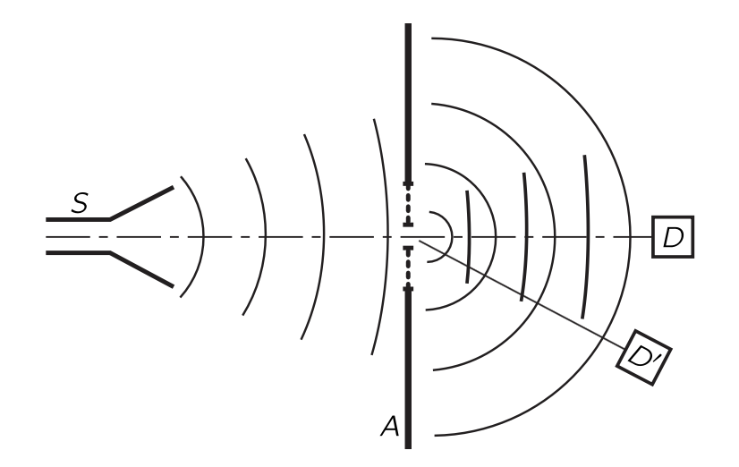{#fig-FLP_1_26_13 width=400}

**슬릿의 폭이 충분히 넓은 경우** : 빛은 직션경로를 따라 검출기 $D$ 에 도달한다. 검출기를 $D'$ 로 옮기면 빛은 주변 경로를 모두 확인한 다음에 "거기로 가면 안되. 우리들은 모두 다른 시간에 거기 도착하게되" 라고 소리치며 $D'$ 으로 향하지 않을 것이다. 

**슬릿의 폭이 매우 좁은 경우** : 슬릿의 폭이 파장에 비해 매우 작다면 (파장 범위 내에서) 빛이 주위 경로를 확인하는 것을 방해하게 되며 ... *이 부분은 좀 더 생각해 봐야 할 듯*

 

### $\textrm{I}$.26-6 어떻게 작동하는가? {#sec-FLP_1_26_6}

실제로 벌어지는 일에 대해 양자역학적인 관점에서 대략적으로 알아보자. @fig-FLP_1_26_3 에서의 빛의 경로는 전혀 파동 형태가 아니며 광자로 이루어진 것으로 보인다. 빛의 세기는 단위시간당 도달하는 광자의 개수이다.

우리가 계산하고자 하는 것은 $A$ 에서 출발한 빛이 거울을 거쳐 $B$ 에 도달할 확률이다. 경로 $\alpha$ 에 대해 확률은 복소수로 $\rho_\alpha e^{i \theta_\alpha}$ 로 표현되며 여기서 $\theta_\alpha$ 는 시간 도달 시간에 비례한다. 당연히 경로마다 $\theta_\alpha$ 다르다. 

이 때 빛이 $B$ 에 도달할 확률 $P_B$ 는 다음을 만족한다(는 것이 파인만 경로적분의 결론이다).

$$
P_B \propto  \left|\sum_{\alpha \in \text{all possible paths}} \rho_\alpha e^{i\theta_\alpha}\right|^2.
$$

이것과 거울에서의 (파인만 버젼의) 최소 시간의 원리의 연관을 알아보자. 

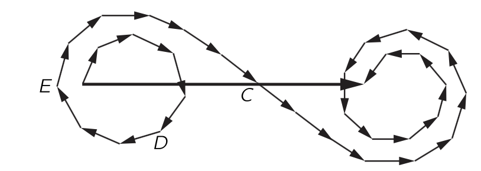{#fig-FLP_1_26_14 width=400}

$C$ 를 거치는 경로를 최소경로라고 하자. $C$ 를 거치는 경로에 가까운 경로들의 $\rho_\alpha e^{i\theta_\alpha}$ 는 $\rho_C e^{i\theta_C}$ 와 거의 차이가 나지 않는다는 것을 안다. (1차 근사항이 $0$ 이기 때문에 2차 근사항에서만 차이가 난다.) $D$ 를 거치는 경로나 $E$ 를 거치는 경로는 상대적으로 $e^{i\theta_\alpha}$ 에 큰 차이를 주기 때문에 확률에 크게 기여하지 않지만 $C$ 근처의 경로는 거의 차이가 없기 때문에 (@fig-FLP_1_26_14 를 보라) 확률에 큰 기여를 한다. 또한 $C$ 에서 멀리 떨어진 거울상의 점을 지나는 경로도 $D$ 나 $E$ 와 마찬가지 이유로 확률에 크게 기여를 하지 않는다. 확률은 위 곡선의 시작점과 끝점의 거리의 제곱에 비례하며 여기에 가장 큰 기여를 하는 경로들은 $C$ 근처의 $e^{i\theta_C}$ 와 비슷한 값을 갖는 경로들이다. 

 

## $\textrm{I}$.27 기하광학 {#sec-FLP_1_27}

### $\textrm{I}$.27-1 소개 {#sec-FLP_1_27_1}

- [빛](#sec-FLP_1_26_1) 에서 다룬 전기파의 세가지 근사역역 가운데 기하광학 영역에 대해서만 다룬다.
- 기하광학은 여기서 다루게 될 기초적인 기하광학이든 좀 더 복잡한 기하광학이든 앞으로 우리가 다룰 물리학의 분야와는 별 관련이 없다. 딱 한가지 해밀턴의 작업만 빼고. 그러나 이는 고등 역학의 내용이므로 여기서는 다루지 않는다.
- 앞으로 다루게 될 기하광학에서 많이 사용하게 될 공식이 있다. 

  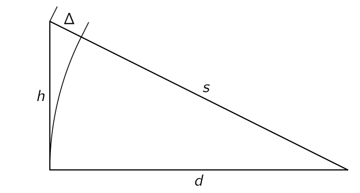{#fig-FLP_1_27_1 width=250}

  위의 그림에서 $\Delta = s-d = \sqrt{d^2-h^2}-d$ 이므로 다음이 성립한다.
  
  $$
  \Delta  \approx \dfrac{h^2}{2s}
  $$ {#eq-FLP-1_27_1}

 

### $\textrm{I}$.27-2  초점거리와 구면 {#sec-FLP_1_27_2}

#### **초점거리**

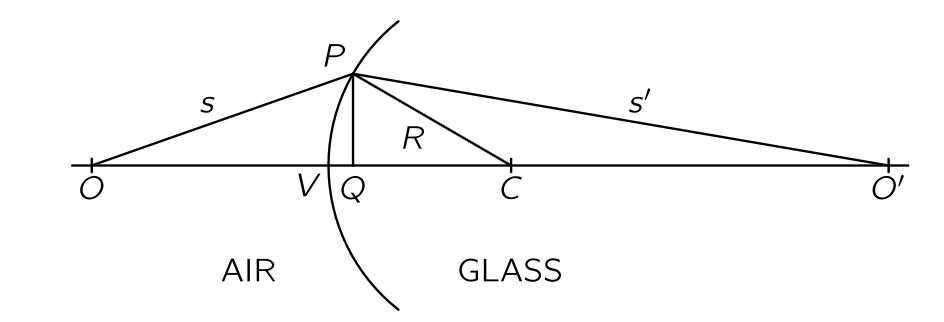{#fig-FLP_1_27_2 width=400}

위의 그림에서 공기중에서의 빛의 속도를 $1$, 유리에서의 빛의 속도를 $1/n$ 이라고 하자. 즉 유리의 굴절률은 $n$ 이다. 정해진 두 점 $O,\,O'$ 에 대해 $O$ 를 지나는 모든 빛이 $O'$ 을 지나도록 하는 유리의 면을 구한다고 하자. 그렇다면 유리의 표면의 임의의 점 $P$ 에 대해 빛이 $OP$ 에서 걸린 시간과 $PO'$ 에서 걸린 시간의 합이 같아야 한다. 즉

$$
|OP| + n\cdot |PO'|= \text{constant}
$$

이어야 한다. 이것을 직접 풀면 꽤나 복잡한 4차 함수가 되는데 $s\to \infty$ 극한에서는 훨씬 간단한 2차 함수가 된다. 게다가 실용적으는 $O$ 를 지나는 모든 빛에 대해서가 아니라 $OO'$ 선 주위에 대해서만 성립해도 많은 경우에서 받아들일 수 있다. 

한 점에서 출발한 빛이 다른 한 점에서 모이도록 하는 유리면이 매우 복잡하기 때문에 $OO'$ 축에 가까운 빛들만 촛점에 정확히 모이도록 하는 절충을 한다. $OO'$ 에서 멀어질수록 벗어나긴 하지만 구면(spherical surface) 를 사용한다. $OO'$ 축에 가까운 빛만 한 점에 모인다고 할 때 이 축에 가까운 빛을 을 근축 광선(Paraxial axis, 根軸 光線) 이라고 하며 우리가 집속 할 때 고려하는 빛은 모두 근축 광선이다. 여기서 구면의 중심은 $C$ 이다.

빛이 $OPO'$ 경로를 거치는 데 걸리는 시간과 $OO'$ 경롤르 거치는데 걸리는 시간이 같아야 하므로 
$$
|OP|+ n|PO'| = |OV|+n|VO'| = |OV|+n|VQ|+n|QO'|
$$

이다. $P$ 가 $OO'$ 축에서 매우 가깝다고 하자. 그렇다면 $|PQ|= h$ 에 대해

$$
|OP| \approx |OV|+|VQ|+\dfrac{h^2}{2s},\qquad |PO'| \approx |QO'|+\dfrac{h^2}{2s'}
$$

이며 $|VQ| = h^2/2R$ 이므로 다음의 관계가 성립한다.

$$
\dfrac{h^2}{2s} + n\dfrac{h^2}{2s'} = (n-1)\dfrac{h^2}{2R}.
$$ {#eq-FLP_1_27_2}

즉

$$
\dfrac{1}{s} + \dfrac{n}{s'} = \dfrac{n-1}{R}.
$$ {#eq-FLP_1_27_3}

즉 우리가 $O$ 와 $O'$ 의 위치를 알면 구면의 반경 $R$ 을 구할 수 있다. 또한 같은 재질 $n$, 같은 반경 $R$ 의 구면 렌즈는 @eq-FLP_1_27_3 를 만족하는 모든 $s,\,s'$ 에 대해서도 성립한다. 특히 흥미로운 것은 $s\to \infty$ 극한에서이다. 이 경우 

$$
f'=s'(s\to \infty)=\dfrac{nR}{n-1}
$$  {#eq-FLP_1_27_4}

을 **초점 거리 (focal length)** 라고 하며 $OO'$ 에 평행하게 오는 근축광선은 모두 $O'$ 에 모이게 된다. 거꾸로 유리 안쪽에서 구면에 매우 먼 빛이 들어온다면 $s'\approx \infty$ 대기중으로 나온 빛은 

$$
f=s(s'\to \infty) = \dfrac{R}{n-1}
$${#eq-FLP_1_27_5}

에 모이게 된다. 이를 이용하면 @eq-FLP_1_27_3 을 아래와 같이 쓸 수 있다.

$$
\dfrac{1}{s}+ \dfrac{n}{s'} = \dfrac{1}{f}.
$$ {#eq-FLP_1_27_6}

 

#### **실상과 허상**

@eq-FLP_1_27_6 에서 $s<f$ 인 경우 $s'<0$ 이며 $|s'|=(-s') > ns > s$ 이며 $O$ 에서 출발한 빛의 경로는 아래 그림과 같다. $O$ 에서 출발한 빛은 유리를 넘어 한 점에서 모이지 않고 아래 그림의 실선과 같이 발산한다. 하지만 발산하는 경로의 연장선은 아래 그림의 $O'$ 으로 모인다. 즉 렌즈 안의 빛의 경로는 마치 $O'$ 을 광원으로 하는 빛의 경로와 같다.

  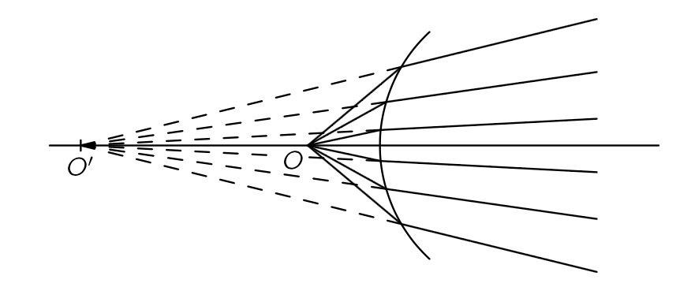{#fig-FLP_1_27_3 width=350}

@fig-FLP_1_27_2 의 $O'$ 과 다른 것은 @fig-FLP_1_27_2 의 $O'$ 은 빛이 실제 모이는 점이지만 @fig-FLP_1_27_3 의 $O'$ 은 빛이 실제 모이는 점이 아니라는 것이다. 그러나 $O'$ 은 명백한 상(image) 이며 이것을 **허상 (virtural image)** 라고 한다. 반면 @fig-FLP_1_27_2 의 $O'$ 은 실제 빛이 모이는 지점이므로 **실상 (real image)** 라고 한다. 

이제 $R\to \infty$ 인 경우를 생각해보자. $1/s + n/s'=0$ 이므로 $s'=-ns$ 이다. 우리가 굴절률이 큰 매질에서 굴절률이 작은 매질에 있는 물체를 볼 때 그 비율만큼 거리가 멀어져 보이며, 반대로 굴절률이 작은 매질에서 굴절률이 큰 매질에 있는 물체를 볼 때 그 비율만큼 거리가 가까워져 보인다.

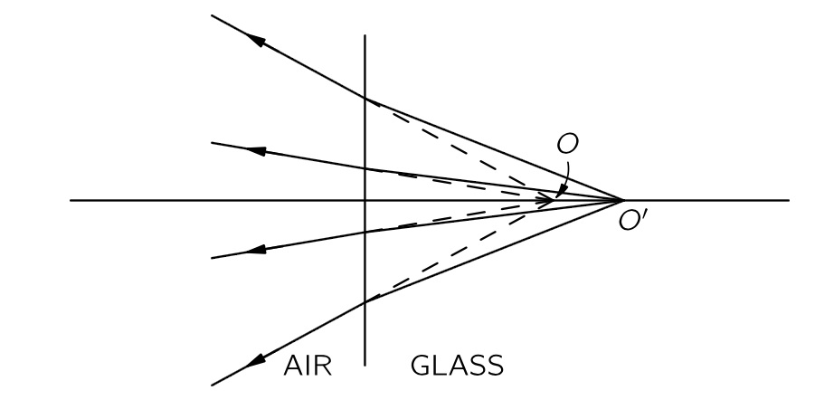{#fig-FLP_1_27_4 width=350}

이제 구면 거울에 대한 논의는 여기서 마치기로 하자. 마지막으로 구면 거울의 거리에 관련된 관례를 소개하겠다.

1. 객체 거리 $s$ 는 점 $O$ 가 표면의 왼쪽에 있을 경우 양수이다.
2. 점 $O'$ 이 표면의 오른쪽에 있을 경우 이미지 거리 $s'$ 은 양수이다.
3. 표면의 곡률 반경은 중심이 표면의 오른쪽에 있을 경우 양수이다.

 

### I$\textrm{I}$.27-3 렌즈의 초점거리 {#sec-FLP_1_27_3}

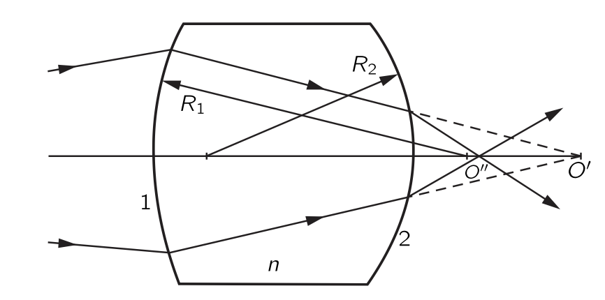{#fig-FLP_1_27_5 width=320}

대부분의 랜즈는 두개의 면을 가진다. 위의 그림과 같이 $R_1,\,R_2$ 의 두개의 곡률반경을 갖는 렌즈를 생각하자. @eq-FLP_1_27_3 을 이용하여 첫번째 면 $1$ 에 대해 $O$ 를 지나는 빛이 모이는 $O'$. 그리고 $O'$  에 대해 @fig-FLP_1_27_3 의 방법을 (역으로) 이용하여 이 양면렌즈의 상(허상)이 맺히는 $O''$ 을 잡을 수 있다.

식 @eq-FLP_1_27_3 은 굴절률 $1$ 인 매질에서 $n$ 인 매질로 입사할때의 식이다. 각각의 매질이 $n_1$, $n_2$ 의 굴절률을 갖고 있다면 다음을 만족한다는 것을 보일 수 있다.

$$
\dfrac{n_1}{s}+ \dfrac{n_2}{s'}= \dfrac{n_2-n_1}{R}
$$ {#eq-FLP_1_27_7}

아래 그림과 같이 두개의 양의 반지름을 갖는 매우 얇은 렌즈에 의한 효과를 알아보자. 매우 얇다는 것은 렌즈의 두께에 의한 효과를 무시할 수 있다는 뜻이다.

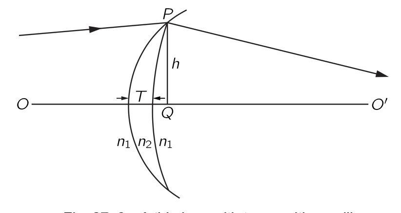{#fig-FLP_1_27_6 width=320}

위의 그림에서 $O$ 에서 나온 빛이 $O'$ 이 지나도록 어떻게 할 수 있을까? 빛이 $P$ (렌즈의 가장 얇은 부분)를 지난다면 $OPO$ 경로와 $OO'$ 경롤르 따를 때의 시간이 같기 위해서는 $OO'$ 선상의 두께 $T$ 에 대해 

$$
\dfrac{n_1 h^2}{2s} + \dfrac{n_1 h^2}{2s'} = (n_2-n_1)T
$$ {#eq-FLP_1_27_8}

의 관계를 만족해야 한다. 두 반경을 $R_1,\,R_2 (0<R_1<R_2)$ 라고 하면

$$
T = \dfrac{h^2}{2R_1} - \dfrac{h^2}{2R_2}
$${#eq-FLP_1_27_9}

이므로

$$
\dfrac{n_1}{s} + \dfrac{n_1}{s'} = (n_1-n_2)\left(\dfrac{1}{R_1} - \dfrac{1}{R_2}\right)
$$ {#eq-FLP_1_27_10}

이다. 이로부터 이 렌즈의 초점거리 $f$ 는 $f=\lim_{s\to \infty} s'$ 로부터

$$
\dfrac{1}{f} = \left(\dfrac{n_2}{n_1}-1\right)\left(\dfrac{1}{R_1} - \dfrac{1}{R_2}\right)
$$ {#eq-FLP_1_27_11}

임을 안다. 또한 $f'=\lim_{s'\to \infty}s$ 로부터

$$
f'=f
$$ 

임을 안다. 또한 초점거리 $f$ 를 이용하면

$$
\dfrac{1}{s} + \dfrac{1}{s'}= \dfrac{1}{f}
$$ {#eq-FLP_1_27_12}

임을 안다.

1. 평행한 빛은 렌즈에서 $f$ 만큼 떨어진 촛점으로 모인다.
2. $s$ 가 증가하면, 즉 $s$ 가 왼쪽으로 움직이면 $s'$ 은 감소한다. 즉 $s'$ 역시 왼쪽으로 움직인다. 즉 $s$ 와 $s'$ 은 같은 방향으로 움직인다.
3. $s=s'$ 이면 $s=s'=2f$ 이다. 

 

### $\textrm{I}$.27-4 확대 {#sec-FLP_1_27_4}

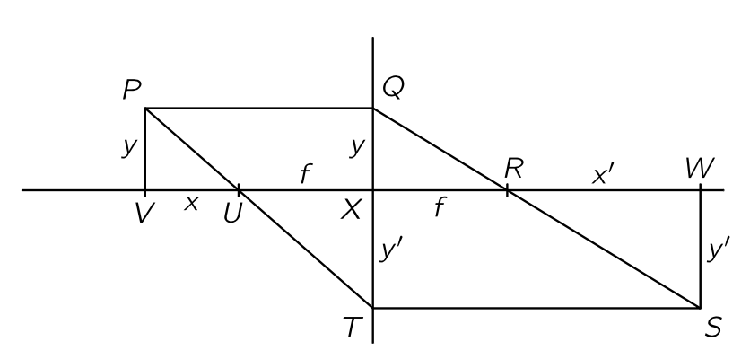{#fig-FLP_1_27_7 width=320}

앞서 언급한 얇은 렌즈가 위의 그림의 $QT$ 에 놓여 있다고 하자. 위의 그림에서 $U,\,R$ 은 초점으로 초점의 반대쪽 면에서 입사하는 평행 광선은 항상 초점을 지난다는 것을 안다. 초점에서 $x$ 만큼 떨어진 위치의 $V$ 에 높이 $y$ 의 물체가 서 있다고 하자. 즉 물체는 $PV$ 상에 위치한다. $P$ 로부터 $Q$ 를 지나는 빛은 초점 $R$ 을 통과한다. 또한 $P$ 에서 초점 $U$ 를 지나는 빛은 렌즈를 거쳐 ($T$) 평행 광선이 된다. 이 두 경로의 빛이 만나는 점이 그림에서의 $S$ 이며 이 점에 의해 상의 위치 $W$ 와(그리고 $R$ 로부터의 거리 $x'$ 과) 높이 $y'$ 이 결정된다. $\triangle PVU$ 와 $\triangle TXU$ 는 닮았고, $\triangle SWR$ 과 $\triangle QXR$ 역시 닮았으므로

$$
\dfrac{y'}{f} = \dfrac{y}{x},\qquad \dfrac{y'}{x} = \dfrac{y}{f}
$$ {#eq-FLP_1_27_13}

이며 이로부터

$$
xx' = f^2
$$ {#eq-FLP_1_27_16}

을 얻는다. 

 

### $\textrm{I}$.27-5 복합렌즈 {#sec-FLP_1_27_5}

 

### $\textrm{I}$.27-6 수차 (Aberrations) {#sec-FLP_1_27_6}

#### **수차와 수차의 종류**
지금까지는 근축광선으로 재한했다. 실제 렌즈는 일반적으로 **수차 (aberration) 현상** 을 보인다. 
 
- **구형 수차 (spherical aberration)** : 렌즈 표면을 구면으로 가공했기 때문에 나타나는 수차. 축에서 멀어질수록, 광선이 초점에서 벗어나기 시작하고 렌즈 상단 가장자리 근처에 닿는 광선은 초점을 상당히 크게 벗어나고 이로 인해 점 이미지 대신 흐리고 번진 이미지를 얻는다. 이를 구형수차라고 하며 구형 수차는 특정 물체 거리와 관계없이 렌즈 표면의 형태를 재구성하거나, 개별 렌즈의 수차가 서로 상쇄하도록 여러 렌즈를 배치함으로써 교정 할 수 있다.

-  **색수차 (chromatic aberration)** : 서로 다른 색상의 빛은 유리 내에서 속도가 다르며(굴절률이 역시), 따라서 주어진 렌즈의 초점 거리가 색상에 따라 달라진다. 이 경우 흰 반점을 촬영하면 이미지에 색상이 표시됩되며 빨간 반점을 초점 맞추면 파란색이 초점이 맞지 않게 되며 반대 역시 발생한다. 이 속성을 **색수차 (chromatic aberration)** 라고 한다.

- **코마 수차 (coma aberratiobn)** : 축과 빛의 경로가 나란하지 않을 때 생기는 수차를 코마$^{1}$ 수차라고 한다. 이미지는 보통 꽤 거칠고, 초점이 잘 맞지 않을 수도 있다.[$^1$ 혜성의 꼬리를 coma라고 한다.]{.aside}

#### **수차의 보정**  

최소 시간의 관점에서 보면 모든 광선이 가능한 한 거의 동일한 시간을 소요하도록 배치해야 한다고 생각하지만 이것이 사실이 아니다. 기하학적 광학 이론이 통하지 않는 영역에 접근해야 하기 때문이다. 아래는 파인만 강의의 원문이다.

>Remember that the principle of least time is not an accurate formulation, unlike the principle of conservation of energy or the principle of conservation of momentum. The principle of least time is only an approximation, and it is interesting to know how much error can be allowed and still not make any apparent difference. The answer is that if we have arranged that between the maximal ray—the worst ray, the ray that is farthest out—and the central ray, the difference in time is less than about the period that corresponds to one oscillation of the light, then there is no use improving it any further. Light is an oscillatory thing with a definite frequency that is related to the wavelength, and if we have arranged that the time difference for different rays is less than about a period, there is no use going any further.

 

### $\textrm{I}$.27-7 분해능 {#sec-FLP_1_27_7}

예를 들어 우리가 양 끝에 점이 있는 박테리아를 확대하는 현미경을 개발한다면 현며경을 통해 이 두 점이 구별되기를 기대할 것이다. 필요할때마다 렌즈를 추가하여 구면수차와 색수차를 상쇄시킨다면 우리가 원하는 만큼 확대시키지 못할 이유는 무엇인가? 그러나 최소시간이 정확하지 않기 때문에 확대에는 한계가 있다. 현미경에서 두 점이 구분되어 보이기 위해 실제로 두 점 사이의 거리가 얼마가 되어야 하는지를 결정하는 아름다운 규칙을 알아보자.

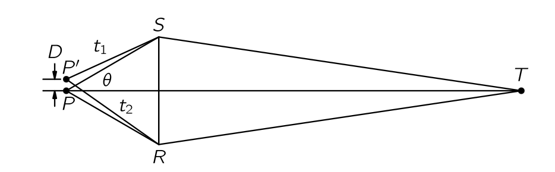{#fig-FLP_1_27_0 width=450}

일단 수차를 무시하고 점 $P$ 에서 출발한 광선은 (@fig-FLP_1_27_0) 동일한 시간을 거쳐 $T$ 에 도달한다고 하정하자. (완전한 시스템이 아니기 때문에 사실이 아니지만, 그것은 별도의 문제이다.) 이제 $P$ 근처의 $P'$ 에 대해 상이 $T$ 와 구별되는지 확인해보자. 물론, 기하광학에 따르면 두 점의 상이 있어야 하지만, 우리가 보는 것이 흐릿해서 구분하지 못할 수도 있다. $P'$ 의 상이 $T$ 와 명확히 다른 위치에 발생하기 위해서는 렌즈의 개구부 양쪽에서 한쪽 끝에서 다른쪽 끝까지 이동하는 $P'ST$ 와 $P'RT$ 의 소요시간이 $PST$ 와 $PRT$ 의 소요시간과 달라야 한다. 시간이 동일하다면 당연히 두 점 모두 같은 지점에 초점을 맞을 것이기 때문이다. 그렇다면 이 소요시간은 얼마나 차이가 나야 할까? 모든 광학 기기의 해상도에 대한 일반 규칙은 다음과 같다: 두 개의 서로 다른 점광원에 대해 한 점에서 출발하여 랜즈를 통과하여 상에 맺히는 곳까지의 최대 소요시간 $t_1$ 과 다른 점에서 출발하여 그 점까지의 최대 소요시간 $t_2$ 를 비교하면 빛의 진동수 $\nu$ 에 대해 다음을 만족해야 한다.

$$
t_2-t_1 > \dfrac{1}{\nu}.
$$ {#eq-FLP_1_27_17}

이로부터 두 점 사이의 거리가 $D$ 이고 점에서 랜즈 끝을 바라볼 때의 각을 $\theta$, 점 $P$ 에서의 굴절률을 $n$ 이라고 하면 $D>\lambda/(2n\sin\theta)$ 이어야 함을 알 수 있다. 따라서 광학 현미경을 통해 우리가 볼 수 있는 가장 작은 것들은 대략 빛의 파장 정도의 크기이다.

 

## $\textrm{I}$.28 전자기 복사 {#sec-FLP_1_28}

### $\textrm{I}$.28-1 전자기학 {#sec-FLP-1_18_1}

#### **역사적 맥락**

- 맥스웰(J. C. Maxwell) 은 이전까지의 전기와 자기에 관한 법칙을 통합하였으며 부분적으로 빛에 관한 법칙도 발견하였다.
- 전기력과 자기력은 대략 $1/r^2$ 에 비례한다는 공통적인 성질을 가지고 있다. 따라서 아주 멀리 떨어지진 전하는 서로에게 겨의 영향을 끼치지 못한다. 
- 멕스웰은 방정식을 통합하는 과정에서 기존에는 알지 못했던 새로운 항을 추가해야 한다는 사실을 발견하였으며 이에 따르면 전기장과 자기장의 일부는 $1/r$ 에 비례한다는 것을 발견하였다. 또한 한곳의 전류는 멀리 떨어진 다른 곳의 전하에 영향을 끼친다는 것을 발견하였다. 

#### **전자기 복사**

**전자기 복사 (electromagnetic radiation)** : 전자의 빠른 진동으로 인해 발생하는 전자기파.

- 19세기 말까지의 물리학적 지식
  - 뉴튼의 보편 중력 법칙
    $$
    \bf{F} = \dfrac{GmM}{r^2}\bf{e}_r.
    $$ {#eq-FLP_1_28_1}
  - 주어진 전기장 $\bf{E}$ 와 자기장 $\bf{E}$ 에서의 로런츠 힘
    $$
    \bf{F} = q(\bf{E}+ \bf{v}\times \bf{B}).
    $$ {#eq-FLP_1_28_2}

- 여기서 $\bf{E}$ 와 $\bf{B}$ 는 개별적인 전하에 의해 생성되는 전기장과 자기장의 벡터합이다. : **중첩 (superposition)**.

- 하나의 개별 전하에 의한 전기장 $\bf{E}$ 는 아래와 같다. 사실, 전기와 자기의 올바른 법칙을 표기하는 가장 유용한 방법은 지금 우리가 쓰는 방식이 아니지만 우리가 아직 다루지 않았기 때문에 현재 우리가 알고 있는 표기법으로 표현하면 아래와 같다,

  $$
  \bf{E} = \dfrac{-q}{4\pi \epsilon_0} \left[\dfrac{\bf{e}_{r'}}{r'^2} + \dfrac{r'}{c} \dfrac{d}{dt}\left(\dfrac{\bf{e}_{r'}}{r'^2}\right) + \dfrac{1}{c^2} \dfrac{d^2 \bf{e}_{r'}}{dt^2}\right].
  $$ {#eq-FLP_1_28_3}

  - 첫번째 항은 쿨롱법칙, 즉 $\bf{E}_C = \dfrac{-q\bf{e}_{r}}{4\pi \epsilon_0 r^2}$ 과 유사하다. 여기서 $r$ 은 전하 $q$ 와 전기장이 측정되는 위치 $P$ 사이의 거리이다. 이미 19세기에 모든 영향은 어떤 근본적인 상수로 정해지는 속도보다 빨리 전달 될 수 없다는 것이 발견되었다. 이 근본적인 속도가 빛의 속도 $c$ 이다.
  - 첫번째 항과 쿨롱법칙과의 차이는 현재의 $P$ 점에서의 전기장에 영향을 주는 것은 과거, 정확히 $r'/c$ 만큼 이전의 과거라는 것이다. 이 차이를 **지연 시간 (retarded time)** 이라고 한다. $r'$ 은 $q$ 를 떠난 신호가 시간 $t$ 에 $P$ 에 도달했을 때의 거리이다. 따라서 @eq-FLP_1_28_3 에 등장하는 방향은 **지연 거리(retarded distance)** $r'$ 에 대한 소위 **지연 방향 (retarded direction)** 인 $\bf{e}_{r'}$ 이 된다.
  - 두번째 항은 지연된 시간과 전기장의 시간에 대한 변화율을 곱한 값이다. 
  - 세번째 항은 지연 방향의 시간에 대한 이차 미분이다. 

- 자기장의 방정식은 다음과 같다.

$$
\bf{B} = - \dfrac{\bf{e}_{r'}\times \bf{E}}{c}.
$$ {#eq-FLP_1_28_4}

::: {.callout-warning icon="false"}

#### 파인만의 한마디 : 자기 자신이 생성하는 장의 영향

> For those purists who know more (the professors who happen to be reading this), we should add that when we say that (@eq-FLP_1_28_3) is a complete expression of the knowledge of electrodynamics, we are not being entirely accurate. There was a problem that was not quite solved at the end of the 19th century. When we try to calculate the field from all the charges including the charge itself that we want the field to act on, we get into trouble trying to find the distance, for example, of a charge from itself, and dividing something by that distance, which is zero. The problem of how to handle the part of this field which is generated by the very charge on which we want the field to act is not yet solved today. So we leave it there; we do not have a complete solution to that puzzle yet, and so we shall avoid the puzzle for as long as we can.

고전 전자기학에서 점전하에서 자기 자신이 생성하는 장의 영향은 개념적으로 완전히 깔끔하게 해결되지 않았다.

조금만 더 정리한다면 :

- 우리가 보통 쓰는 전자기학은 “점전하가 외부 장을 받는다”는 수준에서는 완벽하게 잘 작동한다.
- 그러나 “점전하가 자기 자신과 상호작용한다”까지 밀어붙이면 이론의 구조적 한계가 드러난다.
- 따라서 실전 계산에서는 자기장 효과를 직접 계산하지 않고 유효 방정식(예: 복사 반작용 항)을 따로 도입하거나 양자이론으로 넘어간다.

:::

 

### $\textrm{I}$.28-2 전자기 복사 {#sec-FLP_1_28_2}

@eq-FLP_1_28_3 에는 거리의 제곱이 아니라 거리에 반비례하는 항이 존재하며, 충분히 먼 거리에서는 이 항이 지배적이 된다. 구체적으로 찾아보는 것은 다음으로 미루기로 하고 일단 이것을 받아들이기로 하자. 정답은 세번째 항이다. 이제 우리는 당분간 다음을 법칙으로 받아들이자.

$$
\bf{E}= -\dfrac{q}{4\pi \epsilon_0 c^2} \dfrac{d^2 \bf{e}_{r'}}{dt^2}.
$$ {#eq-FLP_1_28_5}

- $\bf{e}_{r'}$ 이 시간에 대한 이차 변화를 radial 방향과 transverse 방향으로 분해 할 수 있다. 이 때 radial 방향의 변화는 $1/r'^2$ 에 비례 하여 변하며 transverse 방향은 $1/r'$ 에 비례한다. 따라서 우리는 충분히 멀다면 transverse 방향만 고려해야 한다는 것을 알 수 있다. 
- @eq-FLP_1_28_3 는 상대성 이론에 의한 효과까지 포함되어 있다.

이제 좀 더 단순한 상황을 생각해보자. 전하의 움직임은 느리고 움직이는 범위는 작다. 그렇다면 지연 시간은 거의 상수 $r/c$ 이다. 이제 전하가 $x$ 방향으로만 움직인다고 가정한다. 그렇다면 

$$
\dfrac{d^2 \bf{e}_{r'}}{dt^2} = \dfrac{d^2 \left(\bf{e}_{r'}\right)_\text{transverse}}{dt^2} \approx \dfrac{d^2}{dt^2}\left(\dfrac{x}{r'}\right)\bf{e}_x \approx \dfrac{a_x(t-r/c)}{r}\bf{e}_x
$$

이며 따라서 전기장은 대부븐 $E_x$ 이고 다음과 같다.
$$
\boxed{E_x (t)= - \dfrac{q}{4\pi \epsilon_0 c^2 r} a_x\left(t-\dfrac{r}{c}\right).}
$$ {#eq-FLP_1_28_6}

 

### $\textrm{I}$.28-3 쌍극자 복사체 {#sec-FLP_1_28_3}

우리는 @eq-FLP_1_28_6 를 (1) 우리가 보는 방향에 대해 직각 방향으로 (2) 천천히 움직이는(non-relativistic) (3) 멀리 떨어져 있는 전자기 복사에 대한 기본 법칙으로 (당분간) 간주한다. 이 식의 가속도는 $r/c$ 만큼의 시간 이전의 가속도이다. 이 장에서는 이 식의 물리적 의미에 대해 다루며 이후에는 빛과 전파(라디오파)의 전달에 대한 모든 현상-반사, 굴절, 간섭, 회절, 산란 과 같은-을 설명하는데 사용할 것이다.

::: {#exm-FLP_dipole_genertor}

#### **고주파 신호 발생기 와 쌍극자 안테나**

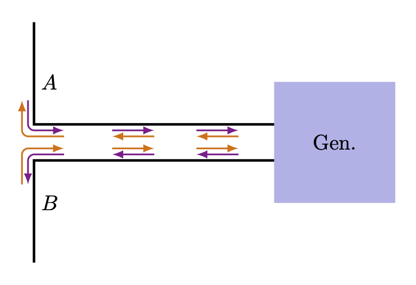{#fig-FLP_1_28_1 width=350}

위의 그림과 같이 고주파 발전기에 도선을 연결시킨것을 생각하자. 두 도선 $A,\,B$ 에 흐르는 전류의 방향은 발전기의 주파수에 맞춰 반대방향으로 바뀐다. 멀리서 보면 이것은 단지 $A,\,B$ 도선상에서 전류의 방향이 주기적으로 바뀌는 **전기 쌍극 진동자 (electric dipole osciilator)** 이다. 이 진동자에서 발생하는 전기장은 @fig-FLP_1_28_1 에서 발전기를 전류계로 바꾼(그리고 신호 증폭기 등을 추가한) 장비를 이용하여 측정 할 수 있다. 

앞서 설명했듯이 쌍극 진동자의 경우 transverse 방향이 지배적이기 때문에 아래 그림과 같이 $1$ 번 위치에서는 검출기의 방향과 진동자의 방향이 평행할 때 가장 큰 신호를 받는다. 만약 $3$ 의 위치에 검출기가 있다면 아무 신호를 받지 못한다. 물론 $1$ 의 위치에서 안테나의 방향이 $G$ 를 향해도 아무 신호도 받지 못한다.

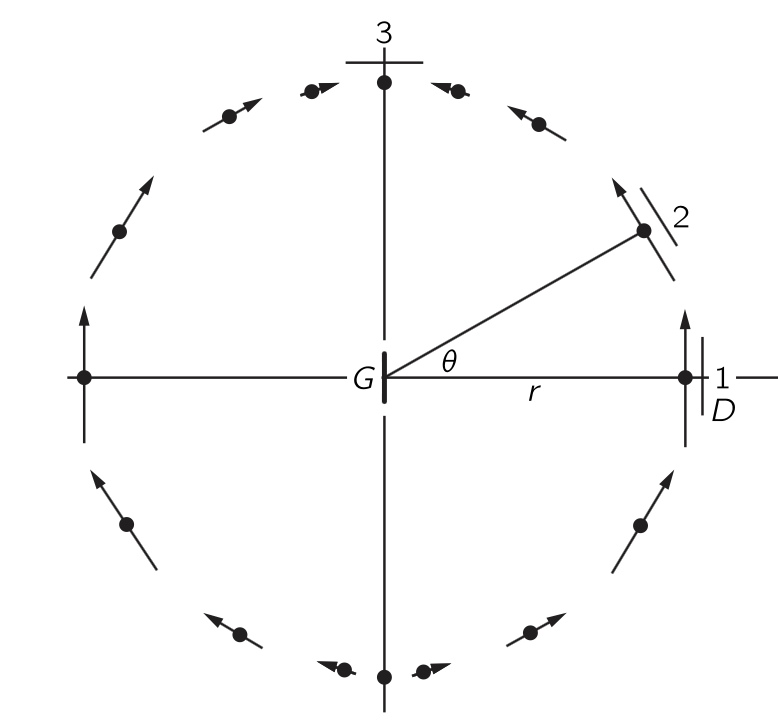{#fig-FLP_1_28_2 width=350} 
:::

 

### $\textrm{I}$.28-4 간섭 {#sec-FLP_1_28_4}

두개의 전자기파 원이 있을 때 외부에서의 전기장은 각각의 전자기파 원에서의 전자기장의 벡터합으로서 상쇄 혹은 보강이 있을 수 있다.... 는 것에 대한 내용들. 이것을 **간섭 (interference)** 라고 한다. 

 

## $\textrm{I}$.29 간섭 {#sec-FLP_1_29}

### $\textrm{I}$.29-1 전자기파 {#sec-FLP_1_29_1}

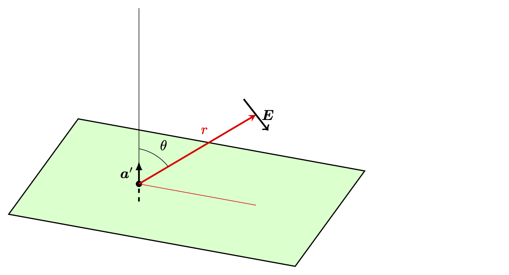{#fig-FLP_1_29_1 width=450}

위의 그림과 같은 상황에서 @eq-FLP_1_28_6 은 아래와 같다.

$$
E(t) = - \dfrac{qa(t-r/c) \sin \theta}{4\pi \epsilon_0 c^2r}.
$${#eq-FLP_1_29_1}

여기서 $a(t-r/c)$ 는 시간이 $t-r/c$ 일 때의 가속도로 **지연 가속도(retarded acceleration)** 라고 한다.

 

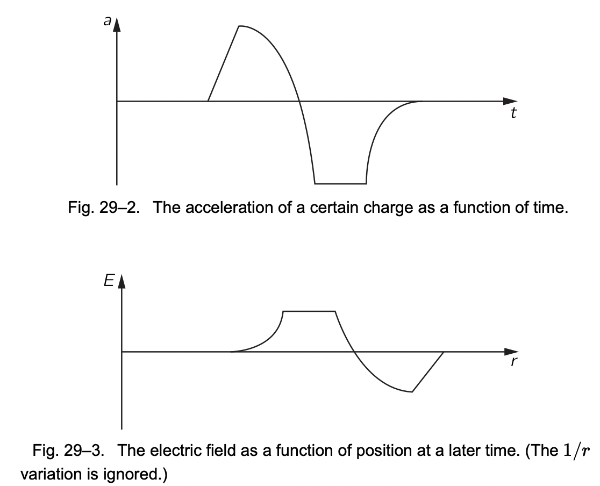{#fig-FLP_1_29_2 width=450}

- 시간이 지남에 따라 장은 소스로부터 퍼져나가는 파동처럼 움직인다. 
- 특별이 전하 $q$ 가 $x=x_0 \cos \omega t$ 와 같이 움직일 경우 가속도는

  $$
  a=-\omega^2 x_0 \cos \omega t = a_0 \cos \omega t
  $$ {#eq-FLP_1_29_2}

  와 같고 전기장은 @eq-FLP_1_29_1 에 의해 아래와 같다.

  $$
  E= - q \sin \theta \dfrac{a_0 \cos \omega (t-r/c)}{4\pi \epsilon_0 rc^2}.
  $${#eq-FLP_1-20_3}

### $\textrm{I}$.29-2 복사 에너지 {#sec-FLP_1_29_2}

- 진동자가 전기장에서 움직인다고 하자. 즉 전기장이 사인파이며 $F=qE = ma$ 로부터 속도, 가속도, 최대 변위 모두 전기장에 비례한다. 그리고 운동에너지는 $E^2$ 에 비례한다. 이로부터 장이 전달하는 에너지는 $E^2$ 에 비례할 것이라는 것을 안다.

- 따라서 복사에 의해 전기장의 크기 $E \propto 1/r$ 이며 단위 시간, 단위면적을 빠져나가는 에너지는 $1/r^2$ 에 비례한다.

### $\textrm{I}$.29-3 사인파 {#sec-FLP_1_29_3}

- 각진동수 $\omega$ 에 대해 파수(wave number) $k$ 를 단위 거리당 변경되는 파동의 위상으로 정의하자. @eq-FLP_1-20_3 에서 위상 $\phi = \omega (t-r/c)$ 이므로 
  $$
  k = \left|\dfrac{d\phi}{dr}\right| = \dfrac{\omega}{c} 
  $$ {#eq-FLP_1_29_4}

  이다. 참고로 빛이 아닌 경우 각진동수와 파수 사이에는 위와 같은 간단한 관계가 일반적으로 성립하지 않는다. 또한 파장 $\lambda$ 는 한 주기의 파동이 공간상에서 차지하는 거리이며 $\lambda = 2\pi/k$ 이다. 

- 이제 위상을 파수와 각진동수에 대해 $\phi = \omega t - k x$ 와 같이 쓸 수 있다.

- 실제로 전기장은 $1/r$ 항 이외에 $n>1$ 에 대한 $1/r^n$ 항이 존재한다. $r$ 이 충분히 크면 $1/r^n$ 항을 무시할 수 있다. 정성적으로  $1/r^n$ 항에서 $r > n \lambda$ 보다 크면 무시 할 수 있다.

 

### $\textrm{I}$.29.4 두 쌍극자 복사자 {#sec-FLP_1_29_4}

두 진동자의 중심과 검출기가 평면상에 있으며 이 평면에 대해 진동자는 이 평면에 대해 수직으로 진동한다고 하자. 그리고 두 진동자는 진동의 파장의 반($\lambda/2$) 만큼 떨어져 있다고 하자. 아래 그림은 이 두 진동자를 위에서 본 그림이다.

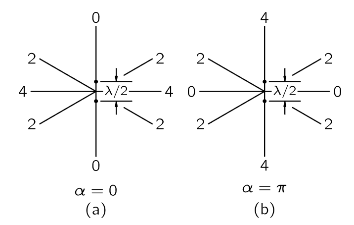{#fig-FLP_1_29_5 width=350}

위의 그림은 위에서 본 두 진동자의 전기장의 세기를 보여준다. 그림의 설명을 읽어보자. 에너지 강도(intensity) 는 단위 시간당 전달되는 에너지를 말하며 여기서는 당연히 전기장의 제곱의 시간에 대한 평균에 비례한다. 위의 그림에서 보듯이 우리는 우리가 전기장에 의한 신호를 보내고자 하는 방향뿐만 아니라 그 반대방향으로 강한 신호를 보낼 수 있다. 이것을 약간 더 조합해보자. 아래 그림과 같이 $\lambda/4$ 만큼 떨어진 두 쌍극자가 $\pi/2$ 만큼의 위상차로 진동한다고 하자.

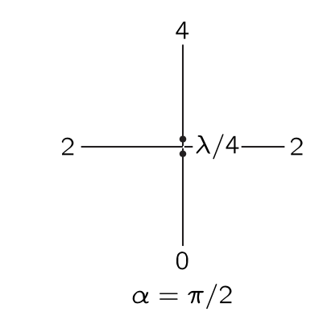{#fig-FLP_1_29_6 width=200}

그렇다면 위의 그림과 같이 북쪽 방향으로 가장 강한 신호가 전달되며 반대방향으로는 거의 신호가 전달되지 않는다. 

이제 쌍극자를 지혜롭게 배치하여 에너지가 한쪽 방향에 집중하여 전달되도록 할 수 있다는 것을 보이자. 아래 그림은 $10\lambda$ 만큼 떨어져 있는 두 쌍극 진동자에 의한 intensity 이다.

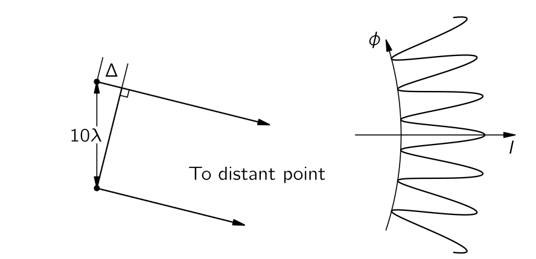{#fig-FLP_1_29_7 width=400}

아래 그림은 $10\lambda$ 거리에 등간격으로 배치된 6개의 쌍극 진동자에 의한 intensity 이다.

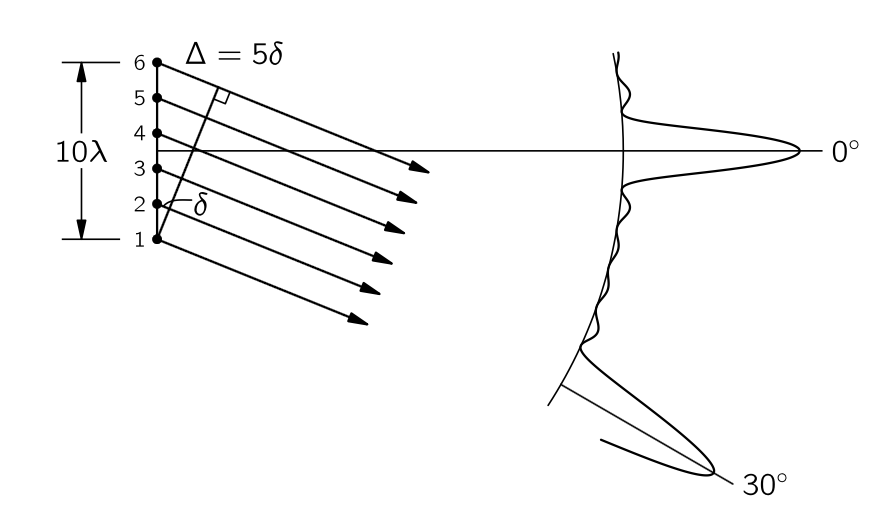{#fig-FLP_1_29_8 width=400}

이렇게 $2\lambda$ 간격으로 쌍극자를 일렬로 배치한 후 각 진동자의 상대적인 위상을 조절하면 우리가 원하는 방향으로 강한 에너지를 보낼 수 있다. 

 

### $\textrm{I}$.29.5 간섭의 수학 {#sec-FLP_1_29_5}

벡터 혹은 복소수를 이용한 두 파동의 합.

 

## $\textrm{I}$.30. 회절 {#sec-FLP_1_30}

### $\textrm{I}$.30-1 $n$ 개의 동일한 진동자에 의한 최종 진폭 {#sec-FLP_1_30_1}

- 간섭(interference)과 회절(diffreraction) 의 구분 : 명확한 구분은 없지만 source 의 개수가 적으면 간섭, 많으면 회절 이라고 하자.

같은 간격으로 직선상에 위치한 동일한 $n$ 개의 진동자를 생각하자. 각각의 진동자의 진폭은 같지만 위상은 다르다. 위상 차이는 실제적인 두 진동자의 위상 차이일 수도 있고 각 진동자로부터의 거리차이로 인한 위상차 일 수 있다. $0$ 번째 진동자를 기준으로 $j$ 번째 진동자 위상이 $j\phi$ 일 때 이 진동자에 의한 진폭을 합친 최종 진폭(resultant amplitude) $R$ 은 아래와 같다.

$$
R = A\left[\cos (\omega t) + \cos (\omega t+ \phi) + \cdots + \cos (\omega t + (n-1) \phi)\right].
$$ {#eq-FLP_1_30_1}

여기서 $\phi = \alpha + 2\pi d \sin \theta/\lambda$ 인 경우를 생각해보자. 

$$
\begin{aligned}
R &= \dfrac{1}{2} \left[\sum_{j=0}^{n-1} Ae^{i(\omega t + j\phi)} + (\text{complex conjugate}) \right] \\[0.3em]
&= \dfrac{1}{2}\left[Ae^{i\omega t}\dfrac{e^{i n \phi /2}}{e^{i\phi /2}}\dfrac{\sin(n\phi /2)}{\sin{\phi/2}}   + (\text{complex conjugate})\right] \\[0.3em]
&= A \cos \left(\omega t + \dfrac{(n-1)\phi}{2}\right) \dfrac{\sin (n\phi/2)}{\sin(\phi/2)}.
\end{aligned}
$$

따라서 최종 진폭 $A_R$ 은

$$
A_R = A \dfrac{\sin (n \phi/2)}{\sin (\phi/2)}
$$ {#eq-FLP_1_30_2}

이며 최종 intensity 는

$$
I = I_0 \dfrac{\sin^2 (n\phi/2)}{\sin^2 (\phi/2)}
$$ {#eq-FLP_1_30_3}

이다.

우리는 $\phi \sim 0$ 에서 $I=n^2I_0$ 임을 알 수 있다. 즉 $n$ 개의 동일한 진동자에 의해 발생되는 에너지는 가장 큰 방향으로는 $n^2$ 에 비례하여 발생한다. (같은 위상의, $\lambda$ 만큼씩 떨여져 있는 $n$ 개의 진동자의 경우와 같다.) 위의 식을 통해 아래의 그림을 그릴 수 있다. $n\phi = 2m\pi$ 인 정수 $m$ 이 존재할 때 $I=0$ 이다. 또한 아래 그래프에서 전체 영역 $[-\pi,\, \pi]$ 에 대한 적분은 $2\pi n I_0$ 임을 계산 할 수 있다.(see [StackExchange](https://math.stackexchange.com/questions/1304167/integral-of-frac-sin2nx-2-sin2x-2-over-pi-pi))

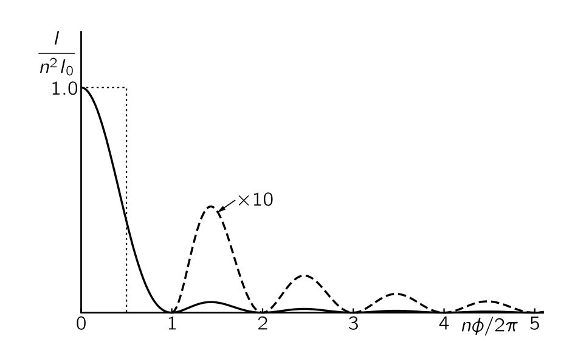{#fig-FLP_1_30_2 width=400}

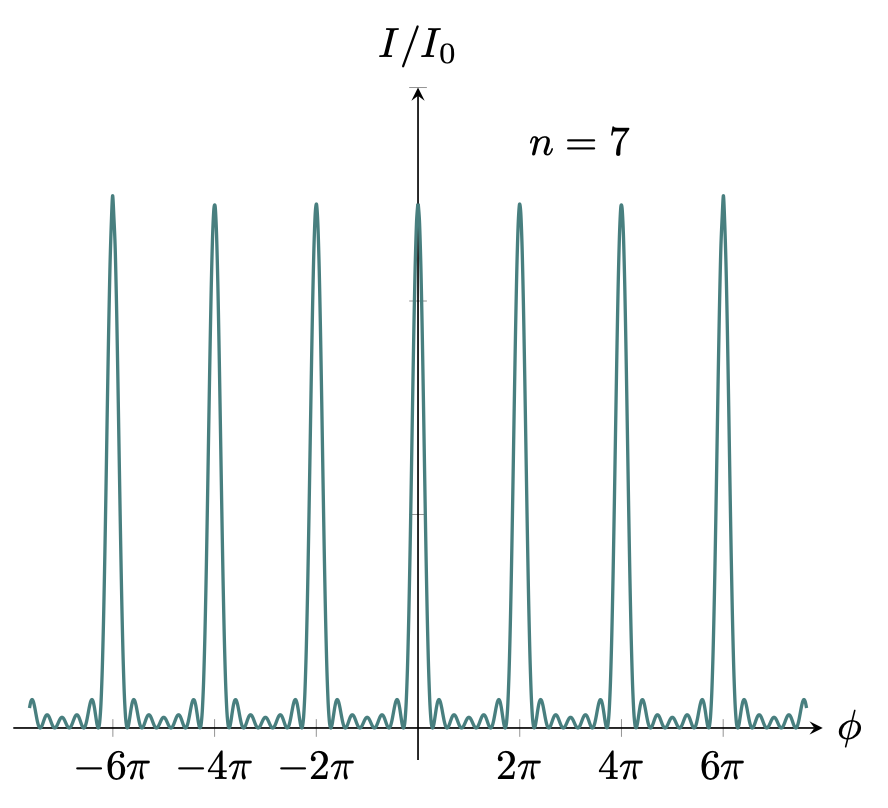{#fig-FLP_tfig2 width=400}

이제 아래 @fig-FLP_1_30_3 같은 진동자 배치를 생각하자. 직선상에, 인접한 진동자와 $d$ 만큼 떨여진 $n$ 개의 진동자가 위치한다. $j$ 번째 진동자는 $j\alpha$ 만큼의 위상(phase) 를 가진다고 하자. 이 진동자가 가 위치한 직선에 수직인 방향으로 $\theta$ 만큼의 각을 가진 위치에서 측정한다고 하자.

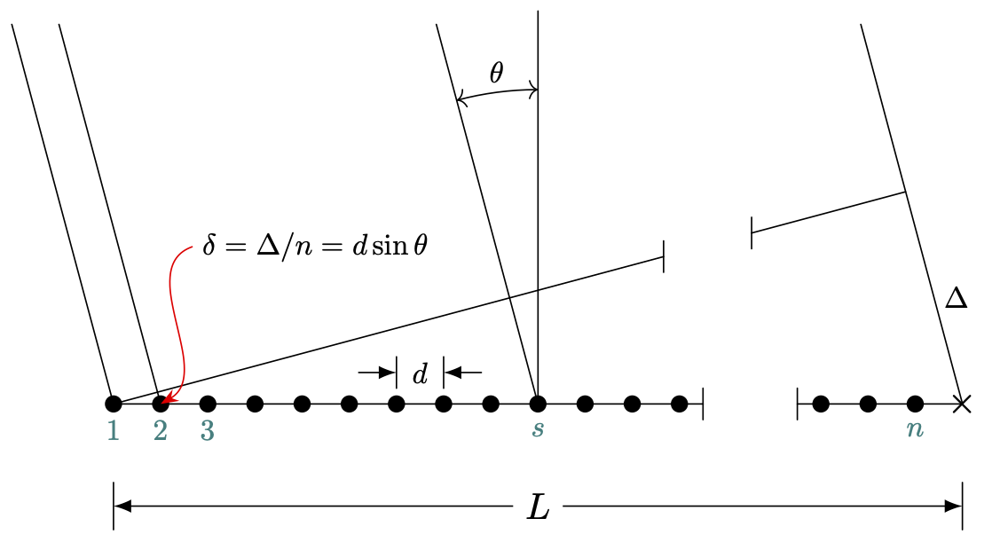{#fig-FLP_1_30_3 width=450}

측정하는 위치에서는 진동자 자체의 위상과 시간 지연에 의한 위상이 합쳐진 위상으로 느끼므로 측정하는 위치에서의 인접한 두 진동자의 위상차 $\phi$ 는 아래와 같다.
$$
\phi = \alpha + 2\pi d \sin \theta/\lambda = \alpha + kd\sin \theta.
$$ {#eq-FLP_1_30_4}

우선 $\alpha=0$ 인 경우는 @eq-FLP_1_30_3 의 경우와 같다. 이 때 첫번째 극소점은 $\phi = 2\pi/n$ 일 때이며 이는 
$$
\lambda = nd\sin \theta
$$ {#eq-FLP_1_30_5}

를 의미한다. @fig-FLP_1_30_3 에서 $\Delta = L\sin\theta = nd\sin\theta$ 이며 따라서 첫번째 극소점은 $\Delta =\lambda$ 일 경우이다.

@eq-FLP_1_30_3 에서 알 수 있는 하나 중요한 사실은 정수 $m$ 에 대해 $\phi = 2 m\pi$ 일 때 최대값이 등장한다는 것이다. 즉 $2\pi d \sin \theta/\lambda = 2\pi m$ 조건이며 이로부터

$$
d\sin\theta = m\lambda
$$ {#eq-FLP_1_30_6}

을 얻는다. @fig-FLP_tfig2 에서 $2\pi$ 주기로 나타나는 큰 픽을을 의미하며 @eq-FLP_1_30_5 와 비슷하지만 완전히 다른 의미임을 명심하라. 여기서 $m$ 의 빔의 **차수 (order)** 라고 하며 $m$ 값에 따라 $0$-차 빔(zero-order beam), $1$-차 빔(first-order beam), $2$-차 빔(second-order beam) ... 이라고 한다.

@eq-FLP_1_30_6 에서 주의해야 할 것은 $d\le \lambda$ 이면 가능한 해는 $m=0$ 일 때 뿐이라는 것이다. **따라서 강한 신호를 보내려면 간격 $d$ 를 파장보다 크게 잡아야 한다**.

 

### $\textrm{I}$.30-2 회절 격자 {#sec-FLP_1_3_20}

**[P1]** (파장이 긴 라디오파를 다루는 경우) 안테나와 전선을 다룰 때 모든 작은 진동자, 즉 안테나의 위상을 동일하게 맞출 수 있다. 그렇다면 빛의 경우는? 광학 영역(optical frequency range)$^2$의 빛의 파장은 매우 짧기 때문에 (파인만 당시에는) 불가능하다. 그러나 다른 방법으로 같은 일을 할 수 있다. [$^2$ 적외선 부터 가시광선을 포함하여 자외선 까지를 광학 영역이라고 한다.]{.aside}

#### **산란**

- 서로 $d$ 만큼 떨어진 평행한 전선들과 여기서 아주 멀리 떨어진(실용적으로 무한대만큼 떨여졌다고 볼 수 있는) 전기장 발생장치를 생각하자. 각각의 전선에 도달할 때 같은 위상을 가진다하자. 전달된 전자기장에 의해 도선의 전하는 진동하며 따라서 새로운 전자기파 발생장치로 볼 수 있다. 이 현상을 **산란 (scattering)** 이라고 한다. 이렇게 우리는 **[P1]** 에서 하려고 했던 것을 다른 방식으로 구현할 수 있다.
- 라디오 발상장치에서의 라디오파가 전선들이 이루는 평면에 수직하게 입사된다면, 그리고 전선의 간격이 파장보다 크다면 이 평면에 수직한 방향과 @eq-FLP_1_30_6 에 의해 정해지는 방향으로 강력한 전자기파가 발생한다. 

#### **회절 격자**

- 유리판에 일렬로 작은 흠을 파서 흠(notch)이 파이지 않은 다른 부분과 다소 다르게 산란되도록 한다. 흠 사이의 간격은 매우 일정하며 빛의 파장보다는 크다.  
- 여기에 빛을 비추면 일부의 빛은 유리를 통과하지만 각각의 흠이 광원의 역할을 하며 특정한 각도로 강한 빛이 나온다. 이 각도는 틈의 간격과 관련이 있다. 이를 **회절 격자 (diffraction grating)** 라고 한다.
- 여러 파장의 빛이 섞여 있을 경우 @eq-FLP_1_30_6 를 보면 알 수 있듯이 강한 빛이 나오는 각도가 빛의 진동수(파장, 에너지...) 에 따라 다르다. 따라서 백색광선을 사용한다면 프리즘과 같은 효과를 낸다. $m$ 차 빔도 당연히 발생한다.
- 이전의 논의에 의하면 각각의 $m$ 차 빔은 같은 빛의 세기를 가져야 하지만 실제로는 그렇지 않다. 심지어 같은 차수 빔의 왼쪽과 오른쪽이 다르기도 하다. 이것을 의도하고 홈의 모양을 비대칭적으로 만들기도 한다.

지금까지는 광원에서의 위상이 모두 같은 경우를 생각했다. 회절 격자를 이용해 임의의 위상차를 주는 방법을 알아보자. 아래 그림과 같이 $d$ 의 간격을 갖는 회절격자에 $\theta_\text{in}$ 의 입사각으로 빛을 쐬어준다고 하자. 그리고 $\theta_{\text{out}}$ 만큼의 산란각을 갖는다고 하자.

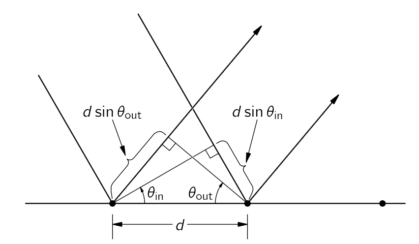{#fig-FLP_1_30_4 width=400}

그렇다면 회절격자의 인접한 두 선에서 발생하는 경로차 $\phi$ 는

$$
\begin{aligned}
\phi &= \dfrac{2\pi d \sin \theta_\text{out}}{\lambda} - \dfrac{2 \pi d \sin \theta_\text{in}}{\lambda} = \dfrac{2\pi d}{\lambda}(\sin \theta_{\text{out}}- \sin \theta_\text{in})\\[0.3em]
& = \dfrac{4\pi d}{\lambda}\cos \left(\dfrac{\theta_{\text{out}} + \theta_\text{in}}{2}\right) \sin \left(\dfrac{\theta_\text{out} - \theta_\text{in}}{2}\right)
\end{aligned}
$$ {#eq-FLP_1_30_7}

강한 intensity 를 얻으려면 $\phi$ 가 $2\pi$ 의 정수배 이어야 한다. 즉 $\phi = 2\pi m$.

**1.** $d<\lambda/2$ 인 경우 $\phi < \pi (\sin \theta_{\text{out}}- \sin \theta_\text{in}) < 2\pi$ 이다. 즉 $m=0$ 이다. 여기에 가능한 두가지 경우를 보자. 

- $\theta_\text{out} = \pi - \theta_\text{in}$ 인 경우. 여기서 빛은 입사방향으로 나가지만 산란된 빛은 입사된 빛이 아니라 산란 과정에서 발생한 빛이다.

- $\theta_\text{out} =\theta_\text{in}$ 인 경우. 즉 **반사(reflection)**. 반사 과정에서 입사된 빛이 반사체의 원자들을 여기(excite) 시키고, 이 반사체의 원자들이 입사각과 같은 방향으로 새로운 파동을 발생시킨다.

**2.** $d$ 가 매우 작은 상황을 생각하자. @eq-FLP_1_30_7 에서 $\phi$ 역시 매우 작아진다. 간격 $d$ 가 줄지만 진동자의 크기가 많아져서 총 위상차, 즉 처음과 마지막 진동자의 위상차가 동일한 경우를 생각해보자. @eq-FLP_1_30_3 에서 $\Phi = n\phi$ 라고 놓자. $\phi \approx 0$ 이며 최대 intensity $I_M = n^2I_0$ 를 생각하면 아래 식을 얻는다.
  $$
  I=I_M \dfrac{\sin^2 (\Phi/2)}{n^2 \sin^2(\phi/2)} \approx 4 I_M \dfrac{\sin ^2 (\Phi/2)}{\Phi^2}.
  $$ {#eq-FLP_1_30_8}

위의 식을 그래프로 그리면 아래 @fig-FLP_1_30_tfig1 와 같다. 그림은 $d<2/\lambda/2$ 인 경우와 유사하지만 여기서는 고차 빔에서의 최대점이 사라진다.

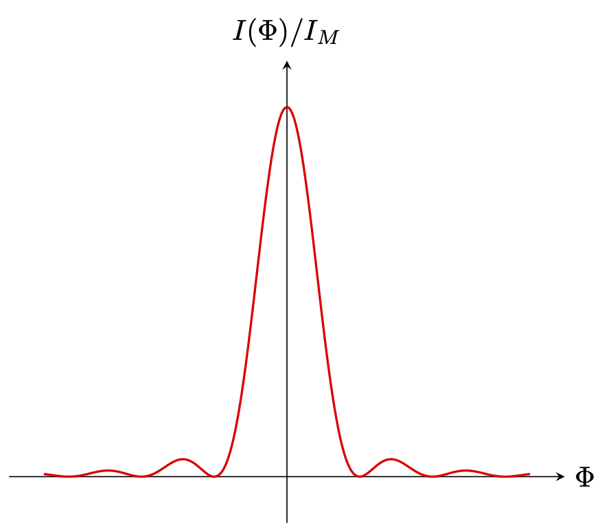{#fig-FLP_1_30_tfig1 width=300}

 

### $\textrm{I}$.30-3 회절격자의 분해능 {#sec-FLP_1_30_3}

앞서 언급했듯이 회절격자는 파장에 따라 산란각이 달라지기 때문에 파장별로 분리하는데 사용 할 수 있다. 두개의 유사한 파장을 가진 광원에서 오는 빛을 파장별로 분리 할 수 있는 능력을 **분해능 (resolving power)** 이라고 한다. 일반적으로 레일리 기준을 사용한다.

#### **레일리 기준(Rayleigh's criteria)**

파장 $\lambda'$ 인 빛에 대해 경로차 $\Delta$ (@fig-FLP_1_30_3) 가 $n\lambda'$ 과 같을 때 intensity maximum peak 이며 $m$-th order beam 에 대해서는 $\Delta = mn\lambda'$ 이어야 한다. $\lambda'$ 과 약간 차이가 나는 파장 $\lambda$ 에 대해서 역시 $\Delta = mn\lambda + \lambda = mn\lambda'$ 이 되도록 하자. $\Delta \lambda = \lambda'-\lambda$ 라고 하면

$$
\dfrac{\Delta \lambda}{\lambda} = \dfrac{1}{mn}
$$ {#eq-FLP_1_30_9}

이며 이 때 $\lambda/\Delta \lambda$ 를 **회절격자의 분해능 (resolving power of grating)** 이라고 한다. 

여기서 경로차에 의한 시간차 $T = \Delta /c$ 를 생각하자. $T=mn\lambda'/c$ 이며 진동수 $\nu' = c/\lambda',\, \nu = c/\lambda$ 를 생각하면

$$
\Delta \nu = \nu-\nu' = \dfrac{c}{\lambda}- \dfrac{c}{\lambda'} = \dfrac{\Delta \lambda}{\lambda \lambda'} = \dfrac{c}{mn\lambda'}= \dfrac{1}{T}
$$

이다.

 

### $\textrm{I}$.30-4 포물선형 안테나 {#sec-FLP_1_30_4}

이제 분해능에 대한 또 다른 문제를 알아보자. 전파망원경의 안테나는 하늘에서 전파원의 위치, 즉 각도의 크기를 결정하는 데 사용된다. 물론 예전의 안테나를 사용해 신호를 찾는다면, 그 신호의 방향을 추적할 수 없을 것이다. 추적 할 수 있는 한 가지 방법은 균등하게 배치된 다수의 쌍극자 와이어를 모두 펼쳐 호주 평원에 깔아 놓는 것이다. 그런 다음 이 안테나들의 모든 전선을 동일한 수신기에 연결하며, 피드 라인의 모든 지연이 동일하도록 한다. 따라서 수신기는 모든 쌍극자로부터 위상이 일치하는 신호를 수신한다. 즉, 동일한 위상에 있는 모든 쌍극자의 모든 파동을 더한다. 전파원이 안테나 배치 바로 위에서 무한대에 가깝게 멀다면 그 라디오파는 같은 위상에 있는 모든 안테나를 자극하여 모두 수신기에 동일한 신호를 제공한다.

이제 라디오 소스가 수직으로부터 작은 $\theta$ 각도만큼 기울어져 있다고 가정하자. 그렇다면 다양한 안테나가 약간 위상이 어긋나게 신호를 수신한다. 수신기는 이러한 위상 차이 신호를 모두 합산하므로, 각도 $\theta$ 가 너무 크면 아무것도 얻지 못한다. 각도는 얼마나 클 수 있을? 답변: 각도 $\Delta$L=\theta$ (@fig-FLP_1_30_3) 가 $2\pi$ 위상 이동에 해당하면 $0$ 이 된다. 즉, $\Delta$ 가 파장 $\lambda$ 인 경우이다. 길이 $L$ 인 안테나 배열로 해석될 수 있는 가장 작은 각은 $\theta = \lambda/L$ 이다. 이와 같은 안테나의 수신 패턴은 수신기를 뒤집어 송신기로 만들었을 때 얻을 수 있는 강도 분포와 정확히 동일하다는 점에 유의하라. 이는 **reciprocal principle** 의 예시이다. 실제로, 안테나의 배열, 각도 등 모든 배열에 대해 일반적으로, 수신기가 송신기일 경우 다양한 방향에서 상대 강도가 어떻게 되는지를 먼저 구하면, 동일한 외부 배선과 동일한 안테나 배열을 가진 수신기의 상대 방향 감도는 송신기일 경우의 방출 상대 강도와 동일하다.

일부 라디오 안테나는 다른 방식으로 제작된다. 많은 쌍극자를 긴 라인에 배치하고, 많은 피드 와이어를 배치하는 대신, 우리는 이를 직선이 아니라 곡선으로 배열하고, 수신기를 산란파를 감지할 수 있는 특정 지점에 배치한다. 이 곡선은 라디오파가 위에서 내려오고 전선이 흩어져 새로운 파동을 만들 경우, 전선이 배치되어 흩어진 파동이 동시에 수신기에 도달하도록 설계되었다 (@fig-FLP_1_26_12). 다시 말해, 곡선은 포물선이며, 소스가 그 축에 정확히 위치할 때 초점에서 매우 강한 강도를 얻을 수 있다. 이 경우 우리는 그러한 장비의 분해능이 무엇인지 매우 명확하게 이해하고 있다. 안테나를 포물선 곡선에 배치하는 것은 필수적인 사항이 아니다. 상대적인 지연 없이, 피드 와이어 없이 모든 신호를 동일한 지점으로 전달하는 편리한 방법일 뿐이다. 그러한 기기가 해석할 수 있는 각도는 여전히 $\theta = \lambda/L$ 이며, 여기서 $L$ 은 첫 번째와 마지막 안테나의 간격을 의미한다. 안테나의 간격에 따라 달라지지 않으며, 안테나가 매우 가깝게 배치될 수도 있고, 실제로는 모두 하나의 금속 조각일 수도 있습니다. 이제 우리는 물론 망원경 거울을 설명하고 있다. 우리는 망원경의 분해능을 찾았다.! (때때로 해상도는 $\theta = 1.22 \lambda/L$ 로 표기되며, 여기서 $L$ 은 망원경의 직경이다.) 그것이 정확히 $\lambda/L$ 이 아닌 이유는 다음과 같다: $\theta = \lambda/L$ 이라고 구했을 때, 모든 쌍극자 선들의 강도가 동일하다고 가정했지만, 일반적으로 사용하는 원형 망원경의 경우 외부 가장자리에서 신호가 많이 들어오지 않는데, 이는 한 변 전체에 걸쳐 동일한 강도를 얻는 정사각형과 같지 않기 때문이다. 우리는 그곳에서 망원경의 일부만 사용하고 있기 때문에 다소 적게 얻을 수 있다. 따라서 유효 직경은 실제 직경보다 약간 짧다는 것을 이해할 수 있으며, 이것이 $1.22$ 계수의 원인이다.어쨌든, 분해능 공식에 그런 정밀성을 넣는 것은 다소 병적으로 보일 수 있다.

### $\textrm{I}$.30-5 색깔이 입혀진 필름: 크리스탈 {#sec-FLP_1_30_5}

앞서 본 것들은 다양한 파동을 더함으로써 얻어지는 간섭 효과 중 일부이다. 하지만 다른 여러 예가 있다. 예를 들어, 굴절률 $n$ 인 물질의 표면에 빛 파동이 닿을 때, 표면에 직각으로 입사한다면 일부 빛이 반사된다. 반사의 원인은 현재 우리가 이해할 수 있는 처지가 아니므로 후에 다루겠다. 하지만 우리가 일부 빛이 매질에 들어올때와 나갈 때 모두에서 반사된다는 것을 알고 있다고 가정해 보자. 얇은 필름에서 광원의 반사를 살펴보면 두 파동의 합을 볼 수 있다. 두께가 충분히 작다면 이 두 파동은 위상에 따라 보강간섭 혹은 소멸 간섭을 일으킬 수도 있다. 예를 들어, 적색광의 반사광은 보강간섭, 청색광의 반사광은 소멸간섭을 이르킨다면 반사된 빛은 밝은 적색광일 것이다. 게다가 두께를 변경하면, 즉 필름이 더 두꺼운 다른 곳을 보면 반전이 발생하여, 빨간색은 소멸하고 파란색은 그렇지 않아 밝은 파란색, 초록색, 노란색 등이 된다. 그래서 얇은 필름을 볼 때 다른 각도에서 보면 색이 변한다. 이는 각 각도마다 타이밍이 다르기 때문입니다. 이로부터 우리는 다양한 각도에서 기름 필름, 비누 거품을 볼 때 보이는 색과 관련된 또 다른 수많은 상황을 이해할 수 있다. 하지만 원칙은 모두 동일합니다: 우리는 서로 다른 단계에서 파동을 추가할 뿐이다.

회절의 또 다른 중요한 응용으로서 격자를 통해 회절된 이미지를 들 수 있다. 만약 단색광을 사용했다면 특정한 위치에 있을 것이다. 거기에 다양한 높은 차수의 이미지도 있다. 이미지의 위치들을 통해 빛의 파장을 알면 격자 위의 선들이 얼마나 떨어져 있는지 알 수 있다. 변화하는 이미지의 강도 차이를 통해 우리는 격자 긁힘의 형태를 파악할 수 있으며, 격자가 와이어로 만든 것인지 톱니 모양으로 만든 것인지, 혹은 그 외의 것인지는 확인할 수 없었다. 이 원리는 결정 내 원자의 위치를 발견하는 데 사용된다. 결정이 3차원이라는 점에서 격자보다 복잡하다. 여기에는 원자 사이의 거리보다 파장이 짧아야 하므로 보통 X선을 사용한다. 이를 통해 눈으로는 볼 수 없이 내부 원자들의 배열을 판단할 수 있다! 

### $\textrm{I}$.30-6 불투명 스크린에 의한 회절 {#sec-FLP_1_30_6}

매우 흥미로운 상황을 생각해 보자. 구멍이 뚫린 불투명한 시트가 있고, 그 한쪽에 조명이 있다고 하자. 이 때 반대편에서의 빛의 강도를 알고자 한다. 보통 빛이 구멍을 통해 비추어 반대쪽에 영향을 미친다고 생각한다. 만약 당신이 열린 구멍 전체에 균일한 밀도로 분포된 광원이 존재하고, 그 광원들의 위상이 불투명한 물질이 없었을 경우와 동일하다고 가정한다면, 좋은 근사값으로 올바른 답을 얻을 수 있다. 물론, 실제로 그 구멍에는 광원이 없으며, 사실 그곳이 확실히 출처가 전혀 없는 유일한 장소입니다. 그럼에도 불구하고, 우리는 구멍이 광원이 있는 유일한 위치라고 간주함으로써 올바른 회절 패턴을 얻을 수 있다. 이는 다소 특이한 사실입니다. 우리는 나중에 이것이 왜 사실인지 알게되겠지만 그 전까지는 일단 받이들이자. 

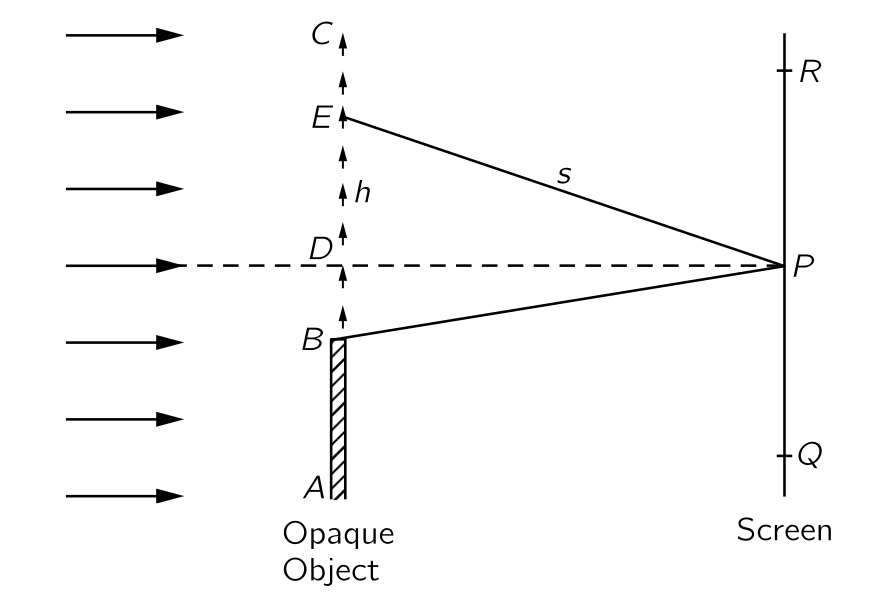{#fig-FLP_1_30_7 width=400}

회절 이론에서는 우리가 간략히 논의해야 할 또 다른 종류의 회절이 있다. 무한대로 간주할수 있는 거리에서 빛이 들어와 물체의 그림자를 드리우는 것을 생각하자. @fig-FLP_1_30_7 은 물체 $AB$ 의 그림자가 파장에 비해 매우 멀리 떨어진 광원에 의해 만들어진 화면을 보여준다. 이제 우리는 그림자 밖에서는 강도가 모두 세고, 그 안에서는 모두 약하다고 예상한다. 사실, 그림자 가장자리 근처에서 빛의 강도를 위치의 함수로 보면 강도가 상승한 뒤 오버슈트하고 흔들리며, 이 가장자리 근처에서 매우 특이한 방식으로 진동한다. 그 이유를 알아보자. 우리가 아직 증명하지 않은 정리를 사용한다면, 실제 문제를 객체 너머의 개방 공간에 균일하게 분포된 일련의 유효 광원으로 대체할 수 있다.

이제 매우 촘촘히 배치된 안테나가 많이 있다고 상상하며 $P$ 지점에서의 빛의 강도를 알고싶다. 그것은 지금까지 우리가 해 온 것과 정확히 같아 보이지만 실제로 그렇지는 않다. 우리 화면이 무한대에 있지 않기 때문이다. 우리는 무한히 먼 곳이 아닌 유한한 위치에서의 빛의 강도를 원한다. 특정 지점에서 강도를 계산하려면 모든 안테나의 기여도를 더해야 한다. 먼저 $D$ 에 안테나가 있으며, 정확히 $P$ 와 반대쪽에 있습니다; 각도를 약간 올리면, 예를 들어 높이 $h$ 정도라고 하면 지연이 증가합니다(거리 변화로 인해 진폭도 변하지만, 멀리 떨어져 있다면 이는 매우 작은 효과이며 위상 차이보다 훨씬 덜 중요하다.). 현재 경로 차이 $EP−DP$ 는 근사적으로 $h^2/2s$ 이며, 따라서 위상 차이는 우리가 $D$ 에서 이동한 거리의 제곱에 비례한다. 이전 연구에서는 $s$ 가 무한했으며, 위상 차이는 $h$ 에 선형적으로 비례했다. 위상이 선형 비례일 때, 각 벡터는 다음 벡터에 일정한 각도로 더해진다. 우리가 지금 필요로 하는 것은 많은 무한소 벡터를 더하여 만든 곡선이며, 그 벡터들이 만드는 각이 선형이 아니라 곡선 길이의 제곱만큼 증가해야한다. 그 곡선을 만들기 위해서는 약간 고급 수학이 포함되지만, 실제로 화살표를 그리고 각도를 측정함으로써 언제든지 구성할 수 있다. 어쨌든, 우리는 @fig-FLP_1_30_8 에 표시된 놀라운 곡선$^3$을 얻을 수 있다. [$^3$ 코루의 나선(Cornu’s spiral) 이라고 불리는]{.aside}

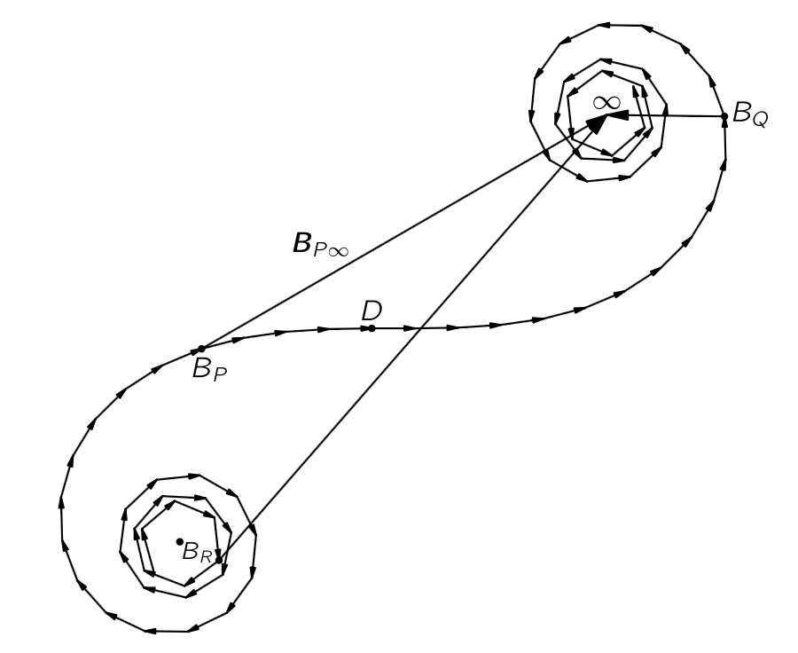{#fig-FLP_1_30_8 width=450}

예를 들어 $P$ 에서의 강도를 계산한다면 $D$ 지점부터 위로 무한대까지, 그리고 $D$ 지점부터 아래로 $B_P$ 지점까지 연속적인 위상의 기여를 더한다. 따라서 우리는 @fig-FLP_1_30_8 의 $B_P$ 에서 시작하여 점점 증가하는 각도의 일련의 화살표를 그린다. 따라서 포인트 $B_P$ 위의 총 기여도는 모두 나선형 곡선을 따라 이동한다. 만약 우리가 어느 지점에서 적분을 멈춘다면, 전체 진폭은 $B$ 에서 그 지점까지의 벡터가 된다. 이 특정 문제에서는 무한대로 진행하므로, 전체 답은 벡터 $\bf{B}_{P\infty}$ 이다. 이제 물체의 점 $B_P$ 에 해당하는 곡선상의 위치는 점 $P$ 가 위치한 위치에 따라 달라지며, 점 $D$, 즉 변곡점은 항상 점 $P$ 의 위치에 해당하기 때문입니다. 따라서, $P$ 가 $B$  위에 위치하는 위치에 따라 시작점은 곡선의 왼쪽 하단의 다양한 위치에 위치하게 되며, 그 결과 벡터 $\bf{B}_{P\infty}$ 는 많은 최대값과 최소값을 갖게 된다. (Fig. 30–9).

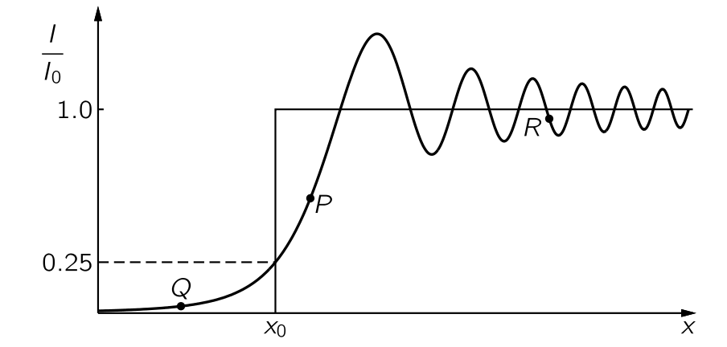{#fig-FLP_1_30_9 width=400}

반면에 $P$ 의 반대편인 $Q$ 에서는 나선 곡선의 한쪽 끝만 사용하고 다른 쪽은 사용하지 않습니다. 다시 말해, $D$ 가 아니라 $B_Q$ 에서 시작하므로, $Q$ 가 그림자 속으로 더 멀어질수록 지속적으로 감소하는 강도를 얻게 된다.

우리가 즉시 쉽게 계산하여 우리가 정말 이해하고 있음을 보여줄 수 있는 한 가지는 가장자리와 정확히 반대되는 위치에서의 강도이다. 여기의 강도는 입사광의 $1/4$ 이다. 이유: 정확히 가장자리에(화살표의 끝점 $B$ 가 @fig-FLP_1_30_8 에서 $D$ 에 위치함)에서는 밝은 영역 안으로 멀리 있었을 경우 가졌을 곡선의 절반을 가지고 있다. 위치 $R$ 이 빛 안으로 멀리 있다면, 우리는 곡선의 한쪽 끝에서 다른 쪽 끝까지, 즉 하나의 전체 단위 벡터로 이동한다; 그러나 그림자의 가장자리에 있을 경우, 우리는 진폭의 절반, 즉 강도의 $1/4$ 에 불과하다.

### $\textrm{I}$.30-7 진동하는 전하 평면의 장 {#sec-FLP_1_30_7}

모든 소스가 함께 진동하고, 그 움직임이 평면 내에서 동일한 진폭과 위상을 갖는 평면을 생각해보자. 평면으로부터 상당히 먼 거리에서의 전기장은 무언인가?(물론, 우리는 소스에 가까운 필드에 대한 올바른 공식이 없기 때문에 멀리서만 생각한다) 전하의 평면을 $xy$ 평면으로 두고 $z$ 축 위의 멀리 떨어진 점 $P$ 에서의 전기장을 구하고자 한다.(@fig-FLP_1_30_10). 평면에서의 단위 면적당 전하 개수를 $\eta$, 각각의 전하량을 $q$ 라고 하자.모든 전하들은 동일한 방향, 진폭 및 위상을 가진 단순 진동자이다. 그렇다면 전하의 위치를 각 전하의 중심에 대해 $x_0\cos \omega t$ 혹은 복소수로 $x_0e^{i\omega t}$ 로 쓸 수 있다.

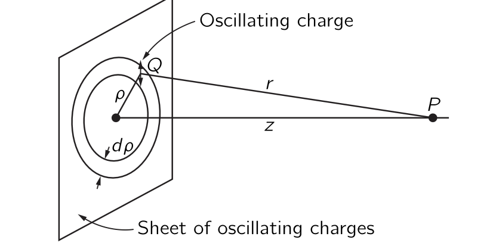{#fig-FLP_1_30_10 width=450}

이제 전하 $q$ 에 의한 점 $P$ 에서의 전기장을 구한 후, 각각의 전하의 기여도를 더한다. 우리는 복사장이 전하의 가속도에 비례한다는 것을 알고 있으며, 그 가속도는 모든 전하에 동일하게 $−\omega^2x_0e^{i\omega t}$ 이다. $Q$ 의 전하에 의한 $P$ 에서의 전기장은 시간 $t$ 가 아닌 이전 시간 $t'=t−r/c$ 에서의 전하의 가속도에 의해 정해진다는 것을 기억하자. 여기서 $r/c$ 는 파동이 $Q$ 에서 $P$ 까지의 거리 $r$ 을 이동하는 데 걸리는 시간이다. 따라서 $P$ 에서의 전기장은

$$
−\omega^2 x_0e^{i\omega(t−r/c)}.
$$ {#eq-FLP_1_30_10}

에 비례한다. 복사 전하로부터 멀리 떨어진 전기장에 대한 우리 공식에서 P에서 보이는 가속도 값을 사용하면, 우리는

$$
\left(\begin{array}{c} Q \text{ 의 전하에서 기인한 } \\ P \text{ 에서의 전기장} \end{array}\right) \approx \dfrac{q}{4\pi \epsilon_0 c^2} \dfrac{\omega^2x_0e^{i\omega(t−r/c)}}{r}
$$ {#eq-FLP_1_30_11}

을 얻는다. 물론 이 공식은 가속도에서 $QP$ 선에 수직인 성분만 사용해야 하므로 옳지 않다. 그러나 $PQ$ 사이의 거리가 @fig-FLP_1_30_10 의 $\rho$ 에 비해 매우 크다는 가정 하에 근사적으로 사용 할 수 있다.

이제 평면에 있는 모든 전하의 기여를 더하여 $P$ 에서의 전기장을 얻을 수 있다. 벡터합을 해야 하지만 앞서 한 근사를 사용하면 전기장의 방향이 모든 전하에 대해 거의 동일하기 때문에 단순합으로 전기장을 얻을 수 있다. 그렇다면 $P$ 에서의 전기장은

$$
E(P)=\int_0^\infty \dfrac{q}{4\pi \epsilon_0 c^2}\dfrac{\omega^2 x_0e^{i\omega(t−r/c)}}{r}\cdot \eta \cdot 2\pi \rho\,d\rho
$$ {#eq-FLP_1_30_12}

이다. 여기서 $r=\sqrt{\rho^2+z^2}$ 이므로 $\rho d\rho = r\,dr$ 이며 따라서

$$
\begin{aligned}
E(P) &= \dfrac{q\eta \omega^2 x_0 e^{i\omega t}}{2 \epsilon_0 c^2} \int_z^\infty e^{-i\omega r/c}\,dr \\[0.3em]
&=  \dfrac{q\eta \omega^2 x_0 e^{i\omega t}}{2 \epsilon_0 c^2}\cdot \left(\dfrac{ic}{\omega}\right)\left[e^{-i\infty}-e^{-i\omega z/c}\right]
\end{aligned}
$$

이다. 여기서 $e^{-i\infty} = \displaystyle\lim_{r\to \infty}e^{-i\omega r/c}$ 를 의미한다. 파인만은 여러 물리적 논리를 통해 이 값이 $0$ 이 될 것임을 주장하며, 수학적으로는 리만-르베그 보조정리로 보일 수 있다. 이것을 받아들이면

$$
E(P) = - \dfrac{\eta q}{2\epsilon_0 c}\left[i\omega x_0 e^{i\omega (t-r/c)}\right]
$${#eq-FLP_1_30_18}

이다. 여기서 $\left[i\omega x_0 e^{i\omega (t-r/c)}\right]$ 는 진동하는 전하의 $t'=t-r/c$ 에서의 속도이므로
$$
E(P) = −\dfrac{ηq}{2\epsilon_0 c} [\text{전하의 속도}]_{\text{at } t−z/c}.
$$ {#eq-FLP_1_30_19}

이다.

## $\textrm{I}$.31 굴절률의 기원 {#sec-FLP_1_31}

### $\textrm{I}$.31-1 굴절률 {#sec-FLP_1_31_1}

우리는 이전에 물에서는 빛이 공기보다 느리게, 공기에서는 진공보다 약간 느리다고 말했다. 이 효과는 굴절률 $n$ 에 의해 설명된다. 이제 우리는 이렇게 느린 속도가 어떻게 나타날 수 있는지 알아볼 것이다. 특히, 우리는 이전에 제시한 몇 가지 물리적 가정이나 진술과의 관계가 무엇인지 확인하려고 노력해야 하며, 이는 다음과 같다:

a. 어떠한 물리적 상황에서도 전체 전기장은 언제나 우주에 존재하는 모든 전하에서 기원한 전기장의 합으로 나타낼 수 있다.

b. 단일 전하로부터의 전기장은 항상 속력 $c$ 로 지연된 가속도에 의해 주어진다. (복사선 필드에 대해).

하지만 유리 조각에 대해서는 속력이 $c/n$ 으로 늦춰져야 한다고 생각할 수도 있다. 하지만 그것은 옳지 않으며, 우리는 왜 그렇지 않은지 이해해야 한다.

**빛이나 모든 전기파가 굴절률이 $n$ 인 물질을 통과할 때 $c/n$ 의 속력으로 이동하는 것으로 보이는 것은 대략 사실이지만, 그 장은 여전히 물질 내에서 움직이는 전하를 포함한 모든 전하의 운동의해 생성되며 장의 이동 속도는 $c$ 이다.** 이제 우리는 겉보기에 더 느린 속도가 어떻게 발생하는지 이해해야 한다.

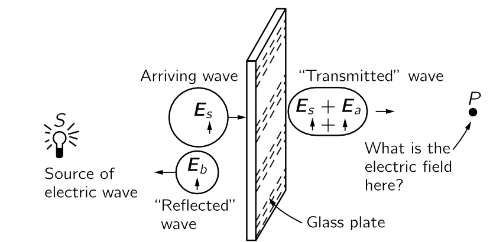{#fig-FLP_1_31_1 width=400}

매우 간단한 보기를 들어 보자. @fig-FLP_1_31_1 와 같이 투명한 얇은 유리 판으로 부터 멀리 떨어진 $S$ 에 소스가 있고 판의 반대쪽에 역시 멀리 떨어져 있는 $P$ 에서의 전기장을 알아보자. 앞서 언급한 원리에 따라 이동 전하와 거리가 먼 곳에서의 전기장은 외부 소스($S$) 에서 발생하는 전기장과 유리판 내부의 각 전하가 생성하는 전기장의 벡터합이며, 각 전하로부터 속도 $c$ 의 적절한 지연을 가지고 있다. 각 전하의 기여도는 다른 전하의 기여와 무관하다. 이것은 우리의 기본 원칙이다. $P$ 에서의 전기장은

$$ 
\bf{E}(P) = \sum_\text{전체 전하} \bf{E}_\text{각각의 전하}.
$$ {#eq-FLP_1_31_1}

또는

$$
\bf{E} = \bf{E}_\text{source} + \sum_\text{모든 기타 전하}\bf{E}_\text{각각 의 전하}.
$$ {#eq-FLP_1_31_2}

우리는 모든 물질이 전자를 포함하는 원자로 구성되어 있다는 것을 알고 있으며 소스의 전기장에 의해 이 전자가 위아래로 움직인다. 그리고 움직이는 전자는 장을 생성하여 새로운 라디에이터가 된다. 즉 이 라디에이터는 소스 $S$ 의 필드에 의해 구동된다. 전체 전기장은 단순히 소스 $S$ 에 의한 전기장 뿐만 아니라 다른 움직이는 전하들의 추가적인 기여의 합이다. 이는 그 전기장은 유리가 존재하기 이전에 존재하던 전기장과 동일하지 않으며, 유리 내부의 전기장이 다른 속도로 움직이는 것처럼 보이도록 수정된 것임을 의미한다. 그것은 우리가 정량적으로 해결하고자 하는 아이디어이다. 이것은 솔직히 말하자면 꽤나 복잡하다. 우리는 다른 모든 움직이는 전하가 소스의 전기장에 의해 구동된다고 말했지만, 그것은 소스뿐만 아니라 움직이는 모든 전하를 느낀다. 특히 유리 안에서 이동하고 있는 다른 전하를 느끼게 된다. 따라서 특정 전하에 작용하는 전체장은 다른 전하들에 의한 전기장들의 합이며, 그 전하들의 운동은 그 특정 전하가 하는 일에 따라 달라진다! 완전하고 정확한 공식을 얻기 위해 복잡한 방정식 집합이 필요함을 알 수 있다. 이는 너무 복잡해서 $\textrm{II}$ 권에서나 다룰 수 있다.

대신 우리는 모든 물리적 원리를 매우 명확하게 이해하기 위해 매우 간단한 경우만 생각하기로 하자. 우리는 다른 원자들로부터의 효과가 소스로부터의 효과에 비해 매우 작은 상황이라고 가정한다. 다시 말해, 우리는 다른 전하들의 운동에 의해 전체 장이 크게 변형되지 않는 물질을 선택한다. 굴절률이 $1$ 에 매우 가까운 물질이 이에 해당하며, 예를 들어 원자의 밀도가 매우 낮은 물질이 그럴 수 있다. 우리의 계산은 굴절률이 어떠한 이유로든 $1$ 에 매우 가깝게 되는 모든 경우에 유효하다. 이를 통해 가장 일반적이고 완전한 해를 얻기 위한 복잡함을 피할 수 있다.

덧붙여 말하자면 판 내 전하의 움직임에 의해 발생하는 또 다른 효과가 있음을 알아야 한다. 이러한 전하들은 파동을 소스 $S$ 쪽으로 다시 복사한다. 이 뒤로 진행하는 전기장 때문에 투명 재료의 표면에서 반사되는 빛을 우리가 볼 수 있다. 그것은 단순히 표면에서 오는 것이 아니다. 후방 복사는 내부 곳곳에서 발생하지만, 전체적인 효과는 표면에서 반사되는 것과 동일하다는 것이 밝혀졌다. 이러한 반사 효과는 현재 우리의 근사 범위를 넘어선다. 왜냐하면 우리는 굴절률이 $1$ 에 매우 근접하여 빛이 거의 반사되지 않는 물질로 제한할 것이기 때문이다. 

::: {#exm-FLP_1_31_refrective_index_and_snell_law}

#### 매질에 따른 파동 속도

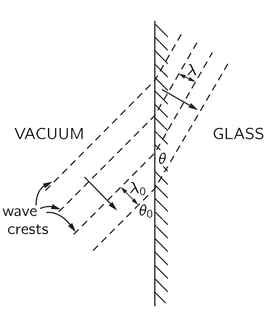{#fig-FLP_1_31_2 width=250}

굴절률의 기원을 알아보기 전에 물질마다 겉보기 파동 속도가 서로 다른 이유를 이해해야 한다. 빛의 굴절은 파동의 유효 속도가 물질마다 다르기 때문에 발생한다. 예를 들어 @fig-FLP_1_31_2 에 진공 상태에서 유리 블록 표면에 도달하는 전기파의 연속적인 마루를 그렸다. 마루 꼭대기에 수직인 화살표는 파동의 이동 방향을 나타낸다. 이제 파동의 모든 진동은 동일한 진동수를 가져야 한다. (우리는 구동 진동이 구동 소스와 동일한 진동수를 가진다는 것을 확인했다.) 이는 또한 표면 양쪽에 있는 파동의 파동 능선이 서로 이동해야 하므로 표면을 따라 동일한 간격을 가져야 함을 의미하며, 따라서 경계에 위치한 전하가 하나의 진동수만을 느끼게 된다. 파동의 마루 사이의 거리가 파장이며, 파장은 속도를 주파수로 나눈 값이다. 진공 영역에서는 $\lambda_0=2\pi c/\omega$ 이며, 반대쪽 유리 영역에서는 $\lambda=2\pi v/\omega$ 이므로 파동의 속도 $v=c/n$ 에 대해 $2\pi c/\omega n$ 이다. 그림에서 우리는 파동이 경계에 제대로 "맞는" 유일한 방법은 물질 내 파동이 표면에 대해 다른 각도로 이동하는 것임을 알 수 있다. 그림의 기하학을 보면, "맞음" 에 대해 $\lambda_0/\sin\theta_0 = \lambda /\sin\theta$ 또는 $\sin\theta_0 / \sin\theta = n$ 이어야 하는데, 이는 스넬의 법칙이다. 우리는 논의의 나머지 부분에서는 인덱스 $n$ 의 물질에서 빛의 유효 속도가 $c/n$ 인 이유만을 고려하고, 이 장에서는 빛 방향의 굽힘에 대해 더 이상 고려하지 않겠다.

:::

 

이제 @fig-FLP_1_31_1 에 표시된 상황으로 돌아가자. 우리는 유리판의 모든 진동 전하에 의해 $P$ 에서 생성되는 전기장 $E_a$ 를 계산해야 한다. 이는 @eq-FLP_1_31_2 의 두번째 향 $\sum [\cdots]$ 이다. 

먼저 $P$ 에서의 전체 전기장이 얇은 판을 통과하면서 속도가 감소하는 원천으로부터의 복사처럼 보인다면 $E_a$ 가 어떠해야 하는지 알야보자. 만약 판이 영향을 미치지 않았다면, 오른쪽으로 이동하는 파동의 장($z$ 축을 따라)은

$$
E_\text{source}=E_0 \cos \omega (t−z/c)
$$ {#eq-FLP_1_31_3}

혹은 

$$
E_\text{source}=E_0e^{i\omega (t−z/c)}.
$$ {#eq-FLP_1_31_4}

그렇다면 파동이 판을 통과할 때 더 천천히 이동하면 어떻게 될까? 판의 두께를 $\Delta z$ 라고 하자. 판이 없으면 파동은 시간 $\Delta z/c$ 에서 $\Delta z$ 거리만큼 이동한다. 하지만 그것이 $c/n$ 의 속도로 이동하는 것으로 보인다면, $\Delta t=(n−1)Δz/c$ 만큼의 추가시긴이 걸린다. 우리는 @eq-FLP_1_31_4 에서  $(t−\Delta t)$ 즉 $[t−(n−1)\Delta z/c]$ 로 바꿔서 추가 시간의 기여를 고려 할 수 있다. 따라서 판을 삽입한 후의 파동은

$$
E_\text{after plate}=E_0e^{i\omega [t−(n−1)\Delta z/c−z/c]},
$$ {#eq-FLP_1_31_5}

혹은 

$$
E_\text{after plate}=e^{−i\omega (n−1)\Delta z/c} E_0e^{i\omega (t−z/c)}
$$ {#eq-FLP_1_31_6}

으로 쓸 수 있다. 즉 판에 의해 위상이 $\omega (n−1)\Delta z/c$ 만큼 지연되었다.

우리는 앞서 판에 의해 원래의 전기장 $E_\text{source}=E_0e^{i\omega (t−z/c)}$ 에 전기장 $E_a$ 를 추가해야 한다고 말했지만, 실제로는 판의 효과는 전기장의 위상을 이동시키는 것임을 알게되었다. 그러나 적절한 복소수를 더하면 동일한 결과를 얻을 수 있으므로 어떻게 말하든 상관 없다. $\Delta z$ 가 작을 경우는 특히 쉽다. 

$$
e^{−i\omega (n−1)\Delta z/c} \approx 1−i\dfrac{\omega (n−1)\Delta z}{c}.
$$ {#eq-FLP_1_31.7}

이며 이 근사를 @eq-FLP_1_31_6 에 사용하면

$$
E_\text{after plate}=\underbrace{E_0e^{i\omega (t−z/c)}}_{\Large E_\text{source}} −\underbrace{i\dfrac{\omega (n−1)\Delta z}{c}E_0e^{i\omega (t−z/c)}}_{\Large E_a}.
$$ {#eq-FLP_1_31_8}

첫 번째 항은 소스으로부터의 전기장이며, 두 번째 항은 판의 진동 전하에 의해 판 오른쪽에 생성되는 필드인 $E_a$ 와 동일해야 한다. 

### $\textrm{I}$.31-2 물질에 의한 장 {#sec-FLP_1_31_2}

이제 @eq-FLP_1_31_8 에서의 두번째 항 $E_a$ 가 판에서 진동하는 전하로부터 기대할 수 있는 종류의 전기장인가를 물어야 한다. 이것을 보인다면 우리는 인덱스 $n$ 의 기원을 알 수있다! 우리는 이제 물질의 전하가 생성할 전기장을 계산하겠다. 많은 기호가 사용될 것이기 때문에 미리 정리하도록 하자 (@tbl-FLP_1_31_1).

::: {#tbl-FLP_1_31_1 style="max-width: 350px; margin: auto;"}

| 기호들 |
|:---------|
| $E_s=$	소스의 필드  (이전의 $E_\text{source}$)|
| $E_a=$ 플레이트 내 전하에 의해 생성된 필드 |
| $\Delta z=$ 판의 두께 |
| $z=$ 판으로부터 수직 거리 |
| $n=$ 굴절률 |
| $\omega=$	방사선의 진동수 |
| $N=$ 판 내 단위 부피당 전하 수 |
| $\eta=$	판의 단위 면적당 전하 수 |
| $q_e=$ 전자의 전하량 |
| $m=$ 전자의 질량 |
| $\omega_0=$ 원자에 결합된 전자의 공명 진동수 |

: 파인만 물리학 강의 $\textrm{I}$ Table. 31-1. 계산에 사용되는 기호
:::

만약 @fig-FLP_1_31_1 의 소스 $S$ 가 왼쪽으로 충분히 멀리 떨어져 있다면, 필드 $E_s$ 는 판의 모든 $S$ 쪽 표면에서 동일한 위상을 갖는 것으로 근사 할 수 있다. 그렇다면 판에서의 전기장은

$$
E_s=E_0e^{iω(t−z/c)}.
$$ {#eq-FLP_1_31_9}

이며, 판의 $z=0$ 인 면에서 

$$
E_s=E_0e^{iωt} 
$$ {#eq-FLP_1_31_10}

판의 원자의 각 전자는 이 전기장을 느끼며 전기력 $qE$ 에 의해 위아래로 움직이게 된다($E_0$ 의 방향이 수직이라고 가정한다). 전자의 움직임을 계산하기 위해 원자를 작은 진동자라고 가정한다. 즉, 전자는 원자에 탄성적으로 붙어 있는 조화진동자이다.

전자가 궤도에서 회전한다는 이야기를 들어봤다면, 앞의 모델은 원자에 대한 재미있는 모델이라고 생각할 수도 있다. 하지만 그것은 단지 과도하게 단순화된 모델일 뿐이다. 파동역학 이론에 의해 제시된 원자에 대한 올바른 모델은, 빛과 관련된 문제에 대해서는 전자가 마치 스프링에 부착된 것처럼 행동한다는 것을 보여준다. 따라서 전자들이 질량 $m$, 공명 주파수 $\omega_0$ 를 가지는 선형 진동자로 모델링하는 것은 타당하다. 이 경우의 운동방정식은 추진력 $F$ 에 대해 다음과 같다.

$$
m\left(\dfrac{d^2 x}{dt^2} + \omega^2_0 x\right)=F.
$$ {#eq-FLP_1_31_11}

여기서 추진력은 소스로부터의 전기장에서 기인하므로

$$
F=q_eE_s=q_eE_0e^{iωt}
$$ {#eq-FLP_1_31_12}

이고 이 $F$ 에 대한 운동방정식 @eq-FLP_1_31_11 의 해는 다음과 같다.

$$
x=\dfrac{q_eE_0}{m(\omega_0^2 -\omega^2)}e^{i\omega t}.
$$ {#eq-FLP_1_31_16}

이제 이 원자들이 $P$ 에 생성하는 장 $E_a$ 를 구해보자. 우리는 이미 [$\textrm{I}$.30 회절](#sec-FLP_1_30) 에서 모든 전하가 함께 움직이는 전하 시트에 의해 생성되는 전기장이 무엇인지 알고 있다. @eq-FLP_1_30_19 를 보자. 우리는 $P$ 에서의 필드 $E_a$ 가 음의 상수에 $z/c$ 만큼 지연된 전하의 속도임을 알고 있다. @eq-FLP_1_31_16 에서 $x$ 를 미분하여 속도를 얻고,그리고 지연을 적용하여 $t\to t-z/c$ 로 하면 다음을 얻는다.

$$
E_a=−\dfrac{\eta q_e}{2\epsilon_0 c}\left[ \dfrac{i \omega q_e E_0}{m(\omega_0^2 − \omega^2)}e^{i\omega (t−z/c)}\right].
$$ {#eq-FLP_1_31_17}

예상대로 전자의 운동은 오른쪽으로 이동하는 추가 파동을 생성했으며(이는 $e^{i\omega(t−z/c)}$ factor 라고 한다), 이 파동의 진폭은 판 내 단위 면적당 원자 수($\eta$)와 소스 전기장의 강도($E_0$)에 비례한다. 또한 예상할 수 있듯이 원자적 특성에서 기인하는 몇가지 요인($q_e$, $m$, $\omega_0$) 에 의존한다.

하지만 가장 중요한 점은 @eq-FLP_1_31_17 의 $E_a$ 가 @eq-FLP_1_31_8 의 $E_a$ 와 매우 유사하다는 것이다. 후자는 파동이 굴절률 $n$ 을 가진 물질을 통과할 때의 지연과 관련된다. 두 $E_a$ 가 동일할 조건은 다음과 같다.

$$
(n−1)\Delta z=\dfrac{\eta q_e^2}{2\epsilon_0 m(\omega_0^2−\omega^2)}
$$ {#eq-FLP_1_31_18}

여기서 단위 면적당 전하 수 $\eta = N\Delta z$ 이므로 양변이 $\Delta z$ 에 비례한다. 이를 이용하면

$$
n=1+\dfrac{Nq_e^2}{2\epsilon_0 m(\omega_0^2 −\omega^2)}.
$$ {#eq-FLP_1_31_19}

이 방정식은 우리가 얻고자 하는 굴절률을 설명한다.

### $\textrm{I}$.31-3 분산 관계 {#sec-FLP_1_31_3}

앞절의 과정으로부터 기본적인 원자에 관계된 양으로부터 굴절률을 계산했을 뿐만 아니라 빛의 진동수 $\omega$ 에 따라 굴절률이 어떻게 변하는지도 알게 되었다. 이는 “빛은 투명한 물질에서 더 천천히 이동한다” 와 같은 단순한 진술로는 결코 이해할 수 없는 것이다. 물론 우리는 여전히 단위 부피당 원자 수, 자연 주파수 $\omega_0$ 와 같은 값을 알아야 하는 문제가 있다. 이 값은 재료마다 다르며, 지금은 그에 대한 일반적인 이론을 얻을 수 없다. 이런 다양한 물질의 특성에 대한 일반 이론은 양자 원자 역학에서만 가능하다. 또한, 서로 다른 재료는 서로 다른 특성과 서로 다른 굴절률을 가지고 있기 때문에, 어쨌든 모든 물질에 적용되는 지표에 대한 일반적인 공식을 기대할 수 없다.

하지만, 우리는 다양한 상황에서 우리가 얻은 식에 대해 논의 할 수 있다. 대부분의 보통의 기체(예를 들어 공기, 무색 기체, 수소, 헬륨 등)의 경우 전자 진동자의 자연 진동수는 자외선에 해당한다. 즉 $\omega_0$ 는 가시광선의 진동수 $\omega$ 보다 매우 커서 $\omega_0^2 - \omega^2 \approx \omega_0^2$ 으로 근사 할 수 있다. 즉 굴절률이 전파의 진동수와 거의 무관하다. 이 현상은 유리와 같은 대부분의 다른 투명 물질에도 해당된다. 그래도 조금의 변화가 있으며 청색광의 굴절률이 적색광보다 크다. 그것이 프리즘이 빛을 빨간색보다 파란색에서 더 많이 굽히는 이유이다.

굴절률이 진동수에 의존하는 현상을 **분산 현상 (phenomenon of dispersion)** 이라고 하며, $n(\omega)$ 를 **분산 방정식 (dispersion equation)** 이라고 한다. 

분산 방정식을 통해 흥미로운 현상을 예상 할 수 있다. 자연 진동수 $\omega_0$ 가 가시광선 영역에 위치하거나, 유리와 같은 물질의 굴절률을 자외선에서 측정한다면 $\omega \approx \omega_0$ 일 수 있으며 따라서 굴절률이 매우 크게 증가할 수 있다. 게다가 $\omega > \omega_0$, 혹은 X-선과 같은 매우 높은 진동수의 빛을 사용한다면 $\omega \gg \omega_0$ 일 수 있다.

자유 전자 기체에 라디오파 혹은 또는 가시광선를 비추면 유사한 상황이 발생한다. 상층 대기에서는 태양으로부터 방출되는 자외선에 의해 원자에서 방출된 전자가 자유 전자 형태로 존재한다. 자유 전자의 경우 탄성 복원력이 없으므로 $\omega_0=0$ 이며, 따라서 분산 방정식 @eq-FLP_1_31_19 에서 $\omega_0=0$ 로 놓으면 성층권 내 전파의 굴절률에 대한 올바른 식이 얻어진다. 여기서 $N$ 은 이제 성층권 내의 자유 전자의 밀도이다. 하지만 그 결과 $n<1$, 즉 물질 내 파동의 유효 속도가 $c$ 보다 큰 결과를 얻는다. 이것은 옿은가?

이것은 옳다. 빛의 속도보다 더 빠른 신호를 보낼 수 없다고 해도, 특정 진동수에서 물질의 굴절률이 $1$ 보다 크거나 작을 수 있다는 것은 사실이다. 이는 산란된 빛에 의해 발생하는 위상 이동이 양수이거나 음수일 수 있음을 의미한다. 그러나 신호를 보낼 수 있는 속도는 한 주파수의 굴절률에 의해 결정되는 것이 아니라, 여러 주파수의 굴절률에 따라 달라진다는 것을 보일 수 있다. 굴절률이 우리에게 알려주는 것은 파동의 노드(또는 마루)가 이동하는 속도이며, 파동의 노드는 그 자체로 신호가 아니다. 어떠한 변조도 없는 소위 완전파(perfect wave) 는 시작 시점을 알 수 없으므로 타이밍 신호로 사용할 수 없다. 신호를 보내려면 파동을 어떻게든 변화시켜 그 안에 노치(notch)를 약간 더 두껍게나 혹은 얇게 만들어야 한다. 즉, 파동에 두 개 이상의 주파수가 있어야 하며, 신호가 이동하는 속도는 굴절률 뿐만 아니라 진동수에 따라 굴절률이 변하는 방식에도 의존한다. 그러나 이 주제는 [$\textrm{I}$.48 비트](vol1_7.qmd#sec-FLP_1_48) 까지 미뤄야 한다. 이후 우리는 그러한 유리를 통과하는 신호의 실제 속도를 계산할 수 있으며, 신호의 속도는 빛의 속도보다 빠를 수 없다는 것과, 수학적 점인 노드들은 빛의 속도보다 빠르게 이동할 수 있다는것을 확인할 수 있다.

그 현상이 어떻게 일어나는지에 대한 약간의 힌트를 주자면, 실제 어려움은 전하의 반응이 필드와 반대이며, 즉 부호가 뒤집혔기 때문이다. 따라서 $x$ 에 대한 @eq-FLP_1_31_16 에서 전하의 변위는 추진력과 반대방향인데 이는 $(\omega_0^2 −\omega^2)$ 은 $\omega_0$ 가 작을 때 음수이기 때문이다. 이 식은 전기장이 한 방향으로 당겨지면 전하가 반대 방향으로 이동한다고는 것을 보여준다.

전하는 왜 반대 방향으로 가는가? 전기장이 처음 켜졌을 때는 분명히 반대 방향으로 움직이기 시작하지 않는다. 운동이 처음 시작될 때는 일시적인 현상이 존재하고, 잠시 후에 진정되며, 그때서야 전하의 진동 위상이 구동장과 반대쪽에 위치한다. 그리고 그때 전송된 필드의 위상이 원본 파에 비해 진행된 것으로 보일 수 있다. **위상 속도(phase velocity)** 즉 노드의 속도가 $c$ 보다 크다고 말할 때는, 바로 이러한 위상의 진행을 의미한다. @fig-FLP_1_31_4 에서는 파가 갑자기 켜져(신호를 만들기 위해) 파동이 어떻게 향할 수 있는지에 대한 도식적인 아이디어를 보여준다. 그림에서 보시다시피, 신호(즉, 파동의 시작)는 위상 전진으로 끝나는 파동에 대해 더 일찍 시작되지 않는다.

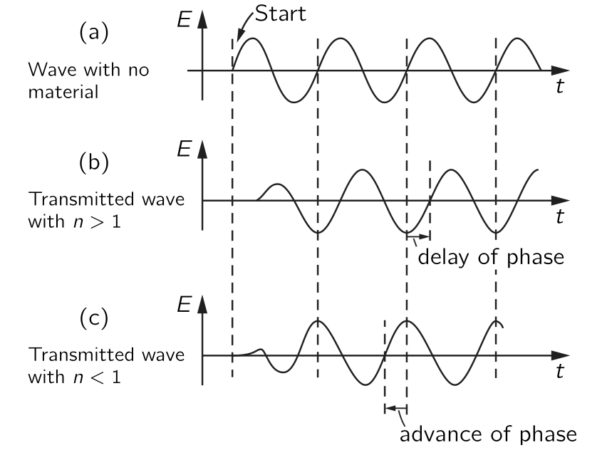{#fig-FLP_1_31_4 width=400}

이제 분산 방정식을 다시 살펴보자. 우선 굴절률에 대한 우리의 분석이 실제로 자연에서 찾을 수 있는 것보다 다소 단순한 결과를 제시한다는 것을 유념해야 한다. 정확하려면 수정이 필요하다. 

**1.** 우선, 원자 진동자 모델에 약간의 감쇠력이 있어야 한다. 그렇지 않으면 한번 시작된 진동은 영원히 계속되는데 이것은 그럴법 하지 않다. 감쇠하는 진동자의 해 @eq-FLP_1_23_8 를 생각하면 @eq-FLP_1_31_16 과 @eq-FLP_1_31_19 의 분모가 $(\omega_0^2−\omega^2)$ 에서 $(\omega_0^2 − \omega^2 + i\gamma \omega)$ 로 변경되며, 여기서 $\gamma$ 는 감쇠 계수이다.

**2.** 원자에 따라 정해지는 여러 개의 공명 주파수가 존재한다는 사실을을 고려하는 수정이 필요하다. 여러 종류의 진동자가 존재하지만 각 진동자가 별도로 작용한다고 가정하면 우리의 분산 방정식을 쉽게 수정할 수 있다. 즉 모든 진동자의 기여도를 단순히 더한다. 단위 부피당 $N_k$ 전자가 존재하고, 그 고유 진동수가 $\omega_k$ 이며 감쇠 계수가 $\gamma_k$ 라고 하면 분산방정식은 다음과 같다.

$$
n=1+\dfrac{q_e^2}{2\epsilon_0 m} \sum_k \dfrac{N_k}{\omega_k^2 −\omega^2+i\gamma \omega_k}. 
$$ {#eq-FLP_1_31_20}

우리는 마침내 많은 물질에 대해 관찰되는 굴절률을 설명하는 완전한 식을 갖게 되었다$^4$.[$^4$ 실제로, 양자역학에서는 @eq-FLP_1_31_20 은 여전히 유효하지만, 그 해석은 다소 다르다. 양자역학에서는 수소와 같이 전자가 하나인 원자조차도 여러 개의 공명 주파수를 가지고 있습니다. 따라서 $N_k$ 는 실제로 주파수 $\omega_kk$ 를 가진 전자의 수가 아니라 $Nf_k$ 로 대체되며, 여기서 $N$ 은 단위 부피당 원자 수를 의미하고 $f_k$ 는 원자가 각 공명 주파수 $\omega_k$ 를 얼마나 강하게 나타내는지를 나타내는 인자이다]{.aside} 이 식에 의한 굴절률의 실수부는 @fig-FLP_1_31_5 (a) 에 표시된 곡선과 같이 진동수에 따라 변화한다.

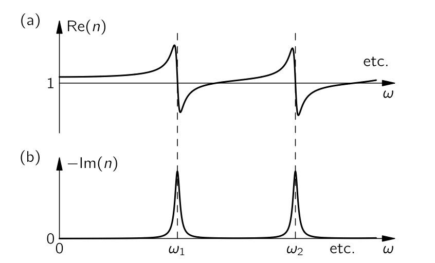{#fig-FLP_1_31_5 width=400}

$\omega$ 가 공명 주파수 가운데 하나에 너무 가깝지 않은 한, 곡선의 기울기는 양수이다. 그러한 양의 기울기를 **정상 (normal)** 분산이라고 한다. 공명 주파수에 매우 가까운, 그러나 기울기가 음수인 $\omega$ 의 짧은 범위가 존재한다. 이러한 음의 기울기는 종종 **비정상(anomalous)** 분산이라고 불리는데, 처음 관측되었을 때는 전자의 발견보다 훨씬 이전으로 이것이 매우 비정상적으로 여겨졌기 때문이다. 현대의 우리 관점에서는 두 경사면이 꽤 정상적이다!

### $\textrm{I}$.31-4 흡수 {#sec-FLP_1_31_4}

혹시 분산관계의 마지막 형태 @eq-FLP_1_31_20 에서 약간 이상함을 느꼈는가? 감쇠를 고려하기 위해 넣은 $i\gamma$ 항 때문에 굴절률이 이제 복소수가 되었다! $n$ 을 실수부와 허수부로 다음과 같이 나눠 보자.

$$
n = n'−i n''
$$ {#eq-FLP_1_31_21}

여기서 $n'$ 와 $n''$ 은 실수이다. $in''$ 앞에 $-$ 가 붙은 것은 $n''$ 을 양수로 유지하기 위해서이다.

@eq-FLP_1_31_5 로 돌아가서 공명 주파수가 하나뿐인 경우를 살펴보면 이러한 복소 굴절률이 의미하는 바를 알 수 있다. @eq-FLP_1_31_6 은 굴절률 $n$ 인 물질 판을 통과한 후의 파동에 대한 방정으로 여기에 복소수 $n$ 을 넣고 식을 다시 배치하면 다음과 같다.

$$
E_\text{after plate}=\underbrace{e^{−\omega n'' \Delta z/c}}_{A} \underbrace{e^{−i\omega(n'−1) \Delta z/c} E_0e^{i\omega (t−z/c)}}_{B}.
$$ {#eq-FLP_1_31_22}

$B$ 는 이전에 가졌던 형태일 뿐이며, 물질을 통과하는 각도 $\omega (n'−1)\Delta z/c$ 에 의해 위상이 지연된 파동을 기술한다. $A$ 는 새로운 것이며 실수 지수를 가진 지수함수이다. 또한, 지수가 음수이므로 $1$ 보다 작은 실수이다. 이는 전기장의 크기가 $\Delta z$ 가 클수록 더 큰게 감소한다는 것을 의미한다. 파동이 물질을 통과할 때 약해진다. 물질은 파동의 일부를 **흡수**하고 있다. 반대쪽으로 나온 파동은 에너지가 감소했다. 이것은 놀랍지 않다. 왜냐하면 진동자에 가하는 감쇠란 실제로 마찰력이며 에너지 손실을 초래하기 때문이다. 이로부터 복소 굴절률의 허수 부분 $n''$ 이 파동의 흡수, 또는 감쇠를 나타낸다는 것을 알 수 있다. 사실 $n''$ 은 때때로 **흡수 굴절률 (absorption index)** 라고 불린다.

보통은 @eq-FLP_1_31_20 에서 $|i\gamma_k ω| \ll |\omega_k^2-\omega^2|$ 이므로 빛의 흡수는 매우 작다. 하지만 $\omega \approx \omega_k$ 라면 빛의 흡수가 지배적인 효과가 된다. 우리가 태양으로부터 받는 빛의 스펙트럼에 어두운 선이 보이는 것은 이때문이다. 태양 표면에서 나오는 빛은 태양의 대기(지구와 마찬가지로)를 통과했으며, 그 빛은 태양 대기의 원자들의 공명 주파수에서 강하게 흡수되었다.

태양빛에서 이러한 스펙트럼 선을 관찰함으로써 우리는 원자의 공명 주파수를 알 수 있게 되며, 따라서 태양 대기의 화학 조성도 파악할 수 있다. 이런 종류의 관측을 통해 별을 구성하는 물질을 알 수 있으며 태양과 별에 있는 화학 원소가 지구에서 발견되는 것과 동일하다는 것을 알 수 있다.

### $\textrm{I}$.31–5 전파가 운반하는 에너지 {#sec-FLP_1_31_5}

이제 굴절률의 허수부가 흡수를 의미한다는 것을 확인했다. 이 지식을 활용하여 빛 파동이 얼마나 많은 에너지를 운반하는지 알아보자. 우리는 이전에 빛이 운반하는 에너지가 $\overline{E^2}$, 즉 전기장의 제곱의 시간 평균에 비례한다는 주장을 제시했다. 흡수에 의한 $E$ 의 감소는 에너지 손실을 의미해야 하며, 이는 전자의 마찰에 포함되어 물질 내에서 열로 변할 것이다.

@fig-FLP_1_31_1 에서 단위 면적에 도달하는 빛을을 생각하자. 에너지가 보존된다고 가정한다면 다음과 같은 에너지 방정식을 생각할 수 있다.

$$
\text{초당 도달하는 에너지} = \text{초당 방출하는 에너지} + \text{초당 수행된 일}.
$$ {#eq-FLP_1_31_23}

초당 도달하는 에너지는 $\alpha \overline{E^2_s}$ 로 쓸 수 있으며, 여기서 $\alpha$ 는 아직 알려지지 않은 비례 상수로, $E^2$ 의 평균값과 운반되는 에너지와의 관계를 나타낸다. 초당 방출하는 에너지는 물질의 방사성 원자로부터의 기여를 포함하여 $\alpha\overline{(E_s+E_a)^2}$ 혹은 풀어서 $\alpha(\overline{E_s^2} + \overline{E_a E_s} + \overline{E_a^2})$ 라고 쓸 수 있다.

이전과 마찬가지로 굴절률이 거의 $1$ 인 얇은 재료층만을 생각한다. 따라서 $Ea \ll E_s$ 이며 이 경우 두번째 항은 $\alpha(\overline{E_s^2} + \overline{E_a E_s})$ 만 생각하면 된다. 그렇다면 $\overline{E_a E_s}$ 가 $\overline{E_s^2}$ 보다 훨씬 작으니 무시하는 것을 생각할 지도 모르지만 이것을 무시한다면 물질과 관련된 것이 없게 되므로 이것은 유지해야 한다. 우리의 계산의 일관성 확인하는 한 방법은 물질 내 원자의 면적 밀도인 $N\Delta z$ 에 비례하는 항은 항상 유지하고, $(N\Delta z)^2$ 혹은 더 높은 지수에 비례하는 항은 제외하는 것이다. 이것을 “저밀도 근사”라고 부를 수 있다.

동일한 맥락에서 에너지 방정식 @eq-FLP_1_31_23 이 반사파의 에너지를 소홀히 했다고 생각 할 수 있다. 하지만 반사파의 진폭은 $N\Delta z$ 에 비례하며, 따라서 반사파의 에너지는 $(N\Delta z)^2$ 에 비례하므로 이 근사에서는 무시 할 수 있다.

@eq-FLP_1_31_23 의 마지막 항에 대해 우리는 입사파가 전자에 작용하는 속도를 계산해야 한다. 일을 수행하는 속도 즉 일률은 힘에 속도를 곱한 것이다. 실제로는 $\bf{F\cdot v}$ 이지만, 속도와 힘이 여기와 같은 방향이므로 $\overline{q_eE_s v}$ 이다. 단위 면적에 $N\Delta z$ 개의 원자가 존재하므로, @eq-FLP_1_31_23 의 마지막 항은 $N\Delta z \overline{q_eE_s v}$ 이다. 따라서 에너지 방정식 @eq-FLP_1_31_23 은 다음과 같다.

$$
\alpha \overline{E^2_s} = \alpha \overline{E^2_s} + 2\alpha \overline{E_s E_a} + N\Delta z q_e \overline{E_s v}.
$$ {#eq-FLP_1_31_24}

이로부터 다음 식을 얻는다.

$$
2\alpha \overline{E_s E_a} =- N\Delta z q_e \overline{E_s v}.
$$ {#eq-FLP_1_31_25}

이제 @eq-FLP_1_30_19 를 다시 보자. 이는 큰 $z$ 에 대해 

$$
E_a=−\dfrac{N\Delta z q_e}{2\epsilon_0 c}v(z/c \text{ 만큼 지연된}) 
$$ {#eq-FLP_1_31_26}

임을 말한다. @eq-FLP_1_31_26 을 @eq-FLP_1_31_25 의 좌변에 넣으면 

$$
−2\alpha \dfrac{N\Delta z q_e}{2\epsilon_0 c} \overline{E_s(\text{at }z)\cdot v(z/c \text{ 만큼 지연된})}.
$$

그러나 $E_s(\text{at }z)$ 는 $z/c$ 에 의해 지연된 $E_s(\text{at 원자})$ 이다. 평균이 시간에 독립적이기 때문에 현재 $z/c$ 에 의해 지연된 것과 동일하다. 즉, 위 식의 $\overline{[\cdots]}$ 는 $\overline{E_s(\text{at 원자})\cdot v}$ 와 같다. 따라서

$$
α=\epsilon_0 c.
$$ {#eq-FLP_1_31_27}

우리는 에너지를 보존하려면 전기파에서 단위 면적당 및 단위 시간당(또는 우리가 강도라고 부르는) 에너지가 $\epsilon_0 c \overline{E^2}$ 으로 주어져야 한다는 것을 발견했다. 단위 면적을 단위 시간에 통과하는 에너지의 평균을 $\overline{S}$ 라고 하면

$$
\overline{S} = \epsilon_0 c \overline{E^2}
$$ {#eq-FLP_1_31_28}

우리는 굴절률 이론에서 좋은 보너스 결과를 얻을 수 있었다!

### $\textrm{I}$.31-6 스크린에 의한 빛의 회절 {#sec-FLP_1_31_6}

지난 절에서 불투명한 스크린이 있고 빛이 몇몇 구멍을 통해 들어올 수 있을 때, 구멍들을 구멍 전체에 고르게 분포된 소스(진동자)로 대체하여 회절 패턴을 얻을 수 있다고 말했다. 다시 말해자면 회절된 파동은 구멍이 새로운 소스인 것처럼 동일하다. 여기에서는 그 이유를 설명한다. 

질문 : "불투명한 화면이란 무엇인가?". @fig-FLP_1_31_6 (a)와 같이 소스 $S$ 와 관찰자 $P$ 사이에 완전히 불투명한 스크린이 있다고 가정해 보자. 화면이 “불투명”인 경우 $P$ 에 전기장이 없다. 기본 원리에 따라 $P$ 에서의 전기장은 $S$ 로부터의 지연된 전기장 $E_s$ 와 다른 전하에 의한 전기장의 합이다. 하지만 위에서 보았듯이, 화면의 전하들은 $E_s$ 에 의해 움직이게 되며, 이러한 움직임은 새로운 전기장을 생성하는데, 화면이 불투명한 경우 화면 뒷면에 있는 $E_s$ 를 정확히 상쇄해야 한다. 만약 정확히 딱 맞게 상쇄되지 않으면(이 불투명한 화면에 두께가 있다는 것을 기억하라) 화면 뒤쪽을 을 향하는 전기장이 정확히 0이 되지는 않을 것입니다. 따라서 0이 아니므로 화면 재질에 다른 전하가 발생하여 약간의 필드를 발생시키면서 전체를 상쇄시키려 할 것이다. 따라서 화면을 충분히 두껍게 만들면 남는 전기장이 없어진다. 위의 식에 따르면, 화면은 큰 허수 지수를 가지고 있으므로 파동은 통과할 때 지수적으로 흡된다. 당연히 알고 있겠지만 가장 불투명한 금조차도 충분히 얇은 시트는 투명하다.

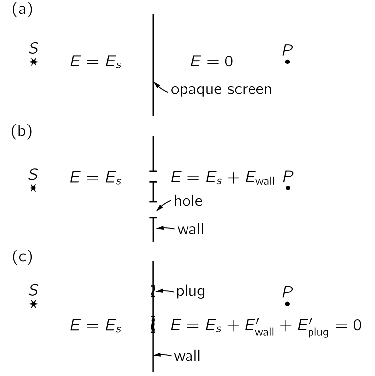{#fig-FLP_1_31_6 width=350}

이제 @fig-FLP_1_31_6 (b)와 같이 구멍이 있는 불투명 스크린에서 어떤 일이 일어나는지 살펴보자. $P$ 에서의 필드는 $S$ 에 의한 전기장과 스크린 내부의 전하의 운동에 의한 전기장의 합이다. 스크린 내부의 전하의 움직임이 복잡할 것으로 예상할 수 있지만, 비교적 간단한 방법으로 그것들이 생성하는 전기장이 무엇인지 알아낼 수 있다.

그림 (c) 에 표시된 대로 동일한 화면을 사용하되, 구멍을 막는다고 가정하자. (b) 의 구멍에 삽입되는 플러그는 벽과 정확히 같은 재질이다. 이제 $P$ 에서 전기장을 계산해 보자. $P$ 에서의 전기장은 (c) 경우 확실히 0이지만, 소스로부터의 전기장과 스크린과과 플러그 내부의 원자들의 모든 운동으로 인한 전기장과 같다. 아래와 같은 식을 작성 할 수 있다.

$$
\begin{aligned}
(b) : & \,E(P) = E_s+ E_\text{wall}, \\[0.3em]
(c): & \,E'(P) = E_s+E_\text{wall}= 0 = E_s+ E′_\text{wall} + E′_\text{plug}.
\end{aligned}
$$

${}'$ 은 플러그가 꼽혀 있는 경우를 가리킨다. $E_s$ 는 물론 두 경우 모두 동일하다. 이제 두 식을 빼면

$$
E(P) = (E_\text{wall}−E'_\text{wall})−E'
$$

이제 구멍이 너무 작지 않다면(파장의 몇배 이상이라면), 플러그의 존재가 벽에 도달하는 필드를 변화시킬 것으로 기대하지 않으며, 다만 구멍 가장자리 주변은 약간만 변할 수 있다. 이 작은 효과를 무시하면, $E_\text{Wall}=E'_\text{wall}$ 로 놓을 수 있다. 따라서

$$
E(P) = − E'_\text{plug}.
$$

우리는 (b) 의 경우 스크린에 구멍이 있을 때 $P$ 에서의 전기장이 구멍이 위치한 완전한 불투명 벽의 해당 부분에서 생성되는 전기장과 (부호를 제외하고) 동일하다는 결과를 얻었다. (그 부호는 그다지 흥미롭지 않다, 왜냐하면 우리는 보통 전기장의 제곱에 비례하는 강도에 관심이 있기 때문이다.) 놀라운 양방향 논증인 것 같다. 그러나 그것은 너무 작은 구멍이 아닌 경우에 대략적으로 사실일 뿐만 아니라 유용하며, 일반적인 회절 이론의 정당성이 된다.

$E'_\text{plug}$ 는 화면 전체에 있는 전하들의 움직임이 화면 뒷면의 $E_S$ 를 상쇄하는 것임을 기억함으로써 계산된다. 이러한 움직임을 알게 되면, 플러그의 전하만으로 인해 $P$ 에 복사장을 더한다.

우리는 다시 한 번 이 회절 이론이 근사값에 불과하며, 구멍이 너무 작지 않을 경우에만 유효할 것이라고 언급한다. 구멍이 너무 작은 경우 $E'_\text{plug}$ 항은 작아지며, 따라서 $E'_\text{wall}$ 과 $E_\text{wall}$ 사이의 차이(우리가 0이라고 추정한 차이)는 작은 $E'_\text{plug}$ 항과 비슷하거나 그보다 클 수 있으며, 우리의 근사값은 더 이상 유효하지 않다.

## $\textrm{I}$.32 복사 감쇄와 광산란 {#sec-FLP_1_32}

### $\textrm{I}$.32-1 복사 저항 {#sec-FLP_1_32_1}

#### **복사 저항**

지난 장에서 시스템이 진동할 때 에너지가 전달된다는 것을 배웠으며, 진동 시스템에 의해 방사되는 에너지에 대한 공식을 얻었다. 복사 방향에 수직인 표면의 단위면적을 초당 통과하는 에너지 $S$ 는 아래와 같다.
$$
S=\epsilon_0 c \langle E^2\rangle .
$$ {#eq-FLP_1_32_1}

모든 진동하는 전하는 에너지를 방출한다. 일례로 안테나를 생각 할 수 있다. 시스템이 에너지를 방출한다면, 에너지 보존으로부터 안테나로 연결되는 전선을 따라 전력이 전달되고 있다는 것을 안다. 즉, 구동 회로에서 안테나는 저항처럼 작용하며 에너지가 소실될 수 있는 위치가 된다. 물론 에너지는 실제로 손실되는 것이 아니라 방사되지만 회로에 한정한다면 에너지는 손실된다. 일반적인 저항에서는 에너지가 열로 전환되지만 이경우는 우주로 방출된다. 하지만 회로 이론의 관점에서는 에너지는 손실되는 것일 뿐이다. 따라서 안테나를 발전기에 저항이 있는 것으로 간주 할 수 있다. 실제로 잘 제작된 안테나는 거의 순수한 저항처럼 인덕턴스나 정전용량이 거의 없는데, 이는 안테나에서 가능한 한 많은 에너지를 방출하고자 하기 때문이다. 안테나가 나타내는 이 저항을 **복사 저항 (radiation resistance)** 라고 한다.

전류 $I$ 가 공급되는 경우 안테나에 공급되는 전력은 $\langle I^2R\rangle$ 이다. 안테나에서 복사되는 전력은 $\langle I^2\rangle$ 에 비례하는데 이는 모든 장이 전류에 비례하고, 방출된 에너지는 장의 제곱에 비례하기 때문이다. 복사되는 전력과 $\langle I^2\rangle$ 사이의 비례계수가 복사 저항이다.

#### **복사 저항의 발생 원인**

그렇다면 이 복사 저항은 무엇 때문에 발생하는가? 간단한 예를 들어 보자. 안테나에서 전류가 위아래로 구동된다고 하자. 안테나가 에너지를 방출하려면 우리가 일을 넣어야 한다. 전하를 띤 물체를 위아래로 가속하면 에너지를 방출한다. 전하가 없으면 에너지를 방출하지 않을 것이다. 에너지 보존을 통해 에너지가 손실된다는 것을 계산하는 것과 우리가 어떤 힘에 대응하여 일을 하고 있는가 하는 질문에 답하는 것은 별개의 문제이다. 그것은 흥미롭고 매우 어려운 질문으로, 전자에 대해서는 아직 완전하고 만족스럽게 답변된 적이 없으며, 안테나에 대해서는 그렇게 된 적이 있다. 일어나는 사건은 다음과 같다: 안테나에서는 안테나의 한 부분에서 움직이는 전하가 생성하는 장이 안테나의 다른 부분에서 움직이는 전하에 반응한다. 우리는 이러한 힘을 계산하고 그들이 수행하는 일을 파악한 뒤, 복사 저항에 대한 올바른 규칙을 찾을 수 있다. “우리는 계산할 수 있다” 라고 말했지만 아직은 할 수 없다. 왜냐하면 우리는 아직 짧은 거리에서 전기의 법칙울 모르며 먼 거리에서만 전기장이 무엇인지 알고 있다. 우리는 @eq-FLP_1_28_3 을 알지만, 현재는 파동 구역 내부의 장을 계산하기에 너무 복잡하다. 물론, 에너지 보존이 유효하기 때문에 우리는 짧은 거리의 장을 모른 채 결과를 올바르게 계산할 수 있다. (사실, 이 논증을 거꾸로 적용하면, 매우 먼 거리에서의 장을 알고 에너지 보존 법칙을 이용해서만 짧은 거리에서의 힘의 공식을 찾을 수 있다는 것이 밝혀졌지만, 여기서는 이에 대해 자세히 파고들지 않는다.)

단일 전자의 경우 문제는 다음과 같다: 전하가 하나뿐이라면, 힘은 어디에 작용하는가? 고전 옛 이론에서는 전하가 작은 구형이며, 전하의 한 부분이 다른 부분에 작용한다는 것이 제안되었다. 작은 전자를 가로지르는 작용의 지연으로 인해, 힘이 운동과 정확히 위상이 일치하지 않는다. 즉, 전자를 가만히 두면 “작용은 반작용과 같다”는 것을 알게 된다. 따라서 다양한 내부 힘이 동일하여 상쇄된다.하지만 전자가 가속한다면, 전자를 가로지르는 시간 지연 때문에 뒤쪽에서 앞쪽에 작용하는 힘은 효과의 지연 때문에 앞쪽에서 뒤쪽에 작용하는 힘과 정확히 동일하지 않게 된다. 이 지연으로 인해 균형이 붕괴되며, 그 결과 그 자체가 부트스트랩에 의해 스스로를 억제하게 된다. 가속에 대한 저항의 기원, 즉 움직이는 전하의 복사 저항에 관한 이 모델은 많은 어려움에 직면해 왔으며, 현재 전자에 대한 우리의 관점은 그것이 “작은 구체”가 아니라는 것이고, 이 문제는 한 번도 해결되지 않았다. 그럼에도 불구하고 그 힘이 작동하는 직접적인 메커니즘을 알지 못하지만 우리는 복사 저항, 즉 전하를 가속할 때 발생해야 할 손실량을 정확히 계산할 수 있다. 

### $\textrm{I}$.32-2 에너지 복사율 {#sec-FLP_1_32_2}

이제 가속 전하에 의해 방출되는 총 에너지를 계산해 보자. 논의의 일반성을 유지하기 위해는 전하가 가속되는 방식과 무관하게, 그러나 비상대론적으로 진행한다. 가속도가 수직방향이라면, 우리는 발생하는 전기장이 전하에 지연 가속도의 투영을 곱한 뒤 거리로 나눈 값임을 알고 있다. 따라서 우리는 어느 지점에서든 전기장을 알 수 있으며, 따라서 전기장의 제곱을 알게 되고, 따라서 초당 단위 면적을 통해 방출되는 에너지 $\epsilon_0cE^2$ 도 알 수 있다.

$\epsilon_0 c$ 는 전파 전달에 관련된 표현에서 꽤 자주 나타나는데 진공 임피던스(impedence of vacuum) 라고 하며, 그 값은 $1/\epsilon_0 c=377\, \Omega$ 이다. 

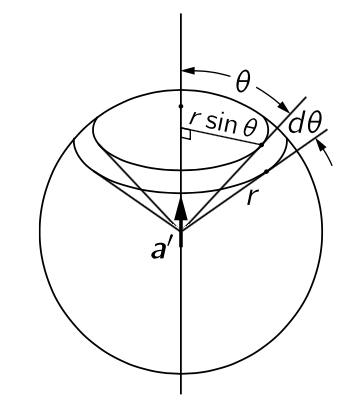{#fig-FLP_1_32_1 width=200}

전기장에 대한 @eq-FLP_1_29_1 로 부터

$$
S=\dfrac{q^2a'^2 \sin^2\theta}{16\pi^2 \epsilon_0 r^2c^3}
$$ {#eq-FLP_1_32_2}

이며 이는 $\theta$ 방향으로 방사되는 제곱미터당 전력으로 앞서 말했듯이 $1/r^2$ 에 비례한다. 이제 전체 에너지를 모든 방향으로 복사한다면 모든 방향에 대해 @eq-FLP_1_32_2 를 적분해야 한다. 구면좌표계에서 적분하면

$$
P=\int S r^2\sin\theta d\theta d\varphi dr = \dfrac{q2a'^2}{8\pi \epsilon_0 c^3}\int_0\pi \sin^ 3\theta d\theta 
$$

이며 이로부터 다음을 얻는다.

$$
P=\dfrac{q^2a'^2}{6\pi \epsilon_0 c^3}.
$$ {#eq-FLP_1_32_5}

이 식에 대해 좀 더 알아보자. **@eq-FLP_1_32_2 의 플럭스는 지연 가속도, 현재 구를 통과하는 에너지가 복사된 시점의 가속도를 사용하여 계산되었다. 이 에너지가 실제로 이 시점에 방출된 것이라고 생각할지도 모른다. 하지만 이는 정확히 사실이 아니며, 단지 대략적인 아이디어일 뿐이다**$^5$.[$^5$ 첫 문장은 "구를 지나는 에너지의 양이 $t'=t-r/c$ 시점에서의 가속도, 즉 지연 가속도에 의해 결정된다"는 것. 두 번째 문장은 "그 에너지가 지연 시간 시점에 전하에서 실제로 떨어져 나왔다(liberated)" 는 의미이다. 이는 에너지의 기원과 시점을 물리적 실체로 귀속시키는 강한 주장이며, 파인만은 그것이 사실이 아니라고 말한다]{.aside} 에너지가 방출되는 정확한 시간을 정확히 정의할 수 없다. 우리가 실제로 정확히 계산할 수 있는 것은 진동운동이나 가속도가 결국 멈추는 완전한 운동에서 무엇이 발생하는가이다. 그렇다면 우리가 발견하는 바는 전체 사이클당 총 에너지 플럭스가 전체 사이클의 가속도의 제곱의 평균이라는 것이다. 이것이 @eq-FLP_1_32_5 가 표현하는 것이다. 또는, 가속도가 처음에 0이고 최종적으로 0인 경우, 날아간 총 에너지는 @eq-FLP_1_32_5 의 시간 적분이다.

진동 시스템에서의 @eq-FLP_1_32_5 의 결과를 설명하기 위해, 전하의 변위 $x$ 가 진동하여 가속도 $a =−\omega^2x_0e^{iωt}$ 가 되면 어떻게 되는지 살펴보자. 한 주기에 대한 가속도의 제곱 평균은

$$
\langle {a'}^2\rangle = \dfrac{1}{2}\omega^4 x_0^2 
$$

이므로 

$$
P=\dfrac{q^2\omega^4 x_0^2}{12\pi \epsilon_0 c^3}
$$ {#eq-FLP_1_32_6}

이다. 

### $\textrm{I}$.32-3 복사 감쇄 {#sec-FLP_1_32_3}

이제 진동자가 특정 에너지를 잃는다는 사실로부터 자연 주파수 $\omega_0$ 를 가진 용수철(혹은 웑지 내 전자)의 끝에 전하가 있고 진동을 시작하면 비록 그것이 모든 것으로부터 수백만 마일 떨어진 빈 공간에 있더라도 영원히 진동하지는 않는 다는 것을 알 수 있다. 전하를 띠면 에너지를 방출하므로 진동은 서서히 사라질 것이다. 그렇다면 얼마나 천천히? 이러한 진동자의 $Q$ 는 전자기적 효과, 즉 진동자의 이른바 복사 저항 또는 복사 감쇠에 의해 발생하는가? 모든 진동 시스템의 $Q$ 는 진동자의 전체 에너지를 라디안당 에너지 손실로 나눈 값이다.([$Q$ 인자](vol1_3.qmd#sec-FLP_second_Q_factor) 를 참고하라.)

$$
Q=−\dfrac{W}{dW/d\phi}.
$$

또는 (다른 방식으로 표현하면) $dW/d\phi= (dW/dt)/(d\phi/dt)= (dW/dt)/\omega$ 이므로

$$
Q=−\dfrac{\omega W}{dW/dt}.
$$ {#eq-FLP_1_32_8}

$Q$ 값이 주어진다면 $dW/dt=−(ω/Q)W$ 이며, 초기 에너지 $W_0 = W(t=0)$ 에 대해 $W=W_0e^{−ωt/Q}$ 이다. 진동자의 $Q$ 값은  @eq-FLP_1_32_8 에서 $dW/dt$ 에 @eq-FLP_1_32_6 를 넣어 얻는다.

진동자의 평균 운동 에너지는 $m\omega^2x_0^2/4$ 이며 진동자의 전체 에너지는 평균 운동 에너지의 두배임을 안다. 따라서 진동자의 에너지 $W$ 는 다음과 같다.

$$
W=\dfrac{1}{2}m\omega^2x_0^2.
$$ {#eq-FLP_1_32_9}

여기서 $\omega$ 에는 자연 주파수 $\omega_0$ 를 사용한다. 이는 실용적인 목적상 우리 원자가 복사하는 주파수이기 때문다. $m$ 에는 전자 질량 $m_e$ 를 사용한다. 그렇다면

$$
\dfrac{1}{Q}=\dfrac{q_e^2 \omega_0}{6 \pi m_e \epsilon_0 c^3}=\dfrac{4πe^2}{3\lambda m_ec^2}.
$$ {#eq-FLP_1_32_10}

(뒤의 식은 역사적으로 유명한, 그리고 가우스 단위계를 사용한 식이다. $q_e^2/4π\epsilon_0=e^2$, $\omega_0/c=2π/\lambda$ 를 사용하였다.) $Q$ 가 무차원이므로, $e^2/m_ec^2$ 는 길이 차원의 전자의 내재적 성질이며, 이 값은 **고전적 전자 반경 (classical electron radius)** 이라는 이름이 붙었다. 이는 전자의 한 부분이 다른 부분에 작용하는 힘을 기반으로 복사 저항을 설명하기 위해 고안된 초기의 원자 모델들이 모두 이 정도 크기의 전자를 필요로 했기 때문이다. 하지만, 이 양은 이제 더 이상 전자의 실제 크기와 관련이 있다고 여겨지지 않는다. 어쨌든 수치적으로

$$
r_0=\dfrac{e^2}{m_ec^2}=\dfrac{q_e^2}{4\pi\epsilon_0 m_ec^2}=2.82\times 10^{−15}\text{ m}.
$$ {#eq-FLP_1_32_11}

이제 실제로 빛을 방출하는 원자의 $Q$ 를 계산해 보자. 나트륨 원자의 경우, 파장은 가시광선 스펙트럼의 노란색 부분에서 대략 $6000\,\mathring{A}$ 이다. 

$$
Q=\dfrac{3\lambda}{4\pi r_0} \approx 5 \times 10^7.
$$ {#eq-FLP_1_32_12}

이는 원자 진동자가 $10^8$ 라디안, 즉 약 $10^7$ 번을 진동하면 에너지가 $1/e$ 배로 감소한다는 것을 의미한다. $6000\,\mathring{A}$ 에 해당하는 빛의 진동수($\nu=c/\lambda$)는 약 $10^{15} \text{cycles/sec}$ 이며, 따라서 방출 원자의 에너지가 $1/e$ 배로 사라지는 데 걸리는 수명은 약 $10^{−8}$ 초에 해당한다. 보통의 경우, 자유롭게 방출되는 원자는 보통 이정도 시간동안 복사한다. 그리고 이는 어떠한 방식으로도 방해받지 않는 빈 공간에 있는 원자에만 유효하다. 고체의 전자이고 다른 원자나 다른 전자와 충돌하는 경우는 추가적인 저항과 다른 감쇠가 존재한다.

진동자의 저항 법칙에서 유효 저항 항 $\gamma$ 는 $1/Q=\gamma /\omega_0$ 에서 찾을 수 있으며, $\gamma$ 의 크기가 공명 곡선의 폭을 결정한다는 점을 하자 (@fig-FLP_1_23_2). 따라서 우리는 이제 자유롭게 복사하는 원자를 위한 스펙트럼 선의 폭을 계산했다! $\lambda=2\pi c/\omega$ 이므로
$$
\Delta \lambda= \dfrac{2πc\Delta \omega}{\omega^2}=\dfrac{2\pi c\gamma }{ω_0^2}=\dfrac{2\pi c}{Q\omega_0} = \dfrac{\lambda}{Q}=\dfrac{4\pi r_0}{3} = 1.18\times 10^{−14} \text{ m}.
$$ {#eq-FLP_1_32_13}

### $\textrm{I}$.32.4 독립적인 소스 {#sec-FLP_1_32_4}

다음 주제인 빛의 산란에 들어기기 전에 이전에 무시하고 넘어갔던 간섭 현상의 특징을 알아보자. 이는 간섭이 발생하지 않는 경우에 대한 질문이다. 두 개의 소스 $S_1$ 과 $S_2$ 가 있으며 진폭은 $A_1$ 과 $A_2$ 이고, 우리가 관측하는 방향에서 두 신호가 도착하는 위상이 $\phi_1$ 과 $\phi_2$ 였다면 우리가 받는 에너지는 아래의 $A_R^2$ 에 비례한다.

$$
A_R^2 = A_1^2 + A_2^2 + 2 A_1A_2 \cos(\phi_1−\phi_2).
$$ {#eq-FLP_1_32_14}

여기서 $2 A_1A_2 \cos(\phi_1−\phi_2)$ 가 간섭에 의한 효과이다.
<!-- 이제 교차항 2A1A2cos(φ1−φ2)가 존재하지 않을 경우, 주어진 방향으로 수신될 전체 에너지는 단순히 각 원천에 의해 각각 방출되는 에너지 A21+A22의 합에 불과하며, 이는 우리가 일반적으로 기대하는 바입니다. 즉, 두 광원에서 비추는 빛의 결합 강도는 두 빛의 강도의 합입니다. 반면에, 사물을 정확히 설정하고 교차 항을 가지고 있다면, 그것은 그러한 합이 아니며, 또한 약간의 간섭이 존재하기 때문입니다. 만약 이 용어가 중요하지 않은 상황이 있다면, 우리는 그 간섭이 명백히 사라졌다고 말할 것입니다. 물론, 자연에서는 항상 존재하지만, 우리가 그것을 감지하지 못할 수도 있습니다. -->

몇 가지 예를 살펴보자. 우선 두 소스가 정확히 $7\times 10^9$ 파장 차이만큼 떨어져 배치되었다고 하자. 그렇다면 주어진 방향에서 정확한 위상 차이가 존재한다. 우리가 한쪽 방향으로 몇 파장만큼만 움직이면, 이는 전혀 거리가 없으며(우리 눈에 이미 구멍이 너무 커서 하나의 파장에 비해 매우 넓은 범위에서 효과를 평균하고 있습니다), 우리는 상대 위상이 변하고 코사인이 매우 빠르게 변합니다. 작은 영역에 대한 강도의 평균을 취하면, 이동하면서 플러스, 마이너스, 플러스, 마이너스가 되는 코사인은 평균이 0이 된다. 즉 위상이 위치에 따라 매우 빠르게 변하는 영역을 평균하면 간섭이 없다.

다른 예시입니다. 두 소스가 각각 독립적인 라디오 발진기라고 가정하자. 즉 하나의 오실레이터가 두 개의 와이어에 신호를 공급되어 위상이 함께 유지된다는 것을 보장하는 것이 아니라, 두 개의 독립적인 소스—그리고 이들이 동일한 주파수에서 정밀하게 튜닝되지 않은 경우(실제로 연결하지 않고는 정확히 같은 주파수로 만들기가 매우 어렵다). 이 경우 우리는 두 개의 독립적인 소스라고 할 수 있다. 물론, 주파수가 정확히 동일하지는 않다. 처음에는 위상이 맞을수도 있지만 그러더라도, 하나가 다른 하나보다 약간 앞서기 시작하고 곧 위상이 벗어나며, 그 다음에는 더욱 앞서게 되고, 곧 다시 같은 위상이 되었다가 곧 벗어난다. 따라서 두 사이의 위상 차이는 시간이 지남에 따라 점차 멀어지지만, 우리의 관측이 너무 조잡하여 짧은 시간을 볼 수 없을 정도라면, 훨씬 더 긴 시간에 걸쳐 평균한다면, 강도가 소리에서 “비트”라고 부르는 것처럼 팽창하고 하강하지만, 이러한 팽창과 하강이 우리 장비가 따라가기엔 너무 빠르면 다시 한 번 평균화된다.

다시 말해, 위상 이동이 평균이 되는 어떤 상황에서도 우리는 간섭을 받지 않는다!

두 개의 서로 다른 광원이 절대 간섭하지 않는다고 말하는 많은 책들을 찾을 수 있다. 이는 물리학에 대한 진술이 아니라, 책이 쓰여진 시점에 실험 기법의 민감도 정도에 대한 진술에 불과하다. 광원에서 일어나는 일은 먼저 한 원자가 복사하고, 그 다음에 또 다른 원자가 복사하는 식이며, 우리는 원자들이 약 10−8 초 정도만 파동을 방출하는 것을 방금 보았습니다; 10−8 초가 지나면 어떤 원자가 아마도 장악하고, 그 다음에 또 다른 원자가 장악하는 식이다. 따라서 위상은 실제로 약 10−8초 정도만 동일하게 유지될 수 있다. 따라서, 우리가 10−8초를 훨씬 훨씬 초과하여 평균한다면, 서로 다른 두 출처로부터의 간섭을 관찰할 수 없다. 왜냐하면 그들은 10−8초 이상 위상을 일정하게 유지할 수 없기 때문이다. 광전지를 사용하면 매우 고속으로 탐지할 수 있으며, 약 10−8초 정도 시간에 따라 위아래로 변하는 간섭이 있음을 보여줄 수 있다. 하지만 대부분의 탐지 장비는 물론 그렇게 세밀한 시간 간격을 확인하지 않으며, 따라서 간섭을 감지하지 못한다. 확실히 평균 시간이 0.1 초인 눈의 경우, 두 개의 서로 다른 일반 소스 사이에 간섭을 볼 가능성은 전혀 없다.

최근에는 모든 원자를 시간에 맞춰 함께 방출하도록 함으로써 이 효과를 회수하는 광원을 만드는 것이 가능해졌습니다. 이를 수행하는 장치는 매우 복잡한 것이며, 양자역학적인 방식으로 이해되어야 합니다. 그것은 레이저라고 하며, 레이저로부터 위상이 일정하게 유지되는 시간이 10−8 초보다 훨씬 긴 소스를 생성할 수 있다. 그것은 백분의 일, 십분의 일, 혹은 일초 정도일 수 있으며, 따라서 일반 광전지에서는 두 개의 서로 다른 레이저 사이의 주파수를 선택할 수 있다. 두 레이저 소스 사이의 비트 펄스를 쉽게 감지할 수 있다. 곧, 의심할 여지 없이, 누군가가 벽에 빛나는 두 개의 소스를 시연할 수 있게 될 것이며, 그 비트가 너무 느려서 벽이 밝아지고 어두워지는 것이 보일 것입니다.

간섭이 평균적으로 나오는 또 다른 경우는, 두 개의 원천만 있는 것이 아니라 많은 원천을 가지고 있는 경우입니다. 이 경우, 우리는 $A^2_R$ 에 대한 식을 많은 진폭과 복소수들의 제곱합으로 놓고, 각 진폭의 제곱을 모두 합산한 뒤 각 쌍 사이의 교차항을 구하게 되며, 상황이 후자의 평균을 벗어나면 간섭 효과는 존재하지 않을 것이다. 다양한 소스가 매우 무작위 위치에 배치되어 있어, $A_2$ 와 $A_3$ 사이의 위상 차이도 확실하지만 $A_1$ 과 $A_2$ 사이의 위상 차이와는 매우 다를 수 있다. 그래서 우리는 많은 코사인, 많은 플러스와 많은 마이너스를 모두 평균적으로 얻을 수 있다.

그렇기 때문에 많은 경우에 우리는 간섭의 효과를 보지 못하고, 오히려 모든 강도의 합과 같은 집단적인 전체 강도만을 보게 된다.

### $\textrm{I}$.32-5 광산란 {#sec-FLP_1_32_5}

#### **광산란**

위와 같은 현상을 통해 원자들의 불규칙한 위치로 인해 공기에서 발생하는 효과를 설명 할 수 있다. 굴절률에 대해 논의할 때, 들어오는 빛의 빔이 원자를 다시 복사하게 만드는 것을 보았다. 들어오는 빔의 전기장은 전자를 위아래로 움직이며, 전자는 이 가속도 때문에 복사한다. 이 산란 복사선은 들어오는 빔과 같은 방향으로 위상이 다소 다른 빔을 생성하는데 이것이 굴절률의 근원이다.

하지만 다른 방향으로 재방사된 빛의 양에 대해 우리는 무엇이라고 말할 수 있을까? 보통 원자들이 좋은 패턴으로 매우 아름답게 배치되어 있다면, 다른 방향에서는 아무것도 얻지 못한다는 것을 쉽게 알 수 있다. 왜냐하면 우리는 위상이 지속적으로 변하는 많은 벡터를 추가하고 있기 때문에 결과가 0이 된다. 하지만 원자들을 무작위로 위치한다면, 모든 방향의 총 강도는 각 원자에 의해 산란되는 강도의 합이다. 게다가, 기체 안의 원자들은 실제로 움직이고 있기 때문에, 두 원자의 상대적인 위상은 계속 변하며 따라서 각 코사인 항은 평균이 된다. 따라서 기체에 의해 주어진 방향으로 얼마나 많은 빛이 산란되는지를 알아내기 위해서는, 우리는 단순히 한 원자의 효과를 연구하고 그 원자가 방사하는 강도를 원자 수로 곱한다.

앞서 우리는 이와 같은 빛의 산란 현상이 하늘의 푸른색의 기원이라고 언급했다. 햇빛이 공기를 통과하고, 태양의 한쪽을 바라볼 때—예를 들어 빔에 대해 90$^\circ$ 에 위치할 때 우리는 푸른 빛을 보게 된다. 이제 우리가 계산해야 할 것은 우리가 보는 빛의 양과 그 빛이 파란색인 이유이다.

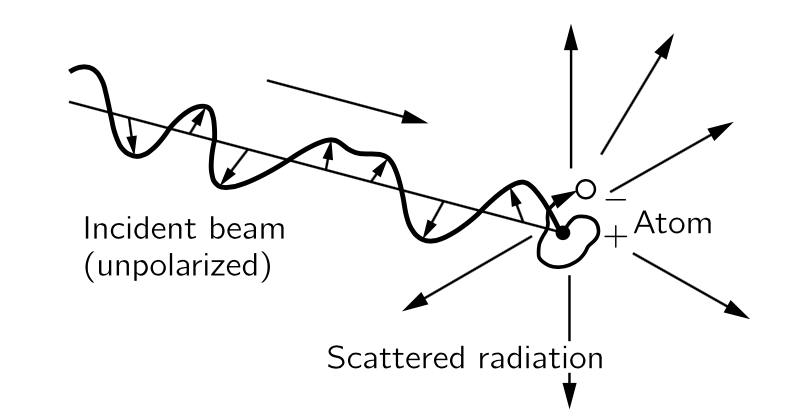{#fig-FLP_1_32_2 width=300}

원자가 위치한 지점에서 입사 빔에 의한 전기장이 $\bf{E}=\bf{\hat{E}}_0e^{iωt}$ 라면, 원자 내부의 전자가 이 $\bf{E}$ 에 반응하여 위아래로 진동한다(@fig-FLP_1_32_2). @eq-FLP_1_23_8 로부터

$$
\bf{\hat{x}}=\dfrac{q_e\bf{\hat{E}}_0}{m(\omega_0^2 - \omega^2 + i \gamma \omega)}
$$ {#eq-FLP_1_32_15}

이다. 문제를 단순화시켜 감쇠와 원자가 서로 다른 진동수를 가진 의 여러 진동자처럼 작용할 가능성을 무시하고, 하나의 진동수를 가진 단일 진동자로 생각한다. 그렇다면 외부 전기장에 대한 반응은 아래와 같이 단순해진다.

$$
\hat{\bf{x}} = \dfrac{q_e \bf{\hat{E}}_0}{m(\omega_0^2 - \omega^2)} . 
$${#eq-FLP_1_32_16}

이제 @eq-FLP_1_32_2 와 위의 $\bf{\hat{x}}$ 에 해당하는 가속도를 사용하여 다양한 방향으로 방출되는 빛의 강도를 쉽게 계산할 수 있다. 하지만 이렇게 하는 대신, 시간을 절약하기 위해 모든 방향으로 흩어진 빛의 총량을 단순히 계산해보자. 단일 원자에 의해 모든 방향으로 산란되는 초당 빛의 에너지 총량은 @eq-FLP_1_32_6 에 의해 주어진다. 고전적 전자 반경(@eq-FLP_1_32_11) $r_0$ 를 도입하면 모든 방향으로 복사되는 총 산란 일률을 다음과 같이 계산 할 수 있다.

$$
\begin{aligned}
P &= \dfrac{q_e^2 \omega^4}{12 \pi \epsilon_0 c^3} \dfrac{q_e^2 E_0^2}{m_e^2(\omega^2−\omega_0^2)^2}=\dfrac{4\pi \epsilon_0 c r_0^2 E_0^2}{3}\dfrac{\omega_4}{(\omega^2-\omega_0^2)^2} \\[0.3em]
&=\underbrace{\left(\dfrac{1}{2}{\epsilon_0 cE_0^2}\right)}_{\Large = \epsilon_0 c \langle E^2\rangle} \underbrace{\left(\dfrac{8\pi r_0^2}{3}\right) \left[\dfrac{\omega^4}{(\omega^2-\omega_0^2)^2}\right]}_{\Large = \sigma_s}
\end{aligned}
$$ {#eq-FLP_1_32_17}

두번째 줄은 첫번째 줄의 결과를 보기 좋게 두부분으로 나눈 것이다.

**1.** 산란된 총 에너지는 입사 전기장의 제곱에 비례한다. 또한 $\langle E^2\rangle = E_0^2/2$ 이다. 즉 첫번째 부분은 단위 면적당 초당 입사된 총 에너지이다.

**2.** 들어오는 빛에서 산란되는 비율을 산란단면적이라고 한다. 이것은 매우 중요하여 벌도로 논의하도록 하자.

#### **산란단면적**

빔 안에 면적 $\sigma$ 를 가진 표적이 있다고 하자. 빛이 회절될 수 있기 때문에 실제 물질적인 표적이 아니라 공간에 그려진 가상의 영역을 의미한다. 주어진 상황에서 이 표면 $\sigma$ 를 통과하는 총 에너지량은 들어오는 강도와 $\sigma$ 에 모두 비례하며, 전체 일률은

$$
P=\left(\dfrac{1}{2}\epsilon_0cE_0^2\right)\sigma_s.
$$ {#eq-FLP_1_32_18}

이제 새로운 아이디어가 나온다. 원자가 특정 기하학적 면적에 떨어지는 모든 빛(혹은 에너지)를 모두 산란시킨다고 생각하면, 그 면적이 산란되는 비율일 것이다. 이 기하학적 면적을 **산란단면적 (scattering cross section)** 이라고 한다.

$$
\text{산란단면적} := \dfrac{\text{초당 산란된 총 에너지}}{\text{단위 면적에 초당 입하사는 에너지}}
$$

단면적이라는 개념은 빔의 강도에 비례하여 어떤 현상이 발생할 때마다 지속적으로 사용된다. 이러한 경우에는 현상의 양을 설명하기 위해 필요한 유효 면적을 말하는 것으로 이 진동자가 실제로 그런 면적을 가지고 있다는 의미는 전혀 아니다. 만약 위 아래로 흔들리는 자유 전자 외에는 아무것도 존재하지 않았다면, 물리적으로 그와 직접적으로 연관된 면적이란 것은 존재하지 않을 것이다. 이는 단지 특정 종류의 문제에 대한 답을 표현하는 방법일 뿐이며, 방출되는 에너지량을 고려하기 위해 입사 빔이 어느정도의 면적에 닿아야 하는지를 알려준다. 지금 상황에서의 산란단면적 $\sigma_s$ 는 아래와 같다.

$$
\sigma_s=\dfrac{8\pi r_0^2}{3}\cdot \dfrac{\omega^4}{(\omega^2 - \omega_0^2)^2}.
$$ {#eq-FLP_1_32_19}

이제 몇가지 예를 들어보자.

**1.** $\omega_0 \approx 0$ 일 경우, 즉 자연 진동수가 매우 작거나 $0$ 인 자유전자의 경우 $\sigma_s$ 는 $\omega$ 와 무관한 상수가 된다. 이 저 진동수 극한, 즉 자유전자에 대한 산란단면적은 **톰슨 산란 단면적 (Thompson scattering cross section)** 이라고 알려져 있으며 $\sigma_\text{Thompson} \approx 10^{-30}\,\text{m}^2$ 이다.

**2.** 공기의 경우 진동자의 자연 진동수(자외선 영역)가 우리가 사용하는 빛의 진동수(가시광선 영역)보다 크다. 이 경우 $\sigma_s \propto \omega^4$ 이다. 즉, 진동수가 두 배 정도 높은 빛은 16배 더 강하게 산란되며, 이는 상당히 큰 차이이다. 따라서 우리가 하늘을 바라볼 때, 그 영광스러운 푸른색처럼 보인다!

#### **여러 원자에 의한 광산란**

**질문 : 왜 우리는 구름을 보게 되는 걸까요? **

구름이 수증기의 응축이라는 것을 알고 있다. 하지만 수증기는 이미 응결하기 전에 대기 중에 존재 하는데, 그때는 그것을 보지 못하는 이유는 무엇인가? 우리는 방금 모든 원자가 빛을 산란한다는 것을 이해 했다. 물 증기 역시 빛을 산란시킨다. 신기한 것은 물이 구름으로 응축되면 왜 그렇게 엄청나게 많은 양의 빛을 흩뜨리는가 하는 것이다.

단일 원자 대신 두 개의 원자가 빛의 파장에 비해 매우 가깝게 모여 있는 경우 어떤 일이 일어날지 생각해 보자. 원자의 크기는 약 $1\,\AA$ 에 불과하지만 빛의 파장은 약 5,000 $\AA$ 이므로, 이 원자를 $\AA$ 크기의 덩어리로 모으면 빛의 파장에 비해 매우 가깝게 위치한다. 이 경우 전기장이 작용하면 두 원자가 함께 움직인다. 산란된 전기장은 위상이 일치하는 두 전기장의 합이 되어 산란된 에너지는 단일 원자일 때의 네 배가 된다! 따라서 원자 덩어리는 단일 원자보다 더 많은 에너지를 복사하거나 산란한다. 위상이 독립적이라는 주장은 임의의 두 원자 사이에 실질적이고 큰 위상 차이가 존재한다는 가정에 기반한다. 그러나 이는 두 원자가 파장보다 상당히 긴 임의의 간격으로 떨어져 있거나 이동하고 있을 때만 사실이다. 그들이 서로 바로 옆에 있으면, 반드시 위상이 맞게 산란하며, 산란 강도가 증가하는 결맞은 간섭을 갖게 된다.

만약 $N$ 개의 원자가 작은 물방울 안에 있다면, 각 원자는 이전과 거의 동일한 방식으로 전기장에 의해 구동된다.(한 원자가 다른 원자에 미치는 영향은 일단 무시하자. 이것은 아이디어를 얻는 차원의 사고이다.) 그리고 각 원자에서 발생하는 산란 진폭도 동일하므로, 산란되는 전체 전기장은 $N$ 배 증가한다. 그리고 산란된 빛의 강도는 $N^2$ 배 증가한다. 따라서 물이 응집함에 따라 산란이 증가한다. 그러나 무한히 증가하지는 않는다. 물방울의 한쪽 끝에서 다른 쪽까지 거리가 가시광선의 파장 정도가 될 정도로 커지면, 원자들이 너무 멀리 떨어져 있기 때문에 더 이상 위상이 일치하지 않게 된다. 따라서 물방울의 크기를 계속 증가시킬수록 점점 더 많은 산란이 발생하지만, 물방울이 파장 정도의 크기에 이르면 산란은 물방울이 커질 때만큼 빠르게 증가하지 않는다. 게다가 파란색은 사라진다. 왜냐하면 파란색 빛의 파장이 다른 빛보다 짧기 때문이다. 짧은 파동은 긴 파동보다 원자당 더 많이 산란하지만(@eq-FLP_1_32_19), 모든 방울이 파장보다 클 때 스펙트럼의 빨간 쪽은 파란 쪽보다 더 빛이 강화되어 색이 파란색에서 빨간색으로 이동한다.

이제 우리는 이를 입증하는 실험을 고안 할 수 있다. 처음에 매우 작은 입자를 만들 수 있으며, 점차 크기를 키운다.황산이 함유된 소듐 티오설페이트 용액을 사용하며, 이는 매우 미세한 황 입자를 침전시킨다. 황이 침전함에 따라 입자는 처음에 매우 작게 시작하고, 산란은 약간 푸른빛을 띤다. 침전이 많아질수록 더 강해지고, 입자가 커짐에 따라 흰색으로 변한다. 또한, 직진하는 빛에서는 파란색이 제거된다. 이 때문에 석양이 빨갛다. 물론, 많은 공기를 통과해 들어오는 빛이 눈에 많은 파란 빛이 흩어져 있기 때문에, 그것은 황홍색이다.

마지막으로, 다음 장에 진지하게 다룰 또 하나의 중요한 특징인 편극에 관한 것이 있는데, 너무 흥미로워서 지금 바로 짚고 넘어가겠다. 이는 산란된 빛이 전기장이 특정 방향으로 진동하는 경향이 있다는 것이다. 입사광의 전기장이 어떤 식으로든 진동하고 있으며, 구동 진동자는 같은 방향으로 움직이고, 우리가 빔과 대략 직각을 이루면 편광된 빛을 보게 된다. 즉, 전기장이 한 방향으로만 흐르는 빛을 말한다. 일반적으로 원자는 빔에 직각을 이루는 방향으로 어느 방향으로든 진동할 수 있지만, 우리 쪽으로 직접 혹은 멀어지도록 움직이면 우리는 그것을 볼 수 없다. 따라서 들어오는 빛이 어떤 방향으로든 변하고 진동하는 전기장을 가지고 있다면, 이를 무편광이라고 부른다. 빔에 90$^\circ$ 로 나오는 빛은 한 방향으로만 진동한다! (@fig-FLP_1_32_3)

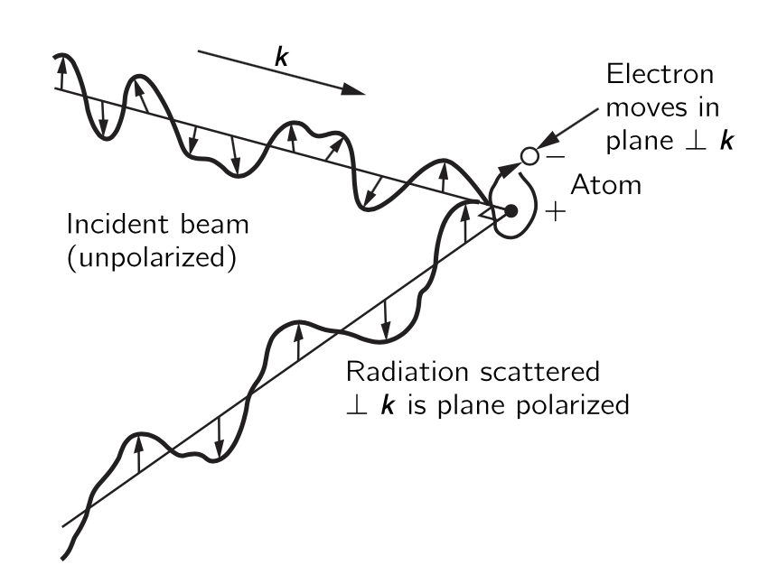{#fig-FLP_1_32_3 width=350}

폴라로이드라는 물질이 있는데, 빛이 통과할 때 특정 축을 따라 있는 전기장의 일부만 통과할 수 있다는 특성을 가지고 있다. 우리는 이를 사용하여 편광을 테스트할 수 있으며, 실제로 저용매에 의해 산란된 빛이 강하게 편광된 것을 발견한다.

## $\textrm{I}$.33 편광 {#sec-FLP_1_33}

### $\textrm{I}$.33-1 빛의 전기 벡터 {#sec-FLP_1_33_1}

이 장에서는 빛을 기술하는 전기장이 벡터라는 사실에 의존하는 현상들을 다룬다. 이전 장들에서는 전기장의 진동 방향에 대해 다루지 않았으며, 전기장 벡터가 전달 방향에 수직인 평면에 놓여 있다는 것만 이야기했고 이 평면에서의 특정 방향애는 관심을 두지 않았다. 우리는 이제 전기장의 특정 진동 방향이 중심적인 현상을 알아본다.

이상적인 단색광에서는 전기장이 일정한 진동수를 갖지만 $x$-성분과 $y$-성분이가 일정한 진동수에서 독립적으로 진동할 수 있기 때문에, 먼저 두 개의 독립적인 진동을 서로 직각으로 중첩시켜 발생하는 효과를 생각한다. 동일한 진동수로 진동하는 $x$-성분과 $y$-성분으로 구성된 전기장은 어떤 종류입니까? 같은 위상에서 $x$-진동에 일정량의 $y$-진동을 추가하면, 그 결과는 $xy$-평면에서의 새로운 방향으로 진동이다. @fig-FLP_1_33_1 은 $x$-진동과 $y$-진동에 대한 서로 다른 진폭의 중첩을 보여준다. 하지만 @fig-FLP_1_33_1 에 표현된 것만 가능한 것은 아니다. 또한 $x$-진동과 $y$-진동이 같은 위상이라고 가정했지만 위상이 어긋나 있을 수 있다.

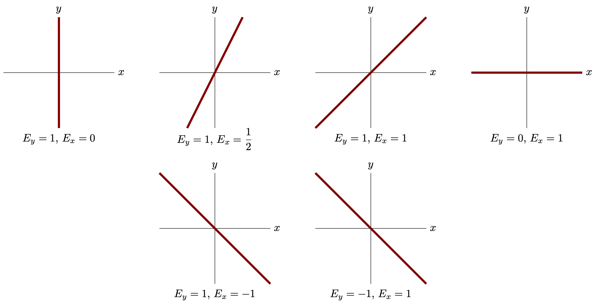{#fig-FLP_1_33_1 width=550}

$x$-진동과 $y$-진동의 위상이 어긋나 있다면, 전기장 벡터는 타원처럼 움직인다. @fig-FLP_1_33_2 는 $x$ 진동의 위상과 $y$ 진동의 위상 사이의 다양한 각도에 대해 전기장 벡터를 보여준다. 일반적으로는 전기장 벡터가 타원 주위를 돈다는 것이다. 단 위상 차이가 $0$ 혹은 $\pi$ 의 정수배일 경우에는 직선상에서 움직인다. 위상차가 $\pi/2$ 일 경우는 원 주위를 돈다.

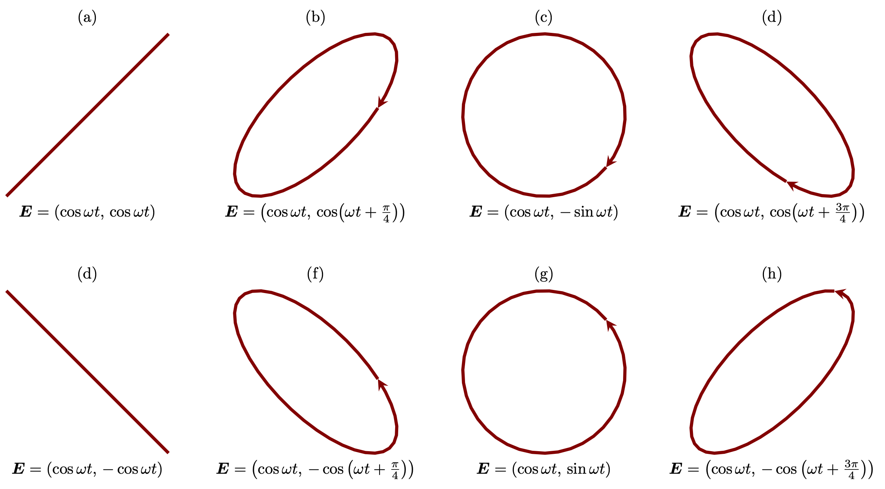{#fig-FLP_1_33_2 width=550}

이제 앞으로 사용할 몇가지 용어를 정리하자. 전기장이 직선위에서 진동할 때 **선형 편광 (linear polarization)** 혹은 **평면 편광 (plane polarization)** 이라고 한다. @fig-FLP_1_33_1 은 선형 편광을 보여준다. 전기장 벡터의 끝이 타원을 그리며 움직이면 **타원 편광 (elliptical polarization)** 이라고 하며 원을 그린다면 **원편광 (circular polarization)** 이라고 한다. 전기 벡터의 끝이 빛이 우리를 향해 곧게 다가올 때 반시계 방향으로 회전한다면, **오른쪽 원편광 (right-handed circular polarization)** 이라고 하고(@fig-FLP_1_33_2 (g)), 시계방향으로 회전한다면  **왼쪽 원편광 (left-handed circular polarization)** 이라고 한다.(@fig-FLP_1_33_2 (c))$^6$.[$^6$ 이렇게 오른쪽 및 왼쪽 이름을 붙이는 관례는 오늘날 물리학에서 편광을 나타내는 다른 모든 입자(예: 전자)에 사용되는 규칙과 일치한다. 하지만 광학에 관한 일부 서적에서는 반대되는 관습이 사용되므로, 주의해야 한다.]{.aside}

선형, 원형 및 타원 편광을 제외한 빛을 **비편광 (unpolarized light)** 이라고 한다. 우리는 빛의 전기장의 진동이 선형, 원형, 타원중 하나인 것을 아는데 어떻게 비편광이란 것이 존재할 수 있는가? 빛이 완벽한 단색광이 아니거나 $x$ 와 $y$ 위상이 완벽하게 유지되지 않는다면 편광 방향이 지속적으로 변한다. 원자는 10−8 초 내에 방출한는 것을 기억하라. 한 원자가 특정 편광을 방출한 뒤 다른 원자가 다른 편광을 가진 빛을 방출하면, 그 편광은 10−8 초마다 변한다. 편광이 우리가 감지할 수 있는 것보다 더 빠르게 변한다면, 편광의 모든 효과가 평균이 되기 때문에 빛을 비편광이라고 부른다. 하지만 정의에서 알 수 있는 바와 같이, 빛은 빛이 편광되었는지 여부를 알 수 없을 때만 비변광이다.

### $\textrm{I}$.33–2 산란광의 편광 {#sec-FLP_1_33_2}

편광 효과의 첫 번째 예는 빛의 산란이다. 예를 들어 태양에서 나오는 빛줄기가 공기 중에 비치는 것을 생각해보자. 전기장은 공기 중 전하의 진동을 일으키며, 이러한 전하의 움직임은 전하의 진동 방향에 수직인 평면에서 최대 강도로 빛을 복사한다. 태양광은 편극되지 않으므로 편광 방향이 지속적으로 변하고, 공기 중 전하의 진동 방향도 지속적으로 변한다. 빛이 90도로 산란된다면, 전하를 띤 입자의 진동은 진동이 관찰자의 시야에 수직일 때만 관찰자에게 방사되며, 그 후 빛은 진동 방향을 따라 편광된다. 따라서 산란은 편광을 생성하는 방법 중 하나이다.

### $\textrm{I}$.33–3 복굴절 {#sec-FLP_1_33_3}

편광의 또 다른 흥미로운 효과는 한 방향으로 선형 편광된 빛과 다른 방향으로 선형 편광된 빛에 대해 굴절률이 서로 다른 물질이 존재한다는 사실이다. 우리가 길고 구형이 아닌 분자로 구성된 물질이 그 넓이보다 길다고 가정하고, 그 분자들이 물질 안에 긴 축을 평행하게 배열했다고 가정해 보십시오. 그렇다면 진동 전기장이 이 물질을 통과하면 어떻게 됩니까? 분자의 구조 때문에 물질 내 전자들이 분자 축에 평행한 방향의 진동에 더 쉽게 반응한다는 것을 가정해 보십시오, 전기장이 분자 축에 직각으로 밀어내려 할 때보다 더 쉽게 반응합니다. 이와 같이 우리는 한 방향에서의 편광에 대한 반응과 그 방향에 직각을 이루는 편광에 대한 반응과 다른 반응을 기대합니다. 분자의 축 방향을 광축이라고 부르겠습니다. 편광이 광축 방향에 있을 때, 굴절률은 편광 방향이 축축에 직각일 때와 다릅니다. 그러한 물질은 이중굴절이라고 합니다. 그것은 물질 내부의 편광 방향에 따라 두 개의 굴절률, 즉 두 개의 굴절률을 가지고 있습니다. 어떤 물질이 복굴절을 할 수 있습니까? 생굴절 물질에서는 어떤 이유에서든 비대칭 분자들이 일정량 정렬되어 있어야 합니다. 확실히 정육면체와 같은 대칭성을 가진 입방 결정은 복굴절이 될 수 없습니다. 하지만 긴 바늘 모양의 결정은 의심할 여지 없이 비대칭적인 분자를 포함하고 있으며, 이 효과를 매우 쉽게 관찰할 수 있습니다.

 

## $\textrm{I}$.34 복사의 상대론적 효과 {#sec-FLP_1_34}

 

