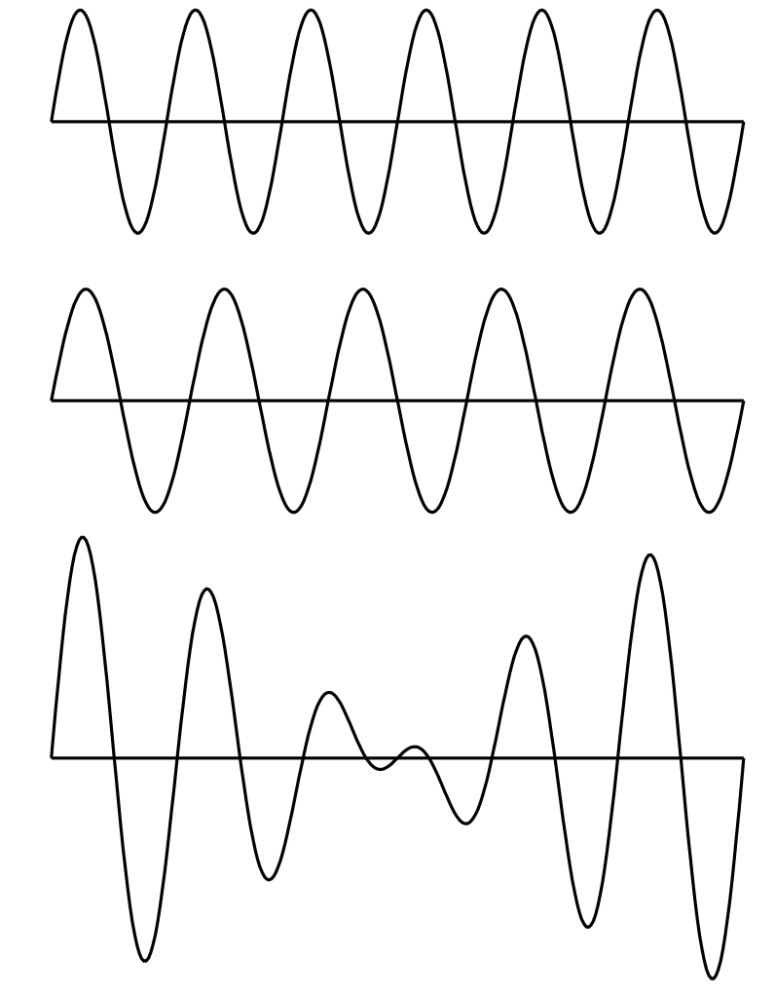
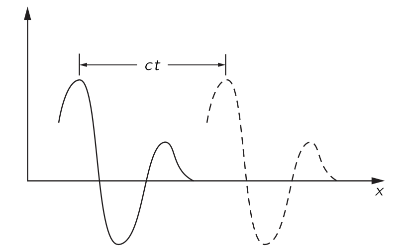
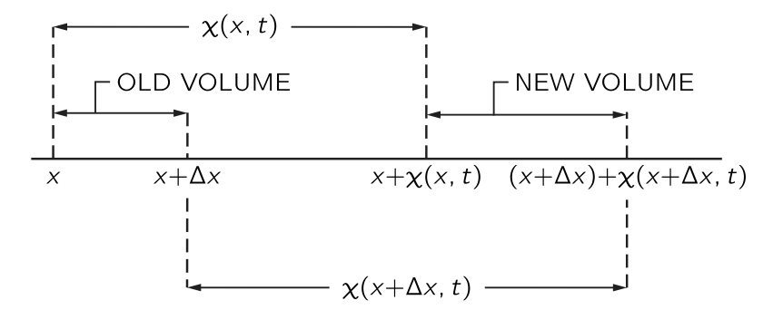
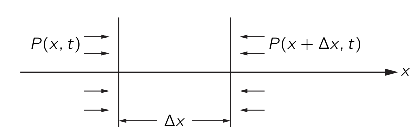

 

## $\textrm{I}$.47. 소리와 파동 {#sec-FLP_1_47}

### $\textrm{I}$.47-1 파동 {#sec-FRLP_1_47_1}

이 장에서는 파동 현상에 대해 논의한다. 파동은 물리학 전반에 걸쳐 다양한 맥락에서 나타나며, 여기서 고려된 예시뿐만 아니라 물리학의 모든 분야에서 나타난다. 

우리는 이미 파동에 대해 알아본 적이 있다. 빛을 다룰 때 서로 다른 위치에 있는 여러 광원으로부터의 파동이 동일한 주파수로 공간에 미치는 간섭에 특히 주의를 기울였다. 아직 논의하지 않은 두 가지 중요한 파동 현상이 빛, 즉 전자기파를 포함한 모든 형태의 파동에서 발생한다: 첫 번째는 시간에 대한 간섭 현상이다. 약간 다른 진동수를 가진 두 소리를 듣는다면, 파동은 둘 다 마루로 혹은 한쪽은 마루로 한쪽은 골로 도달한다.(@fig-FLP_1_47_1 참조). 그 결과 발생하는 소리의 상승과 하강은 맥놀이(Beats), 즉 시간의 간섭 현상이다. 두 번째 현상은 파동이 주어진 부피 내에 제한되어 벽에서 앞뒤로 반사될 때 발생하는 파동 패턴과 관련이 있다.

{#fig-FLP_1_47_1 width=350}

다른 파동의 예로는 해안으로 들어오는 긴 파도가 보이는 물결이나, 표면 장력의 흔들림으로 이루어진 작은 파동이 있다. 또 다른 예로, 고체에서는 두 종류의 탄성파가 있다; 고체 입자가 파동 전파 방향을 따라 앞뒤로 진동하는 **종파(longitudinal wave)**$^1$ 와 고체 입자가 전파 방향에 수직인 방향으로 진동하는 **횡파(transverse wave)**.[$^1$ 가스 내의 음파가 종파이다.]{.aside}  지진파는 두 종류의 탄성파를 포함한다.

또 다른 파동의 예가 현대 물리학에서 발견된다. 이것들은 주어진 위치에서 입자를 찾을 확률 진폭을 제공하는 파동이며, 이미 논의한 **물질파** 이다. 진동수는 에너지에 비례하고 파수는 운동량에 비례한다. 물질파는 양자역학의 파동이다.

이 장에서는 진공에서의 빛과 같이 속도가 파장과 무관한 파동만을 고려한다. 이는 우리가 앞서 보았던 전기장 역시 그러하다. 수학적으로, 1차원 예에서 전기장은 $x−ct$ 의 함수라고 말할 수 있다. 파동이 $t=0$ 에서 $x$ 에 대한 어떤 함수라면 나중시점에서 동일한 전기장을 얻기 위해 $x$ 를 약간 증가시키기만 하면 된다. 우리는 이러한 종류의 함수가 파동의 전파를 나타낸다는 것을 알 수 있다.

{#fig-FLP_1_47_2 width=400}

이런 함수 $f(x−ct)$ 는 파동을 나타낸다. $\Delta x = c\Delta t$ 라면

$$
f(x−ct)=f(x+\Delta x−c(t+\Delta t))
$$

이다. 물론 또 다른 가능성이 있습니다. 즉, @fig-FLP_1_47_2 에 표시된 대로 왼쪽에 소스가 있는 대신 오른쪽에 소스가 있어 파동이 음의 $x$ 방향으로 전파되는 경우이다. 이 경우 파동은 $g(x+ct)$ 로 기술된다.

공간에 동시에 하나 이상의 파동이 존재한다면 전기장은 두 장의 합이며 각각이 독립적으로 전파된다. 전기장의 경우 $f_1(x−ct)$ 와 $f_2(x−ct)$ 가 별도의 전기장이면 둘의 합 역시 전기장이며 이를 **중첩 원리 (superposition principle)** 라고 한다. 같은 규칙은 소리에서도 성립한다.

우리는 소리가 발생할 경우, 생성된 순서와 (거의) 동일한 순서로 듣게 된다는 사실을 잘 알고 있다. 고주파가 저주파보다 더 빠르게 전달된다면, 음악 소리 이후에 짧고 날카로운 소음을 듣게 될 것이다. 마찬가지로, 적색광이 청색광보다 더 빠르게 전달된다면, 백색광 펄스는 처음에 빨간색으로, 그 다음에는 흰색으로, 마지막으로는 파란색으로 보일 것이다. 우리는 이것이 사실이 아니라는 사실을 잘 알고 있다. 소리와 빛은 모두 진동수와 거의 독립된 공기 중의 속도로 전파된다. 이렇지 않은 파동 전파의 예는 48장에서 고려될 것이다.

빛(전자기파)의 경우, 우리는 전하의 가속도로부터 특정 지점의 전기장을 결정하는 규칙을 제시했다. 이제 우리가 해야 할 일은 주어진 공기의 성질(예를 들면 압력)에 대해 소스로부터 일정 거리에 떨어진 위치에서 소스의 움직임으로부터 결정되는 규칙을 제시하는 것이다. 빛의 경우 우리가 아는 것은 한 곳의 전하가 다른 장소에 있는 다른 전하에 힘을 가한다는 것이었습니다. 한 장소에서 다른 장소로 전파달되는 세부 사항은 필요하지 않았다. 따라서 규칙은 제시 될 수 있었다. 그러나 소리의 경우에는 소스와 청자 사이의 공기를 통해 전파되므로 공기의 압력이 얼마인지 묻는 것은 확실히 자연스러운 질문이다. 또한, 공기가 정확히 어떻게 움직이는지 알아야 한다. 전기의 경우에는 아직 전기의 법칙을 알지 못한다고 말할 수 있기 때문에 규칙을 받아들일 수 있지만, 소리에 관해서는 같은 발언을 할 수 없다. 우리는 소리의 압력이 공기 중으로 어떻게 이동하는지를 규정하는 규칙에 만족하지 못할 것이다, 왜냐하면 그 과정은 역학 법칙의 결과로 이해될 수 있어야 하기 때문이다. 간단히 말하면, 소리는 역학의 한 분야이며, 따라서 뉴턴의 법칙에 따라 이해되어야 한다. 소리가 한 장소에서 다른 장소로 전파되는 것은 기체에서 전파될 경우 역학 및 기체의 특성에 불과하며, 그러한 매질을 통해 전파되는 경우 액체나 고체의 특성에 불과합니다. 나중에 우리는 전기역학 법칙으로부터 빛과 그 파동 전파의 특성을 유사한 방식으로 도출할 것이다.

 

### $\textrm{I}$.47-2 소리의 전달

우리는 뉴턴 법칙의 결과로 소스와 수신기 사이의 소리 전파 특성을 유도하지만, 소스와 수신기와의 상호작용은 고려하지 않는다. 보통 결과를 그것을 유도하는 것보다 중요하게 생각하지만 이 장에서는 반대 관점을 취한다. 여기서 핵심은 어느 정도는 유도 그 자체이다. 오래된 현상의 법칙을 이용하여 새로운 현상을 설명하는 이 문제는 아마도 수리 물리학의 가장 위대한 기술일 것이다. 수학 물리학자는 두 가지 문제를 가지고 있다: 하나는 방정식이 주어졌을 때 해를 찾는 것이며, 다른 하나는 새로운 현상을 설명하는 방정식을 찾는 것이다. 여기서의 유도는 두 번째 유형이다.

여기서 가장 간단한 예를 들어보자—1차원에서 소리의 전달. 우선 현재 일어나고 있는 일에 대한 어느 정도 이해해야 한다. 근본적으로 관련된 것은 물체가 공기 중 한 곳에서 이동하면, 공기를 통과하는 교란이 존재한다는 것이다. 어떤 종류의 교란인지 묻는다면, 우리는 물체의 움직임이 압력의 변화를 일으킬 것으로 예상한다고 말할 것이다. 물론, 물체를 부드럽게 움직이면 공기는 단지 그 주위를 흐를 뿐이지만, 우리가 우려하는 것은 급격한 움직임이므로 그런 흐름을 위한 충분한 시간이 없다. 그런 다음, 움직임에 따라 공기가 압축되고 압력 변화가 발생하여 여분의 공기를 밀어 넣게된다. 이 공기는 차례로 압축되어 다시 추가적인 압력의 변화를 일으키고, 파동이 전달된다.

우리는 이제 그러한 과정을 수식으로 표현하고자 한다. 우선 필요한 변수를 결정해야 한다. 이 문제에서는 공기가 얼마나 이동했는지를 알아야 하며, 따라서 음파에서의 공기 변위가 확실히 중요한 변수 중 하나가 된다. 또한, 우리는 공기 밀도가 이동함에 따라 어떻게 변하는지 설명하고자 한다. 공기압도 변하므로, 이것은 또 다른 관심 변수이다. 그렇다면, 물론, 공기에는 속도가 있으므로 공기 입자의 속도를 설명해야 한다. 공기 입자도 가속도를 가지게 된다. 하지만 이러한 많은 변수들을 나열하면서, 공기 변위가 시간에 따라 어떻게 변하는지를 알면 속도와 가속도를 알 수 있다는 것을 곧 깨닫게 된다.

다시 말하지만 우리는 1차원에서의 파동을 생각한다. 소스로부터 충분히 멀리 떨어져 있어, 우리가 파면(wavefronts)이라고 부르는 것이 거의 평면에 가깝다면 이것이 성립한다. 이 경우 변위 $\chi$ 가 $x$ 와 $t$ 에만 의존하고 $y$ 와 $z$ 에는 의존하지 않는다고 말할 수 있다. 따라서 공기는 $\chi(x,t)$ 로 기술된다.

이 설명은 아직 완전하지 않은 것으로 보인다. 우리는 공기 분자가 어떻게 움직이는지에 대한 세부 사항을 전혀 알지 못한다. 공기분자는 사방으로 움직이는데, 이 상황은 $\chi(x,t)$ 로 기술되지 않는다. 동역학 이론의 관점에서, 한 위치에서 분자의 밀도가 높고 그 위치와 인접한 밀도가 낮을 경우, 그 분자는 밀도가 높은 영역에서 낮은 밀도 영역으로 이동하게 되어 이 차이가 균등해진다. 이 경우는 진동이 되지 않고, 소리도 없을 것이다. 음파를 얻기 위해 필요한 것은 다음과 같은 상황이다: 분자들이 밀도가 높고 압력이 높은 영역을 급격히 벗어나면서, 밀도가 낮은 인접 영역에 있는 분자에 운동량을 부여한다. 소리가 생성되기 위해서는 밀도와 압력이 변하는 영역이 다른 분자와 충돌하기 전에 분자가 이동하는 거리보다 훨씬 커야 한다. 이 거리는 **평균 자유 경로(mean free path)** 이며, 압력의 마루와 골 사이의 거리는 이것보다 훨씬 더 커야 한다. 그렇지 않으면 분자는 마루에서 골짜기까지 자유롭게 이동하고 즉시 파동을 벗어나게 된다.

기체의 거동을 평균 자유 경로에 비해 큰 규모로 기술하려는 것이 명백하므로, 기체의 특성은 개별 분자로 설명되지 않을 것이다. 예를 들어 변위는 기체의 작은 원소 질량 중심의 변위이며, 압력 또는 밀도는 이 영역의 압력 또는 밀도를 의미합니다. 우리는 압력 $P$ 와 밀도 $\rho$ 를  $x$ 와 $t$ 의 함수로 기술할 것이다. 이 설명은 근사이며, 이러한 기체 특성이 거리에 따라 크게 변하지 않을 때만 유효하다는 점을 명심해야 한다.

 

### $\textrm{I}$.47-3 파동방정식 {#sec-FLP_1_47_3}

음파 현상의 물리학은 세 가지 성질과 연관된다.

&emsp;$(\textrm{I})$. 기체는 움직이며 밀도를 변화시킨다.

&emsp;$(\textrm{II})$. 밀도의 변화는 압력의 변화에 해당한다.

&emsp;$(\textrm{III})$. 압력의 차이는 기체의 운동을 발생시킨다.

#### **$(\textrm{II})$ 밀도의 변화는 압력의 변화에 해당한다.**

먼저 $(\textrm{II})$ 를 생각한다. 기체, 액체 또는 고체의 경우, 압력은 밀도의 함수이다. 음파가 도착하기 전에 우리는 평형 상태이며, 압력 $P_0$ 와 밀도 $\rho_0$ 을 가지고 있다. 매질에서의 압력 $P$ 는 어떤 특성 관계 $P=f(\rho)$ 로 밀도와 관련되며, 특히 평형 압력 $P_0$ 는 $P_0=f(ρ_0)$ 로 주어진다. 평형값으로부터의 소리에 의한 압력 변화는 매우 작다. 압력을 측정하기 위한 편리한 단위는 $\text{bar}$ 로 $1\,\text{bar}=10^5 \,\text{N/m}^2$ 로 정의되었다. $1 \text{ atm} = 1.0133\,\text{bar}$ 로 1 표준대기압은 거의 1 $\text{bar}$ 이다. 귀는 소리를 대략 로그스케일로 감지하므로 음파의 강도에 로그를 취해 사용한다. 이 스케일이 데시벨 스케일이며, 압력 진폭 $P$ 에 대한 음향 압력 레벨은 다음과 같이 정의된다.

$$
I(\text{음향 압력 레벨}) = 20\log_{10}(P/P_\text{ref}) \,\text{in dB},
$$ {#eq-FLP_1_47_1}

여기서 기준 압력 $P_\text{ref}=2\times 10^{−10}\,\text{bar}$ 이다. 압력 진폭이 $P= 10^3\,P_\text{ref}= 2\times 10^{−7} \,\text{bar}$$^2$ 인 경우, 이는 60 데시벨의 중간 강도의 소리에 해당한다. 우리는 1 기압에 비해 소리의 압력 변화가 매우 작다는 것을 확인할 수 있다. 변위와 밀도 변화 역시 매우 작다. 폭발의 경우에는 발생하는 초과 압력은 1기압보다 클 수 있다. 이러한 큰 압력 변화는 우리가 나중에 고려할 새로운 효과를 초래한다. 소리에서는 100 dB를 초과하는 음향 강도 수준을 자주 고려하지 않는다. 120 dB는 귀에 통증을 유발하는 수준이다.[$^2$ 이 압력은 피크 압력이 아닌 제곱평균제곱근(root mean square) 압력이다.]{.aside} 소리의 경우

$$
P=P_0+P_e,\qquad \rho = \rho_0 + \rho_e
$$ {#eq-FLP_1_47_2}

라고 쓰면 여기서는 $P_e \ll P_0$, $\rho_e \ll \rho_e$ 로 가정한다. 이로부터

$$
P_0+P_e=f(\rho_0+\rho_e)=f(\rho_0)+\rho_e f'(\rho_0),
$$ {#eq-FLP_1_47_3}

이다. 초과 압력 $P_e$ 가 초과 밀도 $\rho_e$ 에 비례하게 되므로 이 비례상수를 $\kappa$ 라고 하면

$$
P_e=\kappa \rho_e,\qquad \text{where } \kappa = f'(\rho_0) = (dP/d\rho)_0. 
$$ {#eq-FLP_1_47_4}

#### **$(\textrm{I})$ 기체는 움직이며 밀도를 변화시킨다.**

{#fig-FLP_1_47_3 width=400}

이제 $(\textrm{I})$ 를 생각한다. 음파에 의해 방해받지 않는 공기의 한 부분의 위치가 $x$ 이고, 소리에 의한 시간 $t$ 에서의 변위는 $\chi(x,t)$ 이며, 따라서 그 새로운 위치는 @fig-FLP_1_47_3 과 같이 $x+\chi(x,t)$ 이다. 여기에 인접한 공기의 교란받지 않은 위치 $x+\Delta x$ 가 음파에 의해 새로운 위치 $x+\Delta x+\chi (x+\Delta x,t)$ 로 이동했다고 하자. 우리는 이제 다음과 같은 방법으로 밀도 변화를 찾을 수 있다. 우리는 평면파에 한정하고 있기 때문에, 음파의 전파 방향인 $x$ 방향에 수직인 단위 면적을 취할 수 있다. $\Delta x$ 에서 단위 면적당 공기의 양은 $\rho_0 \Delta x$ 이며, 여기서 $\rho_0$ 는 방해받지 않은(또는 평형) 공기 밀도이다. 이 공기는 음파에 의해 전위될 때 이제 $x+\chi (x,t)$ 와 $x+\Delta x + \chi (x+\Delta x,t)$ 사이에 위치하므로, 방해받지 않을 때 $\Delta x$ 에 있던 동일한 물질이 이 구간에 존재하게 된다. $\rho$ 가 새로운 밀도라면 다음이 성립한다.

$$
\rho_0 \Delta x = \rho[ x + \Delta x + \chi (x + \Delta x, t) − x − \chi ( x,t ) ].
$$ {#eq-FLP_1_47_5}

$\Delta x$ 가 작으므로 $\chi (x+\Delta x,t)−\chi(x,t)=(\partial \chi/\partial x) \Delta x$ 를 사용 할 수 있다. 그렇다면

$$
\rho_0 \Delta x = \rho \left( \dfrac{\partial \chi}{\partial x}\Delta x+\Delta x \right),
$$ {#eq-FLP_1_47_6}

또는

$$
\rho_0 = (\rho_0+\rho_e)\dfrac{\partial \chi}{\partial x}+\rho_0 + \rho_e 
$$ {#eq-FLP_1_47_7} 

이다. 이제 음파에서는 모든 변화가 작아 $\rho_e$ 도 작고, $\chi$ 도 작으며, $\partial \chi/\partial x$ 도 작다. 따라서 우리가 방금 찾은 관계에서,

$$
\rho_e = −\rho_0\dfrac{\partial \chi}{\partial x} − \rho_e \dfrac{\partial \chi}{\partial x}.
$$ {#eq-FLP_1_47_8}

인데 여기서 $\rho_e \partial \chi/\partial x$ 를 $\rho_0 \partial \chi/\partial x$ 와 비교하여 무시할 수 있다. 이로부터 $(\mathrm{I})$ 에 필요한 관계를 얻게 된다:

$$
\rho_e = −\rho_0\dfrac{\partial \chi}{\partial x}.
$$ {#eq-FLP_1_47_9}

이 식은 우리가 물리적으로 기대할만한 것이다. 변위가 $x$ 에 따라 달라지면, 밀도 변화가 발상해며 $\chi$ 가 $x$ 와 함께 증가하면 당연히 밀도는 감소하므로 부피도 옳다.

#### $(\textrm{III})$. 압력의 차이는 기체의 운동을 발생시킨다.**

{#fig-FLP_1_47_4 width=400}

힘과 압력 사이의 관계를 알면, 우리는 운동 방정식을 얻을 수 있다. 길이가 $\Delta x$ 이고 단면이 $x$ 에 수직인 얇은 공기 슬래브를 생각하자. 단면의 면적은 단위면적이다. 슬래브의 공기 질량은 $\rho_0\Delta x$ 이며 가속도는 $\partial^2 \chi/\partial t^2$ 이므로, 슬래브의 질량에 가속도를 곱하면 $\rho_0 \Delta x(\partial^2 \chi/\partial t^2)$ 이며$^3$ [$^3$$\Delta x$ 가 작다면 가속도 $\partial^2\chi /\partial t^2$ 를 슬래브의 가장자리에서 구하든 중간 위치에서 구하든 차이가 없다.]{.aside} 이는 $x$ 에 수직인 단위 면적에 가해지는 힘이다. @fig-FLP_1_47_4 에서 $\Delta x$ 인 슬래브가 받는 힘은 다음과 같다.

$$
P(x,t)−P(x+\Delta x,t)=−\dfrac{\partial P}{\partial x}\Delta x = −\dfrac{\partial P_e}{\partial x}\Delta x
$$ {#eq-FLP_1_47_10}

이로부터

$$
\rho_0 \dfrac{\partial^2 \chi}{\partial t^2} = −\dfrac{\partial P_e}{\partial x}
$$ {#eq-FLP_2_47_11}

을 얻는다. 이제 $(\textrm{II})$ 의 결과인 @eq-FLP_1_47_4 를 사용하여 @eq-FLP_2_47_11 에서 $P_e$ 를 소거하면

$$
\rho_0\dfrac{\partial^2 \chi}{\partial t^2} = − \kappa \dfrac{\partial \rho_e}{\partial x}
$$ {#eq-FLP_1_47_12}

이다. 이제 $(\textrm{I})$ 의 결과인 @eq-FLP_1_47_9 를 사용하여 $\rho_e$ 를 제거하면

$$
\dfrac{\partial^2 \chi}{\partial t^2} = \kappa \dfrac{\partial^2 \chi}{\partial x^2}
$$ {#eq-FLP_1_47_13}

을 얻는다. 이제 $c^2_s = \kappa$ 라고 하자. 그러혐

$$
\dfrac{\partial^2 \chi}{\partial x^2} = \dfrac{1}{c_s^2}\dfrac{\partial^2 \chi}{\partial t^2}
$$ {#eq-FLP_1_47_14}

로 쓸 수 있다. 이 식은 물질에서 소리의 행동을 기술하는 파동 방정식이다.

 

### $\textrm{I}$.47–4 파동방정식의 해 {#sec-FLP_1_47_4}

일정한 속도 $v$ 로 움직이는 모든 평면파 교란이 $f(x−vt)$ 형태를 가진다고 언급했다. 이제 $\chi(x,t)=f(x−vt)$ 가 파동 방정식의 해인지 해 보자. $\partial \chi/\partial x = f'(x-vt)$ 이므로

$$
\dfrac{\partial^2 \chi}{\partial x^2} =f''(x−vt)
$$ {#eq-FLP_1_47_15}

이다. 또한 $\partial \chi/\partial t=−vf'(x−vt)$ 이며 이로부터

$$
\dfrac{\partial^2 \chi}{\partial t^2} = v^2f''(x−vt)
$$ {#eq-FLP_1_47_16}

이다. 여기서 $v =c_s$ 일 때 $f(x−vt)$ 가 @eq-FLP_1_47_14 의 해라는 것을 알 수 있다. 따라서 역학 법칙에 따르면 모든 소리 교란이 속도 $c_s$ 로 전파된다는 것과

$$
c_s=\sqrt{\kappa} = \sqrt{\left(\dfrac{ dP}{d\rho}\right)_0}
$$

임을 안다. 즉 우리는 파동의 속도와 매질의 특성의 관계 역시 알게 되었다.

반대 방향으로 이동하는 파동을 고려하면, $\chi(x,t)=g(x+vt)$ 역시 파동 방정식을 만족한다는 것을 쉽게 알 수 있다. 그러한 파동과 왼쪽에서 오른쪽으로 이동하는 파동 사이의 유일한 차이는 $v$ 의 부호에 있지만, 함수에서 $x+vt$ 든 $x−vt$ 든 $\partial^2\chi/\partial t^2$ 의 부호에는 영향을 주지 않는다. 따라서 우리는 속도 $c_s$ 로 어느 방향으로 전파되는 파동에 대한 해를 갖게 된다.

매우 흥미로운 질문은 중첩에 관한 것이다. 우리가 동일한 파동방정식은 선형 미분 방정식이므로 임의의 두 해 $\chi_1,\,\chi_2$ 에 대해 $\chi(x,t) = \chi_1(x,t) + \chi_2 (x,t)$ 역시 해이다. 여러번 설명했듯이 이것이 중첩 원리이다.

이제 우리는 $y$ 방향으로 편광된 전기장 $E_y$ 가 아래의 파동방정식을 만족한다면 $x$ 방향으로 전파되는 파도이다.
$$
\dfrac{\partial^2 E_y}{\partial x^2} = \dfrac{1}{c^2}\dfrac{\partial^2 Ey}{\partial t^2}
$$ {#eq-FLP_1_47_20}

여기서 $c$ 는 빛의 속도이며 @eq-FLP_1_47_20 은 맥스웰 방정식의 결과 중 하나이다. 전기역학 방정식은 빛에 대한 파동 방정식을 도출할 것이며, 이는 역학 방정식이 소리에 대한 파동 방정식을 도출하는 것과 같다.

 

### $\textrm{I}$.47–5 음속 {#sec-FLP_1_48_5}

소리에 대한 파동 방정식에서 파동 속도와 압력 변화율을 정상 압력에서의 밀도와 연결하는 식을 구했다.

$$
c_s^2=\left(\dfrac{dP}{d\rho}\right)_0.
$$ {#eq-FLP_1_47_21}

이 변화율을 평가할 때는 온도가 어떻게 변하는지 아는 것이 필수적이다. 음파에서는 밀도가 높은 영역에서 온도가 상승하고, 낮은 영역에서는 온도가 낮아질 것으로 예상된다. 뉴턴은 밀도에 따른 압력 변화율을 최초로 계산했으며, 그는 온도가 변하지 않을 것이라고 가정했다. 그는 열이 한 영역에서 다른 영역으로 매우 빠르게 전달되기 때문에 온도가 상승하거나 하강할 수 없다고 주장했다. 이 논증은 소리의 등온 속도를 제시하지만 그것은 틀렸다. 올바른 추론은 나중에 라플라스에 의해 제시된다. 라플라스는 즉 음파에서 압력과 온도가 단열적으로(adiabatically) 변한다고 주장했다. 압축된 영역에서 희박한 영역으로의 열 흐름은 파장이 평균 자유 경로에 비해 길다면 무시할 수 있다. 이 조건에서는 음파의 약간의 열 흐름이 속도에 영향을 주지 않지만, 소리 에너지가 약간 흡수된다. 우리는 파장이 평균 자유 경로에 가까워짐에 따라 이 흡수가 증가한다는 것을 올바르게 예상할 수 있지만, 이러한 파장은 청각 소리의 파장보다 약 백만배 정도 더 작다.

음파에서 압력과 밀도의 실제 변동은 열 흐름을 허용하지 않는다. 이는 $V$ 가 부피인 $PV^\gamma=\text{const}$ 인 단열 변동에 해당한다. 밀도 $\rho$ 가 $V$ 와 역으로 변하기 때문에, $P$ 와 $\rho$ 사이에

$$
P=\text{const}\rho^\gamma,
$$ {#eq-FLP_1_47_22}

의 관계가 성립한다. 이로부터 우리는 $dP/d\rho = \gamma P/\rho$ 를 얻는다. 그렇다면 음속 $c_s$ 는

$$
c^2_s=\dfrac{\gamma P}{\rho}
$$ {#eq-FLP_1_47_23}

으로 주어진다. 또한 $c^2_s=\gamma PV/\rho V$ 라고 쓰고 $PV=Nk_BT$ 관계를 활용할 수도 있다. 또한, $\rho V$ 는 기체의 질량이며, 이는 $Nm$ 또는 $\mu/\text{mol}$ 로 표현될 수 있다. 여기서 $m$ 은 분자의 질량이고 $μ$ 는 분자량이다. 이로부터

$$
c^2_s = \dfrac{\gamma k_B T}{m} = \dfrac{\gamma R T}{\mu}
$$ {#eq-FLP_1_47_24}

를 얻는다. 즉 음속은 기체 온도에만 의존하고 압력이나 밀도에는 의존하지 않음이 명백하다. 우리는 또한

$$
k_BT=\dfrac{1}{3}m \langle v^2\rangle,
$$ {#eq-FLP_1_47_25}

임을 안다. 여기서 $\langle v^2\rangle$ 은 분자 속도의 제곱의 평균이다. 따라서 $c^2_s=(\gamma /3)\langle v^2\rangle$, 또는

$$
c_s=\left(\dfrac{\gamma}{3}\right)^{1/2}v_\text{av}.
$$ {#eq-FLP_1_47_26} 

을 얻게 된다. 이 방정식은 음속이 분자들의 평균 속도인 $v_\text{av}$ (평균 제곱 속도의 제곱근)를 대략 $1/\sqrt{3}$ 배인 수임을 명시한다. 다시 말해, 음속은 분자의 속도와 같은 order of magnitude 를 가지며, 실제로는 이 평균 속도보다 다소 작다.

물론 압력 변화와 같은 교란은 결국 분자의 움직임에 의해 전파되기 때문에 위의 결과를 그럭저럭 예상할 수도 있다. 그러나 이러한 주장은 정확한 전파 속도를 알려주지 못한다. 소리가 주로 가장 빠른 분자나 가장 느린 분자에 의해 전달된다는 것이 밝혀졌을 수도 있다. 음속이 평균 분자 속도 $v_\text{av}$ 의 약 $1/2$ 에 해당한다는 것은 합리적이며 만족스럽다.

 

## $\textrm{I}$.48 비트 {#sec-FLP_1_48}

 

## $\textrm{I}$.49 모드 {#sec-FLP_1_49}

 

## $\textrm{I}$.50 화음 {#sec-FLP_1_50}

 

## $\textrm{I}$.51 파동 {#sec-FLP_1_51}

 
