 

## $\textrm{I}$.44 열역학 법칙 {#sec-FLP_1_44}

### $\textrm{I}$.44-1 열기관과 열역학 제 1 법칙 {#sec-FLP_1_44_1}

#### **역사적 배경**

지금까지 우리는 물질의 특성을 원자적 관점에서 논의해 왔으며, 사물이 특정 법칙을 따르는 원자로 이루어져 있다고 가정하고 어떤 일이 일어날지 이해하려고 노력해 왔다. 그러나 물질의 특성 사이에는 재료의 상세한 구조와는 무관한 여러 관계가 존재하는데, 이 관계가 바로 열역학의 주제이다. 역사적으로 열역학은 물질의 내부 구조에 대해 이해하기 전에 개발되었다.

예를 들어, 분자운동론으로부터 압력의 원인은 분자 폭격이며, 기체를 가열하면 폭격이 증가하면 압력도 상승해야 한다는 것을 안다. 반대로, 기체 용기의 피스톤이 이 폭격의 힘에 반하여 안쪽으로 이동하면, 피스톤을 폭격하는 분자들의 에너지가 증가하고 그 결과 온도가 상승한다는 것을 안다. 또한 한편으로는 주어진 부피에서 온도를 높이면 압력이 증가하며, 반면에 기체를 압축하면 온도가 상승한다는 것을 안다. 분자운동론으로부터 이 두 효과 사이의 정량적 관계를 이끌어 낼 수 있지만, 본능적으로는 충돌의 세부 사항과 무관한 방식으로 서로 연관되어 있다고 추측할 수 있다.

#### **고무의 수축과 이완**

다른 예를 살펴보자. 고무의 흥미로운 특성은 잡아당기면 온도가 올라가고 수축하면 내려간다는 것이다. 이제 고무줄을 가열하면 밴드가 당겨진다고 생각 할 수 있다. 밴드를 당겨서 가열한다는 사실이 밴드를 가열하면 밴드가 수축하도록 만들 수 있음을 암시할 수 있다. 그리고 실제로, 무게를 잡고 있는 고무 밴드에 가스 불꽃을 가하면, 밴드가 갑자기 수축하는 것을 보게 된다. 따라서 고무 밴드를 가열하면 당겨지는 것이 사실이며, 이 사실은 그 밴드의 장력을 풀면 식는 것과 확실히 관련이 있다.

이러한 효과를 일으키는 고무의 내부 메커니즘은 상당히 복잡하다. 이 장의 주요 목적은 분자 모델과 무관하게 이러한 효과들의 관계를 이해하는 것이지만 일단 어느 정도 분자적 관점에서 이를 이해해보자. 우선 고무는 거대한 긴 분자 사슬의 얽혀 있는, 일종의 “분자 스파게티”라고 할 수 있다. 여기에 분자 사슬 사이에 교차 연결—때때로 스파게티 면들이 붙어서 교차하는 것과 유사한—도 존재한다. 이렇게 얽혀있는 것을 잡아당기면, 일부 사슬은 당기는 방향으로 정렬되는 경향이 있다. 동시에 사슬들은 열운동을 하고 있어 서로 지속적으로 충돌한다. 따라서 그러한 사슬은 늘어날 경우 자체적으로 늘어난 상태를 유지하지 못하고 다른 사슬 및 다른 분자들에 의해 측면에서 타격을 받아 다시 구부려지는 경향이 있다. 따라서 고무줄이 수축하는 진정한 이유는 다음과 같다. 고무줄을 잡아당기면 사슬이 길이 방향으로 이동하고, 사슬 측면에 있는 분자들의 열운동이 사슬을 수축시키려 하기 때문이다. 사슬을 팽팽하게 잡고 온도가 상승하면 사슬 측면에 가해지는 폭격의 강도도 증가하여 사슬이 수축되는 경향이 있으며, 가열될 때 더 강한 무게를 끌어당길 수 있다는 것을 이해할 수 있다. 고무줄을 일정 시간 늘린 후 고무줄이 이완되도록 허용하면, 각 사슬이 부드러워지고, 그 사슬에 닿는 분자들은 이완 사슬을 두드리면서 에너지를 잃게 된다. 그래서 온도가 떨어진다.

우리는 가열 시 수축과 이완 시 냉각이라는 두 과정이 운동 이론에 의해 어떻게 연관될 수 있는지 확인했지만, 이론으로부터 두 과정 사이의 정확한 관계를 규명하는 것은 엄청난 도전이 될 것이다. 우리는 매초 몇 번의 충돌이 발생했는지와 사슬이 어떻게 생겼는지를 알아야 하며, 다양한 다른 복잡한 문제들을 고려해야 한다. 상세한 메커니즘은 매우 복잡하여 분자운동론만으로는 정확히 무슨 일이 일어나는지 정확히 파악할 수 없다. 그럼에도 불구하고 내부 메커니즘에 대해 전혀 알지 못하더라도 관찰하는 두 효과 사이의 명확한 관계를 도출할 수 있다.

#### **열역학의 기원**

열역학 전체 과목은 본질적으로 다음과 같은 사고에 기반한다: 고무줄이 낮은 온도보다 높은 온도에서 “더 강하다”는 점을 고려하면, 무게를 들어 올리고 이를 이동시켜 열을 이용한 작업을 수행할 수 있어야 한다. 실제로 실험적으로 가열된 고무 밴드가 무게를 들어올릴 수 있다는 것을 확인했다. 열을 다루는 방식에 대한 연구는 열역학 과학의 시작이다. 고무 밴드의 가열 효과를 이용해 작동시키는 엔진을 만들 수 있을까? 이와 같은 일을 하는 시시한 엔진을 만들 수 있다. 그것은 모든 살이 고무줄인 자전거 바퀴로 구성되어 있다. 바퀴의 한쪽에 있는 고무줄을 열램프 한 쌍으로 가열하면, 반대쪽 고무줄보다 “더 강해진다”. 바퀴의 무게 중심이 베어링에서 떨어진 한쪽으로 당겨져 바퀴가 회전하며, 회전할 때 차가운 고무 밴드가 램프 방향으로 이동하고, 가열된 밴드는 램프에서 멀어져 차가워지며, 열이 가해지는 한 바퀴가 천천히 회전한다. 이 엔진의 효율은 매우 낮아, 400 와트의 전력으로 램프를 구동하더라도 겨우 파리를 들어올릴 수 있을 뿐이다! 하지만 흥미로운 질문은 열을 사용하여 작업을 보다 효율적으로 수행할 수 있는지 여부이다.

실제로 열역학 과학은 위대한 엔지니어 사디 카르노(Sadi Carnot)가 가장 우수하고 효율적인 엔진을 만드는 방법에 대한 분석으로 시작되었으며, 이는 공학이 물리학 이론에 근본적으로 기여한 몇 안 되는 유명한 사례 중 하나이다. 또 다른 떠오르는 예는 클로드 샤넌이 제시한 정보 이론에 대한 보다 최근의 분석이다. 이 두 분석은 우연히도 밀접하게 관련되어 있는 것으로 보인다.

증기 기관은 일반적으로 열을 가해 끓는 물로부터 형성된 증기가 팽창하여 피스톤을 눌러 바퀴를 회전시켜 작동한다. 증기가 피스톤을 밀어내고는 작업을 종료해야 한다. 사이클을 완성하는 어리석은 방법은 증기를 공기 중으로 배출하게 하는 것인데, 이렇게 하려면 물을 계속 공급해야 한다. 증기를 차가운 물로 응축시킨 뒤 다시 보일러로 보내 지속적으로 순환하도록 하는 것이 더 저렴하고 효율적이다. 열은 이렇게 기관에 공급되어 일로 전환된다. 카르노는 "알코올을 사용하는 것이 더 나을까?", "물질이 최상의 엔진을 만들기 위해 어떤 특성을 가져야 하는가?" 와 같은 질문을 스스로에게 던졌으며, 그 부산물로 위에서 방금 설명한 관련성을 발견하였다.

열역학의 결과는 모두 열역학 법칙이라고 불리는 겉보기에 단순한 몇몇 명제에 암묵적으로 포함되어 있다. 카르노가 살아 있던 시기에는 열역학의 첫 번째 법칙인 에너지 보존 법칙은 알려져 있지 않았다. 카르노의 주장은 매우 신중하게 도출되었으므로 첫 번째 법칙이 그의 시대에 알려지지 않았음에도 불구하고 유효하다! 어느정도 시간이 흐른 뒤 클라페롱(Clapeyron)은 카르노의 매우 미묘한 추론보다 더 쉽게 이해할 수 있는 더 단순한 추론을 만들었다. 하지만 클라페롱은 일반적인 에너지 보존이 아니라 칼로릭 이론(Caloric theory)에 따라 열이 보존된다고 가정했는데 이는 나중에 틀렸음이 밝혀졌다. 이때문에 카르노의 논리가 틀렸다고 자주 말해졌지만 그의 논리는 꽤 정확했다. 모두가 읽은 클라페이론의 간소화된 버전만이 틀렸다.

소위 열역학의 제2법칙은 제1법칙보다 먼저 카르노에 의해 발견되었다! 첫 번째 법칙을 사용하지 않은 카르노의 주장을 제시하는 것이 흥미로울 것이지만, 우리는 역사가 아니라 물리학을 배우기 때문에 그렇게 하지 않는다. 우리는 그것 없이도 많은 일을 할 수 있다는 사실에도 불구하고 처음부터 첫 번째 법칙을 사용할 것이다.

#### **열역학 제 1 법칙**

::: {.callout-important icon="false"}

#### **열역학 제 1 법칙**

우리가 계에 열을 가하고 일을 한다면, 계의 에너지는 투입된 열과 수행된 작업에 의해 증가한다. 계에 가해지는 열 $Q$ 와 계에 가해지는 일 $W$ 를 더한 만큼 시스템의 에너지 $U$ 가 증가한다.

$$
[U \text{ 의 변화량}]=Q+W.
$$  {#eq-FLP_1_44_1}

이를 미분형태로 표현하면 $U$ 의 미소변화 $dU$ 는 다음과 같다.

$$
dU=dQ+dW.
$$ {#eq-FLP_1_44_2}

:::

### $\textrm{I}$.44-2 열역학 제 2 법칙 {#sec-FLP_1_44_2}

#### **카르노의 가정**

이제 열역학 제 2 법칙에 대해 알아보자. 우리가 마찰에 저항하여 일을 한다면 손실되는 일은 발생하는 열과 동일하다는 것을 알고 있다. 만약 우리가 온도 $T$ 에서 충분히 천천히 일을 가한다면, 실내 온도는 크게 변하지 않은 채로 주어진 온도에서 일을 열로 변환한 것이다. 그렇다면 반대의 가능성은 어떨까? 주어진 온도에서 열을 다시 일로 변환하는 것이 가능할까? 열역학 제2법칙은 불가능하다고 주장한다. 마찰과 같은 과정을 역전시키는 것만으로도 열을 일으로 전환할 수 있다면 매우 편리할 것이다. 에너지 보존만을 고려한다면, 분자의 진동 운동과 같은 열 에너지가 유용한 에너지를 충분히 공급할 수 있다고 생각할 수 있다. 하지만 카르노는 단일 온도에서 열의 에너지를 추출하는 것이 불가능하다고 가정했다. 다시 말해, 전 세계가 같은 온도에 있다면, 그 열 에너지를 일로 전환할 수 없다. 일을 열로 전환하는 과정은 주어진 온도에서 진행될 수 있지만, 다시 일로 되돌릴 수는 없다. 구체적으로, 카르노는 다음과 같이 가정했다. **열이 정해진 온도에서 흡수되어 시스템이나 주변 환경에 다른 변화 없이 일으로 전환될 수 없다**

이것은 매우 중요하다. 예를 들어, 정해진 온도에 압축 공기 한 캔이 있다고 가정하고, 그 공기가 팽창하도록 두면. 그것은 일을 할 수 있으며, 예를 들어 망치를 작동시킬 수 있다. 팽창 중에 약간 식지만, 만약 주어진 온도의 대양와 같은 큰 바다가 있다면-우리는 이를 **열 저장소 (heat reservoir)**라고 부른다- 다시 따뜻하게 될 수 있다. 결론적으로 우리는 열 저장소-여기서는 바다-로부터 열을 얻었고 압축 공기로 일을 했다. 그러나 카르노의 가정은 위배되지 않았다. 왜냐하면 우리는 모든 것을 그대로 두지는 않았기 때문이다. 팽창했던 공기를 다시 압축했다면, 우리는 여분의 일을 했다는 것을 알게 될 것이며 과정이 종료된 후에는 온도 $T$ 에서 시스템이 한 일은 없고 우리가 해준 일만 남을것이기 때문이다. 우리는 전체 과정의 최종 결과가 열을 빼앗아 일로 전환하는 상황에 대해서만 이야기해야 하는데 이는 마찰에 맞서 일을 하는 과정의 최종 결과가 일을 받아 열로 전환하는 것과 정확히 반대이다. 사이클이라면 마찰에 반하여 일을 하고 열을 발생시킨 결과가 된다. 이 과정를 거꾸로 작동시킬 수 있을까? 스위치를 켜서 모든 것이 뒤로 돌아가게 하고, 마찰이 우리에게 작용하도록 하며, 바다를 식할 수 있을까? 카르노에 따르면 불가능하며, 따라서 우리는 불가능하다고 가정한다.

이것이 가능하다면 차가운 물체에서 열을 추출하여 비용 없이 뜨거운 물체에 넣을 수 있다. 우리는 뜨거운 것이 차가운 것을 따뜻하게 할 수 있다는 것이 자연스럽다는 것을 알고 있다. 뜨거운 물체와 차가운 물체을 단순히 결합하고 다른 변화가 없다면 경험적으로 뜨거운 것이 더 뜨거워지고 차가운 것이 더 차가워지는 일은 일어나지 않을 것임을 확신한다. 하지만 예를 들어 바다에서 열을 추출하거나 다른 어떤 것으로부터 단일 온도에서 열을 추출하여 일을 할 수 있다면, 그 일은 다른 온도에서 마찰을 통해 다시 열로 변환될 수 있다. 예를 들어, 작동하는 기계의 다른 팔이 이미 뜨거운 것을 문지르고 있을 수 있다. 그 결과는 “차가운” 물체, 즉 바다에서 열을 받아 뜨거운 물체에 전달하는 것이 된다. 열역학 제2법칙인 카르노의 가설은 때때로 다음과 같이 제시된다: **열은 자체적으로 차가운 물체에서 뜨거운 물체로 흐를 수 없다.** 하지만 방금 본 바와 같이, 이 두 진술은 동등하며 소위 열역학 제 2 법칙이다. 

::: {.callout-important icon="false"}

#### **열역학 제 2 법칙**

&emsp;**- 캘빈 버젼 : 단일 온도에서 순 결과가 열을 일로 변환시키는 과정은 불가능하다.**
   
&emsp;**- 클라우시우스 버젼 : 차가운 곳에서 뜨거운 곳으로 열이 스스로 흐르게 할 수 없다.**

:::

#### **열기관**

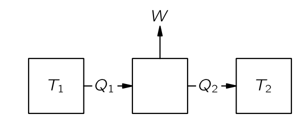{#fig-FLP_1_44_3 width=300}

예를 들어, 온도 $T_1$ 인 보일러가 있는 열 엔진을 구축한다고 가정하자. 보일러로부터 $Q_1$ 의 열을 받은 증기 기관은 일 $W$ 를 수행한 뒤, 다른 온도 $T_2$ 의 복수기(condensor) 에 열 $Q_2$ 를 전달한다. 카르노는 열역학 제 1 법칙을 알지 못했기 때문에 열의 양을 말하지 않았으며, 당시 칼로리 이론의  결론인 $Q_2=Q_1$ 를 사용하지 않았다. 열역학 제 1법칙에 따라

$$
Q_2=Q_1 − W
$$ {#eq-FLP_1_44_3}

이다. 만약 물이 응축된 후 보일러로 다시 펌프되는 일종의 순환 과정이 있다면, 우리는 일정량의 물이 순환하는 동안 각 순환 과정에서 열 $Q_1$ 이 흡수되고 $W$ 만큼의 일을 한다고 할 수 있다. 이로부터 열기관의 효율을 다음과 같이 정의할 수 있다.

::: {.callout-note icon="false"}

#### **열기관의 효율**

열기관이 $Q_1$ 의 열을 받아 $W$ 만큼의 일을 할 때 효율 $\eta$ 는 다음과 같이 정의된다.

$$
\eta := \dfrac{W}{Q}.
$$ {#eq-FLP_definition_of_efficiency_of_engine}

:::

이제 우리는 또 다른 엔진을 제작하고, 온도 $T_1$ 에서 동일한 양의 열이 전달되는 동안 복수기의 온도를 $T_2$ 에 유지한 채 더 많은 일을 할 수 있는지 확인해보자. 우리는 보일러에서 $Q_1$ 과 동일한 양의 열을 사용할 것이며, 증기 기관보다 많은 일을 얻도록  노력할 것이다. 여기에 알코올과 같은 다른 액체를 사용할 수도 있다.

### $\textrm{I}$.44-3 가역 기관

#### **가역 기관**

기관이 마찰이 발생하는 장치를 포함하면 무언가를 잃게 되기 때문에 가장 좋은 기관은 마찰이 없는 기관이다. 그렇다면 에너지 보존을 연구했을 때와 동일하게 완전히 마찰이 없는 기관을 알아본다.

우리는 또한 마찰 없는 운동과 유사한 “마찰 없는” 열 전달을 고려해야 한다. 만약 뜨거운 물체와 차가운 물체를 접촉시켜 열이 전달된다면, 두 물체의 온도의 아주 작은 변화만으로는 그 열이 역방향으로 흐르게 할 수 없다. 하지만 마찰이 거의 없는 기계의 경우라면 작은 힘으로 한쪽으로 밀면 그 방향으로 가고, 작은 힘으로 반대 방향으로 밀면 반대 방향으로 간다. 이렇게 마찰이 없는 역학적 운동과 유사한 **아주 작은 변화만으로 방향을 역전시킬수 있는 열 전달** 은 가능한가? 온도가 다르다면 이는 불가능하지만 열이 본질적으로 동일한 온도의 두 물체 사이에 항상 흐르도록 하고, 열이 흐르는 방향을 미미한 온도의 차이만으로 정할 수 있다면 이를 **가역적(reversible)** 이라고 한다. 왼쪽에 있는 물체를 약간 가열하면 열이 오른쪽으로 흐르고, 약간 냉각하면 열이 왼쪽으로 흐른다. 이런 이상적인 기관을 이른바 **가역기관 (reversible engine)** 이라고 한다. 가역기관은 모든 과정이 무한히 작은 변화를 통해 엔진을 반대 방향으로 만들 수 있기 때문에 가역적이다. 즉, 기계의 어느 곳에도 눈에 띄는 마찰이 없어야 하며, 기계의 어느 곳에도 저장소의 열이나 보일러의 불꽃이 확실히 더 차갑거나 따뜻한 무언가와 직접 접촉해서는 안된다.

#### **카르노 순환**

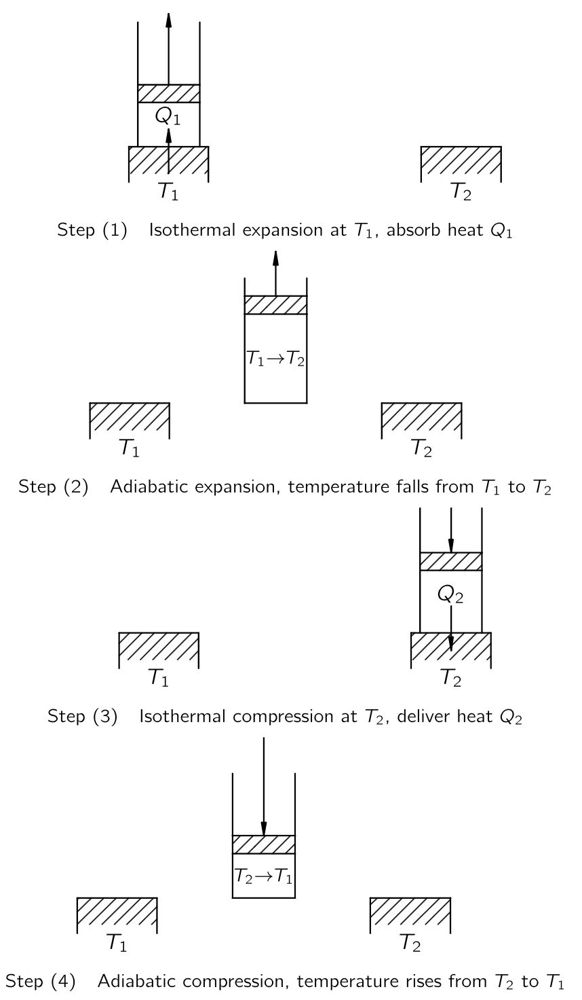{#fig-FLP_1_44_5 width=400}

이제 모든 과정이 가역적인 이상적인 기관을 생각하자. 그러한 것이 원칙적으로 가능함을 보여주기 위해, 우리는 실용적일 수도 있고 아닐 수도 있지만 최소한 카르노의 생각으로는 가역적인 기관의 사이클을 알아보자. 마찰 없는 피스톤이 장착된 실린더에 기체가 있다고 하자. 꼭 이상기체일 필요는 없다. 이 유체는 반드시 기체일 필요도 없지만, 일단 이상기체라고 하자. 또한 온도가 $T_1$ 과 $T_2$ 인 두 거대한 히트패드가 있다고 하자. 그리고 $T_1 > T_2$ 라고 하자.

**Step (1) 등온팽창** : $T_1$ 의 히트패드와 접촉하는 동안 기체는 가열되며 팽창한다. 열이 기체로 흐르는 동안 피스톤을 매우 천천히 빼면서, 기체의 온도가 $T_1$ 차이가 많이 나지 않도록 하자. 피스톤을 너무 빨리 빼면 기체의 온도가 $T_1$ 이하로 너무 낮아지면서 비가역적이 되지만, 충분히 천천히 빼면 가스 온도는 $T_1$ 에서 크게 벗어나지 않을 것이다. 반면에, 피스톤을 천천히 밀면 온도가 $T_1$ 보다 아주 조금(infinitesimally) 높아지며, 열이 뒤로 쏟아진다. 등온 팽창이 충분히 천천히 그리고 부드럽게 수행될 경우, 가역적인 과정임을 확인한다.

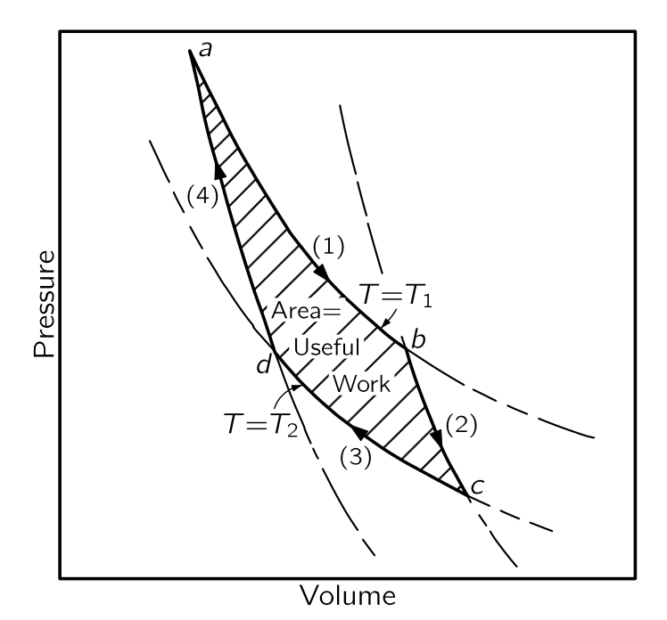{#fig-FLP_1_44_6 width=330}

현재 진행되는 것을 이해하기 위해 기체의 부피에 대한 압력 그래프(@fig-FLP_1_44_6) 를 보자. 기체가 팽창하면서 압력이 낮아진다. $(1)$-곡선은 온도가 $T_1$ 으로 고정될 경우 압력과 부피가 어떻게 변하는지를 보여준다. 이상기체의 경우 $PV=Nk_BT_1$ 이다. 등온팽창은 $b$ 지점까지, 즉 부피가 $V_b$ 가 될 때까지 진행된다. 동시에, 열 $Q_1$ 이 열저장소에서 기체로 흐르게 해야 하며, 기체가 열저장소와 접촉하지 않고 팽창하면 냉각된다. 

**Step (2) 단열 팽창** : $b$ 지점에서 등온 팽창을 완료하고, 실린더를 열저장소에서 떨어트리고 팽창을 계속한다. 이번에는 실린더에 어떤 열도 흐르지 못하도록 한다. 이 팽창 역시 충분히 천천히 수행하므로 가역적이라고 볼 수 있으며, 또한 마찰이 없다고 가정한다. 실린더에 열이 들어오지 않으므로 기체는 계속 팽창하고 온도가 낮아진다. $(2)$-곡선을 따라 온도가 $T_2$ 까지 내려가도록 하고, 그 지점은 $c$ 라고 하자. 열을 추가되지 않는 팽창을 **단열 팽창(adiabatic expansion)** 이라고 한다. 이상 기체의 경우, 우리는 이미 $(2)$-곡선이 $PV^\gamma = \text{const.}$ 형태이며, 여기서 $\gamma$ 는 1 보다 큰 상수임을 안다. 따라서 단열곡선은 등온곡선보다 더 음으로 가파른 기울기를 가진다. 실린더가 이제 온도 $T_2$ 에 도달했으므로, 온도 $T_2$ 의 히트 패드에 올려도 비가역적인 변화는 없다. 

**Step (3) 등온 압축** : 기체가 $T_2$ 의 열저장소과 접촉하는 동안, 표시된 $(3)$-곡선을 따라 천천히 압축한다.실린더가 열저장소와 접촉하고 있기 때문에 온도가 상승하지 않으며, 온도 $T_2$ 에서 열 $Q_2$ 가 실린더에서 열저장소로 흐른다. $(3)$-곡선을 따라 등온으로 $d$ 점까지 압축한다.

**Step (4) 단열 압축** : 온도 $T_2$ 에서 열패드와 실린더를 분리하고 열이 전혀 흐르지 않도록 추가로 압축한다. 온도가 상승하면서, 압력은 $(4)$-곡선을 따른다. 모든 단계를 제대로 수행하면, 시작한 지점인 $T_1$ 온도의 $a$ 지점으로 돌아가 사이클을 반복할 수 있다.

우리는 한 사이클 동안 온도 $T_1$ 에서 $Q_1$ 만큼의 열을 넣고 온도 $T_2$ 에서 $Q_2$ 만큼의 열을 제거했다. 핵심은 이 사이클이 가역적이라는 점이며, 따라서 우리는 모든 단계를 반대 방향으로 표현할 수 있다. 즉 반대방향으로 이 사이클을 수행할 수 있다. 한 방향으로 사이클을 돌면 우리가 기체에 일을 해야 하지만 반대 방향으로 돌면 기체가 우리에게 일한다.

전체 일이 얼마인지는 $W= \int P\,dV$ 로 계산 할 수 있다. 따라서 번호의 곡선의 아래의 면적은 해당 단계에서 기체에 수행되거나 기체에 의해 수행된 일이다. 수행된 순 일의 양은 그림의 음영 영역임을 쉽게 알 수 있다.

#### **카르노 정리**

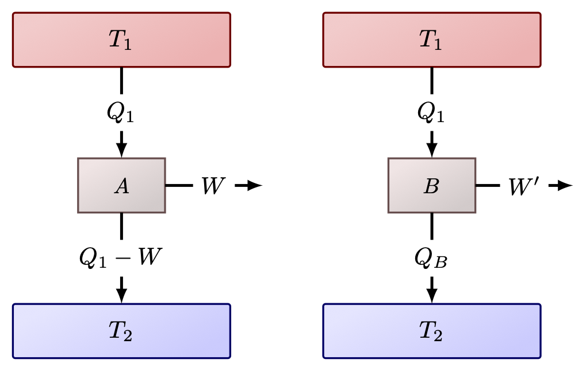{#fig-FLP_two_reversible_engines width=330}

이제 가역 기계가 가능하다는 것을 보였으므로 다른 가역 기관도 가능하다고 가정한다. 가역기관 $A$ 가 $T_1$ 에서 $Q_1$ 을 받아 $W$ 만큼의 일을 하고 $T_2$ 에서 약간의 열을 전달한다고 가정한다. 이제 가역 여부와 관계없이 $T_1$ 에서 동일한 양의 열 $Q_1$ 을 받아들이고, 낮은 온도 $T_2$ 에서 버리도록 설계된 다른 (가역기관을 가정하지 않는) $B$ 기관을 생각하자. $B$ 가 $W'$ 만큼의 일을 한다면 우리는 $W' \le W$ 임을 보일 수 있다. 

::: {.callout-important icon="false"}

#### **카르노의 제 1 정리**

어떤 기관도 가역기관보다 더 많은 일을 할 수 없다.

:::

::: {.proof}

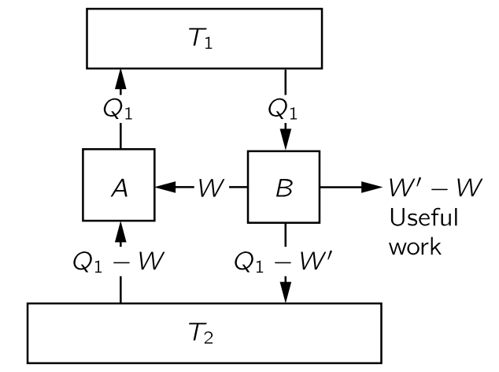{#fig-FLP_1_44_7 width=330}

이제 $W' > W$ 라고 가정하고  @fig-FLP_1_44_7 와 같이 두 기관을 결합하자. 그렇다면 $T_1$ 열저장소에서 열 $Q_1$ 을 얻어, $B$ 기관을  사용하면 $W'$ 만큼의 일을 수행하고 $T_2$ 의 열저장소에 열을 전달할 수 있다. 여기서 $W'$ 의 일을 저장할 수 있다. 이 중 일부인 $W$ 를 사용하고, 나머지 $W'−W$ 를 유용한 작업을 위해 저장 할 수 있다. $A$ 는 가역기관이므로 $W$ 를 사용하여 $A$ 를 역방향으로 구동할 수 있다. $T_2$ 의 열저장소에서 일부 열을 흡수하고 $T_1$ 열저장소에 $Q_1$ 만큼의 열을 $T_1$ 열저장소에 전달한다. 이 이중 사이클의 최종 결과는 모든 것을 이전대로 되돌리게 되고, $W'−W$ 만큼의 일을 더 수행할 수 있는 것이다. 우리가 해야 할 일은 $T_2$ 열저장소에서 에너지를 추출하는 것 뿐이다. 우리는 $T_1$ 열저장소에 $Q_1$ 을 복원하도록 했다. 이로인해 그 열저장소는 작아서 $A+B$ 가 결합된 기계 내부에 있을 수 있으며, 그 순효과는 $T_2$ 저장소에서 순열 $W'−W$ 를 추출하여 일로 전환하는 것이다. 하지만 카르노의 공리에 따르면 단일 온도에서 다른 변화 없이 열저장소에서 유용한 일을 얻는 것은 불가능하다. 따라서 고온 $T_1$ 열저장소에서 일정량의 열을 흡수하여 $T_2$ 열저장소로 전달하는 엔진은 동일한 온도 조건에서 작동하는 가역 엔진보다 더 많은 작업을 수행할 수 없다. $\square$

:::

이로부터 우리는 다음을 알 수 있다.

::: {#cor-FLP_efficiency_of_engine}

어떤 기관의 효율도 가역기관보다 높을 수 없다.
:::

::: {.proof}

@fig-FLP_two_reversible_engines 에서와 같이 $T_1,\,T_2$ 의 열원에서 작동하며 $T_1$ 으로부터 $Q_1$ 만큼의 열을 받아 작동하는 기관의 효율 $\eta$ 와 가역기관의 효율 $\eta_R$ 을 생각하자. 
$$
\eta = \dfrac{W'}{Q_1} \le \dfrac{W}{Q_1} = \eta_R. \qquad \square
$$

:::

 

가역기관에서는 $W=Q_1-Q_2$ 이다. 높은 온도의 열원에서 받는 열을 $Q_h$, 난은 온도의 열원으로 배출하는 열을 $Q_l$ 이라고 하면 $W=Q_h-Q_l$ 이며 따라서 가역기관의 효율 $\eta_R$ 은 다음과 같다.

$$
\eta_R = \dfrac{W}{Q_h} = \dfrac{Q_h-Q_l}{Q_h} = 1- \dfrac{Q_l}{Q_h}.
$$ {#eq-FLP_efficiency_of_reversible_engine}

이제 $B$ 기관도 가역적이라고 가정하면 당연히 $W'$ 가 $W$ 보다 크지 않을 뿐만 아니라, 뒤집어 $W$ 가 $W'$ 보다 클 수 없음을 증명할 수 있다. 따라서 두 기관이 가역적이라면 두 기관 모두 동일한 양의 작업을 수행해야 하며, 따라서 우리는 카르노의 위대한 결론에 도달한다. 

::: {.callout-important icon="false"}

#### **카르노의 제 2 정리**

온도 $T_1$ 에서 일정량의 열 $Q_1$ 을 흡수하고 다른 온도 $T_2$ 에서 열을 방출하는 가역기관은 설계 방식과 무관하게 할 수 있는 일은 동일하다.

:::

이것은 우주의 성질이며, 특정 기관의 성질이 아니다.

만약 우리가 $T_1$ 열저장소에서 $Q_1$ 을 흡수하고 $T_2$ 열저장소에 열을 전달할 때 하는 일을 결정하는 법칙이 무엇인지 알 수 있다면 이 양은 물질과 무관하게 보편적이다. 물론 특정 물질의 특성을 알면, 우리는 그것을 해결한 뒤 모든 다른 물질이 가역기관에서 동일한 양의 일을 해야 한다고 말할 수 있다. 그것이 핵심 아이디어이며, 예를 들어 고무줄을 가열할 때 수축하는 정도와 수축을 허용했을 때 냉각되는 정도 사이의 관계를 찾을 수 있는 단서이다. 그 고무줄을 가역 기계에 넣고, 그것을 뒤집을 수 있는 사이클을 돌게 만든다고 상상해 보라. 그 순 결과, 즉 수행된 일의 총량은 그 보편적인 함수이며, 물체과 무관한 위대한 함수이다. 따라서 우리는 물체의 특성이 특정한 방식으로 제한되어야 함을 알 수 있다; 사람은 가역 사이클 동안에 허용되는 최대 일을 초과하여 생산할 수 있는 물체를 발명할 수 없다. 이 원리와 이 제한은 열역학에서 나오는 유일한 실제 규칙이다.

### $\textrm{I}$.44-4 이상적인 기관의 효율

이제 $Q_1$, $T_1$, $T_2$ 의 함수로서 일 $W$ 를 결정하는 법칙을 찾아보자. $W$ 가 $Q_1$ 에 비례한다는 것은 명백하다. 두 개의 가역기관이 병렬로 작동하는 경우 경우, 이 조합도 가역기관이다. 각각이 열 $Q_1$ 을 흡수한다면, 둘이 합쳐 $2Q_1$ 을 흡수하고 일은 $2W$ 이다. 따라서 $W$ 가 $Q_1$ 에 비례한다는 것은 이상하지 않다.

이제 다음 중요한 단계는 보편적인 법칙을 찾는 것이다. 지금까지는 우리가 알고 있는 법칙을 가진 유일한 물질은 이상 기체이므로 이상기체를 포함한 가역 기관을 통해 알아보자. 특정한 실체를 전혀 사용하지 않고 순수하게 논리적인 논증으로 규칙을 얻는 것도 가능하며 이것은 물리학에서 매우 아름다운 추론 중 하나인데 잠시 후 등장한다. 하지만 먼저 이상기쳬를 사용하여 직접 계산하는 덜 추상적이고 간단한 방법을 우선 사용하겠다.

#### **이상기체 가역엔진**

$Q_1$ 과 $Q_2$ 는 등온 팽창 또는 수축 중에 열저장소와 교환되는 열로 $W=Q_1−Q_2$ 이다. @fig-FLP_1_44_6 의 $(1)$-곡선에서 $a$ 에서 $b$ 까지 진행하는 동안 온도 $T_1$ 의 열저장소에서 흡수되는 열 $Q_1$ 은 얼마인가? 이상기체의 경우 각 분자는 온도에만 의존하는 에너지를 가지고 있으며, 등온팽창 과정이므로 온도와 분자 수가 동일하기 때문에 내부 에너지도 동일하다. $U$ 에는 변화가 없으며, 기체에 수행되는 일은 

$$
W=\int_a^b p\, dV,
$$ 

이다. 팽창 중에는 열저장소에서 $Q_1$ 만큼의 에너지를 취한다. 팽창 중에는 

$$
pV=Nk_BT_1,\qquad \text{or}\qquad p=\dfrac{Nk_BT_1}{V}
$$

이며 이로부터

$$
Q_1=\int_a^b p\, dV=\int_a^b Nk_B T_1 \dfrac{dV}{V} = Nk_BT_1 \ln\dfrac{V_b}{V_a}
$$ {#eq-FLP_1_44_4}

이다. 위 식의 $Q_1$ 이 $T_1$ 열저장소에서 얻은 열이며 마찬가지로 $T_2$ 에서의 압축에 대해 @fig-FLP_1_44_6 의 $(3)$-곡선 을 보면 $T_2$ 의 열저장소 에 전달되는 열 $Q_2$ 는

$$
Q_2=Nk_B T_2 \ln\dfrac{V_c}{V_d}
$${#eq-FLP_1_44_5}

이다. 이제 $V_c/V_d$ 와 $V_b/V_a$ 사이의 관계만 찾으면 된다. 우리는 $(2)$-곡선이 $b$ 에서 $c$ 까지의 단열 팽창이며, 이때 $pV^\gamma$ 가 상수임을 안다. $pV=Nk_BT$ 이므로, $(pV)V^{\gamma−1}$ 역시 상수이며, $T$ 와 $V$ 를 기준으로 $TV^{\gamma−1}$ 역시 상수이다. 즉

$$
T_1V^{\gamma−1}_b=T_2V^{\gamma −1}_c
$$ {#eq-FLP_1_44_6}

이다. $(4)$-곡선 역시 에서 $d$ 에서 $a$ 까지의 단열압축이며 

$$
T_1V^{\gamma−1}_a=T_2V^{\gamma −1}_d
$$ {#eq-FLP_1_44_6a}

이다. 이로부터 $V_b/V_a =V_c/V_d$ 임을 안다. 따라서 다음이 성립한다.

$$
\dfrac{Q_1}{T_1}=\dfrac{Q_2}{T_2}
$$ {#eq-FLP_1_44_7}

이것은 우리가 찾고 있던 관계이다. 우리는 이상기체 가역엔진으로부터 @eq-FLP_1_44_7 을 얻었지만 카르노의 제 2 정리에 따르면 모든 가역기관에 대해 성립한다는 것을 알 수 있다. @eq-FLP_efficiency_of_reversible_engine 로부터 가역기관의 열요휼 $\eta_R$ 이 온도에 의해 아래와 같이 정해진 다는 것을 알 수 있다.

$$
\eta_R = 1- \dfrac{Q_2}{Q_1} = 1-\dfrac{T_2}{T_1}.
$$ {#eq-FLP_efficiency_of_reversible_engine_by_temperature}

#### **세개의 가역기관**

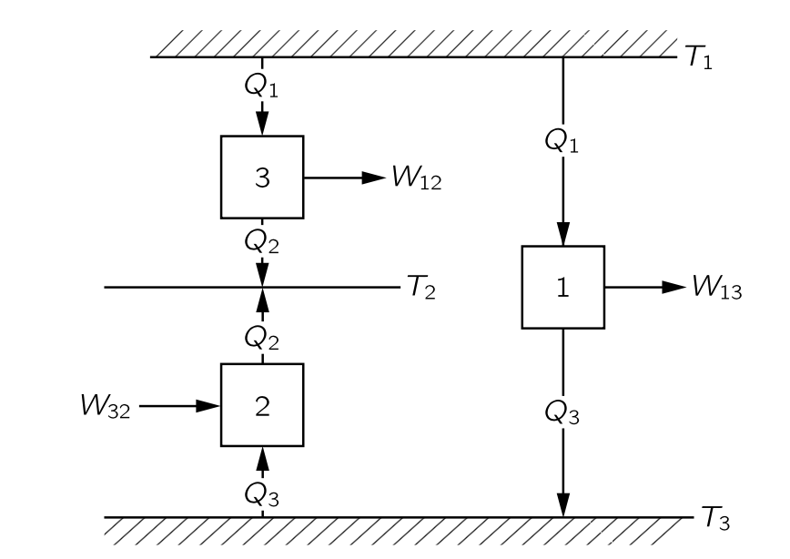{#fig-FLP_1_44_8 width=400}

이제 우리는 논리적 논증을 통해 물질의 특성과 무관한 이 보편적인 법칙을 어떻게 얻을 수 있는지 살펴보자. 세 개의 기관과 세 개의 온도 $T_1,\,T_2,\,T_3$ 가 있다고 가정해 보자. 

- 기관 $\boxed{1}$ 은 온도 $T_1$ 에서 열 $Q_1$ 을 흡수하고 일 $W_{13}$ 을 수행하도록 한 뒤, $T_3$ 열저장소에 열 $Q_3$ 을 전달한다고 하자. (@fig-FLP_1_44_8). 
- 기관 $\boxed{2}$ 는 $T_2$ 와 $T_3$ 사이에서 역방향으로 작동한다고 하자. 기관 $\boxed{2}$ 는 기관 $\boxed{1}$  에서 배출하는 열과 동일한 양의 $Q_3$ 를 $T_3$ 열저장소로부터 흡수하고 $T_2$ 의 열저장소에 열 $Q_2$ 를 전달한다. 기관이 역방향으로 작동하고 있기 때문에 음의 일인 $W_{32}$ 를 해야 한다. 

첫 번째 기관은 사이클을 통해 열 $Q_1$ 을 흡수하고 온도 $T_3$ 에서 $Q_3$ 를 전달한다. 그 다음 두 번째 기관은 온도 $T_3$ 에서 동일한 열 $Q_3$ 를 열저장소에서 받아 온도 $T_2$ 의 열저장소에 전달한다. 따라서 두 기관이 동시에 수행할 경우 최종 결과는 $T_1$ 에서 열 $Q_1$ 을 받아 $T_2$ 에 $Q_2$ 를 전달하는 것이다. 따라서 두 기관은 $T_1$ 에서 $Q_1$ 을 흡수하고 $W_{12}$ 의 일을 한 후 $T_2$ 에 열 $Q_2$ 를 전달하는 세 번째 기관과 동등하다. $W_{12} = W_{13}−W_{32}$ 이며, 열역학 제 1 법칙으로부터 

$$
W_{13}−W_{32}=(Q_1−Q_3)−(Q_2−Q_3)=Q_1−Q_2=W_{12}
$$ {#eq-FLP_1_44_8}

이다. 우리는 이제 엔진의 효율과 관련된 법칙을 얻을 수 있다. 왜냐하면 엔진의 효율이 온도 $T_1$ 과 $T_3$ 사이, $T_2$ 와 $T_3$ 사이, 그리고 $T_1$ 과 $T_2$ 사이에 어떤 형태의 관계가 분명히 존재하기 때문이다.

우리는 매우 명확하게 다음과 같이 주장 할 수 있다: $T_1$ 에서 흡수된 열과 $T_2$ 에 전달되는 열의 관련성을 다른 온도 $T_3$ 에서 전달된 열을 통해 찾을 수 있다. 따라서 표준 온도를 도입하고 그 표준 온도로 모든 것을 분석하면 엔진의 모든 특성을 얻을 수 있다. 다시 말해, 특정 온도 $T$ 와 특정 임의의 표준 온도 사이를 구동하는 엔진의 효율을 알면, 다른 온도 차이에 대한 효율을 알 수 있다. 여기서는 가역기관을 가정하기 때문에, 초기 온도에서 표준 온도까지 내려갔다가 다시 최종 온도로 올라갈 수 있다. 표준 온도를 임의로 $1$^\circ$ 로 정하고, 이 표준 온도에서 전달되는 열을 $Q_S$ 라고 표기하자. 다시 말해, 가역 엔진이 온도 $T$ 에서 열 $Q$ 를 흡수하면, 단위 온도에서 열 $Q_S$ 를 전달한다. 만약 한 기관이 $T_1$ 에서 열 $Q_1$ 을 흡수하고 온도가 $1^\circ$ 에서 열 $Q_S$ 를 전달하고, 다른 기관이 온도 $T_2$ 에서 열 $Q_2$ 을 흡수하고 $Q_S$ 를 $1^\circ$ 의 열원에 전달한다면, 온도 $T_1$ 에서 열 $Q_1$ 을 흡수하는 기관이 $T_1$ 과 $T_2$ 사이에서 동작할 경우 경우 $T_2$ 에 열 $Q_2$ 를 전달한다는 의미이다. 이는 세 온도에서 동작하는 기관에서 이미 증명한 바와 같다. 따라서 우리가 실제로 해야 할 일은 온도 $T_1$ 에서 $Q_1$ 에 어느 정도 열을 넣어야 단위 온도에서 일정량의 열 $Q_S$ 를 전달할 수 있는가이다. 이 값만 찾으면 우리는 모든 것을 알게된다. 열 $Q$ 는 물론 온도 $T$ 의 함수이며, 온도가 상승함에 따라 열이 증가해야 함을 쉽게 알 수 있다. 기관을 역방향으로 작동시키고 더 높은 온도에서 열을 전달하려면 일이 필요함을 알고 있기 때문이다. 또한 열 $Q_1$ 이 $Q_S$ 에 비례해야 한다는 것을 쉽게 알 수 있다. 

따라서 위대한 법칙은 다음과 비슷한 무엇인가이다: **온도 $T$ 도에서 작동하는 엔진으로부터 $1^\circ = T_S$ 에서 전달되는 열 $Q_S$ 에 대해, 흡수되는 열 $Q$ 는 온도에 대한 증가함수와 $Q_S$ 의 곱이다.**

$$
Q=Q_Sf(T).
$$ {#eq-FLP_1_44_9}

### $\textrm{I}$.44-5 열역학적 온도 {#sec-FLP_1_44_5}

#### **열역학적 온도**

이제 우리가 익숙한 수은 온도 척도 대신 특정 물질의 특성과 무관한 새로운 온도 척도를 정의 할 수 있다. @eq-FLP_1_44_9 의 $f(T)$ 는 물질과 무관한 가역 기관의 어떤 장치를 사용하느냐에 따라 달라지지 않는 함수이다. 앞서 보았듯이 가역 엔진들의 효율은 작동 물질에 의존하지 않기 때문이다. $f(T)$ 는 온도에 대한 단조증가함수이므로 해당 함수 자체를 표준 $1^\circ$ 온도 단위 측정한 온도로 정의한다.

$$
Q=ST.
$$ {#eq-FLP_1_44_10} 

여기서

$$
Q_S=S⋅1^\circ
$$ {#eq-FLP_1_44_11}

이다. 즉 물체의 온도와 단위 온도 사이에서 작동하는 가역 엔진이 흡수하는 열의 양을 알아내어 물체가 얼마나 뜨거운지 판단할 수 있음을 의미한다. 보일러에서 1도의 복수기(condensor) 에서 전달되는 열보다 7배 더 많은 열이 발생하면, 보일러의 온도는 7도라고 한다. 즉 서로 다른 온도에서 흡수되는 열의 양을 측정함으로써 우리는 온도를 결정한다. 이와 같이 정의된 온도는 **절대 열역학 온도 (absolute thermodynamic temperature)** 라고 하며, 물질과는 무관하다. 우리는 이제부터 이 정의만을 사용한다.

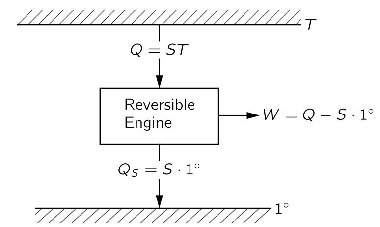{#fig-FLP_1_44_9 width=300}

이제 우리는 두 기관이 $T_1$ 과 $1^\circ$ 사이에서 작동하고, 다른 하나는 $T_2$ 와 $1^\circ$ 도 사이에서 작동하며, 단위 온도에서 동일한 열을 전달한다면, 다음의 관계를 만족해야 한다는 것을 안다.

$$
\boxed{\dfrac{Q_1}{T_1}=S=\dfrac{Q_2}{T_2}.}
$$ {#eq-FLP_1_44_12}

이는 $T_1$ 과 $T_2$ 사이에서 하나의 기관이 작동한다면 최종 결과는 엔진이 온도 $T_1$ 에서 에너지 $Q_1$ 을 흡수하고 온도 $T_2$ 에서 열 $Q_2$ 를 전달하면 $Q_1/T_1=Q_2/T_2$ 라는 의미이다. 엔진이 가역적이라면 이 관계를 따라야 한다. 이것이 열역학 우주의 중심이다.

이것이 열역학의 전부라면, 왜 그렇게 어려운 과목으로 여겨지는가? 특정 물질의 특정 질량을 포함하는 문제를 수행할 때, 물질의 어느 순간이든 그 상태는 그 온도와 부피를 이용하여 설명 할 수 있다. 우리가 물질의 온도와 부피를 알고, 압력이 온도와 부피의 어떤 함수임을 알면 내부 에너지를 알 수 있다. 반면에 누군가는 온도와 압력으로 내부에너지를 포함여 물질의 성질을 설명한다. 이렇게 모두가 다른 접근 방식을 사용하기 때문에 열역학은 어렵다. 우리가 일단 변수를 결정하고 일관성을 유지한다면 많이 쉬워질 것이다.

$F=ma$ 가 역학에서 우주의 중심이며 여기서부터 역학이 진행되는 것처럼, 위의 원리가 열역학서 우주의 중심이다. 이 열역학 원리로부터 어떤 결론들을 내릴 수 있을까?

이제 시작해보자. 우선 에너지 보존 법칙과 $Q_2$ 와 $Q_1$ 의 열을 연결하는 이 법칙을 결합하면, 가역기관의 효율을 쉽게 얻을 수 있다. 열역학 제 1 법칙에 의해 $W=Q_1−Q_2$ 이다. 우리의 새로운 원칙에 따르면,

$$
Q_2=\dfrac{T_2}{T_1}Q_1,
$$

이며 따라서 일은

$$
W=Q_1 \left(1−\dfrac{T_2}{T_1}\right)=Q_1 \dfrac{T_1−T_2}{T_1}
$${#eq-FLP_1_44_13}

이며, 위 식으로부터 기관의 효율 $\eta$ 를 계산 할 수 있다. 기관의 효율 $\eta$ 는 기관이 작동하는 온도 차이를 더 높은 온도로 나눈 값에 비례한다:

$$
\eta :=\dfrac{W}{Q_1}=\dfrac{T_1−T_2}{T_1} = 1-\dfrac{T_2}{T_1}.
$$ {#eq-FLP_1_44_14}

효율은 1보다 클 수 없으며 절대 온도는 0 보다 작을 수 없다. $T_2$ 가 양수여야 하므로 효율은 항상 1보다 적다. 그것이 우리의 첫 번째 결론이다.

### $\textrm{I}$.44-6 엔트로피 {#sec-FLP_1_44_6}

@eq-FLP_1_44_7 또는 @eq-FLP_1_44_12 은 특별한 방식으로 해석될 수 있다. 가역기관을 다룰 때, 온도 $T_1$ 에서의 열 $Q_1$ 은 $Q_1/T_1=Q_2/T_2$ 일 경우 $T_2$ 에서의 열 $Q_2$ 와 동등함을 의미한다. 가역 과정에서 $Q/T$ 는 흡수되는 만큼 방출되며, $Q/T$ 는 더해지거나 덜해지지 않는다. 이 $Q/T$ 를 **엔트로피(entropy)** 라고 하며, 우리는 **가역 순환에서 엔트로피는 변하지 않는다** 고 말한다. $T$ 가 $1^\circ$ 이면 엔트로피는 $Q_S/1^\circ$ 이며, 우리가 표시한 바와 같이 $Q_S/1^\circ=S$ 이다. 실제로 $S$ 는 일반적으로 엔트로피를 표기하는 문자이며, 이는 $1^\circ$‐열저장소에 전달되는 열(우리가 $Q_S$라고 부르는)과 수치적으로 동일하다.

흥미로운 점은 온도와 부피의 함수인 압력과 내부 에너지 외에도, 역시 조건의 함수인 물질의 엔트로피라는 양을 발견했다는 것이다. 이제 엔트로피를 어떻게 계산하는지, 엔트로피가 **조건의 함수** 라고 하는 것이 무슨 의미인지 알아보자. 앞서 단열 및 등온 팽창을 다루었을 때 처럼 다른 두 조건의 시스템을 생각하자. 참고로, 열 기관이 단 두 개의 열저장소만 가질 필요는 없으며 많은 열저장소를 가질 수 있다. $pV$ 다이어그램 상에서 여기저기 움직일 수 있고, 한 조건에서 다른 조건으로 이동할 수 있다. 다시 말해, 우리는 기체가 특정 조건 $a$ 에서 다른 조건 $b$ 로 이동할 수 있다. 단 가역적이어야 한다. 이제 $a$ 에서 $b$ 까지의 경로 전체에 서로 다른 온도의 작은 열저장소가 존재한다고 가정하면, 각 작은 단계에서 물질에서 제거되는 열 $dQ$ 가 경로상의 각 지점에 해당하는 온도로 각 열저장소에 전달된다. 이제 가역 열기관을 사용하여 이 모든 열저장소를 단위 온도의 하나의 열저장소에 연결한다. 우리가 물질을 $a$ 에서 $b$ 로 이동시키면 모든 열저장소를 원래 상태로 되돌릴 것이다. 온도 $T$ 에서 물질로부터 흡수된 모든 열 $dQ$ 는 이제 가역 기계에 의해 변환되었으며, 다음과 같이 단위 온도에서 일정량의 엔트로피 $dS$ 가 전달된다.

$$
dS=\dfrac{dQ}{T}
$$ {#eq-FLP_1_44_15}

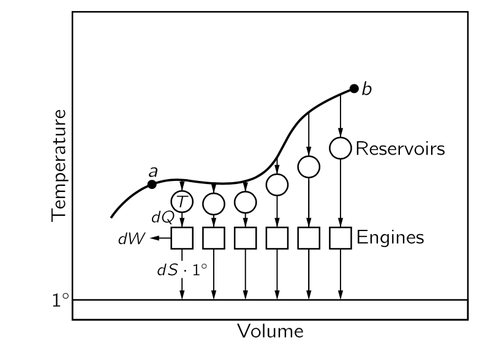{#fig-FLP_1_44_10 width=400}

그렇다면 전달된 엔트로피의 총량은

$$
S_b−S_a=\int_a^b \dfrac{dQ}{T}
$$ {#eq-FLP_1_44_16}

이다. 문제는 엔트로피 차이의 경로의존성 여부이다. $a$ 에서 $b$ 로 가는 경로는 무한하다. 카르노 순환에서는 @fig-FLP_1_44_6 의 $a$ 에서 $c$ 까지 등온 팽창-단열 팽창의 경로를 밟았지만 단열 팽창-등온 팽창의 경로를 따를 수도 있다. 답을 먼저 말하자면 엔트로피 차이는 경로의존성이 없다.

::: {.callout-tip icon="false"}

#### **경로 독립성 증명**

(@Fermi1956ThermodynamicsDover 11 장 Some properties of cycles 와 [Classical Physics 관련 페이지](https://julia-kaeri.github.io/ClassicalPhysics/src/ThermalPhysics/02_entropy.html#sec-TD_some_properties_of_cycles) 를 참고하라.)

$a\to b$ 의 경로 $\Gamma_1$ 과 이 경로와 다른 경로의 $b\to a$ 경로 $\Gamma_2$ 를 생각하자. $1^\circ$ 의 열원이 받는 열은

$$
Q_{\Gamma_1} = \sum_a^b dQ = \sum_a^b dS \cdot 1^\circ = 1^\circ \cdot \int_{\Gamma_1} dS
$$

이다. 가역 순환이므로 $1^\circ$ 에서 받는 총 열량의 합은 $0$ 이어야 한다. 따라서 

$$
0 = \oint dS = 0.
$$

:::

한 경로로 전진하고 다른 경로로 후진하는 순환에서 동일해야만 가역 기관, 즉 단위 온도에서 열저장소에 열이 손실되지 않을 것이기 때문이다. 완전히 가역적인 순환에서는 단위 온도에서 열저장소에서 열을 취할 필요가 없으며, 따라서 $a$ 에서 $b$ 로 이동하기 위해 필요한 엔트로피는 경로와 무관하며, 오직 시작과 종료 지점에만 의존한다. **따라서 우리는 물질의 엔트로피라고 부르는 조건에만 의존하는 함수가 존재한다고 말할 수 있다.** 파인만은 조건에만 의존하는 함수라고 쓰지만 현대에는 **상태 함수 (function of state)** 라는 말을 더 많이 쓴다. 따라서 앞으로는 상태 함수라고 한다.

물질이 가역 경로를 따라 이동함에 따라 단위 온도에서 벼려진 열로 엔트로피 변화를 계산할 경우, 엔트로피의 성질을 갖는 함수 $S(V,T)$ 를 아래와 같이 구할 수 있다.

$$
\Delta S=\int \dfrac{dQ}{T}.
$$ {#eq-FLP_1_44_17}

여기서 $dQ$ 는 온도 $T$ 에서 물질에서 제거되는 열을 의미한다. 전체 엔트로피 변화는 시작조건과 최종조건에서의 엔트로피의 변화이다.

$$
\Delta S=S(V_b,T_b)−S(V_a,T_a)=\int_a^b \dfrac{dQ}{T}.
$$ {#eq-FLP_1_44_18}

이 식은 엔트로피가 아닌 두 상태 사이의 엔트로피 차이만을 정의한다. 어떤 특정 조건에 대한 엔트로피를 계산 할 수 있다면 우리는 $S$ 를 절대적으로 정의할 수 있다.

오랫동안 절대 엔트로피는 아무 의미도 없으며 차이만 정의될 수 있다고 믿어졌지만, 네른스트(Nernst)는 **열역학 제 3 법칙** 을 제안했다. 네른스트 공리는 단순히 절대 영도에서 모든 물체의 엔트로피가 0 이라고 정한다. 우리는 $T$ 와 $V$ 의 한 경우, 즉 $T=0$ 이며 $S=0$ 인 경우를 알고 있으며, 따라서 다른 모든 지점에서 엔트로피를 정할 수 있다.

이상기체의 엔트로피를 계산해 보자. 등온 팽창에서는 $\int dQ/T = Q/T$ 이며 따라서 엔트로피의 변화는 @eq-FLP_1_44_4 로부터 

$$
S(V_a,T)−S(V_b,T)=Nk_B \ln(V_a/V_b),
$$

이다. 즉 $S(V,T)$ 는 $Nk_B \ln V$ 에 어떤 $T$ 의 함수를 더한 것이다. 이 함수는 어떻게 알 수 있을까? 우리는 가역 단열 팽창의 경우 열이 교환되지 않는다는 것을 알고 있으며 이 경우 $TV^{\gamma−1}$ 은 상수이다. 이로부터

$$
S(V,T)=Nk_B \left[\ln V+\dfrac{1}{\gamma−1} \ln T\right] + a
$$

을 얻는다. 여기서 $a$ 는 $V$ 와 $T$ 모두와 독립적인 상수로 화학상수 라고 한다. $a$ 는 기체에 따라 달라지며, $\int dQ/T$ 를 통해 기체를 $0\, \text{K}$ 에서 고체(또는 헬륨의 경우 액체)로 만들 때까지 냉각 및 응축되는 열을 측정하고 열역학 제 3법칙을 이용하여 실험적으로 결정할 수 있다. 또한 플랑크의 상수 및 양자역학을 이용하여 이론적으로도 결정할 수 있지만 여기서는 다루지 않겠다.

#### **가역순환과 엔트로피 보존**

$a$ 에서 $b$ 까지 가역 순환을 수행한다면물질의 엔트로피가 $S_b−S_a$ 만큼 변한다. 또한 엔트로피—$1^\circ$ 에서 전달되는 열—가 $dS=dQ/T$ 규칙에 따라 증가한다는 것을 안다. 여기서 $dQ$ 는 물질의 온도가 $T$ 일 때 우리가 물질에서 제거하는 열이다.

우리는 이미 가역 순환에서 총 엔트로피가 변하지 않는다는 것을 알고 있다. 이는 $T_1$ 에서 흡수되는 열 $Q_1$ 과 $T_2$ 에서 전달되는 열 $Q_2$ 에 의한 엔트로피 변화가 크기가 같고 방향이 반대임을 의미한다. 따라서 가역 순환에서는 열저장소를 포함한 모든 것의 엔트로피에 변화가 없다. **이 규칙은 에너지 보존법칙처럼 보일 수 있지만, 가역 순환에만 적용되며 비가역 순환을 포함하면 엔트로피 보존 법칙이 성립하지 않는다.**

두 가지 예를 들어보자. 먼저, 마찰에 의해 온도 $T$ 에서 어떤 물체에 열 $Q$ 를 발생시킨다고 가정해보자. 엔트로피는 $Q/T$ 만큼 증가한다다. 열 $Q$ 는 일과 동일하므로, 전체 세계의 엔트로피가 $W/T$ 만큼 증가한다.

두번째 예는 다음과 같다. 높은 온도 $T_1$ 과 낮은 온도 $T_2$ 의 두 물체를 함께 배치하면, 일정량의 열이 $T_1$ 의 물체에서 낮은 온도 $T_2$ 의 물체로 자연스럽게 전달된다. 그렇다면 특정 열 $\Delta Q$ 가 $T_1$ 에서 $T_2$ 로 전달될 때, 뜨거운 물체의 엔트로피는 $\Delta Q/T_1$ 만큼 감소하며 차가운 물체의 엔트로피는 $\Delta Q/T_2$ 만큼 증가한다. 열은 물론 고온의 물체에서 저온의 물체로 흐르므로 $\Delta Q> 0$ 이고 따라서 엔트로피의 총합의 변화는 양수이다.

$$
\Delta S=\dfrac{\Delta Q}{T_2}−\dfrac{\Delta Q}{T_1}.
$$ {#eq-FLP_1_44_19}

따라서 다음 명제는 옳다.

::: {.callout-important icon="false"}

#### **열역학 제 2 법칙**

비가역적인 과정에서는 전 우주의 엔트로피가 증가한다. 가역 과정에서는 엔트로피가 일정하게 유지된다. 어떠한 과정도 절대적으로 가역적이지 않으므로 엔트로피틑 항상 증가한다. 가역적 과정은 엔트로피 증가를 최소화하는 이상적인 과정이다.

:::

#### **일반적인 열역학의 두 법칙의 이해**

열역학의 두 법칙은 종종 다음과 같이 기술된다:

&emsp; 제 1 법칙 : 우주의 에너지는 언제나 일정하다.

&emsp; 제 2 법칙:	우주의 엔트로피는 항상 증가한다.

위의 제2법칙에 대한 기술은 썩 좋지는 않다. 가역 순환에서 엔트로피가 동일하게 유지된다는 것을 말하지 않으며,엔트로피가 정확히 무엇인지도 명시하고 있지 않다. 단지 기억하기 좋을 뿐이다. 아래 표는 열역학의 두 법칙에 대한 파인만의 요약이다. 

#### **파인만이 정리한 열역학 법칙**

**제 1 법칙**:

$$
dQ+dW=dU.
$$

**제 2 법칙**:

(1) 열저장소에서 열을 취해 작업으로 전환하는 것뿐인 과정은 불가능하다.

(2) $T_1$ 에서 열 $Q_1$ 을 받아 $T_2$ 에서 열 $Q_2$ 를 전달하는 열 엔진은 가역 엔진에서 수행하는 일 $W$ 보다 더 많은 작업을 수행할 수 없으며 $W$ 는 다음과 같다.

$$
W=Q_1−Q_2=Q_1\left( \dfrac{T_1−T_2}{T_1}\right).
$$

**엔트로피의 정의** :

시스템의 엔트로피는 다음과 같이 정의된다.

&emsp;(a) 열 $\Delta Q$ 가 온도 $T$ 에서 시스템에 가역적으로 추가될 경우, $\Delta S=\Delta Q/T$ 이다.

&emsp;(b) **열역학 제 3 법칙** : $T=0$ 이면 $S=0$ 이다. 

가역 변화에서는 시스템의 모든 부분의 총 엔트로피가 변하지 않는다. 비가역적인 변화에서는 시스템의 전체 엔트로피가 항상 증가한다.

 

## $\textrm{I}$.45 열역학의 양상 {#sec-FLP_1_45}

### $\textrm{I}$.45-1 내부 에너지 {#sec-FLP_1_45_1}

열역학은 같은 것을 설명하는 방법이 매우 다양하기 때문에 복잡하다. 기체의 거동을 설명할 때 압력을 온도와 부피의 함수로 놓거나, 혹은 부피를 온도와 압력의 함수로 놓을 수 있다. 또는 내부 에너지 $U$ 를 온도와 부피의 함수로 정할 수도 있고 온도와 압력, 혹은 압력과 부피의 함수로 정할 수도 있다. 지난 장에서는 온도와 부피의 또 다른 함수인 엔트로피 $S$ 에 대해 알아보았다. 물론 이러한 변수들의 다른 함수들을 원하는 만큼 구성할 수 있다: $U−TS$ 는 온도와 부피의 함수이다. 따라서 우리는 다양한 양의 수가 많이 있으며, 이는 다양한 변수 조합의 함수가 될 수 있다.

이 장에서는 논의의 단순성을 위해 시작 단계에서는 온도 $T$ 와 부피 $V$ 를 독립 변수로 사용하기로 하자. 화학자들은 실험실에서 제어하기 편하기 때문에 보통 온도와 압력을 변수로 사용한다. 이번 장에서는 우선 온도와 부피를 변수로 사용하고, 뒤에는 화학자의 변수 체계로 변환하는 방법을 알아보겠다.

첫째, 온도와 부피라는 독립 변수를 가진 계만을 고려한다. 둘째, 내부 에너지와 압력이라는 두 함수만 논한다. 다른 모든 함수는 이것들로부터 도출될 수 있으므로 논의할 필요가 없다. 이러한 제한으로 인해 열역학은 여전히 꽤 어려운 과목이지만, 그렇게 불가능한 것은 아니다!

이제 온도와 부피의 변화에 따른 내부 에너지 $U(T,V)$ 의 변화는 다음과 같이 표현 할 수 있다.

$$
\Delta U=\left(\dfrac{\partial U}{\partial T}\right)_V \Delta T +  \left(\dfrac{\partial U}{\partial V}\right)_T \Delta V.
$$ {#eq-FLP_1_45_2}

기체에 열 $\Delta Q$ 를 더했을 때 내부 에너지 변화 $\Delta U$ 는 다음과 같다는 것을 안다.

$$
\Delta U=\Delta Q−P\Delta V.
$$ {#eq-FLP_1_45_3}

@eq-FLP_1_45_2 와 @eq-FLP_1_45_3 을 비교하면 $P=−(\partial U/\partial V)_T$ 라고 생각할 수 있지만, 이는 옳지 않다. 올바른 관계를 얻기 위해, 먼저 부피를 일정하게 유지하면서($\Delta V=0$) 기체에 열 $\Delta Q$ 를 더한다면 @eq-FLP_1_45_3 으로부터 $\Delta U=\Delta Q$ 이며, @eq-FLP_1_45_2 로부터 $\Delta U=(\partial U/\partial T)_V \Delta T$ 이다. 따라서 $(\partial U/\partial T)_V = \Delta Q/\Delta T$ 라고 할 수 있다. $\Delta Q/\Delta T$ 는 부피를 일정하게 유지한 물질에 온도를 1도 변화시키는 데 필요한 열량으로, **정적 비열 (heat capacity at constant volume)** 이라고 하며 기호 $C_V$ 로 표기한다. 즉

$$
C_V := \left(\dfrac{\partial U}{\partial T}\right)_V
$$ {#eq-FLP_1_45_4}

이다. 

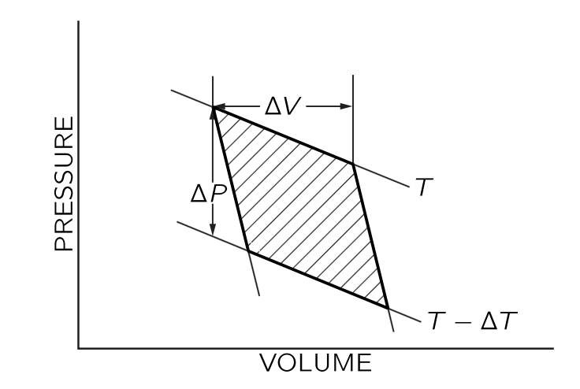{#fig-FLP_1_45_1 width=300}

이제 다시 기체에 열량 $\Delta Q$ 를 더하는데 $T$ 를 일정하게 유지하고 부피가 $\Delta V$ 만큼 변했다고 하자. 이미 아는 바와 같이, 가역 사이클에서 기체가 수행한 총 일은(@eq-FLP_1_44_13) $\Delta Q(\Delta T/T)$ 이며, 여기서 $\Delta Q$ 는 기체가 온도 $T$ 에서 $V$ 에서 $V+\Delta V$ 까지 등온 팽창하면서 가해지는 열에너지의 양이고, $T−\Delta T$ 는 기체가 사이클의 두 번째 구간에서 단열 팽창하면서 도달하는 최종 온도이다. 이제 우리는 이 작업이 @fig-FLP_1_45_1 에 있는 음영 영역이라는 것을 보일 수 있다. 어떠한 상황에서도 기체가 수행하는 일은 $\int P\,dV$ 이며, 기체가 팽창할 때는 양수이고 압축될 때는 음수이다. 부피가 변함에 따라, 기체에 의해 수행되는 일(적분 $\int P\,dV$)은 $V$ 의 초기값과 최종값을 연결하는 곡선 아래의 면적이다. 이 아이디어를 카르노 사이클에 적용하면, 사이클을 돌면서 가스가 수행한 일의 표시를 주의 깊게 보면, 기체가 수행한 순일은 @fig-FLP_1_45_1 의 음영 영역이다.

이제 음영 영역을 기하학적으로 평가해보자. @fig-FLP_1_45_1 의 사이클은 이전 장에서 사용된 사이클과 달리, 이제 $\Delta T$ 와 $\Delta Q$ 가 무한히 작다고 가정하면 @fig-FLP_1_45_1 에 있는 무거운 선들에 의해 설명된 그림은 $\Delta T$ 와 $\Delta Q$ 의 변화가 0에 가까워짐에 따라 평행사변형에 근접한다. 이 평행사변형의 면적은 $\Delta V \Delta P$ 이며, 여기서 $\Delta V$ 는 일정한 온도에서 기체에 에너지 $\Delta Q$ 가 추가되는 부피의 변화이고, $\Delta P$ 는 일정한 부피에서 온도가 $\Delta T$ 에 의해 변하는 압력의 변화이다. @fig-FLP_1_45_1 의 음영 영역은 $\Delta \Delta P$ 이며 이는 그림 @fig-FLP_1_45_2 의 점선으로 둘러싸인 면적과 동일하므로 $\Delta P$ 와 $\Delta V$ 로 둘러싸인 직사각형과는 동일 삼각형 영역의 덧셈 및 뺄셈에 의해서만 차이가 된다. 

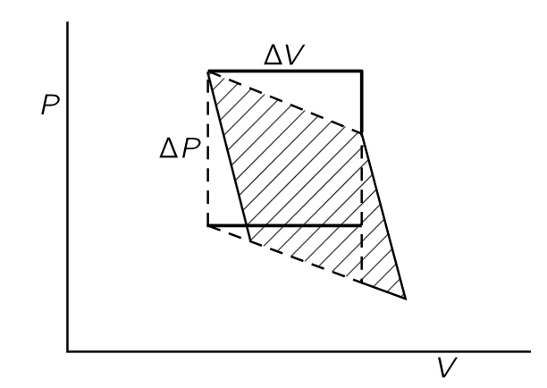{#fig-FLP_1_45_2 width=300}

- 기체가 수행한 순 일 = $\Delta V \Delta P= \Delta Q \left(\dfrac{\Delta T}{T}\right)$,

- 여기서 $\Delta Q$ 는 일정한 온도에 $T$ 에서 부피를 $V\to V+\Delta V$ 만큼 증가시키는 데 필요한 열이다.

- 또한 $\Delta P$ 는 정해진 부피 $V$ 에서 온도를 $T - \Delta T \to T$ 만큼 변화시킬 때의 압력의 변화이다. 즉 $\Delta P = \left(\dfrac{\partial P}{\partial T}\right)_V \Delta T$

이로부터

$$
\Delta Q = T \left(\dfrac{\partial P}{\partial T}\right)_V \Delta V
$$ {#eq-FLP_1_45_5_1}

을 얻으며 @eq-FLP_1_45_3 에 따라

$$
\Delta U =  T \left(\dfrac{\partial P}{\partial T}\right)_V \Delta V - P\Delta V
$$ {#eq-FLP_1_45_6}

이다. 독립변수가 $T,\,V$ 이므로

$$
\left(\dfrac{\partial U}{\partial V}\right)_T = T \left(\dfrac{\partial P}{\partial T}\right)_V - P
$$ {#eq-FLP_1_45_7}

이다. 

### $\textrm{I}$.45-2 응용 {#sec-FLP_1_45_2}

#### **고무줄의 경우**

이제 @eq-FLP_1_45_7 의 의미에 대해 알아보자. 분자운동론에서는 온도가 상승하면 원자가 피스톤에 충돌하기 때문에 압력이 증가한다는 것이 명백하다. 같은 물리적 이유로, 피스톤을 뒤로 움직이게 하면 기체에서 열이 빠져 나가고, 온도를 일정하게 유지하기 위해 열을 다시 주입해야 한다. 기체는 팽창할 때 냉각되고, 가열될 때 압력이 상승한다. @eq-FLP_1_45_7 은 이 두 현상 사이의 연관성을 명시적으로 보여준다. 부피를 고정하고 온도를 증가시키면 압력이 $(\partial P/\partial T)_V$ 비율로 상승한다. 부피를 증가시키면 온도를 일정하게 유지하기 위해 열을 주입하지 않는 한 가스가 냉각되며, $(\partial U/\partial V)_T$ 는 온도를 유지하는 데 필요한 열량을 알려준다. @eq-FLP_1_45_7 은 이 두 효과 사이의 근본적인 상호관계를 나타낸다. 그것은 우리가 열역학 법칙에 도달했을 때 찾겠다고 약속한 것이다. 기체의 내부 메커니즘을 알지 못해도, 두 번째 유형의 영구 운동을 할 수 없다는 것만 알면, 기체가 팽창할 때 일정한 온도를 유지하는 데 필요한 열량과 기체가 일정한 부피에서 가열될 때의 압력 변화 사이의 관계를 추론할 수 있다!

이제 기체에 대해 우리가 원하는 결과를 보게 되었으니, 고무줄을 고려해 보도록 하자. 고무줄을 늘리면 온도가 상승하고, 고무줄을 가열하면 스스로 끌어당긴다. 고무줄에 대해 @eq-FLP_1_45_3 과 동일한 관계를 제공하는 방정식은 무엇일까? 고무줄의 경우 열 $\Delta Q$ 를 가하면 내부 에너지가 $\Delta U$ 만큼 변하고 일을 수행한다. 유일한 차이점은 고무줄이 수행하는 일이 $P\Delta V$ 가 아닌 $−F\Delta L$ 로 주어진다는 것이다. 여기서 $F$ 는 줄에 작용하는 힘이고 $L$ 은 밴드의 길이이다. 힘 $F$ 는 온도와 줄의 길이의 함수이다. 우리는 다음 식을 얻게 된다.

$$
\Delta U = \Delta Q + F\Delta L.
$$ {#eq-FLP_1_45_8}

@eq-FLP_1_45_3 에서 한 글자를 다른 글자로 치환하면 @eq-FLP_1_45_8 을 얻을 수 있다는 것을 알 수 있다. 더우기 $L$ 을 $V$ 로, $−F$ 를 $P$ 로 대체하면, 카르노 사이클에 대한 우리의 모든 논의는 고무 밴드에 적용된다. 예를 들어, 길이를 $\Delta L$ 로 바꾸는 데 필요한 열 $\Delta Q$ 가 @eq-FLP_1_45_5_1 과 유사하게 $\Delta Q = -T(\partial F/\partial T)_L \Delta L$ 로 주어진 다는 것을 추론 할 수 있다. 이를 이용하면 고무줄의 길이를 고정한 상태로 유지하고 고무줄을 가열하면, 구무줄이 약간 풀릴 때 온도를 일정하게 유지하기 위해 필요한 열량에 따라 힘이 얼마나 증가하는지를 계산할 수 있다. 즉 같은 방정식이 기체와 고무줄 모두에 적용된다는 것을 알 수 있다. 실제로, $A$ 와 $B$ 가 힘과 길이, 압력 및 부피 등을 나타내는 양이며 $\Delta U=\Delta Q+A \Delta B$ 라고 쓸 수 있다면, $−P$ 와 $V$ 를 $A,\,B$ 로 대체하여 기체에서 얻은 결과를 적용할 수 있다. 

#### **베터리의 경우**

예를 들어, 배터리의 전기적인 전위 차 $\Phi$ 와 배터리를 통과하는 전하 $\Delta Z$ 를 생각할 때 우리는 저장 배터리와 같은 가역 전기 셀에서 수행되는 일이 $\Phi \Delta Z$ 임을 알고 있다. (일에 $P\Delta V$ 항을 포함하지 않으므로 배터리가 일정한 부피를 유지하는 조건에서.) 열역학이 배터리 성능에 대해 무엇을 알려줄 수 있는지 살펴보자. @eq-FLP_1_45_6 에서 $P$ 를 $\Phi$ 로, $V$ 를 $Z$ 로 대체한다면 다음 식을 얻는다.

$$
\dfrac{\Delta U}{\Delta Z}=T \left(\dfrac{\partial \Phi}{\partial T}\right)_Z − E.
$$ {#eq-FLP_1_45_9}

@eq-FLP_1_45_9 는 $\Delta Z$ 만큼의 전하가 셀을 통과할 때 내부 에너지 $U$ 가 변한다는 것을 말합니다. 왜 $\Delta U/\Delta Z$ 가 단순히 배터리 전압 $\Phi$ 가 아닌가? 답은 실제 배터리가 전하가 셀을 통과할 때 따뜻해진다는 것이다. 즉 배터리의 내부 에너지가 변한다. 첫째, 배터리가 외부 회로에서 일을 했으며, 둘째, 배터리가 가열되기 때문이다. 놀라운 점은 두 번째 부분을 다시 배터리 전압이 온도에 따라 변하는 방식으로 표현할 수 있다는 것이다.  전하가 셀를 통과할 때 화학 반응이 일어나며, @eq-FLP_1_45_9 는 화학 반응을 일으키는 데 필요한 에너지 양을 측정하는 멋진 방법을 제시한다. 우리가 해야 할 일은 반응에 작용하는 셀을 만들고, 전압을 측정하며, 배터리에서 전하를 소모하지 않을 때 온도에 따라 전압이 얼마나 변하는지를 측정하는 것이다!.

#### **변수 변환과 엔탈피**

현재까지 우리는 배터리의 부피를 일정하게 유지할 수 있다고 가정했고, 배터리가 수행한 일을 $E\Delta Z$ 로 정정하여 $P\Delta V$ 항을 생략했다. 결론적으로 부피를 일정하게 유지하는 것이 기술적으로 상당히 어렵다는 것이 밝혀졌다. 셀을 일정한 대기압으로 유지하는 것이 훨씬 더 쉽다. 그 이유로, 화학자들은 위에서 우리가 작성한 어떤 방정식도 좋아하지 않으며, 일정한 압력 하에서의 성능을 설명하는 방정식을 선호한다. 우리는 이 장의 시작에서 $V$ 와 $T$ 를 독립 변수로 사용하기로 선택했지만 화학자들은 이보다 $P$ 와 $T$ 를 선호한다. 이제 지금까지 얻은 결과를 화학자들의 변수 시스템으로 어떻게 변환할 수 있는지 알아보자. $T$ 와 $V$ 에서 $T$ 와 $P$ 로 기어를 전환하고 있기 때문에 혼란이 쉽게 발생할 수 있음에 유의하라.

@eq-FLP_1_45_3, 즉 $\Delta U = \Delta Q−P\Delta V$ 로 시작하자. $P\Delta V$ 는 $E\Delta Z$ 또는 $A\Delta B$ 로 대체될 수 있다. 만약 우리가 어떻게든 마지막 항인 $P\Delta V$ 를 $V\Delta P$ 로 교체할 수 있다면 화학자들은 기뻐할 것이다. $\Delta (PV)= P\Delta V + V \Delta P$ 이며 $\Delta U = \Delta Q-P\Delta V$ 이므로,

$$
\Delta (U+PV) = \Delta Q + V \Delta P
$$

이다. 

::: {.callout-note icon="false"}

#### **엔탈피**

엔탈피 $H$ 는 다음과 같이 정의된다.

$$
H := U + PV.
$$

:::

이제  @eq-FLP_1_45_7 에서 $U\to H$, $P\to −V$, $V\to P$ 로 대체하면 다음 식을 얻는다.

$$
\left(\dfrac{\partial H}{\partial P}\right)_T = −T\left(\dfrac{\partial V}{\partial T}\right)_P+V.
$$

이제 화학자들의 변수 $T$ 와 $P$ 로 어떻게 변환되는지 명확해 졌다. 그리고 지금부터는 원래 변수 $T,\,V$ 로 돌아간다.

#### **이상기체의 경우**

이제 우리가 얻은 결과를 여러 물리적 상황에 적용해 보자. 우선 이상 기체. 분자운동론에 따르면, 기체의 내부 에너지는 분자의 운동과 분자의 수에만 의존한다. 내부 에너지는 $T$ 에 의존하지만 $V$ 에는 의존하지 않는다. 즉 $(\partial U/\partial V)_T=0$ 이며 따라서 @eq-FLP_1_45_7 로 부터 다음을 얻는다.

$$
T\left(\dfrac{\partial P}{\partial T}\right)_V − P=0.
$$ {#eq-FLP_1_45_10}

위의 편미분 방정식으로부터 $V$ 가 일정할 때

$$
P \propto T,\qquad (\text{constant }V)
$$ {#eq-FLP_1_45_12}

을 얻었다. 이는 이상기체 상태방정식 $PV=\nu RT$ 와 일치한다. 우리는 이미 결과를 알고 있었는데 왜 이 계산을 굳이 진행했는가? 극것은 우리가 온도에 대한 두 개의 독립적인 정의를 사용해 왔기 때문이다! 어느 단계에서는 분자의 운동 에너지가 온도에 비례한다고 가정했으며, 이 가정은 우리가 **이상 기체 스케일**라고 부르는 온도 스케일을 정의한다. 이상기체 방정식 $PV=\nu RT$ 는 이상기체 스케일을 기반으로 한다. 우리는 또한 이상기체 스케일에서 측정된 온도를 동적 온도(kinetic temperature)라고 부른다. 그 후, 우리는 온도를 어떠한 물질에도 완전히 독립적인 두 번째 방법, 즉 열역학적 절대 온도를 정의했다. @eq-FLP_1_45_12 에 나타나는 $T$ 가 열역학적 절대온도이다. 우리가 여기서 증명한 것는 내부 에너지가 부피에 의존하지 않는 이상 기체의 압력이 열역학적 절대 온도에 비례한다는 것이다. 우리는 또한 압력이 이상키체 스케일에서 측정된 온도에 비례한다는 것을 알고 있다. 따라서 우리는 운동 온도가 열역학적 절대온도에 비례한다는 것, 즉 두 스케일을 일치시킬 수 있다는 것을 의미한다. 이 경우, 최소한 두 스케일이 일치하도록 선택되었으며, 비례 상수는 $1$ 로 선택되었다. 대부분의 경우 인간은 스스로 문제를 선택하지만, 이번 경우에는 그가 그들을 동등하게 만들었다!

### $\mathrm{I}$.45–3 클라우시우스-클라베이롱 공식 {#sec-FLP_1_45_3}

#### **클라우시우스-클라베이롱 공식**

실린더에 액체가 있어 피스톤을 눌러 압축할 수 있다고 가정하고, 온도를 일정하게 유지하며 부피를 변화시킬 때 압력은 어떻게 되는지 알아보자. 즉 우리는 $P‐V$ 도표에 등온선을 그리는 것이다. 실린더에 있는 물질은 이상 기체가 아닌, 액체상일 수도 있고 증기상일 수도 있으며, 혹은 두 상이 모두 존재할 수도 있으며 충분한 압력을 가하면 물질이 액체로 응축된다. 이제 더 세게 압착하면 부피 변화가 거의 없으며, 우리 등온선은 부피가 감소함에 따라 급격히 상승한다. 이는 @fig-FLP_1_45_3 왼쪽에 표시된 바와 같다. 

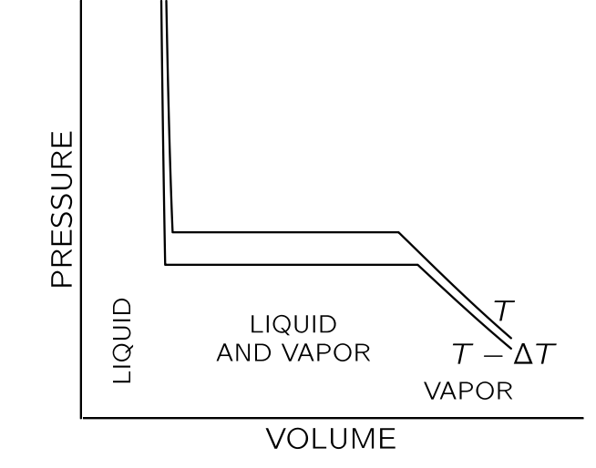{#fig-FLP_1_45_3 width=300}

피스톤을 빼며 부피를 증가시키면 압력이 액체가 끓기 시작하는 지점에 도달할 때까지 감소하고, 그 후 증기가 형성되기 시작한다. 피스톤을 더 멀리 당기면 더 많은 액체가 기화된다. 실린더에 액체와 증기가 같이 존재할 때, 두 상은 평형 상태-액체는 증발하고 증기는 동일한 속도로 응축하는 상태-이다. 증기를 위한 공간을 더 많이 만들면, 압력을 유지하기 위해 더 많은 증기가 필요하므로 약간 더 많은 액체가 증발하지만 압력은 일정하게 유지된다. @fig-FLP_1_45_3 에 있는 곡선의 평평한 부분에서는 압력이 변하지 않으며, 여기서 압력값을 온도 $T$ 에서의 증기압이라고 한다. 부피를 계속 증가시키면 증발할 액체가 더 이상 없게 되고, 부피를 더 확장하면 압력이 일반 기체와 같이 감소하게 된다. @fig-FLP_1_45_3 의 아래쪽 곡선은 약간 낮은 온도 $T−\Delta T$ 에서의 등온선이며, 액체 상에서의 압력은 온도가 상승함에 따라 액체가 팽창하기 때문에 약간 감소한다(대부분의 물질은 이렇지만, 어는점에 가까운 물은 그렇지 않다) 그리고 물론 낮은 온도에서는 증기압이 낮다.

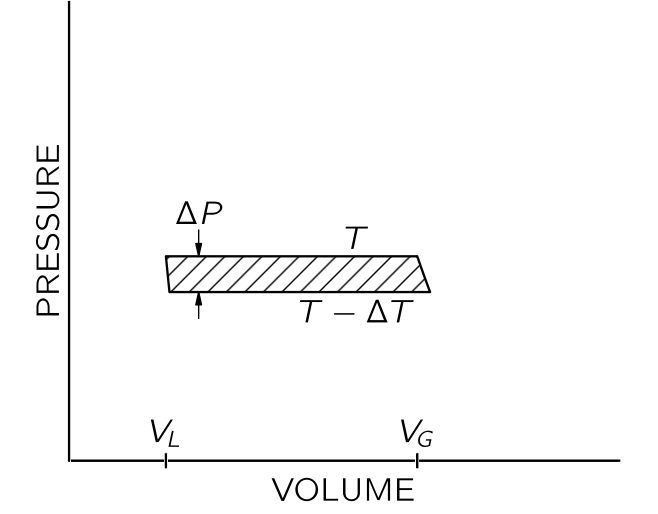{#fig-FLP_1_45_4 width=300}

이제 두 등온선을 상부 평면 단면의 양쪽 끝에서 아래쪽 등온선과 단열 팽창/압축으로 연결하여 사이클을 만든다(@fig-FLP_1_45_4). 우리는 카르노의 논증을 사용할 것이며, 이 논증은 물질을 액체에서 증기로 변하게 할 때 가해지는 열이 물질이 사이클을 순환하는 동안 수행되는 일과 관련이 있음을 알려준다. 실린더 내 물질을 기화시키는 데 필요한 열을 $L$ 이라고 하자. 가역 사이클에서 기체가 수행한 총 일은 @eq-FLP_1_44_13 로부터 $L(\Delta T/T)$ 임을 안다. 앞서와 같이, 물질이 수행한 일은 음영 면적으로 대략 $ΔP(V_G−V_L)$ 이다. 여기서 $\Delta P$ 는 두 온도 $T$ 와 $T-\Delta T$ 에서의 증기압 차이, $V_G$, $V_L$ 은 각각 증기와 액체의 부피이며, 두 부피 모두 온도 $T$ 의 증기압에서 측정된 부피이다. 면적에 대해 이 두 식을 동일하게 설정하면 $L\Delta T/T=\Delta P(V_G−V_L)$ 이 된다. 혹은

$$
\dfrac{L}{T(V_G−V_L)}=\dfrac{\partial P_\text{vap}}{\partial T}.
$$ {#eq-FLP_1_45_14}

@eq-FLP_1_45_14 는 온도에 따른 증기압 변화율과 액체를 증발시키는 데 필요한 열량 사이의 관계를 나타낸다. 이 관계는 카르노에 의해 도출되었지만, 클라우시우스‐클라페이롱 공식이라고 불린다.

이제 @eq-FLP_1_45_14 를 분자운동론의 결과와 비교해보자. 보통 $V_G \gg V_L$ 이다. 따라서 몰당 $V_G−V_L \approx V_G=RT/P$ 이다. 아주 좋은 근사값은 아니지만 우리가 $L$ 을 온도와 무관한 상수라고 가정한다면 $\partial P/\partial T=L/(RT^2/P)$ 가 되며, 이 미분방정식의 해는 

$$
P=\text{const}\cdot e^{−L/RT}.
$$ {#eq-FLP_1_45_15}

이것을 이전에 분자운동론으로부터 추론한 온도에 따른 압력 변동과 비교해 보자. 분자운동론에서는 최소한 대략적으로는, 액체 위의 증기에 대한 단위 부피당 분자 수가

$$
n=\left(\dfrac{1}{V_a}\right)e^{-(U_G−U_L)/RT}
$$ {#eq-FLP_1_45_16}

이다. 여기서 $U_G−U_L$ 은 기체의 몰당 내부 에너지에서 액체의 몰당 내부 에너지를 뺀 값이며, 즉 액체 1몰을 기화시키는 데 필요한 에너지이다. @eq-FLP_1_45_15 는 열역학으로부터, @eq-FLP_1_45_16 는 기치운동론으로 부터 나온 것이며 압력이 $nk_BT$ 이기 때문에 매우 밀접하게 관련되어 있지만 정확히 동일하지는 않다. 하지만 $L=\text{const}$ 가 아니라 온도와 무관하게 $U_G−U_L=\text{const}$ 라고 가정하면 정확히 동일하게 될 것이다. $U_G−U_L=\text{const}$ 를 온도와 무관하게 가정한다면 압력이 일정하고 부피가 변하는 동안, 내부 에너지의 변화 $(U_G−U_L) =  L - P(V_G−V_L)$ 이며 따라서 $L = (U_G+PV_G)−(U_L+PV_L)$ 이다. 그렇다면 @eq-FLP_1_45_14 은 $V_G \gg V_L$ 조건에서

$$
\dfrac{U_G-U_L}{TV_G} + \dfrac{P}{T} = \dfrac{\partial P}{\partial T}
$$

이다. 이상기체조건 $1/V_G = P/RT$ 을 사용하면

$$
\dfrac{U_G-U_L}{RT^2}P+ \dfrac{P}{T} = \dfrac{\partial P}{\partial T}
$$

이며 이 미분방정식의 해는 $P=\text{constant}\cdot T e^{-(U_G-U_L)/RT}$ 임을 알 수 있다. $n \propto 1/V_G \propto P/T \propto e^{-(U_G-U_L)/RT}$ 이며 $T\to \infty$ 극한에서 $n = 1/V_a$ 이므로 @eq-FLP_1_45_16 를 얻는다.

이 비교는 열역학이 운동 이론에 비해 갖는 장단점을 보여준다. 우선 열역학에 의해 얻어진 @eq-FLP_1_45_14 는 정확하지만 @eq-FLP_1_45_16 은 예를 들어 $U$ 가 거의 일정하고 모델이 올바른 경우에만 근사될 수 있다. 둘째, 우리는 증기가 액체로 들어가는 방식을 정확히 이해하지 못할 수도 있다. 그럼에도 불구하고 @eq-FLP_1_45_14 는 옳으며, @eq-FLP_1_45_16 은 근사이다. 셋째, 우리의 과정은 액체로 응축되는 가스에 적용되었을지라도, 이 논리는 다른 모든 상태 변화에 대해 타당하다. 예를 들어, 고체에서 액체로의 전이는 @fig-FLP_1_45_3  @fig-FLP_1_45_4 에 표시된 것과 동일한 종류의 곡선을 가지고 있다. 용융에서의 몰당 잠열을 $M$ 이라고 하면 @eq-FLP_1_45_14 와 유사한 $(\partial P_\text{melt}/\partial T)V=M/[T(V_\text{liq}−V_\text{solid})]$ 를 얻는다. 비록 우리는 용융 과정의 운동 이론을 이해하지 못할지라도 올바른 방정식을 가진다. 하지만, 우리가 분자운동론을 이해한다면 또 다른 장점을 가지게 된다. @eq-FLP_1_45_14 는 단지 미분 관계일 뿐이며, 우리는 적분 상수를 얻을 방법이 없다. 분자운동론에서는 현상을 완전히 설명하는 좋은 모델이 있다면 상수를 얻을 수도 있다. 각각에는 장점과 단점이 있다. 지식이 적고 상황이 복잡할 때, 열역학적 관계가 정말 가장 강력하다. 상황이 매우 단순하고 이론적 분석을 할 수 있을 때, 이론적 분석을 통해 더 많은 정보를 얻으려고 시도하는 것이 좋다.

#### **흑체 복사**

앞서 우리는 흑체복사에서 진동자와 복사 사이의 평형에 대해 논의했다. 우리는 또한 광자가 상자의 벽에 충돌하면서 압력 $P$ 를 가하며, 광자의 총 에너지 $U$ 와 상자의 부피 $V$ 사이에 $PV=U/3$ 의 관계가 성립한다는 것도 알게 되었다. @eq-FLP_1_45_7 에 $U=3PV$ 를 대입하면 아래 식을 얻는다.

$$
\left(\dfrac{\partial U}{\partial V}\right)_T = 3 P = T\left( \dfrac{\partial P}{\partial T}\right)_V−P.
$$ {#eq-FLP_1_45_17}

상자의 부피가 일정하므로 $(\partial P/\partial T)_V = dP/dT$ 이며, 따라서 상미분 방정식을 얻게 된다. 적분을 통해 $\ln P = 4\ln T + \text{const}$, 또는 $P = \text{const}\cdot T^4$ 를 얻는다. 복사의 압력은 온도의 $4$ 제곱에 비례하며, 복사의 전체 에너지 밀도인 $U/V=3P$ 도 $T^4$ 에 따라 변한다. 보통 $U/V=(4\sigma /c)T^4$ 로 표기하며, 여기서 $c$ 는 빛의 속도이고 $\sigma$ 는 스테판-볼츠만 상수(Stefan-Boltzmann constant) 라고 한다. 열역학만으로는 $\sigma$ 를 얻을 수 없다. 그것은 열역학의 힘과 한계에 대한 좋은 예시이다. $U/V \propto T^4$ 를 아는 것은 대단하지만, 어떤 온도에서도 $U/V$ 가 실제로 얼마나 큰지 알기 위해서는 완전한 이론만이 제공할 수 있는 세부 사항을 다루어야 한다. 흑체 복사에 대해 우리는 이러한 이론을 가지고 있으며, 다음과 같이 상수 $\sigma$ 에 대한 식을 도출할 수 있다.

$I(\omega)\,d\omega$ 를 1초 동안 $1\,\text{m}^2$ 를 통과하는 $\omega$ 와 $\omega+d\omega$ 사이의 진동수를 가지고 통과하는 에너지 강도의 분포라고 하자. 에너지 밀도 분포=에너지/부피=$I(\omega)\,d\omega/c$ 는

$$
\dfrac{U}{V}=\text{총 에너지 밀도} =\int_{\omega=0}^\infty \omega\text{ 와 } \omega + d\omega \text{ 사이의 에너지 밀도} =\int_0^\infty \dfrac{I(\omega)\,d\omega}{c}.
$$

이다. 이미 우리는 다음을 안다.

$$
I(\omega)=\dfrac{\hbar \omega^3}{\pi^2 c^2 \left(e^{\hbar \omega/k_B T}-1\right)}.
$$

이 식을 $U/V$ 에 대한 방정식에서 $I(\omega)$ 로 대입하면

$$
\dfrac{U}{V}=\dfrac{1}{\pi^2 c^3}\int_0^\infty \dfrac{\hbar \omega^3 \,d\omega}{e^{\hbar \omega/k_B T}-1}
$$

이며 $x= \hbar \omega/k_BT$ 로 대입하면

$$
\dfrac{U}{V}=\dfrac{(k_BT)^4}{\hbar^3 \pi^2 c^3}\int_0^\infty \dfrac{x^3\, dx}{e^x-1}
$$

이다. 여기서 적분을 수치해석적으로 구하면 대략 $6.5$ 이며 정확히 구하면 $\pi^4/15$ 이다. 이 식을 $U/V=(4\sigma /c)T^4$ 와 비교하면

$$
\sigma = \dfrac{{k_B}^4 \pi^2}{60 \hbar^3 c^2} = 5.67\times 10^{−8} \dfrac{\text{watts}}{(\text{meter})^2(\text{degree})^4}.
$$

이다. 그렇다면 상자에 작은 구멍을 만들면, 단위 면적의 구멍을 통해 초당 얼마나 많은 에너지가 흐를까? 에너지 밀도에서 에너지 흐름으로 이동하려면, 에너지 밀도 $U/V$ 에 $c$ 를 곱한다. 또한 $1/4$ 을 곱해야 한다. 왜냐하면 우선 방출되는 에너지만이 탈출하기 때문에 $1/2$ 를, 둘째 법선 각도로 구멍에 접근하는 에너지가 코사인 계수만큼 구멍을 통과하는 효율이 감소하기 때문에 $1/2$ 를. 이제 왜 우리가 $U/V=(4\sigma/c)T^4$ 라고 쓰는지 명확하다: 이는 결국 작은 구멍으로부터의 플럭스가 단위 면적당 $σT^4$ 이기 때문이다.

 

## $\textrm{I}$.46 래칫과 폴 {#sec-FLP_1_46}

래칫과 폴은 샤프트가 한 방향으로만 회전하도록 하는 매우 간단한 장치이다. 어떤 것이 한 방향으로만 회전하는 가능성은 상세하고 신중한 분석이 필요하며, 매우 흥미로운 결과를 보여준다.

논의의 계획은 분자적 또는 동역학적 관점에서 열기관에서 추출될 수 있는 최대 작업량이 존재한다는 사실에 대한 기본적인 설명을 고안하려는 시도에서 도출되다. 물론 우리는 카르노의 주장의 본질을 이미 보았지만, 물리적으로 무슨 일이 일어나고 있는지 볼 수 있는 기본적인 설명을 찾는 것이 좋을것이다. 현재, 뉴턴의 법칙에서 유래한 복잡한 수학적 증명이 존재하여 열이 한 장소에서 다른 장소로 흐를 때 우리가 얻을 수 있는 일은 일정량만 얻을 수 있음을 보여주지만, 이를 기본적인 증명으로 전환하는 것은 매우 어렵다. 요약하면, 우리는 그것을 이해하지 못하지만, 수학은 따라갈 수 있다.

카르노의 주장에 따르면, 한 온도에서 다른 온도로 이동할 때 일정량 이상의 일을 추출할 수 없다는 사실은, 모든 것이 동일한 온도에 있을 경우 열을 순환 과정을 통해 일로 전환할 수 없다는 또 다른 공리에서 추론된다. 먼저, 되돌아가서 최소한 하나의 기본적인 예시에서 이 더 간단한 진술이 왜 옳은지 살펴보자.

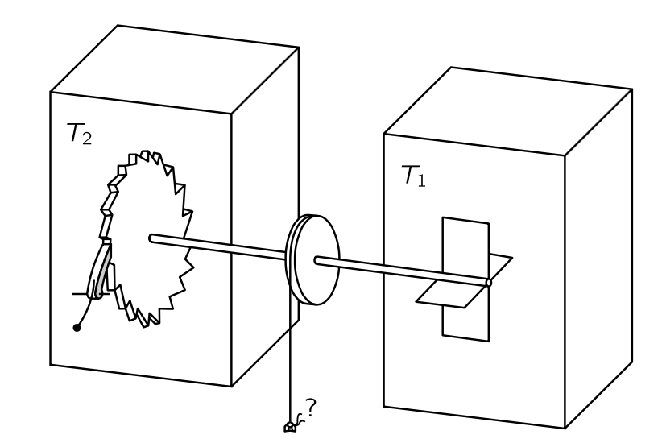{#fig-FLP_1_46_1 width=300}

열역학 제2법칙을 위반하는 장치를 생각해 보자. 즉, 모든 것이 동일한 온도인 열 저장소에서 일을 생성하는 장치. 예를 들어, 특정 온도의 기체 상자를 가지고 있으며, 그 안에 날개가 달린 샤프트가 있다고 합자. (@fig-FLP_1_46_1 에서 $T_1= T_2= T$ 라고 하자.) 기체 분자가 날개에 충돌하기 때문에 날개는 진동하고 흔들린다. 우리가 해야 할 일은 샤프트의 반대쪽 끝에 한 방향으로만 회전할 수 있는 바퀴, 즉 래칫과 폴을 연결하는 것뿐이다. 그렇다면 샤프트가 한쪽 방향으로 흔들리려고 하면 회전하지 않고, 반대쪽을 흔들면 회전한다. 그러면 바퀴가 천천히 회전하고, 어쩌면 우리는 축에 있는 드럼에 매달린 끈에 벼룩을 묶어 벼룩을 들어올릴 수도 있다! 이제 이것이 가능한지 확인해보자. 카르노의 가설에 따르면 불가능하지만 그냥 보면, 겉으로는 꽤 가능해 보인다. 그러므로 우리는 더 자세히 살펴봐야 한다. 실제로 래칫과 폴을 보면 여러 가지 복잡함을 볼 수 있다.

우선, 우리가 이상화한 래칫은 가능한 한 단순하지만, 그래도 폴이 존재하고 그 폴에 스프링이 있어야 한다. 이빨이 빠진 후에는 폴이 되돌아와야 하므로 스프링이 필요하다.

그림에 표시되지 않은 이 래칫과 폴의 또 다른 특징은 매우 필수적입니다. 장치가 완전히 탄성인 부품으로 만들어지고 있다고 가정하자. 이빨 끝에서 폴이 들어올려지고 스프링에 의해 뒤로 밀려진 후, 바퀴에 튕겨 계속 튕겨 나갑니다. 그때, 또 다른 변동이 발생했을 때, 바퀴가 반대 방향으로 회전할 수 있었는데, 이는 이빨이 폴이 올라온 순간에 아래로 들어갈 수 있었기 때문이다. 따라서 우리 바퀴의 비가역성에 필수적인 부분은 튀는 것을 멈추는 감쇠 즉 데드닝(deadening) 메커니즘이다. 감쇠가 일어날 때, 폴에 있던 에너지가 바퀴로 들어가 열로 나타난다. 따라서 회전함에 따라 바퀴가 더 뜨거워진다. 더 간단하게 만들기 위해, 바퀴 주변에 기체를 넣어 열을 일부 취할 수 있다. 어쨌든, 기체의 온도가 계속 상승하고 바퀴의 온도 역시 상승한다고 하자. 영원히 계속될까? 아니요! 폴과 바퀴는 모두 온도 $T$ 에서 브라운 운동을 가진다. 이 움직임은 가끔씩 우연히, 날개에 있는 브라운식 움직임이 차축을 뒤로 돌리려 할 때, 톱니가 치아 위로 올라가는 경우와 같은 경우이다. 그리고 상황이 더 뜨거워질수록, 이것은 더 자주 발생한다.

이것이 이 장치가 영구 운동으로 작동하지 않는 이유이다. 날들이가 차여질 때(kicked), 때때로 폴이 들어올려지고 끝을 넘어간다. 하지만 때때로, 반대 방향으로 돌리려고 할 때, 바퀴 측의 움직임 변동으로 인해 폴이 이미 들어올려지고, 바퀴가 반대 방향으로 되돌아간다! 그 결과는 아무것도 아닙니다. 양쪽의 온도가 동일할 때 바퀴의 순 평균 움직임이 없다는 것을 입증하는 것은 어렵지 않다. 물론 바퀴는 이쪽과 저쪽으로 많이 흔들리겠지만, 우리가 원하는 대로 한 방향으로만 회전하지는 않을 것이다.

그 이유를 살펴보자. 이빨의 꼭대기까지 폴을 들어올리기 위해서는 스프링에 맞서는 일을 해야 한다. 이 에너지를 $\varepsilon$ 라고 하고, $\theta$ 를 톱니 사이의 각도라고 하자. 시스템이 충분한 에너지($\varepsilon$)를 축적하여 이빨의 꼭대기에 폴을 넘을 수 있는 확률은 $e^{−\varepsilon/k_BT}$ 이다. 그러나 폴이 실수로 위로 올라갈 확률도 $e^{−\varepsilon/k_BT}$ 이다. 따라서 폴이 올라가고 바퀴가 자유롭게 뒤로 회전할 수 있는 횟수는 폴이 내려갈 때 바퀴를 앞으로 돌릴 충분한 에너지가 있는 횟수와 같다. 따라서 우리는 “균형”을 얻게 되며, 바퀴는 회전하지 않는다.

### $\textrm{I}$.46-2 기관으로서의 래칫 {#sec-FLP_1_46_2}

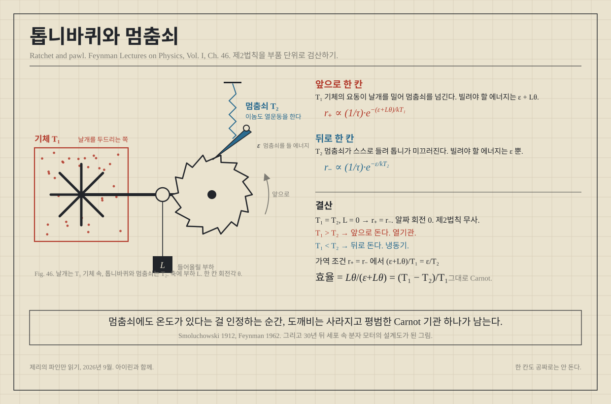{#fig-FLP_rachet_and_pawl width=600}

이어서 더 나아가자. 날개의 온도가 $T_1$ 이고 바퀴(또는 래칫)의 온도가 $T_2$ 이며, $T_1 > T_2$ 라고 하자. 바퀴가 차갑고 폴의 변동이 상대적으로 드물기 때문에 폴의 에너지가 $\varepsilon$ 까지 가기는 매우 어렵다. 고온 $T_1$ 때문에 날개들은 종종 에너지 $\varepsilon$ 에 도달하게 되며, 따라서 설계된 대로 우리 장치는 한 방향으로 이동하게 된다.

이제 그것이 무게를 들어올릴 수 있는지 확인해보자. 가운데에 있는 드럼에 끈을 묶고, 물체 $A$(예를 들면 벼룩?) 를 그 끈에 매단다. 무게로 인한 토크를 $L$ 이라고 하자. $L$ 이 너무 크지 않다면, 브라운 운동으로 인해 한 방향으로 움직일 가능성이 더 높아지기 때문에 우리 기계는 무게를 들어올릴 것이다. 여기서 그것이 들어올릴 수 있는 무게와 이동 속도 등을 구해보자.

먼저 라쳇이 일반적으로 작동하도록 설계된 전진 동작을 생각해보자. 한 걸음 앞으로 나아가기 위해서는 날개쪽에서 얼마나 많은 에너지를 빌려야 할까? 일단 폴을 들어올리기 위해 에너지 $\varepsilon$ 이 필요하다. 바퀴는 토크 $L$ 에 대해 각도 $\theta$ 를 회전하므로, 에너지 $L\theta$ 도 필요하다. 따라서 필요한 에너지의 총량은 $\varepsilon+L\theta$ 이다. 우리가 이 에너지를 얻는 확률은 $e^{−(\varepsilon+L\theta)/k_B T_1}$ 에 비례한다. 실제로, 에너지 뿐만 아니라, 초당 몇번이나 그 에너지를 가지는지가 중요하다. 초당 확률 역시 $e^{−(\varepsilon + L\theta)/k_BT_1}$ 에 비례하며, 여기서 비례 상수를 $1/\tau$ 라고 하자.(최종적으로는 상쇄될 것이다). 전진 스텝이 일어날 때, $A$ 하는 일은 $L\theta$  이며 날개에서 얻은 에너지는 $\varepsilon+L\theta$ 이다. 스프링은 에너지 $\varepsilon$ 로 감겨진 뒤, 쾅쾅하고, 쾅하고, 쾅하고, 쾅하며 이 에너지는 열이 된다. 소모된 모든 에너지는 무게를 들어 올리고 폴을 구동하는 데 쓰이며, 그 폴은 다시 떨어져 다른 쪽에 열을 제공한다.

이제 반대 경우인 후진 운동을 살펴보자. 바퀴를 뒤로 움직이게 하려면, 라쳇이 미끄러지도록 파울을 충분히 높이 들어올릴 수 있는 에너지를 공급하기만 하면 된다. 이것은 여전히 에너지 $\varepsilon$ 이다. 이 높이를 들어올릴 초당 확률은 이제 $(1/\tau)e^{−\varepsilon/k_BT_2}$ 이다. 비례 상수는 동일하지만, 이번에는 온도 차이로 인해 $k_BT_2$ 가 나타난다. 이러한 상황이 발생하면, 바퀴가 뒤로 미끄러져 작업이 해제된다. 그것은 한 단계가 손실되어 작업 $L\theta$ 를 방출한다. 래칫 시스템에서 얻은 에너지는 $\varepsilon$ 이며, 베인 측 $T_1$ 에 있는 기체에 주어지는 에너지는 $L\theta + \varepsilon$ 이다. 그 이유를 알려면 약간의 생각이 필요합니다. 폴이 변동에 의해 실수로 스스로 들어올렸다고 가정해 보자. 그런 다음 그것이 뒤로 떨어지고 스프링이 이를 톱니에 대고 아래로 밀어내면, 톱니가 경사면에서 밀고 있기 때문에 바퀴를 돌리려는 힘이 존재한다. 이 힘은 작용하고 있으며, $A$ 에 의한 힘도 작용한다. 따라서 두 가지가 함께 전체 힘을 구성하고, 천천히 방출되는 모든 에너지는 날개 끝에서 열로 나타난다. (물론 에너지 보존에 의해 반드시 해야 하지만, 신중하게 생각해야 한다!) 우리는 이 모든 에너지가 정확히 동일하지만 반대로 되어 있음을 알 수 있다. 따라서, 이 두 비율 중 어느 것이 더 큰가에 따라, 무게는 천천히 들어올리거나 천천히 해제된다. 물론, 그것은 끊임없이 흔들리며 잠시 상승하고 잠시 하락하지만, 우리는 평균적인 행동에 대해서만 관심이 있다.

특정 무게에서 이 비율이 동일하다고 가정해 보자. 이후 $A$ 에 무게의 무한소 가중치를 추가하자. $A$ 가 서서히 하강하며, 기계에서 일이 수행된다. 에너지는 바퀴에서 채취되어 날개에 전달된다. 대신에 $A$ 에서 약간의 무게를 빼면, 불균형은 반대가 된다. 무게가 들어올려지고, 열이 베인에서 제거되어 바퀴에 들어간다. 따라서 우리는 카르노의 가역 사이클의 조건을 갖게 되며, 무게가 이 두 개가 동일할 경우에만 가능하다. 이 조건은 명백히 $(\varepsilon + L\theta)/T_1=\varepsilon/T_2$ 이다. 기계가 천천히 무게를 들어올리고 있다고 하자. 에너지 $Q_1$ 은 날개에서 취해지고 에너지 $Q_2$ 는 휠에 전달되며, 이러한 에너지는 $(\varepsilon + L\theta)/\varepsilon$ 비율에 있습니다. 가중치를 낮추면 $Q_1/Q_2=(\varepsilon+L\theta)/\varepsilon$ 도 있다. 따라서 (@tbl-FLP_1_46_1) 우리는 

$$
\dfrac{Q_1}{Q_2}=\dfrac{T_1}{T_2}.
$$

게다가, 우리가 얻는 일은 $L\theta$ 가 $L\theta + \varepsilon$ 에 해당하는 바와 같이 날게에서 취한 에너지에 대한 것이며, 따라서 $(T_1−T_2)/T_1$ 이다. 우리는 우리 장치가 이보다 더 많은 작업을 추출할 수 없으며, 가역적으로 작동한다는 것을 확인했다. 이것은 우리가 카르노의 논증에서 기대한 결과이며, 이번 강의의 주요 결과이다. 하지만 우리는 장치를 사용하여 평형이 깨진 상태에서도 몇몇 다른 현상을 이해할 수 있지만 열역학의 범위를 넘어선다.

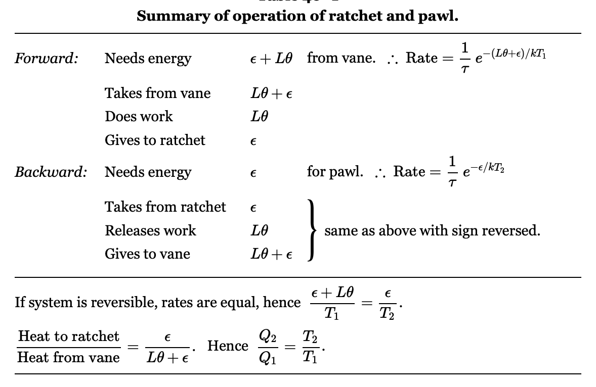{#tbl-FLP_1_46_1 width=450}

이제 모든 것이 동일한 온도에 있고 드럼에 무게를 걸었을 때 일방향 장치가 얼마나 빠르게 회전할지 계산해 보겠습니다. 우리가 매우, 매우 세게 당기면, 물론, 온갖 종류의 복잡함이 발생합니다. 그 파울이 래칫을 넘어 미끄러지거나, 스프링 브레이크, 혹은 그와 같은 것이 있습니다. 하지만 모든 것이 잘 작동할 정도로 부드럽게 당긴다고 가정하면. 그러한 상황에서는 두 온도가 동일하다는 점을 기억한다면, 휠이 전진하고 후진하는 확률에 대해 위의 분석이 옳습니다. 각 단계마다 각도 θ를 얻으며, 따라서 각속도는 초당 이러한 점프 중 하나의 확률을 θ 곱한 값입니다. 그것은 확률 (1/τ)e−(ε+Lθ)/kT로 전진하고, 확률 (1/τ)e−ε/kT로 후진하며, 따라서 각속도에 대해 우리는

$$
\omega=\left(\dfrac{\theta}{\tau}\right)\left(e^{−(\varepsilon+L\theta)/k_B T}−e^{−\varepsilon/k_BT}\right)=\left(\dfrac{\theta}{\tau}\right) e^{−\varepsilon/k_BT}\left(e^{−L\theta/k_BT}−1\right).
$$ {#eq-FLP_1_46_1}

$\omega$ 를 $L$ 에 대해 그리면, @fig-FLP_1_46_2 그림에 표시된 곡선을 얻을 수 있습니다. 우리는 $L$ 이 양수인지 음수인지에 큰 차이가 있음을 확인 할 수 있다. $L$ 이 양의 범위 내에서 증가하면, 이는 우리가 휠을 뒤로 돌리려고 할 때 발생하는 현상으로, 뒤로 가는 속도가 일정하게 된다. $L$ 이 음수가 되면, $\omega$ 는 정말 앞으로 “이륙”합니다. 왜냐하면 $e$ 함수 때문이다!

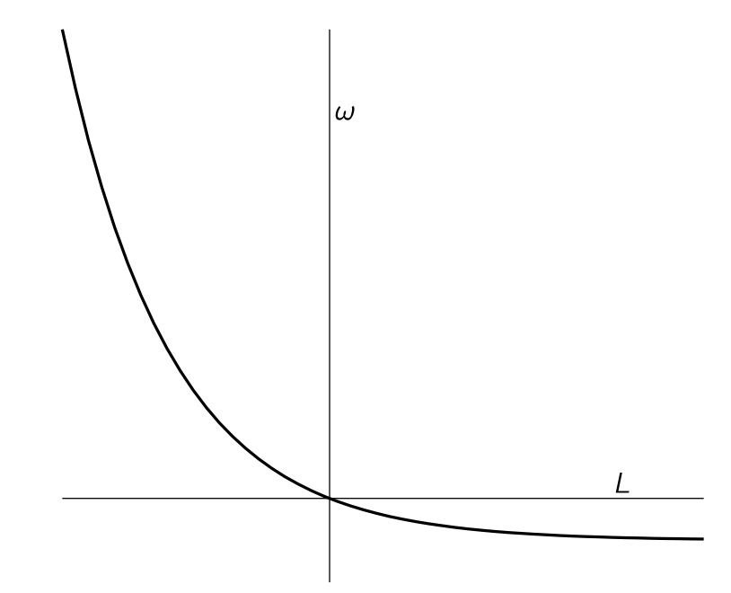{#fig-FLP_1_46_2 width=400}

다양한 힘으로부터 얻은 각속도는 따라서 매우 비대칭적이다. 한 방향으로 가는 것은 쉽다: 약간의 힘으로 많은 각속도를 얻을 수 있다. 반대 방향으로 가면, 우리는 많은 힘을 가할 수 있지만, 바퀴는 거의 돌지 않는다.

우리는 전기 정류기에서 동일한 것을 발견할 수 있다. 힘 대신에 전기장이 있고, 각속도 대신에 전류가 있다. 정류기의 경우 전압이 저항에 비례하지 않으며 상황이 비대칭적이다. 우리가 기계 정류기에 대해 수행한 동일한 분석이 전기 정류기에도 작동한다. 실제로, 위에서 얻은 그 종류의 공식은 정류기의 전류 운반 용량을 전압에 대한 함수로 한 전형적인 형태이다.

이제 $A$ 를 빼고 원래 기계를 살펴보자. $T_2 < T_1$ 라면, 라쳇은 앞으로 나아갈 것이다. 하지만 처음에는 믿기 어려운 것이 바로 그 반대이다. $T_2 > T_1$ 보다 크면, 래칫은 반대 방향으로 돌아간다! 열이 많이 가득한 동적인 래칫은 래칫 파울이 튀어다니기 때문에 스스로 뒤로 움츠린다. 만약 파울이 잠시 동안 어딘가에 경사면, 기울어진 평면을 옆으로 밀어냅니다. 하지만 그것은 항상 경사면에서 밀고 있습니다, 왜냐하면 그것이 톱니의 지점을 지나갈 정도로 충분히 높이 들어올리면, 경사면이 미끄러져 지나가고 다시 경사면에서 내려옵니다. 따라서 핫 래칫과 파울은 원래 설계된 방향과 정확히 반대 방향으로 이동하도록 이상적으로 설계되었다!

우리의 기울어진 설계에 대한 모든 영리함에도 불구하고, 두 온도가 정확히 동일하다면 어느 쪽으로 회전할 가능성이 다른 쪽보다 더 큰 경향은 없습니다. 우리가 그것을 바라보는 순간, 그것은 어느 방향으로든 다른 방향으로든 변할 수 있지만, 장기적으로는 아무런 진전이 없습니다. 그것이 어디에도 도달하지 않는다는 사실은 실제로 모든 열역학이 기반하고 있는 근본적인 근본 원리입니다.