 

## $\textrm{I}$.47. 소리와 파동 {#sec-FLP_1_47}

### $\textrm{I}$.47-1 파동 {#sec-FRLP_1_47_1}

이 장에서는 파동 현상에 대해 논의한다. 이미 파동에 대해 알아본 적이 있다. 특히 빛을 다룰 때 서로 다른 위치에 있는 여러 광원으로부터의 파동이 동일한 주파수로 공간에 미치는 간섭에 특히 주의를 기울였다. 아직 논의하지 않은 전자기파를 포함한 모든 형태의 파동에서 발생하하는 현상이 있다. 첫 번째는 **시간에 대한 간섭** 현상이다. 약간 다른 진동수를 가진 두 소리를 듣는다면, 파동은 둘 다 마루로 혹은 한쪽은 마루로 한쪽은 골로 도달한다.(@fig-FLP_1_47_1 참조). 그 결과 발생하는 소리의 상승과 하강이 맥놀이(Beats), 즉 시간의 간섭 현상이다. 두 번째 현상은 파동이 주어진 부피 내에 제한되어 벽에서 앞뒤로 반사될 때 발생하는 파동 패턴과 관련이 있다.

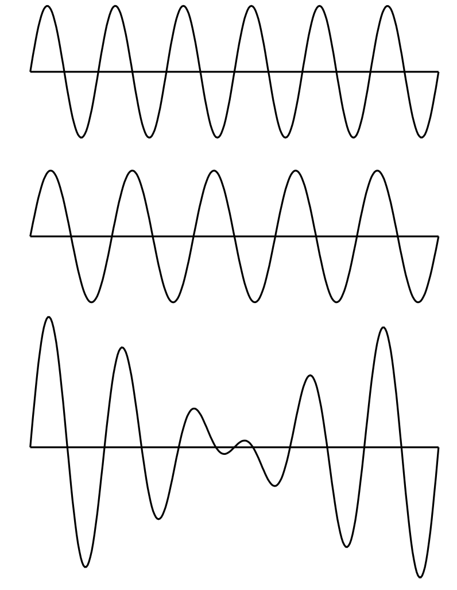{#fig-FLP_1_47_1 width=350}

다른 파동의 예로는 해안으로 들어오는 긴 파도가 보이는 물결이나, 표면 장력의 흔들림으로 이루어진 작은 파동이 있다. 또 다른 예로, 고체에서는 두 종류의 탄성파가 있다; 고체 입자가 파동 전파 방향을 따라 앞뒤로 진동하는 **종파(longitudinal wave)**$^1$ 와 고체 입자가 전파 방향에 수직인 방향으로 진동하는 **횡파(transverse wave)**.[$^1$ 기체 내의 음파가 종파이다.]{.aside}  지진파는 두 종류의 탄성파를 포함한다.

또 다른 파동의 예가 현대 물리학에서 발견된다. 이것들은 주어진 위치에서 입자를 찾을 확률 진폭을 제공하는 파동이며, 이미 논의한 **물질파** 이다. 진동수는 에너지에 비례하고 파수는 운동량에 비례한다. 물질파는 양자역학의 파동이다.

이 장에서는 진공에서의 빛이나 전기장과 같이 속도가 파장과 무관한 파동만을 고려한다. 수학적으로, 1차원에서 전기장은 $x−ct$ 의 함수라고 말할 수 있다. 파동이 $t=0$ 에서 $x$ 에 대한 어떤 함수라면 나중시점에서 동일한 전기장을 얻기 위해 $x$ 를 약간 증가시키기만 하면 된다. 우리는 이러한 종류의 함수가 파동의 전파를 나타낸다는 것을 알 수 있다.

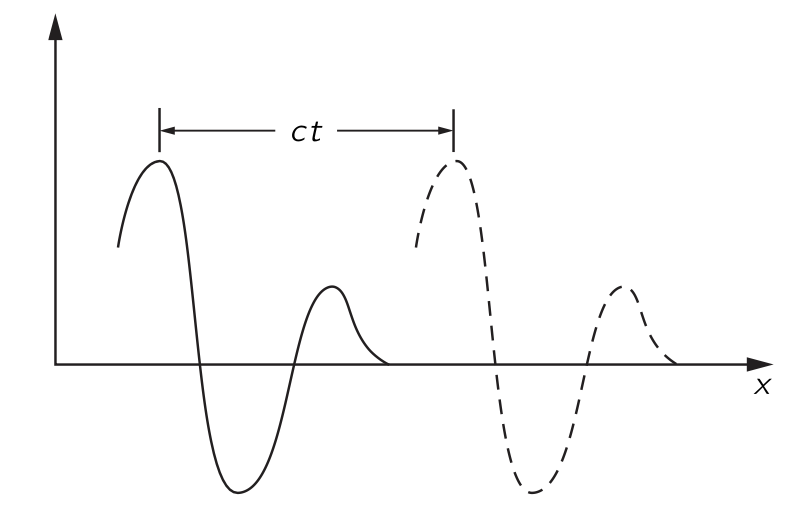{#fig-FLP_1_47_2 width=400}

이런 함수 $f(x−ct)$ 는 파동을 나타낸다. $\Delta x = c\Delta t$ 일 때

$$
f(x−ct)=f(x+\Delta x−c(t+\Delta t))
$$

이다. 물론 또 다른 가능성이 있다. 즉, 소스가 왼쪽에 있을 때(@fig-FLP_1_47_2) 와 반대로 오른쪽에 소스가 있어 파동이 음의 $x$ 방향으로 전파되는 경우이다. 이 경우 파동은 $g(x+ct)$ 로 기술된다.

공간에 동시에 하나 이상의 파동이 존재한다면 전기장은 두 장의 합이며 각각이 독립적으로 전파된다. 전기장의 와 같이 $f_1(x−ct)$ 와 $f_2(x−ct)$ 가 별도의 파동이면 둘의 합 역시 파동동이며 이를 **중첩 원리 (superposition principle)** 라고 한다. 같은 규칙은 소리에서도 성립한다.

우리는 소리가 발생할 경우, 생성된 순서와 (거의) 동일한 순서로 듣게 된다는 사실을 잘 알고 있다. 고주파가 저주파보다 더 빠르게 전달된다면, 음악 소리 이후에 짧고 날카로운 소음을 듣게 될 것이다. 마찬가지로, 적색광이 청색광보다 더 빠르게 전달된다면, 백색광 펄스는 처음에 빨간색으로, 그 다음에는 흰색으로, 마지막으로는 파란색으로 보일 것이다. 우리는 이것이 사실이 아니라는 것을 잘 알고 있다. 소리와 빛은 모두 진동수와 거의 독립된 공기 중의 속도로 전파된다. 이렇지 않은 파동 전파의 예는 [$\mathrm{I}$.48 비트](#sec-FLP_1_48) 장에서 알아본다.

빛(전자기파)의 경우, 우리는 전하의 가속도로부터 특정 지점의 전기장을 결정하는 규칙을 제시했다. 이제 우리가 해야 할 일은 소스로부터 일정 거리에 떨어진 위치에서 소스의 움직임으로부터 공기의 성질(예를 들면 압력)이 어떻게 정해지는지에 대한 규칙을 제시하는 것이다. 빛의 경우 한 곳의 전하가 다른 장소에 있는 다른 전하에 힘을 가한다는 것을 안다. 한 장소에서 다른 장소로 전달되는 세부 사항 없이 규칙은 제시 될 수 있었다. 그러나 소리의 경우에는 소스와 청자 사이의 공기를 통해 전파되므로 공기의 압력이 얼마인지 묻는 것은 확실히 자연스러운 질문이다. 또한, 공기가 정확히 어떻게 움직이는지 알아야 한다. 전기의 경우에는 아직 전기의 법칙을 알지 못한다고 말할 수 있기 때문에 규칙을 받아들일 수 있지만, 소리에 관해서는 같은 발언을 할 수 없다. 우리는 소리의 압력이 공기 중으로 어떻게 이동하는지를 규정하는 규칙에 만족하지 못할 것이다, 왜냐하면 그 과정은 역학 법칙의 결과로 이해될 수 있어야 하기 때문이다. 간단히 말하면, 소리는 역학의 한 분야이며, 따라서 뉴턴의 법칙에 따라 이해되어야 한다. 소리가 한 장소에서 다른 장소로 전파되는 것은 기체에서 전파될 경우 역학 및 기체의 특성에 불과하며, 그러한 매질을 통해 전파되는 경우 액체나 고체의 특성에 불과하다. 나중에 우리는 전기역학 법칙으로부터 빛과 그 파동 전파의 특성을 유사한 방식으로 도출할 것이다.

### $\textrm{I}$.47-2 소리의 전달

우리는 뉴턴 법칙의 결과로서 소스와 수신기 사이의 소리 전파 특성을 유도하지만, 소스와 수신기와의 상호작용은 고려하지 않는다. 보통 결과를 그것을 유도하는 것보다 중요하게 생각하지만 이 장에서는 반대 관점을 취한다. 여기서 핵심은 어느 정도는 유도 그 자체이다. 오래된 현상의 법칙을 이용하여 새로운 현상을 설명하는 이 문제는 아마도 수리 물리학의 가장 위대한 기술일 것이다. 수학 물리학자는 두 가지 문제를 가지고 있다: 하나는 방정식이 주어졌을 때 해를 찾는 것이며, 다른 하나는 새로운 현상을 설명하는 방정식을 찾는 것이다. 여기서의 유도는 두 번째 유형이다.

여기서 가장 간단한 예-1차원에서 소리의 전달-를 생각한다. 우선 현재 일어나고 있는 일에 대한 어느 정도 이해해야 한다. 근본적으로 관련된 것은 물체가 공기 중 한 곳에서 이동하면, 공기를 통과하는 교란이 존재한다는 것이다. 어떤 종류의 교란? 아마도 물체의 움직임에 의한 압력의 변화라고 말할 것이다. 물론, 물체를 부드럽게 움직이면 공기는 단지 그 주위를 흐를 뿐이지만, 우리가 우려하는 것은 급격한 움직임이므로 그런 흐름을 위한 충분한 시간이 없다. 그런 다음, 움직임에 따라 공기가 압축되고 압력 변화가 발생하여 여분의 공기를 밀어내게 된다. 이 공기는 차례로 압축되어 다시 추가적인 압력의 변화를 일으키고, 파동이 전달된다.

우리는 이제 그러한 과정을 수식으로 표현하고자 한다. 우선 필요한 변수를 결정해야 한다. 이 문제에서는 공기가 얼마나 이동했는지를 알아야 하며, 따라서 음파에서의 공기 변위가 확실히 중요한 변수 중 하나가 된다. 또한, 우리는 공기 밀도가 이동함에 따라 어떻게 변하는지 설명하고자 한다. 공기압도 변하므로, 이것은 또 다른 관심 변수이다. 그렇다면, 물론, 공기에는 속도가 있으므로 공기 입자의 속도를 설명해야 한다. 공기 입자도 가속도를 가지게 된다. 하지만 이러한 많은 변수들을 나열하면서, 공기 변위가 시간에 따라 어떻게 변하는지를 알면 속도와 가속도를 알 수 있다는 것을 곧 깨닫게 된다.

다시 말하지만 우리는 1차원에서의 파동을 생각한다. 소스로부터 충분히 멀리 떨어져 있어, 우리가 파면(wavefronts)이라고 부르는 것이 거의 평면에 가깝다면 이것이 성립한다. 이 경우 변위 $\chi$ 가 $x$ 와 $t$ 에만 의존하고 $y$ 와 $z$ 에는 의존하지 않는다고 말할 수 있다. 따라서 공기는 $\chi(x,t)$ 로 기술된다.

이 설명은 아직 완전하지 않은 것으로 보인다. 우리는 공기 분자가 어떻게 움직이는지에 대한 세부 사항을 전혀 알지 못한다. 공기분자는 사방으로 움직이는데, 이 상황은 $\chi(x,t)$ 로 기술되지 않는다. 동역학 이론의 관점에서, 한 위치에서 분자의 밀도가 높고 그 위치와 인접한 밀도가 낮을 경우, 그 분자는 밀도가 높은 영역에서 낮은 밀도 영역으로 이동하게 되어 이 차이가 균등해진다. 이 경우는 진동이 되지 않고, 소리도 없을 것이다. 음파를 얻기 위해 필요한 것은 다음과 같은 상황이다: 분자들이 밀도가 높고 압력이 높은 영역을 급격히 벗어나면서, 밀도가 낮은 인접 영역에 있는 분자에 운동량을 부여한다. 소리가 생성되기 위해서는 밀도와 압력이 변하는 영역이 다른 분자와 충돌하기 전에 분자가 이동하는 거리보다 훨씬 커야 한다. 이 거리는 **평균 자유 경로(mean free path)** 이며, 압력의 마루와 골 사이의 거리는 이것보다 훨씬 더 커야 한다. 그렇지 않으면 분자는 마루에서 골짜기까지 자유롭게 이동하고 즉시 파동을 벗어나게 된다.

기체의 거동을 평균 자유 경로에 비해 큰 규모로 기술하려는 것이 명백하므로, 기체의 특성은 개별 분자로 설명되지 않을 것이다. 예를 들어 변위는 기체의 작은 원소 질량 중심의 변위이며, 압력 또는 밀도는 이 영역의 압력 또는 밀도를 의미한다. 우리는 압력 $P$ 와 밀도 $\rho$ 를  $x$ 와 $t$ 의 함수로 기술할 것이다. 이 설명은 근사이며, 이러한 기체 특성이 거리에 따라 크게 변하지 않을 때만 유효하다는 점을 명심해야 한다.

### $\textrm{I}$.47-3 파동방정식 {#sec-FLP_1_47_3}

음파 현상의 물리학은 세 가지 성질과 연관된다.

&emsp;$(\textrm{I})$. 기체는 움직이며 밀도를 변화시킨다.

&emsp;$(\textrm{II})$. 밀도의 변화는 압력의 변화에 해당한다.

&emsp;$(\textrm{III})$. 압력의 차이는 기체의 운동을 발생시킨다.

#### **$(\textrm{II})$ 밀도의 변화는 압력의 변화에 해당한다.**

먼저 $(\textrm{II})$ 를 생각한다. 기체, 액체 또는 고체의 경우, 압력은 밀도의 함수이다. 음파가 도착하기 전에 우리는 평형 상태이며, 압력 $P_0$ 와 밀도 $\rho_0$ 을 가지고 있다. 매질에서의 압력 $P$ 는 어떤 특성 관계 $P=f(\rho)$ 로 밀도와 관련되며, 특히 평형 압력 $P_0$ 는 $P_0=f(ρ_0)$ 로 주어진다. 평형값으로부터의 소리에 의한 압력 변화는 매우 작다. 압력을 측정하기 위한 편리한 단위는 $\text{bar}$ 로 $1\,\text{bar}=10^5 \,\text{N/m}^2$ 로 정의되었다. $1 \text{ atm} = 1.0133\,\text{bar}$ 로 1 표준대기압은 거의 1 $\text{bar}$ 이다. 귀는 소리를 대략 로그스케일로 감지하므로 음파의 강도에 로그를 취해 사용한다. 이 스케일이 데시벨 스케일이며, 압력 진폭 $P$ 에 대한 음향 압력 레벨은 다음과 같이 정의된다.

$$
I(\text{음향 압력 레벨}) := 20\log_{10}(P/P_\text{ref}) \,\text{in dB},
$$ {#eq-FLP_1_47_1}

여기서 기준 압력 $P_\text{ref}=2\times 10^{−10}\,\text{bar}$ 이다. 압력 진폭이 $P= 10^3\,P_\text{ref}= 2\times 10^{−7} \,\text{bar}$$^2$ 인 경우, 이는 60 데시벨이라는 중간 강도의 소리에 해당한다. 우리는 1 기압에 비해 소리의 압력 변화가 매우 작다는 것을 확인할 수 있다. 변위와 밀도 변화 역시 매우 작다. 폭발의 경우에는 발생하는 초과 압력은 1기압보다 클 수 있다. 이러한 큰 압력 변화는 우리가 나중에 고려할 새로운 효과를 초래한다. 소리에서는 $100\,\text{dB}$ 를 초과하는 음향 강도 수준을 자주 고려하지 않는다. $120\, \text{dB}$ 는 귀에 통증을 유발하는 수준이다.[$^2$ 이 압력은 피크 압력이 아닌 제곱평균제곱근(root mean square) 압력이다.]{.aside} 소리의 경우

$$
P=P_0+P_e,\qquad \rho = \rho_0 + \rho_e
$$ {#eq-FLP_1_47_2}

라고 쓰면 여기서는 $P_e \ll P_0$, $\rho_e \ll \rho_e$ 로 가정한다. 이로부터

$$
P_0+P_e=f(\rho_0+\rho_e)=f(\rho_0)+\rho_e f'(\rho_0),
$$ {#eq-FLP_1_47_3}

이다. 초과 압력 $P_e$ 가 초과 밀도 $\rho_e$ 에 비례하게 되므로 이 비례상수를 $\kappa$ 라고 하면

$$
P_e=\kappa \rho_e,\qquad \text{where } \kappa = f'(\rho_0) = (dP/d\rho)_0. 
$$ {#eq-FLP_1_47_4}

#### **$(\textrm{I})$ 기체는 움직이며 밀도를 변화시킨다.**

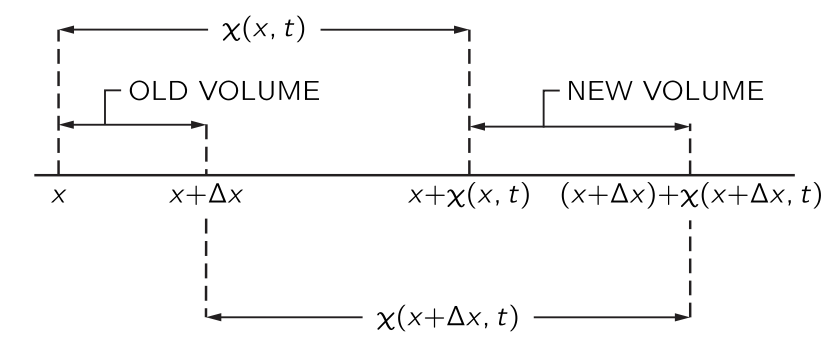{#fig-FLP_1_47_3 width=400}

이제 $(\textrm{I})$ 를 생각한다. 음파에 의해 방해받지 않는 공기의 한 부분의 위치가 $x$ 이고, 소리에 의한 시간 $t$ 에서의 변위는 $\chi(x,t)$ 이며, 따라서 그 새로운 위치는 @fig-FLP_1_47_3 과 같이 $x+\chi(x,t)$ 이다. 여기에 인접한 공기의 교란받지 않은 위치 $x+\Delta x$ 가 음파에 의해 새로운 위치 $x+\Delta x+\chi (x+\Delta x,t)$ 로 이동했다고 하자. 우리는 이제 다음과 같은 방법으로 밀도 변화를 찾을 수 있다. 우리는 평면파에 한정하고 있기 때문에, 음파의 전파 방향인 $x$ 방향에 수직인 단위 면적을 취할 수 있다. $\Delta x$ 에서 단위 면적당 공기의 양은 $\rho_0 \Delta x$ 이며, 여기서 $\rho_0$ 는 방해받지 않은(또는 평형) 공기 밀도이다. 이 공기는 음파에 의해 전위될 때 이제 $x+\chi (x,t)$ 와 $x+\Delta x + \chi (x+\Delta x,t)$ 사이에 위치하므로, 방해받지 않을 때 $\Delta x$ 에 있던 동일한 물질이 이 구간에 존재하게 된다. $\rho$ 가 새로운 밀도라면 다음이 성립한다.

$$
\rho_0 \Delta x = \rho[ x + \Delta x + \chi (x + \Delta x, t) − x − \chi ( x,t ) ].
$$ {#eq-FLP_1_47_5}

$\Delta x$ 가 작으므로 $\chi (x+\Delta x,t)−\chi(x,t)=(\partial \chi/\partial x) \Delta x$ 를 사용 할 수 있다. 그렇다면

$$
\rho_0 \Delta x = \rho \left( \dfrac{\partial \chi}{\partial x}\Delta x+\Delta x \right),
$$ {#eq-FLP_1_47_6}

또는

$$
\rho_0 = (\rho_0+\rho_e)\dfrac{\partial \chi}{\partial x}+\rho_0 + \rho_e 
$$ {#eq-FLP_1_47_7} 

이다. 이제 음파에서는 모든 변화가 작아 $\rho_e$ 도 작고, $\chi$ 도 작으며, $\partial \chi/\partial x$ 도 작다. 따라서 우리가 방금 찾은 관계에서,

$$
\rho_e = −\rho_0\dfrac{\partial \chi}{\partial x} − \rho_e \dfrac{\partial \chi}{\partial x}.
$$ {#eq-FLP_1_47_8}

인데 여기서 $\rho_e \partial \chi/\partial x$ 를 $\rho_0 \partial \chi/\partial x$ 와 비교하여 무시할 수 있다. 이로부터 $(\mathrm{I})$ 에 필요한 관계를 얻게 된다:

$$
\rho_e = −\rho_0\dfrac{\partial \chi}{\partial x}.
$$ {#eq-FLP_1_47_9}

이 식은 우리가 물리적으로 기대할만한 것이다. 변위가 $x$ 에 따라 달라지면, 밀도 변화가 발상해며 $\chi$ 가 $x$ 와 함께 증가하면 당연히 밀도는 감소하므로 부피도 옳다.

#### **$(\textrm{III})$ 압력의 차이는 기체의 운동을 발생시킨다.**

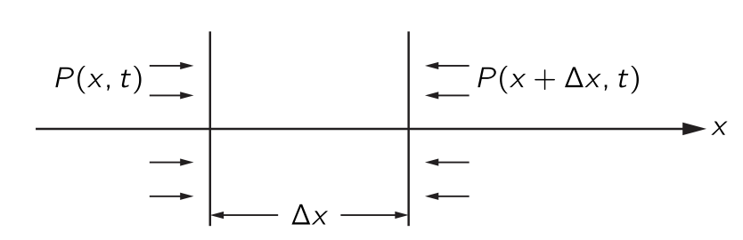{#fig-FLP_1_47_4 width=400}

힘과 압력 사이의 관계를 알면, 우리는 운동 방정식을 얻을 수 있다. 길이가 $\Delta x$ 이고 단면이 $x$ 에 수직인 얇은 공기 슬래브를 생각하자. 단면의 면적은 단위면적이다. 슬래브의 공기 질량은 $\rho_0\Delta x$ 이며 가속도는 $\partial^2 \chi/\partial t^2$ 이므로, 슬래브의 질량에 가속도를 곱하면 $\rho_0 \Delta x(\partial^2 \chi/\partial t^2)$ 이며$^3$ [$^3$$\Delta x$ 가 작다면 가속도 $\partial^2\chi /\partial t^2$ 를 슬래브의 가장자리에서 구하든 중간 위치에서 구하든 차이가 없다.]{.aside} 이는 $x$ 에 수직인 단위 면적에 가해지는 힘이다. @fig-FLP_1_47_4 에서 $\Delta x$ 인 슬래브가 받는 힘은 다음과 같다.

$$
P(x,t)−P(x+\Delta x,t)=−\dfrac{\partial P}{\partial x}\Delta x = −\dfrac{\partial P_e}{\partial x}\Delta x
$$ {#eq-FLP_1_47_10}

이로부터

$$
\rho_0 \dfrac{\partial^2 \chi}{\partial t^2} = −\dfrac{\partial P_e}{\partial x}
$$ {#eq-FLP_2_47_11}

을 얻는다. 이제 $(\textrm{II})$ 의 결과인 @eq-FLP_1_47_4 를 사용하여 @eq-FLP_2_47_11 에서 $P_e$ 를 소거하면

$$
\rho_0\dfrac{\partial^2 \chi}{\partial t^2} = − \kappa \dfrac{\partial \rho_e}{\partial x}
$$ {#eq-FLP_1_47_12}

이다. 이제 $(\textrm{I})$ 의 결과인 @eq-FLP_1_47_9 를 사용하여 $\rho_e$ 를 제거하면

$$
\dfrac{\partial^2 \chi}{\partial t^2} = \kappa \dfrac{\partial^2 \chi}{\partial x^2}
$$ {#eq-FLP_1_47_13}

을 얻는다. 이제 $c^2_s = \kappa$ 라고 하자. 그러혐

$$
\dfrac{\partial^2 \chi}{\partial x^2} = \dfrac{1}{c_s^2}\dfrac{\partial^2 \chi}{\partial t^2}
$$ {#eq-FLP_1_47_14}

로 쓸 수 있다. 이 식은 물질에서 소리의 행동을 기술하는 파동 방정식이다.

### $\textrm{I}$.47–4 파동방정식의 해 {#sec-FLP_1_47_4}

일정한 속도 $v$ 로 움직이는 모든 평면파 교란이 $f(x−vt)$ 형태를 가진다고 언급했다. 이제 $\chi(x,t)=f(x−vt)$ 가 파동 방정식의 해인지 해 보자. $\partial \chi/\partial x = f'(x-vt)$ 이므로

$$
\dfrac{\partial^2 \chi}{\partial x^2} =f''(x−vt)
$$ {#eq-FLP_1_47_15}

이다. 또한 $\partial \chi/\partial t=−vf'(x−vt)$ 이며 이로부터

$$
\dfrac{\partial^2 \chi}{\partial t^2} = v^2f''(x−vt)
$$ {#eq-FLP_1_47_16}

이다. 여기서 $v =c_s$ 일 때 $f(x−vt)$ 가 @eq-FLP_1_47_14 의 해라는 것을 알 수 있다. 따라서 역학 법칙에 따르면 모든 소리 교란이 속도 $c_s$ 로 전파된다는 것과

$$
c_s=\sqrt{\kappa} = \sqrt{\left(\dfrac{ dP}{d\rho}\right)_0}
$$

임을 안다. 즉 우리는 파동의 속도와 매질의 특성의 관계 역시 알게 되었다.

반대 방향으로 이동하는 파동을 고려하면, $\chi(x,t)=g(x+vt)$ 역시 파동 방정식을 만족한다는 것을 쉽게 보일 수 있다. 그러한 파동과 왼쪽에서 오른쪽으로 이동하는 파동 사이의 유일한 차이는 $v$ 의 부호에 있지만, 함수에서 $x+vt$ 든 $x−vt$ 든 $\partial^2\chi/\partial t^2$ 의 부호에는 영향을 주지 않는다. 따라서 우리는 속도 $c_s$ 로 어느 방향으로 전파되는 파동에 대한 해를 갖게 된다.

매우 흥미로운 질문은 중첩에 관한 것이다. 우리가 동일한 파동방정식은 선형 미분 방정식이므로 임의의 두 해 $\chi_1,\,\chi_2$ 에 대해 $\chi(x,t) = \chi_1(x,t) + \chi_2 (x,t)$ 역시 해이다. 여러번 설명했듯이 이것이 중첩 원리이다.

이제 우리는 $y$ 방향으로 편광된 전기장 $E_y$ 가 아래의 파동방정식을 만족한다면 $x$ 방향으로 전파되는 파도이다.
$$
\dfrac{\partial^2 E_y}{\partial x^2} = \dfrac{1}{c^2}\dfrac{\partial^2 Ey}{\partial t^2}
$$ {#eq-FLP_1_47_20}

여기서 $c$ 는 빛의 속도이며 @eq-FLP_1_47_20 은 맥스웰 방정식의 결과 중 하나이다. 전기역학 방정식은 빛에 대한 파동 방정식을 도출할 것이며, 이는 역학 방정식이 소리에 대한 파동 방정식을 도출하는 것과 같다.

### $\textrm{I}$.47–5 음속 {#sec-FLP_1_48_5}

앞서 파동 속도와 밀도에 대한 압력 변화율을 연결하는 식을 구했다.

$$
c_s^2=\left(\dfrac{dP}{d\rho}\right)_0.
$$ {#eq-FLP_1_47_21}

이 변화율을 평가할 때는 온도가 어떻게 변하는지 아는 것이 필수적이다. 음파에서는 밀도가 높은 영역에서 온도가 상승하고, 낮은 영역에서는 온도가 낮아질 것으로 예상된다. 뉴턴은 밀도에 따른 압력 변화율을 최초로 계산했으며, 그는 온도가 변하지 않을 것이라고 가정했다. 그는 열이 한 영역에서 다른 영역으로 매우 빠르게 전달되기 때문에 온도가 상승하거나 하강할 수 없다고 주장했다. 이 논증은 소리의 등온 속도를 제시하지만 그것은 틀렸다. 올바른 추론은 나중에 라플라스에 의해 제시된다. 라플라스는 즉 음파에서 압력과 온도가 단열적으로(adiabatically) 변한다고 주장했다. 압축된 영역에서 희박한 영역으로의 열 흐름은 파장이 평균 자유 경로에 비해 길다면 무시할 수 있다. 이 조건에서는 음파의 약간의 열 흐름이 속도에 영향을 주지 않지만, 소리 에너지가 약간 흡수된다. 우리는 파장이 평균 자유 경로에 가까워짐에 따라 이 흡수가 증가한다는 것을 올바르게 예상할 수 있지만, 이러한 파장은 우리가 들을 수 있는 소리의 파장보다 약 백만배 정도 더 작다.

음파에서 압력과 밀도의 실제 변동은 열 흐름을 허용하지 않는다. 이는 $V$ 가 부피인 $PV^\gamma=\text{const}$ 인 단열 변동에 해당한다. 밀도 $\rho$ 가 $V$ 와 역으로 변하기 때문에, $P$ 와 $\rho$ 사이에

$$
P=\text{const} \cdot \rho^\gamma,
$$ {#eq-FLP_1_47_22}

의 관계가 성립한다. 이로부터 우리는 $dP/d\rho = \gamma P/\rho$ 를 얻는다. 그렇다면 음속 $c_s$ 는

$$
c^2_s=\dfrac{\gamma P}{\rho}
$$ {#eq-FLP_1_47_23}

으로 주어진다. 또한 $c^2_s=\gamma PV/\rho V$ 라고 쓰고 $PV=Nk_BT$ 관계를 활용할 수도 있다. 또한, $\rho V$ 는 기체의 질량이며, 이는 $Nm$ 또는 $\mu/\text{mol}$ 로 표현될 수 있다. 여기서 $m$ 은 분자의 질량이고 $μ$ 는 분자량이다. 이로부터

$$
c^2_s = \dfrac{\gamma k_B T}{m} = \dfrac{\gamma R T}{\mu}
$$ {#eq-FLP_1_47_24}

를 얻는다. 즉 음속은 기체 온도에만 의존하고 압력이나 밀도에는 의존하지 않음이 명백하다. 우리는 또한

$$
k_BT=\dfrac{1}{3}m \langle v^2\rangle,
$$ {#eq-FLP_1_47_25}

임을 안다. 여기서 $\langle v^2\rangle$ 은 분자 속도의 제곱의 평균이다. 따라서 $c^2_s=(\gamma /3)\langle v^2\rangle$, 또는

$$
c_s=\left(\dfrac{\gamma}{3}\right)^{1/2}v_\text{av}.
$$ {#eq-FLP_1_47_26} 

을 얻게 된다. 이 방정식은 음속이 분자들의 평균 속도인 $v_\text{av}$ (평균 제곱 속도의 제곱근)를 대략 $1/\sqrt{3}$ 배인 수임을 명시한다. 다시 말해, 음속은 분자의 속도와 같은 order of magnitude 를 가지며, 실제로는 이 평균 속도보다 다소 작다.

물론 압력 변화와 같은 교란은 결국 분자의 움직임에 의해 전파되기 때문에 위의 결과를 그럭저럭 예상할 수도 있다. 그러나 이러한 주장은 정확한 전파 속도를 알려주지 못한다. 소리가 주로 가장 빠른 분자나 가장 느린 분자에 의해 전달된다는 것이 밝혀졌을 수도 있다. 음속이 평균 분자 속도 $v_\text{av}$ 의 약 $1/2$ 에 해당한다는 것은 합리적이며 만족스럽다.

 

## $\textrm{I}$.48 비트 {#sec-FLP_1_48}

### $\mathrm{I}$.48–1 두 파동의 합 {#sec-FLP_1_48_1}

이 장에서는 서로 다른 진동수를 가진 두 소스의 간섭으로 인해 발생하는 현상 중 일부를 다룬다.

같은 진동수를 가진 두 개의 동일한 진동원이 있다고 가정해 보겠습니다. 이들의 위상이 예를 들어 $P$ 지점에서 같은 위상을 갖도록 맞추어 졌다고 하자. $P$ 에서 빛이라면 빛이 매우 강하고, 소리라면 매우 시끄럽으며, 전자라면 다수가 도착한다. 반면에, 도착하는 신호의 위상차가 $\pi$ 라면, $P$ 에서는 신호를 받지 못한다. 왜냐하면 그때의 순진폭이 최소가 되기 때문이다. 둘중 하나의 소스에 위상 조절기가 있어서 $P$ 에서의 위상을 앞뒤로 바꿀 수 있다고 하자. 그렇다면 그때 순 신호 강도에서 차이를을 발견하게 될 것이다. 이 위상이 다른 원천에 비해 점진적이고 균일한 방식으로 서서히 변하며, $0$ 에서 시작해 $\pi/18$, $2\pi/18$, $3\pi/18$ 로 증가한다면, $P$ 에서는 강한 펄스와 약한 “펄싱”의 연속을 관측하게 되고 위상이 $2\pi$ 만큼 이동하면 진폭이 최대가 되기 될것이다. 물론, 한 소스가 다른 소스에 대해 균일한 속도로 위상을 이동하고 있다고 말하는 것은 두 파동원의 진동수가 다르다는 말과 동일하다.

따라서 답은 이것이다: 약간 다른 주파수를 가진 두 개의 소스가 있다면, 결과적으로 천천히 맥동하는 강도의 진동을 발견하게 된다. 

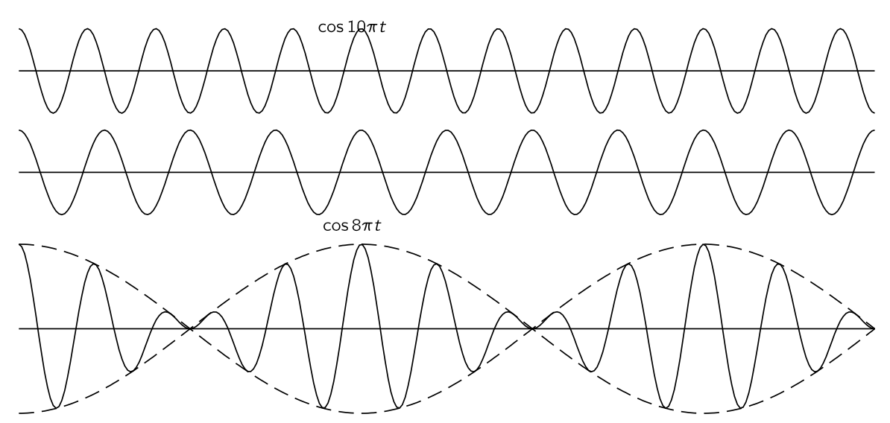{#fig-FLP_1_48_1 width=500}

정해진 지점 $P$ 에서 두 파동 $A_1 e^{i\omega_1 t}$ 와 $A_2 e^{i\omega_2 t}$ 가 만난다고 하자. 

$$
A_1e^{i\omega_1 t} + A_2 e^{i\omega_2 t} = e^{i(\omega_1 + \omega_2)t }\left[A_1e^{i(\omega_1 - \omega_2) t} + A_2 e^{-i(\omega_1-\omega_2)t}\right]
$$ {#eq-FLP_1_48_7}

이므로 우리는 저주파수($\omega_1 - \omega_2$) 로 변조된 고주파수 ($\omega_1 + \omega_2$) 의 파동을 얻게 된다. 

### $\mathrm{I}$.48–2 비트와 변조 {#sec-FLP_1_48_2}

파동이 $A_1e^{i \omega_1 t}$ 와 $A_2 e^{-i\omega_2 t}$ 로 기술될 때 이 파동의 합의 강도 $I$ 는 @eq-FLP_1_48_7 로 부터

$$
I = \left|A_1e^{i\omega_1 t}+A^2 e^{i\omega_2 t}\right|^2 = A_1^2  + A_2^2 + 2A_1A_2\cos (\omega_1-\omega_2)t
$$ {#eq-FLP_1_48_8}

이며, $I$ 는 $(A_1+A_2)^2$ 과 $(A_1-A_2)^2$ 사이에서 변한다. 따라서 $A_1 \ne A_2$  이면 $I$ 는 $0$ 이 되지 않는다. 

진폭변조(amplitude modulation, AM) 방식의 라디오는 500 ~ 1,500 KHz 영역에서 고정된 진동수의 반송파(carrier wave) 를 진폭을 바꿔가며 전송한다. 

### $\mathrm{I}$.48-3 사이드 밴드

수학적으로, 위에서 설명한 변조 파동은 다음과 같이 표현된다.

$$
S = ( 1 + b \cos \omega_m t) \cos\omega_c t.
$$ {#eq-FLP_1_48_9}

여기서 $\omega_c$ 는 반송파의 진동수,  $\omega_m$ 은 오디오 톤의 진동수이다. 위 식으로부터

$$
S=\cos \omega_c t + \dfrac{b}{2}\cos(\omega_c + \omega_m)t + \dfrac{b}{2} \cos(\omega_c − \omega_m)t.
$$ {#eq-FLP_1_48_10}

이 식을 다른 관점에서 보면 시스템의 출력 파동은 중첩된 세 개의 파동으로 구성된다고 말할 수 있다: 첫째, 진동수 $\omega_c$, 즉 반송파 진동수에서의 정규 파동이며, 그 다음 두 개의 새로운 진동수에서 두 개의 새로운 파동. 하나는 반송파 진동수에 변조 진동수를 더한 값이며, 다른 하나는 뺀 값이다. 따라서 발생기에 의해 생성되는 강도를 진동수의 함수로 표현하는 그래프를 그린다면, 반송파의 주파수에서 자연스럽게 많은 강도를 발견하게 되지만, 가수가 노래를 시작하면 갑자기 가수의 강도에 비례하는 강도 $b/2$ 의 파동을 진동수 $\omega_c + \omega_m$ 및 $\omega_c−\omega_m$  에서 발견하게 되는데, 이것들은 **사이드 밴드(side bands)** 라고 한다. 송신기에서 변조된 신호가 있을 때 사이드 밴드가 존재한다. 동시에 두 개 이상의 음-예를 들어 $\omega_m$ 과 $\omega'_m$ 와 같이-이 있다면 두 개의 악기가 연주되고 있는 것이다. 혹은 다른 복잡한 코사인파가 있다면, 물론 수학을 통해 우리는 $\omega_c \pm  \omega_m'$ 진동수에 해당하는 파동을 더 많이 얻는다는 것을 알 수 있다.

따라서, 많은 코사인의 합으로 표현될 수 있는 복잡한 변조가 존재할 때$^4$, 실제 송신기는 진동수 영역-말하자면 반송파 진동수에 변조 신호가 포함하는 최대 최대 진동수의 플러스 또는 마이너스-을 통해 전송한다. [$^4$ 일반적인 모든 상황에서 곡선을 많은 코사인의 합으로 나타낼 수 있다. 물론, 그 곡선은 주어진 지점에서 단 하나의 값만 가져야 하며, 무한히 미미한 거리에서 무한히 여러 번 점프하는 미친 곡선이 되어서는 안 된다.]{.aside}

### $\mathrm{I}$.48-4 국소화된 파동의 연쇄 {#sec-FLP_1_48_4}

다음으로 논의할 주제는 공간과 시간 모두에서의 파동의 간섭이다. 우주에서 두 개의 파동이 이동하고 있다고 가정하자. 우주에서 이동하는 파동을 $e^{i(\omega t−kx)}$ 로 표현할 수 있다는 것을 알고 있다. 이는 파동방정식의 해로 파동의 전파속도 $c$ 에 대해 $\omega^2=k^2c^2$ 이다. 이제 진동수 $\omega_1$ 과 $\omega_2$ 를 가지는 두 파동을 생각하자. 진폭이 다른 경우는 독자에게 맡기고 여기서는 동일하다고 가정한다. 그렇다면 둘을 더하면 $e^{i(\omega_1 t−k_1 x)}+e^{i(\omega_2t−k_2x)}$ 이며 다음과 같이 쓸 수 있다.

$$
e^{i\omega_1 (t−x/c)} + e^{i\omega_2(t−x/c)} = e^{iω_1t'}+e^{i\omega_2t'}.
$$ {#eq-FLP_1_48_11}

여기서는 $t$ 가 아닌 $t'=t−x/c$ 가 변수이다. 이렇게 자연스럽게 같은 종류의 변조를 얻지만, 물론 그 변조들이 파동과 함께 움직이고 있음을 보게 된다. 다시 말하면, 두 개의 파동을 더했지만 그 파동이 단순히 진동하는 것이 아니라 공간에서도 움직이고 있다면, 결과 파동도 같은 속도로 따라 움직이게 됩니다.

이제 우리는 이를 진동수와 파수 $k$ 사이의 관계가 그리 단순하지 않은 파동-예를 들면 굴절율을 가진 물질-의 경우로 일반화하고자 한다. 우리는 [$\mathrm{I}$.31 굴절률의 기원](vol1_4.qmd#sec-FLP_1_31) 에서 굴절률을 다뤘으며 굴절률 $n$ 에 대해 $k=n\omega/c$ 임을 안다. 또한 x선의 경우 굴절률 $n$ 은 아래와 같다.

$$
n=1−\dfrac{Nq_e^2}{2\epsilon_0 m\omega^2}.
$$ {#eq-FLP_1_48_12}

우리는 실제로 [$\mathrm{I}$.31 굴절률의 기원](vol1_4.qmd#sec-FLP_1_31) 에서 더 복잡한 공식을 유도했지만, 이 공식도 예시로서 괜찮다.

$\omega$ 와 $k$ 가 비례관계가 아닐 때에도, 비율 $\omega/k$ 는 확실히 해당 진동수와 파수의 전파 속도임을 알고 있다. 우리는 이 비율을 **위상 속도 (phase velocity)** 라고 부른다. 위상속도는 위상, 즉 단일 파동의 노드가 이동하는 속도이다:

$$
\boxed{v_p:=\dfrac{\omega}{k}.}
$$ {#eq-FLP_1_48_13}

이 위상속도는 유리 내부에서의 x선 경우에는 $n<1$ 이므로 진공에서의 빛의 속도보다 빠른데 빛의 속도보다 빠른 신호를 보낼 수 없다는 것을 고려하면 이 결과는 당혹스럽다.

우리가 지금 논의하려는 것은 명확한 $\omega$ 와 $k$ 의 관계에 대한 명확한 식이 있는 두 파동의 간섭이다. 위의 $n$ 에 대한 공식은 $k$ 가 $\omega$ 에 대한 함수임을 보여준다. 즉 $a=Nq^2_e/2\epsilon_0 m$ 에 대해 

$$
k=\dfrac{\omega}{c}−\dfrac{a}{\omega c},
$$ {#eq-FLP_1_48_14}

어쨌든 각 주파수마다 확정된 파수가 존재하며, 우리는 이러한 파동 두 개를 함께 더하고자 한다.

@eq-FLP_1_48_7 에서 했던 그대로 해 보면

$$
\begin{aligned}
&e^{i(\omega_1 t - k_1 x)} + e^{i(\omega_2 t - k_2 x)} = \\[0.3em]
& \qquad e^{i[(\omega_1+\omega_2)t - (k_1+ k_2)x]/2} \times [e^{i[(\omega_1-\omega_2)t - (k_1-k_2)x]/2} + e^{-i[(\omega_1-\omega_2)t - (k_1-k_2)x]/2}].
\end{aligned}
$$ {#eq-FLP_1_48_15}

결과로서 다시 변조된 파동을 갖게 된다. 평균 진동수와 평균 파수를 가지고 이동하지만, 그 강도는 진동수와 파수의 차이에 따라 형태가 달라진다.

이제 두 파동 사이의 차이가 상대적으로 작은 경우를 살펴 보자. 우선 두 파동의 주파수가 거의 동일하다고 가정한다. 그러면 $(\omega_1+\omega_2)/2$ 는 실질적으로 $\omega$ 중 하나와 동일하며, $(k_1+k_2)/2$ 역시 그러하다. 따라서 파동의 속도, 빠른 진동, 노드들은 여전히 본질적으로 $\omega/k$ 이다. 하지만 주의하라. 변조의 전파 속도가 동일하지 않다! 특정 
$t$ 에 대해 $x$ 는 얼마나 변해야 하는가? 이 변조 파동의 속도는 비율이다.

$$
v_M=\dfrac{\omega_1−\omega_2}{k_1−k_2}.
$$ {#eq-FLP_1_48_16}

이 변조파동의 속도를 **군속도 (group velocity)** 라고 한다. 진동수와 파수 차이가 상대적으로 적다면 이 식은 극한에 접근한다.

$$
v_g=\dfrac{d\omega}{dk}.
$$ {#eq-FLP_1_48_17}

다시 말해, 가장 느린 변조와 가장 느린 비트에 대해, 그들이 이동하는, 파동의 위상 속도와 동일하지 않은, 명확한 속도가 존재한다. 다시 정리하면 군속도는 $\omega$ 의 $k$ 에 대한 미분이며, 위상 속도는 $\omega/k$ 이다.

인지 이해할 수 있는지 확인해 보겠습니다. @fig-FLP_1_48_1 과 같이 약간 다른 파장의 두 파동을 생각하자. 그들의 위상은 일치와 이탈을 반복한다. 이제 이 파동들은 실제로 약간 다른 주파수를 가진 공간상의 파동을 나타낸다. 이제 위상 속도, 즉 이 두 파동의 노드 속도가 정확히 동일하지 않기 때문에 새로운 현상이 발생한다. 예를 들어, 우리가 파동 중 하나를 따라 달리면서 다른 피동을 바라본다고 하자. 진동수 차이는 아주 작고 속도 차이도 작지만, 그 속도 차이 때문에 우리가 한 파동을 따라 달리면 다른 파동은 우리에 비해 천천히 앞으로, 혹은 뒤로 이동한다. 시간이 상당히 흐른다면 노드에 무슨 일이 일어나는? 만약 파동열을 한 단계 앞으로 이동시키면, 노드는 상당히 먼 거리를 앞으로(또는 뒤로) 이동합니다. 즉, 이 두 파동의 합의 포락선(envelope)은 파동이 이동함에 따라 파동과 속도로 그 위에서 이동하나. 군속는 이 변조된 신호가 전송되는 속도이다.

만약 우리가 신호를 만들었다면, 즉 그가 들을 때 인식할 수 있는 일종의 파동의 변화, 즉 변조를 만들면, 그 변조는 군속도로 이동하게 되는데, 변조의 속도는 상대적으로 느리게 된다. (그들이 빠를 때는 분석하기가 훨씬 더 어렵다.)

이제 우리는 (드디어) 탄소 블록에서 X선의 전파 속도가 빛의 속도보다 크지 않음을 보여줄 수 있지만, 위상 속도는 빛의 속도보다 빠르다. 그렇게 하려면 $d\omega/dk$ 를 찾아야 하며, 이는 @eq-FLP_1_48_14 의 미분에 의해 얻어진다. 군속도는
$$
v_g=\dfrac{c}{1+a/\omega^2}
$$ {#eq-FLP_1_48_18}

로 $c$ 보다 작다! 위상은 빛의 속도보다 빠르게 이동할 수 있지만, 변조 신호는 더 느리게 이동하며, 이것이 겉보기에 역설인 문제의 해법이다! 물론, $\omega = kc$ 라는 단순한 경우가 있다면, $d\omega/dk= c$ 이다. 따라서 모든 상이 같은 속도를 가질 때, 그 그룹은 자연스럽게 같은 속도를 갖는다. 

참고 : [Group Velocity 노트북](notebooks/group_velocity.ipynb) 

### $\mathrm{I}$.48–5 입자의 확률진폭

이제 양자역학과 관련된 위상 속도에 대한 또 하나의 예를 살펴본다. 우리는 특정 상황에서 입자를 찾기 위한 진폭이 특정 상황에서 공간과 시간에 따라 달라질 수 있음을 알고 있다. 예를 들자면 다음과 같다.

$$
\psi = A e^{i(\omega t−kx)}.
$$ {#eq-FLP_1_48_19}

여기서 $\omega$ 는 진동수 이며 $E=\hbar \omega$ 를 통해 에너지에 대한 고전적 개념과 관련되고, $k$ 는 파수이며 $p=\hbar k$ 를 통해 운동량과 관련된다. 입자는 파수가 정확히 $k$ 인 경우, 즉 모든 곳에서 동일한 진폭으로 진행되는 완전한 파동인 경우, 정해진 운동량 $p$ 를 가지고 있다고 말할 수 있다. @eq-FLP_1_48_19 의 $\psi$ 는 진폭으로, 진폭의 절대값 제곱 $|\psi|^2$ 는 입자를 특정 시간 $t$ 와 위치 $x$ 에서 찾을 상대적 확률이다. 여기서 $|\psi|^2$ 는 상수이며, 이는 입자를 어디서든 찾을 확률이 동일함을 의미한다. 이제 입자가 다른 위치보다 한 위치에 있을 가능성이 더 높다는 상황에서 생각해 보자. 우리는 이러한 상황을 최대값을 가지고 양쪽에서 모두 사라는 파동으로 표현할 수 있다(@fig-FLP_1_48_5). (@fig-FLP_1_48_1 과 같이 일련의 최대값을 가진 파동과는 완전히 동일하지는 않지만, 거의 동일한 $\omega$ 와 $k$ 의 여러 파동을 더하면 하나의 최대값을 제외하고 모두 제거할 수 있다.)

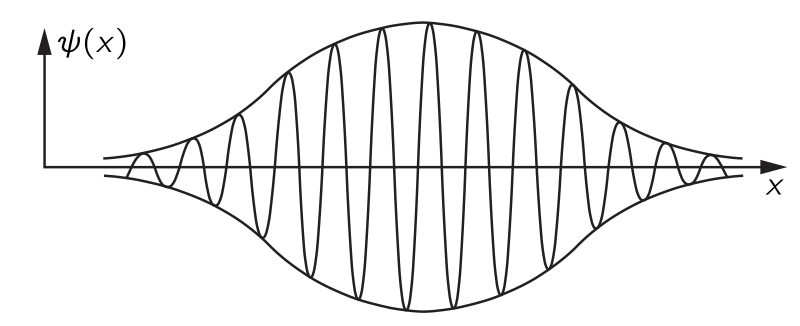{#fig-FLP_1_48_5 width=300}

@eq-FLP_1_48_19 의 제곱이 입자를 어딘가에서 찾을 확률을 나타내므로, 위와 같은 경우에서는 특정 순간에 입자가 파동의 진폭이 최대인 “덩어리”의 중심 근처에 있을 가능성이 가장 높다는 것을 알 수 있다. 지금 몇 순간만 기다리면 파동이 움직이고, 시간이 지나면 “덩어리”는 다른 곳에 있을 것이다. 입자가 원래 어느 곳에 있었던 것을 고전적으로 알았다면, 실제로는 나중에 다른 곳에 있을 것이라고 기대할 수 있다. 왜냐하면 입자는 결국 속도와 운동량을 가지고 있기 때문이다. 따라서 양자 이론은 운동량, 에너지 및 속도의 관계에 대한 올바른 고전 이론으로 진입하게 되며, 이는 군속도, 즉 변조 속도가 동일한 운동량을 가진 입자에 대해 고전적으로 얻을 수 있는 속도와 동일할 때에만 해당한다.

이제 이것의 사실 여부를 확인해야 한다. 고전 이론에 따르면, 에너지는 속도와 아래의 방정식을 통해 연관되어 있다.

$$
E=\dfrac{mc^2}{\sqrt{1−v^2/c^2}}.
$$ {#eq-FLP_1_48_20}

마찬가지로 운동량은

$$
p=\dfrac{mv}{\sqrt{1−v^2/c^2}}.
$$ {#eq-FLP_1_48_21}

이것은 고전 이론이며, $v$ 를 제거하면 고전이론의 결과인 다음 식을 얻는다.

$$
E^2−p^2c^2=m^2c^4.
$$ 

그것은 우리가 이미 논의해 온 4차원의 위대한 결론이다. $p^\mu p_\mu=m^2$. 이는 고전 이론에서 에너지와 운동량 사이의 관계이다. 이제 $E$ 와 $p$ 가 $\omega$ 와 $k$ 가 되며, $E=\hbar \omega$ 와 $p=\hbar k$ 를 통해 대체함으로써 양자역학에 대해 다음 식이 필요하다.

$$
\dfrac{\hbar^2 \omega^2}{c^2}−\hbar^2 k^2 = m^2c^2.
$$ {#eq-FLP_1_48_22}

이것은 질량 $m$ 인 입자를 나타내는 양자역학적 진폭 파동의 진동수와 파수 사이의 관계이다. 이 방정식으로부터 우리는 $\omega$ 가

$$
\omega = c\sqrt{k^2 +m^2c^2/\hbar^2}
$$

임을 안다. 위상 속도 $\omega/k$ 는 여기서 다시 빛의 속도보다 빠르다!

이제 군속도를 살펴보자. 

$$
\dfrac{d\omega}{dk}=\dfrac{kc}{\sqrt{k^2 +m^2c^2/\hbar^2}}.
$$ 

분모의 제곱근은 결국 $\omega/c$ 이므로, 이를 $d\omega/dk=c^2k/\omega$ 와 같이 쓸 수 있다. 또한, $k/\omega = p/E$ 이므로

$$
v_g=\dfrac{c^2p}{E}.
$$ 

하지만 @eq-FLP_1_48_20 와 @eq-FLP_1_48_21 에서 $c^2p/E=v$ 는 고전역학에 따르면 입자의 속도이다. 따라서 우리는 기본적인 양자역학 관계 $E=\hbar \omega$ 와 $p=\hbar k$ 가 $\omega$ 와 $k$ 를 고전적 $E$ 와 $p$ 로 동일시할 때 $\omega^2−k^2c^2 = m^2c^4/\hbar^2$ 라는 방정식만을 생성한다는 것을 알 수 있다. 이제 우리는 $E$ 와 $p$ 를 속도와 연결한 관계 @eq-FLP_1_48_20 와 @eq-FLP_1_48_21 도 이해하고 있다. 물론, 해석이 의미가 있다면 군속도는 입자의 속도여야 한다. 입자가 어느 시점에 여기 있다고 생각하고, 10분 후에 그것이 저기에 있다고 생각한다면, 양자역학이 말했듯이, “덩어리”가 이동한 거리를 시간 간격으로 나눈 값은 고전적으로 입자의 속도와 같아야 한다.

### $\mathrm{I}$.48–6 3차원의 파동 {#sec-FLP_1_48_6}

이제 파동에 대한 논의를 마무리면서, 파동 방정식에 대한 몇 가지 일반적인 사항을 언급하겠다. 이러한 발언은 앞으로 우리가 배울 것에 대한 전망을 제공하기 위한 것이다—지금 바로 모든 것을 정확히 이해할 수 있다는 뜻은 아니며, 오히려 파동을 조금 더 연구했을 때 상황이 어떻게 보일지에 대한 것이다. 우선, 1차원에서 소리를 위한 파동 방정식은

$$
\dfrac{\partial^2 \chi}{\partial x^2} = \dfrac{1}{c^2}\dfrac{\partial^2 \chi}{\partial t^2}
$$

이며 여기서 $c$ 는 파동의 속도이다. 소리의 경우 음속이며, 빛의 경우 광속이다. 우리는 음파에 대해 변위가 특정 속도로 스스로 전파된다는 것을 보았다. 하지만 여분의 압력도 일정한 속도로 전파되며, 여분의 밀도도 마찬가지이다. 따라서 우리는 압력이 동일한 방정식을 만족할 것이라고 예상해야 하며, 실제로 그렇다. 우리는 그것이 그렇게 된다는 것을 독자에게 맡기겠습니다. 힌트: $\rho_e$ 는 $x$ 에 대한 $\chi$ 의 변화율에 비례한다. 따라서 파동 방정식을 $x$ 에 대해 미분하면, $\partial \chi/\partial x$ 가 동일한 방정식을 만족한다는 것을 즉시 알 수 있다. 즉, $\rho_e$ 는 동일한 방정식을 만족한다. $P_e$ 는 $\rho_e$ 에 비례하므로 $P_e$ 역시 동일한 방정식을 만족한다. 즉 압력, 변위, 모든 것이 동일한 파동 방정식을 만족한다.

보통 소리에 대한 파동 방정식은 변위가 아니라 압력으로 표현되며, 이는 압력이 스칼라이고 방향이 없기 때문이다. 하지만 변위는 벡터이며 방향을 가지고 있기 때문에 압력을 분석하기가 더 쉽다.

다음에 논의할 사안은 3차원 파동 방정식과 관련이 있다. 우리는 1차원에서의 음파 해가 $e^{i(\omega t−kx)}$ 이며 $ω=kc_s$ 임을 알고 있지만, 3차원에서는 파동이 $e^{i(\omega t−\bf{k\cdot r})}$ 로 표현된다는 것도 알고 있다. 여기서 이 경우 $ω^2=k^2c^2_s$ 이다. 이제 우리가 하고자 하는 것은 3차원에서 올바른 파동 방정식이 무엇인지 추측하는 것이다. 당연히, 소리의 경우 이는 우리가 한 차원에서 만든 것과 동일한 3차원 동적 논증을 통해 추론할 수 있습니다. 하지만 우리는 그렇게 하지 않을 것입니다; 대신 우리는 나오는 것을 적어 두겠습니다: 압력(또는 변위, 혹은 그 어떤 것)에 대한 방정식은

$$
\nabla^2 P_e =\dfrac{1}{c_s^2}\dfrac{\partial^2 P_e}{\partial t^2}.
$$ {#eq-FLP_1_48_23}

이것이 참이라는 것은 $e^{i(\omega t−\bf{k\cdot r})}$ 를 대입하여 검증할 수 있다. 

다시 거슬러 올라가면, 우리는 양자역학파에 대한 분산 방정식(@eq-FLP_1_48_22) 에 해당하는 방정식을 적지 않을 수 없습니다. $\phi$ 가 시점 $t$ 에서 위치 $\bf{r}=(x, y, z)$ 에서 입자를 찾는 진폭을 나타낸다면, 자유 입자에 대한 양자역학의 방정식은 다음과 같다:

$$
\nabla^2 \phi −\dfrac{1}{c^2}\dfrac{\partial^2 \phi}{\partial t^2} = \dfrac{m^2c^2}{\hbar^2}\phi.
$$ {#eq-FLP_1_48_24}

우선, 이 표현의 상대성 특성은 상대성 이론이 일반적으로 포함하는 멋진 조합에서 $x,\,y,\, z, \,t$ 가 나타나는 것으로 암시된다. 둘째, 이것은 평면 파동을 시도하면 $−k^2+ \omega^2/c^2 = m^2c^2/\hbar^2$ 가 되는 파동 방정식이며, 이는 양자역학에 대한 올바른 관계이다. 파동 방정식에는 아직도 또 하나의 위대한 점이 포함되어 있다: 파동의 모든 중첩이 또한 해가 된다는 사실이다. 따라서 이 방정식은 지금까지 논의해 온 모든 양자역학과 상대성 이론을 포함하고 있으며, 최소한 외부 퍼텐셜이나 힘이 없는 빈 공간에 있는 단일 입자를 다루는 한 그렇다!

### $\textrm{I}$.48-7 정규 모드 {#sec-FLP_1_48_7}

이제 우리는 다소 흥미롭고 약간 다른 비트 현상의 또 다른 예를 살펴보겠다. 두 개의 동일한 진자가 다소 약한 스프링으로 연결되어 있다고 하자. 가능한 한 거의 같은 길이로 만들어진다. 우리가 하나를 옆으로 끌어당겨 놓으면, 그것은 앞뒤로 움직이고, 앞뒤로 움직일 때 연결 스프링을 잡아당기며, 따라서 그것은 다른 진자와 같은 고유 진동수를 가진 힘을 생성하는 기계라고 할 수 있다. 따라서, 이전에 연구한 공명 이론의 결과로, 적절한 주파수로 무언가에 힘을 가하면 그것이 구동된다. 그렇다면, 확실히, 하나의 진자가 앞뒤로 움직이는 것이 다른 진자를 구동한다. 하지만 이 상황에서는 새로운 현상이 일어나게 된다. 시스템의 전체 에너지가 유한하기 때문에, 한 진자가 다른 진자에 에너지를 쏟아 부어 구동하면 점차 에너지를 잃게 되며, 타이밍과 속도가 적절히 맞춰지면 모든 에너지를 잃고 정지 상태로 전락하게 된다. 그렇다면, 물론, 모든 에너지를 가진 다른 진자 공과 전혀 없는 첫 번째 진자 공이며, 시간이 흐르면서 그 공도 반대 방향으로 작용하고 에너지가 첫 번째 공으로 다시 전달되는 것을 보게 된다. 이는 매우 흥미롭고 재미있는 현상이다. 그러나 우리는 이것이 비트 이론과 관련이 있다고 말했으며, 이제 우리는 비트 이론의 관점에서 이 움직임을 어떻게 분석할 수 있는지 설명해야 한다.

우리는 두 공 중 하나의 움직임이 진동이며, 그 진폭이 주기적으로 변한다는 점에 주목한다. 따라서 공 중 하나의 움직임은 다른 방식으로 분석될 수 있으며, 이는 동시에 존재하지만 약간 다른 두 주파수를 가진 두 진동의 합이라는 점이다. 따라서 이 시스템에서 두 개의 다른 운동을 찾을 수 있어야 하며, 우리가 본 것이 두 해의 중첩이라고 주장할 수 있어야 합니다. 이는 물론 선형 시스템이기 때문입니다. 실제로, 움직임을 시작할 수 있는 두 가지 방법을 쉽게 찾을 수 있으며, 각각은 완전하고 단일 주파수인 움직임으로, 절대적으로 주기적입니다. 우리가 이전에 시작한 움직임은 엄격히 주기적이지 않았으며, 지속되지 않았다; 곧 한 공이 에너지를 다른 공에 전달하여 진폭이 변했지만, 아무것도 변하지 않도록 운동을 시작하는 방법이 있으며, 물론 그것을 보는 순간 우리는 그 이유를 이해하게 된다. 예를 들어, 두 진자를 함께 이동하도록 만들었다면, 길이가 동일하고 스프링이 아무 일도 하지 않기 때문에 마찰이 없고 모든 것이 완벽하다고 가정할 때, 그들은 당연히 영원히 그렇게 흔들리게 될 것이다. 반면에, 일정한 주파수를 가진 또 다른 가능한 움직임이 있다: 즉, 진자를 반대 방향으로 움직여 정확히 같은 거리만큼 옆으로 끌어당기면, 다시 절대적으로 주기적인 운동을 하게 된다. 우리는 스프링이 중력이 제공하는 복원력에 약간만 더한다는 점을 이해할 수 있으며, 그뿐이며, 시스템은 첫 번째 경우보다 약간 더 높은 주파수로 계속 진동하고 있다. 왜 더 높습니까? 스프링이 끌어당겨지고, 중력에 더해 시스템이 약간 “더 강하게”되어, 이 움직임의 주파수가 다른 것보다 약간 더 높아진다.

따라서 이 시스템은 변함없는 진폭으로 진동할 수 있는 두 가지 방법이 있다: 두 진자가 같은 방향으로 계속 같은 주파수로 진동하도록 진동하거나, 약간 더 높은 주파수에서 반대 방향으로 진동할 수 있다.

이제 그 사물의 실제 운동은 시스템이 선형이기 때문에 두 가지의 중첩으로 표현될 수 있습니다. (이 장의 주제는, 기억하십시오, 서로 다른 주파수를 가진 두 동작을 더한 결과입니다.) 그러니 이 두 솔루션을 결합한다면 어떤 일이 일어날지 생각해 보자. $t=0$ 에서 두 운동이 동일한 진폭으로 같은 위상으로 시작된다면, 두 운동의 합은 첫 번째 운동에 의해 한 방향으로, 두 번째 운동에 의해 반대 방향으로 압착된 한 구는 $0$ 에 해당하고, 두 운동 모두에서 동일한 방식으로 변위된 다른 공은 큰 진폭을 가진다는 의미이다. 하지만 시간이 흐름에 따라 두 기본 운동이 독립적으로 진행되므로, 하나가 다른 것에 비해 위상이 서서히 이동하고 있습니다. 즉, 충분히 오랜 시간이 지나 시간이 지나 한 움직임이 “$900\frac{1}{2}$” 진동을 할 수 있고 다른 움직임은 “$900$” 진동만 할 수 있을 때, 그 상대적인 위상은 이전과 비교하여 단순히 뒤바뀌게 된다는 의미입니다. 즉, 대진폭 운동은 $0$ 으로 떨어졌으며, 그 사이에 물론 처음에 움직이지 않은 공은 완전한 힘을 얻게 될 것이다!

따라서 우리는 이 복잡한 운동을 공명이 존재하고 하나가 다른 하나에 에너지를 전달한다는 생각으로 분석하거나, 두 개의 일정한 진폭 운동을 서로 다른 주파수에서 중첩함으로써 분석할 수 있음을 알 수 있다.

## $\textrm{I}$.49 모드 {#sec-FLP_1_49}

### $\mathrm{I}$.49-1 파동의 반사 {#sec-FLP_1_49_1}

이 장에서는 특정 유한한 영역에 파동을 제한함으로써 발생하는 놀라운 몇몇 현상들을 알아본다. 예를 들어, 우리는 진동하는 끈에 관한 몇 가지 구체적인 사실을 먼저 발견하게 될 것이며, 그 후 이러한 사실들을 일반화하면 수학 물리학에서 가장 광범위한 원리일 가능성이 높은 원리를 제시하게 될 것이다.

우리의 첫 번째 파동 제한 예는 파동을 하나의 경계에 제한하는 것입니다. 끈 위의 일차원 파동에 대한 간단한 예를 들어 보자. 벽을 마주보는 일차원의 음파나 유사한 성격의 다른 상황도 생각해 볼 수 있지만, 현재로서는 끈의 예로서 충분하다. 한쪽 끝이 고정된 끈을 생각하자. 무한히 단단한 벽에 고정함으로써 $x=0$ 에서의 변위 $y$ 를 $0$ 으로 고정시킬 수 있다. 이제 벽이 아닌 끈에 대해, 운동에 대한 일반적인 해가 두 함수 $F(x−ct)$ 와 $G(x+ct)$ 의 합임을 알 수 있다. 첫 번째는 끈 내에서 한 방향으로 이동하는 파동을 나타내고, 두 번째는 끈 내에서 반대 방향으로 이동하는 파동을 나타낸다. 즉

$$
y=F(x−ct)+G(x+ct)
$$ {#eq-FLP_1_49_1}

은 모든 끈에 대한 일반적인 해이다. 여기에 우리의 조건을 넣으면 $0 = F(-ct) + G(ct)$ 를 얻는다. 즉 모든 $s$ 에 대해 $G(s) = -F(-s)$ 이어야 한다. 이로부터,

$$
y=F(x−ct)−F(−x−ct).
$$ {#eq-FLP_1_49_2}

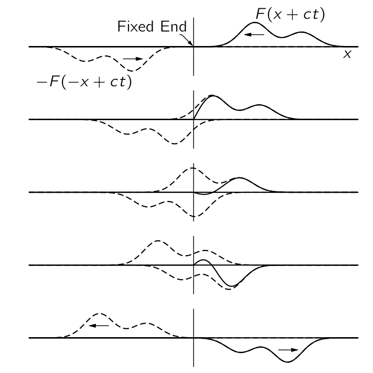{#fig-FLP_1_49_1 width=350}

@fig-FLP_1_49_1 은 $x=0$ 근처에서 음의 $x$ 방향으로 이동하는 파동과, 반대 방향으로부터 반대 방향으로 이동하는 가상의 파동을 원점의 반대쪽에 표시한다. 원점의 왼쪽에는 진동할 줄이 없기 때문에 가상의 파동이라고 한다. 줄의 전체 운동은 양의 $x$ 영역에서 이 두 파동의 합으로 간주되어야 한다. 그들이 원점에 도달하면, x=0에서 항상 상쇄되며, 최종적으로 두 번째(반사된) 파동은 양의 $x$ 에 대해 존재하는 유일한 파동이 되고, 물론 반대 방향으로 이동하게 된다. 이러한 결과는 다음 진술과 동등합니다: 파동이 문자열의 고정된 끝에 도달하면, 부호가 변함에 따라 반사된다. 그러한 반사는 끈의 끝에 다가오는 것이 벽 뒤에서 거꾸로 나오는 것이라고 이해될 수 있다. 요약하면, 문자열이 무한하다고 가정하고, 한 방향으로 파동이 있을 때마다 반대 방향으로 또 다른 파동이 있다고 가정하면, $x=0$ 에서의 변위는 항상 0이 되며, 그곳에서 줄을 고정해도 차이가 없을 것이다.

다음으로는 주기적인 파동의 반사를 생각해보자. $F(x−ct)$ 가 나타내는 파동이 사인파이며 반사되었다고 가정하면, 반사된 파동 $−F(−x−ct)$ 도 동일한 주파수를 가진 사인파이지만 반대 방향으로 이동한다. 이 상황은 복소 함수 표기법을 사용하여 가장 간단히 설명할 수 있다: $F(x−ct)=e^{i\omega (t−x/c)}$ 및 $F(−x−ct)=e^{i\omega (t+x/c)}$. @eq-FLP_1_49_2 에서 $x=0$ 일 경우, $t$ 의 모든 값에 대해 $y=0$ 이 되므로 필요한 조건을 만족한다. 지수의 특성 때문에, 이는 더 간단한 형태로 표현될 수 있다:

$$
y=e^{i\omega t}\left(e^{−i\omega x/c}−e^{i\omega x/c}\right)=−2ie^{i\omega t} \sin(\omega x/c).
$$ {#eq-FLP_1_49_3}

여기에는 흥미롭고 새로운 점이 있는데, 이 해법은 고정된 x를 보면 줄이 진동수 $\omega$ 에서 진동한다는 것을 알려준다. 이 지점이 어디에 있든 주파수는 동일합니다! 하지만 특히 $sin( \omega x/c)=0$ 인 경우에는 변위가 전혀 없는 몇몇 장소가 있다. 게다가, 언제든지 진동하는 현의 스냅샷을 촬영한다면, 그 그림은 사인파가 된다. 하지만, 이 사인파의 변위는 시간 $t$ 에 따라 달라집니다. @eq-FLP_1_49_3 을 살펴보면 우리는 사인파의 한 사이클 길이가 겹쳐진 파동 중 하나의 파장과 같다는 것을 알 수 있다:

$$
\lambda = 2 \pi c/\omega.
$$ {#eq-FLP_1_49_4}

움직임이 없는 점은 $\sin(\omega x/c)=0$ 조건을 만족하는, $(\omega x/c)=0,\, \pi,\, 2\pi, \ldots, n\pi, \ldots$ 이다. 이러한 점들을 **노드 (node)** 라고 한다. 두 개의 연속된 노드 사이에서는 모든 점이 위아래로 사인 형태로 움직이지만, 운동 패턴은 공간에서 고정되어 있다. 이는 우리가 **모드 (mode)** 라고 부르는 것의 근본적인 특성이다. 만약 물체가 어느 지점에서든 완벽하게 사인파처럼 움직이고, 모든 점이 같은 진동수로 이동한다는(다만 일부는 다른 것보다 더 많이 움직인다) 특성을 가진 운동 패턴을 찾을 수 있다면, 우리는 이를 **모드** 라고 한다.

### $\mathrm{I}$.49–2 자연진동수를 가진 구속된 파동 {#sec-FLP_1_49_2}

다음 흥미로운 문제는 줄이 양쪽 끝 $x=0$ 및 $x=L$ 에서 고정되어 있을 경우이다. 한 방향으로 움직이는 일종의 돌출로부터 파동의 반사라는 개념으로 시작하자. 시간이 흐름에 따라 우리는 그 돌출이 한쪽 끝에 가까워지며, 시간이 더 진행됨에 따라 반대편에서 발생하는 역이미지 돌출과 결합하고 있기 때문에 일종의 작은 흔들림이 될 것이다. 마침내 원래의 범프가 사라지고 이미지 범프가 반대 방향으로 이동하여 반대쪽 끝에서 과정을 반복한다. 이 문제는 쉬운 해결책이 있지만, 흥미로운 질문은 우리가 사인파 운동을 가질 수 있는지 여부이다(앞서 설명한 해답은 주기적이지만, 사인파 운동은 아니다). 줄에 사인파를 주기적으로 배치해 보자. 줄의 한쪽 끝에 묶여 있다면, @eq-FLP_1_49_3 과 같은 모습이어야 함을 알고 있다. 다른 쪽 끝이 묶여 있다면, 다른 쪽 끝에서도 동일해야 한다. 따라서 주기적인 사인파 운동의 유일한 가능성은 사인파가 줄의 길이에 정확히 맞아야 한다는 것이다. 문자열 길이에 맞지 않으면, 문자열이 계속 진동할 수 있는 자연 주파수가 아니다. 요약하면, 문자열이 딱 맞는 사인파 형태로 시작되면, 사인파의 완벽한 형태를 계속 유지하고 특정 주파수에서 조화롭게 진동한다.

수학적으로 이 모양에 대해 $\sin kx$ 라고 쓸 수 있으며, 여기서 $k$ 는 @eq-FLP_1_49_3 와 @eq-FLP_1_49_4 의 $\omega/c$ 이며 이 함수는 $x=0$ 에서 $0$ 이 된다. 또한 반대쪽 끝에서도 $0$ 이어야 하는데 유일한 가능성은 $\sin(kL)=0$ 로 이것이 양쪽 끝을 고정시킬 수 있는 유일한 조건이기 때문이다. 이를 위해서는 

$$
kL = n\pi
$$ {#eq-FLP_1_49_5}

이어야 하며, $n$ 값에 들어가는 정수에 따라 가능한 $k$ 중 하나를 얻는다. 각 $k$ 에 대해 특정 주파수 $\omega$ 가 존재하는데 @eq-FLP_1_49_3 으로부터

$$
\omega = kc = n\pi c/L.
$$ {#eq-FLP_1_49_6}

즉 줄은 사인파 운동을 가질 수 있지만, 특정 진동수에서만 가능하다. 이는 제한된 파동의 가장 중요한 특성이다. 시스템이 아무리 복잡하더라도, 항상 완전한 사인파 시간 의존성을 가진 운동 패턴이 존재하지만, 그 진동수는 특정 시스템과 그 경계의 특성에 따라 달라진다. 줄의 경우, 다양한 가능한 진동수가 많이 존재하며, 각각은 정의상 모드에 해당한다. 이는 모드가 사인파 형태로 반복되는 운동 패턴이기 때문이다. @fig-FLP_1_49_2 는 줄에 대한 첫 번째 세 가지 모드를 보여준다. 첫 번째 모드에서 파장 $\lambda = 2L$ 이다. 일반적으로 각주파수 $\omega = 2πc/\lambda$ 이다. 첫 번째 모드의 진동수를 $\omega_1$ 이라고 하자. 이제 다음 모드에서는 중간에 하나의 노드가 있는 두 개의 루프가 표시된다. 이 모드의 파장은 단순히 $L$ 이다. $k$ 의 해당 값은 두 배이며 진동수도 두 배로 큽니다; 이는 $2\omega_1$ 이다. 세 번째 모드는 $3\omega_1$ 이다. 정확하게 말하면 $j$ 번째 모드의 진동수는 $j\omega_1$ 이다.

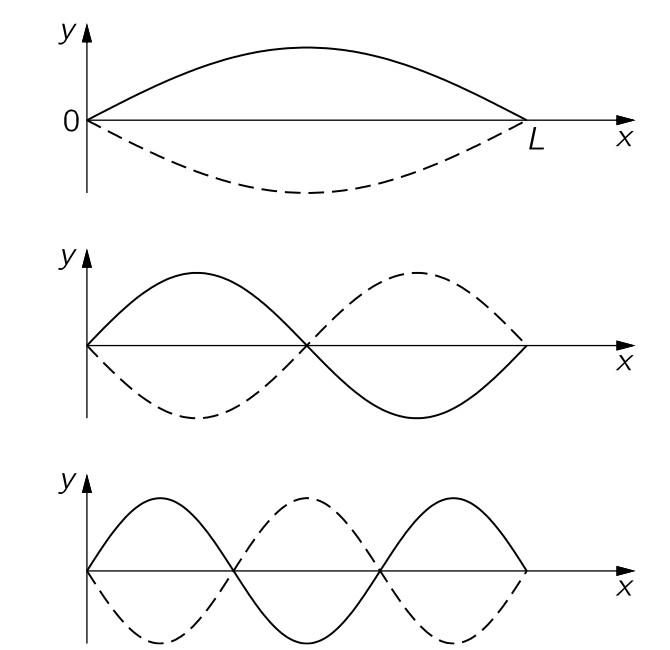{#fig-FLP_1_49_2 width=350}

이제 줄의 일반적인 움직임을 생각하자. 가능한 모든 움직임은 여러 모드가 동시에 작동하는 것으로 이해될 수 있음이 밝혀졌다. 실제로 일반적인 운동은 동시에 무한히 많은 모드가 발동하는 것이다. 이를 어느 정도 이해하기 위해 동시에 두 개의 모드가 진동할 때 어떤 일이 일어나는지 살펴보자. @fig-FLP_1_49_3 에 표시된 대로 첫 번째 모드가 진동한다고 가정하자. 이는 일정한 시간 간격에서 줄이 가장 낮은 진동수로 주기의 절반 동안 변형되는 모습을 보여준다.

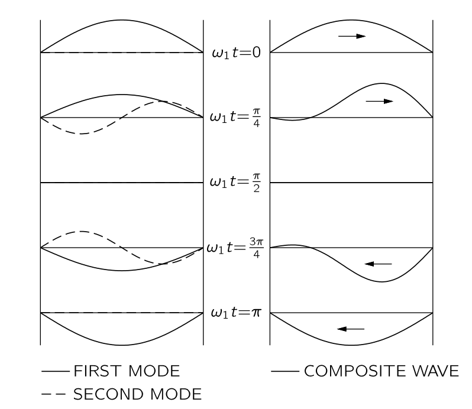{#fig-FLP_1_49_3 width=350}

동시에 두 번째 모드의 진동도 가정한다. @fig-FLP_1_49_3 은 또한 이 모드의 연속 그림을 보여주며, 시작 시 첫 번째 모드와 $\pi/2$ 만큼 위상이 어긋나 있다. 이는 시작 시 변위가 없지만, 문자열의 두 절반은 서로 반대 방향의 속도를 가지고 있음을 의미한다. 이제 우리는 선형 시스템에 관한 일반 원리를 상기하자: 두 개의 해가 존재한다면 그 합도 해가 된다. 따라서 문자열의 세 번째 가능한 운동은 @fig-FLP_1_49_3 에 표시된 두 해를 더하여 얻은 변위일 것이다. 그 결과는 그림에 표시되어 있으며, 끈의 양쪽 끝 사이를 앞뒤로 흐르는 돌출된 형태를 암시하기 시작하지만, 두 가지 모드만으로는 이를 매우 잘 파악하기 어렵다. 더 많은 모드가 필요하다. 이 결과는 실제로 선형 시스템에 대한 위대한 원칙의 특수한 경우이다:

**모든 운동은 모든 서로 다른 모드의 운동의 합에 적절한 진폭과 위상을 결합한 것으로 가정함으로써 분석될 수 있다.**

이 원리의 중요성은 각 모드가 매우 단순하다는 사실에서 비롯된다—그것은 시간상의 사인파 운동에 그치지 않습니다. 줄의 일반적인 움직임조차도 실제로는 그리 복잡하지 않다는 것이 사실이지만, 예를 들어 비행기 날개의 휘핑과 같이 움직임이 훨씬 더 복잡한 다른 시스템도 존재한다. 그럼에도 불구하고, 비행기 날개가 있더라도, 우리는 하나의 주파수를 가진 특정한 비틀림 방식과 다른 주파수를 가진 다른 비틀림 방식을 발견한다. 이러한 모드를 찾을 수 있다면, 전체 운동은 언제나 조화 진동의 중첩으로 분석될 수 있다(단, 시스템이 더 이상 선형이라고 간주될 수 없는 경우는 제외하고).

### $\mathrm{I}$.49–3 2차원 모드 {#sec-FLP_1_49_3}

이제 2차원 모드에서의 흥미로운 상황을 생각한다. 이 시점까지 우리는 일차원적인 상황에 대해서만 이야기해 왔다. 궁극적으로 우리는 3차원을 고려해야 하지만, 좀 더 쉬운 2차원에서 살펴보자. 확실히 하려면 직사각형 고무 드럼헤드를 직사각형 가장자리 어디에서도 변위가 없도록 제한하고, 그 직사각형의 치수를 @fig-FLP_1_49_4 에 표시된 대로 $a$ 와 $b$ 로 두자. 이제 가능한 움직임의 특성이 무엇인지 알아보자. 1차원 줄에 사용된 동일한 절차로 시작할 수 있다. 만약 전혀 구속이 없다면, 우리는 고무의 일렁임이 일종의 파동과 함께 움직일 것이라고 예상 할 수 있다. 예를 들어, $\left(e^{i\omega t}\right)\left(e^{−ik_xx+ik_yy}\right)$ 는 $k_x$ 와 $k_y$ 에 따라 특정 방향으로 이동하는 사인파를 나타낸다. 이제 $x$ 축, 즉 $y=0$ 인 직선을 어떻게 노드로 만들 수 있을까? 일차원 문자열에 대해 개발된 아이디어를 활용하면, 복소 함수  $\left(e^{i\omega t}\right)\left(e^{−ik_xx-ik_yy}\right)$ 로 표현되는 또 다른 파동을 생각하자. 이 파동들의 중첩은 $x$ 와 $t$ 의 값에 관계없이 $y=0$ 에서 변위가 $0$ 이 된다. (비록 이러한 함수들은 진동할 드럼헤드가 없는 음수 y에 대해 정의되어 있지만, $y=0$ 에서 변위가 실제로 $0$ 이므로 무시해도 된다.) 이 경우 우리는 두 번째 함수를 반사된 파동으로 볼 수 있다.

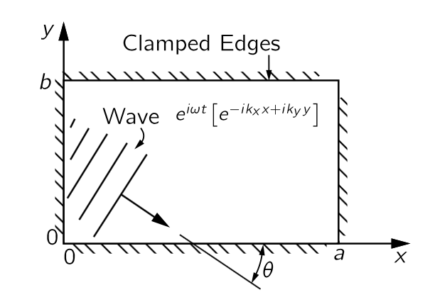{#fig-FLP_1_49_4 width=300}

하지만 우리는 $y=b$ 와 $y=0$ 이 모두 노드가 되는 선을 원한다. 해결책은 우리가 결정의 반사를 연구할 때 했던 것과 관련이 있다. $y=0$ 에서 서로 상쇄되는 이러한 파동은 $y=b$ 에서 동일하게, $2b\sin\theta$ 가 $\lambda$ 의 정수배이며, 여기서 $\theta$ 는 @fig-FLP_1_49_4 에 표시된 각도이다.

$$
m\lambda = 2 b \sin\theta, \qquad m=0, 1, 2, \ldots
$$ {#eq-FLP_1_49_7}

이제 같은 방법으로 $y$ 축을 두 개의 함수 $−(e^{i\omega t})(e^{+ik_x x + ik_yy})$ 와 $+(e^{i\omega t})(e^{+ik_xx−ik_yy})$ 를 더함으로써 노드 라인으로 만들 수 있으며, 각각은 $x=0$ 직선에서 다른 두 파동 중 하나를 반영한 것이다. $x=a$ 에서의 노드선에 대한 조건은 $y=b$ 에 대한 조건과 유사하다. $2a\cos \theta$ 는 또한 $\lambda$ 의 정수 배수여야 한다:

$$
n\lambda = 2a \cos \theta.
$$ {#eq-FLP_1_49_8}

그렇다면 최종 결과는 상자 안에서 튀는 파동이 정상파 패턴을 생성한다는 것이며, 정확히 모드이다.

따라서 모드를 갖기 위해서는 위의 두 조건을 충족해야 한다. 먼저 파장은 @eq-FLP_1_49_7 와 @eq-FLP_1_49_8 에서 각도 $\theta$ 를 제거하여 파장을 $a,\,b,\,n$ 및 $m$ 에 대해 구하여 얻을 수 있다. 가장 쉬운 방법은 해당 방정식의 양변을 $2b$ 와 $2a$ 로 나누어 제곱한 뒤, 두 방정식을 더하는 것이다. 결과는 $\sin^2\theta + \cos^2\theta = 1 = (n\lambda/2a)^2+(m\lambda/2b)^2$ 이며, $\lambda$ 에 대해 풀면

$$
\dfrac{1}{\lambda^2} = \dfrac{n^2}{4a^2}+\dfrac{m^2}{4b^2}.
$$ {#eq-FLP_1_49_9}

이와 같이 우리는 두 개의 정수를 기준으로 파장을 결정했으며, 그 파장으로부터 즉시 진동수 $\omega$ 를 얻는다. 이는 우리가 알다시피 진동수가 $2πc$ 를 파장으로 나눈 값과 동일하기 때문이다.

진동을 $x=0,\,x=a,\,y=0,\,y=b$ 네 직선이 모두 노드가 될 수 있도록 선택된 네 개의 파동의 중첩으로 표현 할 수 있다. 또한 모든 파동이 동일한 진동수를 가져야 하며, 그 결과적인 운동이 모드를 표현해야 한다. 이전 빛 반사에 대한 처리에서 우리는 $(e^{i\omega t})(e^{−ik_xx+ik_yy})$ 가 @fig-FLP_1_49_4 에 표시된 방향으로 이동하는 파동을 나타낸다는 것을 알 수 있다. @eq-FLP_1_49_6 즉 $k=\omega/c$ 는 

$$
k^2=k_x^2+k_y^2
$$ {#eq-FLP_1_49_10}

의 조건에서 성립한다. 그림으로부터 $k_x = k\cos\theta$ 와 $k_y = k \sin \theta$ 가 명확하다.

이제 직사각형 드럼헤드의 변위 $\phi$ 에 대한 우리의 방정식은 아래와 같다.

$$
\phi = \left[e^{i\omega t}\right] \left[ e^{(−ik_x x+ik_y y)}−e^{(+ik_x x+ik_y y)}−e^{(−ik_x x−ik_y y)}+e^{(+ik_x x−ik_yy)} \right].
$$ {#eq-FLP_1_49.11a}

위 식의 지수를 결합하면

$$
\phi = [4 \sin k_x x \sin k_y y][e^{i\omega t}].
$$ {#eq-FLP_1_49_11b}

위 식은 $x$ 방향과 $y$ 방향 모두에서 사인파인 패턴을 가지고 있으며 일단 $x=0$ 및 $y=0$ 에서의 경계조건을 만족한다. 여기에 $x=a$ 와 $y=b$ 일 때 $\phi = 0$ 이 되도록 해야 한다. 즉 $k_xa$ 와 $k_y b$ 는 각각 $π$ 의 정수배여야 한다. $k_x=k\cos\theta$ 와 $k_y=k\sin\theta$ 로부터 @eq-FLP_1_49_9 를 얻게 된다. 아래 테이블은 몇몇 $m,\,n$ 에 대한 모드의 모양을 보여준다.

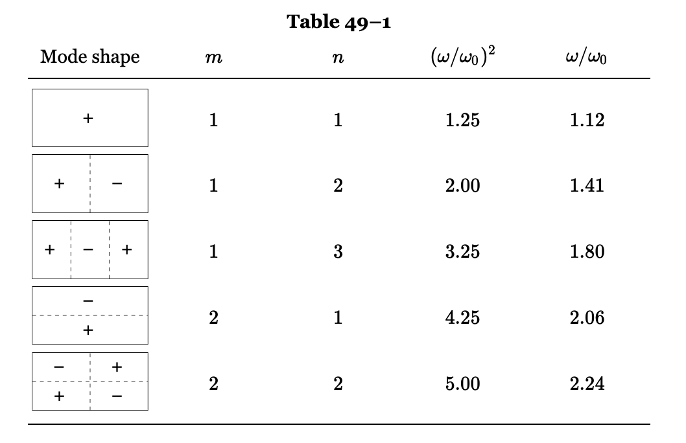{#tbl-FLP_1_49_1 width=500}

이 특정 경우에 강조해야 할 가장 중요한 점은 주파수가 서로의 배수가 아니며, 또한 어떤 수의 배수도 아니라는 것이다. 고유 주파수가 조화롭게 연관되어 있다는 생각은 일반적으로 사실이 아니다. 2차원 이상인 시스템에 대해서는 사실이 아니며, 균일한 밀도와 장력을 가진 문자열보다 더 복잡한 일차원 시스템에도 사실이 아니다. 후자의 간단한 예는 상단의 장력이 하단보다 높은 걸이 체인이다. 그러한 체인이 조화 진동으로 설정된다면, 다양한 모드와 주파수가 존재하지만, 그 주파수는 어떤 수의 단순한 배수도 아니며, 모드 형태도 사인형이 아니다.

보다 복잡한 시스템의 모드는 여전히 더 정교하다. 예를 들어, 입 안에 성대 위에 공동이 있으며, 혀와 입술 등을 움직여 다양한 직경과 형태의 개방형 파이프 또는 폐쇄형 파이프를 만들 수 있다; 이는 매우 복잡한 공명기이지만, 그럼에도 불구하고 공명기입니다. 이제 성대와 대화할 때, 그것은 일종의 음색을 생성하도록 만들어진다. 음색은 다소 복잡하고 많은 소리가 나오지만, 입 안의 공동은 다양한 공명 주파수 때문에 그 음색을 더욱 변화시킨다다. 예를 들어, 가수는 a, o, oo 등 다양한 모음을 같은 음높이로 부를 수 있지만, 다양한 화성이 이 공동에서 서로 다른 정도로 공명하고 있기 때문에 소리가 다르게 들린다. 공동의 공명 주파수가 음성 소리를 변형하는 데 매우 큰 중요성을 갖는다는 것은 간단한 실험을 통해 입증될 수 있다. 음속은 밀도의 제곱근의 역수와 같이 변하기 때문에, 서로 다른 가스를 사용하여 음속을 조절할 수 있다. 헬륨을 공기 대신 사용하면 밀도가 낮아지고, 음속이 훨씬 높아지며, 공동의 모든 주파수가 상승하게 된다. 그 결과, 말을 하기 전에 폐에 헬륨을 채우면, 성대가 같은 주파수로 진동하고 있을지라도 목소리의 성격이 크게 변하게 된다.

### $\mathrm{I}$.49–4 연결된 진자 {#sec-FLP_1_49_4}

마지막으로, 복잡한 연속 시스템뿐만 아니라 매우 단순한 기계 시스템에도 모드가 존재한다는 점을 보인다. 좋은 예는 앞 장에서 논의된 두 개의 결합된 진자 시스템이다. 그 장에서는 그 움직임이 서로 다른 주파수를 가진 두 개의 고조파 운동의 중첩으로 분석될 수 있음을 보여주었다. 따라서 이 시스템도 조화로운 움직임이나 모드 측면에서 분석될 수 있다. 줄은 무한히 많은 모드를 가지고 있으며, 2차원 표면도 무한히 많은 모드를 가지고 있다. 어떤 의미에서는 무한을 세는 방법을 알면 이중 무한대이다. 하지만 자유도가 두 개뿐이고, 그것을 설명하기 위해 두 개의 변수만 필요한 단순한 기계적인 것은 두 가지 모드만을 가지고 있다.

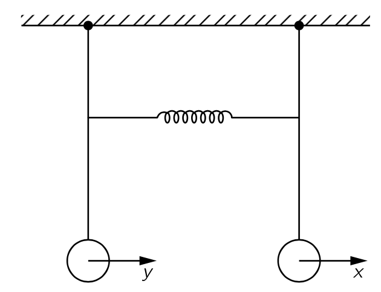{#fig-FLP_1_49_5 width=350}

이 진자 길이가 동일한 경우의 두 가지 모드에 대해 수학적 분석을 해 보자. @fig-FLP_1_49_5 에 표시된 바와 같이 두 변위를 각각 $x,\,y$ 라고 한다. 용수철이 없을 경우, 첫 번째 질량에 작용하는 힘은 중력에 의해 그 질량의 변위에 비례하며, 고유 주파수 $\omega_0$ 인 진자 운동을 할 것이다. 용수철이 없는 운동 방정식은 다음과 같다.

$$
m\dfrac{d^2x}{dt^2}=−m\omega_0^2 x
$$ {#eq-FLP_1_49_13}

다른 진자 역시 용수철이 없을 경우 같은 방식으로 흔들린다. 중력에 의한 복원력 외에도, 첫 번째 질량을 끌어당기는 추가적인 힘이 있다. 그 힘은 $x-y$ 와 기하학에 따라 달라지는 일정한 상수에 비례한다. 역방향의 동일한 힘이 두 번째 질량에 작용합니다. 따라서 풀어야 할 운동 방정식은

$$
\begin{aligned}
m\dfrac{d^2x}{dt^2} & = −m\omega_0^2 x−k(x−y), \\[0.3em]
m\dfrac{d^2y}{dt^2} & = −m\omega_0^2 y−k(y-x).
\end{aligned}
$$ {#eq-FLP_1_49_14}

두 질량이 같은 주파수로 움직이는 운동을 찾기 위해서는 각 질량이 얼마나 움직이는지를 결정해야 한다. 다시 말해, 진자 $x$ 와 진자 $y$ 는 같은 주파수로 진동하지만, 그들의 진폭은 $A$ 와 $B$ 라는 특정 값을 가져야 하며, 그 관계는 고정되어 있다. 아래의 식으로 시도해 보자.

$$
x=Ae^{i\omega t},\qquad y=Be^{i\omega t}.
$$ {#eq-FLP_1_49_15}

이 둘을 @eq-FLP_1_49_14 에 대합하고 공통인수 $e^{i\omega t}$ 를 제거하면 다음 식을 얻는다.

$$
\left(\omega^2−\omega_0^2−\dfrac{k}{m}\right)A = - \dfrac{k}{m}B, \\[0.3em]
\left(\omega^2−\omega_0^2−\dfrac{k}{m}\right)B = - \dfrac{k}{m}A.
$$ {#eq-FLP_1_49_16}

$A,\,B$ 가 $0$ 이 아닌 해가 존재하기 위해서는 $\omega$ 가 아래의 $\omega_1$ 이거나 $\omega_2$ 이어야 한다

$$
\omega_1^2 = \omega_0^2,\qquad \omega_2^2 = \omega_0^2 + \dfrac{2k}{m}.
$$ {#eq-FLP_1_49_18}

더우기 $\omega = \omega_1$ 이면 $A=B$ 이며 $\omega = \omega_2$ 이면 $A=-B$ 이다. 

### $\mathrm{I}$.49-5 선형 시스템 {#sec-FLP_1_49_5}

이제 위에서 논의된 아이디어들을 요약해 보자. 이는 모두 아마도 물리수학의 가장 일반적이고 훌륭한 원리의 양상이다. 시간에 독립적인 특성을 가진 선형 시스템이 있다면, 그 움직임은 특별한 단순성을 가질 필요가 없으며, 실제로는 매우 복잡할 수 있지만, 매우 특수한 움직임, 보통은 일련의 특수 움직임이 존재하며, 이 경우 전체 움직임 패턴이 시간에 따라 지수적으로 변한다. 현재 우리가 이야기하고 있는 진동계에 대해, 지수는 허수이며, “exponentially”라고 말하는 대신 “sinusoidally”라고 말하는 것이 좋을 수도 있다. 하지만 보다 일반적으로 말하면, 움직임은 매우 특수한 모드와 매우 특수한 형태에서 시간에 따라 지수적으로 변한다고 말할 수 있다. 시스템의 가장 일반적인 운동은 언제나 서로 다른 지수들을 포함하는 운동들의 중첩으로 표현될 수 있다.

이는 사인파 운동의 경우에 다시 한 번 언급할 가치가 있다: 선형 시스템은 순수한 사인파 운동, 즉 확정된 단일 진동수에서 움직일 필요는 없지만, 어떻게 움직이든 이 운동은 순수한 사인파 운동들의 중첩으로 표현될 수 있다. 각 움직임의 진동수는 시스템의 특성이며, 각 움직임의 패턴이나 파형도 시스템의 특성이다. 그러한 시스템의 일반적인 움직임은 각 모드의 강도와 위상을 부여하고, 이를 모두 합산함으로써 특성화될 수 있다. 다르게 표현하면, 모든 선형 진동 시스템은 독립적인 고조파 진동자 집합에 해당하며, 고유 주파수는 해당 모드에 대응한다.

우리는 모드과 양자역학의 연관성을 언급하며 이 장을 마치고자 한다. 양자역학에서 진동하는 물체, 즉 공간에서 변하는 물체는 주어진 배치에서 전자 또는 전자계가 발견될 확률을 제공하는 확률 함수의 진폭이다. 이 진폭 함수는 공간과 시간에 따라 달라질 수 있으며, 실제로 선형 방정식을 만족한다. 하지만 양자역학에서는 변환이 존재하며, 이는 우리가 확률 진폭의 진동수라고 부르는 것이 고전적 개념에서 에너지와 동일하다는 것이다. 따라서 우리는 위에서 언급한 원리를 “frequency”라는 단어를 에너지로 대체함으로써 이 경우에 적용할 수 있다. 다음과 같이 됩니다: 예를 들어 원자와 같은 양자역학 시스템은 일정한 에너지를 가질 필요가 없으며, 단순한 기계적 시스템이 일정한 주파수를 가질 필요는 없다; 그러나 시스템이 어떻게 행동하든 그 행동은 언제나 일정한 에너지 상태들의 중첩으로 표현될 수 있다. 각 상태의 에너지는 원자의 특성이며, 서로 다른 위치에서 입자를 발견할 확률을 결정하는 진폭 패턴도 그러하다. 일반적인 운동은 이러한 서로 다른 에너지 상태 각각의 진폭을 제시함으로써 설명될 수 있다. 이것이 양자역학에서 에너지 준위의 기원이다. 양자역학은 파동으로 표현되므로, 전자가 충분한 에너지를 가지고 있어 결국 양성자로부터 탈출할 수 없는 상황에서는, 그것들은 제한된 파동이다. 줄의 제한된 파동과 마찬가지로, 양자역학에서 파동 방정식의 해에 대해 일정한 진동수가 존재합니다. 양자역학적 해석은 이것들이 일정한 에너지라는 것이다. 따라서 양자역학 시스템은 파동으로 표현되므로 고정된 에너지의 명확한 상태를 가질 수 있다; 예를 들어 다양한 원자들의 에너지 준위가 그러하다.

## $\textrm{I}$.50 조화 {#sec-FLP_1_50}

 

## $\textrm{I}$.51 파동 {#sec-FLP_1_51}

 
