 

## II.1 전기와 자기

### II.1-1 전기력 {#sec-FLP_2_1_1}

>We may ask, finally, what holds a negatively charged electron together (since it has no nuclear forces). If an electron is all made of one kind of substance, each part should repel the other parts. Why, then, doesn’t it fly apart? But does the electron have “parts”? Perhaps we should say that the electron is just a point and that electrical forces only act between *different* point charges, so that the electron does not act upon itself. Perhaps. All we can say is that the question of what holds the electron together has produced many difficulties in the attempts to form a complete theory of electromagnetism. The question has never been answered. We will entertain ourselves by discussing this subject some more in later chapters.

#### **로런츠 힘과 운동방정식**

::: {.callout-important icon="false"}

#### **로런츠 힘**

속도 $\bf{v}$ 로 움직이는 전하 $q$ 가 받는 힘은 전하의 위치에서의 전기장 $\bf{E}$ 와 자기장 $\bf{B}$ 에 대해 

$$
\boxed{\bf{F}=q(\bf{E}+\bf{v}\times \bf{B})}
$$ {#eq-FLP_2_1_1}

이며 이 힘을 **로런츠 힘 (Lorentz force)** 라고 한다.

:::

이로부터 로런츠 힘에 의한 운동방정식은 다음과 같다.

$$
\dfrac{d}{dt}\left(\dfrac{m\bf{v}}{\sqrt{1-v^2/c^2}}\right) = \bf{F}=q(\bf{E}+\bf{v}\times\bf{B}).
$$ {#eq-FLP_2_1_2}

즉 전하를 가진 입자의 운동방정식을 정하는 외부요인은 전기장 $\bf{E}$ 와 자기장 $\bf{B}$ 이므로 전기장과 자기장을 구하면 된다.

#### **중첩의 원리**

중첩으 원리는 전기장, 혹은 자기장을 구하는데 유용하다. 예를 들어 전하의 집합 $A$ 가 전기장 $\bf{E}_A$ 를 생성하고, 집합 $B$ 가 전기장 $\bf{E}_B$ 를 생성하한다면 $A$ 와 $B$ 가 동시에 존재할 때 생성되는 전기장 $\bf{E}_{A+B}$ 는

$$
\bf{E}_{A+B} = \bf{E}_A+\bf{E}_B
$$ {#eq-FLP_2_1_3}

이다. 이를 **중첩의 원리 (principle of superposition)** 이라고 하며 자기장에도 마찬가지로 적용된다. 

 

### II.1-2 전기장과 자기장 {#sec-FLP_2_1_2}

전기장 $\bf{E}$ 와 자기장 $\bf{B}$ 는 시간과 공간에 대한 함수로 주어지며 맥스웰 방정식이라 불리는 관계를 항상 만족한다. 즉

$$
\bf{E}=\bf{E}(\bf{x},\,t),\qquad \bf{B}=\bf{B}(\bf{x},\,t)
$$

이다.

 

### II.1-3 벡터장의 특성 {#sec-FLP_2_1_3}

 

### II.1-4 전자기의 법칙 {#sec-FLP_2_1_4}

#### **맥스웰 방정식** 

::: {.callout-important icon="false"}

#### 맥스웰 방정식의 적분 형태 

닫힌 곡면 $S$ 와 $S$ 의 내부의 전하 $Q$, 그리고 진공에서의 유전류 $\epsilon_0$, 자화율 $\mu_0$ 에 대해 다음이 성립한다.
$$
\oint_S \bf{E\cdot}d\bf{a} = \dfrac{Q}{\epsilon_0}.
$$ {#eq-FLP_2_1_6}

$$
\oint_S \bf{B\cdot}d\bf{a} = 0.
$$ {#eq-FLP_2_1_8}

닫히지 않은 표면 $S$ 와 $S$ 의 경계 $C$ 에서 다음이 성립한다.

$$
\oint_C \left(\nabla \times \bf{E}\right)\bf{\cdot}d\bf{l} = - \dfrac{d}{dt}\int_S \bf{B \cdot}d\bf{a} 
$$ {#eq-FLP_2_1_7}

$$
\oint_C \left(\nabla \times \bf{B}\right)\bf{\cdot}d\bf{l} = \epsilon_0\mu_0\dfrac{d}{dt}\int_S \bf{E\cdot}d\bf{a} + \mu_0\int_S \bf{J\cdot}d\bf{a}.
$$ {#eq-FLP_2_1_9}

이 때 $\epsilon_0 \mu_0 = 1/c^2$ 이다.

:::

@eq-FLP_2_1_9 의 등호 오른쪽 첫번째 항은 소위 변위전류에 대한 것으로 맥스웰이 이론적으로 발견하였으며 매우 중요하다.

 

#### **변위 전류**

::: {.callout-note icon="false"}

#### **변위전류**

변위전류 $I_D$ 는 다음과 같이 정의된다.

$$
I_D:=\epsilon_0 \dfrac{d}{dt} \int_S \bf{E \cdot} d\bf{a}.
$$ {#eq-FLP_definition_of_displacememnt_current}

:::

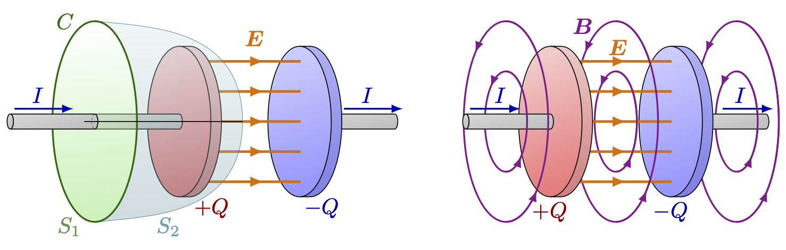{#fig-FLP_2_displacement_current width=500}

위의 그림과 같은 축전기에 전류 $I$ 가 흐른다고 해 보자. 도선 주위에 왼쪽 그림에서와 같이 경로 $C$ 를 잡고 경로 $C$ 에 의해 정해지는 표면 $S_1$ 을 생각하자. 그렇다면 @eq-FLP_2_1_9 의 우변이 결정된다. 이제 @eq-FLP_2_1_9 에서 변위전류항이 없다고 하자. 그리고 역시 $C$ 를 경계로 하는 표면 $S_2$ 를 생각하자. 분명히 $S_2$ 표면을 지나는 전류가 없으며 따라서 @eq-FLP_2_1_9 의 오른쪽은 $0$ 이 된다. 여기서 변위전류를 도입해야 할 필요가 존재한다. 전하가 대전된 도선 판 사이에는 전기장이 생성되며 이 전기장이 자기장에 기여한다. 이 전기장 기여가 변위 전류이다. 

변위전류는 실제 전류가 아니라 맥스웰 방정식에서 전류와 같은 역할을 하는 전기장의 시간에 대한 변화라는 것을 다시 한번 강조한다.

 

### II.1-5 장이란 무엇인가? {#sec-FLP_2_1_5}

 

## II-2 벡터장과 미분 {#sec-FLP_2_2}

*FLP 와 다르게 간다.*

### A. 헬름홀츠 정리 {#sec-FLP_helmholtz_theorem}

[헬름홀츠 정리](https://julia-kaeri.github.io/MathematicalPhysics/src/vector_calculus/vectorcalculus.html#sec-ED_MT_Helmholtz_theorem) 의 헬름홀츠 정리와 따름정리들을 참고하라. $\bf{E},\,\bf{B}$ 모두 헬름홀츠 정리의 조건을 만족하는 벡터장이다. 즉

$$
\bf{P}= -\nabla \Psi - \nabla \times \bf{C}
$$

형태로 쓸 수 있다. 이로부터 다음을 알 수 있다. 

 

::: {#thm-FLP_existance_of_scalar_potential}

#### **Curl 이 0 인 벡터장의 스칼라 포텐셜**

$\nabla \times \bf{P}=0$ 이면 $\bf{P}=-\nabla \Phi$ 인 스칼라장 $\Phi$ 가 존재한다.

:::

 

::: {#thm-FLP_existance_of_vector_potential}

#### **Divergence 가 0 인 벡터장의 벡터 포텐셜**

$\nabla \bf{\cdot P}=0$ 이면 $\bf{P}=\nabla \times \bf{C}$ 인 벡터장 $\bf{C}$ 가 존재한다.

:::

 

## II-3 벡터 적분 {#sec-FLP_2_3}

발산정리와 스토크스 정리에 대해 소개한다. 증명은 미적분학 교재를 참고하라.

### A. 발산 정리 {#sec-FLP_divergence_theorem}

 

::: {#thm-FLP_divergence_theorem}

#### 발산 정리 (가우스 정리)

공간 속에서 유계이고 닫힌 한 영역 $R$ 에서 정의된 $C^1$ 급 벡터장 $\bf{F}$ 에 대하여 다음이 성립한다.

$$
\iint_{\partial R}\bf{F \cdot }d \bf{a} = \iiint_R \nabla \bf{\cdot F}\, dV
$$

:::

  

### B. 스토크스 정리 {#sec-FLP_stokes_theorem}

 

::: {#thm-FLP_stokes_theorem}

#### 스토크스 정리

$S$ 가 닫혀있는 조각적으로 부드러운 단순곡선 $\partial S$ 를 경계로 하는 조각적으로 부드러운 유향곡면이라고 하자. 그리고 $\bf{F}$ 가 곡면 $S$ 를 포함하는 $\R^3$ 상의 열린 공간에서 정의된 $C^1$ 급 벡터장일 때 다음이 성립한다.

$$
\oint_{\partial S}\bf{F \cdot }d \bf{l} = \iint_S (\nabla \times \bf{F})\bf{\cdot} d\bf{a}
$$

:::

 

## II-4 정전기학 {#sec-FLP_2_4}

### II.4-1 정전기와 정자기 {#sec-FLP_2_4_1}

::: {.callout-important icon="false"}

#### **맥스웰 방정식의 미분형태**

$$
\nabla \bf{\cdot E} = \dfrac{\rho}{\epsilon_0},
$$ {#eq-FLP_2_4_1}

$$
\nabla \times \bf{E} = - \dfrac{\partial \bf{B}}{\partial t}, 
$$ {#eq-FLP_2_4_2}

$$
\nabla \times \bf{B} = \dfrac{1}{c^2}\dfrac{\partial \bf{E}}{\partial t} + \mu_0 \bf{J},
$$ {#eq-FLP_2_4_3}

$$
\nabla \bf{\cdot B} = 0.
$$ {#eq-FLP_2_4_4}

:::

여기서 전기장과 자기장이 시간에 대한 의존성이 없을 때 각각 정전기와 정자기라고 하며 이 때 맥스웰 방정식은 다음과 같이 바뀐다.

::: {.callout-important icon="false"}

#### 정전기와 정자기에서의 맥스웰 방정식

정전기 : 
$$
\nabla \bf{\cdot E} = \dfrac{\rho}{\epsilon_0},
$$ {#eq-FLP_2_4_5}

$$
\nabla \times \bf{E} = 0, 
$$ {#eq-FLP_2_4_6}

정자기 :
$$
\nabla \times \bf{B} =  \mu_0 \bf{J},
$$ {#eq-FLP_2_4_7}

$$
\nabla \bf{\cdot B} = 0.
$$ {#eq-FLP_2_4_8}

:::

이 경우 전기장과 자기장은 분리된다.

 

### II.4-2 쿨롱의 법칙과 중첩 {#sec-FLP_2_4_2}

::: {.callout-important icon="false"}

#### **쿨롱의 법칙**

전하 $q_1,\,q_2$ 가 각각 $\bf{r}_1,\,\bf{r}_2$ 에 위치한다고 하자. $q_2$ 에 의해 생성되는 전기장을 $\bf{E}_2(\bf{r})$ 이라고 하면 @eq-FLP_2_4_5 에 의해

$$
\bf{E}_2(\bf{r}) = \dfrac{1}{4\pi\epsilon_0}\dfrac{q_2 (\bf{r}-\bf{r}_2)}{\|\bf{r}-\bf{r}_2\|^3}
$$

이며 $q_1$ 이 받는 힘 $\bf{F}_1 = q_1\bf{E}_2(\bf{r}_1)$ 이므로

$$
\bf{F}_1 = \dfrac{1}{4\pi\epsilon_0} \dfrac{q_1q_2\hat{\bf{r}}_{12}}{r_{12}^2},\qquad \text{where } \bf{r}_{12} = \bf{r}_1-\bf{r}_2
$$ {#eq-FLP_2_4_9}

이다. 
:::

#### **전하 분포에 의한 전기장**

전하 밀도 분포 $\rho(\bf{r}')$ 에 의한 전기장 역시 @eq-FLP_2_4_5 에 의해 아래와 같다.

$$
\bf{E}(\bf{r}) = \dfrac{1}{4\pi \epsilon_0} \int_\text{all space} \dfrac{\rho(\bf{r}')(\bf{r}-\bf{r}')}{\|\bf{r}-\bf{r}'\|^3} \,d^3\bf{r}'
$$ {#eq-FLP_2_4_16}

 

### II.4-3 정전 포텐셜 {#sec-FLP_2_4_3}

전기력 $\bf{F}$ 가 작용할 때 전하 $q$ 를 $a$ 에서 $b$ 까지 이동시킬 경우 해줘야할 일 $W$ 는 다음과 같다.

$$
W = -\int_a^b \bf{F\cdot}d\bf{l}
$$

전기장 $\bf{E}$ 에 대해 $\bf{F}=q\bf{E}$ 이므로 단위 전하당 해줘야 할 일 $W(\text{unit})$ 을 생각할 수 있으며 이는 다음과 같다.

$$
W(\text{unit}) = -\int_a^b \bf{E\cdot}d\bf{l}.
$$ {#eq-FLP_2_4_19}

@thm-FLP_existance_of_scalar_potential 로 부터 $\nabla \times \bf{E}=0$ 이면 $\bf{E}=-\nabla \Phi$ 인 스칼라장 $\Phi$ 가 존재한다는 것을 안다. 

::: {.callout-note icon="false"}

#### **정전 포텐셜**

정전기 상태에서 전기장 $\bf{E}$ 에 대해 $\bf{E}=-\nabla \Phi$ 를 만족하는 스칼라장 $\Phi$ 를 **정전 포텐셜 (electrostatic potential)** 이라고 한다. 

:::

정전 포텐셜 $\Phi$ 에 대해

$$
\Phi (\bf{r}) = -\int_{\bf{r}_0}^\bf{r} \bf{E\cdot}d\bf{l}
$$

이며 그 값이 $\bf{r}_0$ 에서 $\bf{r}$ 까지의 경로에 독립적이라는 것을 안다. 여기서 $\bf{r}_0$ 는 임의의 정해진 기준점이다. @eq-FLP_2_4_6 에 의해 정전기의 경우 포텐셜이 존재한다. 

 

### II.4-4 $\bf{E}=-\nabla \Phi$ {#sec-FLP_2_4_4}

정전 포텐셜의 정의에 의해 상수를 더해도 전기장에는 변화가 없다. 많은 경우 $\bf{r}\to \infty$ 극한에서 $\Phi=0$ 이 되도록 포텐셜을 정한다. 이 경우 $\bf{r}_0$ 에 위치한 점전하 $q$ 에 의한 정전 포텐셜은 다음과 같다.

$$
\Phi (\bf{r}) = \dfrac{q}{4\pi \epsilon_0 \|\bf{r}-\bf{r}_0\|}.
$$ {#eq-FLP_2_4_23}

전하의 분포에 대한 전기포텐셜은 이산적이거나 연속적일 때 아래와 같다.

$$
\Phi (\bf{r}) = \sum_{i}\dfrac{q_i}{4\pi \epsilon_0 \|\bf{r}-\bf{r}_i\|},
$$ {#eq-FLP_2_4_24}
$$
\Phi (\bf{r}) = \dfrac{1}{4\pi\epsilon_0}\int\dfrac{\rho(\bf{r}')}{ \|\bf{r}-\bf{r}'\|}\,d^3\bf{r}'.
$$ {#eq-FLP_2_4_25}

 

### II.4-5 전기장의 플럭스 {#sec-FLP_2_4_5}

닫힌 표면 $S$ 와 $S$ 내부의 총 전하량 $Q_\text{in}$ 에 대해 다음이 성립한다.
$$
\oint_S \bf{E\cdot}d\bf{a} = \dfrac{{Q}_\text{in}}{\epsilon_0}.
$$

 

### II.4-6 가우스의 법칙 {#sec-FLP_2_4_6}

$$
\nabla \bf{\cdot E}= \dfrac{\rho}{\epsilon_0}.
$$

 

### II.4-7 구형 전하분포에 의한 장 {#sec-FLP_2_4_7}

전하가 원점을 중심으로 구형 대칭으로 분포되었을 때, 즉 $\rho(\bf{r})=\rho(r)$ 라고 하자. 또한 $\rho(r>a)= 0$ 라면 $r>a$ 인 위치에서의 전기장은 다음과 같다.

$$
\bf{E}(\bf{r}) = \dfrac{1}{4\pi\epsilon_0}\dfrac{Q\hat{\bf{r}}}{r^2},\qquad \text{where }Q=\int_{\|\bf{r}'\|<a} \rho(\bf{r}')d^3\bf{r}'.
$$ {#eq-FLP_2_4_39}

 

### II.4-8 등전위면 {#sec-FLP_2_4_8}

$\Phi(\bf{r})$ 값이 일정한 표면을 등전위면이라고 한다. $\bf{E}=-\nabla \Phi$ 로부터 전기장의 방향은 그 지점의 등전위면에 수직함을 안다.

 

## II.5 가우스 법칙의 응용

### II.5-1 정전기학과 가우스 법칙 {#sec-FLP_2_5_1}

정전기학(electrostatics) 은 가우스 법칙 @eq-FLP_2_4_5 과 @eq-FLP_2_4_6 으로 기술된다.

 

### II.5-2 정전기장에서의 평형 {#sec-FLP_2_5_2}

- 질문 : 다른 전하에 의한 전기장에 의해 점전하는 언제 역학적 안정평형상태에 있을 수 있는가? 예를 들어 세 음전하가 평면상의 정삼각형의 꼭지점에 고정되어 있을 때 정삼각형의 중심의 양전하는 안정평형상태인가?

 

::: {#thm-FLP_electrostatic_field_and_stable_equillibrium}

### **정전기장과 안정평형상태**

정전기장에서 고립된 점전하의 역학적 안정평형상태는 존재하지 않는다.

:::

::: {.proof}

이는 가우스 법칙으로 보일 수 있다. $P_0$ 에 위치한 양전하를 생각하자. 다른 전하를 포함하지 않는 $P_0$ 를 포함하는 충분히 작은 폐곡면 $S$ 를 생각 할 수 있다. 이 양전하가 안정평형상태이려면 이 폐곡면의 면에서 모두 안쪽을 향하는 전기장이 존재해야 하며 이 때 $\oint_S \bf{E\cdot}d\bf{a} < 0$ 이다. 그러나 가우스 법칙에 따르면 $\oint_S \bf{E\cdot}d\bf{a} =0$. $P_0$ 에 음전하가 있을 때도 같은 논리로 모순됨을 보일 수 있다.$\square$

:::

좀 더 수학적인 증명은 [정전기적 안정평형상태](https://julia-kaeri.github.io/ClassicalPhysics/src/Electrodynamics/02_1_electrostatics1.html#sec-ED_ES_electrostatic_stable_equilibrium) 를 보라. 여기서 또 하나를 짚고 넘어가자.(FLP 에는 안나오는 내용이다.) 증명은 조화함수의 해석적 연속성을 이용하는데 여기서는 증명하지 않는다.

 

::: {#thm-FLP_electrostatic_potential_and_equilibrium}

#### **라플라스 방정식의 특성**
어떤 (단순 연결) 자유공간의 전기장 $\bf{E}(\bf{r})$ 을 생각하자. 어떤 $P_0$ 의 근처에서(수학적으로는 $P_0$ 를 포함하는 열린 공간) $\bf{E}=\bf{0}$ 이면 $\bf{E}$ 는 전체 자유공간에서 $\bf{0}$ 이다.

:::

 

즉 전체 공간에서 전기장이 $\bf{0}$ 이 아니라면 $\bf{E}(P_0)=0$ 일 때 $\bf{E}$ 의 주변이 모두 $\bf{0}$ 이 아니라는 의미이다. 이로부터 $P_0$ 에서 약간의 위치 변화를 가한다면 어떤 방향으로는 복원력이 작용하더라도 다른 방향으로는 $P_0$ 로부터 멀어지게 하는 힘이 작용한다는 것을 알 수 있다.

::: {#exm-FLP_example_of_electrostatic_stable_equillibrium}

#### 복수 개의 전하의 정전기적 안정평형

막대기의 양 끝에 전하량이 같은 두 전하 $q_1,\,q_2$ 가 붙어 있다고 하자. 이 경우 전기장에 의한 안정평형상태가 존재하는지 살펴보자. 이 막대기와 전하에 가해지는 힘을 위치에 대한 함수로, 즉 벡터장으로 $\bf{F}(\bf{r})$ 이라고 하자. 그렇다면 $\nabla \bf{\cdot F}<0$ 이어야 안정평형상태가 된다. 이 때 외부에서 두 전하에 가해지는 전기장을 각각 $\bf{E}_1,\,\bf{E}_2$ 라고 하면

$$
\bf{F}=q_1\bf{E}_1 + q_2 \bf{E}_2
$$

이며

$$
\nabla \bf{\cdot F}= q_1 (\nabla \bf{\cdot E}_1) + q_2 (\nabla \bf{\cdot E}_2) 
$$

이다. 두 전하 $q_1,\,q_2$ 가 자유공간(즉 각각의 전하의 어떤 가까운 주위에는 다른 전하가 없는)에 놓여있다면 $\nabla \bf{\cdot E}_1=\nabla \bf{\cdot E}_2=0$ 이므로 이 전하배치는 안정평형상태가 될 수 없다. 

:::

 

::: {#exm-FLP_example_of_electrostatic_stable_equillibrium_with_non_electric_constraint}

#### 역학적 제한이 있을 경우의 정전기적 안정평형

아래 그림과 같은 전하배치를 생각하자. 가운데의 전하는 속이 빈 관에 위치하여 위/아래 방향으로는 움직일 수 없다. 이 경우 안정평형상태임은 쉽게 보일 수 있다. 

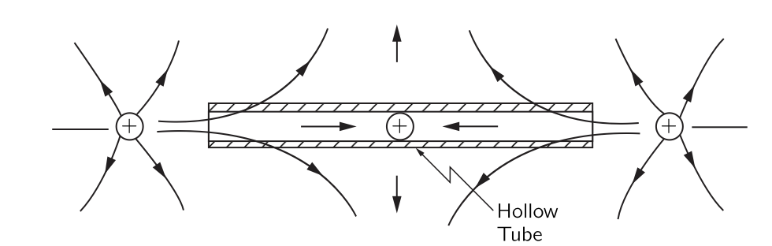{#fig-FLP_2_5_2 width=400}

:::

 

### II.5-3 도체와 평형 {#sec-FLP_2_5_3}

대전된 도체들이 있다고 하자. 그렇다면 점전하는 이 도체의 외부의 어떤 위치해서 안정평형상태에 있을 수 있을까? 문제를 더 정확히 하자면 이 점전하 $q$ 가 약간 이동할 때 도체 내부의 전하들이 재배치되어 점전하 $q$ 가 자기 위치로 돌아오도록 하는 복원력이 작용하게 하는 것이 가능할까? 일단 답은 **No** 이며 이것을 수학적으로 증명하는 것은 쉽지 않다. 여기서는 원리만 짚기로 한다.

우선 도체에서 전하가 재배치된다는 것은 이 재배치로 인해 전체 포텐셜 에너지$^1$가 낮아질 때 가능하다.[$^1$ 원문은 *First, we note that when charges redistribute themselves on the conductors, they can only do so if their motion decreases their total potential energy.* 인데 원문이 모호하며 물리적으로 전체 포텐셜 에너지가 맞는것 같다.]{.aside} 그리고 이중 일부의 에너지는 열의 형태로 손실된다. 이제 우리는 이미 보았듯이, 장을 만드는 전하들이 (시간적으로) 정지 상태라면, 장 내의 어떤 위치 $\bf{r}_0$ 근처에서는 점전하를 $\bf{r}_0$ 로부터 이동시켰을 때 시스템 에너지를 감소시키는 어떤 방향이 존재한다 (@thm-FLP_electrostatic_potential_and_equilibrium 와 부연설명을 보라). 이 방향으로의 전하의 가상 변위를 $\delta \bf{r}$ 라고 하고 전체 시스템의 포텐셜 에너지를 $U$ 라고 하면 $U(\bf{r}+\delta \bf{r}_0) - U(\bf{r})< 0$ 이며,

$$
0> U(\bf{r}+\delta \bf{r}_0) - U(\bf{r}) = \dfrac{\partial U}{\partial \bf{r}}\bf{\cdot}\delta \bf{r} = - \bf{F}_{\delta \bf{r}}\bf{\cdot}\delta \bf{r}
$$

이며 따라서 $\delta \bf{r}$ 방향으로 더 가속을 받게 된다. 즉 안정평형을 향하지 않는다.

우리의 결론은 전하를 전기적 힘으로 균형 잡을 수 없다는 것을 의미하지 않는다. 적절한 장치를 사용하여 전하의 위치나 크기를 지지한다면 가능하다. 마치 중력장에서 어느 지점에 서 있는 막대가 불안정하다는 것을 알고 계시지만, 이것이 손가락 끝에서 균형을 이룰 수 없다는 것을 증명하는 것은 아닌것과 같다. 마찬가지로, 전하가 가변적인 경우 전기장에 의해 한 지점에서 고정될 수 있다. 하지만 수동적인—즉, 정적인—시스템에서는 불가능하다.

 

### II.5-4 원자의 안정성 {#sec-FLP_2_5_4 }

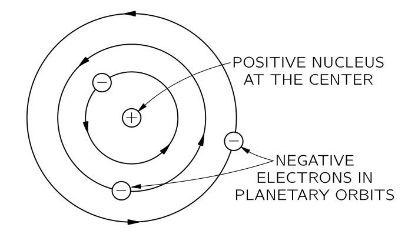{#fig-FLP_2_5_4 width=300}

이 전의 원자에 대한 모형을 거쳐 러더퍼드와 보어는 위와 같이 양전하(핵) 을 중심으로 전자가 주위를 회전하는 모형을 제안하였다. 그러나 회전하는 전자는 필연적으로 전자기파를 방출하며 이 과정에서 에너지를 잃어 원자핵으로 다가가야 한다. 즉 원자는 불안정하다. 이를 해결한 것은 양자역학과 불확정성의 원리이다. 불확정성의 원리에 의하면 전자의 위치가 국소화 될 수록 운동량의 불확실성이 증가하고 다라서 전자는 점점 더 퍼지려고 한다. 이로인한 결론은 전자가 마치 배경처럼 원자핵 주위에 퍼져 있다는 것이다.

 

### II.5-5 선 전하에 의한 전기장 {#sec-FLP_2_5_5}

::: {#exm-FLP_electrif_field_of_inifine_uniform_line_charge}

#### 무한히 긴 선 전하

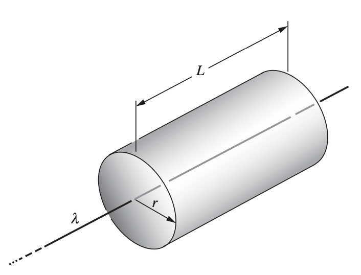{#fig-FLP_electrostatics_line_charge width=300}

위의 그림과 같은 균일한 선 전하 밀도 $\lambda$ 를 갖는 무한히 긴 전하선에 의한 전기장을 구해보자. 원통좌표계를 사용하며 $\hat{\bf{z}}$ 방향에 의한 전기장은 전하밀도에 의해 상쇄되기 때문에 $\hat{\bf{r}}$ 방향의 전기장만이 남는다. 이제 가우스 법칙을 이용해 구해보자. 위의 그림과 같은 높이 $L$, 반지름 $r$ 인 실린더 모양의 가우스 면을 생각하자. 가우스의 법칙에 따라

$$
E_r(r) 2\pi r L = \dfrac{\lambda L}{\epsilon_0}
$$

이므로 전기장은 아래와 같다.

$$
\bf{E}(r,\,\theta,\,z)= \dfrac{\lambda}{2\pi \epsilon_0 r}\hat{\bf{r}}
$${#eq-FLP_2_5_2}

:::

 

### II.5-6 균일하게 대전된 무한 평면에 의한 전기장 {#sec-FLP_2_5_6}

::: {#exm-FLP_electrif_field_of_inifine_uniform_charge_sheet}

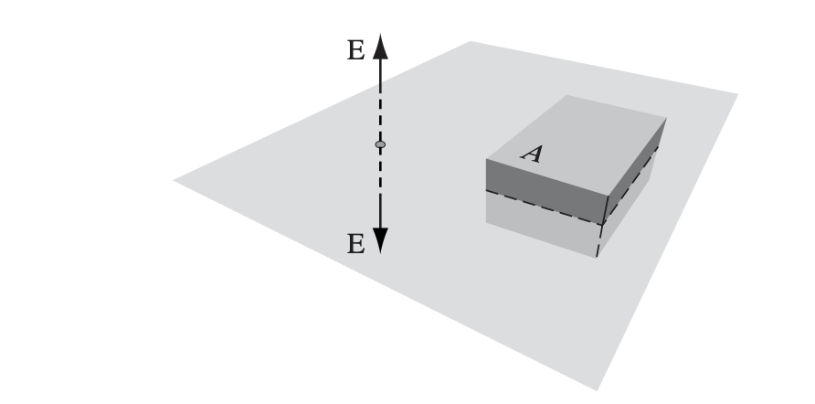{#fig-FLP_2_5_6_alt width=400}

균일한 면 전하 밀도 $\sigma$ 를 갖는 무한 평면을 생각하자. 그리고 위의 그림과 같이 이 평면의 일부를 관통하는 직육면체를 생각한다. 대칭성을 고려하면 당연히 평면에 수직한 성분을 제외한 성분의 전기장은 $0$ 이다. 이 전기장의 세기를 $E$ 라고 하고 가우스의 법칙윽 적용하면

$$
2AE = \dfrac{\sigma A}{\epsilon_0}
$$

로 $E=\dfrac{\sigma}{2\epsilon_0}$ 이다. 즉 균일한 무한 대전 평면에 의한 전기장은 평면으로 부터의 거리에 무관하게 같은 전기장 세기를 갖는다.

이 무한 대전 평면이 $xy$ 평면상에 위치한다고 하자. 그렇다면 

$$
\bf{E}(z>0)= \dfrac{\sigma}{2\epsilon_0}\hat{\bf{z}},\qquad \bf{E}(z<0)= - \dfrac{\sigma}{2\epsilon_0}\hat{\bf{z}}
$$ {#eq-FLP_2_5_3}

로 $\bf{E}$ 는 $z=0$ 에서 $\Delta \bf{E}(z\approx 0) = \bf{E}(z=0^+)-\bf{E}(z=0^-)= \dfrac{\sigma}{\epsilon_0}$ 불연속성을 보여준다. 

:::

 

### II.5-7 구면 대칭인 전하분포에 의한 전기장 {#sec-FLP_2_5_7}

::: {#exm-FLP_electric_field_by_charge_distribution_with_spherical_symmetry}

#### 구 대칭 전하 분포

전하 분포 $\rho(\bf{r})$ 가 원점을 중심으로 구 대칭을 이룬다면, 즉 $\rho(\bf{r})=\rho(r)$ 이라고 하자. 대칭을 생각하면 당연히 전기장은 $\hat{\bf{r}}$ 방향이며 $\bf{E}(\bf{r}) = E_r(\bf{r})\hat{\bf{r}}$ 로 놓을 수 있고 $E_r(\bf{r})$ 만 고려하면 된다. 반경 $r$ 인 구면을 $S_r$, 그 내부의 부피를 $V_r$ 이라고 하고 그 $S_r$ 의 내부에 있는 전하량을 $Q_r$ 이라고 하면 가우스 법칙에 의해

$$
\int_{V_r} \nabla \cdot \bf{E}(\bf{r'}) d^3\bf{r}' = \oint_{S_r}E_r(r)dS= 4\pi r^2 E_r(r)
$$

이며

$$
\int_{V_r} \dfrac{\rho(\bf{r}')}{\epsilon_0}\, d^3\bf{r}' = \dfrac{Q_r}{\epsilon_0}
$$

이므로

$$
\bf{E}(\bf{r}) = \dfrac{1}{4\pi \epsilon_0}\dfrac{Q_r}{r^2}\hat{\bf{r}}
$$ {#eq-FLP_electric_field_due_to_radial-distribution}

이다. 

:::

 

::: {#exm-FLP_electric_field_by_charge_distribution_of_uniform_sphere}

#### 균일한 구형 전하분포

반지름 $R$ 이며 전하밀도가 균일하게 $\rho_0$ 인 구형 전하 분포를 생각하자. $0\le r<R$ 일 경우의 전기장 $\bf{E}_{\text{in}}(r)$ 은

$$
\bf{E}_{\text{in}}(r)= \dfrac{1}{4\pi\epsilon_0}\dfrac{\rho_0 4\pi r^3/3}{r^2}\hat{\bf{r}}= \dfrac{\rho_0 r}{3\epsilon_0}\hat{\bf{r}}
$$ {#eq-FLP_electric_field_inside_of_uniformly_charged_sphere}

이며 $r\ge R$ 일 경우의 전기장 $\bf{E}_{\text{out}}(r)$ 은

$$
\bf{E}_{\text{out}}(r) = \dfrac{1}{4\pi\epsilon_0}\dfrac{\rho_0 4\pi R^3 /3}{r^2}\hat{\bf{r}} = \dfrac{\rho_0R^3}{3\epsilon_0 r^2} \hat{\bf{r}}
$${#eq-ED_ES_electric_field_outside_of_uniformly_charged_sphere}

이다. 이 분포의 총 전하량 $Q=\dfrac{4\pi \rho_0 R^3}{3}$ 을 생각하면 $\bf{E}_{\text{out}}(r)= \dfrac{Q}{4\pi \epsilon_0 r^2}\hat{\bf{r}}$ 이므로 모든 전하가 중심에 모여있을 때의 전기장과 같다. 전기장의 세기 $E(r)$ 을 그래프로 그리면 아래와 같다.

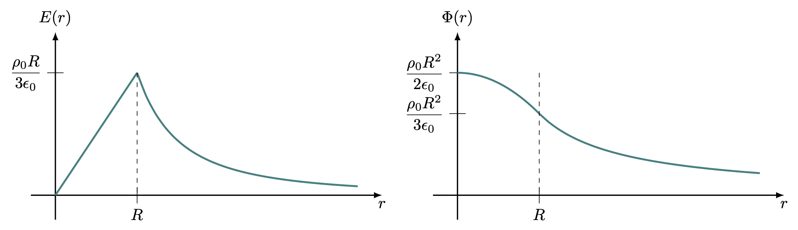{#fig-FLP_electrostatics_uniform_sphere width=300}

:::

 

이제 얇은 구형 껍질에 전하가 균일하게 분포되어 있을 때 내부에서의 전기장에 대해 생각해보자. 전기장이 $\bf{r}$ 방향이라면 가우스 법칙으로부터 내부의 전기장은 $\bf{0}$ 이며 표면에 분포한 전하가 $Q$ 일 때 껍질 밖의 전기장은 중심에 전체 전하 $Q$ 가 집중되어 있을때의 전기장과 같다는 것을 알 수 있다.

 

### II.5-8 점전하로부터의 전기장은 정확히 $1/r^2$ 에 비례하나? {#sec-FLP_2_5_8}

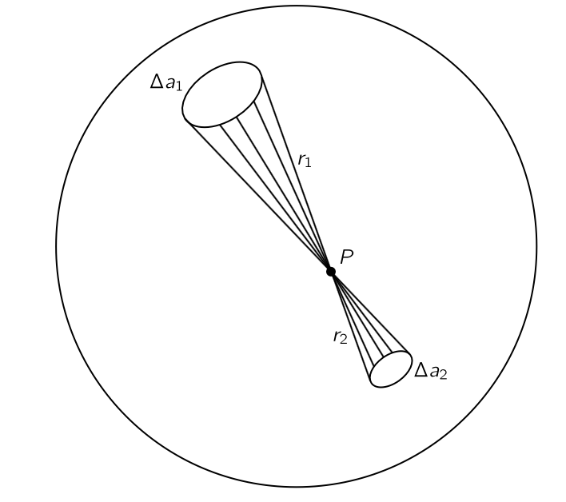{#fig-FLP_2_5_9 width=300}

위의 그림과 같은 전하의 구형 껍질 분포를 생각하자. 구 내부의 임의의 점 $P$ 에서 한 방향으로 원뿔을 만들고 이 원뿔에 의한 구 껍질의 절단면 $a_1$ 을 생각하자. 그리고 반대방향으로 대칭인 원뿔에 의한 절단면 $a_2$ 를 생각하자.  $P$ 에서 $a_1$ 절단면 까지의 거리와 면적을 각각 $r_1$, $\Delta a_1$ 이라고 하고 $a_2$ 까지의 거리와 면적을 $r_2$, $\Delta a_2$ 라고 하면 기하학적으로 다음 관계가 성립한다. (기하학을 통해 증명 할 수 있지만 쉽지 않다...)

$$
\dfrac{\Delta a_2}{\Delta a_1} = \dfrac{r_2^2}{r_1^2}.
$$

표면이 균일한 전하분포이므로 각각의 절단면의 전하 $\Delta q_1,\,\Delta q_2$ 는 면적에 비례하므로

$$
\dfrac{\Delta q_2}{\Delta q_1}= \dfrac{\Delta a_2}{\Delta a_1}
$$

이며, 따라서 $a_1,\,a_2$ 에 의해 생성되는 전기장의 크기 $E_1,\,E_2$ 는

$$
\dfrac{E_2(P)}{E_1(P)} = \dfrac{\Delta q_2/r_2^2}{\Delta q_1/r_1^2} = 1
$$

이며 그 방향이 반대이므로 서로 상쇄한다. 구의 모든 표면은 이런 절단면의 쌍으로 표현 할 수 있으므로 $P$ 에서의 전기장은 $0$ 이다. 그러나 만약 전기장이 거리의 제곱에 비례하지 않는다면 서로 상쇄되지 않기 때문에 껍질 내부의 전기장이 $0$ 이 아니게 된다. 예를 들어 $E\propto 1/r^3$ 이고 표면의 전하가 양의 전하라면 각 위치에서 구의 중심을 향하는 전기장을 갖는다. 

 

### II.5-9 도체 내의 전기장 {#sec-FLP_2_5_9}

전도체는 많은 자유전자를 내부에 갖는 고체이다. 여기서 자유전자는 물질 내부에서 자유롭게 움직 일 수 있지만 표면에서 밖으로 배출되지 않는 전자를 말한다. 금속은 많은 자유전자를 가지고 있으므로(원자당 자유전자 하나 혹은 그 이상) 전기장은 다수의 자유전자를 움직이게 만든다. 이렇게 발생한 전자의 전류는 외부 에너지원에 의해 지속적으로 이동하도록 유지되거나, 전자가 초기의 전기장을 생성하는 원천을 방전하면서 전자의 움직임이 멈추게 된다. 여기서 정전기적 상황을 가정하자. 즉 전자를 계속 움직이도록 에너지/전류를 공급하는 상황이 아니며, 이 경우 전자들이 움직이고 재배치되어 이 전자들에 의한 전기장이 발생하고 궁극적으로 도체 전채의 네부에서 전기장이 0 이 될 때 까지 전자가 움직이게 된다. 즉 정전기적 상황은 도체 내부의 모든 점에서 전기장이 0 인 상황이다.

도체 내부에서 $\bf{E}=0$ 이므로 정전 포텐셜 $\Phi$ 는 상수이다. 즉 도체의 내부는 등전위 공간이며 도체의 표면은 등전위면이다. $\nabla\bf{\cdot E}= \bf{0}$ 이므로 가우스 법칙에 의해 도체 내부에 전하 밀도는 $0$ 이다. 도체 내애 $0$ 이 아닌 전하 밀도튼 표면에서만 가능하다. 고체 물리를 배우게 되면 도체 내의 여분의 전하는 표면에 가까운 1~2 층의 원자층에만 존재한다는 것을 알게 된다.

즉 도채 내부의 전위는 일정하며 도체 표면이 등전위면(equipotential surface) 이다. 고체물리학을 배우게 되면 실제 알짜 전하는 표면의 원자 한두층 정도에 존재한다는 것을 알게된다. 

금속 표면이 등전위면이며 정전 포텐셜은 연속함수이므로 금속 표면의 바로 바깥쪽의 전기장은 표면에 수직 방향이며 가우스 법칙에 따라 전기장의 크기는 다음과 같다.

$$
E_{\text{condurctor surface}} = \dfrac{\sigma_\text{sufrace}}{\epsilon_0}.
$$ {#eq-FLP_2_5_8}

@eq-FLP_2_5_3 와 비교해 보면 흥미로운 차이가 있는데 이 이유는 짐작하듯이 도체 내부의 전기장이 $0$ 이기 때문, 또한 도체 내부의 전하들이 내부의 전기장을 $0$ 으로 만들도록 배치되기 때문이다.

 

### II.5-10 도체 내의 공동(cavity) 에서의 전기장 {#sec-FLP_2_5_10}

도체 내에 외부로 노출되지 않는 구멍, 즉 공동이 있다고 하자. 그리고 동공 내는 비어있다고 하자.

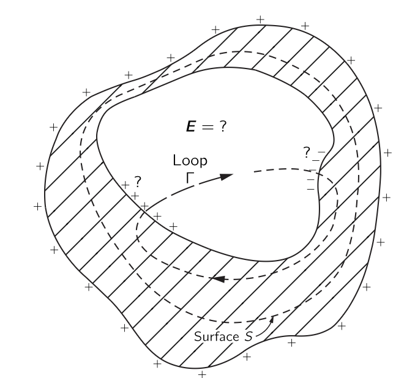{#fig-FLP_2_5_12 width=350}

위의 그림에서 동공을 내부에 포함하는 가우시안 표면 $S$ 에 대한 적분을 생각하자. 도체 내부에서의 전기장이 $0$ 이므로 내부의 총 알짜 전하는 $0$ 이다. 따라서 내부 동공의 표면에 양전하와 음전가가 같은 양만큼 분포하고 있다는 것을 알게 된다. 이제 닫힌 경로 $\Gamma$ 에 대한 전기장의 경로 적분을 생각하자. 우리는 $\oint_\Gamma \bf{E\cdot}d\bf{l}=0$ 임을 안다. 또한 도체 내부에서는 전기장이 $0$ 이므로 동공 내부의 임의의 경로에 대한 선적분이 $0$ 이다. 즉

$$
\begin{aligned}
0 &= \oint_\Gamma \bf{E\cdot}d\bf{l} = \underbrace{\int_{\text{ in the counductor}}\bf{E\cdot}d\bf{l}}_{\bf{E}=0} + \int_{\text{ in the cavity}}\bf{E\cdot}d\bf{l} \\[0.3em]
&=\int_{\Gamma \text{ in the cavity}}\bf{E\cdot}d\bf{l} 
\end{aligned}
$$

동공 내의 표면 전하가 양인 부분과 음인 부분이 있다고 하자. 동공 내의 경로를 양인 부분 $A$ 에서 출발하여 음인 부분 $B$ 로 들어가는 동공 내의 경로를 생각하자. 위 식에 의하면

$$
\int_A^B \bf{E\cdot}d\bf{l}=0
$$

이어야 하며 이 경로는 $A\to B$ 인 동공 내의 모든 동공에 대해 성립한다. 그런데 이것이 성립하려면 동공 내의 전기장이 0 일 수 밖에 없다. 또한 동공 내의 전기장이 $0$ 이라는 것은 동공 표면에서의 전하밀도가 항상 $0$ 이어야 한다. 이로부터 어떤 장비를 금속으로 둘러 싸면 그 전하는 외부의 정전기적 전기장에 차폐된다는 것을 알 수 있다. 

 

## II.6 다양한 상황에서의 전기장 1

### II.6-1 정전 포텐셜의 방정식 {#sec-FLP_2_6_1}

::: {.callout-note icon="false"}

#### **라플라시안 연산자** $\nabla^2$

라플라시안 연산자 $\nabla^2$ 는 아래와 같이 정의된다.

$$
\nabla^2 \Phi = \nabla \bf{\cdot}\nabla \Phi = \dfrac{\partial^2 \Phi}{\partial x^2}+\dfrac{\partial^2 \Phi}{\partial y^2} + \dfrac{\partial^2 \Phi}{\partial^2 z} 
$$ {#eq-FLP_2_6_5}

:::

정전기 상황에서의 멕스웰 방정식 @eq-FLP_2_4_5 과 @eq-FLP_2_4_6 을 생각하자. @eq-FLP_2_4_6 에 의해 $\bf{E}=-\nabla \Phi$ 인 스칼라장 $\Phi$ 가 존재하며 라플라시안 연산자를 이용하면 정전 포텐셜에 대한 다음 식을 얻는다.

$$
\nabla^2 \Phi = - \dfrac{\rho}{\epsilon_0}.
$$ {#eq-FLP_2_6_6}

이 미분방정식을 **푸아송 방정식 (Poisson equation)** 이라고 한다. 우리는 앞서 전하분포 $\rho$ 를 알 경우 이 전하분포에 의한 정전 포텐셜을 구할 수 있다는 것을 보였다.

$$
\Phi (\bf{r}) = \dfrac{1}{4\pi\epsilon_0}\int_V \dfrac{\rho (\bf{r}')}{\|\bf{r}-\bf{r}'\|}d^3\bf{r}' .
$$ {#eq-FLP_2_6_7}

이제 몇몇 상황에서의 정전 포텐셜을 구해보자.

 

### II.6-2 전기 쌍극자 {#sec-FLP_2_6_2}

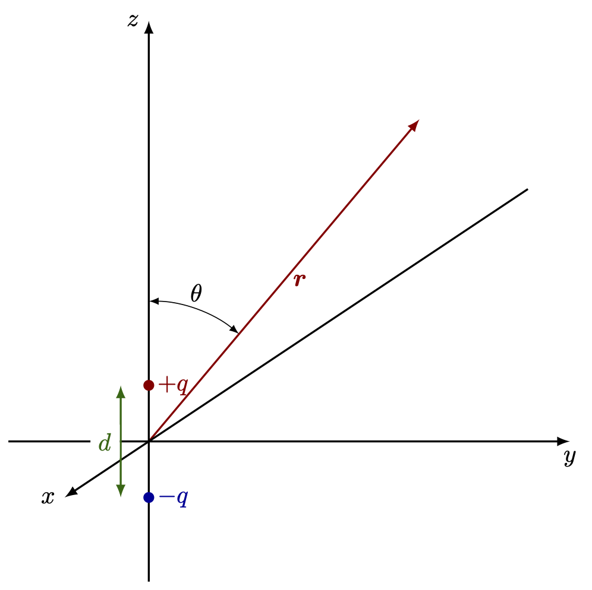{#fig-FLP_2_6_2 width=350}

두 점전하 $+q$, $-q$ 가 위의 그림과 같이 $d$ 만큼의 거리를 두고 $z$ 축상에 위치해 있다고 하자. 정전포텐셜은 $\bf{r}=(x,\,y,\,z)$ 에서의 정전포텐셜은 다음과 같다.

$$
\Phi(\bf{r}) = \dfrac{1}{4\pi\epsilon_0} \left[\dfrac{q}{\|\bf{r}-d\hat{\bf{z}}/2\|}+\dfrac{-q}{\|\bf{r}+d\hat{\bf{z}}/2\|}\right].
$$ {#eq-FLP_2_6_8}

[르장드르 다항식](https://julia-kaeri.github.io/MathematicalPhysics/src/special_functions/legendre.html)

많은 경우 우리가 관심있는 상황은 $\|\bf{r}\|\gg d$ 인 경우, 즉 두전하의 거리보다 우리가 관심있는 영역까지의 거리가 훨씬 큰 경우이며 이 때 이런 전하 분포를 **전기 쌍극자 (electric dipole)** 이라고 한다. 원자에 전기장이 가해지는 경우 원자핵과 전자가 서로 반대 방향으로 힘을 받기 때문에 원자핵의 중심과 전자의 중심이 불일치할 수 있으며 이때 발생하는 전기 쌍극자를 **원자 쌍극자 (atomic dipole)** 이라고 한다. 도체의 경우 자유전자는 표면에 모이며 내부의 전기장이 0 이 된다는 것을 안다. 부도체의 경우 전자가 멀리 가지 못하기 때문에 전자가 약간 움직이게 된다. 원자 혹은 분자 수준에서는 전기적으로 중성이며 다만 미시적으로 쌍극자를 이룬다. 그리고 우리가 관심 있는 영역은 이 미시적인 쌍극자의 크기보다 일반적으로 훨씬 크다. 어떤 경우에는 외부에서 가해지는 전기장이 없더라도 분자수준에서 전기쌍극자가 존재할 수 있다. 가장 대표적으로 물 분자이다.

이제 @eq-FLP_2_6_8 을 분석해보자. $r > d$ 인 경우 [르장드르 다항식](https://julia-kaeri.github.io/MathematicalPhysics/src/special_functions/legendre.html) 을 이용하면

$$
\begin{aligned}
\dfrac{1}{\|\bf{r}-d\hat{\bf{z}}/2\|} &= \dfrac{1}{r}\sum_{n=0}^\infty \left(\dfrac{d}{2r}\right)^n P_n(\cos\theta), \\[0.3em]
\dfrac{1}{\|\bf{r}+d\hat{\bf{z}}/2\|} &= \dfrac{1}{r}\sum_{n=0}^\infty \left(\dfrac{-d}{2r}\right)^n P_n(\cos\theta), 
\end{aligned}
$$

이며 이를 이용하면 @eq-FLP_2_6_8 은 역시 $r \gg d$ 근사에서

$$
\Phi(x,\,y,\,z) = \dfrac{1}{4\pi\epsilon_0} \dfrac{qd\cos \theta}{r^2} + \mathcal{O}\left(\dfrac{d^4}{r^4}\right) \approx \dfrac{1}{4\pi\epsilon_0} \dfrac{qdz}{r^3}
$$ {#eq-FLP_2_6_9}

이다. 이것을 좌표계 독립적인 식으로 바꾸자. 

::: {.callout-note icon="false"}

#### **전기 쌍극자 모먼트**

$+q$, $-q$ 인 두 전하가 각각 $\bf{r}_+,\,\bf{r}_-$ 에 위치할 때 위치벡터를 $\bf{d}=\bf{r}_+ - \bf{r}_{-}$ 라고 하자.  이 때 $\bf{p}= q\bf{d}$ 를 **전기 쌍극자 모먼트 (electric dipole moment)** 라고 한다.

:::

전기 상극자 모먼트 $\bf{p}$ 에 대해 @eq-FLP_2_6_9 는 다음과 같다.

$$
\Phi(\bf{r}) = \dfrac{1}{4\pi\epsilon_0}\dfrac{\bf{p\cdot r}}{r^3}.
$$ {#eq-FLP_2_6_13}

전기 쌍극자에 의한 정전 포텐셜을 전기 쌍극자 포텐셜 이라고 한다.

@eq-FLP_2_6_9 에 대한 전기장 $\bf{E}=(E_x,\,E_y,\,E_z)$ 는 아래와 같다.

$$
\begin{aligned}
E_z &= -\dfrac{\partial \Phi}{\partial z}= \dfrac{p}{4\pi\epsilon_0}\dfrac{3\cos^2\theta - 1}{r^3},\\[0.3em]
E_x &= - \dfrac{\partial \Phi}{\partial x} = \dfrac{p}{4\pi\epsilon_0}\dfrac{3zx}{r^5},\\[0.3em]
E_y &= - \dfrac{\partial \Phi}{\partial y}\dfrac{p}{4\pi\epsilon_0}\dfrac{3zy}{r^5}.
\end{aligned}
$$ {#eq-FLP_2_6_14}

 

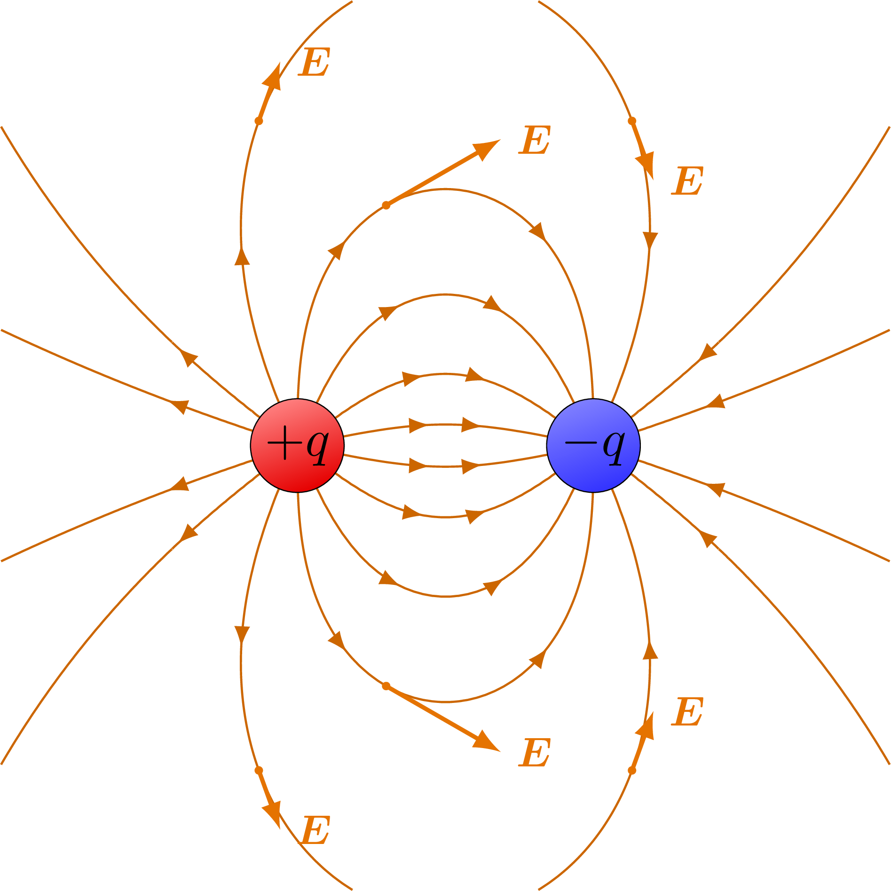{#fig-FLP_electric_field_of_dipole width=300}

 

### II.6-3 벡터 방정식에 대한 소고 {#sec-FLP_2_6_3}

 

### II.6-4 그래디언트를 사용한 전기 쌍극자 포텐셜 {#sec-FLP_2_6_4}

@eq-FLP_2_6_13 은 다음과 같이 쓸 수 있다.
$$
\Phi(\bf{r}) = -\dfrac{1}{4\pi\epsilon_0}\bf{p\cdot}\nabla \left(\dfrac{1}{r}\right)
$$ {#eq-FLP_2_6_16}

::: {#exm-FLP_electric_dipole_potential_obtained_in_another_way}

전기상극자의 포텐셜이 @eq-FLP_2_6_16 형태가 되는 것을 다른 방식으로 확인해보자. 원점에서 $\bf{d}/2$ 만큼 떨어진 곳에 위치한 $+q$ 전하에 의한 $\bf{r}$ 에서의 포텐셜 $\Phi_+(\bf{r})$ 은 원점에 위치한 $+q$ 전하에 의한 $\bf{r}-\bf{d}/2$ 에서의 포텐셜과 같다. 원점에 위치한 $+q$ 전하에 의한 포텐셜을 $\Phi_0$ 라고 하면 

$$
\Phi_+(\bf{r}) = \Phi_0\left(\bf{r}-\dfrac{\bf{d}}{2}\right) \approx \Phi_0(\bf{r}) - \nabla \Phi_0(\bf{r})\bf{\cdot}\dfrac{\bf{d}}{2}
$$

이다. 마찬가지로 $-\bf{d}/2$ 만큼 떨어진 곳에 위치한 $-q$ 전하에 의한 $\bf{r}$ 에서의 포텐셜 $\Phi_-(\bf{r})$ 은 원점에 위치한 $-q$ 전하에 의한 $\bf{r}+\bf{d}/2$ 에서의 포텐셜과 같다. 

$$
\Phi_-(\bf{r}) = -\Phi_0\left(\bf{r}+\dfrac{\bf{d}}{2}\right) = - \Phi_0(\bf{r}) - \nabla \Phi_0(\bf{r})\bf{\cdot}\dfrac{\bf{d}}{2}.
$$

그렇다면 전기 쌍극자에 의한 포텐셜은 $\Phi_+ + \Phi_-$ 이므로

$$
\Phi (\bf{r}) = -\nabla \Phi_0 \cdot \bf{d} = - \nabla \left(\dfrac{1}{4\pi\epsilon_0}\dfrac{q}{r}\right)\bf{\cdot d}= -\dfrac{1}{4\pi\epsilon_0}\bf{p} \bf{\cdot}\nabla \left(\dfrac{1}{r}\right) 
$$

이며 원했던 대로 @eq-FLP_2_6_16 을 얻었다.
:::

 

::: {#exm-FLP_electric_dipole_potential_by_uniformy_charged_sphere}

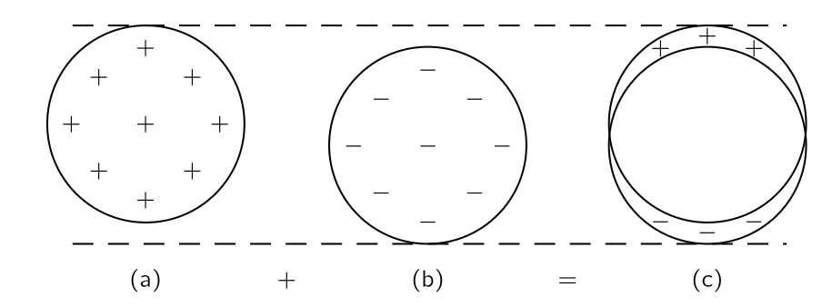{#fig-FLP_2_6_6 width=400}

위의 그림과 같이 반지름이 $R$ 인 두 공이 각각 양전하, 음전하로 균일하게 대전되어 있고 위의 그림과 같이 약간 어긋나 위치해 있다고 하자. 그렇다면 윗부분은 표면전하가 양전하로, 아랫부분은 표면전하가 음전하로 대칭적으로 대전되어 있다고 볼 수 있다. 전하 밀도 $\rho$ 에 대해 양전하로 대전된 구의 총 전하량 $Q=4\pi R^3\rho/3$ 이며 음전하로 대전된 구의 총 전하량은 $-Q$ 이다. 중심의 차이 $\bf{d}=d\hat{\bf{z}}$ 라고 하면

$$
\Phi = \dfrac{1}{4\pi\epsilon_0}\dfrac{p\cos\theta}{r^2}, \qquad \text{where }p=Qd
$$

이다. 그러나 이 식은 복잡한 적분 없이 표면 전하 밀도 $\sigma = \sigma_0 \cos \theta$ 를 이용하여 풀 수 있다. 이 때 전기 쌍극자 모먼트 $p$ 는

$$
p=\dfrac{4\pi \sigma_0 R^3}{3}
$$

이다. 균일한 전하분포를 가진 구 내부에서의 전기장은 @eq-FLP_electric_field_inside_of_uniformly_charged_sphere 이다. 이로부터 구의 내부에서의 정전포텐셜은 

$$
\begin{aligned}
\Phi_{\text{in}}(\bf{r}) &= \dfrac{\rho_0}{6\epsilon_0}\left(\left\|\bf{r}-\dfrac{d\hat{\bf{z}}}{2}\right\|^2 -\left\|\bf{r}+\dfrac{d\hat{\bf{z}}}{2}\right\|^2\right) \\[0.3em]
&= \dfrac{\rho_0}{3\epsilon_0} rd\cos\theta = \dfrac{\rho_0 d z}{3\epsilon_0}
\end{aligned}
$$

이며 전기장은
$$
\bf{E}_{\text{in}}=-\nabla \Phi (\bf{r}) = - \dfrac{\rho_0 d}{3\epsilon_0}\hat{\bf{z}}
$$

로 일정하다.

:::

 

### II.6-5 임의의 전하분포에 대한 쌍극자 근사 {#sec-FLP_2_6_5}

국소적으로 복잡한 전하 분포가 존재한다고 하자. 여기서 국소적이라는 것은 우리가 관심있는 영역과 전하 분포 사이의 거리가 전하 분포의 크기에 비해 매우 크다는 의미이다. 아래 그림에서 $R \gg d_i$ 를 의미한다.

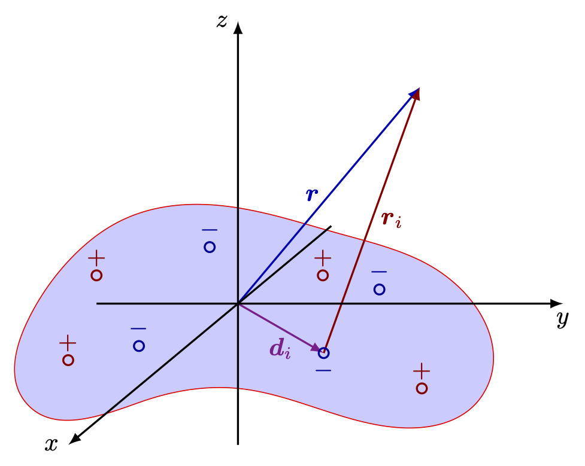{#fig-FLP_2_6_7 width=400}

정전 포텐셜 $\Phi(\bf{r})$ 은 다음과 같다.

$$
\Phi (\bf{r}) = \dfrac{1}{4\pi\epsilon_0} \sum_i \dfrac{q_i}{r_i} = \dfrac{1}{4\pi\epsilon_0} \sum_i \dfrac{q_i}{\|\bf{r}-\bf{d}_i\|} 
$$

여기서 $r>d_i$ 라면

$$
\dfrac{1}{\|\bf{r}-\bf{d}_i\|} = \dfrac{1}{r}\sum_{n=0}^\infty \left(\dfrac{d}{r}\right)^n P_n (\cos\theta)
$$

이며 $Q=\sum_i q_i$, $\bf{p} = \sum_i q_i \bf{d}_i$ 라고 하면 

$$
\Phi (\bf{r}) = \dfrac{1}{4\pi\epsilon_0} \left(\dfrac{Q}{r} +  \dfrac{\bf{p \cdot r}}{r^3} + \cdots \right)
$$

이다 위 식에서 첫번째 항은 전하 분포 전체를 하나의 점전하로 간주하는것이다. 총 전하량이 $0$ 이라면 $Q=0$ 이므로 포텐셜에 기여하지 않는다. 두번째 항은 전체 전하분포에서 기안하는 쌍극자 항이다. 따라서 $\bf{p}=\sum_i q_i \bf{d}_i$ 를 이 전하 분포의 쌍극자 모멘트라고 부르며

$$
\Phi_d (\bf{r})= \dfrac{1}{4\pi\epsilon_0}\dfrac{\bf{p\cdot r}}{r^3}
$$

을 쌍극자 포텐셜 이라고 부른다. 먄약 $Q=0$ 이라면 쌍극자 포텐셜이 가장 주도적인 포텐셜이 되며 $r$ 이 클수록 더욱 그러하다.

 

### II.6-6 대전된 도체에 의한 전기장 {#sec-FLP_2_6_6}

지금까지는 전하의 분포를 아는 상태에서 포텐셜이든 전기장이든 계산 할 수 있었다. 만약 전하 $Q$ 가 도체에 대전되어 있다고 생각해보자. 우리는 정확히 전하가 어떻게 분포하는지 못하며 단지 표면이 등전위면이 되도록 표면에만 분포한다는 것을 안다. 표면이 등전위면이 되지 않는다면 전기장이 $0$ 이 아니며 내부의 자유전하가 힘을 받아 표면이 등전위면이 될 때 까지 이동하게 된다. 

우리가 표면 전하 분포를 계산하려면 우선 표면 전하 분포를 예상하고 이에 대해 풀어보고 표면이 등전위면이 되지 않는 다면 다른 전하분포를 이용하여 풀어보는, 매우 지루하고 어쩌면 가망 없는 trial and error 과정을 반복해야 한다. 컴퓨터의 도움을 받을 수도 있지만 만약 도체의 분포가 복잡하다면 매우 지루하고 복잡한 과정이 된다. 그러나 몇가지 경우에는 매우 실용적으로 구할 수 있다.

 

### II.6-7 영상법 {#sec-FLP_2_6_7}

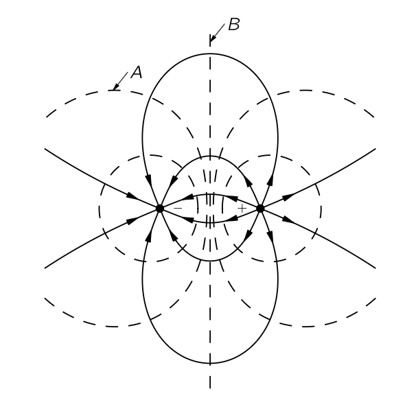{#fig-FLP_2_6_8 width=350}

위 그림은 두 점전하에 의한 전기장과 등전위면을 보여준다. 등전위면 $A$ 를 생각하자. 등전위면 $A$ 와 같은 모양이 되도록 금속 박판을 가공하여 $A$ 의 위치에 맞추고 $A$ 에서의 전위와 같은 전위를 걸어준다고 하자. 동시에 왼쪽의 $-$ 전하를 제거한다. 그렇다면 금속 박판 외부의 상황은 금속 박판 설치 이전의 상황과 전혀 달라지는것이 없다. 수학적으로도 증명할 수 있는데 이는 [도체에서의 경계값 문제](https://julia-kaeri.github.io/ClassicalPhysics/src/Electrodynamics/02_2_electrostatics2.html#sec-ED_ES_boundary_value_problem_in_conductors) 를 보라. 일단 경계값을 만족하는 포텐셜을 찾기만 하면 그것은 만족하는 라플라스 방정식의 해는 유일하다는 것이 보장된다. 

 

### II.6-8 도체 평면 근처의 점전하 {#sec-FLP_2_6_8}

::: {#exm-FLP_image_method_plane}

#### 도체 평면 근처의 전하

::: {#fig-FLP_image_method_plane layout-ncol=2}

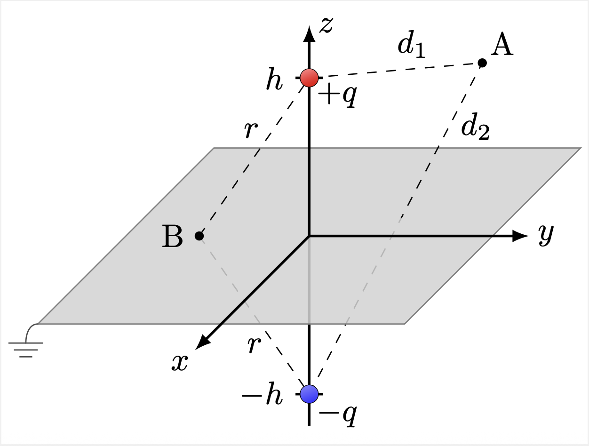{#fig-FLP_image_method_plane_config}

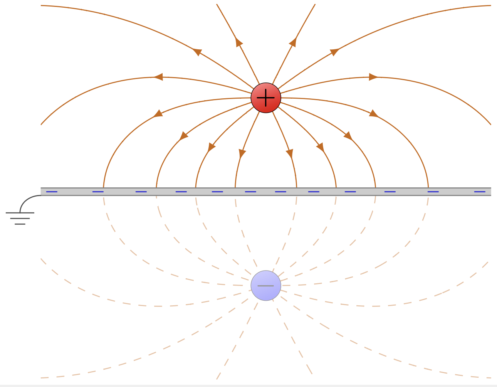{#fig-FLP_image_method_plane_field}

도체 평면 근처의 전하와 거울 전하
:::

위의 그림 ($a$) 와 같이 $(0,\,0,\,h)$ 좌표에 $+q$ 의 전하가 $xy$ 평면상의 도체 평면과 함께 위치한다고 하자. 도체 평면은 접지되어 $\Phi_{\text{conducting plane}}=0$ 이다. 이 대 가상의 거울 전하 $-q$ 를 $(0,\,0,\,-h)$ 에 위치시키고 도체 평면을 무시했을 때의 포텐셜은 아래와 같다.

$$
\Phi (x,\,y,\,z) = \dfrac{1}{4\pi\epsilon_0}\left[\dfrac{+q}{\sqrt{x^2+y^2+(z-h)^2}} +\dfrac{-q}{\sqrt{x^2+y^2+(z+h)^2}} \right].
$$

$\Phi (x,\,y,\,z=0)=0$ 이므로 도체 평면상의 경계조건을 만족한다. 다만 이것은 $z\ge 0$ 인 영역에 대해서만 성립하며 $z\le 0$ 인 영역에서는 성립하지 않는다. 도체 표면의 전하 분포를 계산해 보자. 우선

$$
E_z(x,\,y, z>0) = -\dfrac{\partial \Phi}{\partial z}= \dfrac{q}{4\pi\epsilon_0}\left[\dfrac{z-h}{\|\bf{r}-h\hat{\bf{z}}\|^3}- \dfrac{z+h}{\|\bf{r}+h\hat{\bf{z}}\|^3}\right]
$$

이며 $E_z(x,\,y,\,z=0^-) = 0$ 이므로 도체 표면에 유도되는 표면 전하 $\sigma$ 는 아래와 같다.

$$
\sigma=\epsilon_0 E_z(x,\,y,\,z=0^+) = -\dfrac{q}{2\pi}\dfrac{h}{(x^2+y^2+h^2)^{3/2}}.
$$

이 전하 분포는 원점에서 가장 밀집되어 있으며 유도된 총 전하량은 다음과 같다.
$$
Q_{\text{total induced}} = \int \sigma \,dxdy = -q.
$$

외부의 전하에 의해 도체에 유도되는 전하의 총합이 외부의 전하와 크기가 같다는 것은 모든 거울 영상법에서 공통적인 사실이다. 또한 전하 $+q$ 는 유도된 표면전하에 의해 원래의 전하 $+q$ 가 힘을 받으며 당연히 그 힘은 아래와 같다.

$$
\bf{F} = -\dfrac{q^2}{4\pi\epsilon_0}\dfrac{}{4h^2}\hat{\bf{z}}
$$ {#eq-FLP_2_6_30}

:::

 

### II.6-9 대전된 구 근처의 점전하 {#sec-FLP_2_6_9}

::: {#exm-FLP_image_method_sphere}

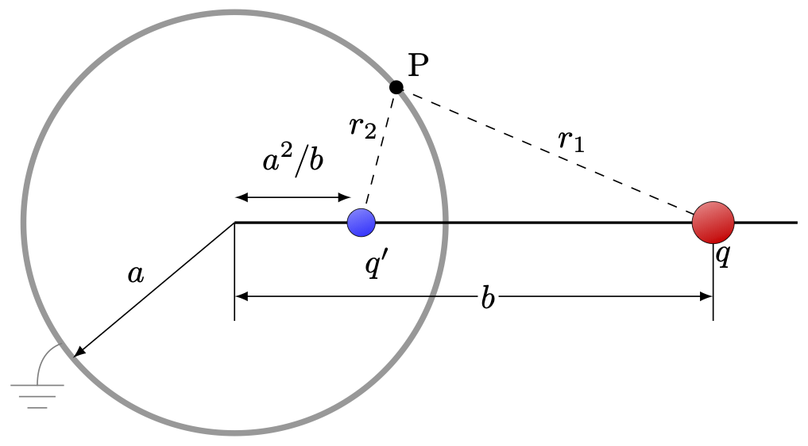{#fig-FLP_image_sphere width=350}

위의 그림과 같이 반지름 $a$ 인 접지된 도체 구 밖에 도체 구의 중심으로부터 거리가 $b$ 인 지점에 전하 $q$ 가 위치했을 때의 구 밖에서의 정전 포텐셜을 영상법을 이용하여 구할 수 있다. 우선 3차원에서 구는 두 점으로부터 거리의 비가 일정한 점들의 집합임을 보이자. 원점과 $(d,0,0)$ 사이의 거리의 비가 $1:c$ 인 점의 집합은

$$
c^2(x^2+y^2+z^2) = (x-d)^2+y^2+z^2
$$

이며 이는

$$
\left(x- \dfrac{d}{c^2-1}\right)^2 + y^2+z^2 =  \dfrac{c^2d^2}{(c^2-1)^2}
$$

이므로 구의 방정식이다. 

점지되어 있으므로 표면에서의 전위가 0 이다. 이제 구의 중심과 외부 전하를 잇는 직선상에 가상전하 $q'$ 을 놓고 구의 중심으로부터의 정전 포텐셜을 계산해 보자. 

$$
\Phi(P) = \dfrac{1}{4\pi\epsilon_0} \left(\dfrac{q}{r_1} + \dfrac{q'}{r_2}\right)
$$

구의 표면에서 포텐셜이 $0$ 이어야 한다. 이를 풀면 구의 중심으로부터 $a^2/b$ 의 위치에 $q'=-q(a/b)$ 의 전하를 놓으면 원점으로부터 반경 $a$ 인 구의 표면의 전위가 $0$ 이 됨을 알 수 있다. 

**도체 표면에서의 정전 포텐셜이 $0$ 이 아닌 경우** : 접지는 전위를 $0$ 으로 고정시므로 이 경우 도체 구는 접지되어 있지 않아야 한다. 그리고 도체의 총 알짜 전하가 $0$ 이어야 하므로 구의 중심에 $q''=-q$ 인 가상전하를 위치시키면 된다. 그렇게 되면 구와 점전하 $q$ 사이에 인력이 작용할 것임을 알 수 있다. 그 원인은 무엇일까? 양전하를 구에 접근시키면, 양전하는 음전하를 끌어당기고 먼 쪽 표면에는 양전하만 남는다. 이 음전하에 의한 인력이 양전하에 의한 반발보다 크기 때문에 전체적으로 인력이 존재한다. $q'$ 와 $q''$ 에 의해 생성된 장에서 $q$ 에 작용하는 힘을 계산함으로써 인력이 얼마나 큰지 알 수 있다. 알차힘은 거리 $b−(a^2/b)$에서 $q$와 전하 $q'=−(a/b)q$ 사이의 인력과 거리 $b$ 에서 전하 $q'''=+(a/b)q$ 사이의 반발력의 합이다.

:::

 

### II.6-10 평행판 축전기 {#sec-FLP_2_6_10}

::: {#exm-FLP_parallel_plate_condensor}

#### 평행판 축전기에서의 전하와 전위차

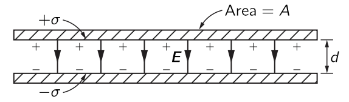{#fig-FLP_fig_2_6_12 width=350}

이제 다른 종류의 문제를 풀어보자. 위의 그림과 같이 면적이 $A$ 인 넖은 도체 판 2개가 거리 $d$ 만큼 떨어져 평행하게 위치해 있고 각각의 판에 $+\sigma,\,-\sigma$ 의 표면전하밀도를 갖는다고 하자. 도체 판이 각각 $\Phi_+,\,\Phi_-$ 의 정전 포텐셜을 갖는다면 전위차 $V = \Phi_+-\Phi_0$ 를 생각 할 수있다. 두 판 사이에는 균일한 전기장 $E$ 가 존재하며

$$
V=Ed=\dfrac{\sigma}{\epsilon_0}d = \dfrac{d}{\epsilon_0 A}Q
$$ {#eq-FLP_6_33}

여기서 $Q$ 가 양전하로 대전된 판의 총 전하량이며 따라서 $-Q$ 가 음전하로 대전된 판의 총 전하량이 된다. 

:::

 

@eq-FLP_6_33 에서 $V$ 는 $Q$ 에 비례하는데 이는 떨어져 있으며 한쪽에 $+Q$ 다른 한쪽에 $-Q$ 만큼의 전하가 대전된 두 도체 사이에 항상 존재하는 관계이다. [정전기 문제의 유일성 정리](https://julia-kaeri.github.io/ClassicalPhysics/src/Electrodynamics/02_1_electrostatics1.html#sec-ED_ES_uniqueness_theorem_for_electrostatics) 를 참고하라. 이 비례관계를 $Q=CV$ 라고 표현할 때 $C$ 를 **전기용량(capacitance)** 이라고 한다. 즉 평행한 금속판의 전기용량 $\epsilon_0 A/d$ 이다. 물론 이 식은 근사식인데 평행판의 끝단에서는 전기장이 균일하지 않기 때문이다. 

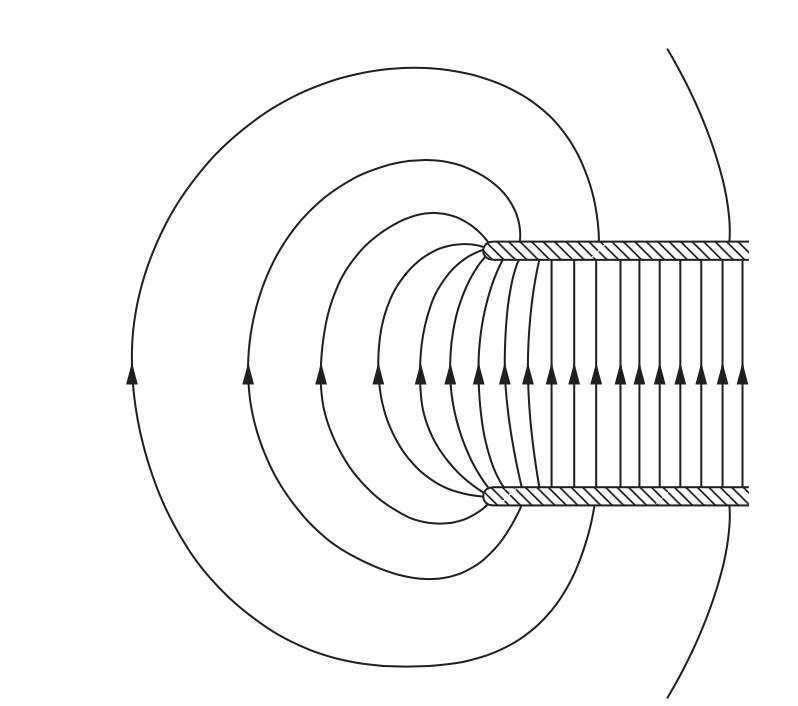{#fig-FLP_fig_2_6_13 width=350}

도체에 전하가 분포할 때 위의 그림과 같이 뾰족한 부분이 있다면 그 근처에서 전하 밀도가 더 높게 나타난다. 

 

### II.6-11 고전압 붕괴 {#sec-FLP_2_6_11}

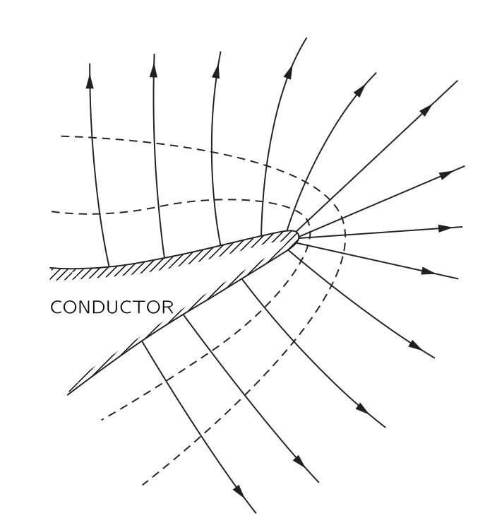{#fig-FLP_fig_2_6_14 width=350}

$\bf{E}=-\nabla \Phi(\bf{r})$ 임을 생각하면 도체의 뾰족한 부분 근처에서의 전기장의 세기 $\|\bf{E}\|$ 가 그렇지 않은 부분보다 크다는 것을 알 수 있다. 가우스 법칙을 생각하면 뾰족한 부분의 표면 전하 밀도가 더 높다는 것을 알 수 있다. 

이를 쉽게 확인할 수 있다. 아래와 같이 크기가 다른 두 금속공이 금속 실로 연결되어 있다고 하자. 

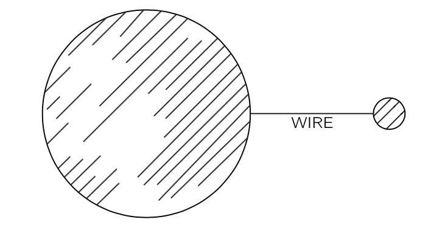{#fig-FLP_fig_2_6_15 width=350}

실에 의한 효과는 두 금속공의 전위가 일치시키는 것으로 이것을 제외하면 무시 할 수 있다. 우선 큰 공에 대전된 전하를 $Q$ 라고 하고 반지름을 $a$ 라고 하면 큰 공의 표면의 정전포텐셜 $\Phi_1 = (1/4\pi\epsilon_0)(Q/a)$ 이며, 작은공에 대전된 전하를 $q$ 라고 하고 반지름을 $b$ 라고 하면 작은 공의 표면의 정전포텐셜 $\Phi_2 = (1/4\pi\epsilon_0)(q/b)$ 이다. $\Phi_1=\Phi_2$ 이므로 $Qb=qa$ 의 관계를 얻는다.

이제 큰 공의 바로 밖의 전기장 $E_a$ 와 작은공 바로 밖의 전기장 $E_b$ 는

$$
\dfrac{E_a}{E_b}=\dfrac{Q/a^2}{Q/b^2} = \dfrac{b}{a}
$$ {#eq-FLP_2_6_35}

이다. 즉 $E_a< E_b$ 이다. 

이 결과는 기술적으로 매우 중요한데 왜냐하면 전기장이 너무 클 경우 공기가 붕괴되기 때문이다다. 공기 중 어딘가에 있는 느슨한 전하(전자 또는 이온)가 자기장에 의해 가속되고, 자기장이 매우 크면 전하가 다른 원자에 충돌하기 전에 충분한 속도를 올려 그 원자에서 전자를 떨어뜨릴 수 있다는 것입니다. 그 결과, 점점 더 많은 이온이 생성됩니다. 그들의 움직임은 방전 또는 불꽃에 해당합니다. 물체를 높은 전위까지 충전하고 공기 중의 스파크에 의해 방전되지 않도록 하려면, 표면이 매끄럽도록 해야 하며, 그 영역이 비정상적으로 넓은 영역이 존재하지 않도록 해야 합니다.

 

## II.7 다양한 상황에서의 전기장 2

### II.7-1 전기장을 계산하는 방법 {#sec-FLP_2_7_1}

우리는 6 장에서 다양한 상황에서의 전기장을 계산하는 법을 알았으며, 이장에서는 특히 도체에 대한 문제를 해결하기 위한 보다 정교한 방법을 알아본다. 정해진 전하의 분포에서는 전기장 혹은 정전 포텐셜 문제는 근본적으로 적분 문제이다. 그러나 도체가 있을 경우 전하는 표면에만 분포하며 도체 표면이 등전위면을 이룬다는 사실만 알 수 있다. 이런 문제를 풀기 위해 영상법과 같은 간접적인 방법을 사용하기도 한다. 그러나 우리가 풀고자 하는 문제가 영상법과 같은 방식을 적용할 수 없다면 직접 풀어야 한다. 즉 주어진 경계 조건에서의 라플라스 방정식

$$
\nabla^2 \Phi = 0
$$ {#eq-FLP_2_7_1}

을 풀어야 한다. 이 방정식은 오랬동안 연구되었지만 아주 간단한 몇가지 경우를 제외한다면 수치해석적으로 풀어야 한다. 경계값 문제는 물리적으로 유사한 대상에 대한 측정으로도 해결될 수 있다. 라플라스 방정식은 정상 상태의 열 흐름, 비회전성 유체 흐름, 확장된 매질에서의 전류 흐름, 그리고 탄성 막의 변형 등 다양한 물리적 상황에서 발생하므로 우리가 해결하고자 하는 전기 문제와 유사한 물리 모델을 자주 설정할 수 있다. 모델에 적절한 유사한 물리량을 측정함으로써, 관심 있는 문제에 대한 해를 얻을 수 있다. 예를 들면 정전기학에서 2차원 문제를 해결하기 위해 전해 탱크를 사용하는 것이다. 이것은 균일한 전도성 매질에서의 전위에 대한 미분 방정식이 진공의 경우와 동일하기 때문에 작동한다.

만약 한 방향에 대해 물리적 장의 변화가 없거나 거의 없는 경우 문제를 2차원 문제로 바꿀 수 있으며, 2차원 문제는 일반적으로 3차원 문제보다 훨씬 쉽다. 

 

### II.7-2 2차원 장;복소 함수 {#sec-FLP_2_7_2}

$F:\C \to \C$ 함수는 함수의 값을 실수부와 허수부로 나누어 다음과 같이 표현 할 수 있다.

$$
F(\zeta=x+iy) = U(x,\,y) + iV(x,\,y).
$$ {#eq-FLP_2_7_4}

여기서 $U(x,\,y),\, V(x,\,y)$ 는 실함수이다. 그리고 $F$ 가 미분가능하다는 것과 다음 조건은 동치이다.

$$
\dfrac{\partial U}{\partial x} = \dfrac{\partial V}{\partial y},\qquad \dfrac{\partial V}{\partial x} = - \dfrac{\partial U}{\partial y}.
$$ {#eq-FLP_2_7_7}

즉

$$
(\nabla U) \bf{\cdot} (\nabla V)=0
$$ {#eq-FLP_2_7_7_ex}

이다. 이로부터 $U(x,\,y)=C$ 와 $V(x,\,y)=D$ 에 대한 등위곡선(level curve) 가 만날 때 접점에서의 기울기는 서로 수직이라는 것을 알 수 있다. 또한 $U,\,V$ 가 2차원에서의 라플라스 방정식을 만족한다는 것을 알 수 있다.

$$
\dfrac{\partial^2 U}{\partial x^2} + \dfrac{\partial^2 U}{\partial y^2} = \dfrac{\partial^2 V}{\partial x^2} + \dfrac{\partial^2 V}{\partial y^2} =0.
$$ {#eq-FLP_2_7_9}

현대 수학에서는 어떤 열린 집합에서 미분가능한 복소함수를 **정칙 함수 (holomorphic)** 라고 하고 전체 복소수에서 미분가능한 복소함수를 **전해석 함수 (entire function)** 이라고 한다. 예를 들어

$$
F(\zeta) = \zeta^2 = (x^2-y^2) + i(2xy)
$$

는 전해석 함수이다. 여기서 $x^2+y^2=A,\, 2xy=B$ 로 놓고 그린 등위 곡선은 아래 그림과 같다.

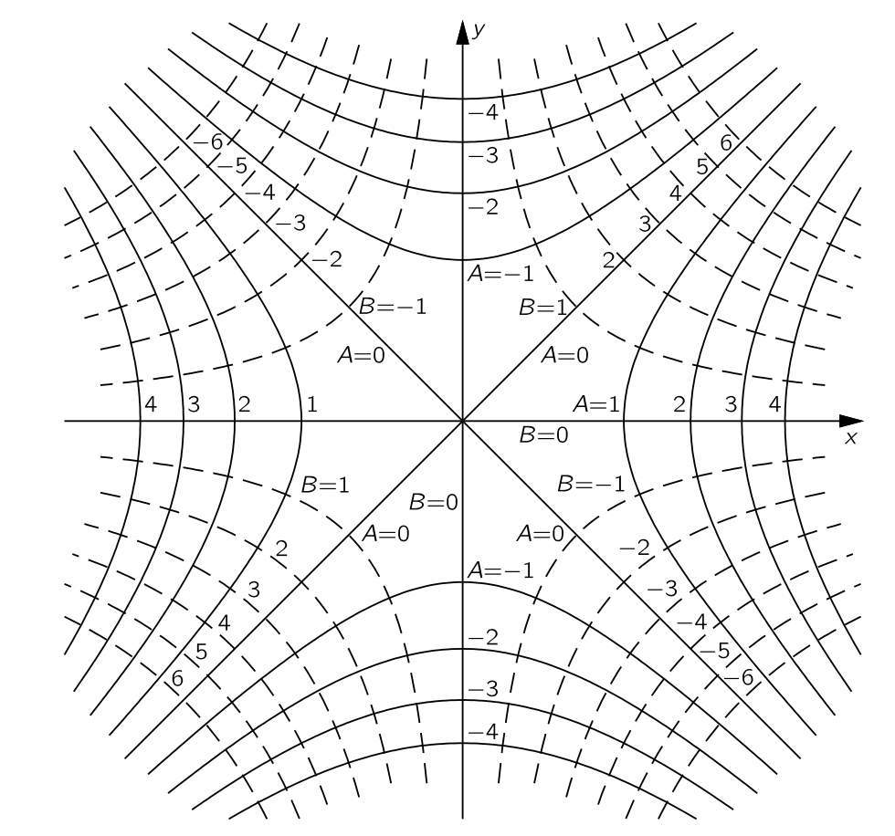{#fig-FLP_2_7_1 width=400}

$A=0$ 일 때는 $y=x,\,y=-x$ 이며 $2xy=B$ 는 각각의 $B$ 값에서 $A=0$ 인 곡선에 수직하다. 직각으로 꺾인 $A=0$ 인 모양의 금속판(@fig-FLP_2_7_2 의 C 근처)에 대해 $B$ 는 금속판 근처에서의 전기장 $\bf{E}$ 의 흐름을 보여주며 $A\ne 0$ 은 등전위면의 모양을 보여준다.

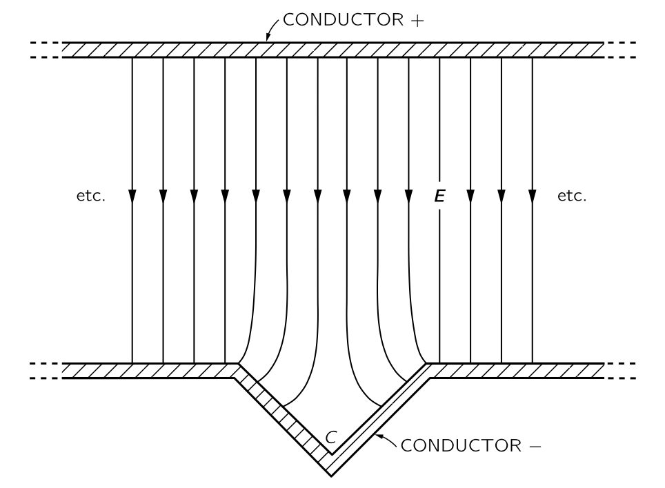{#fig-FLP_2_7_2 width=400}

혹은 아래 그림(@fig-FLP_2_7_3)과 같이 쌍곡선 모양의 금속판과 여기에 가해진 정전 포텐셜에 대해 전기장 흐름을 보여준다.

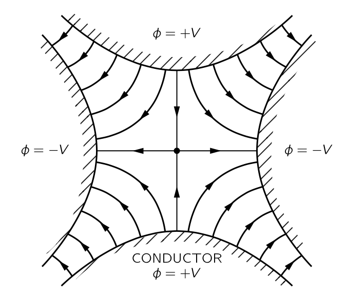{#fig-FLP_2_7_3 width=300}

 

### II.7-3 플라즈마 진동 {#sec-FLP_2_7_3}

이제 전기장이 고정된 전하나 도체의 표면전하 둘중 하나에 의해 결정되는 것이 아니라 두가지의 결합에 의해 결정되는 물리적 상황을 생각한다. 다시 말해, 그 장은 두 개의 방정식 ($1$) 전기장과 전하 분포를 연결하는 전기정역학의 방정식과 ($2$) 전기장이 존재할 때 전하의 위치 또는 운동을 결정하는 물리학의 다른 분야에서 도출된 방정식의 동시 적요에 의해 결정된다.

::: {#exm-FLP_plasma_oscillation}

#### **1차원 플라즈마 진동**

이온들과 전자들이 기체상태로 있는 것을 플라즈마라고 한다. 예를 들어 지구 상공 약 60~1,000 km 에 위치한 전리층(이온층, Ionosphere)은 태양 복사 에너지에 의해 대기 기체가 이온화되어 양이온과 자유전자가 밀집된 플라즈마 상태이다. 

전기적으로 중성인 플라즈마에서 평행상태일 때의 양전하 및 음전하의 밀도를 $n_0$ 라고 하자. 만약 한 지역의 전자밀도가 증가하면 그들이 서로 밀어내므로 원래의 위치로 돌아가려 하겠지만 원위치에서 운동에너지를 가지고 있기 때문에 평형 위치에 멈추지 않고 더 진행한다. 즉 이 전자들은 진동하게 된다. 상황은 음파(sound wave) 와 비슷하다. 

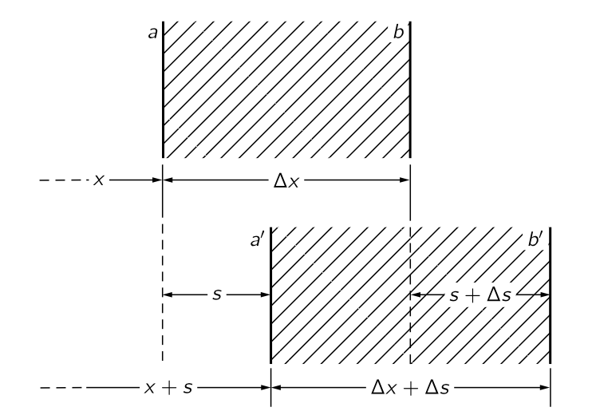{#fig-FLP_2_7_6 width=350}

여기서는 1차원 플라즈마 진동에 대해서만 다루기로 하자. 전자가 $x$ 방향으로만 움직인다고 하자. 시간 $t$ 에서 전자들이 평형 위치인 $x$ 에 있다가 $s(x,\,t)$ 만큼 이동했다고 하자. 상황은 @fig-FLP_2_7_6 와 같다. 

$a,\,b$ 두 평면상에 위치한 전자가 $a',\,b'$ 평면상으로 움직였다고 하자. 평형상태의 전자의 1차원 밀도를 $n_0$ 라고 하면 전자의 갯수는 $n_0\Delta x$ 이며 이동한 상황에서의 전자 밀도는 다음과 같다.

$$
n = \dfrac{n_0 \Delta x}{\Delta x + \Delta s} = \dfrac{n_0}{1+(\Delta s/\Delta x)}.
$$ {#eq-FLP_2_7_16}

이다. $\Delta s\Delta x \ll 1$ 이면 위식은 아래와 같이 근사 할 수 있다.

$$
n=n_0 \left(1-\dfrac{\Delta s}{\Delta x}\right).
$$ {#eq-FLP_2_7_17}

여기서 양전하의 밀도는 $n_0$ 이며, 각각의 전자의 전하를 $-q_e$ 라고 하면 전하밀도는

$$
\rho = -(n-n_0)q_e = n_0 q_e \dfrac{ds}{dx}
$$ {#eq-FLP_2_7_18}

이다. 멕스웰 방정식 $\nabla \bf{\cdot E} = \rho/\epsilon_e$ 에 의해

$$
\dfrac{\partial E_x}{\partial x} = \dfrac{n_0 q_e}{\epsilon_0}\dfrac{\partial s}{\partial x}
$$

이므로

$$
E_x = \dfrac{n_0 q_e}{\epsilon_0} s + K,\text{where }K=\text{constant.}
$$

이다. 여기서 $s=0$ 일 때 $E_x=0$ 이어야 하므로 $K=0$ 이다. 이 전기장에 의해 전자가 받는 힘은

$$
F_x = -\dfrac{n_0 q_e^2}{\epsilon_0}s
$$

이므로 전자는 

$$
\omega_p = \sqrt{\dfrac{n_0 q_e^2}{m_e\epsilon_0}}
$${#eq-FLP_2_7_25}

의 각진동수를 갖는 단순조화진동을 한다. 여기서 $m_e$ 는 전자의 질량이며 $\omega_p$ 를 **플라즈마 진동수 (plasma frequency)** 라고 한다. 즉 플라즈마의 교란이 전자의 평형 위치에 대해 각진동수 $\omega_p$ 인 자유 진동을 일으키며, 이는 전자 밀도의 제곱근에 비례한다. 플라즈마 전자는 $I$ 권 23 장에서 설명한 것과 같은 공명 시스템처럼 행동한다.

:::

#### **플라즈마의 공명의 효과**

**1**. 전리층을 통해 전파를 보낼 때 그 주파수가 플라즈마 주파수보다 높을 때만 침투할 수 있다. 그렇지 않으면 신호가 다시 반사된다. 우주에서 위성과 통신하려면 고주파를 사용해야 하는 반면에, 지평선 너머의 라디오 방송국과 통신하고자 한다면, 신호가 지구로 반사되도록 플라즈마 주파수보다 낮은 주파수를 사용해야 한다.

**2**. 금속은 양이온과 자유 전자로 이루어진 플라즈마로 간주 할 수 있다. 밀도 $n_0$ 가 매우 높으므로 $\omega_p$ 도 매우 크지만 여전히 전자 진동을 관찰할 수 있어야 한다. 양자역학에 따르면, 자연 주파수 $\omega_p$ 를 가진 조화 진동자의 에너지 준위는 $\hbar \omega_p$ 만큼 간격이 있다. 그렇다면, 예를 들어 알루미늄 호일을 통해 전자를 발사하고 반대편의 전자 에너지를 매우 정밀하게 측정한다면, 전자가 때때로 플라즈마 진동에 $\hbar \omega_p$ 만큼의 에너지를 잃을것으로 예상되며 실제로도 그러하다. 1936년에 처음 실험적으로 관찰된 바에 따르면, 몇 백에서 몇 천 전자볼트의 에너지를 가진 전자는 얇은 금속 호일에서 산란하거나 통과할 때 점프하면서 에너지를 잃는 것으로 나타났다. 그 효과는 1953년까지 이해되지 않았으나 Bohm 과 Pines$^2$ 는 금속 내 플라즈마 진동의 양자 여기로 설명될 수 있음을 보여주었다.[$^2$ For some recent work and a bibliography see C. J. Powell and J. B. Swann, Phys. Rev. **115**, 869 (1959).]{.aside}

 

### II.7-4 전해질 안의 콜로이드 입자 {#sec-FLP_2_7_4}

콜로이드는 1 $\text{nm}$ ~ 1 $\mathrm{\mu m}$ 정도 크기의 입자로 용매에 퍼져 있는 것을 말한다. 전하를 띄지 않은 콜로이드는 큰 덩어리로 응집되는 경향이 있으며, 전하를 띈 콜로이드는 전하 때문에 서로 반발하여 응집되는 경향이 없다. 또한 물에 약간의 염분이 양이온과 음이온으로 분해되어 있는 용액을 전해질이라고 한다. 콜로이드 입자는 보통 양전하를 띄며 따라서 음이온은 콜로이드 입자에 끌리며 양이온은 반발한다.

이제 전해질 속의 콜로이드를 생각하자. 문제를 단순하게 하기 위해 일차원적인 경우만 생각한다. 콜로이드 입자를 원자 크기에 비해 매우 큰 반경을 가진 구라고 생각한다면, 그 표면의 작은 부분을 평면으로 간주할 수 있다. 이온에 의한 전하 분포 $\rho(x)$ 를 생각하자. 1차원 정전 포텐셜 $\Phi$ 는

$$
\dfrac{d^2\Phi}{dx^2} = - \dfrac{\rho}{\epsilon_0}
$$ {#eq-FLP_2_7_28}

를 만족한다. 

이제 정전 포텐셜 $\Phi(x)$ 에서 이온은 어떻게 분포하는가? 이는 통계역학의 원리를 통해 결정할 수 있다. 문제는 통계역학에서 얻어지는 전하 밀도가 @eq-FLP_2_7_28 를 만족하도록 $\Phi$ 를 결정하는 것이다. 통계역학에 따르면 힘장 내 열평형에 있는 입자는 밀도 $n(x)$ 이 다음과 같이 주어지는 방식으로 분포한다.

$$
n(x)=n_0e^{−U(x)/k_BT}
$$ {#eq-FLP_2_7_29}

여기서 $U(x)$ 는 포텐셜 에너지이고 $k_B$ 는 볼츠만 상수이며, $T$ 는 절대 온도이다. 콜로이드 입자의 표면으로부터 $x$ 만큼 떨어진 거리의 양이온이 갖는 포텐셜 에너지 $U(x)=q_e \Phi(x)$ 이며 따라서 양이온의 밀도 $n_+$ 는

$$
n_+(x) = n_0 e^{-q_e \Phi(x)/k_BT}
$$

이다. 같은 방식으로 음이온의 밀도 $n_-$ 를 아래와 같이 구할 수 있다.

$$
n_-(x) = n_0 e^{q_e \Phi(x)/k_BT}.
$$

그렇다면 총 전하 밀도 $\rho$ 는

$$
\begin{aligned}
\rho &= q_e n_+ - q_e n_- = q_e n_0 \left(e^{-q_e \Phi/k_BT} - e^{+ q_e \Phi / k_B T}\right) \\[0.3em]
&= -{2q_en_0}\sinh \left(\dfrac{q_e \Phi}{k_BT}\right)
\end{aligned}
$${#eq-FLP_2_7_30}

이다. @eq-FLP_2_7_28 과 결합하면

$$
\dfrac{d^2\Phi}{dx^2} =  \dfrac{2q_e n_0}{\epsilon_0}\sinh \left(\dfrac{q_e \Phi}{k_BT}\right)
$${#eq-FLP_2_7_31}

이다. 양변에 $2(d\Phi/dx)$ 를 곱한 후 $x$ 에 대해 적분하면, 그리고 적절한 경계 조건에서 해를 구할 수 있지만 우리는 여기서는 $q_e \Phi \ll k_BT$ 인 조건에서만 다뤄보기로 하자. 그렇다면 미분방정식은

$$
\dfrac{d^2\Phi}{dx^2} =  \dfrac{2n_0q_e^2}{\epsilon_0 k_B T} \Phi
$${#eq-FLP_2_7_33}

가 되며 이 미분방정식의 해는 다음과 같다는 것을 안다.

$$
\Phi(x) = A e^{-x/D}+ Be^{x/D},\qquad \text{where }D = \sqrt{\dfrac{\epsilon_0 k_B T}{2n_0 q_e^2}}.
$$

여기서 $x\to \infty$ 조건에서 $\Phi$ 가 최소한 유한한 값을 가져야 하므로 $B=0$ 이다. 즉

$$
\Phi (x) = A e^{-x/D},\qquad \text{where }D = \sqrt{\dfrac{\epsilon_0 k_B T}{2n_0 q_e^2}}.
$${#eq-FLP_2_7_36}

이다. 여기서 $D$ 를 **드바이 길이 (Debey length)** 라고 하며, 전해질 내 큰 하전 입자를 둘러싼 이온층의 두께를 의미하는 값이다. @eq-FLP_2_7_36 는 이온 농도($n_0$)가 증가하거나 온도가 낮아짐에 따라 드바이 길이가 작아진다는 것을 보여준다. 위 식에서 $A$ 는 콜로이드 입자의 표면 전하 밀도 $\sigma$ 를 안다면$^3$[$^3$ 콜로이드의 양전하가 표면에 균일하게 분포하여 콜로이드 내부의 전기장이 마치 금속처럼 0 인것으로 가정하는 듯하다.]{.aside}, 그리고 $E_x = -\partial \Phi/\partial x$ 이므로,

$$
E_x(0) = \dfrac{\sigma}{\epsilon_0} = \dfrac{A}{D}
$$ {#eq-FLP_2_7_37}

이며, 따라서 $A$, 즉 $\Phi(0)$ 는 다음과 같다.

$$
\Phi(0)=A = \dfrac{\sigma D}{\epsilon_0}.
$${#eq-FLP_2_7_39}

평행판 축전기(@exm-FLP_parallel_plate_condensor) 의 @eq-FLP_6_33 과 비교해보면 이 전위차는 거리가 $D$ 인 평행판 축전기의 전위차와 같다는 것을 알 수 있다.

앞서 콜로이드 입자들이 전기 반발에 의해 분리되어 있다고 말했다. 이제 우리는 입자 표면에서 약간 떨어진 전기장이 그 주위에 모이는 이온층에 의해 감소한다는 것을 알게 되었다. 이온층의 두께가 충분히 얇아지면 입자들이 서로 부딪히게 될 가능성이 높기 때문에 콜로이드 입자들이 달라붙고 응고되어 액체에서 침전될 수 있다. 이제 콜로이드에 충분한 소금을 첨가하면 콜로이드가 침전되는 이유를 이해할 수 있으며 이 과정을 **염석** 이라고 한다.

또 다른 흥미로운 예는 소금 용액이 단백질 분자에 미치는 영향이다. 단백질 분자는 길고 복잡하며 유연한 아미노산 사슬입이고 다양한 전하를 가지고 있으며, 때때로 음전하와 같은 순전하가 사슬을 따라 분포하는 경우가 있다. 음전하들의 상호 반발로 인해 단백질 사슬이 늘어난 상태를 유지한다. 또한, 용액에 다른 유사한 사슬 분자가 존재한다면, 동일한 반발 효과에 의해 분리될 것이다. 따라서 액체에 사슬 분자를 현탁시킬 수 있다. 하지만 액체에 소금을 넣으면 현탁액의 특성이 변하게 된다. 용액에 염을 첨가하면 데바이 거리가 감소하고, 사슬 분자들이 서로 가까워지며 또한 꼬일 수 있다. 용액에 충분한 염을 첨가하면 사슬 분자가 용액에서 침전된다. 이와 같은 화학적 효과는 전기적 힘의 관점에서 이해할 수 있는 것이 많이 있다.

 

### II.7-5 격자의 정전기장 {#sec-FLP_2_7_5}

마지막 예시로 전하를 띤 전선 격자 근처에 있는 전기장의 특성을 알아보자. 문제를 가능한 한 간단하게 만들기 위해, 동일한 간격으로 무한히 평행하게 배치된 무한히 긴 도선을 생각하자.

전선 평면 위의 높은 곳에서의 전기장은 일정하며 전선 격자에 접근함에 따라 점점 불균일해진다. 도선에 얼마나 가까워져야 정전 포텐셜의 눈에 띄는 변동이 생기는지 알아보자. @fig-FLP_2_7_8 는 격자로부터 다양한 거리에서의 등전선을 대략적으로 보여준다. 그리드에 가까워질수록 변동이 커지며 그리드와 평행하게 이동할 때 전기장이 주기적으로 변동한다는 것을 볼 수 있다.

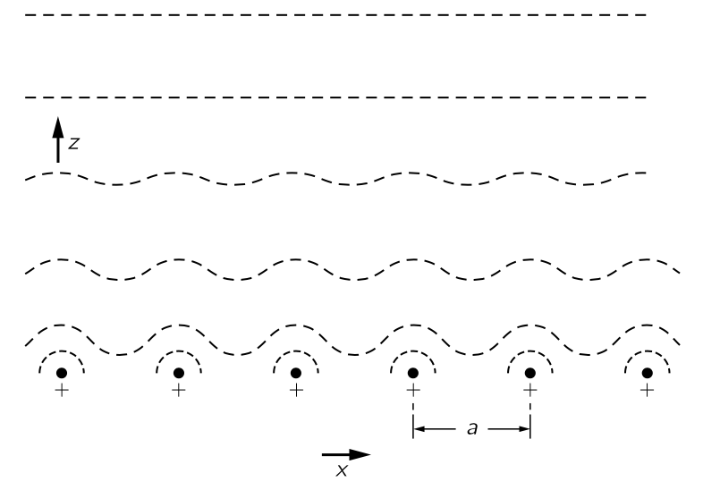{#fig-FLP_2_7_8 width=400}

포텐셜 역시 주기적일 것이므로 우리는 도선의 간격 $a$ 에 대해 포텐셜을 다음과 같이 쓸 수 있다.

$$
\Phi(x,\,z) = \sum_{n=0}^\infty F_n(z) \cos \dfrac{2\pi n x}{a}.
$$ {#eq-FLP_2_7_41}

2차원에서 라플라스 방정식 $\nabla^2 \Phi = 0$ 을 만족해야 하므로 

$$
\left(\dfrac{\partial^2 F_n(z)}{\partial z^2}-\dfrac{4\pi^2 n^2}{a^2} \right) \cos \dfrac{2\pi n x}{a} = 0,\qquad n = 0,\,1,\,2,\ldots
$$ {#eq-FLP_2_7_42}

이어야 한다. 위 미분방정식의 해는 다음과 같다. 

$$
F_n (z) = A_n e^{-z/z_0},\qquad \text{where } z_0 = \dfrac{a}{2\pi n}.
$$ {#eq-FLP_2_7_44}

여기서 $A_n$ 은 경계조건에 의해 결정된다. 이로부터 $n$ 값이 클수록 $z$ 에 대해 급격히 떨어지므로 $a$ 보다 몇배 정도 큰 $z$ 에서는 $n=0$ 인 성분이 지배적이 된다. 즉 $z\gg a$ 일 때 

$$
\Phi(z) \approx -E_0z
$$

이다.

 

## II.8 정전기 에너지

### II.8-1 전하의 정전기 에너지. 균일한 공 {#sec-FLP_2_8_1}
여기서는 정전기계(electrostatic system) 에서의 에너지를 다룬다. 전하 $q_1,\,q_2$ 가 $r_{12}$ 만큼의 거리에 있도록 해줘야 하는 일은 다음과 같다는 것을 안다. 

$$
\dfrac{q_1q_2}{4\pi\epsilon_0 r_{12}}.
$${#eq-FLP_2_8_1}

이것을 두 전하의 분포에 대한 **정전기 에너지 (electrostatic energy)** 라고 한다. 이제 $N$ 개의 전하 $q_1,\ldots,\,q_{N}$ 으로 이루어진 시스템을 만들기 위해 해줘야 하는 일은 이 전하 분포에 대한 정전기 에너지 $U$ 라고 하면 $U$ 는 다음과 같다.

$$
U = \sum_{\text{all pairs}}\dfrac{q_iq_j}{4\pi\epsilon_0 r_{ij}}.
$$ {#eq-FLP_2_8_3}

만약 점전하가 아닌 전하 분포 $\rho$ 가 주어졌다면 @eq-FLP_2_8_3 의 $\sum$ 은 적분으로 바뀐다.

::: {#exm-FLP_electrostatic_energy_of_uniformly_charged_sphere}

#### **균일하게 대전된 구의 정전기 에너지**

균일하게 대전된 반지름 $a$ 인 구의 정전기 에너지를 얇은 구 껍질을 차근차근 쌓아가는 방식으로 계산하자. 균일한 전하 밀도를 $\rho$ 라고 하자. 반지름 $r$ 만큼의 구에 전하가 쌓였을 때 이 반지름을 $r+dr$ 만큼 늘리도록 쌓는데 필요한 에너지 $dU$ 는 다음과 같다.

$$
dU = \dfrac{Q_r dQ}{4\pi\epsilon_0 r}.
$$ {#eq-FLP_2_8_4}

여기서 $Q_r$ 은 반지름 $r$ 인 구의 총 전하량으로

$$
Q_r = \rho \cdot \dfrac{4}{3}\pi r^3
$$

이며 $dQ$ 는 반지름을 $dr$ 만큼 늘리는데 필요한 총 전하로

$$
dQ = \rho \cdot 4\pi r^2 dr
$$

이므로

$$
dU = \dfrac{4\pi \rho^2 r^4\,dr}{3\epsilon_0}
$$

이며 이를 $r=0$ 부터 $r=a$ 까지 적분하면 다음과 같다.

$$
U=\dfrac{4\pi\rho^2 a^5}{15\epsilon_0} = \dfrac{3}{5} \dfrac{Q^2}{4\pi\epsilon_0 a}
$$ {#eq-FLP_2_8_7}

:::

 

### II.8-2 축전기의 에너지. 대전된 도체에 작용하는 힘 {#sec-FLP_2_8_2}

이제 도체를 대전시키기 위해 필요한 에너지를 구해보자. 

::: {#exm-FLP_electrostatic_energy_of_charged_conductor}

#### **대전된 도체의 에너지**

대전된 두 도체, 즉 축전기를 생각하자. 도체 사이의 전위차 $V$ 와 전하 $Q$ 사이에는

$$
V=\dfrac{Q}{C}
$$ {#eq-FLP_2_8_8}

의 관계가 성립한다. $V$ 의 전위차를 유지하며 한쪽 도체의 전하 $dQ$ 를 다른쪽 도체로 이동시키는데 필요한 에너지 $dU = Vdq$ 이다. @eq-FLP_2_8_8 로부터

$$
dU = \dfrac{QdQ}{C}
$$

이며 $dQ$ 를 $0$ 부터 최종 전하 $Q$ 까지 적분하면

$$
U = \dfrac{1}{2}\dfrac{Q^2}{C} = \dfrac{1}{2}CV^2
$$ {#eq-FLP_2_8_9}

이다. 이제 반지름 $a$ 인 도체 구의 전기용량을 생각해보자. $V=Q/C_\text{sphere} = Q/(4\pi\epsilon_0 a)$ 로부터

$$
C_\text{sphere} = 4\pi \epsilon_0 a
$$

임을 안다. @eq-FLP_2_8_9 로부터 대전된 공의 포텐셜 에너지는 다음과 같다.

$$
U_\text{charged sphere} = \dfrac{1}{2} \dfrac{Q^2}{4\pi\epsilon_0 a}
$$ {#eq-FLP_2_8_11}

:::

 

포텐셜 에너지 $U$ 에 대해 $d\bf{r}$ 만큼의 변위가 있을 때

$$
\bf{F} =- \dfrac{\partial U}{\partial \bf{r}}
$$

임을 안다. 양쪽이 전하 $\pm Q$ 로 대전된 평행판 축전기를 생각하자. 

**1. 대전된 전하량 $Q$ 가 일정한 경우**

포텐셜 에너지 $U=\dfrac{Q^2}{2C}$ 와 @exm-FLP_parallel_plate_condensor 의 $C=\epsilon_0 A/d$ 로부터 평행판 축전기의 판이 밭는 힘을 계산 할 수 있다. 판이 $z$ 축에 수직으로 배치되어 있다면

$$
F_z = - \dfrac{\partial U}{\partial z} = - \dfrac{Q^2}{2C^2}\dfrac{dC}{dz}=-\dfrac{Q^2}{2\epsilon_0 A} = -\dfrac{Q\sigma}{2\epsilon_0}
$$

임을 안다. 여기서 $dC/dz = - \epsilon_0 A/d^2$ 이며 $\sigma = Q/A$ 는 평행판의 면전하 밀도이다. 평행판 사이의 전기장 $E_0 = \sigma/\epsilon_0$ 를 생각하면

$$
F_z = -\dfrac{1}{2}Q E_0
$${#eq-FLP_2_8_18}

이다. 놀랍게도 $QE_0$ 가 아닌 그 값의 $1/2$ 인데 그 이유를 살펴보자. 평행판은 금속이며 따라서 전하는 표면에만 존재한다. 평행판 표면에서의 전기장의 크기는 $E_0$ 이고 평행판 내부의 전기장은 $0$ 이다. 즉 전기장은 전하가 존재하는 얇은 표면층 을 통과하면서 $E_0$ 에서 $0$ 으로 급격히 딸어지게 되며 따라서 @eq-FLP_2_8_18 의 결과가 나온다.

**2. 전위차 $V$ 가 일정한 경우**

포텐셜 에너지에 대한 식 가운데 $U=\dfrac{CV^2}{2}$ 를 사용한다. 
$$
F_z = - \dfrac{\partial U}{\partial z} = -\dfrac{V^2}{2}\dfrac{d C}{d z}= \dfrac{C^2V^2}{2\epsilon_0 A}
$${#eq-FLP_2_8_19}

이며 $0$ 보다 크다. 그런데 이것은 틀린 답이다. 포텐셜을 일정하게 유지하면서 가상 변위 $dz$ 만큼 움직이면 $d Q = (dC/dz)V$ 만큼의 전하를 포텐셜 $V$ 가 유지되는 조건에서 추가해야 한다. 이 때 증가하는 포텐셜 에너지가 $(d Q)V= (dC/dz)V^2$ 이며 이는 외부에서 해주는 일이다. 이를 고려하면

$$
F_z = \dfrac{V^2}{2}\dfrac{dC}{dz} = - \dfrac{C^2V^2}{2\epsilon_0 A}<0
$$

이다.

 

### II.8-3 이온 격자에서의 포텐셜 에너지 {#sec-FLP_2_8_3}

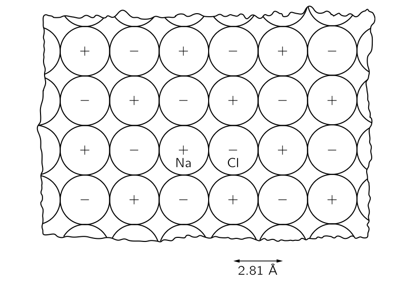{#fig-FLP_2_8_5 width=350}

 

### II.8-4 핵의 정전기 에너지 {#sec-FLP_2_8_4}

 

### II.8-5 전기장의 에너지 {#sec-FLP_2_8_5}

점전하 시스템의 정전기 포텐셜은 @eq-FLP_2_8_3 으로, 즉 모든 가능한 쌍에 대한 정전 포텐셜의 합으로 주어진다. @eq-FLP_2_8_3 은 아래와 같이 쓸 수 있다.

$$
U = \dfrac{1}{2}\sum_i \sum_{j\ne i} \dfrac{q_iq_j}{4\pi\epsilon_0 \|\bf{r}_i-\bf{r}_j\|}
$$

$\sum_i \sum_{j\ne i}[\cdots]$ 는 같은 쌍을 두번 세므로 이를 고려하여 앞의 $1/2$ 항이 필요하다. 그렇다면 전하 밀도에 대한 정전 포텐셜은 어떻게 주어질까? @eq-FLP_2_8_3 은 다음과 같이 변화할 것이다.

$$
U = \dfrac{1}{2}\int_V\int_{V} \dfrac{\rho(\bf{r}_1)\rho(\bf{r}_2)}{4\pi\epsilon_0 \|\bf{r}_1-\bf{r}_2\|} \,d^3\bf{r}_1d^3\bf{r}_2
$$ {#eq-FLP_2_8_27}

이 때 $V$ 는 전체 공간이다. 여기서

$$
\Phi(\bf{r}_1) = \int_V \dfrac{\rho(\bf{r}_2)}{4\pi\epsilon_0 \|\bf{r}_1-\bf{r}_2\|}d^3\bf{r}_2 
$$

이므로

$$
U =  \dfrac{1}{2}\int_V \rho(\bf{r})\Phi(\bf{r})\,d^3\bf{r}
$$ {#eq-FLP_2_8_28}

이 성립한다. $\rho= \epsilon_0 \nabla \bf{\cdot E}$ 와 발산법칙을 이용하여 다음을 보일 수 있다.

$$
\begin{aligned}
U &= \dfrac{1}{2}\int_V \rho(\bf{r})\Phi(\bf{r})\,d^3\bf{r} = \dfrac{1}{2}\int_V \epsilon_0 \left(\nabla \bf{\cdot E}\right)\Phi(\bf{r})\,d^3\bf{r} \\[0.3em]
&= \dfrac{\epsilon_0}{2} \int_V\nabla\bf{\cdot} \left[\Phi\bf{E}\right]\,d^3\bf{r} - \dfrac{\epsilon_0}{2}\int_V (\nabla \Phi)\bf{\cdot}\bf{E}\,d^3\bf{r} \\[0.3em]
&=\dfrac{\epsilon_0}{2}\int_{\partial V} \Phi \bf{E\cdot}\,d\bf{a} + \dfrac{\epsilon_0}{2}\int_V \|\bf{E}\|^2\,d^3\bf{r}.
\end{aligned}
$$

여기서 첫번째 적분항은 $V$ 를 원점을 중심으로 $R\to \infty$ 구를 잡으면 $0$ 이 되므로 포텐셜 에너지는 다음과 같다.

$$
U = \dfrac{\epsilon_0}{2}\int_V \|\bf{E}(\bf{r})\|^2 \,d^3\bf{r}
$$ {#eq-FLP_2_8_30}

우리는 이로부터 에너지 밀도 $u$ 를 정의 할 수 있다.

$$
u = \dfrac{\epsilon_0}{2}\|\bf{E}\|^2 = \dfrac{\epsilon_0 E^2}{2}.
$${#eq-FLP_2_8_31}

 

### II.8-6 점전하의 에너지 {#sec-FLP_2_8_6}

원점에 위치한 점전하 $q$ 에 의한 전기장 $\bf{E}$ 는

$$
\bf{E}= \dfrac{1}{4\pi\epsilon_0}\dfrac{q\bf{r}}{r^3}
$$

이며 에너지 밀도 $u$ 는

$$
u = \dfrac{\epsilon_0 E^2}{2} = \dfrac{q^2}{32\pi^2 \epsilon_0 r^4}
$$

로 점전하에 의한 에너지 $U$ 는 

$$
U = \int_{r=0}^\infty u^2 r^2\,d\Omega dr = -\dfrac{q^2}{8\pi \epsilon_0}\left.\dfrac{1}{r}\right|_{r=0}^{r=\infty}
$$ {#eq-FLP_2_8_36}

이다. 보다시피 $r\to 0$ 에서 발산한다. 우리는 점 전하 사이에만 에너지가 존재한다는 생각으로 시작했지만 @eq-FLP_2_8_30 은 점전하에 의한 전기장에 무한한 양의 에너지가 존재한다고 말한다. 점전하 집합에 대한 에너지 공식에서 @eq-FLP_2_8_3 에서 우리는 전하의 자기 자신과의 상호작용 에너지를 포함하지 않았다. 연속적인 전하 분포에 대한 에너지 계산에서(@eq-FLP_2_8_27) 우리는 모든 무한소 전하와 다른 모든 무한소 전하와의 상호작용 에너지를 계산했다. 동일한 고려가 @eq-FLP_2_8_30 에 포함된다. 따라서 이를 유한한 점전하에 적용할 때 그 전하를 무한소 부분으로부터 조립하는 데 필요한 에너지를 포함하게 된다. @eq-FLP_2_8_11 을 전하를 띤 구의 에너지에 사용하고 $r\to 0$ 극한을 취하면 @eq-FLP_2_8_30 의 결과를 얻게 된다.

우리는 에너지를 장에 위치시칸다는 개념이 점전하의 존재 가정과 일치하지 않는다는 결론을 내려야 한다. 이것을 피하는 한 가지 방법은 전자와 같은 기본 전하가 점이 아니라 매우 작은 전하 분포라고 가정하는 것이다. 다른 방법은 매우 짧은 거리에서의 전기 이론에 문제가 있거나, 에너지의 지역 보존이라는 개념에 문제가 있다고 말하는 것이다. 하지만 두 관점 모두 문제가 있다. 이 문제는 아직까지 극복되지 못한 채 오늘날까지도 존재한다. 이후 전자기장의 운동량과 같은 개념들을 논의할 때, 자연을 이해하는 근본적인 어려움에 대해 보다 나은 설명을 제시할 것이다.