 

## II.10 유전체 {#sec-FLP_2_10}

### II.10-1 유전율 {#sec-FLP_2_10_1} 

패러데이는 평행판 축전기 내부를 부도체로 채웠을 때 전기용량이 증가하는 것을 발견했고 부도체를 **유전체(dielectrics)** 라고 불렀다. 평행판 축전기의 전기용량은 단면적 $A$ 와 평행판 사이의 거리 $d$ 에 대해

$$
C=\dfrac{\epsilon_0 A}{d}
$$ {#eq-FLP_2_10_1}

와 같으며 축전기에 대전되는 전하량 $Q$, 양쪽에 걸리는 전위차 $V$ 에 대해

$$
Q=CV
$$ {#eq-FLP_2_10_2}

의 관계가 성립한다는 것을 안다. 이제 아래 그림과 같이 아크릴이나 유리 같은 부도체를 평행판 축전기 사이에 넣는다면 capacity 가 증가한다는 것을 알게 된다. 그것은 같은 전하가 대전되었을 때 전위차가 낮아진다는 의미이며, 전위차는 전기장에 대한 선적분이므로 전기장이 감소한다는 의미이다.

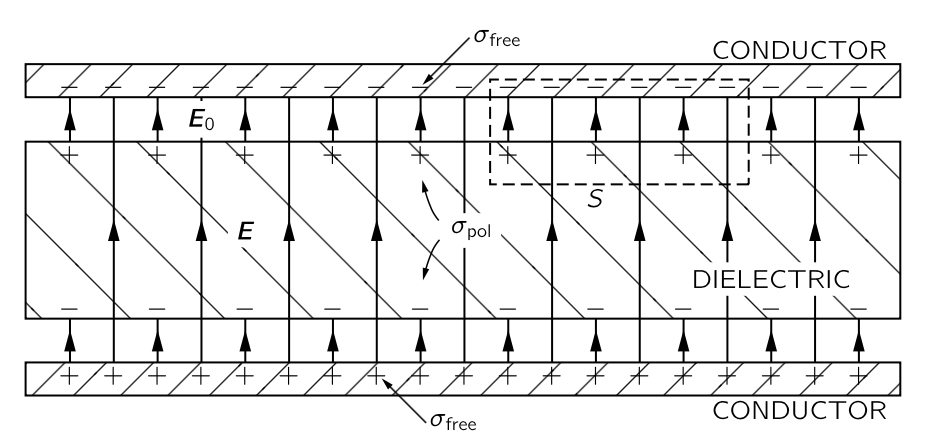{#fig-FLP_2_10_1 width=450}

그리고 가우스 법칙은 전기장의 플럭스는 그것이 둘러싸고 있는 전하량과 직접 관련이 있다고 말한다. @fig-FLP_2_10_1 에서 파선으로 둘러쌓인 표면 $S$ 를 생각하자. 유전체로 인해 전기장이 감소하므로 $S$ 내부의 순전하량은 유전체가 없을 때보다 감소한다는 것을 알 수 있다. 이로부터 내릴 수 있는 유일한 결론은 $S$ 에 포함되는 유전체의 표면에 양의 전하가 모인다는 것이다. 그러나 전기장이 $0$ 이 되지 않기 때문에 유전체 표면의 양의 표면전하 밀도는 평행판 표면의 음의 전하 밀도보다 그 크기가 작다. 따라서 유전체가 전기장 내에 위치할 때 한쪽 표면에 양전하, 다른 표면에 음전하가 유도된다는 것을 이해한다면 유전체에 전기용량의 증가를 이해 할 수 있게 된다.

비교를 위해 아래 그림과 같이 유전체가 아닌 두께 $b (<d)$ 의 금속이 채워져 있는 경우를 생각하자. 

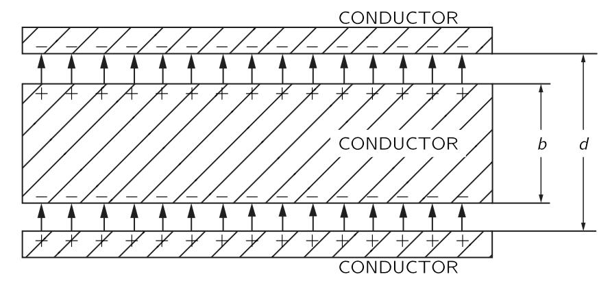{#fig-FLP_2_10_2 width=450}

전기장에 의해 도체 위쪽에는 양전하가, 도체 아래쪽에는 음전하가 모이게 되며 도체 내부의 전기장은 0 이 되어야 한다. 또한 평행판 사이의 도체로 채워지지 않은 부분에서의 전기장은 도체가 없을때의 전기장과 같아야 한다. 이를 통해

$$
V = \dfrac{\sigma}{\epsilon_0}(d-b)
$$

이고

$$
C=\dfrac{\epsilon_0}{d[1-(b/d)]}
$$ {#eq-FLP_2_10_3}

이며 전기용랑은 도체가 없을 때보다 증가한다는 것을 설명 할 수 있다.

유전체 역시 전기용량을 증가시키기 때문에 유전체를 적절한 두께의 도체로 모델링 할 수 있을 지도 모른다. 그러나 이 도체는 특정한 축(평면에 수직한) 을 갖고 있지만 일반적으로 유전체는 그렇지 않다. 그렇다면 우리는 유전체를 부도체 내부에 서로 접촉하지 않는 조그만 금속 공들이 박힌 것으로 모델링 할 수 있다. 이것은 패러데이가 발견한 현상을 설명하기 위한 모델이었다. 유전체의 원자는 금속 공으로 표현되며 유전체의 유전률은 이 금속 공이 전체 유전물질에서 차지하는 비율에 의해 결정된다.

 

### II.10-2 편극 벡터 $\bf{P}$ {#sec-FLP_2_10_2}

위의 분석을 밀고 나아가면 완전 도체나 및 완전 부도체라는 개념이 필수적이지 않다는 것을 알게 된다. 각각의 작은 공은 쌍극자처럼 작용하며, 쌍극자 모먼트는 외부 장에 의해 유도된다. 유전체를 이해하는 데 필수적인 유일한 것은 물질에 유도된 작은 쌍극자가 많이 존재한다는 것이다. 작은 전도 구체로인해 쌍극자가 생기는 것인지, 혹은 다른 어떤 이유 때문인지는 중요하지 않다.

원자가 전도성 구가 아닌 경우 왜 전기장이 쌍극자 모멘트를 유도하는지는 다음 장에서 유전물질의 내부 작동 원리와 함께 다룰 것이다. 그래도 하나의 예를 생각해보자. 원자는 핵에 양전하를 가지고 있으며, 그 핵은 음전자에 둘러싸여 있다 전기장에서는 핵이 한쪽 방향으로, 전자는 반대 방향으로 끌려가게 된다. 전자의 궤도 또는 파동 패턴은 어느 정도 왜곡되어 음전하의 무게중심이 양전하와 일치하지 않게 되는데 이를 **편극 혹은 분극(polarization)** 이라고 한다. 멀리서 보면 이는 작은 쌍극자와 동등하다.

너무 크지 않은 전기장에서 유도된 쌍극자 모멘트의 크기가 전기장에 비례한다는 것이 합리적인 것으로 보인다. 즉, 작은 필드는 전하를 약간 이동시키고, 더 큰 필드는 전하에 비례하여 전하를 더 멀리 이동시킵니다. 이 장의 나머지 부분에서는 쌍극자 모멘트가 전기장에 정확히 비례한다고 가정한다.

이제 우리는 각 원자마다 전하 $q$ 가 변위 $\bf{\delta}$ 만큼 떨어져 있다고 가정한다. 따라서 원자당 쌍극자 모먼트는 $q\bf{\delta}$ 이다. 단위 부피당 $n$ 개의 원자가 있다면, 단위 부피당 쌍극자 모멘트는 $nq\bf{δ}$ 이다. 이 단위 부피당 쌍극자 모멘트를 **편극 벡터 (polarization vector)** 혹은 **편극 밀도 벡터 (polarization density vector)** 라고 하고 $\bf{P}$ 로 표기한다. 즉

$$
\bf{P} = nq\bf{\delta}
$$ {#eq-FLP_2_10_4}

이다. 일반적으로 $\bf{P}$ 는 유전체에서 위치마다 달라지지만 어느 위치에서든 전기장 $\bf{E}$ 에 비례한다. 비례상수는 전자가 이동되는 정도에 따라 즉 물질 내 원자 종류에 따라 달라진다.

이 비례상수가 실제로 어떻게 작용하는지, 매우 큰 전기장에서 얼마나 정확하게 상수인지, 그리고 다양한 물질 내부에서 무슨 일이 일어나고 있는지는 나중에 논의하도록 하자. 현재로서는 전기장에 비례하는 쌍극자 모멘트가 유도되는 메커니즘이 존재한다고 가정한다.

 

### II.10-3 편극 전하 {#sec-FLP_2_10_3}

위에서 언급한 모델이 유전체를 이용한 축전기를 어떻게 설명하는지 알아보자. 우선 단위 부피당 일정한 쌍극자 모멘트가 있는 유전체 시트를 생각하자. $\bf{P}$ 가 균일하다면 평균적인 전하 밀도는 $0$ 이다. 양전하와 음전하가 동일한 평균 밀도를 갖는다면, 양전하와 음전하의 전하 중심이 달라지더라도 부피 내부에 순전하는 발생하지 않는다. 반면에, $\bf{P}$ 가 한 곳에서는 더 크고 다른 곳에서는 작다면, 이는 더 많은 전하가 특정 영역에 상대적으로 몰려 있다는 의미이므로 전하의 부피 밀도를 얻게 된다. 평행판 축전기에 대해서는 $\bf{P}$ 가 균일하다고 가정하므로, 표면에서 발생하는 현상만 생각하면 된다. 한 표면에서는 음전하인 전자가 실질적으로 거리 $\delta$ 만큼 이동했으며, 반대쪽 표면에서는 이동하여 양전하가 실제로 거리 $\delta$ 만큼 멀어진다. @fig-FLP_2_10_5 에 표시된 바와 같이, 우리는 전하의 표면 밀도를 갖게 되며, 이를 **표면 편극 전하 (surface polarization charge)** 라고 한다.

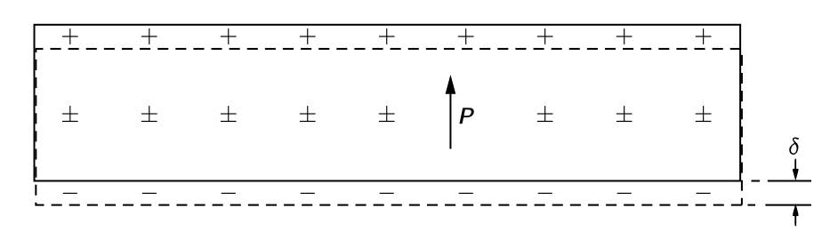{#fig-FLP_2_10_5 width=450}

이 전하를 계산해보자. 판의 면적 $A$ 에 대해 표면에 나타나는 전자의 수는 $nA$ 이며, 변위 $\bf{\delta}$ 는 표면에 수직이라고 가정하자. 총 전하는 전자 전하 $q_e$ 를 곱하여 구한다. 표면에 유도된 편극 전하의 표면 밀도를 얻기 위해, $A$ 로 나누면 표면 전하 밀도의 크기는

$$
\sigma_\text{pol}=n q_e \delta
$$

이며 이것은 $\bf{P}$ 의 크기 $P$ 와 동일하다(@eq-FLP_2_10_4).

$$
\sigma_\text{pol}=P.
$$ {#eq-FLP_2_10_5}

즉 전하의 표면 밀도는 물질 내부의 편극과 같다. 표면 전하는 한쪽 표면에서는 양전하이고 반대쪽 표면에서는 음전하이다.

이제 우리 슬래브가 평행판 축전기의 유전체라고 가정하자. 축전기의 평행판의 표면전하 밀도를 $\sigma_\text{free}$ 라고 하자. 이 전하는 우리가 충전기를 충전할 때 가하는 전하로 도체 어디에서든 자유롭게 움직일 수 있다. $\sigma_\text{pol}$ 은 $\sigma_\text{free}$ 가 존재할때만 존재한다. 충전기를 방전시켜 $\sigma_\text{free} = 0$ 이 되면, $\sigma_\text{pol}$ 은 방전된 전선으로 나가는 것이 아니라 물질 내부의 편극이 이완되어 사라진다.

이제 우리는 @fig-FLP_2_10_1 에 있는 가우스 표면 $S$ 에 가우스 법칙을 적용할 수 있다. 유전체의 전기장 $\bf{E}$ 는 전체 표면 전하 밀도를 $\epsilon_0$ 로 나눈 값과 같다. $\sigma_\text{pol}$ 과 $\sigma_\text{free}$ 가 서로 반대되는 부호를 가지고 있다는 것이 명백하므로

$$
E=\dfrac{\sigma_\text{free}−\sigma_\text{pol}}{\epsilon_0}
$$ {#eq-FLP_2_10_6}

이다. 금속판과 유전체 표면 사이의 전기장 $E_0 = \sigma_\text{free}/\epsilon_0$ 가 $E$ 보다 크다. 유전체가 평행판 사이의 공간을 거의 다 채운다면, $E$ 는 거의 전체 부피에 걸친 전기장이다. 식 @eq-FLP_2_10_5 를 통해 

$$
E=\dfrac{\sigma_\text{free}−P}{\epsilon_0}
$$ {#eq-FLP_2_10_7}

임을 안다. $P$ 를 모르면 전기장을 알 수 없다. 하지만 여기서는 $P$ 가 $E$ 에 의존한다고 가정하고 있으며 실제로는 그것이 $E$ 에 비례한다. 

$$
\bf{P}=\chi \epsilon_0 \bf{E}.
$$ {#eq-FLP_2_10_8}

상수 $\chi$ 를 유전체의 **전기 감수율(electric susceptibility)** 라고 한다. 그렇다면 @eq-FLP_2_10_7 은

$$
E=\dfrac{\sigma_\text{free}}{\epsilon_0}\dfrac{1}{1+χ}
$$ {#eq-FLP_2_10_9}

이 된다. 축전기의 총 전하는 $\sigma_\text{free}A$ 이므로 @eq-FLP_2_10_2 로부터 

$$
C= \dfrac{\epsilon_0 A(1+\chi) }{d} = \dfrac{\epsilon A}{d}
$$

이다. 여기서 $\epsilon = (1+\chi)\epsilon_0$ 를 이 유전체의 **유전률 (electric permittivity)** 이라고 하고

$$
\epsilon_r := \dfrac{\epsilon}{\epsilon_0}
$$ {#eq-FLP_2_10_11}

를 **유전 상수 (dielectric constant)** 혹은 **상대적 유전률(relative permittivity)** 라고 한다$^1$.[$^1$ 자료에 따라 $\epsilon_r$ 이 아니라 $\epsilon_r$ 를 쓰는 경우도 있다.]{.aside}

이제 편극 $\bf{P}$ 가 모든 곳에서 동일하지 않은 상황을 생각하자. 이 경우 앞서 언급했듯이 부피 전하 밀도가 존재한다. 물질이 편극될 때 가상의 표면을 가로질러 이동하는 전하의 양은 편극이 표면에 수직일 경우 표면적의 $P$ 배에 이며 편극이 표면에 접선이라면 전하가 표면을 가로질러 이동하지 않는다. 어떤 표면 요소를 가로질러 이동한 전하는 $\bf{P}$ 의 표면에 수직인 성분에 비례한다는 것을 쉽게 알 수 있다. 즉

$$
\sigma_\text{pol} = \bf{P\cdot} \hat{\bf{n}}.
$$ {#eq-FLP_2_10_12}

이다.

이제 유전체 내부의 매끄러운 닫힌 표면 $S$ 를 생각하자. @eq-FLP_2_10_12 는 각 표면 성분에 대해 표면성분을 가로질러 이동하는 전하를 말하지만 표면의 순전하를 말하지 않는다. 편극 현상에 의해 부피 내부로 들어오는 총 전하량 $\Delta Q_\text{pol}$ 은 다음과 같다.

$$
\Delta Q_{\text{pol}} = - \oint_S \bf{P\cdot}d\bf{a}.
$$ {#eq-FLP_2_10_13}

위 식에서 $-$ 부호는 부피 내로 들어오는 전하량이기 때문에 붙었다. 이제 분극 현상에 의해 생긴 부피 $V$ 내부의 전하 밀도를 $\rho_\text{pol}$ 이라고 하면

$$
\Delta Q_\text{pol} = \int_V \rho_\text{pol}\,d^3\bf{r}
$${#eq-FLP_2_10_14}

이다. 따라서

$$
\int_V \rho_\text{pol}\,d^3 \bf{r} = -\oint_S \bf{P\cdot}d\bf{a}
$${#eq-FLP_2_10_15}

이며 발산법칙으로부터 

$$
\rho_\text{pol} = - \nabla \bf{\cdot P}
$$ {#eq-FLP_2_10_16}

을 얻는다. 

 

### II.10-4 유전제츼 정전기 방정식 {#sec-FLP_2_10_4}

가우스 법칙 $\nabla \bf{\cdot E}= \rho/\epsilon_0$ 에서 시작하자. 여기서 $\rho$ 는 모든 전하에 의한 밀도로 이를 편극에 의한 밀도 $\rho_\text{pol}$ 과 나머지 $\rho_\text{free}$ 의 합으로 나누자. 그렇다면

$$
\nabla \bf{\cdot E} =  \dfrac{\rho_\text{free}+\rho_\text{pol}}{\epsilon_0} = \dfrac{\rho_\text{free}-\nabla \bf{\cdot P}}{\epsilon_0}
$$

이며, 이로부터 다음을 얻는다.

$$
\nabla \bf{\cdot }\left(\bf{E}+\dfrac{\bf{P}}{\epsilon_0}\right) = \dfrac{\rho_\text{free}}{\epsilon_0}
$$ {#eq-FLP_2_10_18}

$\bf{P}$ 가 @eq-FLP_2_10_8 을 따른다면 다음이 성립한다.

$$
\nabla \bf{\cdot}\left[(1+\chi)\bf{E}\right] = \nabla \bf{\cdot}(\epsilon_r \bf{E})= \dfrac{\rho_\text{free}}{\epsilon_0}
$$ {#eq-FLP_2_10_20}

이것은 유전체가 존재할 때 정전기학의 방정식이다. 이것들에 뭔가 새로운 것이 있는 것은 아니지만 $\rho_\text{free}$ 가 알려져 있고 $\bf{P}$ 가 $\bf{E}$ 에 비례하는 경우 계산을 편하게 해 준다.

$\epsilon_r$ 이 균일하지 않을 수 있으므로 @eq-FLP_2_10_20 에서 $\nabla \bf{\cdot}(\epsilon_r \bf{E})$ 형태가 되었다. 만약 $\epsilon_r$ 이 균일하다면 $\nabla \bf{\cdot E} = \rho_\text{free}/\epsilon$ 이다.  @eq-FLP_2_10_20 은 서로 다른 유전체가 전기장의 서로 다른 위치에 있을 수 있는 일반적인 경우에 적용할 수 있지만 이 경우 방정식을 풀기가 꽤 어려울 있다.

여기서 언급해야 할 역사적 중요한 사항이 있다. 전기학의 초기 시기에는 편극의 원자 메커니즘이 알려지지 않았으며, $\rho_\text{pol}$ 에 대해 알지 못했다. 전하 $\rho_\text{free}$ 는 전체 전하 밀도로 간주되었다. 맥스웰 방정식을 간단한 형태로 표현하기 위해, 새로운 벡터 $\bf{D}$ 가 $\bf{E}$ 와 $\bf{P}$ 의 선형 결합과 동일하도록 아래와 같이 정의되었다.

$$
\bf{D} := \epsilon_0 \bf{E}+\bf{P}.
$$ {#eq-FLP_2_10_21}

이 경우 @eq-FLP_2_10_18 과 멕스웰 방정식의 @eq-FLP_2_4_6 로부터 다음 관꼐를 얻는다.

$$
\nabla \bf{\cdot D} = \rho_\text{free},\qquad \nabla \times \bf{E}=0
$${#eq-FLP_2_10_22}

만약 $\bf{E}$ 와 $\bf{P}$ 사이에 비례관계 @eq-FLP_2_10_8 이 성립한다면

$$
\bf{D} = \epsilon_0 (1+\chi)\bf{E}= \epsilon_r \epsilon_0 \bf{E}=\epsilon\bf{E}
$$ {#eq-FLP_2_10_24}

의 관계가 성립한다. 

최근에는 이러한 문제들을 다른 관점에서 다룬다. 즉, 진공 상태에서 더 단순한 방정식을 가지고 있으며, 모든 경우에 그 기원에 관계없이 모든 전하를 제시한다면 방정식은 항상 정확하다. 편의를 위해 일부 전하를 분리하거나 상황을 자세히 논의하고 싶지 않다면, 원한다면 편리한 다른 형태로 우리의 방정식을 작성할 수 있습니다.

또하나 주의할 것이 있다. $\bf{D}=\epsilon\bf{E}$ 와 같은 방정식은 물질의 성질을 설명하려는 시도이다. 하지만 물질은 매우 복잡하며, 그러한 방정식은 실제로 올바르지 않다. $E$ 가 너무 크게 되면 $\bf{D}$ 는 더 이상 $\bf{E}$ 에 비례하지 않으며 일부 물질의 경우에는 작은 전기장에서도 그러하다. 비례상수는 $\bf{E}$ 가 시간에 따라 얼마나 빠르게 변하는지에 따라 달라질 수 있다. 따라서 이러한 방정식은 후크 법칙과 같은 일종의 근사인것에 주의해야 한다. 이것은 근본적인 방정식이 아니다. 반면에, $\bf{E}$ 에 대한 우리의 기본 방정식 @eq-FLP_2_4_5 과 @eq-FLP_2_4_6 는 전기정역학에 대한 우리의 가장 깊고 완전한 이해를 나타낸다.

</bt>

### II.10-5 유전체에서의 장과 힘 {#sec-FLP_2_10_5}

#### **선형 유전체로 채워진 축전기의 물리적 성질**

우리는 앞서 평행판 축전기에서 축전기 사이의 공간을 유전 상수 $\epsilon_r$ 인 유전체로 채웠을 때 전기용량이 $\epsilon_r$ 만큼 증가한다는 보였다. 이것은 비단 평행판 축전기 뿐만 아니라 모든 형태의 축전기에 대해서도 성립하는데 이것을 보여보자.

우선 두 도체의 근방이 유전상수 $\epsilon_r$ 인 유전채로 차 있다고 하자. 유전체가 없을 때 우리가 풀어야 할 방정식은

$$
\nabla \bf{\cdot E}_0 = \dfrac{\rho_\text{free}}{\epsilon_0},\qquad \text{and}\,\qquad \nabla \times \bf{E}_0=0
$$ {#eq-FLP_2_10_26_1}

이다. 유전체가 존재할 경우 만족해야 할 방정식은 다음과 같다.

$$
\nabla \bf{\cdot}(\epsilon_r \bf{E})= \dfrac{\rho_\text{free}}{\epsilon_0},\qquad \text{and} \qquad \nabla \times \bf{E}=0.
$$ {#eq-FLP_2_10_26}

만약 $\epsilon_r$ 이 모든 위치에서 같다면 위의 방정식은 아래와 같이 쓸 수 있다.

$$
\nabla \bf{\cdot}(\epsilon_r \bf{E})= \dfrac{\rho_\text{free}}{\epsilon_0},\qquad \text{and} \qquad \nabla \times (\epsilon_r \bf{E})=0.
$$ {#eq-FLP_2_10_27}

@eq-FLP_2_10_26_1 과 @eq-FLP_2_10_27 을 비교해보면 $\bf{E}_0$ 를 $\epsilon_r \bf{E}$ 로 바꾼 것이다. 즉 유전체로 차 있는 경우 모든 곳에서 전기장은 $1/\epsilon_r$ 을 곱한 만큼 감소하며 전위차 $V$ 는 전기장의 선적분이므로 전위차가 $1/\epsilon_r$ 배로 감소한다. 따라서 전기용량은 $\epsilon_r$ 을 곱한 만큼 증가한다.

이제 **액체** 인 유전체에 대전된 금속이 있을 때 작용하는 힘을 알아보자. $U=Q^2/2C$ 이므로

$$
F_x = - \dfrac{\partial U}{\partial x}= - \dfrac{Q^2}{2C}\dfrac{\partial }{\partial x}\left(\dfrac{1}{C}\right)
$$ {#eq-FLP_2_10_28}

이다. 전기용량이 $\epsilon_r$ 을 곱한 만큼 증가하므로 힘의 크기는 $1/\epsilon_r$ 을 곱한 만큼 감소한다. 우리는 앞서 유전체가 액체라고 정했다. 유전체가 고체라면 삽입된 도체의 모든 움직임은 유전체의 기계적 응력 조건을 변화시키고 전기적 특성을 바꾸며, 또한 유전체의 기계적 에너지 변화를 일으킨다. 그러나 액체에서 도체를 움직여도 액체는 새로운 장소로 이동할 뿐 전기적 특성은 변하지 않는다.

#### **유전체에서의 쿨롱힘**

좀 더 근본적인 수준에서 유전상수가 $\epsilon_r$ 인 매체에서의 쿨롱힘을 

$$
F = -\dfrac{1}{4\pi\epsilon_r \epsilon_0}\dfrac{q_1q_2}{r^2}
$$ {#eq-FLP_2_10_29}

으로 쓸 수 있을지에 대해 알아보자. 우선 앞서 축전기에서 말한 이유로 일단 액체 유전체에서만 일단 가능하다. 둘째로, $\epsilon_r$ 은 일반적으로 근사적으로만 상수이다. 따라서 진공 상태에서의 전하에 대해서는 쿨롱 법칙부터 시작해야 한다.(물론 정지 전하의 경우)

그렇다면 고체라면 실제로 어떤 일이 발생하는가? 이는 아직 해결되지 않은 매우 어려운 문제이며, 어느 정도는 불확정적이다. 고체 유전체 내부에 전하를 넣으면 다양한 압력과 변형이 존재한다. 고체를 압축하는 데 필요한 기계적 에너지도 포함하지 않고는 가상일을 계산 할 수 없으며, 일반적으로 고체 물질 자체에 의해 발생하는 전기력과 기계적 힘을 특정하여 구분하는 것은 어렵다. 다행히도, 제시된 질문에 대한 답을 실제로 알 필요가 있는 사람은 전혀 없다고 볼 수 있다. 때때로 고체에 얼마나 많은 스트레스가 있을지 알고 싶어 할 수 있으며, 이는 해결될 수 있다. 하지만 이것은 액체에 대해 얻은 단순한 결과보다 훨씬 복잡하다.

::: {#exm-FLP_example_dielectric_and_frictional_electricity}

#### 마찰전기와 유전체

유전체 이론에서 놀라울 정도로 복잡한 문제는 다음과 같습니다: 왜 전하를 띤 물체가 작은 유전체 조각을 잡아당기는가? 건조한 날에 머리를 빗으면, 빗은 작은 종이 조각을 쉽게 끌어 당긴다. 단순하게 생각한다면 빗이 대전되었고 종이는 반대 전하가 대전되었다고 생각할 것이다. 하지만 종이는 처음에는 전기적으로 중성이었으며 순전하가 없음에도 끌린다. 때때로 종이가 빗에 닿은 뒤 빗에 닿자마자 바로 날아가 버리기도 한다. 그 이유는 종이가 빗에 닿을 때 종이가 음전하 대전되면서 같은 전하끼리의 반발력이 생기기 때문이다. 하지만 원래 질문에 대한 답은 아니다. 왜 종이가 처음에 빗 쪽으로 당겨지나?

답은 유전체가 전기장에 배치될 때의 편극과 관련이 있다. $+$ 와 $-$ 의 편극 전하가 같이 존재하며 빗은 이를 끌어당기거나 밀어낸다.하지만 빗에 가까운 잔기장이 더 강하기 때문에 이 차이로 인해 끌림이 발생할 수 있다(빗은 무한 시트가 아니다). 대전되는 것은 국소적이다. 중성인 종이는 축전기의 평행 판 내부에 있는 어느 판에도 끌리지 않는다. 전기장의 변동은 끌어당김 메커니즘의 필수적인 부분이다.

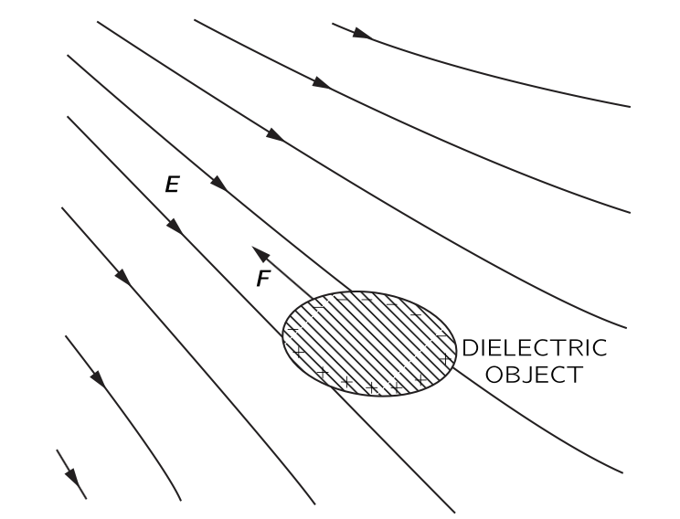{#fig-FLP_2_10_8 width=350}

@fig-FLP_2_10_8 에 표현된 바와 같이, 유전체는 항상 약한 전기장 영역에서 강한 전기장의 영역으로 끌리게 된다. 실제로, 작은 물체에 대해서는 힘이 전기장의 제곱에 비례한다는 것을 증명할 수 있다. 유도된 편극 전하는 전기장에 비례하고, 주어진 전하에 대해 힘 역시 전기장에 비례하기 때문이다. 하지만 방금 언급한 바와 같이, 필드의 제곱이 위치마다 다를 때에만 순힘이 존재한다. 따라서 힘은 필드의 제곱의 그래디언트에 비례한다. 비례 상수는 물체의 유전 상수를 포함하며, 또한 물체의 크기와 형태에 따라 달라진다.

:::

 

::: {#exm-FLP_force_on_dielectric_sheet}

#### 유전체에 작용하는 힘

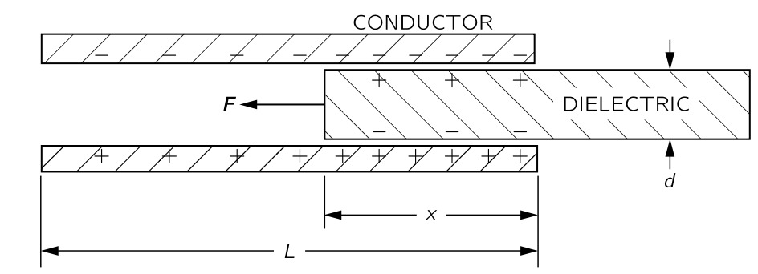{#fig-FLP_2_10_9 width=350}

@fig-FLP_2_10_9 에 표시된 바와 같이 유전체 슬래브가 부분적으로만 삽입된 평행판 커패시터가 있다면, 시트를 밀어넣는 힘이 작용한다. 힘을 자세히 알아보는 것은 상당히 복잡한데 이는 유전체와 판의 가장자리 근처의 전기장의 비균일성과 관련이 있다. 하지만 세부 사항을 살펴보지 않고 단지 에너지 보존 원리를 적용한다면 힘을 쉽게 계산할 수 있다. 우리는 앞서 도출한 공식으로부터 힘을 찾을 수 있다. @eq-FLP_2_10_28 로부터

$$
Fx=−\dfrac{\partial U}{\partial x}=\dfrac{V^2}{2}\dfrac{\partial C}{\partial x}
$$ {#eq-FLP_2_10_30}

임을 안다. 우리는 유전체 슬래브의 위치에 따라 정전용량이 어떻게 변하는지만 알아내면 된다.

전체 판의 길이는 $L$, 폭은 $W$ 이며, 판 사이의 거리와 유전체 두께가 $d$, 유전체가 삽입된 길이가 $x$ 라고 하자. 전기용량은 판의 전체 자유 전하와 판 사이의 전압의 비율이다. 주어진 전압 $V$ 에 대해 자유 전하의 표면 전하 밀도는 $\epsilon_r\epsilon_0 V/d$ 이므로 평행판에 대전된 총 전하는

$$
Q=\dfrac{\epsilon_r\epsilon_0 V}{d}x W+\dfrac{\epsilon_0 V}{d}(L−x)W
$$ 

이며 이로부터 전기용량을 알 수 있다.

$$
C=\dfrac{\epsilon_0 W}{d}(\epsilon_r x+L−x)
$$ {#eq-FLP_2_10_31}

@eq-FLP_2_10_30 으로부터 

$$
F_x=\dfrac{V^2}{2}\dfrac{\epsilon_0 W}{d}(\epsilon_r−1)
$$ {#eq-FLP_2_10_32}

임을 안다. 실제로는 이 방정식은 이런 상황에서 힘을 알아야 할 경우를 제외하고는 특별히 유용하지 않다. 우리는 단지 에너지 이론이 현재 사례와 같이 유전체 물질에 작용하는 힘을 결정하는 데 있어 엄청난 복잡성을 피하기 위해 종종 활용될 수 있음을 보여주고자 했을 뿐이다.
:::

 

## II.11 유전체 내부 {#sec-FLP_2_11}

### II.11-1 분자 쌍극자 {#sec-FPL_2_11_1}

전기장 $\bf{E}$ 에 의해 $\bf{P}$ 가 유도될 때 유전 상수 $\epsilon_r$ 은 다음과 같이 주어진다.

$$
\epsilon_r - 1 = \dfrac{P}{\epsilon_0 E}.
$$ {#eq-FLP_2_11_1}

이제 전기장이 물질 내부에 가해질 때 편극이 일어나는 메카니즘에 대해 알아보자. 일단 가장 간단한 기체부터 시작하자. 그런데 기체는 정전기적 관점에서 두종류로 나눌 수 있다. O2 와 같이 대칭으로 인해 분자의 고유한 쌍극자 모멘트가 없는 경우와 수증기와 같이 분자의 고유한 쌍극자 모먼트가 $0$ 이 아닌 경우. 전자를 **무극성 (nonpolar)** 라고 하고 후자를 **극성 (polar)** 이라고 한다.

 

### II.11-2 전기적 편극 {#sec-FLP_2_11_2}

#### **무극성 분자의 편극**

무극성 분자라도 외부의 전기장에 의해 편극이 발생한다. 전기장이 작다면 편극은 전기장에 비례하는데 이렇게 발생하는 편극을 **전기적 편극 (electronic polarization)** 이라고 한다.

[I-31 굴절률의 기원](../vol1/vol1_4.qmd#sec-FLP_1_31) 에서 원자가 진동하는 전기장에 위치할 때 전하의 중심은 다음 방정식을 따른다고 가정했다.

$$
m \dfrac{d^2x}{dt^2} + m\omega_0^2 x = q_e E.
$$ {#eq-FLP_1_11_2}

전기장의 진동수가 $\omega$ 일 때 @eq-FLP_1_11_2 는 아래의 해를 갖는다.

$$
x = \dfrac{q_e E}{m(\omega_0^2 - \omega^2)}.
$$ {#eq-FLP_2_11_3}

이 때 $\omega = \omega_0$ 에서 공명이 발생한다. 또한 $\omega_0$ 는 빛이 흡수되는 가시광선이나 자외선 영역의 진동수라고 해석했다. 우리는 시간에 대해 진동하지 않는 전기장에 관심이 있으므로 $\omega = 0$ 으로 놓자. 그렇다면 전기장이 가해지지 않을 때에 비해

$$
x = \dfrac{q_e E}{m\omega_0^2 }.
$$ {#eq-FLP_2_11_4}

만큼의 변위가 발생한다. 이로부터 단일 원자의 쌍극자 모먼트 $p$ 는

$$
p = q_e x = \dfrac{q_e^2 E}{m\omega_0^2 }
$$ {#eq-FLP_2_11_5}

이며 따라서 쌍극자 모먼트는 전기장의 크기 $E$ 에 비례한다. 일반적으로 위 식을 아래와 같이 쓴다.

$$
\bf{p}= \alpha \epsilon_0 \bf{E}.
$$ {#eq-FLP_2_11_6}

여기서 $\alpha$ 를 **원자의 편극률 (polarizability of atom)** 이라고 하며 전기장에 대해 얼마나 쉽게 쌍극자 모먼트가 유도되는지에 대한 척도이다. @eq-FLP_2_11_6 에 따라

$$
\alpha = \dfrac{q_e^2}{\epsilon_0 m \omega_0^2} 
$$ {#eq-FLP_2_11_7}

원자의 밀도가 $n$ 이라면

$$
\bf{P}=n\bf{p}=n\alpha\epsilon_0 \bf{E}
$${#eq-FLP_2_11_8}

이며 이로부터,

$$
\epsilon_r - 1 = \dfrac{P}{\epsilon_0 E} = n\alpha = \dfrac{ n q_e^2}{\epsilon_0 m \omega_0^2}
$$ {#eq-FLP_2_11_10}

이다. @eq-FLP_2_11_10 를 이용하여 우리는 기체의 유전상수를 계산 할 수 있다. 물론 이 식은 양자역학의 복잡함을 무시한 단순한 모델이므로 대략적인 근사이다. 심지어 공명 진동수 $\omega_0$ 는 보통 원자마다 여러개이다. 하지만 이 단순한 모델로도 여러 기체의 편극률을 어느정도는 잘 맞출 수 있다. 예를 들어 수소원자의 바닥상태 에너지 $E_1$ 는

$$
E_1 \approx \dfrac{1}{2}\dfrac{mq_e^4}{(4\pi\epsilon_0)^2\hbar^2}
$$ {#eq-FLP_2_11_11}

이며, 자연 진동수 $\omega_0$ 를 $\hbar \omega_0 = E_1$ 가 되도록 잡으면

$$
\omega_0 \approx \dfrac{1}{2}\dfrac{mq_e^4}{(4\pi\epsilon_0)^2\hbar^3}
$$

이다. 이로부터 수소 원자의 편극률 $\alpha_\text{H}$ 를 다음과 같이 구할 수 있다.

$$
\alpha_\text{H} \approx 16 \pi \left[\dfrac{4\pi\epsilon_0 \hbar^2}{mq_e^2}\right]^3
$$ {#eq-FLP_2_11_12}

보어 반경 $a_0 = 4\pi \epsilon_0 \hbar^2/mq_e^2 \approx 0.529 \,\mathring{\text{A}}$ 와 표준 조건 (1기압 0$^\circ$ C) 에서의 수소 밀도 $2.69\times 10^{19}\,\text{atoms}/\text{cm}^3$ 를 생각하여 @eq-FLP_2_11_10
를 이용해 계산하면 $\epsilon_r = 1.00020$ 이며 실제값 $1.00026$ 과 크게 차이나지 않는다.

지금까지 설명한 이론이 상당히 옳다는 것을 확인했지만 이것으로부터 더 나은 것을 기대하는 것은 무의미하다. 단일 원자가 아니라 이원자 분자인 일반 수소 기체로 수행되었다는 것을 생각하자. 분자 내 원자들의 분극이 개별 원자들의 분극과 완전히 동일하지는 않겠지만 그 차이는 그다지 크지 않다. 수소 원자에 대한 $\alpha$ 의 정확한 양자역학 계산은 @eq-FLP_2_11_12 보다 약 12% 높은 결과를 나타내며($16\pi$ 가 $18\pi$ 로 변경됨), 관측된 유전 상수에 더 가깝다. 어쨌든, 우리 유전체 모델 꽤 쓸만하다.

우리 이론에 대한 또 다른 검증은 @eq-FLP_2_11_7 을 주파수가 더 높은 원자에 대해 시험헤 보는 것이다. 헬륨의 이온화 에너지는 $24.6 \, \text{eV}$ 이며, 수소의 $13.6\, \text{eV}$ 보다 상당히 크다. 따라서 우리는 헬륨의 흡수 주파수 $\omega_0$ 가 수소보다 약 두 배 정도 크고, $\alpha$ 는 $1/4$ 정도 클 것을 기대할 수 있다. 수소와 같은 방법을 계산하면 $\epsilon_r (\text{He})≈1.000050$ 이며 실험값은 $1.000068$ 이다. 이로부터 고전적인 모델을 이용한 대략적인 추정이 어느정도 올바르다는 것을 확인 할 수 있다. 이것은 우리는 비극성 기체의 유전율을 정성적으로만 이해했으며, 아직 원자 전자의 운동에 대한 올바른 원자 이론을 사용하지 않았기 때문이다.

 

## II.11-3 극성 분자 {#sec-FLP_2_11_3}

이제 영구적인 쌍극자 모멘트 $p_0$ 를 를 가진 분자(예를 들면 H2O) 를 생각해보자. 전기장이 없다면 각각의 쌍극자의 방향은 무작위적이므로 단위 부피당 순모먼트는 0 이다. 하지만 전기장이 가해지면 두 가지가 발생한다.

1. 전자에 작용하는 힘으로 인해 추가적인 쌍극자 모먼트가 유도된다. 이는 비극성 분자의 유도 쌍극자 모먼트와 같다. 정확한 계산을 위해서는 이 효과를 당연히 포함해야 하지만, 일단은 무시하자. 

2. 전기장에 의해 개별 쌍극자가 정렬하여 단위 부피당 순모멘트가 발생한다. 가스의 모든 쌍극자가 정렬된다면 매우 큰 편극이 발생하겠지만, 그런 일은 일어나지 않는다. 일반적인 온도와 전기장에서는 분자들의 열운동에 의한 충돌때문에 분자들이 잘 정렬되지 않고 약간의 편극이 발생한다. 이 편극은 통계역학적 방법으로 계산할 수 있다.

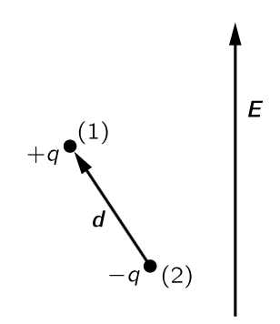{#fig-FLP_2_11_3 width=200}

이 방법을 사용하려면 전기장 내 쌍극자의 에너지를 알아야 한다. @fig-FLP_2_11_3 과 같이 전기장에서 모멘트 $\bf{p}_0$ 인 쌍극자를 생각하자. 양전하의 에너지는 $q\Phi(\bf{r}_1)$ 이며, 음전하의 에너지는 $−q\Phi(\bf{r}_2)$ 이다. 따라서 쌍극자의 에너지는

$$
U=q\Phi(\bf{r}_1)−q\Phi(\bf{r}_2)=q\bf{d\cdot}\nabla \Phi
$$

이며 이 식은 아래와 같이 쓸 수 있다. 

$$
U=−\bf{p}_0\bf{\cdot E} = -p_0 E \cos \theta.
$$ {#eq-FLP_2_11_14}

여기서 $\theta$ 는 $\bf{p}_0$ 와 $\bf{E}$ 의 각도이며, 예상대로 쌍극자가 전기장과 정렬될 때 에너지가 낮아진다.

이제 통계역학의 방법을 사용하여 정렬이 얼마나 발생하는지 알 수 있다. 열평형 상태에서 퍼텐셜 에너지 $U$ 를 가진 분자들의 상대적 수는

$$
e^{−U/k_BT}
$$ {#eq-FLP_2_11_15_}

에 비례한다. $n(\theta)$ 를 $\theta$ 에서 단위 입체각당 분자수 라고 하면 다음과 같다.

$$
n(\theta)=n_0e^{+p_0E\cos \theta/k_BT}.
$${#eq-FLP_2_11_16}

정상 온도와 전기장의 경우, 지수가 작으므로 아래와 같이 근사할 수 있다.

$$
n(\theta)=n_0\left(1+\dfrac{p_0 E \cos\theta }{k_BT}\right)
$$ {#eq-FLP_2_11_17}

모든 각에 대해 @eq-FLP_2_11_17 을 적분하면 $n_0$ 를 찾을 수 있다. 결과는 단위 부피당 분자의 총 개수인 $n$ 이 되어야 한다. @eq-FLP_2_11_1 를 입체각에 대해 적분하면 다음을 얻는다.

$$
n_0=4\pi n.
$$ {#eq-FLP_2_11_18}

@eq-FLP_2_11_17 로부터 전기장과 같은 방향($\cos \theta =1$)을 따라 방향이 맞춰지는 분자가 반대 방향의 분자($\cos \theta=−1$) 보다 더 많을 것임을 알 수 있다. 따라서 많은 분자를 포함하는 작은 부피에서는 단위 부피당 순 쌍극자 모멘트, 즉 편극 $P$ 가 존재하게 된다. $P$ 를 계산하려면 단위 부피 내 모든 분자 모멘트의 벡터 합을 구하면 되고 그 결과는 $\bf{E}$ 와 같은 방향이 될 것이다. 따라서 $\bf{E}$ 방향의 성분들을 합치면 된다.

$$
P=\sum_{\text{단위 부피}} p_0 \cos \theta_i.
$$

이것은 다음과 같이 적분으로 구할 수 있다.

$$
P = \int_{0}^{\pi} n(\theta) p_0 \cos\theta (2\pi \sin\theta d\theta).
$$ {#eq-FLP_2_11_19}

근사식 @eq-FLP_2_11_17 를 사용하면

$$
P = - \dfrac{n}{2}\int_{-1}^1 \left(1+\dfrac{p_0 E \cos\theta}{k_B T}\right) p_0 \cos \theta (d\cos \theta) = \dfrac{np_0^2E}{3k_B T}
$$ {#eq-FLP_2_11_20}

을 얻는다.

편극은 필드 $E$ 에 비례하므로 정상적인 유전체 거동이다. 또한, 예상대로 편극은 온도에 반비례하며, 온도가 높을수록 충돌에 의한 정렬이 더 많이 발생한다. 이 $1/T$ 의존성을 **퀴리 법칙 (Curie's law)** 라고 한다. 주어진 전기장에서 정렬시키는 힘이 $p_0$ 에 비례하며, 정렬에 의해 생성되는 평균 모멘트 역시 $p_0$ 에 비례하므로 평균 유도 모먼트는 $p^2_0$ 에 비례하게된다.

극성 분자의 유전율에는 또 다른 특성이 있다. 가해진 전기장의 진동수에 따른 변화이다. 분자의 관성 모멘트 때문에 무거운 분자들이 전기장 방향으로 회전하는 데 일정 시간이 걸리며 따라서 높은 마이크로파 진동수 영역 이상의 진동수를 적용하면, 유전 상수에 대한 극성 기여를 분자들이 따라갈 수 없기 때문에 감소하기 시작한다. 이에 반해 전자의 편극성은 광학 주파수까지 여전히 동일하게 유지되는데, 이는 전자의 관성이 더 작기 때문이다.

 

### II.11-4 유전체 공동(cavity)의 전기장 {#sec-FLP_2_11_4}

이제 액체나 고체같은 응집물질에서의 유전율을 생각해보자. 액체 헬륨, 액체 아르곤, 혹은 다른 비극성 물질에 대해서는 전자 편극을 생각한다. 하지만 응집물질에서는 $\bf{P}$ 가 클 수 있으므로, 개별 원자에 대한 전기장은 가까운 이웃에 있는 원자들의 편극의 영향을 받게 된다. 문제는 개별 원자에 작용하는 전기장이 무엇인지이다.

액체가 평행판 축전기의 판 사이에 놓이는 것을 행각하자. 판이 충전되면 액체에 전기장을 발생시게 되며, 또한 개별 원자에도 전하가 존재하므로 $\bf{E}$ 는 이 두 효과의 합이다. 전기장은 액체 내에서 위치마다 매우 빠르게 변한다. 그것은 원자 내부에서 매우 높고, 특히 핵의 바로 근처는 매우 높고, 원자 사이에서는 비교적 작다. 평행판 사이의 전위차는 이 전체 필드의 선적분이다. 모든 세세한 차이을 무시한다면, 평균 전기장 $E$ 를 생각할 수 있는데, 이는 단지 $V/d$ 이다. (이것은 우리가 지난 장에서 사용한 전기장이다.) 우리는 이 전기장을 많은 원자가 포함된 공간의 평균으로 간주해야 한다.

이제 “평균적인” 원자가 “평균적인” 위치에 있을 때 이 평균적인 전기장을 느낄 것이라고 생각할 수도 있다. 하지만 그렇게 간단하지 않은데 이것은 유전체에 서로 다른 형태의 구멍이 생긴다고 상상하면 어떻게 되는지를 고려해보면 알 수 있다. 예를 들어, @fig-FLP_2_11_5 의 ($a$) 와 같이 전기장과 평행하도록 편극 유전체에서 틈을 만든다고 가정하자.  $\nabla \times \bf{E}=0$ 임을 알 수 있으므로, ($b$) 에서와 같이 경로 $\Gamma$ 를 잡았을 때의 경로적분은 $0$ 이어야 한다. 따라서 긴 얇은 틈의 중심에 실제로 존재하는 전기장 $E_0$ 는 유전체에서 발견되는 평균 전기장 $E$ 와 같다.

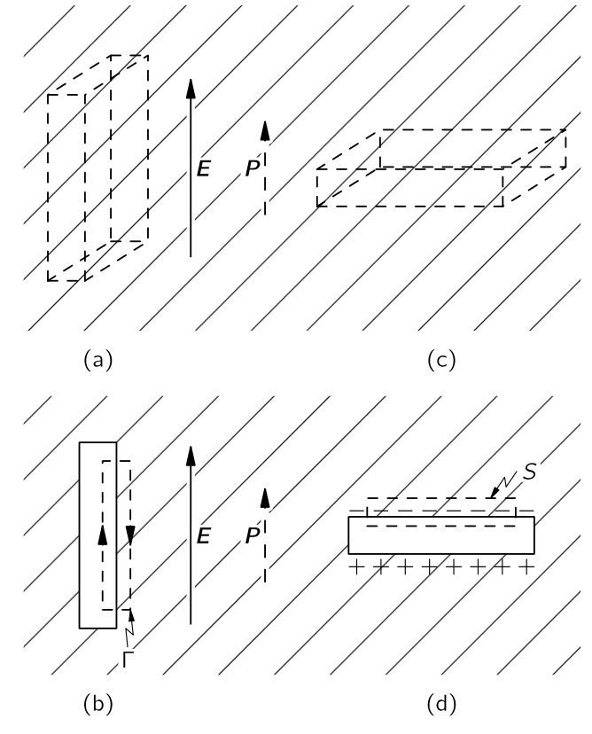{#fig-FLP_2_11_5 width=400}

이제 @fig-FLP_2_11_5 의 ($c$) 부분에 표시된 바와 같이, 큰 변이 $\bf{E}$ 에 수직인 다른 틈을 생각하자. 이 경우, 틈의 $E_0$ 전기장은 표면에 편광 전하가 나타나기 때문에 $E$ 와 동일하지 않다. 그림의 ($d$) 와같은 표면 $S$ 에 가우스의 법칙을 적용하면, 슬롯의 필드 $E_0$ 가 다음과 같다는 것을 알 수 있다.

$$
E_0= E+ \dfrac{P}{\epsilon_0}.
$$ {#eq-FLP_2_11_22}

여기서 $E$ 는 유전체의 전기장이다. (가우시안 표면은 표면 편극 전하 $\sigma_\text{pol}=P$ 를 포함한다.) 우리는 앞서 에서 $\epsilon_0 E+P$ 가 종종 $D$ 라고 불리므로, $\epsilon_0 E_0=D_0$ 은 유전체에서의 $D$ 와 같다.

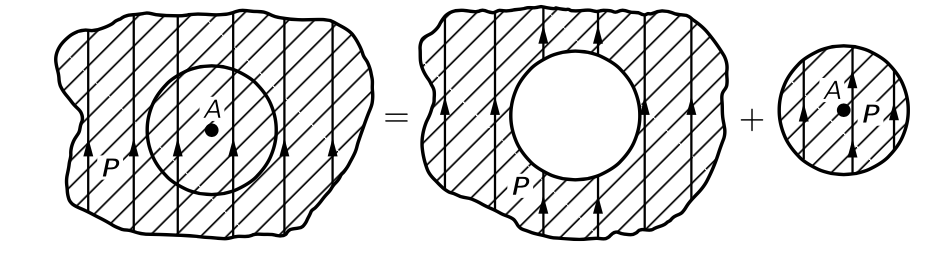{#fig-FLP_2_11_6 width=400}

구조가 그리 복잡하지 않은 대부분의 액체의 경우 평균적으로 한 원자는 다른 원자들에 의해 구형 구멍에 가까운 적절한 근접 형태로 둘러싸여 있을 것으로 예상할 수 있다. 이로부터 다음 질문을 던질 수 있다: “구형 구멍 안의 전기장은 무엇일까?” 균일하게 편광된 물질의 구형 구멍은, 그것은 단지 편광된 구를 제거하는 것에 불과하다. 그러나 중첩에 의해, 구가 제거되기 전의 유전체 내부 장은 구형 부피 외부의 모든 전하와 편극된 구 내부 전하의 전기장을 합한 합이다. 즉, 균일한 유전체의 전기장 $E$ 에 대해

$$
E = E_\text{hall} + E_\text{plug}
$$ {#eq-FLP_2_11_23}

라고 할 수 있다. 여기서 $E_\text{hole}$ 은 구멍 안의 전기장이며, $E_\text{plug}$ 는 균일하게 편극된 구면 내부의 전기장이다(@fig-FLP_2_11_6). 균일하게 편광된 구에 의해 발생하는 전기장은 @fig-FLP_2_11_7 에 표현되어 있다. 구 내부의 균일한 전기장$^2$[아주 쉽게 구할수 있는 것은 아니다. [균일하게 편극된 구에 의한 정전포텐셜과 전기장](https://julia-kaeri.github.io/ClassicalPhysics/src/Electrodynamics/02_1_electrostatics1.html#exm-ED_ES_potential_by_uniformly_polarized_sphere) 을 참고하라]{.aside}은

$$
E_\text{plug}=−\dfrac{P}{3\epsilon_0}
$$ {#eq-FLP_2_11_24}

이며 @eq-FLP_2_11_23 을 사용하면

$$
E_\text{hole}=E+\dfrac{P}{3\epsilon_0}
$$ {#eq-FLP_2_11_25}

를 얻는다. 즉 구형 구멍의 전기장은 평균 전기장보다 $P/3\epsilon_0$ 만큼 크다. 

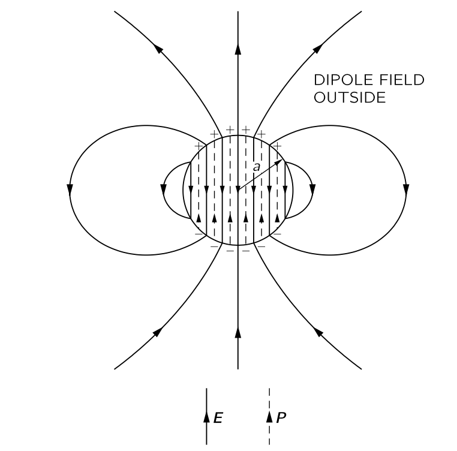{#fig-FLP_2_11_7 width=400}

 

### II.11-5 액체의 유전 장수와 클라우시우스-모소티 관계식 {#sec-FLP_2_11_5}

액체에서 개별 분자를 편극시키는 전기장은 $E$ 이라기 보다는 $E_\text{hole}$ 이다. @eq-FLP_2_11_6 에서 $\bf{E}$ 대신에 @eq-FLP_2_11_25 의 $E_\text{hale}$ 을 사용하면 @eq-FLP_2_11_8 은

$$
P = n\alpha \epsilon_0 \left(E+\dfrac{P}{3\epsilon_0}\right)
$$ {#eq-FLP_2_11_26}

이며 이로부터

$$
P = \dfrac{n\alpha}{1-n\alpha/3}\epsilon_0 E
$$ {#eq-FLP_2_11_27}

을 얻는다. 또한 유전상수는

$$
\epsilon_r =1+ \dfrac{n\alpha}{1-n\alpha/3}
$$ {#eq-FLP_2_11_28}

이다. 즉 원자의 편극률과 밀도로부터 액체의 유전 상수를 구할 수 있다. 이 식을 **클라우시우스-모소티 관계식 (Clausius-Mossotti relation)** 이라고 한다.

 

### II.11-6 고체 유전체 {#sec-FLP_2_11_6}

이제 고체인 유전체에 대해 알아보자. 첫 번째 외부의 전기장이 없어도 영구적인 편극이 존재할 수 있다는 것이다. 예를 들어, 영구적인 쌍극자 모멘트를 가진 긴 분자를 포함하는 왁스를 녹여 액체일 때 강한 전기장을 가하면 쌍극자 모멘트가 부분적으로 정렬된다. 이후 냉각시켜 얼리면 때도 그 상태를 유지하여 전기장이 제거되도 남아 있는 영구적인 편극을 갖게 된다. 이런 고체를 **electret** 라고 한다. Electret 은 표면에 영구적인 편극 전하를 가지고 있지만 공기 중의 자유 전하가 표면으로 끌려 편극 전하를 상쇄하기 때문에 그렇게 유용하지 않다. 이것을 electric 이 **방전 (discharged)** 되어 있다고 하며 electret 에 의한 외부의 전기장은 없다.

일부 결정 물질은 영구적인 내부의 편극 $P$ 를 갖는다. 이 경우 결정의 각 단위 셀이 동일한 영구 쌍극자 모멘트를 가지며 모든 쌍극자는 전기장이 가해지지 않아도 같은 방향이다. 많은 복잡한 결정은 실제로 이러한 분극을 가지고 있다. 그러나 electret 과 마찬가지로 외부 필드가 방전되기 때문에 우리는 이를 쉽게 알아채지 못한다.

그러나 결정의 내부 쌍극자 모멘트가 변하면, 외부 전기장이 나타나게 된다. 이는 흩어진 전하가 모여 편극 전하를 상쇄할 시간이 없기 때문이다. 축전지에 유전체가 있는 경우, 전극에 자유 전하가 유도된다. 예를 들어, 유전체를 가열하면 열팽창으로 인해 모멘트가 변할 수 있다. 그 효과는 **열전 (pyroelectricity)** 이라고 한다. 마찬가지로, 결정의 응력을 변화시킬 경우—예를 들어, 다시 구부릴 경우—모멘트가 약간 변할 수 있으며, 소위 **압전 (piezoelectricity)** 이라고 하는 작은 전기 효과를 감지할 수 있다.

영구 편극 모멘트가 없는 결정의 경우, 원자의 전자적 편극성을 포함하는 유전율 이론을 도출할 수 있으며 액체와 거의 동일하다. 일부 결정은 내부에 회전 가능한 쌍극자를 가지고 있으며, 이러한 쌍극자의 회전이 $\epsilon_r$ 에 기여한다. NaCl 과 같은 이온 결정에서도 이온 편극성이 존재한다. 결정은 양이온과 음이온으로 이루어진 체커보드로 이루어져 있으며, 전기장에서는 양이온이 한쪽으로, 음이온이 반대 방향으로 끌어당겨진다. 플러스와 마이너스 전하의 상대 운동이 존재하여 부피가 분극된다. 우리는 소금 결정의 강성에 대한 지식을 바탕으로 이온 편극성의 크기를 추정할 수 있지만, 여기서는 그 주제에 대해 파고들지 않는다.

 

### II.11-7 강유전체 : BaTiO3 {#sec-FLP_2_11_7}

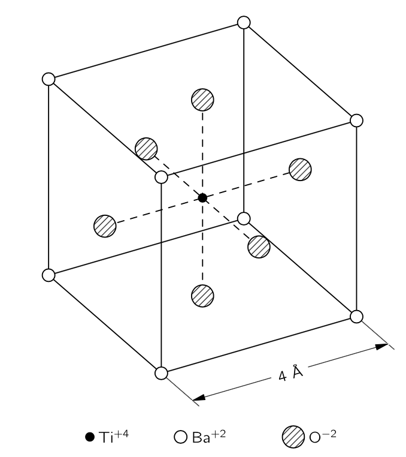{#fig-FLP_2_11_9 width=300}

강유전체는 영구적인 편극 모멘트를 내장한 특수한 결정이다. 보통 온도를 약간 올리면 영구 모멘트가 사라지는데 이 영구 모멘트가 사라지는 온도를 **큐리 온도 (Curie temperature)** 라고 하고 $T_C$ 로 표기한다. 정육면체에 매우 가까운 결정이라면 영구 모멘트의 회전이 가능하며 외부 전기장으로 모멘트의 방향을 변경 할 수 있다. 이러한 영구 모멘트를 가진 물질을 **강유전체 (ferroelectric)** 라고 한다. 여기서는 강유전체인 BaTiO3 만을 다룬다. 이 물질은 결정 격자를 가지고 있으며, 그 기본 셀은 @fig-FLP_2_11_9 와 같다. 큐리 온도는 $120\sim 130\, {}^\circ\text{C}$ 이다.

고체 물질의 편극을 구할 때는 먼저 각 단위 셀에서 국소 장이 무엇인지 찾아야 한다. 우리는 액체의 경우와 마찬가지로 편극 자체이서 기인한 장를 포함해야 한다. 하지만 결정은 균일한 액체가 아니므로, 구면 구멍에서 얻을 수 있는 것을 국소장에 사용할 수 없고. 결정에 대해 풀어보면 @eq-FLP_2_11_24 의 $1/3$ 과 약간 다른 값을 얻는데 일단 BaTiO3 에 대해 $1/3$ 이라고 가정하자.

@eq-FLP_2_11_28 에서 $n\alpha$ 가 $3$ 보다 커지면 $\epsilon_r$ 이가 음수가 될 수 있을것처럼 보이긴 하지만 그것은 확실히 틀리다. 이를 위해 특정 결정에서 $\alpha$ 를 점진적으로 증가시킬 경우 어떤 일이 일어날지 살펴보자. $\alpha$ 가 커짐에 따라 편극도 커져 더 큰 국소적인 장이 형성된다. 하지만 더 큰 국소장은 각 원자를 더 많이 분극시켜, 국소장을 더욱 증가시킬 것이다. 원자들이 이것을 견딜 수 있다면 이 과정은 계속 진행된다. 각 원자의 분극이 전기장에 비례하여 증가한다는 가정하에, 편광이 제한 없이 증가하는 일종의 피드백이 존재합니다. 이것이 깨지는 조건은 $n\alpha=3$ 일 때 발생한다. 유도된 모멘트와 전기장 사이의 비례관계는 가 높은 전기장에서 붕궤되며 우리의 공식은 더 이상 올바르지 않게 된다. 이 경우 격자가 높은 자체 생성 내부 편극에 “고정”된다.

BaTiO3의 경우, 전자 편극 외에도 비교적 큰 이온 편극이 존재하며, 이는 티타늄 이온이 입방 격자 내에서 약간 움직일 수 있기 때문이라고 추정된다. 격자는 큰 움직임에 저항하며, 티타늄이 약간 움직이면 끼어 멈추게 된다. 이후 결정 셀 내의 영구적인 쌍극자 모멘트가 남게 된다. 대부분의 결정에서는, 이것이 도달할 수 있는 모든 온도에 대한 상황이다. 바륨 티타네이트에 대해 매우 흥미로운 점은 $n\alpha$ 가 조금만 감소하면 고정되지 않는 섬세한 조건이 있다는 것입니다. 열팽창으로 인해 온도가 상승함에 따라 $n$ 이 감소하므로, 우리는 온도를 변화시켜 $n\alpha$ 를 변화시킬 수 있다. 임계 온도 이하에서는 거의 고정되지 않으므로, 외부 필드를 적용함으로써 편극을 이동시켜 다른 방향으로 고정하는 것이 쉽다.

이제 좀 더 자세히 살펴 보자. $T_C$ 를 $n\alpha$ 가 정확히 $3$ 이 되는 임계 온도라고 하자. 온도가 상승함에 따라 격자의 팽창으로 인해 $n$ 이 약간 감소한다. 팽창이 작기 때문에, 임계 온도에 가깝울 때 

$$
n\alpha = 3−\beta(T−T_C)
$$ {#eq-FLP_2_11_30}

라고 할 수 있다. 여기서 $\beta$ 는 열팽창 계수와 같은 order의 작은 상수로 $1\,^{\circ}\text{C}$ 당 $10^{−5}$ 에서 $10^{−6}$ 정도이다. 이제 이 관계를 @eq-FLP_2_11_28 에 대입하면 

$$
\epsilon_r −1 = \dfrac{3 −\beta (T−T_C)}{\beta (T−T_C)/3}
$$

를 얻는다. $\beta (T−T_C)$ 가 $1$ 에 비해 작다고 가정했으므로, 우리는 다음과 같이 근사할 수 있다.

$$
\epsilon_r − 1 = 9\beta (T−T_C).
$$ {#eq-FP_2_11_31}

이 관계는 물론 $T>T_C$ 에 대해서만 옳다. 우리는 임계 온도 바로 위에서 $\epsilon_r$ 이 매우 커짐을 알 수 있다. $n\alpha$ 가 $3$ 에 매우 가깝기 때문에, 유전율은 쉽게 50,000에서 100,000까지 높아질 수 있으며 또한 온도에 매우 민감하다. 온도가 상승할 경우 유전율은 온도와 반비례하여 감소하지만, 절대 온도에서 $\epsilon_r-1 \sim 1/T$ 인 양극 기체와 달리, 강유전체에서는 $\epsilon_r-1 \sim 1/(T-T_C)$ 이다. 이 법칙을 **퀴리-바이스 법칙(Curie-Weiss law)** 이라고 한다.

온도를 임계 온도로 낮추면 어떻게 될까? @fig-FLP_2_11_9 와 같은 단위 셀 격자를 생각하면 수직선을 따라 이온 사슬을 골라낼 수 있음을 알 수 있다. 그 중 하나는 산소 이온과 티타늄 이온이 교대로 구성되어 있다. 바륨 이온 또는 산소 이온으로 구성된 다른 선들을 생각 할 수 있지만, 이 선들을 따라서는 간격이 더 넓다. 우리는 @fig-FLP_2_11_10 (a) 와 같dms 이온 사슬들의 연속을 상상함으로써 간단한 모델을 만들 수 있다. 우리가 main chain 이라고 부르는 경로에서 이온들의 간격은 $a$ 이며, 이는 격자 상수의 절반에 해당한다. 동일한 사슬들 사이의 측면 거리는 $2a$ 이다. 이 두 main chain 사이에 밀도가 낮은 사슬들이 있으며, 우리는 당분간 무시할 것이다. 분석을 조금 더 쉽게 하기 위해, 우리는 또한 main chain 의 모든 이온이 동일하다고 가정한다. 모든 중요한 효과가 여전히 나타나기 때문에 이는 심각한 단순화가 아니다. 

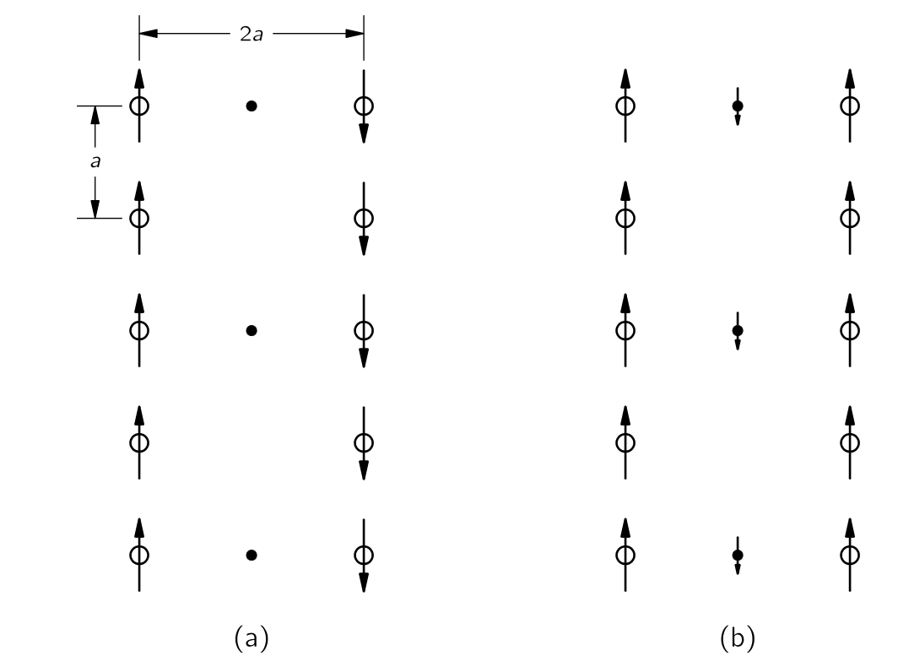{#fig-FLP_2_11_10 width=400}

이제 이 모델로 계산해 보자. 각 원자의 쌍극자 모멘트가 $p$ 라고 가정하고, 사슬의 원자 중 하나의 위치에서의 전기장을 계산해보자. 우리는 쌍극자에서 그 축을 따라 방향까지 거리 $r$ 만큼 떨어진 곳에서의 전기장은

$$
E=\dfrac{1}{4π\epsilon_0}\dfrac{2p}{r^3}
$$ {#eq-FLP_2_11_32}

이다. 어떤 원자에서든 위와 아래가 같은 거리만큼 떨어진 쌍극자는 같은 방향으로 필드를 형성하므로, 전체 사슬서의 전기장은

$$
E_\text{chain}=\dfrac{p}{4π\epsilon_0}\dfrac{2}{a^3}\cdot \left(2+\dfrac{2}{8} + \dfrac{2}{27} + \dfrac{2}{64} + \cdots\right) = \dfrac{p}{\epsilon_0}\dfrac{0.383}{a^3}
$$ {#eq-FLP_2_11_33}

이다. 우리 모델이 완전한 입방체 결정이라면, 즉 다음 동일한 chain 들과의 거리가 $a$ 만큼 떨어져 있다면 $-0.383$ 이라는 숫자가 $1/3$ 으로 변경될 것이라는 것을 보여주는 것이 그리 어렵지 않다. 하지만, 우리가 고려하고 있는 가장 가까운 main chain 은 $2a$ 만큼 떨어져 있으며 주기 구조의 필드는 거리와 대해 지수적으로 감소하므로 $−0.050$ 보다 훨씬 적게 기여하며, 이보다 먼 main chain 의 기여는 훨씬 작다.

이제는 런어웨이 공정을 작동시키기 위해 필요한 편극률 $\alpha$ 가 무엇인지 알아내는 것이 필요합니다. 체인의 각 원자에 대한 유도 모멘트 $p$ 가 그 원자의 필드에 비례한다고 가정해 보십시오, @eq-FLP_2_11_6 에서와 같이 $E_\text{chain}$ 에서 @eq-FLP_2_11_32 를 사용하여 원자 위의 쌍극자 모멘트를 구해보자. 다음 두 개의 방정식을 생각한다.

$$
p=\alpha \epsilon_0 E_\text{chain}
$$

과

$$
E_\text{chain}=\dfrac{0.383}{a^3}\dfrac{p}{\epsilon_0}.
$$

위 에는 두 가지 해가 있다: $E_\text{chain}=0$, $p=0$ 과 

$$
\alpha=\dfrac{a^3}{0.383}.
$$

$E_\text{chain}$ 과 $p$ 가 모두 유한한 값이다. 따라서 $\alpha = a^3/0.383$ 라면 자체 필드에 의해 유지되는 영구적인 편극이 형성된다. 바륨 티타네이트에 대해 이 중요한 식을 $T_C$ 온도만으로 얻어야 한다. ($\alpha$ 가 작은 필드에 대한 임계값보다 크면, 더 큰 필드에서는 감소하고, 평형 상태에서는 우리가 찾은 동일한 식이 유지된다는 점에 유의하라.)

BaTiO3 의 경우, 간격 $a$ 는 $2\times 10^{10}\,\text{m}$ 이므로 $\alpha=21.8\times 10^{−30}\,\text{m}^3$ 일 것으로 예상된다. 우리는 이를 개별 원자들의 알려진 편극률과 비교할 수 있다. 산소의 경우, $\alpha=30.2\times 10−30\,\text{m}^3$. 우리는 일단 올바른 방향으로 가고 있다! 하지만 티타늄의 경우 $\alpha=2.4\times 10^{-30}\,\text{m}^3$ 로 다소 작다. 우리 모델을 사용하려면 일단 평균을 사용하는 것이 좋을 것 같다. (우리는 교대 원자 사슬로 이 계산을 할 수 있지만, 결과는 거의 동일할 것이다.) 따라서 $\alpha(\text{평균})=16.3 \times 10^{−24}\,\text{m}^3$ 이며, 이는 영구적인 편극을 제공하기에 충분히 크지 않다. 하지만 지금까지는 전자의 편극성만 생각했다. 티타늄 이온의 이동으로 인한 이온 편극을 생각해야 한다. 우리에게 필요한 것은 $9.2 \times 10^{−24}\,\text{m}^3$ 의 이온 편극성입니다. (교대 원자를 이용한 보다 정밀한 계산에서는 실제로 $11.9 \times 10^{−24}\,\text{m}^3$ 가 필요하다.) BaTiO3 의 특성을 이해하려면, 그러한 이온성 편극성이 존재한다고 가정해야 한다.

바륨 타이타네이트의 티타늄 이온이 그 정도의 이온 편극성을 가져야 하는 이유는 알려져 있지 않다. 게다가, 낮은 온도에서 그것이 육면체의 대각선과 면 대각선을 따라 동일하게 편광되는 이유도 명확하지 않다. @fig-FLP_2_11_9 에 있는 구체들의 실제 크기를 파악하고, 인접한 산소 원자에 의해 형성된 상자 안에서 티타늄이 이동할 여유가 있는지 확인해보면 정반대임을 알게 된다. 매우 꽉 끼인다. 바륨 원자는 약간 느슨하지만, 그것들을 움직이는 것으로 두면 맞지 않는다. 그렇다면 그 주제가 실제로는 100% 명확하지 않다는 것을 보시게 됩니다; 아직 우리가 이해하고자 하는 미스터리가 남아 있습니다.

@fig-FLP_2_11_10 (a) 의 간단한 모델로 돌아가면, 하나의 사슬에서 나오는 장이 반대 방향으로 인접한 사슬을 편광시키는 경향이 있다는것을 알 수 있다. 이는 각 사슬이 고정되어 있더라도 단위 부피당 순 영구 모멘트가 존재하지 않을 것임을 의미한다. (외부 전기 효과는 없겠지만, 여전히 관찰할 수 있는 특정 열역학적 효과가 존재합니다.) 그러한 시스템은 존재하며, **반강유전 (antiferroelectric)** 이라고 한다. 그래서 우리가 설명한 것은 실제로 반강유전체이다. 하지만 바륨 티타네이트는 @fig-FLP_2_11_10 (b) 의 배치과 같다. 산소-티타늄 사슬은 모두 같은 방향으로 편극되어 있으며, 그 사이에 원자들의 중간 사슬이 존재하기 때문이다. 비록 이 사슬들의 원자들이 매우 분극성이 높지 않거나 밀도가 높지는 않지만, 산소‐티타늄 사슬과 반대 방향으로 다소 분극될 것입니다. 다음 산소‐티타늄 사슬에서 생성되는 작은 필드들은 첫 번째와 평행하게 시작될 것입니다. 따라서 BaTiO3는 실제로 강유전체이며, 이는 그 사이의 원자들 때문이다. 아마도 두 O‐Ti 사슬 사이의 직접적인 효과를 궁금해 할 수도 있다. 하지만 우리는 직접적인 효과는 거리에 대해 지수적으로 감소한다는 것을 안다. $2a$ 에서 강한 쌍극자 사슬의 효과는 거리 $a$ 에서 약한 쌍극자 사슬의 효과보다 작을 수 있다.

 

## I.12 정전기 상태와 유사한 물리 {#sec-FLP_2_12}

### I.12-1 같은 방정식은 같은 해를 가진다. {#sec-FLP_2_12_1}

정전기학에서 우리는

$$
\nabla \bf{\cdot}(\epsilon_r \bf{E})= \dfrac{\rho_\text{free}}{\epsilon_0},\qquad \nabla \times \bf{E}=0
$$ {#eq-FLP_2_12_1}

을 알게 되었다. 또한 위 식은 아래 식과 동등하다는 것도 안다.

$$
\bf{E}=-\nabla \Phi,\qquad ,\qquad \nabla \bf{\cdot} (\epsilon_r \nabla \Phi) = - \dfrac{\rho_\text{free}}{\epsilon_0}.
$$ {#eq-FLP_2_12_3}

중요한 것은 위와 같은 형태의 방정식이 매우 다양한 분야에 출현한다는 것이다. 즉 우리가 정전기학을 통해 얻은 수학적 지식이 전혀 다른 분야에 적용 될 수 있다.

 

### I.12-2 열의 흐름: 무한한 평면 경계에 가까운 점의 열원 {#sec-FLP_2_12_2}

여러 물질이 섞인, 그리고 온도가 위치마다 다른 블록을 생각하자. 이러한 온도 차이의 결과로 열 흐름이 발생하며, 이는 벡터 $\bf{h}$ 로 나타낼 수 있다. $\bf{h}$ 는 단위 시간에 단위 면적을 통과하는 열 에너지의 흐름을 표현한다. 그렇다면 $\nabla \bf{\cdot h}$ 는 단위 부피를 빠져나가는 단위 시간당 열에너지이다. 물질 내에 열원이 존재하여 단위 부피에서 초당 $s$ 만큼의 열을 생산한다고 하자. 그리고 단위 부피당 물질 내의 열 에너지를 $u$ 라고 하면 다음의 관계가 성립한다.

$$
\nabla \bf{\cdot h} = s - \dfrac{du}{dt}.
$$ {#eq-FLP_2_12_5}

만약 물질 내가 열평형 상태라면, 즉 $du/dt =0$ 이라면 다음을 만족한다.

$$
\nabla \bf{\cdot h} = s
$$ {#eq-FLP_2_12_6}

많은 경우 물질 내의 열 흐름은 대략적으로 위치에서의 온도의 차이에 비례한다. 즉,

$$
\bf{h} = - \kappa \nabla T
$$ {#eq-FLP_2_12_7}

이다$^3$.[$^3$ @eq-FLP_2_12_7 보다 @eq-FLP_2_12_5 가 더근본적이다. @eq-FLP_2_12_5 는 에너지 보존법칙이며 @eq-FLP_2_12_7 는 물질의 특성에 의존한다.]{.aside} 이 때 비례상수 $\kappa$ 를 **열 전도율 (thermal conductivity)** 라고 하며 위치에 대한 함수이다. @eq-FLP_2_12_6 보다 @eq-FLP_2_12_7 로 부터 우리는 다음 식을 얻는다.

$$
\nabla \bf{\cdot} (\kappa \nabla T) = -s.
$$ {#eq-FLP_2_12_8}

이 식과 @eq-FLP_2_12_1 의 첫번째 식은 완전히 같은 형태이다. **정적 열 흐름 문제와 정전기 문제는 동일한 문제이다**. 우리는 $T\propto 1/r$ 이며 $\|\nabla T\|\propto 1/r^2$ 임을 알 수 있다.

 

::: {#exm-FLP_example_heal_flow_in_cylindrical_geometry}

#### 실린더 형태의 배관에서의 열의 흐름

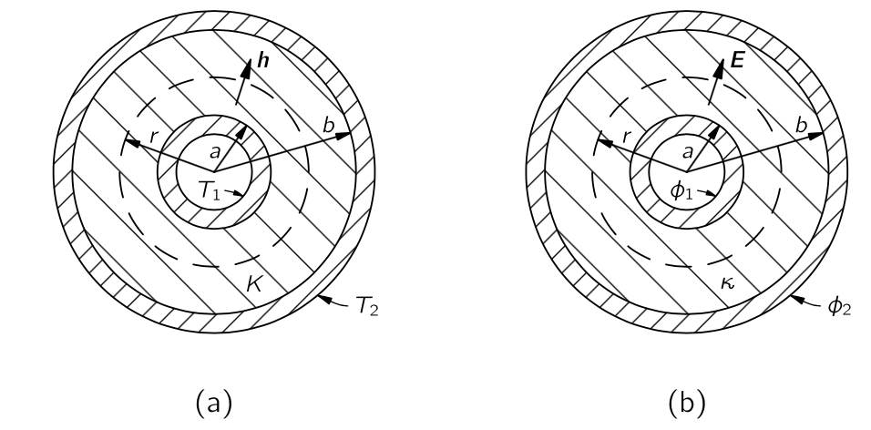{#fig-FLP_2_12_1 width=400}

반지름 $a$ 인 원통의 온도가 $T_1$ 이며 이 온도는 실린더 내부의 열 발생에 의해 유지되고 있다고 가정하자.  이 실린더는 열전도율 $\kappa$ 를 가진 절연 재료로 외부 반경이 $b$ 가 되도록 덮여 있으며 외부 관의 온도는 $T_2$ 로 유된다고 가정하자. (@fig-FLP_2_12_1 (a)). 이제 전선이나 증기관, 혹은 중앙에 있는 무언가 의해 어느 정도의 열이 손실되는지 알아보자. 파이프의 길이가 $L$ 일 때 손실되는 총 열량 $G$ 를 구해보자.

이 문제는 정전기학 방정식과 완전히 동일하다. @fig-FLP_2_12_1 (b) 와 같이 반지름 $a$ 에서 포텐셜이 $\Phi_1$ 이며 $b$ dptj $\Phi_2$ 인 경우를 생각하자. 그리고 그 사이에 유전체 재료의 동심층이 있다고 생각하자. 이제 열 흐름 $\bf{h}$ 가 전기장 $\bf{E}$ 에 해당하므로, 우리가 찾고자 하는 양 $G$ 는 전기장의 플럭스, 즉 $q/\epsilon_0$ 에 해당한다. 

이로부터 다음을 알 수 있다.

$$
G=\dfrac{2\pi \kappa L (T_1-T_2)}{\ln (b/a)}
$$ {#eq-FLP_2_12_12}
:::

 

::: {#exm-FLP_example_heal_flow_2}

지구 표면 약간 아래에 위치한 점열원 또는 큰 금속 블록의 표면 근처에 있는 근처의 열 흐름을 알아야 한다고 하자. 국소적인 열원은 지하에서 발사되어 강렬한 열원을 남기는 원자폭탄일 수도 있고, 혹은 철덩어리 안에 있는 작은 방사성 원소에 대한 문제일 수도 있다. 이 문제를 열전도율이 $\kappa$ 인 균일한 재료의 무한 블록 표면 아래 거리 $a$ 에서 강도 $G$ 인 점열원이라는 이상화된 문제로 다뤄보자. 그리고 재료 외부의 공기에 의한 열전도는 생각하지 않기로 하자. 열원 바로 위와 블록 표면의 여러 위치에서의 온도를 어떻게 구할까?

어떻게 해결해야 할까? 이는 평면을 경계로 서로 다른 유전 상수 $\epsilon_r$ 를 가진 두 물질이 갖는 정전기 문제와 같다. 아마도 이것은 유전체와 도체 사이의 경계 근처에 있는 점 전하와 유사한 것이다. 열 문제에서의 표면 근처에서 상황이 어떤지 살펴보자. 조건은 표면에서 $\bf{h}$ 의 직교 성분이 0이라는 것이며, 이는 블록에서 외부로 열이 흐르지 않는다고 가정했기 때문이다. 하지만 정전기 문제에서 $\bf{E}$ 의 직교 성분이 표면에서 0이라는 조건을 갖지는 않는다.

그것은 우리가 주의해야 할 것 중 하나이다. 물리적인 이유로, 특정 주제에서 수학적 조건의 종류에 일정한 제한이 있을 수 있다. 따라서 미분 방정식을 특정한 제한이 있는 경우에만 분석했다면, 다른 물리적 상황에서 발생할 수 있는 일부 해들을 놓쳤을 수도 있다. 예를 들어, 유전율이 0 인 물질은 존재하지 않지만, 진공은 열전도율이 0 이다. 따라서 완벽한 열 절연체에 대한 정전기적 유사체는 존재하지 않는다. 하지만 우리는 여전히 같은 방법을 사용할 수 있다. 우리는 유전율이 0이면 어떤 일이 일어날지 상상해 볼 수 있다. (매우 높은 유전율을 가진 물질이 있는 경우가 있을 수 있으며, 그 경우 외부 공기의 유전율을 무시할 수 있다.)

표면에 수직인 성분이 없는 전기장을 어떻게 찾을 수 있을까? 즉, 표면에서 항상 접선일까? 이 문제는 평면 도체 근처의 점 전하와 정 반대이다. 이 문제에서는 전도체가 모두 같은 전위에 있었기 때문에 전기장은 표면에 수직이 되어야 하며 영상법을 이용하여 금속판 뒤에 점 전하를 상상함으로써 해결했다. 이제 @fig-FLP_2_12_2 와 같이 주어진 전하와 동일한 기호와 동일한 강도를 표면 위의 거리 $a$ 에 배치한 이미지 전하는 전기장이 항상 표면에서 수평이 되도록 한다.

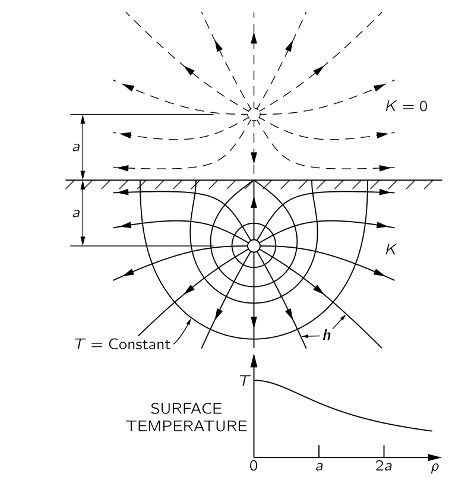{#fig-FLP_2_12_2 width=400}

이제 열 흐름 문제가 해결되었다. 온도는 두 개의 동일한 점 전하에 의한 전위와 동일하다. 무한 매질에서 단일 점원 $G$ 로부터 거리 $r$ 에서의 온도 $T$ 는

$$
T={G}{4π\kappa r}
$$ {#eq-FLP_2_12_13}

이며 점 열원의 온도이자 그 이미지 소스의 온도는

$$
T=\dfrac{G}{4π\kappa r_1}+\dfrac{G}{4π\kappa r_2}
$$ {#eq-FLP_2_12_14}

이다. 이 식은 블록 전체에 에서의 온도를 제공한다. @fig-FLP_2_12_2 에 여러 등온면 표시되어 있다.또한 $\bf{h}$ 의 선들이 표시되어 있으며, 이는 $\bf{h}=−\kappa \nabla T$ 에서 얻을 수 있다.

표면의 온도는 축으로부터 거리 $\rho$ 인 표면상의 점에 대해, $r_1 = r_2 = \sqrt{\rho^2 + a^2}$ 이므로

$$
T(\text{표면})=\dfrac{1}{4π\kappa} \dfrac{2G}{\sqrt{\rho^2+a^2}}
$$ {#eq-FLP_2_12_15}

이다. 이 함수는 그림에도 표현되어 있다. 

:::

