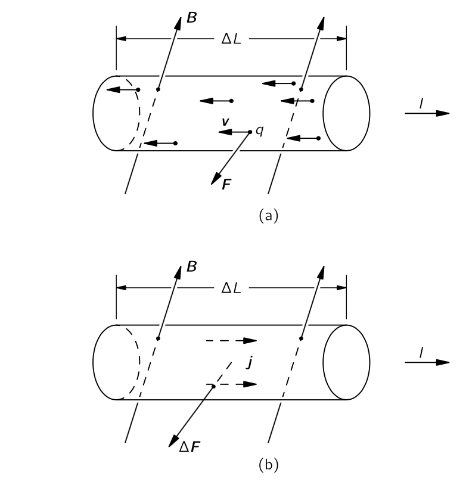
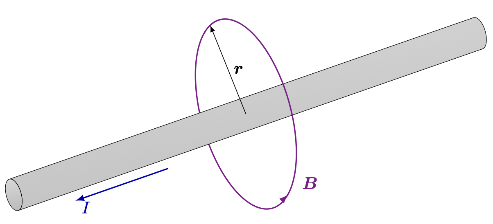
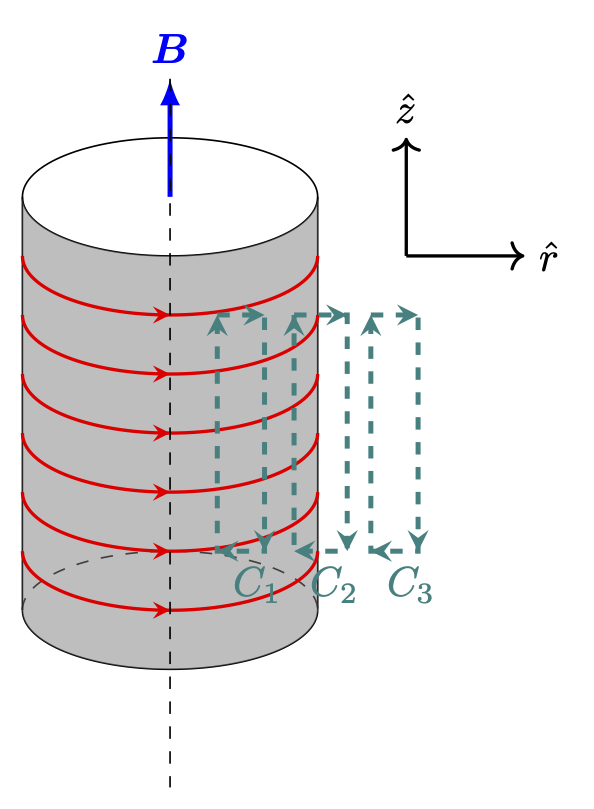
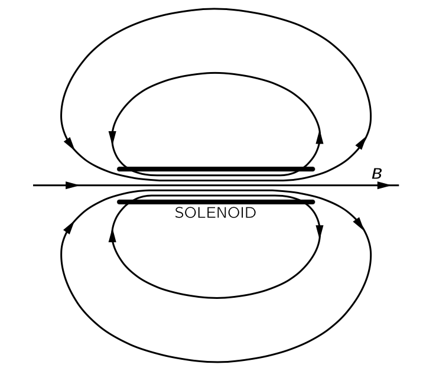
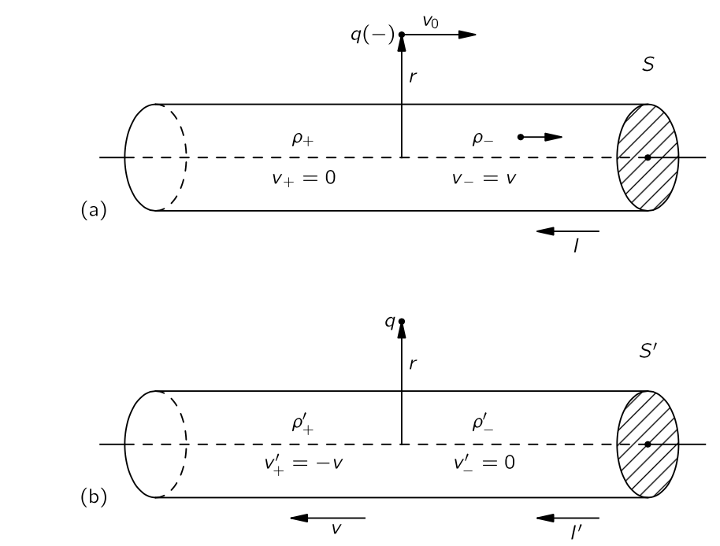
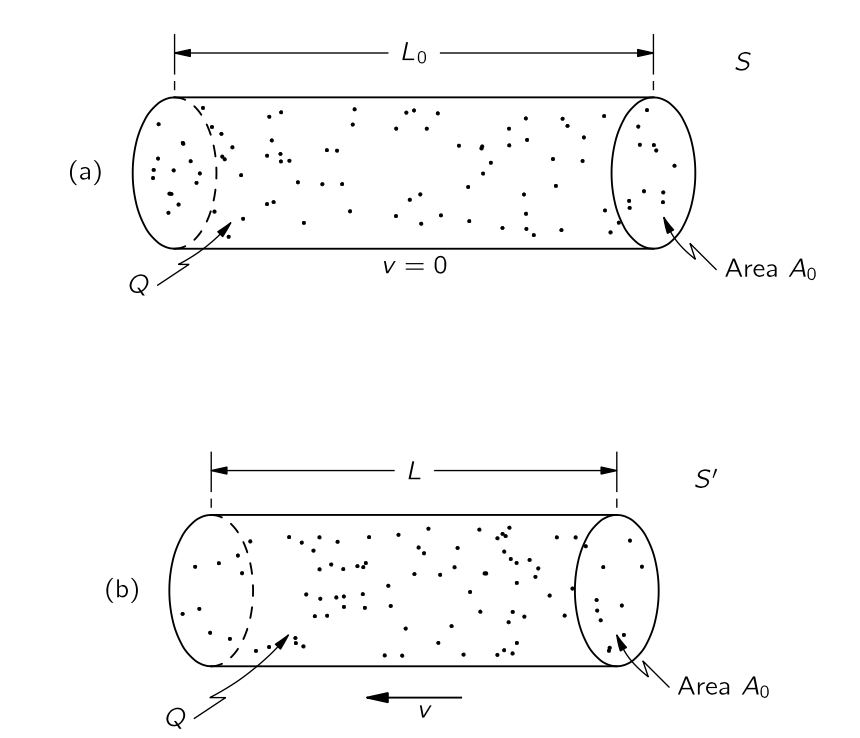
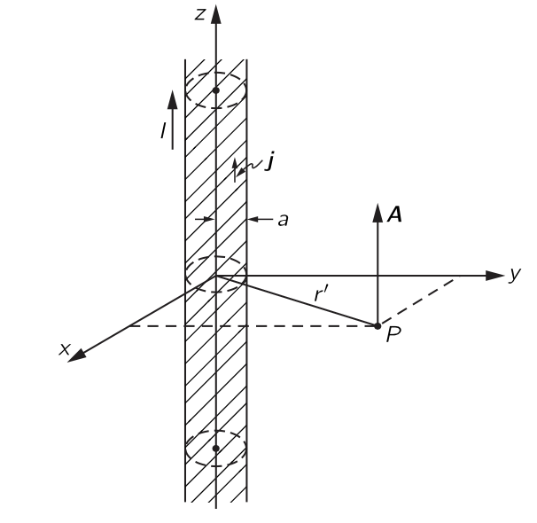

 

## II.13 정자기 {#sec-FLP_2_13}

### II.13-1 자기장 {#sec-FLP_2_13_1}

전기장 $\bf{E}$ 와 자기장 $\bf{B}$ 가 가해졌을 때 속도 $\bf{v}$ 로 움직이는 전하 $q$ 는 아래와 같은 로런츠 힘이 작용한다.

$$
\bf{F}=q(\bf{E}+\bf{v}\times \bf{B}).
$$ {#eq-FLP_2_13_1}

 

### II.13-2 전류와 전하 보존 {#sec-FLP_2_13_2}

단위 시간에 면적 성분 $\Delta \bf{a}$ 를 통과한 총 전하량을 $\bf{J\cdot}\Delta \bf{a}$ 라고 하자. 이 때의 $\bf{J}$ 를 **전류 밀도 벡터(current density vector)** 라고 한다. $\Delta \bf{a}$ 에 수직인 단위벡터를 $\hat{\bf{n}}$ 이라고 하면 $(\bf{J\cdot}\hat{\bf{n}})\Delta a$ 라고 쓸 수 있다. 이제 $da$ 근처의 분포 $\rho$ 를 생각하자. 여기서 $\Delta t$ 시간 동안 $\Delta a$ 를 빠져나간 총 전하량 $\Delta q$ 는

$$
\Delta q = \rho \bf{v\cdot}\hat{\bf{n}}\Delta a \Delta t
$$

$\bf{J}$ 는 단위 시간동안의 유출량이므로

$$
\bf{J} = \rho \bf{v}
$$ {#eq-FLP_2_13_3}

이다. 표면 $S$ 를 통과한 단위시간동안의 총 전하량을 전류 $I$ 라고 하므로

$$
I = \int_S \bf{J\cdot}\hat{\bf{n}}\,da
$$ {#eq-FLP_2_13_5}

이며, $S$ 를 영역 $V$ 의 닫힌 표면이라고 하고 $V$ 안의 총 전하량을 $Q_\text{inside}$ 라고 하면

$$
\oint_S \bf{J\cdot}\,d\bf{a} = - \dfrac{dQ_{\text{inside}}}{dt}
$$ {#eq-FLP_2_13_6}

이다.

$$
Q_\text{inside} = \int_V \rho\, d^3\bf{r}
$$ {#eq-FLP_2_13_7}

이며, @eq-FLP_2_13_6 와 발산법칙을 통해 아래의 전하량 보존식 법칙을 얻는다.

$$
\nabla \bf{\cdot J} = - \dfrac{\partial \rho}{\partial t}.
$$ {#eq-FLP_2_13_8}

 

### II.13-3 전류에 의한 자기력 {#sec-FLP_2_13_3}

{#fig-FLP_2_13_5 width=450}

전류가 흐르는 도선에 작용하는 힘을 자기장으로부터 구할 수 있다. 전류는 도선을 따라 속도 v로 움직이는 전하들로 구성된다. 각 전하는 

$$
\bf{F}=q\bf{v}\times \bf{B}
$$

의 힘을 받는다. 단위 부피당 $n$ 개의 전하가 있는 경우, 도선의 $ΔV$ 만큼의 부피 성분에서 받는 힘 $\Delta \bf{F}$ 는

$$
\Delta \bf{F}=(n\Delta V)(q\bf{v}\times \bf{B})
$$

이다. 여기서 $\bf{J}=nq\bf{v}$ 이므로

$$
\Delta \bf{F} = (\bf{J}\times \bf{B}) \Delta V 
$$ {#eq-FLP_2_13_9}

이다. 즉 도선은 단위 부피당 $\bf{J}\times \bf{B}$ 만큼의 힘을 받는다. 전류가 단면적이 $A$ 인 도선에서 균일하면, 부피 요소로 면적 $A$ 와 길이 $\Delta L$ 인 원통으로 간주 할 수 있다. 그렇다면

$$
\Delta \bf{F} = \bf{J}\times \bf{B} A\Delta L
$$ {#eq-FLP_2_13_10}

이며, 이제 우리는 $\bf{J}A$ 를 전선의 벡터 전류 $\bf{I}$ 라고 부를 수 있다. 이에대해 

$$
\Delta \bf{F} = \bf{I} \times \bf{B} \Delta L
$$ {#eq-FLP_2_13_11}

이므로 도선에 가해지는 단위길이당 함은 $\bf{I} \times \bf{B}$ 이다.

즉 전하가 이동함에 따라 전선에 작용하는 자기력은 전체 전류에만 의존하고 각 입자가 운반하는 전하의 양—또는 그 부호—에 의존하지 않는다는 것을 보여준다. 

 

### II.13-4 정상 전류의 자기장과 앙페어 법칙 {#sec-FLP_2_13_4}

#### **정자기학의 멕스웰 방정식**

앞서 우리는 자기장이 존재할 따 흐르는 전류에 힘이 작용한다는 사실을 알게 되었다. 작용-반작용 원리에 따르면 전류 역시 자기장의 원천에 힘을 가해야 한다. 이 힘은 전류가 흐르는 전선 근처에서의 나침반 바늘의 움직임으로 확인 할 수 있다. 우리는 자석이 다른 자석으로부터 힘을 받는다는 사실을 알고 있으며, 따라서 전선에 전류가 흐르면 그 전선 자체가 자기장을 발생시킨다. 즉 움직이는 전하는 자기장을 만든다. 이제 질문은 주어진 전류가 만드는 자기장은 무엇인지에 대해 물어야 한다. 이 질문에 대한 답은 세 번의 비판적 실험과 앙페르가 제시한 뛰어난 이론적 논증을 통해 실험적으로 결정되었다. 이 흥미로운 역사적 전개는 건너 뛰고 단지 맥스웰 방정식의 타당성을 입증했다는 말로 갈음한다. 멕스웰 방정식, 그중에서도 시간미분 항을 제외한 아래 식을 출발점으로 한다. 이를 **정자기학(magnetostatics)** 라고 하자. 

$$
\boxed{\nabla \bf{\cdot B} = 0.}
$$ {#eq-FLP_2_13_12}

$$
\boxed{\nabla \times \bf{B} = \mu_0 \bf{J}.}
$$ {#eq-FLP_2_13_13}

정적 자기 상황이 존재한다는 것이 다소 위험하다고 볼 수 있다. 왜냐하면 자기장을 얻기 위해서는 전류가 존재해야 하며, 전류는 움직이는 전하에서만 발생할 수 있기 때문이다. 따라서 **Magnetostatics** 는 많은 전하가 움직이는, 따라서 이 흐름을 일정한 전하의 흐름으로, 즉 $\bf{J}$ 를 시간에 따라 변하지 않는 일정한 값으로 근사할 수 있는 상황에서의 근사값이다. 따라서 정자기학 보다는 “정상 전류학” 이라고 부르는 것이 더 적합할 수도 있다. 모든 장이 정상상태라고 가정하면, 멕스웰 방정식에서 $\partial \bf{E}/\partial t$ 와 $\partial \bf{B}/\partial t$ 를 모두 $0$ 으로 놓을 수 있고 @eq-FLP_2_13_12 와 @eq-FLP_2_13_13 을 얻는다. 또한 모든 벡터 $\nabla \bf{\cdot}(\nabla \times \bf{B})=0$ 이므로, $\nabla \bf{\cdot J} = 0$ 이다. 정상상태의 경우 @eq-FLP_2_13_8 에서 $\partial \rho/\partial t=0$ 이므로 이것은 일관된다. 하지만 $\bf{E}$ 가 시간에 따라 변하지 않는다면, 우리의 가정은 일관됩니다.

#### **자기 전하는 없다**

$\nabla \bf{\cdot J}=0$ 이라는 조건은 닫힌 경로에서 흐르는 전하만을 고려한다는 의미이다. 전하가 닫힌 경로를 흐를 때 이를 **회로(circuit)** 라고 한다. 회로에는 전하가 흐르도록 하는 발전기나 배터리가 포함될 수 있으며 충전 중이거나 방전중인 축전지를 포함하지 않을 수도 있다. 

이제 식들을 살펴보자. $\nabla \bf{\cdot B}=0$ 과 $\nabla \bf{\cdot E}=ρ/\epsilon_0$ 를 비교하면 전하의 자기적 유사체가 존재하지 않는다는 의미이다. 즉 $\bf{B}$ 선이 발생할 수 있는 자기 전하는 존재하지 않는다. 벡터장 $\bf{B}$ 의 “선”을 기준으로 생각해보면, 이들은 결코 시작도 할 수 없으며 멈추지도 않는다. 그렇다면 그들은 어디에서 왔을까? 자기장은 전류가 존재할 때 나타나며, 전류 밀도 $\bf{J}$ 에 비례하는 컬을 가진다. 전류가 있는 곳마다, 전류를 중심으로 순환하는 자기장의 선이 존재한다. $\bf{B}$ 의 선은 시작도 끝도 없기 때문에, 종종 스스로 닫혀서 닫힌 루프를 만든다. 하지만 선이 단순한 닫힌 루프가 아닌 복잡한 상황도 있을 수 있다. 하지만 무엇이 됬든 모든 위치에서 $\nabla \bf{\cdot B}=0$ 이다. 자기 전하(magnetic charge) 가 발견된 적이 없으니 $\nabla \bf{\cdot B}=0$ 이다. 이것은 정자기학에서만이 아니라 언제나 그렇다. 

#### **앙페어의 법칙**

$\bf{B}$ 와 전류 사이의 연관성은 @eq-FLP_2_13_13 에 포함되어 있다. 정전기학에서는 $\nabla \times \bf{E}=0$ 이며 이로부터 닫힌 경로 $\Gamma$ 에 대해

$$
\oint_{\Gamma} \bf{E}\cdot d\bf{l}=0
$$

을 얻었다. 같은 스토크스 정리를 @eq-FLP_2_13_13 에 적용하면

$$
\oint_\Gamma \bf{B\cdot}\,d\bf{l} = \int_S(\nabla \times \bf{B})\,d\bf{a} = \mu_0 \int_S \bf{J\cdot}d\bf{a}
$$ {#eq-FLP_2_13_15}

를 얻는다. 여기서 $S$ 는 닫힌 경로 $\Gamma$ 를 경계로 갖는 임의의 표면이다. $\int_S \bf{J\cdot}d\bf{a}$ 는 표면 $S$ 를 통과하는 총 전류 $I$ 이다. 정상 전류의 경우 $S$ 를 흐르는 전류는 $S$ 의 형태와 무관하므로 보통 "루프 $\Gamma$ 를 통과하는 전류" 라고 말한다. 이를 $I_\Gamma$ 라고 하면 

$$
\oint_\Gamma \bf{B\cdot}\,d\bf{l} = \mu_0 I_\Gamma
$$

이며 이를 **앙페어의 법칙** 이라고 한다. 

 

### II.13–5 직선 도선과 솔레노이드의 자기장, 그리고 원자 전류 {#sec-FLP_2_13_5}

 [$^4$[비오-사바르의 법칙(Biot-Savart’s law)](https://julia-kaeri.github.io/ClassicalPhysics/src/Electrodynamics/03_magnetostatics.html#sec-ED_MS_ampere_law_and_biot_savart_law) 을 통해 보일 수 있다.]{.aside}

::: {#exm-FLP_magnetic_field_around_current}

#### 직선 도선의 전류에 의한 자기장

{#fig-FLP_2_13_7 width=450}

원통형 단면을 가진 긴 직선형 전선 외부의 자기장을 구해보자. **$\bf{B}$ 의 필드 라인이 전선을 닫힌 원으로 돈다는 것을 가정하겠다**$^4$. 이것은 지금까지의 지식으로는 명백하지 않지만 사실이다. 이것을 가정하면 $\bf{B\cdot} d\bf{l}$ 선적분은 매우 쉽다. 반지름 $r$ 에 대해

$$
\oint \bf{B\cdot}\,d\bf{l} = 2\pi rB
$$

이며 $\int \bf{J\cdot}d\bf{a} = I$ 이므로

$$
B=\dfrac{\mu_0}{2\pi } \dfrac{I}{r}
$$ {#eq-FLP_2_13_17}

이다. 이 식을 벡터식으로 표현하면 다음과 같다.

$$
\bf{B}=\dfrac{\mu_0}{2\pi} \dfrac{\bf{I}\times \hat{\bf{r}}}{r}.
$$ {#eq-FLP_2_13_18}

:::

전류가 자기장을 만들고 이 자기장은 주변의 전류에 힘을 가한다. 두 평행한 전선은 각각이 다른 전선에 의한 $\bf{B}$ 에 직각이므로 전류가 같은 방향일 때는 서로 끌어당기고, 반대방향일때는 서로 밀어낸다.

 

::: {#exm-ED_MS_magnetic_field_due_to_solenoid}

#### 솔레노이드 내부의 자기장

{#fig-FLP_2_13_8r width=200}

위의 그림과 같이 배치된 솔레노이드를 생각하자. 도선을 단위 길이당 $n$ 번을 감았다고 하자. 원통좌표계 $(r,\,\theta,\,z)$ 에서 생각하자. $\pm z$ 양쪽으로 아주 길다고 생각한다. 대칭에 의해 자기장은 $r$ 에만 의존하며 방향은 $\hat{z}$ 이다. 즉 $\bf{B}(\bf{r}) = B(r)\hat{\bf{z}}$ 이다. 초록색으로 표현된 경로 $C_1,\,C_2,\,C_3$ 를 생각하자. 가로 폭이 매우 작고 높이를 $L$ 이라고 하자. 이 가운데 $C_1,\,C_3$ 경로에 대한 적분으로부터

$$
\int_{C_1}\bf{B}\cdot d\bf{s} = 0,\qquad \int_{C_3} \bf{B}\cdot d\bf{s}=0
$$

이므로 내부와 외부에서 각각 자기장은 상수이다. 각각 $B_{\text{in}}(r),\, B_{\text{out}}(r)$ 이라고 하자. 

$C_2$ 경로에 대한 적분으로부터

$$
B_\text{in}(r)L - B_\text{out}(r)L = N\mu_0 I
$$

을 얻는다. 여기서 $N$ 은 $L$ 길이에서 감은 횟수이다. 그런데 $B_\text{out}(r\to\infty) = 0$ 이어야 하므로 외부 자기장은 $0$ 이며 솔레노이드 내부의 자기장은

$$
\bf{B}_{\text{in}}(r) = n\mu_0 I \hat{\bf{z}}
$$

이다.

:::

 

$\bf{B}$ 의 선이 솔레노이드 끝에서는 어떨까? 아마도, 그들은 어떤 식으로든 퍼진 뒤 반대쪽 끝에서 솔레노이드에 다시 들어가며, 이는 @fig-FLP_2_13_9 와 같으며 막대 자석의 그것과 같다. 그렇다면 자석이란 도대체 무엇인가? 우리 방정식은 $\bf{B}$ 가 전류의 존재에서 비롯된다고 말한다. 하지만 우리는 일반적인 쇠막대기도 배터리나 발전기가 없어도 자기장을 발생시킨다는 것을 알고 있다. 혹시 @eq-FLP_2_13_12 나 @eq-FLP_2_13_13 의 오른쪽에 **자석의 밀도** 혹은 그와 같은 양을 나타내는 다른 항이 있어야 하는거 아닌가 생각할 수도 있다. 하지만 그런 항은 없으며, 우리 이론에 따르면, 철의 자기 효과는 이미 $\bf{J}$ 항으로 처리되고 있는 어떤 내부 전류에서 비롯된 것이다.

{#fig-FLP_2_13_9 width=350}

유전체를 다룰 때 보았듯이 물질은 근본적인 관점에서 볼 때 매우 복잡하다. 지금의 진행을 방해하지 않기 위해, 철과 같은 자기 재료의 내부 메커니즘에 대해서는 나중에 자세히 다룰 것이다. **현재로서는 모든 자기는 전류에 의해 생성되며, 영구자석에는 영구적인 내부 전류가 존재한다는 점을 받아들여야 한다**. 철의 경우, 이러한 전류는 전자가 자신의 축을 중심으로 회전하는 데서 비롯된다. 모든 전자는 이런 스핀을 가지고 있으며, 이는 아주 작은 순환 전류에 해당한다. 물론, 하나의 전자는 많은 자기장을 생성하지 않지만, 일반적인 물질에는 엄청나게 많은 수의 전자가 존재한다. 보통 이것들은 임의의 방향으로 회전하므로 서로 상쇄된다. 그러나 철과 같은 매우 소수의 물질에서 전자의 큰 비율이 같은 방향의 축으로 회전한다는 것이다—철의 경우 각 원자마다 두 개의 전자가 여기에 참여한다. 막대 자석에서는 같은 방향으로 회전하는 많은 전자가 있으며, 그 전체 효과는 막대 표면을 순환하는 전류와 동일하다. (이는 우리가 유전체에 대해 발견한 것—균일하게 편광된 유전체는 그 표면에 전하가 분포한다-는 것과 동등하다.) 따라서, 막대 자석이 솔레노이드와 동등하다는 것은 우연이 아니다.

 

### II.13–6 자기장과 전기장의 상대성 {#sec-FLP_2_13_6}

#### **로런츠 힘과 관성기준틀**

로런츠 힘 @eq-FLP_2_13_1 에서 보듯 전하에 가해지는 자기력이 전하의 속도에 비례한다. 그렇다면 어떤 관성기준틀에서의 속도를 의미하는가? 여기서의 속도는 우리가 선택한 기준틀에서의 속도이다. 하지만 우리는 자기장을 지정하기 위한 적절한 기준틀에 대해서는 아무 말도 하지 않았다. 결론적으로 어떤 관성 프레임이라도 사용할 수 있다. 이제 우리는 자기와 전기가 독립된 것이 아니라는 것, 뿐만 아니라 항상 하나의 온전한 전자기장으로 같이 받아들여한다는 것을 알게 될 것이다. 정적인 경우에는 맥스웰 방정식이 전기에 대한 한 쌍과 자기에 대한 한 쌍을 가진 두 개의 뚜렷한 쌍으로 분리되며, 두 장 사이에 명백한 연관성이 없지만, 그럼에도 불구하고 자연 자체에서는 상대성 원리에서 비롯된 매우 밀접한 관계가 존재한다. 역사적으로 상대성 원리는 맥스웰 방정식 이후에 발견되으며 실제로 전기와 자기에 대한 연구가 결국 아인슈타인의 상대성 원리 발견으로 이어졌다. 이제 상대성 원리가 전자기학에 적용된다고 가정했을 때 상대성이론이 자기력에 대해 무엇을 알려줄지 살펴보자.

@fig-FLP_2_13_10 과 같이 전류가 흐르는 전선에 평행한 속도 $v_0$ 로 음전하가 움직일 때 두 개의 관성기준틀에서 무슨 일이 일어나는지 알아보자 : (a) 와 같이 전선에 고정된 기준틀 $S$ 와 (b) 와 같이 입자에 대해 고정된 기준틀 $S'$.

{#fig-FLP_2_13_10 width=450}

#### **전선이 정지한 기준틀에서**

$S$ 기준틀에서는 입자에 전선을 향한 자기력이 작용한다. 하지만 $S'$ 기준틀에서는 입자의 속도가 $0$ 이기 때문에 입자에 대한 자기력이 존재할 수 없다. 상대성 원리에 따르면 $S'$ 에서도 입자가 전선에 더 가깝게 이동하는 것을 볼 수 있어야 한다. 이제 우리는 전류가 흐르는 전선에 대한 원자적 설명으로 돌아가보자. 구리와 같은 일반 전도체에서 전류는 전도전자라고 불리는 전자의 움직임에서 발생하며, 양전하와 나머지 전자는 물질의 몸체에 고정되어 있다. 전도 전자의 전하 밀도를 $\rho_−$ 라고 하고, $S$ 에서의 속도를 $\bf{v}$ 라고 하자. $S$ 에서 정지 전하의 밀도는 $\rho_+$ 이며, $\rho_+ = - \rho_-$ 이어야 한다. 따라서 전선 외부에는 전기장이 없으며, 움직이는 입자에 작용하는 힘은 단지

$$
\bf{F} = q\bf{v}_0\times \bf{B}
$$

이다. @eq-FLP_2_13_18 로부터 입자에 전선 방향으로 아래와 같은 크기의 힘이 가해진다는 것을 안다.

$$
F = \dfrac{\mu_0}{2\pi}\dfrac{Iqv_0}{r}
$$

@eq-FLP_2_13_3 과 @eq-FLP_2_13_5 로 부터 전선의 단면적 $A$ 에 대해 $I = \rho_- vA$ 임을 안다. 따라서

$$
F = \dfrac{\mu_0}{2\pi}\dfrac{q\rho_- Avv_0}{r}
$$ {#eq-FLP_2_13_20}

이다. 임의의 $v$ 와 $v_0$ 에 대해 다룰 수도 있지만, 입자의 속도 $v_0$ 가 전도 전자의 속도 $v$ 와 동일한 특수한 경우를 살펴보자. 이 경우

$$
F=\dfrac{\mu_0}{2π}\dfrac{\rho_− Av^2}{r}
$${#eq-FLP_2_13_21}

이다. 

#### **전하가 정지한 기준틀에서**

이제 $S'$ 기준틀에서 생각하자. 전선과 함께 움직이는 양전하에 의해 입자에 자기장 $\bf{B}'$ 가 가해지지만 정지한 입자에는 자기력이 없으며 따라서 입자에 힘이 작용한다면 그것은 전기장 때문이어야 한다. 움직이는 전선이 전기장을 발생시키는 경우는 전선이 전하를 띤 것처럼 보일 때만 그렇다. 즉 전류가 흐르는 중성 전선은 움직일 때 대전된 것처럼 보여야 한다.

$S'$ 기준틀에서 전선의 전하 밀도를 우리가 $S$ 기준틀에 대해 알고 있는 것을 통해 계산해보자. 일견 그들이 동일하다고 생각할 수 있지만, 우리는 길이가 $S$ 와 $S'$ 사이에 변한다는 것을 알고 있으며, 이에 따라 부피도, 그리고 전하 밀도 역시 바뀐다.

$S'$ 에서의 전하 밀도를 결정하기 전에, 전하가 움직일 때 여러 전자의 전하가 어떻게 되는지 알아야 한다. 우리는 상대성 이론에서 많은 양이 $1/\sqrt{1-v^2/c^2}$ 에 따라 변한다는 것을 알고 있다. 그러나 전하는 속도와 무관하게 동일하다. 

대전되지 않은 물질 한덩이, 예를 들면 도체를 가져왔다고 하자. 여기에 열을 가하면 전자는 양성자와 질량이 다르기 때문에 전자와 양성자의 속도는 다르다. 입자의 전하가 그 입자를 운반하는 입자의 속도에 의존한다면, 가열된 블록에서는 전자와 양성자의 전하가 더 이상 균형을 이루지 않으며, 따라서 가열될 때 대전된다. 이 덩이 내의 모든 전자의 전하가 매우 작은 비율이라도 변화를 일으키면 거대한 전기장이 발생할 것이다. 그러나 한번도 이런 현상은 관측되지 않았다. 

또한, 물질 내 전자의 평균 속도가 화학 조성에 따라 달라진다는 점을 지적할 수 있다. 전자의 전하가 속도에 따라 변한다면, 물질의 순전하가 화학 반응에서 변하게 된다. 간단한 계산에 따르면 전하가 속도에 거의 의존하지 않더라도 가장 단순한 화학 반응에서 거대한 전기장을 얻을 수 있다. 그러한 효과 역시 관찰된 적이 없으며, 따라서 **단일 입자의 전하량은 그 운동 상태와 무관하다**고 결론지을 수 있다.

입자의 전하 $q$ 는 좌표계와 무관한 불변 스칼라량이므로 거리의 상대론적 수축 때문에 부피가 변할 수 있다는 사실에 대해서만 생각하면 된다. 전선의 길이를 $L_0$ 라고 하면 그 안의 정상상태의 전하(stationary charge)$^2$의 밀도 $\rho_0$ 를 생각할 수 있으며, $Q=\rho_0 L_0 A_0$ 만큼의 전하를 포함한다. 이 전하를 속도 $v$ 로 움직이는 다른 기준틀에서 에서 보면, 이 전하들은 더 짧은 길이 에서 발견되며 그 길이 $L$ 은 [$^2$ 전하를 이루는 개별적인 입자는 이동하지만 계속 채워져서 밀도 자체는 변하지 않는다는 의미에서의 stationary]{.aside}

$$
L = L_0\sqrt{1−v^2/c^2}
$$ {#eq-FLP_2_13_22}

이다. 그러나 도선의 면적 $A_0$ 은 동일하다. 

{#fig-FLP_2_13_11 width=450}

$\rho$ 를 전하들이 이동하는 기준틀에서의 밀도라고 하면, 전체 전하 $Q=\rho LA_0$ 이며 전하가 모든 시스템에서 동일하기 때문에 $ρ_0 L_0 A _0$ 와 같아야 한다. 따라서 $\rho L=\rho_0 L_0$ 이며 @eq-FLP_2_13_22 로부터

$$
\rho = \dfrac{\rho_0}{\sqrt{1−v^2/c^2}}
$$ {#eq-FLP_2_13_23}

이다. 전하의 이동 분포에서 전하 밀도가 변한다.

이제 이 결과를 우리 도선의 양전하 밀도 $\rho_+$ 에 사용한다. 이 전하들은 $S$ 기준틀에서 멈춰 있지만 $S'$ 기준틀에서 전선이 속도 $v$로 움직이는 경우, 양전하 밀도는

$$
\rho'_+ = \dfrac{\rho_+}{\sqrt{1−v^2/c^2}}
$$ {#eq-FLP_2_13_24}

이다. 음전하는 $S'$ 기준틀에서 정지되어 있으므로 이 기준틀에서 정지 밀도 $\rho_0$ 를 가지고 있다. @eq-FLP_2_13_23 으로부터 $\rho'_− = \rho_0$ 인데 이는 전선이 정지한 경우, 즉 $S$ 기준틀에서 음전하의 속도가 $v$ 인 경우 밀도 $ρ_−$ 를 갖기 때문이다. 전도 전자에 대해서는

$$
\rho_− = \dfrac{\rho'_−}{\sqrt{1−v^2/c^2}}
$$ {#eq-FLP_2_13_25}

혹은

$$
\rho'_- = {\rho_−}{\sqrt{1−v^2/c^2}}
$$ {#eq-FLP_2_13_26}

이다. 이제 $S'$ 기준틀에 전기장이 왜 존재하는지 알 수 있다. $S'$ 기준틀에서 전선은 순전하 밀도 $\rho'= \rho'_+ + \rho'_−$ 를 가지고 있기 때문이다. @eq-FLP_2_13_24 와 @eq-FLP_2_13_26 으로부터

$$
\rho' = \dfrac{\rho_+}{\sqrt{1−v^2/c^2}} + \rho_− \sqrt{1−v^2/c^2}
$$

을 얻는다. 정지된 전선은 중성이므로 $\rho_- =− \rho_+$ 이며, 따라서 

$$
\rho' = {\rho_+}\dfrac{v^2/c^2}{\sqrt{1-v^2/c^2}} 
$$  {#eq-FLP_2_13_27}

이다. 움직이는 전선은 양전하를 띄며 외부 고정 입자에 전기장 $\bf{E}'$ 를 가한다. 원통 축으로부터 거리 $r$ 인 위치에서의 전기장의 크기는

$$
E'=\dfrac{\rho' A}{2\pi\epsilon_0 r} = \dfrac{\rho_+ A v^2/c^2}{2\pi \epsilon_0 r\sqrt{1−v^2/c^2}}
$$ {#eq-FLP_2_13_28}

이다. 음전하를 띤 입자에 전선을 향하는 힘이 작용한다. 우리는 최소한 두 관점에서 같은 방향의 힘을 가지고 있다; $S'$ 에서의 전기력은 $S$ 에서의 자기력과 같은 방향을 가지고 있다.

$S'$ 에서 힘의 크기는

$$
F'=\dfrac{q}{2 \pi \epsilon_0}\dfrac{\rho_+A}{r}\dfrac{v^2/c^2}{\sqrt{1−v^2/c^2}}
$$ {#eq-FLP_2_13_29}

이다. $F'$ 에 대한 이 결과를 @eq-FLP_2_13_21 에서의 $F$ 와 비교하면, 그리고 $c^2=1/(\epsilon_0 \mu_0)$ 를 이용하면

$$
F'=\dfrac{F}{\sqrt{1−v^2/c^2}}
$$ {#eq-FLP_2_13_30}

이다. $v \ll c$ 인 경우 두 힘은 동일하다. 거기에 한 기준틀에서 다른 기준틀로 변환할 때도 힘도 변환된다는 사실을 고려한다면, 일어나는 일을 바라보는 두 가지 방식이 어떤 속도에서도 동일한 물리적 결과를 제공한다는 것을 알 수 있다.

힘이 잠시 작용한 후 입자의 모멘텀은 $S$ 기준틀과 $S'$ 기준틀에서 모두 동일해야 한다. 이제 $\Delta p_y$ 와 $\Delta p'_y$ 를 비교해보자. 상대론적으로 올바른 운동방정식인 $\bf{F}=d\bf{p}/dt$ 를 사용하면, 

$$
\Delta p_y = F\Delta t
$$ {#eq-FLP_2_13_31}

이다. $S'$ 기준틀에서는 다음과 같다.

$$
\Delta p'_y = F'\Delta t'.
$$ {#eq-FLP_2_13_32}

또한 우리는

$$
\Delta t=\dfrac{\Delta t'}{\sqrt{1−v^2/c^2}}
$$ {#eq-FLP_2_13_33}

임을 안다. 그리고 @eq-FLP_2_13_31 과 @eq-FLP_2_13_32 로부터

$$
\dfrac{\Delta p'_y}{\Delta p_y} = \dfrac{F'\Delta t'}{F\Delta t} = 1
$$

임을 안다.

우리는 전선에 대해 정지한 기준틀에서 전선을 따라 움직이는 입자의 움직임을 분석하든, 입자에 대해 정지한 기준틀에서든 동일한 물리적 결과를 얻는다는 것을 확인했다. 

만약 다른 기준틀을 선택했더라도, $\bf{E}$ 와 $\bf{B}$ 필드의 다른 혼합을 발견했을 것이다. 전기와 자기력은 입자 간의 전자기 상호작용이라는 물리 현상의 일부이며 이 상호작용을 전기적 및 자기적 부분으로 구분하는 것은 설명에 선택된 기준틀에 크게 좌우된다. 하지만 완전한 전자기 설명은 불변이며, 전기와 자기를 함께 사용할 경우 아인슈타인의 상대성 이론과 일치한다.

전기장과 자기장은 기준 프레임을 바꾸면 서로 다른 혼합물로 나타나므로, $\bf{E}$ 와 $\bf{B}$ 를 보는 방식에 주의해야 한다. 예를 들어, $\bf{E}$ 나 $\bf{B}$ 의 **선**을 생각하더라도, 우리는 그것에 너무 많은 현실성을 부여해서는 안된다. 다른 좌표계에서 선을 관찰하려고 하면 선이 사라질 수 있다. 예를 들어, $S'$ 기준틀에는 전기장의 선이 존재하지만, $S$ 기준틀에서는 에서 속도 $\bf{v}$ 로 우리를 지나가는 것을 찾을 수 없다. 시스템 $S$ 에는 전기장 선이 전혀 없다! 따라서 "자석을 움직일 때, 자석은 그 자기장을 함께 가져가므로 $\bf{B}$ 의 선도 이동한다" 라는 말은 완전히 틀린 말이다. 일반적으로 “이동하는 장의 선의 속도”라는 개념은 아무 의미가 없다. 장은 우리가 공간의 한 지점에서 일어나는 일을 설명하는 방법이다. 특히, $\bf{E}$ 와 $\bf{B}$ 는 움직이는 입자에 작용할 힘에 대해 알려준다. “이동하는 자기장으로부터 전하에 작용하는 힘은 무엇인가?” 라는 질문은 무의미하다. 힘은 전하에서 $\bf{E}$ 와 $\bf{B}$ 의 값에 의해 주어지며, $\bf{E}$ 또는 $\bf{B}$ 의 소스가 움직이더라도 @eq-FLP_2_13_11 은 변하지 않는다. 운동에 의해 변경되는 것은 $\bf{E}$ 와 $\bf{B}$ 의 값이다. 전기장이나 자기장은 어떤 관성기준틀에서의 $x,\,y,\,z,\,t$ 의 함수이다.

우리는 나중에 “우주를 통과하는 전기 및 자기장의 파동”, 예를 들어 빛 파동에 대해 이야기하게 될 것이다. 하지만 그것은 마치 줄을 타고 이동하는 파동에 대해 말하는 것과 같다. 이것은 줄의 일부가 파동 방향으로 움직이고 있다는 뜻이 아니라, 줄의 변위가 먼저 한 곳에서 나타났다가 나중에 다른 위치에 나타난다는 의미이다. 마찬가지로 전자기파에서는 파동이 이동하지만, 장의의 크기는 변한다. 따라서 앞으로 “이동하는” 장에 대해 말한다면 이것은 특정 상황에서 변화하는 장을 설명하는 간편한 표현으로 생각해야 한다.

 

### II.13–7 전류와 전하의 변환 {#sec-FLP_2_13_7}

위에서 입자와 전도 전자에 대해 동일한 속도 $v$ 를 적용한 단순화가 너무 지나친것은 아닌가? 이 속도를 다르게 해서 다시 분석할 수도 있지만 이것보다는 전하와 전류 밀도가 4벡터를 이룬다는 것을 알아채는 것이 더 쉽다. $\rho_0$ 가 전하들들이 멈춘 기준틀에서의 밀도라면, 속도가 $\bf{v}$ 인 프레임에의 밀도는

$$
\rho =\dfrac{\rho_0}{\sqrt{1−v^2/c^2}}
$$

이며, 이 프레임에서 전류 밀도

$$
\bf{J}=\rho\bf{v}=\dfrac{\rho_0 \bf{v}}{\sqrt{1−v^2/c^2}}
$${#eq-FLP_2_13_34}

이다. 속도 $\bf{v}$ 로 움직이는 입자의 에너지 $U$ 와 운동량 $\bf{p}$ 가 다음과 같이 주어진다는 것을 안다.

$$
U=\dfrac{mc^2}{\sqrt{1−v^2/c^2}},\qquad \bf{p}=\dfrac{m\bf{v}}{\sqrt{1−v^2/c^2}}
$$

우리는 또한 $U/c = mc/\sqrt{1−v^2/c^2}$ 와 $\bf{p}$ 가 $P^\mu=(U/c,\,\bf{p})$ 의 4-벡터를 형성한다는 것을 안다. 이와 같이 $J^\mu=(c\rho,\,\bf{J})$ 역시 4-벡터를 이룬다는 것을 알 수 있다. 만약 우리가 $\rho$ 와 $\bf{J}$ 를 $x$ 방향으로 속도 $u$ 로 가 움직이는 좌표계로 변환하고자 한다면 시공간의 로런츠 변환 @eq-FLP_1_15_3 에 대해 다음이 성립한다.

$$
\begin{aligned}
J'^0 &= c\rho' = \dfrac{J^0- uJ^1/c}{\sqrt{1-u^2/c^2}}, \\[0.3em]
J'^1 &= J'_x = \dfrac{J^1-uJ^0/c}{\sqrt{1-u^2/c^2}}, \\[0.3em]
J'^2 &= J'_y = J^2, \\[0.3em]
J'^3 &= J'_z = J^3.
\end{aligned}
$$ {#eq-FLP_2_13_35}

위 식을 통해 한 기준틀의 전하와 전류를 다른 기준틀의 전하와 연결할 수 있다. 두 기준틀의 전하와 전류를 취하면 맥스웰 방정식을 사용하여 해당 기준틀에서 전자기 문제를 해결할 수 있다. 입자 운동에 대한 결과는 어떤 기준틀을 선택하든 동일하다. 우리는 나중에 전자기장의 상대론적 변환을 살펴볼 것이다.

 

### II.13-8 중첩과 오른손 법칙 {#sec-FLP_2_13_8}

이 장을 마무리하며 정자기학에 관한 두 가지 사항을 알아보자. 먼저 자기장에 대한 우리의 기본 방정식

$$
\nabla \bf{\cdot B}=0, \qquad \nabla \times \bf{B}= \mu_0 \bf{J}
$$

은 $\bf{B}$ 와 $\bf{J}$ 에 대해 선형이다. 이것은 중첩 원리가 자기장에도 적용된다는 것을 의미한다. 즉 두 개의 서로 다른 정상 전류에 의해 생성된 자기장은 각 전류가 단독으로 작용하는 개별 자기장들의 합이다. 두 번째는 소위 오른쪽 규칙에 관한 것이다. 앞서 철 자석의 자화가 물질 내 전자의 스핀을 통해 이해될 수 있음을 보았다. 회전하는 전자의 자기장의 방향은 오른쪽 규칙으로 그 스핀 축과 연관된다. $\bf{B}$ 벡터 외적 혹은 컬(curl) 에 의해 정해지므로 소위 **축벡터(axial vector)** 이다. 반면에 변위, 속도, 힘 및 $\bf{E}$ 는 **극벡터 (polar vector)** 라고 한다. 축벡터는 오른쪽 혹은 왼쪽 편향성을 가지고 있다.

그러나 전자기학에서 물리적으로 관찰할 수 있는 양은 오른쪽(또는 왼쪽)이 아니다. 전자기 상호작용은 반사연산에 대해 대칭이다. 두 전류 사이의 자기력은 손 규칙의 변화에 대해 불변이다. 우리의 방정식은 오른쪽 규칙과는 반대로, 평행 전류가 끌어당기거나 반대 방향의 전류가 밀어낸다는 것을 보여준다. 인력 혹은 쳑력은 극벡터이다. 이는 모든 완전한 상호작용을 설명할 때 오른쪽 법칙을 두 번 사용하기 때문에 발생한다. 한 번은 전류에서 $\bf{B}$ 를 구할 때, 또 한 번은 $\bf{B}$ 가 두 번째 전류에 가하는 힘을 구할 때. 오른쪽 규칙을 두 번 사용하는 것은 왼쪽 규칙을 두 번 사용하는 것과 동일하다. 만약 우리가 규칙을 왼쪽 시스템으로 바꾼다면, 모든 $\bf{B}$ 는 뒤집히게 되지만, 모든 힘—또는 아마도 더 관련성이 높은 것은 물체의 관측된 가속도—은 변하지 않을 것이다.

물리학자들은 최근에 놀랍게도 모든 자연 법칙이 거울 반사에 대해 항상 불변하지 않다는 사실을 발견했지만, 전자기학의 법칙은 그러한 기본적인 대칭성을 가지고 있다.

 

## II.14 다양한 상황에서의 자기장 {#sec-FLP_2_14}

### II.14-1 벡터 포텐셜 {#sec-FLP_2_14_1}

자기장은 우리의 기본 방정식에 의해 전류와 관련이 있다.

$$
\nabla\bf{\cdot B}=0,
$$ {#eq-FLP_2_14_1}

$$
\nabla \times \bf{B}=\mu_0 \bf{J},
$$ {#eq-FLP_2_14_2}

이제 이러한 방정식들을 특별한 대칭이나 직관적인 추측 없이 수학적으로 풀어보자. 정전기학에서 우리는 모든 전하의 위치가 알려졌을 때 전기장을 구하기 위해 정전 포텐셜 $\Phi$ 를 계산하고 이를 미분하여 전기장을 구했다. 정자기학에서도 모든 이동전하의 전류 밀도 $\bf{J}$ 를 알 경우 자기장 $\bf{B}$ 를 찾는 유사한 절차가 존재한다. 바로 @thm-FLP_existance_of_vector_potential 는 

$$
\bf{B}= \nabla \times \bf{A}
$$ {#eq-FLP_2_14_3}

를 만족하는 벡터장 $\bf{A}$ 가 존재함을 말한다. 이 $\bf{A}$ 를 자기장 $\bf{B}$ 에 대한 **벡터 포텐셜 (vector potential)** 이라고 한다. 또한 이로부터 자연스럽게

$$
\nabla \bf{\cdot B} - \nabla \bf{\cdot}(\nabla \times \bf{A})=0
$$

임을 안다. 이에 대비하여 $\bf{E}= -\nabla \Phi$ 를 만족하는 정전 포텐셜 $\Phi$ 를 **스칼라 포텐셜 (scalar potential)** 이라고 하기도 한다. 

정해진 전기장에 대한 스칼라 포텐셜 $\Phi$ 에 대해 $\Phi+\text{constant}$ 역시 같은 전기장에 대한 스칼라 포텐셜이듯이 정해진 자기장에 대한 벡터포텐셜도 유일하지 않다.

 

::: {#thm-FLP_equivalent_vector_potential}

어떤 스칼라장 $\psi$ 에 대해 $\bf{A}' = \bf{A} + \nabla \psi$ 이면 $\bf{A}$ 와 $\bf{A}'$ 은 같은 자기장에 대한 벡터포텐셜이다.

:::

::: {.proof}

$\nabla \times (\bf{A}+\nabla \Phi) = \nabla \times \bf{A} + \underbrace{\nabla \times \nabla \psi}_{=0} = \bf{B},\quad \square$
:::

 

스칼라 포텐셜 $\Phi$ 에서 $\Phi(r\to\infty) = 0$ 으로 정하듯이 특정한 조건을 만족하는 벡터 포텐셜을 선택 할 수 있다. 예를 들어 $\nabla \bf{\cdot A}$ 를 $\bf{B}$ 에 영향을 주지 않고 선택할 수 있다. 사실, $\nabla \bf{\cdot A}' = \nabla \bf{\cdot A} + \nabla^2 \psi$ 이며, 적절한 $\psi$ 를 선택함으로써 $\nabla \bf{\cdot A}'$ 을 원하는 어떤 것이든 만들 수 있다. 그렇다면 $\nabla \bf{\cdot A}$ 를 무엇으로 선택해야 할까? 이것은 해당 문제를 수학적으로 가장 다루기 편하도록 해야 하며 따라서 문제에 따라 달라진다. 정자기학의 경우 다음과 같이 선택하는 경우가 많다.

$$
\nabla \bf{\cdot A}=0.
$$ {#eq-FLP_2_14_6}

::: {#exm-FLP_vector_potential_for_uniform_magnetic_field}

#### 균일한 자기장에서의 벡터포텐셜

$\bf{B}=B_0 \hat{\bf{z}}$ 일 경우 아래와 같은 벡터포텐셜이 가능하다.

&emsp;($1$) $\bf{A}=(0,\, xB_0,\,0)$,

&emsp;($2$) $\bf{A}=(-yB_0,\,0,\,0)$,

&emsp;($3$) $\bf{A}=\dfrac{1}{2}(-yB_0,\, xB_0,\,0)$.

여기서 ($3$) 의 경우

$$
\bf{A} = \dfrac{1}{2}\bf{B}_0 \times \bf{r}
$$ {#eq-FLP_2_14_9}

이다. 자기장 $\bf{B}$ 가 솔레노이드 내부의 자기장일 경우 $\bf{A}$ 는 솔레노이드에 흐르는 전류처럼 회전한다.

:::

 

### II.14-2 알고 있는 전류에 대한 벡터 포텐셜 {#sec-FLP_2_14_2}

[헬름홀츠 정리](https://julia-kaeri.github.io/MathematicalPhysics/src/vector_calculus/vectorcalculus.html#sec-ED_MT_Helmholtz_theorem) 와 $\nabla \times \bf{B}=\mu_0 \bf{J}$ 로부터 아래의 $\bf{A}$ 가 $\nabla \times \bf{A}=\bf{B}$ 를 만족시킴을 안다.

$$
\bf{A}(\bf{r}) = \dfrac{\mu_0}{4\pi} \int \dfrac{\bf{J}(\bf{r}')}{\|\bf{r}-\bf{r}'\|}d^3\bf{r}'
$$ {#eq-FLP_2_14_19}

 

### II.14-3 직선 전선 {#sec-FLP_2_14_3}

@exm-FLP_magnetic_field_around_current 을 벡터포텐셜을 이용해서 알아보자. 도선이 반지름 $a$ 인 원통형이라고 하고 전류가 $z$ 축을 따라 $+z$ 방향으로 흐른다고 하면 전선 내부의 전류밀도는 $\bf{J}=I\hat{\bf{z}}/\pi a^2$ 이며 전선 밖은 $0$ 이다.

{#fig-FLP_2_14_3 width=300}

$\bf{J}=J\hat{\bf{z}}$ 이므로 $\bf{A}=A\hat{\bf{z}}$ 이며

$$
A = \dfrac{\mu_0}{4\pi}\int \dfrac{J}{\|\bf{r}-\bf{r}'\|}\,d^3\bf{r}
$$

이며 무한히 긴 원통형 전하의 포텐셜을 계산하는 문제, 그리고 무한히 긴 선 전하 @exm-FLP_electric_field_of_inifite_uniform_line_charge  와 같은 문제이다. 

@exm-FLP_electric_field_of_inifite_uniform_charge_sheet