 

## $\textrm{II}$.13 정자기 {#sec-FLP_2_13}

### $\textrm{II}$.13-1 자기장 {#sec-FLP_2_13_1}

전기장 $\bf{E}$ 와 자기장 $\bf{B}$ 가 가해졌을 때 속도 $\bf{v}$ 로 움직이는 전하 $q$ 는 아래와 같은 로런츠 힘이 작용한다.

$$
\bf{F}=q(\bf{E}+\bf{v}\times \bf{B}).
$$ {#eq-FLP_2_13_1}

 

### $\textrm{II}$.13-2 전류와 전하 보존 {#sec-FLP_2_13_2}

단위 시간에 면적 성분 $\Delta \bf{a}$ 를 통과한 총 전하량을 $\bf{J\cdot}\Delta \bf{a}$ 라고 하자. 이 때의 $\bf{J}$ 를 **전류 밀도 벡터(current density vector)** 라고 한다. $\Delta \bf{a}$ 에 수직인 단위벡터를 $\hat{\bf{n}}$ 이라고 하면 $(\bf{J\cdot}\hat{\bf{n}})\Delta a$ 라고 쓸 수 있다. 이제 $da$ 근처의 분포 $\rho$ 를 생각하자. 여기서 $\Delta t$ 시간 동안 $\Delta a$ 를 빠져나간 총 전하량 $\Delta q$ 는

$$
\Delta q = \rho \bf{v\cdot}\hat{\bf{n}}\Delta a \Delta t
$$

$\bf{J}$ 는 단위 시간동안의 유출량이므로

$$
\bf{J} = \rho \bf{v}
$$ {#eq-FLP_2_13_3}

이다. 표면 $S$ 를 통과한 단위시간동안의 총 전하량을 전류 $I$ 라고 하므로

$$
I = \int_S \bf{J\cdot}\hat{\bf{n}}\,da
$$ {#eq-FLP_2_13_5}

이며, $S$ 를 영역 $V$ 의 닫힌 표면이라고 하고 $V$ 안의 총 전하량을 $Q_\text{inside}$ 라고 하면

$$
\oint_S \bf{J\cdot}\,d\bf{a} = - \dfrac{dQ_{\text{inside}}}{dt}
$$ {#eq-FLP_2_13_6}

이다.

$$
Q_\text{inside} = \int_V \rho\, dV
$$ {#eq-FLP_2_13_7}

이며, @eq-FLP_2_13_6 와 발산법칙을 통해 아래의 전하량 보존식 법칙을 얻는다.

$$
\nabla \bf{\cdot J} = - \dfrac{\partial \rho}{\partial t}.
$$ {#eq-FLP_2_13_8}

 

### $\textrm{II}$.13-3 전류에 의한 자기력 {#sec-FLP_2_13_3}

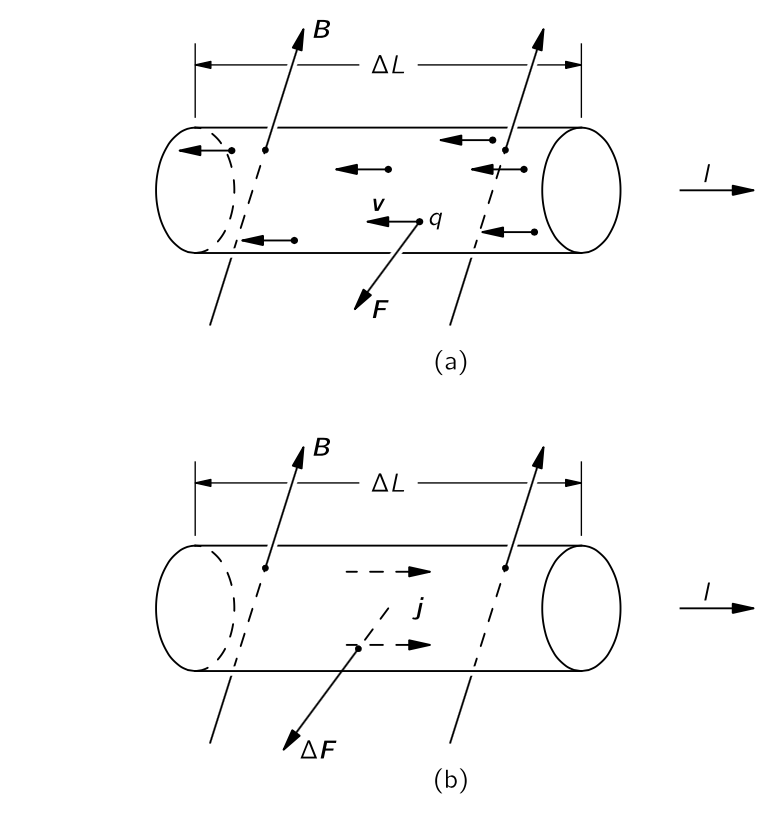{#fig-FLP_2_13_5 width=450}

전류가 흐르는 도선에 작용하는 힘을 자기장으로부터 구할 수 있다. 전류는 도선을 따라 속도 $\bf{v}$ 로 움직이는 전하들로 구성된다. 각 전하는 

$$
\bf{F}=q\bf{v}\times \bf{B}
$$

의 힘을 받는다. 단위 부피당 $n$ 개의 전하가 있는 경우, 도선의 $ΔV$ 만큼의 부피 성분에서 받는 힘 $\Delta \bf{F}$ 는

$$
\Delta \bf{F}=(n\Delta V)(q\bf{v}\times \bf{B})
$$

이다. 여기서 $\bf{J}=nq\bf{v}$ 이므로

$$
\Delta \bf{F} = (\bf{J}\times \bf{B}) \Delta V 
$$ {#eq-FLP_2_13_9}

이다. 즉 도선은 단위 부피당 $\bf{J}\times \bf{B}$ 만큼의 힘을 받는다. 전류가 단면적이 $A$ 인 도선에서 균일하면, 부피 요소로 면적 $A$ 와 길이 $\Delta L$ 인 원통으로 간주 할 수 있다. 그렇다면

$$
\Delta \bf{F} = \bf{J}\times \bf{B} A\Delta L
$$ {#eq-FLP_2_13_10}

이며, 이제 우리는 $\bf{J}A$ 를 전선의 벡터 전류 $\bf{I}$ 라고 부를 수 있다. 이에대해 

$$
\Delta \bf{F} = \bf{I} \times \bf{B} \Delta L
$$ {#eq-FLP_2_13_11}

이므로 도선에 가해지는 단위길이당 힘은 $\bf{I} \times \bf{B}$ 이다.

즉 전하가 이동함에 따라 전선에 작용하는 자기력은 전체 전류에만 의존하고 각 입자가 운반하는 전하의 양—또는 그 부호—에 의존하지 않는다는 것을 보여준다. 

 

### $\textrm{II}$.13-4 정상 전류의 자기장과 앙페어 법칙 {#sec-FLP_2_13_4}

#### **정자기학의 멕스웰 방정식**

이재 자기장이 존재할 따 흐르는 전류에 힘이 작용한다는 사실을 알게 되었다. 작용-반작용 원리에 따르면 전류 역시 자기장의 원천에 힘을 가해야 한다. 이 힘은 전류가 흐르는 전선 근처에서의 나침반 바늘의 움직임으로 확인 할 수 있다. 우리는 자석이 다른 자석으로부터 힘을 받는다는 사실을 알고 있으며, 따라서 전선에 전류가 흐르면 그 전선 자체가 자기장을 발생시킨다. 즉 움직이는 전하는 자기장을 만든다. 이제 질문은 주어진 전류가 만드는 자기장은 무엇인가 이다. 이 질문에 대한 답은 세 번의 비판적 실험과 앙페르가 제시한 뛰어난 이론적 논증을 통해 실험적으로 결정되었다. 이 흥미로운 역사적 전개는 건너 뛰고 단지 맥스웰 방정식의 타당성을 입증했다는 말로 갈음한다. 멕스웰 방정식, 그중에서도 시간미분 항을 제외한 아래 식을 출발점으로 한다. 이를 **정자기학(magnetostatics)** 이라고 하자. 

$$
\boxed{\nabla \bf{\cdot B} = 0.}
$$ {#eq-FLP_2_13_12}

$$
\boxed{\nabla \times \bf{B} = \mu_0 \bf{J}.}
$$ {#eq-FLP_2_13_13}

정적 자기 상황이 존재한다는 것이 다소 위험하다고 볼 수 있다. 왜냐하면 자기장을 얻기 위해서는 전류가 존재해야 하며, 전류는 움직이는 전하에서만 발생할 수 있기 때문이다. 따라서 **Magnetostatics** 는 많은 전하가 움직이는, 따라서 이 흐름을 일정한 전하의 흐름으로, 즉 $\bf{J}$ 를 시간에 따라 변하지 않는 일정한 값으로 근사할 수 있는 상황에서의 근사값이다. 따라서 정자기학 보다는 “정상 전류학” 이라고 부르는 것이 더 적합할 수도 있다. 모든 장이 정상상태라고 가정하면, 멕스웰 방정식에서 $\partial \bf{E}/\partial t$ 와 $\partial \bf{B}/\partial t$ 를 모두 $0$ 으로 놓을 수 있고 @eq-FLP_2_13_12 와 @eq-FLP_2_13_13 을 얻는다. 또한 모든 벡터 $\nabla \bf{\cdot}(\nabla \times \bf{B})=0$ 이므로, $\nabla \bf{\cdot J} = 0$ 이다. 정상상태의 경우 @eq-FLP_2_13_8 에서 $\partial \rho/\partial t=0$ 이므로 이것은 일관된다. 하지만 $\bf{E}$ 가 시간에 따라 변하지 않는다면, 우리의 가정은 일관된다.

#### **자기 전하는 없다**

$\nabla \bf{\cdot J}=0$ 이라는 조건은 닫힌 경로에서 흐르는 전하만을 고려한다는 의미이다. 전하가 닫힌 경로를 흐를 때 이를 **회로(circuit)** 라고 한다. 회로에는 전하가 흐르도록 하는 발전기나 배터리가 포함될 수 있으며 충전 중이거나 방전중인 축전지를 포함하지 않을 수도 있다. 

이제 식들을 살펴보자. $\nabla \bf{\cdot B}=0$ 과 $\nabla \bf{\cdot E}=ρ/\epsilon_0$ 를 비교하면 전하의 자기적 유사체가 존재하지 않는다는 의미이다. 즉 $\bf{B}$ 선이 발생할 수 있는 자기 전하는 존재하지 않는다. 벡터장 $\bf{B}$ 의 “선”을 기준으로 생각해보면, 이들은 결코 시작도 할 수 없으며 멈추지도 않는다. 그렇다면 그들은 어디에서 왔을까? 자기장은 전류가 존재할 때 나타나며, $\nabla \times \bf{B}$ 는 전류 밀도 $\bf{J}$ 에 비례한다. 전류가 있는 곳마다 전류를 중심으로 순환하는 자기장의 선이 존재한다. $\bf{B}$ 의 선은 시작도 끝도 없기 때문에, 종종 스스로 닫혀서 닫힌 루프를 만든다. 하지만 선이 단순한 닫힌 루프가 아닌 복잡한 상황도 있을 수 있다. 하지만 무엇이 됬든 모든 위치에서 $\nabla \bf{\cdot B}=0$ 이다. 자기 전하(magnetic charge) 가 발견된 적이 없으니 $\nabla \bf{\cdot B}=0$ 이다. 이것은 정자기학에서만이 아니라 언제나 그렇다. 

#### **앙페어의 법칙**

$\bf{B}$ 와 전류 사이의 연관성은 @eq-FLP_2_13_13 에 포함되어 있다. 정전기학에서는 $\nabla \times \bf{E}=0$ 이며 이로부터 닫힌 경로 $\Gamma$ 에 대해

$$
\oint_{\Gamma} \bf{E}\cdot d\bf{l}=0
$$

을 얻었다. 같은 스토크스 정리를 @eq-FLP_2_13_13 에 적용하면

$$
\oint_\Gamma \bf{B\cdot}\,d\bf{l} = \int_S(\nabla \times \bf{B})\,d\bf{a} = \mu_0 \int_S \bf{J\cdot}d\bf{a}
$$ {#eq-FLP_2_13_15}

를 얻는다. 여기서 $S$ 는 닫힌 경로 $\Gamma$ 를 경계로 갖는 임의의 표면이다. $\int_S \bf{J\cdot}d\bf{a}$ 는 표면 $S$ 를 통과하는 총 전류 $I$ 이다. 정상 전류의 경우 $S$ 를 흐르는 전류는 $S$ 의 형태와 무관하므로 보통 "루프 $\Gamma$ 를 통과하는 전류" 라고 말한다. 이를 $I_\Gamma$ 라고 하면 

$$
\oint_\Gamma \bf{B\cdot}\,d\bf{l} = \mu_0 I_\Gamma
$$

이며 이를 **앙페어의 법칙** 이라고 한다. 

 

### $\textrm{II}$.13–5 직선 도선과 솔레노이드의 자기장, 그리고 원자 전류 {#sec-FLP_2_13_5}

[$^1$[비오-사바르의 법칙(Biot-Savart’s law)](https://julia-kaeri.github.io/ClassicalPhysics/src/Electrodynamics/03_magnetostatics.html#sec-ED_MS_ampere_law_and_biot_savart_law) 을 통해 보일 수 있다.]{.aside}

::: {#exm-FLP_magnetic_field_around_current}

#### 직선 도선의 전류에 의한 자기장

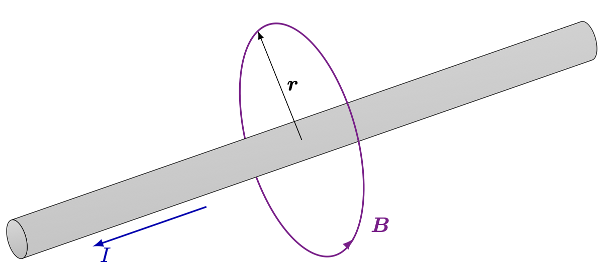{#fig-FLP_2_13_7 width=450}

원통형 단면을 가진 긴 직선형 전선 외부의 자기장을 구해보자. **$\bf{B}$ 의 필드 라인이 전선을 닫힌 원으로 돈다는 것을 가정하겠다**$^1$. 이것은 지금까지의 지식으로는 명백하지 않지만 사실이다. 이것을 가정하면 $\bf{B\cdot} d\bf{l}$ 선적분은 매우 쉽다. 반지름 $r$ 에 대해

$$
\oint \bf{B\cdot}\,d\bf{l} = 2\pi rB
$$

이며 $\int \bf{J\cdot}d\bf{a} = I$ 이므로

$$
B=\dfrac{\mu_0}{2\pi } \dfrac{I}{r}
$$ {#eq-FLP_2_13_17}

이다. 이 식을 벡터식으로 표현하면 다음과 같다.

$$
\bf{B}=\dfrac{\mu_0}{2\pi} \dfrac{\bf{I}\times \hat{\bf{r}}}{r}.
$$ {#eq-FLP_2_13_18}

:::

전류가 자기장을 만들고 이 자기장은 주변의 전류에 힘을 가한다. 두 평행한 전선은 각각이 다른 전선에 의한 $\bf{B}$ 에 직각이므로 전류가 같은 방향일 때는 서로 끌어당기고, 반대방향일때는 서로 밀어낸다.

 

::: {#exm-ED_MS_magnetic_field_due_to_solenoid}

#### 솔레노이드 내부의 자기장

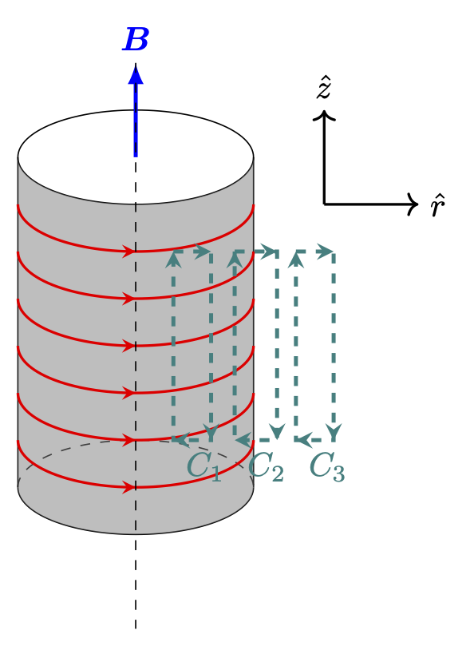{#fig-FLP_2_13_8r width=200}

위의 그림과 같이 배치된 솔레노이드를 생각하자. 도선을 단위 길이당 $n$ 번을 감았다고 하자. 원통좌표계 $(r,\,\theta,\,z)$ 에서 생각하자. $\pm z$ 양쪽으로 아주 길다고 생각한다. 대칭에 의해 자기장은 $r$ 에만 의존하며 방향은 $\hat{z}$ 이다. 즉 $\bf{B}(\bf{r}) = B(r)\hat{\bf{z}}$ 이다. 초록색으로 표현된 경로 $C_1,\,C_2,\,C_3$ 를 생각하자. 가로 폭이 매우 작고 높이를 $L$ 이라고 하자. 이 가운데 $C_1,\,C_3$ 경로에 대한 적분으로부터

$$
\int_{C_1}\bf{B}\cdot d\bf{s} = 0,\qquad \int_{C_3} \bf{B}\cdot d\bf{s}=0
$$

이므로 내부와 외부에서 각각 자기장은 상수이다. 각각 $B_{\text{in}}(r),\, B_{\text{out}}(r)$ 이라고 하자. 

$C_2$ 경로에 대한 적분으로부터

$$
B_\text{in}(r)L - B_\text{out}(r)L = N\mu_0 I
$$

을 얻는다. 여기서 $N$ 은 $L$ 길이에서 감은 횟수이다. 그런데 $B_\text{out}(r\to\infty) = 0$ 이어야 하므로 외부 자기장은 $0$ 이며 솔레노이드 내부의 자기장은

$$
\bf{B}_{\text{in}}(r) = n\mu_0 I \hat{\bf{z}}
$$

이다.

:::

 

$\bf{B}$ 의 선이 솔레노이드 끝에서는 어떨까? 아마도, 그들은 어떤 식으로든 퍼진 뒤 반대쪽 끝에서 솔레노이드에 다시 들어가며, 이는 @fig-FLP_2_13_9 와, 그리고 막대 자석의 그것과 같다. 그렇다면 자석이란 도대체 무엇인가? 우리 방정식은 $\bf{B}$ 가 전류의 존재에서 비롯된다고 말한다. 하지만 우리는 일반적인 쇠막대기도 배터리나 발전기가 없어도 자기장을 발생시킨다는 것을 알고 있다. 혹시 @eq-FLP_2_13_12 나 @eq-FLP_2_13_13 의 오른쪽에 **자석의 밀도** 혹은 그와 같은 양을 나타내는 다른 항이 있어야 할 것 같은 생각할 수도 있다. 하지만 그런 항은 없으며, 우리 이론에 따르면, 철의 자기 효과는 이미 $\bf{J}$ 항으로 처리되고 있는 어떤 내부 전류에서 비롯된 것이다.

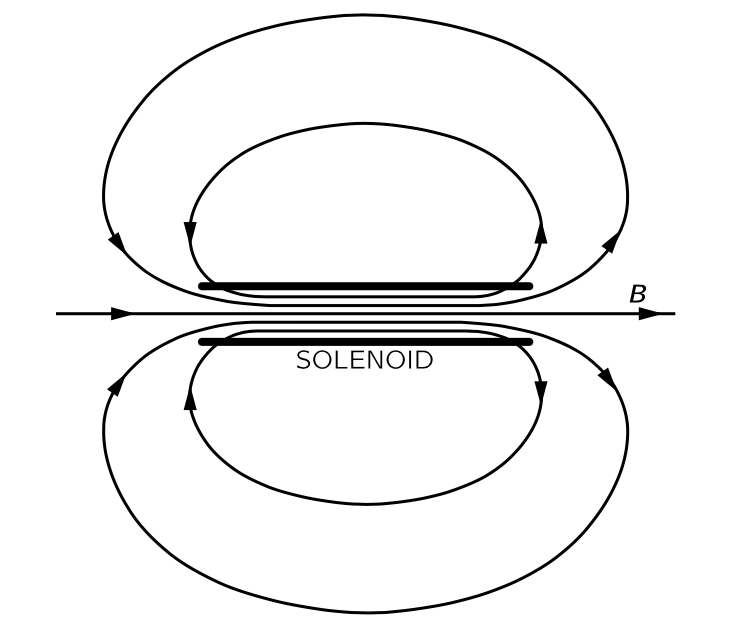{#fig-FLP_2_13_9 width=350}

유전체를 다룰 때 보았듯이 물질은 근본적인 관점에서 볼 때 매우 복잡하다. 지금의 진행을 방해하지 않기 위해, 철과 같은 자기 재료의 내부 메커니즘에 대해서는 나중에 자세히 다룰 것이다. **현재로서는 모든 자기는 전류에 의해 생성되며, 영구자석에는 영구적인 내부 전류가 존재한다는 점을 받아들여야 한다**. 철의 경우, 이러한 전류는 전자가 자신의 축을 중심으로 회전하는 데서 비롯된다. 모든 전자는 이런 스핀을 가지고 있으며, 이는 아주 작은 순환 전류에 해당한다. 물론, 하나의 전자는 많은 자기장을 생성하지 않지만, 일반적인 물질에는 엄청나게 많은 수의 전자가 존재한다. 보통 이것들은 임의의 방향으로 회전하므로 서로 상쇄된다. 그러나 철과 같은 매우 소수의 물질에서 전자의 큰 비율이 같은 방향의 축으로 회전한다는 것이다—철의 경우 각 원자마다 두 개의 전자가 여기에 참여한다. 막대 자석에서는 같은 방향으로 회전하는 많은 전자가 있으며, 그 전체 효과는 막대 표면을 순환하는 전류와 동일하다. (이는 우리가 유전체에 대해 발견한 것—균일하게 편광된 유전체는 그 표면에 전하가 분포한다-는 것과 동등하다.) 따라서, 막대 자석이 솔레노이드와 동등하다는 것은 우연이 아니다.

 

### $\textrm{II}$.13–6 자기장과 전기장의 상대성 {#sec-FLP_2_13_6}

#### **로런츠 힘과 관성기준틀**

로런츠 힘 @eq-FLP_2_13_1 에서 보듯 전하에 가해지는 자기력이 전하의 속도에 비례한다. 그렇다면 어떤 관성기준틀에서의 속도를 의미하는가? 여기서의 속도는 우리가 선택한 기준틀에서의 속도이다. 하지만 우리는 자기장을 지정하기 위한 적절한 기준틀에 대해서는 아무 말도 하지 않았다. 결론적으로 어떤 관성 프레임이라도 사용할 수 있다. 이제 우리는 자기와 전기가 독립된 것이 아니라는 것, 뿐만 아니라 항상 하나의 온전한 전자기장으로 같이 받아들여한다는 것을 알게 될 것이다. 정적인 경우에는 맥스웰 방정식이 전기에 대한 한 쌍과 자기에 대한 한 쌍을 가진 두 개의 뚜렷한 쌍으로 분리되며, 두 장 사이에 명백한 연관성이 없지만, 그럼에도 불구하고 자연 자체에서는 상대성 원리에서 비롯된 매우 밀접한 관계가 존재한다. 역사적으로 상대성 원리는 맥스웰 방정식 이후에 발견되으며 실제로 전기와 자기에 대한 연구가 결국 아인슈타인의 상대성 원리 발견으로 이어졌다. 이제 상대성 원리가 전자기학에 적용된다고 가정했을 때 상대성이론이 자기력에 대해 무엇을 알려줄지 살펴보자.

@fig-FLP_2_13_10 과 같이 전류가 흐르는 전선에 평행한 속도 $v_0$ 로 음전하가 움직일 때 두 개의 관성기준틀에서 무슨 일이 일어나는지 알아보자 : (a) 와 같이 전선에 고정된 기준틀 $S$ 와 (b) 와 같이 입자에 대해 고정된 기준틀 $S'$.

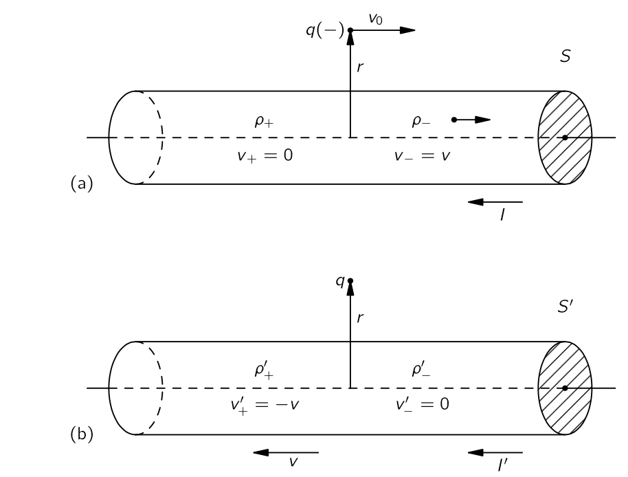{#fig-FLP_2_13_10 width=450}

#### **전선이 정지한 기준틀에서**

$S$ 기준틀에서는 입자에 전선을 향한 자기력이 작용한다. 하지만 $S'$ 기준틀에서는 입자의 속도가 $0$ 이기 때문에 입자에 대한 자기력이 존재할 수 없다. 상대성 원리에 따르면 $S'$ 에서도 입자가 전선에 더 가깝게 이동하는 것을 볼 수 있어야 한다. 이제 우리는 전류가 흐르는 전선에 대한 원자적 설명으로 돌아가보자. 구리와 같은 일반 전도체에서 전류는 전도전자라고 불리는 전자의 움직임에서 발생하며, 양전하와 나머지 전자는 물질의 몸체에 고정되어 있다. 전도 전자의 전하 밀도를 $\rho_−$ 라고 하고, $S$ 에서의 속도를 $\bf{v}$ 라고 하자. $S$ 에서 정지 전하의 밀도는 $\rho_+$ 이며, $\rho_+ = - \rho_-$ 이어야 한다. 따라서 전선 외부에는 전기장이 없으며, 움직이는 입자에 작용하는 힘은 단지

$$
\bf{F} = q\bf{v}_0\times \bf{B}
$$

이다. @eq-FLP_2_13_18 로부터 입자에 전선 방향으로 아래와 같은 크기의 힘이 가해진다는 것을 안다.

$$
F = \dfrac{\mu_0}{2\pi}\dfrac{Iqv_0}{r}
$$

@eq-FLP_2_13_3 과 @eq-FLP_2_13_5 로 부터 전선의 단면적 $A$ 에 대해 $I = \rho_- vA$ 임을 안다. 따라서

$$
F = \dfrac{\mu_0}{2\pi}\dfrac{q\rho_- Avv_0}{r}
$$ {#eq-FLP_2_13_20}

이다. 임의의 $v$ 와 $v_0$ 에 대해 다룰 수도 있지만, 입자의 속도 $v_0$ 가 전도 전자의 속도 $v$ 와 동일한 특수한 경우를 살펴보자. 이 경우

$$
F=\dfrac{\mu_0}{2π}\dfrac{\rho_− Av^2}{r}
$${#eq-FLP_2_13_21}

이다. 

#### **전하가 정지한 기준틀에서**

이제 $S'$ 기준틀에서 생각하자. 전선과 함께 움직이는 양전하에 의해 입자에 자기장 $\bf{B}'$ 가 가해지지만 정지한 입자에는 자기력이 없으며 따라서 입자에 힘이 작용한다면 그것은 전기장 때문이어야 한다. 움직이는 전선이 전기장을 발생시키는 경우는 전선이 전하를 띤 것처럼 보일 때만 그렇다. 즉 전류가 흐르는 중성 전선은 움직일 때 대전된 것처럼 보여야 한다.

$S'$ 기준틀에서 전선의 전하 밀도를 우리가 $S$ 기준틀에 대해 알고 있는 것을 통해 계산해보자. 일견 그들이 동일하다고 생각할 수 있지만, 우리는 길이가 $S$ 와 $S'$ 사이에 변한다는 것을 알고 있으며, 이에 따라 부피도, 그리고 전하 밀도 역시 바뀐다.

$S'$ 에서의 전하 밀도를 결정하기 전에, 전하가 움직일 때 여러 전자의 전하가 어떻게 되는지 알아야 한다. 우리는 상대성 이론에서 많은 양이 $1/\sqrt{1-v^2/c^2}$ 에 따라 변한다는 것을 알고 있다. 그러나 전하는 속도와 무관하게 동일하다. 

대전되지 않은 물질 한덩이, 예를 들면 도체를 가져왔다고 하자. 여기에 열을 가하면 전자는 양성자와 질량이 다르기 때문에 전자와 양성자의 속도는 다르다. 입자의 전하가 그 입자를 운반하는 입자의 속도에 의존한다면, 가열된 블록에서는 전자와 양성자의 전하가 더 이상 균형을 이루지 않으며, 따라서 가열될 때 대전된다. 이 덩이 내의 모든 전자의 전하가 매우 작은 비율이라도 변화를 일으키면 거대한 전기장이 발생할 것이다. 그러나 한번도 이런 현상은 관측되지 않았다. 

또한, 물질 내 전자의 평균 속도가 화학 조성에 따라 달라진다는 점을 지적할 수 있다. 전자의 전하가 속도에 따라 변한다면, 물질의 순전하가 화학 반응에서 변하게 된다. 간단한 계산에 따르면 전하가 속도에 거의 의존하지 않더라도 가장 단순한 화학 반응에서 거대한 전기장을 얻을 수 있다. 그러한 효과 역시 관찰된 적이 없으며, 따라서 **단일 입자의 전하량은 그 운동 상태와 무관하다**고 결론지을 수 있다.

입자의 전하 $q$ 는 좌표계와 무관한 불변 스칼라량이므로 거리의 상대론적 수축 때문에 부피가 변할 수 있다는 사실에 대해서만 생각하면 된다. 전선의 길이를 $L_0$ 라고 하면 그 안의 정상상태의 전하(stationary charge)$^2$의 밀도 $\rho_0$ 를 생각할 수 있으며, $Q=\rho_0 L_0 A_0$ 만큼의 전하를 포함한다. 이 전하를 속도 $v$ 로 움직이는 다른 기준틀에서 에서 보면, 이 전하들은 더 짧은 길이 에서 발견되며 그 길이 $L$ 은 [$^2$ 전하를 이루는 개별적인 입자는 이동하지만 계속 채워져서 밀도 자체는 변하지 않는다는 의미에서의 stationary]{.aside}

$$
L = L_0\sqrt{1−v^2/c^2}
$$ {#eq-FLP_2_13_22}

이다. 그러나 도선의 면적 $A_0$ 은 동일하다. 

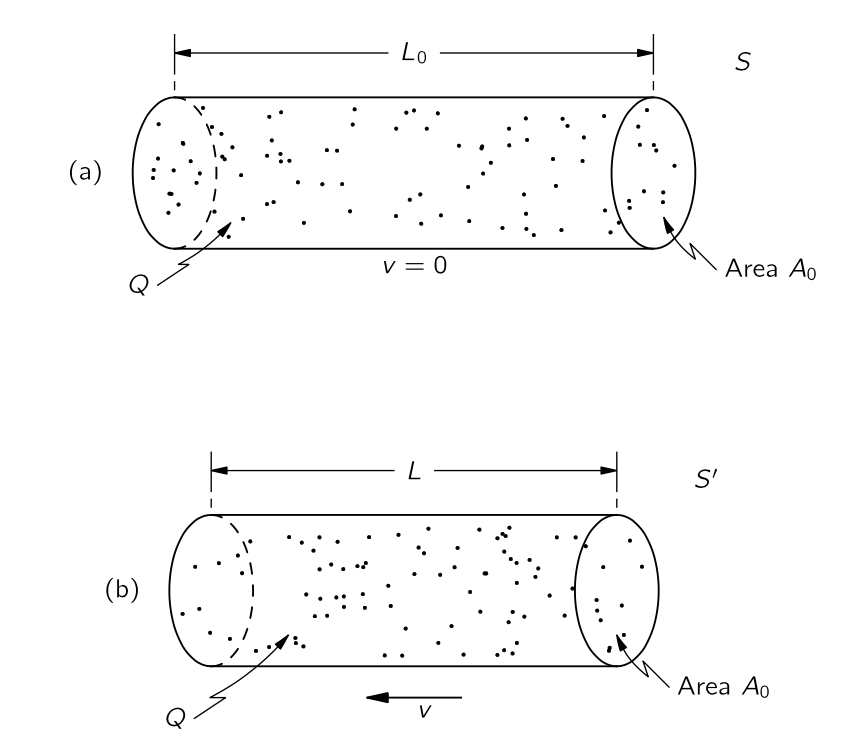{#fig-FLP_2_13_11 width=450}

$\rho$ 를 전하들이 이동하는 기준틀에서의 밀도라고 하면, 전체 전하 $Q=\rho LA_0$ 이며 전하가 모든 시스템에서 동일하기 때문에 $ρ_0 L_0 A _0$ 와 같아야 한다. 따라서 $\rho L=\rho_0 L_0$ 이며 @eq-FLP_2_13_22 로부터

$$
\rho = \dfrac{\rho_0}{\sqrt{1−v^2/c^2}}
$$ {#eq-FLP_2_13_23}

이다. 전하의 이동 분포에서 전하 밀도가 변한다.

이제 이 결과를 우리 도선의 양전하 밀도 $\rho_+$ 에 사용한다. 이 전하들은 $S$ 기준틀에서 멈춰 있지만 $S'$ 기준틀에서 전선이 속도 $v$로 움직이는 경우, 양전하 밀도는

$$
\rho'_+ = \dfrac{\rho_+}{\sqrt{1−v^2/c^2}}
$$ {#eq-FLP_2_13_24}

이다. 음전하는 $S'$ 기준틀에서 정지되어 있으므로 이 기준틀에서 정지 밀도 $\rho_0$ 를 가지고 있다. @eq-FLP_2_13_23 으로부터 $\rho'_− = \rho_0$ 인데 이는 전선이 정지한 경우, 즉 $S$ 기준틀에서 음전하의 속도가 $v$ 인 경우 밀도 $ρ_−$ 를 갖기 때문이다. 전도 전자에 대해서는

$$
\rho_− = \dfrac{\rho'_−}{\sqrt{1−v^2/c^2}}
$$ {#eq-FLP_2_13_25}

혹은

$$
\rho'_- = {\rho_−}{\sqrt{1−v^2/c^2}}
$$ {#eq-FLP_2_13_26}

이다. 이제 $S'$ 기준틀에 전기장이 왜 존재하는지 알 수 있다. $S'$ 기준틀에서 전선은 순전하 밀도 $\rho'= \rho'_+ + \rho'_−$ 를 가지고 있기 때문이다. @eq-FLP_2_13_24 와 @eq-FLP_2_13_26 으로부터

$$
\rho' = \dfrac{\rho_+}{\sqrt{1−v^2/c^2}} + \rho_− \sqrt{1−v^2/c^2}
$$

을 얻는다. 정지된 전선은 중성이므로 $\rho_- =− \rho_+$ 이며, 따라서 

$$
\rho' = {\rho_+}\dfrac{v^2/c^2}{\sqrt{1-v^2/c^2}} 
$$  {#eq-FLP_2_13_27}

이다. 움직이는 전선은 양전하를 띄며 외부 고정 입자에 전기장 $\bf{E}'$ 를 가한다. 원통 축으로부터 거리 $r$ 인 위치에서의 전기장의 크기는

$$
E'=\dfrac{\rho' A}{2\pi\epsilon_0 r} = \dfrac{\rho_+ A v^2/c^2}{2\pi \epsilon_0 r\sqrt{1−v^2/c^2}}
$$ {#eq-FLP_2_13_28}

이다. 음전하를 띤 입자에 전선을 향하는 힘이 작용한다. 우리는 최소한 두 관점에서 같은 방향의 힘을 가지고 있다; $S'$ 에서의 전기력은 $S$ 에서의 자기력과 같은 방향을 가지고 있다.

$S'$ 에서 힘의 크기는

$$
F'=\dfrac{q}{2 \pi \epsilon_0}\dfrac{\rho_+A}{r}\dfrac{v^2/c^2}{\sqrt{1−v^2/c^2}}
$$ {#eq-FLP_2_13_29}

이다. $F'$ 에 대한 이 결과를 @eq-FLP_2_13_21 에서의 $F$ 와 비교하면, 그리고 $c^2=1/(\epsilon_0 \mu_0)$ 를 이용하면

$$
F'=\dfrac{F}{\sqrt{1−v^2/c^2}}
$$ {#eq-FLP_2_13_30}

이다. $v \ll c$ 인 경우 두 힘은 동일하다. 거기에 한 기준틀에서 다른 기준틀로 변환할 때도 힘도 변환된다는 사실을 고려한다면, 일어나는 일을 바라보는 두 가지 방식이 어떤 속도에서도 동일한 물리적 결과를 제공한다는 것을 알 수 있다.

힘이 잠시 작용한 후 입자의 모멘텀은 $S$ 기준틀과 $S'$ 기준틀에서 모두 동일해야 한다. 이제 $\Delta p_y$ 와 $\Delta p'_y$ 를 비교해보자. 상대론적으로 올바른 운동방정식인 $\bf{F}=d\bf{p}/dt$ 를 사용하면, 

$$
\Delta p_y = F\Delta t
$$ {#eq-FLP_2_13_31}

이다. $S'$ 기준틀에서는 다음과 같다.

$$
\Delta p'_y = F'\Delta t'.
$$ {#eq-FLP_2_13_32}

또한 우리는

$$
\Delta t=\dfrac{\Delta t'}{\sqrt{1−v^2/c^2}}
$$ {#eq-FLP_2_13_33}

임을 안다. 그리고 @eq-FLP_2_13_31 과 @eq-FLP_2_13_32 로부터

$$
\dfrac{\Delta p'_y}{\Delta p_y} = \dfrac{F'\Delta t'}{F\Delta t} = 1
$$

임을 안다.

우리는 전선에 대해 정지한 기준틀에서 전선을 따라 움직이는 입자의 움직임을 분석하든, 입자에 대해 정지한 기준틀에서든 동일한 물리적 결과를 얻는다는 것을 확인했다. 

만약 다른 기준틀을 선택했더라도, $\bf{E}$ 와 $\bf{B}$ 필드의 다른 혼합을 발견했을 것이다. 전기와 자기력은 입자 간의 전자기 상호작용이라는 물리 현상의 일부이며 이 상호작용을 전기적 및 자기적 부분으로 구분하는 것은 설명에 선택된 기준틀에 크게 좌우된다. 하지만 완전한 전자기 설명은 불변이며, 전기와 자기를 함께 사용할 경우 아인슈타인의 상대성 이론과 일치한다.

전기장과 자기장은 기준 프레임을 바꾸면 서로 다른 혼합물로 나타나므로, $\bf{E}$ 와 $\bf{B}$ 를 보는 방식에 주의해야 한다. 예를 들어, $\bf{E}$ 나 $\bf{B}$ 의 **선**을 생각하더라도, 우리는 그것에 너무 많은 현실성을 부여해서는 안된다. 다른 좌표계에서 선을 관찰하려고 하면 선이 사라질 수 있다. 예를 들어, $S'$ 기준틀에는 전기장의 선이 존재하지만, $S$ 기준틀에서는 에서 속도 $\bf{v}$ 로 우리를 지나가는 것을 찾을 수 없다. 시스템 $S$ 에는 전기장 선이 전혀 없다! 따라서 "자석을 움직일 때, 자석은 그 자기장을 함께 가져가므로 $\bf{B}$ 의 선도 이동한다" 라는 말은 완전히 틀린 말이다. 일반적으로 “이동하는 장의 선의 속도”라는 개념은 아무 의미가 없다. 장은 우리가 공간의 한 지점에서 일어나는 일을 설명하는 방법이다. 특히, $\bf{E}$ 와 $\bf{B}$ 는 움직이는 입자에 작용할 힘에 대해 알려준다. “이동하는 자기장으로부터 전하에 작용하는 힘은 무엇인가?” 라는 질문은 무의미하다. 힘은 전하에서 $\bf{E}$ 와 $\bf{B}$ 의 값에 의해 주어지며, $\bf{E}$ 또는 $\bf{B}$ 의 소스가 움직이더라도 @eq-FLP_2_13_11 은 변하지 않는다. 운동에 의해 변경되는 것은 $\bf{E}$ 와 $\bf{B}$ 의 값이다. 전기장이나 자기장은 어떤 관성기준틀에서의 $x,\,y,\,z,\,t$ 의 함수이다.

우리는 나중에 “우주를 통과하는 전기 및 자기장의 파동”, 예를 들어 빛 파동에 대해 이야기하게 될 것이다. 하지만 그것은 마치 줄을 타고 이동하는 파동에 대해 말하는 것과 같다. 이것은 줄의 일부가 파동 방향으로 움직이고 있다는 뜻이 아니라, 줄의 변위가 먼저 한 곳에서 나타났다가 나중에 다른 위치에 나타난다는 의미이다. 마찬가지로 전자기파에서는 파동이 이동하지만, 장의의 크기는 변한다. 따라서 앞으로 “이동하는” 장에 대해 말한다면 이것은 특정 상황에서 변화하는 장을 설명하는 간편한 표현으로 생각해야 한다.

 

### $\textrm{II}$.13–7 전류와 전하의 변환 {#sec-FLP_2_13_7}

위에서 입자와 전도 전자에 대해 동일한 속도 $v$ 를 적용한 단순화가 너무 지나친것은 아닌가? 이 속도를 다르게 해서 다시 분석할 수도 있지만 이것보다는 전하와 전류 밀도가 4벡터를 이룬다는 것을 알아채는 것이 더 쉽다. $\rho_0$ 가 전하들들이 멈춘 기준틀에서의 밀도라면, 속도가 $\bf{v}$ 인 프레임에의 밀도는

$$
\rho =\dfrac{\rho_0}{\sqrt{1−v^2/c^2}}
$$

이며, 이 프레임에서 전류 밀도

$$
\bf{J}=\rho\bf{v}=\dfrac{\rho_0 \bf{v}}{\sqrt{1−v^2/c^2}}
$${#eq-FLP_2_13_34}

이다. 속도 $\bf{v}$ 로 움직이는 입자의 에너지 $U$ 와 운동량 $\bf{p}$ 가 다음과 같이 주어진다는 것을 안다.

$$
U=\dfrac{mc^2}{\sqrt{1−v^2/c^2}},\qquad \bf{p}=\dfrac{m\bf{v}}{\sqrt{1−v^2/c^2}}
$$

우리는 또한 $U/c = mc/\sqrt{1−v^2/c^2}$ 와 $\bf{p}$ 가 $P^\mu=(U/c,\,\bf{p})$ 의 4-벡터를 형성한다는 것을 안다. 이와 같이 $J^\mu=(c\rho,\,\bf{J})$ 역시 4-벡터를 이룬다는 것을 알 수 있다. 만약 우리가 $\rho$ 와 $\bf{J}$ 를 $x$ 방향으로 속도 $u$ 로 가 움직이는 좌표계로 변환하고자 한다면 시공간의 로런츠 변환 @eq-FLP_1_15_3 에 대해 다음이 성립한다.

$$
\begin{aligned}
J'^0 &= c\rho' = \dfrac{J^0- uJ^1/c}{\sqrt{1-u^2/c^2}}, \\[0.3em]
J'^1 &= J'_x = \dfrac{J^1-uJ^0/c}{\sqrt{1-u^2/c^2}}, \\[0.3em]
J'^2 &= J'_y = J^2, \\[0.3em]
J'^3 &= J'_z = J^3.
\end{aligned}
$$ {#eq-FLP_2_13_35}

위 식을 통해 한 기준틀의 전하와 전류를 다른 기준틀의 전하와 연결할 수 있다. 두 기준틀의 전하와 전류를 취하면 맥스웰 방정식을 사용하여 해당 기준틀에서 전자기 문제를 해결할 수 있다. 입자 운동에 대한 결과는 어떤 기준틀을 선택하든 동일하다. 우리는 나중에 전자기장의 상대론적 변환을 살펴볼 것이다.

 

### $\textrm{II}$.13-8 중첩과 오른손 법칙 {#sec-FLP_2_13_8}

이 장을 마무리하며 정자기학에 관한 두 가지 사항을 알아보자. 먼저 자기장에 대한 우리의 기본 방정식

$$
\nabla \bf{\cdot B}=0, \qquad \nabla \times \bf{B}= \mu_0 \bf{J}
$$

은 $\bf{B}$ 와 $\bf{J}$ 에 대해 선형이다. 이것은 중첩 원리가 자기장에도 적용된다는 것을 의미한다. 즉 두 개의 서로 다른 정상 전류에 의해 생성된 자기장은 각 전류가 단독으로 작용하는 개별 자기장들의 합이다. 두 번째는 소위 오른쪽 규칙에 관한 것이다. 앞서 철 자석의 자화가 물질 내 전자의 스핀을 통해 이해될 수 있음을 보았다. 회전하는 전자의 자기장의 방향은 오른쪽 규칙으로 그 스핀 축과 연관된다. $\bf{B}$ 벡터 외적 혹은 컬(curl) 에 의해 정해지므로 소위 **축벡터(axial vector)** 이다. 반면에 변위, 속도, 힘 및 $\bf{E}$ 는 **극벡터 (polar vector)** 라고 한다. 축벡터는 오른쪽 혹은 왼쪽 편향성을 가지고 있다.

그러나 전자기학에서 물리적으로 관찰할 수 있는 양은 오른쪽(또는 왼쪽)이 아니다. 전자기 상호작용은 반사연산에 대해 대칭이다. 두 전류 사이의 자기력은 손 규칙의 변화에 대해 불변이다. 우리의 방정식은 오른쪽 규칙과는 반대로, 평행 전류가 끌어당기거나 반대 방향의 전류가 밀어낸다는 것을 보여준다. 인력 혹은 쳑력은 극벡터이다. 이는 모든 완전한 상호작용을 설명할 때 오른쪽 법칙을 두 번 사용하기 때문에 발생한다. 한 번은 전류에서 $\bf{B}$ 를 구할 때, 또 한 번은 $\bf{B}$ 가 두 번째 전류에 가하는 힘을 구할 때. 오른쪽 규칙을 두 번 사용하는 것은 왼쪽 규칙을 두 번 사용하는 것과 동일하다. 만약 우리가 규칙을 왼쪽 시스템으로 바꾼다면, 모든 $\bf{B}$ 는 뒤집히게 되지만, 모든 힘—또는 아마도 더 관련성이 높은 것은 물체의 관측된 가속도—은 변하지 않을 것이다.

물리학자들은 최근에 놀랍게도 모든 자연 법칙이 거울 반사에 대해 항상 불변하지 않다는 사실을 발견했지만, 전자기학의 법칙은 그러한 기본적인 대칭성을 가지고 있다.

 

## $\textrm{II}$.14 다양한 상황에서의 자기장 {#sec-FLP_2_14}

### $\textrm{II}$.14-1 벡터 포텐셜 {#sec-FLP_2_14_1}

자기장은 우리의 기본 방정식에 의해 전류와 관련이 있다.

$$
\nabla\bf{\cdot B}=0,
$$ {#eq-FLP_2_14_1}

$$
\nabla \times \bf{B}=\mu_0 \bf{J},
$$ {#eq-FLP_2_14_2}

이제 이러한 방정식들을 특별한 대칭이나 직관적인 추측 없이 수학적으로 풀어보자. 정전기학에서 우리는 모든 전하의 위치가 알려졌을 때 전기장을 구하기 위해 정전 포텐셜 $\Phi$ 를 계산하고 이를 미분하여 전기장을 구했다. 정자기학에서도 모든 이동전하의 전류 밀도 $\bf{J}$ 를 알 경우 자기장 $\bf{B}$ 를 찾는 유사한 절차가 존재한다. 바로 @thm-FLP_existance_of_vector_potential 는 

$$
\bf{B}= \nabla \times \bf{A}
$$ {#eq-FLP_2_14_3}

를 만족하는 벡터장 $\bf{A}$ 가 존재함을 말한다. 이 $\bf{A}$ 를 자기장 $\bf{B}$ 에 대한 **벡터 포텐셜 (vector potential)** 이라고 한다. 또한 이로부터 자연스럽게

$$
\nabla \bf{\cdot B} - \nabla \bf{\cdot}(\nabla \times \bf{A})=0
$$

임을 안다. 이에 대비하여 $\bf{E}= -\nabla \Phi$ 를 만족하는 정전 포텐셜 $\Phi$ 를 **스칼라 포텐셜 (scalar potential)** 이라고 하기도 한다. 

정해진 전기장에 대한 스칼라 포텐셜 $\Phi$ 에 대해 $\Phi+\text{constant}$ 역시 같은 전기장에 대한 스칼라 포텐셜이듯이 정해진 자기장에 대한 벡터포텐셜도 유일하지 않다.

 

::: {#thm-FLP_equivalent_vector_potential}

어떤 스칼라장 $\psi$ 에 대해 $\bf{A}' = \bf{A} + \nabla \psi$ 이면 $\bf{A}$ 와 $\bf{A}'$ 은 같은 자기장에 대한 벡터포텐셜이다.

:::

::: {.proof}

$\nabla \times (\bf{A}+\nabla \Phi) = \nabla \times \bf{A} + \underbrace{\nabla \times \nabla \psi}_{=0} = \bf{B},\quad \square$
:::

 

스칼라 포텐셜 $\Phi$ 에서 $\Phi(r\to\infty) = 0$ 으로 정하듯이 특정한 조건을 만족하는 벡터 포텐셜을 선택 할 수 있다. 예를 들어 $\nabla \bf{\cdot A}$ 를 $\bf{B}$ 에 영향을 주지 않고 선택할 수 있다. 사실, $\nabla \bf{\cdot A}' = \nabla \bf{\cdot A} + \nabla^2 \psi$ 이며, 적절한 $\psi$ 를 선택함으로써 $\nabla \bf{\cdot A}'$ 을 원하는 어떤 것이든 만들 수 있다. 그렇다면 $\nabla \bf{\cdot A}$ 를 무엇으로 선택해야 할까? 이것은 해당 문제를 수학적으로 가장 다루기 편하도록 해야 하며 따라서 문제에 따라 달라진다. 정자기학의 경우 다음과 같이 선택하는 경우가 많다.

$$
\nabla \bf{\cdot A}=0.
$$ {#eq-FLP_2_14_6}

::: {#exm-FLP_vector_potential_for_uniform_magnetic_field}

#### 균일한 자기장에서의 벡터포텐셜

$\bf{B}=B_0 \hat{\bf{z}}$ 일 경우 아래와 같은 벡터포텐셜이 가능하다.

&emsp;($1$) $\bf{A}=(0,\, xB_0,\,0)$,

&emsp;($2$) $\bf{A}=(-yB_0,\,0,\,0)$,

&emsp;($3$) $\bf{A}=\dfrac{1}{2}(-yB_0,\, xB_0,\,0)$.

여기서 ($3$) 의 경우

$$
\bf{A} = \dfrac{1}{2}\bf{B}_0 \times \bf{r}
$$ {#eq-FLP_2_14_9}

이다. 자기장 $\bf{B}$ 가 솔레노이드 내부의 자기장일 경우 $\bf{A}$ 는 솔레노이드에 흐르는 전류처럼 회전한다.

:::

 

스토크스 정리를 이용하면 폐쇠된 경로 $\Gamma$ 에 의해 결정되는 면적 $S$ 에 대해

$$
\oint_\Gamma \bf{A \cdot} \,d\bf{l} = \int_S (\nabla \times \bf{A})\bf{\cdot}d\bf{a} = \int_S \bf{B\cdot}d\bf{a}
$$ {#eq-FLP_2_14_11}

임을 안다. 즉 닫힌 경로에 대한 벡터 포텐셜의 선적분은 그 경로의 안쪽 표면을 지나는 자기장의 선속이다.

 

### $\textrm{II}$.14-2 알고 있는 전류에 대한 벡터 포텐셜 {#sec-FLP_2_14_2}

[헬름홀츠 정리](https://julia-kaeri.github.io/MathematicalPhysics/src/vector_calculus/vectorcalculus.html#sec-ED_MT_Helmholtz_theorem) 와 $\nabla \times \bf{B}=\mu_0 \bf{J}$ 로부터 아래의 $\bf{A}$ 가 $\nabla \times \bf{A}=\bf{B}$ 를 만족시킴을 안다.

$$
\bf{A}(\bf{r}) = \dfrac{\mu_0}{4\pi} \int \dfrac{\bf{J}(\bf{r}')}{\|\bf{r}-\bf{r}'\|}dV'.
$$ {#eq-FLP_2_14_19}

여기서 전하 분포 $\rho(\bf{r}')$ 에 대한 정전 포텐셜

$$
\Phi (\bf{R}) = \dfrac{1}{4\pi\epsilon_0} \int \dfrac{\rho(\bf{r}')}{\|\bf{r}-\bf{r}\|'}dV'
$$

과 비교해보자. $\bf{J}=(J_x,\,J_y,\,J_z)$ 일 때

$$
A_i = \dfrac{\mu_0}{4\pi} \int \dfrac{J_i(\bf{r}')}{\|\bf{r}-\bf{r}'\|}dV', \qquad i=x,\,y,\,z
$$

이므로 $\rho$ 와 $J_i$ 가 유사하다면 우리가 이미 알고 있는 정전 포텐셜을 통해 벡터포텐셜 문제를 풀 수 있다.

 

### $\textrm{II}$.14-3 직선 전선 {#sec-FLP_2_14_3}

::: {#exm-FLP_vector_potential_for_long_wire_current}

@exm-FLP_magnetic_field_around_current 을 벡터포텐셜을 이용해서 알아보자. 도선이 반지름 $a$ 인 원통형이라고 하고 전류가 $z$ 축을 따라 $+z$ 방향으로 흐른다고 하면 전선 내부의 전류밀도는 $\bf{J}=I\hat{\bf{z}}/\pi a^2$ 이며 전선 밖은 $0$ 이다.

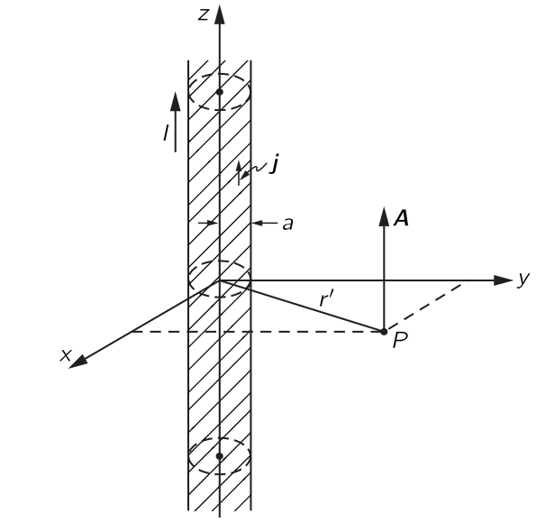{#fig-FLP_2_14_3 width=300}

$\bf{J}=J\hat{\bf{z}}$ 이므로 무한히 긴 원통형 전하의 포텐셜을 계산하는 문제, 그리고 무한히 긴 선 전하 문제(@exm-FLP_electric_field_of_inifite_uniform_line_charge) 와 수학적으로 와 같은 문제이다. 즉

$$
\bf{A}(\bf{r}) = - \dfrac{I\mu_0}{2\pi r}\hat{\bf{z}}
$$ {#eq-FLP_2_14_21}

이다. 이로부터 $\bf{B} = \nabla \times \bf{A}$ 를 통해 자기장을 구할 수 있다.

$$
\bf{B}= \nabla \times \bf{A} = \dfrac{\mu_0 I}{2\pi r}\hat{\bf{\theta}}.
$$ {#eq-FLP_2_14_24}

:::

 

### $\textrm{II}$.14-4 긴 솔레노이드 {#sec-FLP_2_14_4}

::: {#exm-FLP_vector_potential_for_long_solenoid}

#### 솔레노이드에서의 벡터포텐셜 

@exm-ED_MS_magnetic_field_due_to_solenoid 을 생각하자. 솔레노이드의 반지름을 $R$ 이라고 하자. 표면 전류 밀도 $\bf{J} = J\hat{\bf{\theta}}$ 이므로 $\bf{A} = A\hat{\bf{\theta}} = (-A\sin \theta,\, A \cos\theta)$

$xy$ 평면상의 원점을 중심으로 하는 원 경로 $\Gamma$ 와 원 $C$ 에 대해 스토크스 정리를 통해 다음이 성립함을 안다. 

$$
\oint_\Gamma \bf{A\cdot} d\bf{l} = \int_C \nabla \times \bf{A\cdot} d\bf{a} = \int_C \bf{B\cdot}d\bf{a}
$$

그렇다면 $r>R$ 일 때 $2\pi r A_\text{in} = \pi R^2 B_\text{in}$ 이므로 

$$
\bf{A}_\text{out} = \dfrac{n\mu_0 R^2 I}{2r}\hat{\bf{\theta}}
$$

이며 $r<R$ 일 때 $2 \pi r A_\text{in} = \pi r^2 B_\text{in}$ 이므로

$$
\bf{A}_\text{in} = \dfrac{n\mu_0 r}{2}\hat{\bf{\theta}}
$$

이다.

:::

 

### $\textrm{II}$.14-5 자기쌍극자 {#sec-FLP_2_14_5}

전류 밀도가 주어졌을 때의 벡터포텐셜 은 @eq-FLP_2_14_19 로 주어진다. 전류 밀도 $\bf{J}$ 는 어떤 닫힌 경로 $\Gamma$ 를 따르는 전류 $I$ 를 이룬다고 하자. 그렇다면 

$$
\bf{A}(\bf{r}) = \dfrac{\mu_0}{4\pi}\oint_\Gamma \dfrac{I d\bf{l}'}{\|\bf{r}-\bf{r}'\|}
$$ {#eq-FLP_2_14_38}

이며(@sec-FLP_2_14_6 을 보라) $r>r'$ 일 때 르장드르 다항식을 이용하여 다음과 같이 표현 할 수 있다.

$$
\begin{aligned}
\bf{A}(\bf{r}) &= \dfrac{\mu_0 I}{4\pi} \sum_{l=0}^\infty \dfrac{1}{r^{l+1}}\oint_\Gamma \left(r'\right)^l P_l (\cos\theta') d\bf{l}' \\[0.3em]
&= \dfrac{\mu_0 I}{4\pi} \left[\dfrac{1}{r}\oint_\Gamma d\bf{l}' + \dfrac{1}{r^2}\oint_\Gamma r' \cos\theta' \,d\bf{l}' + \cdots \right].
\end{aligned}
$$ {#eq-FLP_expansion_of_vector_potential_for_closed_circuit}

이 때 첫번째 $\oint_\Gamma d\bf{l}'=0$ 이며 두번째 항 이후부터 생각하면 된다. 그리고 두번째 항을 쌍극자 항이라고 한다.

쌍극자 항에 의한 벡터포텐셜 $\bf{A}_\text{dip}$ 는

$$
\bf{A}_\text{dip} = \dfrac{\mu_0 I}{4\pi r^2} \oint r' \cos \theta' d\bf{l'} = \dfrac{\mu_0 I}{4\pi r^2} \oint (\bf{r}'\bf{\cdot}\hat{\bf{r}})\,d\bf{l}
$$

이며 @exr-Griffith_1_62 의 ($e$) 에서 $\bf{c}=\hat{\bf{r}}$ 이라고 하면 

$$
\oint (\bf{r}'\bf{\cdot}\hat{\bf{r}})\,d\bf{l} = - \hat{\bf{r}} \times \int d\bf{a}'
$$

이며, 따라서

$$
\bf{A}_\text{dip} = \dfrac{\mu_0}{4\pi} \dfrac{I\left(\int d\bf{a}'\right) \times \hat{\bf{r}}}{r^2}
$$

이다. 

::: {.callout-note icon="false"}

#### **자기 쌍극자 모멘트**

::: {#def-FLP_magnetic_dipole_moment}

전류 $I$ 가 닫힌 경로 $\Gamma$ 를 따라 흐를 때 이 경로에 의해 결정되는 표면 $S$ 에 대해
$$
\bf{m} := I \int_S d\bf{a} = I\bf{a}
$$ {#eq-FLP_2_14_33}

를 **자기 쌍극자 모멘트 (magnetic dipole moment)** 라고 한다.

:::

:::

자기 쌍극자 모멘트에 의한 벡터포텐셜을 다음과 같이 쓸 수 있다.

$$
\bf{A}_\text{dip}(\bf{r}) = \dfrac{\mu_0}{4\pi} \dfrac{\bf{m}\times \bf{r}}{r^3}.
$$ {#eq-FLP_2_14_34}

이를 이용하여 자기 쌍극자 모멘트에 의한 자기장을 구할 수 있다.(@exr-Griffith_electrodynamics_5_34)

$$
\bf{B}_\text{dip} (\bf{r}) = \dfrac{\mu_0}{4\pi} \left[\dfrac{3(\bf{m\cdot r})\bf{r}}{r^5}- \dfrac{\bf{m}}{r^3} \right] 
$$ {#eq-FLP_magnetic_field_from_magnetic_dipole_moment}

 

### $\textrm{II}$.14-6 회로의 벡터 표텐셜 {#sec-FLP_2_14_6}

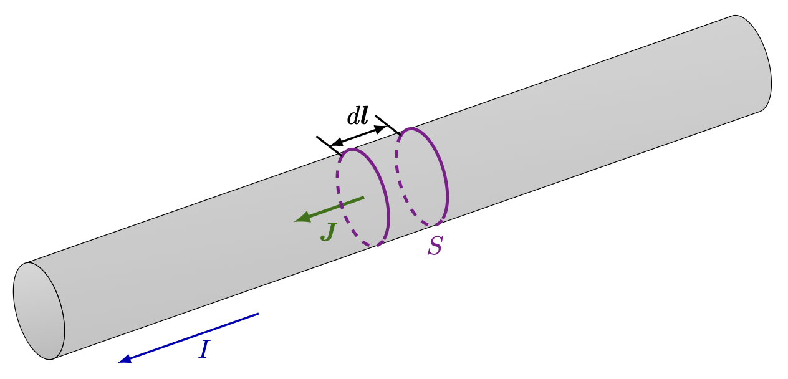{#fig-FLP_2_14_6 width=300}

전류가 흐르는 단힌 회로를 생각하자. 도선의 단면적이 $S$ 일 때 부피 성분 $dV$ 를 위의 그림과 같이 $Sd\bf{l}$ 로 생각 할 수 있으며 이 때

$$
\bf{J}\,dV = JSd\bf{l} = Id\bf{l} 
$$

이다. 이를 이용하면 @eq-FLP_2_14_19 로부터 @eq-FLP_2_14_38 을 얻는다.

 

### $\textrm{II}$.14-7 비오-사바르의 법칙 {#sec-FLP_2_14_7}

전류가 흐르는 닫힌 회로에 의한 자기장을 구해보자.
$$
\begin{aligned}
\bf{B}(\bf{r}) &= \nabla \times \bf{A} = \dfrac{\mu_0}{4\pi}  \left[\nabla \times \int \dfrac{\bf{J}(\bf{r}')\, dV'}{\|\bf{r}-\bf{r}'\|}\right] \\[0.3em]
&=\dfrac{\mu_0 I}{4\pi}  \left[\nabla \times \oint \dfrac{d\bf{l}'}{\|\bf{r}-\bf{r}'\|}\right] \\[0.3em]
&= \dfrac{\mu_0I}{4\pi} \sum_{i,j,k} \varepsilon_{ijk}\hat{\bf{e}}_i \left[\oint \nabla \times  \dfrac{d\bf{l}'}{\|\bf{r}-\bf{r}'\|}\right] \\[0.3em]
&= \dfrac{\mu_0I}{4\pi} \sum_{i,j,k} \varepsilon_{ijk}\hat{\bf{e}}_i \left[\oint \dfrac{\partial}{\partial x_j} \left(\dfrac{dl'_k}{\|\bf{r}-\bf{r}'\|}\right)\right] \\[0.3em]
&= -\dfrac{\mu_0I}{4\pi} \sum_{i,j,k} \varepsilon_{ijk}\hat{\bf{e}}_i \left[\oint \left(\dfrac{(x_j-x'_j) dl'_k}{\|\bf{r}-\bf{r}'\|^3}\right)\right] \\[0.3em]
&= -\dfrac{\mu_0I}{4\pi}  \left[\oint \dfrac{(\bf{r}-\bf{r}')\times d\bf{l}'}{\|\bf{r}-\bf{r}'\|^3}\right] \\[0.3em]
\end{aligned}
$$

즉

$$
\bf{B}(\bf{r}) = -\dfrac{\mu_0I}{4\pi}  \left[\oint \dfrac{(\bf{r}-\bf{r}')\times d\bf{l}'}{\|\bf{r}-\bf{r}'\|^3}\right] 
$$ {#eq-FLP_2_14_43}

이며 이를 **비오-사바르의 법칙 (Biot-Savart's law)** 라고 한다.

 

## $\textrm{II}$.15 벡터 포텐셜 {#sec-FLP_2_15}

### $\textrm{II}$.15-1 전류가 흐르는 고리에 가해지는 힘 : 쌍극자 에너지

평면상에서 전류 $I$ 가 흐르는 면적 $A$ 이고 전류에 의해 정해지는 $A$ 의 방향 단위 벡터를 $\hat{\bf{n}}$ 이라고 할 때 이 전류에 의한 자기 쌍극자 $\bf{m}=IA\hat{\bf{n}}$ 이다. 이 자기 쌍극자에 의해 발생한 힘은 다른 전류에 힘을 가할 수 있다.

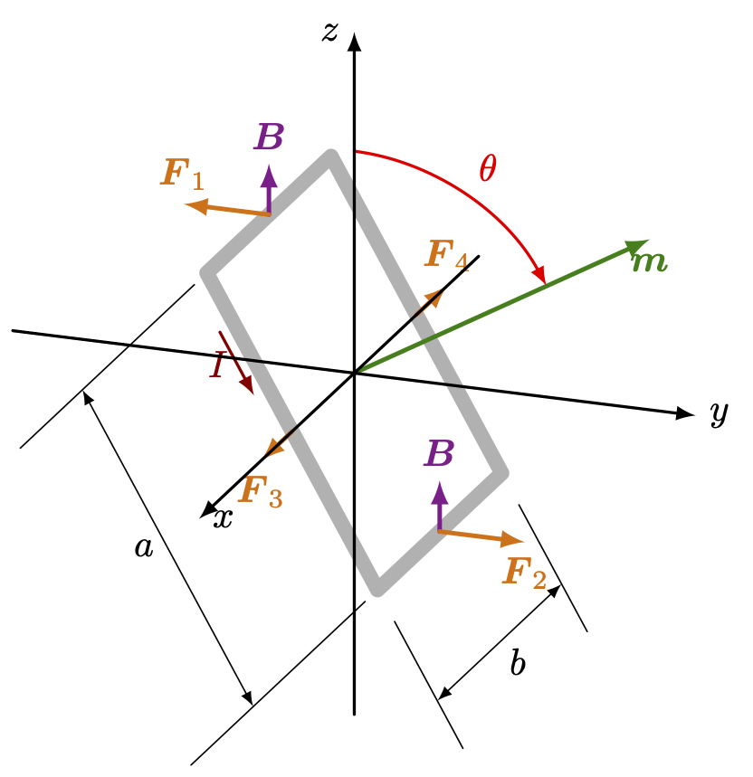{#fig-FLP_2_15_1 width=300}

위의 그림과 같이 $a\times b$ 의 직사각형 고리가 $xy$ 평면과 $\theta$ 의 각도로 기울어져 있고 길이 $a$ 의 모서리의 중심이 $x$ 축상에 고정되어 있으며 $x$ 축을 중심으로 회전 할 수 있다고 하자. 그리고 이 고리에 전류 $I$ 가 흐르며 $\bf{B}=B\hat{\bf{z}}$ 의 균일한 자기장이 가해진다고 하자. @sec-FLP_2_13_3 에서 보았듯이 자기장 속에서 전류가 흐를 때 단위 길이당 전선이 받는 힘은 $\bf{I}\times \bf{B}$ 이므로

$$
F_1 = F_2 = IBb
$$

이며 이 고리가 받는 토크 $\bf{\tau}$ 의 크기는

$$
\tau = IabB \sin \theta = mB\sin\theta
$$

이며 

$$
\bf{\tau} = \bf{m}\times \bf{B}
$$ {#eq-FLP_2_15_2}

로 쓸 수 있다. 위 식은 특수한 경우를 가정하고 구했지만 실제로 일반적인 작은 루프에서 모두 성립한다는 것을 보일 것이다. 전기장에서의 전기쌍극자가 받는 토크 역시 $\bf{\tau} = \bf{p}\times \bf{E}$ 로 같은 형태이다. 

이제 전류가 흐르는 고리에 가해지는 역학적 에너지를 구해보자. 가상변위원리에 의해 

$$
dU = \tau d\theta
$$

임을 안다. $\tau = mB \sin \theta$ 이므로

$$
U = - mB \cos \theta + \text{constant}
$$ {#eq-FLP_2_15_3}

이다. 음의 부호가 붙는 것은 토크에 가 $\bf{m}$ 과 $\bf{B}$ 를 같은 방향으로 정렬시키도록 작용하기 때문이다. **뒤에 논의할 이유로 이 에너지는 전류고리가 가진 총 에너지가 아니다.** 이를 기억하게 하기 위해 $U_\text{mech}$ 라는 별도의 이름을 사용하도록 한다. 이로부터

$$
U_\text{mech} = - \bf{m\cdot B}
$$ {#eq-FLP_2_15_4}

이다. 전기장의 쌍극자가 갖는 에너지 

$$
U=-\bf{p\cdot E}
$$ {#eq-FLP_2_15_5} 
이다.

@eq-FLP_2_15_5 의 정전기 에너지 $U$ 은 진정한 에너지이지만, @eq-FLP_2_15_4 의 $U_\text{mech}$ 는 실제 에너지가 아니다. $U_\text{mech}$ 는 가상일 원리에 따라 루프 내 전류 혹은 최소한 $\bf{m}$ 이 일정하게 유지된다는 가정하에, 힘을 계산하는 데 사용할 수 있다.

직사각형 고리에 대해 $U_\text{mech}$ 는 이 고리를 자기장 밖에서 자기장 안으로 가져오는 역학적 일에도 해당한다는 것을 보여줄 수 있다. 고리에 작용하는 전체 힘은 균일한 자기장에서만 0이며, 자기장이 균일하지 않다면 에서는 전류 고리에 대해 힘이 작용한다. 따라서 전류고리가 자기장이 없는 영역에서 자기장 영역으로 들어올 때 일이 수행되었다. 계산을 간단하게 하기 위해 전류에 의한 자기쌍극자의 방향이 $\bf{B}$ 와 동일하다고 가정하자. 

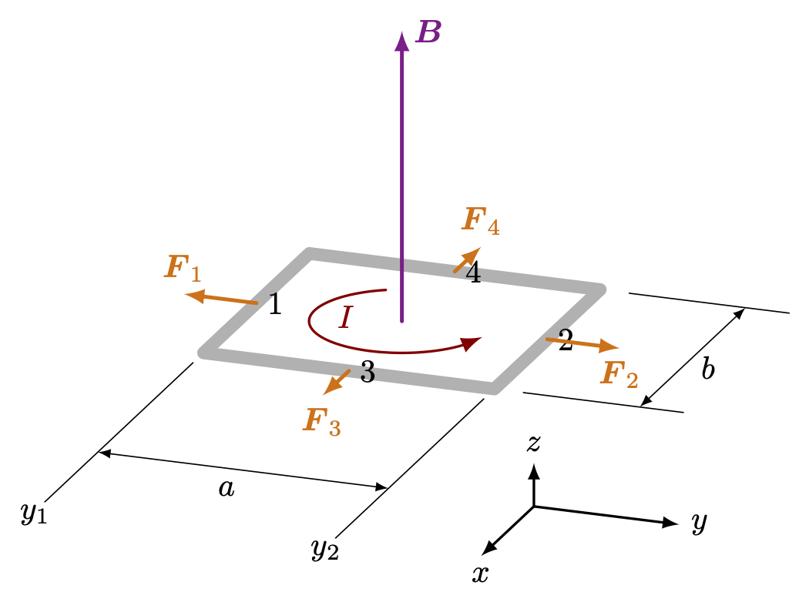{#fig-FLP_2_15_2 width=350}

위의 @fig-FLP_2_15_2 와 같이 $y_1$ dptj $y_2$ 로 이동할 때 해줘야 하는 일 $W$ 를 계산해 보면

$$
W = - BIab
$$

이다. 이동하는 방향으로 힘을 받으므로 $W<0$ 이며, 따라서

$$
U_\text{mech} = -BIab = -\bf{m\cdot B}
$$ {#eq-FLP_2_15_9}

이다. 앞서 말했듯이 $U_\text{mech}$ 는 시스템의 모든 에너지를 포함한 에너지가 아닌 일종의 가짜 에너지 이지만 가해지는 힘을 계산할 때 사용 할 수 있다.

 

### $\textrm{II}$.15–2 역학적 에너지와 전기 에너지 {#sec-FLP_2_15_2}

이제 앞서 논의된 $U_\text{mech}$ 가 정상 전류에 대한 올바른 에너지가 아니며, 전 세계 전체 에너지를 추적하지 못하는 이유를 보여주고자 한다. 그러나 $U_\text{mech}$ 는 가상 일 원리에서 힘을 계산하는 데 에너지와 같이 활용될 수 있다고 강조했는데 이는 고리 내 전류(및 기타 모든 전류)가 변하지 않는 경우로 제한된다. 이 모든 것이 왜 이렇게 되는지 알아보자.

@fig-FLP_2_15_2 의 고리가 $+y$ 방향으로 움직이고 있다고 가정하고, $\bf{B}=B\hat{\bf{z}}$ 라고 하자. 2번 방향의 전선에 있는 전도 전자는 $+y$ 방향으로의 고리의 이동으로 인해 $-x$ 방향의 로런츠 힘을 받는다. 또한 전류로 인해 같은 방향의 속도가 있으므로 각 전자에 단위시간당 $F_yv_y$ 만큼의 일이 가해진다. 이 일을 **전기적 일**이라고 하자. 이제 고리가 균일한 자기장 $\bf{B}$ 에서 움직이고 있다면 1번 방향의 전선에서 정확히 반대 방향의 일이 수행되기 때문에 그 합은 $0$ 이 된다. 그러나 자기장이 균일하지 않다면 일의 합은 $0$ 이 아닐 수 있다. 일반적으로 이 전기적 일은 전류를 변화시키려 하지만, 전류가 일정하게 유지된다면 배터리 또는 전류를 일정하게 유지하는 다른 원천에 의해 에너지가 흡수되거나 전달되어야 한다. 이 에너지는 우리가 @eq-FLP_2_15_9 에서 $U_\text{mech}$ 를 계산할 때 포함시키지 않았다. 우리의 계산은 전선 본체에 작용하는 역학적 힘만을 포함했기 때문이다.

하지만 전자에 작용하는 로런츠 힘은 전선이 얼마나 빠르게 움직이는지에 따라 달라지므로 아마도 전선이 충분히 천천히 움직이면 이 전기 에너지는 무시될 수 있지 않을까?. 전기 에너지가 전달되는 속도가 전선이 움직이는 속도에 비례한다는 것은 사실이지만, 전달되는 총 에너지는 이 속도가 흐르는 시간에도 비례한다. 따라서 전체 전기 에너지는 속도와 시간에 비례하며, 이는 이동한 거리와 같다. 주어진 거리를 자기장 내에서 이동한 경우, 동일한 양의 전기적 일이 수행된다.

전류 $I$ 가 흐르는, 자신과 자기장 $\bf{B}$ 모두에 수직인 방향으로 움직이는 단위 길이의 전선 조각이 속도 $v_\text{wire}$ 로 움직인다고 하자. 전류 때문에 전자는 전선을 따라 표류 속도를 갖게 된다. 표류 방향으로 각 전자에 작용하는 자기력의 성분은 $q_ev_\text{wire}B$ 이다. 따라서 전기적 일의 일률 $Fv_\text{drift}=(q_ev_\text{wire}B)v_\text{drift}$ 이며 전선의 단위 길이에 $N$ 개의 전도 전자가 있을 경우, 전기적 일의 일률은

$$
\dfrac{dU_\text{elect}}{dt} = N q_e v_\text{wire} B v_\text{drift}
$$

이다. 여기서 $Nq_ev_\text{drift}=I$, 즉, 전선의 전류이므로 다음이 성립한다.

$$
\dfrac{dU_\text{elect}}{dt}=Iv_\text{wire}B.
$$

전류가 일정하게 유지되므로 전도 전자에 가해지는 힘이 전자를 가속시키지 않으며, 전기 에너지는 전자에 들어가는 것이 아니라 전류를 일정하게 유지하는 원천으로 들어간다. 그러나 전선에에 작용하는 힘이 $IB$ 이므로, $IBv_\text{wire}$ 는 전선에 수행되는 기계적 일의 일률이기도 하며, $dU_\text{mech}/dt=IBv_\text{wire}$ 이다. 우리는 전선에 수행된 기계적 일이 전류원에 수행된 전기적 일과 동일하다는 결론을 얻으며, 따라서 고리의 에너지는 일정하다!

이는 우연이 아니라 우리가 이미 알고 있는 법칙의 결과이다. 전선의 각 전하에 작용하는 총 힘은

$$
\bf{F}=q(\bf{E} + \bf{v} \times \bf{B})
$$

이며, 따라서 일률은

$$
\bf{v \cdot F} = q\left[ \bf{v \cdot E} + \bf{v \cdot} (\bf{v}\times \bf{B}) \right]
$$ {#eq-FLOP_2_15_12}

인데 두번째 항은 항상 $0$ 이므로 $\bf{E}= \bf{0}$ 이면 일률은 항상 $0$ 이 된다. 우리는 나중에 변화하는 자기장이 전기장을 생성한다는 것을 알게 될 것이며, 따라서 우리의 추론은 균일한 자기장 안에서 움직이는 전선에만 적용된다.

그렇다면 가상 일의 원리가 올바른 답을 제시하는 것은 무슨 이유인가? 우리는 아직까도 전 세계의 전체 에너지를 고려하지 않았기 때문다. 시작할 때 자기장을 발생시키는 전류의 에너지를 포함하지 않았다.

@fig-FLP_2_15_3 (a) 에서와 같은 완전한 시스템을 생각하자. 이 시스템에서는 전류 $I_1$ 이 흐르는 고리를 전류 $I_2$ 가 코일 내에서 생성하는 자기장 $\bf{B}_1$ 아래서 이동한다. 이제 고리의 전류 $I_1$ 도 코일에서 자기장 $\bf{B}_2$ 를 만든다. 고리가 이동하면 필드 $\bf{B}_2$ 가 변경된다. 다음 장에서 보게 되겠지만, 변화하는 자기장은 전기장을 생성하며, 이 전기장은 코일 내 전하에 작용한다. 이 에너지는 총 에너지의 대차대조표에도 포함되어야 한다.

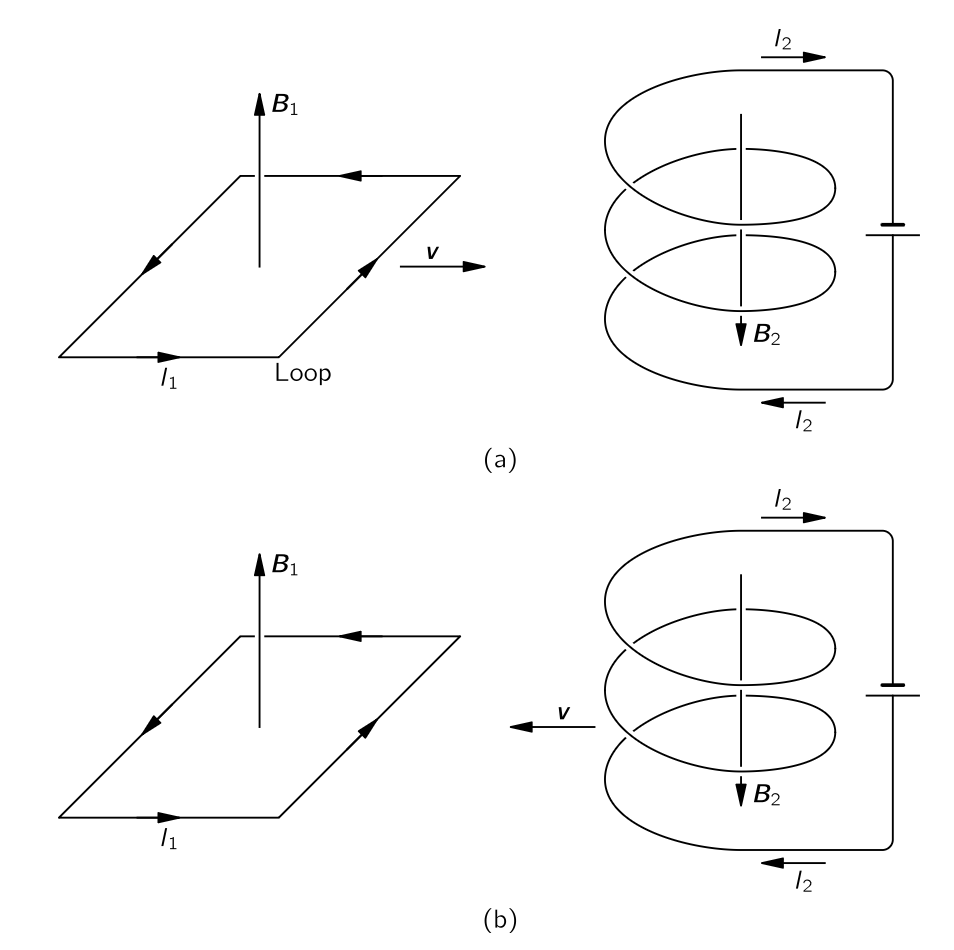{#fig-FLP_2_15_3 width=400}

우리는 다음 장에서 이 새로운 에너지 항에 대해 알아볼 수 있지만, 상대성 원리를 다음과 같이 사용할 경우 이것이 어떻게 될지도 확인할 수 있다. 우리가 고리를 고정 코일 쪽으로 이동시키면, 그 전기 에너지는 수행된 역학적 일과 크기가 같고 부호가 반대임을  알 수 있다. 따라서

$$
U_\text{mech} + U_\text{elect}(\text{고리})=0.
$$

이다. 이제 고리가 정지해 있고 코일이 그 방향으로 이동되는 다른 관점에서 일어나는 상황을 살펴보자. 코일은 고리에 의해 생성된 자기장 내에서 이동한다. 같은 논리도 다음을 알 수 있다

$$
U_\text{mech} + U_\text{elect}(\text{코일})=0.
$$

역학적 에너지는 두 경우에서 동일한데, 이는 두 회로 사이의 힘에서 비롯되기 때문이다다.

두 방정식의 합은 다음과 같다.

$$
2U_\text{mech}+U_\text{elect}(\text{고리})+U_\text{elect}(\text{코일})=0.
$$

전체 시스템의 총 에너지는 물론 두 전기 에너지와 한 번만 취해진 역학적 에너지의 합이다. 따라서 

$$
U_\text{total}=U_\text{elect}(\text{고리})+U_\text{elect}(\text{코일})+U_\text{mech}=−U_\text{mech}.
$$ {#eq-FLP_2_15_13}

이다.

전 세계의 전체 에너지는 실제로 $-U_\text{mech}$ 와 같다. 예를 들어, 자기 쌍극자의 실제 에너지는 다음과 같다.

$$
U_\text{total}=+\bf{m\cdot B}.
$$

모든 전류가 일정하다는 조건에서만 우리는 에너지의 일부인 $U_\text{mech}$ ($=-U_\text{total}$) 만을 사용하여 역학적 힘을 찾을 수 있다. 보다 일반적인 문제에서는 모든 에너지를 포함해야 한다..

정전기학 유사한 상황을 관찰했다. 우리는 축전기의 에너지가 $Q^2/2C$ 와 동일함을 보였다. 가상 일 원리를 사용하여 축전기 판 사이의 힘을 찾을 때, 에너지 변화 $\Delta U$ 는 

$$
\Delta U=\dfrac{Q^2}{2}Δ\left(\dfrac{1}{C}\right)=−\dfrac{Q^2}{2}\dfrac{ΔC}{C^2}
$$ {#eq-FLP_2_15_14}

이다. 하지만 전압이 일정하게 유지되는 조건에서 두 도체를 이동시키는 일을 계산할 때 우리가 인위적인 행동을 할 경우 가상 일 원리로부터 힘에 대한 올바른 답을 얻을 수 있다. $Q=CV$ 이므로 실제 에너지는 $\frac{1}{2}CV^2$ 이다. 하지만 인위적인 에너지를 $−\frac{1}{2}CV^2$ 와 동일하게 정의한다면, 가상 일 원리를 사용하여 인위적인 에너지의 변화를 역학적 작업과 동일하게 설정함으로써 힘을 얻을 수 있다, 단 전압 $V$ 가 일정하게 유지되는 경우로 제한된다. 이 때

$$
\Delta U_\text{mech}=Δ\left(−\dfrac{CV^2}{2}\right)=-\dfrac{V^2}{2}\Delta C
$$ {#eq-FLP_2_15_15}

이며 이는 @eq-FLP_2_15_14 와 동일하다. 우리는 전압을 일정하게 유지하기 위해 전기 시스템이 하는 일을 무시하고 있음에도 불구하고 올바른 결과를 얻고 있다. 다시 말하지만, 이 전기 에너지는 기계 에너지보다 두 배 정도 크고 부호가 반대이다. 따라서 전원이 전압을 일정하게 유지하기 위해 작업을 해야 한다는 사실을 무시하고 인위적으로 계산한다면, 우리는 올바른 답을 얻을 수 있다. 이는 정자기학의 상황과 정확히 유사하다.
 

 

### $\textrm{II}$.15-3 정상 전류의 에너지 {#sec-FLP_2_15_3}

이제 $U_\text{total}=−U_\text{mech}$ 를 이용하여 자기장 내 정상 전류의 진정한 에너지를 구할 수 있다. 작은 전류 고리부터 시작한다. 전체 에너지 $U_\text{total}$ 이제 $U$ 라고 하면

$$
U = \bf{m \cdot B}
$$ {#eq-FLP_2_15_16}

이다. 비록 우리는 이 값을 평면의 직사각형 고리에 대해 계산했지만, 모든 형태의 작은 평면 고리에도 동일한 결과이다.

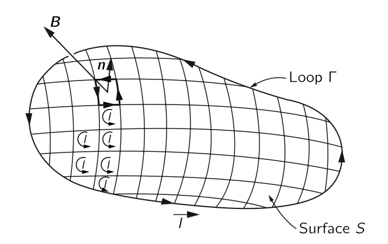{#fig-FLP_2_15_4 width=400}

우리는 모든 형태의 회로가 작은 전류 고리로 구성되어 있다고 가정하여 그 에너지를 구할 수 있다. 예를 들어 @fig-FLP_2_15_4 의 $\Gamma$ 모양의 전선과 이 전선을 경계로 하는 표면 $S$ 를 생각하자. 표면 $S$ 를 대해 그림과 같이 작은 고리로 빈틈 없이 채운다면 각각의 고리는 평면상의 고리로 간주될 수 있다. 전류 $I$ 가 각각의 작은 고리를 순환하면 면 내부의 전류는 상쇄되어 결과적으로 $\Gamma$ 를 흐르는 전류와 동일한 결과가 된다. 이렇게 만들어진 작은 고리들의 에너지의 합은 우리가 구하고자 하는 원래의 에너지와 동일히야 한다.

$i$ 번째 작은 고리에 의한 자기 쌍극자를 $\bf{m}_i$, $i$ 번째 작은 고리를 통과하는 자기장을 $\bf{B}_i$ 라고 하면 $i$ 번재 고리의 에너지 $U_i = \bf{m}_i \bf{\cdot B}_i$ 이다. 여기서 $\bf{m}_i$ 의 전류의 흐름에 의해 방향이 정해지는 표면에 직교하는 단위벡터를 $\hat{\bf{n}}_i$ 라고 하고 면적을 $da_i$ 라고 하면 $U_i = I(\hat{\bf{n}}_i\bf{\cdot B}_i) da_i$ 이므로

$$
U = \sum_i U_i =\sum_i I(\hat{\bf{n}}_i\bf{\cdot B}_i) da_i
$$

이다. $da_i \to 0$ 인 극한에서

$$
\begin{aligned}
U = I\int_S (\hat{\bf{n}}\bf{\cdot B}) da = I\int_S \bf{B\cdot}d\bf{a} = I \int_S (\nabla \times \bf{A})\bf\cdot d\bf{a} = I\oint_\Gamma \bf{A\cdot}d\bf{l}
\end{aligned}
$$ {#eq-FLP_2_15_19}

임을 안다. 전류 $I$ 를 @fig-FLP_2_14_6 에서와 같이 생각하면 부피 성분 $\Delta V$ 에 대해

$$
Id\bf{l} = \bf{J}dV
$$ 

로 생각 할 수 있다. 그렇다면 적분을 $I\bf{A\cdot}d\bf{l} \to (\bf{J \cdot A})\,dV$ 로 바꿀 때, 예를 들어 1번 고리의 자기장 + 2번 고리의 전류 조합과 2번 고리의 자기장 + 1번 고리의 전류에 의한 에너지는 동일한데 이것이 두번 계산되게 된다. 따라서 이 중복을 제거한다면 전체 에너지는 다음과 같다.

$$
U = \dfrac{1}{2}\dfrac{1}{2}\int_V \bf{J\cdot A}\,dV
$$ {#eq-FLP_2_15_20}

이 식은 전기에너지에 대해 우리가 찾은 결과와 일치한다.

$$
U=\dfrac{1}{2}\int_V \rho \Phi dV.
$$ {#eq-FLP_2_15_21}

따라서 우리는 원한다면 $\bf{A}$ 를 정자기학에서의 일종으 포텐셜로 생각할 수 있다고 생각하겠지만 안타깝게도 이 아이디어는 그다지 유용하지 않다. 왜냐하면 이 식은 정적인 장에만 해당되기 때이다. 실제로, @eq-FLP_2_15_20 과 @eq-FLP_2_15_21 둘 다 시간에 따라 변할 때에는 맞지 않다.

 

### $\textrm{II}$.15-4 $\bf{B}$ 와 $\bf{A}$ {#sec-FLP_2_15_4}

#### **장이란 무엇인가?**

이제 다음과 같은 질문을 던질 수 있다.

>벡터포텐셜은 정전기학에서 스칼라 퍼텐셜이 유용한 것처럼 계산에 유용한 장치에 불과한가, 아니면 벡터 퍼텐셜이 **실제 장** 인가? 자기장은 움직이는 입자에 작용하는 힘을 담당하기 때문에 **실제 장**이지 않나? 

먼저 **실제 장** 이란 것이 그다지 의미가 없다는 것을 고백해야 한다. 우선 자기장은 그다지 실제적이지 않다고 느낄 수 있다. 왜냐하면 장이라는 개념이 대체적으로 추상이기 때문이다. 사람이 오감으로 자기장을 느낄 수 없다. 또한 적절한 움직이는 기준틀에서 자기장이 $0$ 이 되게 할 수 있다는 것을 안다. 즉 기준틀에 따라 값이 달라진다.

여기서 **실제 장**이 의미하는 바는 다음과 같다: **실제 장** 은 떨어진 위치에서의 무언가의 변화라는 개념을 회피하기 위해 사용하는 수학 함수이다. 위치 $P$ 에 전하를 띤 입자는 $P$ 로부터 어느 정도 떨어진 다른 전하에 의해 영향을 받는다. 이 상호작용을 설명하는 한 가지 방법은 다른 전하들이 $P$ 에서 환경에 어떤 **조건**(그것이 무엇이든)을 만든다고 생각하는 것이다. 전기장과 자기장을 통해 그 조건을 알면, 그 조건이 어떻게 일어났는지에 대해 모르더라도 입자의 행동을 완전히 결정할 수 있다.

다시 말해, 다른 전하들이 어떤 식으로든 변화하더라도 $P$ 에서 전기장과 자기장에 의해 설명되는 $P$ 의 조건이 동일하게 유지된다면, 전하의 운동도 동일할 것이다. **실제 장** 이란, 특정 지점에서 일어나는 일이 그 지점의 숫자에만 의존하도록 지정하는 숫자 집합이다. 우리는 다른 곳에서 무슨 일이 일어나고 있는지 더 이상 알 필요가 없다. 이러한 의미에서 우리는 벡터 퍼텐셜이 **실제 장** 인지 여부를 생각할 것이다.

벡터 퍼텐셜이 고유하지 않다는 사실에 대해 의아해 할 수도 있다. 입자에 작용하는 힘을 변경시키지 않는 어떤 스칼라 함수의 그래디언트를 더하더라도 동일한 물리에 대한 벡터포텐셜이다. 하지만 그것은 우리가 말하고 있는 **실제**에 관한 질문과는 전혀 관련이 없다. 예를 들어, 자기장은 어느 정도 상대론적인 변화에 의해 변경된다.($\bf{E}$ 와 $\bf{A}$ 도 그렇다.). 하지만 우리는 이렇게 장을 바꾸더라도 어떤 일이 일어날지 걱정하지 않는다. 이것은 실제로 큰 차이를 만들지는 않으며, 이는 벡터 퍼텐셜이 자기 효과를 설명하기 위한 올바른 **실제** 장인지, 혹은 단지 유용한 수학적 도구에 불과한지와는 무관하다.

우리는 또한 벡터 퍼텐셜 $\bf{A}$ 의 유용성에 대해 몇 가지 언급을 해야 한다. 벡터포텐셜은 알려진 전류에 의한 자기장을 계산하는 절차에 사용될 수 있다. 정전기학에서 전하 분포 $\rho$ 로부터 $\Phi$ 를 구한후 $\bf{E}=-\nabla \Phi$ 를 통해 $\bf{E}$ 를 구할 수 있었다. 이렇게 구하는 것이 세번의 적분으로 $\bf{E}$ 를 구하는 것보다 일반적으로 편리하다.

정자기학에서는 이점이 덜 분명하다. $\bf{A}$ 에 대한 적분은 이미 벡터 적분이며(@eq-FLP_2_14_19), 따라서 세번의 적분이 필요하다. $\nabla \times \bf{A}$ 로 $\bf{B}$ 를 얻기 위해 여섯번의 편미분을 한 후 쌍으로 합해야 한다. 대부분의 문제에서 이 과정이 $\bf{B}$ 를 직접 계산하는 것보다 실제로 더 쉬운지는 쉽게 확인되지 않는다.

또한 벡터 퍼텐셜을 사용하는 것이 간단한 문제에서 어려운 경우가 종종 발생한다. 예를 들어, 우리는 한 지점의 자기장 $\bf{B}$ 에만 관심이 있으며, 그 문제에 좋은 대칭성이 있다고 하자. 예를 들어 전류 고리의 축에 있는 한 지점에 있는 자기장을 구한다고 하자. 대칭성 때문에 식의 적분을 통해 $\bf{B}$ 를 쉽게 얻을 수 있다. 하지만 먼저 $\bf{A}$ 를 구한다면 관심있는 위치 주변의 모든 점에서 $\bf{A}$ 가 무엇인지 알아야 한다. 그리고 대부분의 이러한 위치들은 대칭축에서 벗어나 있기 때문에 $\bf{A}$ 의 적분이 복잡해진다. 고리 문제의 경우에는 타원 적분을 사용해야 한다. 이런 문제에서는 $\bf{A}$ 가 그다지 유용하지 않다. 많은 복잡한 문제에서 $\bf{A}$ 로 작업하는 것이 더 쉽긴 하지만, 이러한 기술적 편리함이 추가적인 벡터장을 배우게 하는 것을 정당화한다고 주장하기는 어려울 것이다.

$\bf{A}$ 는 물리적으로 중요한 의미를 가지고 있기 때문에 도입했다. 지난 섹션에서 보았듯이, 그것은 전류의 에너지와 관련될 뿐만 아니라, 위에서 설명한 의미에서 **실제** 물리적 장이기도 하다. 고전 역학에서는 입자에 작용하는 힘을 다음과 같이 쓸 수 있다는 것이 명확하다.

$$
\bf{F}=q(\bf{E}+\bf{v}\times \bf{B}).
$$ {#eq-FLP_2_15_26}

힘을 통해 운동에 관한 모든 것을 결정 할 수 있다. $\bf{A}$ 가 $0$ 이 아니더라도 $\bf{B}=0$ 이라면(예를 들어 솔레노이드 외부), $\bf{A}$ 의 뚜렷한 효과는 존재하지 않는다. 따라서 오랫동안 $\bf{A}$ 는 **실제 장** 이 아니라고 믿어졌다. 하지만, 양자역학과 관련된 현상이 존재한다는 것이 밝혀졌는데, 이는 우리가 정의한 의미에서 $\bf{A}$ 가 실제로 **실제 장** 임을 보여준다. 다음 절에서 이것에 대해 알아본다.

 

### $\textrm{II}$.15–5 벡터 포텐셜과 양자 역학 {#eq-FLP_2_15_5}

고전학에서 양자역학으로 넘어갈 때, 어떤 개념이 중요한지에 많은 변화가 있었다. 예를 들어 힘 대신에 에너지와 운동량 개념이 가장 중요한 역할을 하게 되었다. 입자의 운동 대신 시공간에 따라 변하는 확률진폭을 다룬다는 것을 기억하자. 이러한 확률진폭에는 운동량와 관련된 파장과 에너지와 관련된 진동수가 포함된다. 따라서 파동 함수의 위상을 결정하는 운동량과 에너지는 양자역학에서 중요한 양이다. 힘 대신에 상호작용이 파동의 파장을 변화시키는 방식을 다룬다. 힘에 대한 개념은 그것이 존재하더라도 상당히 부차적인 것이 된다. 예를 들어 사람들이 핵력에 대해 이야기할 때, 그들이 보통 분석하고 작업하는 것은 두 핵자 사이의 상호작용 에너지이며, 그들 사이의 힘이 아니다. 아무도 힘을 찾기 위해 에너지를 미분하지 않는다. 이 절에서는 벡터와 스칼라 포텐셜이 양자역학에 어떻게 들어가는지 설명한다. 실제로 운동량과 에너지가 양자역학에서 중심적인 역할을 하기 때문에 $\bf{A}$ 와 $\Phi$ 는 전자기 효과를 양자 기술에 도입하는 가장 직접적인 방법을 제공한다.

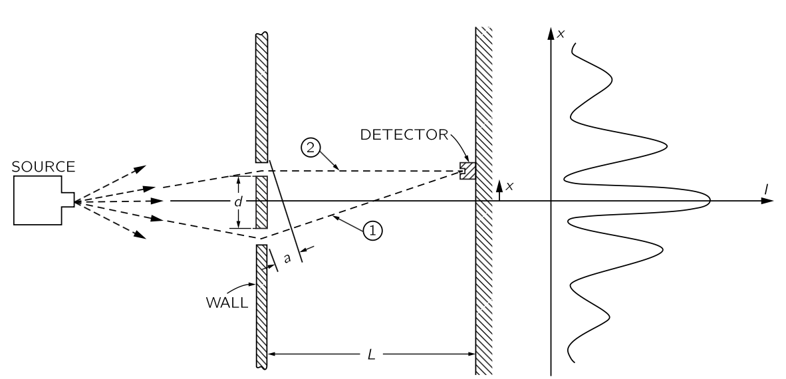{#fig-FLP_2_15_5 width=500}

우리는 양자역학이 어떻게 작동하는지 조금 더 알아보자. 우리는 [Quantum Behavior](../vol1/vol1_5.qmd#sec-FLP_1_37) 에 설명된 가상의 실험을 다시 생각한다. 전자가 두 개의 슬릿에 의해 회절되는 경우의 배치는 @fig-FLP_2_15_5 에 표시되었다. 거의 동일한 에너지를 가진 전자는 source 를 떠나 두 개의 좁은 틈이 있는 벽을 향해 이동합니다. 벽 너머에는 이동식 탐지기가 있는 “백스톱”이 있다. 검출기는 전자가 대칭축으로부터 $x$ 거리에서 백스톱의 작은 영역에 도달하는 속도를 측정한다. 그 속도는 source 를 떠나는 개별 전자가 백스톱의 해당 영역에 도달할 확률에 비례한다. 이 확률은 그림에 표시된 복잡해 보이는 분포를 가지고 있으며, 이는 각 슬릿에서 하나씩 발생하는 두 진폭의 간섭 때문이라고 이해된다. 두 진폭의 간섭은 그들의 위상 차이에 따라 달라진다. 즉, 진폭이 $C_1e^{i\phi_1}$ 및 $C_2e^{i\phi_2}$ 인 경우, 위상 차이 $\delta = \phi_1 − \phi_2$가 그들의 간섭 패턴을 결정한다. 스크린과 슬릿 사이의 거리가 $L$ 이고, 그림과 같이 두 슬릿을 통과하는 전자의 경로 길이 차이가 $a$ 라면, 두 파동의 위상 차이는 다음과 같이 주어진다.

$$
\delta = \dfrac{2\pi a}{\lambda}. 
$$ {#eq-FLP_2_15_27}

여기서 $\lambda$ 는 파장이다. 문제를 간단하게 하기 위해 $|x|<<L$ 인 경우만 생각하기로 하자. 이 조건에서 $a=xd/L$ 이므로

$$
\delta = 2\pi \dfrac{x}{L}\dfrac{d}{\lambda}
$$ {#eq-FLP_2_15_28}

이다. $x=0$ 이면 $\delta = 0$ 으로 파동들의 위상이 일치하여, 확률은 최대값을 가진다. $\delta = \pi$ 파동의 위상은 어긋나 소멸간섭이 발생하며, 확률은 최소가 된다. 이렇게 우리는 전자 강도에 대한 파동함수를 구한다.

이제 우리는 양자역학에서 힘의 법칙 $\bf{F}=q\bf{v}\times \bf{B}$ 를 대체한다는 법칙을 밝히고자 한다. 전자기장 내 양자역학적 입자의 거동을 결정하는 법칙이 될 것이다. 발생하는 일은 진폭에 의해 결정되므로, 법칙은 자기적 영향이 진폭에 어떤 영향을 미치는지 알려야 한다. 우리는 더 이상 입자의 가속도를 다루고 있지 않다. 법칙은 다음과 같다. 자기장의 존재할 때, 임의의 궤적을 통해 도달하는 진폭의 위상은 전체 궤적에 대한 벡터 퍼텐셜의 적분값에 $q/\hbar$ 를 곱한 값만큼 변한다. 즉,

$$
\text{위상의 자기적 변화}=\dfrac{q}{\hbar}\int_\text{trajectory} \bf{A\cdot}d\bf{l}.
$$ {#eq-FLP_2_15_29}

자기장이 없을 때 도착하는 위상이 있을 것이다. 일단 어디든 자기장이 존재하면, 도착하는 파동의 위상은 @eq-FLP_2_15_29 에 따라 변한다. 참고로 전기장의 효과는 스칼라 퍼텐셜 $\Phi$ 의 시간 적분값에 $-q/\hbar$ 를 곱한것 만큼 위상을 변경한다.

$$
\text{위상의 전기적 변화}=−\dfrac{q}{\hbar} \int \Phi \, dt.
$$ {#eq-FLP_2_15_29r}

이 두 식은 정적인 장 뿐만 아니라, 정적이든 동적이든 모든 전자기장에 대해 성립한다. 이것이 $\bf{F}=q(\bf{E}+\bf{v}\times \bf{B})$ 를 대체하는 법칙이다. 하지만 지금은 정적인 자기장만을 고려한다.

두 개의 슬릿 실험에 자기장이 존재한다고 가정하자. 우리는 두 개의 틈을 통과하는 두 파동의 화면 도착 단계에 대해 생각하자. 그들의 간섭은 확률의 최대값이 어디에 위치할지를 결정한다. 우리는 $\phi_1$ 을 궤적 $①$ 을 따라 파동의 위상이라고 부를 수 있다 $\phi_1(B=0)$ 이 자기장이 없는 위상이라면, 자기장이 켜질 때 위상은

$$
\phi_1=\phi_1(B=0) + \dfrac{q}{\hbar}\int_{(1)} \bf{A\cdot} d\bf{l}
$$ {#eq-FLP_2_15_30}

이며 마찬가지로, 궤적 $②$ 의 위상은

$$
\phi_2=\phi_2(B=0) + \dfrac{q}{\hbar}\int_{(2)} \bf{A\cdot} d\bf{l}
$$ {#eq-FLP_2_15_31}

이므로 검출기의 파동 간섭은 위상 차이에 다음과 같다.

$$
\delta = \phi_1(B=0) −\phi_2(B=0) + \dfrac{q}{\hbar}\int_{(1)}\bf{A\cdot} d\bf{l} − \dfrac{q}{\hbar}\int_{(2)}\bf{A\cdot} d\bf{l}.
$$ {#eq-FLP_215_32}

자기장이 없을 때 $\delta(B=0)$ 는 @eq-FLP_2_15_28 과 같다. 또한 적분은 $①$ 을 따라 앞으로, $①$ 를 따라 뒤로 가는 하나의 닫힌 경로에 대한 적분으로 쓸 수 있다. 이를 닫힌 경로 $(1–2)$ 라고 하자. 그렇다면 

$$
\delta = \delta(B=0) + \dfrac{q}{\hbar}\oint_{(1–2)} \bf{A \cdot} d\bf{l}
$$ {#eq-FLP_2_15_33}

이다. 이를 통해 전자 운동이 자기장에 의해 어떻게 변하는지 일 수 있으며 백스톱에서 강도의 최대값과 최소값의 새로운 위치를 찾을 수 있다.

더 진행하기 전에 중요한 사실을 짚고 넘어가자. 우리는 벡터 퍼텐셜 함수의 임의성을 알 고 있다. 스칼라 함수 $\psi$ 에 대해 $\bf{A}$ 와 $\bf{A}'=\bf{A}+\nabla \psi$ 는 동일한 자기장을 나타내며 따라서 동일한 고전적인 힘 $q\bf{v}\times \bf{B}$ 를 나타낸다. 그러나 우리는 닫힌 경로 $\Gamma$ 에 대해 $\oint \nabla \psi\bf{\cdot}d\bf{l} = 0$ 임을 안다. 즉 $\bf{A}$ 와 $\bf{A}'$ 는 동일한 위상 차이와 동일한 양자역학 간섭 효과를 나타내다. 고전 이론과 양자 이론 모두에서 중요한 것은 $\nabla \times \bf{A}$ 뿐이다.

@sec-FLP_2_14_1 에서 보았듯이 닫힌 경로에 대한 $\bf{A}$ 의 선적분은 이 경로의 안쪽 표면에서의 자기장의 선속(flux)과 같다. 즉 경로 $(1-2)$ 로 정해지는 내부를 지나는 자기장의 플럭스를 $\Phi_B$ 라고 하면 다음과 같다.

$$
δ=δ(B=0)+\dfrac{q}{\hbar}\Phi_B.
$$ {#eq-FLP_2_15_34}

이제 결과를 $\bf{B}$ 와 $\bf{A}$ 모두에 대해 쓸 수 있기 때문에, $\bf{B}$ 가 **실제** 장으로서 그대로 유지되고 $\bf{A}$ 는 여전히 인위적인 구성물로 간주할 수 있다고 여길 수 있다. 하지만 우리가 처음 제안한 **실제** 장의 정의는 **실제** 장은 거리가 있는 입자에 작용하지 않을 것이라는 생각에 기반하고 있었다. 하지만 우리는 $\bf{B}$ 가 $0$ 이거나 최소한 임의로 작은 경우를, 입자를 찾을 가능성이 있는 어느 정도의 위치에서 직접 작용한다는 생각을 할 수 없는 예를 제시할 수 있다.

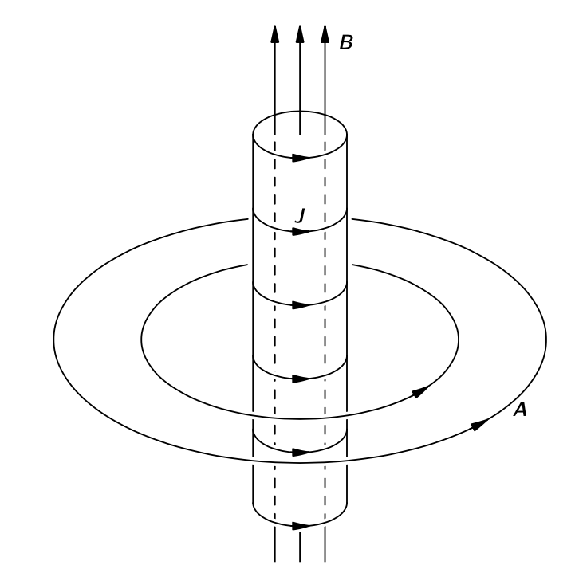{#fig-FLP_2_15_6 width=350}

전류가 흐르는 긴 솔레노이드의 경우 내부에는 자기장이 존재하지만 외부에서는 $0$ 이며 외부에 많은 $\bf{A}$ 가 순환하고 있다는 것은 @fig-FLP_2_15_6 에 표현된 바와 같다. 전자를 $\bf{A}$ 만 존재하는 솔레노이드 외부에 놓는다면 @eq-FLP_2_15_33 에 따르면 여전히 운동에 영향을 미치게 된다. 고전적으로는 힘은 오직 $\bf{B}$ 에만 의존하기 때문에 운동에 영향을 미칠 수 없다. 솔레노이드에 전류가 흐른다는 것을 알기 위해서는 솔레노이드를 통과해야 한다. 하지만 양자역학적으로는 솔레노이드에 가깝게 접근하지 않더라도 한 번 돌면 그 안에 자기장이 존재한다는 것을 알 수 있다!

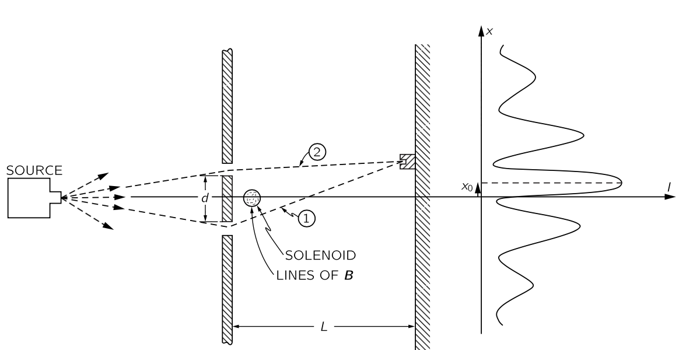{#fig-FLP_2_15_7 width=500}

@fig-FLP_2_15_7 과 같이 벽 바로 뒤와 두 개의 슬릿 사이에 직경이 작은 매우 긴 솔레노이드를 배치한다고 생각해 보자. 솔레노이드의 직경은 두 슬릿 사이의 거리 $d$ 보다 훨씬 작아야 한다. 이러한 상황에서는 슬릿에서 전자가 회절을 통해 솔레노이드에 가까워질 가능성이 거의 없습니다. 이것은 우리의 간섭 실험에 어떤 영향을 미칠까?

솔레노이드에 흐르는 전류가 있는 경우와 없는 경우를 비교해 보자. 전류가 없으면  이며 백스톱에서 전자 강도의 원래 패턴을 얻을 수 있다. 전류를 켜면 솔레노이드 내부에 $\bf{B}$ 가, 외부에 $\bf{A}$ 가 생성된다. 솔레노이드 외부에서 $\oint \bf{A\cdot} d\bf{l}$ 에 비례하는 위상 차이의 이동이 있으며, 이는 최대와 최소의 패턴이 새로운 위치로 이동함을 의미한다. 실제로, 내부 $\bf{B}$ 의 플럭스가 모든 경로 쌍에 대해 상수이므로 $\bf{A}$ 의 순환도 일정하다. 즉, 각 도착점마다 동일한 위상 변화가 존재하는데 이는 전채 패턴의 새로운 위치로의 평행 이동을 의미한다. 두 파동 사이의 위상 차이가 $0$ 일 때 최대 강도가 발생하는 것을 안다. @eq-FLP_2_15_33 혹은 $\delta$ 에 대한 @eq-FLP_2_15_34 와 $x$ 에 대한 @eq-FLP_2_15_28 로부터 다음과 같다.

$$
x_0 = -\dfrac{L}{d}\dfrac{\lambda}{2\pi}\dfrac{q}{\hbar} \oint_{(1–2)} \bf{A \cdot} d\bf{l}.
$$ {#eq-FLP_2_15_35}

또는 $\bf{B}$ 에 의한 자기 선속 ${\Phi}_B$ 대해 다음과 같다.

$$
x_0 = −\dfrac{L}{d}\dfrac{\lambda}{2\pi}\dfrac{q}{\hbar} \Phi_B.
$$ {#eq-FLP_2_15_36}

솔레노이드가 위치했을 때의 패턴은 @fig-FLP_2_15_7 에 표시된 대로1 나타나야 하는것이 양자역학의 예측이다.

이 실험은 이 책이 쓰여질 즈음에 수행되었다. 이 당시에는 매우 어려운 실험었는데, 전자의 파장이 매우 짧기 때문에, 장치는 간섭을 관찰하기 위해 아주 작은 크기여야 한다. 슬릿은 서로 매우 가깝게 위치해야 하며, 따라서 매우 작은 솔레노이드가 필요하다. 특정 상황에서는 철 결정이 whisker 이라고 불리는 매우 길고 얇은 필라멘트 형태로 성장하는데 이러한 whisker 가 자화되면 작은 솔레노이드와 같으며, 끝부분 근처를 제외하고는 외부에 장이 없다. 전자 간섭 실험은 두 개의 슬릿 사이에 그런 whisker 를 사용하여 수행되었으며, 예상된 전자 패턴의 변위가 관찰되었다.

우리의 관점, 즉 입자의 위치에서 운동을 얻기 위해 지정해야 하는 필드가 “실제”라는 관점에서는 $\bf{A}$ 가 **실제** 이다. Whisker 에 있는 $\bf{B}$ 가 <u>원격으로</u> 작용한다. 영향을 원격 작용이 아닌 방식으로 설명하고자 한다면, 우리는 벡터 퍼텐셜을 사용해야 한다.

이 주제는 흥미로운 역사를 가지고 있다. 우리가 설명한 이론은 1926년 양자역학의 시작부터 알려져 있었다. 벡터 퍼텐셜이 양자역학의 파동 방정식, 즉 슈뢰딩거 방정식에 나타난다는 사실은 시작부터 명백했다. 벡터 포텐셜을 자기장으로 대체하려는 시도는 차근차근 실패했다. 이것은 전자가 장이 없는 영역에서 이동하면서도 영향을 받는 우리의 예에서도 명확하다. 하지만 고전역학에서는 $\bf{A}$ 가 직접적인 중요성을 갖지 않는 것처럼 보였고, 게다가 그래디언트를 추가함으로써 변형될 수 있었기 때문에 사람들은 벡터 퍼텐셜이 직접적인 물리적 의미가 없다고 반복해서 말했으며, 양자역학에서도 자기장과 전기장만이 **올바르다** 라고 말했다. 돌이켜 보면, 1956년 봄(Bohm)과 아하로노프(Aharonov)가 처음 제안하고 전체 질문을 명확히 한 시점까지는 아무도 이 실험에 대해 논의할 생각을 하지 않은 것이 이상하게 보인다. 그 함의는 언제나 존재했지만, 아무도 그것에 주목하지 않았다. 그렇기 때문에 많은 사람들이 그 문제가 제기될 때 다소 충격을 받았다. 따라서 누군가는 오랫동안 믿어졌던 양자역학이 명확한 답을 제시했음에도 불구하고, 실제로 옳은지 확인하기 위해 실험을 수행하는 것이 가치가 있다고 생각했다. 이와 같이  무엇이 중요하고 무엇이 중요하지 않은가에 대한 어떤 편견 때문에 계속 무시되는 것이 30년 동안 지속될 수 있다는 점이 흥미롭다.

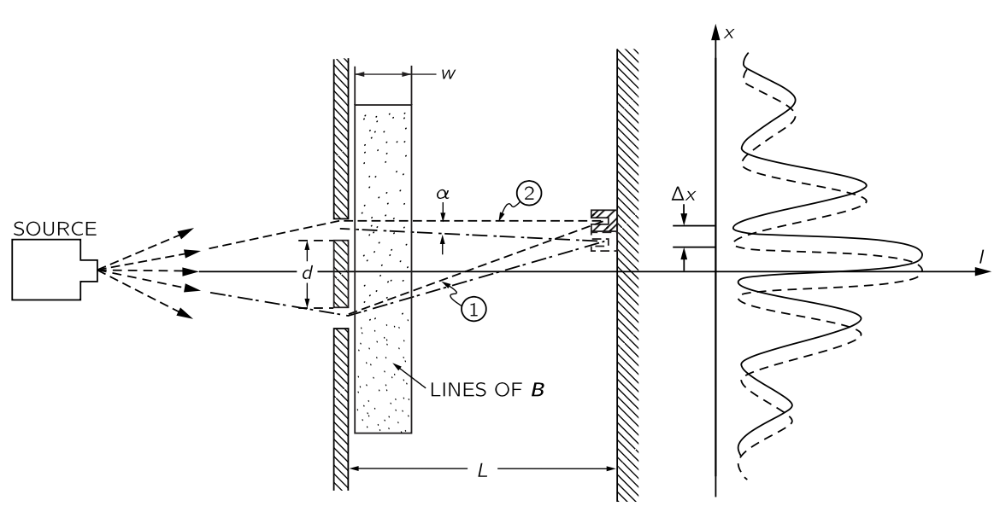{#fig-FLP_2_15_8 width=500}

조금 더 진행해보자. 우리가 충분히 큰 규모로 사물을 바라볼 때 입자들이 느끼는 힘이 $q\bf{v} \times \bf{A}$ 인지 설명하기 위해 양자역학 공식과 고전적 공식 사이의 연관성을 보여줄 것이다. 양자역학에서 고전역학을 얻기 위해서는, 외부 조건(즉 장)이 크게 달라지는 거리와 비교했을 때 모든 파장이 매우 작은 경우를 고려해야 한다. 우리는 결과를 일반적인 설명으로 입증하지 않고, 어떻게 작동하는지를 보여주기 위해 매우 간단한 예시로만 증명하겠다. 다시 한 번 우리는 같은 슬릿 실험을 고려합니다. 하지만 슬릿 사이의 아주 작은 영역에 자기장을 배치하는 대신, @fig-FLP_2_15_8 에 표현된 바와 같이 슬릿 뒤의 더 큰 영역에 걸쳐 확장된 자기장을 생각한다. 우리는 $L$ 에 비해 작다고 간주되는, 폭 $w$ 의 좁은 띠에서 균일한 자기장이 있는 이상적인 경우를 생각한다. 이것은 백스톱은 원하는 만큼 멀리 배치하여 조정 할 수 있다. 위상 이동을 계산하려면, 두 궤적 $(1)$ 과 $(2)$ 를 따라 $\bf{A}$ 의 두 적분을 구해야 하며 이 값들은 경로 사이의 $\bf{B}$ 의 플럭스에 의해서만 차이가 난다. 우리의 근사치에 따라 플럭스는$\Phi_B=Bwd$ 이며 위상차는

$$
\delta = \delta (B=0) + \dfrac{q}{\hbar}Bwd.
$$ {#eq-FLP_2_15_37}

근사에 따르면 위상 이동은 각도와 무관하다. 따라서 다시 그 효과는 전체 패턴을 $\delta x$ 만큼 위쪽으로 이동시키며 @eq-FLP_2_15_35 와 @eq-FLP_2_15_37 을 사용하여 다음을 보일 수 있다. 

$$
\Delta x = −\dfrac{L\lambda}{2\pi d} \Delta \delta = −\dfrac{L\lambda}{2\pi d}[\delta − \delta(B=0)] = -\dfrac{L\lambda}{2\pi d}\dfrac{q}{\hbar}Bw
$$ {#eq-FLP_2_15_38}

이러한 이동은 작은 각도 $\alpha$ 에 대해 모든 궤적을 편향시키는 것과 동일하다(@fig-FLP_2_15_9). 여기서

$$
\alpha = \dfrac{\Delta x}{L} = −\dfrac{\lambda}{2\pi \hbar} qBw.
$$ {#eq-FLP_2_15_39}

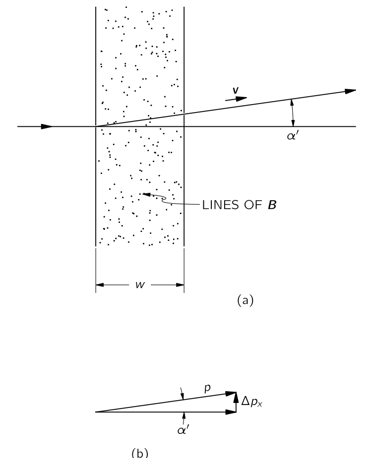{#fig-FLP_2_15_9 width=300}

이제 고전적으로 우리는 또한 얇은 자기장의 띠가 $\alpha′$ 와 같은 작은 각도를 통해 모든 궤적을 편향시킨다고 기대할 수 있으며, 이는 @fig-FLP_2_15_9 (a) 에 나타나 있다. 전자가 자기장을 통과할 때, 그들은 일정 시간 동안 지속되는 횡력 $q\bf{v}\times \bf{B}$ 를 느낍니다. 그들의 횡모멘텀 변화는 이 충격량과 정확히 동일하므로

$$
\Delta p_x = −qwB.
$$ {#eq-FLP_2_15_40}

이다. 이 각변화[@fig-FLP_2_15_9 (b)]는 이 횡운동량과 전체 운동량 $p$ 의 비율과 같다. 따라서

$$
\alpha′=\dfrac{\Delta p_x}{p} = −\dfrac{qwB}{p}.
$$ {#eq-FLP_2_15_41}

우리는 이 결과와 @eq-FLP_2_15_39 를 비교하여 양자역학 결과와 동일하다는 것을 알 수 있다. 하지만 고전 역학과 양자 역학 사이의 연결은 다음과 같다: 운동량 $p$ 를 갖는 입자는 파장 $\lambda = \hbar/2\pi p$ 에 따라 변하는 양자 진폭에 해당하며 따라서 $\alpha$ 와 $\alpha′$ 는 동일하다. 즉 고전적 계산과 및 양자 계산은 동일한 결과를 제공한다.

앞의 분석을 통해 우리는 양자역학에서 명시적인 형태로 나타나는 벡터 퍼텐셜이 그 도함수에만 의존하는 고전적 힘을 발생시킨다는 것을 알 수 있다. 양자역학에서 중요한 것은 인근 경로들 사이의 간섭이며, 효과는 언제나 $\bf{A}$ 장이 점에서 점으로 얼마나 변하는가에만 의존하고, 따라서 값 자체가 아니라 $\bf{A}$ 의 미분에만 의존한다는 것이 밝혀진다. 그럼에도 불구하고, 벡터 퍼텐셜 $\bf{A}$ (그리고 스칼라 퍼텐셜 $\Phi$)는 물리학에 대한 가장 직접적인 설명을 제공하는 것으로 보인다. 양자 이론에 대해 깊이 파고들수록 이것이 점점 더 명확해진다. 양자 전기역학 일반 이론에서는 벡터와 스칼라 퍼텐셜을 맥스웰 방정식을 대체하는 일련의 방정식에서 기본량으로 정한다: $\bf{E}$ 와 $\bf{B}$ 는 현대 물리 법칙의 표현에서 서서히 사라지고 있으며, 이들은 $\bf{A}$ 와 $\Phi$ 로 대체되고 있다.

 

### $\textrm{II}$.15–6 정역학과 동역학의 차이 {#sec-FLP_2_15_6}

이제 정상(static) 장에 대한 설명의 끝자락에 있다. 이미 이 장에서 우리는 시간에 따라 장이 변할 때 일어나는 일에 대해 가까워지고 있다. 자기 에너지를 다루는 데 있어 상대론적 논증으로 피하여 동역학적인 접근을 간신히 피할 수 있었다. 그럼에도 불구하고, 에너지 문제에 대한 우리의 처리 방식은 다소 인위적이었으며 어쩌면 기묘했을지 모르겠다. 왜냐하면 우리는 움직이는 코일이 변하는 장을 생성한다는 사실을 무시했기 때문이다. 이제 전기역학의 주제인 시간에 따라 변하는 장을 시작해야 한다. 그 전에 몇 가지 점을 강조하려 한다.

비록 우리는 전기자기학의 완전하고 올바른 방정식을 제시하는 것으로 이 과정을 시작했지만, 동시에 몇몇 미완성된 조각들을, 그게 그다지 어렵지 않았기 때문에, 다루었다. 정상 장의 보다 단순한 이론에서 시작하여, 동적 장을 포함하는 보다 복잡한 이론으로 이후 진행하는 것은 큰 장점이 있다. 한 번에 배울 새로운 사항이 적어지고, 더 큰 과제를 준비하기 위해 지적 근육을 개발할 시간이 있다. 하지만 이 과정에는 전체 이야기를 보기 전에 배운 불완전한 진실이 뿌리내려 전체 진리로 받아들여질 위험이 있다. 진실과 때때로만 사실인 것이 혼동될 수 있다. 따라서 우리는 @tbl-FLP_1_2_1 에 우리가 다룬 중요한 공식들의 요약을 제공하며, 일반적으로 참인 것과 정역학에 대해 참이지만 역학에 대해 거짓인 것을 구분한다. 이 요약은 또한 부분적으로 우리가 어디로 가고 있는지를 보여준다, 왜냐하면 우리가 역학을 다루면서 여기서 증명 없이 단순히 진술해야 할 내용을 상세히 공부하게 될 것이기 때문이다.

<!-- 
\renewcommand{\arraystretch}{2} 
\begin{tabular}{ l|l} 
\hline
\textbf{False in General} & \textbf{True always} \\
\hline  
$\bf{F}=\dfrac{1}{4\pi\epsilon_0}\dfrac{q_1q_2\bf{r}}{r^3}$ 
 &$\bf{F}=q(\bf{E}+\bf{v}\times \bf{B})$\\
{}& $\nabla \bf{\cdot E}= \dfrac{\rho}{\epsilon_0}$  \\ 
\hline 
$\nabla \times\bf{E}=0$ & $\nabla \times \bf{E}= - \dfrac{\partial \bf{B}}{\partial t}$ \\
$\bf{E}=-\nabla \Phi$ & $\bf{E}=-\nabla \Phi - \dfrac{\partial \bf{A}}{\partial t}$ \\
$\displaystyle \bf{E}(\bf{r}) = \dfrac{1}{4\pi\epsilon_0}\int_V \dfrac{\rho(\bf{r}')(\bf{r}-\bf{r}')}{\|\bf{r}-\bf{r}'\|^3}\,dV'$ & {} \\
For conductors, $\bf{E}=0$, $\Phi=\text{constant}$. & In conductor, $\bf{E}$ makes currents. \\
$Q=CV$ & {} \\
\hline
{} & $\nabla \bf{\cdot B} = 0$\\
{} & $\bf{B} = \nabla \times \bf{A}$ \\
$\nabla \times \bf{B}=\mu_0 \bf{J}$ & $\nabla \times \bf{B}=\mu_0 \bf{J} + \dfrac{1}{c^2} \dfrac{\partial \bf{E}}{\partial t}$ \\
$\displaystyle \bf{B}(\bf{r}) = \dfrac{\mu_0}{4\pi}\int_V \dfrac{\bf{J}(\bf{r}')\times (\bf{r}-\bf{r}')}{\|\bf{r}-\bf{r}'\|^3}\,dV'$ & {} \\
\hline
$\renewcommand{\arraystretch}{2} \begin{array}{l}\quad \nabla^2 \Phi = -\dfrac{\rho}{\epsilon_0} \\ \left[ \begin{array}{l} \nabla^2\bf{A} = - \mu_0 \bf{J} \\ \nabla \bf{\cdot A} = 0 \end{array}\right.\end{array}$ & $\left[\begin{array}{l} \nabla^2 \Phi - \dfrac{1}{c^2}\dfrac{\partial^2 \Phi}{\partial t^2} = - \dfrac{\rho}{\epsilon_0} \\ \nabla^2\bf{A} - \dfrac{1}{c^2} \dfrac{\partial^2 \bf{A}}{\partial t^2} = - \mu_0 \bf{J} \\ \nabla\bf{\cdot A} + \dfrac{1}{c^2} \dfrac{\partial \Phi}{\partial t} = 0\end{array}\right.$ \\
\hline
$\displaystyle \renewcommand{\arraystretch}{2} \begin{array}{l} \displaystyle \Phi(\bf{r}) = \dfrac{1}{4\pi\epsilon_0}\int_V \dfrac{\rho(\bf{r}')}{\|\bf{r}-\bf{r}'\|} \,dV' \\
 \displaystyle \bf{A}(\bf{r}) = \dfrac{\mu_0}{4\pi}\int_V \dfrac{\bf{J}(\bf{r}')}{\|\bf{r}-\bf{r}'\|} \,dV'
\end{array}$ &  dV'
$\renewcommand{\arraystretch}{2} \left[  \begin{array}{l} \displaystyle \Phi(\bf{r},\,t) = \dfrac{1}{4\pi\epsilon_0}\int_V \dfrac{\rho(\bf{r}',\,t')}{\|\bf{r}-\bf{r}'\|} \,dV' \\
 \displaystyle \bf{A}(\bf{r},\,t) = \dfrac{\mu_0}{4\pi}\int_V \dfrac{\bf{J}(\bf{r}',\,t)}{\|\bf{r}-\bf{r}'\|} \,dV' \\
\displaystyle t' = t=\dfrac{r_{12}}{c}
\end{array} \right.$ \\
\hline
$\displaystyle U = \dfrac{1}{2} \int_V \rho \Phi \,dV' + \dfrac{1}{2} \int_V \bf{J\cdot A} \,dV'$ & $\displaystyle U =\int \left(\dfrac{\epsilon_0 E^2}{2} + \dfrac{B^2}{2\mu_0}\right)\,dV'$\\
\hline
\end{tabular}

-->

{#tbl-FLP_2_1 width=500}
 
테이블에 대해 몇 가지 지적할 것이 있다. 

- $\bf{F}=q(\bf{E}+\bf{v}\times \bf{B})$ 은 참이다. 그러나 쿨롱의 법칙은 정적 상태에서만 참이다. 
- $\bf{E}$ 와 $\bf{B}$ 에 대한 네 개의 맥스웰 방정식도 참이다.
- 가우스의 법칙 $\nabla \bf{\cdot E} = \rho/\epsilon_0$ 는 유지되지만, 일반적으로 $\nabla \times \bf{E}\ne 0$ 이다. 따라서 $\bf{E}=-\nabla \Phi$ 를 만족하는 $\Phi$ 는 존재하지 않을 수 있으며 $\bf{E}=-\nabla \Phi -\partial_t \bf{A}$ 를 만족하는 $\Phi,\,\bf{A}$ 쌍은 항상 존재한다.
- 전도체에서 $\bf{E}=0$ 이 아니다. 전기장이 시간에 대해 변한다면, 전도체의 전하들은 일반적으로 전기장을 0 으로 만들기 위해 스스로 재배열할 시간이 없다. 유일한 일반적인 진술은 **전도체의 전기장은 전류를 생성한다** 이다. . 따라서 변화하는 전기장에 대해서는 전도체 표면이 등전위가 아니다. 또한 정전용량이라는 개념이 더 이상 정확하지 않게 된다.
- 자기 전하가 없기 때문에 $\nabla \bf{\cdot B}=0$ 이다. 따라서 $\bf{B}=\nabla \times \bf{A}$ 를 만족하는 $\bf{A}$ 는 항상 존재한다. 하지만 $\bf{B}$ 는 전류 뿐만이 아니라 전기장의 시간에 대한 변화에서도 생성된다. $\nabla \times \bf{B}$ 는 전류 밀도에 새로운 $\partial_t \bf{E}$ 를 더한 값에 비례한다. 이는 $\bf{A}$ 가 새로운 방정식에 의해 전류와 관련이 있음을 의미한다. 그것은 $\Phi$ 와도 관련이 있다. 
- 편의를 위해 $\nabla \bf{\cdot A}$ 를 선택할 자유를 활용한다면, $\bf{A}$ 또는 $\Phi$ 에 대한 방정식을 간단하고 우아한 형태로 배치 할 수 있다. 따라서 우리는 $\nabla \bf{\cdot A}=−(1/c^2))\partial_t \Phi$ 가 되도록 조건을 정하고, $\bf{A}$ 또는 $\Phi$ 에 대한 미분 방정식은 표에 표시된 대로 나타난다.
- $\bf{A}$ 와 $\Phi$ 는 전류와 전하에 대한 적분으로 찾을 수 있지만, 정역학과 같은 적분은 아니다. 여기서 $t′=t−r_{12}/c$ 인 이전 시점에서의 $\bf{j}$ 와 $\rho$ 값을 사용해야 한다. 이 작은 변화를 통해 변화하는 전류와 전하에 대한 장 문제를 풀 수 있다. 
- 마지막으로, 전기장의 에너지 밀도가 $\dfrac{\epsilon_0 E^2}{2}$ 인 경우와 같은 일부 결과가 전기역학뿐만 아니라 정역학에도 해당한다는 것을 알게 될 것이다. 이것이 자연스럽다고 오해해서는 안된다. 정적 경우에서 도출된 모든 공식의 유효성은 동적 경우에 대해 다시 한 번 입증되어야 한다. 반대되는 예는 전기정적 에너지를 $\rho \Phi$ 의 부피 적분으로 표현한 것이다. 이 결과는 정적인 경우에만 해당된다.

 

## $\textrm{II}$.16 유도전류 {#sec-FLP_2_16}

### $\textrm{II}$.16-1 모터와 발전기 {#sec-FLP_2_16_1}

1820년에 전기와 자기 사이에 밀접한 연관성에 대한 두가지의 발견이 있었다. 그전까지 두 대상은 꽤 독립적인 것으로 여겨져 왔다. 

  1. 전선의 전류가 자기장을 만든다.
  2. 자기장 속의 전류가 흐르는 전선에 힘이 작용한다. 

{#fig-FLP_2_16_1 width=300}

전류가 자기장을 만든다는 사실을 인식하자, 사람들은 즉시 어떤 식으로든 자석도 전기장을 만들 수 있을 것을 제안하며 다양한 실험이 시도되었다. 마침내 패러데이는 1840년에 전기 효과는 무언가가 변할 때만 발생한다는 것을 발견했다. 나란한 한 쌍의 전선 중 하나의 전류가 변하면, 다른 전선에 전류가 유도되거나, 자석을 전기 회로 근처로 이동하면 전류가 발생한다. 이를 전류가 **유도된다** 고 한다. 이 유도 현상은 다소 지루한 정적인 영역의 주제를 방대한 범위의 멋진 현상을 가진 매우 흥미롭고 역동적인 주제로 변모시켰다. 이 장에서는 그 중 일부에 대한 정성적 설명에 집중하도록 한다. 자세한 분석은 나중에 진행하도록 한다.

우리는 패러데이 시대에 알려지지 않은 자기장 내의 속도에 비례하는 이동 전하에 작용하는 힘 $q\bf{v}\times \bf{B}$ 를 알고 있다. 예를 들어 자석 근처를 통과하는 전선이 있고 갈바노미터가 연결되어 있다고 하자. 자석 끝을 가로질러 전선을 움직이면 갈바노미터의 바늘이 움직인다.

자석은 약간의 수직 자기장을 발생시키며, 전선을 자기장에 밀어넣을 때 전선 안의 전자는 자기장과 속도에 직각을 이루는 힘을 느낀다. 이 힘은 전자를 전선을 따라 밀어낸다. 하지만 왜 이 힘이 멀리 떨어진 갈바노미터의 바늘을 움직이는 걸까? 왜냐하면 움직이는 자기력을 느끼는 전자는 전기적 반발로 좀 더 떨어진 전자를 전선 아래로 조금 더 밀어내고, 이 밀린 전자들은 다시 전자를 조금 더 멀리 밀어내며, 이것이 긴 거리에 걸쳐 진행된다. 놀라운 일이다.

{#fig-FLP_2_16_2 width=400}

첫 번째 갈바노미터를 만든가우스와 베버에게는 매우 놀라워서, 그들은 와이어의 힘이 얼마나 멀리까지 갈지 보려고 했다. 그들은 도시를 가로질러 전선을 설치했다. 가우스는 한쪽 끝에서 전선을 배터리에 연결했으며(배터리는 발전기보다 먼저 알려졌다) 그리고 베버는 갈바노미터가 움직이는 것을 관찰했다. 그들은 장거리 신호를 보내는 방법이 있었고 그것이 전신의 시작이었다! 물론, 이것은 유도와는 직접적인 관련이 없으며, 전류가 유도에 의해 전달되는지 여부와 관계없이 전선이 전류를 운반하는 방식과 관련이 있다.

@fig-FLP_2_16_2 의 설정에서 전선을 그대로 두고 자석을 움직인다고 하자. 우리는 여전히 갈바노미터에 영향을 보고 있습니다. 패러데이가 발견했듯이, 자석을 전선 아래로 한쪽 방향으로 움직이는 것과 자석 위로 전선을 반대 방향으로 움직이는 것은 동일한 효과를 나타낸다. 하지만 자석이 움직일 때에는 우리는 더 이상 전선의 전자에 대한 $q\bf{v}\times \bf{B}$ 힘이 없으며 이것은 패러데이가 발견한 새로운 효과이다. 오늘날에는 상대성 논증을 통해 그것을 이해 할 수 있다.

우리는 이미 자석의 자기장이 내부 전류에서 비롯된다는 것을 이해하고 있다. 따라서 @fig-FLP_2_16_2 의 자석 대신 전류가 흐르는 코일을 사용할 경우 동일한 효과가 관찰될 것으로 기대한다. 전선을 코일 위로 이동시키면 갈바노미터에 전류가 흐르게 되며, 코일을 전선 너머로 이동시키면 전류가 발생한다. 하지만 더 흥미로운 것이 있다. 코일의 자기장을 움직이는 것이 아니라 코일에 흐르는 전류를 바꾸면 갈바노미터에 효과가 나타난다. 예를 들어, @fig-FLP_2_16_3 에 표시된 대로 코일 근처에 전선 고리가 있고, 두 회로를 모두 고정하되 전류를 차단하면, 갈바노미터를 통과하는 전류 펄스가 발생한다. 게다가 코일을 다시 켜면 갈바노미터가 반대 방향으로 작동한다.

{#fig-FLP_2_16_3 width=400}

@fig-FLP_2_16_2 나 @fig-FLP_2_16_3 과 같은 상황에서 갈바노미터에 전류가 있을 경우, 와이어 내 전자를 와이어를 따라 한쪽 방향으로 밀게 된다. 다른 장소에서 다른 방향으로 밀 수 있지만 한쪽 방향으로 더 많이 미는 경우가 생길 수 있다. 중요한 것은 전체 회로에 대한 추진이다. 이것을 기술하기 위해 **기전력(electromotive force, emf)** $\mathcal{E}$ 를 다음과 같이 정의한다.

$$
\boxed{\mathcal{E} := \dfrac{1}{q}\oint_\text{circuit} \bf{f\cdot }\,d\bf{l}.}
$$ {#eq-FLP_definition_of_emf}

여기서 $\bf{f}$ 는 전하가 회로를 돌 때 받는 힘이다. 즉 기전력은 전체 회로를 한 바퀴 돌았을 때 단위 전하에 더해지는 일이다. 패라데이는 기전력이 전선에서 세 가지 방법으로 생성될 수 있음을 발견했다. ($1$) 전선을 움직여서, ($2$) 전선 근처의 자석을 움직여서, ($3$) 인근 전선의 전류를 변경해서.

@fig-FLP_2_16_1 을 다시 생각해보자. 손이나 물레방아와 같은 외부 힘에 의해 고리(혹은 고리를 여려개 겹친 코일)를 회전시키면 전선이 자기장 안에서 움직이며 에서 기전력이 발생한다. 즉 모터가 발전기로 변한다.

발전기의 코일이 움직이면 기전력이 발생하는데 그 크기는 패러데이가 발견한 간단한 규칙을 따른다. (일단 사용하고 나중에 자세히 검토하자.) 이 규칙은 고리를 통과하는 자기장의 플럭스 $\Phi_B$ 에 대해 다음과 같다.

$$
\mathcal{E} = -\dfrac{d \Phi_B}{d t} .
$$ {#eq-FLP_induced_emf_by_magnetic_flux}

@fig-FLP_2_16_1 의 코일이 회전하면 $\Phi_B$ 가 변한다는 사실을 알 수 있다. 시작할 때는 일부 플럭스가 한 방향으로 흐른다. 코일이 $180^\circ$ 회전하면 동일한 플럭스가 다른 방향으로 흐른다. 코일을 지속적으로 회전시키면 플럭스는 먼저 양수이고, 그 다음 음수, 그 다음 양수이며 이것이 계속된다. 플럭스의 변화율도 교대한다. 따라서 코일에 교대 기전력이 발생한다. 코일의 양쪽 끝을 외부 전선에 슬라이딩 접점(슬립 링이라고 함)을 통해 연결하면(전선이 꼬이지 않도록) 교류 발생기가 된다.

또는 일부 슬라이딩 접점을 이용하여 반회전 후 코일 끝과 외부 와이어 사이의 연결이 반전하도록 배치할 수 있으며, 이렇게 되면 기전력이 반전될 때 연결도 역전된다. 이 경우 기전력의 펄스는 외부 회로를 통해 항상 같은 방향으로 전류를 전달한다. 이것은 직류 발전기이다. 이렇게 @fig-FLP_2_16_1 의 기계는 모터일수도, 발전기 일 수 도 있다. 모터와 발전기는 동등하다. 정량적 동등성은 사실 완전히 우연이 아니며 에너지 보존 법칙과 관련이 있다.

 

### $\textrm{II}$.16-2 변압기와 인덕턴스 {#sec-FLP_2_16_2}

#### **변압기와 자기유도**

패러데이의 발견에서 가장 흥미로운 특징 중 하나는 한 코일에서 변하는 전류가 두 번째 코일에서 기전력을 발생시키는 점다. 그리고 놀랍게도, 두 번째 코일에서 유도된 기전력의 크기는 동일한 규칙에 의해 주어진다. 이것이 변압기를 가능하게 한다. @fig-FLP_2_16_5 과 같이 별개의 철판 다발에 감겨 있는 두개의 코일을 생각하자. 이제 코일(a)을 교류 발생기에 연결하면 지속적으로 변하는 자기장을 생기며 이 변하는 자기장은는 코일(b)에서 교대로 발생하는 기전력을 생성한다. 

{#fig-FLP_2_16_5 width=300}

기전력은 코일(b)에서 원래 발잔기의 주파수와 동일하게 교대로 작동지만 코일(b)의 전류는 코일(a)의 전류보다 크거나 작을 수 있다. 코일(b)의 전류는 유도된 기전력과 회로의 나머지 부분의 저항 및 인덕턴스에 따라 달라진다. 코일(b) 를 여러 번 감아 감아 기전력을 발생기보다 훨씬 크게 만들 수 있는데 이는 주어진 자기장에서 코일을 통과하는 플럭스가 더 커지기 때문이다. 두 코일의 이러한 조합을 변압기라고 한다. 그것은 하나의 기전력을 다른 기전력으로 변환시킨다.

단일 코일에도 유도 효과가 있다. 예를 들어, @fig-FLP_2_16_5 에서는 전구를 밝히는 코일(b) 뿐만 아니라 코일(a)을 통해서도 변화하는 플럭스가 존재합니다. 코일(a) 내부의 변동하는 전류는 자체 내부에서 변동하는 자기장을 발생시키며, 이 자기장의 플럭스는 지속적으로 변하므로 코일(a) 내에 자체 유도된 기전력이 존재한다. 전류가 자기장을 형성하고 있을 때—일반적으로 그 자기장이 어떤 형태로든 변할 때 전류에 작용하는 기전력이 존재한다. 이 효과를 **자기 유도 (self inductance)** 라고 한다.

#### **렌츠의 규칙**

이제 기전력의 방향을 알아보자. 기전력의 방향은 **렌츠의 규칙(Lenz's rule)** 이라는 간단한 규칙을 따른다. 이에 따르면 **기전력은 모든 플럭스 변화를 억제하려는 방향으로 발생한다**. 즉, 유도된 기전력 방향은 항상 기전력을 발생시키는 자기장의 방향과 반대방향으로 자기장이 생성되도록 정해진다. 특히, 단일 코일(또는 어떤 전선)에서 전류가 변하는 경우 회로에 반대 방향의 기전력이 존재한다. 이 EMF는 @fig-FLP_2_16_5 코일(a)에서 흐르는 전하에 작용하여 자기장 변화에 저항하고, 따라서 전류 변화에 저항하는 방향으로 방향으로 작용한다. 즉 전류를 일정하게 유지하려고 한다. 자기 유도로 생성되는 전류는 “관성”을 가지고 있다. 

 

### $\textrm{II}$.16-3 유도 전류에 작용하는 힘 {#sec-FLP_2_16_3}

{#fig-FLP_2_16_7 width=400}

@fig-FLP_2_16_7 에 표현된 장치는 렌츠의 규칙을 극적으로 보여준다. 전자석 끝에 알루미늄 고리가 놓인다. 스위치를 닫아 코일을 교류 발생기에 연결하면, 링이 공기 중으로 날아간다다. 그 힘은 물론 고리에 유도된 전류에서 비롯되며 고리가 날아간다는 것은 고리에 발생한 전류가 그 고리를 통과하는 장의 변화를 반대한다는 것을 의미한다. 자석이 상단에 북극을 만들고 있을 때, 고리 내 유도된 전류가 아래쪽을 향하는 북극을 만들고 있습니다. 링과 코일은 마치 반대쪽에 같은 극을 가진 두 개의 자석처럼 반사됩니다. 링에 얇은 틈을 만들면(그래서 전류가 흐르지 않게 하면) 힘이 사라지는데 이는 서로 미는 힘이 링의 전류에서 비롯된다는 것을 보여준다.

만약 고리 대신에 @fig-FLP_2_16_7 의 전자석 끝에 알루미늄 또는 구리 디스크를 배치하면, 이것도 반발되며, 유도된 전류가 디스크의 물질 내를 순환하며 반발력을 만들어 낸다.

기원이 유사한 흥미로운 효과가 완전한 전도체의 시트에 발생한다. "완전 도체"에서는 전류에 전혀 저항이 없다. 따라서 전류가 생성되면, 그것은 영원히 계속될 수 있다. 실제로, 가장 작은 기전력도 임의의 크기의 전류를 발생시키므로, 이는 실제로 기전력이 전혀 존재할 수 없다는 것을 의미한다. 이러한 시트를 통해 자기 플럭스를 흐르게 하려는 모든 시도는 강한 반대 방향 자기장을 생성하는 전류를 발생시킨다. 모두 무한소 기전력을 가지고 있어 플럭스가 들어오지 않는다.

{#fig-FLP_2_16_8 width=400}

완전 도체의 시트 옆에 전자석을 놓으면, 전자석의 전류를 켤 때 **와전류 (eddy current)** 라고 하는 전류가 시트에 나타나므로 자기 플럭스가 들어오지 않는다. 자기장선은 @fig-FLP_2_16_8 에 표현된 대로 보일 것이다. 물론, 막대 자석을 완전 전도체 근처에 두어도 같은 일이 발생합니다. 와전류가 반대 방향의 자기장을 생성하기 때문에, 자석이 도체에서 밀린다. 이는 @fig-FLP_2_16_9 에 표시된 바와 같이 접시 모양의 완전 전도체 시트 위에 공기 중에 막대 자석을 매달 수 있게 한다. 자석은 완전 도체에서 유도된 와전류의 반발에 의해 매달려 있다. 낮은 온도에서 완전 도체가 존재할 수 있으며 이를 **초전도체 (superconductor)** 라고 한다.

{#fig-FLP_2_16_9 width=400}

@fig-FLP_2_16_8 의 도체가 완전 도체가 아닐경우, 와전류 흐름에 약간의 저항이 발생하며 전류는 점차 사라지는 경향이 있고 자석은 서서히 가라앉게 된다. 불완전 도체의 와전류는 지속되기 위해 기전력이 필요하고, 기전력을 갖기 위해서는 플럭스가 계속 변해야 한다. 자기장의 플럭스가 점차 도체를 관통한다. 

일반 도체에서는 와전류에 의해 발생하는 반발력뿐만 아니라 측면력(sidewise force)도 발생할 수 있다. 예를 들어, 전도면을 따라 자석을 옆으로 이동시키면 와전류가 인장력을 발생시키게 되며, 이는 유도된 전류가 플럭스 위치의 변화를 반대하기 때문이다. 이러한 힘은 속도에 비례하며 일종의 점성력과 같다.

.... 이후 생략 ...

 

## $\textrm{II}$.17 전자기 유도의 법칙 {#sec-FLP_2_17}

### $\textrm{II}$.17-1 전자기 유도의 물리학 {#sec-FLP_2_17_1}

우리는 [$\textrm{II}$.16-1 모터와 발전기](#sec-FLP_2_16_1) 에서 기전력의 정의(@eq-FLP_definition_of_emf), 기전력과 자기선속의 시간에 대한 변화의 관계(@eq-FLP_induced_emf_by_magnetic_flux) 에 대해 건드렸다. 

{#fig-FLP_2_17_1 width=360}

@fig-FLP_2_17_1 은 크기가 변하는 변경할 수 있는 간단한 루프를 보여준다. 이 루프는 균일한 자기장 $\bf{B}$ 에 수직하게 놓여져 있다고 하자. 그리고 크로스바가 속도 $\bf{v}$ 로 그림과 같이 이동한다고 하자. 그렇다면 기전력에 의해 전류가 발생한다. 여기서 전선에 충분한 저항이 있어 전류가 작다고 가정하자. 그렇다면 우리는 이 전류에서 발생하는 자기장을 무시할 수 있다. 그렇다면  @eq-FLP_induced_emf_by_magnetic_flux 에 의한 기전력 $\mathcal{E}$ 는 다음과 같다.

$$
\mathcal{E}= wBv.
$$

기전력은 단위 전하가 얻는 일이다. 움직이는 크로스바의 단위 전하에는 $\bf{v}\times \bf{B}$ 의 힘이 전선에 접선으로 길이 $\omega$ 의 거리에서 작용하므로 이를 통해 이해한 기전력 역시 $vBw$ 로 자기 플럭스의 변화율로부터 얻은 것과 동일한 결과를 얻었다.

방금 제시된 논증은 고정된 자기장이 존재하고 전선이 움직이는 모든 경우로 확장될 수 있다. 일반적으로, 고정된 자기장 내에서 부품이 움직이는 모든 회로에서 기전력은 회로의 형태와 관계없이 플럭스의 시간 미분임을 증명할 수 있다. 

반면에, 루프가 정지하고 자기장이 변하면 어떻게 될까? 우리는 위의 논증으로부터 이 질문에 대한 답을 추론할 수 없다. 페러데이는 실험을 통해 플럭스 규칙이 플럭스가 변하는 원인과 무관하게 성립한다는 것을 발견했다. 전하에 작용하는 힘은 $\bf{F}=q(\bf{E} + \bf{v}\times \bf{B})$ 로 완전한 기술되며, 변화하는 자기장에 의한 새로운 특별한 “힘”은 존재하지 않는다. 정지된 전선에서 정지된 전하에 작용하는 모든 힘은 $\bf{E}$ 에서 비롯된다. 패러데이는 전기장과 자기장이 새로운 법칙에 의해 연관되어 있다는 사실을 발견했다: **시간에 따라 자기장이 변하는 영역에서는 전기장이 생성된다.** 이 전기장이 전자를 전선 주위로 구동하며, 따라서 자기 플럭스가 변할 때 정지한 회로에서 기전력을 일으킨다.

시간에 따라 변화하는 자기장과 관련된 전기장의 일반 법칙은 다음과 같다.

$$
\nabla \times \bf{E} = −\dfrac{\partial \bf{B}}{\partial t}.
$$ {#eq-FLP_2_17_1}

이 식은 **패러데이 법칙** 이라고 불리며 그에 의해 발견되었지만, 맥스웰에 의해 미분 형태로 그의 방정식 중 하나로 쓰여졌다. 스토크스 정리를 이용하면 패러데이의 법칙은 적분 형태로 아래와 같이 쓸 수 있다.

$$
\oint_\Gamma \bf{E}\cdot\, d\bf{l} = \int_S (\nabla \times \bf{E})\cdot d\bf{a} = -\int_S \dfrac{\partial \bf{B}}{\partial t}\bf{\cdot} d\bf{a}.
$$ {#eq-FLP_2_17_2}

여기서, 일반적으로 $\Gamma$ 는 닫힌 곡선이며 $S$ 는 $\Gamma$ 를 경계로 갖는 표면이다. $\Gamma$ 와 $S$ 를 공간상에 고정시키면 $S$ 에 대한 자기장의 플럭스 $\Phi_B = \int_S \bf{B\cdot}d\bf{a}$ 에 대해

$$
\oint_\Gamma \bf{E}\cdot\, d\bf{l}=−\dfrac{d}{dt}\int_S \bf{B}\bf{\cdot} d\bf{a}=−\dfrac{d \Phi_B}{dt}.
$$ {#eq-FLP_2_17_3}

이며, 따라서 우리는 @eq-FLP_induced_emf_by_magnetic_flux 을 얻게 되었다.

따라서 **플럭스 규칙**—회로의 기전력이 회로를 통과하는 자기 플럭스의 변화율과 같다—은 자기장이 변하든 회로가 변하든 모두에 적용된다. 

 

### $\textrm{II}$.17–2 플럭스 규칙의 예외 {#sec-FLP_2_17_2}

여기서 부분적으로 패러데이 덕분인 몇 가지 예시를 보인다. 이는 유도된 기전력을 설명하는 두 효과 사이의 구분을 명확히 하는 것이 중요함을 보여준다. 우리의 예는 “플럭스 규칙”을 적용할 수 없는 상황을 포함합니다—전선이 전혀 없거나 유도 전류에 의해 흐르는 경로가 도체의 연장된 부피 내에서 이동하기 때문입니다.

시작하기 앞서 짚고 넘어갈 것이 있다. $\bf{E}$ 에서 나오는 기전력은 물리적인 전선의 존재 여부와 상관 없다는 것이다. 이는 $\bf{v}\times \bf{B}$ 부분도 마찬가지이다. $\bf{E}$ 는 자유 공간에 존재할 수 있으며, 공간에 고정된 모든 가상의 직선에 대한 선적분은 그 직선을 통과하는 $\bf{B}$ 의 플럭스의 변화율이다. (하지만 정적인 전하에 의해 생성되는 $\bf{E}$ 의 경우 닫힌 경로에 대한 선적분은 항상 $0$ 임을 기억하라)

{#fig-FLP_2_17_2 width=360}

이제 회로를 통과하는 플럭스가 변하지 않지만, 그럼에도 불구하고 기전력이 발생하는 상황을 설명한다. @fig-FLP_2_17_2 는 자기장이 존재할 때 고정 축을 따라 회전할 수 있는 도체디스크를 보여준다. 접점중 하나는 샤프트에, 다른 접점은 디스크의 외부 모서리에 접한다. 회로에는 갈바노미터가 연결되어 있다. 디스크가 회전할 때, 전류가 흐르는 공간의 위치라는 의미의 “회로”는 항상 동일하다. 하지만 디스크의 “회로” 부분은 움직이는 물질에 있습니다. '회로'를 통과하는 플럭스는 일정하지만, 여전히 전류가 존재하며, 이는 갈바노미터를 통해 관찰할 수 있다. 분명히, 움직이는 원반에서 $\bf{v}\times \bf{B}$ 힘이 기전력 발생시키는 경우가 있으며, 이는 플럭스 변화와 동일시될 수 없다.

{#fig-FLP_2_17_3 width=360}

이제 위 상황의 반대의 예로서, 전류가 있는 위치의 의미에서 “회로”를 통과하는 플럭스가 변하지만 기전력이 존재하지 않는 다소 특이한 상황에 대한 예를 보이고자 한다. @fig-FLP_2_17_3 에 표시된 바와 같이 약간 곡선형 가장자리를 가진 두 개의 금속판이 표면에 수직인 균일한 자기장에 배치된다고 하자. 각 판은 표시된 대로 갈바노미터의 단자 중 하나에 연결된다. 플레이트는 $P$ 지점에서 접촉하므로 완전한 회로가 된다. 판이 이제 작은 각도로 흔들리면, 접촉점이 $P'$ 로 이동한다. 그림에 표시된 점선상의 판을 통해 “회로”가 완성되는 것으로 가정한다면, 판이 앞뒤로 흔들림에 따라 이 회로를 통과하는 자기 플럭스가 크게 변한다. 하지만 이 흔들림이 매우 작다면 $\bf{v}\times \bf{B}$ 가 매우 작고 거의 기전력이 없다. “플럭스 규칙”은 이 경우 작동하지 않는다. 회로의 재료가 동일하게 유지되는 회로에 적용되어야 하며 회로의 재료가 변할 때, 우리는 기본 법칙으로 돌아가야 한다. 올바른 물리학은 항상 두 가지 기본 법칙에 의해 주어진다.

$$
\begin{gather}
\bf{F} = q(\bf{E} + \bf{v} \times \bf{B}),\\[0.3em]
\nabla \times \bf{E}=−\dfrac{\partial \bf{B}}{\partial t}.
\end{gather}
$$

 

### $\textrm{II}$.17-3 유도 전기장에 의한 입자 가속 ; 베타트론

::: {#exm-FLP_chaper_2_17_3}

#### 베타트론

{#fig-FLP_2_17_4 width=420}

유도 전기장의 효과에 대한 예로, 변화하는 자기장에서의 전자의 움직임을 생각한다. @fig-FLP_2_17_4 와 같이 평면 전체에서 수직 방향으로 향하는 자기장을 생각한다. 보통 자기장은 전자석에 의해 생성되지만, 이런 세부 사항에 대해서는 고려하지 않는다. 자기장 $\bf{B}$ 가 그림과 같이 축에 대해 대칭이라고 하자. 즉 자기장의 강도는 축으로부터의 거리에만 의존한다. 또한 자기장은 시간에 따라 변한다. 이제 이 자기장에서 자기장의 축을 중심으로 반지름 $r$ 인 원을 따라 움직이는 전자를 생각하자(원을 유지하게 하는 방법은 잠시 후에 나온다.) 변화하는 자기장 때문에 전자의 궤도에 접선방향으로 생기는 전기장 $\bf{E}$ 로 인해 전자의 원운동이 유지된다. 이 원 내부의 자기장의 평균값을 $\bf{B}_\text{av}$ 라고 하자. 그렇다면 

$$
2\pi rE=\dfrac{d}{dt}\left(B_\text{av}⋅\pi r^2\right).
$$

이므로 전기장의 크기는 다음과 같다.

$$
E=\dfrac{r}{2} \dfrac{dB_\text{av}}{dt}.
$$ {#eq-FLP_2_17_4}

상대론인 운동방정식 $dp/dt = F$ 로부터

$$
\dfrac{dp}{dt} = qE
$$ {#eq-FLP_2_17_5}

이며 @eq-FLP_2_17_4 와 @eq-FLP_2_17_5 로부터

$$
\dfrac{dp}{dt} = \dfrac{qr}{2}\dfrac{dB_\text{av}}{dt}
$$ {#eq-FLP_2_17_6}

을 얻는다. 이를 적분하면
$$
p = p_0 + \dfrac{qr}{2}\Delta B_\text{av}
$$ {#eq-FLP_2_17_7}

이다. 여기서 $p_0$ 는 시작 시점에서의 전기장의 운동량이며 $\Delta B_\text{av}$ 는 $B_\text{av}$ 의 변화량이다. 베타트론은 이 아이디어에 기반하여 전자를 높은 에너지로 가속시키는 장치이다.

이제 베타트론에서 전자가 원운동에 제한되는 방식을 알아보자. 우리는 이미 전자 궤도에 자기장 $\bf{B}$ 가 존재하면 힘 $q\bf{v}\times \bf{B}$ 이 발생하므로 적절하게 $\bf{B}$ 를 조절하면 원운동이 가능하다는 것을 안다. 우리는 다시 상대론적 운동 방정식을 사용하여 궤도에서의 자기장이 무엇인지 알 수 있지만, 이번에는 힘의 횡성분에 대해 알 수 있다. 베타트론에서 (그림을 참조하십시오. 17–4), $\bf{B}$ 는 $\bf{v}$ 와 수직이므로 횡력은 $qvB$ 이다. 따라서 힘은 운동량의 횡성분 $p_t$ 의 변화율과 같다:

$$
qvB=\dfrac{dp_t}{dt}.
$$ {#eq-FLP_2_17_8}

입자가 원 궤도로 움직일 때, 

$$
\dfrac{dp_t}{dt} = \omega p_t
$$ 

이어야 하며

$$
\omega =\dfrac{v}{r}
$$ {#eq-FLP_2_17_10}

이다. 자기력을 횡가속도와 동일해야 하므로

$$
qvB_\text{orbit}=p\dfrac{v}{r},
$$ {#eq-FLP_2_17_11}

여기서 $B_\text{orbit}$ 은 반지름 $r$ 의 경로상의 자기장이다.

@eq-FLP_2_17_7 에 따르면 베타트론이 작동함에 따라 전자의 운동량은 $B_\text{av}$ 에 비례하여 증가한다. 그리고 전자가 적절한 원 안에서 계속 움직이려면, 전자의 운동량이 증가함에 따라 @eq-FLP_2_17_11 이 계속 유지되어야 한다. 즉 $B_\text{orbit}$  값은 운동량 $p$ 에 비례하여 증가해야 한다. @eq-FLP_2_17_11 과 $p$ 를 결정하는 @eq-FLP_2_17_7 를 비교해보면, 반경 $r$ 에서 궤도 내부의 평균 자기장인 $B_\text{av}$ 와 궤도에서의 자기장 $B_\text{orbit}$ 사이에 다음과 같은 관계가 유지되어야 함을 알 수 있다:

$$
\Delta B_\text{av} = 2\Delta B_\text{orbit}.
$$ {#eq-FLP_2_17_12}

베타트론의 올바른 작동을 위해서는 궤도 내부의 평균 자기장이 궤도 자체의 자기장의 두 배 속도로 증가해야 한다. 이러한 상황에서는, 유도된 전기장에 의해 입자의 에너지가 증가함에 따라 궤도에서의 자기장이 입자가 원을 그리며 움직이도록 유지하는 데 필요한 속도만큼 증가한다.

:::

 

베타트론은 전자를 수천만 볼트, 혹은 수억 볼트의 에너지로 가속시키는 데 사용된다. 하지만 여러 가지 이유로 전자가 몇 억 볼트보다 훨씬 높은 에너지로 가속하는 것은 비현실적이다. 그 중 하나는 궤도 내부 자기장에 대한 요구되는 높은 평균값을 달성하는 것이 실제로 어렵다는 점이다. 다른 하나는 @eq-FLP_2_17_6 은 매우 높은 에너지에서는 더 이상 올바르지 때문이다. 이 식은 입자의 전자기 에너지 복사를 포함하지 않기 때문이다([I.34 복사의 상대론적 효과](../vol1/vol1_4.qmd#sec-FLP_1_34) 에서 다룬다). 이러한 이유로 전자를 최고 에너지—수십억 볼트에 달하는 전자볼트—로 가속하는 것은 싱크로트론이라고 하는 다른 종류의 기계에 의해 수행된다.

 

### $\textrm{II}$.17–4 A paradox {#eq-FLP_2_17_4}

::: {#exm-FLP_2_17_4}

{#fig-FLP_2_17_5 width=300}

@fig-FLP_2_17_5 와 같은 장치를 생각하자. 좋은 베어링을 갖춘 동심축에 의해 지지되는 얇은 원형 플라스틱 디스크가 있어 회전이 매우 자유롭다. 디스크 위에 회전축과 중심을 공유하는 짧은 솔레노이드 형태의 와이어 코일이 있다. 이 솔레노이드는 디스크에 장착된 작은 배터리가 제공하는 일정한 전류를 전달한다. 디스크의 가장자리 근처를 따라 균등하게 배치한 여러 작은 금속 구슬이 각자 그리고 솔레노이드와 디스크의 플라스틱 재료에 의해 절연되어 있다. 각각의 작은 전도성 구슬은 동일한 정전기 전하 $Q$ 를 가지고 있다. 원반은 정지해 있고 다른 것들은 고정되어 있다. 이제 외부의 개입 없이 솔레노이드의 전류가 차단되되었다고 하자.

**논리 1.** 전류가 흐를 때는 솔레노이드를 통과하는 자기 플럭스가 디스크 축에 대체로 평행했다. 전류가 차단되었다면 이 플럭스는 $0$ 이 되며 따라서 유도된 전기장이 축을 중심으로 원을 그리며 순환하게 된다. 원반의 둘레에 있는 전하를 띤 구슬에 디스크의 둘레에 접하는 전기장이 가해지고 따라서 디스크에 순 토크가 발생한다. 이러한 논리로 우리는 솔레노이드의 전류가 차단되면 디스크가 회전하기 시작할 것으로 예상할 수 있다. 디스크의 관성 모멘트와 솔레노이드의 전류, 그리고 작은 구체에 있는 전하를 알면 결과 각속도를 계산할 수 있다.

**논리 2.** 하지만 우리는 다른 주장을 제시할 수도 있다. 각운동량 보존 법칙으로부터 디스크와 그 모든 장비의 각운동량이 처음에 $0$ 이며 따라서 조립체의 각운동량은 0으로 유지되어야 합니다. 이 논리에 따르면 전류가 끊기더라도 회전이 없어야 한다. 

:::

여기에 대한 올바른 답은 배터리의 비대칭적인 위치와 같은 핵심적이지 않은 특성에 의존하지 않다는 것이 유의해야 한다. 실제로는 다음과 같은 이상적인 상황을 상상할 수 있다: 솔레노이드는 전류가 흐르는 초전도 와이어로 만들어집니다. 디스크를 조심스럽게 멈춘 후, 솔레노이드의 온도가 천천히 상승하도록 한다. 도선의 온도가 초전도와 정상 전도도 사이의 전이 온도에 도달하면, 솔레노이드의 전류는 와이어의 저항에 의해 $0$ 이 된다. 플럭스는 이전과 같이 $0$ 으로 감소하며, 축 주위에 전기장이 발생할 것이다. 이것은 속임수가 아니며 해결책 또한 쉽지 않다. 이것을 이해한다는 것은 전기자기학의 중요한 원리를 이해했다는 것이다.

 

### $\textrm{II}$.17–5 교류 발생기 {#sec-FLP_2_17_5}

{#fig-FLP_2_17_6 width=300}

이 장의 나머지 부분에서는 [$\textrm{II}$.17–1 전자기 유도의 물리학](#sec-FLP_2_17_1) 의 원리을 적용하여 [$\textrm{II}$.16 유도전류](#sec-FLP_2_16) 에서 논의된 여러 현상을 분석한다. 먼저 교류 발생기를 더 자세히 알아보자. 교류 발전기는 기본적으로 @fig-FLP_2_17_6 과 같이 균일한 자기장 안에서 회전하는 전선 코일로 구성된다. 또한 코일의 양쪽 끝이 일종의 슬라이딩 접점을 통해 외부 접점에 연결된다고 하자.

코일의 회전으로 인해 그 코일을 통과하는 자기 플럭스가 변하게 되며 따라서 코일 회로에 기전력이 발생한다. 코일의 면적을 $S$ 라고 하고, $\theta$ 를 자기장과 코일 평면에 대한 법선 사이의 각도라고 하면 코일을 통과하는 자기 플럭스 $\Phi_B$ 는

$$
\Phi_B= B S \cos \theta.
$$ {#eq-FLP_2_17_13}

이다. 코일이 일정한 각속도 $\omega$ 로 회전하면, $\theta = \omega t$ 와 같이 변한다. 코일에 $N$ 번 감겨있을 때 코일에 발생하는 기전력 $\mathcal{E}$ 는

$$
\mathcal{E}= −N\dfrac{d}{dt}(BS \cos \omega t) = NBS \omega \sin \omega t.
$$ {#eq-FLP_2_17_14}

발전기에서 전선을 회전 코일에서 어느 정도 떨어진 지점으로 이동시켜 자기장이 0이거나 최소한 시간에 따라 변하지 않게 한다면, 이 영역에서 $\nabla \times \bf{E}=0$ 이므로 전기 포텐셜을 정의할 수 있다. 실제로, 발전기에서 전류가 흐르지 않을 경우, 두 와이어 사이의 전위 차이 $V$ 는 회전 코일의 기전력과 같다. 즉,

$$
V = NBS\omega \sin \omega t= V_0 \sin \omega t.
$$

이렇게 시간에 따라 달라지는 전위를 교류 전압이라고 한다.

전선 사이에 전기장이 있기 때문에 대전되어야 한다. 발전기의 기전력이 여분의 전하를 전선으로 밀어내어 전기장을 발생시키는 데 이 전기장이 유도에 의해 발생한 전기장을 정확히 상쇄할 만큼 충분히 강해질 때까지 전하를 보낼 것이다. 발전기 외부에서 보았을 때, 두 전선은 전위 차 $V$ 에 전기적으로 전하를 띤 것처럼 보이며, 시간이 지나면서 전하가 변하여 교류 전압을 만들고 있는 것처럼 보인다. 정전기 상황과도 또 다른 차이가 있다. 발전기를 전류가 흐르는 외부 회로에 연결하면, 기전력이 전선이 방전되는 것을 허용하지 않지만 전류가 흐르는 동안 전선에 계속 전하를 공급하여 전선을 항상 동일한 전위 차이로 유지하려고 한다. 실제로 발전기가 총 저항이 $R$ 인 회로에 연결되어 있다면, 회로를 통과하는 전류는 발전기의 전류에 비례하고 $R$ 에 반비례한다. 기전력이 시간과 진동수의 곱에 대한 사인함수이므로 전류도 마찬가지이다. 이를 교류 전류라고 한다.

$$
I=\dfrac{\mathcal{E}}{R} = \dfrac{V}{R} \sin \omega t.
$$

우리는 또한 기전력이 발전기가 공급하는 에너지의 양을 결정한다는 것을 알 수 있다. 전선의 각 전하는 전하에 작용하는 힘 $\bf{F}$ 와 전하의 속도 $\bf{v}$ 에 대해 $\bf{F\cdot v}$ 의 속도로 에너지를 받고 있다. 이제 와이어의 단위 길이당 이동 전하의 수를 $n$ 이라고 하자. 그러면 와이어의 길이 요소 $ds$ 에 전달되는 일률은 $\bf{F \cdot v }nds$ 이다. 전선의 경우, $\bf{v}$ 의 방향은 $ds$ 의 방향과 같으므로 $nv\bf{F \cdot}d\bf{s}$ 라고 쓸 수 있다. 그렇다면 전체 회로에 전달되는 총 일률은 전체 경로에 대한 이 식의 적분이 된다.

$$
\text{Power} = \oint nv\bf{F\cdot} \,d\bf{s}.
$$ {#eq-FLP_2_17_15}

여기서 $qnv = I$ 는 전류 I이며, $\mathcal{E}=(1/q)\oint \bf{F\cdot}d\bf{s}$ 임을 생각하면

$$
\text{발전기에서 공급되는 전력}=EI.
$$ {#eq-FLP_2_17_16}

발전기의 코일에 전류가 흐르면, 그 코일에도 기계적 힘이 작용한다. 실제로, 우리는 코일의 토크가 자기 모멘트, 자기장의 세기 $B$, 그리고 그 사이 각도의 사인에 비례한다는 것을 알고 있다. 자기 모멘트는 코일 내 전류에 그 면적을 곱한 것이다. 따라서 토크는

$$
\tau = N I S B \sin \theta.
$$ {#eq-FLP_2_17_17}

코일을 회전시키기 위해 기계적 작업을 수행해야 하는 속도는 각속도 $\omega$에 토크를 곱한 것이다:

$$
\dfrac{dW}{dt} = \omega \tau = \omega NISB \sin \theta.
$$ {#eq-FLP_2_17_18}

이 식과 @eq-FLP_2_17_14 를 비교해보자. 우리는 코일을 자기력에 맞서 회전시키는 데 필요한 기계적 작업의 속도가 $I\mathcal{E}$ 와 정확히 일치한다는 것을 알 수 있다. $\mathcal{E} I$ 는 발전기의 기전력에 의해 전기 에너지가 전달되는 속도이다. 발전기에서 소모된 모든 기계적 에너지는 회로에서 전기 에너지로 나타난다.

유도된 기전력으로 인한 전류와 힘의 또 다른 예로서, @fig-FLP_1_17_1 의 설정에서 일어나는 현상을 분석해보자. 이제 U 자형 고정된 도선의 맨 왼쪽 수직을 세워진 부분이 고저항 도선으로 만들어졌으며, 양쪽 도선은 구리와 같은 좋은 전도체로 만들어졌다고 가정한다. 그렇다면 크로스바가 이동하면서 회로 저항이 변하는 것을 걱정할 필요가 없다. 회록의 기전력은

$$
\mathcal{E}=vBw
$$ {#eq-FLP_2_17_19}

이며 회로의 전류는 이 기전력에 비례하고 회로의 저항 $R$ 에 반비례한다.

$$
I=\dfrac{\mathcal{E}}{R}=\dfrac{vBw}{R}.
$$ {#eq-FLP_2_17_20}

이 전류 때문에 크로스바에 아래와 같은 자기력이 작용한다.

$$
F=BIw.
$$ {#eq-FLP_2_17_21}

@eq-FLP_2_17_20 에서의 $I$ 를 대입하면

$$
F=\dfrac{B^2 \omega^2 v}{R}.
$$ {#eq-FLP_2_17_22}

우리는 힘이 크로스바의 속도에 비례한하며 힘의 방향은 그 속도와 반대이다. 이렇게 점성력과 유사한 **속도에 비례하는** 힘은  자기장 내에서 움직이는 도체에 의해 유도 전류가 발생할 때마다 발견된다. 지난 장에서 본 와류 전류의 예들은 전도체의 속도에 비례하는 힘을 발생시켰며, 이러한 상황은 일반적으로 해석하기 어려운 복잡한 전류 분포를 보여준다.

역학적 시스템 설계에서는 속도에 비례하는 감쇠력을 갖는 것이 종종 편리하다. 와류 전류 힘은 이러한 속도 의존력을 얻는 가장 편리한 방법 중 하나이다. 그러한 힘의 적용 사례는 기존의 가정용 전력계에서 찾아볼 수 있다. 전력계에는 영구 자석의 극 사이를 회전하는 얇은 알루미늄 디스크가 있다. 이 디스크는 집의 전기 회로에서 소비되는 전력에 비례하는 토크를 갖는 소형 전기 모터에 의해 구동된다. 디스크의 와전류 힘 때문에 속도에 비례하는 저항력이 존재한다. 평형 상태에서는 속도가 전기 에너지 소비 속도에 비례하며 회전 디스크에 부착된 카운터를 이용하여 회전 횟수를 기록한다. 이 수는 총 에너지 소비량을 나타내는 지표이며, 즉 사용된 와트시 수를 나타낸다.

우리는 또한 @eq-FLP_2_17_22 를 지적할 수도 있습니다. 이 식는 유도 전류에서 발생하는 힘—즉, 모든 와전류의 힘—이 저항에 반비례한다는 것을 보여준다. 힘이 클수록 재료의 전도성이 향상된다. 그 이유는 저항이 낮을 때 기전력이 더 많은 전류를 발생시키고, 강한 전류가 더 큰 기계적 힘을 나타내기 때문이다.

또한 우리의 식에서 기계적 에너지가 전기 에너지로 어떻게 변환되는지 확인할 수 있다. 이전과 같이 회로의 저항에 공급되는 전기 에너지는 $\mathcal{E}I$ 이다. 전도성 크로스바를 이동시키는 일의 속도는 바에 작용하는 힘에 그 속도를 곱한것이므로

$$
\dfrac{dW}{dt}=\dfrac{v^2 B^2w^2}{R}.
$$

이다. 우리는 이것이 실제로 @eq-FLP_2_17_19 와 @eq-FLP_2_17_20 에서 얻는 $\mathcal{E}I$ 와 동일하다는 것을 확인했다. 다시 역학적 작업은 전기 에너지로 나타난다.

 

### $\textrm{II}$.17–6 상호 유도 {#sec-FLP_2_17_6}

이제 고정된 와이어 코일이 존재하지만 자기장이 변하는 상황을 생각해보자. 전류에 의한 자기장 생성을 기술할 때, 우리는 정상 전류만을 고려했었다. 하지만 전류가 충분히천천히 변한다면 자기장은 매 순간 일정한 전류의 자기장과 거의 동일하다. 이 절에서는 전류가 항상 충분히 천천히 변한다고 가정한다.

{#fig-FLP_2_17_8 width=250}

@eq-FLP_2_17_8 은 변압기 작동의 기본 효과를 보여주는 두 개의 코일 배열이 표시되어 있다. 코일 1은 긴 솔레노이드 형태로 감긴 전도성 와이어로 구성됩니다. 이 코일 주변에 이 코일과 절연된 코일 2 가 코일 1을 몇차례 감고 있다.  코일 1을 통과한다면, 그 내부에 자기장이 나타날 것임을 알 수 있습니다. 이 자기장은 또한 코일 2를 통과합니다. 코일 1을 흐르는 전류가 변함에 따라 자기 플럭스가 변하면서 코일 2에 유도기전력이 발생한다. [$\textrm{II}$.13–5 직선 도선과 솔레노이드의 자기장, 그리고 원자 전류](vol2_3.qmd#sec-FLP_2_13_5) 에서 긴 솔레노이드 내부의 균일하고 그 크기는 아래와 같은 자기장이 발생한다는 것을 알게 되었다.

$$
B=\dfrac{\mu_0 N_1I_1}{l}.
$$ {#eq-FLP_2_17_23}

여기서 $N_1$은 코일 1의 회전 수이며, $I_1$ 은 코일 1을 통과하는 전류, $l$ 은 그 길이이다. 코일 1의 단면적을 $S$ 라고 하자. 코일 2에 $N_2$ 회전이 있는 경우 코일 2의 기전력 $\mathcal{E}_2$ 는

$$
\mathcal{E}_2 = −N_2S\dfrac{dB}{dt}.
$$ {#eq-FLP_2_17_24}

@eq-FLP_2_17_24 에서 시간에 따라 변하는 유일한 양은 $I_1$ 이므로 

$$
\mathcal{E}_2=−\dfrac{\mu_0 N_1 N_2 S}{l} \dfrac{dI_1}{dt}.
$$ {#eq-FLP_2_17_25}

우리는 코일 2의 기전력이 코일 1의 전류 변화율에 비례한다는 것을 확인했다. 비례 상수는 기본적으로 두 코일의 기하학적 요인으로, **상호 인덕턴스 (mutual inductance)** 라고 하며, 일반적으로 $M_{21}$ 으로 표기한다. 이로부터

$$
\mathcal{E}_2= M_{21}\dfrac{dI_1}{dt}.
$$ {#eq-FLP_2_17_26}

이제 코일 2 에 흐르는 전류에 의해 코일 1에 발생하는 기전력은

$$
\mathcal{E}_1 = M_{12}\dfrac{dI_2}{dt}.
$$ {#eq-FLP_2_17_27}

라고 쓸 수 있다. $M_{12}$ 의 계산은 방금 $M_{21}$ 에 대해 수행한 계산보다 더 어려울 것이다. 그러나 지금 그 계산을 진행하지 않는다. 왜냐하면 이 장에서 $M_{12}=M_{21}$ 임을 보일 것이기 때문이다. 

{#fig-FLP_2_17_9 width=350}

@fig-FLP_2_17_9 의 코일들처럼, 임의의 두 코일 사이의 상호 인덕턴스를 계산해 보자. 우리는 코일 1에서의 기전력 $\mathcal{E}_1$ 은 회로 $1$ 을 경계로 갖는 표면 $S_1$ 에 대해 

$$
\mathcal{E}_1=−\dfrac{d}{dt}\int_{S_1}\bf{B\cdot}\,d\bf{a},
$$

임을 안다. 여기에 벡터 포텐셜을 도입하면

$$
\mathcal{E}_1 = - \dfrac{d}{dt}\oint_{\Gamma_1} \bf{A\cdot}d\bf{l}_1
$$ {#eq-FLP_2_17_28}

이다. 여기서 $\Gamma_1$ 은 회로 $1$ 을 흐르는 전류 $I_1$ 에 의해 결정되는 경로이다. 이제 회로 1의 벡터포텐셜이 회로 2의 전류에서 온다고 가정하면([$\textrm{II}$.14-2 알고 있는 전류에 대한 벡터 포텐셜](vol2_3.qmd#sec-FLP_2_14_2) 를 참고하라) 

$$
\bf{A}=\dfrac{\mu_0}{4\pi}\oint_{\Gamma_2}\dfrac{I_2}{r_{12}}\,d\bf{l}_2
$$ {#eq-FLP_2_17_29}

이다. 여기서 $\Gamma_2$ 는 회로 2 를 흐르는 전류 $I_2$ 에 의해 결정되는 경로이다. @eq-FLP_2_17_28 와 @eq-FLP_2_17_29 로부터

$$
\mathcal{E}_1=−\dfrac{\mu_0}{4\pi}\dfrac{d}{dt}\oint_{\Gamma_1}\oint_{\Gamma_2}\dfrac{I_2\, d\bf{l}_1 \bf{\cdot}d\bf{l}_2}{r_{12}}
$$

이다. 이 방정식에서 적분은 모두 고정된 회로에 대한 것이며 유일한 가변량은 $I_2$ 이고 적분 변수에 의존하지 않는다. 따라서 $\mathcal{E}_1$ 는 다음과 같이 쓸 수 있다.

$$
\mathcal{E}_1 = M_{12}\dfrac{dI_2}{dt}.
$$

여기서

$$
M_{12}=−\dfrac{\mu_0}{4\pi}\oint_{\Gamma_1} \int_{\Gamma_2} \dfrac{d\bf{l}_2 \bf{\cdot} d\bf{l}_1}{r_12}.
$$ {#eq-FLP_2_17_30}

우리는 이 적분을 통해 $M_{12}$ 가 회로의 기하학에만 의존한다는 것을 알 수 있다. @eq-FLP_2_17_30 은 임의의 형태를 가진 두 회로의 상호 인덕턴스를 계산하는 데 사용할 수 있으며 또한 $M_{12}= M_{21}$ 임을 보여준다. 따라서 두 개의 코일만 있는 시스템의 경우, $M_{12}$ 와 $M_{21}$ 은 종종 기호 $M$ 으로 표시되며, 이를 **상호 인덕턴스 (mutual inductance)** 라고 한다.

 

### $\textrm{II}$.17–7 자기 유도 {#eq-FLP_2_17_7}

@fig-FLP_2_17_8 또는 @fig-FLP_2_17_9 에서 유도된 전기전력에 대해 논의할 때, 우리는 두 코일중 하나에만 전류가 흐르는 경우를 고려했다. 두 코일에 전류가 동시에 존재한다면, 두 코일을 연결하는 자기 플럭스는 두 플럭스의 합이 되며, 이는 자기장에 중첩 법칙이 적용되기 때문이다. 따라서 두 코일의 기전력은 다른 코일 뿐만 아니라 자체의 전류 변화에도 비례한다. 따라서 코일 2의 총 기전력은 아래와 같다.

$$
\mathcal{E}_2=M_{21}\dfrac{dI_1}{dt} + M_{22}\dfrac{dI_2}{dt}.
$$ {#eq-FLP_2_17_31}

마찬가지로, 코일 1의 기전력은

$$
\mathcal{E}_1=M_{12}\dfrac{dI_2}{dt} + M_{11}\dfrac{dI_1}{dt}
$$ {#eq-FLP_2_17_32}

이다. 여기서 계수 $M_{22}$ 와 $M_{11}$ 은 항상 음수이므로 보통 아래와 같이 쓴다.

$$
M_{11}=−L_1,\qquad M_{22}= −L_2
$$ {#eq-FLP_2_17_33}

여기서 $L_1$ 과 $L_2$ 를 두 코일의 **자체 인덕턴스 (self inductance)** 라고 한다.

코일 자체만으로도 자체 인덕턴스 $L$ 을 갖게 된다. 단일 코일의 경우, 기전력과 전류가 같은 방향일 경우 양수로 간주한다는 관례 따라 단일 코일의 기전력을 다음과 같이 쓸 수 있다.

$$
\mathcal{E}=−L\dfrac{dI}{dt}.
$$ {#eq-FLP_2_17_34}

마이너스 기호는 전기 전류 변화가 반대임을 나타내며, 흔히 **역기전력 (back electromotive force)** 라고 한다.

모든 코일은 전류 변화에 반하는 자체 인덕턴스를 가지고 있기 때문에, 코일 내 전류는 일종의 관성을 가지고 있다. 실제로, 코일의 전류를 변경하고자 할 경우, 이 관성을 극복하기 위해 코일을 배터리나 발전기와 같은 외부 전압원에 연결해야 한다(@fig-FLP_2_17_10 (a)) 이런 회로에서는 전압 $\mathcal{V}$ 은  

$$
\mathcal{V}=L\dfrac{dI}{dt}.
$$ {#eq-FLP_2_17_35}

이다.

{#fig-FLP_2_17_10 width=350}

 

### $\textrm{II}$.17-8 인덕턴스와 자기 에너지 {#sec-FLP_2_17_8}

@eq-FLP_2_17_16 에 따라 유도된 힘에 의한 전기적 일의 속도는 기전력과 전류의 곱이다.

$$
\dfrac{dW}{dt}=\mathcal{E}I.
$$

@eq-FLP_2_17_34 를 이용하여 $\mathcal{E}$ 를 전류에 대한 표현으로 대체하면

$$
\dfrac{dW}{dt}=−LI\dfrac{dI}{dt}
$$ {#eq-FLP_2_17_36}

이며, 이 식을 적분하면 전류를 축적하는 동안 자체 인덕턴스에 의한 기전력을 극복하기 위해 외부 전원으로부터 필요한 에너지(이는 저장된 에너지 $U$ 와 동일해야 함)를 알 수 있다$^3$.[$^3$ (저자주) 여기서 코일 저항에 있는 전류로 인한 열의 에너지 손실은 무시하였다. 이러한 손실은 전원으로부터 추가 에너지를 필요로 하지만, 인덕턴스에 들어가는 에너지는 변하지 않는다.]{.aside}

$$
−W = U =\dfrac{1}{2}LI^2.
$$ {#eq-FLP_2_17_37}

따라서 인덕턴스에 저장된 에너지는 $\dfrac{1}{2}LI^2$ 이다.

@fig-FLP_2_17_8 또는 @fig-FLP_2_17_9 와 같은 코일 쌍에 동일한 논리를 적용하면, 시스템의 전체 전기 에너지가 다음과 같이 주어진다는 것을 알 수 있다.

$$
U=\dfrac{1}{2}L_1 I_1^2 + \dfrac{1}{2}L_2 I^2_2 +M I_1I_2.
$$ {#eq-FLP_2_17_38}

두 코일 모두에서 $I=0$ 이라고 하자. 먼저 코일 1에서 전류 $I_1$ 을 켜면 ($I_2=0$) 수행한 일은 단지 $L_1I_1^2/2$ 이다. 하지만 여기에 $I_2$ 를 켜면 회로 2의 기전력에 대해 $L_2I_2^2$ 의 일을 수행할 뿐만 아니라 회로 1의 기전력에 $M(dI_2/dt)$ 에 대한 적분인 $MI_1I_2$ 만큼의 일도 하게 된다. 

이제 전류 $I_1$ 과 $I_2$ 가 흐르는 두 코일 사이의 힘을 구해보자. @eq-FLP_2_17_38 에 가상 일 원리를 적용하여 구할 수 있다. 여기서 코일의 상대적 위치를 바꿀 때 변하는 유일한 양은 상호 인덕턴스 $M$ 임을 기억하자. 그렇다면 다음의 식을 얻을 수 있다.

$$
−F\Delta x = \Delta U = I_1 I_2 \Delta M(\text{틀리다}).
$$

하지만 이 식은 잘못되었다. 앞서 보았듯이, 두 코일의 에너지 변화만을 포함하고 전류 $I_1$ 과 $I_2$ 를 일정한 값으로 유지하는 전원의 에너지 변화는 포함하지 않기 때문이다. 우리는 이제 이러한 전원들이 코일이 움직일 때 유도된 기전력에 대해 에너지를 공급해야 한다는 것을 이해할 수 있다. 가상일 원리를 올바르게 적용하고자 한다면, 이러한 에너지도 포함해야 한다. 그러나 우리가 보았듯이, 우리는 단거리를 선택하여 가상 작업의 원리를 활용할 수 있으며, 전체 에너지가 우리가 '기계적 에너지'라고 부르는 $U_\text{mech}$ 의 음수임을 기억함으로써. 따라서 우리는 그 힘을 위해 쓸 수 있다.

$$
−F\Delta x=\Delta U_\text{mech} = −\Delta U.
$$ {#eq-FLP_2_17_39}

두 코일 사이의 힘은 다음과 같이 주어진다.

$$
F\Delta x = I_1 I_2 \Delta M.
$$

두 코일 시스템의 에너지에 대한 @eq-FLP_2_17_38 은 상호 인덕턴스 $M$ 과 두 코일의 자체 인덕턴스 $L_1$ 및 $L_2$ 사이의 흥미로운 불균형을 보여준다. 두 코일의 에너지는 양수여야 한다는 것이 명백하다. 두 코일의 전류를 0 으로부터 증가시킨다는 것은 시스템에 에너지를 더하고 있는 것이다. 그렇지 않다면 전 세계에 에너지를 방출하면서 동시에 전류가 자발적으로 증가한다는 것인데 이는 일어날 가능성이 거의 없는 일입니다! 이제 @eq-FLP_2_17_38 는 다음과 같은 형태로도 쓸 수 있다:

$$
U=\dfrac{1}{2}L_1 \left( I_1+\dfrac{M}{L_1}I_2\right)^2 + \dfrac{1}{2}\left( L_2 − \dfrac{M^2}{L_1}\right)I_2^2.
$$ {#eq-FLP_2_17_40}

이것은 단지 대수적 변환일 뿐이다. 이 양은 $I_1$ 및 $I_2$ 의 모든 값에 대해 항상 양수여야 한다. 특히, $I_2$ 가 아래와 같은 특별한 값을 갖는 경우에도 양수여야 한다.

$$
I_2=−\dfrac{L_1}{M}I_1.
$$ {#eq-FLP_2_17_41}

하지만 이 $I_2$ 에 대해 @eq-FLP_2_17_40 은 $0$ 이다. 에너지가 양수이어야 하므로 @eq-FLP_2_17_40 의 마지막 항은 0보다 커야 한다. 즉

$$
L_1 L_2 > M^2
$$

이어야 한다. 이에 따르면 **상호 인덕턴스의 크기는 두 자기 인턱턴스의 기하평균보다 반드시 작거나 같아야 한다.** $M$ 자체는 전류 $I_1$ 과 $I_2$ 의 부호 규칙에 따라 양수이거나 음수일 수 있다. 따라서 

$$
|M| < \sqrt{L_1L_2}
$$ {#eq-FLP_2_17_42}

이다. $M$ 과 자기 인덕턴스 사이의 관계는 일반적으로 다음과 같이 표기된다.

$$
M = k\sqrt{L_1 L_2}.
$$ {#eq-FLP_2_17_43}

상수 $k$ 는 **결합 계수 (coefficient of coupling)** 라고 한다. 한 코일의 플럭스 대부분이 다른 코일과 연결되면 결합 계수가 1에 가깝게 되며 이 경우 “강하게 결합되어 있다”고 한다. 코일이 멀리 떨어져 있거나 상호 플럭스 연결이 없다면 결합 계수는  0에 가깝고 상호 인덕턴스는 매우 작게 된다.

두 코일의 상호 인덕턴스는 @eq-FLP_2_17_30 을 통해 계산 할 수 있다. 하지만 이 식은 자기 인덕턴스를 계산하는 데는 사용 할 수 없는데 적분의 분모 $r_{12}$ 가 각각의 지점에서 $0$ 이 되며 따라서 이로부터 계산한 자기 인덕턴스는 무한대이다. 그 이유는 이 공식이 두 회로의 전선 단면이 한 회로에서 다른 회로까지의 거리에 비해 작을 때만 유효한 근사값이기 때문이다. 실제로, 단일 코일의 인덕턴스가 와이어의 직경이 점점 작아짐에 따라 로그적으로 무한대로 발산한다.

#### **단일 코일의 자기 인덕턴스**

이제 단일 코일의 자체 인덕턴스를 계산하는 다른 방법을 찾아보자. 와이어의 크기가 중요한 매개변수이기 때문에 전선 내부의 전류 분포를 고려해야 한다. <u>따라서 우리는 “회로”의 인덕턴스가 무엇인지 묻는 것이 아니라, 도체 분포의 인덕턴스가 무엇인지 물어야 한다.</u> 아마도 이 인덕턴스를 찾는 가장 쉬운 방법은 자기 에너지를 활용하는 것입니다. 앞서 [$\textrm{II}$.15–3 정상 전류의 에너지](vol2_3.qmd#sec-FLP_2_15_3) 에서 정상 전류 분포의 자기 에너지는

$$
U=\dfrac{1}{2}\int \bf{J\cdot A}\, dV.
$$ {#eq-FLP_2_17_44} 

임을 보였다. 전류 밀도 $\bf{J}$ 의 분포를 알면, 벡터 퍼텐셜 $\bf{A}$ 를 계산하고 그 다음에 식의 적분을 계산하여 에너지를 얻는다. 이 에너지는 자기 유도의 자기 에너지인 $LI^2/2$ 와 같으며 따라서

$$
L=\dfrac{1}{I^2}\int \bf{J \cdot A} \,dV
$$ {#eq-FLP_2_17_45}

이다. 물론 인덕턴스는 회로의 기하학에만 의존하고 회로 내 전류 $I$ 에 의존하지 않는 수일 것이다.. @eq-FLP_2_17_45 에서 전류는 $\bf{J}$ 를 통해 한 번, 벡터 퍼텐셜 $\bf{A}$ 를 통해 한번 이렇게 두번 나타나며 따라서 전류의 제곱에 비례하게 된다. 이 적분을 $I^2$ 로 나눈 값은 회로의 기하학에 따라 달라지지만 전류 $I$ 에는 의존하지 않게 된다.

전류 분포의 에너지에 대한 @eq-FLP_2_17_44 는 경우에 따라 계산에 더 편리할 수 있으며, 보다 일반적으로 유효한 다른 형태로 쓸 수 있다. @eq-FLP_2_17_44 에서 $\bf{A}$ 와 $\bf{J}$ 는 모두 $\bf{B}$ 와 관련될 수 있으므로, 우리는 에너지를 자기장으로 표현하기를 기대할 수 있다(정전기 에너지를 전기장에 대해서 표현할 수 있었던 것을 기억하라). 우선 $\bf{J}=\dfrac{1}{\mu_0} \nabla \times \bf{B}$ 로 바꾸면

$$
U=\dfrac{1}{2\mu_0}\int \left( \nabla \times \bf{B}\right)\bf{\cdot A} \,dV
$$ {#eq-FLP_2_17_46}

이다. 여기서 벡터 항등식

$$
\nabla \bf{\cdot}(\bf{C}\times \bf{D}) = \bf{D \cdot }(\nabla \times \bf{C}) - \bf{C \cdot} (\nabla \times \bf{D})
$$

를 사용하면

$$
U = \dfrac{1}{2\mu_0} \left[ \int \bf{B \cdot} (\nabla \times \bf{A})\,dV - \int \nabla \bf{\cdot}(\bf{A}\times \bf{B})\, dV \right]
$$

이다. 이제 우리 시스템(즉, 소스와 장)이 유한하다고 가정하자. 위 식에서 두번째 적분은 $\oint_S (\bf{A\cdot B})\bf{\cdot}d\bf{a}$ 이며 적분되는 3차원 공간을 전 공간에 대해 잡으면 $0$ 이 된다. 이로부터 다음을 얻는다.

$$
U = \dfrac{1}{2\mu_0} \int_{\text{all space}} \|\bf{B}\|^2\,dV.
$$ {#eq-FLP_2_17_48}

이 식을 [$\textrm{II}$.8-5 전기장의 에너지](vol2_1.qmd#sec-FLP_2_8_5) 의 @eq-FLP_2_8_30 와 비교해보면 유사성을 알 수 있다.

이 두 에너지 공식을 강조하는 한 가지 이유는 때때로 사용하기에 더 편리하기 때문이며, 더 중요한 점은, 동역학장, 즉 시간에 따라 변하는 $\bf{E}$ 와 $\bf{B}$ 의 경우에도 @eq-FLP_2_8_30 와 @eq-FLP_2_17_48 은 참이며, 반면에 전기 또는 자기 에너지에 대해 제시한 다른 공식들은 오직 정적인 장 에만 적용된다.

단일 코일의 자기장 $\bf{B}$ 를 알면, @eq-FLP_2_17_48 와 $LI^2/2$ 를 같게 놓고 자기 인덕턴스를 알 수 있다. 솔레노이드 내부의 자기장은 균일하고 외부는 $0$ 임을 안다. 내부 자기장의 크기는 $B=\mu_0 nI$ 이며, 코일의 반지름이 $r$ 이고 길이가 $l$ 이라면 내부 부피는 $πr^2l$ 이다. 따라서 자기 에너지는

$$
U=\dfrac{1}{2\mu_0}B^2⋅(\text{부피})=\dfrac{\mu_0 n^2 I^2}{2} \pi r^2l
$$

인데 $LI^2$ 과 같다. 따라서

$$
L=\mu_0 \pi r^2n^2l.
$$ {#eq-FLP_2_17_50}

 

## 연습문제 {.unnumbered}

::: {#exr-Griffith_electrodynamics_5_34}

#### 자기 쌍극자에 의한 자기장

@eq-FLP_2_14_34 로부터 자기 쌍극자 모멘트에 의한 자기장 $\bf{B}_\text{dip}(\bf{r})$ 이 다음과 같음을 보여라.

$$
\bf{B}_\text{dip} (\bf{r}) = \dfrac{\mu_0}{4\pi} \left[\dfrac{3(\bf{m\cdot r})\bf{r}}{r^5}- \dfrac{\bf{m}}{r^3} \right] 
$$

:::

::: {.solution}

@eq-FLP_2_14_34 로 부터
$$
\begin{aligned}
\bf{B}_\text{dip}(\bf{r}) &= \nabla \times \bf{A}_\text{dip}(\bf{r}) = \dfrac{\mu_0}{4\pi} \nabla \times \left(\dfrac{\bf{m} \times \bf{r}}{r^3}\right) \\[0.3em]
&=\dfrac{\mu_0}{4\pi} \sum_{i,j,k} \hat{\bf{e}}_i \varepsilon_{ijk}\partial_j\left(\varepsilon_{klm} m_l x_m r^{-3}\right) \\[0.3em]
&= \dfrac{\mu_0}{4\pi} \sum_{i,j,k} \hat{\bf{e}}_i \left[\delta_{il}\delta_{jm}- \delta_{im}\delta_{jl})m_l\partial_j (x_m r^{-3}\right] \\[0.3em]
&= \dfrac{\mu_0}{4\pi} \sum_{i,j,k} \hat{\bf{e}}_i \left[m_i \partial_j(x_j r^{-3})- m_j \partial_j (x_i r^{-3})\right] \\[0.3em]
&=\dfrac{\mu_0}{4\pi} \sum_{i,j,k} \hat{\bf{e}}_i \left[m_ir^{-3} - 3 m_ix_j^2r^{-5}-m_j\delta_{ij}r^{-3}+3m_jx_ix_jr^{-5}\right] \\[0.3em]
&= \dfrac{\mu_0}{4\pi} \left[\underbrace{\dfrac{3\bf{m}}{r^3} - \dfrac{3\bf{m}}{r^3}}_{=0} - \dfrac{\bf{m}}{r^3} + \dfrac{3(\bf{m\cdot r})\bf{r}}{r^5}\right] \\[0.3em]
&=\dfrac{\mu_0}{4\pi} \left[\dfrac{3(\bf{m\cdot r})\bf{r}}{r^5}- \dfrac{\bf{m}}{r^3} \right] 
\end{aligned}
$$

:::