 

## II.16 유도전류 {#sec-FLP_2_16}

### II.16-1 모터와 발전기 {#sec-FLP_2_16_1}

1820년에 전기와 자기 사이에 밀접한 연관성에 대한 두가지의 발견이 있었다. 그전까지 두 대상은 꽤 독립적인 것으로 여겨져 왔다. 

  1. 전선의 전류가 자기장을 만든다.
  2. 자기장 속의 전류가 흐르는 전선에 힘이 작용한다. 

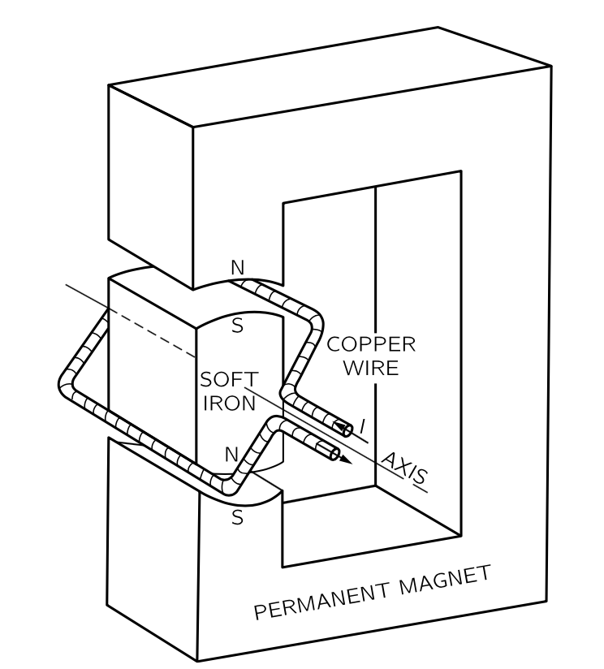{#fig-FLP_2_16_1 width=300}

전류가 자기장을 만든다는 사실을 인식하자, 사람들은 즉시 어떤 식으로든 자석도 전기장을 만들 수 있을 것을 제안하며 다양한 실험이 시도되었다. 마침내 패러데이는 1840년에 전기 효과는 무언가가 변할 때만 발생한다는 것을 발견했다. 나란한 한 쌍의 전선 중 하나의 전류가 변하면, 다른 전선에 전류가 유도되거나, 자석을 전기 회로 근처로 이동하면 전류가 발생한다. 이를 전류가 **유도된다** 고 한다. 이 유도 현상은 다소 지루한 정적인 영역의 주제를 방대한 범위의 멋진 현상을 가진 매우 흥미롭고 역동적인 주제로 변모시켰다. 이 장에서는 그 중 일부에 대한 정성적 설명에 집중하도록 한다. 자세한 분석은 나중에 진행하도록 한다.

우리는 패러데이 시대에 알려지지 않은 자기장 내의 속도에 비례하는 이동 전하에 작용하는 힘 $q\bf{v}\times \bf{B}$ 를 알고 있다. 예를 들어 자석 근처를 통과하는 전선이 있고 갈바노미터가 연결되어 있다고 하자. 자석 끝을 가로질러 전선을 움직이면 갈바노미터의 바늘이 움직인다.

자석은 약간의 수직 자기장을 발생시키며, 전선을 자기장에 밀어넣을 때 전선 안의 전자는 자기장과 속도에 직각을 이루는 힘을 느낀다. 이 힘은 전자를 전선을 따라 밀어낸다. 하지만 왜 이 힘이 멀리 떨어진 갈바노미터의 바늘을 움직이는 걸까? 왜냐하면 움직이는 자기력을 느끼는 전자는 전기적 반발로 좀 더 떨어진 전자를 전선 아래로 조금 더 밀어내고, 이 밀린 전자들은 다시 전자를 조금 더 멀리 밀어내며, 이것이 긴 거리에 걸쳐 진행된다. 놀라운 일이다.

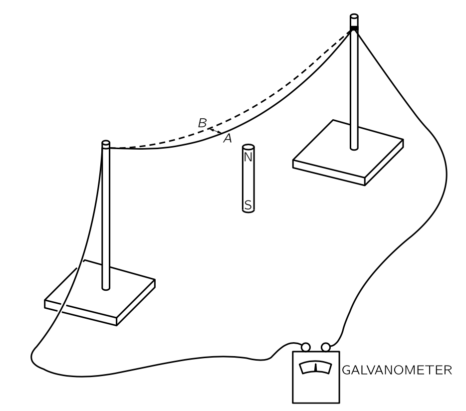{#fig-FLP_2_16_2 width=400}

첫 번째 갈바노미터를 만든가우스와 베버에게는 매우 놀라워서, 그들은 와이어의 힘이 얼마나 멀리까지 갈지 보려고 했다. 그들은 도시를 가로질러 전선을 설치했다. 가우스는 한쪽 끝에서 전선을 배터리에 연결했으며(배터리는 발전기보다 먼저 알려졌다) 그리고 베버는 갈바노미터가 움직이는 것을 관찰했다. 그들은 장거리 신호를 보내는 방법이 있었고 그것이 전신의 시작이었다! 물론, 이것은 유도와는 직접적인 관련이 없으며, 전류가 유도에 의해 전달되는지 여부와 관계없이 전선이 전류를 운반하는 방식과 관련이 있다.

@fig-FLP_2_16_2 의 설정에서 전선을 그대로 두고 자석을 움직인다고 하자. 우리는 여전히 갈바노미터에 영향을 보고 있습니다. 패러데이가 발견했듯이, 자석을 전선 아래로 한쪽 방향으로 움직이는 것과 자석 위로 전선을 반대 방향으로 움직이는 것은 동일한 효과를 나타낸다. 하지만 자석이 움직일 때에는 우리는 더 이상 전선의 전자에 대한 $q\bf{v}\times \bf{B}$ 힘이 없으며 이것은 패러데이가 발견한 새로운 효과이다. 오늘날에는 상대성 논증을 통해 그것을 이해 할 수 있다.

우리는 이미 자석의 자기장이 내부 전류에서 비롯된다는 것을 이해하고 있다. 따라서 @fig-FLP_2_16_2 의 자석 대신 전류가 흐르는 코일을 사용할 경우 동일한 효과가 관찰될 것으로 기대한다. 전선을 코일 위로 이동시키면 갈바노미터에 전류가 흐르게 되며, 코일을 전선 너머로 이동시키면 전류가 발생한다. 하지만 더 흥미로운 것이 있다. 코일의 자기장을 움직이는 것이 아니라 코일에 흐르는 전류를 바꾸면 갈바노미터에 효과가 나타난다. 예를 들어, @fig-FLP_2_16_3 에 표시된 대로 코일 근처에 전선 고리가 있고, 두 회로를 모두 고정하되 전류를 차단하면, 갈바노미터를 통과하는 전류 펄스가 발생한다. 게다가 코일을 다시 켜면 갈바노미터가 반대 방향으로 작동한다.

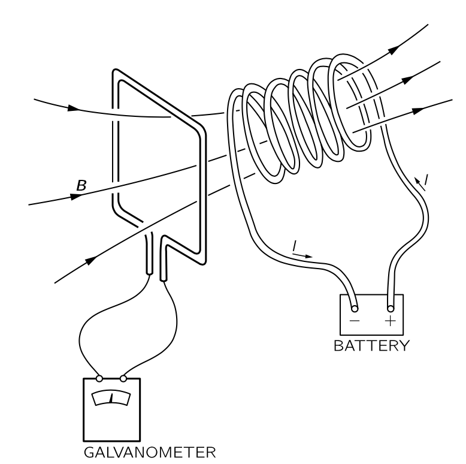{#fig-FLP_2_16_3 width=400}

@fig-FLP_2_16_2 나 @fig-FLP_2_16_3 과 같은 상황에서 갈바노미터에 전류가 있을 경우, 와이어 내 전자를 와이어를 따라 한쪽 방향으로 밀게 된다. 다른 장소에서 다른 방향으로 밀 수 있지만 한쪽 방향으로 더 많이 미는 경우가 생길 수 있다. 중요한 것은 전체 회로에 대한 추진이다. 이것을 기술하기 위해 **기전력(electromotive force, emf)** $\mathcal{E}$ 를 다음과 같이 정의한다.

$$
\boxed{\mathcal{E} := \dfrac{1}{q}\oint_\text{circuit} \bf{f\cdot }\,d\bf{l}.}
$$ {#eq-FLP_definition_of_emf}

여기서 $\bf{f}$ 는 전하가 회로를 돌 때 받는 힘이다. 즉 기전력은 전체 회로를 한 바퀴 돌았을 때 단위 전하에 더해지는 일이다. 패라데이는 기전력이 전선에서 세 가지 방법으로 생성될 수 있음을 발견했다. ($1$) 전선을 움직여서, ($2$) 전선 근처의 자석을 움직여서, ($3$) 인근 전선의 전류를 변경해서.

@fig-FLP_2_16_1 을 다시 생각해보자. 손이나 물레방아와 같은 외부 힘에 의해 고리(혹은 고리를 여려개 겹친 코일)를 회전시키면 전선이 자기장 안에서 움직이며 에서 기전력이 발생한다. 즉 모터가 발전기로 변한다.

발전기의 코일이 움직이면 기전력이 발생하는데 그 크기는 패러데이가 발견한 간단한 규칙을 따른다. (일단 사용하고 나중에 자세히 검토하자.) 이 규칙은 고리를 통과하는 자기장의 플럭스 $\Phi_B$ 에 대해 다음과 같다.

$$
\mathcal{E} = -\dfrac{d \Phi_B}{d t} .
$$ {#eq-FLP_induced_emf_by_magnetic_flux}

@fig-FLP_2_16_1 의 코일이 회전하면 $\Phi_B$ 가 변한다는 사실을 알 수 있다. 시작할 때는 일부 플럭스가 한 방향으로 흐른다. 코일이 $180^\circ$ 회전하면 동일한 플럭스가 다른 방향으로 흐른다. 코일을 지속적으로 회전시키면 플럭스는 먼저 양수이고, 그 다음 음수, 그 다음 양수이며 이것이 계속된다. 플럭스의 변화율도 교대한다. 따라서 코일에 교대 기전력이 발생한다. 코일의 양쪽 끝을 외부 전선에 슬라이딩 접점(슬립 링이라고 함)을 통해 연결하면(전선이 꼬이지 않도록) 교류 발생기가 된다.

또는 일부 슬라이딩 접점을 이용하여 반회전 후 코일 끝과 외부 와이어 사이의 연결이 반전하도록 배치할 수 있으며, 이렇게 되면 기전력이 반전될 때 연결도 역전된다. 이 경우 기전력의 펄스는 외부 회로를 통해 항상 같은 방향으로 전류를 전달한다. 이것은 직류 발전기이다. 이렇게 @fig-FLP_2_16_1 의 기계는 모터일수도, 발전기 일 수 도 있다. 모터와 발전기는 동등하다. 정량적 동등성은 사실 완전히 우연이 아니며 에너지 보존 법칙과 관련이 있다.

 

### II.16-2 변압기와 인덕턴스 {#sec-FLP_2_16_2}

#### **변압기와 자기유도**

패러데이의 발견에서 가장 흥미로운 특징 중 하나는 한 코일에서 변하는 전류가 두 번째 코일에서 기전력을 발생시키는 점다. 그리고 놀랍게도, 두 번째 코일에서 유도된 기전력의 크기는 동일한 규칙에 의해 주어진다. 이것이 변압기를 가능하게 한다. @fig-FLP_2_16_5 과 같이 별개의 철판 다발에 감겨 있는 두개의 코일을 생각하자. 이제 코일(a)을 교류 발생기에 연결하면 지속적으로 변하는 자기장을 생기며 이 변하는 자기장은는 코일(b)에서 교대로 발생하는 기전력을 생성한다. 

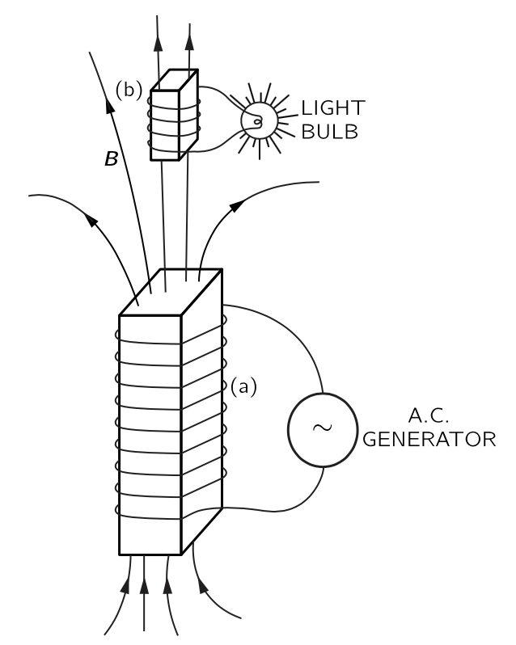{#fig-FLP_2_16_5 width=400}

기전력은 코일(b)에서 원래 발잔기의 주파수와 동일하게 교대로 작동지만 코일(b)의 전류는 코일(a)의 전류보다 크거나 작을 수 있다. 코일(b)의 전류는 유도된 기전력과 회로의 나머지 부분의 저항 및 인덕턴스에 따라 달라진다. 코일(b) 를 여러 번 감아 감아 기전력을 발생기보다 훨씬 크게 만들 수 있는데 이는 주어진 자기장에서 코일을 통과하는 플럭스가 더 커지기 때문이다. 두 코일의 이러한 조합을 변압기라고 한다. 그것은 하나의 기전력을 다른 기전력으로 변환시킨다.

단일 코일에도 유도 효과가 있다. 예를 들어, @fig-FLP_2_16_5 에서는 전구를 밝히는 코일(b) 뿐만 아니라 코일(a)을 통해서도 변화하는 플럭스가 존재합니다. 코일(a) 내부의 변동하는 전류는 자체 내부에서 변동하는 자기장을 발생시키며, 이 자기장의 플럭스는 지속적으로 변하므로 코일(a) 내에 자체 유도된 기전력이 존재한다. 전류가 자기장을 형성하고 있을 때—일반적으로 그 자기장이 어떤 형태로든 변할 때 전류에 작용하는 기전력이 존재한다. 이 효과를 **자기 유도 (self inductance)** 라고 한다.

#### **렌츠의 규칙**

이제 기전력의 방향을 알아보자. 기전력의 방향은 **렌츠의 규칙(Lenz's rule)** 이라는 간단한 규칙을 따른다. 이에 따르면 **기전력은 모든 플럭스 변화를 억제하려는 방향으로 발생한다**. 즉, 유도된 기전력 방향은 항상 기전력을 발생시키는 자기장의 방향과 반대방향으로 자기장이 생성되도록 정해진다. 특히, 단일 코일(또는 어떤 전선)에서 전류가 변하는 경우 회로에 반대 방향의 기전력이 존재한다. 이 EMF는 @fig-FLP_2_16_5 코일(a)에서 흐르는 전하에 작용하여 자기장 변화에 저항하고, 따라서 전류 변화에 저항하는 방향으로 방향으로 작용한다. 즉 전류를 일정하게 유지하려고 한다. 자기 유도로 생성되는 전류는 “관성”을 가지고 있다. 

 

### II.16-3 유도 전류에 작용하는 힘 {#sec-FLP_2_16_3}

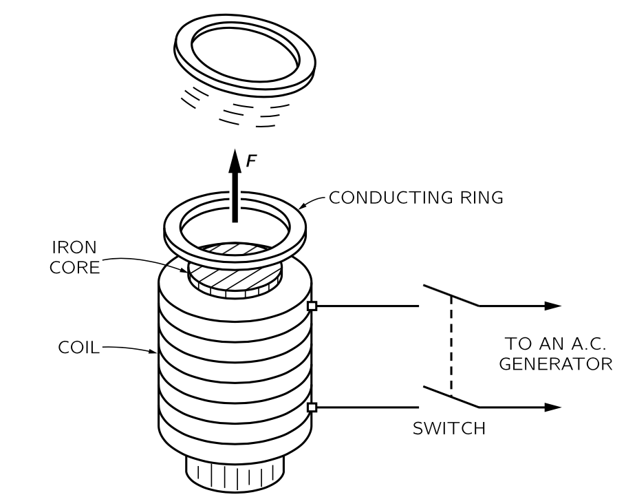{#fig-FLP_2_16_7 width=400}

@fig-FLP_2_16_7 에 표현된 장치는 렌츠의 규칙을 극적으로 보여준다. 전자석 끝에 알루미늄 고리가 놓인다. 스위치를 닫아 코일을 교류 발생기에 연결하면, 링이 공기 중으로 날아간다다. 그 힘은 물론 고리에 유도된 전류에서 비롯되며 고리가 날아간다는 것은 고리에 발생한 전류가 그 고리를 통과하는 장의 변화를 반대한다는 것을 의미한다. 자석이 상단에 북극을 만들고 있을 때, 고리 내 유도된 전류가 아래쪽을 향하는 북극을 만들고 있습니다. 링과 코일은 마치 반대쪽에 같은 극을 가진 두 개의 자석처럼 반사됩니다. 링에 얇은 틈을 만들면(그래서 전류가 흐르지 않게 하면) 힘이 사라지는데 이는 서로 미는 힘이 링의 전류에서 비롯된다는 것을 보여준다.

만약 고리 대신에 @fig-FLP_2_16_7 의 전자석 끝에 알루미늄 또는 구리 디스크를 배치하면, 이것도 반발되며, 유도된 전류가 디스크의 물질 내를 순환하며 반발력을 만들어 낸다.

기원이 유사한 흥미로운 효과가 완전한 전도체의 시트에 발생한다. "완전 도체"에서는 전류에 전혀 저항이 없다. 따라서 전류가 생성되면, 그것은 영원히 계속될 수 있다. 실제로, 가장 작은 기전력도 임의의 크기의 전류를 발생시키므로, 이는 실제로 기전력이 전혀 존재할 수 없다는 것을 의미한다. 이러한 시트를 통해 자기 플럭스를 흐르게 하려는 모든 시도는 강한 반대 방향 자기장을 생성하는 전류를 발생시킨다. 모두 무한소 기전력을 가지고 있어 플럭스가 들어오지 않는다.

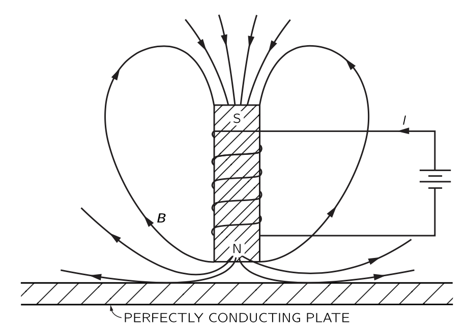{#fig-FLP_2_16_8 width=400}

완전 도체의 시트 옆에 전자석을 놓으면, 전자석의 전류를 켤 때 **와전류 (eddy current)** 라고 하는 전류가 시트에 나타나므로 자기 플럭스가 들어오지 않는다. 자기장선은 @fig-FLP_2_16_8 에 표현된 대로 보일 것이다. 물론, 막대 자석을 완전 전도체 근처에 두어도 같은 일이 발생합니다. 와전류가 반대 방향의 자기장을 생성하기 때문에, 자석이 도체에서 밀린다. 이는 @fig-FLP_2_16_9 에 표시된 바와 같이 접시 모양의 완전 전도체 시트 위에 공기 중에 막대 자석을 매달 수 있게 한다. 자석은 완전 도체에서 유도된 와전류의 반발에 의해 매달려 있다. 낮은 온도에서 완전 도체가 존재할 수 있으며 이를 **초전도체 (superconductor)** 라고 한다.

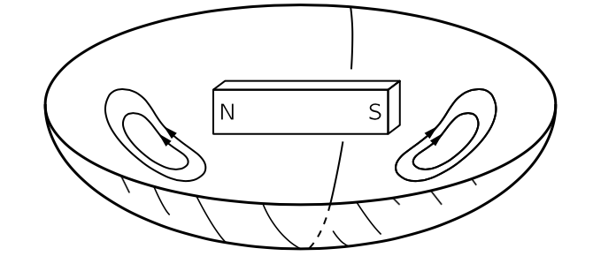{#fig-FLP_2_16_9 width=400}

@fig-FLP_2_16_8 의 도체가 완전 도체가 아닐경우, 와전류 흐름에 약간의 저항이 발생하며 전류는 점차 사라지는 경향이 있고 자석은 서서히 가라앉게 된다. 불완전 도체의 와전류는 지속되기 위해 기전력이 필요하고, 기전력을 갖기 위해서는 플럭스가 계속 변해야 한다. 자기장의 플럭스가 점차 도체를 관통한다. 

일반 도체에서는 와전류에 의해 발생하는 반발력뿐만 아니라 측면력(sidewise force)도 발생할 수 있다. 예를 들어, 전도면을 따라 자석을 옆으로 이동시키면 와전류가 인장력을 발생시키게 되며, 이는 유도된 전류가 플럭스 위치의 변화를 반대하기 때문이다. 이러한 힘은 속도에 비례하며 일종의 점성력과 같다.

.... 이후 생략 ...

 

## II.17 전자기 유도의 법칙 {#sec-FLP_2_17}

### II.17-1 전자기 유도의 물리학 {#sec-FLP_2_17_1}

우리는 [II.16-1 모터와 발전기](#sec-FLP_2_16_1) 에서 기전력의 정의(@eq-FLP_definition_of_emf), 기전력과 자기선속의 시간에 대한 변화의 관계(@eq-FLP_induced_emf_by_magnetic_flux) 에 대해 건드렸다. 

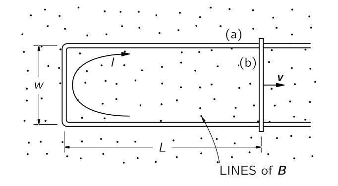{#fig-FLP_2_17_1 width=360}

@fig-FLP_2_17_1 은 크기가 변하는 변경할 수 있는 간단한 루프를 보여준다. 이 루프는 균일한 자기장 $\bf{B}$ 에 수직하게 놓여져 있다고 하자. 그리고 크로스바가 속도 $\bf{v}$ 로 그림과 같이 이동한다고 하자. 그렇다면 기전력에 의해 전류가 발생한다. 여기서 전선에 충분한 저항이 있어 전류가 작다고 가정하자. 그렇다면 우리는 이 전류에서 발생하는 자기장을 무시할 수 있다. 그렇다면  @eq-FLP_induced_emf_by_magnetic_flux 에 의한 기전력 $\mathcal{E}$ 는 다음과 같다.

$$
\mathcal{E}= wBv.
$$

기전력은 단위 전하가 얻는 일이다. 움직이는 크로스바의 단위 전하에는 $\bf{v}\times \bf{B}$ 의 힘이 전선에 접선으로 길이 $\omega$ 의 거리에서 작용하므로 이를 통해 이해한 기전력 역시 $vBw$ 로 자기 플럭스의 변화율로부터 얻은 것과 동일한 결과를 얻었다.

방금 제시된 논증은 고정된 자기장이 존재하고 전선이 움직이는 모든 경우로 확장될 수 있다. 일반적으로, 고정된 자기장 내에서 부품이 움직이는 모든 회로에서 기전력은 회로의 형태와 관계없이 플럭스의 시간 미분임을 증명할 수 있다. 

반면에, 루프가 정지하고 자기장이 변하면 어떻게 될까? 우리는 위의 논증으로부터 이 질문에 대한 답을 추론할 수 없다. 페러데이는 실험을 통해 플럭스 규칙이 플럭스가 변하는 원인과 무관하게 성립한다는 것을 발견했다. 전하에 작용하는 힘은 $\bf{F}=q(\bf{E} + \bf{v}\times \bf{B})$ 로 완전한 기술되며, 변화하는 자기장에 의한 새로운 특별한 “힘”은 존재하지 않는다. 정지된 전선에서 정지된 전하에 작용하는 모든 힘은 $\bf{E}$ 에서 비롯된다. 패러데이는 전기장과 자기장이 새로운 법칙에 의해 연관되어 있다는 사실을 발견했다: **시간에 따라 자기장이 변하는 영역에서는 전기장이 생성된다.** 이 전기장이 전자를 전선 주위로 구동하며, 따라서 자기 플럭스가 변할 때 정지한 회로에서 기전력을 일으킨다.

시간에 따라 변화하는 자기장과 관련된 전기장의 일반 법칙은 다음과 같다.

$$
\nabla \times \bf{E} = −\dfrac{\partial \bf{B}}{\partial t}.
$$ {#eq-FLP_2_17_1}

이 식은 **패러데이 법칙** 이라고 불리며 그에 의해 발견되었지만, 맥스웰에 의해 미분 형태로 그의 방정식 중 하나로 쓰여졌다. 스토크스 정리를 이용하면 패러데이의 법칙은 적분 형태로 아래와 같이 쓸 수 있다.

$$
\oint_\Gamma \bf{E}\cdot\, d\bf{l} = \int_S (\nabla \times \bf{E})\cdot d\bf{a} = -\int_S \dfrac{\partial \bf{B}}{\partial t}\bf{\cdot} d\bf{a}.
$$ {#eq-FLP_2_17_2}

여기서, 일반적으로 $\Gamma$ 는 닫힌 곡선이며 $S$ 는 $\Gamma$ 를 경계로 갖는 표면이다. $\Gamma$ 와 $S$ 를 공간상에 고정시키면 $S$ 에 대한 자기장의 플럭스 $\Phi_B = \int_S \bf{B\cdot}d\bf{a}$ 에 대해

$$
\oint_\Gamma \bf{E}\cdot\, d\bf{l}=−\dfrac{d}{dt}\int_S \bf{B}\bf{\cdot} d\bf{a}=−\dfrac{d \Phi_B}{dt}.
$$ {#eq-FLP_2_17_3}

이며, 따라서 우리는 @eq-FLP_induced_emf_by_magnetic_flux 을 얻게 되었다.

따라서 **플럭스 규칙**—회로의 기전력이 회로를 통과하는 자기 플럭스의 변화율과 같다—은 자기장이 변하든 회로가 변하든 모두에 적용된다. 

 

### II.17–2 플럭스 규칙의 예외 {#sec-FLP_2_17_2}

여기서 부분적으로 패러데이 덕분인 몇 가지 예시를 보인다. 이는 유도된 기전력을 설명하는 두 효과 사이의 구분을 명확히 하는 것이 중요함을 보여준다. 우리의 예는 “플럭스 규칙”을 적용할 수 없는 상황을 포함합니다—전선이 전혀 없거나 유도 전류에 의해 흐르는 경로가 도체의 연장된 부피 내에서 이동하기 때문입니다.

시작하기 앞서 짚고 넘어갈 것이 있다. $\bf{E}$ 에서 나오는 기전력은 물리적인 전선의 존재 여부와 상관 없다는 것이다. 이는 $\bf{v}\times \bf{B}$ 부분도 마찬가지이다. $\bf{E}$ 는 자유 공간에 존재할 수 있으며, 공간에 고정된 모든 가상의 직선에 대한 선적분은 그 직선을 통과하는 $\bf{B}$ 의 플럭스의 변화율이다. (하지만 정적인 전하에 의해 생성되는 $\bf{E}$ 의 경우 닫힌 경로에 대한 선적분은 항상 $0$ 임을 기억하라)

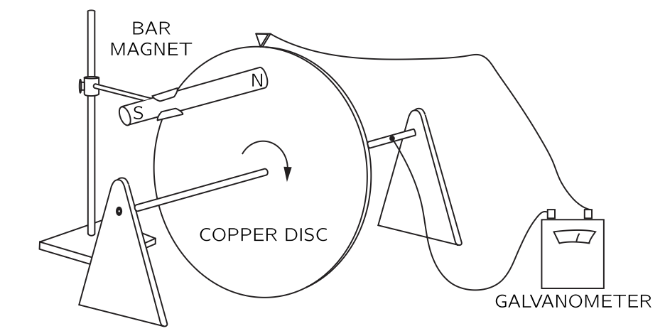{#fig-FLP_2_17_2 width=360}

이제 회로를 통과하는 플럭스가 변하지 않지만, 그럼에도 불구하고 기전력이 발생하는 상황을 설명한다. @fig-FLP_2_17_2 는 자기장이 존재할 때 고정 축을 따라 회전할 수 있는 도체디스크를 보여준다. 접점중 하나는 샤프트에, 다른 접점은 디스크의 외부 모서리에 접한다. 회로에는 갈바노미터가 연결되어 있다. 디스크가 회전할 때, 전류가 흐르는 공간의 위치라는 의미의 “회로”는 항상 동일하다. 하지만 디스크의 “회로” 부분은 움직이는 물질에 있습니다. '회로'를 통과하는 플럭스는 일정하지만, 여전히 전류가 존재하며, 이는 갈바노미터를 통해 관찰할 수 있다. 분명히, 움직이는 원반에서 $\bf{v}\times \bf{B}$ 힘이 기전력 발생시키는 경우가 있으며, 이는 플럭스 변화와 동일시될 수 없다.

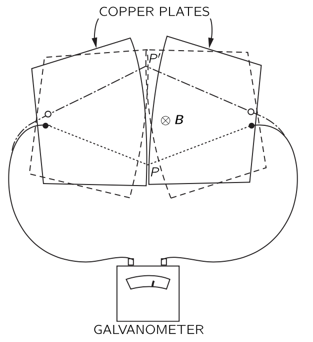{#fig-FLP_2_17_3 width=360}

이제 위 상황의 반대의 예로서, 전류가 있는 위치의 의미에서 “회로”를 통과하는 플럭스가 변하지만 기전력이 존재하지 않는 다소 특이한 상황에 대한 예를 보이고자 한다. @fig-FLP_2_17_3 에 표시된 바와 같이 약간 곡선형 가장자리를 가진 두 개의 금속판이 표면에 수직인 균일한 자기장에 배치된다고 하자. 각 판은 표시된 대로 갈바노미터의 단자 중 하나에 연결된다. 플레이트는 $P$ 지점에서 접촉하므로 완전한 회로가 된다. 판이 이제 작은 각도로 흔들리면, 접촉점이 $P'$ 로 이동한다. 그림에 표시된 점선상의 판을 통해 “회로”가 완성되는 것으로 가정한다면, 판이 앞뒤로 흔들림에 따라 이 회로를 통과하는 자기 플럭스가 크게 변한다. 하지만 이 흔들림이 매우 작다면 $\bf{v}\times \bf{B}$ 가 매우 작고 거의 기전력이 없다. “플럭스 규칙”은 이 경우 작동하지 않는다. 회로의 재료가 동일하게 유지되는 회로에 적용되어야 하며 회로의 재료가 변할 때, 우리는 기본 법칙으로 돌아가야 한다. 올바른 물리학은 항상 두 가지 기본 법칙에 의해 주어진다.

$$
\begin{gather}
\bf{F} = q(\bf{E} + \bf{v} \times \bf{B}),\\[0.3em]
\nabla \times \bf{E}=−\dfrac{\partial \bf{B}}{\partial t}.
\end{gather}
$$

 

### II.17-3 유도 전기장에 의한 입자 가속 ; 베타트론

::: {#exm-FLP_chaper_2_17_3}

#### 베타트론

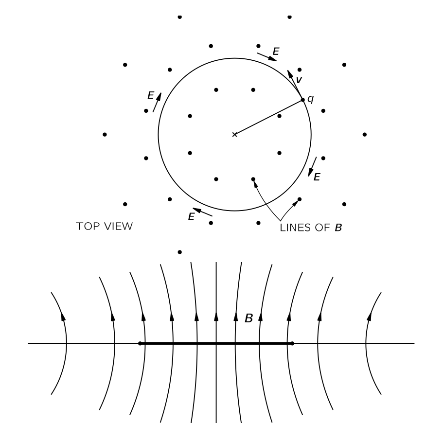{#fig-FLP_2_17_4 width=420}

유도 전기장의 효과에 대한 예로, 변화하는 자기장에서의 전자의 움직임을 생각한다. @fig-FLP_2_17_4 와 같이 평면 전체에서 수직 방향으로 향하는 자기장을 생각한다. 보통 자기장은 전자석에 의해 생성되지만, 이런 세부 사항에 대해서는 고려하지 않는다. 자기장 $\bf{B}$ 가 그림과 같이 축에 대해 대칭이라고 하자. 즉 자기장의 강도는 축으로부터의 거리에만 의존한다. 또한 자기장은 시간에 따라 변한다. 이제 이 자기장에서 자기장의 축을 중심으로 반지름 $r$ 인 원을 따라 움직이는 전자를 생각하자(원을 유지하게 하는 방법은 잠시 후에 나온다.) 변화하는 자기장 때문에 전자의 궤도에 접선방향으로 생기는 전기장 $\bf{E}$ 로 인해 전자의 원운동이 유지된다. 이 원 내부의 자기장의 평균값을 $\bf{B}_\text{av}$ 라고 하자. 그렇다면 

$$
2\pi rE=\dfrac{d}{dt}\left(B_\text{av}⋅\pi r^2\right).
$$

이므로 전기장의 크기는 다음과 같다.

$$
E=\dfrac{r}{2} \dfrac{dB_\text{av}}{dt}.
$$ {#eq-FLP_2_17_4}

상대론인 운동방정식 $dp/dt = F$ 로부터

$$
\dfrac{dp}{dt} = qE
$$ {#eq-FLP_2_17_5}

이며 @eq-FLP_2_17_4 와 @eq-FLP_2_17_5 로부터

$$
\dfrac{dp}{dt} = \dfrac{qr}{2}\dfrac{dB_\text{av}}{dt}
$$ {#eq-FLP_2_17_6}

을 얻는다. 이를 적분하면
$$
p = p_0 + \dfrac{qr}{2}\Delta B_\text{av}
$$ {#eq-FLP_2_17_7}

이다. 여기서 $p_0$ 는 시작 시점에서의 전기장의 운동량이며 $\Delta B_\text{av}$ 는 $B_\text{av}$ 의 변화량이다. 베타트론은 이 아이디어에 기반하여 전자를 높은 에너지로 가속시키는 장치이다.

이제 베타트론에서 전자가 원운동에 제한되는 방식을 알아보자. 우리는 이미 전자 궤도에 자기장 $\bf{B}$ 가 존재하면 힘 $q\bf{v}\times \bf{B}$ 이 발생하므로 적절하게 $\bf{B}$ 를 조절하면 원운동이 가능하다는 것을 안다. 우리는 다시 상대론적 운동 방정식을 사용하여 궤도에서의 자기장이 무엇인지 알 수 있지만, 이번에는 힘의 횡성분에 대해 알 수 있다. 베타트론에서 (그림을 참조하십시오. 17–4), $\bf{B}$ 는 $\bf{v}$ 와 수직이므로 횡력은 $qvB$ 이다. 따라서 힘은 운동량의 횡성분 $p_t$ 의 변화율과 같다:

$$
qvB=\dfrac{dp_t}{dt}.
$$ {#eq-FLP_2_17_8}

입자가 원 궤도로 움직일 때, 

$$
\dfrac{dp_t}{dt} = \omega p_t
$$ 

이어야 하며

$$
\omega =\dfrac{v}{r}
$$ {#eq-FLP_2_17_10}

이다. 자기력을 횡가속도와 동일해야 하므로

$$
qvB_\text{orbit}=p\dfrac{v}{r},
$$ {#eq-FLP_2_17_11}

여기서 $B_\text{orbit}$ 은 반지름 $r$ 의 경로상의 자기장이다.

@eq-FLP_2_17_7 에 따르면 베타트론이 작동함에 따라 전자의 운동량은 $B_\text{av}$ 에 비례하여 증가한다. 그리고 전자가 적절한 원 안에서 계속 움직이려면, 전자의 운동량이 증가함에 따라 @eq-FLP_2_17_11 이 계속 유지되어야 한다. 즉 $B_\text{orbit}$  값은 운동량 $p$ 에 비례하여 증가해야 한다. @eq-FLP_2_17_11 과 $p$ 를 결정하는 @eq-FLP_2_17_7 를 비교해보면, 반경 $r$ 에서 궤도 내부의 평균 자기장인 $B_\text{av}$ 와 궤도에서의 자기장 $B_\text{orbit}$ 사이에 다음과 같은 관계가 유지되어야 함을 알 수 있다:

$$
\Delta B_\text{av} = 2\Delta B_\text{orbit}.
$$ {#eq-FLP_2_17_12}

베타트론의 올바른 작동을 위해서는 궤도 내부의 평균 자기장이 궤도 자체의 자기장의 두 배 속도로 증가해야 한다. 이러한 상황에서는, 유도된 전기장에 의해 입자의 에너지가 증가함에 따라 궤도에서의 자기장이 입자가 원을 그리며 움직이도록 유지하는 데 필요한 속도만큼 증가한다.

:::

 

베타트론은 전자를 수천만 볼트, 혹은 수억 볼트의 에너지로 가속시키는 데 사용된다. 하지만 여러 가지 이유로 전자가 몇 억 볼트보다 훨씬 높은 에너지로 가속하는 것은 비현실적이다. 그 중 하나는 궤도 내부 자기장에 대한 요구되는 높은 평균값을 달성하는 것이 실제로 어렵다는 점이다. 다른 하나는 @eq-FLP_2_17_6 은 매우 높은 에너지에서는 더 이상 올바르지 때문이다. 이 식은 입자의 전자기 에너지 복사를 포함하지 않기 때문이다([I.34 복사의 상대론적 효과](../vol1/vol1_4.qmd#sec-FLP_1_34) 에서 다룬다). 이러한 이유로 전자를 최고 에너지—수십억 볼트에 달하는 전자볼트—로 가속하는 것은 싱크로트론이라고 하는 다른 종류의 기계에 의해 수행된다.

 

### II.17–4 A paradox {#eq-FLP_2_17_4}

::: {#exm-FLP_2_17_4}

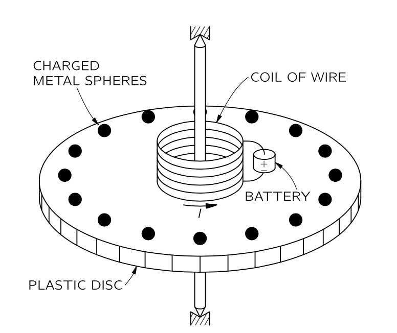{#fig-FLP_2_17_5 width=300}

@fig-FLP_2_17_5 와 같은 장치를 생각하자. 좋은 베어링을 갖춘 동심축에 의해 지지되는 얇은 원형 플라스틱 디스크가 있어 회전이 매우 자유롭다. 디스크 위에 회전축과 중심을 공유하는 짧은 솔레노이드 형태의 와이어 코일이 있다. 이 솔레노이드는 디스크에 장착된 작은 배터리가 제공하는 일정한 전류를 전달한다. 디스크의 가장자리 근처를 따라 균등하게 배치한 여러 작은 금속 구슬이 각자 그리고 솔레노이드와 디스크의 플라스틱 재료에 의해 절연되어 있다. 각각의 작은 전도성 구슬은 동일한 정전기 전하 $Q$ 를 가지고 있다. 원반은 정지해 있고 다른 것들은 고정되어 있다. 이제 외부의 개입 없이 솔레노이드의 전류가 차단되되었다고 하자.

**논리 1.** 전류가 흐를 때는 솔레노이드를 통과하는 자기 플럭스가 디스크 축에 대체로 평행했다. 전류가 차단되었다면 이 플럭스는 $0$ 이 되며 따라서 유도된 전기장이 축을 중심으로 원을 그리며 순환하게 된다. 원반의 둘레에 있는 전하를 띤 구슬에 디스크의 둘레에 접하는 전기장이 가해지고 따라서 디스크에 순 토크가 발생한다. 이러한 논리로 우리는 솔레노이드의 전류가 차단되면 디스크가 회전하기 시작할 것으로 예상할 수 있다. 디스크의 관성 모멘트와 솔레노이드의 전류, 그리고 작은 구체에 있는 전하를 알면 결과 각속도를 계산할 수 있다.

**논리 2.** 하지만 우리는 다른 주장을 제시할 수도 있다. 각운동량 보존 법칙으로부터 디스크와 그 모든 장비의 각운동량이 처음에 $0$ 이며 따라서 조립체의 각운동량은 0으로 유지되어야 합니다. 이 논리에 따르면 전류가 끊기더라도 회전이 없어야 한다. 

:::

여기에 대한 올바른 답은 배터리의 비대칭적인 위치와 같은 핵심적이지 않은 특성에 의존하지 않다는 것이 유의해야 한다. 실제로는 다음과 같은 이상적인 상황을 상상할 수 있다: 솔레노이드는 전류가 흐르는 초전도 와이어로 만들어집니다. 디스크를 조심스럽게 멈춘 후, 솔레노이드의 온도가 천천히 상승하도록 한다. 도선의 온도가 초전도와 정상 전도도 사이의 전이 온도에 도달하면, 솔레노이드의 전류는 와이어의 저항에 의해 $0$ 이 된다. 플럭스는 이전과 같이 $0$ 으로 감소하며, 축 주위에 전기장이 발생할 것이다. 이것은 속임수가 아니며 해결책 또한 쉽지 않다. 이것을 이해한다는 것은 전기자기학의 중요한 원리를 이해했다는 것이다.

 

### II.17–5 교류 발생기 {#sec-FLP_2_17_5}

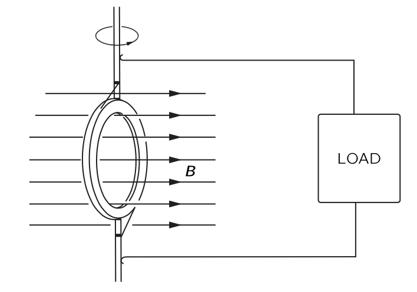{#fig-FLP_2_17_6 width=300}

이 장의 나머지 부분에서는 [II.17–1 전자기 유도의 물리학](#sec-FLP_2_17_1) 의 원리을 적용하여 [II.16 유도전류](#sec-FLP_2_16) 에서 논의된 여러 현상을 분석한다. 먼저 교류 발생기를 더 자세히 알아보자. 교류 발전기는 기본적으로 @fig-FLP_2_17_6 과 같이 균일한 자기장 안에서 회전하는 전선 코일로 구성된다. 또한 코일의 양쪽 끝이 일종의 슬라이딩 접점을 통해 외부 접점에 연결된다고 하자.

코일의 회전으로 인해 그 코일을 통과하는 자기 플럭스가 변하게 되며 따라서 코일 회로에 기전력이 발생한다. 코일의 면적을 $S$ 라고 하고, $\theta$ 를 자기장과 코일 평면에 대한 법선 사이의 각도라고 하면 코일을 통과하는 자기 플럭스 $\Phi_B$ 는

$$
\Phi_B= B S \cos \theta.
$$ {#eq-FLP_2_17_13}

이다. 코일이 일정한 각속도 $\omega$ 로 회전하면, $\theta = \omega t$ 와 같이 변한다. 코일에 $N$ 번 감겨있을 때 코일에 발생하는 기전력 $\mathcal{E}$ 는

$$
\mathcal{E}= −N\dfrac{d}{dt}(BS \cos \omega t) = NBS \omega \sin \omega t.
$$ {#eq-FLP_2_17_14}

발전기에서 전선을 회전 코일에서 어느 정도 떨어진 지점으로 이동시켜 자기장이 0이거나 최소한 시간에 따라 변하지 않게 한다면, 이 영역에서 $\nabla \times \bf{E}=0$ 이므로 전기 포텐셜을 정의할 수 있다. 실제로, 발전기에서 전류가 흐르지 않을 경우, 두 와이어 사이의 전위 차이 $V$ 는 회전 코일의 기전력과 같다. 즉,

$$
V = NBS\omega \sin \omega t= V_0 \sin \omega t.
$$

이렇게 시간에 따라 달라지는 전위를 교류 전압이라고 한다.

전선 사이에 전기장이 있기 때문에 대전되어야 한다. 발전기의 기전력이 여분의 전하를 전선으로 밀어내어 전기장을 발생시키는 데 이 전기장이 유도에 의해 발생한 전기장을 정확히 상쇄할 만큼 충분히 강해질 때까지 전하를 보낼 것이다. 발전기 외부에서 보았을 때, 두 전선은 전위 차 $V$ 에 전기적으로 전하를 띤 것처럼 보이며, 시간이 지나면서 전하가 변하여 교류 전압을 만들고 있는 것처럼 보인다. 정전기 상황과도 또 다른 차이가 있다. 발전기를 전류가 흐르는 외부 회로에 연결하면, 기전력이 전선이 방전되는 것을 허용하지 않지만 전류가 흐르는 동안 전선에 계속 전하를 공급하여 전선을 항상 동일한 전위 차이로 유지하려고 한다. 실제로 발전기가 총 저항이 $R$ 인 회로에 연결되어 있다면, 회로를 통과하는 전류는 발전기의 전류에 비례하고 $R$ 에 반비례한다. 기전력이 시간과 진동수의 곱에 대한 사인함수이므로 전류도 마찬가지이다. 이를 교류 전류라고 한다.

$$
I=\dfrac{\mathcal{E}}{R} = \dfrac{V}{R} \sin \omega t.
$$

우리는 또한 기전력이 발전기가 공급하는 에너지의 양을 결정한다는 것을 알 수 있다. 전선의 각 전하는 전하에 작용하는 힘 $\bf{F}$ 와 전하의 속도 $\bf{v}$ 에 대해 $\bf{F\cdot v}$ 의 속도로 에너지를 받고 있다. 이제 와이어의 단위 길이당 이동 전하의 수를 $n$ 이라고 하자. 그러면 와이어의 길이 요소 $ds$ 에 전달되는 일률은 $\bf{F \cdot v }nds$ 이다. 전선의 경우, $\bf{v}$ 의 방향은 $ds$ 의 방향과 같으므로 $nv\bf{F \cdot}d\bf{s}$ 라고 쓸 수 있다. 그렇다면 전체 회로에 전달되는 총 일률은 전체 경로에 대한 이 식의 적분이 된다.

$$
\text{Power} = \oint nv\bf{F\cdot} \,d\bf{s}.
$$ {#eq-FLP_2_17_15}

여기서 $qnv = I$ 는 전류 I이며, $\mathcal{E}=(1/q)\oint \bf{F\cdot}d\bf{s}$ 임을 생각하면

$$
\text{발전기에서 공급되는 전력}=EI.
$$ {#eq-FLP_2_17_16}

발전기의 코일에 전류가 흐르면, 그 코일에도 기계적 힘이 작용한다. 실제로, 우리는 코일의 토크가 자기 모멘트, 자기장의 세기 $B$, 그리고 그 사이 각도의 사인에 비례한다는 것을 알고 있다. 자기 모멘트는 코일 내 전류에 그 면적을 곱한 것이다. 따라서 토크는

$$
\tau = N I S B \sin \theta.
$$ {#eq-FLP_2_17_17}

코일을 회전시키기 위해 기계적 작업을 수행해야 하는 속도는 각속도 $\omega$에 토크를 곱한 것이다:

$$
\dfrac{dW}{dt} = \omega \tau = \omega NISB \sin \theta.
$$ {#eq-FLP_2_17_18}

이 식과 @eq-FLP_2_17_14 를 비교해보자. 우리는 코일을 자기력에 맞서 회전시키는 데 필요한 기계적 작업의 속도가 $I\mathcal{E}$ 와 정확히 일치한다는 것을 알 수 있다. $\mathcal{E} I$ 는 발전기의 기전력에 의해 전기 에너지가 전달되는 속도이다. 발전기에서 소모된 모든 기계적 에너지는 회로에서 전기 에너지로 나타난다.

유도된 기전력으로 인한 전류와 힘의 또 다른 예로서, @fig-FLP_1_17_1 의 설정에서 일어나는 현상을 분석해보자. 이제 U 자형 고정된 도선의 맨 왼쪽 수직을 세워진 부분이 고저항 도선으로 만들어졌으며, 양쪽 도선은 구리와 같은 좋은 전도체로 만들어졌다고 가정한다. 그렇다면 크로스바가 이동하면서 회로 저항이 변하는 것을 걱정할 필요가 없다. 회록의 기전력은

$$
\mathcal{E}=vBw
$$ {#eq-FLP_2_17_19}

이며 회로의 전류는 이 기전력에 비례하고 회로의 저항 $R$ 에 반비례한다.

$$
I=\dfrac{\mathcal{E}}{R}=\dfrac{vBw}{R}.
$$ {#eq-FLP_2_17_20}

이 전류 때문에 크로스바에 아래와 같은 자기력이 작용한다.

$$
F=BIw.
$$ {#eq-FLP_2_17_21}

@eq-FLP_2_17_20 에서의 $I$ 를 대입하면

$$
F=\dfrac{B^2 \omega^2 v}{R}.
$$ {#eq-FLP_2_17_22}

우리는 힘이 크로스바의 속도에 비례한하며 힘의 방향은 그 속도와 반대이다. 이렇게 점성력과 유사한 **속도에 비례하는** 힘은  자기장 내에서 움직이는 도체에 의해 유도 전류가 발생할 때마다 발견된다. 지난 장에서 본 와류 전류의 예들은 전도체의 속도에 비례하는 힘을 발생시켰며, 이러한 상황은 일반적으로 해석하기 어려운 복잡한 전류 분포를 보여준다.

역학적 시스템 설계에서는 속도에 비례하는 감쇠력을 갖는 것이 종종 편리하다. 와류 전류 힘은 이러한 속도 의존력을 얻는 가장 편리한 방법 중 하나이다. 그러한 힘의 적용 사례는 기존의 가정용 전력계에서 찾아볼 수 있다. 전력계에는 영구 자석의 극 사이를 회전하는 얇은 알루미늄 디스크가 있다. 이 디스크는 집의 전기 회로에서 소비되는 전력에 비례하는 토크를 갖는 소형 전기 모터에 의해 구동된다. 디스크의 와전류 힘 때문에 속도에 비례하는 저항력이 존재한다. 평형 상태에서는 속도가 전기 에너지 소비 속도에 비례하며 회전 디스크에 부착된 카운터를 이용하여 회전 횟수를 기록한다. 이 수는 총 에너지 소비량을 나타내는 지표이며, 즉 사용된 와트시 수를 나타낸다.

우리는 또한 @eq-FLP_2_17_22 를 지적할 수도 있습니다. 이 식는 유도 전류에서 발생하는 힘—즉, 모든 와전류의 힘—이 저항에 반비례한다는 것을 보여준다. 힘이 클수록 재료의 전도성이 향상된다. 그 이유는 저항이 낮을 때 기전력이 더 많은 전류를 발생시키고, 강한 전류가 더 큰 기계적 힘을 나타내기 때문이다.

또한 우리의 식에서 기계적 에너지가 전기 에너지로 어떻게 변환되는지 확인할 수 있다. 이전과 같이 회로의 저항에 공급되는 전기 에너지는 $\mathcal{E}I$ 이다. 전도성 크로스바를 이동시키는 일의 속도는 바에 작용하는 힘에 그 속도를 곱한것이므로

$$
\dfrac{dW}{dt}=\dfrac{v^2 B^2w^2}{R}.
$$

이다. 우리는 이것이 실제로 @eq-FLP_2_17_19 와 @eq-FLP_2_17_20 에서 얻는 $\mathcal{E}I$ 와 동일하다는 것을 확인했다. 다시 역학적 작업은 전기 에너지로 나타난다.

 

### II.17–6 상호 유도 {#sec-FLP_2_17_6}

이제 고정된 와이어 코일이 존재하지만 자기장이 변하는 상황을 생각해보자. 전류에 의한 자기장 생성을 기술할 때, 우리는 정상 전류만을 고려했었다. 하지만 전류가 충분히천천히 변한다면 자기장은 매 순간 일정한 전류의 자기장과 거의 동일하다. 이 절에서는 전류가 항상 충분히 천천히 변한다고 가정한다.

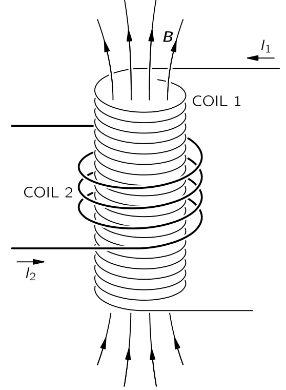{#fig-FLP_2_17_8 width=250}

@eq-FLP_2_17_8 은 변압기 작동의 기본 효과를 보여주는 두 개의 코일 배열이 표시되어 있다. 코일 1은 긴 솔레노이드 형태로 감긴 전도성 와이어로 구성됩니다. 이 코일 주변에 이 코일과 절연된 코일 2 가 코일 1을 몇차례 감고 있다.  코일 1을 통과한다면, 그 내부에 자기장이 나타날 것임을 알 수 있습니다. 이 자기장은 또한 코일 2를 통과합니다. 코일 1을 흐르는 전류가 변함에 따라 자기 플럭스가 변하면서 코일 2에 유도기전력이 발생한다. [II.13–5 직선 도선과 솔레노이드의 자기장, 그리고 원자 전류](vol2_3.qmd#sec-FLP_2_13_5) 에서 긴 솔레노이드 내부의 균일하고 그 크기는 아래와 같은 자기장이 발생한다는 것을 알게 되었다.

$$
B=\dfrac{\mu_0 N_1I_1}{l}.
$$ {#eq-FLP_2_17_23}

여기서 $N_1$은 코일 1의 회전 수이며, $I_1$ 은 코일 1을 통과하는 전류, $l$ 은 그 길이이다. 코일 1의 단면적을 $S$ 라고 하자. 코일 2에 $N_2$ 회전이 있는 경우 코일 2의 기전력 $\mathcal{E}_2$ 는

$$
\mathcal{E}_2 = −N_2S\dfrac{dB}{dt}.
$$ {#eq-FLP_2_17_24}

@eq-FLP_2_17_24 에서 시간에 따라 변하는 유일한 양은 $I_1$ 이므로 

$$
\mathcal{E}_2=−\dfrac{\mu_0 N_1 N_2 S}{l} \dfrac{dI_1}{dt}.
$$ {#eq-FLP_2_17_25}

우리는 코일 2의 기전력이 코일 1의 전류 변화율에 비례한다는 것을 확인했다. 비례 상수는 기본적으로 두 코일의 기하학적 요인으로, **상호 인덕턴스 (mutual inductance)** 라고 하며, 일반적으로 $M_{21}$ 으로 표기한다. 이로부터

$$
\mathcal{E}_2= M_{21}\dfrac{dI_1}{dt}.
$$ {#eq-FLP_2_17_26}

이제 코일 2 에 흐르는 전류에 의해 코일 1에 발생하는 기전력은

$$
\mathcal{E}_1 = M_{12}\dfrac{dI_2}{dt}.
$$ {#eq-FLP_2_17_27}

라고 쓸 수 있다. $M_{12}$ 의 계산은 방금 $M_{21}$ 에 대해 수행한 계산보다 더 어려울 것이다. 그러나 지금 그 계산을 진행하지 않는다. 왜냐하면 이 장에서 $M_{12}=M_{21}$ 임을 보일 것이기 때문이다. 

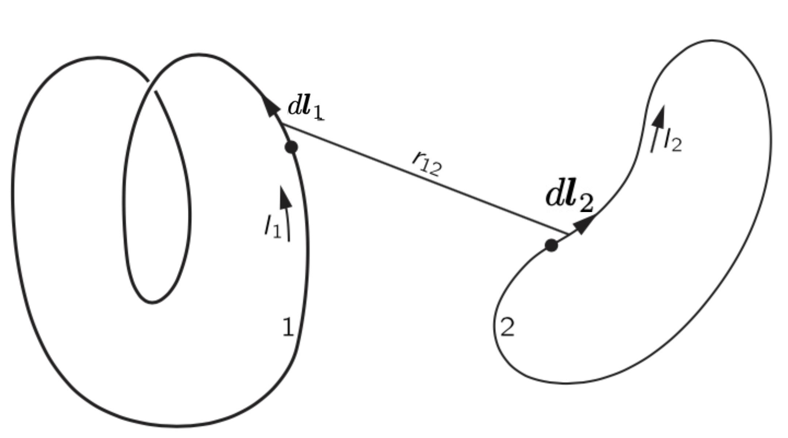{#fig-FLP_2_17_9 width=350}

@fig-FLP_2_17_9 의 코일들처럼, 임의의 두 코일 사이의 상호 인덕턴스를 계산해 보자. 우리는 코일 1에서의 기전력 $\mathcal{E}_1$ 은 회로 $1$ 을 경계로 갖는 표면 $S_1$ 에 대해 

$$
\mathcal{E}_1=−\dfrac{d}{dt}\int_{S_1}\bf{B\cdot}\,d\bf{a},
$$

임을 안다. 여기에 벡터 포텐셜을 도입하면

$$
\mathcal{E}_1 = - \dfrac{d}{dt}\oint_{\Gamma_1} \bf{A\cdot}d\bf{l}_1
$$ {#eq-FLP_2_17_28}

이다. 여기서 $\Gamma_1$ 은 회로 $1$ 을 흐르는 전류 $I_1$ 에 의해 결정되는 경로이다. 이제 회로 1의 벡터포텐셜이 회로 2의 전류에서 온다고 가정하면([II.14-2 알고 있는 전류에 대한 벡터 포텐셜](vol2_3.qmd#sec-FLP_2_14_2) 를 참고하라) 

$$
\bf{A}=\dfrac{\mu_0}{4\pi}\oint_{\Gamma_2}\dfrac{I_2}{r_{12}}\,d\bf{l}_2
$$ {#eq-FLP_2_17_29}

이다. 여기서 $\Gamma_2$ 는 회로 2 를 흐르는 전류 $I_2$ 에 의해 결정되는 경로이다. @eq-FLP_2_17_28 와 @eq-FLP_2_17_29 로부터

$$
\mathcal{E}_1=−\dfrac{\mu_0}{4\pi}\dfrac{d}{dt}\oint_{\Gamma_1}\oint_{\Gamma_2}\dfrac{I_2\, d\bf{l}_1 \bf{\cdot}d\bf{l}_2}{r_{12}}
$$

이다. 이 방정식에서 적분은 모두 고정된 회로에 대한 것이며 유일한 가변량은 $I_2$ 이고 적분 변수에 의존하지 않는다. 따라서 $\mathcal{E}_1$ 는 다음과 같이 쓸 수 있다.

$$
\mathcal{E}_1 = M_{12}\dfrac{dI_2}{dt}.
$$

여기서

$$
M_{12}=−\dfrac{\mu_0}{4\pi}\oint_{\Gamma_1} \int_{\Gamma_2} \dfrac{d\bf{l}_2 \bf{\cdot} d\bf{l}_1}{r_12}.
$$ {#eq-FLP_2_17_30}

우리는 이 적분을 통해 $M_{12}$ 가 회로의 기하학에만 의존한다는 것을 알 수 있다. @eq-FLP_2_17_30 은 임의의 형태를 가진 두 회로의 상호 인덕턴스를 계산하는 데 사용할 수 있으며 또한 $M_{12}= M_{21}$ 임을 보여준다. 따라서 두 개의 코일만 있는 시스템의 경우, $M_{12}$ 와 $M_{21}$ 은 종종 기호 $M$ 으로 표시되며, 이를 **상호 인덕턴스 (mutual inductance)** 라고 한다.

 

### II.17–7 자기 유도 {#eq-FLP_2_17_7}

@fig-FLP_2_17_8 또는 @fig-FLP_2_17_9 에서 유도된 전기전력에 대해 논의할 때, 우리는 두 코일중 하나에만 전류가 흐르는 경우를 고려했다. 두 코일에 전류가 동시에 존재한다면, 두 코일을 연결하는 자기 플럭스는 두 플럭스의 합이 되며, 이는 자기장에 중첩 법칙이 적용되기 때문이다. 따라서 두 코일의 기전력은 다른 코일 뿐만 아니라 자체의 전류 변화에도 비례한다. 따라서 코일 2의 총 기전력은 아래와 같다.

$$
\mathcal{E}_2=M_{21}\dfrac{dI_1}{dt} + M_{22}\dfrac{dI_2}{dt}.
$$ {#eq-FLP_2_17_31}

마찬가지로, 코일 1의 기전력은

$$
\mathcal{E}_1=M_{12}\dfrac{dI_2}{dt} + M_{11}\dfrac{dI_1}{dt}
$$ {#eq-FLP_2_17_32}

이다. 여기서 계수 $M_{22}$ 와 $M_{11}$ 은 항상 음수이므로 보통 아래와 같이 쓴다.

$$
M_{11}=−L_1,\qquad M_{22}= −L_2
$$ {#eq-FLP_2_17_33}

여기서 $L_1$ 과 $L_2$ 를 두 코일의 **자체 인덕턴스 (self inductance)** 라고 한다.

코일 자체만으로도 자체 인덕턴스 $L$ 을 갖게 된다. 단일 코일의 경우, 기전력과 전류가 같은 방향일 경우 양수로 간주한다는 관례 따라 단일 코일의 기전력을 다음과 같이 쓸 수 있다.

$$
\mathcal{E}=−L\dfrac{dI}{dt}.
$$ {#eq-FLP_2_17_34}

마이너스 기호는 전기 전류 변화가 반대임을 나타내며, 흔히 **역기전력 (back electromotive force)** 라고 한다.

모든 코일은 전류 변화에 반하는 자체 인덕턴스를 가지고 있기 때문에, 코일 내 전류는 일종의 관성을 가지고 있다. 실제로, 코일의 전류를 변경하고자 할 경우, 이 관성을 극복하기 위해 코일을 배터리나 발전기와 같은 외부 전압원에 연결해야 한다(@fig-FLP_2_17_10 (a)) 이런 회로에서는 전압 $\mathcal{V}$ 은  

$$
\mathcal{V}=L\dfrac{dI}{dt}.
$$ {#eq-FLP_2_17_35}

이다.

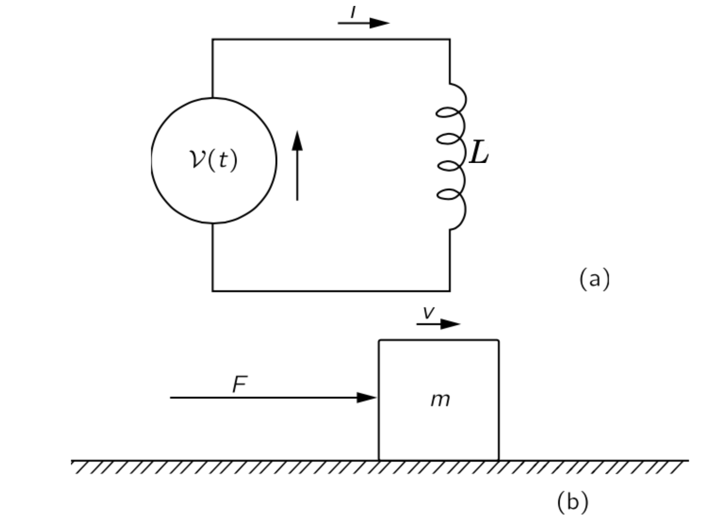{#fig-FLP_2_17_10 width=350}

 

## II.17-8 인덕턴스와 자기 에너지 {#sec-FLP_2_17_8}

앞선 절의 비유를 이어가면, 변화율이 가해진 힘인 기계적 운동량 p=mv에 해당하는 경우, 변화율이 V인 LI와 동일한 유사량이 있을 것으로 기대합니다. 물론 우리는 LI가 회로의 진정한 모멘텀이라고 말할 권리가 없으며, 실제로는 그렇지 않습니다. 전체 회로가 정지해 있을 수 있으며 동력이 없을 수도 있습니다. 이는 LI가 해당 방정식을 만족한다는 의미에서 운동량 mv와 유사하다는 것뿐입니다. 같은 방식으로, 운동 에너지 12mv²에 해당하는 유사한 양 12LI2가 있습니다. 하지만 거기에 서프라이즈가 있습니다. 이 12LI2는 전기 케이스에서도 실제로 에너지입니다. 이는 인덕턴스에 대한 작업 속도가 VI이고, 기계 시스템에서는 Fv이며, 이는 해당 양입니다. 따라서 에너지의 경우, 양은 수학적으로 일치할 뿐만 아니라 동일한 물리적 의미도 가지고 있습니다.

@eq-FLP_2_17_16 에 따라 유도된 힘에 의한 전기적 일의 속도는 기전력과 전류의 곱이다.

$$
\dfrac{dW}{dt}=\mathcal{E}I.
$$

@eq-FLP_2_17_34 를 이용하여 $\mathcal{E}$ 를 전류에 대한 표현으로 대체하면

$$
\dfrac{dW}{dt}=−LI\dfrac{dI}{dt}
$$ {#eq-FLP_2_17_36}

이며, 이 식을 적분하면 전류를 축적하는 동안 자체 인덕턴스에 의한 기전력을 극복하기 위해 외부 전원으로부터 필요한 에너지(이는 저장된 에너지 $U$ 와 동일해야 함)를 알 수 있다$^4$.[$^4$ (저자주) 여기서 코일 저항에 있는 전류로 인한 열의 에너지 손실은 무시하였다. 이러한 손실은 전원으로부터 추가 에너지를 필요로 하지만, 인덕턴스에 들어가는 에너지는 변하지 않는다.]{.aside}

$$
−W = U =\dfrac{1}{2}LI^2.
$$ {#eq-FLP_2_17_37}

따라서 인덕턴스에 저장된 에너지는 $\dfrac{1}{2}LI^2$ 이다.

@fig-FLP_2_17_8 또는 @fig-FLP_2_17_9 와 같은 코일 쌍에 동일한 논리를 적용하면, 시스템의 전체 전기 에너지가 다음과 같이 주어진다는 것을 알 수 있다.

$$
U=\dfrac{1}{2}L_1 I_1^2 + \dfrac{1}{2}L_2 I^2_2 +M I_1I_2.
$$ {#eq-FLP_2_17_38}

두 코일 모두에서 $I=0$ 이라고 하자. 먼저 코일 1에서 전류 $I_1$ 을 켜면 ($I_2=0$) 수행한 일은 단지 $L_1I_1^2/2$ 이다. 하지만 여기에 $I_2$ 를 켜면 회로 2의 기전력에 대해 $L_2I_2^2$ 의 일을 수행할 뿐만 아니라 회로 1의 기전력에 $M(dI_2/dt)$ 에 대한 적분인 $MI_1I_2$ 만큼의 일도 하게 된다. 

이제 전류 $I_1$ 과 $I_2$ 가 흐르는 두 코일 사이의 힘을 구해보자. @eq-FLP_2_17_38 에 가상 일 원리를 적용하여 구할 수 있다. 여기서 코일의 상대적 위치를 바꿀 때 변하는 유일한 양은 상호 인덕턴스 $M$ 임을 기억하자. 그렇다면 다음의 식을 얻을 수 있다.

$$
−F\Delta x = \Delta U = I_1 I_2 \Delta M(\text{틀리다}).
$$

하지만 이 식은 잘못되었다. 앞서 보았듯이, 두 코일의 에너지 변화만을 포함하고 전류 $I_1$ 과 $I_2$ 를 일정한 값으로 유지하는 전원의 에너지 변화는 포함하지 않기 때문이다. 우리는 이제 이러한 전원들이 코일이 움직일 때 유도된 기전력에 대해 에너지를 공급해야 한다는 것을 이해할 수 있다. 가상일 원리를 올바르게 적용하고자 한다면, 이러한 에너지도 포함해야 한다. 그러나 우리가 보았듯이, 우리는 단거리를 선택하여 가상 작업의 원리를 활용할 수 있으며, 전체 에너지가 우리가 '기계적 에너지'라고 부르는 $U_\text{mech}$ 의 음수임을 기억함으로써. 따라서 우리는 그 힘을 위해 쓸 수 있다.

$$
−F\Delta x=\Delta U_\text{mech} = −\Delta U.
$$ {#eq-FLP_2_17_39}

두 코일 사이의 힘은 다음과 같이 주어진다.

$$
F\Delta x = I_1 I_2 \Delta M.
$$

두 코일 시스템의 에너지에 대한 식 (17.38)은 상호 인덕턴스 M과 두 코일의 자체 인덕턴스 L1 및 L2 사이에 흥미로운 불평등이 존재함을 보여주는 데 사용될 수 있습니다. 두 코일의 에너지는 양수여야 한다는 것이 명백합니다. 코일의 전류를 0으로 시작하고 이 전류를 일부 값으로 증가시키면, 우리는 시스템에 에너지를 추가하고 있는 것입니다. 그렇지 않다면, 전류는 전 세계에 에너지가 방출될 때 자발적으로 증가할 것이며, 이는 일어날 가능성이 거의 없는 일입니다! 이제 우리의 에너지 방정식, Eq. (17.38)는 다음과 같은 형태로도 동일하게 쓸 수 있습니다:

U=12L1+12(I1+ML1I2)2(L2−M2L1)I22.( 17.40)

그것은 단지 대수적 변환일 뿐입니다. 이 양은 I1 및 I2의 모든 값에 대해 항상 양수여야 합니다. 특히, I2가 특수 값을 갖는 경우 양수여야 합니다.

I2=−L1MI1.( 17.41)

하지만 I2에 대한 이 전류와 함께, 식의 첫 번째 항은 (17.40)은 0입니다. 에너지가 양수인 경우, (17.40)의 마지막 항은 0보다 커야 합니다. 우리는 요구 사항이 있습니다

L1L2>M2.

따라서 우리는 두 코일의 상호 인덕턴스 M의 크기가 두 자기 인덕턴스의 기하학적 평균보다 반드시 작거나 같다는 일반적인 결과를 증명했습니다. (M 자체는 전류 I1과 I2의 부호 규칙에 따라 양수이거나 음수일 수 있습니다.)

|M|<L1L2−−−−√.( 17.42)