 

## $\textrm{II}$.18 멕스웰 방정식 {#sec-FLP_2_18}

### $\textrm{II}$.18-1 멕스웰 방정식 {#eq-FLP_2_18_1}

지금까지는 맥스웰 방정식 네개를 을 조각내어 공부했지만, 이제 마지막 한 조각을 추가하고 모두 합칠 때이다. 이를 통해 시간에 따라 변하는 전자기장에 대한 완전하고 정확한 이야기가 펼쳐진다. 혹시 이 장에서 앞서 말한 내용과 모순되는 내용이 나오더라도, 이 장의 사실이며 앞서 말한 내용은 틀린 것이다. 앞서 말한 내용은 예를 들어 정상 전류나 고정 전하와 같은 특수한 상황에만 적용되기 때문이다. 이제 우리는 전체 진실을 볼 준비가 되었다. 진행하기 앞서 멕스웰 방정식을 비롯한 고전 물리학의 중요한 방정식을 정리한다.

::: {.callout-important icon="false"}

#### **고전 물리학**

**멕스웰 방정식**

&emsp;$\mathrm{I}$. $\nabla \times \bf{E}= \dfrac{\rho}{\epsilon_0}$

&emsp;$\mathrm{II}$. $\nabla \times \bf{E}= - \dfrac{\partial \bf{B}}{\partial t}$

&emsp;$\mathrm{III}$. $\nabla \bf{\cdot B} = \bf{0}$, 

&emsp;$\mathrm{IV}$. $\nabla \times \bf{B} = \mu_0 \bf{J} + \dfrac{1}{c^2} \dfrac{\partial \bf{E}}{\partial t}$, 

**전하 보존**

&emsp;$\nabla \bf{\cdot J}= - \dfrac{\partial \rho}{\partial t}$

**로런츠 힘**

&emsp;$\bf{F}=q(\bf{E}+\bf{v}\times \bf{B})$

**운동방정식**

&emsp; $\dfrac{d\bf{p}}{dt}=\bf{F}$ &emsp; where $\bf{p} = \dfrac{m\bf{v}}{\sqrt{1-v^2/c^2}}$

**중력**

&emsp; $\bf{F}=-\dfrac{m_1m_2 \bf{r}}{r^3}$

:::

 

맥스웰의 작업 이전까지, 알려진 전기와 자기의 법칙은 우리가 [$\textrm{II}.3$](vol2_1.qmd#sec-FLP_2_3) 부터 [$\textrm{II}.17$](vol2_3.qmd#sec-FLP_2_17) 까지 다룬 것들이었다. 특히, 정상 전류의 자기장에 대한 방정식은 단지

$$
\nabla \times \bf{B} = \mu_0 \bf{J}
$$ {#eq-FLP_2_18_1}

로만 알려져 있었다. 맥스웰은 당시까지 알려진 법칙들을 고찰하고 이를 미분 방정식으로 표현하는것으로 시작했다.$^1$ [$^1$ 비록 $\nabla$ 표기법은 당시에 아직 발명되지 않았지만, 오늘날 우리가 컬과 발산이라고 부르는 미분의 조합의 중요성이 처음으로 드러난 것은 주로 맥스웰 덕분이다.]{.aside} 멕스웰은 @eq-FLP_2_18_1 에 뭔가 이상한 점이 있다는 것을 알아차렸다. 이 방정식의 발산을 취하면, 왼쪽 항은 0 이 되며, 따라서 $\bf{J}$ 의 발산도 0 이어야 한다. 하지만 $\nabla \bf{\cdot J}=0$ 이면, 모든 닫힌 표면에서 전류의 총 흐름도 0 이 된다. 닫힌 표면에서 전류의 플럭스는 표면 내부의 전하가 감소하는 것으로 일반적으로 0 이 될 수 없다. 왜냐하면 우리는 전하가 한 장소에서 다른 장소로 이동할 수 있다는 것을 알고 있기 때문이다. 식

$$
\nabla \bf{\cdot J} = −\dfrac{\partial \rho}{\partial t}
$$ {#eq-FLP_2_18_2}

은 거의 $\bf{J}$ 의 정의이다. 이 방정식은 전하가 보존된다는 매우 근본적인 법칙을 말한다. 전하가 흐르기 위해서는 반드시 공급이 있어야 한다. 맥스웰은 이 어려움을 이해했으며, 식의 오른쪽에 $\partial \bf{E}/\partial t$ 라는 항을 @eq-FLP_2_18_1 에 추가함으로써 이를 피할 수 있다고 제안했다. 그리고 다음 식을 얻었다.

$$
\nabla \times \bf{B}=\mu_0 \bf{J}+\dfrac{1}{c^2}\dfrac{\partial \bf{E}}{\partial t}.
$$ {#eq-FLP_2_modified_forth_equation}

### $\textrm{II}$.18-2 새로운 항은 어떻게 작동하는가? {#sec-FLP_2_18_2}

@eq-FLP_2_modified_forth_equation 의 첫 번째 예로서 구면 대칭 방사형 전류 분포에서 발생하는 현상을 생각해보자. 

::: {#exm-FLP_chaper_2_18_2_1}

#### 구면 대칭 방사형 전류 분포

하전입자를 방출하는 구형 방사선 물질이 구면 대칭 방사형 전류 분포의 예가 될 수 있다. 여기서는 모든 방향에서 전류밀도가 동일하다고 가정한다. 반지름 $r$ 내부의 총 전하를 $Q(r)$ 이라 하자. 원점으로부터의 거리 $r$ 에서 방사형 전류 밀도를 $J(r)$ 이라고 하면 전하 보존 법칙으로부터

$$
\dfrac{\partial Q(r)}{\partial t} = −4\pi r^2J(r)
$$ {#eq-FLP_2_18_5}

을 얻는다. 이제 이 상황에서 전류가 생성하는 자기장에 대해 알아보자. @fig-FLP_2_18_1 과 같이 반지름이 $r$ 인 구면에 루프 $\Gamma$ 를 그려보자. 이 루프를 통과하는 전류밀도가 있으므로 순환하는 자기장이 존재할 것이라고 생각 할 수 있다.

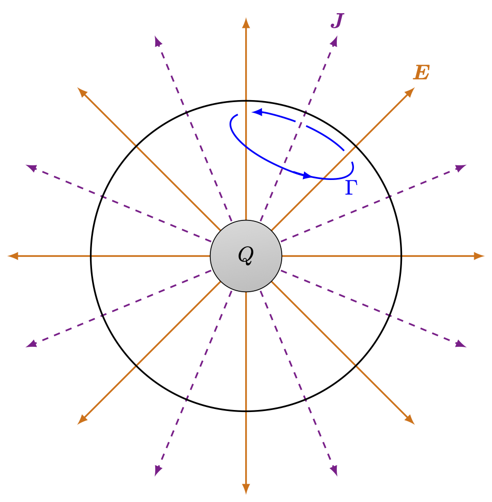{#fig-FLP_2_18_1 width=350}

하지만 $\Gamma$ 를 달리 선택하면 이전의 자기장과 정확히 상쇄하도록 할 수 있다. 그렇다면 전류 주위에 $\bf{B}$ 가 어떻게 순환할 수 있을까? 맥스웰 방정식이 우리를 구원한다. $\bf{B}$ 의 순환은 $\Gamma$ 를 통과하는 총 전류뿐만 이를 통과하는 전기 플럭스의 시간에 따른 변화율에도 의존한다. 이 두 부분이 서로 상쇄된 것이다. 이것을 확인해보자.

반지름 $r$ 에서의 전기장은 전하가 대칭적으로 분포되어 있다고 가정하는 한 $Q(r)/4\pi \epsilon_0 r^2$ 이며

$$
\dfrac{\partial E}{\partial t}=\dfrac{1}{4 \pi \epsilon_0  r^2}\dfrac{\partial Q}{\partial t}
$$ {#eq-FlP_2_18_6}

이다. 이것을 @eq-FLP_2_18_5 와 비교하면

$$
\dfrac{\partial E}{\partial t} = −\dfrac{J}{\epsilon_0}
$$ {#eq-FLP_2_18_7}

이다. 그렇다면 멕스웰 방정식 $\textrm{IV}$ 에서 $\nabla \times \bf{B}=\bf{0}$ 이다.

:::

 

::: {#exm-FLP_chaper_2_18_2_2}

#### 변위 전류

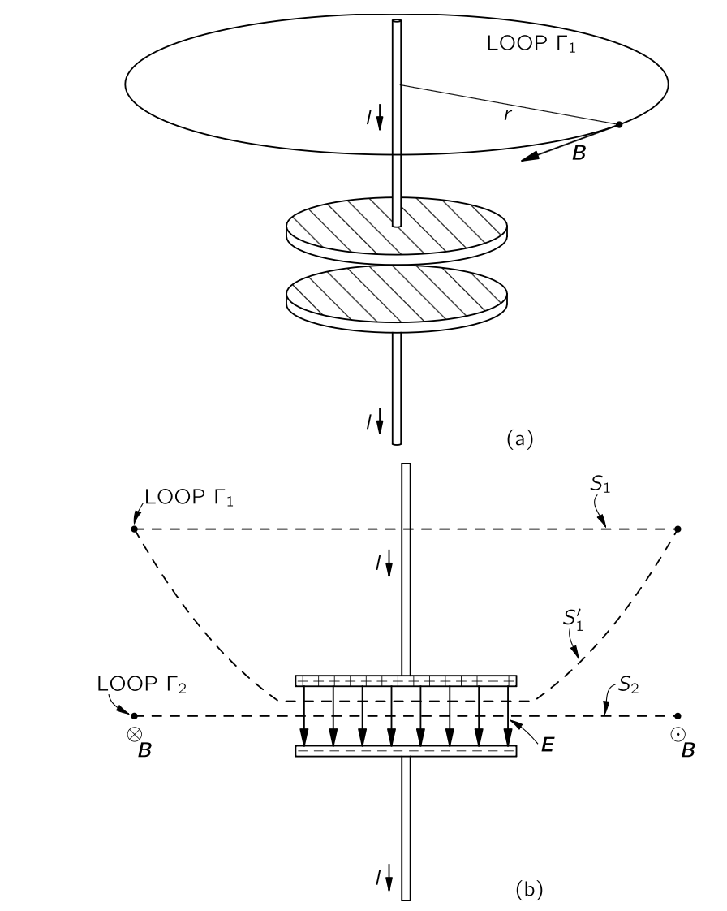{#fig-FLP_2_18_2 width=350}

평행판 축전지를 충전하는 데 사용되는 전선에서의 자기장을 생각하자(@fig-FLP_2_18_2). 평행판의 전하 $Q$ 가 시간에 따라 (너무 빠르지 않게) 변한다면, 전선의 전류는 $dQ/dt$ 와 같고 이 전류는 전선 주위에 자기장을 발생시킨다.

그림의 (a) 처럼 반지름 $r$ 인 원인 루프 $\Gamma_1$ 을 생각하자. 그렇다면

$$
2\pi r B= \mu_0 I 
$$ {#eq-FLP_2_18_8}

이다. 이것은 맥스웰의 덧셈에서도 올바르다. 왜냐하면 원 안의 평면 표면 $S$ 를 고려하면 (전선이 매우 좋은 전도체라고 가정할 때) 그 위에 전기장이 없기 때문이며, $\partial E/\partial t$ 의 표면 적분은 $0$ 이다.

이제 우리는 곡선 $\Gamma$ 를 천천히 아래로 이동한다고 해 보자. 축전지의 한 평행판과 겹치기 전까지 같은 결과를 얻게 된다. 그리고 나서 평행판을 지나면 $I$ 는 $0$ 이 된다. 자기장이 사라지나? 그것은 꽤 이상하다. 맥스웰 방정식이 곡선 $\Gamma_2$ 에 대해 어떻게 말하는지 살펴보자. $\Gamma_2$ 는 반지름 $r$ 인 원이며, 그 평면이 축전지 판 사이를 통과한다. $\bf{B}$ 의 $\Gamma_2$ 주위 선적분은 $2\pi rB$ 이며 이는 평면 원형 표면 $S_2$ 를 통과하는 $\bf{E}$ 의 플럭스의 시간 미분과 같아야 한다. 이 $\bf{E}$ 의 플럭스는 가우스의 법칙으로부터 축전지 평행판 하나의 전하 $Q$ 에 $1/\epsilon_0$ 를 곱한 것과 같아야 한다. 따라서

$$
2\pi r B =\mu_0\dfrac{dQ}{dt}.
$$ {#eq-FLP_2_18_9} 

이것은 @eq-FLP_2_18_8 과 동일한 결과이다. 변화하는 전기장을 적분하면 전선의 전류를 적분하는 것과 동일한 자기장이 되며 맥스웰 방정식이 말하는 그대로이다. @fig-FLP_2_18_2 (b)에서 동일한 원 $\Gamma_1$ 을 경계로 갖는 두 표면 $S_1$ 과 $S'_1$ 에 동일한 논리를 적용함으로써 항상 그렇게 되어야 함을 알 수 있다. $S_1$ 을 통과하는 전류 $I$ 가 존재하지만 전기 플럭스는 없다. $S'_1$ 을 통과하는 전류는 없지만 $I/\epsilon_0$ 의 속도로 변하는 전기 플럭스가 존재한다. 멕스웰 방정식을 사용하면 동일한 $\bf{B}$ 를 얻는다. 

:::

### $\textrm{II}$.18-3 고전 물리학의 모든것 {#sec-FLP_2_18_3}

### $\textrm{II}$.18–4 장의 이동 {#sec-FLP_2_18_4}

#### **움직이는 전하 시트**

@fig-FLP_2_18_3 과 같은 상황을 생각하자. $yz$-평면에 대전된 전하 시트가 있다. 이 시트는 먼저 정지한 뒤, 즉시 $y$ 방향으로 일정한 속도 $u$ 로 움직인다. 이런 “무한” 가속을 걱정할 수도 있지만, 크게 중요하지는 않다. 속도가 매우 빠르게 전달된다고 가정한다. 어쨌든 갑자기 표면 전류 밀도 $K$ 를 갖게 된다($K$ 는 $z$ 방향으로의 단위 폭당 전류를 의미한다.). 문제를 간단히 하기 위해 우리는 $yz$ 평면 위에 반대 부호를 가진 전하의 고정된 시트가 겹쳐져 있어 정전기적 효과는 없다고 가정한다. 또한, 그림에서는 유한 영역에서 일어나는 일만을 보여주지만, 우리는 그 시트가 $\pm y$ 와 $\pm z$ 에서 무한대로 확장된다고 가정한다. 다시 말하자면 전류가 없다가 갑자기 균일한 전류 시트가 나타나는 상황이다. 이제 무슨 일이 일어날 것인가?

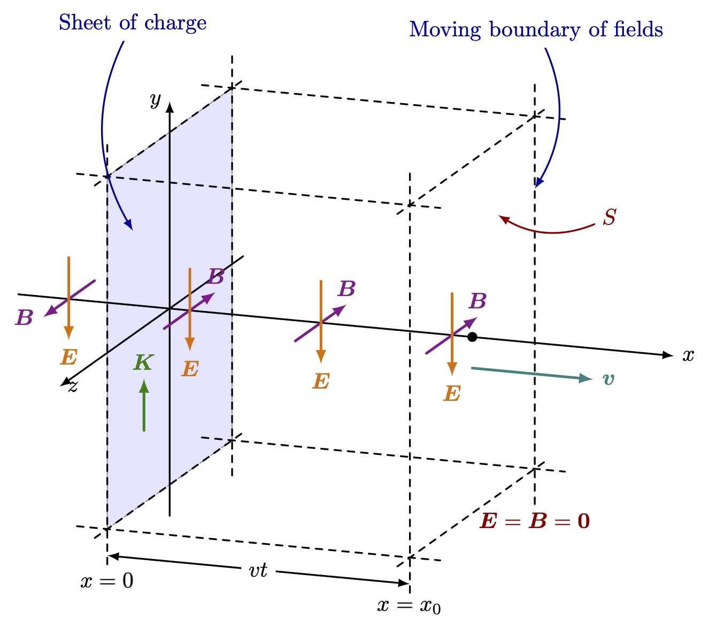{#fig-FLP_2_18_3 width=400}

$+y$ 방향으로 움직이는 전류 시트가 있을 경우: $x>0$ 라면 $-z$ 방향으로, $x<0$ 라면 $+z$ 방향으로 자기장이 생성된다. 우리는 자기장의 선적분이 $\mu_0$ 와 전류의 곱이라는 사실을 이용하여 $B=\mu_0 K/2$ 임을 알 수 있다.

이 자기장의 크기는 $x$ 와 무관하다. 하지만, 이는 전류를 켜는 순간 자기장이 갑자기 0에서 모든 곳에서 유한한 값으로 변한다는 것을 의미한다. 그런데 자기장이 갑자기 변하면 엄청난 전기적 효과를 발생시킬 것이다. 즉 전하 시트를 이동으로 자기장이 생기고, 이 자기장의 생성으로 인해 전기장이 생긴다. 현재 $K$ 와 함께 일부 $\partial \bf{E}/\partial t$ 가 자기장 생성에 기여할 것이다. 따라서 여러 방정식들이 섞이게 되므로 모든 장에 대해 한꺼번에 풀어야 한다.

#### **움직이는 무한 시트의 전기장과 자기장**

맥스웰 방정식만을 살펴보는 것만으로는 해를 얻는 방법을 직접 확인하기가 쉽지 않다. 따라서 먼저 답을 제시하고, 그 다음에 그것이 실제로 멕스웰 방정식을 만족한다는 것을 확인하도록 하자. 답은 다음과 같다: 우리가 계산한 $\bf{B}$ 는 실제로 현재 시트 바로 옆에, 즉 작은 $|x|$ 에서 생성된다. 왜냐하면 시트 주위의 매우 작은 루프를 통과하는 전기 플럭스가 실질적으로 $0$ 이기 때문이다$^2$.[$^2$ 시트 양쪽에 시트로부터의 거리가 $\delta$ 이고 폭이 $l$ 인 직사각형 루프를 생각해보라. 전기 플럭스는 $\delta$ 에 비례하지만 자기장의 선적분은 $2Bl$ 이다.]{.aside} 하지만 멀리 있는 필드 $\bf{B}$ 는 처음에 $\bf{0}$ 이다. 잠시 동안은 제로 상태를 유지한 뒤, 갑자기 켜진다. 요약하면, 전류를 켜고 그 바로 옆에 있는 자기장이 일정한 값 $\bf{B}$ 로 켜지며 $\bf{B}$ 는 점차 퍼져 나가게 된다. 일정 시간이 지나면, 어느 정도의 $x$ 까지 모든 곳에 균일한 자기장이 존재하고, 그 이후에는 $0$ 이 된다. 대칭성 때문에 $+x$ 와 $-x$ 방향 모두에 그러하다.

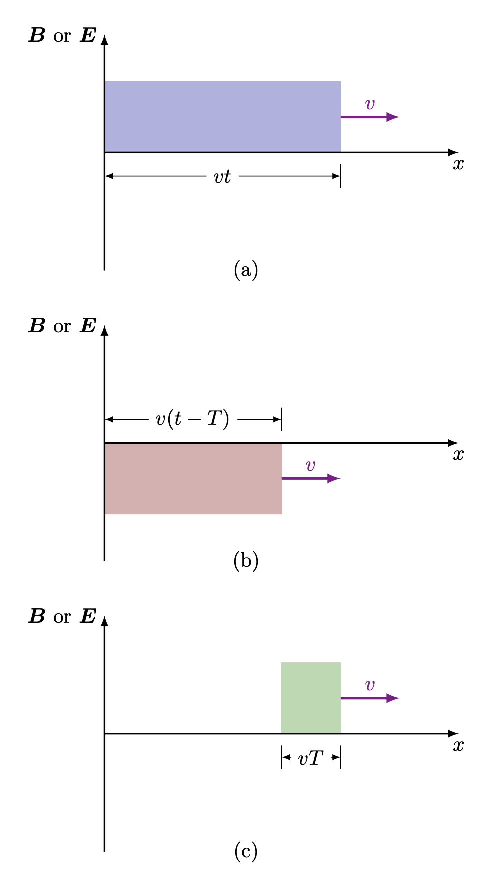{#fig-FLP_2_18_4 width=350}

$\bf{E}$ 도 같은 방식으로 켜진다. $t=0$ 에 전류를 켰다면 이 때 전기장과 자기장은 모든 곳에서 $\bf{0}$ 이다. 그리고 시간 $t$ 이후에, $\bf{E}$ 와 $\bf{B}$ 는 모두 거리 $x=vt$ 까지 일정하고 그 이후에는 $\bf{0}$ 이 된다. 장들은 파도처럼 앞으로 나아가며, 전방이 균일한 속도 $c$ 로 움직인다. 잠시 동안은 이를 $v$ 라고 하자. @fig-FLP_2_18_4 (a) 는 $x$ 에 대한 $\bf{E}$ 또는 $\bf{B}$ 의 크기를  보여준다. @fig-FLP_2_18_3 을 다시 살펴보면, 시점 $t$ 에서 $x=\pm vt$ 사이의 영역은 장으로로 “채워졌지만” 아직 그 너머에 도달하지 못했다. 다시 한 번 현재 시트와 따라서 $\bf{E}$ 와 $\bf{B}$ 가 $y$ 와 $z$ 방향 모두에서 무한히 확장된다고 가정하고 있음을 상기하자. 

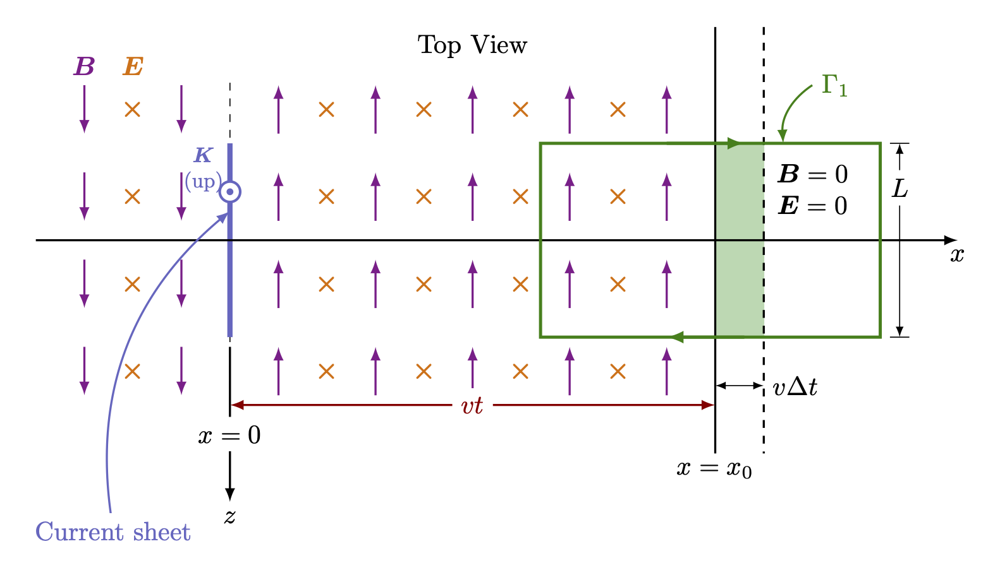{#fig-FLP_2_18_5 width=500}

정량적으로 분석을 위해 두 시점에서 살펴보자. @fig-FLP_2_18_5 와 같이 $y$ 축을 따라 아래를 바라보는 상단뷰와, @fig-FLP_2_18_6 에 표시된 바와 같이 $z$ 축을 따라 뒤를 바라보는 측면뷰이다. 측면뷰에서 전하 시트는 위쪽으로 이동한다. 자기장은 $+x$ 에 대해서는 페이지 안으로, $−x$ 에 대해서는 페이지 밖으로 향하고, 전기장은 $x=\pm vt$ 까지의 모든 위치에서 아래쪽을 향한다.

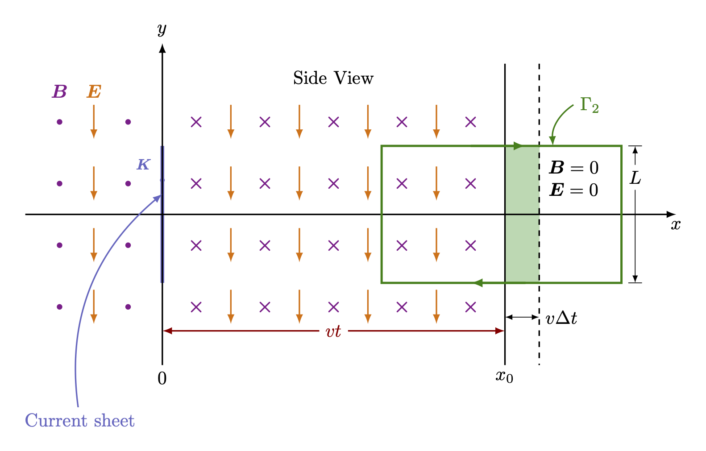{#fig-FLP_2_18_6 width=500}

#### **멕스웰 방정식과의 일치 확인**

이 장들이 맥스웰 방정식과 일치하는지 살펴보자. @fig-FLP_2_18_6 의 $\Gamma_2$ 경로를 보자. 이 경로 내부에 자기장이 존재하는 부분과 존재하지 않는 부분이 있으므로 시간에 대한 자기플럭스의 변화가 있고, 따라서 기전력 $\mathcal{E}=vBL$ 이 발생한다. 이 기전력은 $\Gamma_2$ 경로에 대한 전기장 $\bf{E}$ 의 선적분이므로 전기장의 크기 $E$ 는

$$
E=vB.
$$ {#eq-FLP_2_18_10}

따라서 $E$ 와 $B$ 의 비율이 $v$ 라면, 우리가 가정한 전기장과 자기장은 패러데이 방정식을 만족한다.

$\bf{E}$ 와 $\bf{B}$ 를 연결하는 다른 방정식이 있다.

$$
\nabla \times \bf{B}=\mu_0 \bf{J} + \dfrac{1}{c^2}\dfrac{\partial \bf{E}}{\partial t}
$$ {#eq-FLP_2_18_11}

@fig-FLP_2_18_5 의 상단뷰를 보자. 이 방정식은 시트 옆의 $\bf{B}$ 값을 제시한다. 또한, 시트 외부에서 파면 뒤에 그려진 모든 루프에 대해, $\nabla \times \bf{B}=\bf{0}$ 이며 $\bf{J}=\bf{0}$ 이고 $\partial \bf{E}/\partial t=\bf{0}$ 이므로 이 식을 만족한다. 이제 @fig-FLP_2_18_5 와 같이 파면과 교차하는 곡선 $\Gamma_1$ 에 대해 어떤 일이 일어나는지 살펴보자. 여기에는 전류가 없으니, @eq-FLP_2_18_11 은 적분 형태로 아래와 같이 표현 될 수 있다.

$$
\oint_{\Gamma_1}\bf{B \cdot} d\bf{l} =\dfrac{1}{c^2}\dfrac{d}{dt}\int_{\text{inside }\Gamma_1} \bf{E \cdot}d\bf{a}.
$$ {#eq-FLP_2_18_12}

위 적분의 좌변은 $BL$ 이며 우변은 $ELv/c^2$ 이므로

$$
B=\dfrac{Ev}{c^2}.
$$ {#eq-FLP_2_18_13}

이제 서로 다른 맥스웰 방정식으로부터 두 조건 @eq-FLP_2_18_10 과 @eq-FLP_2_18_13 을 얻었다. 이 두 식이 모두 성립할 수 있는 속도 $v$ 는 $v=c$ 뿐이다. 즉 파면은 속도 $c$ 로 이동해야 한다. **전류의 전기적 영향은 속도 $c$ 로 전달된다.**

이제 짧은 시간 $T$ 동안 전하 시트의 움직임을 갑자기 멈추면 어떤 일이 일어나는지 알아보자. 우리는 중첩 원리에 의해 어떤 일이 일어날지 알 수 있다. 전류가 0 이었다가 갑자기 켜진 것에 대한 것처럼 또 다른 장의 집합를 추가한다. 또 다른 전하 시트를 가져가서, 첫 번째 전류가 켜진 후 $T$ 시점에서 같은 속도로 반대 방향으로 움직이기 시작하자. 두 전류를 더한 총 전류는 처음에 0이 되고, 그 다음 시간 $T$ 가 켜지면 두 전류가 상쇄되기 때문에 전류가 $0$ 이다. 이렇게 되면 우리는 정사각형 펄스 전류를 가지게 된다.

새로운 음전류는 양전류와 동일한 장을 생성하며, 모든 부호가 뒤바뀌고 $T$ 만큼 시간적으로 지연된다. 파면이 다시 속도 $c$ 로 외부로 이동한다. $T$ 가 거리 $x=±c(t−T)$ 에 도달한 시점에, @fig-FLP_2_18_4 (b)와 같다. 따라서 @fig-FLP_2_18_4 의 (a)와 (b) 같이 속도 $c$ 로 전진하는 두 개의 “블록”이 있다. 합쳐진 장은 @fig-FLP_2_18_4 (c) 에 표현된 대로이다. $x>ct$ 인 경우 필드는 $0$ 이며, $x=c(t−T)$ 와 $x=ct$ 사이에서는 상수이며, $x<c(t−T)$ 인 경우 다시 $0$ 이다.

정리하자면 우리는 현재 시트를 떠나 스스로 공간을 이동하고 있는 두께 $cT$ 의 작은 장 블록을 보고 있다. 이 장들은 공간을 자유롭게 이동하고 있으며, 더 이상 소스과 어떠한 방식으로도 연결되어 있지 않다. 애벌레가 나비로 변한 것이다!

이 전기장과 자기장의 묶음은 어떻게 스스로 유지될 수 있는가? 답은 페러데이 법칙 $\nabla \times \bf{E}=−\partial \bf{B}/\partial t$ 와 맥스웰의 새로운 항 $\nabla \times \bf{B} = (1/c^2)\partial \bf{E}/\partial t$ 의 결합 효과이다. 그들 각각은 스스로를 유지할 수 없다. 자기장이 사라진다고 해 보자. 변화하는 자기장이 전기장을 생성한다. 이 전기장이 사라지려고 하면, 다시 자기장을 생성한다. 이 끊임없는 상호작용으로 인해 전기장과 자기장은 영원히 계속되어야 한다. 그들이 사라지는 것은 불가능하다$^3$.[$^3$ 정확히는 아니다. 그들은 전하가 있는 지역에 도달하면 **흡수**될 수 있다. 즉, 우리가 의미하는 바는 다른 곳에서 생성된 장이 해당 장 위에 겹쳐 소멸간섭으로 상쇄될 수 있냐는 것이다. [$\textrm{I}$.31 굴절률의 기원](../vol1/vol1_4.qmd#sec-FLP_1_31) 을 참고하라.]{.aside} 

### $\textrm{II}$.18–5 빛의 속도 {#sec-FLP_2_18_5}

이제 물질로 된 원천을 떠나 빛의 속도 $c$ 로 바깥쪽으로 향하는 파동을 알게 되었다. 하지만 잠시 과거로 돌아가 보자. 역사적 관점에서 볼 때, 맥스웰 방정식의 계수 $c$ 가 빛의 전파 속도이기도 하다는 것은 알려져 있지 않았다. 방정식에 상수가 하나뿐이었다. 우리는 그것이 무엇인지 알았기 때문에 처음부터 $c$ 라고 불렀다. 우리는 다른 상수로 수식을 배우게 하고, 그 후에 $c$ 로 대체하는 것이 현명하다고 생각하지 않았다. 전기와 자기 관점에서 보면, 우리는 전기정역학과 자기정역학 방정식에 나타나는 두 상수 $\epsilon_0$ 와 $\mu_0$ 부터 시작한다:

$$
\nabla \bf{\cdot E}=\dfrac{\rho}{\epsilon_0},
$$ {#eq-FLP_2_18_14}

그리고

$$
\nabla \times \bf{B}=\mu_0 \bf{J}.
$$ {#eq-FLP_2_18_15}

전하 단위에 대한 임의의 정의를 취하면, 실험적으로 @eq-FLP_2_18_14 에 필요한 상수 $\epsilon_0$ 를 결정할 수 있다. 우리는 또한 @eq-FLP_2_18_15 에 나타나는 상수 $\mu_0 = 1/(\epsilon_0 c^2)$ 를 두 단위 전류 사이의 힘을 측정하여 실험적으로 결정할 수 있다. $c^2=1/(\epsilon_0 \mu_0)$ 는 이를 통해 결정된다.

여기서 상수 $c^2$ 는 우리가 전하 단위로 무엇을 선택하든 동일하다. 만약 우리가 전하의 두 배—예를 들어 양성자 전하의 두 배—를 전하의 단위로 삼는다면, $\epsilon_0$ 는 $1/4$ 로 줄어야 하며 두 전선 사이의 힘과 $\mu_0$ 네 배 더 커진다. 따라서 $c^2 = (1/\epsilon_0 \mu_0)$ 는 변하지 않는다.

따라서 전하와 전류에 대한 실험만으로 우리는 전자기 영향의 전파 속도의 제곱인 $c^2$ 의 값을 얻게 된다. 정적 측정—두 단위 전하와 두 단위 전류 사이의 힘을 측정함으로써—우리는 $c \approx 3.00 \times 10^8\,\text{m/s}$ 임을 알게 된다. 맥스웰이 처음으로 자신의 방정식으로 이 계산을 했을 때, 그는 전기장과 자기장의 다발이 이 속도로 전파되어야 한다고 말했다. 그는 또한 이것이 빛의 속도와 동일하다는 신비로운 우연에 대해 언급했다. 맥스웰은 “빛이 전기와 자기 현상의 원인이 되는 동일한 매질의 횡방향 요동에 있다고 추론하지 않을 수 없다” 라고 말했다.

맥스웰은 물리학의 위대한 통합 중 하나를 만들었다. 그의 시대 이전에는 빛이 있었고, 전기와 자기가 있었다. 전기와 자기는 파라데이, 외르스테드, 그리고 앙페르의 실험에 의해 통합되었다. 그때 갑자기 빛은 더 이상 다른 것이 아니라 우주에서 스스로 전파하는 전기와 자기장의 작은 조각이라는 것이 밝혀 졌다.

우리는 이 특수해의 몇 가지 특성에 주목했는데, 이는 모든 전자기파에 대해 사실이다: 전기장, 자기장, 파면의 운동 방향의 세 벡터의 두 쌍은 모두 수직이며 전기장 $\bf{E}$ 의 크기 $E$ 는 $cB$ 와 같다. 이 세 가지 사실은 일반적으로 모든 전자기파에 대해 사실이다. 

### $\textrm{II}$.18–6 멕스웰 방정식의 해 : 포텐셜과 파동방정식 {#sec-FLP_2_18_6}

#### **장과 포텐셜**

여기서는 수학적인 작업을 통해 맥스웰 방정식을 더 간단한 형태로 표현할 것이다 .우선 가장 간단한 $\nabla \times \bf{ B}=\bf{0}$ 부터 시작한다. 이 식은 

$$
\bf{B} = \nabla \times \bf{A}
$$ {#eq-FLP_2_18_16}

을 만족하는 벡터장 $\bf{A}$ 가 존재한다는 것을 의미한다. 이렇게 맥스웰의 방정식 중 하나를 해결했다. 또한 어떤 스칼라장 $\Psi$ 에 대해 $\bf{A}'=\bf{A}+\nabla \Psi$ 역시 동일한 물리를 제시한다는 것을 안다.

이제 페러데이 법칙 $\nabla \times \bf{E}=-\partial \bf{B}/\partial t$ 을 보자. 시간과 공간의 편미분 순서를 바꿀수 있다는 사실과 @eq-FLP_2_18_16 을 이용하면 패러데이 법칙을 아래와 같이 쓸 수 있다.

$$
\nabla \times \left( \bf{E} + \dfrac{\partial \bf{A}}{\partial t}\right)=0.
$$ {#eq-FLP_2_18_17}

헬름홀츠 정리로부터

$$
\bf{E}+\dfrac{\partial \bf{A}}{\partial t} = -\nabla \Phi 
$$ {#eq-FLP_2_18_18}

을 만족하는 스칼라장 $\Phi$ 가 존재한다는 것을 안다. 이로부터 패러데이 법칙은 다음과 같이 쓸 수 있다.

$$
\bf{E}=−∇\Phi− \dfrac{\partial \bf{A}}{\partial t}.
$$ {#eq-FLP_2_18_19}

이제 맥스웰 방정식 두 개를 풀었으며, 전자기장 $\bf{E}$ 와 $\bf{B}$ 를 기술하기 위해서는 네 개의 퍼텐셜 함수 $\Phi,\,A_x,\,A_y,\,A_z$ 가 필요하다는 것을 알게 되었다. 이제 스칼라 포텐셜과 벡터 포텐셜을 같이 $(\Phi,\,\bf{A})$ 로 표기하기로 하자.

#### **게이지 변환**

::: {.callout-note icon="false"}

#### **게이지 변환**

스칼라장 $\Lambda$ 에 대해 포텐셜 $(\Phi,\,\bf{A})$ 를 다음과 같이 변환시키는 것을 **게이지 변환 (guage transform)** 이라고 한다.

$$
\boxed{
\begin{aligned}
\Phi &\to  \Phi − \dfrac{\partial \Lambda}{\partial t},\\[0.3em]
\bf{A} &\to \bf{A} + \nabla \Lambda. 
\end{aligned}
}
$$ {#eq-FLP_2_18_20}

::: 

 

::: {#thm-FLP-invariance_of_fields_under_gauge_transform}
#### 게이지 불변

@eq-FLP_2_18_20 에 의해 전기장과 자기장은 붋변이다.

:::

::: {.proof}

변환 전의 $\bf{E}_\text{old},\,\bf{B}_\text{old}$ 와 변환 후의 $\bf{E}_\text{new},\,\bf{B}_\text{new}$ 가 같음을 보이면 된다.
$$
\begin{aligned}
\bf{E}_\text{new} &= -\nabla \left(\Phi - \dfrac{\partial \Lambda}{\partial t} \right) - \dfrac{\partial}{\partial t}\left(\bf{A}+\nabla \Lambda\right) \\[0.3em]
&= -\Phi -\dfrac{\partial \bf{A}}{\partial t} + \underbrace{\nabla \dfrac{\partial \Lambda}{\partial t} - \dfrac{\partial \nabla \Lambda}{\partial t}}_{=0}= \bf{E}_\text{old} \\[0.3em]
\bf{B}_\text{new} &= \nabla \times (\bf{A}+\nabla \Lambda) = \nabla \times \bf{A} = \bf{B}_\text{old}.\qquad \square
\end{aligned}
$$

:::

 

@eq-FLP_2_18_19 에서 얻어지는 $\bf{E}$ 뿐만 아니라 $\bf{B}$ 도 변하지 않는다. 역으로 포텐셜 $(\Phi,\,\bf{A})$ 에 대해 전기장과 자기장을 변하게 하지 않는 변환은 @eq-FLP_2_18_20 뿐임을 보일 수 있다(@exr-FLP_transform_which_make_fields_invariant 을 보라.). 예전에는 정적인 방정식을 다소 간단하게 만들기 위해 $\nabla \bf{\cdot A}=0$ 을 선택지만 지금은 그렇게 하지 않고 다른 선택을 할 것이다. 이 선택의 이유가 명확해지면 그때 선택을 설명하도록 하자.

#### **멕스웰 방정식의 새로운 형태**

이제 남은 두 개의 맥스웰 방정식으로 돌아가서, 포텐셜과 소스 $\rho$, $\bf{J}$ 의 관계를 보자. $\bf{J}$ 와 $\rho$ 로부터 $\bf{A}$ 와 $\Phi$ 를 결정할 수 있다면, 언제든지 @eq-FLP_2_18_16 과 @eq-FLP_2_18_19 를 통해 $\bf{E}$ 와 $\bf{B}$ 를 얻을 수 있다. 

@eq-FLP_2_18_19 를 $\nabla \bf{\cdot E}=\rho/\epsilon_0$ 에 대입하면

$$
\nabla \bf{\cdot}\left(−\nabla \Phi−\dfrac{\partial \bf{A}}{\partial t}\right)=\dfrac{\rho}{\epsilon_0}
$$

이며 이로부터

$$
-\nabla^2 \Phi - \dfrac{\partial }{\partial t}(\nabla \bf{\cdot A} ) = \dfrac{\rho}{\epsilon_0}
$$ {#eq-FLP_2_18_21}

을 얻는다. 이 식은 $\Phi$ 와 $\bf{A}$ 를 소스와 연관시키는 방정식이다.

이제 마지막 멕스웰 방정식을 다루는데, 아래처럼 약간 바꿔서 시작한다. 

$$
\nabla \times \bf{B}−\dfrac{1}{c^2}\dfrac{\partial \bf{E}}{\partial t}=\mu_0\bf{J}
$$

그리고 @eq-FLP_2_18_16 과 @eq-FLP_2_18_19 를 사용하여 $\bf{B}$ 와 $\bf{E}$ 를 포텐셜로 대체한다.

$$
\nabla \times (\nabla \times \bf{A})−\dfrac{1}{c^2}\dfrac{\partial}{\partial t}\left(−\nabla \Phi -\dfrac{\partial \bf{A}}{\partial t}\right)=\mu_0 \bf{J}.
$$

첫 번째 항에 벡터 항등식 $\nabla \times (\nabla \times \bf{A}) = \nabla (\nabla \bf{\cdot A}) - \nabla^2\bf{A}$ 를 사용하면 다음과 같다.

$$
−\nabla^2\bf{A}+\nabla(\nabla\bf{\cdot A})+\dfrac{1}{c^2}\dfrac{\partial (\nabla \Phi)}{\partial t} + \dfrac{1}{c^2}\dfrac{\partial^2 \bf{A}}{\partial t^2} = \mu_0 \bf{J}.
$$ {#eq-FLP_2_18_22}

이것을 풀기는 쉽지 않은데 다행히도 우리에게는 $\nabla \bf{\cdot A}$ 를 임의로 선택할 자유가 있다$^4$.[$^4$ $\nabla \bf{\cdot A}$ 를 선택하는 것을 **게이지 선택** 이라고 한다. $\nabla \Psi$ 를 추가하여 $\bf{A}$ 를 변환하는 것을 **게이지 변환(gauge transformation)** 이라고 한다. @eq-FLP_2_18_23 을 **로렌츠 게이지 (Lorenz gauge)** 라고 한다. 참고로 상대성 이론의 로런츠 변환의 로런츠(Lorentz) 와는 다른 사람이다.]{.aside} 이를 이용하여 $\bf{A}$ 와 $\Phi$ 에 대한 방정식을 분리하되 같은 형태를 갖도록 할 것이다. 이제 $\nabla \bf{\cdot A}$ 를 다음과 같이 놓자.

$$
\nabla \bf{\cdot A} =−\dfrac{1}{c^2}\dfrac{\partial \Phi}{\partial t}
$$ {#eq-FLP_2_18_23}

이제 @eq-FLP_2_18_22 과 @eq-FLP_2_18_21 을 아래와 같이 쓸 수 있다.

$$
\nabla^2\bf{A}−\dfrac{1}{c^2}\dfrac{\partial^2 \bf{A}}{\partial t^2}=−\mu_0 \bf{J}.
$$ {#eq-FLP_2_18_24}

$$
\nabla^2 \Phi − \dfrac{1}{c^2}\dfrac{\partial^2 \Phi}{\partial t^2} = −\dfrac{ρ}{\epsilon_0}.
$$ {#eq-FLP_2_18_25}

이제 기존의 방정식은 맥스웰 방정식은 포텐셜 $(\Phi$, $\bf{A})$ 각각에 대해 동일한 수학적 형태를 갖는 방정식으로 바뀌었다. 이 방정식을 풀면, $\nabla \times \bf{A}$ 와 $−\nabla \Phi−\partial\bf{A}/\partial t$ 로부터 $\bf{B}$ 와 $\bf{E}$ 를 얻을 수 있다. 많은 경우 우리가 얻은 새 방정식이 훨씬 더 다루기 쉽다.

우리는 이미 [$\textrm{I}$.47. 소리와 파동](../vol1/vol1_7.qmd#sec-FLP_1_47) 에서 이런 형태의 방정식을 풀었다. @eq-FLP_2_18_24 와 @eq-FLP_2_18_25 는 속도 $c$ 로 3차원상에 퍼져나가는 파동의 방정식이다. 따라서 전하와 전류가 존재하지 않는 영역에서 방정식들의 해는 $\Phi$ 와 $\bf{A}$ 가 0이 되는 것이 아니다. (물론 실제로 가능한 해 중의 하나이긴 하다.) 시간에 따라 변하지만 항상 속도 $c$ 로 이동하는 $\Phi$ 와 $\bf{A}$ 의 집합이 있는 해가 존재한다. 장은 자유 공간에서 앞으로 전파된다.

변위전류에 대한 맥스웰의 새로운 항으로부터 $\bf{A}$ 와 $\Phi$ 를 이용하여 장 방정식을 간단한 형태로 작성할 수 있었으며, 전자기파가 존재함을 명확히 알 수 있게 되었다. 많은 실용적인 경우에는 $\bf{E}$ 와 $\bf{B}$ 의 원래 방정식을 사용하는 것이 여전히 편리할 수 있다. 하지만 그들은 우리가 이미 등반한 산의 반대편에 있다. 이제 우리는 정상의 반대편으로 건너 갈 준비가 되었다. 모든 시야가 달라진다. 우리는 새로운 아름다운 풍경을 맞이할 준비가 되어 있다.

 

## $\textrm{II}$.20 자유공간에서의 멕스웰 방정식의 해 {#sec-FLP_2_20}
 
### $\textrm{II}$.20-1 자유공간에서의 파동 : 평면파 {#sec-FLP_2_20_1}

#### **리뷰 : 전기장과 자기장의 전파**

앞서 [$\textrm{II}$.18-4 장의 이동](#sec-FLP_2_18_4) 에서 공부했던 $y$ 방향으로 움직이는 무한한 전하 시트에서 전기장은 $y$ 성분만, 자기장은 $z$ 성분만 존재하며 그 크기 $x<ct$는 다음과 같다는 것을 알게 되었다.

$$
E_y = cB_z = - \dfrac{K}{2\epsilon_0 c}.
$$ {#eq-FLP_2_20_2}

$x>ct$ 인 영역에서는 $\bf{E}=\bf{B}=0$ 이다. $x<0$ 인 영역에서도 자기장의 방향이 역전되지만 크기는 동일하게 유지된다(@fig-FLP_2_20_1). 시간이 지남에 따라 파면은 $c$ 의 속도로 밖으로 진행한다.

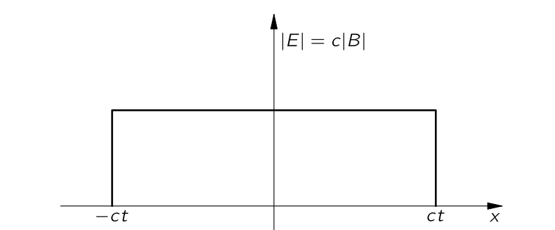{#fig-FLP_2_20_1 width=500}

이제 다음과 같은 사건이 발생했다고 하자. 잠시 동안 단위 강도 전류를 켜고, 갑자기 전류 강도를 세 단위로 증가시키며, 이후 일정하게 유지한다. 그렇다면 장은 어떻게 될까? 우선, $t=0$ 에서 켜져 영원히 일정하게 유지되는 단위 강도 전류를 생각하자. $x>0$ 에 대한 전기장은 @fig-FLP_2_20_2 (a) 의 그래프와 같다. 다음으로, $t=t_1$ 에 두 단위의 일정한 전류를 켜자. 이 경우 전기장은 이전보다 두 배 높지만, @fig-FLP_2_20_2 (b) 에 표시된 바와 같이 $x$ 에서 거리 $c(t−t_1)$ 만큼만 퍼진다. 이 두 해를 중첩 원리를 이용하여 더하면, $t$ 시점에 필드는 @fig-FLP_2_20_2 (c) 와 같다는 것을 알 수 있다.

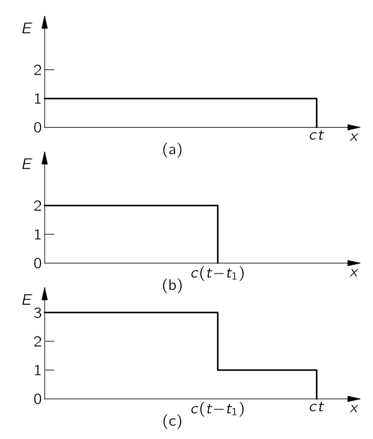{#fig-FLP_2_20_2 width=350}

이제 좀 더 복잡한 사건을 생각하자. 전류가 잠시 1단위로 켜졌다가 세 단위로 상승하고, 이후 0으로 꺼진다고 하자. 이제 세 개의 별개의 문제에 대한 해를 더하여  앞서와 같은 방식으로 각 단계마다 해를 찾고 이 세 개의 해를 더하면 @fig-FLP_2_20_3 (b) 와 같이 나타난다는 것을 알 수 있다. 공간에서의 필드 분포는 시간에 따른 현재 변동을 잘 나타내는 그래프이며, 오직 거꾸로 그려져 있다. 시간이 흐를수록 전체 그림이 속도 $c$ 로 바깥쪽으로 이동하고, 따라서 양의 $x$ 를 향해 이동하는 작은 장의 뭉치가 있으며, 이는 현재 모든 변동의 역사를 완전히 상세히 기억하고 있다. 우리가 수 마일 떨어진 곳에 서 있다고 해도, 전기장이나 자기장의 변동을 통해 전류가 원천에서 어떻게 변했는지 정확히 알 수 있다.

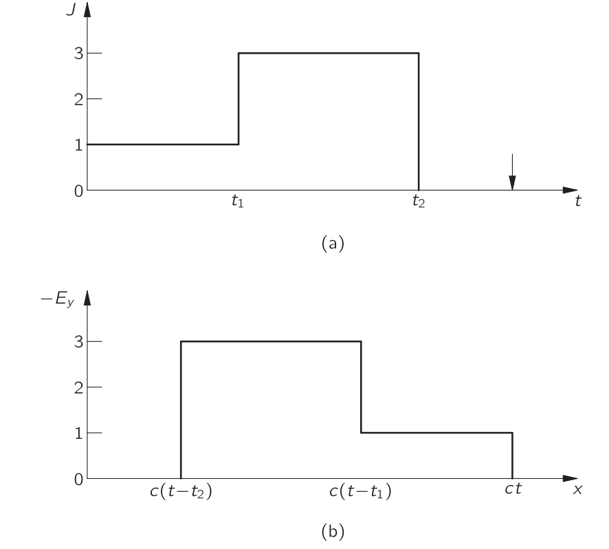{#fig-FLP_2_20_3 width=440}

또한, 소스에서의 모든 활동이 완전히 멈추고 모든 전하와 전류가 0이 된 후에도, 필드 블록은 계속해서 우주를 이동한다. 즉 전하나 전류와는 독립적으로 존재하는 전기장과 자기장의 분포를 갖게 된다. 그것은 맥스웰 방정식 전체 집합에서 나오는 새로운 효과이다. **주어진 위치와 주어진 시간에 있는 전기장이 소스의 $t−x/c$ 만큼의 이전 시점에 비례한다.**

$$
E_y(t)=−\mu_0 J(t−x/c)
$$ {#eq-FLP_2_20_3}

우리는 이미 [$\mathrm{I}$.30. 회절](../vol1/vol1_4.qmd#sec-FLP_1_30) 에서 다른 관점에서 동일한 방정식을 유도했다. 우리가 굴절률 이론을 다루고 있을 때. 그 후, 우리는 유입 전자기파의 전기장에 의해 움직이게 된 쌍극자와 함께, 유전체 재료 시트의 얇은 진동 쌍극자층에 의해 생성되는 전기장이 무엇인지 파악해야 했다. 이때의 문제는 원래 파동과 진동하는 쌍극자가 방사하는 파동의 결합장을 계산하는 것이었다. 맥스웰 방정식이 없었을 때 이동 전하에 의해 생성된 필드를 어떻게 계산할 수 있었까? 그때 우리는 (유도 없이) 가속점 전하로부터 멀리 떨어진 곳에서 발생하는 복사장에 대한 공식을 출발점으로 삼았다. [$\mathrm{I}$.30. 회절](../vol1/vol1_4.qmd#sec-FLP_1_30) 의 @eq-FLP_1_30_19 는 @eq-FLP_2_20_3 과 동일하다. 우리의 이전 식은 원천으로부터 멀리 떨어진 곳에서만 정확했지만, 이제는 원천까지도 같은 결과가 계속 옳다는 것을 알게 되었다.

#### **자유공간에서의 포텐셜과 장의 파동방정식**

이제 전류와 전하와 같은 소스부터 멀리 떨어진 빈 공간에서 전기장과 자기장의 거동을 일반적인 방식으로 살펴보자. 소스에 매우 가까운$^5$ 경우의 장은 우리가 정전기학과 정자기학에서 다뤘던 것과 거의 동일하다.[$^5$ 전송 지연 동안 소스가 크게 변할 시간이 없을 정도로]{.aside} 하지만 지연이 중요해질 정도로 충분히 큰 거리를 이동한다면, 장의 특성은 우리가 찾은 해과 크게 다를 수 있다. 소스으로부터 크게 멀어지면 장들이 스스로의 특성을 띠기 시작한다. 따라서 전류나 전하가 없는 영역에서의 장의 거동을 논의하는것으로 시작하자.

**질문 : $\rho$ 와 $\bf{J}$ 가 모두 0인 영역에서 어떤 종류의 장이 존재할 수 있는가?**

멕스웰 방정식은 @eq-FLP_2_18_24, @eq-FLP_2_18_25 와 같이 포텐셜 $(\Phi,\,\bf{A})$ 의 미분방정식으로 표현되며, $\rho$ 와 $\bf{J}$ 가 모두 $0$ 이면 위 식은 더 간단한 형태가 된다.

$$
\begin{aligned}
\nabla^2 \Phi - \dfrac{1}{c^2}\dfrac{\partial^2 \Phi}{\partial t^2} &= 0, \\[0.3em]
\nabla^2 \bf{A} - \dfrac{1}{c^2}\dfrac{\partial^2 \bf{A}}{\partial t^2} &= 0.
\end{aligned}
$$ {#eq-FLP_2_20_6}

$\Phi,\,A_x,\,A_y,\,A_z$ 는 아래와 같은 형태의 방정식을 만족한다.

$$
\nabla^2 \psi - \dfrac{1}{c^2}\dfrac{\partial^2 \psi}{\partial t^2} = 0
$$ {#eq-FLP_2_20_8}

전기장 $\bf{E}$ 와 자기장 $\bf{B}$ 도 같은 형태의 방정식을 만족한다는 것을 보일 수 있다(@sec-FLP_2_20_2)

$$
\begin{aligned}
\nabla^2 \bf{E}-\dfrac{1}{c^2}\dfrac{\partial^2 \bf{E}}{\partial t^2} &= 0,\\[0.3em]
\nabla^2 \bf{B}-\dfrac{1}{c^2}\dfrac{\partial^2 \bf{B}}{\partial t^2} &= 0.
\end{aligned}
$$ {#eq-FLP_2_20_10}

이제 모든 전자기장은 동일한 파동 방정식 @eq-FLP_2_20_8 을 만족한다는 것을 알게 되었다. 이 방정식에 대해 가장 일반적인 해를 구하기에 앞서 좀 더 쉽게 접근해 보자. 우선 장의 크기가 $x$ 에만 의존하는 경우를 살펴보자. 그리고 이를 위해 우선 자유 공간에서의 멕스웰 방정식을 정리해보자.

::: {.callout-important icon="false"}

#### **자유공간에서의 멕스웰 방정식**
$$
\begin{aligned}
&\textrm{I}. & \nabla \bf{\cdot E} &= 0, \\[0.3em]
&\textrm{II}. & \nabla \times \bf{E} &= - \dfrac{\partial \bf{B}}{\partial t}, \\[0.3em]
&\textrm{III}. & \nabla \bf{\cdot B} &= 0, \\[0.3em]
&\textrm{IV}. & \nabla \times \bf{B} &= \dfrac{1}{c^2}\dfrac{\partial \bf{E}}{\partial t}.
\end{aligned}
$$ {#eq-FLP_2_20_12}

:::

#### **장의 크기가 $x$ 에만 의존하는 경우의 자유공간에서의 장**

전기장이 $y,\,z$ 값에 의존하지 않으므로 $\partial_y E_y = \partial_z E_z=0$ 이며 따라서 @eq-FLP_2_20_12 $\textrm{I}$ 는 $\partial_x E_x = 0$ 임을 의미한다. 또한 @eq-FLP_2_20_12 $\textrm{IV}$ 로부터 

$$
\dfrac{\partial B_z}{\partial y}- \dfrac{\partial B_y}{\partial z}= - \dfrac{1}{c^2}\dfrac{\partial E_x}{\partial t}
$$

이며 좌변이 $0$ 이므로 $\partial E_x/\partial t = 0$ 을 얻는다. 즉 $E_x$ 는 상수이다. 우리는 변화하는 장에만 관심이 있으므로 $E_x=0$ 으로 놓아도 된다. 그렇다면 우리는 평면파가 어떤 방향으로 전파될 때 전기장이 전파 방향에 직각이어야 한다는 중요한 결과를 얻었다. 물론 좌표 $x$ 에 대해 여전히 복잡한 방식으로 변할 수 있다. 이제 우리는 $E_y(x,\,t),\, E_z(x,\,t)$ 에 대해 생각 할 수 있다. 우선 $\bf{E}(x,\,t) = E_y(x,\,t)\bf{e}_y$ 인 경우를 생각해 보자.

@eq-FLP_2_20_12 $\textrm{II}$ 로부터

$$
\dfrac{\partial E_y}{\partial x} = -\dfrac{\partial B_z}{\partial t},\quad \dfrac{\partial B_x}{\partial t}= \dfrac{\partial B_y}{\partial t}=0
$$

을 얻는다. @eq-FLP_2_20_12 $\textrm{III}$ 으로부터

$$
\dfrac{\partial B_x}{\partial x}=0
$$

이다. 따라서 $\partial B_x/\partial t = \partial B_x/\partial x = 0$ 이므로 $B_x$ 는 상수이다. 따라서 앞서 $E_x$ 와 같이 $B_x=0$ 으로 생각 할 수 있다. 이제 @eq-FLP_2_20_12 $\textrm{IV}$ 로부타

$$
\dfrac{\partial B_z}{\partial x} = - \dfrac{1}{c^2}\dfrac{\partial E_y}{\partial t}, \quad \dfrac{\partial B_y}{\partial x}=0
$$

을 얻는다. 역시 $\partial B_y/\partial x = \partial B_y/\partial t=0$ 이므로 $B_y=\text{constant}$ 이며 앞서와 같이 $B_y=0$ 으로 놓자. 그렇다면 우리는

$$
\dfrac{\partial E_y}{\partial x}=- \dfrac{\partial B_z}{\partial t},\qquad \dfrac{\partial B_z}{\partial x}= - \dfrac{1}{c^2}\dfrac{\partial E_y}{\partial t}
$$

를 얻고 이로부터

$$
\begin{aligned}
\dfrac{\partial^2 E_y}{\partial x^2} - \dfrac{1}{c^2}\dfrac{\partial^2 E_y}{\partial t^2} &=0, \\[0.3em]
\dfrac{\partial^2 B_z}{\partial x^2} - \dfrac{1}{c^2}\dfrac{\partial^2 B_z}{\partial t^2} &=0.
\end{aligned}
$$ {#eq-FLP_2_20_19}

이라는 파동방정식을 얻게 된다. 이 식은 @eq-FLP_2_20_10 의 첫번째 식과 거의 동일하지만 유도 과정에서 우리는 **전기장과 자기장의 방향은 빛의 진행 방향과 직각이다** 라는 사실을 알게 되었다.

#### **1차원 파동방정식의 해**

$\psi$ 가 아래의 1차원 파동방정식을 만족한다고 하자.

$$
\dfrac{\partial^2 \psi}{\partial x^2} - \dfrac{1}{c^2}\dfrac{\partial^2 \psi}{\partial t^2} =0.
$$ {#eq-FLP_2_20_20}

앞서 배웠듯이 $\psi(x,\,t)$ 는 $f(t-x/c)$ 와 $g(t+x/c)$ 의 합으로 표현 할 수 있다.

$$
\psi (x,\,t) = f(t-x/c) + g(t+x/c).
$$ {#eq-FLP_2_20_24}

함수 $f(t-x/c)$ 는 속력 $c$ 로 $+x$ 방향으로 이동하는 “강체” 패턴을 보인다.(@fig-FLP_2_20_4) 예를 들어, 함수 $f(s)$ 가 $s=0$ 일 때 최대값을 가진 가진다면, $f(t-x/c)$ 는 $t=0$ 일 때 $x=0$ 에서 최대값을 가지며, $t=10$ 이라면 $x=10c$ 에서 최대값을 가진다. 시간이 흐를수록, 최대값은 속도 $c$ 로 $+x$ 방향으로 이동한다. $g(t+x/c)$ 는 반대로 속력 $c$ 로 $-x$ 방향으로 진행한다.

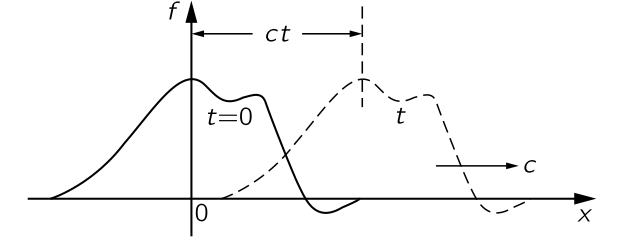{#fig-FLP_2_20_4 width=350}

이로부터 우리는 $E_y$ 와 $B_z$ 가 모두 @eq-FLP_2_20_24 형태의 파동방정식으로 표현될 수 있다는 것을 안다.

#### **전자기파의 편광**

앞서에서는 $\bf{E}=E_y\bf{e}_y,\, \bf{B}=B_z\bf{e}_z$ 인 경우를 다루었다. 그러나 $+x$ 혹은 $-x$ 방향으로 이동하는 파동에 대해 $\bf{E}=E_y\bf{e}_y + E_z\bf{e}_z$ 와 $\bf{B}=B_y\bf{e}_y+B_z\bf{e}_z$ 형태의 전자기장도 가능하다. 이 경우

$$
\begin{aligned}
\bf{E} &= (0,\,E_y,\,E_z), \\[0.3em]
E_y(x,\,t) &= f(t-x/c) + g(t+x/c), \\[0.3em]
E_z(x,\,t) &= F(t-x/c) + G(t+x/c), \\[0.3em]
\bf{B} &= (0,\, B_y,\,B_z), \\[0.3em]
B_y(x,\,t) &= \dfrac{1}{c} \left[-F(t-x/c)+G(t+x/c)\right] , \\[0.3em]
B_z (x,\,t)&= \dfrac{1}{c}\left[f(t-x/c)-g(t+x/c)\right].
\end{aligned}
$$

형태의 해가 가능하다. 이러한 전자기파에서 $\bf{E}$ 는 $yz$ 평면에서 임의의 방식으로 회전하며, 모든 지점에서 자기장은 항상 전기장 및 전파 방향에 수직이다.

만약 파동이 한 방향으로만 이동하는 경우 전기장과 자기장의 상대적 방향을 알려주는 간단한 규칙이 있다. 규칙은 교차곱 $\bf{E}\times \bf{B}$ 의 방향이 파동이 진행하는 방향이라는 것이다. 우리는 나중에 벡터 $\bf{E}\times \bf{B}$ 가 특별한 물리적 의미-전자기장 내 에너지 흐름-를 표현한다는 것을 알게 될 것이다.

 

### $\textrm{II}$.20–2 3차원 파동 {#sec-FLP_2_20_2}

이제 삼차원에서 파동방정식을 얻자. 시작은

$$
\nabla \times \bf{E} = −\dfrac{\partial \bf{B}}{\partial t}
$$

이다. 양쪽의 컬을 취하면

$$
\nabla \times (\nabla \times \bf{E}) = −\dfrac{\partial (\nabla \times \bf{B})}{\partial t}
$$ {#eq-FLP_2_20_26}
 
이다. 벡터 항등식 (연습문제 **38.2**)

$$
\nabla \times (\nabla \times \bf{E}) = \nabla (\nabla \bf{\cdot E}) − \nabla^2 \bf{E}
$$

에서 우리가 생각하는 자유공간의 경우 $\nabla \bf{\cdot E}= 0$ 이므로 @eq-FLP_2_20_26 의 좌변은 $-\nabla^2\bf{E}$ 가 된다. 또한, 자유 공간에서의 맥스웰 방정식 @eq-FLP_2_20_12 $\textrm{IV}$ 로부터 @eq-FLP_2_20_26 의 우변은 $(1/c^2)(\partial^2\bf{E}/\partial t^2)$ 가 된다. 이를 정리하면 아래와 같이 $\bf{E}$ 에 대한 파동방정식을 얻는다. 그리고 비슷한 방법으로 $\bf{B}$ 에 대한 파동방정식도 얻을 수 있다.

$$
\begin{aligned}
\nabla^2 \bf{E}- \dfrac{1}{c^2}\dfrac{\partial^2 \bf{E}}{\partial t^2} = 0, \\[0.3em]
\nabla^2 \bf{B}- \dfrac{1}{c^2}\dfrac{\partial^2 \bf{B}}{\partial t^2} = 0.
\end{aligned}
$$ {#eq-FLP_2_20_27}

### $\textrm{II}$.20-3 과학적 상상력 {#sec-FLP_2_20_3}

 

### $\textrm{II}$.20-4 구면파 {#sec-FLP_2_20_4}

우리는 평면파에 해당하는 파동 방정식의 해가 존재한다는 것을 확인했으며, 모든 전자기파는 여러 평면파의 중첩으로 설명될 수 있음을 확인했다. 그러나 특정한 특수한 경우에는 파동장을 다른 수학적 형태로 설명하는 것이 더 편리하다. 우리는 이제 구형 파동 이론에 대해 알아보자. 구면파는 어떤 중심에서 퍼져 나가는 구형 표면에 해당한다. 구면파는 구면좌표계에서 다루는 것이 편리하다.

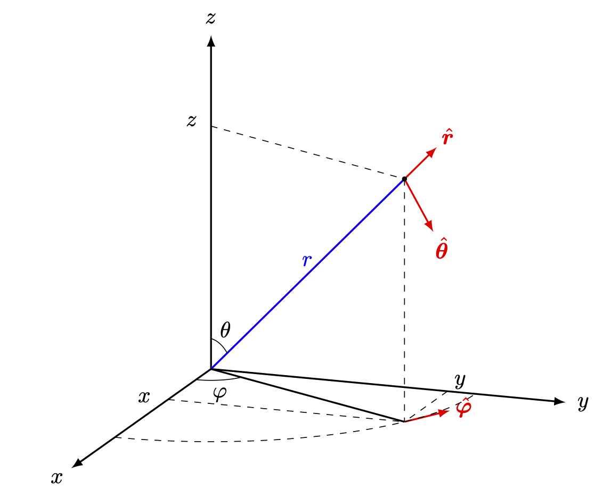{#fig-FLP_spherical_coordinate width=350}

구면좌표계에서의 $\nabla^2$ 는 아래와 같다.
$$
\nabla^2 \psi = \dfrac{1}{r^2\sin\theta}\left[\sin \theta \dfrac{\partial }{\partial r}\left(r^2 \dfrac{\partial \psi}{\partial r}\right) + \dfrac{\partial}{\partial \theta}\left(\sin \theta \dfrac{\partial \psi}{\partial \theta}\right) + \dfrac{1}{\sin\theta}\dfrac{\partial^2 \psi}{\partial \varphi^2}\right] 
$$ {#eq-FLP_laplace_operator_in_spherical_coordinate}

이 때 $\psi= \psi(r)$ 이라면

$$
\nabla^2 \psi(r) = \dfrac{\partial^2 \psi}{\partial r^2}+ \dfrac{2}{r}\dfrac{\partial \psi}{\partial r} = \dfrac{1}{r}\dfrac{\partial^2 (r\psi)}{\partial r^2}
$${#eq-FLP_laplace_operator_in_spherical_coordinate_2}

이다. $\psi$ 가 3차원 파동방정식

$$
\nabla^2 \psi - \dfrac{1}{c^2}\dfrac{\partial^2 \psi}{\partial t^2}= 0
$$ {#eq-FLP_2_20_33}

을 만족시킨다면 이 식은

$$
0 = \dfrac{1}{r}\dfrac{\partial^2 (r\psi)}{\partial r^2} - \dfrac{1}{c^2}\dfrac{\partial^2 \psi}{\partial t^2} = \dfrac{1}{r}\left[\dfrac{\partial^2(r\psi)}{\partial r^2} - \dfrac{1}{c^2}\dfrac{\partial^2(r\psi)}{\partial t^2} \right]
$$

이므로 1차원에서의 경우를 생각하면 $\psi$ 를 다음과 같이 쓸 수 있다. 

$$
\psi (r) = \dfrac{f(t-r/c)}{r} + \dfrac{g(t+r/c)}{r}.
$$ {#eq-FLP_2_20_spherical_wave_form_0}

여기서 $f(t-r/c)/r$ 은 소스에서 밖으로 나가는 구면파, $g(t+r/c)/r$ 은 외부에서 안으로 진입하는 구면파를 나타낸다. 외부에서 진입하는 구면파를 제외하고 생각할 때는 

$$
\psi (r) = \dfrac{f(t-r/c)}{r}
$$ {#eq-FLP_2_20_35}

만을 고려하면 된다. 이 함수는 원점에서 바깥쪽으로 속도 $c$ 로 이동하는 일반적인 구면파를 나타낸다. 여기서 분모의 $r$ 은 파동이 전파될 때 파동의 진폭이 $1/r$ 에 비례하여 감소한다는 것을 의미한다. 파동이 흐르는 동안 진폭이 일정하게 유지되는 평면파와 달리, 구면파에서는 진폭이 지속적으로 감소한다. 우리는 파동의 에너지 밀도가 파동 진폭의 제곱에 따라 달라진다는 것을 알고 있다. 파동이 퍼짐에 따라, 그 에너지는 방사 거리의 제곱에 비례하여 점점 더 큰 영역으로 분산된다. 전체 에너지가 보존된 경우, 에너지 밀도는 $1/r^2$ 로 감소해야 하며, 파동의 진폭은 $1/r$ 로 감소해야 한다. 그래서 @eq-FLP_2_20_35 는 구면파에 대한 합리적인 형태이다.

이제 외부에서 진입하는 구면파를 제외한 것에 대해 이야기 해 보자. 이것은 일종의 특별한 가정으로, 어떤 소스에 의해 생성된 파동은 단지 외부로 향하는 파동에 불과하다 가정한다. 우리는 파동이 전하의 움직임에 의해 발생한다는 것을 알고 있기 때문에, 파동이 전하에서 바깥쪽으로 진행한다고 생각하며 전하가 움직이기 전에 구형 파동이 무한에서 시작되어 전하가 움직이기 시작한 바로 그 순간에 도달했다고 상상하는 것은 다소 이상할 것이다. 그것은 가능한 해 중의 하나이지만, 경험에 따르면 전하가 가속될 때 파동이 전하에서 바깥쪽으로 향한다. 맥스웰 방정식의 해로는 두 경우 모두 가능하지만, **경험에 근거하여 밖으로 향하는 해만이 물리적 의미를 가진다.**

그러나 우리는 이 추가 가정에 흥미로운 결과가 있음을 언급해야 한다. 앞의 가정은 맥스웰 방정식에 존재하는 시간에 대한 대칭을 제거하는 것이다. $\bf{E}$ 와 $\bf{B}$ 에 대한 원래 방정식과 그로부터 도출한 파동 방정식은 $t$ 의 부호를 바꾸더라도 방정식이 변하지 않는다. 즉 한 방향으로 이동하는 파동에 해당하는 모든 해에 대해 반대 방향으로 이동하는 파동에 역시 동등하게 타당한 해이다. 외부로 향하는 구면 파동만을 고려한다는 우리의 가정은 중요한 추가 가정이다. (이 추가 가정을 피하는 전기역학의 공식이 신중하게 연구되었다. 놀랍게도 많은 경우에 물리적으로 터무니없는 결론에 이르지는 않지만, 지금 바로 이 아이디어들을 논의하는 것은 우리를 지나치게 엉뚱하게 만들 것이다. 우리는 28장에서 그들에 대해 조금 더 이야기하겠다.)

또 하나 중요한 점을 언급해야 한다. 외부로 나가는 파동에 대한 해 @eq-FLP_2_20_35 에서 함수 $\psi$ 는 원점에서 무한하다. 모든 곳에서 부드러운 파동방정식을 원하므로 이것은 매우 특이하다. 방정식의 해는 물리적으로 원점에 어떤 소스가 존재하는 상황을 나타내야 한다. 다시 말하자면 우리는 무심코 실수를 저질렀다. 우리는 모든 곳에서 자유파 방정식 @eq-FLP_2_20_33 을 풀지 않았으며, 원점을 제외한 모든 위치, 즉 @eq-FLP_2_20_33 의 오른쪽 항이 $0$ 이 되는 곳에서만 방정식을 풀었다. 우리의 실수는 $r=0$ 일 때는 정당하지 않은 과정이 우리의 유도 과정에 스며들었다는 것이다.

정전기 문제에서도 위와 같은 종류의 실수를 저지르는 것이 쉽다. 자유 공간에서 정전포텐셜에 대한 방정식 $\nabla^2 \Phi=0$ 을 푼다고 하자. 전하가 없다면 라플라시안은 $0$ 인 것이 당연하다. 하지만 이 방정식에 대한 구면 대칭 해는 어떨까? 즉, $r$ 에만 의존하는 어떤 함수 $\Phi$ 는? @eq-FLP_laplace_operator_in_spherical_coordinate_2 의 공식을 사용하면

$$
\dfrac{1}{r}\dfrac{d^2(r\Phi)}{dr^2}=0.
$$

이며 이 방정식에 $r$ 을 곱하고 미분방정식을 풀면

$$
r\Phi(r) = ar+b
$$

을 얻는다. 여기서 $a,\,b$ 는 적분 상수이다. 이에 따라

$$
\Phi = a +\dfrac{b}{r}
$$

가 정전 포텐셜의 해임을 알게 되었다.

무언가가 명백히 잘못되었다. 전하가 전혀 없는 영역에서 정전 포텐셜은 모든 곳에서 상수이다. 그것은 위의 첫 번째 항의 의미이다. 그리고 두 번째 항은 원점으로부터의 거리만큼 변동하는 포텐셜에 대한 기여도이다. 그러나 우리는 그러한 전위가 원점에서의 점 전하에 해당한다는 것을 알고 있다. 따라서 우리는 자유 공간에서 퍼텐셜을 구하고 있다고 생각했지만, 우리의 해는 또한 원점에서의 점원에 대한 장을 제공한다. 지금 일어난 일과 파동 방정식에 대한 구형 대칭 해를 풀었을 때 일어난 일 사이의 유사성이 보이는가? 만약 원점에 전하나 전류가 전혀 없었다면, 구형의 외부 파동은 존재하지 않을 것이다. 구형 파동은 물론 소스에 의해 생성되어야 한다. 다음 장에서는 방출되는 전자기파와 이를 발생시키는 전류 및 전압 사이의 연관성을 알아보겠다.

## $\textrm{II}$.21 전하와 전류가 있을 때의 멕스웰 방정식의 해 {#sec-FLP_2_21}

### $\textrm{II}$.21-1 빛과 전자기파 {#sec-FLP_2_21_1}

이전 장에서 맥스웰 방정식의 해 가운데 전기와 자기의 파동이 있다는 것을 보였다. 이러한 파동은 전파, 가시광선, X선 등이다. 우리는 이미 $\text{I}$ 권에서 빛에 대해 알아보았다. 이 장에서는 두 주제를 연결하고자 한다. 즉 맥스웰 방정식이 실제로 빛의 현상에 대한 우리의 이전 논의의 기반이 될 수 있음을 보여주고자 한다.

우리가 빛을 연구할 때, 우리는 임의의 방식으로 움직이는 전하에 의해 생성되는 전기장과 자기장의 방정식을 적는 것부터 시작했다. 그 방정식들은

$$
\bf{E}=\dfrac{q}{4\pi \epsilon_0} \left[\dfrac{\bf{e}_{r'}}{r'^2} + \dfrac{r'}{c}\dfrac{d}{dt}\left( \dfrac{\bf{e}_{r'}}{r'^2}\right) + \dfrac{1}{c^2} \dfrac{d^2 \bf{e}_{r'}}{dt^2} \right]
$$ {#eq-FLP_2_21_1}

와

$$
\bf{B} =\dfrac{\bf{e}_{r'}\times \bf{E}}{c}
$$

이다. 이 식들은 @eq-FLP_1_28_3 및 @eq-FLP_1_28_4 에 $-$ 부호를 붙인 것이다. 

임의로 움직이는 전하에 대해 어느 시점의 전기장은 전하의 위치와 움직임에만 의존한다(@fig-FLP_2_21_1) 이는 지금이 아니라 빛이 속도 $c$ 로 이동하면서 전하에서 장이 측정되는 지점 까지 $r'$ 를 이동하는 데 걸리는 시각만큼 더 이른 시점에서의 움직임이다. 다시 말해, $P_1$ 에서 시간 $t$ 의 장은 전하의 위치 $P'_2$ 와 시간 $(t−r'/c)$ 에서의 운동을 계산해야 하며, 여기서 $r'$ 은 시간 $(t−r'/c)$ 에서 전하 위치 $P'_2$ 으로부터 $P_1$ 까지의 거리를 의미한다. 중요한 것은 $r'$ 은 $P'_2$ 에서 $P_1$ 까지의 이른바 **지연된 거리 (retarded distance)** 이며, $P_2$ 와 시간 $t$ 에서 전하의 위치, 그리고 $P_1$ 사이의 실제 거리가 아니라는 점을 항상 기억하는 것이다. 우리는 이제 단위 벡터 $\bf{e}_r$ 의 방향에 대해 다른 규칙을 사용하고 있다는 것에 유의하라. [$\textrm{I}$.28 전자기 복사](../vol1/vol1_4.qmd#sec-FLP_1_28) 와 [$\textrm{I}$.34 복사의 상대론적 효과](../vol1/vol1_4.qmd#sec-FLP_1_34) 에서는 $\bf{r}$ 과 $\bf{e}_r$ 이 소스를 가리키는 것이 편리했다. 이제 우리는 쿨롱의 법칙에서의 정의를 따르고 있으며, 그 정의에서 $\bf{r}$ 은 $P_2$ 의 전하로부터 $P_1$ 을 향한다. 유일한 차이점은, 물론, 우리의 새로운 $\bf{r}$ (와 $\bf{e}_r$)이 예전 것에 $-$ 부호를 붙였다는 점이다.

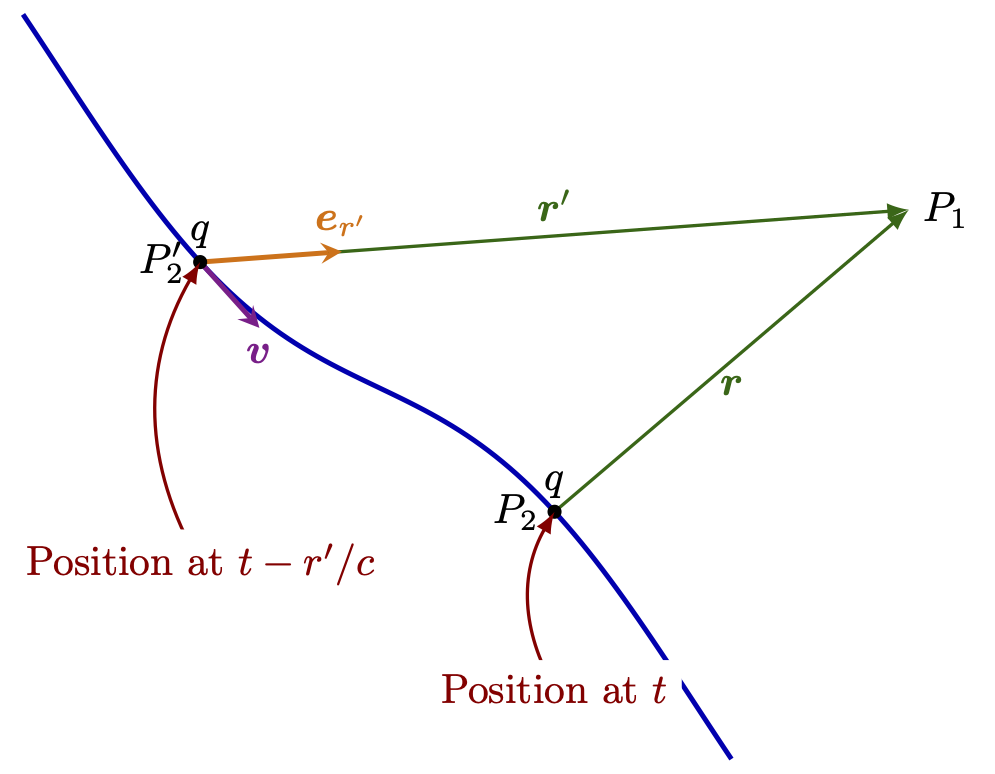{#fig-FLP_2_21_1 width=400}

우리는 $I$ 장에서 전하의 속력 $v$ 가 항상 $c$ 보다 훨씬 작고, 전하로부터 먼 거리의 점들만을 고려한다면, @eq-FLP_2_21_1 의 마지막 항만을 생각했다. @eq-FLP_2_21_1 은 정말 중요하며 전기장은 또한 다음과 같이 쓸 수 있다.

$$
\bf{E}=\dfrac{q}{4\pi \epsilon_0 c^2r'}\left[\begin{array}{c}(t−r′/c) \text{ 시점에 } \\ r′ \text{ 에 직각으로 투사된 전하의 가속도} \end{array}\right],
$$ {#eq-FLP_2_21_1_prime}

그리고

$$
\bf{B}=\dfrac{\bf{e}_{r'}\times \bf{E}}{c}.
$$

완전한 방정식인 @eq-FLP_2_21_1 에 대해 조금 더 자세히 살펴보자. 벡터 $\bf{e}_{r'}$ 는 지연된 위치 $P_2'$ 에서 $P_1$ 을 가리키는 단위 벡터이므로 첫 번째 항을 **지연된 쿨롱장 (retarded Coulomb field)** 이라고 부를 수 있다. 전기장은 거리의 역제곱에 비례하므로, 전하의 지연된 위치 $P_2'$ 에서 $\bf{e}_{r'}$ 방향을 향한다. 하지만 그것은 첫 번째 항에 불과하다. 다른 항들은 전기의 법칙이 모든 필드가 정적인 필드와 동일하다고 말하는 것이 아니라 단지 지연된 것이라고 말한다. 지연된 쿨롱장에 다른 두 항을 추가해야 한다. @eq-FLP_2_21_1 의 두 번째 항은 지연된 쿨롱장에 보정이 존재한다는 것을 말하며, 이는 지연된 쿨롱장의 변화율에 $r'/c$ 를 곱한 것으로, 지연된 지연(retarded delay)을 의미한다. **이 두번째 항은 첫 번째 항의 지연을 보완하는 경향이 있다.** 첫 두 항은 지연된 쿨롱장을 계산한 뒤, 이를 미래로 $r'/c$ 의 양만큼 외삽하는 것에 해당한다. 즉, 시간 $t$ 까지이다! 외삽은 선형이며, 마치 지연된 쿨롱장이 $P_2'$ 에서 전하에 대해 계산된 속도로 계속 변할 것이라고 가정하는 것과 같다. 전기장이 천천히 변하는 경우, 지연 효과는 보정 항에 의해 거의 완전히 제거되며, 두 항을 합쳐서 동시적 쿨롱장인 전기장을 제공한다. 즉, $P_2'$ 에서 전하의 쿨롱장을 매우 좋은 근사값으로 제공한다.

마지막으로 @eq-FLP_2_21_1 의 세번째 항은 단위 벡터 $\bf{e}_{r'}$ 의 2차 미분이다. 빛의 현상을 공부할 때 우리는 전하에서 멀리 떨어진 곳에서 처음 두 항이 $1/r^2$ 만큼 변하지만, 마지막 항은 $1/r$ 만큼 변하므로 마지막 항만 중요하다는 사실을 활용했다. 따라서 먼 거리에서는 전하의 가속도 성분에 비례한다는 것을 보여주었다. (또한, $\text{I}$ 권에서 대부분에 전하가 비상대적으로 움직이는 경우만 생각했으며 상대론적 효과는 34정에서만 고려했댜.)

이제 두 가지를 연결해 보자. 우리는 맥스웰 방정식과 @eq-FLP_2_21_1 을 가지고 있다. 점전하에 의한 장에 대해 이들이 동등한지 반드시 확인해야 한다. 만약 멕스웰 방정식으로부터 @eq-FLP_2_21_1 을 유도 할 수 있다면 우리는 빛과 전자기 사이의 연관성을 진정으로 이해하게 될 것이며 이것이 이 장의 주요한 목표이다.

결론부터 말하자면 아직 우리가 가진 수학적 스킬의 부족으로 인해 이것을 충분히 완수하지는 못할 것 같다. 하지만 연결이 어떻게 이루어질 수 있는지 확인하는 정도까지는 가능하다. 부족한 것은 수학학적인 스킬이다. 여러분 중 일부는 이 장의 수학이 다소 복잡하다고 생각 할 수 있고, 논증을 매우 면밀히 따르고 싶지 않을 수도 있다. 하지만 우리는 이전에 배운 것과 현재 배우고 있는 것을 연결하는 것이 중요하다고 생각한다. 혹은 최소한 그러한 연결을 어떻게 만들 수 있는지 이해하는 것이 중요하다. 앞선 장을 살펴보면 우리가 어떤 명제를 논의의 시작점으로 삼을 때마다 그것이 새로운 **기본 법칙** 인지, 혹은 다른 법칙으로부터 추론될 수 있는 명제인지를 신중히 설명했음을 알게 될 것이다. 우리는 이 강의들의 정신에 따라 빛과 맥스웰 방정식 사이의 연결을 독자에게 넘기고 있다. 중간에 곤란해진다 해도 다른 방법은 없다.

 

### $\textrm{II}$.21-2 점소스로부터의 구면파 {#sec-FLP_2_21_2}

[$\mathrm{II}$.18 멕스웰 방정식](#sec-FLP_2_18) 에서 

$$
\bf{E} = −\nabla \Phi − \dfrac{\partial \bf{A}}{\partial t}
$$ {#eq-FLP_2_21_2}

와

$$
\bf{B}=\nabla \times \bf{A}
$$ {#eq-FLP_2_21_3}

로 놓고 풀 수 있다는 것을 보였다. 여기서 $\Phi$ 와 $\bf{A}$ 는 아래의 두 방정식의 해가 되어야 한다.

$$
\nabla \Phi−\dfrac{1}{c^2}\dfrac{\partial^2\Phi}{\partial t^2} =−\dfrac{\rho}{\epsilon_0},
$$ {#eq-FLP_2_21_4}

$$
\nabla^2 \bf{A}−\dfrac{1}{c^2}\dfrac{\partial \bf{A}}{\partial t^2} = -\mu_0 \bf{J}.
$$ {#eq-FLP_2_21_5}

그리고 또한 아래 조건(로렌츠 게이지)을 만족해야 한다.

$$
\nabla \bf{\cdot A} =−\dfrac{1}{c^2}\dfrac{\partial \Phi}{\partial t}.
$$ {#eq-FLP_2_21_6}

@eq-FLP_2_21_4 와 @eq-FLP_2_21_5 는 모두 아래의 방정식에서 $\psi$ 를 구하는 것이라고 볼 수 있다.

$$
\nabla^2\psi − \dfrac{1}{c^2}\dfrac{\partial^2 \psi}{\partial t^2}=−s.
$$ {#eq-FLP_2_21_7}

여기서 $s$ 는 $\psi=\Phi$ 인 경우 $\rho/\epsilon_0$ 이고 $\psi=A_i$ 일 경우 $\mu_0 J_i$ 이다. $\rho$ 와 $\bf{J}$ 가 0인 곳(즉 자유 공간)에서 $\Phi,\,\bf{A},\,\bf{E},\, \bf{B}$ 는 모두 소스가 없는 3차원 파동 방정식

$$
\nabla^2\psi − \dfrac{1}{c^2}\dfrac{\partial^2 \psi}{\partial t^2}=0
$$ {#eq-FLP_2_21_8}

을 만족한다. [$\textrm{II}$.20 자유공간에서 멕스웰 방정식의 해](#sec-FLP_2_20) 에서 우리는 이 방정식의 해가 평면파, 혹은 구면파 등 다양한 종류의 파동을 나타낼 수 있음을 보았다. 이밖에도 축에서 전달되는 원통형 파동 등도 존재한다. 구면파의 경우 해는 다음의 형태이다.

$$
\psi (\bf{r},\,t) = \dfrac{f(t-r/c)}{r}.
$$ {#eq-FLP_2_21_9}

물리적으로 @eq-FLP_2_21_9 는 자유 공간의 파동을 나타내지 않으며, 원점에 전하가 있어 밖으로 퍼져나가는 파동을 의미한다. 다시 말해, @eq-FLP_2_21_9 는 $r=0$ 바로 근처를 제외한 모든 곳에서 @eq-FLP_2_20_8 의 해이고, $r=0$ 근방에 대한, 소스에 대한 항을 포함하는 @eq-FLP_2_21_7 의 해가 존재해야 한다. @eq-FLP_2_21_7 에서의 소스 $s$ 가 어떠해야만 @eq-FLP_2_21_9 와 같은 파동을 발생시킬 것인가?

구면파의 식 @eq-FLP_2_21_9 로 부터 시작하자. 그리고 $r$ 이 매우 작을 때 무슨 일이 일어나는지 살펴보자. $f$ 가 매끄러운 함수라면 $f(t−r/c)$ 에서 $−r/c$ 는 무시될 수 있다. 이 때

$$
\psi=\dfrac{f(t)}{r} \qquad (r\to 0)
$$ {#eq-FLP_2_21_10} 

이며, $\psi$ 는 원점의 시간에 따라 변하는 전하에 대한 쿨롱장과 같다. 즉, 원점 근처의 매우 작은 영역에 밀도 $\rho$ 를 가진 작은 전하 덩어리가 있다면
$$
\Phi = \dfrac{\int \rho \,dV}{4\pi \epsilon_0 r},
$$

이다. 이제 우리는 $\Phi$ 가 

$$
\nabla^2 \Phi = −\dfrac{\rho}{\epsilon_0}.
$$

을 만족시켜야 함을 안다. 이로부터 @eq-FLP_2_21_10 의 $\psi$ 는 

$$
\nabla^2 \psi = −s\qquad (r\to 0)
$${#eq-FLP_2_21_11}

를 만족하며

$$
f=\dfrac{S}{4\pi} = \dfrac{\int s\,dV}{4\pi}
$$

임을 알 수 있다. 일반적인 경우에서 유일한 차이점은 $s$ 가(그리고 $S$ 도) 시간의 함수가 될 수 있다는 점이다.

이제 중요한 점은 $\psi$ 가 @eq-FLP_2_21_11 을 만족한다면 작은 $r$ 에 대해 @eq-FLP_2_21_7 도 만족한다는 것이다. 우리가 원점에 매우 가까워질 때, $\psi$ 의 $1/r$ 의존성은 공간 미분을 매우 크게 만들지만 하지만 시간 미분은 동일한 값을 유지한다. 그것들은 단지 $f(t)$ 의 시간 미분일 뿐이다. 따라서 $r$ 이 $0$ 이 되면, @eq-FLP_2_21_7 에서 $\partial^2 \psi/\partial t^2$ 항은 @eq-FLP_2_21_7 의 $\nabla^2\psi$ 와 비교했을 때 무시할 수 있으며, @eq-FLP_2_21_7 은 @eq-FLP_2_21_11 과 동등해진다. 

정리하자면 @eq-FLP_2_21_7 의 소스 함수 $s(t)$ 가 원점에 국한되어 있으며 전체 강도가

$$
S(t)=\int s(t)\,dV,
$$ {#eq-FLP_2_21_12}

일 때 @eq-FLP_2_21_7  해는

$$
\psi(\bf{r},t)=\dfrac{1}{4\pi} \dfrac{S(t−r/c)}{r}
$$ {#eq-FLP_2_21_13}

이다. @eq-FLP_2_21_7 에서 $\partial^2 \psi/\partial t^2$ 의 유일한 효과는 쿨롱과 유사한 전위에 지연 $(t−r/c)$ 을 도입하는 것이다.

 

### $\textrm{II}$.21–3 멕스웰 방정식의 일반해 {#sec-FLP_2_21_3}

우리는 점 소스에 대해 @eq-FLP_2_21_7 의 해를 찾았다. 다음은 공간적으로 확장된 소스를 고려해야 한다. 이전과 마찬가지로 모든 소스 $s(\bf{r}',\,t)$ 를 여러 부피 요소들의 합으로 하여 적분하면 된다. @eq-FLP_2_21_7 은 선형 미분방정식이므로 최종적인 장은 이러한 모든 소스 요소의 장들의 중첩이다.

앞선 결과(@eq-FLP_2_21_13) 를 사용하면 $\bf{r}_2$ 에 위치한 소스 요소 $s\,dV$ 로부터 시간 $t$ 일 때 $\bf{r}_1 = (x_1,\,y_1,\,z_1)$ 에서의 장의 요소 $d\psi(\bf{r}_1\,t)$ 는

$$
d\psi(\bf{r}_1,t) = \dfrac{s(\bf{r}_2,t−r_{12}/c)dV_2}{4\pi r_{12}},
$$

임을 안다. 여기서 $r_{12}$ 는 $P_2$ 에서 $P_1$ 까지의 거리이다. 이것을 적분하면

$$
\psi(\bf{r}_1,t)=\int \dfrac{s(\bf{r}_2,t−r_{12}/c)}{4\pi r_{12}}dV_2
$$ {#eq-FLP_2_21_14}

를 얻는다. 즉, 시간 $t$ 에 $\bf{r}_1$ 에 있는 필드는 $(t−r_{12}/c)$ 시간에 $\bf{r}_2$ 에서 소스 요소를 떠나는 모든 구면 파동들의 합이다. 이는 전체 소스 집합에 대한 우리 파동 방정식의 해이다.

이제 맥스웰 방정식에 대한 일반적인 해를 얻는 방법을 알게 되었다. @eq-FLP_2_21_4 와 @eq-FLP_2_21_5 의 해는 다음과 같다.

$$
\Phi(\bf{r}_1,\,t)=\dfrac{1}{4\pi\epsilon_0}\int \dfrac{\rho(\bf{r}_2,t−r_{12}/c)}{r_{12}}dV_2,
$$ {#eq-FLP_2_21_15}

$$
\bf{A}(\bf{r}_1,t)=\dfrac{\mu_0}{4\pi}\int \dfrac{\bf{J}(\bf{r}_2,t−r_{12}/c)}{ r_{12}}dV_2.
$$ {#eq-FLP_2_21_16}

그런 다음 $\bf{E}$ 와 $\bf{B}$ 는 @eq-FLP_2_21_2, @eq-FLP_2_21_3 을 사용하여 찾을 수 있다. 우연히도, @eq-FLP_2_21_15 와 @eq-FLP_2_21_16 에서 얻은 $\Psi$ 와 $\bf{A}$ 를 @eq-FLP_2_21_6 을 통해 동등성을 확인 할 수 있다.

이제 맥스웰 방정식을 풀었다. 어떤 상황에서도 전류와 전하가 주어지면, 우리는 이러한 적분으로부터 직접 포텐셜을를 찾아 미분하고 장을 얻을 수 있다. 또한 이것은 우리가 빛 이론에 대한 고리를 다시 닫을 수 있게 해 준다. 이전의 빛에 관한 연구와 연결하기 위해서는 움직이는 전하로부터 전기장을 계산하기만 하면 되기 때문이다. 남은 것은 움직이는 전하를 취하고, 이 적분들로부터 포텐셜을 계산한 다음 미분하여 $\bf{E}=−\nabla \Phi - \partial \bf{A}/\partial t$ 를 얻는다. 이것이 @eq-FLP_2_21_1 와 같아야 한다. 쉽지 않겠지만 해야만 한다.

 

### $\textrm{II}$.21–4 진동하는 쌍극자에 의한 장

우리는 아직도 @eq-FLP_2_21_1 을 유도하지 못했다. 게다가 출판된 문헌 어디에서든, 제 $I$ 권을 을 제외하고 @eq-FLP_2_21_1 을 찾을 수 없었다$^6$.[$^6$ @eq-FLP_2_21_1 은 1902년에 올리버 헤비사이드(Oliver Heaviside)에 의해 처음 출판되었으며, 1950년경에 파인만이 싱크로트론 복사에 대한 이해 방법으로 제시하면서 독립적으로 재발견하였다.]{.aside} 유도하기가 쉽지 않다. 움직이는 전하로부터의 필드는 물론 동등한 다른 형태의 식으로 표현될 수 있다. 우리는 여기서 몇 가지 예시에서 @eq-FLP_2_21_15 와 @eq-FLP_2_21_16 이 @eq-FLP_2_21_1 과 동일한 결과가 나온다는 것을 보여주는 것으로 제한할 것이다. 우선 우리는 @eq-FLP_2_21_1 을 통해 전하 입자의 운동이 비상대적일 때의 올바른 전기장을 얻을 수 있다는 것을 보일 것이다. (이 특별한 경우에서라도 빛에 대해 우리가 말한 내용의 90% 이상을 처리할 수 있다.)

작은 영역에서 움직이는 전하 덩어리가 있고 여기서 떨어진 곳에서의 전기장에 관심이 있다고 하자. 빛은 일반적으로 원자와 같은 중성 물체에서 방출되므로, 흔들리는 전하 $q$ 가 정지상태인 $-q$ 전하 근처에서 움직인다고 가정한다. 두 전하 사이의 변위를 $\bf{d}$ 라고 하면, 이 두전하에 의한 쌍극자 모먼트 $\bf{p}=q\bf{d}$ 를 생각 할 수 있으며 이는 시간에 대한 함수이다. 전하에 가까운 위치에서의 전기장이라면 지연에 대해 걱정할 필요가 없을 것으로 예상할 수 있다. 전기장은 시간에 대한 쌍극자 모먼트 $\bf{p}(t)$ 를 사용한다면 이전에 정전기 쌍극자에 대해 계산한 것과 정확히 동일할 것이다. 하지만 매우 떨어진 거리에서는 장에서 $1/r$ 의 경향성이 있는 항을 찾아야 하며, 이는 시야에 수직인 전하의 가속도에 의존한다. 이런 결과가 나올지 확인해 보자.

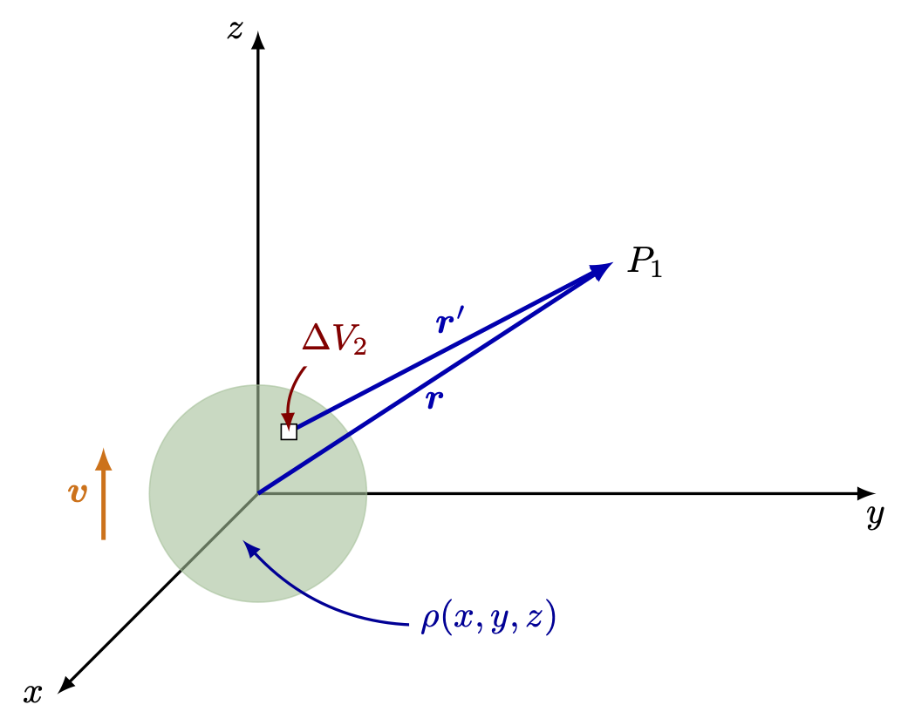{#fig-FLP_2_21_2 width=400}

우선 @eq-FLP_2_21_16 을 사용하여 벡터 퍼텐셜 $\bf{A}$ 를 계산해 보자. 움직인 전하가 전하 밀도 $\rho(x,y,z)$ 로 주어지는 작은 영역에 있다고 가정하고, 이 전체가 속도 $\bf{v}$ 로 움직이고 있다고 가정한다. 그렇다면 전류 밀도 $\bf{J}(x,y,z)=\bf{v}\rho(x,y,z)$ 이다. 좌표계를 $\bf{v}=v\bf{e}_z$ 가 되도록 맞추자. 그렇다면 우리 문제의 기하학은 @fig-FLP_2_21_2 에 표현된 바와 같다. 이제 우리는

$$
\int \dfrac{\bf{J}(\bf{r}_2, t−r_{12}/c)}{r_{12}}\,dV_2
$$ {#eq-FLP_2_21_17}

을 계산해야 한다. 이제 전하영역의 크기가 $r_{12}$ 에 비해 정말 매우 작다면, 전하 영역의 중심까지의 거리를 $r$ 이라고 했을 때 $r=r_{12}$ 로 놓는 근사를 할 수 있으며 그렇다면 $r$ 은 적분 밖으로 나올 수 있다. 다음으로, 우리는 분자의 $\bf{J}(\bf{r}_2,t-r_{12}/c)$ 에서  $r_{12}=r$ 로 놓고자 할수도 있지만 이것은 옳지 않다. $P_{1}$ 에 가까운 쪽과 먼쪽은 다른 지연 시간을 취해야 하기 때문이다. $\bf{J}(t−r_{12}/c)$ 에서 $r_{12}=r$ 은 전체 덩이의 전류밀도를 $t-r/c$ 에서 취하는 것이다. 그것은 전하의 속도 $v$ 가 $c$ 보다 훨씬 작을 경우, 즉 비상대론적인 상황에서만 좋은 근사이다. $\bf{J}$ 를 $\rho\bf{v}$ 로 대체하면 @eq-FLP_2_21_17 의 적분은

$$
\dfrac{1}{r}\int \bf{v}\rho(\bf{r}_2, t−r/c)dV_2
$$

가 된다. 모든 전하가 동일한 속도를 가지고 있으므로, 이 적분은 전체 전하 $q$ 에 대해 $q\bf{v}/r$ 이다. 하지만 $q\bf{v}$ 는 단지 $\partial \bf{p}/\partial t$, 즉 쌍극자 모멘트의 변화이다. 물론 이는 지연 시간 $(t−r/c)$ 에서 평가되어야 한다. 우리는 그것을 $\dot{\bf{p}}(t−r/c)$ 로 표기한다. 그렇다면 벡터포텐셜은 다음과 같다.

$$
\bf{A}(\bf{r}_1,\,t) = \dfrac{\mu_0}{4 \pi }\dfrac{\dot{\bf{p}}(t−r/c)}{r}
$$ {#eq-FLP_2_21_18}

위 식은 변동하는 쌍극자의 전류가 구면파 형태의 벡터포텐셜를 생성하며, 그 소스로서의 강도는 $\mu_0 \dot{\bf{p}}$ 임을 보인다.

이제 $\bf{B}=\nabla \times \bf{A}$ 로부터 자기장을 구할 수 있다. $\dot{\bf{p}}$ 가 완전히 $z$-방향에 있기 때문에 $\bf{A}$ 역시 $z$-성분만을 가지고 있으며, 따라서 $B_x=\partial A_z/\partial y$, $B_y=−\partial A_z/\partial x$ 이다. 

$$
\begin{aligned}
B_x &= \dfrac{\partial A_z}{\partial y} =\dfrac{\mu_0}{4\pi}\dfrac{\partial}{\partial y}\dfrac{\dot{p}(t−r/c)}{r} \\[0.3em]
&=-\dfrac{\mu_0}{4\pi}  \left[\dfrac{y\dot{p}(t−r/c)}{r^3} + \dfrac{y\ddot{p}(t-rc)}{cr^2}\right].
\end{aligned}
$$ {#eq-FLP_2_21_19}

또한 같은 방법으로 $B_y$ 를 구할 수 있다.

$$
B_y = \dfrac{\mu_0}{4\pi}  \left[\dfrac{x\dot{p}(t−r/c)}{r^3} + \dfrac{x\ddot{p}(t-rc)}{cr^2}\right]
$$ {#eq-FLP_2_21_19_2}

이 두 식을 깔끔한 벡터식으로 쓰면 다음과 같다.

$$
\bf{B}=\dfrac{\mu_0}{4\pi}\dfrac{\left[\dot{\bf{p}} + (r/c) \ddot{\bf{p}}\right]_{t-r/c} \times \bf{r}}{cr^2}.
$$ {#eq-FLP_2_21_23}

첫번째 항은 $1/r^2$ 로 감소하지만 두번째 항은 $1/r$ 로 감소한다. 따라서 먼 거리에서는 두번째 항이 지배적이 된다. 물론 벡터의 외적때문에 방향 의존성이 있다. 예를 들어 두번째 항의 경우 $\ddot{\bf{p}}$ 와 $\bf{r}$ 이 수직일 때 그 크기가 가장 크고 $1/r$ 로 감소하게 된다.

#### **전하와 가까운 곳에서 벌어지는 일**

이제 우리가 익숙하지 않은 것, 즉 전하와 가까운 곳에서 일어나는 일을 살펴보자. [$\textrm{II}$.14-7 비오-사바르의 법칙](vol2_3.qmd#sec-FLP_2_14_7) 에서는 전류 성분 $\bf{J}dV$ 가 자기장에 다음과 같이 기여한다는 것을 알게 되었다.

$$
d\bf{B}=\dfrac{\mu_0}{4\pi}\dfrac{\bf{J}\times \bf{r}}{r^3}\,dV.
$$ {#eq-FLP_2_21_24}

$\dot{\bf{p}}$ 가 전류라는 것을 생각하면 이 식은 @eq-FLP_2_21_23 의 첫 번째 항과 매우 닮았다. 하지만 한 가지 차이가 있는데, @eq-FLP_2_21_23 에서 전류는 $(t−r/c)$ 시점에 평가되어야 하며, 이는 @eq-FLP_2_21_24 에는 보이지 않는다. 그러나, 실제로는 @eq-FLP_2_21_24 는 $r$ 이 작을 때 잘 맞는다. 왜냐하면 @eq-FLP_2_21_23 의 두 번째이 첫 번째 항의 지연 효과를 상쇄하는 경향이 있기 때문이다. $r$ 이 작을 때 두 항을 함께 고려하면 @eq-FLP_2_21_24 에 매우 근접한 결과를 얻을 수 있다.

@eq-FLP_2_21_23 의 $[\cdots]_{t-r/c}$ 에서 $r$ 이 작으면 테일러 전개를 통해
$$
\dot{\bf{p}} (t−r/c) = \dot{\bf{p}}(t) − \dfrac{r}{c}\ddot{\bf{p}}(t) + \cdots
$$

이다. 그리고 $r/c$ 에서 같은 차수로 

$$
\dfrac{r}{c}\ddot{\bf{p}}(t−r/c) = \dfrac{r}{c}\ddot{\bf{p}}(t) + \cdots
$$

이므로 $[\cdots]_{t-r/c}$ 를 계산하면 $\ddot{\bf{p}}(t)$ 항이 소거되고 $\dot{\bf{p}}$ 만 남게 된다. 즉, $\dot{\bf{p}} (t)$ 이외에는 차수가 $(r/c)^2$ 이상인, $r/c$ 의 시간동안 거의 변화가 는 항만 남게 된다.

그래서 @eq-FLP_2_21_23 은 지연이 있는 순간 이론보다, 시간 지연 없이 전달되는 이론과 매우 유사한 장에 대한 결과를 보인다. 지연의 1차 효과는 두번째 항에 의해 제거된다. 정적인 상태의 공식은 소스에 근접한 위치에서 생각보다 훨씬 더 정확하다. 멀리 떨어진 지점에서는 시간 지연이 큰 영향을 끼치므로 보정이 매우 나빠지지만 우리는 복사에서 중요한 $1/r$ 항을 얻게 된다.

우리는 여전히 전기장을 계산하여 그것이 @eq-FLP_2_21_1_prime 과 같다는 것을 보여야 한다. 먼 거리에선 괜찮은 결과를 얻는다. 우리는 전파되는 파동이 있는 원천으로부터 멀리 떨어진 곳에서 $\bf{E}$ 가 $\bf{B}$ (및 $\bf{r}$ 에도) 수직이며, $cB=E$ 임을 알고 있다. 따라서 $\bf{E}$ 는 가속도 $\ddot{\bf{p}}$ 에 비례하며, 이는 @eq-FLP_2_21_1_prime 에서 기대되는 바와 같다.

모든 거리의 전기장을 완전히 얻으려면 정전포텐셜을 풀어야 한다. $\bf{A}$ 를 계산하기 위해 전류를 적분하여 @eq-FLP_2_21_18 을 얻을 때, 지연 항에서 $r$의 약간의 변동을 무시하고 근사했지만 정전포텐셜을 계산할 때는 이렇게 할 수 없다. $\int \rho/r\, dV$ 적분을 수행해야 하는데 이는 상수가 되기 때문이다. 우리는 더 높은 차수까지 고려해야 한다. 하지만 이 고차수 계산을 직접 하는 대신 @eq-FLP_2_21_6 을 이용하여 벡터포텐셜로부터 스칼라 퍼텐셜을 결정할 수 있다. 현재의 경우에서 $\nabla \bf{\cdot A}= \partial A_z/\partial z$ 이며, $A_x=A_y=0$ 이므로 쉽게 계산 할 수 있다. 

$$
\begin{aligned}
\nabla \bf{\cdot A} &= \dfrac{\mu_0}{4\pi}\left[\dot{p} (t−r/c)\dfrac{\partial}{\partial z}\left( \dfrac{1}{r}\right) + \dfrac{1}{r}\dfrac{\partial}{\partial z}\dot{p}(t−r/c)\right] \\[0.3em]
&=\dfrac{\mu_0}{4\pi}\left[\dfrac{−z\dot{p}(t−r/c)}{r^3}−\dfrac{z\ddot{p}(t−r/c)}{cr^2}\right].
\end{aligned}
$$

또는, 벡터 표기법으로,

$$
\nabla\bf{\cdot A}=−\dfrac{\mu_0}{4\pi}\dfrac{[\bf{\dot{p}} + (r/c)\bf{\ddot{p}}]_{t−r/c}\bf{\cdot r}}{r^3}.
$$

이제 @eq-FLP_2_21_6 을 사용하면 $\Phi$ 에 대한 다음 방정식을 얻게 된다.

$$
\dfrac{\partial \Phi}{\partial t}=\dfrac{1}{4 \pi \epsilon_0}\dfrac{[\bf{\dot{p}} + (r/c)\bf{\ddot{p}}]_{t−r/c}\bf{\cdot r}}{r^3}.
$$

위 식을 $t$ 에 대해 적분하면 다음을 얻는다$^7$. [$^7$ 어떤 중첩된 정적장에 해당하는 적분 상수를 생각 할 수 있다. 그러나 현재 고려하는 진동하는 쌍극자에 대해서는 정적장이 존재하지 않는다.]{.aside}

$$
\Phi(\bf{r},t)=\dfrac{1}{4π\epsilon_0}\dfrac{[\bf{p} + (r/c)\bf{\dot{p}}]_{t−r/c}\bf{\cdot r}}{r^3}.
$$ {#eq-FLP_2_21_25}

이제 $\bf{E}=−\nabla \Phi−\dfrac{\partial \bf{A}}{\partial t}$ 를 이용하여 지루하지만 복잡하진 않은 계산을 통해 $\bf{E}$ 를 얻을 수 있다.$^8$ [$^8$ $\bf{p}(t−r/c)$ 와 그 시간 미분이 $r/c$ 지연을 통해 $x$, $y$, $z$ 에 의존한다는 것을 기억하라.]{.aside}

$$
\bf{E}(\bf{r},t)=\dfrac{1}{4π\epsilon_0 r^3}\left[ \dfrac{3(\bf{p}^\ast \bf{\cdot r})\bf{r}}{r^2}−\bf{p}^\ast + \dfrac{1}{c^2}\{ \bf{\ddot{p}}(t−r/c) \times \bf{r}\} \times \bf{r} \right]
$$ {#eq-FLP_2_21_26}

여기서

$$
\bf{p}^\ast = \bf{p}(t−r/c)+\dfrac{r}{c}\bf{\dot{p}}(t−r/c).
$$ {#eq-FLP_2_21_27}

이 결과는 비록 다소 복잡해 보이지만, 결과는 쉽게 해석된다. 벡터 $\bf{p}^∗$ 는 지연된 쌍극자 모멘트이며, 그 지연에 대해 “보정”된 경우이므로, $\bf{p}^\ast$ 를 가진 두 항은 $r$ 이 작을 때에는 정적 쌍극자장처럼 행동한다(@eq-FLP_2_6_14). $r$ 이 클 때는 $\bf{\ddot{p}}$ 항이 지배적이되어 전기장은 전하의 가속도에 비례하고, $\bf{r}$ 에 직각을 이루며, 실제로는 $\bf{r}$ 에 수직인 평면으로의 $\bf{\ddot{p}}$ 의 프로젝선 방향이다.

이 결과는 우리가 @eq-FLP_2_21_1 를 사용하여 얻었을 것과 일치한다. 물론, @eq-FLP_2_21_1 은 보다 일반적이며, 모든 움직임에 대해 성립한다. 반면 @eq-FLP_2_21_26 은 소스에 대한 지연 $r/c$ 를 상수로 취할 수 있는 작은 운동에만 유효하다. 어쨌든, 우리는 이제 빛에 관한 이전 논의 전체에 대한 기반을 제공했다($\mathrm{I}$.34 에서 논의된 일부 사항은 제외하고). 모든 것이 @eq-FLP_2_21_26 의 마지막 항에 달려 있었다. 다음으로는 우리는 보다 빠르게 이동하는 전하에 대해 장을 어떻게 얻을 수 있는지 논의하겠다(이는 $\textrm{I}$.34 의 상대론적 효과의 원인이다). 

 

### $\textrm{II}$.21–5 움직이는 전하의 포텐셜: the general solution of Liénard and Wiechert {#sec-FLP_2_21_5}

앞절에서는 속도가 낮은 상황에서 $\bf{A}$ 에 대한 적분을 단순화했다. 하지만 그렇게 함으로써 우리는 중요한 지점을 놓쳤으며, 또한 실수하기 쉬운 지점도 놓쳤다. 따라서 우리는 이제 어떤 방식으로든 움직이는 점전하의 전위에 대한 계산을 진행한다. 이를 통해 전하의 완전한 전자기학을 얻게 된다. @eq-FLP_2_21_1 도 미분 취함으로써 얻을 수 있다. 

전자와 같은 점 전하가 움직일때의 스칼라 퍼텐셜 $\Phi(P_1)$ 을 계산해 보자. 우리는 @eq-FLP_2_21_15 를 통해 $\Phi$ 를 구할 수 있다.

$$
\Phi(P_1,t)=\dfrac{1}{4\pi \epsilon_0} \int \dfrac{\rho(P_2, t−r_{12}/c)}{r_{12}} \,dV_2.
$$ {#eq-FLP_2_21_28}

점전하에 대해서는 $\rho$ 의 적분이 단지 전체 전하 $q$ 일 뿐이라고 생각할 것이다. 그렇다면

$$
\Phi(P_1,t) = \dfrac{1}{4\pi \epsilon_0} \dfrac{q}{r'_{12}} \qquad (\textbf{Wrong!!!}).
$$

$r'_{12}$ 는 지연된 시간 $(t−r_{12}/c)$ 에서 $\bf{r}_2$ 에서 $\bf{r}_1$ 까지의 전하까지의 반경 벡터를 의미한다. 그런데 이것은 잘못되었다. 정답은

$$
\Phi(P_1,t) = \dfrac{1}{4\pi \epsilon_0}\dfrac{q}{r'_{12}}\dfrac{1}{1−v_{r'}/c}
$$ {#eq-FLP_2_21_29}

이며, 여기서 $v_{r'}$ 은 $r'_{12}$ 에 평행한 전하의 속도 성분이다. 즉 $P_1$ 방향이다. 이제 그 이유를 설명하겠다. 일단 먼저 **점** 전하에 대한 계산을 수행한다. 이 전하는 작은 정육면체 전하로, 속력은 $v$ 이다(@fig-FLP_2_21_5 (a)). 정육면체의 한 면의 길이를 $a$ 라 하자. 전하의 중심에서 점 $P_1$ 까지의 거리 $r_{12}$ 에 대해 $a\ll r_{12}$ 이다.

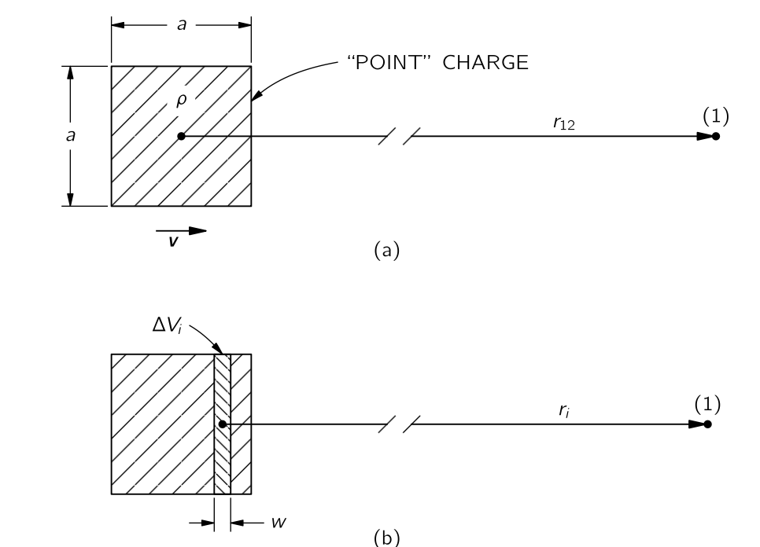{#fig-FLP_2_21_5 width=400}

이제 @eq-FLP_2_21_28 의 적분을 계산한다. 우선 합으로 표기하자.

$$
\sum_i \dfrac{\rho_i \Delta V_i}{r_i}.
$$ {#eq-FLP_2_21_30}

여기서 $r_i$ 는 $\bf{r}_1$ 에서 $i$ 번째 부피 성분 $\Delta V_i$ 까지의 거리이며, $\rho_i$ 는 $t_i=t−r_i/c$ 시점의 $\Delta V_i$ 에서의 전하 밀도이다. $r_i \gg a$ 이므로, @fig-FLP_2_21_5 (b) 와 같이 $r_{12}$ 에 수직인 얇고 직사각형 형태의 $\Delta V_i$ 를 취하는 것이 편리하다.

예를 들어, 두께 $w$ 가 $a$ 보다 훨씬 작은 부피 성분 $\Delta V_i$ 를 취한다고 가정하자. 각각의 부피 성분은 @fig-FLP_2_21_6 (a) 와 같이 표시된다. 이제 전하를 표현하는데 충분하다. 하지만 아직 전하를 보여주지 않았는데, 그 이유는 충분히 타당하다. 그것을 어디에 넣어야 할까? 각 부피요소 $\Delta V_i$ 에 대해 $t_i=(t−r_i/c)$ 일 때 $\rho$ 를 취해야 하지만, 전하가 이동하고 있기 때문에 각 부피 요소 $\Delta V_i$ 마다 다른곳에 위치한다!

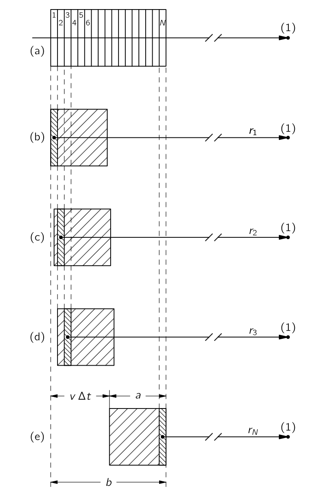{#fig-FLP_2_21_6 width=400}

@fig-FLP_2_21_6 (a)에서 $1$ 이라고 표시된 부피성분으로부터 시작하자. $t_1=(t−r_1/c)$ 시점에 전하의 “뒤쪽” 가장자리가 $\Delta V_1$ 을 차지하도록 선택되었으며, 이는 그림 @fig-FLP_2_21_6 (b) 에 표시된 바와 같다. 그렇다면 $\rho_2 \Delta V_2$ 를 평가할 때는 전하가 @fig-FLP_2_21_6 (c)에 표시된 위치에 있을 때, 약간 늦은 시간 $t_2=(t−r_2/c)$ 의 전하 위치를 사용해야 한다. 이것은 $\Delta V_3$, $\Delta V_4$ 로 계속된다. 이제 우리는 합을 계산 할 수 있다.

각 $\Delta V_i$ 의 두께가 $w$ 이므로, 그 부피는 $wa^2$ 이다. 그렇다면 각 부피 요소는 $wa^2\rho$ 의 전하를 포함하며, 여기서 $\rho$ 는 정육면체 내 전하의 밀도로, 우리는 이를 균등하다고 간주한다. 전하에서 $P_1$ 까지의 거리가 클 경우, 분모에 있는 모든 $r_i$ 를 평균값, 예를 들어 전하 중심의 지연된 위치 $r'$ 로 근사시킬 수 있다. 그렇다면 합계(@eq-FLP_2_21_30) 은

$$
\sum_{i=1}^N \dfrac{\rho wa^2}{r'},
$$

여기서 $\Delta V_N$ 은 @fig-FLP_2_21_6 (e) 에 표현된 것과 같이 전하 분포와 겹치는 마지막 $\Delta V_i$ 이다. 위의 합을 계산하면

$$
N\dfrac{\rho wa^2}{r'} = \dfrac{\rho a^3}{r'}\left( \dfrac{Nw}{a} \right)
$$

인데, $\rho a^3$ 는 전체 전하 $q$ 이며, $Nw$ 는 @fig-FLP_2_21_6 (e) 의 $b$ 이다. 이로부터

$$
\Phi = \dfrac{q}{4\pi \epsilon_0 r'}\left( \dfrac{b}{a} \right).
$$ {#eq-FLP_2_21_31}

여기서 $b$ 는 $t_1=(t−r_1/c)$ 와 $t_N=(t−r_N/c)$ 사이에 전하가 이동한 거리에 $a$ 를 더한 값이다. 

$$
\Delta t=t_N−t_1=\dfrac{r_1−r_N}{c}=\dfrac{b}{c}.
$$

라고 하면 전하의 속도가 $v$ 이므로, $\Delta t$ 동안 이동한 거리는 $v\Delta t= vb/c$ 이다. $b$ 는 이 거리에 $a$ 를 더한 것이다.

$$
b = a + \dfrac{v}{c}b.
$$

$b$ 에 대해 풀면

$$
b=\dfrac{a}{1−v/c}
$$

이다. 물론 $v$ 는 지연된 시간 $t'=(t−r'/c)$ 에서의 속도를 의미하며, 이를 $[1−v/c]_\text{ret}$ 로 표기하면 @eq-FLP_2_21_31 은 

$$
\Phi(P_1,t)=\dfrac{q}{4\pi \epsilon_0 r'}\dfrac{1}{[1−(v/c)]_\text{ret}}.
$$

이 된다. 이 결과는 우리가 주장하는 @eq-FLP_2_21_29 와 일치한다. 우리가 계산하는 적분이 전하를 쓸어 담을 때 전하가 이동하기 때문에 필요한 보정 항이 존재한다. 전하가 $P_1$ 을 향해 이동할 때, 적분에 대한 기여도는 $b/a$ 비율로 의해 증가한다. 따라서 올바른 적분은 $q/r'$ 에 $b/a$ 를 곱한 것이며, 이는 $1/[1−v/c]_\text{ret}$ 이다.

전하의 속도가 $P_1$ 방향이 아닐 경우, 중요한 것은 그 $P_1$ 을 향한 속도의 성분임을 알 수 있다. 이 속도 성분을 $v_r$ 이라고 하면, 보정 계수는 $1/[1−v_r/c]_\text{ret}$ 이다. 또한, 우리가 수행한 분석은 모든 형태의 전하 분포에 대해 정확히 동일하게 적용된다.정육면체일 필요는 없다. 마지막으로, 전하 $q$ 의 “크기”가 최종 결과에 들어가지 않기 때문에 전하를 어떤 크기—심지어 한 점까지—축소하도록 두어도 동일한 결과가 성립한다. 일반적인 결과는 어떤 속도로 움직이는 점전하의 스칼라 퍼텐셜이

$$
\Phi(P_1,t)=\dfrac{q}{4\pi \epsilon_0 r'[1−(v_r/c)]_\text{ret}}.
$$ {#eq-FLP_2_21_32}

이며, 종종 동등한 형태로 아래와 같이 표현된다.

$$
\Phi(P_1,t)=\dfrac{q}{4 \pi \epsilon_0 [r−(\bf{v\cdot r}/c)]_\text{ret}}
$$ {#eq-FLP_2_21_33}

여기서 $\bf{r}$ 은 전하에서 점 $P_1$ 까지의 벡터이며, 여기서 $\Phi$ 가 평가되고, 괄호 안의 모든 양은 지연된 시간 $t'=t−r'/c$ 에서 값을 가져야 합니다.

@eq-FLP_2_21_16 에서 점 전하에 대해 $\bf{A}$ 를 계산할 때도 같은 현상이 발생한다. 전류 밀도는 $\rho\bf{v}$ 이며, $\rho$ 에 대한 적분은 $\Phi$ 에 대해 찾은 것과 동일하다. 벡터 퍼텐셜은

$$
\bf{A}(P_1,t)=\dfrac{\mu_0 q\bf{v}_\text{ret}}{4\pi [r−(\bf{v\cdot r}/c)]_\text{ret}}.
$$ {#eq-FLP_2_21_34}

이 형태의 점전하의 포텐셜은= 리에나르 와 비헤르트에 의해 처음 유도되었으며, **리에나르-비헤르트 포텐셜** 이라고 한다.

이제 순환은 @eq-FLP_2_21_1 로 돌아와 딛힌다. 이 포텐셜로 $\bf{E}$ 와 $\bf{B}$ 만 계산하면 되며 이는 오직 산수일 뿐이다. 하지만 이 이 산수는 상당히 복잡하므로 세부 사항을 적지 않겠다. 결론적으로 @eq-FLP_2_21_1 은 우리가 도출한 리나드-비처트 포텐셜과 동등하다.

### $\text{II}$.21–6 등속으로 운동하는 전하에 대한 포텐셜 : 로렌츠 공식 {#sec-FLP_2_21_6}

이제 리에나르-비헤르트 포텐셜을 사용하여 특별한 경우-직선에서 균일한 속도로 움직이는 전하에 의한-장을 구해보자. 나중에 상대성 원리를 사용하여 다시 할 것이다. 우리는 전하가 정지한 프레임에 있을 때 포텐셜이 무엇인지 알고 있다. 전하가 움직일 때, 우리는 한 기준틀에서 다른 기준틀로의 상대론적 변환을 통해 모든 것을 파악할 수 있다. 하지만 상대성 이론의 기원은 전기와 자기 이론이며 로렌츠 변환의 공은 로렌츠가 전기와 자기 방정식을 연구하던 중에 이룬 발견이었다. 여기서는 맥스웰 방정식으로부터 로렌츠 변환을 이끌어 낼 수 있다는 것을 보일 것이다. 우리는 맥스웰 방정식의 전기역학으로부터 직접 균일한 속도로 이동하는 전하의 포텐셜을 계산하는 것부터 시작한다. 우리는 맥스웰 방정식이 마지막 절에서 얻은 이동 전하의 전위로 이어진다는 것을 보았다. 따라서 이러한 포텐셜을 사용한다는 것은 맥스웰 이론을 사용한다는 것이다.

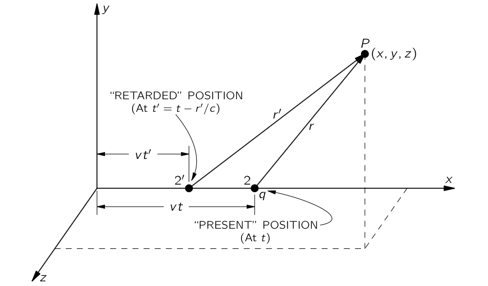{#fig-FLP_2_21_7 width=400}

@fig-FLP_2_21_7 과 같이 전하가 $x$ 축을 따라 속력 $v$ 로 이동하고 있다고 하고 점 $P(x, y, z)$ 에서 전위를 구하자.$t=0$ 에서 전하가 원점에 있었으며 $t$ 에 전하가 $x=vt$ 에 있을 때 $y=z=0$ 이다. 하지만 우리가 알아야 할 것은 그것이 지연된 시점

$$
t' = t−\dfrac{r'}{c}.
$$ {#eq-FLP_2_21_35}

에서의 위치이다. 여기서 $r'$ 은 지연된 시간에 전하로부터 점 $P$ 까지의 거리이다. 초기 시간 $t'$ 에서는 전하가 $x=vt'$ 에 있었으므로 

$$
r'=\sqrt{(x−vt')^2+y^2+z^2}.
$$ {#eq-FLP_2_21_36}

$r'$ 혹은 $t'$ 를 찾기 위해서는 이 방정식을 @eq-FLP_2_21_35 와 연립해야 한다. 그 결과는 

$$
\left(1−\dfrac{v^2}{c^2}\right) t'= t−\dfrac{vx}{c^2}−\dfrac{1}{c}\sqrt{(x−vt)^2+\left(1−\dfrac{v^2}{c^2}\right)(y^2+z^2)},
$${#eq-FLP_2_21_37}

$$
r'=c(t−t').
$$

이다. 이제 @eq-FLP_2_21_33 을 통해 $\Phi$ 를 구할 수 있다. $v$ 가 상수이므로

$$
\Phi(x,y,z,t)=\dfrac{q}{4\pi \epsilon_0}\dfrac{1}{r'−(\bf{v\cdot r}'/c)}
$$ {#eq-FLP_2_21_38}

이며 $\bf{v}$ 의 $\bf{r}'$ 방향 성분은 $v(x−vt')/r'$ 이므로 $\bf{v \cdot r}'$ 는 단순히 $v(x−vt′)$ 이며, 전체 분모는

$$
c(t−t′)−\dfrac{v}{c}(x−vt′)=c\left[t−\dfrac{vx}{c^2}−\left(1−\dfrac{v^2}{c^2}\right) t'\right].
$$

이다. @eq-FLP_2_21_37 로 위 식의 $(1−v^2/c^2)t'$ 를 대입하면 아래와 같이 $\Phi$ 를 얻는다.

$$
\Phi(x,y,z,t)=\dfrac{q}{4\pi \epsilon_0}\dfrac{1}{\sqrt{(x−vt)^2+\left(1−\dfrac{v^2}{c^2}\right)(y^2+z^2)}}.
$$ 

이 방정식은 아래와 같이 다시 쓸 수 있다.

$$
\Phi(x,y,z,t) = \dfrac{q}{4\pi \epsilon_0}\dfrac{1}{\sqrt{1−\dfrac{v^2}{c^2}}} \dfrac{1}{\left[\left(\dfrac{x−vt}{\sqrt{1−v^2/c^2}}\right)^2+y^2+z^2\right]^{1/2}}.
$${#eq-FLP_2_21_39}

벡터 퍼텐셜 $\bf{A}$ 는 $\bf{v}/c^2$ 의 추가 계수를 가진 동일한 식이다.

$$
\bf{A}=\dfrac{\bf{v}}{c^2}\Phi.
$$

@eq-FLP_2_21_39 에서 로렌츠 변환의 시작을 명확히 볼 수 있다. 만약 전하가 정지한 기준틀의 원점에 있다면, 

$$
\Phi(x,y,z)=\dfrac{q}{4 \pi \epsilon_0} \dfrac{1}{\sqrt{x^2+y^2+z^2}}
$$

이므로 움직이는 좌표계에서는 좌표가 변환되어야 한다.

$$
x\to \dfrac{x-vt}{\sqrt{1-v^2/c^2}},\qquad y\to y,\qquad z\to z.
$$

이것은 단지 로렌츠 변환일 뿐이며, 우리가 한 일은 본질적으로 로렌츠가 그것을 발견한 방식이다.

하지만 @eq-FLP_2_21_39 앞에 나타나는 $1/\sqrt{1−v^2/c^2}$ 는 무엇인가? 또한 $\bf{A}$ 가 입자의 정지 기준틀에서 모든 영역에서 $0$ 일 때 어떻게 나타나는가? 우리는 곧 $\bf{A}$ 와 $\Phi$ 가 함께 4벡터를 구성한다는 것을 보일 것이며, 이는 입자의 운동량 $\bf{p}$ 와 총 에너지 $U$ 의 경우와 같다. @eq-FLP_2_21_39 에 추가된 $1/\sqrt{1−v^2/c^2}$ 는 네 벡터의 구성 요소를 변환할 때 항상 포함되는 동일한 인자이며, 전하 밀도 $\rho$ 가 $\rho/\sqrt{1−v^2/c^2}$ 로 변환되는 것과 같다. 사실, 그것은 @eq-FLP_2_21_4 와 @eq-FLP_2_21_5 에서 거의 명백한데, 이 식에 따르면 $\bf{A}$ 와 $\Phi/c$ 는 4벡터의 구성 요소이며, [$\mathrm{I}$.13](../vol1/vol1_2.qmd#sec-FLP_1_13) 에서 이미 $\bf{J}$ 와 $c\rho$ 가 4벡터의 구성 요소임을 증명했기 때문이다.

나중에 우리는 전기역학의 상대성에 대해 더 자세히 다룰 것이며, 여기서는 맥스웰 방정식이 어떻게 자연스럽게 로렌츠 변환으로 이어지는지를 보여줄 것이다. 그렇다면 전기와 자기의 법칙이 이미 아인슈타인의 상대성 이론에 대해 정확하다는 사실에 놀라지 않을 것이다. 우리는 뉴턴의 역학 법칙에 대해 해야 했던 것처럼 “fix up them” 할 필요가 없을 것이다.

 

## 연습문제 {.unnumbered}

::: {#exr-FLP_transform_which_make_fields_invariant}

#### 전기장과 자기장을 변화시키지 않는 변환

멕스웰 방정식 가운데 아래 둘을 생각하자.

$$
\nabla \times \bf{B}=0,\qquad \nabla \times \bf{E}=-\dfrac{\partial \bf{B}}{\partial t} \tag{1}
$$ 

첫번째 식은 $\bf{B}=\nabla \times \bf{A}$ 인 벡터장 $\bf{A}$ 가 존재함을 말한다. 두번째 식은 $\bf{E}=-\nabla \Phi - \dfrac{\partial \bf{A}}{\partial t}$ 를 만족하는 스칼라장 $\Phi$ 가 존재해야 함을 말한다.

($a$) 두 벡터장 $\bf{A}$ 와 $\bf{A}'$ 이 모두 같은 자기장에 대한 벡터포텐셜이라면, 어떤 스칼라장 $\Lambda_0$ 에 대해 

$$
\bf{A}'=\bf{A}+\nabla \Lambda_0 \tag{2}
$$ 

이어야 함을 보여라.

($b$) $(\Phi,\,\bf{A}) \to (\Phi',\,\bf{A}')$ 변환에 의해 전기장이 변하지 않는 조건과 $\bf{A}'$ 이 ($2$) 를 따른다는 조건으로부터 아래 식을 만족하는 $\Lambda_1(t)$ 가 존재함을 보여라. 

$$
\Phi' = \Phi -\dfrac{\partial \Lambda_0}{\partial t} - \Lambda_1(t) \tag{3}
$$ 

($c$) ($3$) 의 $\Lambda_1(t)$ 는 연속함수이므로 $\Lambda'_2(t) = \Lambda_1(t)$ 인 시간에만 의존하는 함수 $\Lambda_2$ 가 존재한다. $\Lambda = \Lambda_0 + \Lambda_2$ 에 대해 게이지 변환이 성립함을 보여라.

:::

::: {.solution}

($a$) $\nabla \times (\bf{A}'-\bf{A})=0$ 이어야 하므로 헬름홀츠 정리에 의해 $\bf{A}'=\bf{A}+\nabla \Lambda_0$ 를 만족하는 스칼라장 $\Lambda_0$ 가 존재한다.

($b$) $(\Phi,\,\bf{A})$ 에 의한 전기장과 $(\Phi',\,\bf{A}')$ 에 의한 전기장이 같아야 한다. 즉

$$
-\nabla \Phi - \dfrac{\partial \bf{A}}{\partial t} =  -\nabla \Phi'  - \dfrac{\partial \bf{A}'}{\partial t}=-\nabla \Phi' - \dfrac{\partial \bf{A}}{\partial t} - \dfrac{\partial \nabla \Lambda_0}{\partial t}
$$ 

이어야 한다. 이로부터

$$
\nabla \left[\Phi - \Phi' - \dfrac{\partial \Lambda_0}{\partial t}\right] =0
$$

이어야 하므로 어떤 시간에만 의존하는 함수 $\Lambda_1(t)$ 에 대해

$$
\Phi' = \Phi - \dfrac{\partial  \Lambda_0}{\partial t} - \Lambda_1(t)
$$

이어야 한다.

($3$) $\Lambda_2$ 는 $t$ 에만 의존하는 함수이므로 $\nabla (\Lambda_0 + \Lambda_2) = \nabla \Lambda_0$ 이다. 따라서 $\bf{A}\to \bf{A}+\nabla \Lambda$, $\Phi \to \Phi - \dfrac{\partial \Lambda}{\partial t}$ 는 전기장과 자기장을 변화시키지 않는 변환이다. 

:::

 

::: {#exr-FLP_gauge_function}

#### 로렌츠 게이지

[$\textrm{II}$.21-3 멕스웰 방정식의 일반해](#sec-FLP_2_21_3) 에서 우리는 소스가 있는 파동방정식

$$
\nabla^2 \psi - \dfrac{1}{c^2}\dfrac{\partial^2 \psi}{\partial t^2} = -s \tag{1}
$$

의 해가

$$
\psi (\bf{r}_1,\,t)= \dfrac{1}{4\pi} \int_V \dfrac{s(\bf{r}_2,\, t-r_{12}/c)}{r_{12}}\,dV_2 \tag{2}
$$

임을 안다. 이를 이용하여 로렌츠 게이지 조건 @eq-FLP_2_18_23 을 만족하는 게이지 함수를 구하라.

:::

::: {.solution}

게이지 변환 $\bf{A}'=\bf{A}+\nabla \Lambda$, $\Phi' = \Phi - \partial_t \Lambda$ 로부터

$$
\begin{aligned}
0 = \nabla \bf{\cdot A}' + \dfrac{1}{c^2}\dfrac{\partial \Phi'}{\partial t} = \nabla \bf{\cdot A} + \nabla^2\Lambda + \dfrac{1}{c^2}\dfrac{\partial \Phi}{\partial t} - \dfrac{1}{c^2}\dfrac{\partial^2 \Lambda}{\partial t^2} 
\end{aligned}
$$

이어야 한다. 즉 $\Lambda$ 는

$$
\nabla^2 \Lambda - \dfrac{1}{c^2}\dfrac{\partial^2 \Lambda}{\partial t^2} = -\nabla \bf{\cdot A} - \dfrac{1}{c^2}\dfrac{\partial \Phi}{\partial t}
$$

를 만족해야 한다. 파동방정식 ($1$) 의 해가 ($2$) 로 주어지므로 

$$
s(\bf{r},\,t) = \nabla \bf{\cdot \bf{A}} + \dfrac{1}{c^2} \dfrac{\partial \Phi}{\partial t}
$$

에 대해 

$$
\Lambda (\bf{r}_1,\,t)= \dfrac{1}{4\pi} \int_V \dfrac{s(\bf{r}_2,\, t-r_{12}/c)}{r_{12}}\,dV_2 
$$

이다.

:::