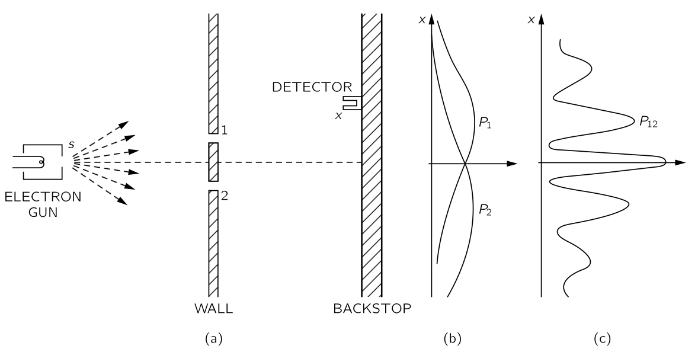

 

[양자역학 입문](../vol1/vol1_5.qmd) 를 참고하라.

## III.3 확률 진폭 {#sec-FLP_3_3}

### III.3-1 확률진폭을 결합하는 법칙 {#sec-FLP_3_3_1}

슈뢰딩거가 양자역학의 올바른 법칙을 처음 발견했을 때, 그는 다양한 위치에서 입자를 찾는 진폭을 기술하는 방정식을 작성했다. 이 방정식은 이미 고전 물리학자들이 알고 있던 방정식들-음파에서 공기의 운동, 빛의 전달 등을 설명하는 데 사용한 방정식들-과 매우 유사했으므로 양자역학 초기에 대부분의 시간은 이 방정식을 푸는 데 사용되었다. 동시에, 특히 보른과 디랙에 의해 양자역학 뒤에 있는 기본적으로 새로운 물리적 개념에 대한 이해가 발전하고 있었다. 양자역학이 더욱 발전함에 따라, 전자의 스핀, 다양한 상대론적 현상과 같이 슈뢰딩거 방정식에 직접적으로 포함되지 않은 많은 것들이 존재한다는 것이 밝혀졌다. 전통적으로 양자역학의 모든 과정은 동일한 방식으로 시작되어, 해당 분야의 역사적 발전 과정에서 따라온 경로를 되밟아 간다. 먼저 고전역학에 대해 많은 것을 배우게 되어 슈뢰딩거 방정식을 푸는 법을 이해할 수 있게 된다. 그는 다양한 풀이법을 배우는 데 오랜 시간을 보낸다. 이 방정식을 상세히 연구한 뒤에야 그는 전자의 스핀이라는 “고급” 주제에 도달한다.

우리는 원래 이 강의를 마무리하는 올바른 방법은, 예를 들어, 밀폐된 영역의 음파나 원통형 공동에서의 전자기 복사 모드와 같은 복잡한 상황에서 고전 물리학 방정식을 푸는 방법을 보여주는 것이라고 생각했다. 그것은 이 과정에 대한 원래 계획이었다. 하지만 우리는 그 계획을 포기하고 대신 양자역학에 대해 소개하기로 결정했다. 우리는 일반적으로 양자역학의 고급 부분이라고 불리는 것이 실제로는 매우 단순하다는 결론에 도달했다. 관련된 수학은 특히 단순하며, 단순한 대수 연산을 포함하고 미분 방정식은 없으며, 최대한 매우 단순한 방정식만 포함하도록 한다. 유일한 문제는 우리가 더 이상 공간에서의 입자의 행동을 상세히 기술할 수 없게 되는 격차를 뛰어넘어야 한다는 것이다. 그래서 우리가 시도하려는 것은 일반적으로 양자역학의 “고급” 부분이라고 불리는 것에 대해 알려주는 것이다. 하지만 그것들은 가장 단순한 부분 뿐만 아니라 가장 기본적인 부분도 확률에 의해 기술된다. 솔직히 말하자면면, 이것은 교육학적 실험이며, 우리가 알기로는 이전에 한 번도 수행된 적이 없었다.

이 주제에서는 사물의 양자역학적 행동이 상당히 기묘하다는 어려움이 있다. 일어날 일에 대힌 대략적이고 직관적인 아이디어를 얻기 위해 의존할 일상적인 경험을 가진 사람이 없다. 따라서 주제를 제시하는 방법은 두 가지가 있다: ($1$) 일어날 수 있는 일을 다소 투박한 물리적 방식으로 설명하면서, 정확한 법칙을 제시하지 않은 채 어떤 일이 발생할 지 어느 정도로 말하거나, ($2$) 다른 한편으로는 추상적인 형태로 정확한 법칙을 제시할 수 있다. 하지만, 그렇다면 추상화 때문에 물리적으로 그것들이 무엇인지 알 수 없을 것이다. 후자의 방법은 완전히 추상적이기 때문에 만족스럽지 않으며, 첫 번째 방법은 무엇이 진실이고 무엇이 거짓인지 정확히 알지 못하기 때문에 불편한 느낌을 남긴다. 우리는 이 어려움을 어떻게 극복해야 할지 확신하지 못한다. 실제로 [I.37 Quantum benavior](../vol1/vol1_5.qmd#sec-FLP_1_37) 과 [I.38 입자 관점과 파동 관점의 관계](../vol1/vol1_5.qmd#sec-FLP_1_38) 에서 이 문제가 나타난 것을 알게 될 것이다. 첫 번째 장은 비교적 정확했지만, 두 번째 장은 다양한 현상의 특성에 대한 대략적인 설명이었다. 여기에서는 두 극단 사이의 중간을 찾으려고 노력할 것이다.

이번 장에서는 일반적인 양자역학 개념을 다루며 시작한다. 일부 진술은 꽤 정확할 것이며, 다른 진술은 부분적으로만 정확하다. 진행하면서 어느 것이 어떤것인지 말하기 어려울 수 있지만, 책의 나머지를 다 읽게 될 때쯤에는 어떤 부분이 유지되는지, 어떤 부분이 대략적으로 설명된 부분인지를 되돌아보며 이해하게 될 것이다. 다음 장들은 그렇게 불명확하지 않을 것이다. 사실, 우리가 다음 장들에서 신중하게 정확하게 하려고 노력한 이유 중 하나는 양자역학의 가장 아름다운 점 중 하나인, 작은 것에서 얼마나 많은 것을 추론할 수 있는지를 보여주기 위해서이다.

{#fig-FLP_3_3_1 width=500}

우리는 확률 진폭의 중첩에 대해 다시 논의한다. 전자와 같은 입자 $s$ 의 발생기, 두 개의 슬릿이 있는 벽, 그리고 그 벽 뒤에는 $x$ 에 위치한 검출기가 있다. 우리는 입자가 $x$ 에서 발견될 확률을 구하고자 한다. 양자역학에서 첫 번째 일반 원리는 **입자가 $s$ 에서 방출될 때 $x$ 에 도달할 확률을 확률 진폭이라고 하는 복소수의 절대제곱으로 정량적으로 나타낼 수 있다** 는 점이며, 이 경우 $s$ 에서 입자가 $x$ 에 도달할 진폭이라고 한다. 우리는 이러한 진폭을 매우 자주 사용하여 디랙이 고안하고 양자역학에서 일반적으로 사용되는 약식 표기법을 사용하여 이 아이디어를 표현할 것이다. 우리는 확률 진폭을 다음과 같이 표기한다.

$$
\langle \text{입자는 } x \text{ 에 도착한다}|\text{입자는 } s \text{를 떠나}\rangle.
$$ {#eq-FLP_3_3_1}

여기서 괄호 기호 $\langle$, $\rangle$ 은 괄호 내의 내용에 대한 확률 진폭을 의미하는 기호이며 수직선 오른쪽에 있는 표현은 항상 시작 조건을, 왼쪽에 있는 표현은 최종 조건을 나타낸다. 때때로 약어와 초기조건 및 최종 조건을 한 글자로 표기하는 것이 편리할 수도 있다. 예를 들어, 진폭 (@eq-FLP_3_3_1) 을 다음과 같이 쓸 수 있다.

$$
\langle x | s \rangle.
$$ {#eq-FLP_3_3_2}

이 진폭은 복소수이다.

우리는 이미 입자가 검출기에 도달하는 방법이 두 가지일 때, 그 최종적인 확률은 두 확률의 합이 아니라 두 진폭의 합의 절대제곱으로 표기해야 함을 확인했다. 두 경로가 가능할 때 전자가 검출기에 도달할 확률은

$$
P_{12}=|\phi_1 + \phi_2|^2.
$$ {#eq-FLP_3_3_3}

우리는 이제 이 결과를 새로운 표기법의 기준으로 표현하고자 합니다. 우선, 양자역학의 두 번째 일반 원리를 밝히고자 합니다: 입자가 두 가지 가능한 경로를 통해 주어진 상태에 도달할 수 있을 때, 그 과정의 전체 진폭은 별도로 고려된 두 경로에 대한 진폭의 합입니다. 우리의 새로운 표기법에서는 그렇게 씁니다.

⟨X|s⟩두 구멍 모두 열려=⟨x|s⟩1을 통해+⟨x|s⟩2를 통해 ( 3.4)

덧붙여 말씀드리면, 우리는 1번과 2번 구멍이 충분히 작아 전자가 그 구멍을 통과한다고 말할 때, 어느 부분인지 논의할 필요가 없다고 가정하겠습니다. 물론 우리는 전자가 정공의 상단과 하단으로 이동하도록 하는 일정한 진폭으로 각 구멍을 조각으로 나눌 수 있습니다. 우리는 그 구멍이 충분히 작아 이 세부 사항에 대해 걱정할 필요가 없다고 가정하겠습니다. 그것은 관련된 거칠음의 일부이며, 사안을 보다 명확히 할 수는 있지만, 현재 단계에서는 그렇게 하고 싶지 않습니다.